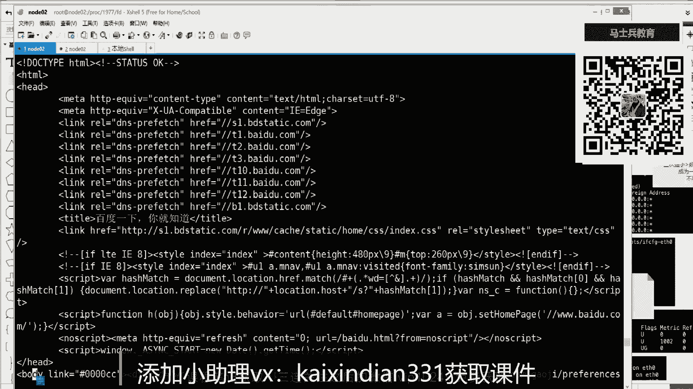

# 白嫖到马士兵教育价值23980的MCA架构师课程一次让你学够！ - P63：TCP合集：01，TCP,IP应用层协议原理 - Java视频学堂 - BV1Hy4y1t7Bo

我们先讲先讲课好吧，io是网络通信的，你nl要站在哪个层级去聊，想想聊io这事儿的话，你也可以找机要，之前讲专门讲过一个i o的课程，从b o到n l o到e poo。

多复用ni o站在操作系统的话是非主色，站在jdk的这个api里边，是新的io系统，啥录屏软件，这个就就就别来了，想看看码来看，没关系，二维码一会儿如果出现了，说这二维码加不上人了，我待会儿给你换码。

你们直接就说你说老师诶，这个二维码加不上了，你就告诉我就给你换一个二维码，二维码多了去了好吧，好吧不说没用了，我们开始讲课了，真的要开始讲课了，这时间就浪费了，别着急啊，我们学学东西就怕碎片化。

通过你们现在聊天也是你过来听一节课了，然后问的东西很多，就怕碎片化嗯，你学东西其实时间成本是有的，比如听一节课，我在这，如果东东说一嘴吸出一嘴的话，其实这节课你下课之后什么都没有，没有没有学到。

因为你不体系，我强调的知识要成体系，就是你要拿出两个小时的时间来学习，那你就踏踏实实两个小时的听一个人讲，也别东串西串的成体系，量了之后，你来评估这俩小时你是不是学到了一个比较完整的通透的。

从上到下的一个整体的一个东西，即便这个东西无非你感兴趣不感兴趣，但是只要有一个整体性的话，那么这个东西在你未来的学习的条件反射当中，就会起到相相相对比较重要的一环，就是知识要成体系。

而且它体系的东西要支持条件反射，条件反射的意思就是让你学别的东西学得更明白，认可多人来敲门，六，思路很重要啊，那么今天我们要成体系的学一个什么东西，一定要成体系的学，这个要学的东西就是tcp通信。

我们要把整个的网络通信的每一个环节走通啊，然后对socket要一个正确的认知，为什么，其实学他你为了条件反射，你未来要啃了一个非常重的一个骨头，面试必问的关于io这一块的。

尤其关于网络i o这个这个点是必问的啊，如果你要在学这个架构方面的层级的话，那么你肯定负载均衡，高并发等等，其实离和这个链接都是有一定的，就是这个网络网络通信链接是有一定的关系的，没错。

如果你想把nike学的很好的话，这个这节课也是必须要听的，这是这个重要程度，那么收那么回来进入主题，那么讲到网络通信的时候，有两个东西录屏了，有有录播，有录播，别慌啊。

第一个东西一个单词会叫做osi 7层参考模型，一个叫做tcp ip协议，那么其中三个模型是一个虚的东西，分了它只给你分出层次来了，并没有落地的这种开发成这个成品的东西出现。

那么tcp tcp ip协议是一个已经是协议级别的东西了，相应的内核软件啊，程序标准参数一大堆东西已经出现了，那么要研究的也是关于tcp ip协议站里边的啊，从这几它的划分层次也好。

然后它里边实现了相应的协议，具体的细节，那么在七层的时候，先说一下，有应用层，表示层，会话层，传输控制层，网络层，链路层，物理层，那么这是一个七层的一个东西，到tcb的时候就缩减了，就变成了应用层。

传输控制层，网络层，链路层和物理层，那么为什么要把它缩减一下，其实应用层到表示到绘画的话，这个其实都是我们应用程序要去做的，因为不同的功能的软件，你打游戏也好，你访问网页也好，你聊天也好。

其实他们里边就是在这个三个里边有区别，但是无论是你打游戏聊天，它下面的东西是比较趋向于稳定的，所以这两个层次又划分到两个空间里去了，一个空间是交给用户的程序，就是程序员去开发它。

完成这个应用层的一些协议的使用和这个逻辑的开发，另外一部分，无论你是你是什么软件，最终你们通信的时候都得牵扯到传输里边，我控制他怎么传输，然后网络当中怎么去寻址，联络当中怎么去传递的一个数据。

物理层以什么样的特征去把这个这个高低电平的东西，变成一个实际的信号发出去，下面的这些东西就就到内核层了，因为一个计算机有一个内核，但是上面会有不同类型的通信的程序。

这个划分层次又划分划分到应用层和内核两大层次，这个能听出来刷波一就是你要从高建瓴，从宏观一直往下看啊，然后我们会展开细节，先不展开太多的细节，从这两个层次分工来说，我们来演示一下，想给你秀一把。

演示一下，常用的举了一个例子，注意看啊，我们可以用一个指令eec，然后呢模拟一个什么场景，模拟一个这个百度通信，就和百度请求回一个页面，我现在是在一个linux操作系统里边。

然后执行了一个ec的一个指令，然后准备了一个八数字，八八后边大小于号，这个大小于号代表的是输入流和输出流，这个一定要跟着听啊，因为你要明白，其实在通信的时候，通信是双向的，有输入输入两个方向。

如果有点知识的话，然后你可以间接的条件在这推条件反射一下，比如说你在学习jdk的n i o，就是新的i o这个这个这个这个这个接口当中，你知道有一个东西的channel啊，channel就是通道。

channel的话，之前我们用java编程的话，你有输入流，输入流是分开的，是分开的，但是有了这个新的l o t之后，他把输入输流合成了一个东西，一个抽象的channel，这个channel既可以读。

也可以写，听同学来说，二不一是这个意思吧，就开始原先的时候明显对象把输入输出两个流分开了，但是现在的区域给它合并到一起了，这样的话其实一个china代表了一个socket，如果我多说一点的话。

就是一个china china代表一个socket，你只需要传递传递的一个channel，未来的读写他们是绑定的，因为就来自于这个客户端的读和写，八是什么，在java当中你可以用一个对象啊。

就代表一个channel，那现在在操作系统当中，我现在用用用用的命令行，他用了一个数字来代表了一个输入输出，两个流，你就理解成它代表了一个channel，这个channel指向了谁。

后面呢给出在操作系统一切接文件，比如说在dv设备目录下，同一个tcp的一个模块里边，你要给出的是3w点，百度点com，然后是八零端口，看上去这是一个文件的路径，其实这是操作性内核。

一切接文件它有几种文件类型，普通文件块文件，然后字符文件还有socket文件和管道文件，那么这个路径看似是一个pass，但是它其实内核会把它转成一个对百度80端口的一个tcp socket连接。

那么用了一个八就指向这个连接，从链接里边可以拿到输入流和输出流两个流，你就想成八就是一个channel，只不过现在我们用jdk没有扎过去写好吧，而且我这就是用一个操作系统，用一个指令来完成。

回来之后什么事情，还有这个网可能有问题啊，哎我今天这网的确有点卡，不管怎么样，回来之后啥事没发生，但是这个八就已经存在了，china已经开启了，那我怎么去用它，刚才这一步注意听是和百度建立的连接。

有了连接之后，有了socket之后，我们是要通过socket去和百度通信的，发送东西，读取东西，那这时候其实现在其实就属于用户层次，因为连接传输这块儿已通道已经建立好了。

那么应用程序我需要和别人去说什么话，那这时候每个层次都有协议，在应用层的协议当中有http协议，有ftp协议啊，有s s d协议，那么现在和百度如果请求回主页走的是htp协议，对不对。

哎那么hd p协议什么叫协议，什么叫http协议，其实协议就是约定双方我们说什么话，说什么语言，如果写信是以什么格式，是以什么文字，是以什么字体，字符串怎么封装，能理解什么意思吧。

那现在如果我现在和百度已经有链接了，我要给百度说什么，他还能听得懂，那就一定要说一个hb协议，a b协议，我先打印一下字符串，它的标准是怎么封装的，先打一个字符串。

这个字符串里边a b协议规定了请求头需要给出一个方法，比如说get空格，必须用空格分开，应该要做spa切割，然后给出一个ur i就是资源斜线根目录主页后边再用空格切割，然后他要给出。

因为h b协议协议有版本号，你要给出的是h ktp，比如一点或者1。1的一个协议，关键是a b协议还约定了，你必须在琴头的第一行后边要加上一个杠n换行符，因为整个一个请求头里边可能会有很多的头。

里面会有很多的行建设，对他是用先用换行符去切割出很多的token，在第一行里边还有用空格去切割出方法资源和协议版本号，这个能听出来说一回收的话，我们先诶人工就是有应用层嘛，有应用程序。

有人我可以组建一个字符串了，但是这个字符串是打印在本地了，我需要给百度发过去，而且发的时候这个斜线n啊，它是要变成一个换行符的，那么这个eq是打印，就跟csc点奥迪a一样，它可以接受加一个选项参数。

更e小写的意义就可以识别这个杠n杠n就识别出来了，这就符合现在就符合hb协议的文本的封装了，这个文本协议稳定之后，你要发给百度，那么echo打印的话就不能打印到屏幕，也要让它的标准输出。

一是标准输出重定向到八，这个八就是那个对百度那个channel那个文件描述符，这个八啊这个变量上，但是后面如果是个文件描述符，你死记硬背就必须要加一个and的符。

那也就是让echo的标准输出只传递给了同定向，到了八这个对百度的socket channel里边去回车加机，这个东西就发出去了，那么这个是符合ap协议的，百度应该可以正确解析它。

解析完之后就发现你要请的是这个主页，对不对，那你要请求主页的话，他找到主页之后会给我们返回主页的内容，返回主页内容，是不是我这个八就是channel了，它既有输入输出流，有输入流。

所以返回也是通过把这个channel回来的，那我只需要读取八是不是就可以了，可以用cat，然后标准输入来自于，哎等会儿来自于8号文件描述符，一会儿我给你解释这个and是什么意思啊。

这么长时间socket应该断应该断开了没错，先看结果，在第一回车，我往这慢，稍等一会儿，今天不知道为啥，找感觉啊，这些东西看不懂无所谓，我都会每天都给你解释，其实你要这最终的语义就可以了啊，这么慢。

八是什么意思，你就八想成是一个channel，这个ping的是pc，这个三层的网络层是通的，但是这边，来自于8号位的面孔io，它打印到八去了，channel通道，我这给你解释，我先把这个问题解决一下。

然后快速的走一遍这个过程啊，先去到plc，我先验证一点，今天这个网不网不好，到socket指向已经有了，我给它关掉啊，重新走一遍，第一遍是我要给百度建立一个连接，就用了八对着百度建立一个socket。

一如果都听的就是跟百度建立了一个tcb一个socket，这个socket的输入输出流就被八代表了，被八代表之后，然后我要对着这个socket里面去发送消息给百度，就是把这个起牛头通过八给发出去。

发给百度了，发给百度之后，然后通过百度这边读取走哎就回来了，刚才应该是断开连接，有点有点慢，往往问题，现在如果我操作的还算比较快的话，跟得上的话，没有超时的话，返回头是不是也要有hb协议，就是两者。

我现在linux和百度之间用的就是hb协议，我发的时候得符合hb协议的，头发出去回来的时候是不是我你百度也得跟我说g sb协议的，我这边才能才能读懂，对不对，那返回头的协议是不是也ap一点零。

然后200k就是状态，后边就是这个响应头里边的各种的建筑。

对这一定有一个换行符，一个换行符，下边是建筑队就想投了。

想投完事儿之后，注意听整个上面是响应头，响投的八数据结束之后，它必须有一个换换符，两个换行符，两个换行符结束之后才是你想要的数据data。

想的数据data其实就是给我返回的一个主页。

这个主页是一个html的一个文本群，里边儿问问足下，这边不完图不完图片。

图片你还得再单再去请求，那么返回的h html html里边它又分为害的头和巴黎体两部分。

好吧以上这个我给你总结一下吧。

因为刚才网的确有点问题啊，来咱们总结一下，我刚才做了一件什么事情，首先我使用了一个指令，有点卡，没事，我给你做总结的时候，一边来第一个事情我是触发了一个指令，在操作系统当中我没有装任何的浏览器。

什么chrome firefox，什么都没有装，我就用了一个e i c8 ，然后输入输出，然后指向了一个一个地址，一个pass，首先一个给你解释，这个地址代表什么意思。

这是在操作linux操作当中或者类unity当中，一切皆文件，一切皆文件，你看似它是一个文件的路径，对你看它是一个文件路径，但是它其实代表的是一个socket。

要通过一个tcp传这个三次握手之后建立的一个连接，我们可以去验证刚才八是不是已经这行已经执行过了，这个八在哪，你去到c d p r o c，然后两个dollar就代表的是当前这个解释程序。

解释程序的斜线，f d就是文件描述符，这个目录下就可以看到012和这个钢铁801指向了一个书，这个其他的设备，但是八指向的就是一个socket，所以我说通过ec 8通过这么一个路径文件路径。

但是他却用八指向了一个开启的socket，就是这个语义，这个能看懂，原来刷波一五，不管怎么样，你现在知道了八是不是指向了一个socket，这是第一步。

第二步你要知道socket里边是可以得到输入流和输出流，得到两个流的，你在java编程的时候是不是可以得到一个客户端的client，一个socket，然后在里边是不是可以可以得到输入流和输入两个流。

所以上面那个大小于号和这个八八是什么，八就是文件描述符，文件描述符也就是f d file descriptor，f d这个词汇死记硬背，它约等于我们java当中的变量，就是类似于java中的变量。

变量引用，你在jva当中肯定是用一个字符字符串的一个变量，引用了一个一个一个socket，然后可以在里边这个比如引用一个channel，可以right可read读，像操作系当中就用数字了，用八来指向了。

刚才我们准备这个socket，它是一个文件描述符，这个死记硬背就可以了啊，你可以理解成指针，然后再来看这个大小于号代表的是这个大小于号代表的是输入输出流。

也就是说我约束八指向呢是输入输出两个流的一个socket，整个的一个完整语句，后面那个，那么前面e x e c是什么意思，想听吗，给你扩展一下e s e是一个什么意思，就是现在我是没有装浏览器的。

这是给你扩展一下linux的一个知识，e c你可以用type e c看一眼，它是一个shell building的，什么是shell，就是外壳程序，有内核有外壳，我现在交互的这个软件是一个外壳程序。

ez是他一个是一个是要building的，share building是什么意思，就是它集成的，然后是集成的，你就可以用help来学习e a c，用help学e的时候，这个e c程序是一个什么意思。

e c的意思就是replace the shell，就是替换那个shell with，使用什么呀，the given command，语法当中你是要使用它，然后给出一个command。

但是它在中国号里边就是可给可不给，当你给出一个指令的时候，用这个指令替换当前这个shell，在这我给你画个图就非常好理解了啊，首先你要知道操作系当中，我们人和他是不是可以敲命令，你敲命令字符串交给谁了。

交给了一个软件，这是我用普通话，就是你敲的命令，比如ios也好，或者cd也好，这些个字你敲的字符串交给了谁，交给了一个软件，你要把这些指令交给一个软件，这个软件叫什么，它软件的种类有很多，有图形界面。

有命令行界面的这样的软件，他们统一有一个标识叫做外壳，像外壳，它是一个程序，是一个软件，然后这个软件根据刚才的描述，这个软件这个shell里边这个外壳里边这个程序里边标停了一个e a c。

也就是这个这是如果是一个软件，它里边有一个指令叫做e a c，就带了一个本地方法，这个软件有一个方法，这个你如果对这个vc软件调用那个方法，后边如果given command就给出了一个命令。

如果你给出了一个命令，这个在操作的命令就是程序，命令就是程序，比如说你给出了一个ios程序，那么ioi的程序其实是在磁盘的，跟着我思路走啊，就是如果在他的时候后面给出一个ios的，给出一个给出一个命令。

这个命令会替换，就是替换当前这个上这个程序就会覆盖当前这个这个这个外壳程序，那么什么叫做外壳程序，外壳程序它其实要和用户交互，它约等于起了一个死循环，就是一直在read read，等待用户的输入。

这是外壳程序的特征，像ios这个指令是一个什么指令，ios是操作当中显示目录的，类似于这个dos dr啊，显示一个一个一个目录的，它一定是你执行的一个命令，显示显示完显示完你的目录之后，它会有一个退出。

其实这个程序会被退出，所以先跟着我搜索啊，如果使用外壳程序里边的e i e c要给given command给出一个指令，这个指令会替换你这个进程，那这个伴随着这个程序替换之后，它会执行显示和退出。

那整个县城就会消亡到这步，能替我们来说不一，好吧，那什么意思，比如说呃崩溃，你先你先小小的崩溃一下，你要找的是最后这个醍醐灌顶或者特别high一点。

比如e s给你演示e i e c given command，给出一个ios，我当前这个程序是不是可以一直就，当前这个esc是归属于当前这个解释程序的，这解释程序可以一直接受我的，接受我的指令。

但是我告诉他ea你要执行你的e ac并不跑向ios看看效果啊，回车显示了目录内容，并断开了连接，这个连接断开了，为什么断开了呀，因为当前这个死循环接收命的那个程序，被你e这个e z后面给出这个程序。

这个command ios替换了ios，这个程序就跟我们写的加入程序，最后就结束了，主犯退出了，他会退出，退出的时候，因为他是替换了那个进程，所以整个这个技能就消失了，消失了之后，我们这连接都没有了。

到这儿能听同学再来再来刷波一，现在能感觉到这个点了吧，这并不是重点，这并不是重点，为什么，因为你要注意啊，我再重新连回来，连回来之后，你help e i e c的时候，注意它的低，in command。

command是一个中国号，在一般看linux命令的语法的时候，中号是可给可不给，为了把可可不给，也就是说我是不是可以执行ea不给出不given common了，不给不给的话，那么他说replace。

那就没有命令替换，那么这个程序就还是他自己，他还是比较喜欢等待，等待着你的输入就没有任何变化，这个能听同学来刷波六，也就是说我可以在我的命令当中，我就ec我就ec我就ec不给出命令，啥事都不发声。

对不对，哎这个如果能听懂之后，如果这个能听懂啊啊我可以给出，我可以不给出，给出去替换，不给出我就不给他，但是我可以做一件事情，刚才我做了一件什么事情，我后面给出了这样的一堆一堆一堆东西。

那么e s c没有给出命令，后边的东西不叫命令，但是后边那个叫什么，这是操作系统另外一个知识点，这个知识点叫做重定向，这个东西叫做重定将，大部分应该你只要用过linux都知道什么叫重定向，什么叫重定向。

比如ios本来显示当前目录内容，我可以按ios，然后让他的输出用大于号代表输出，重定向指向到一个a a。t i t的一个文件屏幕没有了。

但是重定向到a。t i t了，这个就叫所谓的重立项，但是如果你想对重定向有更深入的了解，我告诉你一个基本知识点，就说刚才那个八就开始挂钩了，就转回来了，任何的一个程序都有输入流。

如果你去细思极恐一件事情，如果一个程序没有留，没有对外界的任何的输入输出流，这个程序是有问题的，因为他跑完之后啥事你也不知道，他的数据计算结果也存不下来，你也不知道发生了什么事情，这个能听懂。

原来刷波一，是不是能听懂了哎那么这个程序比有输入流，那么留在我程序开发者已经写死了，比如这个程序就往文件你去写，但是注意了，操作系统给了我们一个界面，一个什么界面，比如你去到p r o c这个目录下。

就是根目录会有一个plc目录，这个目录当中很多数字代表的进程就是一切接文件，每个程序都会有一个目录来表示。

那么随便进一个进程，比如1355这个里面会有很多目录，它会有一个文件描述符的目录。

进到fd这里面就会有012，这个012代表什么意思。

就代表了我当前的这个程序，它的输入流，输出流和报错流三个最基本的流，任何程序有java当中也有，比如说system。in sim。out，sim。error，这叫做文件描述符。

如果你的一个程序打开了一个socket，那么就会出现一个，比如一个四，一个五指向了一个socket，这个文件描述会无限打开，能理解吧，那程序里边有i o i o在操作系统会用文件描述符被表示出来。

那这时候如果一个程序写死了，像文件写或向屏幕打印，那这辈子就像这个位置打印了，但是操作系统给了我们一些操作符，比如大于号和小于号，这个叫做重立项，可以让一个程序。

比如说ios ios其实也有0121是标准输出，你可以让他的注意听啊，可以让它标准输出一就是ios也有012，它也有标准输出，让他的一指向到一个文件，那么回车之后，虽然你ios曾经你写的是c。

二打印到屏幕，但是那个打印到屏幕那个东西其实是用e表示的，你又让e指向了一个文件，所以ios输出被重定向到了文件里去了，刚才我这个这个这个这个文件乱七八糟的文件名就知道这个文件了，好吧。

那这个知识点加起来之后，把两个支线加起来，就是操作当中我可以用e s e来替换命令，这个当前进程我又不替换它，但是我会在他后边给出什么呀，给出重定向的绑定，就让我当前的程序的多了一个8号文件面符。

输入输出多一个八，然后让它输入输出指向到一个dv t c p，然后3w点百度，然后我就简写了一个八零，那么现在这行语法你就明白了，哎这行远程用了一个ez，又没有given common，没有给出命令。

所以当前技能不会被替换，只不过让当前这个shell程序多了一个文件描述符八来输入，输出指向了一个socket，就是这句话最终能听同学来刷波六，所以你看啊，如果cd到p r o c。

你先看打印echo两个dollar代表的是当前我这个解释程序回车，当天解程序叫做2640，续到p r o c下边的2640的目录当中，然后再去他有一个f d，去掉f d，任何程序都有零一样。

目前我这个外壳程序有零有一有二有三个，然后这时候我再加一个指令，就看当前程序只有012，然后我给出e i e c，然后指向上一个八，指向输入，输出到d e v t c e p3 w点，百度点com。

然后八零回车之后有点慢，大哥快点有了，有了之后是不是多了一个八，而我这个不用管它是不是多了一个八八，是不是整了一个socket了，也就是说通过巧妙的a c我不让你替换程序，但是我要执行你一下。

为什么我要给出绑定的行为，让当前程序绑定到了一个对百度的一个新的链接发上，好吧，那这个绑定之后再往下走，当绑定完之后，刚才我做了一件什么事情，我是不是用了echo刚毅。

然后后面接了一个get是ap的方法，对不对，然后后面给出协议，巴拉巴，这我就不给你演示了，这个协议输出的时候。

关键是看我刚才我在这给你记笔记啊，就前面那部分有了之后，下一部分是什么e i e c，不是这个echo杠e，我要让大写的get斜线，然后http一点零这个协议杠n，然后注意看echo也是个程序。

它也有标准输出一指向了，是不是给八打回去就可以了，听懂来刷波六，就是你现在刚才看我已经有一个八了，八已经指认socket了，我现在是不是需要把一个hp协议的头通过这个八。

这个socket 8你可以不用记，你只需要记住它，只能sl，我给通过sl打出去就可以了，现在抑制了一，就是这ex的标准输出指向了一个八分成一样，但是注意了后边是文件描述符，如果后边是文件描述符。

你知道加一个and就是大于号，大于号是输出中项到文件，然后大于and是到一个另外一个文件描述符，就这么一个死死记硬背的一个语法，就pg就发出去了，发出去之后，刚才我就说了，八其实是一个完全面符。

它是一个双向的一个流程上的一个socket，我弄i发，我通过八这个socket输入流能读，所以后面我做了一件什么事情，是不是用cat这个指令，cat也是个程序，是程序就有012。

我刚才是不是用它的标准输入零来自于后面放一个文件描述符，谁八就读到了百度的主页，现在刚才我的所有操作都能看懂，同学现在你真的明白了，就刷一波，cat是读取文件用的啊。

那么整个走的过程当中就用了一个简单的命令替换，绑定一个新的文件，描述到socket，socket是输入，输代表两个流，它类似于我们java中的china，类似于一个channel一个通道。

这个通道有输入流，输出流，然后呢我对着这个输出这个通道里面即发送又读取，利用的是重定向的第一个相关的知识就读到了，那么这些注意听为什么讲它，因为我我刚开始跟你说了，在通信的过程中，有用户同要做的事情。

有内核层做的要做的事情，那么把刚才这个整个操作，你去想想这两层我是在哪层操作的，首先在用户空间那一层，我做了一件什么事情，这些东西其实都来自于用户先做的事情，我对内核层其实就是这个八。

他是要触发一个socket这个过程，当中是内核帮我们建立了一个socket，但是剩下的我无论是组织协议还是读取，这都是用空间做的事情，用用空间才会关注http协议，就是找个协议的感觉啊。

就是虽然大家都说用户也能怎么着，然后用用户有什么协议，你能找到用户空间是要忙着完成hp协议的，什么叫tp协议，就是有标准，那之前怎么通信的，其实你只需要给出了我想跟谁想跟谁通信。

用空间的应用层协议也会调用内核里边的所有传输的环节，这两个是分开的，我想让你get到的，先get到这两个层次的分工对吧，这个分工完事之后，那用层的话就是我们程序里边代码，你你要发什么，你要读什么。

你要怎么做，剩下的事情，其实面试面的更多的就是哎那下面这些层次完成了什么事情，现在开始梳理整个内核里边那个传输控制能往下走的事情，那么这整个这个我的目的能能能get到我来刷波，一就是你你听我的课要忍。

你别看我前面做这些事情没有没有意义，但是一个完整性，一个体系有了之后，我举的例子我都给你讲明白他是怎么回事，你就忍耐一点，听完之后你知道哦，原来是这么回事，你会通通透，对不对，太慢了，老师没有办法。

因为这个并不是给一个人讲课，我给大部分人讲课，我需要把这个整个体系建立起来，那这个层次你要觉得简单的话，你就往后听，后面难的好吧，前面这个层次通了之后，那在这你要注意一下，软件是工程学，它是分层的啊。

这是分层的应用层，其实他没有写什么，我要跟谁去建立连接，你代码根本没有写，写了这么一行，给出了地址和域名和地址和端口号，那么所有的行为是透穿到内核内核层去做了，这个就是层分层，就是软件工程学解耦用的啊。

我任何的程序员啊，那么连接的事就掉内核层，等于你的浏览器在这堵塞住了浏览器，如果你给了一个地址吧，g回车，浏览器先别动，那先调内核去建立所谓的传输控制，建立连接，那么往下走一层就到了传输控制层。

每个层都有协议，在应用层，刚才说了rtp啊。