# 白嫖到马士兵教育价值23980的MCA架构师课程一次让你学够！ - P64：TCP合集：02,TCP,IP传输控制层原理 - Java视频学堂 - BV1Hy4y1t7Bo

SD那传输控制层有什么协议？每层咱们一个来解释，在传输控制层。传输控制层有哪些协议？常见的，比如说我们的UDP协议和TCP协议这两个协议。UTP不讲，我们只说啊TCP把TCP和s的讲明白。

他们到底是啥就可以了。而且它为什么叫做传输这里边还有一个词叫做控制。其实传输会让你误解。因为你可能发现这个传输这事是不是就已经由这个传输控制层决定了，但是传输不是重不是重点，重点的事控制这两个词汇。

也就是TCP里边在控制什么东西，它在控制哪些包是不是会有一些控制包和确认包等等这个这个概念。那么在传输控层之这个进造这个层当中，我们只聊TCB如果你出去面试，面试官问你什么是TCB协议，你要怎么回答？

一步退档。什么是TCP？文件描书可以是8，可以是9，可以223311555都可以。那文件描书只是个数字啊。一旦你去面试的时候，问到你什么是传输共程层的TCB协议啊。

然后你要告诉他这个协议有两句话必须说出来，一个是面向连接的。一个是可靠的传输。协议这两句话注意听这两句话一定要说出来。那这时候首先有一个词就放到你眼眼睛里边了。什么叫做连接连接是物理的吗？

就是你的电脑上面插了根网线，物理的连接到了百度上，你俩这靠着个网线个通信了，这看似简单，但是却不是这么回事，这个连接应该是一个虚无的那连接到底是什么意思？往下推导啊，知识往下推导的。想讲清楚连接。

你就必须要去聊一件事情，叫做TCP的三次握手。这之日其实他这个有人说三次握手就独立回答，不不要独立回答。你的三次握手的回答，一定要和TCP的面件连接这事儿挂上钩。四次是分手。那么什么叫做三次握手。

能跟着那个节奏吧？就是你你要在大脑里梳理这个逻辑关系啊，就是所有的知识点，它不是碎片的，它之间一定会有某种因果关系。你要想讲清楚什么是TCB你要说面向连接，什么是面向连接，就要聊三次握手。

因为最终三次握手我会告诉你那个连接它是虚的还是物理的。那么什么是三次握手？那这时候你要给他解释了。如果我有一个客户端，然后呢有一个服务端。有一个服务端。那么客户端如果想和服务端建立连接的话。

第一件事情客户端会发出一个包，这个包是谁创建，谁发出的，就是由我们传输控制层。他去创建了一个第一个包，从那台机子里边啪发出去了，往下走啊，发出去发出去之后到到达你另外一台服务端，服务端会收到它。

收到之后，我们一般管这个包叫SYN。s net就是想跟你同步，想跟你建立握手。发了之后，服务端一旦收到了这个数据包之后，会给客户端返回一个数据包。就基于这个收到的包，返回一个包。

这个包一般就叫做SYN加ACK。ACK这个包就是acknowledge。哎，我知道了，我知道你这个包了。那这个时候注意听什么了三次一次了，两次了，第三次是客户端再给服务端回单独回送1个ACK呃。

我也知道你回来这个事儿了，为什么是三次。还是强调IO尤其set的IO通信是双向的，站在客户端有输出，有输入。那么其实前面两步客户端已经明确了，我到服务端能去，而且他能基于我去的给我返回。

那我的输入输出是通的，但是站在服务端，我能收到别人给我发来的，那么客户端面向我的输入是通的。但是我给他虽然回了一个数据包。但是这个数据包对方有没有收到呢，他不知道的，他必须要再等一个确认。这样的话。

双方才能确定自己的各自的输入输出是通的。所以他要经历这么三次，就是为什么握手需要三次听懂同学来刷波一。UDP的话，它就没有这个确认的机制了，就是我就发了，你爱收入搜着收不着。😡，好吧。

那这个三次能想明白之后，注意听，当三次握手建立完事之后，才会你的这个传输控制层。比如这三次都有了之后，开辟资源内核里边的结构体，这个内存的对象的开辟和给你的客户端应用层程序返回这个连接通了。

会有资源的开辟在两端。这句话很重要，有资源的开辟。一会我会让你看到在内核里边也会有相应资源的这个表示和映射。因为一会儿要聊sockcket的，就是双方必须有资源的开辟，代表为对方服务。

就是完成自己的后续的输出和对方。如果发来数据包的话，我有资源接你这个包，后续的一个包。那么双方资源的开辟这个都开起来了，这个连接就有了。如果一方把这个资源不小心丢掉了，你在发出据包那边就没有资源接收。

这个连接就等于是连不上了。就像我现在跟你说话，你咱们网不好，我也看不到你刷一刷6，那这时候我就慌了。所以双方开辟资源就是经过三次握手。双方开辟了服务资源之后，这个所谓的连接就有了。这就是面向所谓的连接。

连接不是物理的，是开辟的资源对称，听不回来刷二波6。happy资源包括哪些？一会儿一会儿我带你慢慢看，一会儿带你慢慢看。然后面向连接连接有了之后，下面还有一句话叫做可靠的传输。那么它什么叫做可靠的传输？

其实已经代替出来了。也就是说一方发送的数据包，这包到底到没到你那儿，它必须要等于acknowledge要等确认这件事情，就是我发的，你得给我AACK我发的你得给我ACK确认机制是它可靠传输的支撑。

三次握手啊三次握手带来了带来了这个这个连连接，然后。确认机制，保证了可靠的传输。好吧，那么这是当这步你经听懂之后，三次握手连接这件事你听明白了。那这时候再来往下思考啊，总结总结一下，总结出来之后。

也就是说两个端点客户端和服务端，两个端点间想通信的话，整体的流程是必须先建立三次握手。然后三次 word之后才会有一个数据传输的后续。因为三次握手之后，双方的资源建立完之后，双方资源开辟好了。

然后你的应用层才会传输数据，说我的请求头给我发出去，然后给个确认，然后这边把响响响响应体再发回来。哎，我再接收到，那就是数据传输是一定要在三次word手之后的。三次握手是四层内核完成的。

数据传输是端到端七层应用完成的。啊，这个概念也要梳理出来，这个概念有了之后，那么还有一个除了无握手有数据传输，最后肯定要牵扯到一个关闭，还有一个四字分手。这连接不要了，我要关掉他一个4次。分手。

那他为什么有一个四次分手？在这儿先不说四次分手，在这儿其实在传输控制层这里面就在内核层对传输控层这个这个东西啊，它封装出了一个词汇。这个知识继续聊啊，就是你要先聊出三次过程。

什么是它什么是这个TCB面连接可靠传输。再往下聊的话，其实还有一个东西就是在传输控制层里边。向你的内核向外暴露了一个新的一个词汇，这个词汇叫socket。很多人就是哎我只知道socket。

我听不说过sockit，那socket到带到底是什么意思？把这个事儿是不是得学明白了？我到时候都会会以给你带你抓包去看啊，先跟着我的思路走，不是channel嘛？channel是你JDK抽象出来的。

在计算机当中，在操作当中是给了socketsocket可 do可写。在传统的我们这个GTK当中，哎，它scket有了之后，它可以拿到两个对象独立的输入出对象和输入对象。但是在JTK1。7之后。

它有一个NIO就是new新的IO体系。它用了一个channel来代表了这个scket，你就再也不需要得到所谓的独立的输入输入流，你对着个channel可都可写了。就像刚才我对着那个8可都可写一样。

其实回归又还原回来了。因为这样在你的所有的线程方法传递的当中，你传递一个channel，这个对象里就包含了scket的输入输入两这个两两个方向的流，就是都说了，听懂听听不懂无所谓。

你先弄明白什么cket好吧。因为这两个层次，一个是IO层次，一个是这个这个这个这个内核层次，就通信层次，网络和IO是两两两两回事儿。首先啥是scket的，刷一下，哎，刚才说了，也是套接字，对不对？

那这个套接字只是一个中文解释，这个套套什么东西，谁套谁。你对骚费者要怎么去理解？😡，插座啊，这是马老师一般会说它是一个插座啊，是谁插上谁了，对不对？那s给的是套接字。那我先告诉你结果套接字怎么去记它。

你就这么去记，它是成对出现的IP。Port。然后再只剩一端的IP加上portt。那么它可见不可见，在操作系统里边能能看到它这样的一个指令。

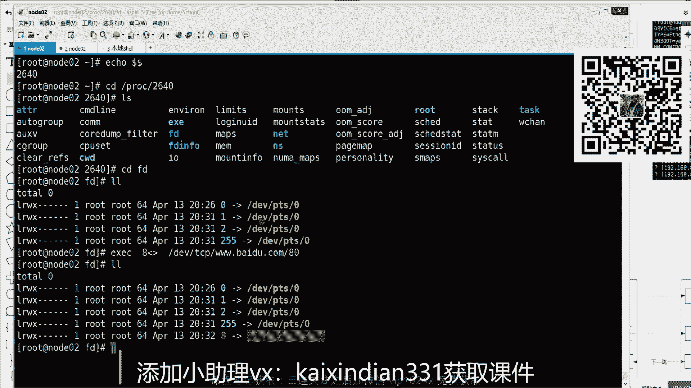

用net state。杠NATP。

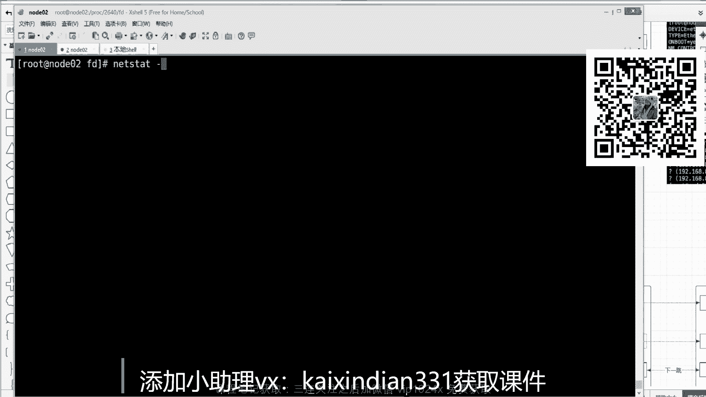

这个是网络状态，然后显示所有的TCB关于关于TCB协议的，然后打印出是哪些进程开启了使用这个连接，所谓的连接，所谓scket。那么这个表格当中哎，比如说有TCB协议啊，这个发送的合集序列号不用管。

关键看后边有一个本地的IP加端口号，有一个对端的IP加端口号。然后呢有相应的这个sty的状态，有listen状态和联通状态，未来可能还有断开等待状态等等的。好吧。

那这里面是哪些进程在使用了这个所谓scket。我们分析一个东西啊，首先看有一个listen，这有一个这有一个进程叫做SSHD这个进程，它的进程I号是1010，它这个进程起来之后，它list了。

就是服务端只有服务端百度om来之后也是状态。它百度比如80或者8080SSSD远程连接的话，它就是22端口，所以它在本地监听了22监听8080，必然有一个监听的状态。这是第一步有一个监听。

就是服务端刚起来。如果一个客户端起来之后，跟他要做三次握手完成一个所谓的连接，得到一个scket就是这时候看下边，比如这有一个SSHHD有一个新的2451，这是另外一个进程。但是这时候注意了。

是本地的一个IP端口号就是本地的logo的也是22端口和你的客户端1个10。1，它的一个随机端口号，这就是IP端口号IP端口号组建了一个。套接字一个socket。

这个socket完美的代表了这一个客户端连接。为什么你会发现下边你注意看一个特征，下边还有另外一个进程，也是也是SHD是2638。它的服务端本地的IP地址登录号和刚才那个连接一样。

就这两个s的服务端logo的都是一模一样的。看客户端的IP地址长得一模一样。但是套接字里边一定会有一个维度能够区分这个连接和别人两个连接是可以区分开的。先找到scket啊，它完全可以独立代表某一对连接。

这一对连接必须有4个维度IPportipport缺一不可。你说我如果就看这个，对我就我我就说IPpo就代表scket了。你看这俩是不是一个scket，你区分区分出来，他发来的，你还给他发或者给他回吗？

是不是区分不出来了。所以sockcket什么叫套接字，俩得套上成对套套起来，一定是IPportipport。不我都给你讲到了，什么是随机断号，什么段号都给你讲，而且断号都这是数量关系。

到这步能听的同学来刷一波一。😡，s的套接字一定是IPpoip的这个套全套上的啊，而且它是绝对唯一独独立能能代代表的。

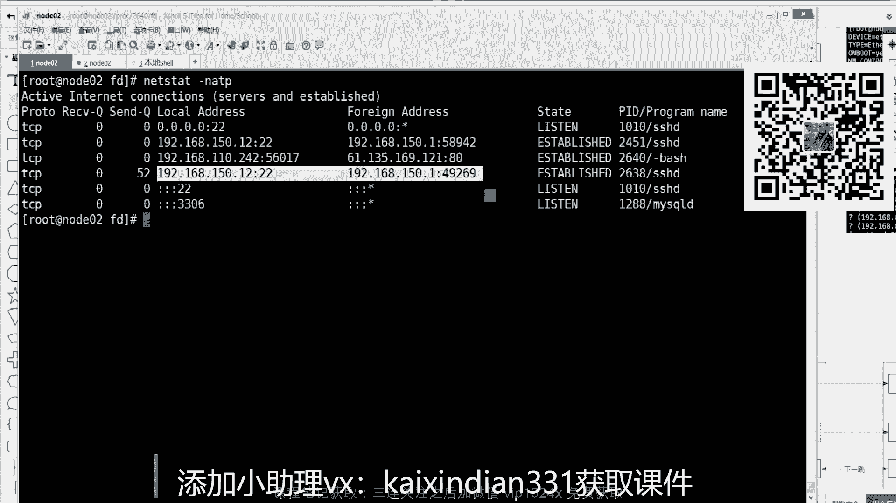

当这个知点你能接住之后，我们再来思考，刚才又带出了一个词汇，就是词汇都是慢慢慢慢带出来，它是知识成体系的。刚才在IP portIP port里边出现了两个词汇，一个是IP先简单说一下。

一个是IP一个是port的端口号。IP是起到什么效果的？IP是互联网的中种主机定位用的，就是你通过IP可以定位到主机。能理解什么意思啊？就是通过1个IP可以找到一个主机。然后这个时候可以通过端口号。

它为什么一个泡？这个端口号可以找到谁？你先通过IP找到主机，从主机里边可能会有很多的进程。你要跟哪个进程通信数据包交给谁，是通过端口号来代表你的进程。或者是县城。哎，找到那个应用程序。

最终你要明白端到端是程序与程序之间想通信，对不对？哎，最终是要命中这个程序的。那么在这里面端众号里边，根据刚才套一次app or a port的还分为两类，一类是服务端。注意各着听啊，一类是服务端。

服务端，它需要比如刚才1个22或者是8080。服务端只需要开辟占用一个端口号，你的百度服务器它就占用了1个80。然后你的客户端。服务端是明确要占用的。服务端是明确要占用的。服务端是明确要在这个操作5。

我这个我这个进程就占22，就占8080或者就占80了，这是服务端。那么客户端什么什么特征？😡，把自己音音放大点啊。客户端是随机的。随机的申请断口号啊，那这个端口号的取值范围是多少？

先告诉我断号的取值范围多少。有一个一个操作系统可以申请申请到占用多少个账号哎，65535个。就是0到6535。这些都是你们曾经听到的知识，这些知识我觉得应该都是常试能听懂。那么现在我开始出面试题。

下边出面试题了。如果说有一个百度百度的IP注意IPA。IPA是百度，它的端网号是80。那么注意听啊，这是一道面试题啊。如果你有一个客户端注意听，如果你有一个客户端成客户端，这个客户端的IP是B。

客户端的IP是B。那么这个客户端当中，这个IP可以对着百度一共建立多少个连接？就是他们之间可以建立多少个连接？你就是通俗来说通俗来说，大概一个数就是6535，对不对？

那假设你这台IPB上已经对着这个IPA有6535连接这个这个每一个连接啊，就是你这个这台主机里边的每一个程序，每一个程序每一个线程发几个连接连它了。那么实习生的一个端口号，那么消耗了6535个。

那么这时候如果又多了1个IPC注意听又多了1个IPC的。比如说腾讯腾讯的主机，它是IPC也是8个根口号。那么请问IPB还能够对着它发起连接嘛？还能不能。就是你前边这台主机已经对着百度已经用6535个了。

那现在对着腾讯还能不能？可以还是不可以。你看答案就不一样了，你要真正理解什么是sockcket，什么是套接字，套接字是4个维度的是IPpoIP port不要只看其中一半。

那这时候其实IP port的IPB加上一个端口号，对IP的80，那有6535种可能。其实IPB对着IPC依然有6535个可连。也就是IPB到IPA。可以使用你这系统的65565535个登录号。

然后另外1个IPB到你的IP。C依然有65535个连接，可以创建登众号可以分配。你不要认为端个号重了。你说哎这个对百度我申请了一个8号8号一个C登号，那我对腾讯就不能再申请申请8了，不是的。

明白我什么意思吗？就是这台主机里边可以有两个8号登录号，给了一个什么呀？IPP到A的，一个给到IPB到C的。因为是IPP的IIIP端号IP登录号，这是4个承对出现的。没错，整个只要这个维度是唯一确认。

别人没有使用就可以创建出来。唯一K。到现在解惑能听的同学来上2边6。你说你怎么重复，你这边IP到C了，那边IP到A，你登号随便给他俩重复不了，因为会受那个IPC和IP来区分出来，对不对？

只有在一对的IPAB里边，你不能说IP8号到AIP8号到A，你该该创建这么两个，这两个是创建不出来的。哎，这是第一个维度。第21个维度。刚才你看有有同学问了，说那如果我呃这是客户端，这这块能想明白了。

对不对？那么请问在你的这个服务端端口号的消耗，比如这你现在这台主机相同的BIP里边，对A对对百度有653个连接，对腾讯有653个连接，那么请问服务器里边消耗多少个端口号？就拿A来说。

这个台服务器会有6万多个连接连它，它会消耗多少个多口号。没错，只消耗了80，它只消耗了80的一个。为什么？因为它是IP80，但是每个过来的人会带着它不同的IP的不同端口号。他会有一个。

就这张表能映射出来，在内核里边你是能够现在就是他看测有内核嘛，是能够看到他们这个映射关系的。虽然我本地的我都是只只开了1个22，但是你来了一个链接。这个整个说一遍，比如说现在如果下边这几行没有。

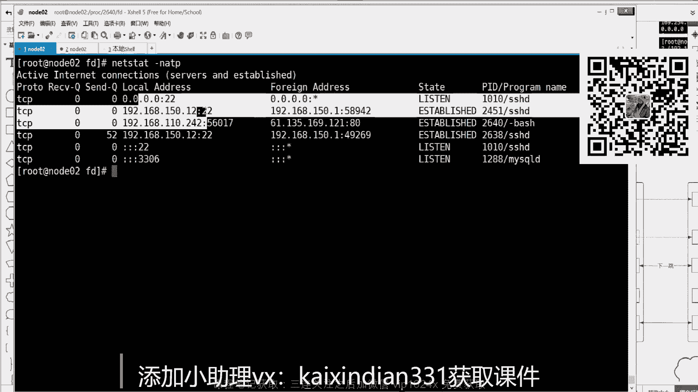

先不看它进台服务器起来之后，只有一个leaen的状态。那么这个客户端如果带着握手的包过来了，带着这个顿号，把握手的包过来了。那三次握手跟先跟他去走通，走通之后，咣当开辟资源fo进程。

或者java里边就抛出线程去了，一个线程或者一个进程就持有了这个sockcket。为它怎么持有这个scket。注意听sockcket是不是可以映射成文件描述符一个81个IO对象。

那这个进程只要来回读写八就一定只和这个客户端通信，它就不会和别人通信了。因为在程序的视野里边，我有一个流叫8，这个八其实代表的是一个sockcketscket是IPport加IPport。

是一个稳定的一个独立连接。所以我程序这个2451，只要对着八玩命的读写，就只能在我这个客户端的通信里边通道里边是不能刷到别人的，听懂同学来刷2波6。

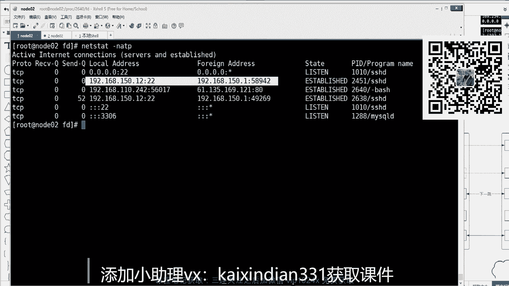

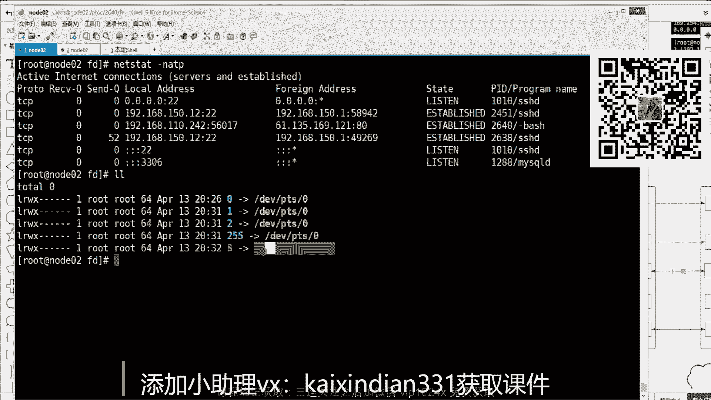

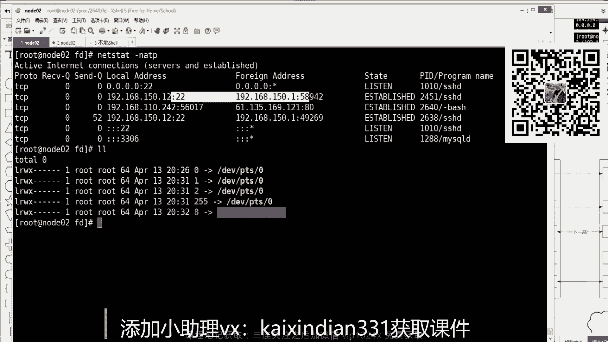

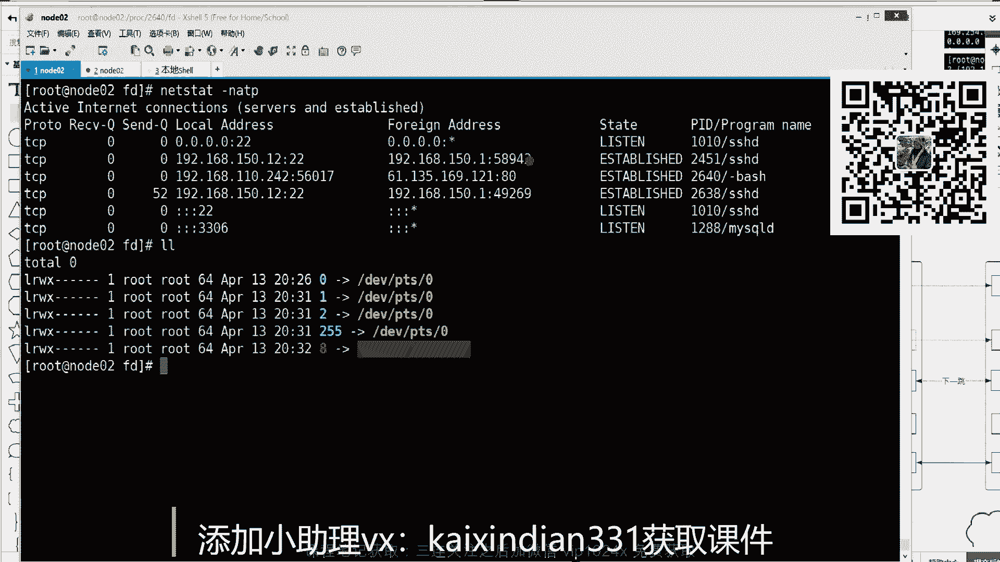

多层映射唯一路径。现在你还觉得我开始讲那么多伏笔，讲那么我开始跑埋了那么多伏笔是没有意义吗？一定是有意义，对不对？你看这个。🤧PWB只看到我当天那个外壳程序的个FD啊。

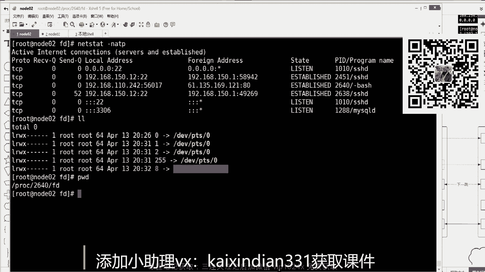

好吧，收现在你应该对什么是传输控制层TCP3次握手，然后什么是这个socket以及sockcket的各种组合情况，以及服务端。其实它只需要一个端口占用。来了之后。

根据scket唯一映射sockcket在这我给你多写出来啊，sockcket其实会socket。现在你知道scksocket就是IPport加IPportsocket会在操ing的内容当中映射到1个FD文件标符一个数字。

啊，一个数字这个数字其实会交给通过for的时候，会交给某一个进程，绑定起来一个实际的一个worker进程。啊，那一个进程里边持有哪个数字，那对着一个数字读写文件边如读写，就一定会符合这个scket。

另外一个scket一定会复合或者是克隆出进程或线程，就使用另外一个工作的进程或线程去持有另外一个scket，他们是清晰独立的，对不对？那这是第一版本，后边还会说可不可以多个scket对应一个。

这就是排抛出一个问题啊，就是多个socket。对应一个进程，就是你现在现在你看啊现在你看的是一个socket，对应了1个2451，1个sockcket，对应了1个2638。

那多个socket可不可以对应一个县程或一个进程，可以还是不可以？

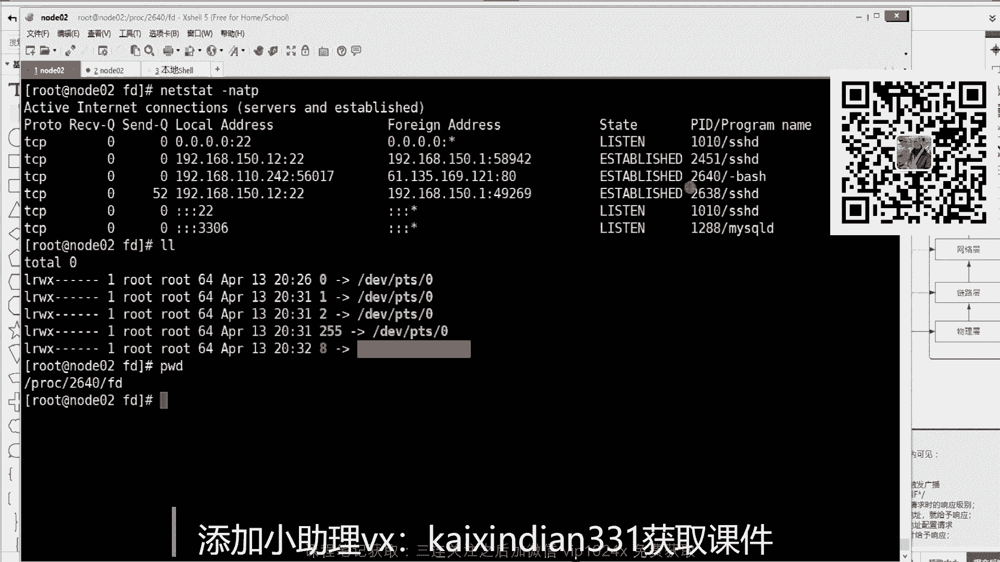

可以，那这个知识点不在当今天的课来讲，这个东西就叫做什么呀？多路复用器。也就是slaide或者epo了。这是在我专门讲IO的课里边，这个知识体系又搭上边又串起来了。你能说学通信和IO没关系吗？

你看到这儿，其实这是曾经最传统的什么呀？每县程或每进程对应一个连接。但是现在的通信这样太浪费资源了，一定会使用多路复用器，一个进程，一个线程对应多个客户端，谁有了，我就跟谁跟谁通信。

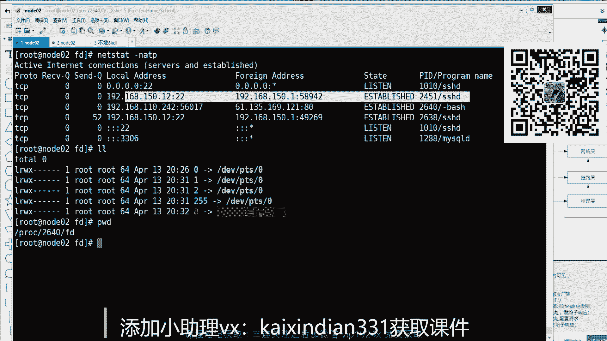

这些东西都能大上边都能连起来，就支点一直串一直串一直串。因为现在我再给你讲的就是什么呀？传输控制层和应用层这个界面上内核在这个界面上会包包装各种的多路复用器，side pull一碰。西不哎，屌不屌？

好收。只是支持多个连接，想时间就变长了吧啊，这个这个问题没读懂啊，先跟着我的思路走吧。我为什么讲这块知识，就是把知识传完之后啊，你只有登录号了。其实我们要讲四字分手，为什么资源总是有枯竭的时候。

比如说就拿着这台机子，我对着百度还真就不是想发起6万多个，我想发起更多的连接，那其实其实前面一个链接连完之后，我已经请回主页之后，然后这个连接我可能不用了。比如说你想对着百度开启10万个标签页。

你想对着百度开启10万个标签页，你是开不起的，你只能开启6万多个。那前面这个标签页我已经请求完页面了，我在那个标签页就对着百度查别的东西能能能不能行，可以可以的。是不是可以。

你只要让前面那个标签页把这个连接断开了，顿号还回来。我这边再拿着新的号，我再连一次，再去取去请求请求回一次。展示完之后再还回给系统，所以断开是一定会。存在的那断开为什么是4次分手，就要聊这件事情了。

那么断三次握手是为了双方开辟资源抛出现城响应对方。这个就就是所谓的一个连接。这个如果听懂，你才能真正理解分手为什么是4次。因为四次分手要代表着释放资源。但是注意听释放资源不能单方面释放。

我光当我说释放就释放了。那这时候人家还想给你传东西，这边就没有响应了。所以资源三次握手好容易建起释放资源要同时释放，大家预定好都不发送数据，都不接受数据了。没用了，咱们咱们咱们得连接。

这个时候是不是才可以释放。定夺来烧边一。所以4次分手是怎么分手的？这里面就有一个大家伙都得同意离婚这件事情，不是说你单方单方面想离婚。想离就能离对不对。是不是这个意思？

所以四次分手是一个大概一个什么过程？客户端说我想和你断开。FN断开final里结束，或者是这个finish结束了。我想和你断开数据包发出去了，再加上可靠图传输。这个时候其实服务端并它会回送一个什么呀？

服务端会根据你这个收到这个哎，我会我会回一个。基于FN的一个。ACK acknowledgeled就是我知道了，然后知道之后，但是这个时候他并不代表说我也想分手。我只是告诉你，你发的包我收到了。

这时候取决于服务端。服务端如果发现咱们之间真的没有啥事可办了，再发送一个服务端还要发送一个什么呀FN我也想finish断开这一个连接了。那发出去之后，客户端说好的，我也知道你的一个数据包了。

ACK只是确认数据包不代表任何的意思意思必须要主动说出来，你想跟我那啥嘛，你就主动说出来嘛，你想要你就说嘛，你想要你就说嘛，你想分你想分就说嘛，所以1234。这是一个通用的一个知识点。

分手是要经历4次的。听懂来刷波一，那这些过程我先给你简单抓个包演示一下，再重新说一遍，一边演示一边说好不好？啊，你从实物当中去看，我们开始抓包。

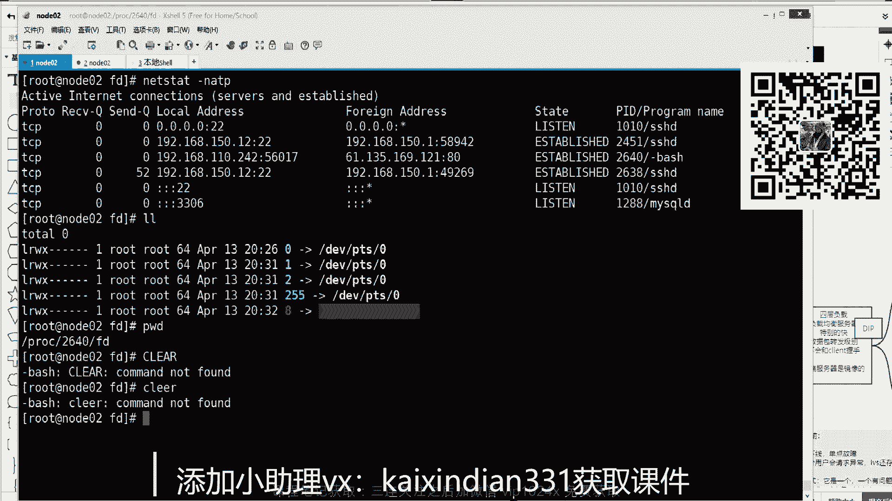

加包的时候，我们这样来做啊。需要抓包的话，是需要一个程序的一个小命令，这个令命令叫做TCP。dump这是一个抓包程序。这个没有的话，你AP get或者y么去inst装一下，装完之后啊。

注意后边写参数杠NN是未来抓到的所有数据包里边的那个IP呀，端口号啊，全都变成数值显示，然后呢，杠I你要抓的是哪个接口，比如我抓一个ATT值0，通过值0可以访问我的外网。

这是一个端口interface接口的名称，你要抓谁抓数据包里边是80端口号的。因为我要通过访问百度的。整个请求页面的过程。把所有包抓下来，看是不是和百度有三次握手，是不是有中间的数据传输。

是不是有4次分手。跟我讲的这个理论是不是对得上，这是一个抓包的过程。好吧，然后前面怎么去抓，我先给你演示一下，怎么抓包啊，可以通过Cl这个命令CURL后边给出3W点百度。

其实这个小程序就完全可以取请求回主页了。但是今天这个网怎么这么慢呢？你看主页是不是请求回来了，只不过这个编码我改一下，因为现在不是UTF杠8换一下编码。UTF杠8。重请求一下，是不是百度一下。

你就知道这请求回来了。然后这边我也改一下。

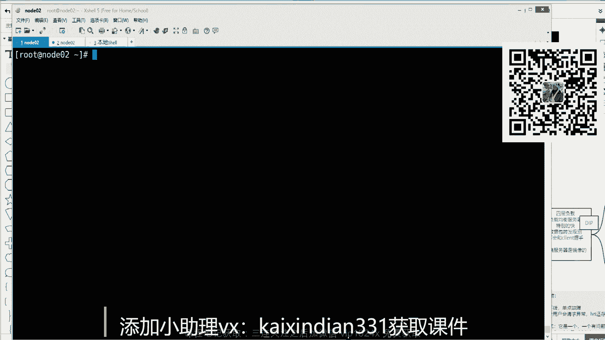

UTF杠8。

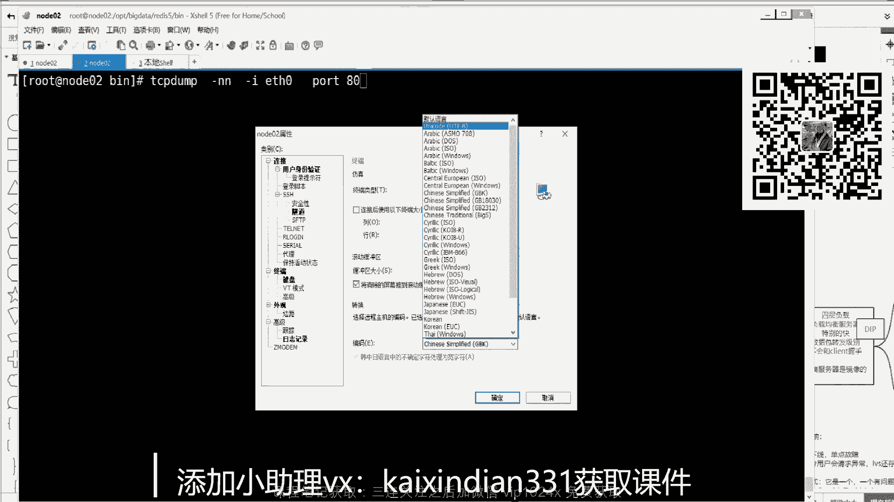

两件事情我有两个窗口，一个窗口我会打开监听抓包回车。那么现在看listing on ethernet0号网卡。

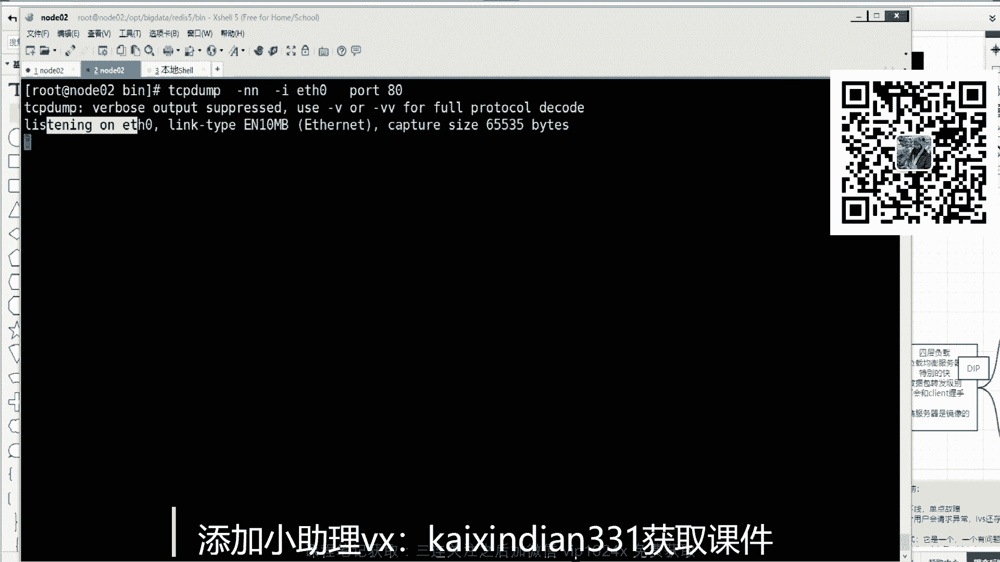

这个是开始监听了，另外一边我会实际的触发去访问cl这个命令。cl其实基本不用装，系统都带访问百度，注意看走。

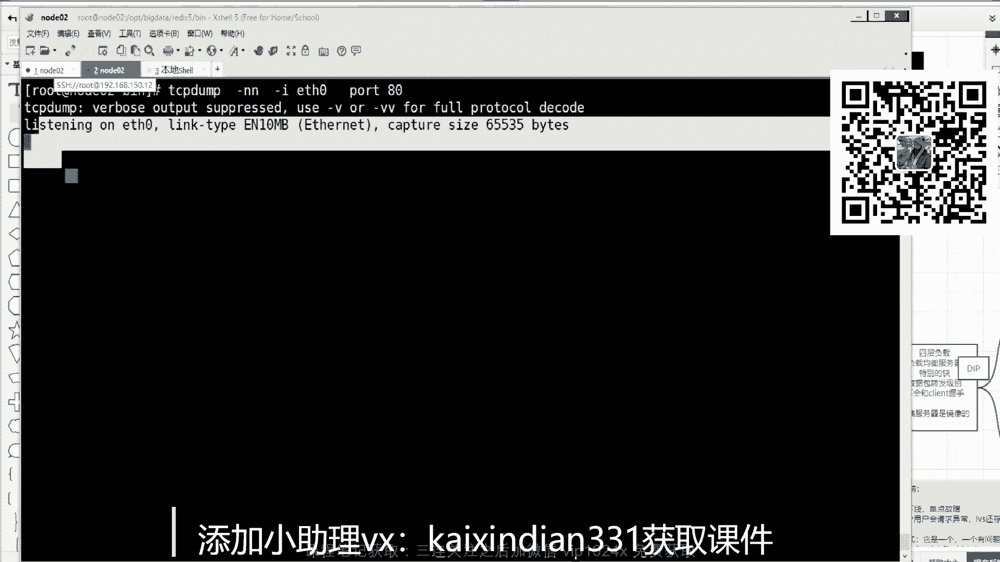

跑通了，但是没有抓到，为什么？我告诉你为什么呀？因为我这里面有2块网卡，一块网卡是ET0，是我的150。12本地的，一块是ETH1，这是走nice的，一个是ETH1，他走的10。242走的我的物理网络。

它有2块网卡，刚才是通过ET1走出去了。

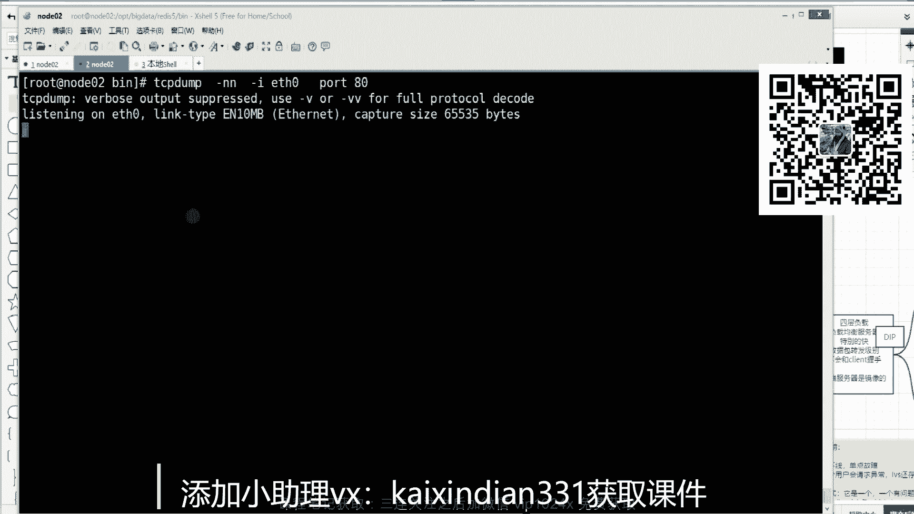

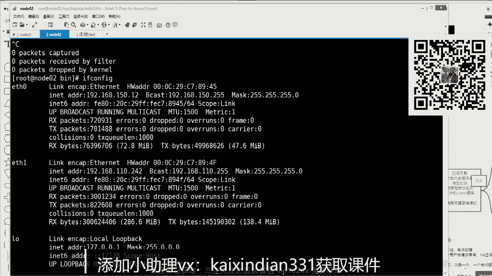

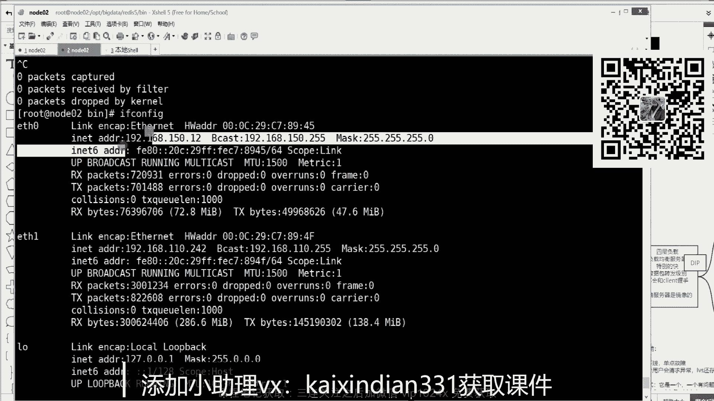

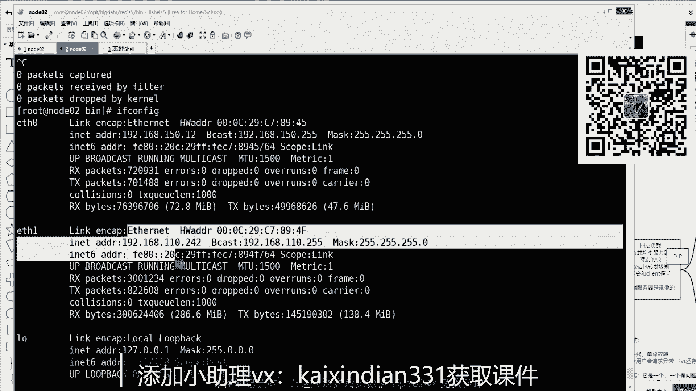

明白吧？所以这边我监听的时候只需要做一件事情，改一下监听的网卡。

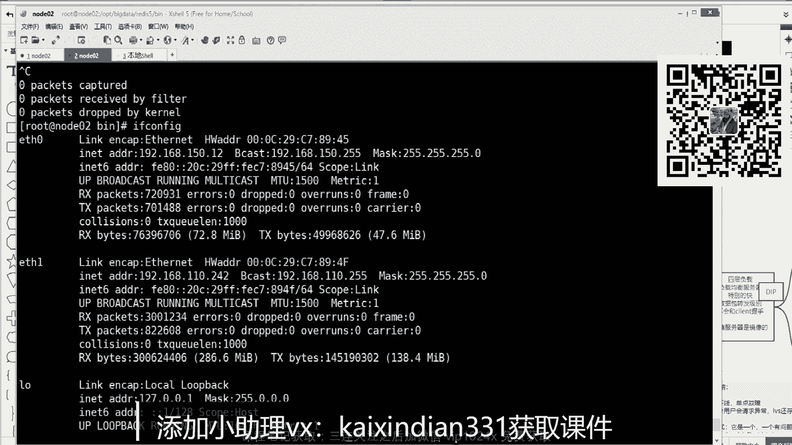

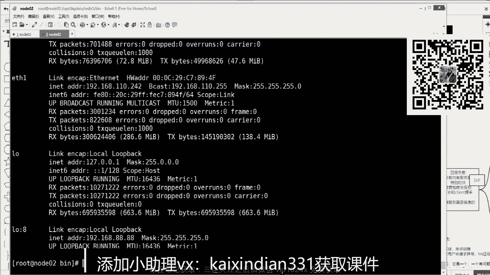

算了，我把那个if扛废，我把那个E1给给它断掉了，ETHE给它荡掉。

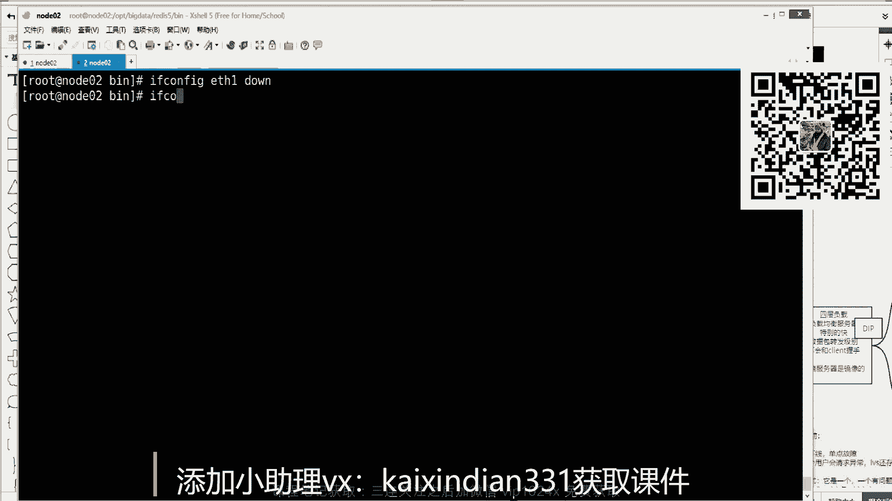

这样看的比较清楚，就是ET20啊，就是1个ET20。这个环为接口这块也给它断掉吧。

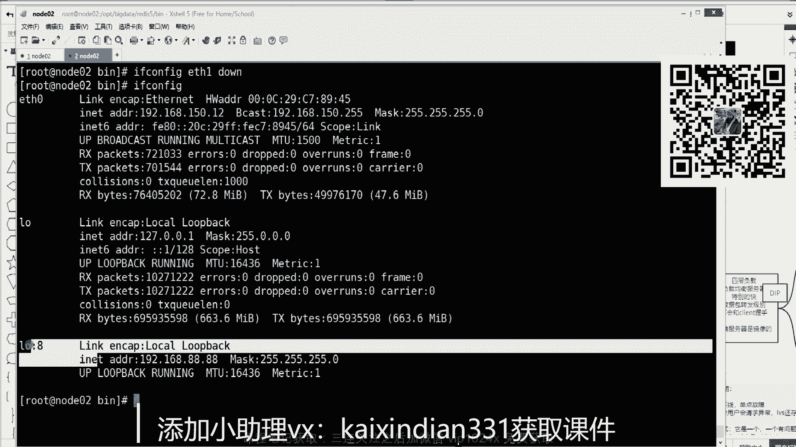

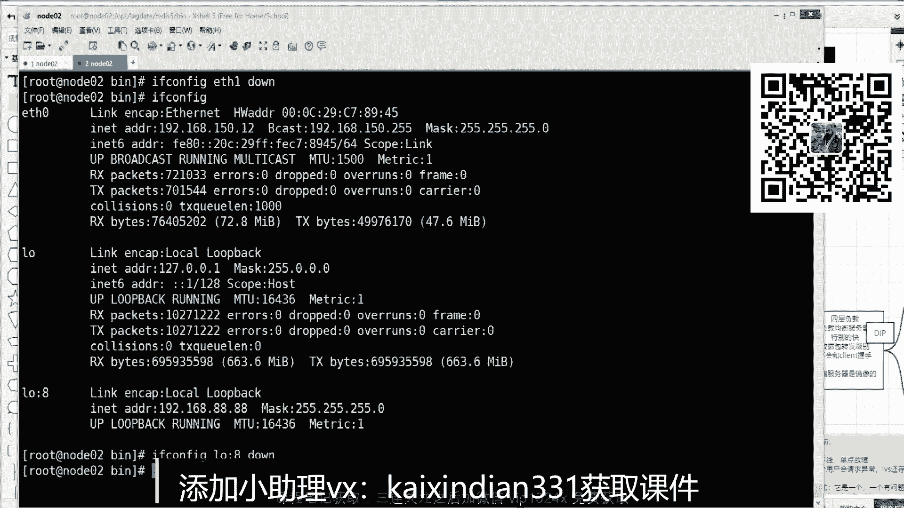

很干净啊，我这台主机只有一块物理物理网卡，你甭管它net还是直连的，就是150。12，它是E70网卡，然后再重新跑这个监听。

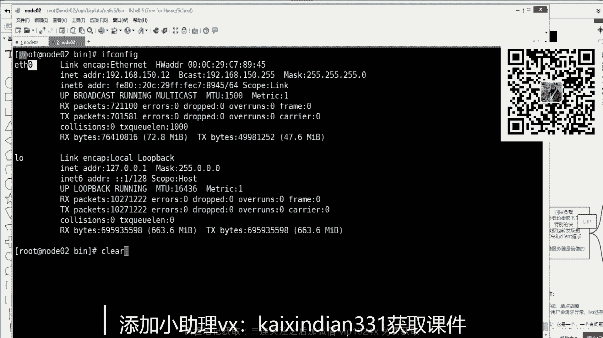

最主要就是TCBd。走再把它坚定起来，再继续坚定也是0啊，然后这边再去请求cl。哦，诶。稍等我修改一下root杠N应该是少了一个末认网关啊，现在到百度出去，待会给你讲root。艾嗯，然后。

这样怎么怎么怎么加网关了呀，root and。然后这W192。168点150点2。热情降恩，我得有一个网关，这数据包能出去。能出去之后，这不叫翻车，我刻意的安排了一个翻车，秀一下我的root指令。

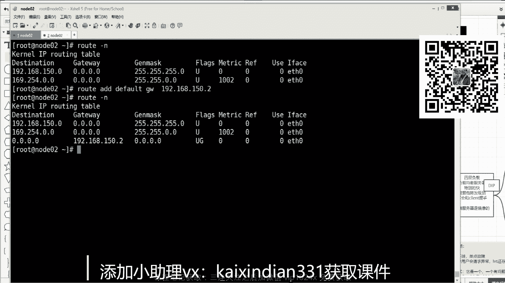

然后。在pro百度是不是请学回来了，包是不是这样了，4分钟一搞定啊，这这都这如果都搞定不了的话，怎么能给你讲课呢？

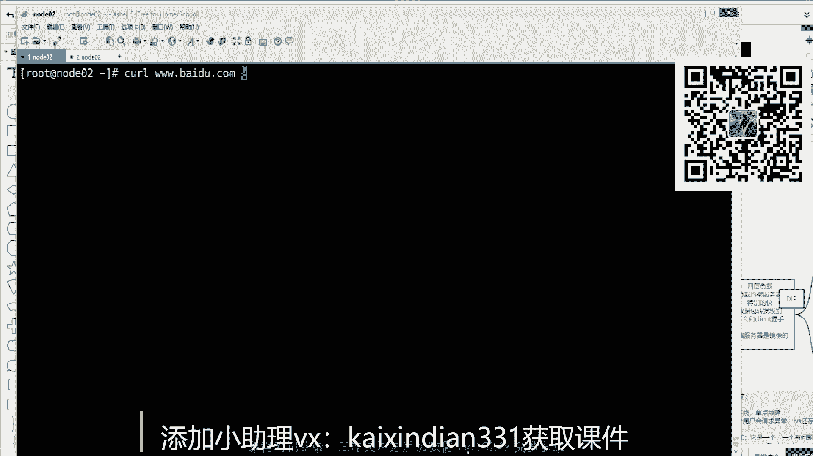

好，crl C给它接收掉。这里面我们来数包，刚才是不是注意听啊，分析下，刚才是我用Cl这个程序先把它跑起来，访问了百度取回来页面，并最终退出了这个程序。所以这个程序一定包含了启动连接。

请求数据关闭断开链接关闭程序的过程。那么在网络行为当中就一定包含了注意看，先是本机的150。12，1个随机端口号，到我们百度的IP地址的80端口号发送了一个SS文想建立握手，这个包的长度为0，看到了吧？

这个包的长度是为零的。因为它并不是要数据，这并不是应用程序发送的。它是我们传输控制层产生了一个握手的包它发出去了，所以大小为0，发出去之后，是本地给给百度百度给我们回了一个数据包，是S万N加ACK。

这个点是ACK加了ACK这个确认包大小依然为0，因为这依然在传输控制层在建立连接的过程。回来之后，然后我们的客户端依然又给百度回了一个简简单单的ACKacledge这是三次握手才有了连接，这是第一步。

看同学来上二边一，大小都是0，这叫传输控制包，是由传输控制层双方建立的，一来一回带一回搞定传三450有了之后，然后才是我们cl这个程序应用层的程序。他要发送的是请求头。

所以我们的本地的随账号要发送给百度一个有大小的包，len是168。这是从本地给百度就发过去了。然后这个屁是你收到这个包立刻处理，不要停留，因为我没什么可发的了，这是一个请您头发过去了。发过去之后。

百度立刻先回了一个大小为0的acknowledgeACK。这是基于可靠性。然后这时候百度立刻处理完你上面那个包里边内容，请求资源之后，给客户端返回来一个有有大小的，这个大小是1460这么个字节。

返给百度给我们返回了一个数据包，我们要对它给一个零大小的ACKacknowledge确认你给我发的东西到了。但是百度又给返回了一个数据包是1321个数这个字节。

然后咱们又给它返回了一个acknowledge，这一共有4步，就是百度给我们返回了1个1460。我们一个确认返回了1个1321，我们给了一个确认，这四个是两个交互，11460加上1321。

就是整个页面的大小的字节数，因为数据包大小是是被受到限制的。数据是被被切割成package，切切割成包的。听能来刷2边一，这跟滑动成号没有关系，跟滑动窗口没有关系。你要先知道，我们通过网络发送数据包。

数据包不可能无限大。数据包大小是有是有是有限制的。比如说数据包大小是1460，已经约定死了1460个字节。所以一个网页很大的时候，他先把上面拉的1460一发过来，再给你补全后边的1321。

能列吧哎协定的先跟着我的思路传传所有啊，这个确定完之后，最后你看有4个包，还有4个包，因为已经发回了1321和1460拼出来已经是这个主页的内容了。显示完之后程序要退出。所以看下边这行。

就是我们本地和百度说哎finisher拜拜，我想给你断开连接。这时候百度给我们回一个，哼我知道你想断开链接这事儿了，但是不代表他想断开，为什么百度还得说，其实我也想跟你断开fininish。

然后这时候客咱们客户端跟他说好的，知道了，4次回手。😊，三次握手数据传输，四次分手都得给我加着确认的机制。好吧，那这个指令监控的过程，我们可以再让它复杂一点。

TCB大幕这里面我们呢可以再加上一个选项是杠叉，我忘大大S小S了。我们先先先看一眼啊啊，大加一个大X，然后同样的再去请求一遍百度走，然后这个时候注意收到的东西就相对多一些contl C。

你来看再验证一遍这个。三次握手，这个包都抓的就有有些包里边这个东西就显出来了。第一个是握手的包肯定大小为0，不用管。然后后边是一个呃也是一个握手，这个握手的确认的包加ACK了。然后呢再来一个确认的包。

这里边都看不到数据，因为这是传输共程，是不是没有数据，关键看下边咱们本地给百度发了一个数据包，这里边是不是有get斜线HTV1。1的协议user这个客户端版本多少号，这就是请求头。

这就是百咱们给百度发了一个请求头这个数据包，然后人家百度给了我们回了一个很小的一个acknowledge这个数据包这个确认包大小为0，然后百度开始接着给我们返回1个1460大小的，为什么是1460。

你注意看这里面是不是有响应投H1。0200O然后想投里边是不是想投，然后以及到它的HH开始到下边这个包它其实没有接数。这个页面还没有还没有给你输出完，就到这就卡住了。因为先满足1460。

然后给我们返回之后，我们给他回送了一个acknowledge确认的包。然后人家接接着给我们返回剩下的1321个字节，这里面是不是就开始页面的剩余剩剩余的那些个字节开始返回了，这是1321个返完返完之后。

我们又给人一个acknowledge一个确认的包。然后这时候我们已经打印出来之后，我们才开始跟人说finish断开，然后确认，然后人家也说断开，我们也说确认。啊。三次握手数据传输，四次分手。

所有的包帮你抓到了。和我描述的是不是一模一样，对不对？那么在这儿扩展一下知识。当你能够听懂这个知识之后，我给你扩展一下。新的知识先新的知识咱们先不聊了，先把整体梳梳理完。当这些知识你明白之后。

我跟你说一句话，这句话叫做三次握手。然后加上数据传输到4次分手是一个不可被分割的N最小力度。不可被分割。这句话能听能听懂吗？为什么叫不可被分割呀？哪个场景你需要注意或者哪些技术，你必须要想明这件事。

这是面试官常问的一个题，就是在在高并发负载均衡的时候。负载均衡的时候会牵扯到1个LVS的一个技术。它是基于四层，也就是传输控制层的一个负载均衡器。那么这时候很容易给你下套，就是四层负载均衡器。

是不是可以把我们的数据包随便的给后边的这real server去负载呢？这时候你说可以负载，但是它必须受制于协议约束。什么意思？不能出现这样一个非常诡异的现象，就是你有一个客户端，然后呢。

经过中间的负载均衡服务器。比如说LVS。然后呢，你有两个。这个服务器。你可以做负载，有两个服务器，也可以做负载。但是这时候客户端握手的包发过来之后，LOSS把握手的包假设转转发给这这台了。

它是四层数据包转转过去了。那么他一定会给这个客户端回送一个确认的包acknowledge是三次握手的第一次和第二次。那么客户端如果再发来最后一次的确认的这个握手的包的话，你LOSS一定给他不能给他。

如果不小心把最后这个包。负债均额给到他了的。