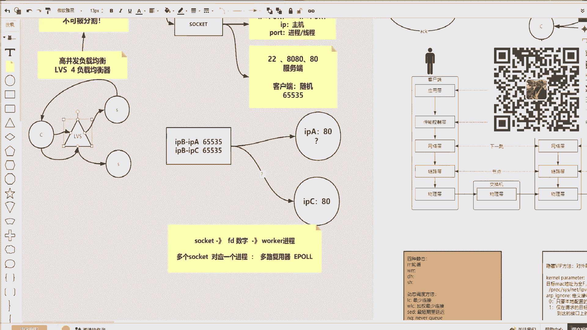
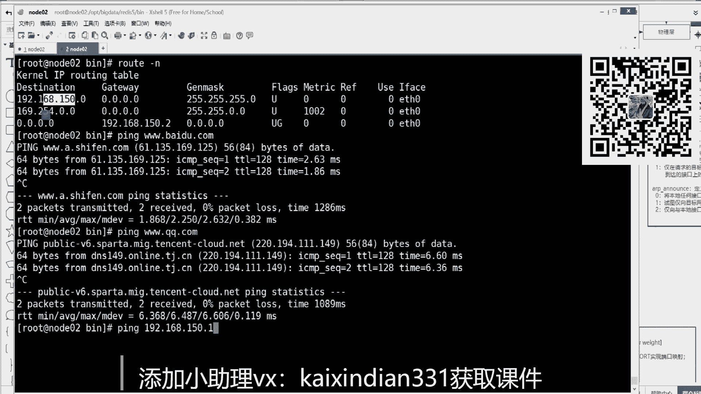
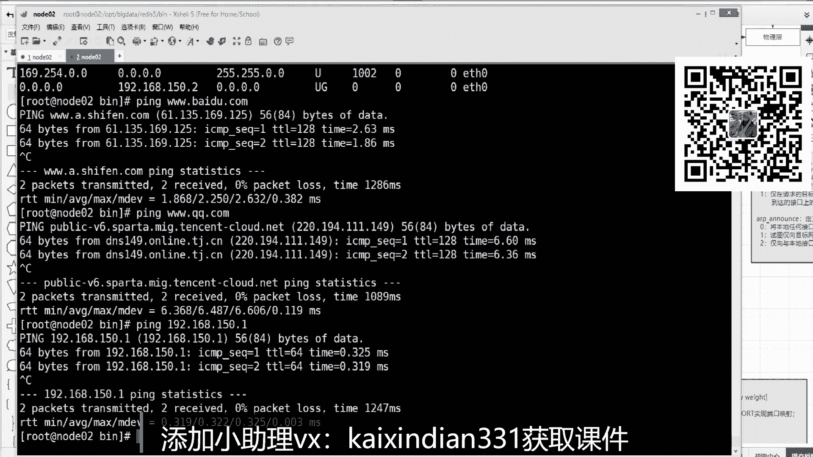
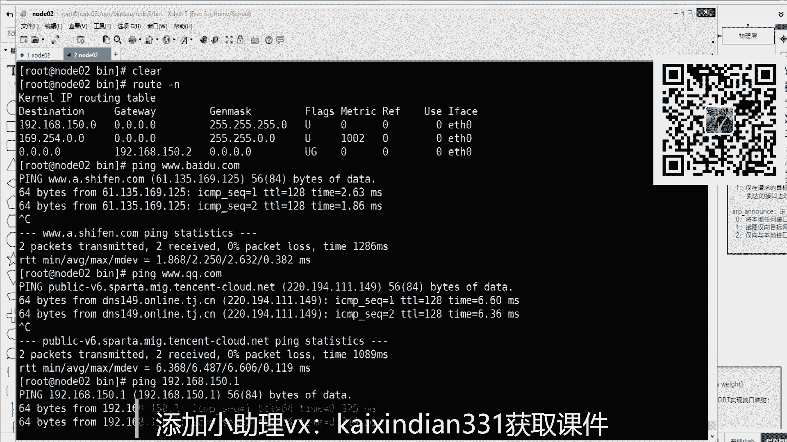
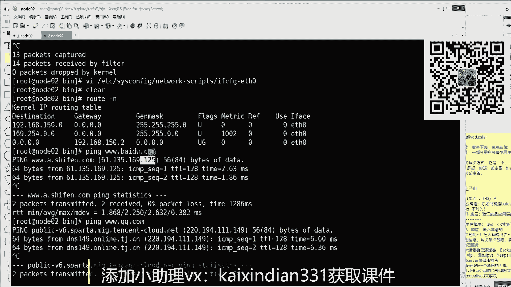
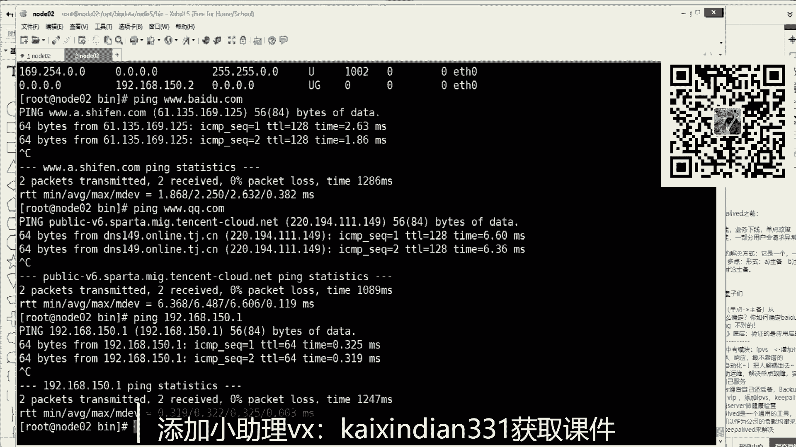

# 白嫖到马士兵教育价值23980的MCA架构师课程一次让你学够！ - P65：TCP合集：3,TCP ip 网络层原理 - Java视频学堂 - BV1Hy4y1t7Bo

那这时候你会发现他等不到最后那个握手的包，他没有开始就已经要那啥那啥了，还少少前面那两步。那这时候其实这两者都不会开辟资源，没有开辟资源，就没有我们所谓的连接通信就不行，你就破坏了分割。

这个不可分割性完整性。

到这部分能听懂的来说边一，你看知识都是你需要先学一个体系的知识，才能理解一个高阶的一个知识。好吧，有人立刻就反映出了一个Ddos攻击的呗。Ddos的一个基于这个TCP的S文的一个攻击啊，也就是什么意思？

也就是说你可以在互联网找一堆的肉机，然后呢，你设置他们只对某一台服务器只发，我想给你握手，你给我回确认，我就不给你回。那这时候他其实会计时的说我得等人家回回的确认包啊，你这样肉机多了。

那么别人真正的客户端想跟他链接的时候，已经没有资源了，那存已经满了，那连接连接不进去了，对不对？好吧，这是关于传输控制层的所有的知识点。现在已经梳理清楚了。但是这个梳理清楚之后，我再跟你说一句话。

我再跟你说一句话。软件是工程学啊，软件是工程学，是分层的。我刚才是就这这一层说把下边这一层就已经就带通了。其实应用层是先说内核帮我建立一个连接，然后内核说收到传输控制层开始握手。

传入库能创建了一个握手的包，它就停住了。因为这个包不是它发出去的，它怎么发，怎么发给谁，就得需要另外的层次。就上面都是阻塞的，所以三次握手的它的第一个握手包在这阻塞住就就开始掉网络层了。到这步能听懂来。

上边一就是为什么要讲网络层，就跟就是你的数据包传输控制层，我能做一个包，就是握手SN。但是这包该怎么发发给谁，从主机怎么出去，路由怎么走，互联网怎么才能找到他。对方这事儿不是我传输控制层做的。

是由你网络层来梳理出来的，所以要分层就调网络层了。啊，让我喘口气儿。到网络层的时候。你的数据包应该怎么走呢？从我主机怎么出去呢？网络层说了，每一个层都有协议，每一个层都有一些表。

刚才传输部层inice state可以看sockcket表，网络层其实牵扯到极点，它里面会有一个路由表。告诉你的数数据包应该怎么走怎么怎么走。在这儿我简单的说一下，这个不做太多的网络层的一个扩展。

因为这要聊的话，关于给你讲故事可以讲很多几个维度啊，几个维度你记住清楚记住这个记住了就可以了。网络层要解决什么问题？第一个是寻址。第二个是路由。其实都为了那数据包去走啊。第二个就是路由。

路由的词儿啥意思？一会给你讲就明白了。寻址的话其实就用到了一个东西，叫做IP。寻址里边用了一个东西叫IP路由就会进到一个路由表root。那么寻址的时候，我们拿人来举例啊，我们拿人来举例。

你给别人写信地址寻址，你的地址要怎么写？你的写信的信封的地址里边一定要包含什么呀？哪个国家，哪个城市，哪个街道，哪个小区，哪个门牌号，谁收一个完整的一个路径写的很全，一层层其实缩小查找范围。

最终命确某一个人，对吧？这人的人人的社会当中。那网络当中一样，首先说IP地址在网络层当中啊，网络当中，尤其在互联网当中，每一台机器都有一个自归属于自己表示自己的一个寻址的1个IP地址。

那这时候如果寻址的话，IP地址是代表互联网当中每台机的话，那么如果想某某人快速定位的话，这个IP地址里边应该包含两个东西，一个是网络，一个是。主机号，就是你你是哪个人？如果没有网络号的区分的话。

那这时候就像我们给某一个人写信，就张三周不写哪个国家哪个哪个那个哪个街道。那这个信就是很难很久才能到达那个人手里，可能都到不了。这个思路能不能想明白，就是IP地址里边其实分为两个东西。

一个是描述它在哪个网哪个哪个网络里，哪个局域网里。它的网络是哪一个网络，然后它在这个网络当中，它是这个网络里边的哪个主机主机号。网络号和主机号两部分组成。这是宏观啊，宏观有了之后我们来看一个东西。

VIETCs configure，然后network杠scripts。ETH0。这就是interface congeeternet以太网0号网卡回车。一般我们给主机的网卡配IP的时候。

要写出4个维度来它的IP地址。它的掩码还要给出网关以及给出DNS域名解析。这个域名解析。我不解释，大家应该都知道，就是你只要知道台服务器台地址，把百度那个域名给他，他告诉你百度的IP地址。

因为通信必然使的是IP封装数据包就通信，关键是上面还剩仨，一个是IP地址，一个是掩码，一个是网关网关一会儿再说，先看上面2个IP地址，大家都知道，哎，这个地址就是给我的那别人就不能使用这个地址了。

掩码是干什么用的。为什么你经常看到3个251个0或2个252个0掩码是干什么用的。编码是干什么用的？那这里面其实有一个没错，有一个很简单的一个道理啊。IPV4是点分字节。

就NIPV4里边点一个点与一个点之间是一个字节，一个字节是8个二进制位，8个二进制位。如果表示的是正整数的话，可以表示的区间是0到255。这是一个区间。

所以向下边这个2555代表这个字节就是8个18个全一上边1192的话就是某种零1的组合。那么拿IP地址和你的掩码做二进制的案慰语，就是192的某种01和一堆一做案慰语音算，得到的还是192。

这是这个规律。先跟着我的思路走啊，那这样的话，192和一堆一做是192168和一堆一是1168150和一对一是150。关键看后边12和一堆零就得到了0，所以一个IP地址和一个言码可以得到一个新的地址。

就是网络号，1918150。0，这是网络号，那么剩余这个12就是150。0这个网络里，你是第1112号机器。到这步能听懂来刷波一，就是掩码是。沿你的IP得到网络号的。

你这个你这个主机是归归属于哪个网络的？啊，IP地址是点分字节的一个字有8个20之位，全一是255，全零是0任意的一个数值，一个字节和另外一个全一的字节做202位语的话，得到它自己。

因为有一得一有这个全一为一有零得0嘛。那么得到的网络号就是代表的是这个局域网，后边剩余那个就是你是这个局域网里哪一台机器，这个这个地址是不能冲突的。那么当你知道他之后，我们再来看，注意看。

或一个路由表的概念，root降温。日存日它刚才这个路由表是什么意思？如果没有路由表，首先说上面什么是网络号，什么主机先写明了，然后下边说路由表，在路由表里边，你要给你一个概念，就是第一。

我们可以让互联网里边的每台设备。注意跟着我跟着我搜索啊，互联网当中的每一台设备存储整个互联网所有节点与节点之间的连接关系，就是每个人存向互联网所有的连接关系以及路由通路。那这样的话，你的内存会称报。

明理白我什么意思吧？那怎么可以加快寻址这件事情，怎么可以联通这件事情，这就是为什么我们的网叫做互联网。为什么叫做互联网？互联网其实有很多的。子网这个局域网，你想成局域网。啊，这一个局域王啊。

那边一个局域网。他们网络与网络的网络号不一样。如果这个局域网里边有A机器，有B机器，有C机器。这个局域网里边如果有D机器。然后E机器，然后F机器这两个局网如果不联通，是不是谁都访问不了谁？

那么怎么叫联通？那这里面会有一台机器。X主机这个主机里边有一块网卡接到了这个局域网，那么它就一定会有一个跟这个局域网在同一网段的IP地址。这台主这个设这台主机上面还有一块网卡接的是这个局域网。

也就是这台主机会有局域网，比如局域网一和局域网二的各自的IP地址，能够连，他们就是单单向看都能都能连通。然后这时候如果A想访问DEF只需要让它数据包给到X就可以了。这个数据包给到它，它就可以往这边转。

那么X对于这个局域网就来说，就是它的出路。那这时候其实你就想A还需要记录X之外的世界的所有东西吗？不需要了，它只需这个里边局网里边的所有人只需要知道我给X就可以了。这个东西叫做吓一跳。

你只需要记住下一跳，不需要记住每一跳，就他后边怎么跳都不用管，我只需要知道给了他，他自个儿再去根据自己的链接连接，再去找他后边的吓一跳，就是一跳一跳一跳的去找吓一跳。听懂明来说二波6。所以找到下一跳。

找到下一个出口很重要，那这就是路由表该做的事情。所以你会看到路由表条墨很简单，东西也很少。对吧那这个路由表是怎么回事，注意看第一行有1个111810这一个网络目标的一个网络。

后边一个掩码3-510来自于ETH0这块网卡。那这行条目怎么出来的？其实就是根据我们的配置文件IP加上掩码语文代表通过ET0可以直接连到150这个网络。未来如果访问这个网络里边任何主机。

直接通信不需要任何跳跃。因为你A和B通信还需要X怎不需要，直接他们俩就可以通信了。因为是一个局域网。但是如果想访问外部网的话，是不是找到X找到吓一跳。这时候你看后边还有这么一个条目，1918150。2。

这就是网关。举个例子，你就明白了，下边才是重点3W点百度点com。回车是不是拼通了？百度的IP址是不是61135169点125？这是百度的地址，这个数据包想拼百度应该怎么走呢？假设这个F就是百度。

你在这个局网里怎么拼它，是不是扔给X，怎么找到X的？很快速的1个20制按慰语的计算，拿着IP地址在路由表条目当中的掩码位开始做案慰语。那么61135169125和这个掩码做语算得到啥。

是不是得到了61135169。0和前面目标网络号一样吗？是不是不一样不一样。这个条目被被被淘汰。但是下面条目也不用管，也也也肯定是被淘汰被淘汰的。关键看最后一个条目是4个0掩码。

那也就是百度的IP地址和4个0做云算，得到是4个04个0和目标网络4个0是匹配。那么这个数据包应该交给谁呢？get away网关就是交给19168150。2就不用管了，他就一定能给给到百度去。

这就是所谓的网关的意思，到这步能看懂来刷边一，有是找到你的吓一跳。在你们家里边，其实就是你的路由器的19181。1，这是你家的默认网关。你凭QQ。点comQQ是另外1个IP地址，20。1194。11。

149。你会发现这个条目依然匹配不上，依然要走最后一个。你会发现，其实你只要走到最后一个条目，无论它给出任何的IP地址都能磨成零和相统匹配，也就是默认网关，也就是家里的路由器，想访问互联网。

一定走路由器，别地不用走。这能想明白了吧？哎，这个而且这个计算的过程路由表很小，条部很小，直接记了一个默认网关，所有的计算都是二进制2位语，这是CPU计算最快的方式。

第二条目不用管这个这个这个这个这个条目，这个第二条目不用管它，这个是配置里边少配了一个项，这个可以关掉的。好吧，那这时候人说了，如果在同一局域网怎么通信？比如P192。168。150。1，这个150。

1这个IP址是不是跟我同一网段，同一局域网了？我是12。那你拼1，是不是应该同一局域网回来之后是不是也能拼通平通的时候其实还是一个道理。用这个地址和这个东西做语音算，是不是就得到了150。

0和相对匹配上了，匹配上之后，一看网关没有4个0，就没有网关，不需要给网关，那就直接从网卡上中去走交换机一定能给一。

这就是局域网，不需要网关，剩下的都给扔给网关，我也不知道怎么走了，反正就扔给吓一跳，这叫吓扔给吓一跳就可以了。最终这这个网络层的原理，IP是有网络号主机号，有路由表，有默认网关，吓一跳。

所有东西扔给吓一跳，吓一跳的下一跳其实逻辑是一样的，这互联网当中的每一个节点。中间节点都是有一个路路由表的，就我A里边路由表，知道你的你是我的吓一跳。我如果是运营商联通的第一台路由器，那我后边怎么走。

应该我这里边也有路由表，就是大家都是一跳一跳一跳。只要中间的路由规则计算队，吓一跳，这个能连通，就是有网络工程师能配对数据包里一定能跳到另外你的服务端。是这意思吧？那么这个能听懂之后啊，我考你一个问题。

我考你一个问题，能听懂我就刷波一。我觉得我讲的应该是算是。

普通话的一种水平啊，没有太多的这个专业术语。如果你能把吓一跳想明白了，再来问你一个问题，考你一个问题啊。现在如果想把数据包是发给百度的，是这个IP地址，你也通过路由表。找到了下一跳是191810。2。

这但是注意现在有2个IP地址，一个是下一跳的IP地址，一个是服务端，百度的IP地址。那这时候数据包里边只能写1个IP地址。请问这个IP地址。写哪一个是写2还是写25刷起来。是写2还是写2125？

你看就有人还是有不同的答案。这这个过程我要给你纠正。如果你写二数据包里写的目标IP地址10。2。那这个数据包叭嗒如果扔给他他就是二的话，他一看哎数据包扔给我的，而且里边也看不到百度的那个地址。

那这个数据包他就想收下。但是发现自己又没有这端口号，这个包都被丢弃了。就不能写这个下跳的IP地址，那咱就写百度的呗。如果写百度的125，那你写的是这个IP地址，这个数入包怎么能扔给点2呢？

因为人家路由器不叫125，人家点2，对不对？是不是就冲就就矛盾了。那这个问题怎么解决，注意听这个问题解决，就是路由选择注意听啊，路由选择是靠网络层找到吓一跳了，但是怎么才能正确的扔给吓一跳。

这个这个链路这这个一链链的每一个跳点，我怎么能正确扔给这个吓一跳，其实需要链路层再封一层信发，这个网络层只需要封端点IP的。就是封的是百度的125，但是外边再套一层信封，那个信封套的什么地址。

套的是吓一跳的，它的硬件地址就是mac地址，所以还需要一个链路层。就为什么下面还有一个链路层。

然后再封一个mark地址，这个地址其实一一眼能看出来，就是链路层也有协议，链路层协议就是ARP协议ARP。

