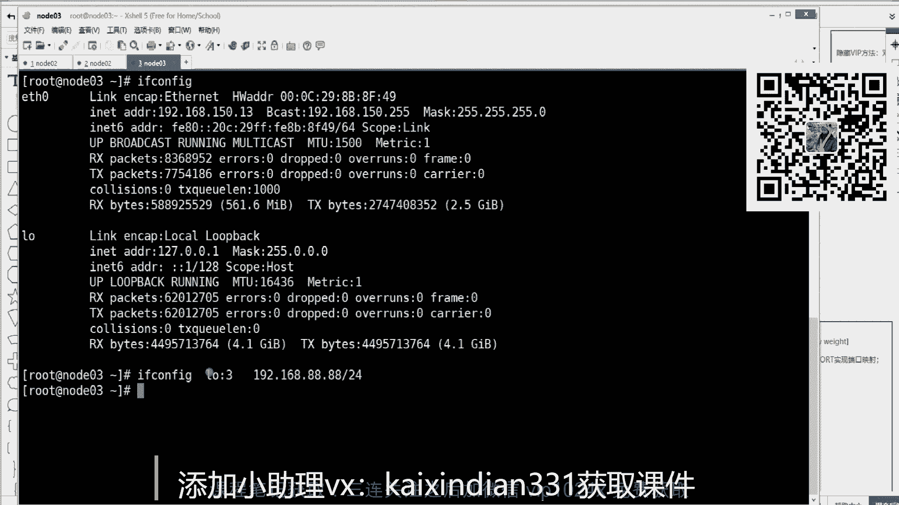
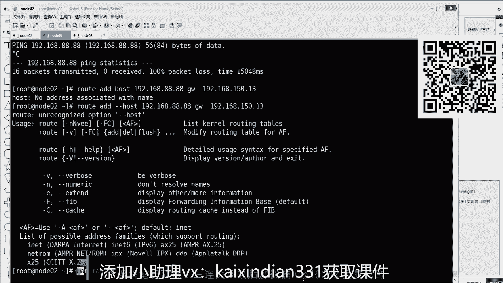

# 白嫖到马士兵教育价值23980的MCA架构师课程一次让你学够！ - P66：TCP合集：4，TCPIP 链路层原理 - Java视频学堂 - BV1Hy4y1t7Bo

杠A我听一下ARP杠A。

这时候你会看到了，还有一张表是链络层给出的，他给出了150。2，有另外一个地址，这个地址就是我们常说的max地址，硬网卡的硬件地址。

这个地址如果再套在你刚才百度那个信封的那个I地址外边，那么这个信封只要往外一扔，就通过这个地址一定能交给你的网关路由器。网关路由器一看耶，我是点2，你的地址是你的硬件地址写对了，是我的。

但是再往里一拆哦，你里边写的IP地址不是给我的，是给百度的，是另外一个地址。

那这时候才会触发它路由器的路由表，找它的吓一跳，就大家都开始找吓一跳。

能听回来说波一。我觉得这个不难吧哎。然后我先给你讲通，整个过程当中就牵扯到两个地址，一个是IP地址，一个是mac地址，硬件地址。那这里边又有一个层叫做网络层，一个叫链路层。我给你举个例子啊。

如果你有一个客户端。有一个服务端，这就是它为什么叫链路层啊，就是它词为什么这么起？首先根据刚才我讲的知识点，你起码学会了。如果你的客户端想把数据发出去，有第一个跳点，这个跳点比如路由器。路由器。

然后它路由器是有mac地址的，硬件地址的。然后呢。路由器往后肯定还有S运营商。运营商他也有他的路由器。然后有路由器的markag地址，然后假设我就把中间很多这样的运营商跳转，那一个路由器就缩减了。

就这么两个两步，然后最终就能连通。那么客户端封到数据包里边，注意听IP地址。是C的客户端的I地址发给谁，一定是发给serv端的。IP地址就是IP地址一定是端到端的数据包里封的是客户端到服务端的IP地址。

只不过它的mac地址。肯定是发的封的是自己的ma地址，以及发的什么呀路由器的ma地址。😡，这个数据包一定是这么封的，看懂的朋友原来刷波一。是不是要发这么要封这么一个数据包。

这个数据包里的麦点会驱动这个数据包怎么样？就来到了这台路由器上，来到路由器之后，路由器一看mark地址是我的，把这个mark地址先撕掉，撕毁之后看I址ip地址不是我的是人你的那开始找自己的路由表。

找到了自己的吓一跳。那这时候他的mark地址封谁？ISP的mark地址。那这时候这个数据包封出去之后，一发送就会发送到这台路由器，它就接受了。他接之后一看哎D是我的先撕毁。思鬼州一看IP地址不是自己的。

是人家百度的。如果他俩就在同一个数据中心了，同一机房了，那这时候他会做一件事情，是封一个server的。麦克丽址。那这个数据包就会正确的到达服务端。到这步这个路据包数据包跳转的过程当中。

每一跳每一跳都跳过来的，里边moddy会修改，这个能看懂学同学来刷边一。然后这里面我们把抽象一下，我们来抽象一下，在整个过程当中，谁是一成不变的在数据包里边。IP是一成不变的，也就是端到端的。

但是谁是发生变化的。mar地址在每一跳的时候都会替换，且替换的过程当中，让他们使成为了一个链表式的一个反应，叫做链路层。妈地址是链路层。IP是网络层。IP一直不变，但是骂地址一直在被跳的时候。

你要替换成正确的下一个跳点的骂地址，封住这个外层的这个这个这个这个这个线封。好吧，整体就想明白了吧。哎，先跟着我速度，走，到时候我再给你抓包演示，是不是这么一回事。

先我们先说整体整体的话是这样的一个过程。也就是说你的应用层想发一个请求头，抱歉，停住，别动你应用层的浏览器也好，什么软件也好，先告诉在在这看应用层先告诉内核，说你帮我去建立一个连接。

然后传输工层先创建了一个卧手的包，停住，别动，因为不是你发出去的这个包要先去问网络层，哎，咱那包怎么发呀，从哪个口走下一跳是谁啊，先找网络层网络层说我找着了下一跳是谁是谁，但是这时候别动。

你得知道下一跳的ma个地址就开始问链路层，链路层是不是张表，如果能看到这个映射的关系，这数据包是不是能封上了。因为你连骂地址在IP地址是不是都具备了数据包就完整了，就可以封就可往外发了。

但是如果说链路层说这表是空的，没有下一跳的骂地址，也就是可以AERP。刚D删掉192。168点150。2的mg地址。你再来看这里边是不是没有mark地址。那这时候如果说应用层找他说你别动，我去握手包。

握手包出来之后别动，我找网络层找下一跳，找他下一跳之后别动找链路层找m地址m地址一看没有，那怎么办？它会触发ARP协议去互这个局网当中请求你的下一跳，给我返回mg地址，所以这块一定会把前面都阻塞住。

先走完ARP协议才能知道他的m地址，就是先有ARP才会有三次握手数据传输，四次分手，这么一个整体的顺序，也就是说层一层是垂直调用关系，依赖关系软件是工程学层一层是有依赖的。听懂同学来刷二波一。

那这个过程我可以帮你去演示一下，到底和我说的对不对，我们是不是可以抓包去演示来走。当是这时候你要翻一个现象，ARP杠A唉，他又回来了。退又回来了，你即便可以ARP杠D。删掉1922168。150。2。

你可以删掉它。现在没有了，你再看哎，这又就又又请求回来了，他就自动的会把默认网关，没事就请求一下。或者那边会通告这一件事情，就是这哎，我怎么能保证说我在一会儿cl请求百度的时候，你刚好没有这个骂地址。

我是不是可以杠D给它删掉，删掉完了之后，立刻接一个逻辑语，立刻给我执行另外一个命令prol3W点百度点com立刻请求。那这个过程之间是没有时差的，因为都是计算机一口气先删再请求。

他请求他的时候就可以一个短片的事，没有这个m地址，这个指令，为什么这么去写，能听同学来2边6。都能听懂吧。哎，这个是这么去写，那我抓包的时候就应该能看到它有一个短暂的ARP请求的过程。

抓包的时候注意怎么去写了。现在你要抓的是两类包了，一个是ARP的包，一个是百度请求那个80的多那个包是TCPdump杠NN从接口ETH0接口抓的第一个包是port。

PORT80端口的或者哦这个包要么里边是1个80端口号，要么是1个ARP的一个数据包。ARP协议的一个数据包，就两类数据包通过一次招包都给我抓不出来。这个抓包也能听懂，也能看懂回来刷包一。好，看着来啊。

走，我先监听liston了，开始准备装包了，前边一定会触发什么删，然后有压RP请求以及请求走。

这边ctrl C结束一下，我们来看看它抓的是什么东西。这是刚才说的三次握手的包，晚上倒是不是有两个包，这两个包分别是ARP协议的。request请求 who谁有150。2。

因为他的吓一跳是他请告诉150。1就是我自己这包的啪就发出去了，请求包就发出去了。然后从网络当中接收到了一个数据包replay收到了一个数据包。这个是这个就是人家150。2回送的是在这个漫画地址上。

那ARP表就有了这个这个漫地址了，这个时候才能允许你封一个正确的数据包，开始三自握手私次传输这个这个数据传输，四次分手。这个整个逻辑就是依赖的。看浓西来烧包料。唉。好吧，层一层是那么走的，这么发出去。

那么接收啊，就都这么一个一个概念。这个通信是一个比较。基准的一个知识。都已经梳梳理梳理清楚了吧。网关要怎么。理解。我给你演示一个另外一个职愿，你找到网关的概念，找到网关的概念，找到吓一跳的概念。想听吗？

这什么叫网关，想听想想想想听。网关啊有默认网关和普通的网关，就是网关就是下跳的事儿啊，下一跳，其实就是什么叫路由，怎么去走，我这个给你演示一下。举个小例子，首先这是一台机器，这台机器你先记住了。

二机上面只有1个IP地址是150。12。然后三机器上面我们来看一下啊，有一个地址是150。13，这两台机器，这两台讯机啊，就是这个150。13和15010。12，它们在同一局域网，所以他们能并通。

是不是能拼通？你现在要告诉我他为什么可以拼通。😡，今天听了课之后，不只是常识，你也知道原理。

他为什么可以平通啊？😡，root杠N的时候，当你想拼15。13的时候，无论是本局域网还是出主机的，一定走路由表，拿这个地址和这个掩码一计算，就得到了15。0就和相手匹配上了。网关不需要。

直直接包就发出去了，走交换机就交换给了这台主机，数据包就可以来回交换了，这是同一局域网。

都是依靠的。路由表。这是在网络层，这个能听懂学来shoppper一就是我刚才讲讲讲的知识点啊，他走的协议是IC这个MP协议啊。那么这里面我知道一个知道一个特点，一个什么特点。在这台机器里边。

我if con在环回接口里边，我配了一个子接口，写了一个地址。这个地址比如说192。168点88点88，然后24这个地址。他写错了吗？啊，这个环为这个这个这个这个个这个子接口啊。

比如说3号3号子接口是这个地址，这个地址，然后241个掩码走。IO就是你的local house。录这个还回接口地址127。0。1。这这看那个地址能能明白了吧？

就是你们一般都知道本地有一个local house的loc house地址，你也知道12120127。0。21。那这地址配在哪块网卡上了，有一块虚拟网卡叫IO环回这口网卡。

ET20是你的物理网卡net网卡，以太网网卡啊，这是内核的一个虚拟网卡。这个网卡不插网线的，它是在内核里边的，就跟你的应用层11一下来一回去，没有出主机，我在这个主机里面埋了一个新的地址是88。88。

跟着我的思路走啊，那我这个这个三的主机里边是不是有一个地址，10。13，还有1个88。88，对不对？就是你前面不用管这台主机是不是有俩I地址，一个是150。13，一个是88。88。😡。

这台主机有两个地置，能看懂同学来说边一。

当这个能看懂，刚才我们在二上是不是可以并通这个12，对不对？不是从从二可以拼通13，也就是从二主机可以拼通13。那么请问二上能不能平通88。88，能平通还是不能平通，能还是不能？

去想能评中还是不能。

所有的知识就来自于一个非常非常简单的一个。这个这个原子性的一个知识点就是所有数据包能不能和别人去通信，完全考究你的路由表。那这时候来看，如果你P192。168。88。88。

你现在再看这个界面，你说它能拼动吗？

如果凭它的话，是不是拿着这个IP地址做语音算，跟他之后，是不是1。1888。0跟是不是前面是匹配不上了，匹配上之后，是不是要最后匹配上，要扔给10。2了，扔给10。10。2这里边，他也不知道88。

88在哪了，所以这包都被丢弃了，就往外扔了，就回不到这这到了到到达不了这台主机。所以是平所以是平不通的。

你看所有的知识点，就只要你会，只要你会算路由表，拿着一个地址会算路由表的语音算，你都知道这个数据包能不能通，这是第一这是第一点。

能理了吧？第二点，你就想让它通，对不对？想让它通，那么就是第二个支点吓一跳，你只要给出一个正确的下一跳，能衔接上这包是不是通了。那请问如果在这台主机把目标地址是88。88的这个数据包。

想让这个地址接收到它的吓一跳，那个能通的吓一跳是谁，是不是曾经对15013能通。

是不是先扔给他，这是他的吓一跳，他收到了，是不是就可以交给他了？

对不对？所以你路由表里缺了什么？缺了一个对于这个地址的吓一跳，对不对？能听出来刷个一，所以就是root at。host添加一个主机，这个主机是192。168点88点88，然后GTV网关下一跳是192。

168点150。13，这是它的下一跳，这是主机回车。

少了一个参数啊。atho应该是杠杠吧，杠杠hos哦。

我忘了怎么写了啊，不着急，不慌，命令只需要知道这个功能manu学习这个命令回车，然后在里面一定会有比如root at添加哦，杠house一个杠，我刚才多写了，不慌。

我是翻车了吗？不是翻车了，我就是想告诉你怎么学习，对不对？减掉一个行，是不是路由表添加一个主机，这个主机这个地址下一跳它走。

是不是又多了一个路由条目？看怎回来烧波一。那这时候你注意再家看啊，平。192。168点88点88，那这个地址是不是要和掩码做运算？因为刚刚刚houses就是主机一个主机，主机的话就是一个地址。

就是88万精确这个地址，他用4-25，4-25和它匹完匹完之后，刚好是他这个地址，这个地址跟前面正好能匹配上，所以下一跳是谁，是不是就是他？所以这个时候走是不是就通了？

路由层网络层的协议，基础协议就是这么low这么简单。但是就是这个东西支撑了现在你们疯狂每天刷的互联网。

就是你要告诉一台主机，这台主机你告诉他的路由表里边，如果想仿了一个东西，吓一跳扔给谁，有这个条目就可以了。

那学它有什么意义？你们如果超着要学什么docker啊，学什么ops虚拟化呀。😡，docker容器好学，哪儿不好学，网络IP浮动IPnet及速转换，这些才是特别难学的一个知识点。好吧，VPN是什么？

VPN是数据包，背着数据包，也就是1个IPA。然后呢，这是到你比如这是你客户端。你在香港买了买了一台主机，你在香港买了一台主机。那么这里边IP的地址就是你香港那个IP地址。但是这个数据包是外层的。

在这个数据包里边，它又背着一个数据包。这个数据包是你想访问的谷歌的那个数据包是IPX。那么这个数据包里边，因为这个数据包它的外层的IP地址是到香港，所以这个数据包一定是先到香港。

香港你的VPN服务器把外层删掉之后，看到谷歌的，再把这个数据包通过香港那边，它对互联网的访问，就直接给谷歌了。谷歌回来之后再拼完了之后再给你返回。这就是VPN翻墙。就是数据包背着数据包。

听不出来说2波6，这就是IVS什么呀，天到隧道的这这这么一种。通信方式啊，就是你先到先到香港，从香港再出去。或者你在国内出差，你公司内部有一台服务器，你公司里边有一台服务器是一个私有的一个地址。

然后你公司有一台路由器是接了互联网了，并开启了VPN功能。所以你客户端跟路由器之间先走到公网IP地址，数据包呢先扔过去。然后里边其实包了一个数据包的，私网IP地址，是访这台服务器的。

所以你的这个公司路由器的VPN一定把这书包交换给你这个公司内部的ERP的服务器上，他处理完之后给到他他在丰装完再给到你的这个你的出差的这台笔记本里边。

所以你在世界上任何地方都可以访问你公司内部的一台私有的服务器。有人时候把它在跳板也可以。但是中间就是IP背着IP就跟说你们现在所有人想去全全球各地方去旅游。但是我说了，你要想去别的旅游。

你们我背起你先给你背到北京机场。那从你家到北京机场是我背着你去的，到机场，你再坐飞机再走。那你你家和机场之间就是我背着你之间就有一个特的隧道了。好吧，这里边加上加上加密，加上安全，这还是很安全的。

这就是另外一个表层和绘画层里边的那个加密的能力了。体力可挺好啊，老周那还必须的。因为我真的会背你吗？出书没出书，但是这样的课程的视频我讲了好多了。好吧，现在对网络通信这块应该是没问题了啊。

周老师有女朋友了吗？我都结婚了我都结婚了。今天没开摄像头啊，看不那个就不给你们看我长啥样了。好吗？要讲这个东西，呃，最后总结一下。其实我我你看我讲课整堂课穿插了很多的知识点。

有linux操作系统命令的一些个基础的一个知识点，以及一些学习方法。然后呢，有关于TCP协议，就是应用层到内核从划分这个两个层次，以及内核层完成通用的通信，就是无论你上面是什么什么什么软件。

你是QQ也好，你是应用传输也好，你是王者荣耀也好，你是任何的想通信的东西，你们自个完成协议的事，尤戏有有游戏的通信的协议，然后往这个外有 web的协议，然后文件传输文件传输协，你你们这块你们随便玩。

但是你们想想通信哎，找内核，内核一定帮你梳立的清清楚楚的，尤其这么一个主机和一台服务器，有多个页面打开想通信的时候，为什么传输数据还不乱。比如说我一个浏览器可以对着百度打开三个搜索。为什么还不乱？

这里边是因为有一个骚的概念。对吧s有给的概念有之后，然后这里面还有一个三次握手到4次分手，不可分割的一个概念，这是写了一个负载均衡的一个协议的一个面试题。其实这些知识如果从上往下串的话。

其实你会发现知识点是有依赖关系的，是要成体系的。这是个啥？他发了个啥？我看他发了啥。嗯。不用管它不用管它，应该是个。是傅你就想他你就想把它想成是骗子就可以了啊。那接着他这话，我来说一个事儿啊。

就是我以上讲的一些知识点，注意听啊，只是1个TCP连接上的事情。