# 白嫖到马士兵教育价值23980的MCA架构师课程一次让你学够！ - P67：左神算法-KMP算法及其扩展 - Java视频学堂 - BV1Hy4y1t7Bo

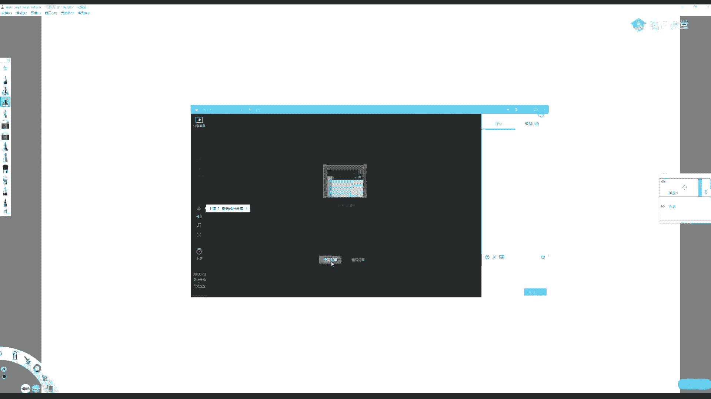

大家好啊，下午把kmp算法应用讲讲两个题，然后再把bf p r t算法一收是吧，下周买那车了，不然买那车，我估计一节课也讲不完，再留个小尾巴，怪恶心的是，bf p r t算法是用来干啥的。

你在笔试的时候遇到你不用用bf p r t，因为有一个已经很好的方法替代了，b m p r t是你在面试的时候遇到面试官跟他聊的，算法是给你提身价的，换句话说是某种程度上说你可以认为是装逼的。

笔试的时候不用用啊，飞火同学早上不懂，是因为你十点钟进来是吧，就这我还给你讲懂了，你不得不暗暗敬佩我是吧，嗯哼哼，笔试用什么会给你讲啊。

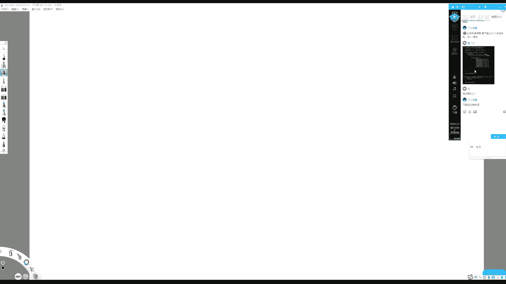

哈哈哈，你知道你为什么错了吗，你看你这个i是0~9，你这个g是0~8，你传进去的时候，x乘0~9，y乘零的，这有错吗，哪错了呢，这八个位置没整理对吗，i加2g减一嗯，i加2g加1a加1g加2a减一。

g加2a减二，g加1a减二，g加1a减1j减二，这个为什么错了呢，这同学是哪里哪里看到有错呀，没觉得他错呀，是哪里有错呀，嗯你是你是用什么方法得到它，错的啊。

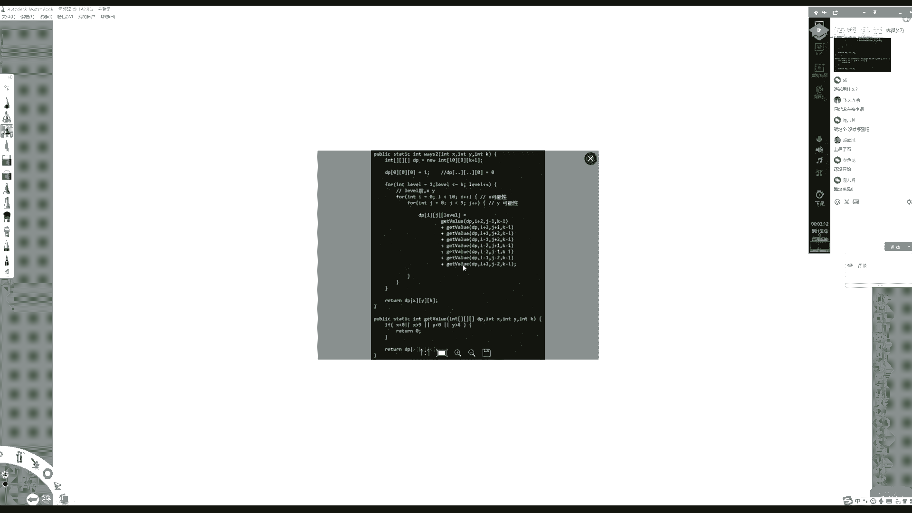

你你你传什么位置跑出来是零，我跑出来不是零啊，你你你跑，你传什么位置跑出来是零啊，是哪些位置跑出来是零，你要知道在有限几部内码，有些位置不可能都是零，我给你看看，这不是昨天代码吗。

哎昨天什么test是吧，六个位置八位置跑十步啊，不是零二，为什么是零了，啊这时间好长诶，有些有些步数码是到不了某些位置的，它只能是零，你注意马不是在规定步数内，什么位置都能到的，理解这意思吧。

你给我个步数，我有些有些位置他就是到不了，听听听懂啥意思吧，就这个同学，8月同学，他他有些东西它就是无解的，就是没有办法去到到达的位置，你你我不知道你懂不懂，我说啥啊，位置有，但是v2 就是零。

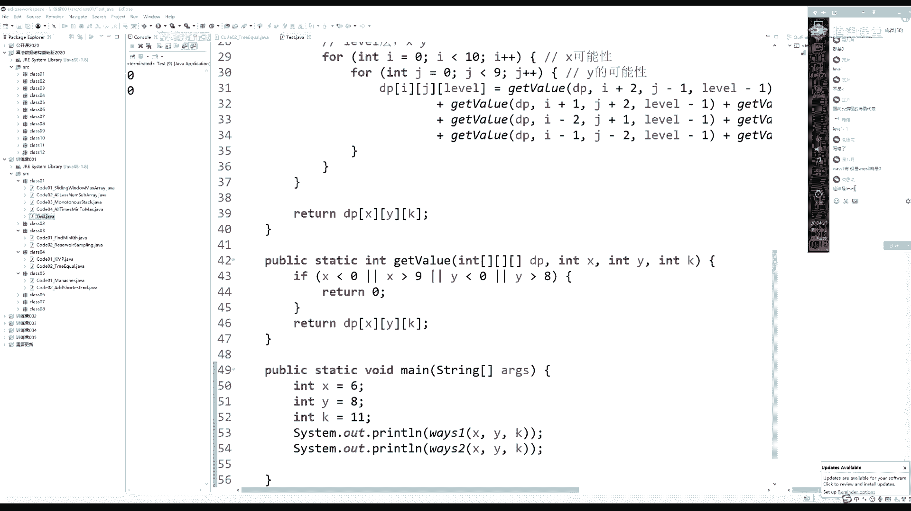

我看一下你这个这level没有啊，哦对那就这个啊，你看你这个dp i g level，但是你往下传的是k减一哈哈，k可是一个固定值是吧哈哈所以你请你把这个这里面换成level好吧。

理解吗啊但是你要知道是真的不一定他某个位置马能到啊，你你懂啥意思吧，有些位置确实在规定步数，你这个是到不了的，那就是实际情况他就到不了，他就零种方法吗，是啊我说的也没错，但是你写的有错，哈哈啊。

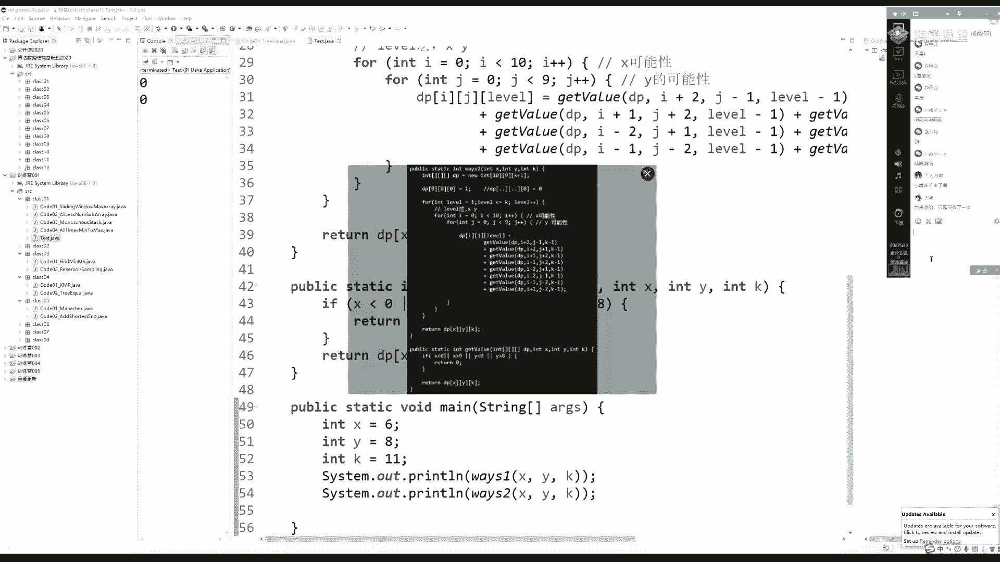

嗯嗯行啊，这个还是可以的啊，当然，哎你说要是暴力方法，你们打算怎么用这个暴力方法呀，就是换一种尝试方式，有可能是什么情况呀，你你换一种尝试方法，你觉得你会怎么试啊，然后现在讲一个别的方法好不好，你不服。

你说哎你操，你光是拿暴力递归自己，在那改动态规划，我怎么知道你两个方法是不是都对，是不是都错，那就换一个方法想想怎么试，正好也时间也没开始，马上跳问题是吧，发现大家很纠结这个问题，那你怎么试呢。

你这么来行不行啊，你写个函数p是吧，当前来到的位置叫行，当前来到的位置叫列行吗，然后当前走了dk不，我把xy也传进去行吗，可以吧，这啥意思呢，就是当前来到肉column位置，当前来到rocm的位置。

还剩就这个k也别搞k了，就rest，还剩rest不可以吧，还剩rise的不问，你走完rest步之后，来到xy位置，方法数方法数多少，你是不是可以这么试啊对吧，你要注意这个xy是个固定值。

这个xy是个固定值，它是永远是你目标位置，你当前行当前列跟剩余多少步是可变参数，那么你主函数应该怎么调啊，比如说我再给你写个方法叫v3 ，你如果有个位置三的话，它让你知道啊。

他让你求走k步之后来到xy的方法输，你就应该怎么调这么调，如果我就想用这个p函数来试的话，那我一开始肯定我来到的是零零位置吗，对吧，我还有我零零，为什么我还剩k不可以走吗，我的目标永远是盯着xy。

你也可以这么试吗，无非就是这个这个这个函数中，它前三个是可变参数，后两个是永远固定的，听到他在打一行吧，可以吧，这么吃是不是也行啊，这个尤其是刚才问的那个8月同学，你你能你你你能能理解这种施法吧。

我现在重新换了一种施法行不行啊，这可能这种施法就更加的自然之灰是吧，我当前来到肉跟column，我还剩rest，不要走完，我问你走完的时候，来到xy的方法数有多少种，如果是这样定义的话。

我一开始当然从零零出发嘛，我要k不要走嘛对吧，我来到方法xy的方法我来了，来到了xy，最终的目标肯定是不会变的，这这可以理解吧，啊这个8月同学你还在吗，好那我们就先试好吧，那么那但这不一样嘛。

如果rise等于零，就没有没有步数走了，那你只有什么，只有你当前行来到x位置对吧，并且你当前列来到y位置，是不是才能够返回一，否则你就返回零吗，就是你走你已经走完所有的步数了。

哎你你停留的位置正好是xy，那你就找到了一个点数，就是有效方法，找到了一种是吧，这种方法叫你之前走过的决定，如果你0度可以走了，你来到x没有来到xy位置，那就零种方法吗，这是不是也对应了。

接下来你怎么加这个函数，你一样一旦有越界了，你就返回零，但是是什么越界了，这个可不是可不是xy越界了，是肉跟column越界了，对不对，因为肉跟column是你现在的位置，xy人家是个目标啊。

所以你怎么改呀，肉行数如果小于零或大于九，然后是列数如果小于零或大于九，列数如果小于零或大于九是吧，但小于零或大于八，你就返回零，接下来你该怎么走，你不是一样吗，你你还剩rise的步可以走。

那你还是八个位置吗，你就看你call了吗，可以蹦到哪个位置上去吗，八个八种可能性吗，对吧，你这跟column可以往八个位置上跳，跳完之后他们的rise要减一步，没错吧，那那那这个那这个逻辑不还是这个吗。

你把这坨拷贝过来，但是里面你要给他换成啥呀，给它换成现在的p函数的描述，是这意思吧，我先把他水听过来，看的比较多是吧，没事我给他列一下，但是这里面呢是我肉要往下蹦的位置，也是八个位置，x全换成肉。

其实没什么区别，跟他刚才，但是他确实是一种别的事法，外墙换成colum，剩余步数全减一，因为我现在蹦出了一步嘛对吧，我有八种泵法，我有八种往外蹦的方法，所以它往下的剩余步数都会减一嘛对吧。

但是你不要忘了我们这可是p函数，所以所有的函数变成p，p函数还要再补一个参数，这个参数就是x y都是固定值，所以后面要补xy永远都不变，因为目标永远是他，是这意思吧，全部补一下，或者逗号拷贝上来。

这恐怕应该也对是吧，我们把它调一下位置，三，对吧，没毛病吧，听懂他还打一啊，你你怎么试都行，对不对，没有变化啊，它它上一种释法依然是三个可变参数，后面两个是固定参数，它依然不影响它状态返回值。

但是你这张动态规划表，你要想做的话，你就返回00k位置的值作为你最终的答案了，没错吧，他这个是法不同，最后决定和动态规划样子是不一样，但是其实是一码事，不懂的话，看一下基础班你就懂了，好吧啊。

这个我们已经过去六分钟了，但是感觉但是同学有点早上有点没听懂啊，或者有的同学可能下午不来了，那我们现在就讲一下k m p算法的应用，下午的课如果你不会开mp算法其实没啥啊，因为你也能听懂啊不行。

第二个题目可能会哦。

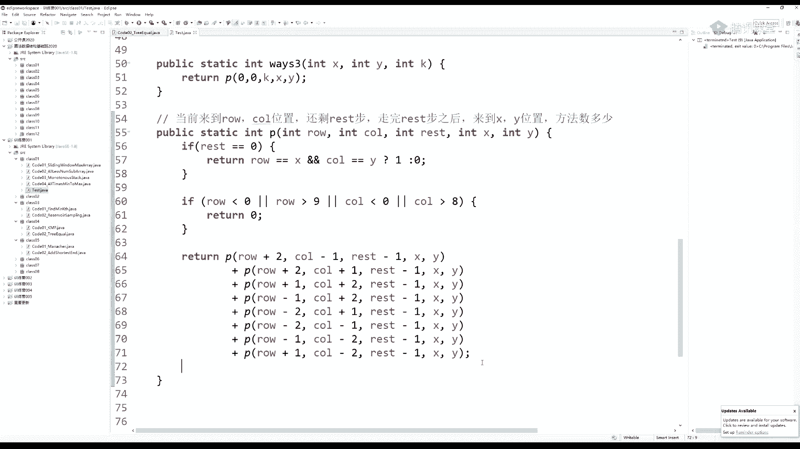

没事啊，你还是能听懂的啊，举个例子啥意思啊，就是我比如说我现在做一道题，这也是一个经典题目，哎呀我说一个字符串啊，我先给你叫spring 1，4x1是啥呢，123456这个字符串，那么我说它呢。

它有很多的旋转词，什么叫旋转词，由它可以变出很多旋转词来，他自己是自己的旋转词，这种旋转方式叫我没有旋转，还有就是我把左侧部分的一整体拿到右边去，会形成一个旋转词，234561，这是它的旋转词。

这你怎么旋转的，左侧一个长度的转到右边去了，它还有个旋转词，左侧两个长度的整体转到右边去，345612，三个长度的也可以转到右边去，456123，四个长度的也可以转过去。

5612345个长度也可以转过去，六五啊，612345整体转，那就等同于这个你整体都拿到右边去，那不还是他们吗，好我说一个string，它有这么多旋转词，这都是它的旋转词，那我问你，我给你两个字符串。

string一跟string 2，请你判断这两个字符串是否互为旋转词，如果是返回true，不是返回false，听懂题同学打个一，好那你说你暴力方法怎么解，你暴力方法你就把字符串所有得到的旋转词全部生成。

然后你再比较跟spring 2哪一个string 2，如果它属于任何一个，就属于旋转词，我说一个数，我说12345和454561231定是互为旋转词的对吧，456把他三个部分挪到右边去。

不就得到原来了吗，我把我的三个部分挪到右边去，不就得到这个嘛是吧，所以旋转词一定是相互的，那我们来想一下这个暴力方法，我们要这个暴力方法时间复杂度是啥呢，我们来估算一下，你怎么得到12345。

你你你起码得把这个拷贝一遍，b o n的时间拷贝出来，这个或者你自己不拷贝，你就你自己就当做第一个旋转词，那好我就认为你是b o一的，你得到12345这个代价必购一的没问题吧，那你怎么得到23456呢。

啊234561呢，这个恐怕得拷贝了吧是吧，你你你你想你啊，换换句话说，我们完如果完全如果我们完全不不不去生成这些旋转词，我们怎么判断一个strong是否互为旋转。

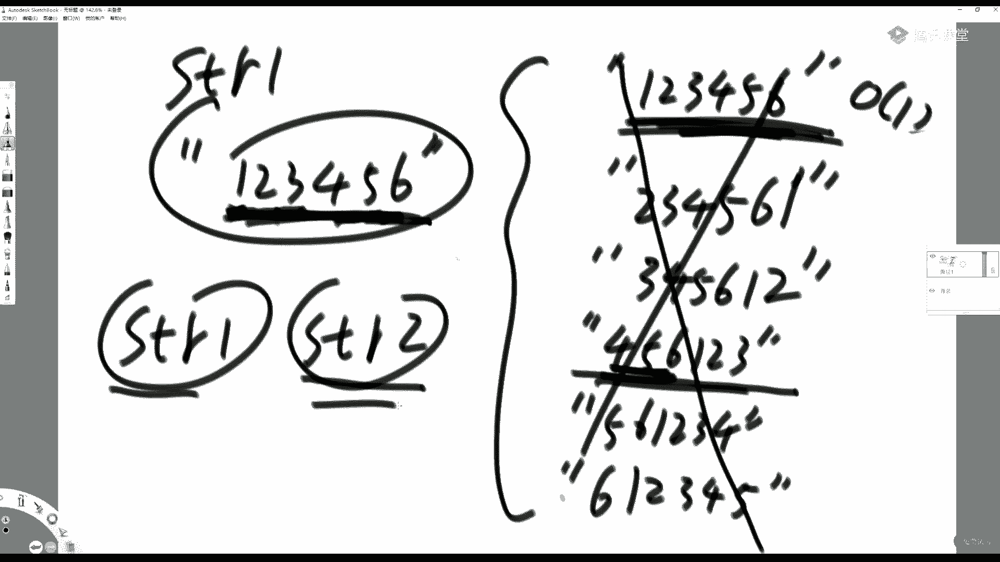

比如说我说这个123456和561234，怎么判断它是否互为旋转词，是这样的，我从一出发往后走六个，如果跟你都对上，就认为是旋转词啊，对不上，我从二出发往后走六个，我怎么走六个呢，转到六之后。

我再写一个类似于转回来的代码对吧，我二对你的五一下就没就不对了是吧，所以就不用转了，然后我从三出发便利的时候，我再转回，就有点像循，有点像循环数组那种方式，有点像循环数组那种方式。

我往下咽跟你同样多的字符串，如果每一步都对上，咱俩是旋转词，比如说我练到这儿的时候，我五六转回来1234跟你的561234正好一样，那么我就知道我们两个互为旋转词，这个东西是很复杂的。

为什么你一共有多少个位置啊，n个位置你一共要遍历多少字符串呀，每一次的时候你是不是都要遍历一个n的字符串呀，所以整个复杂都b勾n平方，是不是没毛病啊，那肯定这个暴力解肯定是好理解对吧，也不难写这个代码。

但是这也太差了吧，听到他在打一，好首先你要知道啊，我想判断两个字符串是否互为旋转词，长度都对不上，你就可以直接返回false了对吧，所以最大的过滤器是长度一旦不一样，你就不用判断了，你判断什么呀。

旋转词一定跟自己原来的长度是一样的，能听懂吧，听懂同学打个一，就你你连长度都对不上，他俩不是一个长度，你还判断啥呢对吧，直接返回false了，所以我们讨论的一切都是在两个长度一样的情况下好。

那么我们说这道题怎么样做，相信大家也也见过这个题，见过同学你也不用说见过了，反正我要讲了对吧，怎么做，假设我就判断123456和561234是否互为旋转词，我干嘛，我把123456生成它。

自己拼自己之后的一个大字符串，123456，再接一个123456，我给他增一倍，你长度不是六吗，我就看你这个字符串是否是这个大字符串的子串，我有一个字串叫56123，我就说他俩互为旋转词，就这么简单。

不管你是什么，spring一和spring 2，先判断长度长度不一样，直接返回了，如果长度一样，生成两倍的string，一加string这个字符串。

然后用k mp算法看string 2是不是这个大字符串的子串，这事就解了，流程听明白，同学打个一，那为什么呀，为什么我就可以说就这个结论呢。

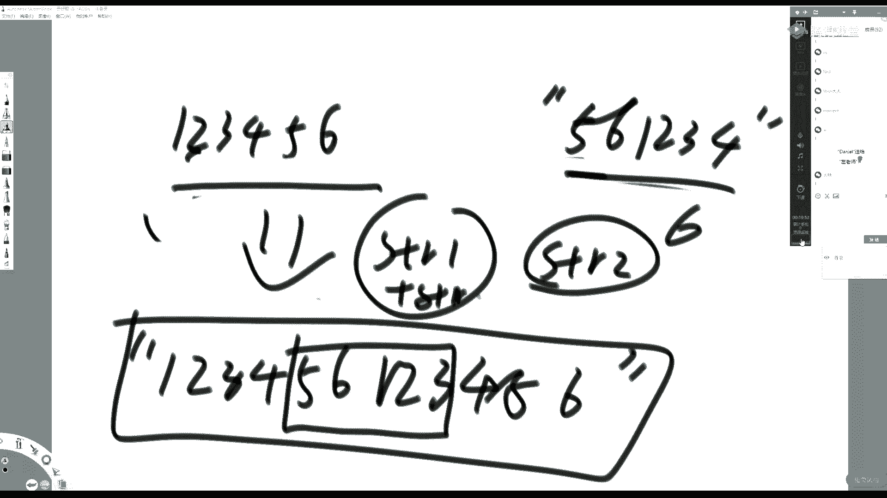

123456再接一个，123456，注意看从一开头长度为六的串，是不是它的旋转词是从二开头长度为六的串，是不是它的旋转词也是从三开头长度为六的串，是不是它选的词也是从四开头长度为六的串。

是不是也是旋转词，也是从五开头六长度的，也是从六开头六长度的，也是为什么我的方法是对的，因为一个串加一个串的形式，可以把所有旋转词全部拼出来，那你说现在某一个长度为六的串式子串，它可不就是旋转词吗。

听懂同学打一，就因为一个串拼一个串之后，所有旋转词我们都没举了，只要是长度为六的任何一个子串都是旋转词啊，你觉得有更简单的方法嗯。

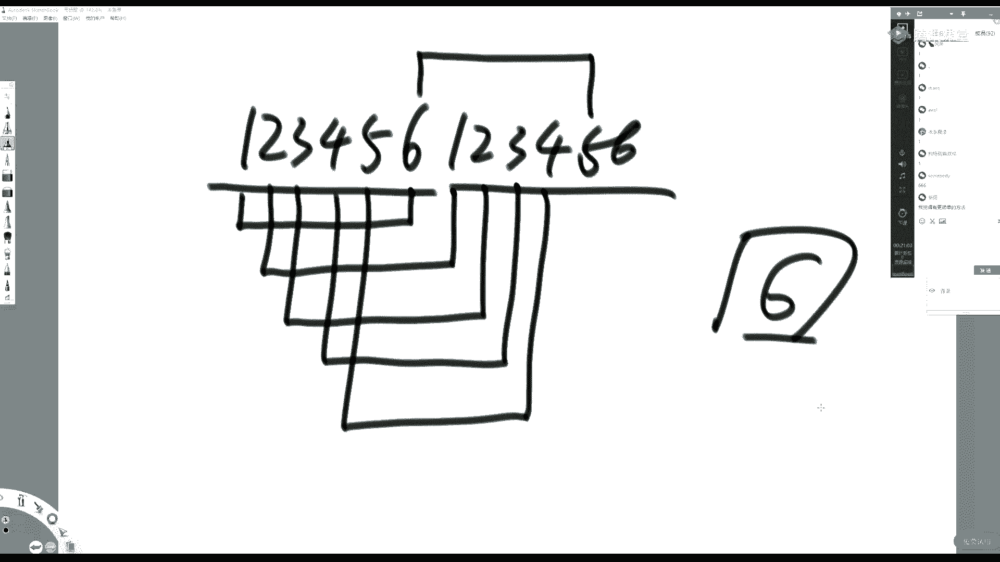

那，我们以我们spring一长度为n string 2长度也是n，他拼完之后是个2n的长度，我们k mp算法已经做到b格n了，你觉得还有更好的方法，他能不能在log n内解决，就问你这个问题。

你怎么可能连字符串都没看完，一遍就能确定spring 2是不是它的旋转词呢，那是不可能的，所以没有比这个复杂度更好的方法，听我同学打一，懂懂我说啥意思吧，啊你就要说小常数，那小常数这个事儿。

那就属于是扣的问题了对吧，我们说这个啊小常数这个事那就属于扣的问题了啊，注意啊，给大家提醒一句，你们在这看到那个index of方法，他不是他后台，不是k mp。

不是他后台是一个比k mp继续优化的一个算法，叫什么名字，我忘了他比k m p拥有更小的常数，但它是一个别的算法，但它时间复杂度也是b格温，至于这个index of底层是什么算法，我们就省掉了。

因为k mp已经足够经典了，听我同学打一，in the excel方法，底层不是k mp，它是一个比k m p更加优化的一个解法，但是它的时间复杂度还是b格温，只是比k m p优化的继续小常数啊。

你想要小长寿有是吧，你继续去学吧是吧，当然我跟你说没必要了，因为你们面试难度这都已经线性了，还要怎么样对吧，再有其他的算法，你有精力你就去研究，但是它对于你面试的边际效应其实已经非常小了好吧。

就这么一个东西，我们的课是非常功利的是吧，如果给你培养能力的话，我去讲a s m8 不好吗是吧，那你们这个班为啥想得到什么呢，最快的具备刷题能力嘛是吧，所以必须用非常功利的方式来讲啊，好我们再讲一个题。

什么题呢，我们提到过一个问题，就是这个我给你两棵树，一棵树叫t12 叉树，我们在讲二叉树的时候，需要提过这个问题，但是没有具体展开，基础班的时候，其实提过这个问题的，但是没有，刚刚是没有展开。

我给你t一这棵树它是个二叉树，我怎么给你一棵二叉树呢，我给你头节点，我给你t一这棵树头节点害的一，当然你就可以往下找到所有节点了，是这意思吧，我再给你t2 这棵树它也是一棵二叉树，我怎么给你一棵树呢。

当然就给他的头节点head的二，啊我问的不是head的二，是不是had一的子数，我不是问这个问题，我问的是hd 2所衍生出来的值的结构，它的对应这个关系是不是t一某一棵子树的结构关系，举个例子。

比如说765这边来个四，这边是3t1 ，这棵树是亮的，我这个hd 2有可能它这个节点跟它是不共用的，他俩是独立的数，但是如果我某如果我的结构是五四好，那就返回true，为什么呢。

因为t一这棵子树这个结构对应关系和t2 这个结构是一样的，我就返回tru，如果我这边是五四，我这边是543，返回false，因为我没有任何一颗子树叫五四。

我只有一颗子树叫543指数要求所有东西都要从一个头几点出发，下面全都要的，这叫子数，你不能选择把这个三忽略掉，那不是子数，那叫子拓扑结构，所以这个题就问你，我给你t2 这个这个数的一个结构。

你t一里面是否有一颗完整的子数结构跟它一样，有的话返回tru，没有任何一颗子树的结构跟他完全一样，返回false，这个提议听懂的同学打个一。

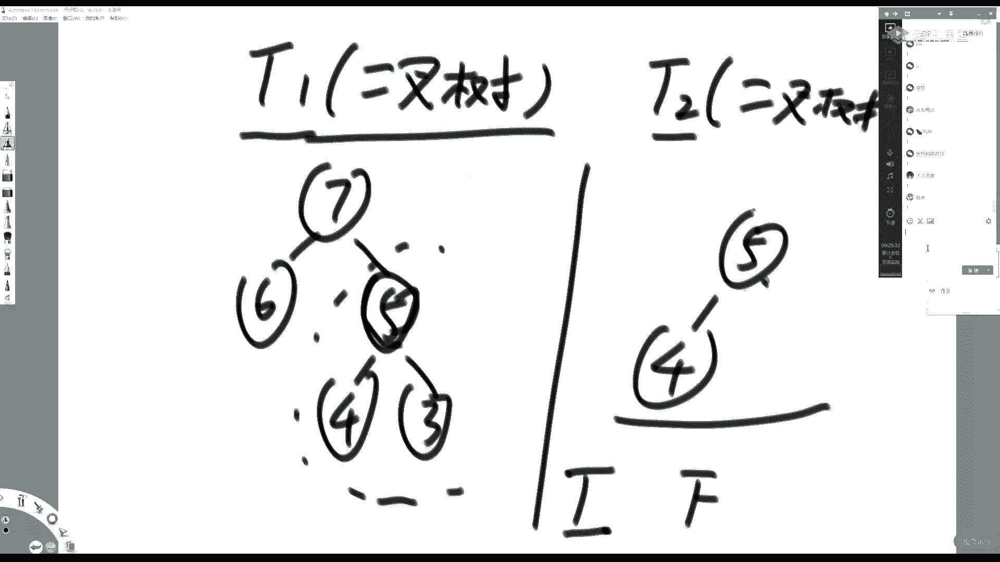

好这题怎么做，我们举个例子，这个指数是这样的，上面的值是字符串，可以吧，或者你字符串你理解不了，那我就是一个比较大的值，这可能是20，这个是40，这个是70，这个是30，这棵树假设t2 这棵树40。

30，我们干嘛把整个这棵树先序方式序列化，直接讲啊，我想想怎么给你讲啊，先讲暴力的对吧，我按照按照按照按照按照节奏来是吧，我们按照仪式来是先讲暴力的，暴力怎么办啊，暴力的就你就定义一个函数啊。

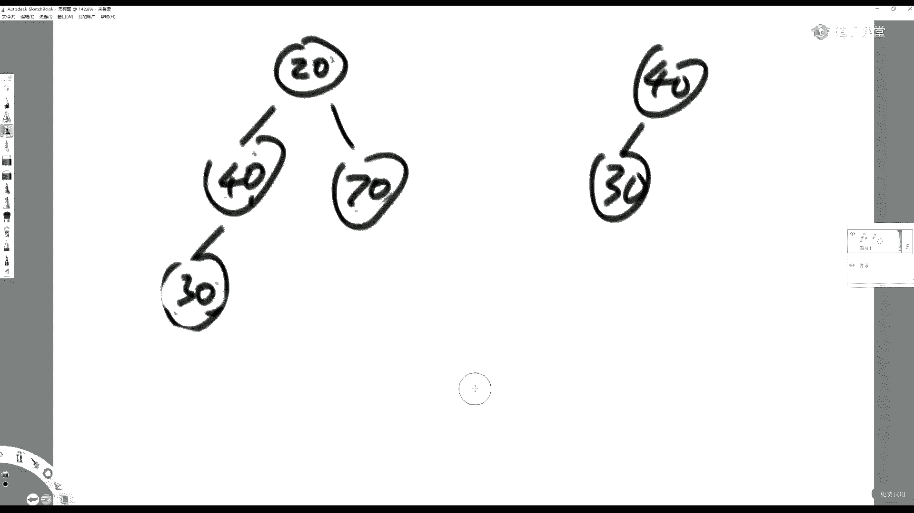

直接看吧好吧，在这儿呢不理解，暴力解在这儿，直接就是问你big这棵树头节点是b是吧，以头节点啊b做，头节点的数，其中是否有某科，子树，某棵子树的结构适合small为头的数完全一样的，可以吧。

就问你逼格做头节点的数，它的内部是否有某棵子树的结构和small为头的数是完全一样的，如果你这个定了，那你主函数直接调把head的一传进去，head的二传进去，它不就行了吗，你不就是想求这个问题吗。

我就给你写出这样的递归好不好，那怎么做来看，如果small已经等你空了，是不是任何数都包含空数结构是，所以返回出，如果死猫不等于空，就继续在死small，它不等于空的情况下，开继续，如果死亡不等于空。

如果b格已经等于空了，空数是不是不可能包含一个不空的数false，那如果这个衣服还没有返回传下来的，传下来的语义就是说b也不等于空，small也不等于空对，没错，前两个好懂啊，任何数都包含空数。

出任何空数都不可能包含一个不空的数，false如果b也不等于空，small也不等于空好，这个方法是啥，解释一下，这个方法是说，为了怕你有歧义，我们不妨设啊，就是害的一根head 2吧，好吧。

这是我们b跟small理解这个方法是啥，这个方法是问你head一为头的数是否在结构对应上，完全和had 21样，它不它已经是不探讨子数的问题了，就是问你害的一整棵树是否和had 2整棵树的结构一样。

我们先不管它，假设它就是一个黑盒，所以我先判断以b为头的指数是否它就是等于small的，如果是，那当然是处，啥意思呢，就是我整棵树给你整棵树压根就是一个结构，我就返回处，如果这个没中，我怎么办。

我去讨论b格的左数上是否包含猫，或者b的右数上是否包含调用大过程的，自己看到了吗，我左树上是否如果有包含small，我就返回true，我右数上如果包含small，我也可以返回true。

两个有一个为true，我就可以返回true，这个黑盒你先不用管怎么写的，怎么写的，整个流程听懂他在打一，不同学打二好吧，接下来只剩这个黑盒了，你怎么判断两棵树的结构完全一样呢，head一等于空。

head的二不等于空，不就完全一样，had一等于空，had 2不等于空，那就不一样，force had一不等于空，had 2等于空，也不是完全一样，force hide一等于空，head的二也等于空。

完全一样，都是空出had一的值，如果不等于had 2的值，那结构就不是对应false，到了这一步就等于说我had一跟head 2有值且验证通过了，那我怎么保证两棵树完全结构一样呢。

我的左数得等于你的左树结构，并且我的右数得等于你的右数结构，这才叫完全一样，所以这是一个大递归，套了一个小递归，小递归自己调用去判断两个结构是否完全一样的方法，听完他再打一，这个复杂度是蛮高的。

那我问一下这个复杂度度有多高呢，啊怎么估计呢，有同学知道吗，这复杂度应该这么算。

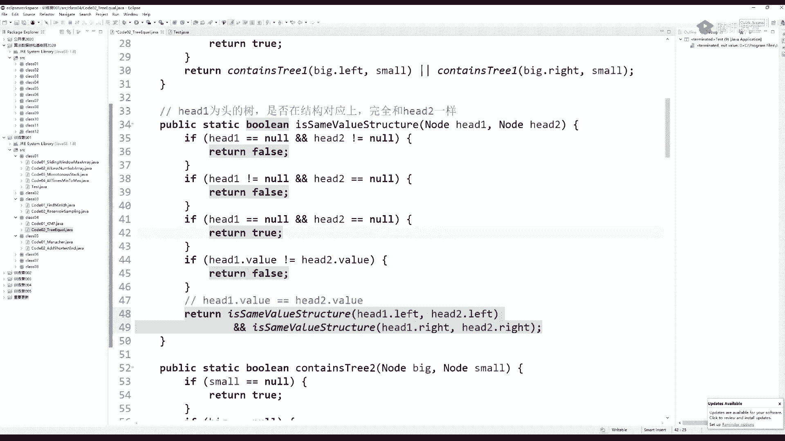

我给你举个例子，你就懂了，压根就全是1t1 n个节点，t2 m格节点节点，别看刚才写的花里胡哨的，我们刚才的方法实质就是我回头跟你的头诶，咱俩对上了，我这左孩子跟你这左孩子唉，咱俩对上了。

我我这有孩子跟你这幼孩子挨打俩对上了，但我下面还有东西，你下面已经没有了，说明我的这个头匹配失败，这只是否定了这个做头的时候指数匹配不出来，接下来我这个头对你这个头，我这个一对，你这个一，我这个一对。

你这个一，但我下面还有东西，你没有了，匹配失败，我这个一对你这个一我这个一对，你这个一我这个一对，你这个一，但我下面还有东西，你没有了，匹配失败，你一共有n个节点，每个节点都做个头。

最差情况下要路过m个节点，b o n乘m的，别看写的花里胡哨，他就是这个复杂度，听懂同学打一，好啊，所以我们想一下我们在基础班提过的可能是特别微不足道的一句话，我不知道你还记不记得。

我在基础班第一节课的时候，我说了一句话，我叫你分析一个算法流程的复杂度，前提是对这个算法流程足够熟悉，你会代码写代码没用，你哪怕写出来了，你不一定能分析复杂度，需要对这个流程足够熟悉才能分析出来。

听我同学打一就，你只有把整个流程的本质全抓清楚，你才有可能去分析复杂度，理解这意思吧，你看看我们刚才写的花里胡哨的，你敢做，哎呀好暴力啊，以至于我都不想算它复杂度了，实际上没有那么难算。

你要是对流程足够清楚，你可以估算出来的复杂度，不用看代码吗，可以不用看代码，可以作为辅助，但实际上本质是可以不用看代码分析复杂度的，你把伪代码写出来，足以让你分析复杂度了，足矣了啊好。

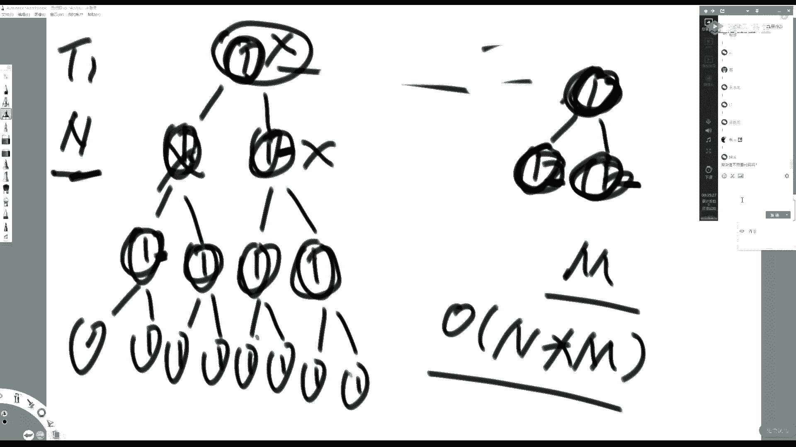

那我们先来讲一下这个我们想用什么，用k m p对吧，我怎么用k mp，t一这棵树把它序列化成一个数组的形式，先序的方式序列化t2 这棵树把它先序序列化成数组的形式，在数组里面每一个位置的值。

甭管就单独一个位置的值，不管它有多长，我就把它认为是一个字符，那么我就可以把这个数组认为是一个字符串，啥意思，零位置，你这个二叉树的值是1000，我我我就认为1000他就是我的一个阿斯卡码。

他就是一个字符，懂啥意思吧，下面这个这个值可能是17，我就认为这个17它就是一个字符，我去，然后我要补一个空位置，我要认为这个空字符它就是一个字符，懂啥意思吧，我把t一变成一个一个数组。

我就可以认为它是一个字符串，我把t2 也用先序方式编序列化，也认为它是一个字符串，告诉你，如果这个字符串是它的子串，t21 定是t一的子数，听懂的同学打一，来那我们来简单看一下这个代码。

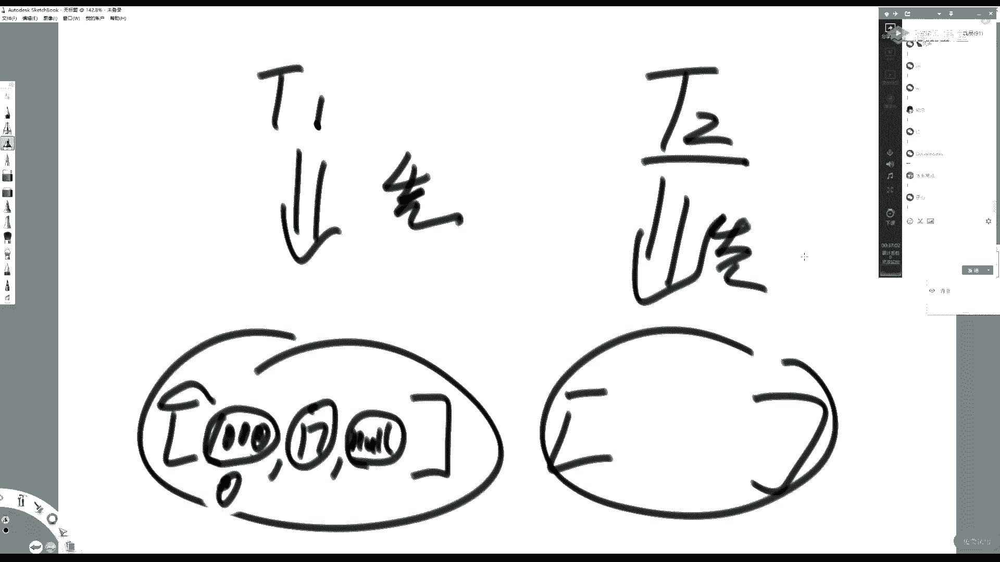

来看，先序方式序列化大的数我就会得到一个由字符组成的a release，这里面是含有空的，因为我们序列化的时候要拿空去站位，不懂的同学翻二叉数序列化的课，基础班讲过了，先用就是用，也要把空算上。

big序列化成一个由string组成的一个字符串，里面可能还有空的小数，也把它转化成一个字符串啊，一个啊一个字符串组成的阿瑞利斯塔对吧，哎呀还是给你举个例子吧。

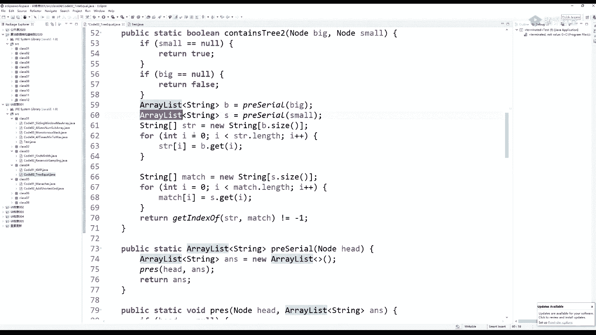

好吧嗯，他怎么序列化，先序方式，先来个十，它是字符串形式，所以十个字符串，下面我要补空的位置，所以这个数组中下面是空，我要补空的位置，所以这个数组中是空七，52，我要补空的位置，我要补空的位置。

我要补空的位置，这是它序列化的结果，十字不串三字符串空空，七字符串52字符串空空空，它序列化，这是我的t275 52，补空补空补空，我就把它认为是一个大字符串，第一个字符叫十，字符叫三这个字符串。

第三个字符叫空，第四个字符叫空，第五个字符叫七，这个字符串，那个字符单独字符叫52，这个字符串理解吧，我就可以认为一个一个都是字符七，52空空空这个字符串属不属于它的子串，如果属于t2 。

就是t一的子数一定存在这样的关系，不管你这个t2 差在哪都是一样的，插在书上哪个位置都是一样的好就这个改法，为什么，因为先序序列中一个字一个序列化的字符串只代表唯一的结构理解吧，因为先序序列化的时候。

一个子串它只会代表唯一的结构，如果我说我的大串中包含某个子串，就代表原始结构中包含我t2 的结构，听懂同学打一先叙方式，序列化是没有歧义的，好啊，那么呃这个有些同学问我的问题。

其实就是这个coding coding问题啊，coding问题，有没有有问题，我看一眼，别有些问题我错过去了。

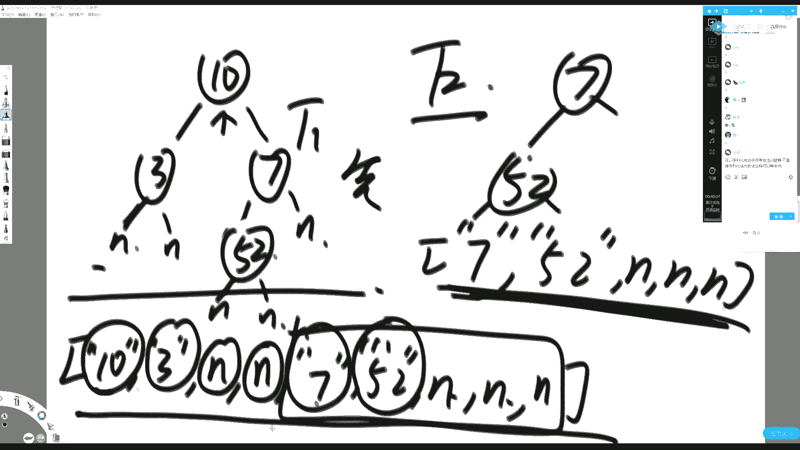

先生成b的序列就是这个玩意儿。

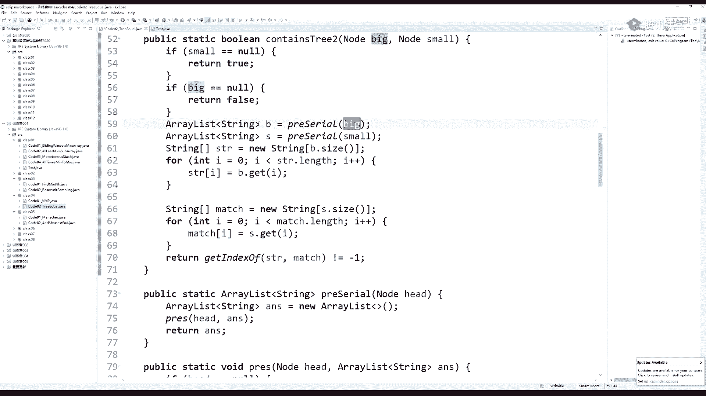

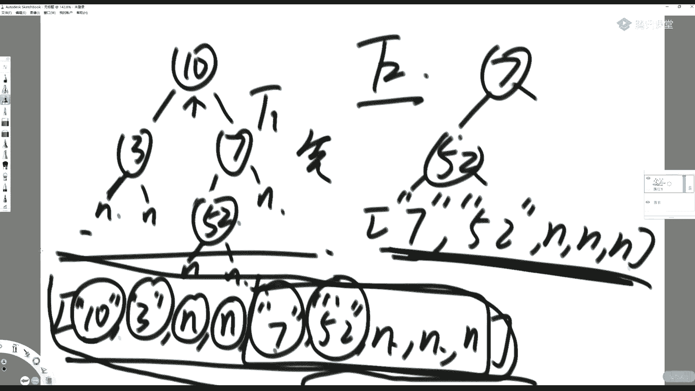

再生成small的序列，就这个玩意儿，为了让我们代码看起来比较明显一点，string原来它是一个字符类型的数组，现在string变成一个字符串类型的数组，我就把i位置的字符串认为是一个字符行吧。

生成一个这么一个长度的string，生成一个这么长度的match，接下来k mp去吧，k m p简单做一个改写，这个字符串如果等于这个字符串x加加，y加加，如果next的有东西，如果x那如果没法跳了。

x自己加加，否则y向前跳，不就是改了两个字符，怎么比嘛，现在是字符串来比对吧，next数组的时候，不就是问a减一的字符串和cn位置的字符串是不是一样吗，该怎么做跳转还怎么做，跳转没有区别。

那怎么叫椅子eq呢，如果一个为空，一个不为空不相等，如果两个都为空相等，如果两个都不为空，但值一样相等，不就这么个事儿吗，两个都是向空的处，如果一个为空，另外一个不为空的false，如果两个都不为空的。

问你a是不是一cos b，这不就是椅子eq方法吗，所有方法其实还是k mp，只不过我把字符串延展了一下，听我同学打个一，好有同学会问我，为什么要把改成数组的形式，为了防止一些歧义，我给你举个例子啊。

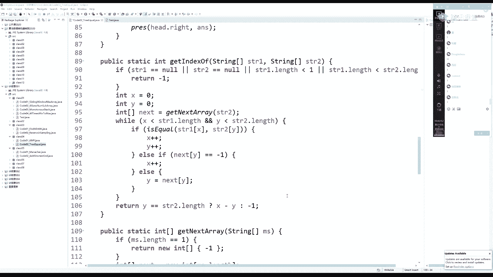

啥例子呢，我给你举个例子啊，如果不这么干会有什么问题啊，我得想一个例子，如果你就把它序列化成字符串，它是什么，一诶好像不会有问题，等会儿啊不对，一要加下划线的啊，我想想啊，就是有可能会产生歧义啊。

你想个例子啊，首先有一个例子是很好想的，就是如果，想想是什么意思啊，就是如果我把它单独把它序列化成一个字符串，它匹配的时候可能会有问题啊，这个例子我不是很好想想一下啊，一时间想不到了啊。

就是他有可能是有问题的，然后你其实有这种好想的例子，就是万一你这个节点它们里面本身值是带下划线的，你如你不用数组表达的话，你自己下划下划线表达的话，你要给它序列化成一个字符串的形式。

因为你这个假如某个节点值里面是带下划线的，你一切就切断了，这个听懂同学打个一这种例子还是比较明显的，懂啥意思吧，就是节点中如果它这个它这个no的类型是一个字符串类型的，值里面是包含下划线的。

你你其实你这样序列化，你反不反序列化时会出现问题，这就是我们为什么一直强调，我们要用数组的形式来表示一个序列化的结果，但其实如果要是集中没有下划线，其实应该其实也会出错，但这个例子我一时也想不到了啊。

就哪怕你节点值是不包含下划线这个字符的，它它其实也会出错，但一时间我找不到这个返利了，当然就直接记成这样行不行，你你就认为每一个东西它进到数组中的一个位置，甭管它多长，我就认为它是单个字符串。

哦哦我想到了我想到了。

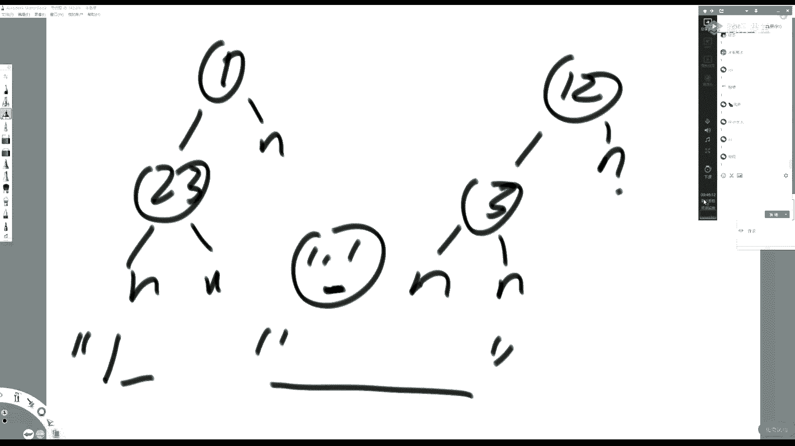

它序列化的结果是11020下划线三，悟空三下划线补空下划线，补空下划线，补空下划线啊，我去的话结果是二零下划线三，下划线补空下划线补空下划线补空下划线，我是你的子串，但我不是你的子数结构，听懂同学打一。

经历了一个贤者时刻是吧，我倒杯水去，有没有有没有完全一头雾水的同学，那估计是我们序列化那节课，你没听到，好有的同学会诶，那你之前补一个呢，之前补一个应该是没有问题的。

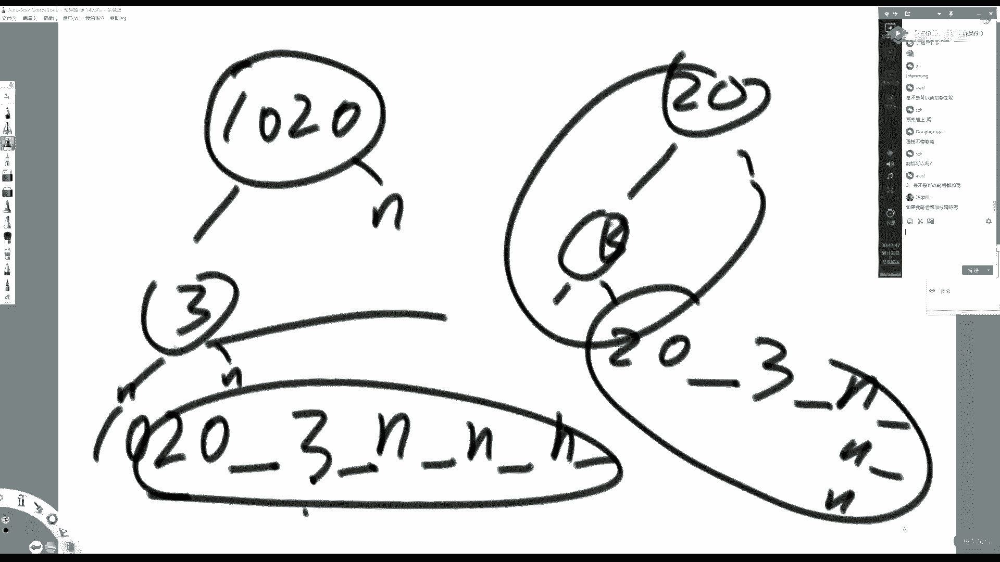

之前补一个应该是没有问题的啊，就说这个哪怕就是1020，什么叫之前补跟之后补我都补，那我这个就是下划线，1020下划线我都补，下面是三下划线，三下划线空的时候我都补下划线，空下划线这边也是空，空下划线。

空下划线这边也是空下划线，空下划线，如果你如果你前后都补的话，是不会有问题的，因为你这样就严严严格的区分好了，一个值所在的位置在哪，听我同学打一，啊一定的啊，这个是一定啊，也也啊对一定的。

你比如说刚才那个东西就可以区分了，我这是20，这边是三，那那它其实会区分说我是下划线，20下划线，然后是下划线，三下划线，然后是下划线，空下划线，这边也是下划线，空下划线，最后是下划线空下划线。

这是不会有歧义的对吧，我没有一个子串叫下划线20，我只有是20这套这个，所以它是不会有歧义的，你别搞那么麻烦，你就搞成数组不香吗对吧，为什么非得逼我举那么多返利是吧，为什么要逼我怼你是吧。

听我同学打个一，哈哈哈哈，数组是不会有问题的啊。

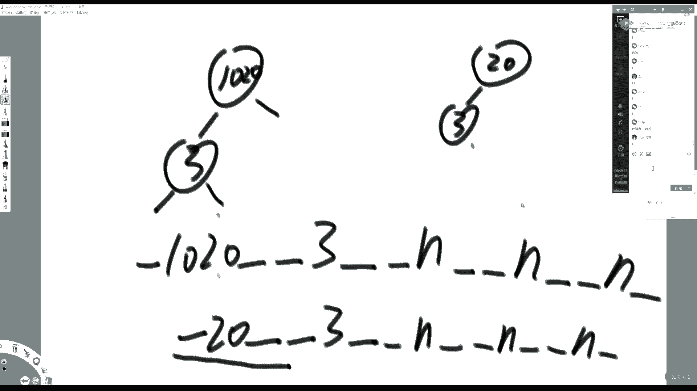

嗯好啊，这个我们终于给他绕过去了，那么我们现在讲这个b f p r t算法，他解决的是个什么问题，大家在面试中经常遇到这个问题，简直玩到死，又是一个跟kp一样会玩到死的一个东西，啥呢，在一个无序数组中。

怎么求dk小的数，注意这个k是从一开始的，我的第一只有第一小，第二小，第三小没有第零小，第一小，第二小这回事儿，如果你规定好有d0 小，那他这个k就从零开始，看你怎么规定。

往往它规定的地基小事都一是从一开始的，那么在一个无序数组中找到dk小的数，我们知道排序肯定可以直接拿出来，那就没意思了，我的问题是在无序数组中求dk小的数怎么样，b格on拿下，听到他在打一。

有没有之前有问题啊，我看一眼，翔龙同学为什么要补空，你可以去看一下二叉树序列化的内容，因为你不补空的话，二叉树有可能啊都是相同值，结构不同，但可能得到序列是一个，所以这就是为什么我们我们要补空空。

这就意味着后续没有了，它相当于在结构上我占住一个位置，它代表没有后续的意思，这就是为什么序列化的时候要补空，只有补了空之后，序列化才代表唯一的结构，理解这意思吧。

可以看一下我们基础班的那个序列化的那一节，啊然后，其实这个问题它已经有一个非常好理解的线性时间内拿下的方法，它就是一个b o n乘log n的算法了，对不对，他什么思路呢，我随机选一个数，随机选。

然后利用荷兰国旗问题，比如我随机选这个数是m，那么我们利用荷兰国旗问题，一个b和n的过程，可以在这个数组中把他的小于m的放左边，等于m的，放中间大于m的放右边对吧，然后比如说我的下标是29~31。

这个下标范围上是等于m的区域，这个我们也是也是可以拿到的，没错吧，如果我们要求d，七小的数就说明我们选的这个划分值，它没有命中这个k接下来我们在左侧再随选出一个m撇，再把它小于m撇的放左边，等于m撇的。

放中间大于m撇的放右边，再有他这里面有没有命中k，不过我要求的是第70小呢，那我就在右边继续玩这个partition，一直到命中到了停，听到他在打一，那么这个他是不是快牌，它不是快牌。

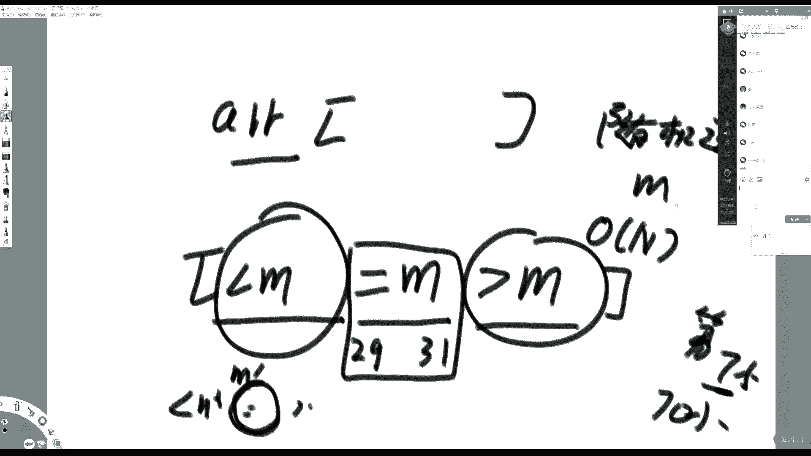

我我快拍，我是不用动的，左侧要进一遍递归，左我测进完递归之后，回到这个，我要在右侧去进一遍递归，它的时间复杂度是b o n乘log n的，而我们这个过程是什么，我们这个过程是在数组中随机选一个m。

一旦我划分出小于m的，在左边等于m的，在中间大m的在右边，接下来我要想命中这个k是左右两侧，我只会进一侧的，另外一侧我看都不看了，听懂同学打一，怎么选，怎么选这个m随机选，随机选一个数，就是随机选。

那么这个的时间复杂度它已经是b一个o n了，注意这个是怎么来的，它是根据概率累加来的，什么意思什么意思，就是大家想一下，如果我在一个数组中，我选了一个数m过了一遍荷兰国旗，问题是一个b on的，对不对。

如果这个m选的非常正中间，接下来左右两侧递归，它只进一侧的，没错吧，那么左右两侧规模是多大呢，基本上就是二分之n，这m选的非常靠中间，那它左右两侧的规模基本上是二分之n的数据量。

所以这个表达式就是t n等于t2 分之n一倍的t2 分之n，这左右两侧递归只进一边，没错吧，tn等于t2 分之n加上一个b o n，这个很明显它是一个b o n的方法，为啥八四公式我们在基础班讲过了。

对于这个公式来说，a等于一，b等于二，以b为底，a是小于这个次方一的，所以如果你这个划分值的位置打的非常的正，那么我后面的过程他就会收敛于b格温。

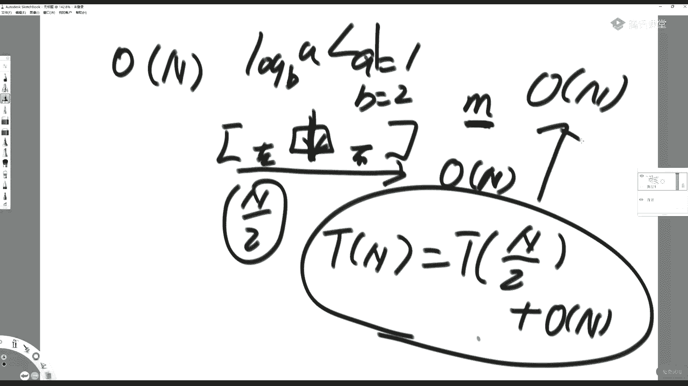

如果我这个划分值打得非常之不正，比如说我这个m算完之后，我是来到整个这个范围上最左边的位置，接下来就要面对的是后面这些所有的数，你继续进递归它就变成tn等于tn减一，是后续的规模，你这个m打到这个位置。

我我我我m已经没没有命中了，我剩下的数据规模是多大呢，是n减一这个规模，那tn等于tn减tn减一，加上一个bn这个什么复杂度，一个n平方嘛，很明显就是你这个位置过了一遍，搞定了一个位置。

你再过一遍搞定了一个位置，再过一遍搞定了一个位置，再过一遍搞定了一个位置，他很明显是个b勾m n平方的，所以我m位置到底打在哪儿就是个关键了，他打在中间位置，它就是收敛于b o n的，打得非常偏。

它就是退化到b勾n平方的，到底以哪个为准呢，因为我是随机选的m，所以好情况跟差情况都是概率事件，这个概率公式用非常麻烦的数学表达式写完之后，一球还是收敛于b o n，听懂同学打一。

如果你是基础班跟下来的，你一定知道我在说什么，对不对，给我点提醒，是不是这样，大家可以发表感慨，是吧哈哈，如果你是基础班跟下来的，你一定知道是啥意思，这种方法他就已经足够优秀了。

这种方法它已经足够优秀了，但是他是用概率累加的方式求最终复杂度的期望，你在笔试上如果遇到了，你就这么写，已经可以说来到b格温了。

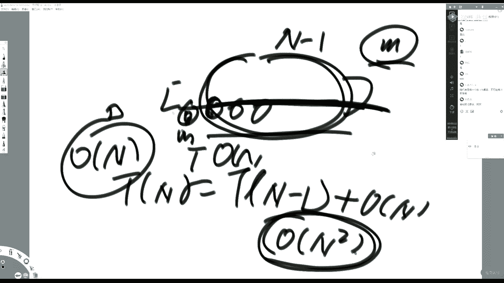

我来看一下有没有这个方法，我看一下啊，啊对对对，还想再讲一个方法，这个看一眼这个哎，这就是我们刚才讲的方法，process 21会儿把这两pos一好吧，pos 2啥呢，就是阿瑞，i arrl到l范围上。

找对于index，塞尔瑞l的r范围上，如果排序的话，但不是真的排序理解吧，如果排序的话，而不是真的去进行排序，如果他只只管这个范围上，其他范围不管其他范围也不参与我们的，如果排序也不参与。

连想都不想对吧，如果排序的话，找排完序之后，位于index位置的数，而且我告诉你这个index，我告诉你这个index他一定在l2 范围上，一定在l2 范围上。

就index一定是l到r中的一个位置位置理解吧，不是值，是位置，我们processor的方法，你说你这个方法定了，你主函数怎么调啊，你不是号称要在二位上找d dk小的数吗，那你主函数怎么调呢。

主函数其实你就只能调用这个process 2啥呀，re从零到n减一范围上位于如果排完序之后，位于index是k减一位置的东西，返回就是dk小的数，听懂他打一，是不懂同学就打二啊，我看到会回你好。

那么我们来看这是怎么做的，如果l已经等于二了，我要告诉你，index一定在这个范围上，别考了，你要的就是唯一的这一个数，这可是一个强大的潜台词，就是我一定能够保证index它就是l到r范围上的位置。

你在l等于r的时候，其实就就已经就说明什么，你到这一步就是l等于r等于index，一定是这个关系返回这个l位置的数就行了，这是我的base case，如果你这上面不止一个数，不止一个数，我们干嘛。

这在干嘛呢，l加上一个随机位置，这个随机是怎么随机的，这个蓝色的这个东西啥l加上一个啥，这个蓝色我是怎么做的，这个随机l其实就等同于l加上一个零到r减l，到r减l等概率随机的一个值。

不就是随机选出一个数吗，你l如果加零的话，就把l选出来了，你说l如果加一的话，就把l加一选出来了，你l如果加r减l的话，就把r选出来了，所以这一句就相当于我我等概率随机选了一个值来做他的划分。

听懂他在打一，干嘛荷兰国旗问题，它返回的是什么，返回一个数组，这个数组长度一定是二，我告诉你这个range数组啊，它一定有个range，零和一个range 1，除此之外就没了。

他这个返回一个长度为二的数组，这代表什么呢，这代表l到r这个范围上，我问你划分值在这个范围上的左边界和右边界在哪儿，举个例子，比你l到r范围是0~1000，假设我以某一个划分值，荷兰国旗问题划分完之后。

等于这个划分值的范围是70~800的，在0~1000这个范围上划分值，最终它是坐落在在这个范围上的，70~800这个范围上好禁止零就是70，range一就是800，这个就是利用荷兰国旗问题去做划分。

等于划分值的区域是从哪到哪记录在这个range里，同学打一，都是基础班讲过的啊，那我就看，如果index是大于等于左边界，但小于等于右边界的，哎，命中了吧，不是我选的这个划分值命中了呀。

这个index正好命中了它的范围，返回这个值就行了，没有后续不走任何递归，如果我这个index是比我左边界还要小的，啥意思，那你荷兰国旗问题画完之后，他的这个命中是在划分值，左边的是小于划分值的范围上。

你给我继续去玩儿，继续去考察命中的问题，所以调用自己l这是啥位置，第一个等于的在前一个位置是不是小于区域的最后一个位置，所以这是小于区域上，你再去考察index在哪去打。

index小于睿智零的时候没命中，你既不在它中间，也不小于认知零，那就只剩下index大于认知一的时候，那就是右侧有右侧的范围上，你给我命中去吧，就这么个代码啊。

所有的code包括这个partition都是给你讲过的，听懂他打一，这就是我们说笔试你怎么做，你就怎么做，再打一的同学，我要我，我要对你表达一下敬意，你现在能够很顺利地听懂，绝对我绝对相信你。

基础班掌握得非常牢固，你们下了功夫的啊，正好在边界上呢，注意没有所谓的。

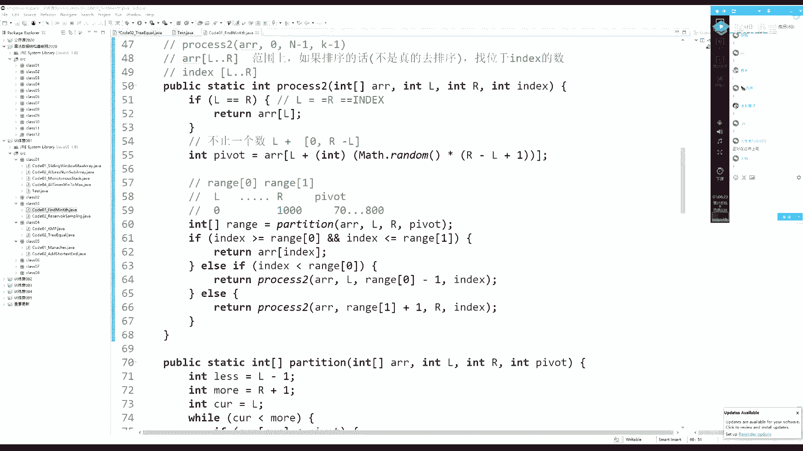

正好在边界上啥意思，我一个数组中，我假设一个数组中，假设我拿70这个东西做划分值的，他给我一个范围，假设17~89这个范围上躺着全是70，就这个意思，你你说你要index，我要位于你处。

你排完序之后处在17位置的数，那不就是命中了吗，说我index想要你排完序之后处在89的位置，那不就是命中了吗，如果你小于17，你左侧给我老老实实递归去，如果你大于89，你右侧过老老实递归去。

他没有碰边界这回事，所谓的等于区域的左边，这个右边界指的是等于区域第一个数坐落在的位置和，等等于去最后一个数坐落在的位置，听筒下打一没有边界这回事儿，就是命中没命中，理解吗，bf p t算法是啥。

这个东西它已经是b格温的了，笔试的时候就用它就行了，绝对快，那么bf p r t算法是啥呢，f p bf p r t算法是说哪怕你不用概率求累加，不用求概率，最后的长期期望。

我也能让你收敛到b o o n用概率的方法正，也不用概率的方法设计，我就让你严格b格温，这就是b f p r d算法，他跟我们刚才刚才介绍，就刚刚介绍这种方法，时间复杂度是一样的，只是人家是用概率。

而我bf p t算法利用严格的流程，我就可以告诉你它概率都不用概率这回事，直接收敛到b格温，这就是bf prt算法，它的意思打一知道bf t2 t算法要干啥了吧，你不理解概率也可以收敛到他。

f p r t算法，它名字就叫bf p t算法，这是mit 5个大牛名字的简写，首字母简写抽出来的算法叫bf p r t，啥意思吧，如果他的全名就把所有五个人的名字都拼出来的算法。

人家正式名字叫bf p r t简写叫五个好朋友算法是吧，叫无有算法，是不是，说起这个给大家吹个蛋啊，跟bf p t算法是非常有感情的，当年啊这个从美国回来之后啊，突然间有1年很想去美国玩一圈儿。

然后旅游一下是吧，也不打算长期生活旅游一下嗯，对我来讲旅游还是挺好的是吧，然后那年是符合历史大潮是吧，这个奥巴马一上台宣布，中美之间旅游护照一下子能搞到10年内不用再签，你要能搞到10年内不用再签。

说大家一看这个我靠时间好长啊是吧，就挺不错的，就是在这之前，美国护照是2年以前的，2年过期之后，你得重新去大使馆重新交一遍钱，重新过一遍面试，但是那个奥巴马那个到那个时候他是完全宣布10年内免签。

你说免签吧，就你只用办了理由签证之后，只要填一个表就可以去了啊，那就那当然申请的人就很多嘛，有些他有些可能他不去美国，但是他觉得哎呀这个办一个签证，想去的时候就能去，而且也不用抢时效的问题。

10年比2年长多了是吧，结果我也去了啊，我正好想到那个时候去美国玩一圈儿去，卧槽我那天看了就感觉不对劲，宣布这个政策没有两个月，已经到冬天了，大使馆门外人山人海，我也想玩了，但通过率肯定非常低。

他是临时在那边，我要去美国有哪些目的，结果眼睁睁地看着我前面五个人，他们是冬季回来再回家打吧，打算着春季开学的时候回去继续上学的人，五个人被拒了三个，我想就完蛋了是吧，这不拿点硬功夫，看样是过不去了。

然等到遇到我的时候，他说你为什么要去美国，我说我去美国波士顿玩儿，他你为什么要去波士顿，我说我是一个在国内算法教学的一个老师，但是当时还在工作，只是一开始已经承担开已经开始教学工作了啊。

就是刚开刚刚开始讲课的时候，还在单位打工的，但是我说我是在国内教算法的一个老师，我非非常崇拜一个算法叫bf p t，他是mit 5个大牛搞的算法，我想去mit的校园，就在波士顿嘛。

想去那里缅怀先贤的足迹，我那个面直接就是计算机科学的，他一听啪盖个章，欢迎你是吧，人才是吧，赶紧他妈过去是吧，这个这个是一个真的蛋啊，这个是这个不是在跟你开玩笑的啊，这是我当年的真实经历是吧啊。

你看这个你你要是会一些算法装逼都是香的是吧，你这是，啊好我们先来扯这个算法是吧啊，再把这个打回事啊，刚才那个流程是说刚才那个流程是说第一步飞机，一个数，假设它叫m，第二步，荷兰国旗问题。

小于m的放左边等于m的，放中间大于m的放右边，而且知道它的左边界和它的呃，知道他自己的左边界和它的右边界等于区域的，第三步是如果命中了k或者说index，返回这个m值，如果没有命中左侧。

右侧只选择一侧走好，我告诉你bf p r t算法后面的过程全一样，他就是怎么选这一个数非常之讲究，可以认为bf prt算法跟我们现在刚才刚搞过那个算法，后面的过程全一样，选出一个m之后。

我也利用荷兰国旗，问题小于它的，放左边等于它放中间带着他的放右边看命中没命中没命重的近左侧，整个重复递归右侧，或者进右侧两边直径一侧为一的区别，就是怎么选一个数，讲究的，这就是bf p t算法。

听懂同学打一，全一样啊，就关键点就是聚焦在怎么选这一个数上，唉我感悟同学感觉很好，可以，但那就不经济了，为因为快牌是你选出来一个数之后，你左侧跟右侧你死活要进递归的bp算法，为什么精心挑选这个数递归。

如果只走一侧的话，我可以让这唯一的后续过程变得尽可能淘汰掉比较多的数字，可以像bf p t这样算法这样选择精确，要精挑细选一个数，但是没有必要，反正你都得去搞，无聊的很，增加了常数项的优势，但没有必要。

因为它两侧都要去走的，而我们这个题是只走一侧的同学打个一，bf p r t算法用它是有实际意义的，所以就随便选一个得了是吧，别平白无故的增加了一些东西了啊，好那他怎么挑这个数来了三两步我们就省掉了。

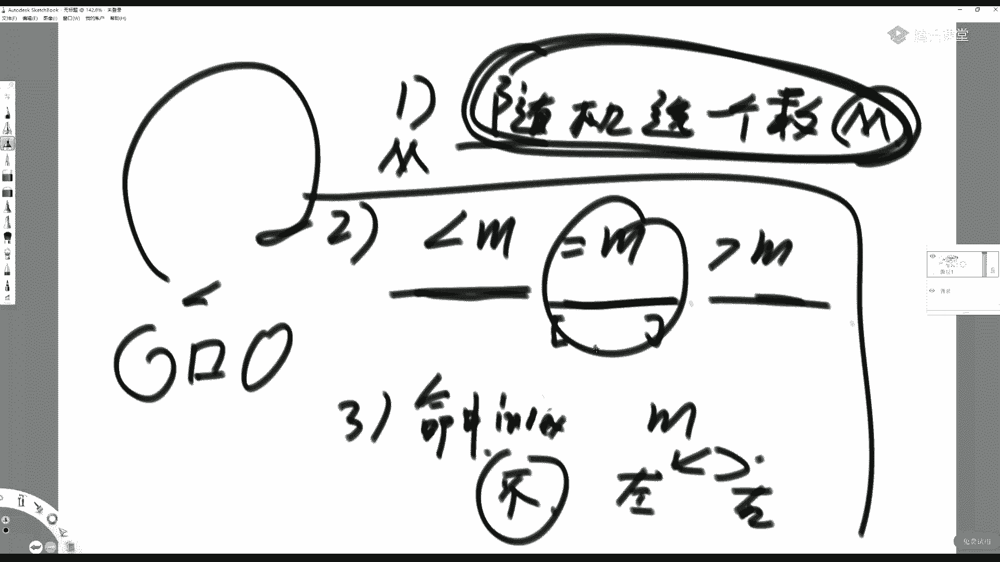

因为都一样，关键就是第一步如何挑数，如何选出一个精挑细选的m来，怎么样搞出这个精挑细选的m来听我讲，先写一下这个bf p r t算法的过程，这个函数是啥，bf p r t对吧，给我一个arr。

给我一个二位，这个二位长度是n在上面求dk小的数，是这意思吧，那你就给我传一个，传一个参数列表是啥呢，二位dk小的数，你给我返回这个数字是吧，这就是b假设bf pr的算法就这么个玩意儿好，我们来看了。

同样精挑细选出m来，第一步数组中，零范围，0~4范围上，这个数算一组，5~9这个范围上的数算一组十，直到14，这个范围上的数算一组，最后一组如果不够五个，那单独一组，第一步咱就是脑袋想了一下。

什么也没干，就是在逻辑概念上，我让0~41组，下一个五个数，5~91组在下面五个数，十到14是一组，依次往下，如果后面的数不足五个数，那就后面的数单独这些剩下的数一组只是脑海中过了一下，什么也没干好。

第二步啊，0~4这个范围上，就只是这五个数的内部排个序，这一组有序，5~9这个五个数的内部有到14，这五个数的内部有个序，每一个小组请你都排好一个序，但是跨组与组之间是无序的，只是五个数一组的内部。

这五个数之间你们分出一个顺序，第二部好，讲到这儿，听懂同学打一，啊看一下大家有多有多集中，有我问你，如果整个二位是n个数，我做完122步之后，时间复杂度是多少，b o n，为啥呀。

我第一组就五个数之间排序，毫无疑问是b o一的事儿，我第二组就五个数之间排个序，毫无疑问是b o一的事儿，我组五个数之间排个序，毫无疑问是b高一的事，一共有几组呢，当然是n除以五组了。

所以122部一起算起来还是在b o n内的，听懂同学打一，就有意思了，我不是排完序了之后嘛，好第三步五个数里，我把位于排完序之后中间位置的那个中位数出来，我管它叫m一下m01 组。

这五个数不是排好序了吗，我把位于中间位置的数拿出来，我管它叫m2 m1 ，这第一第第零组，第一组在下一组，我把这五个数中位于中间位置的那个数拿出来，不管它叫m2 ，每一组都把他们中位数拿出来。

如果最后这一组是五个，比如说它它是a bcd，它只有四个数，那你最后拿上中位数或者拿下中位数都行，不要不要拿b加c除二，这个数不别拿，就拿一个具体的数，不要拿上两个中位数相加除二。

这个结果如果最后四个数a b c d那就拿上中位数，拿这个b如果只剩下a b这两个数单独一组，那就拿a，我就把所有每个组中的中位数所成了一个由中位数所组成的数组，我管它叫m数组，没有问题，同学打个一。

我干嘛，在这样一个弄出来的新数组中，找到它的中位数，怎么找，递归调用bf p r t这个新数组叫m我给你塞进去，这长度是多少，基本上是五分之n规模对吧，因为你一共有五分之n组吗，临出来之后。

它就是这些数组成的，基本上是五分之n规模，我在这样一个总长度为五分之n的数组中，我找到他第十分之n小的数就是m这个中位数的中位数吗，我把它返回，是我选出来的天选之子，那个m听众同学打一。

讲的非常的清楚是吧，当然你不懂的话，没关系，你告诉我，我给你重新再讲，啊都懂是吧，每一组里面选一个中位数，你是不是组成了一个由每一组的中位数组成的数组，叫m数组，下目标其实是场求在这个m数组中。

它这个数组里面谁是排完序之后位于中间的数，问题不就等同于是我们在问这个m数组中第十分之n小的数吗，什么是d 10分之小的数，因为m数组它自己的长度是五分之n，自己的长度是1/5，你怎么找啊。

它上中位数的位置是不是就是d 10分之n小的数，你去问你的递归过程啊，你d调用bf p r t，但里面传的东西是m数组，它的长度一半的位置的d那个小的数，之后就是我大过程中选出来的那个m返回之后是m好。

你再拿这个m去干嘛呢，在这原数组中，荷兰国旗问题小于m的放左边，等m放中间，大m的放右边，然后看命中没命中，k不流畅，听懂能再打一，挑细选吧好，那怎么样有什么好处呢，对n是原数组的长度对吧。

颁布数组的排序吗，不是如果是数组排序的话，不是又变成了n乘log n的问题了吗，哈fp t解决的是啥问题，我们想象一下它的递归含义，在一个数组中拿到dk小的数，是不是是这样一个递归含义。

我们现在有了一个由mi所有中位数组成的数组m，我们想知道在在它的这个整体中，位于中间位置的数是啥啊的含义，我们就继续往下接着玩儿嘛，所他怎么得到这个数的，它不是排序，它是递归调。

用自己利用它已经固定好的含义玩下去，达成从我在这样一个中位数组成的数组中，把中位数再选出来的过程里面，理解整个过程除了122步，有小组排序的时候，其他地方就没排序了，就122步。

每个小组内部五个数排序之外就没排序了，听懂同学打一，感悟同学，你理没理解，我们没排序，第三步不是排序，第三步就是想在在一个无序数组中找到它的中位数吗，这bf p t算法的定义啊，那我就重复玩这个定义吗。

啊，这个感悟同学有没有懂，是把排序中随机选出那个数变成寻找中位数组成的数组中的中位数，这个过程了没错，你别急，我就先问问你这个流程听懂没听懂，我会给你证明时间复杂度的流程，打个一。

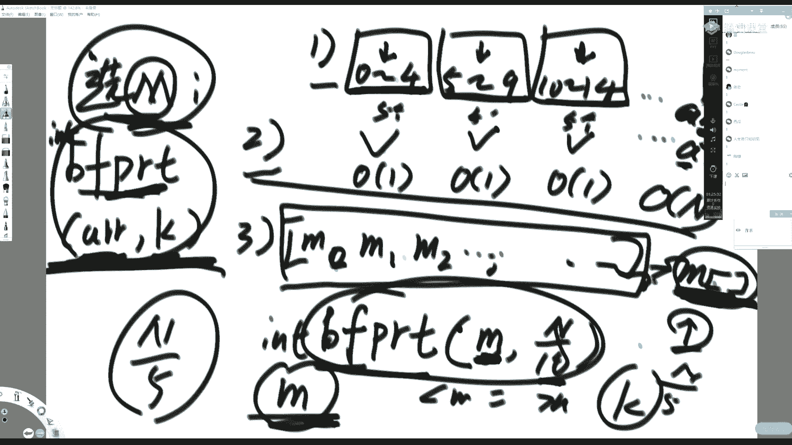

我给你举个例子行吧，哎呀真是好来吧，我们现在举个例子，假设数组中，写一些数，怎么选出m来，范围上我怎么选出这个m来，第一步36214，我就认为这个小组，50219，下个小组，最后一个小组三四。

你的小组内部我排个序，变成123461259，三四，不只是逻辑概念，画组了，啥也没干，第二每个小组内部排个序，跨组之间不排序，第三步把每一个小组位于中间位置数拿出来，三位数拿出来，二如果是偶数个。

拿上中位数，三成了m数组，它是不是是无序的，是无序的，干嘛呢，我想知道在这三个柱数中，第二小的数是谁，bf p t请你把bf p t什么传进去，m传进去，把二传进去吗，怎么排序呢，没有排序啊。

我我问你这个数组中位于第二小的数是谁，是不是这三好三出来之后再带回原数组中，拿三座划分值小于三的放左边等于三的，放中间大于三的放右边，你命中去呗对吧，听懂再打一，打二同学现在有没有懂，还没懂。

同学再给我例子，再给我个二，他们是五个流程，搞明白，我就想让他五个行不行，你可以去发明，三有方法跟七有方法是吧，好朋友，方法跟七个没有方法随你的便，但我们这个流程它就是五个。

我会告诉你它为什么是五个行不行，流程能听明白的同学给我一个提醒，有没有懂，第二小的数不是假设的，是你这个m数组，你发现它长度是三，就知道它的中位数是第几个了吗，这个这个第二个不是假设。

是是直接通过它的长度算出来，我要拿哪个，后续拿哪个东西做k感悟，你理解了吗，理解了吗，第三步是继续求中位数啊，没错啊，所以递归调用bf p t回来，你返回多少回了三第三步是调用个子过程。

b m p r t这个子过程是不是有完事的时候，子过程完事了，你拿到这个三，你再去原数组中拿这个三去做划分理解吧，他他总有跑完的时候吧，跑完之后会给你一个值，你就他就是你选出来那个天选之子。

接下来你在原数组上继续partition，听没听懂，跑到第三步没了，是跑到第三步的返回值，接着第四步做partition，然后看命中没命中，我知道他确实很难，知道他确实很难，我声音大。

只是因为我要提醒我自己，要保持激情，啊好那么这么做的意义是啥呢。

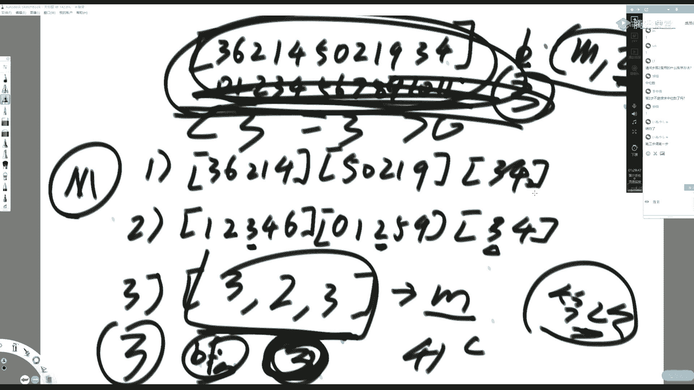

啊我们现在把整个所有流程我们先梳理一下，fpr t一开始面对的是一个数据量为n的东西，叫tn，五个数划分组其实啥也没干，想象中的一个概念，bo一的每一个组内排个序，跨组之间是不排序的，只是组内排个序。

一共有五分之n个，差不多这个数据量的小组没小组内排序就只有五个数之间排，所以是bo一的，那么第二步它就是一个b o o n的过程，干部我们是第一调用bf p t把什么传进去，我是五分之n的一个数组。

就是我们的m数组传到了我们下一步的bf p t里面去，没错他用怎么样用表达式代替它，是一个t5 分之n的复杂度，没毛病吧，为什么呢，因为你这个m数组它的规模由原来的n会减成五分之n。

所以第三步是一个t5 分之间的表达式，没毛病吧，当我考完这个过程之后，我就选出了这个m，那么第四步是在整个数组上小于m的，放左边等于m的，放中间大于m的，放右边玩荷兰国旗问题，这又是这个bgn的第五步。

做右两侧，我选一侧去递归t问号，因为我不知道，我现在不知道左右两侧的规模是什么，所以我用t问号来代替，那既然总的表达式它就是t5 分之n加t问号加上b on的这个表达式，再打一，认为这是m2 好吧。

所有组内的中位数组成的叫m2 ，把m2 求完之后会出来一个数，叫m拿这个m再回原数组做划分行吗，这就没有歧义了吧，啊是吧，这是好吧，另外一个变量叫m，哎为什么要精确又细选一个数。

因为这个b t t问号这个规模在精挑细选之后，它居然是可以确定的啊，重点聚焦，第五步，前的过程都确定了，tm第一步b勾一直接忽略b勾，m在这儿呢有了对吧，t5 分之一在这呢有了就是b格温，在这呢也有了。

都是b格温的，都画在一起了，唯一不确定就是第五步。

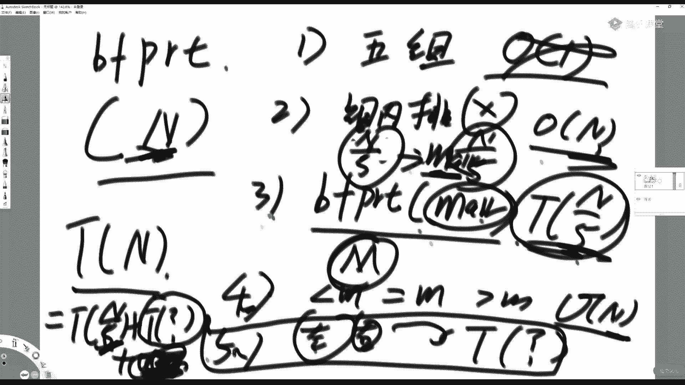

你左右两侧规模到底后续是多大，那我现在就开始估算，我们要想一下，你现在有一个划分值m你假设你要进小于m的区域，你先要估计左侧的大小，但如果不是bf plt算法是我们介绍的第一个算法，我们说无法估计大小。

因为随机你选一个数，我根本不知道我左侧有多大对吧，现在是精挑细选的m我们就要估算小于m这个左侧的范围最大是多少，小于m这个左侧的范围最大是多少，它是不是就等同于在问你在原数组中最多有多少个数是小于m的。

有几个数它是小于m的，如果你能够回答这个问题，我就知道左侧递归的规模有多大了，不好求，但是有一个东西是可以等同的去做出来的，啥呢，我想问小于m的，最多有几个就是在问大于等于m的，至少有几个，对吧。

我估算了大于等于m的，至少是几个，我总共的数字，一共才是n，我拿这个n减去大于等于m，至少有几个我们就反推出，最多有几个是小于m的了吗，我要打一，怎么回答，大于等于m的，至少有几个。

它n在一减就是我左侧最大的规模那个量，那然后我们的t的问号不就出来了吗，对吧，或者说在在在进入左侧递归的时候，它这个问号的量就出来了，对不对，那我们现在看m是个什么。

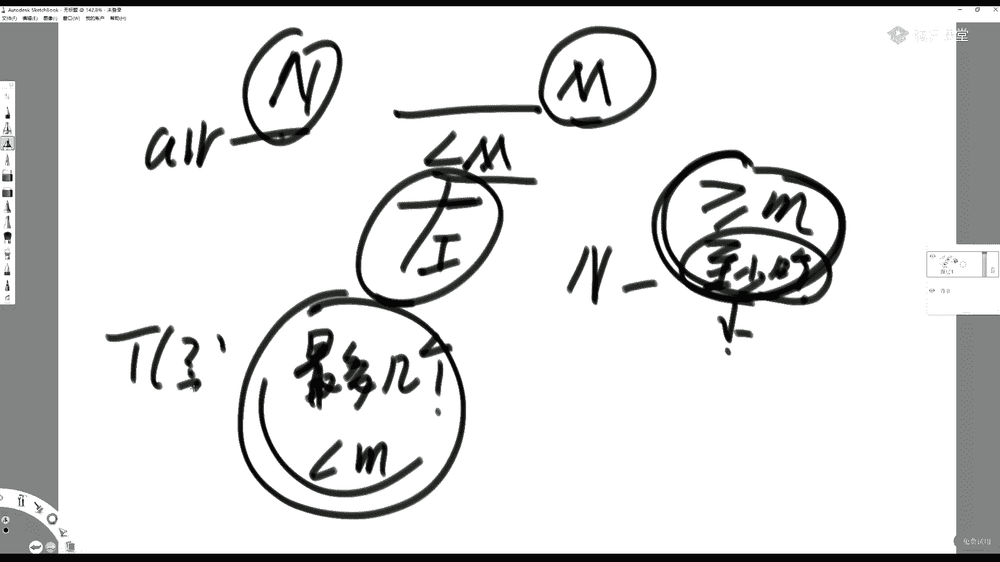

m非常特殊，你不要忘了给你画个图，你就理解了所有数组，这是第一组的数，第二组的数，第三组的数我们不是五个数一组吗，第四组的数，第五组的数，这每一组都由小到大排好序了啊，每一组都由小到大排好序了。

这一组这一组所有的组都排好序了，可以吧，每一组都从小到大排好序了，m2 其实是哪些数组成的，这五个数组成的叫m2 ，r，没有问题，同学打个一，一定要进入左边，是如果进入左边的话，我们这样估计就有意义了。

对不对，不是一要进入左边，是如果进入左边的话，那我们来看我们给它编个号a cd好，我们是什么过程，我们是把abcd组成一个数组，去求这五个数中第三小的数，abcd这五个数中求整体第三小的数，没错吧。

不妨设第三小的数是e这个数，你也可以假设第三小的数是a这个数，你也可以假设第三小的数是c这个数你怎么假设都行，总之它这五个数里面会有一个数是第三小的数，没错吧，看一下。

假设一是这个第三小的数e是在左边的，a c在右边的，当然你也可以假设中间位置是b，这边是这边是b啊，这边是dc，你啊这边是ec，你怎么假设都行，无所谓，是不是我选出来第三小的数理。

在整个数组中有两个是大于等于我的，两个是小于等于我的，没问题吧，所以我们不妨设e就是这个第三小的数，ac是大于等于这个e的，可以好，我们看发生了什么，可就是我的m了，我选出来这个中位数中的中位数。

我就拿这个e其实就做划分了，没错，我们这个东西它特殊在哪儿，六几组，五分之n组，五分之n组的这些数组中有一半是大于等于你的，这个数组中有一半是大于等于你的，有多少个数大于等于你十分之n个数。

你要把整个数想象成n数组有多长，五分之n在这个数组中位于第三小的位置，假设是个e大于等于他的，那是不是说明这个量是多少，差不多是1/10的规模。

看看a看看c你看一眼a在自己的组里面可是有两个比它大于等于的，在自己的组里面可是有两个比它大于等于的，你在这个数组中如果有十分之n个数是大于等于你的对应归元数组，就至少有3/10 n是大于等于你的一。

每一个代表在自己的组里能额外找到两个比你大于等于的数，所以是3/10人，大的数至少是3/10的规模，那比你小的数最多是多少个，7/10 n吗，知道左侧最大规模是多少了，7/10 n了，看到了吗。

为什么精挑细选这个数，因为可以固定的甩掉3/10的规模，听懂他在打一，二没懂我就再来一遍，好吧，没懂我就再来一遍。

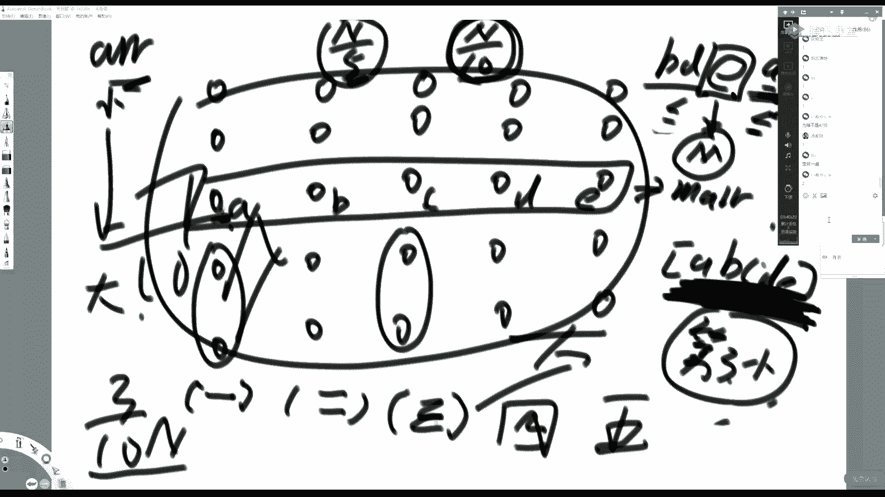

来再来一遍，好，这个注意听，想估算我们精挑细选了一个m出来，精挑细选了一个m出来，这样的过程数据规模我们都估算了，唯独最后一步我们拿不准对吧，也就是说最后一步如果我没有命中，我没有命中。

我等于我等于m的区域，没有命中那个k我的选择就是要么进左侧去走递归，要么进右侧去走递归好，我们先看左侧的，我们先看左侧的，那么进左侧的递归实际上就是估算什么，你要雇你要用最差情况来估计，这是复杂度的。

它的定义对不对，你要知最差情况估计，除非你是概率事件，你去求概率累加去，如果你是确定性的算法，那你就你如果你没有概率这个因素，那你就你你在左侧估计什么小于m的数最多有几个，我们不去正面挑战。

小于m的数最多有几个，我们先干嘛，如果我知大于大于等于m的数至少有多少，拿n减去这个量，我们就估计出左侧最大的规模了，二位同学现在听懂讲到这儿听懂同学打一，他讲到这儿听同学打一。

现在我们就在估计大于等于m，至少几个这个问题，等于m至少几个问题，如果你是随机选的m，你是没有办法回答这个问题的，因为它至少有几个情况都有可能发生对吧，但我们的f不是随机选的，我们的m是精挑细选的。

他怎么精挑细选的画那张图，假设整个array它被分成五个组，就假设这个第一组啊，m来自哪，如果每一个数组中，每一组内部都由小到大排好序了，是谁，就是每一组的中位数所组成的数组，火树会组成m2 位。

那么是什么地位呢，是在这个mv中的中位数是什，么，叫m同学打个一，这不就是我们的流程吗，那怎么分析来看，编个号a b c d e这个m，是由abcd，它可能是一个无序数组中第三小的数。

如果整个二位是n个数，我问你m2 位是多大，五个五个数，一组每组里面选一个数，m2 位的规模就是五分之n的规模，换句话a b c d e它的规模它就是五分之n的，m又是在这五个数中正好位于中间位置的数。

这说明啥，大于等于m的数规模是多少，一半吗，基本上一半的比例，所以你不管这个m是什么，这个m有可能是a这个m有可能是b，这个m有可能c根据具体的状况来决定它是什么都无所谓，但我问你。

如果m真的是这个数组中第三小的数，是不是相当于在这五分之n个数中，有十分之n个数是大于等于m的，我指的是在这个数组中听的一，来打二同学，哈哈那么在这个数组中，有十分之n的规模是大于等于m的。

如果是e选出来是e大于等于m在自己的组里可又多增了两个，是大等于一的，为什么这个组里人家是中位数，每一比m大的，在这个数组中，每一个比m大于等于的数，回到自己的组里会多来两个大于等于m的数。

因为这些数是大于等于e的，e就是大于等于m等，任何一个在这个数组中大于等于m的数，回到自己的组里又多来了两个，那你说全数组至少有多少个数大于等于m，十分之n的代表，每一个代表回到自己的组里又多加了两个。

是不是十分之n乘以三啊，数组中有3/10 n的规模至少是大于等于m的，那你说最多有多少个数是小于m的，n减去他们十分是7n吗，我们不就估计出来左侧的规模了吗，听，三打二的同学有没有懂。

异化的东西来给你讲是吧，有没有懂懂了吧。

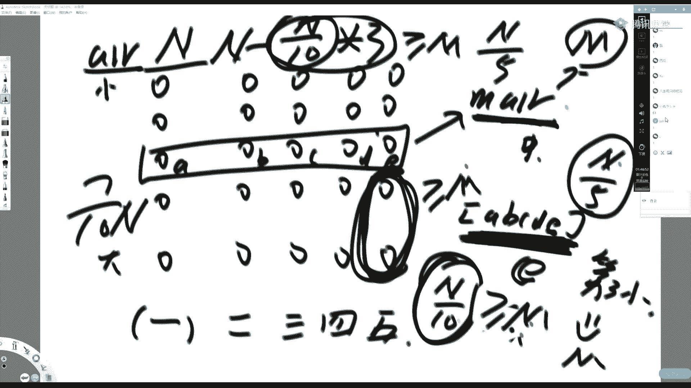

好估计了，左侧的最大范围，的最大范围，右侧是不是同理，右怎么去估计，我们问最多的是大于m的，不好求的话，我们就问至少有多少是小于等于m的，一旦按了，至少推理方法不是一样。

你m中至少好有十分之n的规模是小于等于m的，所以在每一个组里至少有3/10 n的规模小于等于m，那最多有多少7/10 n它估算的方是跟右侧，跟右跟左侧一样，都是分至多的问题。

也就是这个结论就是左侧最多7/10 n，右侧最多也是十分之七一，经过一个比例一次甩掉30%，再甩掉30%，这样甩下去，所以大师是什么。

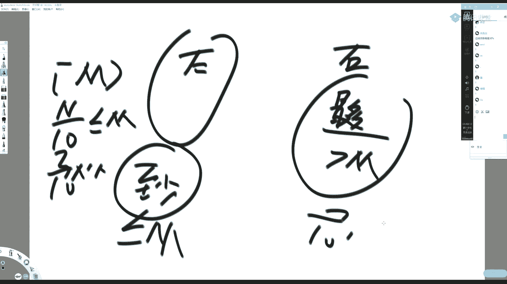

不学上不用概率证明它是b格on证明略听懂，数学问题，想看证明的同学，算法导论第九章第三节有三页纸来证明它好吧，就行了，他没有办法用master公式来注意，没有办法用master公式的，在你们面试中。

就这一个bf p t算法需要记这个结论，在面试中，其他的递归行为都是master公式能解的，就这一个，问一下，咱们休息两分钟，然后讲一下bf p t算法的代码，有任何同学弹幕，我没有的。

没懂的同学打二弹幕，我我给你搞懂，因为这个算法非常重要，你听不懂还怎么跟面试官装逼是吧，笔试过你根本用不了bf p r t，直接用我们第一种方法就行了，你一定要确保自己懂了好，我们休息两分钟，然后继续。

意思是如果排序的话，排dk个吧，对对，相同的吗，不合并掉，不合并掉，下标是从一开始的，也就是dk个就等于零位置，排完序之后，零位置的数，第二个就排完序之后，一位置的数合并掉吗，不合并掉。

是直接取m2 a的中位数吗，没错，就是把概率问题搞成了确定确定流程的问题，没错，没有概率了啊，行吧，注意啊，你好听懂我讲的，因为你自己去翻论文的话，你看不懂，他为什么看不懂呢，他估算非常麻烦。

他估算的非常的精确，什么呢，它充分更估计了唉，如果最后一组的数不够五个怎么办，这个问题，所以他想它的表达式，它这个它这个7/10可能会加一个小常数，它你估算那个方法算得麻烦死了。

我直接按比例让你来理解理解吧，因为它后面不管是减一个小常数也好，还是加一个小常数也好，都不会影响最后的结论的，听懂同学打一你，就是你你最好，理解我在说什么，因为他对他自己在论文里或在帖子里估计的时候。

他是给你把最后一组如果不够五个怎么办，给你算得非常的麻烦，他这个最后的表达式它可能是要加一些或减一些小常数的，但是在让你理解方面，其实是没有必要引入这些小常数的。

大家懂不懂我啥一次我给你估算的就是按比例给你估算，最好理解的样子了，已经是，更大的组还是吗，那不是一样吗，来如果是更大的组，如果更多的刀，你说如果是更大的组，比如说七个数的组是吧。

比如说七个数一组是吧啊为什么选五个数一组呢，五个数一组呢，选七个数一组行不行也行，保证最后的表达式收敛到b格就都行，一你选七个数一组去搞，选中位数，如果最终写出来的表达式能证明它收敛于bn那也行。

ppt算法在算法界的地位非常的高，为什么，设计一个我随便定的一个常数的分组，或者是一种什么方法能搞出来一个表达式，只要他能收敛到我想要的这算法就那过，也就是说他能不去严格想这个算法的流程。

他最终弄完之后，他只要估计出比例，我就可以确定这个办法流程有没有必要继续研究了，放了一大套的去找各种复杂度的方法，搞搞这种优秀流程的一个筛查器，听懂同学打，一开始试的时候可能就是三个数一组。

如果收到我再试五个数一组，还收敛不到，我在17个数一组，或者说我已经明确地描述出我是几个能够让性能最优，唉，我就看看最后能不能收敛到这个程度，我就给它定成五个数一组的李梅里。

在这个为什么人人都爱问bf p t算法，为什么你能够装这个逼，一方面是因因为在无序数组中求dk角度数，这个问题很常考，另外他们就是在算法上，它其实开创了一个时代，什么时代呢，我利用我先把流程设计出来。

我直接写出最后的tn的表达式，它给发现他有搞头，我才继续去分析它，我一直先写出后续的表达式，发现他已经不不能收敛到b了，我想都不想他听我同学打，三个数一组行不行，七个数字一步行不行，九个数一组行不行。

五六个数据组行不行都行，你自己去试，如果你发现能够收敛到b o n，那就是你的算法，但是长建的是五个数一组，听懂啥意思了吧，代码好，rt，啥呢，他跟下标统一起来，k从一开始下标从零开始，好恶心。

所以我们就这么来，那是在二位上，到r范围上，如果排序的话，index位置的数是什么，嗯排序的话位于index未知数是什么返回，所以这又有个潜台词，index一定是位于l到r范围上的，好如果这么规定。

你主函数怎么调零到n减一范围上，位于k减一位置的就是我要的，有什么区别，一点区别都没有，它递归含义完全是一样的，这个名字叫bf p t，它的含义及主函数为什么这么掉，同学打个一。

唉你看这个算主流程是多么的简单，精挑细选一个数做划分值，哼具有精挑细选一个数，请你做划分值啊，国旗中用荷兰国旗问题，根据这个划分值小于化划分值的，在左边等于划分值的，在中间大于划分值。

在在在右边等于的区区域，左边界和右边界range告诉我，如果命中了，直接返回，而瑞没命中，左侧你给我bf p t去，否则右侧你给我bf p t去，看懂主流程，同学打一要细选一个数嘛。

我给你变成一行主流程，你懂不懂，跟刚才有什么区别，告诉你了，没区别，就是精挑细选，而一个数而已啊，那么我怎么精挑细选这个数呢，就是底下的方法了，含义就丰富了，阿瑞到r范围上，请你五个数一组是吧。

然后每各小组内部排序，嗯嗯各小组中位数拎出来，成头部是吧，不是组成m瑞是吧，组成mv，然后再求，瑞中的中位数，嗯迷恋上的meeting of meeting的方法，中位数组成的数组中，它的中位数是谁。

返回这么一个方法，代替了所有的含义啊，代替了所有的含义，它怎么做呢，你一共有多少个数，r减l加一个数size，这个offset指的是你要不要补最后一组，举个例子，你说你如果size是十，有两组。

但如果你的size是啧啧，单组啊，为什么最后单独一个数要单独一组吗对吧，如果你的size在是12，你是不是也是三组啊对吧，最后两个数单独一组吗，意识到如果你的size，如果你的size是14。

你还是三组吗，因为你最后四个数一组嘛，但如果你的size到了15呢，三组，数一组正好三组，所以这个offset是什么，看size模五等不等于零，如果袋子摩5=0，你的组数就是size除五向下取整。

如果你这个模五不等于零，那你要单独补一个offset这一组，这就是的含义来看m2 多大，size，五五加offset，听我同学打一，范围大小对不对，我说了，我们只是忽略的，估计它是五分之n规模。

但他后面有可能带一个小常数，这重要吗，重要啊对吧，我你永远是最好理解的，你不用管这个小常数，它最多加一或者不加，有什么区别，对不对，他最后的时间复杂度的肯定不会显得太小了，空间就出来了，接下来干嘛啊。

一个m2 位组长，就是每一个组的中位数，你给我一次扔到这个m2 位里去里来，所以啥意思，再而瑞的从这个范围到这个范围上选出，如果排排完序之后，位于中间位置的树放到此时组里，做他的组长，做他的代表。

啥意思，你说是谁，l一直到哪，l加四，对不对，那第二组是谁，l加五到哪，九对不对，那下一组是哪，l加十，l加14，对不对，所以每一组的组长是谁，第一个组长l加上0x5，正好是l，l加上1x5，l加五。

第二组的组长l加上2x5，正好是l加十，每一个for循环进来第几组，他的手部的手的位置就是tm的，我是可以这么确定的，他的最后一个位置是谁呢，加四，但如果到了最后一组，他不够五个，那好了，看到同学打一。

在阿瑞在阿瑞的这个范围上，你给我玩个排序，排完序之后，就这五个数排序哦，最多五个数哟，这个方面是不是最多只有五个数啊，排序排完序之后，把你组长拎出来。

接下来bf pr t什么在m2 位中零到m2 位减一的范围上，位置的书，meeting of meetings，你接下来剩什么工作了，m2 a中找到中位数，你的范围是啥，m2 位从零。

m2 a点蓝减一这个范围啊没错，那你要在这个范围上哪哪个下标呢，m2 瑞自己长度除以二这个下标，m2 为零到n减自己的这个范围上的位于中间位置的数吗，你怎么拿最快bf rt。

也就是说这个方法它难理解的地方就在于负掉了一个子函数，但子函数里面调用了大函数的递归，但规模可是减小到五分之n的，听懂它在大一，哎呀这个所有中位数都拿出来变成m2 了。

不就是在这个mv中找到它的中位数吗，接个电话，嗯，啊看一下啊，五分之n这些中位数组成的数组中的第十分之n个，我想n这件事情了，我现在都都不都变成m2 v的表达了嘛，对吧，你现在问题是不是在m2 位中。

如果排完序之后，位于中间位置的数返回，那不就这一句吗，原问题了嘛，对不对，啊这个，流程跟证明已经扯过第三遍了呀，但原理的证明已经来第三遍了，再来一遍就是，就交给视频吧，好吧好好啊，啊好啊。

那么多一步就是这个返回中位数组成的中位数，就中位数组成的数组中位于中间位置的数，这就是我们要的那个划分值嘛，我们可以设计它的对吧，然后选取一个啊，这下面就是在一个范围上，你五个数排序。

并且把它的中间位置拿出来，你五个这个l到r上，这1l到r上最多五个数，玩隐私salt还是玩什么salt，是不是随便，为什么要推荐insert呢，你本来就五个数之间排序，你就选一个常数项最低的呗对吧。

你不就五个数最里面l到l最多五个数嘛是吧，你看在在这样一个范围上拿到，排完序之后，拿到位于中间位置的数，那不就是l r最多五个数，你去排吗，insertion sort就够了，拿到中间位置返回。

就所有的代码都结束了。

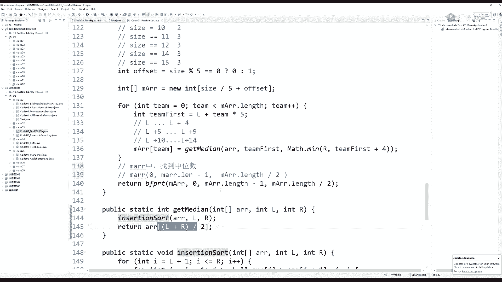

啊这这这个应用就很简单了，你已经解决这个源问题了。

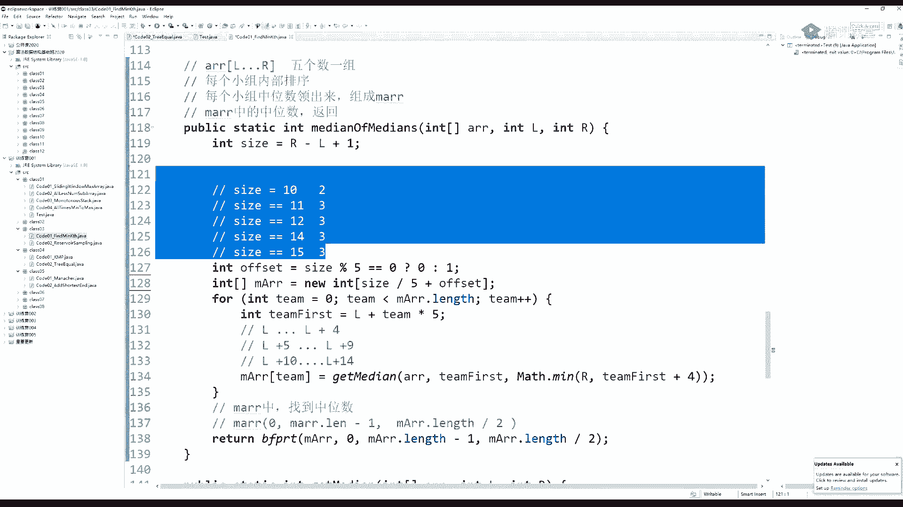

这应，常见的还有这样一种问法，在array中，去的我怎么拿到他生成一个长度为十的数组，它这个诺维斯代表在这个二位中，前十小的数我都要，第一前一小，前二小一到前十小，这个问题很简单，上咋做呀。

你先求d 10小的数，假设十小的数，它的值是17，一个结果数组它长度是十，你再遍历一下所有比17小的数填在这里，唉你第十小的数值是17，你在二位中只找到了六个比17小的数，那我问你最后四个是谁。

都是17吗，听到同学打一，我怎么前十小的数我先找d 10小的数，我看看有多少个数比这个找出来这个值小，它们都是答案，如果不够话，那毫无疑问剩下的那四个或者剩下的还没确定的，就都是我找的这个第十小的数。

说明他有很多个重复值，没没毛病吧，你同样道理，你是不是可以解决前十大的问题，你你会找dk小，你不就会找dk大吗，所以kd算法真的在面试中是经常出现的，非常常见。

我们在公开课的第二节还是第三节还讲过一个bf p r t算法，一道非常难的题，我准备把道题再拿到我们训练营里，在接下来的就是可能不是这一期训练营了，可能来到第三期或第四期的训练营。

再给你讲一个b f p2 t算法的一个应用，但是它他的他他它的用法其实也不需要找什么敏感度，他也没有什么敏感度好找，就是一个数字无序的，你想找dk小或dk大都可以这么去弄。

提醒一下笔试时候不要写bf p2 t算法，常数项有点高，而且也没要就做那种最简单的就够了，如果在面试时候讲完了那个最经典的之后，跟面试官聊，bf p t算法会极大的提升身价，就整个这套嗑儿啊，满分十分。

你可以用装逼的用处是吧，可以做它把它做装逼的用处，但它常见的呢，他是一套很大的一个启发思路，对不对，啊啊啊啊平和我们不精挑细选的那个数，就拿快牌直接改方法，时间复杂度是一样的，都是b n。

那么我们下周希望大家到场，我们下周一上来就会讲马拉车算法是吧，你想在网上现有的帖子里面看懂马拉车算法，我告诉你几乎不可能，因为啊讲得非常之细好吧，大家到场如果没明白的同学可以了解这个我们的视频是吧。

因为我们这个流程已经扯到第三遍了，再说第四遍就祥林嫂了是吧，啊就买nh算法啊，马拉车算法好，那么欢迎希望大家下一周继续来好吗，嗯拜拜拜拜，这需要复习什么吗，不用复习什么，完全不需要啊，不用管啊。

直接带着脑子来就行了是吧，好我们下课啊。

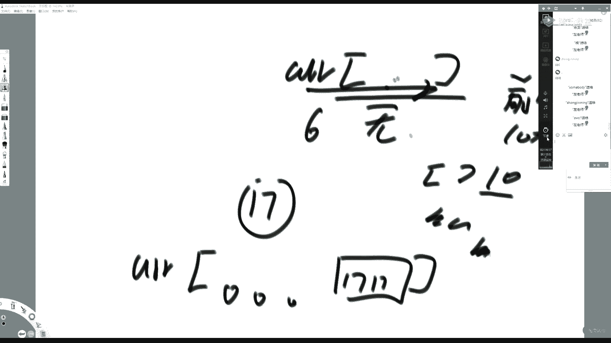