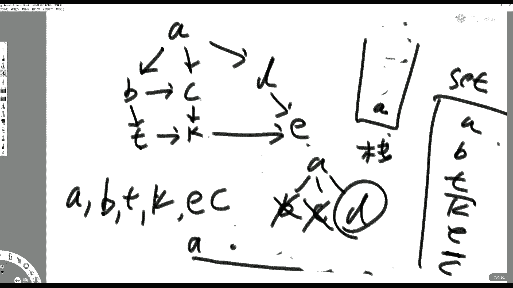

# 系列 2：P69：左神算法-暴力递归 - Java视频学堂 - BV1Hy4y1t7Bo

来了啊，能听到吧，稍微再等两分钟啊，今天我们讲图的算法，这个肯定是要拖了，下节课，下一刻能够把课结了就不错了，也就是说我们原本12节我要讲到，16节是吧，嗯基础课，然后开完，下周开完基础课之后。

直接就给大家开这个训练营的课程，或者说这个进阶版的课程啊，各位今天休息啊，五一没有祠堂直播课，五一我们没有上直播课，所以中原同学是你上一回是听到二叉树的递归套路吗。

那么我们就接那么二叉树递归套路的下一节就是昨天讲的，五一没有直播课啊，五一我没有看，没有没有直播课，休息了，啊，今天今天的课呢我们要想顺利讲完，你首先得理解两个东西，第一个东西就是并查集昨天讲过的。

第二个呢是一个之前给你们细致讲过的一个东西，就是自己手动改写堆结构，大家有印象的同学打个一啊，什么样的题需要我手动改写堆结构才能够实现，什么样的题可以用系统实现的堆结构我就能实现。

这个我是在我的之前的课，用了将近一个小时的时间给你讲过这个内容的是吧，就说你上了堆的东西，如果你又想改变它某些字段来影响他在堆上的位置的话，那么你就要手动改写堆结构，如果你给他的东西，他给你吐出一个。

你给他东西，你不再改动了，或者说不再改动他参与排序的那些字段了，那么你就不用重新自己手写一个堆结构对吧，这个还给大家在课上现场实现过吗，那么我们今天要用这个结构啊。

这个结构是在dj特斯拉算法里面的改进里面需要用到的一个内容，再说多少分钟啊，因为还有些同学要进来。

今天今天的内容其实还是不少的嗯很多人写图的算法，觉得写的不顺利是吧，你一次每次遇到图的题就挂是吧，刚来的同学可以看一下这道题，我们想做什么啊，在这儿，昨天讲了一道题啊，只是今天想现场实现一下嗯。

也不难啊，这说一下啥意思，就是昨天我们留了一道题，昨天我们留了一道题，说这个你看有每一个user，他有a b c3 个字段都是string类型的，当然你也可以是别的类型啊，这个无所谓了。

我们就假设他都是死string类型，那么这个user就是如果两个user a字段的值一样，我们就认为它是一个用户，可能人家多建了几个账号是吧，但是只要a字段一样，就认为是一个用户，那同样道理。

只要任何一个用户b字段一样，它也是一个用户，只要任何一个字两个字，用户c字段一样，它也是一个用户，那就有可能会就说你比如说我这两个用户，它它俩a字段一样，他算一个用户对吧。

然后这其中一个用户呢又和另外一个用户b字段一样，那其实三个用户是一个用户对吧，就是你尽量合并，最终我问你，如果两两个用户a字段一样就能合并或者b字段一样就能合并，或者c字段一样就能合并的话。

请你返回合并之后的用户数量，这很明显用并查集做的，这很明显用冰卡奇做的，昨天我们提了这个题，但是没有实现，这个有多少同学昨天没来，或者是不知道并查集的，打个二听来过，然后听了我讲的打个一，我天哪哎呀。

那不可能重复讲了是吧，能不能粗略的说一下这个是啥意思啊，你寄几不要紧，你今天即便不懂并查集的具体实现，你也能听懂今天的内容，你只要接受这么一种黑盒就行了，什么黑盒呢，给大家多啰嗦两句啊，这个并查集啊。

来看一下啊，不要慌啊，你这个不会并杀机不要紧，你最多就是不会实现嘛，但是你知道冰沙机它干啥用的，你直接今天这节课，你先默认你这个黑，这这是一个黑盒，我把想用的功能给他托管，它不就完了嘛对吧。

托管给他不就完了嘛是吧，不影响你今天听课啊，什么叫并查集呢，简单提两下啊，就说有你有若干个样本，abcd一开始认为这几个样本各自都在自己的集合里，就是每一个样本他都在自己的集合里面。

这个集合里面只有他自己，每个样本都是这样的，那么我就可以我我就可以提供一种结构，一开始先把所有的样本各自做成小的集合对吧，各自做成小的集合，然后那个用户可以调用这些方法，就是查询x和y是否属于一个集合。

这是第一个方法，第二个方法注意第二个方法很有意思，第二个方法是x跟谁合过的，全部都算上它背后的所有的东西，只要跟他合在，就跟我一起的东西，把y背后所有的东西彻底两大集团合成一个集合。

就是我们的unit方法好，并查集就是就是做这两个用的，你可以认为并查集就是做这两个功能用的，但是而且is the same set的方法跟用on方法可以做到单次调用的时候，时间复杂度bo 1。

这就是冰沙机的功能，就啥意思呢，我一开始把一坨样本全部搞成各自的小集合，然后我可以我可以调用，你查询is same set，x样本和y样本是否属于一个集合，就是他俩连其实或者换换换，换一个意思理解。

就是他俩联袂连通在一起，布尔类型返回，如果连通在一起了，它是一个集合，就是true，如果不是一个集合就返回false，这是第一个功能，第二功能就是unit方法是吧。

就是我们的unit方法就是呃联合那个方法，联合那个方法，如果x跟y你要想要和的话，他不是说xy单独合在一起，是x背后所有的东西和y背后所有的东西，你们彻底合成一个大集合。

这两个东西想要实现这两个方法想要实现的都高效，其实就是我们的并查集设计，但是他你现在现在你现在你你能够通过学习之前课的视频学会，所以我又不想在新的班去再重复讲一遍，你现在就接受一种设定。

就是我现在理解这两个方法，同时这两个方法单次调用的代价是b o e就能做到这么逆天，我看他能做什么，听懂同学打一，这就是并查集，刚才打扰同学，现在理没理解，理解了，给我一个，给我个提。

给给给给我个提醒是吧，你理解啥意思了吧，嗯理解了好啊，这个并差集可以删除特定的指定链接嘛，其实通过改写是可以的，但是要注意啊，你这个改可以删掉某些东西吗，其实可以，但是他不是最经典的冰沙机。

这里面还要抬再抬十线是吧，这个并查集，如果你就是要做落路径压缩或者是小集合去挂大集合，这两个优化始终坚持的话，你没有办法做删掉有某些东西，但如果你从来就不做过路径压缩，你也从来不小集合就挂大集合。

谁挂谁无所谓，这像这种就可以做这个某些特定的删除，但是并查集的这个优化后的性能优势就荡然无存了是吧，这个我不知道你听没听懂我说啥是吧，嗯已知的bo一除了哈希表并杀鸡，还有其他的吗，呀这个。

其实可以设计很多这个结构，你就你为什么这大帅同学这个b g o e这件事情要这么总结是吧，这个有点奇怪，但是现在目前为止提到的确实只有哈希表跟并查集，增删改查b o e的好吧嗯。

但是我确实也没有想过以这个时间复杂度b勾一来分类是吧，呵呵我一个没有没有没有没有这么总结过是吧，可以可能还有别的吧，嗯他我是根据基本上根据功能来分的是吧，他有些东西适用于哪些不适用于哪些来分的。

现在目前讲的确实只有并查集和这个哈希表啊，好那我们来看一下这道题，我们来看一下这道题，昨天昨天提到的一道题，怎么用并查集来解，我先把冰渣机贴在这儿是吧，你不用管实线，你就管功能吗。

具体时间大家可以看上节课视频啊，因为听过的同学不想重复讲了，浪费时间是已经有视频了吧，这个病查体你不用管它怎么实现，你只用知道我有一个这个对吧，我有一个以same set的方法。

有个unit方法行了是吧，而且都很高效，他可以把两个样本查两个样本是否所在一个集合，以及两个样本背后所在的集合彻底合成一个大集合，是这意思吧，好我们来看这道题，昨天讲过了，现在先来写一下。

这道题是说如果两个user a字段一样，这是一个user，两个user如果a字段一样，就认为要合并在一起，他是认为是一个用户，如果或者两个用户b字段一样，它也要合在一起，认为是一个用户。

如果两个字用户c字段一样，它也要合在一起，认为是一个用户，那你会那你会可能会有，我举个例子，比如说你第一个用户是10，这都是字符串啊，假设13，第二个用户呢是二，37，而第三个用户呢是400 537。

这意思就是说这三个用户只是一个用户，因为你看这个用户跟这个用户因为算一个对吧，而这个用户跟这个用户又算一个，所以他们三个其实是一个用户，就让你这道题其实让你就是a字段一样的用户，就认为是一个该b字段。

c字段也一样，你该合并合并，问你在这个user里面到底有多少，合并之后合并之后的用户数量有多少，听我同学打一，好啊，那么注意我们现在我们要开始玩这道题了，刚开始怎么玩这道题呢。

我们要先把所有的user给它变成各自的小集合对吧，每一个user就自己的是是自己各自的小集合，然后看看怎么合并吧，所以我怎么做呢，常见做法是这样的哦，我申请一个并查集是吧，这个去掉，申请一个并查集啊。

这个冰沙机里面放的样本类型是什么，注意你可以放user，也可以放这个整形，哎你为什么可以放整形，是这样的，就是说比如说我们user 0 users里面的零用户，按道理来说他就是实力对吧。

按道理来说他是个实力对吧，哎我们能不能用下标零来代表他呢，可以吧，同样道理，你说你user user一它里面是个实力对吧，你能不能用下标一来代表他呢，可以对吧，所以你在并查集里面。

你未必要放这个user，你可以里面都放下标，都是整形不就完了吗，听懂同学打一，就是你你可以把一个一个的user放进去，没有问题，但是你还是你还可以把下标放进去，零下标一下标，单独成一个集合，可以吧对吧。

完全可以这么做嘛，所以我们怎么做呢，这样来啊，我们把这个并查集改一下，初始化的时候改一下怎么改，就这，一共有多少个size，你告诉我，然后我怎么初始化，i从零开始，i小于s，i加加，然后。

i小于size，然后i加加，然后这node是什么啊，这个这个没没没有，我我一会儿再说，没有学过，昨天没有学过的同学，怎么怎么理解啊，这每一个node呀，这每一个node哦，这个冰沙机里具体的去。

如果要这么改的话，就这样来吧，好吧不这么麻烦了，就不用咱们，咱别别用下标来代替了是吧，这个因为他这个改动比较大，我就写成泛型了啊，写成泛型，那就用原来的user吧，那就这样来。

每一个每一个每一个东西自己去初始化去是吧，但是他这里面又是数组，我靠还是得改得这样来啊，这个v类型的数组是吧，v类型的数组每一个去初始化学，这个这个这个大家现在所有的没有没有昨天没有听过并查集的同学呢。

你就这么理解，就是说我们要初始化一个并查集，初始化一个并查集，我们现在是我们说的是这个user里面所有的user不是单独成一个小集合吗，那么你在这个并杀机初始化的时候。

要先一股脑地把这些user都给这个结构以后，你就可以直接用了，理解这意思吧，啊我们不拿下格来代替了是吧，没必要就拿这个原始的这个就叫uni fn的结构是吧，冰沙机，他来一个初始化，这里边我把u都传给他。

那那那就哎呀好烦是吧，然后我们把这个刚才给恢复过来，他就是一个list的类型啊，好吧，那么你看这个诶这个为什么，哎呀无所谓吧，他们报警报警报吧。

这个这个这里面一开始就把所有的user啊放到这个病查体里去了是吧，他是初始化好了，然后我们怎么合并呢，这么想先进，那先建立一张哈希表哈，希map string对应一个user，此人对应一个user。

我们管它叫map a啥字段就是a字段a字段的map是吧，这里面都放着key，就是这个string是放着某某一个user a字段的值，然后这个user就是哪个user有这个值。

哪个user的a字段是它对吧，有个map a同样道理，你再建一个map b，再建一个map c，再建个map b，再建个map c，先把它写完啊，先把它写完，然后把这个把这个哈希表都建上啊。

然后我们开始便利user了，那么现在就拿到每一个user了吧，拿到每个user了，怎么怎么，我们这算法是什么样的，算法是这样的，就是这个map a里面放着某这边map b对吧，这个是mac。

假设某一个user，它它这里面第一个字段，比如说是第一个字段，假设是字符串类型是吧，是个a b c，这是他的a字段，下面字段可能是k s t d字段，在下面可能是t e f c字段对吧。

你对于第一个user来说，你就把这个a abc它是属于哪个user呢，当前的user对吧，假设它的内存地址，他是他他他这个实例的内存壁纸是a是吧，那就a b c它属于a的k s t。

k s t它也属于a的c e f它也属于a的，然后下面一个字段如果是b它第一个字段假设是b c，它下一个字段讲的是k s t，它再下一个字段可能是e f那么对于这个bc来说。

你就看一下之前那个map a中有没有bc的字段，没有没有，他没有，就说明b不用通过bc和任何user要合并在一起对吧，我原来的map中没有bc吗，我这是新出现的bc嘛。

所以b的这个user不会因为bc这个字段连在一起，那我直接把b c登记上b就行了，然后你看这个b的第二个字段叫k s t，之前谁有这个k s t啊，a用户有这个k s t。

所以我在后台把a和b所在的集合连在一起，是不是等同于他俩合并了，他俩现在属于一个集合了，对不对，我就通过k s t这条这这这座桥让a和b连在一起了，连在一起之后并查集里面他俩永远就是一个集合了。

所以你这个k s t属于谁，你可以让它还属于a，因为反正后台a跟b是连在一起的，再看e f e f之前的mac里面没有ef这个字段，所以也就是说b不用通过ef跟任何东西桥连在一起，直接ef等于b好。

你就用这种策略，每次一个新的用户到来的时候，你都看看他的a字段之前有没有人出现过，有的话就通过这个条桥连在一起，第二个字b字段跟c字段也一样，如果有，如果有过这个字段，就跟之前某个用户联合在合在一起。

如果没是新字段，就建上在这个表三个表中建上它的值，表示你是新出现的这个字段，因为并查集会把所有该连的东西全合在一块儿，所以能够实现你的要求，听懂同学打一。

刚才是忘了加这个是吧，这个早上起来有点懵是吧，好了行了，这就对了啊，然后呢我们就想就想这么做，那怎么做呢，这样，这么写啊，这样不是，如果，user。a啊，这个map a点，content，user。a。

啥意思，map a map a里面之前还有过user。a的这个字段对吧，那你合并吗，当前的user和之前map a里，user a字段的拥有者合在一起对吧。

user背后的集团和原本有user a这个字段的那个之前的那个，user这个背后的集团彻底合在一起，是这意思吧，否则否则你这是个新字段，是这意思吧，同样道理，bc你也这么干，map b。

这也是map b，这也是map b是吧，这是c，这是c，这也是c，要改一下字段名，啊最后干嘛呀，其实你要干这样的步骤，就是，像并查集，像并查集询问，合并之后还剩多少个集合对吧，是这意思吧。

你你你之前一开始所有的user在这个并杀集里面都是独立的，你们现在通过，要么通过你每个user的a这条这个桥该合的合，b这个桥该合的合，c这个桥该合的合，是不是有相当多相当多的集合被合成了一个集合呀。

他一按道理来说是你在这个并查集里面还有多少个集合，就是有多少user，对不对，所以怎么改这个呢，那我就改一下并查集，就是你给我返回u的数量加个方法是吧，get size，get size版本是吧。

在冰沙机里面这个表可以直接告诉你啊，没关系，不会的同学你你你你回去看视频你能懂，你现在就知道说我可以向并查集要他还有多少个集合这个数量，昨天你看完视频你就懂了。

你现在只能接受说我可以用它的这个用你方法是吧，该合的合在一起就可以理解是吧，最后你就返回你这个并查集他的，get set member嘛，这就这就搞定了是吧。

好这个方法有没有不懂同学不懂的同学打二听懂他打一，一个集合代表唯一的用户吗，不是只要是该合的合的一个连通区域代表一个用户啊，有没有不懂同学不懂同学打个二，或者说发个行号，哪个不懂。

我看有一个同学打了二是吧，昨天昨这是我们昨天的课，在最后的时候给了一道题，然后我们说上，但是那是我临时加的一道题，现场给你，现在实现一下，那刚才打扰同学你你你就先发一下这个你的困惑点是吧。

或者这个哪一行不懂，我再给你讲好吧，我们先先开今天的课行吗，一个联通区就代表合完之后的一坨那一坨，用户认为是一个人，好那么我们现在来开图的内容啊，这个图啊，其实这个图的问题在这个代码中。

它是可能算是鄙视中比较难以去比较难以难去写的一个类型是吧，但实际上你要知道它的难点并不在于它算法难，他并不在于它算法难，今天我们讲如果要是往后讲图的算法的话，你会发现算法都还行，没有特别难。

它难就难在它这个数据结构比较复杂，数据结构比较复杂呢，有有些同学可能哎呀理解了这个图算法每一次新遇到的一道题目，如果你临时在它那个结构上去写算法的话，你会发现你每一次面对的图的结构如果不一样。

你的算法都得重新来一遍，这个是啥意思，啥意思呢，就是说对于图来讲，你可以认为是先解释下什么叫图图嘛，就是一些点和一些边连接起来的对吧，这个点这这这有若干个点，我可以在任何两个之间来一条边对吧。

这这其实就算一个图了，虽然说他没有整体连通在一起，它只有两个连通区域是吧，但实际上你知道就是这是一个森林而已，什么叫森林呢，就是它不是一张图，它是多张图，它就是一个森林，那如果这个这个东西是连在一起的。

他就是一个图的样子，就是它它不是一个森林，它是一棵树木是吧，所以就是任何一个任何一个点，几个点，每两个点之间都可以都可以出现一条边的话，它就构成了一个图，它跟我们的二叉树不一样，我们二叉树是一个点。

要往下左右两个孩子，左右两个指针指的特别严格，对不对，而且没有二叉树中，也没有某没有某一个指针，它是往上指挥还的，对不对，所以我们不用在二叉树，它是比较简单的一种形。

形式图呢就是你任意的点中间可以任意划线，但是他就分一些什么有向图和无向图，就有向图就是每条边带方向的，就是有向图，如果我认为这个两个两个点之间只有一条边，它是没有方向的，代表两个点都能够到达。

我可以从这条从这个点通过这条边到达它，我也可以从这个点通过这条边到达它，这叫无相图，事实上无向图和有向图你都可以理解成有向图，为什么你说你无向图，你不就是它指向这边有一个有向，这边只回来再加个有像。

他不就是无相图了吗，对吧，两个点之间我到他有个有向，他道我有个有效，这不就等同于他是个无相图吗，对吧，所以我们理解图你就可以理解为one，每一张图万图都是有向图。

只不过无相图的时候就是两个点彼此之间有两条有相边，那你就可以随便连嘛，你这这这这这都是图，对不对，这都是图，这样一来就有问题了，我日常是怎么表达图的，他就有个讲究了，对吧，他说白了图很简单。

如果我如果我说有个东西有图的话，那无非就是你的典籍有哪些东西，有哪些点构成，然后有编辑有哪些东西对吧，这个编辑呢就是哪两个点之间有边都记录在编辑里，点击，就是你到底有哪些点记住在典籍里。

这个就是我们日常理解的图吗，他可以随便连他也可以有，还要随你随你随你随你的便，你甚至于可以这个这个这分子向指向自己也行是吧，无所谓，但是你怎么表达一张图，它就是个问题了是吧，你自己画出来的图你肯定知道。

那你怎么表达他呢，常见的方法有两种，第一种方法叫邻接表法，第二种方法叫临接矩阵法，我们分别来说一下，比如说我们这张图，假设他是个无向图，那么无向图实际上就是a到c。

a到c有路有个有项c到a结果有像b到c有向c到b结果有效是吧，d到b有项b到d a果有像d到a有相a到d a果有像，这不就是无向图吗对吧，所以你无论什么图，你都可以理解为有向土是吧。

好那么怎么表达这张图呢，邻接表法咋做的，临近标法是你以点为单位，你有哪些点，a b c d是吧，好，我写在这a b c d，然后他后面写什么，后面写的是和这个a点。

直接就从从a点出发能到的直接邻居写在冒号后面，那你看一下从a点出发能够到的直接邻居有谁，c和d吗对吧，所以它有一个c，有个d，同样到了下面，从b出发能够到达的直接邻居有谁，c和d。

从c能够出发到达直接邻居有谁，a和b，从b出发到达直接邻居b和a，临街表法，如果你每条边是带权重的，如果你每条边是带权重的，比如说，比如说我a到c的权重是三，c到a的权重是四，就是边上是有代价的话。

如果边上是有代价的话，那么你就可以在这个封装一个结构吗，a到c这条边的代价是三对吧，而c到a这条边的代价是四嘛，就随你去封装，对不对，这个无所谓，你边上加值还是边上不加值，对于临界表的表达来说。

这个结构是一样的，无非就是多半多有一些伴随数据而已，连接表法理解没有任何问题，同学打个一，好那么还有第二种方法呢，就是临接矩阵法，连接矩阵法就更好理解了啊，临接矩阵法就更好理解了。

这个邻接矩阵法就是说你你有你有几个点吧，你用a b c d4 个点对吧，好a b c d4 个点，a b c d44 这四个列你给我填这个格子，这个格子代表a到a的距离零，现在往a到b的距离该是啥是啥。

a到c的距离该是啥是啥，a到d的距离该是啥是啥，如果比如说a到b是没有直接距离的，如果a到b是没有直接距离的，认为正无穷，认为他没有直接的路，就是正无穷，你比如说你这里面a到c的距离是三，你这个前三。

然后你说你比如说a到d的距离，你是七，那就就就就就填七，这不一样嘛，对吧，你看你b b到a有直接路吗，没有正无穷，b到b的距离是零，b到c的距离，你给它一个值，比如说这是六，那就六，那b到d的距离。

你给他个指甲是一，那就是一，然后c到a的距离，4c到b的距离，给那个值假设是五好吧，5c到c的距离0c到d没有直接的路，正无穷，啊所以这张表你就认为是个绝对是个正方形表，那你那你当然可以把所有的边。

你你我我们为什么可以用一个邻接矩阵就可以表达一张图呢，因为你这个表是不是可以做出一个全连接呀，没错吧，你a到aa到b a到c，a到b b到a b到b b到c，b到b c到ac到b，你回复键它是全连接。

而你的图肯定比全连接或者小于或者就是全连接吗，边数一般来说这边数不可能在大于全连接了，对不对，所以你在这张表里，如果你有直接的路，你就写上他的全职是什么，如果你没有直接的路，你就正无穷吗。

所以这张表依然是用这种方法也可以表达整张图，听懂我同学打一，好这就在下面我再跟你说图的题目最难点的地方，它就在于图本身没什么难理解的对吧，我们小时候都画图是吧。

但计算机里面的图呢就是点跟点有点各个两个点之间利用边连接起来，这种东西就叫图，难点就在于你不要把什么算法在各种表达图的结构上都来一遍，我用邻接表法去实现一个算法，那我底层的数据结构。

那个图的结构是连接表，我要在临接表上玩一遍所有的算法吗，你玩完一遍之后，你又在邻接矩阵这种结构上要玩一遍所有的算法吗，那下回换一个图结构的算法，你是不是还要来一遍，难就难，在这能表达图的结构很多。

可远远不止邻接表法跟邻接矩阵法，比如说我们刷题中，或者说你们在比试过程中最特别常见的一种表达图的方法，是这样的，啥样的呢，我看一下啊，啊对啊，他是这样的，他给你一个矩阵，第一组数据704。

第二组数据41415，第三组数据323啊，444413吧，第三个数据323，第四组数据，四，啥意思，每一个小数组都是三个数，第一位数据代表一个边的权重，第二位数据代表from点是什么编号。

第三位数字代表to点是什么编号，这个可以表达一张图啊对吧，你比如说从0~4，相当于就是它权重是七，然后从1~3啊，那权重是四，从2~3呢，全中是三，从2~4呢群众是八，就这么一张图。

你会发现这这这个结构也可以表达一张图，你难道把每一次这个图的底层结构变了，你都重新写一遍算法吗，而且如果在笔试过程中，你要现场去守撸，你大概率是要出错的，因为图的结构比较复杂啊，不管用哪一种去表达。

写的代码都会比较多，哪怕算法在算法理解层次上并不难，他也会很容易出错，因为它表达图的结构，写的本身这个篇幅比较大，听懂我的说法，上来打个一，好所以怎么办呢，所以这个这个这个课就给你推荐一些私货了是吧。

对所以这个有个同学很聪明对吧，知道我要干嘛了，就是这个这个志豪志豪同学是吧，就是说你你自己平时练图的题目啊，你你你你你不管是什么样图的题，你都转成一种你熟悉的结构，你都转成一种你熟悉的结构。

然后算法a玩一遍，在这个结构上，在把算法b玩一遍，在这个结构上把算法c玩一遍，把你以后想实现的算法都在这个结构上玩一遍，那么你以后去面试的时候，他可能会给你一个陌生的图结构结构结构一个撇儿对吧。

这时候你干嘛，你只要把结构皮儿写一个转化成你自己的结构，然后你再调用你现成的模板，你不就行了嘛对吧，用户输入是一个新的结构，你你根本不需要在这个结构上再去实现算法。

a算法必须和算法c或临时的那个什么该什么算法，什么算法不用，你只要写一个接口转化类不就完了吗，然你这些东西你保证正确，直接调个模板给他答案不就行了嘛，对不对，这不是，这不很快听懂，他在打一。

所以我这节课就给你推荐了一个我的写的方法对吧，他他这个他这个就是属属于我自己在刷题过程中，这种结构很好用对吧，然后你你未必完全按照我的结构来，但是我告诉你这个我这个我写这个结构，它兼容很多东西。

然后我们来看一下我我给你推荐的结构是啥样的，这个no的结构，这就是点的描述，点结构的描述，点结构的描述啊，这个点上它有自己的value值，这个是你可以是string类型，比如说a这个点a这个点。

那你这个value可以变成string类型的a编号为零的点，那你这个value就是零，理解吧，这个这个note上面这个value就是它的编号，它的编号你也可以把它改名叫d都行啊。

那么这个这个点上它的in是什么意思呢，入do什么叫速度，就是有多少个点通过走路是连向它的这个out的，就是初度，就是他自己直接出去的边有多少，这个就是他直接接收的边有多少，这个是他直接出去的边有多少。

入都跟初度，你们都学过吧对吧，然后这个note里面它有自己的邻居，直接邻居，注意啊，这里面我们来讲一下这啥意思啊，我给你举个例子，比如说有个点，这个点的编号是零啊。

这个点这个点这个点是指向直接指向它的啊，这个这个点是指向他的，这这这你看这个就不算他的入度了，他的入度就是三，它的热度就是三，理解吧，如果他往外有弱的干条边，比如说它有四条边，初度就是四。

只算直接出去跟直接进来入都是三，它出的就是四，他的他的在这个点里面，它往下，比如说它往下的点是a，这是b这是c这个是d d往下，如果还有fc往下还有e等等等等，那么我只记录他的这个点。

这个点的直接邻居a b c d，只记直接邻居a b c d，所以这就是这个点中耐克词的含义，它是一个release，下面是no的类型，它指的是直接邻居的意思。

而且你不要把之前的这这三个点算作它的直接邻居，我们所说的直接邻居指的是这个点由自己出发的边能到谁，叫他的直接邻居理解吧，这就是我们这个next，那这个那那你现在虽然不理解。

我现在还没有讲编这个数据结构对吧，那但实际上它也就是说我我如果把这四条边都做成实力的话，那这个点他下集所有的边就是四条，就从他出发的，会放在它这个边所组成的，而release里node的描述都听明白。

同学打一，这个，有的同学我看见有个弹幕啊，弹幕说，小的同学说这个不是更简单吗，行吧，你觉得更简单的，你就写嘛是吧，你的模板就是那个行吧，我这里面用这种方式是比较容易让人理解的一种方式。

就是跟你脑脑海中想的图差不多的方式，无向图的速度跟速度一样的吗，对一定是一样的，然后还有什么问题，哦没啥了，in in in是next的size吗，不是，应该说out是next的size。

这个印是有多少东西连向我，这个in是有多少东西连向我out是我出去的，我的下面的邻居都是以我直接触发的触发的得到的邻居为主，边也是我出房，我从我出发的边，这个是out的指出度啊，in是这边。

这是入读理解吧，好大家都明白就行了，这就是这就是所谓的点描述，这就是所谓的，点描述，然后我们再看边描述啊，边的描述就很简单了，你你一条边一条边，它上面有权重，没错吧，这个边上面有权重，可能代表距离。

可能代表什么别的别的事情，那不管，反正我上面是有权重的，至于你怎么解释这个权重根据不同的题目来，对不对，那么一条边有一个from，有一个to就行了，注意这里面的边这边肯定是有向边。

因为我们说任何图都可以理解为有向图，无向图只是任何两个点之间既有两个方向上都有一个都有有向图，不就完不就是无向图了嘛，对不对，所以我只用管有向图的结构描述，因为无向图它可以用有线图拼对吧。

也可以用像素表达，所以这个边啊他就是有一个自己的权重，有个from，有一个to，这就是我的边任何一条边，它的描述我们再看图图就更简单了是吧，图就是典籍和编辑嘛，你看这个这个典籍是啥。

为什么这个哈希map就是0号点，编号为零的点，那个点是什么，编号为一的点，那个点是什么，编号为二的点点是什么等等等等，你看这个点的描述，它后面不有个不，里面不是有个y6 吗，它就代表他自己的编号。

我在这我在这个整个点击里面，我希望通过某个点找到具体的实例呢，我就给写一个哈希map结构的典籍，key就是我的编号value就是我实际的点，那么这个编辑就是个哈希赛的结构，所有的边都在我这个编辑里。

一开始这张图是空的，所以点击也啥也没有，编辑也啥也没有，这就是我一个一张图的结构描述对吧，好，我们来看转化，就是你对于所有的东西来说，你只要转化成我的我的图结构不就完了吗。

我们来看一下转化怎么转化的假设啊，这里面我只是给了一个例子，就是刚才我们讲的这种例子，就是刚才就是我们我们以一组数据，第一个的一维数据叫某一个边的权重对吧，二维数据叫这个这个边的from点的编号是啥。

是个整数，第三个位置是这个这个边啊，它是从from指向to的那个to的编号是啥，这也是个整数，权重也是整数，如果假设我我一条一条的是这样给你的形式，可以让你处理图的。

你怎么把它转化成我们刚才讲那种图结构，来看看啊，他这个永远是n乘三的矩阵，n就代表你有n条边，但每一条边都是三个数据对吧，它的权重它from上面from的点是什么，to点是什么，好我就开始转了。

我先开始转了哦，在这里面这个顺序换了一下是吧，无所谓啊，这是零位置对吧，这是我的from，这是一位置，这是to 2位置，没错吧，那么你看我这个i呢，就是每一条边这一组数据，这一组数据叫一个i对吧。

那么i0 位置那就是权重吗，i i i i号边里面的这个e位置，它就是from点，是编号嘛对吧，二位置的这就是to点的编号嘛，所以我都拿出来，当前我处理的是去众拿出来了，from编号拿出来了。

to编号拿出来了，好下面开始我一开始见这张图啊，它是个空的图，它里面点跟编辑都是没有的对吧，那我怎么怎么做呢，来看如果这张图的典籍里，他就没有出现过from这个编号，你说你要不要溅出from的点来。

建出来不就完了嘛对吧，在图的典籍中把from对应它点是什么给建出来，再看一眼这个node，这个note就是我有我的编号是什么，设置好，一开始入度为零，初度为零，我没有直接邻居是空的。

我用我上面也没有边空的，所以就只能把自这个点的编号设置好，就是它初始化的时候干的事儿，如果一个图像里，如果一个图里面没有from的点就建出来，如果有的话，你就不需要再新建了对吧，那么在图的点中。

如果没有to这个点，你就建出来，如果有的话，你就不需要新建了，没错吧，好经过这两个if之后，我是不是现在总能拿出from编号所对应的点以及to编号所对应的点来，没错吧，没错吧，我总能拿出这两个点来。

你不你甭管是之前建立过的还是现在新建的，我总能拿出来，我拿出来之后干嘛呢，你这是一条新的边，对不对呀，好我把边建出来，边怎么建，边先建立的时候把他的权重，把from点，把他to点传进去，他就初始化好了。

一个边有它的权重，有from点，有to点，一条边就会表达好了对吧，然后这条边表现好了之后，我问你这条边是从谁出发的呀，从from出发的，既然从from出发的。

那么to点是不是应该算作from点的直接邻居中的一份子，应该所以在from点的直接邻居中把兔点给加上去，是从from出发的，是不是from的初度加加是的，是的，这条边他是从from出发的。

是不是应该放入到from自己的直接编的集合里去，是的，这些事儿都干完，把这条边加入到大图形的编辑里，一条一条一条，我就相当于把用户给我的图转成了我刚才理解的那种图的表达，听懂同学打一。

你看我我这种方法只是说它题目输入的，如果是这样一种表达图的形式，我怎么转成我熟悉的，如果他给你临接矩阵，你是不是也可以这么转成你熟悉的呀，你怎么转，他给你的就是临接矩阵，比如说我给你举个例子。

01234，这边是01234对吧，他告诉你说，如果这个如果这个自己到自己的距离是零，如果没有路，就是-1，如果有路，它就是个正直，你怎么建这个，你说你怎么把这种结构转成你熟悉的，你就便利临接矩阵。

看到是证书，你就建边嘛，对不对，打一这是不是0~2有条边，理解啥意思啊哈哈，0~2有条边，下面如果零到-3是-1，表示没边，你直接跳，然后0~4，这边正数就到0~4有条边是吧。

你还是可以把所有的边都搞成你熟悉的结构吗，那么这样一来啊，我们就把我们熟悉的图结构给弄出来了啊，或者说你现在可以开始慢慢熟悉它，因为它这个在这个结构上写算法真的很爽啊，而且你排查错误的时候。

你该打印什么，打印什么的，还挺方便的，如果你是临街矩阵，你看你你可发现好多代码下标跳转的都跳转晕了，对不对，我为什么给你推荐，这么为什么给你推荐好好的一个点里面它的编号是啥，入驻是啥，出路是啥。

直接邻居是啥，直接编是啥呀，为什么给你推荐这种形式啊，内存描述它非常干净吗，内存描述也不是说干净吧，他直白吗，你看你的边，我为什么给你推荐你权重from点兔点啊，直白啊，是不是就是典籍跟编辑的组合。

这直白啊，这这这这就是你脑海中想象的最直白的图的样子，比什么临界表法，临接矩阵法，或或者是一种什么乱七八糟的图结构要好理解多了，对不对啊，有了现在我我现在给你提供的是什么。

点击编辑图描述以及其中一个接口转化器，你自己平时遇到图的题目的时候，如果你想使用我给你推荐这种结构的话，那你就每一次写自己的转换接口就行了，大家想象一下，如果你在面试过程中让你实现低于特斯拉。

然后你只要写一个接口，调用一下你之前准备的模板，这事儿搞定了，是不是让你觉得两眼一摸黑图的题目原来做不了，现在可以做了，那不就是写一个接口的事儿吗，有没有觉得这件事情变得不那么虐心了一点。

听懂他在打一啊，小龙同学说的对啊，这个为什么有图还要存编辑，有些题目跟题目有关系，的确你感觉冗余，既然所有的点里面已经有所有的编了，为什么还要单独存一份，有些算法它只让你处理所有的边。

比如说最小生成数对吧，是这意思吧，那是不是你我首先我这种结构我是不是贪图他表达图的方式最精简，不是我贪图的是什么，我贪图的时候，我做出一个很有潜力的结构，让你改什么算法都好改，打一。

这个翔的同学理解啥意思吧，我我我做出这个结构，我并不是为了贪图他图上面的精简，不不是我是为了这种结构下，你实现什么算法都好实现啊，就只用在这个结构中拿部分就可以了，甚至是拿一部分就可以了。

理解这个意思吧，好啊，我们来看一下这个，那么我们现在就来说一下图的一些经典算法了啊，这个都在这个结果上玩好吧，来啊，有点的集合和边的集合构成，虽然存在有向图和无向图的概念。

但实际上都可以用有向图来表达啊，身上可能带有全职啊，这就是图是吧，长表达方法，连接表法，临接矩阵法，除此之外，可能还有很多表达投的方式，图的面试题，如果搞定了算法都不难，但是coding代价比较高。

所以用自己熟悉的方式，用自己最熟练的方式实现图结构模板以后再遇到图的题目，直接自己写转化器是吧，我们来讲一下图的单独线便利和深度线便利，这个东西你们经常遇到是吧，它的宽度性便利，一个深动性便利。

这个代码很简单，我们直接拿这个代码过例子来讲是吧，单子无限便利，在二叉树章节的时候，我们说用队列，注意在图里面你必须有一个东西叫set，才能够完成它的宽度线便利，为什么为什么二叉树不用。

二叉树没有还的问题，二叉树进行便利的时候，他一个节点不会多次进入站的啊，多多次进入队列的，而图有可能准备一个set结构，我给大家展示一下流程，大家就清楚了，比如说这张图。

这张图我想从a点出发玩这个无限便利，其实你会知道说我a往下走，我能到能到b c d的对吧，但他们对于我来说距离是一，因为我跳一次就到了啊，如果边上没有权重的权重，认为都是一的话。

他离我就是跳一层的节点就是bcd，所以它的输出顺序应该是a b c d e，你要注意这个b c d什么样的顺序输出无所谓，因为他们都是离a有一层的位置，这就是所谓的宽度优先遍历啊。

e底下还有就是你你就是宽度，下面理解就是先是我自己，我离我最近的一层，而离我其次近的第二层，第三层以这样的一个顺序来一次遍历出来，但是同一层内部的顺序可以无所谓，打一，是。

优先便利跟广东优先便利是一个意思啊，那么怎么做呢，我们来看一下，我们准备一个队列，准备一个好，我们现在写一个队列，投进从尾出，这是个队列，还有一个set结构，都是空的对吧，然后，你指定宽度线便利的时候。

一定是从某一个点开始的，注意这个node可是我们自己描述的这个node，这个node可是我们自己描述的note，它有自己的值，有in有out，有自己的直接邻居，有他触发的边。

你看如果你只是实现宽度宽度优先便利的话，你为什么需要整张图呢，你并不需要你只要一个点就够了，所以这个结构只是为了兼容性给你设计的，但是对于宽度性格来说，我只要一个node就可以完成所有的打印了对吧。

所有的打印了，一上来这个no的进队列，然后在set中把它加上，那假设我指定了，你就是从a开始给我深度优先对吧，你就是从a开始给我深度优先，所以一上来就把a放进去了，投进从尾出，a在这儿是吧。

放进来直接放进来了是吧，然后a加进去好，接下来就开始玩了，玩呢队列一旦不，这个队列不等于空的时候，就给我重复重复重复这个蓝色代码的区域对吧，他是怎么做的，队列中弹出一个值，弹出就打印，中弹出一个东西。

弹出就打印他的所有的直接邻居没有进过，才进去啥意思，那么a就差，那么a就出来了对吧，a就出来了，a出来就打印，哪些直接邻居呢，看图有bcd问你了，你这个b是你的直接邻居，c谁的直接邻居d时的直接邻居。

他们都在不在set中都不在，好的都放到队列里去，bcd不要忘了在赛中也登记bcd，你a可以走了，a也弹出了这个过程，周而复始，你就看出这个feat的作用了，然后这个b弹出必弹出。

我问你他有哪些直接邻居呢，ac这三个直接邻居对吧，ac这三个直接邻居，把a放到队列里去呢，不放了，为什么set已经入过他了，你不用再重复再搞这个a了，把c放到这个队列中呢，不用了。

因为你这个赛中登记了他有c说明你之前放过了，把e放到这个队列中呢，放因为set中还没有这个e，所以把e放进去，把e注册上，看这个set的作用了吧，如果你说你没有这个set。

那么你把这个b重复放a a又重复放b b又重复放a，这个代码就跑不完了，对吧，所以b弹出的时候就直接打印，然后下面ac已经放过的东西就不重复放了，只把e放进去，好的可以可以结束了。

同样在c弹出的时候弹出就打印，他又直接邻居是ab都已经放过了，所以什么也不放，直接走，弹出的时候他的直接邻居直接就没有，所以打印完了之后，他就他也没有直接邻居对吧，你看他没有往出发发散的编码。

所以直接走，最后打赢一set的作用就是为了让你因为它可能有还，如果你不加一个机制来保证它每个节点都是只进一次的话，你这个代码很可能跑不完，跟他打一，这个就是这样。

你看啊我每一个邻居出来塞特不含有的这个邻居的时候，这个set才加到这里面去是吧，这个东西加到这个队列里去，set跟队列一定是同步加的，三队列一定是同步加的，它就代表一个注册表，这就是所谓的宽度一项便利。

我来看深度无限便利，深度无性便利呢这个比较难以理解是吧，或者或者或者他他或者说他比深度优先遍历要难理解一点，我们来给大家展示一下一个宽度优先遍历代码啊，就拿他就拿他这个图老图是吧，多加几条边吧。

免得这个e也没编是吧，d也没编呢，那这样好不，它还是一个有向图是吧，我们来看一下这个图，你想想深度优先遍历怎么读是吧，深度优先遍历啥意思呀，就是一条路走到不能再走了，你才往上返回，是这意思吧。

所谓的深度优先便利吗，一条路你走到死，走到不能再走了，你才往上返回，走其他的之路，就这个意思，没有人同学有困惑是吧，刚才刚才口误了一下对吧，刚才b的直接邻居是c和e，没有a啊，也一样的是吧。

你你你你同样道理，你看你这个当时当时写的队列里面的东西是b弹出的时候，还有一个c有一个有一个c，有个d对不对，弹出的时候他们刚才讲的是它有一个直接邻居a啊，没有直接邻居c。

然后有个直接邻居e我们说这个c就不要重复录了，e进去，同样道理是吧，也是为了防止他跑不完，b有个直接邻居c c有个直接邻居，b就他俩就足以让你玩到天荒地老了对吧。

所以你还是要一个set保证一个节点不要重复进队列啊，刚才口误了一下，说b有一个直接邻居，并没有直接邻居a好吧，口误了一下，不影响理解吧是吧，不影响理解吧，好，好好我们现在玩这个do有限便利，要用对用战。

dfs也是你给我指定一个点，我指定一个点，有一个站还得有一个set，它也是保证不要重复进问题啊，因为他可能有互相指这个事，所以他要一个set来保证这种机制不要重复来回走是吧，我就现在就画好这张图。

我们假设从a出发吧，从a出发有一个站，这样画大一点啊，然后有一个有一个set，是专门登记用的是吧，那么一开始一上来，进到站里面去，进到set里去，是这意思吧，把a放进去了，这a也登记了，接下来看。

他这个打印时机是近战的时候打印，我以后的打印实际都是你看啊，这个比如说某个节点，它的后代去的时候就打印他的后代的，就他永远是进去的时候打印，同样道理，你把打印换成处理时机。

它不就是在用路优先来处理某些事情嘛对吧，这个打打印你可以替换成具体你要处理的事情，根据你的某可能下一回你做题的时候，某一个题的业务来把这具体替换成你想改个处理的具体，因为这里面打印只是只是举个例子。

对不对，好它是入的时候去打印它这个a在进去的时候，我就把a给打印出来，开始我们开始跑这个站对吧，开始跑这个站，他这个逻辑说的是什么意思，看上去也比较绕，就栈中弹出一个节点弹出就不打印了。

为啥你入的时候已经打印过了对吧，所以我们看弹出弹出的时候就把a弹出了，弹出了，这里面就没有a了，然后注意他怎么说的，从前弹出节点去枚举他的后代，只要有任何一个后代是没有进过站的。

任何一个后代是没有进过站的，做什么呢，你就把这个当前的没有进过站的后代，把他的负重新压回去，再把这个后代压到站里去，登记这个后代，打印这个后代，你想后代不便利了，这是啥意思，就这个意思，你出来了。

对不对，a有哪些后代呢，有一个b的，有有一个b的直接邻居，有一个c的直接邻居，有一个d的直接邻居，当我编辑到b的时候，这种情况就发生了，你说这个b他是不是不在set中，不在对吧好，我就把a重新压回去。

当前的b也重新压回去，我把币给登记上，这可掉了，c和d还没有来得及便利就break了，这这这这个这个逻辑，他他说的意思，看我所有我的所有直接邻居啊，只要有任何一个没有进过站，负压回去。

他的后代压进去打印直接break，然后又开始跑这个大歪了，那就是只要有任何一个邻居没有进过，你先走这条支路，他邻居在后续的某一个时刻再继续搞啊。

我们继续看，越讲大家越越明白我在干啥，那么这个b进去了，进去就打印，给我解释一下这个站是啥意思，站里面它记录的其实是你现在深度优先遍历的路径，现在走这条路，其实记录的是你现在这个站里面，他从占比到站顶。

依次表达的是我现在目前为止从头节点走到的路径，我们继续怎么继续重复刚才的行为，弹出b，出b之后，b有哪些直接邻居，他有一个e他有一个c，你是不是又不在这里，e又不在站里，所以我们是电力到e的时候。

就等于是什么，把b又重新压回去，再把e压进去，再把e登记上，111近战就打印，如果没有，等到bbc就break了，看一眼站是不是代表你现在走这条路是a b，然后一直到e站里面。

永远记录是你当前深度优先的那个路径，看到了吗，好继续，基于什么呢，继续就是一弹出哪些邻居只有一个d，他只有一个d，那这个东西是不是没有进过站的，是好，你给我进去，进去d也进去吧，负节点进d也进。

然后一进去就打印d等于说你这个站走的路径是a b d，接下来继续，那么轮到d弹出，d弹出他有哪些直接邻居，他只有一个a，没有在战中他进没进过，他进过，为什么set里面有，他说明你是优先这条路径c呢。

没有还没有c对吧，还没出现c没错，还没出现c所以说明你这条路径a aba abd这条路径走要尽头了，你再走就出环了，你这个d再走就走到a自己了，就出环了，干嘛呢，他的后代a是进过的。

所以就直接遍历的过程中一次都没有中，看到了吗，便利他的后代过程中一次他就只有一个a嘛，所以这个if就从来就没有中过，那么直接这个for循环搞完了之后，他什么也没有发生，前节点弹出就弹出了。

也不找回了，这是什么什么什么情况，就是d弹出之后就走吧，也没有发生，等于什么呢，等同你你原来的路从a b e b e d啊，跳回到重新跳回到e节点e还有没有其他之路，让我往这条路上继续走，继续弹出。

异有其他之路吗，没有它只有一个d，而d又是已经入过站的东西，说明你所有支路走了已经走完了，所以你这一弹该弹出就直接弹出了，相当于我就从原来的a b e的状态退回到ab这个状态，退回到ab这个状态之后。

b重新便利，他有哪些直接邻居，他依然有一个e直接邻居，有一个c这个邻居没错，但此时你编译到e的时候，他已经进过队列了，飞的时候是没进过的，c的时候是没进过的，没见过，干嘛把b重新压回去，c也压进去。

加入就打印，就等同于你原来的路是从a b回推到退回到b节点之后，你又走向了c的之路，一条路都是走到死。

再往上返回的就是这个代码，打一，有的同学说，那你如果b的邻居有c有e先搞c再搞e呢，无所谓，都到宽度，那都到深度一项便利，有c有e如果先循环c呢，无所谓，如果你先循环到了c。

那就等于说你选择了先走向c的支路分析，那有什么关系，那都叫深度优先遍历，再给你举个例子，有的同学可能没懂是吧，你再给你举个例子，说这个我们重新玩一下好吧，我也想深度线便利，站。

假设从a出发一进去就打印a set里面登记a a有哪些直接，然后a弹出，还有哪些直接邻居，他有b有c有d，如果先选d也行，你先选c也行，你先选b也行，你先选什么都行，他们都叫深度先便利，要深度权便利好。

那么我们假设先选b b的时候，我问你，你这个b有这个赛中出现过没有好，这是一条新的支路对吧，我没有走过的之路对吧好，我把a重新压回去，把b压进去，把b登记上进登记就打印行了，继续周而复始。

现在的路径我来到了a a到b轮到了b弹出，他那直接邻居，他有一个t有一个c先走哪条都行，都要深度性便利走向t的之路，有没有走过的，没走过，没走过，你就登记上，把你自己放进去，再把t放进去进去就打印。

相当于我走向了这个支路，走到这个之路，然后就轮到t弹出了，t弹出它只有一个支路，就是k只有一个支路，就是k k也没有走过，你t进去k进去把k注册上k打印，因为我走向了现在走向的这个分支叫ab tk。

每次都是这样是吧，每次都是这样，让我们继续看k呢，你也有一个分支，你只有一个分支，就是e怎么没走过好，所以k弹出了又压进去，这边是k这边是e把e注册上，一注册就打印，继续相当于我这个分支啊。

我a b tk又走向了，一看到一弹出，但是问题是一弹出他已经没有之路了，他就没有之路，是你这条深度线的路走到了尽头了，对不对，所以看是往上跳，所以e从这个站中弹出之后，就啥也没做了。

我相当于我的路径回退到k这条路，弹出k弹出k它只有一个支路是e我能不能知道我这条支路走过可以，为什么赛中有他，既然只有一条直路，这条支路又是我之前走过的，说明啥嗯，路已经走到尽头了，弹出吧。

回头到b t一出现，它只有一个支路，就是t k k这个支路有没有走过，走过，为什么赛中有它这个路径也走到尽头了，会会回退到ab b呢，它有一个t这个分支，有一个c这个分支，我要不要走这个分支不走。

为什么走过了，现在又走向c的分支又干嘛，b之后再把b压回去，把c压过去，相当于我回退到b这个分支之后，我又切向了c的分支，然后把c登记上，c登记就打印，然后继续什么c就弹出了，那我问你c它就指一个支路。

就是k而路是不是已经走过了，它虽然是当时t走过的，但是这条支路后续的路是走过了的，你c不应该再重复走，这个支路虽然属于c的，但他这个支路在之前某个节点的时候是已经走过了的，你现在忽略掉回到ab的状态。

c这个支路是走到了，但是没有后续的支路要走了，继续往上推，这回轮到b轮到b的时候，他有一个走向t的支路，有个走向c的路都走过了，回退到a的状态，到a的时候，a有一个直接邻居，b有个直接邻居。

c有个直接邻居d b是走过的路，c是走过的路，轮着d继续往死里走，不用再说下去了吧，听懂他在打一。

这个不抽了不抽了，赶紧讲吧，我们的深度性便利是吧，这个好，我们现在讲一个东西啊，拓扑排序，都不难啊，图算法都不难，更简单了，这玩意就更简单了，说的是啥，我们有一张图，这个脱骨牌序要求啊，图是不能有还的。

有环的图就没有拓扑排序的概念理解吗，有环的图是没有拓扑排序概念的，说无相图也不行，为什么你a到b的有向图，这这这这a到b的无向图，就等同于a有一条路只指向bb，有一条路指挥a这不是环吗。

所以提拓扑排序的时候，它一定是有向无环图，偷牌是啥意思呢，就是假设我用箭头来指向，挂，代表啥意思呢，就是你只有做完了a这件事啊，你才能去做b这件事，只有做完b跟a这两件事呢，你才能把c这件事做出来。

你看就是这个箭头表示依赖啊，依赖bc有依赖a b依赖a，e呢依赖c t依赖c就依赖e t一赖f如果要做事情的话，你给我排个序，谁先做谁后做这个顺序，a是最应该做的事情，做完之后一定要做b这件事情。

然后a b做完之后，我就能顺利做c这件事情了，这件事情做完之后，我要做e这件事，做f这件事完之后，我t的条件才能成熟，把t推出来，那么这就是拓扑排序，他就表示的是你根据这么一张有向无环图。

你把事情的先后顺序给我安排出来，听懂他在打一，这就是所谓的拓扑排序，更有没有效率更高的便利方式，这个，提到便利这个东西，它他不是有有就是有些时候你用宽流线便利来为了实现某些功能，深度线便利。

为了实现某些功能啊，他说有，你不是说唉这道题我可以用深度一些实现，可以用宽度一些实现的，问题是你如果这样，如果一道题目既可以用深度一些实现，又可以用宽度先实现的话，我个人要推荐你用宽度一些实现。

因为它代码很直白是吧，有些题目是宽度线没法做，我只能用深度优先做的，这种时候就是你没得选，图的常见便利就是要么宽度，要么深度啊，不是可以到t吗，没错，但是t它有两个依赖依赖。

c就依赖f也就是说你你做出t必须cf都具备才能做出t来，不是依赖关系，而且是所有依赖环境都具备了，才能把t推出来，这个意思你会说这个我我这个abc如果共同的能推出下一个d，你怎么拖五排序。

那abc这内部排序怎么样是无所谓的，但d一定要在它后面，同样级别的东西谁也不依赖谁的那些东西怎么排序无所谓，但是你一定要把这个事件的大块的顺序给我整理好，你像这个就是小块的顺序。

小块顺序a b c本来就确实无所谓对吧，我b谁先做谁都可以，但是d可能要怎么整体在他们后面的错误排序，错误排序是干嘛用的啊，常见的就是我们平时日常安排工作对吧，你领导安排工作谁先哪个做事先做哪个后做。

那当然这这个这个还是不够常见，什么是最常见的，就是你编译的时候，写的文件假设是a这个项目对吧，你的config文件是干啥用的呀，它是不是依赖关系啊，你依赖b这个包，c这个包b这个包对吧。

那b有他自己的config，对不对啊，b自己的config对不对啊，你依赖c这个包d这个包，而c也有自己的config，对不对啊，config文件对不对，他依赖z这个包y这个包。

你这你这种config文件就意味着bcd推出a那b呢就是c推出它，d推出它，其实就是你，你如果把整个的整个的你自己工程的所有config文件做展开的话，它就是一张有向无环图，这也就是为什么不要循环依赖。

一旦循环依赖，你这个肯定编译，不过你每一个小的文件都有自己的config文件，就是它的依赖环境，那你整张图不就是一张有向无环图吗，我们看我们吐口排序是干啥的，从最底层的包开始往上编译。

最终把你自己的项目编译出来嘛，听我同学打一，这个东西其实最常用的就是编译决定编译顺序的这么一件事啊，这真的很真的很常见，是不是算法简不简单，巨简单一说你就明白了怎么简单，在一张图中。

一张图中先找到入度为零的点啊，谁入度为零，a a就是a，然后把它删掉，删掉它的时候，消除掉它的边的影响，去找入度为零的点b删掉，删掉它的时候，把它的边的影响消除掉，再去找入度为零的点，e在再删。

再削影响找f再删，最后是c这就是脱口排序算法，这种同学打一，正确是吧，说了图的算法都没有那么邪乎，哪有那么多邪乎的对吧，它难就难在他做数据定制是吧，每个数据每个属专属于这个图的数据。

你要是硬搞一份q的话，那那就烦了是吧，好我们来看一下q5 排序，一张图，对吧，图这个图里面我再看一眼这个图里面有啥有典籍，对吧，你把这张图给我，我返回一个list捏成的一个呃。

就是由no的捏成了一个list，里面有有这里面所有的node，我们组织在历史里呢呃拓扑排序的顺序在这个例子里面依次出现，可以吧，所以返回一个排序的结果嘛，就是所有的node你给我组成一个list。

左边最左的那肯定就是排错误，排序比较小，好的是吧，就是啊啊依赖环境越往右的，就是你必须要把左侧的做完之后，依次往右边做的时候能顺利的执行完毕是吧，这就是list的，让我来看一下，我有一个in map。

这个in map是啥呢，t是某个no的，是什么呢，是这个no的还剩多少入度，这个in map里面是这个node还剩多少入度，你看我们刚才怎么说的，我们说先找到一个入度为零的点，消掉它的影响之后。

再找下一个入度为零的点是吧，所以我们其实有入度减少这件事情，就是一开始这个a啊，它往外指，它可能只b指向c c b可能还往外指，c可能还要往外指，一开始入度为零的，那么b速度其实是ec的速度也是一。

那就一开始其实你就认为b的剩余入度是一，c的剩余热度是一，那么当我a找到之后，我要消掉它的影响，那么b的入度要减成零，c的入都要减成零了，我们要用这样的一种策略来处理数据，依次找出分一次入度为零的点。

那不就是拓扑排序嘛是吧，所以要要准备一张这个一key是某一个node value，就是它的剩余入度，结构zero inq啥意思，值减成了入度为零的点才能进这个q，你当前你捡你，你不随着你这个入度。

每个点的入度逐渐变小对吧，有些点成新的，新成为这个入度为零的点，那么只有入度为零的点，或者说剩余入度为零的点，剩余速度为零的点呢才能进这个zero in q里啊，这名字也很直白，那么一上来怎么办。

我们先把图的所有的点集拿出来，你看这个图还是要看一眼这个图怎么得到他所有的点，是不是note这张表中的value就是他所有的点，对不对，这张表中所有的case是这个key，我们不要他。

我们要的是这个玩意儿，所以notes这个结构中的value就是所有的典籍的典籍，那么拿着一上来，在他所有的典籍中，这个in map初始化一下，那么开始所有的点，你说它的剩余入度是啥呢。

当然没有过任何变化，所以就把原始图中入度不该是什么，就放到这个map中，原始图中，既然你已经告诉我它是有向无环图，就必存在入度为一开始初始的第一批入为零的点，对不对。

这样的点我就会给它放到zero in q里去，每一个点原始的入度就是此时的剩余入度，因为你现在什么都没处理嘛，也你也没删掉什么东西，对不对，而p入度为零的点呢就被我率先的放到了这个zero inq里。

好，接下来，排序的结果我要依次在这个例子中把所有的点加上，最后返回对吧，那怎么做呢，in q的这些你像你像你已经进入了zero inq的点出的时候，你是不是可以直接把它放到结果中去了，他已经入度为零了。

依次从这个队列中弹出入你的结果有什么问题，一点问题都没有，谈的顺序一定就是拖五排序嘛对吧，你就加入就行了，那要你你现在这个点是已经出来的点，怎么样要消除你这个点的影响呢，就比如说刚才这个图。

我这个a点是初次入度为零的点，我怎么消除掉它对b它对b的这个入度为一的影响，c的入度为一的影响，那就看，是不是以我当前出来这个点是不是有直接邻居啊，因为现在我要被删掉。

所以因为我我我怎么样把我的影响删掉啊，我所有的邻居入都给我减个一呗，马上要删掉了，所以我的邻居因为我的影响，他们才入度，有了一，现在我我想把我的影响删掉，那就相当于在他们的热度表中减少一个。

消除我影响之后的我邻居的剩余入度吗，情况下，当然我邻居有可能消掉影响之后，它的速度变成零，邻居往这个zero 0 q里加周而复始，删掉我之后新出现的入度为零的点，放到zero 0 q里轮的。

就把所有错误排序搞好了，听我同学打一，就是蛮简单的一个算法是吧，下面我们来讲这个这两两个非常重要的图的算法的概念，就是我们的最小生成树对吧，啊这个你要是理解了并查集这个玩意儿就跟喝水一样容易。

巨他妈简单是吧，你比如一张图干啥用的，比如给你举个例子，五像图也可以是无相图啊，但是一般来讲最小生成树呢，上图也行，不像图也行啊，就是说首先要求全你，如果你是我们再强调一点，有向图和无向图没有明显借鉴。

没有明显界限对吧，无效图就是两个点，双方都有向，都有有向边的，有向图啊，它写成一个无向图，比如说这个全职是一，这全职是二，这全职是100，这全职是三，这全职是50，不能做到所有点都连在一起啊。

用整体权重最少的编的集合说我这个100这条边其实不需要存在的，这条边也是不需要存在的，这样的话所有的点也都可以连在一起，而是所有可能性中，全职整体最少的情况，这就叫最小生成树，就是你不能破坏连通性。

能破坏连通性，但是不也就是说你可以适当的删掉某些边，只要不破坏连通性，你就可以删掉某些边，问在所有的方案中，哪一种方案使得整体的权值最小，返回这个最小的全职返回这个编的集合，听我同学打一，这个。

密码这个密码同学为什么没有懂呢，就只是概念啊，原来这不是有个100的吗，这不是50的吗，我方案是把一删掉，把二删掉，也能做到连通性，用那么省嘛，因为你来留了个100，留个50，啥意思呀是吧。

因为不留这个一不留这个这个这个二呢，你把100个50删掉，这个全值不是很低，它整个全职是1+2+4+3，最少是吧，因为105是没有必要留的嘛，好多余的，废话不扯，那么这就是我们的克鲁斯卡。

也是我们平时所谓的k算法去生成最小生成树，什么流程啊，把所有的边，全职由小到大排序啊，所有的边根据全职由小到大排序，我们举个例子，他是一他是100，三他是二，他是50，是这样一个一个图。

那么我们知道一的边，二的边，三的边，50的边，100的边，这个，这么一个排序结果是吧，好我们假设呀所有的编译开始都没有加上去，开始所有的边都没有加上去，也就是说我在我边上画了对号，表示这个边被我选中了。

如果我画了叉号，表示这个边被我淘汰了，但如果我什么都不画，表示这个边只是后选要添加的边而已，听懂这个意思吧，那我就，是a这个点是a这个点是b这个点是c这个点是d好了，那我问你如果我要把一加上去。

左边的左右两侧的点，目前为止有没有连通在一起，没有为什么，因为这条边还没加上去，联通在一起了，我要一这条边a跟b原来是没有连通在一起的，现在连比如说a单独是一个集合，b单独是一个集合。

现在c单独是一个集合，然后是d单独是一个集合对吧，我这个一考察的时候，我一你问问你，a跟b是一个集合吗，不是一个集合好，现在你们是一个集合了，要这条同时把a跟b所在的集合连通，下条边二那条边要不要。

那就要看b和c是不是一个集合，b和c不是一个集合好所所以要这条边把b a b c彻底连在一起，三这条边，d是不是一个集合啊，b和d是一个集合啊，不不是一个，现在目前为止不是一个集合，好要这条边。

然后把d跟彻底连在一起，然后再51条边，c跟d是不是一个集合，已经试了淘汰a跟b是不是一个集合，已经是了淘汰，画一个复杂点的图，嗯最小生成树应该保留哪些边，还是那句话，如果我什么也没画。

表示这边仅仅是这边，仅仅是对着还没有加上去，如果画了对号，表示这个边被我要了，我要了我要他了对吧，或者画叉号表示这条边被我淘汰了，好我们来看一下，我们把所有的点编个号，所有的点都是不连通的，是不连通的。

然后我们把所有的编排个序小的边开始考虑，这有两个一，我你哪个都行，我先考虑哪个都行，假设我先考虑这个一，我就问这个两侧a所在的集合跟d所在的集合是不是一个集合，不是代表它没有连通，我就可以要这条边。

这条边之后a跟d就合在一起了，再看最小的边，开始就就就就轮到这个一了，那我问g所在的集合跟h所在的集合是不是一个集合，现在不是一个集合，好要这条边没事连在一起了，看小的边这一个我们还发现有多条二对吧。

会有多条二，这个也有二，这个也有二，这个也有二，哪条哪个二都行，假如先选这个二无所谓对吧，先选哪个都行，左右两侧一所在集合跟技术的集合是不是一个集合，不是，这条边，一就进了他们三个所在的集合对吧。

他们jh一是一个集合了，然后考了考上了这个2a所在的集合跟b所在的集合是不是一个集合，现在不是，所以要这条边，这个二对吧，从小到大嘛，h跟i是不是一个集合，不是好彻底合在一起。

a h跟i现在要连在一起了，该就该轮到三那边了是吧，那变了，有两个三，你考上哪个都行，这个这个边f跟g所在的集合是不是一个集合合在一起，f跟g g，b组在集合跟c组在集合是不是一条边，是，好吧。

b跟c合集合是不是一个集合，不是，所以把他拽进来，要这条边，完了接下来的考察，哪个该考察六了对吧，啊对该卡二六了，和i现在是不是一个集合，不是要这条边，于是他们彻底联合了。

该各自的集合跟这各自的集合彻底连成一个集合了对吧，然后考察啥了，该考察期了对吧，七你看先考到哪个都行，假设先考下这个7j和i是不是一个集合，已经是了，不要他，70还是七啊啊70对吧啊，那就那就那好吧。

那就那那你认为这是70吧好吧，那我就先考察这个七，别到时候又比估计你又你又理解乱了是吧，那这个七一旦出现c所在集合和e所在集合是不是一个集合，不是好的，在一起了。

c所在背后的集合和e背后的集合彻底搞成一片了，当你遇到这个50的时候，不要一说，不要80的时候，不要70的时候，不要剩下就都不要了，理解吧，什来做这个东西最合适并查集吗，它可以解决两大片连通性的问题。

听懂他在打一，啊它可以解决两大片联动性的问题啊，咱们编的时候真的可能把两大集团合在一块儿，冰沙机最合适啊。

k算法，啊这里面我对我的并查集啊做了一些定制对吧，其实也没改什么father map跟size map表不会通，你还是可以默认我只使用两个方法，第一个方法叫以same set，第二个方法叫unit。

好吧，你还是可以这么认为我是具体的node类型，所以我也就不再做什么外面包一层的这个事儿了，直接note它网上找的father map是no的。

这个那note它这个只有代表节点在这个size map中是有记录的，他的size是多大，这个这里面，所以我就给改了啊，一个是这两个表就够了，足足以实现并查集了，该初始化怎么初始化。

给我所有的note一进来，我先全部初始化好，跟昨天讲的一样，find的father怎么翻的，发的，怎么让链变扁平化，跟昨天讲的一样，使用same set跟unit方法，跟昨天讲的一样好，那怎么做。

啊给我实现一个并查集，先把所有的点各自是自己的集合好吧，然后边排序，根据全职小的边排在左边，全职大边排在右边，这个攻击队列干啥用的，这不就是堆吗，这个就依次把所有的边加入到这个小。

跟这加入到这个对排序策略是我自己指定的，在你们这堆是个小根堆，为什么这个小根堆呢，因为我指定的是权重小的边在堆顶对吧，通过这个比较器就可以实现吗，接下来一次弹出一条边，唉我每一次弹出一条边啊。

左边的左右两侧不是，和我要这条边联合from和to，你听懂，现在同样打一，这个我发一下我的github吧，因为很多同学发会违规啊，我发吧嗯，权限的边配合入驻山也行啊，最小生成树算法蛮多的啊。

这个k算法跟p算法只是常用的常用的两个啊，当然你可以有其他的想法和算法啊，这个时间有限就不再展开了，生成最小生成树算法真的很多，k算了其中两个而已，好我们看p算法，啊啊这个首先我说一点的是啊。

一般来讲呢，哎你看一下你这个有相图，这个肯定是对的，那么无相图的对不对，其实如果这个代码去跑无相图，他对不对啊。

它会少一侧，啥意思呢，就是，他如果你只是统计全职的话，他不会有错，一我们我们想象一下这张图，在如果真的实际上去跑这个代码的话，它是诶b有一条，b指向a有一条，而且全职都是一没错，输入是无向图的话。

他怎么给你这个无相图，他只能是a既给你a到b也给你b到a，他只能这么，你这只能这么表达无相图，对不对，我a指向c有一条二，c指向a也有一条二，然后一意味着我c指向d有一条二，有假设有一条七。

c指向d也有一条七，这就意味着我b指向d有一条四，我d指向b也有一条四，根据我们的算法，我们比如说你先把这个a到b的这条边加入到了你的这个集合中，下一回直接就会考察b到a的这条边，这个是我不添加的。

为什么不添加，因为a跟b已经合成一个集合了，当我在面对这条边的时候，from和to已经是一个集合了，所以这边我是没要的，就是如果想生成无向图的整个编辑无相编辑的话，这边之后啊，你其实可以知道他少一侧。

听着他打一，你我如果他给你的图就是无向图，他最后得到的编辑它会少一次，理解这意思吧，啊如果他只是求权重，整体权重是多大，这个值是不会有问题的，如果但是它就是无有相图，你这个也不也不会有问题。

只有说你我我我就要求你既给我a到b的边，也给我b到a的边，这表示一条边的话，那你可以通如果你生成的有向图的形式给它还原，再还原一个a到b跟它全职是一样的东西，给补补，把那个半次给补上。

这取决于用户到底需要什么样的返回，理解这意思吧，用户如果说你就给我一次a到b的，我知道他背后还隐含着一个b到a，如果用户隐含的是这个含义的话，你就不用补，如果他就是很龟毛，你给他返回a到b全职是一。

他还要求你给我返回一个b到a全职是一，实际上这个图上就是一条边，全只是一，但他如果两个都要的话，你就再给它生成另外一侧，听懂同学打一，那么我们看一下这个p算法，这个。

理解起来我觉得我个人觉得它比其实比这个k算法要容易。

你可能不这么觉得是吧，这个他是怎么样一个过程呢，是这样的嗯，我们我们写个例子嗯，就为了简便，我们还是写无向图，反正没是吧，那就是特殊的有向图，这个a相关的是1718了啊，这个是一这个是15吧，这个是二。

13，这12就是四，这边呢小1。3，怎么生成它的最小生成树，所有的边我都标了吧，这个p算法呀，它的策略是这样的，你给我指定一个出发点，哪个都行，你指定哪一个出发点都行，比如说你从a出发。

你也可以先一开始就从c出发，你也可以一开始从d触发，无所谓无所谓，好假设一开始从a出发，看到它有一个概念叫被解锁的点和被解锁的边，如果如果这个在边上的数字，我把号标好，a b c d e f。

边都有数字了对吧，那我们现在不确定一下，如果一个边的数字什么也没写，那个边还在被解锁着，数字它底下画了个下划线，表边现在被我解锁出来了，在左边画了一个对号，表示我要了这条边。

如果数在左边右边画了右右边画了个叉号，表示我不要这条边，四种状态是吧，你是所有的边都没有画任何东西，那你就认为所有的边都被都在被锁着，直到我一条边底下画了下划线，它就被解锁了。

所以你一开始指定一个出发点，我们来写一下啊，这个这个这这这个集合叫点，这个就叫被解锁的典籍，哪点解锁了，边解锁不解锁，就是根据我上面画没画东西来决定是吧，所以呢我一开始先把a给解锁出来。

注意a解锁出来啥意思，a的直接编，解锁，a这个点被解锁出来了，就意味着它相邻的八倍解锁出来，它相邻的一一倍解锁出来，它相邻的15倍解锁出来，简化了下划线，表示我可以考虑它了，它被解锁了。

如果上面什么都没写，表示还不能被我考虑到，我根本看不见好，然后我们接下来的就是说所有可以被看到的边礼，小编，这个边他的有没有新节点，有c，如果出现了这个新节点，我就把c给解锁出来，把一画个对号。

可以考虑的边左右两侧没有新节点画叉号啊，就是被解锁的边两侧有新节点画对号，要它被解锁的边两边没有新节点画叉号，所以要这个一并且把c解锁出来了，那么c解锁出来之后就意味着什么呢，c相邻的所有边。

选择的边不要重复解锁，所以已经被我选过了，我就不重复考虑它了，所有画的下划线的便利，再选一个最小的就选了这个二，测是否都是新点呢，有一个新点b k b就被我解锁出来，解锁出来之后。

就意味着b相邻的边再去解锁，就是先开始有个点，他去解锁一批鞭，从编钟挑一个最小的，再去解锁新的点，这个点再去解锁它相邻的边，再从中挑包括最小的再去解锁点，周而复始，这么玩下去，一直到把所有的点都解锁。

这个过程好，你现在b出来之后，哪个边被心解锁了十，所以你画个下划线，我再在所有画下划线的边里再挑个最小的，它的左右两侧是否是新出现有新出现的点呢，有e所以要他这个e就加进去了。

那么出现有没有把新的编解锁呢，有把四就解锁出来了对吧，我继续在所有画的下划线，又但是没有打对号，也没有打叉号的编译，再小个再选个最小的，就把这个四选到了，那这个四左右两侧是否都是新点呢，有一个f好。

f就被我解锁出来，出来之后又有哪个边被我解锁了，那三就被我解锁出来了，那我在下在所有画下划线里的边中挑一个最小的，看它的两侧的点，都是新的点d是新的好d就被我解锁出来d你能不能解锁新的边呢，没有了好。

我们继续在剩下的边，哪个是最小的，但左右两侧的边，两侧的点都已经被我解锁出来了，所以这边不要，再看这个八ab已经都解锁出来了，所以这边我不要，再看10b跟e已经都解锁出来了，所以这边我不要。

12c跟f一能解锁出来，说这条边我不要，15a跟d已经都被我解锁出来了，所以这条边我不要传承数，听懂再打一，是吧，哦对这不行，先先讲，先讲一个概念，就是我在这个过程中，我需不需要并查集，不需要，为什么。

k算法需要并查集，这个不需要了，因为你是一个点解锁一批边，在这一批边里面把一个点拽到集合里去，你发现每次都是一个一个一个的点进到集合里去的，你根本不存在两大票集合要合的问题，所以你怎么表解锁的点。

一个正常的set就够了，听懂他在打一，我们为什么这个就不需要并查集呢，啊边还是用堆，没错啊，边还是用堆来组织从小到大，但是点单集合其实并不需要用并查集，因为我们总是一个一个点的进到里面去嘛。

他没有你通信这个问题是吧，我总是一个一个点拽在在拽啊啊，解锁啊，什么c e怎么解锁呀，轮到刚才轮到c的时候，他当他他刚开始相邻的所有边都被我解锁了，c的时候，c相邻的所有边当时都被你解锁了。

所以这个c一被你解锁了吗，然后你到你跳到他的时候，你就选到它了吗，对不对啊。

好，小编组织这个小分队啊，这还是按照小小权重较小的边来组织，然后呢，和set对吧，对吧，只要一个就够了，这是哪些哪些点被解锁出来了，最后要了哪些边，请你放到你去对吧，你最后要了哪些边，生成了最小生成树。

请你放到s里去，它也是一样的，如果你是有向图，你就想让你要两侧都有，你就最后得到之后，你再在里面每一条边再拷贝出另外一半来就行了，跟我们刚才说的这方法一样，如果你只要整个边的权重要返回一个整形的话。

那就不扯这个蛋了，你直接把所有的边的权重加给他就行了，是这意思吧，啊就看你实际的需要，那我们看一下这个东西怎么做大，要管这个为什么写一个for循环啊，你不用管，我这样把这个布瑞克加上什么意思呢。

就是说我们说了，我们生成最小生成树的时候，从哪个点开始都行，到一个点都可以，所以你就可以在无相图。

挑一个点出来，只做这么一遍，就break就行了，理解这个意思吧，布克加上。

也就是说你先不认为这个for循环有什么实际意义，你先不认这个for循环有什么实际意义，我关键就是做这么一坨东西对吧，这东西给他玩明白就够了，就是所有对小生成树就生成好了，那怎么玩呢，来看哈。

出出发点肯定是不在set中的，先把它放进来，出发点肯定是不在set中的，先把它放进来，它所有的边进到眼组织的小根堆里去，唉这一句请注意，被放入的边，轻轻放了有可能，但是他不影响结果，为什么。

我们举个例子啊，出发你有一个这条边，一这条边三二这条边被你放了，这条边被你放了，这条边被你放了，那么下这个c出来的时候，它可能有临近的某些边，这个三会被重复放，但是不要为什么不要紧。

因为你你你即便重复放了啊，你从a出发这个三的时候，a跟c已经解锁了，你如果c又把这个三重复放，那么再次遍历到它的时候，a跟c都是在，所以这个边即便重复放，也会自己跳过，要防止歧义，我们加个结构。

放入的边别重复，所以我们加个结构是为了让你回头回回头会把这个代码更新就发给你，好不好，在在那个b的号上，所以我们这里面加结构，加个什么结构呢，加个边的结构啊，虽然他这个最后是不会影响结果的。

首先要说不会影响结果，但是为了防止歧义，而且为了性能上的考虑，我们给他不要把重复的一条边不停地放到考虑的边里啊，所以就是那怎么就是有一个边的集合，我们把上面叫做，先给他改个先。

先来个名字叫sat 2是吧，叫node set，然后把下面这个结构叫这个编的set是吧，age s，他是他是这个，那就是已经已经已经考，已经考虑过的，或者说已经进入过啊，已经考虑过的边不要重复考虑。

表要表示要要保持它是吧，诶啊什么事说，那么怎么表示这张表呢，怎么用呢，就是这样的，边它临近有哪，每一个点是吧，第一个点进来之后，加入到这个note set里，这个点所有边没进过的才进去，是这意思吧。

啊所以就这么写，如果，set，不含有此时的这条边，此时的这条边，那么，也加入他啊，set本身也加入了它，同步更新，是这意思吧，但是你不加的话，不会影响你的功能，但是会让效率变慢，确实是这样的啊，好。

每一个边呢他之前这条边啊没有加入过小分队里面，我再把它加进去，那接下来是就轮到了，我从小跟边的小跟堆里面挑一个最小的边出来对吧，挑一个最小的边出来，我那么肯定是在编点的集合理的呀。

因为我就是从这个点的集合里拿，当前上了这个节点，直接加入点的集合，然后从那我只用检查它to是不是在点的集合里就行了对吧，from你是不用查的对吧，from肯定在点的集合理，所以我就查to。

如果这条边to方向上，如果我发现这条边的to方向上的点，的集合理好，那就说明我要要这条边，否则我就不要这条边，对不对，如方向上的点呢不在这个点的集合里，那么这个图这个点呢就进入我点的集合，这条边啊。

我也要加入到结果中去，兔这个点的to这又解锁出一批边再跑，重复跑这个while了，是这意思吧，所以一上来其实说发的原出发点，先第一轮把它所有的边进来，没以后，每一次都是弹出一条最小的边解锁一个点。

这再由这个点解锁所有的边，再弹出一条边解锁一个点，再把所有的这个to点的所有边放入小分队，重复这个过程，所以这个过程跟刚才是一样的，也要加这个判断诶，进过小分队那边，我才给你加。

你的你的next age没加过，我才把你next的位置给你加到小去对吧，我相当于我这个result就生成好了，再重重新来看梳理一下，你先别管外面那个放循环，假设我这个代码就跑这一段。

所以一上来就这个node，先把这个note是什么呢，原出发点对吧，原出发点出发点加进来，第一批的编解锁进小分队以后，每一次弹出一个最小的边，检查边的左右两侧是不是新的，如果是新的就保留，如果不是新的。

就跳过，真的就把这个to no的解锁出来，这个边我就要那么to又有它所相伴随的边加入到这个小根堆里，周而复始的这么玩儿啊，但打一，说一下这个整个这个for循环是干啥用的，干啥用的，其实没什么必要。

关键有一点就是防森林，我什么叫防森林，他就是就是这个图啊，这个区域我的天，一张图里面我有好多点，我有所有的编，但它本身它是一片森林对吧，你如果有多个连通图的话，那我你看我我我如果做一个for循环。

我放到这个点子的时候，我会把这一大片所形成的最小生成树返回，然后我再放，然后我做完这件事之后，我for循环的时候，我再遇到这个点我就会跳过了，因为你已经大陆了对吧，再说到这个点我也跳。

我在放的这个点我也跳过了，再放到这个点，我也跳过了，整个这个连通区域是由他出发都搞定了的，但是我放到这个点的时候好，你再给我去搞这片连通区域，所以这但是干嘛用的防森林用的如。

但是本来讲你们的题目中并不会出现一个无向图的森林。

所以这个for循环啊，你可用可不用，你把它删了也行，你把它保留也行，听我同学打一，这个图它就是不连通的，那我得针针对于每个连通区域都做最小生成树嘛，对不对，所以也行，你保留也行，好吧嗯，还剩一个。

我们下午继续吧是吧，这有点有点讲不完了，因为迪迦特斯拉有改进啊，啊我改进啊，我们下午继续，好吧好啊，其他的算法呢啊这个基础班是没有涉及的，剩下有可能会在别的班里面再提一些图算法，比如说网络流啊。

包括那个同学提的f算法呀，这种啊啊嗯最小生成树其实用的场景蛮多的吧，就是你这一张网格，你想求最经济的情况吗，是我们把基础班讲完之后，下周直接开始，不是下周，下周可能讲不完，下周我们把收掉。

然后休息直接就干啊，嗯，分满分十分啊，你你如果不满意的话，真的要告诉我，说老师讲的哪块不好是吧，我和我会我会配合学学员给我的意见反馈去改进的，好吧啊，这个是绝对必要的啊，群里面那个维维老师吗。

你找他反馈，他会告诉我的好吧，我们下午继续好。

