# 白嫖到马士兵教育价值23980的MCA架构师课程一次让你学够！ - P70：左神算法-暴力递归到动态规划1 - Java视频学堂 - BV1Hy4y1t7Bo

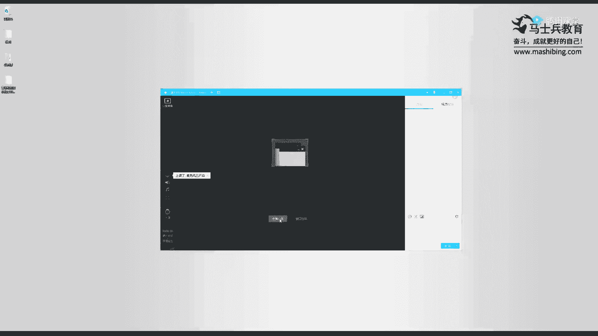

喂，大家好。

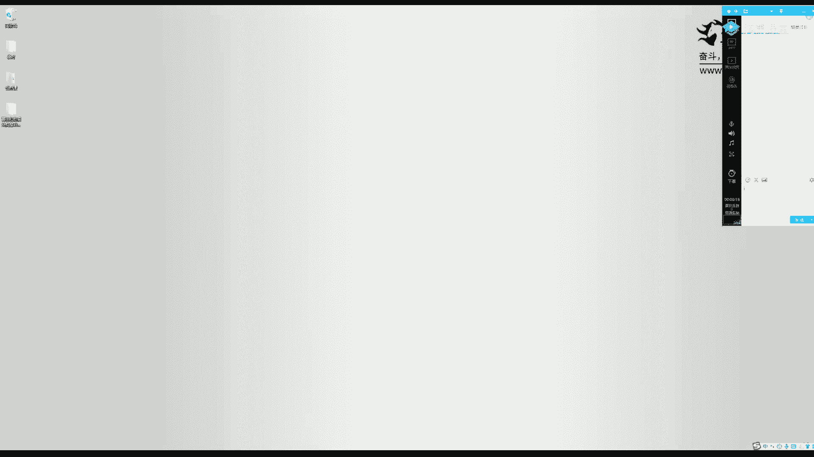

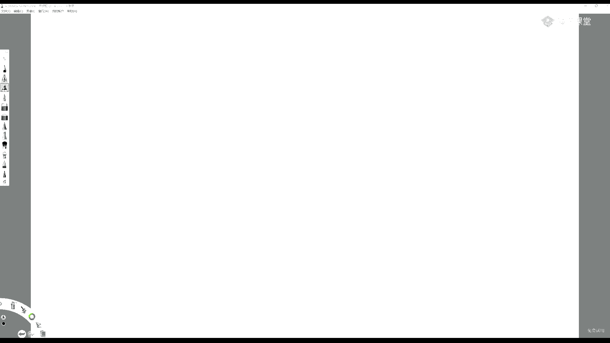

大家好，我再等两分钟，我们这个今天的课和明天的课是一在一起的啊，就是首先我们要我们要先看一些尝试是吧，这个常见的一些写的递归的过程，然后明天的今天今天可能会开始动态规划了，已经对吧，下午开始动态规划。

想动态规划的时候，其实国家描述清楚这个尝试到优化的这么一个过程，因为动态规划就是某一类尝试行为的进一步优化啊，动态规划就是场暴力，任何一个动态规划的问题，都是以某一个暴力尝试过程的优化后的样子啊。

是这样一种关系啊，所以，很强烈建议大家这个今天的课跟明天的课一定要多来啊，因为这个非常关键啊，这可能是这可能是这么多年来给我讲课总结的最成体系的一块儿了啊。

之前我们讲过的一部一大套东西叫二叉树的递归套路是吧，这个可以说后面这个今天这两节课的内容，比那个之前讲过那个总结那个套路还要全一些啊，嗯，其实其实动态规划的本质是某一类的暴力递归啊。

这种这种某一类的暴力递归设计的时候，它是有原理的，而且也是可以可以给你很多提示，然后让你想出来的啊，呃因为面试中的动态规划它不可能难到一定的份上，所以正是因为利用这种，你可以就哪怕你刚写一个暴力递归。

你就知道靠谱不靠谱，他能不能改出来规划了啊，别的老师可能不会教你，这个是我教你点实际的，就是马上能猜出来这个方法靠谱不靠谱，就是你只要把暴力递归的参数表写出来，你都不用写，具体的你都知道。

靠谱不都跟更靠谱，更不靠不靠谱了啊，然后啊才报名之前上网课都没有听过，听得懂吗，那你要看你的基础是吧，我们之前的课讲了好多内容了啊，然后还有就是我们要更正一件事啊。

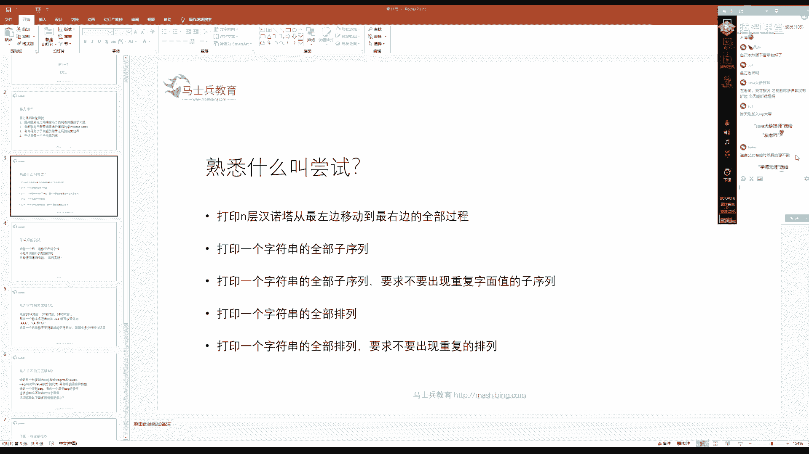

就是这个是我才注意到的，这么多年讲课也没有，其实我我也我也没有实现过这种是吧，就是之前的课讲了一个小的内容，叫二叉树的序列化和反序列化，其中我说这个我在课堂上重点讲了。

先叙的方式序列化和暗层便利的方式序列化是吧，而且还写了对数器啊，能保证它正确，但是我就提了一句，我说这个中序方式跟后续方式序列化也是同理的啊，但具体我就没写了，然后有群里有个同学问我。

中序方式怎么序列化和后续方式怎么序列化，然后后续的方式可以实现，因为后续方式先说一下，后续你这个先叙方式是中左右对吧，这种方式你会序列化对吧，他就是其实这个其实是先序的方式来序列化吗。

然后你后续是什么呢，左右中是不是啊，是左右中的顺序对吧，后续是左右中的顺序，那你那你那你如果把这个后续遍历的序列，你反过来看，他不就是中右左的顺序吗对吧，你说你你说你先去左中左右，你知道怎么反序列化。

现在给你个序列只是这样一种顺序，是中右左，你你会不会把它序列化出来啊，这没什么问题对吧，我们来看一下code啊。

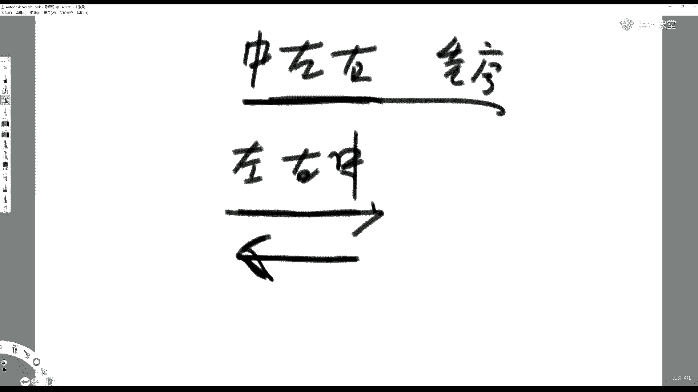

比如说嗯，这是我们先叙方式序列化对吧，你得到一个假设，你得到一个队列是吧，这个队列的顺序就是先序方式所得到的一个序列，序列化的时候先建先建节点再见左数再见右数，依次是递归矩是吧，一次去递归去，没错吧。

这就属于我们先叙方式序列化的形式，上上节课啊，在当时那节课的时候给他讲过了是吧，我们再看后续方式的序列化，如果你得到这个是一个后续遍历的序列，你先干嘛，你先把所有的你先把这个队列中所有的元素啊。

你给它加到站里去对吧，那这个站的顺序它就是逆序了吗，对吧，你原来的顺序是左右中，对不对，然后你你你加到站里去之后，那么在站中的顺序就是什么呢，就是中右左，对不对，中右左了。

上面上面这个先叙的方式是中左右的序列化，你现在得到一个中右左的序列，你会不会把它给也给序列化了，反反序列化了是吧，那不就是先建头节点，再先再见右数，再见左数就出来了吗啊。

所以后续方式的序列化它没有特别的跳跃是吧，也也不会很难写，然后唯独要注意的是中序方式序列化，中训方式是可以序列化的，但中训方式反序列化，反序列化不出来的。

也就是说你想成套的把一个数序列化得到的结果再给它反序列化回去，中序遍历是做不到的，为什么呢，你比如说这两棵树，这个是二维头节点，以为左孩子这么一棵树，这个跟一为头节点，二位又还是这么一棵树。

是两棵树是不同的数，对不对，但是如果你根据我们序列化的说法，你补足空位置之后，它的中序遍历的结果其实是一样的，你看中区别，那结果是先来到一的左孩子位置空，然后把返回一，然后一的右孩子又是空对吧。

所以前三个是空一空往上二，接下来空了空一空二空，没错吧，这棵树序列中序序列化结果是空一空二空，下面这个数据的话，结果也是空一空二空，你比如说一的左孩子它是空的位置，空一该遍历右数二。

但是先打印二的左孩子空，回到二再打一二的右孩子空，所以这两棵树它中序编译的结果都是这个序列，那也就是说我中序变量既然不同的数能够得到同一个中序编译的序列，他就说明中序遍历，你得到这个序列。

即便你补足了空位置，他是有歧义的，就这一个反例就可以说明你反序列化是反序列不回去的，除非你这个中序辩证的结果中，你再加入一些新的信息，比如说你再用一些特殊字符，或者是用一个特殊的位置来表示左数怎么样。

右数怎么样的一种划分才能够做到，但是我们约定好的这种，如果一个没有节点的位置，就拿空来站住，如果是有节点的位置，拿值依次往下走的这样一个链，就是类似于链表顺序或数组顺序的形式。

其实是做不到序列化和反序列化的，因为它有奇迹好，这是我们做一个把我们的课程做一个就是呃也算是一个刊物吧，因为当时讲的时候，我就中旭跟中旭跟后续是一是一句话带过的啊。

现在告诉你说中序遍历是没有办法成套的序列化和反序列化的，好这个内容听懂他在打一，先去跟后续是不会有歧义的啊，因为他提前规定好了头节点，它是先规定头节点的方式，然后左数右数展开的。

而你中序遍历的时候是左数，窜完之后来到头节点，再去右数，严格来讲，你原始序列中，你你其实头节点不知道在什么位置是吧，啊，好啊，那我们就接着接着来讲这个代码我已经推了啊，这个群里面也发了pc的地址是吧。

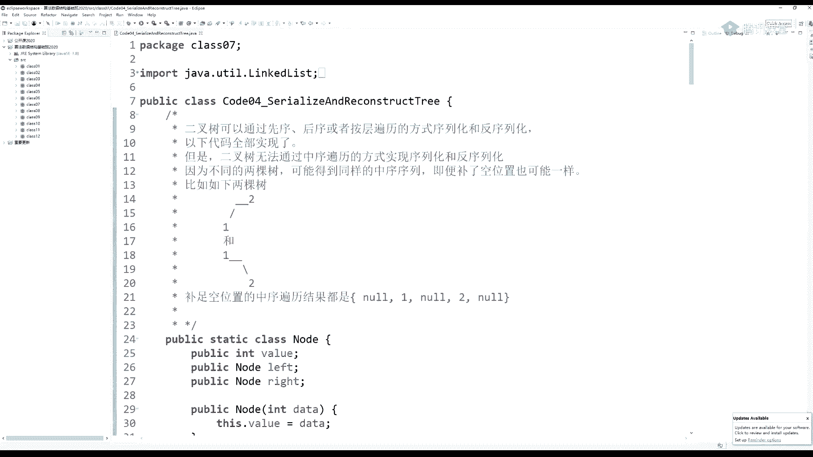

那么接下来讲这个尝试，我们上节课讲了n层汉诺塔问题是吧，这个大家在当时的时候管我要非递归版本，我已经把代码推上去了啊，自己看一下吧，汉诺塔问题的非非递归版本是吧，递归版本都都都讲过了吗。

还讲了好长时间是吧，飞机归版本大家自己看一下吧，啊这我我我实在不行，你就把三层汉诺塔问题，自己在那个飞机柜代码里面写一下它的调用过程，把递归函数展开一下看一下对吧，这个代码已经推完了。

然后我们再看下一个就是打印，怎么样打印一个字符串的全部子序列，这是一种很经典的尝试，什么叫先说一下啊，这里面说一下这个字符串的子串和子序列是什么区别。

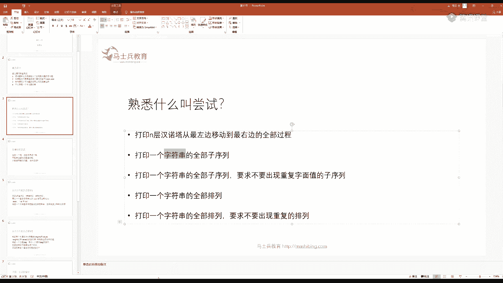

字符串的子串啊，它指的是必须连续的一段啊，举个例子，你比如说a b c d这个字符串，它的子串是必须连续的，那么我们怎么来枚举所有的子串，比如说从零位置开始了，哎，零位置开头的子串。

零位置开头的子串是吧，a a b a b c a b c d没错吧，然后一位是开头的，有哪些子串呢，bbc b c d2 位置开通哪些子串的c c d对吧，三位置开通哪些子串呢。

就一个d这是他所有的子串，我们是怎么枚举的，是根据任何一个位置开头的情况下去来枚举的对吧，你这样枚举是肯定肯定可以枚举全的是全部都有的，那么这个东西就叫子串，刷题的过程中。

总有同学问我老师子串跟子序列啥区别是吧，或者说你根本不理解子串跟子序列的定义的话，你这个这个题没法做是吧，这就是子串啊，所以我们怎么枚举子串，这个简单不需要递归方法，你写两个放循环是吧。

第一个放循环规定开头，然后依次加加是吧，第二个空循环就规定结尾吗，结结尾是从开头开始，然后依次加加，是这意思吧，两个空循环就可以描述去打一个所有的子串了，那么子序列是什么呢，子序列它不是这样的。

子序列比子串要自由，比如说a b c这个就是子序列，指的是我在原始序列中，我也要从左往右依次拿字符，但是可以不连续，不连续是不连续，但是要求你相对次序不能乱，啥意思呢，就是我不会有一个子串叫ba啊。

我不会有个子序列叫ba，为什么，因为b这个字符在a这个字符在这个序列中是左侧的，而我们原始串不是这个顺序，这个就不是，所以注意子序列它并不是全排列的意思，子序列严格来讲就是说我任何一个人。

任何一个位置的子串我都可以要或者不要，那我能够生成哪些子序列呢，那怎么生成呢，这种经典的方式就是每个位置的字符要跟不要所有的路都走一遍，啥意思唉，零位置的字符我到底是要还是不要两条路，对不对。

当我选择要，那就要了这个a那不要呢就没要这个a0 位置的字符，接下来继续展开，来到了一位置，一位置的b我也可以选择要和不要对吧，你要是走零位置的这个决策到一位置。

你也可以选择要这个b和不要这个b接下来每一层都展开二位置，二位置，二位置二位置是吧，来到二位置，二位置呢，我也可以选择要这个c，不要这个c，这个二位置也是要这个c，不要这个c，这也是这都一样。

为什么老连笔，我说烦是吧，稍等一下，我调整一下屏幕的倾斜角，老是连笔，可以选择不要这个c是吧，要这个c，那么我们来看一下，要这个a要这个b要这个c。

你得到子序列就是a b c要这个a要这个b没要这个c得到子序列，就是a b要这个a不要这个b要这个c得到子虚的，就是ac要这个a没要这个b也没要这个c，你就得到一个a，不要a要b要c就得到bc对吧。

没要a要b不要c就得到b所有东西都都能写出来，这个最后一个什么也没有空虚脸，那么这个就是我们所有子序列的生成方式是吧，我们把一个位置的字符彻底的要跟不要都展开，得到所有的序列。

就是子序列a b c那就是所有位置都要了，那这个a b呢就只要前两个对吧，a c呢就跳过了，这个b没要单独写下来a c但相对次序也没有乱，是这意思吧，最后呢只要这个呃。

只要这个a那就是a到了后面两个没要，这种方式其实可以把所有子序列都生成好的。

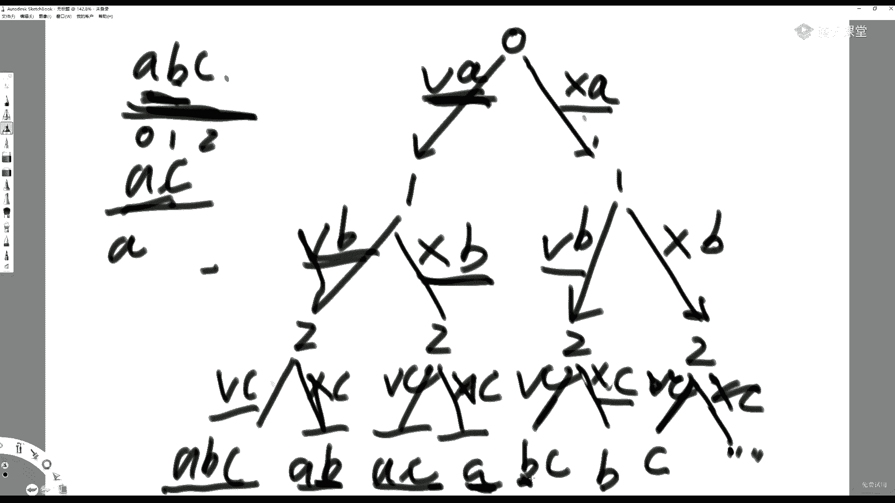

听懂同学打一，好那我来开一个扣的啊，来啊我们来看看这code，这个code是什么意思呢，其实，这就是我们刚才说的那个方法啊，我们来解释一下，就是我们看这种我们想实现这种机制。

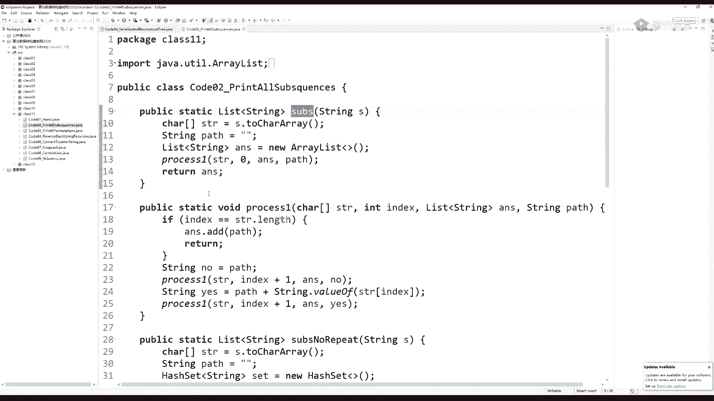

最后能打赢他的所有的东西对吧，想想实现这么一种我们脑海中的尝试啊，这现在目前为止只存在我们脑海中是吧，或者只存在板书上，怎么把它变成实线呢。

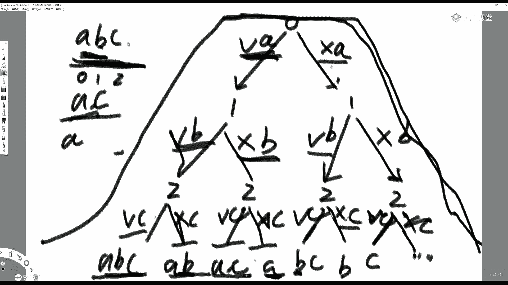

我来看一下这个就是原始字符串，它是一个固定参数，string这是一个固定的固定的参数是吧，它就是它它它这个永远里面的字符是不会有变化的啊，不变，那么这个底下这个index呢就是现在来到的位置是吧。

index就是此时来到的位置，啊此时来到了位置，就是你现在当前这个位置的字符，你到底是要呢，还是不要呢对吧，就是来到了index位置，来到了spring中的index位置，这个当前字符要根不要玩过。

做决策对吧，这个东西是啥啊，这个东西就是这是一个string类型的一个列表是吧，闻过而且它的名字叫answer，那么这个answer是啥意思呢，就是当如果我是啥意思，就是如果。

如果index来到了string中的结束位置，就终止位置，终止位置啊，什么叫中指位置呢，就是最后一个字符的位置，再往右一个位置是吧，如果index来到中的终止位置。

我要把我沿途路径所形成的答案扔到answer里去。

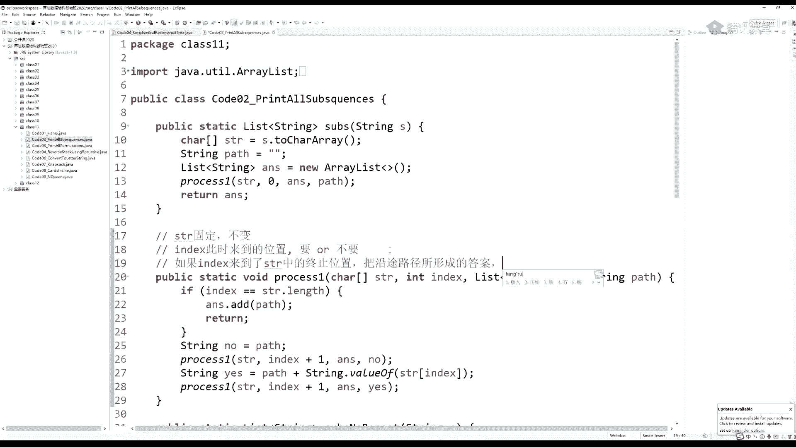

你看这个也是看我们脑海中是吧，我们沿途路径是啥呢，我们要了这个a要了这个b，要了这个c，这是我们的沿途路径吧，要是这个a要了这个b没要这个c，这也是沿途路径吧。

所以我们就是说当我来到了一个不能在选择的位置的时候，请你把这个所有的结果，每一个结果都加到这个list里面去对吧，请你把沿途的每一个结果就是最后一层，每一个结果都加到这个例子里面去，这就是这个意思说。

那那我们就必然还需要一个参数，叫沿途路径是啥对吧。

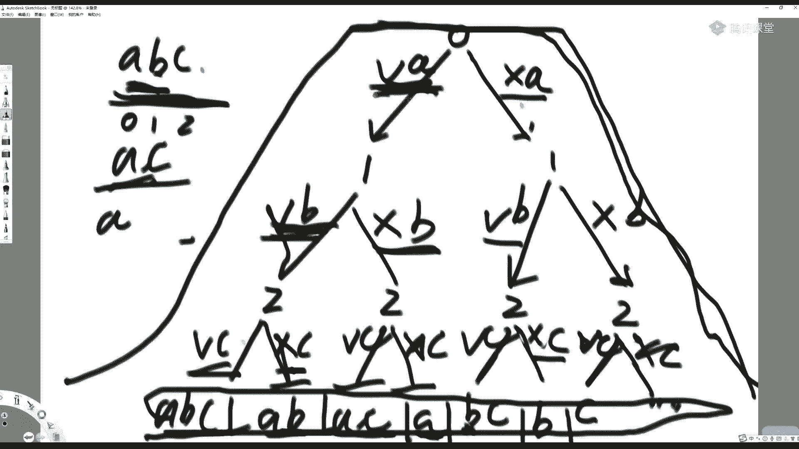

最后一个参数就是沿途路径对吧，就是也就是说之前做的之前做出的，之前做出的选择就是pass，大家不要觉得写递归是一件很难的事，你可以一开始只设计一个string index这样一个参数对吧。

你为什么觉得他写不下去了，你就你就自己硬写这个代码，你发现诶怎么和我想的这个实现不了，那一定是缺东西，如果你感觉到缺东西了，你就在补参数嘛，一直补到你可以把这个东西尝试完吗。

所以不要觉得这个不要觉得这个这个所谓的暴力递归过程非常的难写，事实上你只是缺点动手能力，理解这个意思吧，你一开始可以设计非常糙的暴力递归，比如说你连可能参数都是缺的，那你随着你逐渐写下去。

你发现你怎么实现你脑海中那张长试图对吧，你怎么样实现你脑海中这种长视图，如果你发现你少参数，你缺什么就补什么参数，然后你看看你在递归里面用什么吗，怎么用它吗，理解这个意思吧，啊就是很多同学觉得难。

只是缺点动手能力，自己去写一写是吧，你缺什么就补什么，这种长逐渐的你就适应了好，那么这个递归的含义，我们现在没有讲它内部，但内部也很简单，我们来看一下，当我index来到了终止位置干嘛了。

我们要把沿途的路径所形成的答案放到answer里去对吧，这是不是这说的是这个意思，底下这一行是吧，如果我来到终止位置，我就把沿途的路径放到answer里去，然后return多么直白是吧。

那么我每一那如果我没有到终止位置呢，我就继续，我就继续，我怎么继续，你看第一条路径，这就是我的第一条路径，它调用了自己对吧，是去下一个位置做选择，诶，我之前得到什么pass。

我的no就完完全全是这个pass往下传了，说是啥意思，你并没有把你此时index位置的字符，index位置的字符往下传，那相当于就是你走了一条分支，就是沿途路径是不包含当前字符的路径往下传了。

下面一行就是诶我之前得到的pass对吧，我之前能做pass对吧，之前的那pass我加上了我index位置的字符，这个路径叫yes，然后我让index加一位置的东西往后做选择，所以这条路径是什么呢。

就是我没我要了当前位置的字符去展开，那这不就是不含字符的时候展开，这是含字符展开。

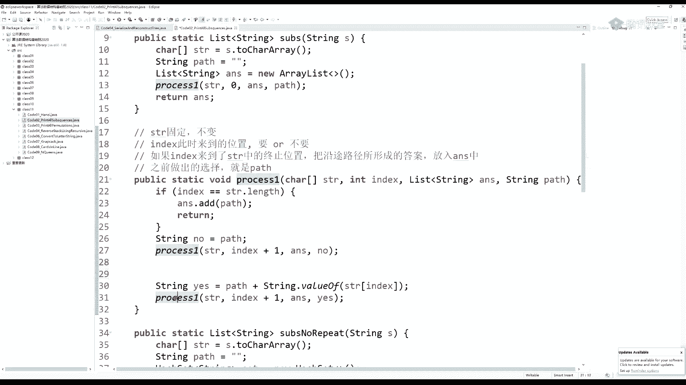

我每个位置我都这么干，这不就相当于我实现了我脑海中尝试的图图。

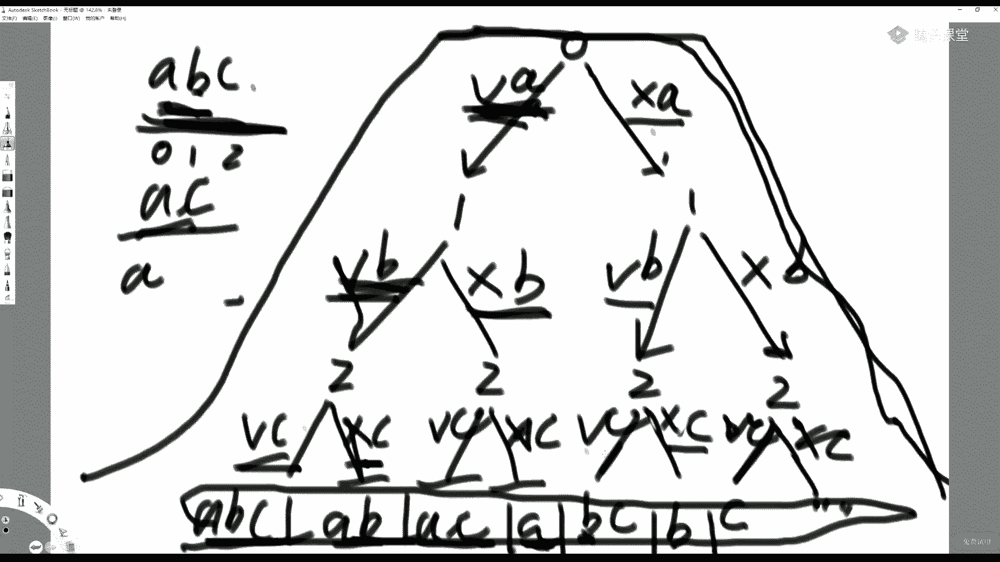

这整个图景吗，对吧好，那么这个递归方法看的同学打一，咳咳，我不知道新报班的同学能不能听懂啊，我感觉我讲的还是挺细的对吧，我不是说凭空给你个概念，我给你先画个尝试图，然后再教你怎么写，对不对啊。

那如果还有打二同学呢，把过往的课看一下，好吧好，那么那对啊，同学说的对，这也是一个深度优先便利对吧，为什么呢。

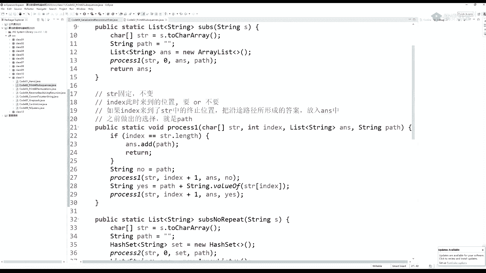

你看我是先走这条路，走到死，然后往上推再走这条路，走到死，然后再往上推再走这条路，走到死，再往上推再走这条路，所以他也是一个深度有限便利对吧啊，这也是一个深度优先遍历。

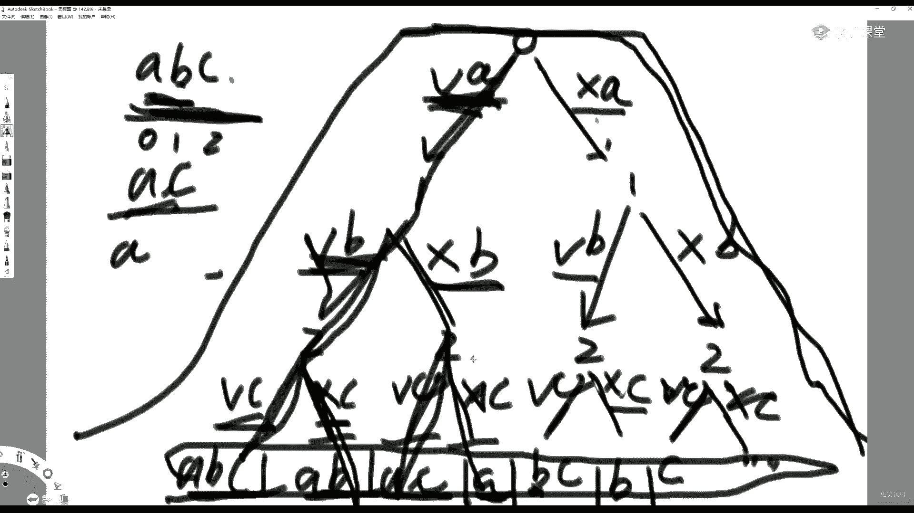

没错啊，好那么我们这个主函数怎么调是吧，主函数呢就是用户用户他不不想调这么多参数，他觉得烦是不是，所以我就给他写一个主函数，帮他做一下组织是吧，他给我一个字符串，怎么生成这个字符串的所有子序列。

先转成字符类型的数组啊，然后path等于空字符串啊，answer准备一个空链表啊，哎这些东西都帮他做好，然后给它放这四个参数进去是吧，从零位置开始，你给我做决策吧，每一步一步一步全给我展开是吧。

那么这样一个调完之后，那pass那个answer里面就是用户要的所有子序列了，我就给用户返回了。

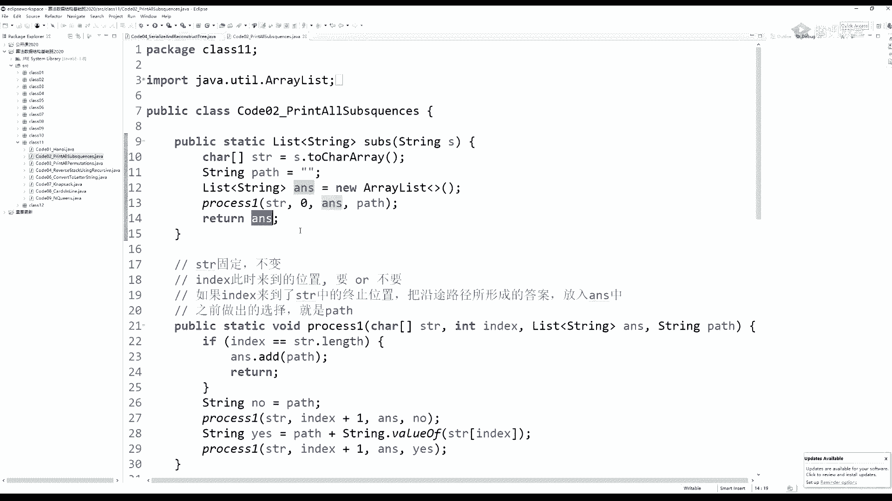

是吧啊，这就是主函数好，那么我们来看一下这个你怎么样打印一个字符串的全部子序列，要求不出现重复字面值的子序列，什么意思，当我一个字符串中，如果所有的字符都不都不是一样的。

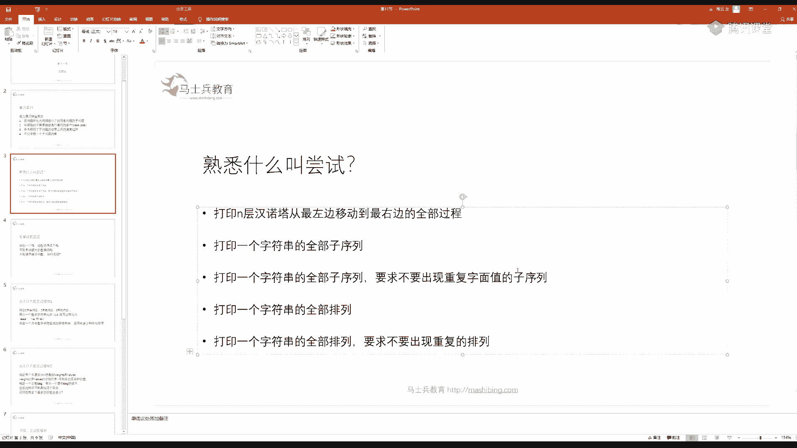

比如a b c，比如a b c，对吧，你说这个字符串它在它在它里面，这个所有字符都是不一样的，那么它天然会得到字面值都不同的子序列，但如果，这个字符串就是三个a呢，你用原来的递归方式啊。

你是回头你会得到一大堆一大堆相同的字面值的子序列，我说的是字面值理解吧，什么叫字面值呢，我给你举个例子，我要了零位置的a，要了一位置的a没要二位置的a得到子序列是啥，是不是a a。

他是不是和我没要零位置的，要了一位置，再要二位置得到字面值一样好。

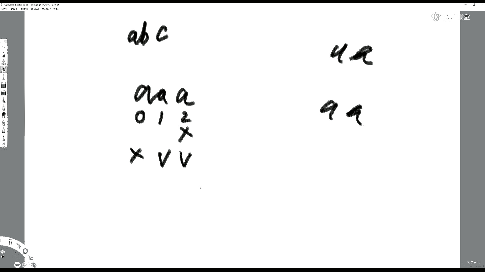

所以呢我们下面一道题，就是说就这个这个这个进这个进阶，就是说不要出现重复字面值的子序列，你给我返回哎，这个看起来就是说他他这个我们先看一下，正常来讲你就是把一个是所有的子序列的历史的生成好。

然后你再去个虫吗。

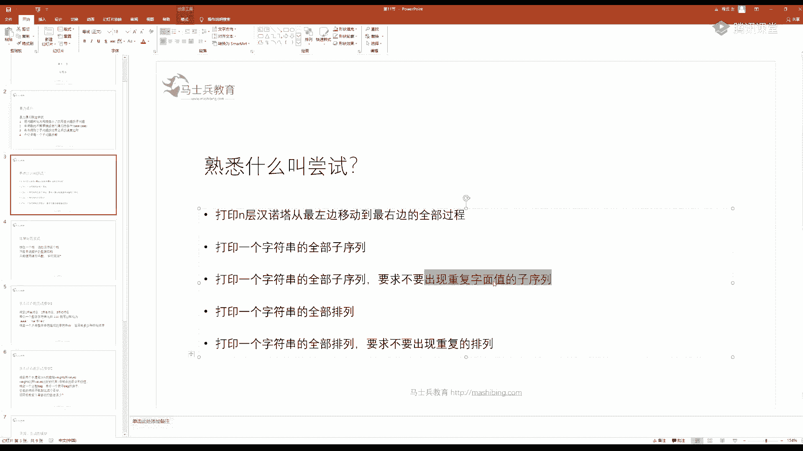

是这意思吧对吧，好所以你看我来展示一下啊，这很好理解啊，就是什么意思呢，你看如果我我我我我我这个递归含义跟上面其实没有太大的区别，这个第二个递归啊，protest 2，这个递归说的是啥呢。

也是string是什么还是什么index位置做选择对吧，但是我收集的容器是赛跑哎，我不再是一个，我不再是像刚才那样的是一个list了，我这个直接收集容器的时候是个s对吧，我收集容器s。

他自然能够再把一个答案加进去的时候，帮我去重，为啥不是集合嘛哈希赛的本身就是保证不重复的，对不对，所以跟上面完全一样，只是你只是你在这个加入的时候，它是一个set，天然就给你去过重了。

那么主函数在调的时候，其实就是我先把这个set生成好，你如果想要list类型的答案，就是list的结构的答案的话，就是你把你所有的答案放在list里面，你别给我set是吧，那我就单独再把set遍历一遍。

给你生成好答案返回，就这么简单，告诉他打一，这里面有一个拓展啊，这个拓展先跟大家说一下，有兴趣同学可以想一下。

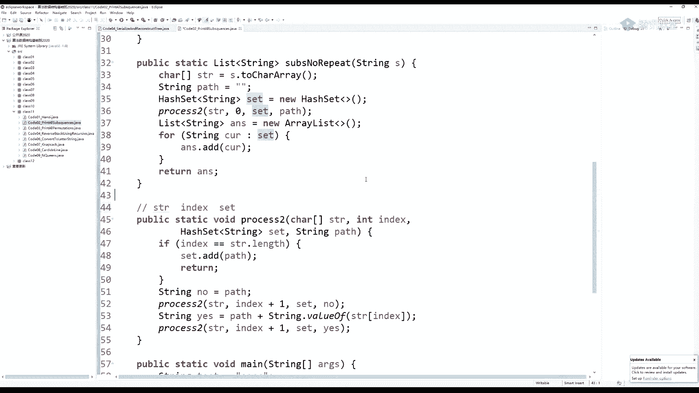

我如果想知道一个字符串中，所有不同字面值的子序列有多少个，所有字面值不同的子序列个数，就是我不要你把所有的不同的子序列都给我了，我不要你最终的那个子序列的样子。

我就问你string中有多少不同字面值的子序列个数，这个问题是一个动态规划啊，大家平时可以想一想，我们会在我们把这个基础班开完之后，开始直接开训练营，会给你讲这些题，好吧，这是一个经典问题。

就是spring中到底不同字面值的数量有多少，他其实可以用动态规划做，但是你现在还没给你讲，所以我们也就现在这里不展开了，把这这今天跟明天的课讲完之后，我们就可以开始做我们这个训练营的练习了，是吧好啊。

在这里先挖个坑吧，我放心，我说的坑一定会补的。

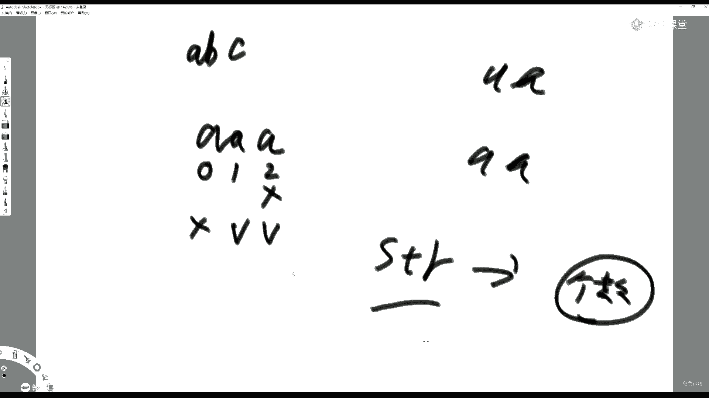

我们再来看，那么打印一个字符串的全部排列，之前讲过之前讲过是吧，之前的课这个东西是讲过的，那我们来点不一样的实现，因为之前讲的那个呢这个是在哪里讲的是吧，它它实现起来其实不够简洁啊，呃什么叫不够简洁。

就是你可以写出一个全部排列的东西，就是你每次克隆吗，我们之前的方式是每一次克隆一下对吧，但是为了但是有些同学新进来，他可能不知道我在说什么，那么也就开，那么也就从头开始讲这个题，因为实现方式是不一样的。

而且这种接下来实现的方式呢。

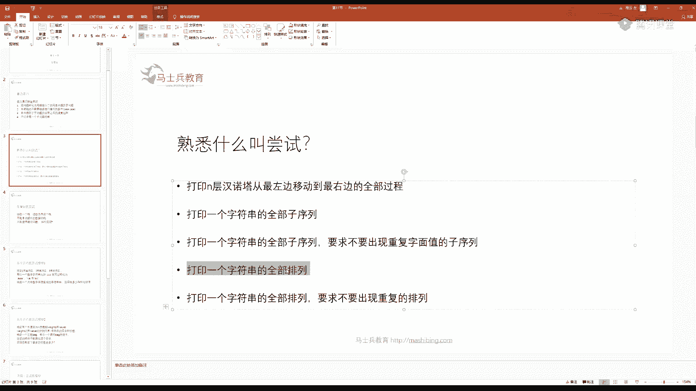

就其实哎我看一下，我准备准备内容实现了，啊准备的是这种实现啊，全排列的实现，它这种是比较简洁的样子啊，这种比较简洁的样子，我们来看一下啥意思。

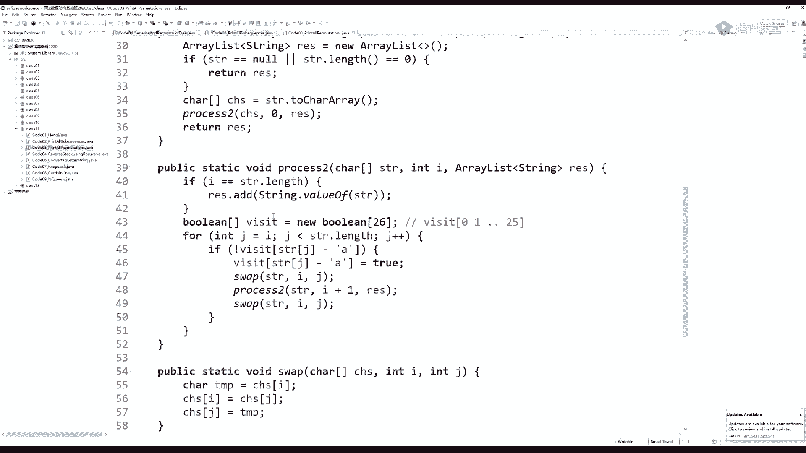

先先想一下我们这个实际过程怎么样搞全排列，假设有一个数组零位置，字符是a，一位字符是b，二位字符是c，哎我们不想每一次都准备一个新的结构去执行这个全排列，所以我就想这么干怎么干呢，这样来弄啊。

这个数组原来是a b c，零位置一位置二位置对吧啊，然后，我这么尝试，零位置的a还在零位置，这个叫一位置的b来到零位置，下面叫二位置的c来到零位置三种方式，如果你走的是这个分支。

那么零位置的a还在零位置，它就会继续往下传的是a b c这个数组继续往下是a b c，如果你说一位置的b要来到零位置，那你往下的数组就是b a c，为什么，因为一位置的b和零位置的a交换了。

如果你二就是二位置的c来到零位置呢，那你往下走的数组就是c b a，因为你把二位置c2 位置的c和零位置的a交换了，然后这呃这里面比较多对吧，我靠这个画不下了，怎么办，那就写小一点好吧，写小一点啊。

把abc给你展示了，怎么搞个全排列，就是我们从始至终只有一个数组，能不能实现全排列，你别给我搞新的结构，我觉得烦是吧，可以啊，第一个分支零位置的a还在零位置。

那就接下来这个数组就应该是b a b a b c的样子对吧，这个数字就是a b c的样子，然后这个分支呢就是一位置的b来到零位置，他要交换，那么这个数组的样子往下传的就是b c这个样子对吧。

二位置的c呢来到零位置，那我就希望这个他后面往下传的样子是c b a它，但是它依然是一个深度优先展开是吧，好我们就说这个这就是我们在这就是我们在谁来到零位置，这件事情做了决策，下面干什么。

谁来到一位置来做决策，谁来到一位置来做决策，好，这是零位置，这是一位置，二位置我们已经走过的位置，这就已经来到了位置，就是这个零就是此时来到的位置，在上一步的时候，零就是此时来到的位置。

下面就该轮到什么，此时来到一位置对吧，一位置，那么谁来到一位置呢，你不要再把一左边的东西再放到一位置上，你只能从一开始往后的这些位置，这些数可以尝试放到一位置上，啥意思呢，就是香港轮到谁来到一位置了。

但是谁来到一位置这件事情你不要再把你已经放在零位置的东西，反复的来到一位置，这个全排列的思路就是说你看你如果你不分顺序，a b c我先我问你先零位置的可能性有多少种，三种对吧，意味着可能性有多少种。

两种可能性多少种，一种就这样的东西，所以就是来到零位置的时候，你所有东西都可以选来到一位的时候，来到一位的时候是已经决定好谁在零位置上了，你就别他就不能自由选择了，懂这意思吧。

来到意味着就是你零位置的已经是决定过的了，你就不要再自由选择了，剩下的字符中谁来到一位置，同样道理，你来到二位置的时候也就直接确定了，因为零位置一位置已经固定了，相当于你只有一种可能性支持你的二位置好。

那么具体来说，你你你听你听一个影子是吧，我会给你彻底展开的啊，会给你彻底展开的，你看你就知道明白啥意思了，那么在这个数组中呢，我既然零位置是已经选择了，我就画条线，它不要动了。

那么这个分支就是谁来到一位置，第一个分支就是一位置的b还在一位置，这个分支就是二位置的c来到一位置，没错吧，如果我意味着那b还在意味着那个数组的样子，就是a b c，对吧，就是a b c还是a b c。

如果我让二位置的c来到一位置呢，数组的样子就是a c b，好接下来就是一种选择了，就是二位置的c还在二位置，是二位置的b还在二位置，没有办法选择了，为什么，就像我们说的，来到二位置的做选择的时候。

前面的东西你不要再重复的往回放了，所以如果二位置c还在二位置，那么最后得到的样子就是a b c好，你就打印这个a b c，它是你全排列的一种，如果二位置的b还在二位置呢。

你就打印a c b它是你全排列的一种，这我们就搞定了是吧，好我们再看这个分支，就是一一，它还是一个深度，它还是一个深度，像便利，最终你会回到原始大问题的第二个分支上，没错吧。

那么接下来你继续再展开一位置的b来到零位置了，他也是哎谁来到一位置呢，一位置的a一位置的a还在一位置，那就是b a c接下来又是不能选择了，所以你就打印b a c还有一个什么选择呢。

就是二位置的c来到一位置，那你接下来数组的样子就是b c a对不对，那你他他自己最后一个二位置也是没有办法选择了，直接打印b c a再看这个分支，这个分支也是啊，是轮到一位置的b还在一位置。

那就后面下面就得到cba，最后打印cba，这个呢就是二位置的a来到一位置，二位置的a来到一位置，那你得到什么样子呢，c b因为二位置的a要跟一位置的b交换，最后打印c a b所有全排列。

从始至终其实只需要一个数组就可以做到这件事情，我们马上看代码懂我在说什么意思，同学打个一，啊去啊，对吧，我们想实现这样一种事情。

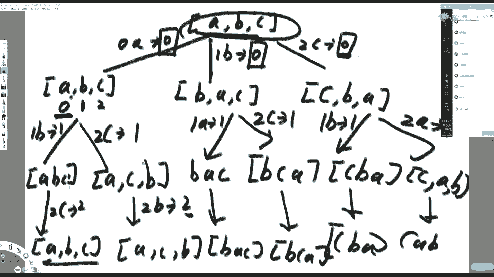

来我们来看代码，这就是它好简单，对不对，你说这个参数好简单，当然你也可以实现成复杂的样子啊，这是什么意思呢，就是string，就是这个这个递归含义是，i及其往后的所有字符都有机会来到，i位置对吧。

string i往后所有的字符都有机会来到i位置，好，那你什么时候是不能再自由选择的了，i如果来到中指位置，是不是所有东西都确定了对吧，因为你看那你你说i往后所有字符都有机会来到i位置。

那之前的呢都是你已经做好决定了，the dream，从零到a减一啊，都是已经做好决定的，已经做好决定了，而i往后所有的字符都有机会来到i位置，是没有决定的，现在要决定对吧，如果要来到终止位置。

那你说明是不是零到n减一都已经做好决定了，是这意思吧，这个时候请你把全排列的结果加入到result里面去，或者他叫answer对吧，或者他叫answer，来到终止位置呢。

那就说明啊这个string string当前的样子就是一种结果对吧，spring当前的样子就是一种结果，然后把它放入到把它请你把它放入到answer，就是那个所有结果的release里面去，好就这么干。

这个代码就这么短，我们刚才说的一切这么多，打这么多科，其实就是短短几行代码，i在中指位置的时候，result加入，此时死dream所表现的样子，你看string是个啥，他现在是个字符类型的数组对吧。

请你把这个字符类型的数组转成string，放到result里面去，转成转成一个字面值对吧，转转成一个字符串放到result里面去是吧，当然你也可以在这加return，你也可以不加。

你也可以在这加rn直接return了，你也可以不加，反正你如果越界的话，如果如果越界的话，已经终止位置，下面那个for循环是不会不会执行的对吧，你加了return也行，你不加return。

它下面过程也会直接跳过，那下面是什么呢，重点就是看我i还没有到终止位置的时候，他怎么做的，那就是我的ipad，如果如果ipad没有终止，如果i没有终止位置，没到终止位置。

那么接下来是不是从a往后所有的位置都可以来到i位置，对吧，从i往后所有的位置都可以来到i位置啊，是这意思吧，那我这个g实际上就是i往后所有的位置都可以尝试着来到i位置，大家看啥意思。

你看我这个g是从i开始，g不越界g每次加加，所以这个g就在尝试这个g实际上就在尝试什么呢，这个g就在尝试i后面所有的字符，都能都有机会对吧，i后面所有的字符都有机会，这位置的东西跟i位置的字符做个交换。

相当于。

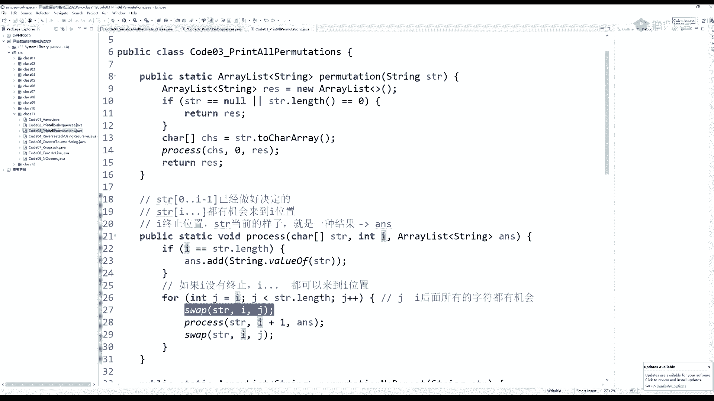

比如第一步啊，比如说这一步一位置的b来到零位置，它所以a跟b要做交换，b a c这个样子就变成了b a c然后继续往下走了，对不对。

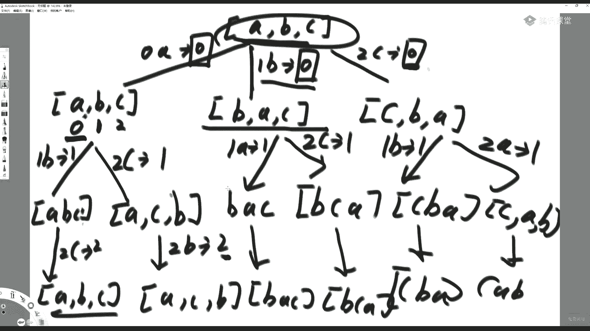

这就说明交换你交换完了之后，继续在i加一位置上，人人都有机会，但是i加一之前的别动了，最后你一定要把这个执行过程执行完了之后，你一定要把这个东西给它拧回来，哎过往的课我们讲了，为什么要恢复现场讲了四遍。

之前的课，现在理解的同学打个一，不理解同学打个二。

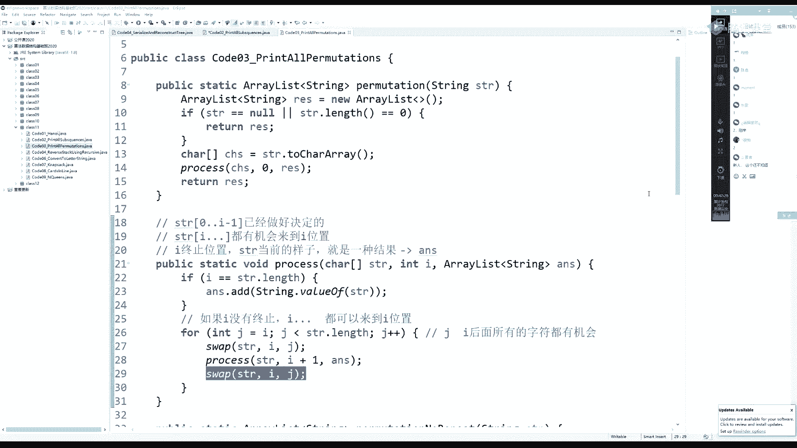

啊这个这个原因是很简单的，就是你希望恢复现场啥意思，你看你比如说你最底层，你怎么拧成acb的，我不管，但是你你要想走这个分支，你是不是得得你是不是得依次往外退，退到这一步，再退到这一步再退上来。

这个分支对吧，你一次退的过程中，你必须想办法把这个样子啊，给它变成a b c的样子，然后执行这个分值才是对的，也就是说你每一次交换完了之后，你一旦返回了，你要把它交换了哪些东西再恢复回来。

不然的话他没有办法还原回原样子，给你做每一个不同的分支，这就是理由打二有同学理解了吗，大二同学理解我在说什么，同学理解了吧，大二同学就是我啊，你理解就行了，如果具体不懂的，可以去看之前的课好吧。

就是为了恢复原来的样子，恢复现场，然后才能够正确执行好，我看一下啊啊对你i判断n减一位置也可以，以你以i等于n减一位的时候，中指也可以的啊，也可以的，那么这个就是我们优雅的实现。

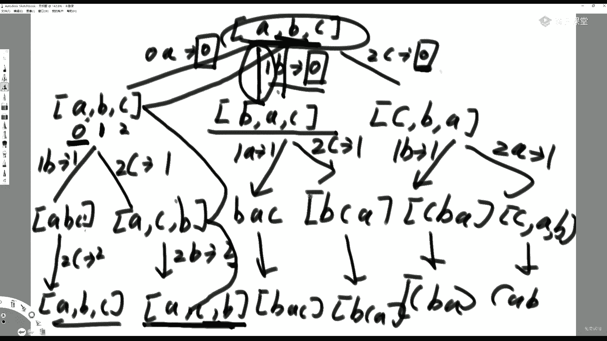

这个非常优雅是吧，我就一个位置的东西，我不用再申请新的了，我不用再申请新的了是吧。

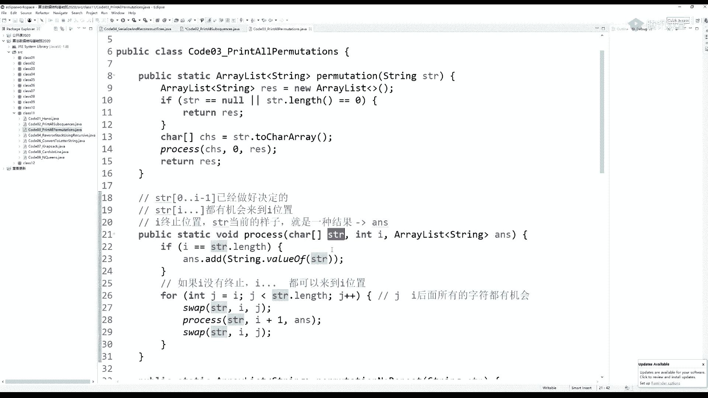

我们再看这个题，下面这个怎么打印一个字符串的全部排列，要求不出现重复的排列，还是跟我们刚才哎这个就很有意思了啊，这个就很有意思了，他还是跟我们之前的子序列是一样的，爷爷你也可以像刚才的。

你也可以像刚才那种子序列问题一样，先生成所有的排排列，然后去重是不是可以可以的，在这里面我就要给大家讲一下分支线界这个东西了，分支限界这个东西了。

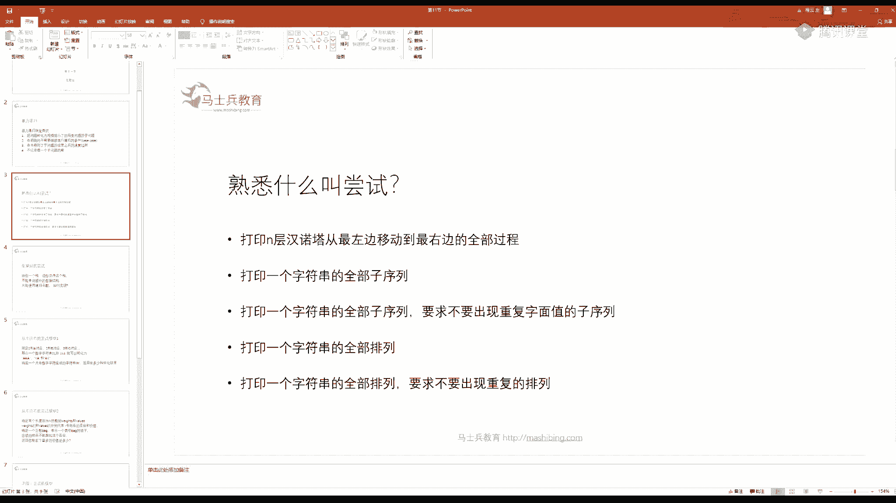

来我们来展示一下啥意思，如果我们要是硬改会怎么改。

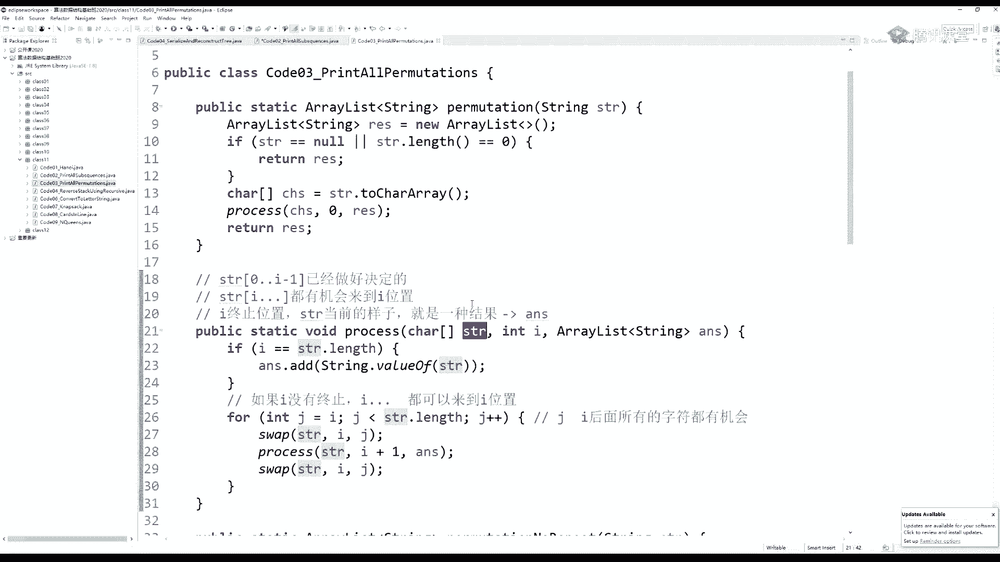

注意我不是在拖时间，而是我们改出来这个版本它不是最好的。

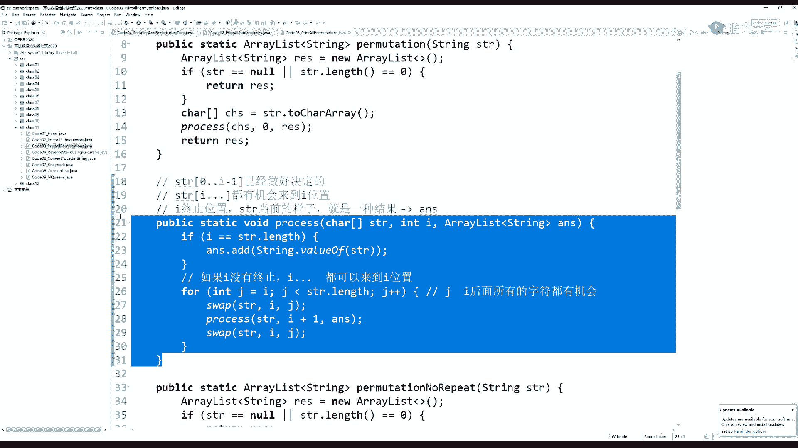

要给大家讲一下这个问题啊，比如说我们现在写个f函数，这个f函数我们可以把它改成哈希set，没错吧，可以把它改成哈希set，然后呢这个f函数往下掉的时候，它这个就掉f掉自己对吧。

的时候我们只要把这个哈希赛特answer l，把哈希set这个把这个字符串转出来，加到这个哈希set里面去，就自动帮我们驱虫了，你可以这么做，你可以这么做，我们看下面这种时间下面怎么实现呢。

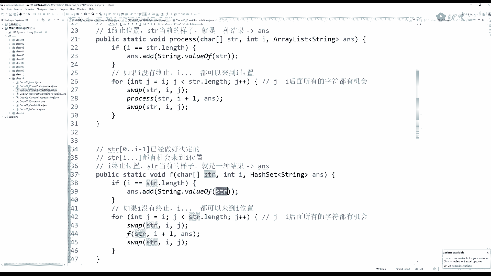

我们这么来实现，我举个例子，a a，我们再来举这个例子，aa原始序列是a a0 位置，一位置，二位置我们怎么说的，哎你你可以把零位置的a放到零位置，对吧。

然后你刚才我们那个实验方式是你继续尝试一位置的a放到零位置，还有二位置的a放到零位置，你可以这么尝试好，我们现在不这么试了，怎么试，注意这样，我们把我们在每一层，如果有一个哈希set。

零位置的a来到零位置好，你已经你你零位置，你零位置已经你零位置已经尝试过当前字符是a了哟，然后他会去跑一大圈分支，他会去跑一大圈分支对吧，因为我有这个set的存在，我下面进行了一个分支是什么。

一位置的a放到零位置，我直接把他杀死，我为什么只可以把他直接杀死，因为我用一个set已经记录了零位置上a这个字符的后续，我已经尝试过了，如果你再把一个重复的字符再放到零位置上。

这条路我杀死我直接不给你跑，后续了，所有后续全杀死，同样的道理，这个分支也是二二位置的，a来到零位置，我也杀死，我，为什么杀死，因为我零位置上已经摆过a这个字符了，我不要再重复尝试了。

这样一来我们就取虫了，他他这种方法就叫做分支线界，什么意思，你可以把整个递归你的，你脑海中那棵树彻底展开，所有情况都列出来啊，然后收集完所有的答案之后再过滤，这不叫分支衔接。

这叫你呈现了所有的可能性之后，再在其中筛答案，它是一种过滤暴力递归加过滤的方法，分支限界是分支线界，它也是暴力递归，但是它在进行某一个支路的时候，直接用机制就知道此时的支路我以后都不需要走。

这叫分支限界，就是你人为的给它增加限制，如果没有必要的支路在源头的时候就杀死，你说哪个会更快，当然分支衔接听懂他在打一，分支限界也是暴力递归，分支限界也是暴力递归。

但是它是一种增加了提前就是提前杀死之路的暴力递归，对吧好，那这个东西怎么实现，类似计划搜索吗，哎不类似，他可不类似，记忆化搜索，不能乱用记忆化搜索，可是我要好好讲的东西，对啊。

他记忆化搜索他就是利用限制提前杀死之路。

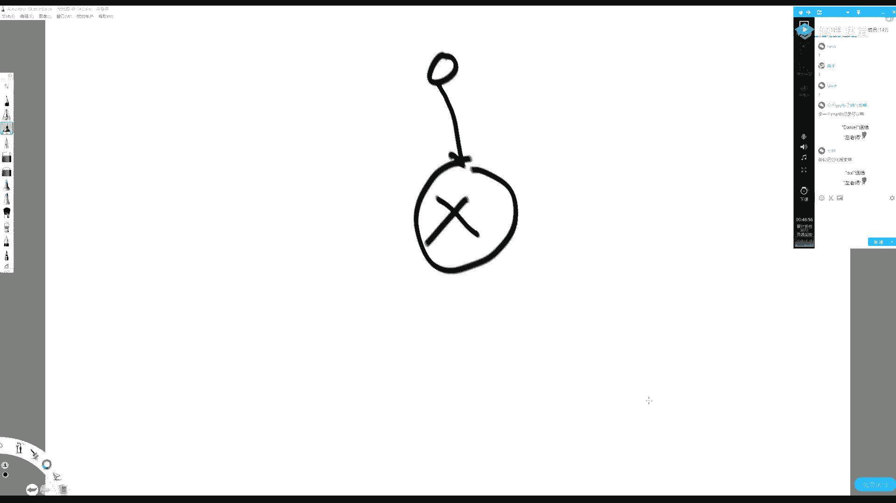

就要分支衔接来，我们来看一下这个怎么写的，把这个函数擦掉了，好吧，这没有用，这是过滤的方式，方法下面这个方法就是过滤的方法啊，就是分支线进来看，这是啥概念也一样，他跟刚才的概念一样。

你要实现的功能是一样的，功能一样，机制不一样啊，还是一样string啊，零到i位置上已经做好决定了对吧，零到i位上，零到a点已经做好决定了，现在来到i位是什么意思呢，i往后所有的字符都有机会来到i位置。

如果还是终止位置死人当前的样子就是一种结果，加到水里面去，加到里面去好，i等于终止位置的时候，你还是可以把它加到里面去，然后return这可以加return也可以不加好吧，可以加热，它也可以不加好。

接下来看假设就26种字符，或者如果你假设不了26种字符，不只是六种字符，那你这个v的就搞成哈希表的形式，这是啥意思，visit就代表零位置，就代表a这个字符，你有没有使用过b这个字符。

你在当前位置有没有使用过，下面就是c这个字符，你在当前位置有没有使用过，这就是我们26个长度的布尔类型的数组就可以代替哈希表，a字符出没出现过，b字符出没出现过，c字符出现出没出现过。

一直z字符出没出现过，是不是就够了，对吧好，接下来咱们怎么写的，来看，没看还是这尝试每一个位置的字符，但不是所有支路都走的，如果这位置的字符减掉a的阿斯卡码啥意思，字符被转成了数，a被转成了零。

b减a的阿斯卡码被转成了1c减a的阿阿斯卡马被转成了二，理解吧，你看所以就说这种字符没出现过，我才去走之路啊，这种字符没出现过号，我登记他不以后，它就是就算你使用过了，哟对吧，这种字符没出现过。

我登记他才走接下来的之路，如果某一种字符，这位置字符是之前出现过了，我鸟都不鸟，if直接让if没中，直接进行下一个蜘蛛的判断，看着他在打一，这就是分支线进它肯定是比我们过滤的方法要快的，判断没看懂啊。

那你哎呀这个啥意思啊，就是你说你当前string g，如果他是a字符，如果如果string g他就是a字符，你告诉我string g减a的阿卡玛是谁，是不是零对吧，那你去其实判断visit 0啥意思呢。

就等同于你判断a字符出现过了没，理解吗，如果你string g是b字符，就是v字符，如果你死jj是z字符，我问你，那么z字符减掉这个a的看法是谁，是不是25等同于用visit 25来判断z出去没出现过。

这玩意儿就是哈希表，你就把他认为这个哈希表只是我们这样做，快一点理解吧，准备长度也很小，就可以替代哈希表的功能吗，你每个位置的字符没出现过，我才去试这条支路以后，我还要登记它为处。

为了保证他以后不要重复走这个支路，现在听懂同学打一没懂还是没懂，同学打二，这个visit不共享啊，整个过程不共享，对啊不共享啊，我只是在当前这个过程中加了此时我的威廉呀，那又怎么样呢，那又怎么样呢。

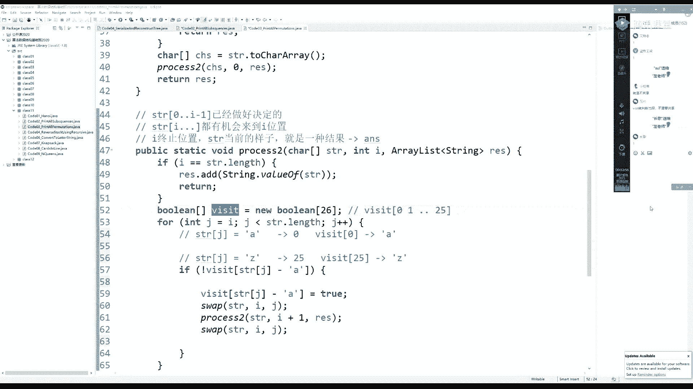

共享才麻烦了呢，就是想让他不共享，对不对，你行了啊，不共享啊，对就是不共享啊，谁告诉你共享啊，我啥意思啊，你我现在问你，我不分顺序，a3 个a两个b一个c0 位置有哪些，选择三种，要么a字符的展开。

要么b字符的展开，要么c字符的展开，是不是三种，接下来甭管是什么，之前你去做了什么选择，比如说你零位置，你零位置使用了一个a，其实对于你后面过程来说，就是你你你只有你只有这些东西了，一是不是a可以展开。

b可以展开，c可以展开，本来就不应该共享啊，对不对，我当前位置选什么字符，为什么要跟其他位置共享呢，都明白，同学打个一，啊好嗯啊。

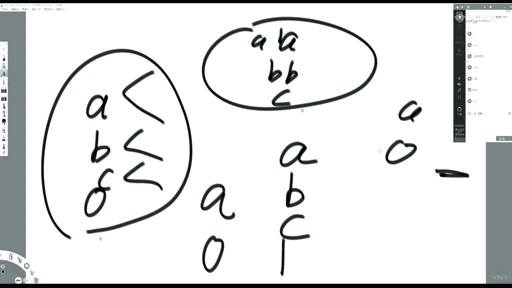

这个就是咱整挺好是吧，给你讲分支线界了，分支线界我们以后还会用到啊，就是他其实是利用去找用利用限制的方式提前杀死一个一个分支啊，他会比你整个都展示完所有可能性之后得到结果再去过滤，那要快多了对吧。

远原本的过程我就没有让它发生，你说他能不快吗，是不是啊，所以我们来看这个这个题我们上节课讲过了啊，这个题我们上节课讲过了，把题读一下，我们休息两分钟，继续不会同学发弹幕，休息两分钟，继续把这个题读一下。

这是当年我们也facebook的原题，注意啊，我们我们现在大家知道我这个课有多么庞大吗，就是关于动态规划的这样一个东西，给你讲得很好，现在目前为止所有的尝试都是从左往右的尝试模型，这只是一种模型。

你看一下这个，哈喽卡不是序列，是不是从左往右开始试，每个位置要跟不要全盘，每个位置开始是每个位置是什么，是什么，该是什么，一直一直往后，从左往右尝试模型，也是从左往右尝试模型，背包也是从做网友尝试模型。

这只是一种模型诶，动态规划跟你讲四种模型，一个模型能够改出来的递归非常的多啊，光一个模型解决的问题就是无穷的，我告诉你一共有四种模型，而且我告诉你，你面试中超过这四种模型的，几乎不会出现牛逼。

这就就等于说什么，你掌握了四种模型之后，哪怕你一个题没思路，你你一个模型不，一个模型套，你也能套出来，听听出来打一，听懂啥意思吧，哈哈哈，这么多年他就有没有之外的模型，有学术上是看是很多的。

但是只是看面试的话，只是看面试的话，模型数量就这么多，这四种模型没有cover住动态规划问题，在学术上是很多cover不住的，但是在你们面试中没cover不住的部分，5% 5%，这么多年都是，好对啊。

就是面向面试我已经说了，算法算法算法算法这个东西，你你你究其一生也搞不完，你怎么在我的课上货机获得一点实际的，那可不就是面向面试学习嘛对吧，还给你讲的基础给你讲清楚，但是告诉你面试他是什么样子。

这是不是你们最需要的对吧，那这个为什么是从左往右的尝试模型呢，它怎么就从左往右尝试了呢。

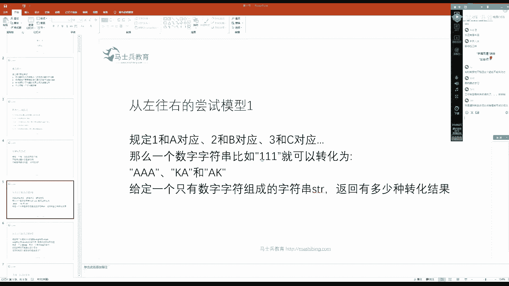

怎么来看，我举个例子全是一，我问你有几种转化，五个一，这么试的，第一个部分你转出来的第一个部分单独一个一，我问你能不能转，可以转变成什么，它变成了a剩下的四个一，你继续努力去吧，二个分支诶。

你就两个一开头的两个一能不能转11位置的字符是啥，a b c d e f g h i j k上k剩下部分的三个一，你继续努力去三个一，能不能转不行了，所以就这么两个分支，还还是从左往右的尝试模型。

根据第一块儿我要画多大，来枚举，结束了啊，他要打一，所以它还是它就是一个从左往右的常识模型对吧，都是通过网络传输模型都是一种啊，就是我们来具体问题看一下这个递归递归很简单的。

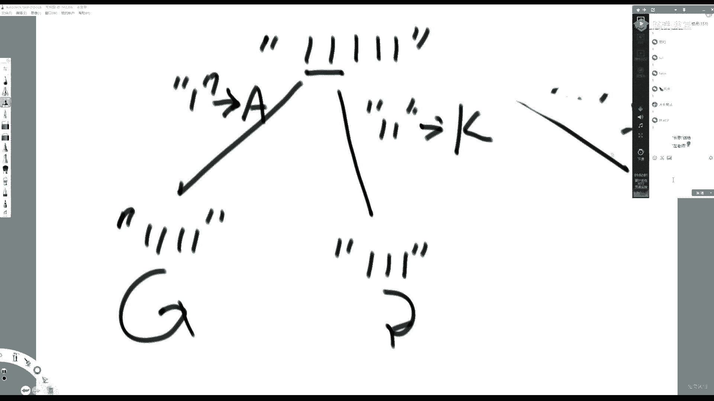

其实而且它是可以改成动态规划的，我们会把我们会在明天把这个题改成动态规划啊，规划的方式给你写了，现在你看不懂不要紧，明天讲啊，一个参数，因为他问的是有多少种转化结果对吧，没要你所有的转化的样子。

他就要你有多种转化的结果，要那个数啥意思，这个地位啥意思，零到a减一上，已经转化完了，那么就是说0i之前的位置如何转化，已经做过决定了，你不用再关心了，就问你零。

如果你只能转a出发及其往后所有的字符串有多少种转换的结果，这就是零到a减一，你可以认为它没有，所以就认为他没有看i往后我问你有多少种转换的结果，如果是这样一种含义的话，主函数应该怎么调，从零出发。

我问你一共有多少种转化的结果吗，递归含义，理解主函数为什么这么调，也理解，同学打个一，接下来我们就看这个抛弃这个递归递归说什么，等于终止位置的时候，为什么return这个e我们解释一下。

来到终止位置的时候，返回这个一是什么意思，可以有两种解释，你能理解哪一种都行，第一种解释，没有字符的时候能不能转化，能转化成空字符串解释第二种解释，找到了一种有效的转化，零到a减一，已经转化完的部分。

你当我终止位置的时候，我收集这么一点答案。

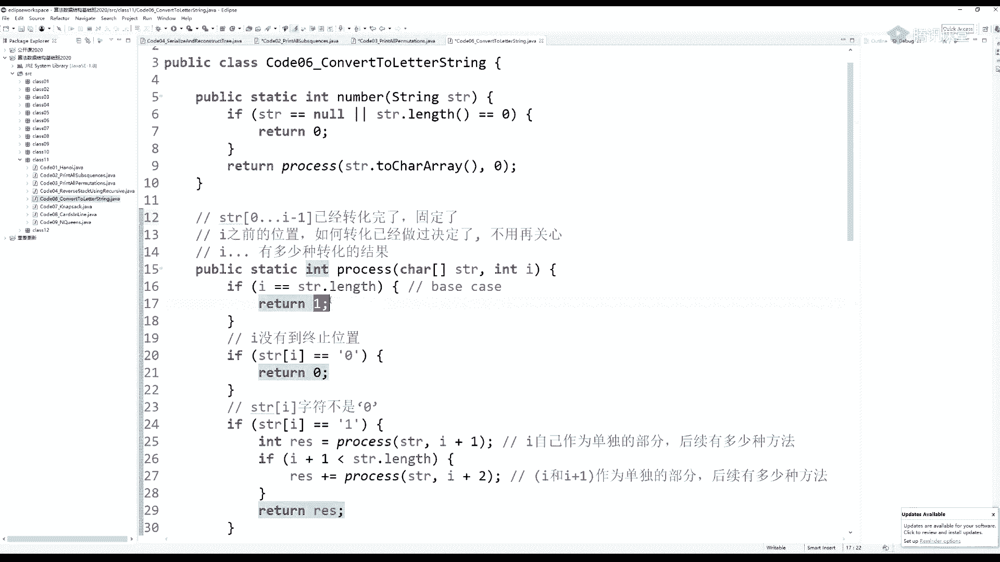

幺幺，那我就让开头的这个一自己作为一个部分，它转化成了a接下来轮到零位置的一去转化，他也用自己单独一个一位置的一一位置的一座，转化了一个a来到终止位置，好之前的这个转化就找到了一种结果。

我就返回一个点数商，返回往上返回，他就收集到了一点，继续这边儿我可有两个一拼成一个k转化，接下来他就来到中值位置，他就找到了一种有效转化，什么呢，转化成了k一个点数往上返回。

他在上游会把这两个一加起来作为总的转化方式，两种，你你这两种方式你哪种理解都行。

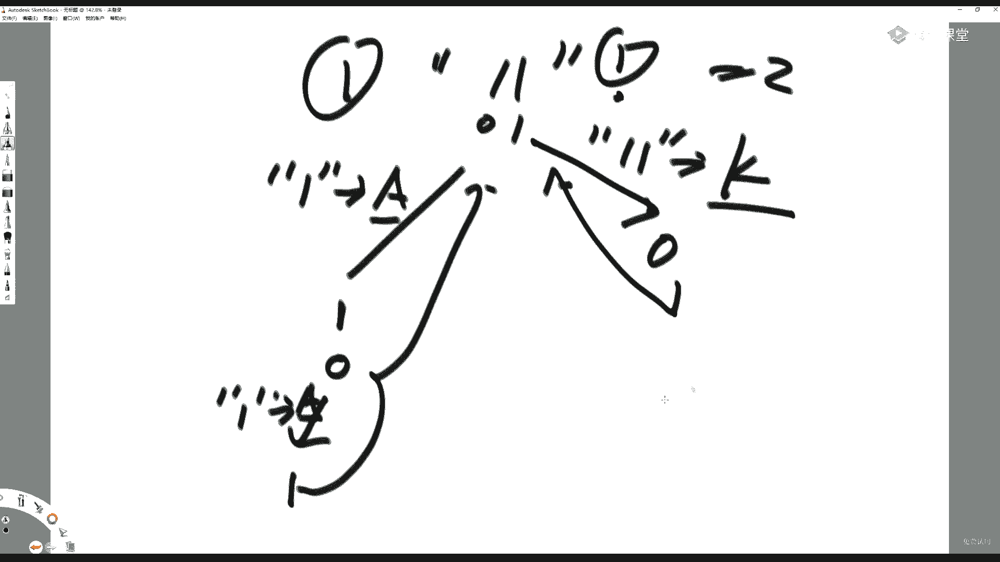

你可以认为i为i到中a到终止位置的时候已经没有字符了，我也可以转化就转化成空字符串，我我也可以认为我找到了一个点数，就是我零到a减一上已经转化完了吗，不是他们共同构成拼成了我的这种转化。

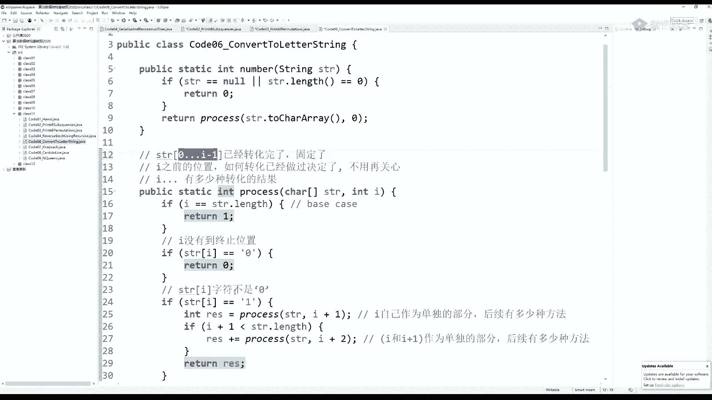

第一这种方案叫a和aaa的方式，a的方式，第二种方法单独一个k的方式，就是我之前转化完的部分。

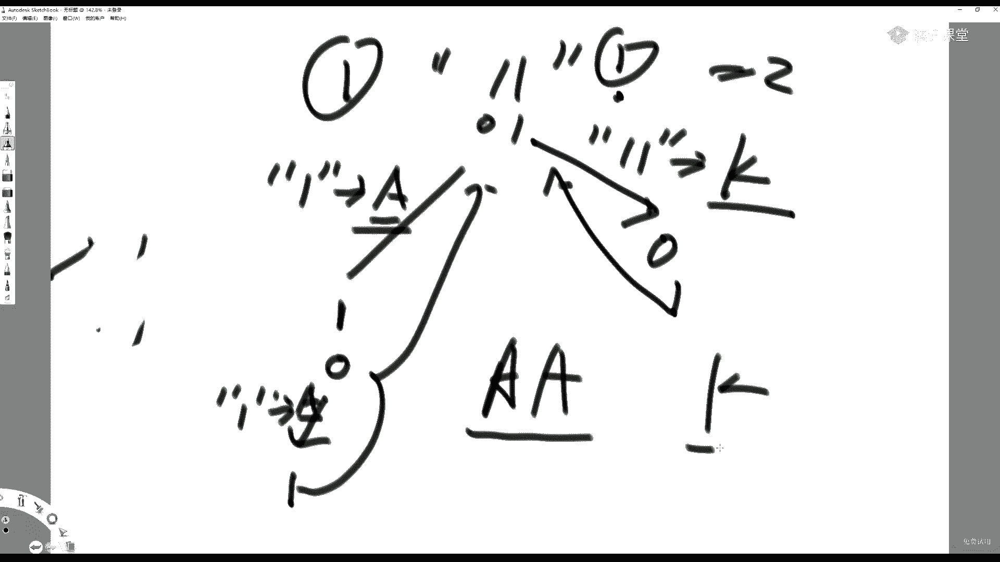

它就是构成了我的一个点数，听懂同学打一，那么这就是我们的base case终止条件返回一点，他没有终止，我i没有到终止位置上来，如果string压中的是零字服务，后面怎么都没有办法转化了。

因为零字符没有转化的方式，我们说了一对应a26 ，对应z只有这些值有转化，零是没有办法转化的，return 0，听懂同学打一，0。2，你你你会在什么情况下让i位置的字符，会在什么情况下。

i昧着字符压中零字符啊，举个例子。

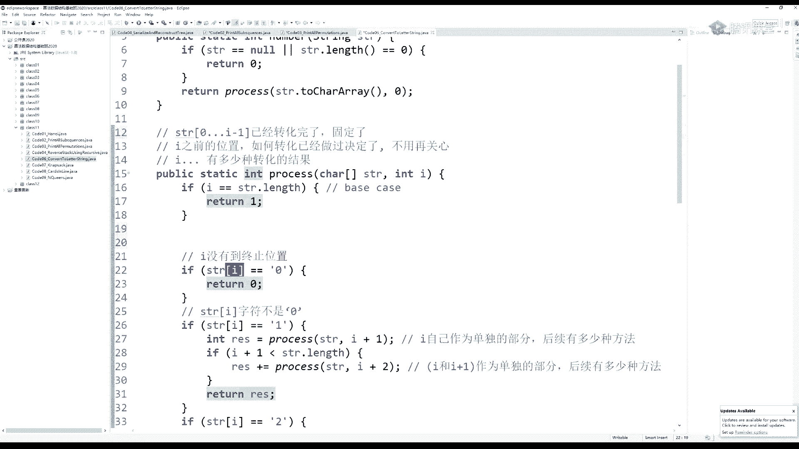

比如说一上来就有个字符串，我让你转化075转不了，为什么零没办法摆，你就直接返回零种方法了，解吧，还有哪种情况，还有这个一零，什么是一零呢，第一种转化方式叫单独一个一转化成a还有一种转化方式叫一零。

你给我转化成啥，k之前a b c d e f g h i j j是吧，这个分支我是可以走到尽头的，已经走到终止位置，返回一个点，如果我让开头这个一转化成了a，你就让你接下来让一位置的字符面对零这个字符。

一位置的字符面对零这个字符，不好意思，它是无效的，反为零种有效的转化，懂啥意思吧，就只要当前av的字符压中了零，后面你就认为无法转了，彻底return 0，说明你上游转化过程让你下游转化不下去了。

那你整个分支都就都应该零种方法。

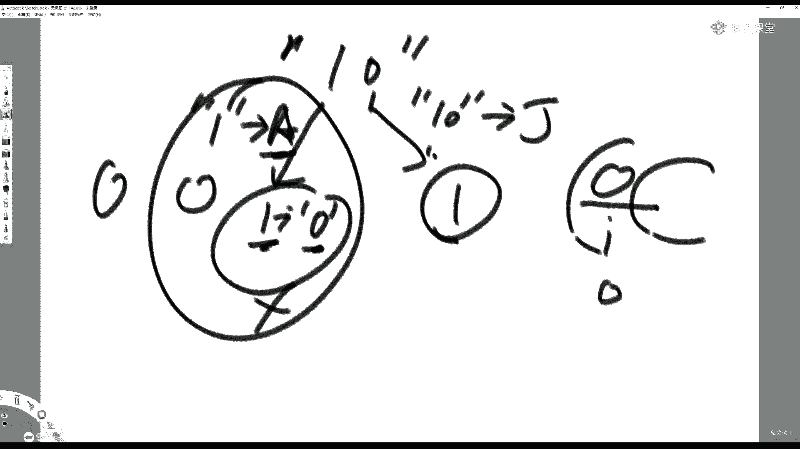

可以解为分支限界嘛对吧，你可以理解为分支线界吗，你之前做的决定居然让我面单独面对一个零字符，那不好意思，你之前错了啊。

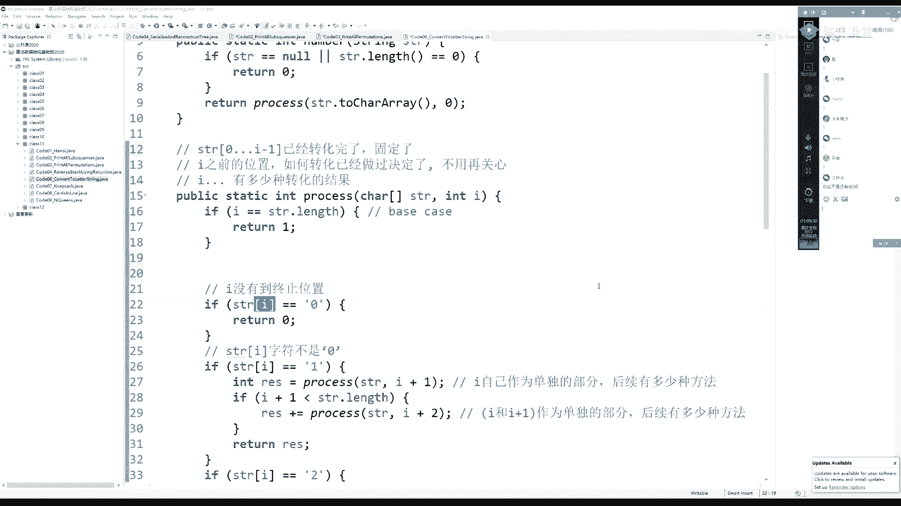

右边还有这样，所以右边g这个位置是有效转化，你会返回一个点啊，左边你左左边这个这样的原始字符十是吧，零位置一位置，位置一位置，那么我就做决策嘛，第一个分支是单独让零位置上的一转化成了a吗。

然后你接下来就要面对什么一位置了，出现了一个零字符，它转化不了，因为我就整个return一个零，但你不要忘了你上游还有一个分支是一零，这个分支可以转化成g那就到哪个位置了，你一零都已经使用过了，对不对。

所以你接下来面对什么位置，一位置，零位置跟一位置你已经使用完了，现在是面对二位置，一个中指位置好，中指位置返回什么，返回一最上以后，他会得到这一个点，没得到左边的点吗，那方法数是不是就一种啊。

是一种转化成这样，刚才问题同学，你现在理解了吗，啊啊啊。

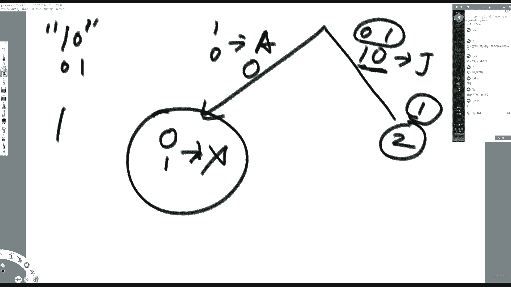

这就是我们，只要你让我单独面对零字符，我就给他两种方法，好的，接下来下面就是我如果我还是没有return，说明什么，i没有终止，而且stri位置不是零字符，对不对，我会我会一直往下继承这个条件对吧。

没到终止，到时候为止，你提前返回了，是零字符，你也提前返回了，所以你接下来的这个就默认是什么呢，没有到终止位置，并且iv是字符，不是零，好，我来想一下了，但你看着代码多，实际上也就那么回事儿。

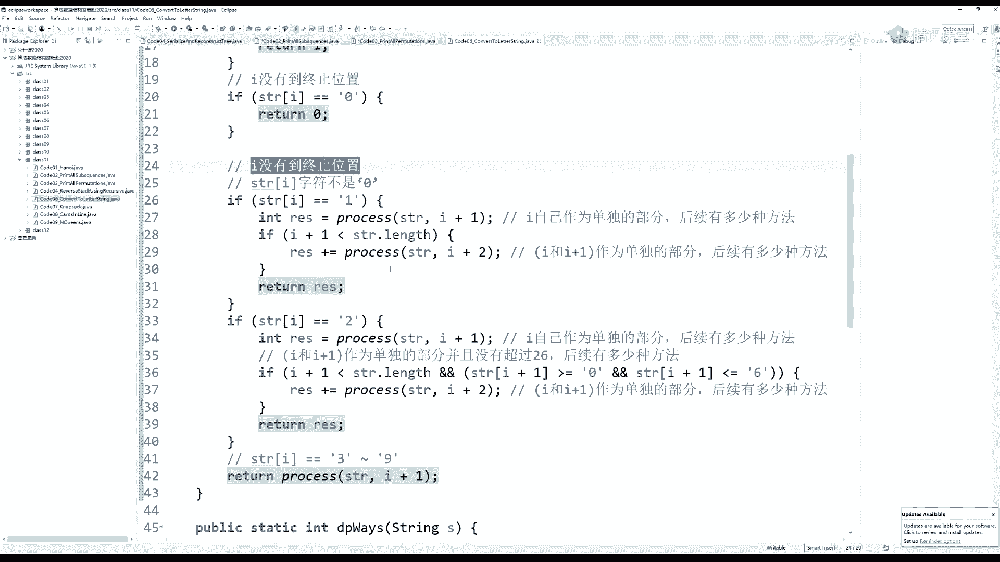

怎么讲来，我来想一下当前i位置啊，你确定不是零字符了，上面会有哪些字符呢，当然可能是1~9，i为什么字符当然可能是1~9，那我问你，如果你安慰着字符是3~9的话，有没有第二种决策，什么叫第二种决策。

第一种决策是单独让i位置的字符去转化，第二这种角色是让i位置跟a加一位着字符共同转化，然后a加二位置去递归，但如果你iv是字符是3~9的话，其实你没有第二种决策。

你根本无法让你根本无法让i位置跟a加一位置出一个数来转化，为啥你第一位都已经是三了，后面这个这是i位置三，比如说3a加一位置，不管是什么数，都会超过26，对不对啊。

这说明我这就是说明我只要iv的字符是3~9范围上，我只有一种选择，就是单独让i位置的这个数去转，画完了之后让a加一位置去递归，听懂同学打一，我iv字符是3~9的话，给大家看啊，我们先看最后一个分支。

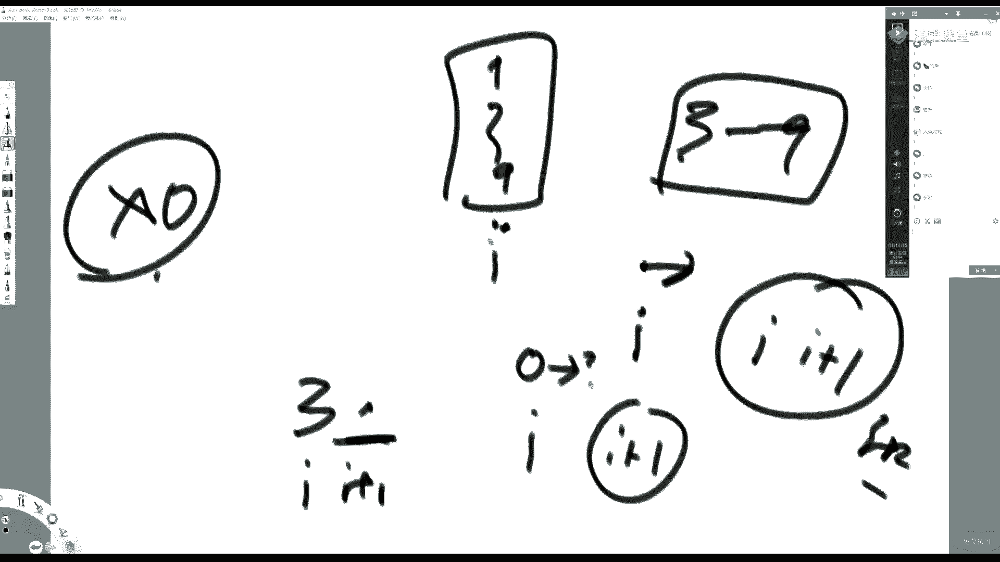

最好理解的，我第一个字符是一，咱们再讨论，如我第一个字，如果i昧着字符是一，那咱们再继续讨论，还没讲，如果iv是字符是二，咱再记，咱再单独讨论，还没讲，但是如如果既不是一，也不是二。

你就直接返回了一个string a加一位置有多少种方法，最后这个return中的是什么，是当前位置，字符是3~9范围上，你根本没有其他选择，你只有加一这一种选择，听懂他在打一这两个衣服，你都不用管管。

最后一句。

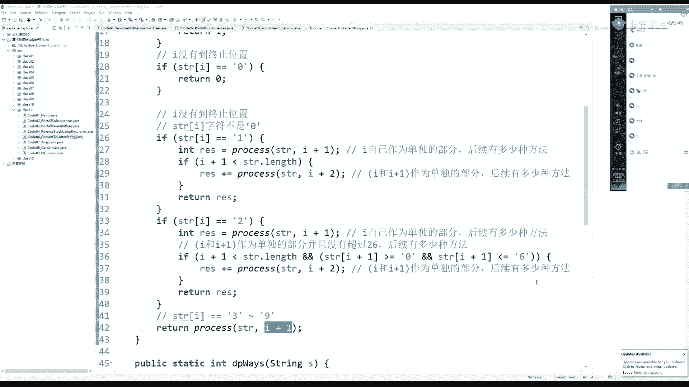

我现在单独讨论一下string当前位置字符是一的时候，当前艾瑞字符是一的时候，是不是我总有两种选择，你安慰的是一，你后面不管是什么数，它都不会超过26啊，对吧啊，你说你11~19。

你你这11~19你都没有抄，你完全可以转，所i位置是一的情况下，总有两个选择，一总有两个选，第一个选择就是让i自己上面这个这个这个一转化成a来，a加一位置去就够递归选。

第二种选择就是让i位置和a加一位置共同同构成一块，接下来让a加二位置，你给我自由去递归去。

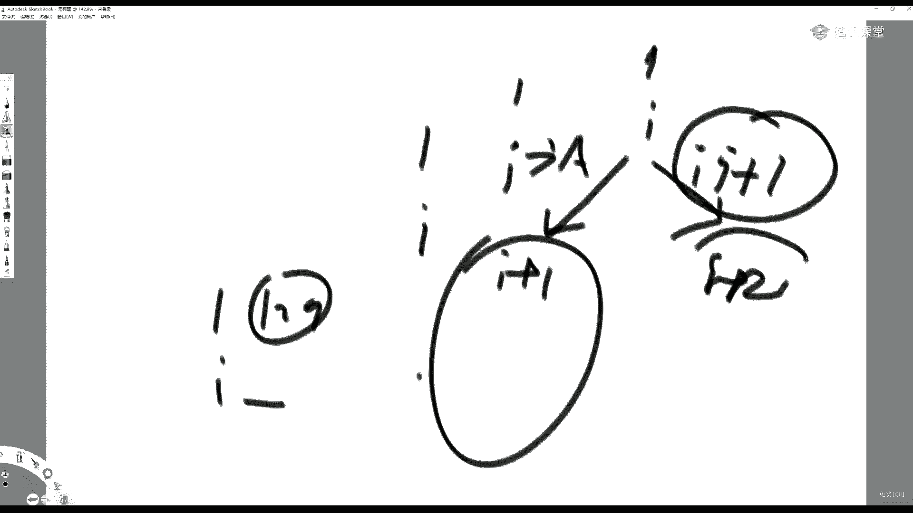

是这意思是吧，总有两种选择好，我就看，第一句，其实就是第一种选择，先让这个最总的方法数或者第一种选择下产生的结果有多少，有有多少种，对吧，你看我接下来让i加一位置自由去选择了。

等同于i自己作为单独的部分，后续有多少种方法数，你先告诉我，如果我a加一位置没有越界，是不是我总可以让a和a加一作为一个部分去，再有多少种转换的方式累加起来啊。

e等于一的时候两个分支看懂同学打一没懂打二，当前字符如果是二的话，他和一一样，总可以做出第一种选择，就是让自己单独这个部分转化完，接下来a加一位置去自由选择对吧，它转成b吗，单独让一个二转成了b吗。

接下来问后续的东西，自由去选择，先获得一个方法书，我接下来就接下来。

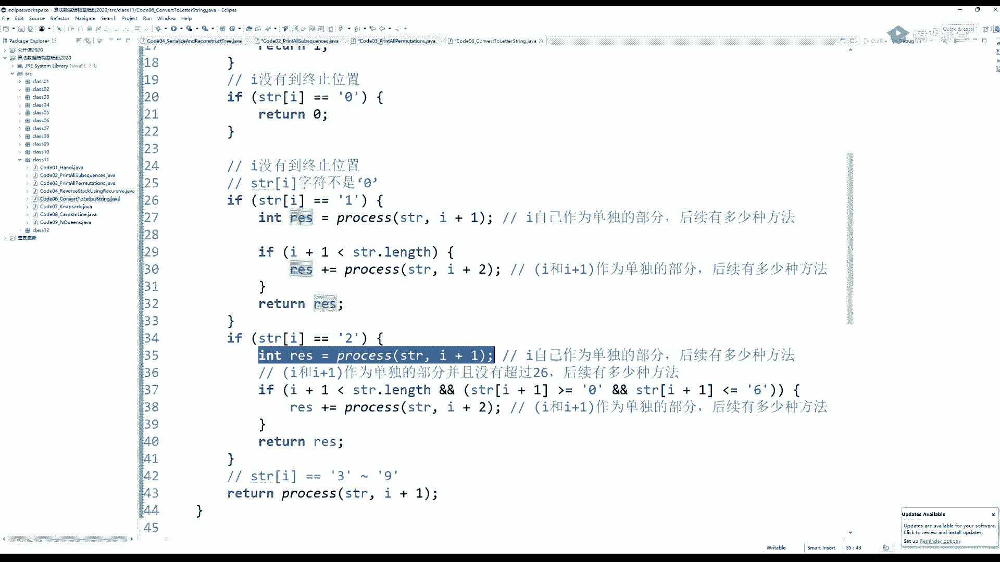

其实看上去很烦，但其实不复杂，你i位置已经是二了，能不能让a加一位置跟你一起做转化，然后让a加二去自由做选择去，那就要看你i位置跟i加一位置一起拼的这个数它有没有超过26，对不对啊。

你说你下面这个数是三，没有问题，23可以转，如果你是26也没有问题，26可以转成z如果你到了27或28或29了，不好意思，你没有第二种选择，你只能老老实实的让二自己作为一个部分，i加一，你去搞吧。

因为你那你一起拼27无法转，28无法转，29无法转，对不对啊，所以看。

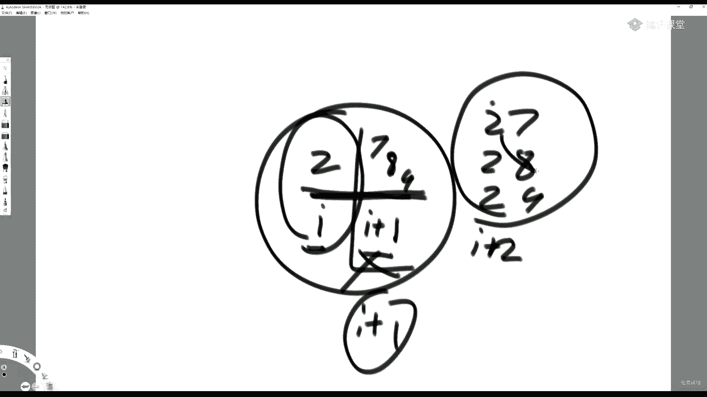

i加一位置没有越界，并且一个a加一位置的字符是0~6之间的，就知道跟我i一起拼，他不会超过26，我就有第二种选择，如我这个if不成立，不好意思，我只有第一种选择，听懂同学打一，就结束了啊。

只和尝试有关对吧，虽然他条件多，但它只和尝试有关，而且是什么模型，从左往右的尝试模型，男性整理好在模型下有利于你的发挥，最大家有没有发现最难的其实是你根本不知道怎么去想，就连你怎么整理可能性都不知道。

完全抹抹一两眼一抹黑的状态啊啊那我现在告诉你，起码现在你具备了一个模型，从左往右的城市模型，对不对，一最后一道题目出现，我就先按从左往的尝试模型，我去套我这个模型下，我就先写一个最简单的样子。

index先写出来缺什么信息，我在补嘛，但它都叫从左往右的尝试模型，对不对，明白我说啥，一个同学打个一没懂打二对吧，这个模型啊它不是死板的东西，它是有利于你发挥的一个东西，就跟我们写唐诗一样。

如果你没有五言，没有七言，没有韵律，你写那玩意儿叫什么呢，什么也不叫对吧，但是有这些韵律了，影响你写诗吗，反而会激发你的创作理解的，我本人是个编剧啊，我只是兼职给你讲课，是不是全职给你讲课。

但是我平时写剧是吧，这个它它这东西都不是死板的东西，它是在这种模型下大量的题目发现啊，都属于这一个模型，那你就从模型出发对吧，你就从模型出发，能够帮助你去想啊对吧，能够帮助你去想。

给你们讲课之余自己写写剧啊，接下来我们要解决一个经典问题了，诶可以改成动态规划，而且它很好改，不要急，放在明天，同样我们今天只讲背包的尝试行为啊，一些尝试行为都可以改，动态规划。

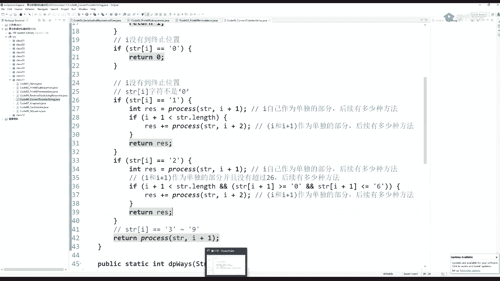

下午啊大家看一下这个，有两个数组，这两个数组是等长的，这两个数组是等长的，这啥意思呢，就是假设长度为n，如果长度都是n的话，它表示有n个货物，为此数组中的i表示i号货物的重量是六四。

i呢表示i号货物的价值，那么一共有n个货物，当然就有你你你这两个数组当然要求等长的对吧，你n个货物，你每个货物都有重量跟价值，那你这两个数组当然是等长的。

所以就这两个数字可以表示所有货物的重量和价值是吧，好，我们把这个题目搞得生活化一点，就说我们认为每个货物都是有重量的，而且都是有价值的，而且都是正数，可以吧啊啊，那我在给你一个袋子，这个袋子呢就是载重。

载重它也是正数，所以这里面就没有负数，没有零，全是正数，你就这么理解你，你装的货物不能超过这个重量的情况下，你装的最大价值是多少啊，可以选挑货物，你可以挑货物对吧，你挑的货物呢最后挑了一个结果。

挑了要冒要某个货物或不要某个货物是吧，最终挑挑了一个结果，挑这个结果中这个袋子里装的这些货物啊，它这个重量没有超过它的载重，而且要在所有的选择中得到的价值量最多同样打一，背包啊，这是最经典的背包啊对吧。

我都已经告诉你怎么做选择了，要某个货物，不要某货物吗，什么模型，从左往右的尝试模型对吧，多往右的尝试模型对吧好，我们来想一下，那你怎么想这个事儿啊，怎么写这个递归都非常随意的，我给你举个例子啊。

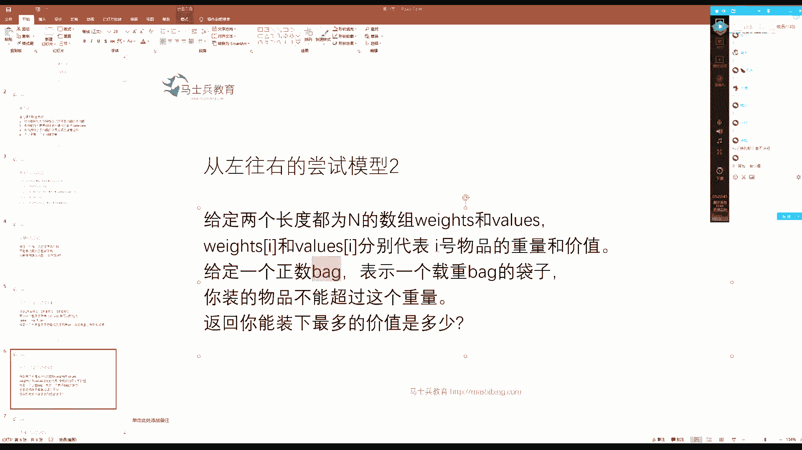

比如说我题目是怎么写的啊，我们这个题是咋写的，你看这是我们的这个递归过程是吧，下面一个尝试过程，实际上两种思路下的递归，我们先看第一种，缺什么就补什么，什么意思呢，来看啊，获得重量在w数组里。

价值在value数组里，这俩东西是不会变的，有任何一个时候需要改动他俩啊，该是啥就是啥，不会我不会去修改这两个数组好，现在轮到index的货要跟不要，那这个是啥，之前做的选择。

得你已经达到的负重是多少啊，那应该做货物的选择，使之使得逆境达到的重量是多少，就是我的already w，bag就是袋子的总在中，它也是不变的，他带字的总载重，它是它是不变的，它是一个条件嘛。

所以什么是不变的呢，这东西w数组，数组以及这个bug值大众永远是不变的好，所以这个递归什么含义，x及其往后的index及其往后的货物自由选择之前。

已经让你形成的载重较already w在不要超过bug的情况下，价值是多少，总价值指的是index往后的货物形成的价值，你之前做的选择的价值管理解这意思吧。

这个总价值指的是index往后的货物产生的最大价值是多少，之前的选了哪些货的价值，你不用管，你不要操心，好那我来看，我的already w超过了总在重返回-1，注意返回值是-1，表示。

这种方案啊就是我单独单独规定考，我单独规定一下，就是如果返回-1，a，没有方案，返回-1认为没有方案，如果返回的不是-1，代表有价值，只是价值是零啊，这有价值就是那个返回的值啊，如果返说的不是-1呢。

就表示它是正常的一个反一个价值的值好吧，如果不返回-1，如果不返回-1，认为返回的东西是一个真实的价值，这是我们这是我们第一种尝试是吧，来我们来看一下之前的货已经形成的载重。

如果是w这个w如果超过了bag，你说你index往后还还不仅没得选，而且直接无效返回复一，看到同学打一，那你如果没有在第一句返回说明什么，说明你你现在重量没超，对不对，唉如果你现在重量没超，你又没货了。

为零的价值，它表示方案有效，但你要的价值是index往后的货会产生多少价值，我不用管之前的价值，那我就是零嘛，因为我现在没货了，我又没没有超过你bag的载重，对不对啊，返回零很好理解，对吧啊。

首先我这我我到了终止位置的时候，我重量没超，说这种方案其实到最后是有戏的，证明了他之前的选择有戏，但是问题是你要的价值就是index往后的货，它产生多少价值，所以返回零好，接下来我看两种选择。

一种选择叫我没有要当前的，没有要当前index货的情况下，后续的最大价值怎么体现，already w是不是没有动，你看你原来l a w，你直接把它传到index加一位上去，那就说明什么。

说明index的重量你没往上加，对不对啊，那第一种可能性，那么第二种可能性呢，第二种可能性就是我要了index位置的货，所以往下index加一位上做决策的时候，我是之前得到的already的重量。

加上了我此时获得重量，这个递归我往下传的，p一就是我没有要当前货，请问接下来的货会产生多少价值最大的，第二就是我要了当前的货，面的货物产生的最大价值是多少，是这意思吧，如果后面的过程，如果后面的过程啊。

后面的过程它不是无效的啊，后面的过程是个有效方案，我总共的可能性二的价值是多少，这个是说我后面的货在我要我当前a max或者情况下，后面的获得最大价值，唉你是不是要了他。

所以当前年货的价值加一个后续的最大价值，它就是可能性二的要打，既可以不要当前的货形成p1 ，我也可以要当前的货形成p2 ，你说我怎么返回可能性，一种可能性二中选对我最好的呀，因为我要的是最大价值。

我要打一，就是我们的这种尝试，看着有点绕对吧，你也能写出来的好，我们再看这种尝试，可能你就更好理解了，这是我们最经典的尝试，啥意思，好简洁，省了个参数啊，好棒，是啥意思呢，过程一样。

index位置开始往后自由做选择，我还剩多少空间，对吧，我max或往后做选择，我还剩多少空间叫rise的，这是我们见到的最经典的表达啊，背包问题最经典的写法就是这么写的，来看啊，剩下这么多空间了。

index及其往后的或自由做做选择，这个后面就删掉了啊，但是剩余空间不要小于零对吧，返回index所有的货物能获得的最大价值，啊来看在某一步我剩余的空间已经小于等于零了，获得零的价值，你也可以返回-1。

如果是返回-1，单独标记-1的含义的话，那你在这得到任何一个返回值的时候，你都要自己再判断一下，当这里没有问题啊，我们想想有没有问题啊，还是给你其实没有问题，但是为了你好理解，我怎么写呢。

我这么给你写吧，没问题啊，但是我会让你好理解，如果小于零一表示无效方案好吧，天数已经小于零了，那当然无效方案嘛，我没有小于零，我是大于等于零的，我是大于等于零的，如果没有小于零，我是大于等于零的。

如果来到终止位置，货物返回多少价值呢，零的价值这里面也没有问题，对吧好，接下来一种可能性，第一种可能性，到当前的货，因为我剩余的空间没有任何变化，对我这个p一也没要index货物的价值，因为没往上加吗。

我只是获得了index加一后面货所产生的价值，因位置的价值是不是完全没有被算进p一里，算进去的话，他就应该在后面再加一个，加一个v index了，对不对，是这意思吧，应该加一个东西，对不对，但我没有加。

我就让你后面货物的价值，我就直接是我的p一了，这说明什么，这就是不要index此位置货的时候所产生的价值，是这意思吧，好我们再看，可以这么写了，如果我小于零，就return-1的话，我就可以这么写。

还是跟刚才一样，p2 先认为它是一个无效方案，那么如果那么我的我的p2 的后续啊，我p2 的后续后续就是后面的货物产生多少价值，我就直接这么写，就这样来把这一放，index位置的货，我要了他了。

我怎么体现的，你看我剩余空间，我掉了一个index位置货的空间，那我剩余空间变小了嘛对吧，我们说的所有东西都是正数嘛对吧，那我生一就变小了，接下来我这么写，如果t2 的后续是有效的。

p2 的后续是有效的，-1就有效嘛，那么p2 我就可以让它等于什么呀，当前index位置的货物加上一个后面的一个后续，如果这个是无效的呢，那p2 依然维持-1，就表示你没有p2 这种可能性，它是-1。

你没有改过他的-1，对不对，最后继续p1 p2 做决策，我们是用的是一旦空间减成零就返回无效方案，如果你这么写的话，你就要你就需要在调用的时候要判断p为什么不用判断，因为p一也是-1，p2 b是-1。

那你返回直接就是-1了对吧，如果是-1的话，你p2 b是-1，为什么呢，你你想你你p一吧，p一不可能是-1，为什么rest一进来的时候，它就是不小于零的，你p一的rest是没有变化的，你说p一能违规吗。

他违规不了对吧，后续可能违规，但单独调p一的话是不会违违规的，那你就调就行了，p一跟p第二种返回最大那个跟刚才写的没有什么区别，无非就是我已经把已经形成的重量变成了剩余空间。

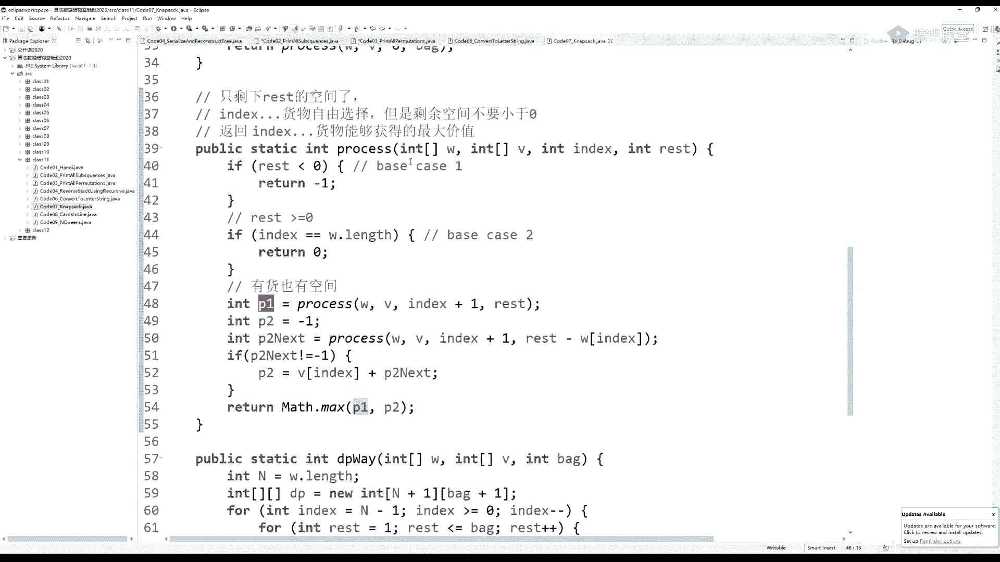

这种表达听懂再打一。

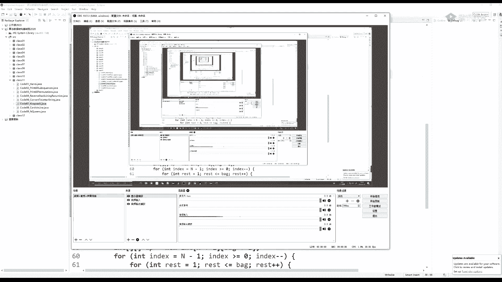

你已经就有同学问有没有重复计算，当然有重复计算，我们没有改动态规划之前肯定都是重复计算，rise的初始值怎么设置，好问题来看主函数怎么调啊，当然从零位置开始要货物，什么是他的剩余空间bug吗，打一。

递归过程重复计算这个问题啊，留在动态规划的时候，你现在就只用去只用去理解它的尝试就够了啊，尝试这件事情，你有感觉就够了，能看懂暴力尝试就够了，理解吧，好姐，我们来出柜另外一个尝试模型，另外一个尝试模型。

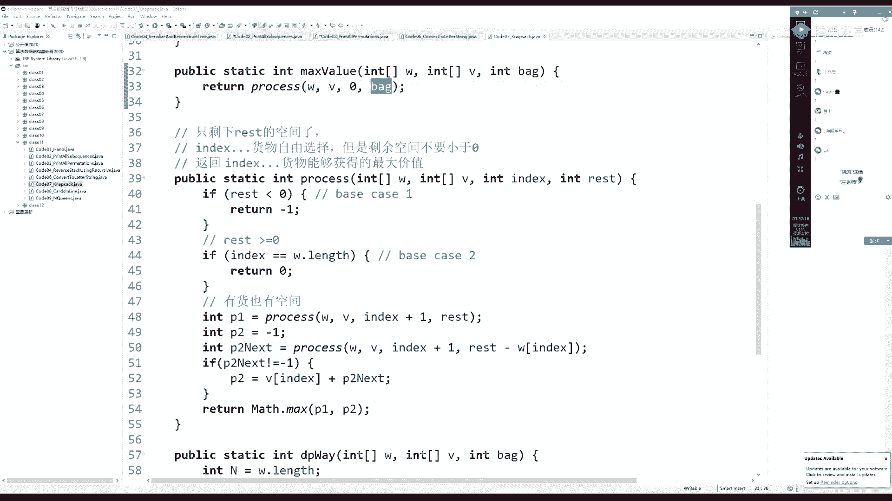

把这道题讲完，我们就该下课了啊，接下来这个n皇后问题，我们下午的课开始，大家看一眼这个题很有意思哟，我已经告诉你它是另外一个尝试模型了，所以他能不能用从左往右的尝试模型搞定呢，不行，它是另一个模型啊。

对模型的总结啊，对于模型的总结，可以说我在国内的算法教学中是第一个人，很多我指的是算法教学中啊，是第一个人，当然之前的sm高手，他们肯定都会这些模型，但他们不叫学，你们老师不会按照模型跟你讲的。

是看一眼这个题有问题，发弹幕，好吧啊，要继续，举个例子啊。

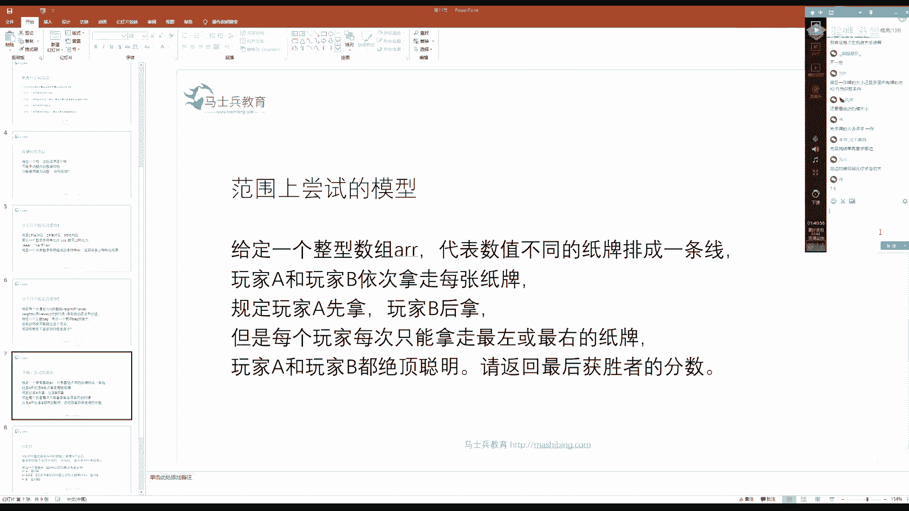

这道题可能我举个例子来啊，给你写个东西。

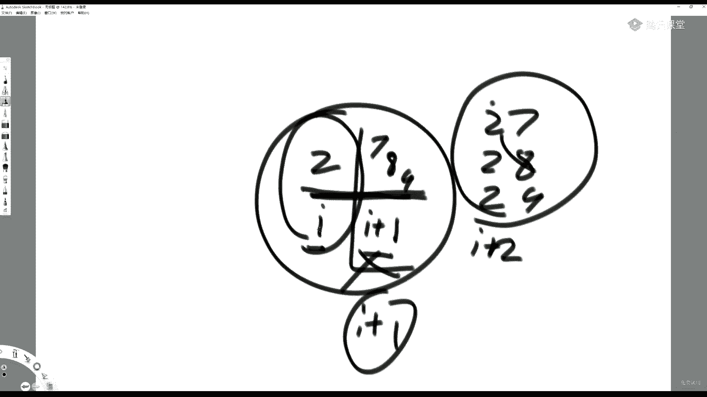

这是这个东西啊，爱跟玩家必绝顶聪明，这件事是博弈论的设定，我在学术上严格的定义，让你不能因为绝顶聪明，这是个相当主观的事情是吧，绝对理性这种东西都是感觉跟公理一样是吧，你最好不要引入公理，那么他怎么说。

在博弈论里面叫当玩家啊，这怎么说的，那句话叫，双方玩家都会使得对方在单独改变策略的情况下不会获得更大收益，这么说的题，这句话是吧，双方玩家都不会在对方单独改变策略的情况下，让对方得到收益。

这博弈论的基础啊，当然你你你作为你作为这个小白是吧，你就可以认为玩家a和玩家b都绝顶聪明就够了。

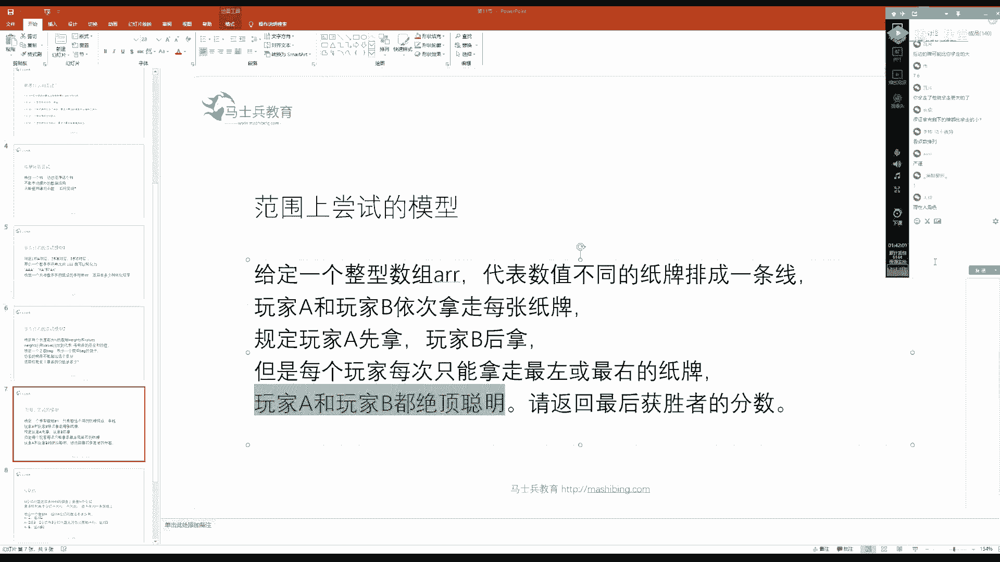

那么怎么说，就这样给你举个例子，你就明白了，这个纸牌是一，第一张是一，这个是100，这个是这个是这个是这个是八七十吧，第一张纸牌70，这个是100，是一这是四，玩家在玩的时候只能拿走两侧的纸牌。

玩家a和玩家b如果绝顶聪明，双方都会去算计，怎么让自己得到最大的值，这里面还是设定它全是正数啊，那么其实你最后你会发现正不正无所谓了，但是我们现在为了好理解，可以认为它都是正数，那你想a会怎么选。

表面看起来我拿走70跟拿走四七十好对吧不行，玩家他是个他是个他是个心机婊是吧，他会想我，我拿走70了的话，我就会把这个100暴露给b，所以我不拿这个70，我就拿这个四，他就拿走了，玩家必想，我靠。

你真心机是吧，那没选了呀，我拿走一也会暴露100，我拿走70也会暴露100，我就对我最好的，我拿走70吧，70之后，a说哈，一步步都在我的算计中，你终于没有碰到这个100万，我拿走了，b只能被迫选择。

只有一个一，那么谁赢了，a赢了104，这张如果是很多很多纸牌，双方都会按照最好的方式来算计，请问返回最后获胜者的分数，听懂他在打一，一开始所有的牌都能够被互相看见，是所有的牌都能够被彼此相互看见。

不是取石子问题，取石子问题，同学你见的够多是吧，取石子问题，或者说合并食子问题，这个东西是这个东西是动态规划里面特别难一类问题叫四边形不等式，有空再讲是吧，但是面试中考的不多。

但是我是打算把我们搞到这个训练营里讲的，那那个话题有点太深了，我们还没到那份儿上啊，然后现在往下写看，首先我问一个问题，是不是a一定会赢呢，当然不是110，a他赢个屁对吧。

都说因为你最看面试的只有两张一，a就只能拿走其中一个一嘛，那b就拿走100了吗，那b就赢了嘛对吧，b的分数是100吗，返回获胜者的分数就是100嘛，是所以a不是b赢的。

他还是要根据数组的状况才能就是a算到极致，他也可能赢不了，要要跟状况有关，是这意思吧，到底怎么做，我们先不想，我们先不搞那些里格楞是吧，当然但像这样，我现在想这样一个问题，第叫做先手过程。

f函数first的意思，到r的范围上，如果我是先手拿的话，请返回最好的分数，递归含义含义很简单，在阿瑞的l到r范围上，我要拿纸牌的话，如果我是先手，最后获得的最大分数，好那我们来想一下这个递归。

我们来想一下base case是什么呢，一张牌的时候嘛对吧，肯定是最后就就你你又是先手，那贝斯case就会只剩怎么表达，只剩一张牌的时候，号等于r的时候，就是只剩一张牌的时候嘛，你这个范围只有一个。

只有一个，只有一个位置了，不就只有一张牌嘛，所以这个f函数怎么写，巨简单，如果l等于r，先手，那你把这张牌拿走不就完了吗，一就是我们的base case，如果你剩的不止一张牌呢，两种选择。

第一种选择把l2 位置的牌拿走了，选择，他走了，l位置的牌，本来是什么过程，既然这个过程是这样的，是我我是不是变成后手了呀对吧，我拿走了l牌之后，我就变成后手了，所以我们如果再有一个后手函数。

这个函数假设叫s的话，这个s second的对吧，后手这个s还是这么不规定，l到r上，我是后手拿，请问获得的最大分数是多少，l到r范围上，我是后手拿，请问能够获得最大分数多少，所以当我拿走l之后。

我接下来其实是阿瑞加一到r这个范围上，后手拿能够获得最大分数，你现在我们会讲这个后手怎么写是吧，我们会讲这个后手怎么写，你先认为他就是个黑盒，可不可以，可以吧，这是我这选择，我拿走了左侧的牌。

接下来就在因为范围是l到r的吗，你拿走了l之后，剩下的范围是不是l加一到r没问题，所以在l加r上，我是后手的姿态，问我最大分数多少，是我的第一种选择，那我的第二种选择是什么呢，我的第二种选择是阿瑞。

我拿右侧的牌，我右侧的牌接下来在哪个范围上，我后手了，还要到，而减一范围上，我后手嘛，所以加上一个后手函数，二位r减一，我就这么两种选择，我选什么，当然对我最好的，听不懂，同学打一，管这个后手函数是啥。

你只要理解它的含义就行了对吧，具体是啥，我们接下来马上讲好，为了这个f函数，我们是不是得去把s函数是什么东西搞清楚好，现在我们开始搞s函数是什么。

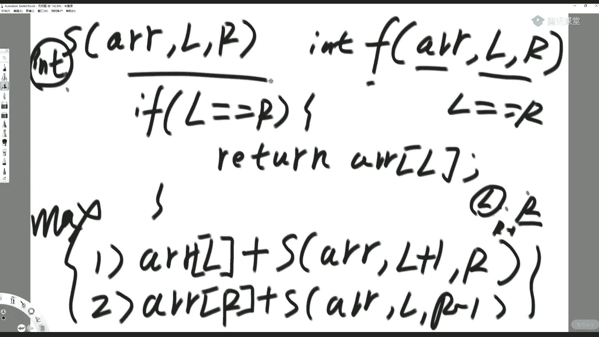

s函数是什么呢，s函数就是在二位上，l到r范围上，如果我后手，请问是什么逻辑，是只剩一张牌的时候，如果l等于r这个范围上是后手，什么意思，就是人家先挑，然后轮到你只剩一一张牌了，人家就挑走了。

你说你获得啥零吗，一张牌你又是后手，那你拿个球啊对吧，拿个球对吧，看球啊哈啊，就是逗一下好，那如果不止一张牌呢，不止一张牌呢好如果你先是后手，对不对，你现在是后手姿态，如我先手，他拿了阿瑞l。

你拿了你的过程其实应该是什么，如果先手挑走了2l之后轮到你了，所以当先手挑完阿瑞l之后，你不就先手，有的在阿瑞l加一到r上轮到你了吗，对不对，那么我先手他拿走的是阿瑞尔，这个是你的对手对吧。

这个现在的先是你的对手，你自己是后手对吧，如果先手拿走了奥瑞尔，接下来就轮到你了，轮到你是什么范围上，你又该你拿吗，l到r减一上，该你拿对吧，那我们来想一下这首会怎么样，会怎么决定。

会按照对你最不好的方式决定，为什么，因为所有的牌都是正数，你拿他的少，他一定拿得多，你们是零和博弈，对不对，先我会把什么过程让你去选择，你自己是无法选择的，为什么当前不轮到你挑，对不对啊。

所以你你这两个过程谁帮你选的，其实是对手帮你选的，对手会怎么帮你选的，一定是最差的嗯。

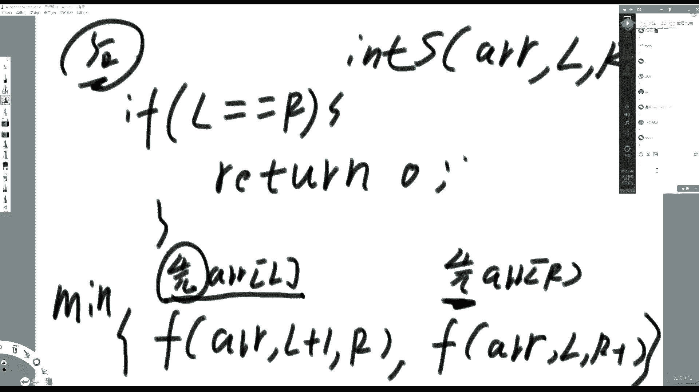

这个反函数啊巨简单无疑是吧，来看先手函数就这么短。

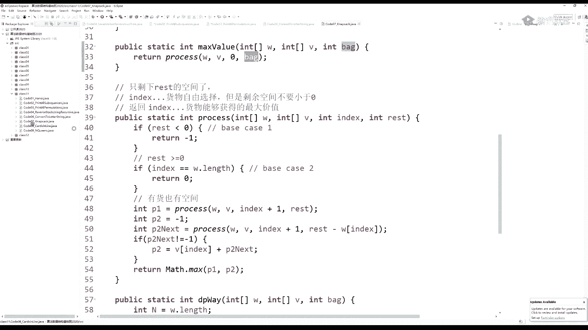

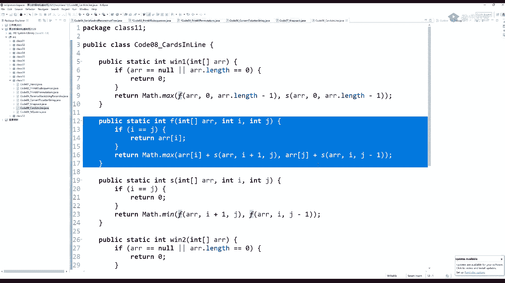

如果这里面把i改成l好吧，在二位上l等于r那就是只剩一张牌的时候，l等于r只剩一张牌的时候，只剩一张牌的时候，你就拿走这张牌就完事儿了，跟我们刚才说的一样对吧，否则你就能选，能选你有哪两种方案呢。

第一种方案从左侧的牌以后就轮到我l加一啊啊啊啊，l加一到r上后手了，这是第一种方案，第二种方案，那就当我拿走了右侧的牌，当我拿走右侧的牌，就轮到我l到r减一上后手了，那我会怎么选择对我最好的。

为什么我可以选择对我最好的，因为现在轮到我拿我来决定，对不对，s函数，那么s函数怎么说的呢，s函数还是这样，不改了，你知道i跟g就是一个范围就行了，a到g好吧，a到g如果这是外面没有。

如果上面只有一张牌了，你是后手，轮不轮到你拿呀，不轮到你拿，所以你拿到拿到零对吧，接下来有两种方案，某种方案，第一种方案是你在i加一到g上先手，这就相当于对手，对手其实是把在在挑了阿瑞i的情况下。

它扔给你的，后续叫它，但阿瑞还是不应该算作你的分数的，因为他是对手挑的对不对，所以你能获得什么分呢，i加一到g上先手的情况下，你获得的分数，对手不拿阿瑞i，他就只能拿2g了，因为你只能拿两头的牌嘛。

如果对手挑了rg，就轮到你fa到g减一上，你先手了，对手一定会扔给你最差的，因为里面都是正数，你们俩是零和博弈，怎么掉在这儿呢，在零到n减一上获得的分数和后手在0~1n减一上获得的分数。

谁赢了就是获胜者的分数，谁大谁就获胜，就是获胜者的分数，所有代码就这么短，看到他要打一，我觉得大家可能是欠缺例子，那我们就来搞一个例子啊，啊我们来搞一个例子行不行啊，说一下主要说这个啊。

你说这个是啥意思啊，在array 0到n减一上先手，a能够获得最大分数对吧，是不是a面对领导减一自己先手啊，是的，所以这就是a获得的分数，蓝色的，那底下是啥呢，零到n减一上后手，这是不是b获得最大分数。

一开始面对领导人减一就是后手啊，没问题吧，所你说最后谁获胜了，两个值谁大，谁获胜了，我最终要返回获胜者的分数，可不就返回他俩最大值吗，这不懂这不懂是吧，我给你举个例子。

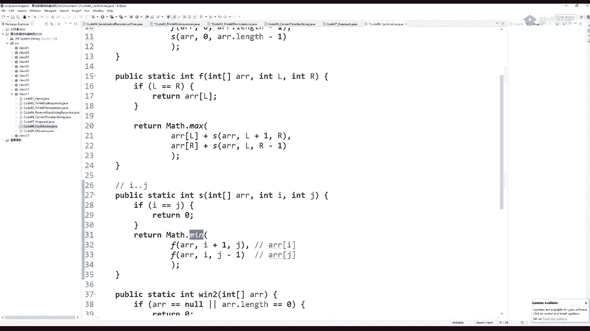

你就懂了，比如说，就110 七这个范围，啵啵啵，你你是后手的话，会有哪两个选择给我挑走，100在1~71，你就在你你你就在这个l加一到r上先手了，就等同于你去先手挑一七，挑走了七。

那你就在l到r减一上先手了，那就100，你可一你去挑这个这样一个分数吧，这是你后手的时候，你说你说你的对手会扔给你什么过程，当然是这个人家会把100挑走，换的话，他他他可能不求当前的最大。

但他一定会扔给你，后续的最小，选择对你最不好的方式让你挑，他一定会让你面对一七去挑，不会让你面对110去挑，因为110挑就把100挑走了。

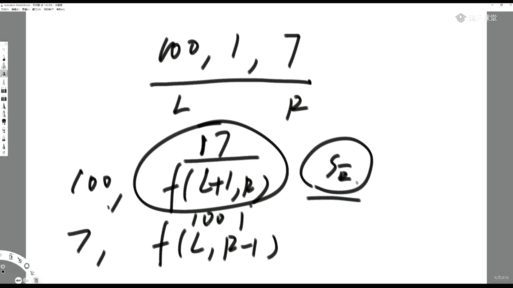

对嘛对吧，对手一定会要么拿ri，要么拿rg，这个都不是你的分数，你你你只能被迫接受两个状态，a加一到g或者a到g减一，而且是对手决定对手一定会选择对你最不好的，这不你不是说你想选，你非得搞mean。

不是是你没得选对手扔给你这两个中的最小听懂他打一，你你都已经是后手了，你你在当前不，你有什么选择的，你你有什么选择权呢，没有不对啊，这个范围上你目前是后手。

你忍着你忍着别人挑完你剩下剩下的你挑对手会怎么给你最小嘛对吧，你拿的小是不是他一定拿得多，求和怎么没求和啊，这不是求和吗，分手的时候，你挑了一个分数累加上那个什么后续过程。

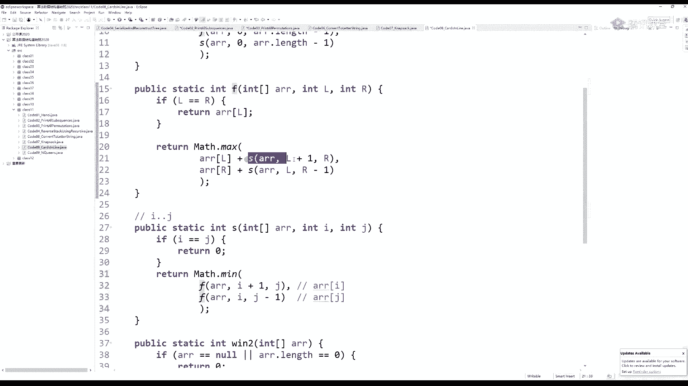

这不是求和吗，举个例子吧好吧，看了很多，很多人不懂是吧，那就啥例子啊，这个，嗯，七我们看先手过程是啥，你说他会这个这个这个线的过程是啥啊，就是012，没错吧，我们分别展开一下主函数，这么吊的主函数需要。

f函数0~2范围上获得的分，一对吧，函数也需要知道0~2范围上，后手的时候获得的分是b然后a a和b中要选一个最大值作为获胜的，是这意思吧，好我们分别展开f021 在什么，零二它依赖的是这样的。

我第一种选择我拿零位置的排这样一个后续，第二种选择呢是我拿二位置的牌，七甲一个，后续是这意思吧，好如果你是选择了3号，就是零零位置的这个零位置的牌呢，它后面变成了自己在一二范围上给我后手去拿吧。

如果你选择了二位置的七呢，接下来就变成你在0~2范围上后手啊啊，0~1范围上后手就拿了对吧，我们二被你挑走了吗，这个三是零位置，所以你身上的范围是1~2上后，你后手这个二位置，所以剩下的是0~1范围。

让你后手好，我们再看s12 跟s01 都是啥，一二是什么过程，他需要他需要知道，如果如果对手拿走了一位置的牌，拿走的对手拿走了一辈子的牌呢，你就会剩下在二二上，只剩一张，在二二这个范围上先手。

你去拿了对吧，如果对手拿用了二倍的牌，你就会在f11 这个一一范围上先手去拿了，这不是这不是a，如果这是a的过程，这是a的过理解吧，a开始在0~2范围上先手，他要么挑走这个分支，要么走这个分支。

但是接下来这个过程呢是他后手在1~2上又轮到a后手了，这是b在挑，看这个也是b在挑这个分支，那b会挑哪一个是什么，f2 是只剩一张牌了，f22 是不是只剩一张牌了，会往上返回七，一也剩一张牌了。

所以它会往上返回100，挑b舍得把后续100给你吗，绝对不会，b会把后续的七给你行了，所以a这个人这条分支得到的总分，他就是十分，啊我们再看这个分支，那这个分这是底下s01 ，如果b把零挑走了。

就剩f11 ，如果b把一挑走了，就剩f00 ，f，是谁是1~1范围只剩一张牌返回个100f00 是谁呃，只剩一张牌返回三，那么b他面对后续100跟后续三的过程，他舍得把100给你吗。

他舍不得他会给你三所，你最后获得不管左分支跟右分支，你的最好分数都是十分，有没有毛病啊，打一，同样的你在展开s02 嘛对吧，因为你既需要f02 ，你也需要s02 ，这不是你选择的哦，你选你没得选。

是先首先手决定你接下来在1~2范围上先挑，还是在零到，b这是b这是b在选择对吧，b在对后，或者是b在选择b开始是一个彻底懵逼的状态是吧，b在零二范围上是a帮他选完之后，扔给他两个过程。

要么你走f12 的分支，要么你走f01 分支，是这意思吧，是选的a帮的a跳了零，你就去一二上，你发挥去吧，如果一跳了二，你就在101上发挥去吧，好但是自己是b下一轮这这个这个画方块的。

这是a来帮他做的选择，这个画方块就是他自己选择了，因为他是后手嘛，就该轮到他了对吧，第一种选择是我挑了一位置的数，就是100加上某个东西，100某个东西，那就把一位数跳走，接下来轮到s2 到二范围上。

我继续后手，这只剩一张牌了，所以我是我获得个p对吧，我获得个球，我选择了二位置的数呢，我就是七加一个，后续七加个后续，这是我可以自己挑的，接下来就轮到s11 上，我后手了只剩一张牌了，所以我也获得个球。

但我会怎么选呢，我当然选择对我最好的，因为我能选吗，我当时选这个100，这个分支好，往上返回这个100，再看这边这边也一样，我b是可以再拿走零位置的牌的，零位置排是什么，零位置排是三，所以是三加一个。

后续后续是什么呢，又轮到s11 上，我后手了，这个是返回个零的，或者另外一个分支，我拿走一位置的牌，一位置排是100，100加一个，后续后续什么呢，s00 让我后手，我也获得个球。

我还是会选择对我最好的100，b不管怎么选，洪福齐天对吧，他会选择对自己最好的返回102的过程嘛，你把所有东西都摊开看有什么问题啊，最后分数你最多获得十分，你最多获得100，谁获胜，100会获胜。

返回获胜的分数吗，听懂同学打一，成都可以改成动态规划，这种就是范围上的尝试模型，它不是从左往右的尝试模型。

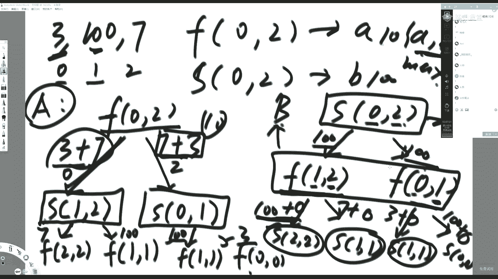

它直接就在这个函数在上l到r范围上，你给我求个最多的分数对吧，范围要尝试模型，我们这道题为什么可以想到是范围上尝试模型，废话提议就告诉你，你可以拿走左侧的牌或者右侧的牌。

他恨不得逼着你的脑袋往从左往范围上尝试的模型，在提醒你听懂的同学打一，啊这个这个4795，怎么样的，四个数步骤可能会比较多啊，但是算这个你自己去调一下函数吧。

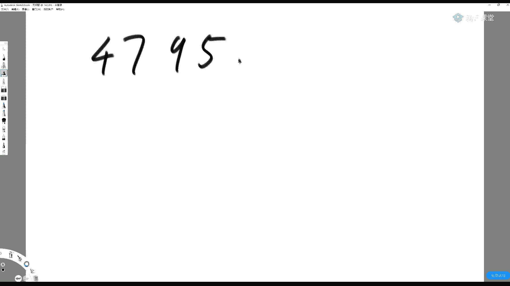

好吧，我们把4795调一下，f函数，你在4795是，123是吧，0~3范围上先爽，这个是三三分钟后手，没保存吧嗯，获得13分后手获得12分，他怎么获得的，稍等，之后蓝色给它去掉，如果看795的话。

得到他的七五会落带对吧，对于b来说，七五都会落带，所以b先挑这个七吧，九五的话a肯定会挑九就赢了，b挑五最后获得13分，b获得12分，毛病吗对吧，只是利用自然之会干预一下。

实际上它底层递归它该怎么调就怎么调对吧，只是我用自然之会告诉你，直接跟我们直接看过这个小样本去分析了，实际上你理解这两，那么递归它会自己去试的，它会把所有情况都裂开，特别好，老师你每一步不就是俩分支嘛。

拿左拿右就这么难吗是吧，可以了，然后这个我们怎么样怎么样去选择这些模型，别急是吧，就给你大量的题给你练，让你去选啊，怎么选择这件事情啊，不是很容啊，因为一道题目是有可能用多个模型解的。

1111道题目是可以用多个模型解的，模型是很强的，刚强的，他们就代表着一种尝试的组织，大家理不理解啊，就是我我我想把大问题按照什么组织拆成小问题，它是一个基本根本的组织问题，它不是可可能性，怎么去罗列。

它是一根本的一个玩意儿，就是你这个你这个你这个往下拆子问题的组织是什么样的，就是其实就是代表它的模型是什么样，大家听懂这个这次同学打个一，这就是为什么一个模型呢解决的问题很多，因为在同样的组织结构下。

有可能有非常多的可能性，对不对，每道题目都属于这种组织下，看你能不能不能列出可能性来，如果能练，那就是那个模型就可以把这个题解掉嘛，就是模型是非常强的一件事情啊，也最难是吧，因为它太太过好用。

而且太过于灵活了是吧，那我给你清楚了好下午呢会把n皇后讲了，然后动态规划我们可以开始了是吧，我们会拿，因为这有些题目真的非常难，我可能想到还会给你加题，所以我们会把啊下午晚安皇后问题讲了之后。

今下午剩下时间和明天两天就四个小时，一共是五，应该是五个小时吧，给你单独讲改暴力递归的过程，可以吧好啊，打个满分十分，群里面大家都帮一下，我就是有的同学说说这个怎么怎么样，就劝他去看视频对吧。

讲得太细细致了，真的我自己都觉得讲得很细致，不会的，真的看完过期过往视频，你怎么说句，你只要高中毕业你就能听懂，是这意思吧，啊我已经是最通俗的表达了是吧。

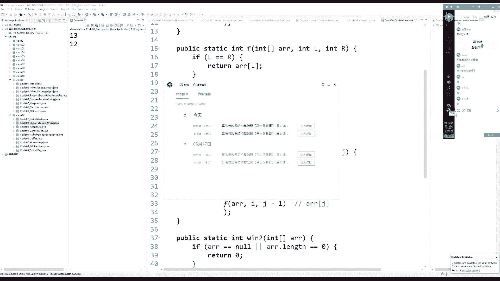