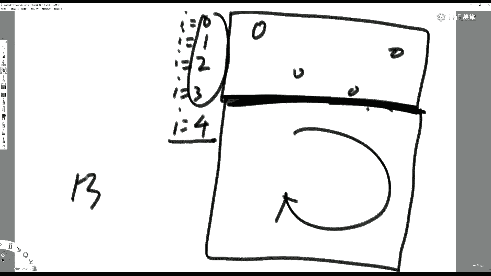
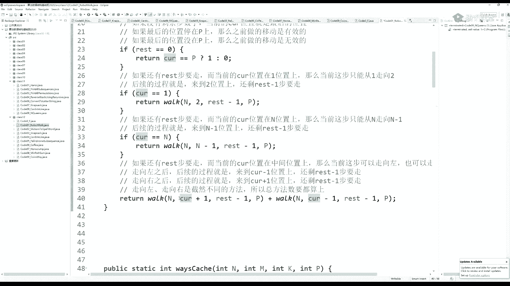

# 系列 2：P71：左神算法-暴力递归到动态规划2 - Java视频学堂 - BV1Hy4y1t7Bo

大家好啊，就中午休息了一下，下午我们继续啊，在讲尝试之前啊，大家扯两道题吧。

早来的同学有福了是吧，嗯哼，出两道题吧，就是讲一些比较简单的是吧，那个比如说这样一道题是吧，好像最近还考了，就是是哪个公司忘了找面筋，你能找到这个，假设有一个人，这是一条河是吧啊这河里面有鳄鱼是吧。

嗯嗯嘿嘿鳄鱼是吧，那有个小人呢，他要过河啊，他过河，但是他是这样的一个设定啊，就是这个鳄鱼它会一一下把人吞掉啊，就是这个鱼啊，他会一下子把人给吃了是吧，要吃人呢，但是这个鱼吃了人之后会变得非常的虚弱。

是吃完之后会非常的会非常的弱是吧，然后他吃了人之后没有任何反抗能力了，因为他很很撑是吧，他难受是吧，那么他吃了人之后就等同于他变得成了食物，其他的鱼呢就能吃它对吧，其他的鱼就能吃它啊。

就是一旦一个鱼它吃了人之后啊，它就变得虚弱了，就是感觉就是大的一坨食物一样，其他的饿的鱼呢就会把它给吞掉，然后呃，也是一口吞掉，那么如果一个一个鱼吞了一个另外一个鱼吞了这个吃了人的鱼。

它也变得会非常的虚弱，那其他的鱼呢就那就用来吞它，对吧哈哈禁止套娃是吧对就是套娃，一旦一个什么东西吞了东西啊，一个一旦不管是什么鱼吞了一个东西，它就变得很弱，别人就能来吞它。

然后假设鳄鱼呢都是绝顶聪明的，假设鱼是绝顶聪明的人未必是吧，这个鱼是绝顶聪明的，非常的是吧，赛高是吧，那么问你这个人，他什么时候该过河，什么时候不该过河，听懂提议同学打个一，听懂题，同学打个一啊。

就是他他要他趟过这个河水之后，鱼就吃不着它了啊，但他汤喝的时候很危险，这个结论是这个盒里面是这河里面是奇数之鳄鱼的时候，它不该过河，是偶数之鳄鱼的时候，它能过河，很匪夷所思，是不是这个为什么呢。

我们来想啊，假设盒里面只有一只鳄鱼，他能过河吗，他他不行是吧，为什么呢，他过河的时候，这个鳄鱼把它吞了，毫无风险，对不对，因为这个鱼把它吞了之后，即便这个鱼会变虚弱，但是也没有其他的鱼了呀。

所以一只111只鱼的时候，它过河死定了对吧，但你想想如果是两只鳄鱼，过两只鳄鱼在河里呢，这个人其实过河的时候，那买哪个鳄鱼也不敢吃，因为这个鳄鱼一旦吃了这个人，他就变成了当时过河的那个人了嘛对吧。

那就会被另外一只鳄鱼不虚弱的鳄鱼给吞掉，所以两只的时候呢它非常的安全，这个人就可以过河去，同样道理，你这三只鳄鱼是啥情况呀，如果你是三只鳄鱼的话，这个人过河他死定了，第一只鳄吞了他的鳄鱼。

非常的安全了是吧，你想想这个人在过河的时候，如果一个鳄鱼把它给吞掉了，这个人在鳄鱼肚子里是吧，那么这三只鳄鱼这个鼎立的局面，剩下这两只鳄鱼敢吃它吗，不敢吃，就等同于当时一个人过河的时候。

就有两只鳄鱼在那盯着嘛，现在我就变成了人，这两个鳄鱼就等同于刚才那个两只鳄鱼的时候，人过河那种状况，往下推，你就会发现奇数的时候不要过河是吧，先吃到的鳄鱼吃完了之后，别的鳄鱼都不敢动。

但是偶数的时候你可以放心过河，因为没有人敢吃，你没有鳄鱼敢吃，你听到他在打一啊，啊哈哈是吧，这是一些简单的博弈论对吧，还有就是这个海盗海盗分硬币问题也是这么个事儿是吧，海盗分硬币是咋回事啊。

这种尝试都是从小地方你你在那个面试场合，你发现这样一个问题啊，你有的时候怎么分析，有的时候它是别的算法，有的时候它是尝试的算法，那你都想一想是吧，比如说你你你你你就从小的样本量开始想嘛对吧。

没有鳄鱼的时候啥样有一只鳄鱼的时候啥样，两只鳄鱼的时候啥样往上推，那你就找到思路了，对不对啊，就找到思路了，对不对，还有就是我们那个著名的那个海盗问题啊，海盗问题是啥呢，这种东西都是小品是吧。

感觉都是提的小品，我们课上都不会大量的讲，为啥，因为没什么意思是吧，嗯就是就聊呗是吧，就聊聊好了不就完了嘛，但是你聊的过程中，他是日有他其实是有讲究的对吧，它是有它是有讲究的，什么讲究呢。

就是你从小的样本量开始，往大的样本量推，那海盗分硬币问题啥意思，就是假设有五个海盗a b c d e是吧，这个年头有点久了，不确定自己还记不记得，今天大家提到了，我就讲一讲，我感觉还记得啊。

这五个海盗呢有100个金币，他们抢100个金币，然后那么这100个金币啊，他们就想这五个海盗就想要提出一种分配方案啊，这个a呢是大哥是吧，b是二哥三，c是三哥，d是四哥，e是小d是吧，就是从a开始。

每个人提出分配方案，从a开始，每个人提出分配方案，如果大家同意这个人啊，就就就然后就对于这个方案呢，大家会投赞成还是反对啊，每个人投赞成还是反对，你的票数才通过，是超过一半，至于如果要是大于等于一半。

那是另外一个题，我们说必须超过一半才能，你这个你这个当前方案才被采纳是吧，你这当前方案才被采纳，那我们来讲就是如果你的方案被采纳了，那我们就按这种方式来分硬币了是吧，如果你的方案没被采纳。

那提出方案的人会被杀死对吧，后果是非常严重的，会被杀死啊，提提出分配方案的人会被打死是吧，那么就行，那我就最后要问大家，就是每每如果所有的海盗都绝顶的聪明。

巨巨巨聪明是吧啊当然这个他们就只是分这一次硬币啊，这个也是这个也是博弈论的一个基础，就是博弈论里面有一个只只是一次就决定的事情，还是说我以后长期合作要形成共谋，这个在博弈论里面他就是另外一个问题了啊。

我们就说这个我们只分这一次，然后就各各回各家，各找各妈，以后再也不见面了，可以吧啊啊，那么我问你这个这个a作为第一个分，第一个提出方案的人，就就想了我怎么样提出一种方案，首先我自己不会死。

在我自己不会死的情况下，还能够获得金币数量最多应该是怎么提出方案，听起来脑袋挺绕的是吧，我靠那你的方案数超过一半才才才你才能活下来是吧，而且并且分硬币，感觉这个a好难啊是吧啊，这个听懂题的同学打个一。

这个，那题也没懂吗，嗯我们来想一下啊，就是说a提完了之后，如果没同意a杀死他，也以后也不用再参与分金币了，但如果同意了呢，那大家必须投票数超过1万是吧，那怎么样a提出一个什么方案，能够保证自己活。

还能够让金币数量获得最多，必须认为海盗绝顶聪明是吧，我们来想一下，如果你是两个人的时候，比如说我们就剩一个人了，假设就剩一个人e了，不知道是怎么样剩了这一个亿的是吧，之前那人到底提出什么样惨绝的方案。

被人这么这么痛殴是吧，就反正你现在就认为只剩一个亿了，那么剩100个硬币一投什么方案是不是都通过呀，他总不能投自己反对吧，除非他想自杀是吧，而且他又是绝对聪明的人。

恐怕自裁这件事情不会发生是所以如果只有一个亿的话，他肯定会给方案说我我我我我就100个硬币全给我自己，所以你想这个如果升b一的时候，之前的人不知道怎么投的，反正就只剩第一了。

那你说这个这个d会怎么提方案呢，d死定了对吧，d不管提什么方案，一都反对，然后你的方案数就超过不了一半，然后d就被杀死，一独得100个硬币，现在这样听明白，同学打个一两个人的时候，对吧，是这意思吧。

我我我生两个人的时候地死定了，是这意思吧，那我现在想假如剩三个人的时候，剩三个的时候，d d现在肯定怕死了是吧，我抖的跟个筛子一样是吧，我靠千万你你大哥你别死啊是吧，你一旦死了，我死定了。

那e那个小子没憋好屁是吧，所以c会怎么算计c自己拿100个，d也会同意的，为什么d只要自己别死就行，你提什么方案，d都同意，然后c自己投自己，呃甚至可以这么理解吗，还有的人说法是c自己99的给d一个。

d原来是得零个，而且还会死，现在我给他一个，他就感激涕零了对吧，但你如果把这个这个模型中所有人都想尽量杀死更多的人呢，这样就是人性本恶来考虑的话，其实d知道自己如果c被干掉了。

自己面对第一只剩第一这种状态，d死定了，所以dc提什么方案，d都会同意对吧，是这意思吧，听懂三打一啊，好我在想，那么c分配下，他就是他投的方案肯定是c自己得100个，d得零个，e也得零个。

你一反对没用地址是不想死而已，他什么方案都会通过的，所以我就给自己100个好，我们现在假设有b了，这个b进来之后，他会想了，如果轮到c去分配方案的话，这哥俩只能得到零个，而且都不会死，是这意思吧。

如果我如果我的方案，如果我死了，只剩c d e的话，那么d e这哥俩呢他们肯定会得零个，因为跟跟我们刚才说的一样，c d e这三个人去分的话，c100 个，剩下人d肯定会同意的，e肯定反对也没用对吧。

所以b会怎么想，我活着提出的方案，如果我死了，d跟e只会得零个，所以我活着的时候，我只要给第一个，给e一个都不会死，且得的数量比c分配的时候多，我一定能活下来。

所以自己独得98个给d给e分别一个听懂他在打一，对吧，那么d为什么要给d一个呢，给d一个的原因是因为反正c来分我也不会死，对于d来讲，他说c来分我也不会死，我得零个对吧，那我就想把你弄死。

反正我都得零个嘛对吧，有总比没有强对，所以d得一个感激涕零了，而e呢e想哎呀，反正轮到c分，我也得零个，那你现在给我一个，我就同意你吧，是这意思吧对吧，那我们现在想啊，那轮到a分了，在b分配的时候。

它一定是98 011，那a会怎么去拉拢呢，a肯定不会是拉拢b的啊对吧，a肯定不会是拉拢b的，他最好拉拢的人是c对吧，因为我我我b活着的时候，c只能得零个嘛，他是最好拉拢的，所以我给c一个。

b在当时分的时候，给第一个给义一个，我自己投，我自己赞成c我给他一个，他也会赞成，我只要再拉拢一个，是不是就够了对吧，我要给第一个，那跟b的时候一样嗯，所有人性本恶的话，d想反正我都得一个，我就让你死。

因为我很饿对吧，所以我给d两个或者给一两个，是不是都能拉拢成功了，所以a自己读得97个没毛病吧，听说同学打一，是吧嗯，是这意思吧，嗯，这就是从从小地方往外想是吧。

嗯还有一种设定叫投票数量刚到达一半的时候，就算通过，还有一种设定叫人性都是善的，除非我的利益真的受了损，我才投死你，否则的话我就让你活在这样一些模型下，它的它这个它的设定下，他的答案是不一样的。

所以你看到不一样的答案很正常，你看一眼它的设定，理解这意思吧，啊这里面有两个因素决定，第一是你到底什么叫投票通过是吧，第一个设定啊，到底什么叫投票通过，也是超过一半，还是刚到一半。

就算还有就是每一个人在得到硬币一样多的时候，到底选择杀人还是不杀人是吧，所以这个题可能会有很多变形，但基本上分析都是一样的，从小地方开始往外分析，听懂啥意思吧，嗯好啊，想讲今天开始开始新的同学打个一。

想让我再加一道题，同学打个二是吧，我可以再给你举个例子啊，还想听是吧好，那我们来啊，哈哈哈哈哈啊，行啊行啊，再给你来一个啊，就我们非常著名的欧拉信封问题，这个也是从小到大往外推的啊。

从小往外推的是这样的，就是一个村里啊，我规定啊一个村里，这个村里呢这都是很多年前的压箱底儿的题啊，当时分析明白之后就不管了是吧，他也不能够作为算法的讲述，因为它不成体系，它完全就是一种思路。

就是从小往大往外分析，看你自己能把这个条件拆分的多多细致啊，所以他严格来讲没什么技巧的，就靠脑子，但是靠脑子呢有一个重要提醒，就提醒你，从小样本到大样本，村里面呢有一些人，我规定好。

每一个人都必须往外寄出一封信，不能寄给自己，每一个人能往外寄出一封信，不能寄给自己，每个人只能收到一封信，每一个人只能收到一封信，只出一信，只收一信，如果你收了别人的信，那个那其他人就不能给你寄信了。

理解吧，只收一信好，那么在这样一种情况下，我问你这个村里面人有多少种寄信的方式，听懂同学打一，好我们想这个这个如果这个村里面只有一个人是吧，他也够牛逼的是吧，根据我们的设定，有几种寄信方式呢。

零种没有办法是吧，他肯定是零种记忆方式，我已经说了，我寄出的信不能寄给自己，那你就记不了吗，所以一个在一个人的情况下，那就是零种方法对吧，一个枪就是零种方法，如果两个人毫无疑问只有一种方法。

为什么一个a一个b只有一种方案，a寄给bb，寄给a吗，还能有啥是吧，并不会存在别的方法了，所以是两呃，两个人的情况下只有一种方法，三个人的时候呢，那就给他分个类是吧，如果a把自己的信寄给了b。

和如果a把自己的信寄给了c是不是两种大情况啊，我们看看还能不能拆分了，如果a把信寄给了b，b能寄回a吗，不行，因为如果bg回a的话，c难道自己寄给自己吗，对吧，你看如果bg给了ac就没有办法寄了。

所以b必然是不能寄给a的，所以b只能寄给c，那c自然就寄回给a了，这是一种方法，所以在在ag给b的大前提下，并没有其他可能性了对吧，在a g给b的大前提下，没有其他可能性了，它就只能是b g给c。

c g回a这一种可能性，所以是一种吧，那如果a这封信寄给了c呢，在这种可能性下，依然没有其他可能性，c不能寄回给a，因为b会没法记，所以c只能寄给bb寄回a，所以在三个人的情况下只有两种。

这是我们前几个样本都听明白，同学打个一，啊你说第一种情况，a寄给b c为什么不能寄给b，我已经说了，每个人只能收一封信对吧，a寄给b c不能寄给b了，因为每个人只能收一封，每个人必须寄出一封。

收一封就是限定嘛，好那接下来怎么分析，我们假设五个人的时候，也当然你也可以假设四个人无所谓好，如果我们定义一个函数叫fi，它表示挨个人的情况下寄信的方式数，请你返回，可以吧，这个函数可以理解吧。

这个i就表示如果村里面有挨个人挨个人，你给我返回有多少种寄信的方式，那么f一我们知道了它等于零，f2 我们知道了它等于一种f3 我们知道了它等于两种好，接下来只要掌握一个递推就行了嘛。

所以我们现在假设有五个人，有五个人，你拿谁来分类都可以好，我们现在假设啊，就要把自己的信寄给易，先假设先假设一个假设，b就要把自己的信寄给e，这是一个这是一个确定的条件，这是一个确定的条件。

那么下面我们来分析了，如果那就接下来就就就就哪些情况呢，一把自己的信到底是寄回给b还是不寄回给b是这意思吧，在这样一种假设条件下的第一个小情况，就是e也决定把自己的信寄给逼，那你看一下。

如果e把自己的信寄给b的话，其实你就是一个三个人的欧拉信封问题，听着同学打一，因为你你你必寄给e e又寄回给b，整个系统跟他俩还有关系吗，是不是没有了呀，所以实际上就剩下a c d在玩了，对不对。

是这意思好，那我假设第二种情况，第二种情况就是e啊，他没有把信寄给b，他把信寄给了一个不是b的人，我们假设一下啊，这个e假设把自己的信寄给他，寄个c，这个时候应该怎么分析啊，很有意思啊。

这个东西确实很有意思，怎么分析呢，你想一下啊，这样来啊，呃e决定不把信寄给b，e决定不把信寄给b，我们并不假设这个e要寄给谁，并不再继续假设e要把信寄给谁了，反正他不寄给b，那我们来想一下。

你这个你我们可不可以现在就把b看成一个人了，是可以的，为什么呢，还等着寄出呢，寄出给谁，他不知道是不是有一个初步，而b呢还等着一个人，还等着收信呢，它有一个入度，所以你就可以把b看成一个人。

a c d3 个人在跟b e这一个人在玩欧拉信封问题，所以是四个人的欧拉信封问题，听懂同学打一，对吧我我这个币啊，我还等着收信呢，我这个e呢，我等着寄信呢，他俩就认为是还没有玩的那个欧拉信封的人。

对不对对吧，所以在第二种情况下，你并不用假继续假设一把信寄给谁了，他直接就是欧拉信封私人问题，懂啥意思吧，好那么这样一来，我们就想你假设的是必把信寄给了一，你能哎你假设的是必把信寄给了一。

所以我们现在求的是五个人的欧拉信封问题，或者擦一下是吧，我们现在是f5 ，求f5 呢，那五个人的拉细胞，我们知道在我这样一种假设下，是f3 加上f4 ，在这样一种假设下，f5 等于f3 加f4 。

你也可以假设必把信寄给了c，也可以假设b把信寄给了d，也可以假设b把信寄给了a一种假设是必把新机给了e，一共几种，假设四种，假设整个可能性就是根据b把信寄给谁来划分可能性，所以前面乘个四。

b把e的情况这么多，b把信寄给a是不是也是这么多，b把信寄给c是不是也这么多，b把信寄给d是不是也是这么多，所以f5 等于四倍的f3 加f4 ，听我同学打一可能性的分类是必把信寄给谁这件事情。

当然你也可以假设a把信寄给谁也一样的对吧，听风打一，没能打二，没懂啊没懂没懂，我说一下是吧，就是，首先，我我我这么来问这个问题吧，就是我们在看谁寄信，谁收信的过程中，如果我们就是先关注a把信寄给了谁。

然后看所有不同的方法数，他等不等同于我们就先关注b把信寄给谁，看有多少的方法数，它等不等同于我们先关注c把信寄给谁，方法数它等不等同于我们先看d出发，把信寄给谁的方法数，就这个可能性的划分其实非常的多。

哪种划分下得到答案都是一样的，你可以先关注a把信寄给了谁，也可以先关注b把信寄给谁，你先关注的顺序并不会影响方法数的总和，听明白同学打一，因为因为一个有效的方法，一个有效的方法总有先有后。

而这个方法本身是整体的，至于你你看的顺序是先后顺序，这有什么关系，对不对，那你既然承认说我先关注a先关注b，先关注c，先关注d还是先关注e是等同的。

你现在的情况是不是就可以变成我b我就如果b把信寄给a的情况下，后面有多少方法数，如果b把信寄给c的情况下，后面有多少方法数，同样道理，b把自己的信给d b把自己的信给e有多少方法数。

你只用列出这些可能性就行了，他和你先关注a还是先关注c还是先关注d还是e毫无区别，那既然如此，我们之前假设的是一种情况是这么多，那一共有几种情况呢，答案是四种啊，我d我就关注b。

他只可能把信寄给a或者寄给c或者寄给d或者寄给e吗，一定是不同的方法，所以是四倍的这么多，听懂了懂同学打一，还没懂，我来打个二是吧，我不知道你卡在哪了，或者你发弹幕哦啊，所以我们来写个同样公式嘛。

前三项是这个，剩下所有的fi，拿个公式去玩去吧，听了三打一，讲到你觉得爽是吧，这个好再统计一下，还希望我在加题的同学打个一，不希望看想想听下面内容打个二，还希望我加类似，替同学打个一。

希望继续往下拼个打个二了啊，这已经一半一半了是吧好，那我们以后再讲了是吧，打二同学已经相当多了是吧，那我们就来开始今天的内容啊，把这个给收了，这很多啊，随便讲，这根本就不能单独占用时间来讲了是吧。

好n皇后问题，他讲的是在n乘n的棋盘上要摆n个皇后，n乘n的棋盘上，棋盘上要摆n个皇后，然后要求任何两个皇后不同行不同列，也不能同斜线，请你返回输入一个n返回n皇后的白法有多少种，举个例子。

如果是1x1的格子，就是一个格，能摆下一个皇后吗，可以或者说你也可以认为能摆，你也可以认为不能摆，你为什么可以认为能摆呢，因为这个皇后就摆在这没有毛病啊，他跟谁也不冲突对吧。

但是我们讨论的是任何两个皇后之间的事情，只有一个皇后就显得蛮怪的是吧，你也可以认为有一种方法，你也可以认为有两种方法随你的便吧，反正一皇后问题他也不是应该来说它不称之为一个问题，对吧好吧。

那如果是二皇后问题呢，二皇后就是2x2的格子了，那就四格啊，我有办法摆吗，没有没有办法摆的，你比如说我这个皇后摆着这个皇后摆，这不行，虽然任何两个皇后不同行不同列，但是同对角线啊。

我如果把这个皇后不摆阵摆阵，那更不行，同同列啊对吧，所以二皇后问题是没有答案的，是零种方法，我们在看三皇后问题能改吗，如果真好好改正，哦这是有点过去，我先调一下，看看能不能摆啊，没有方法。

三皇问题也是没有方法的，就你怎么摆都不行，比如说就是没有是吧，就是没有啊，就是你怎么摆都冲突都打架是吧，然后四皇后问题好像就开始有解了，有两个减四黄号问题，就是4x4的，那怎么摆呢，我们先假设一下。

假如这个第一行的皇后摆正这一行就摆不了了是吧，下面这个皇后呢不能摆正，因为这会共列，不能摆正，因为这会供斜线是斜线，是两个方向的，这也叫一条斜线是吧，这也掉一条斜线，所以是两个方向的，斜线是两个方向的。

所以所以这个你要注意这个供斜线这件事情啊，所以这个四皇后问题怎么是一种有效的，我想一下啊，就是我第二行的皇后就不能摆，这也不能摆这了，那我试一下这能不能行是吧，如果摆这呢，那么第三行不能摆这儿。

不能摆这儿不能摆这儿也不能摆这儿对吧，摆这跟第一个重，摆这儿跟这个共斜线，摆这呢跟这个共列，摆这呢跟这共斜线，所以就说明我上一行的皇后摆错了，上下行后我怎么摆的，假如上方摆在这儿，我看我能不能摆。

第三皇后不能摆，这哎好像能摆这儿，因为摆在这儿的话，他不跟第一个打架，也不跟第二个打架，没有共行，没有供电，也没有共斜线是吧，那看第四个换号，第四个皇后不能摆，这儿不能摆，这也不能摆，这更不能摆正。

哈哈啊，因为不能摆，这是共列，不能买，这也是共列，不能买，这是供斜线，不能摆这供列是吧，所以第四个皇后没没活路了，这说明上一部的皇后虽然当前位置不违规，但后面没有没有减，所以这个皇后我再抢一下调哪。

我先给大家展示的其实就是我们n皇后问题的谥法啊，那我看过这个皇后，我能摆正吗，不行，供斜线这个皇后能摆正吗，不行，巩俐，这说明我上面这个皇后也摆错了，那么这个上面这个皇后来到最后一个位置。

已经是最后一种可能性了，这说明什么呢，这说明我第一个皇后摆错了，我第一个皇后不应该摆在第一个位置，我要试一下，第二个位置，我看这样能不能试出来是吧，那么第二个，那么下一行的皇后不能摆这儿不能摆。

这也不能摆，这只能摆这好，那在这种情况下，我看这个皇后能摆正吗，可以他没有跟这个打架，也没有跟这个打架，所以能摆这对吧，所以能摆这第四个皇后不能摆这儿不能摆，这好像能摆这啊，能摆这好。

你看这就是四皇后问题的其中一种解，每个皇后都没有共行，没有供电，也没有共斜线啊，听懂同学打个一，除此之外还有一种，还有一种是啥呢，你把棋盘翻转一下吗，你把这个，棋盘，给他翻过来就行了。

就是现在大家面对的是正面，你从下往上翻过来，翻转过来，从下往上翻转过来，就是形成了第二种解，这个值翻转上去之后的，在这，这个值翻转位置就来个这这个值呢翻完了之后看到这个位置。

这个呃这个点翻就是从下往上翻过去之后来到这儿，这个值翻完之后来到这个位置是我格子画好啊，这个只是翻完之后它会往上来来到这，这个是翻完之后它往下来到这儿，其实这个也是一个解是吧，就这个棋盘。

这个棋盘从下方跟上方，你假设上方固定住，别动，它是一个轴，你把下方的这个棋盘从下往上翻上去，就是这个这个东西是吧，这是第二种解，当然你不用得到翻转啊，我们这个我们在试的过程中没有翻转操作啊。

好我们想一下这个n皇后问题应该怎么试，其实我已经告诉你了，我在试的过程中，我一行一行的是啥意思，假设我是一个九皇后问题，我第零行，第一行，第二行，第三行，一直到第九行，我就每一行在摆皇后。

我每一行首先我每一行摆的皇后，我每行只摆一个，我规定好我在试的时候，我每一行只放了一个皇后，这样一来的话，我的尝试本身就可以规避皇后在行上打架的问题，因为我限制好，我每行只放一个。

所以我就不牵扯皇后在行这个维度上打架的问题，听我同学打一，就我硬性规定他每一行放一个的话，它不会存在皇后在行上打架的问题是吧，好，那么我就那么假设我我我在第零行上摆的皇后，我记在一个结构里。

第零行的皇后，他是什么样的x0 它是什么样的y0 ，我记好，第一行的皇后在摆的时候，我只要防备临行的皇后，不要共列，不要供斜线就行了，听懂同学打一，好这样一来我就有很多选择，对不对。

那我假设我有了一个选择，我选择在这儿了哦，我第一个皇后放在这儿，我会有他这个这个皇后的x0 和y0 记下来，第二行我放这儿会有他的x一跟y一记下来对吧，那我看我第二行的皇后怎么摆呢。

第二皇的皇后就是你要保证他不会和银行的皇后共列或共斜线，也不会和一行的皇后共列和共斜线，我就能知道二列的皇后摆哪了，二列皇后摆好之后，我再记录一个x2 和y2 ，轮到三行的皇后去选择的时候。

我要保证跟之前所有的皇后都不共行，也不供列，我就这么试，如果我发现我在某一行的时候不能摆下任何一个皇后好，我退回到上层去，你的皇后摆的位置不对，举个例子，比如说比如说我们我们现在来到了第五行。

第第五行我们做的第一个选择是把皇后，把把皇后放在某个位置啊，这个是第一个合法的对吧，这是第一个合法的，但是如果我们发现往下摆的过程中，比如说第六行，它皇后已经没已经没有办法让他在所有行上做选择了。

你怎么办呢，你退回到第五行，让这个皇后的位置往右挪一个，然后再看看这个分支下六往下能不能继续摆，所以就是到每一行的时候，我就是到这个位置的时候，下路走一个递归，走完了之后，我在在这个位置的时候。

下路再走一个递归，走完之后在这个位置的时候，下路再走一个递归，周而复始，听不懂同学打一，没等到，好你不懂不要紧啊，我们来看一下这个扣的，你就能具具体就理解了啊，看一下看一下扣的结构概念就有了，空讲的话。

这个结构概念很难讲出来，没事似懂非懂不要紧，看完code你准懂。

比如说这个家不要想不要想下面这种写法，下面这种写法我一会给你讲啊，巨他妈是吧，这个我们看这个啊，这个啥说的啥意思，process一就是我们的尝试过程，说的是啥呢，说的是你现在来到i位置。

他指的是我现在在i行上，我要放皇后，我现在在i行上，我要放放皇后，所以目前来到了第i行，但是零行和n减一行的皇后都存在这个record里看了吗，潜台词是零行到n减一行就上面行的皇后啊，我都存在了。

record里，你你你会想，这个为什么只用一个数组就足以表达上面皇后所有的位置呢，这个是很显而易见的，什么意思，你说你零行的皇后，他是不是一定在临行啊，所以你就record 0位置如果等于七代表啥意思。

零行的皇后放在了七列就够了对吧，因为零行行数皇后每一个皇后，你说他在第几行，零行皇后一定在临行，一行行后一定在一行，所以我只用一个record的整形数组就足以描述上面皇后所有的位置了，你说你说我啊。

我我第七行的皇后摆在了七第一行13列的位置，假设对于我这个数组来说，它就是record，他就是record的七位置，七行的皇后在13列，我用下标来表示皇后的行数。

用这个具体的值来表示皇后的列数就足以做到这一点了，就是为什么我不把皇后的x y下标一起封装，只用一个数组形式就可以表达，这一点，听不懂同学打一，好啊，那么我们就看，所以呢这个这个就是说我当前来到第i行。

record 0到i这些位置的值才有意义，i往下包括i自己在record里面你都认为是无效的，那值还没用到，只我只需要使用零到a减一的皇后的列数，那么一共假设有n层，一共有你n皇后问题当然有n行吗。

当然这个n是个越界的位置，是中指行，所以其实你的有效行数是零到n减一，是不是n代表整体一共有多少行，但是其实有效的行数你下标如果是从零开始的话，它有效的行就该是零到n减一行，零到n减一行是你有效的。

如果你已经到了n，它表示其实已经越界了啊，零到n减一行其实是有效的，如果你已经到了n，那就说明他这个已经越界了啊，你要停，那我就问你，上面的皇后已经固定了的情况下。

哀往后还能有多少种不同的摆法保证它有效，这是啥意思啊，举个例子就这个意思啊，假设我现在i来到四行，这是一个非常大的n皇后问题，假设是13皇后问题，假设我现在来到了第四行。

那你i等于三的时候已经做过决定了，a等于二的时候也做过决定了，等于一的时候也做过决定了，i等于零的时候也做过决定了，好假设上面一种摆法是一个有效的，这儿这儿这儿这儿有效，好，轮到你i等于四的时候。

你去摆它返回什么，它返回的是在我前0~3行必须为这种样子的状况下，后面还能搞出多少种可能性，让它整体都有效，就是上面的问题，你不用操心，上面的只是描述了一种限制。

你最终返回值就是你你要把整个13x13的表填满，但是零行一行二行三行必须是这个样子的情况下。

你有多少种有效的懂我们这个地步返回值含义的同学，打个一，好那么我们主函数怎么调啊，record要准备一个n的大小，这是肯定的，因为一共有n n n行的皇后需要摆对吧。

那我一开始是不是从零行开始做的决定了，那你从零开始做的决定，你整体都统计完，这不就是我们要的n皇后问题的答案吗，现在还没有讲递归，看懂递归函以及以及主函数为什么这么调的同学打个一，没毛病吧。

刚才不懂的同学现在是不是清晰一点了是吧，还一知半解吗，刚才打扰同学，刚才说懵懵懂懂，那个同学现在你感觉如何，好啊，那我们就来看一下这个递归函数该怎么做，i等于n的时候，中指行，你i已经来到中指行了。

就是没有皇后要摆了，你说有多少种合理的办法，一种哪一种上面的状况，这一种听懂同学打一，对吧，是不是有一种忘了中指行的时候，就找到了一种上面的，这叫上面的状况好，那底下的潜台词是什么呢。

就是你没有到最后一行，没有或者说没有到终止位置，还有皇后要摆，来我们来看你怎么试呢，是法是当前行在i行尝试i行所有的列，尝试我当前第i行的皇后摆在i行所有列上，就是这个g那这个g怎么取值，从零列开始。

在i行零列，i行一列，i行二列，一直到i行n减一列，每一次g加加，具体尝试的时候来看这个是啥，大家现在把它理解为一个黑盒，什么什么意思，这record里面是不是放着上面的所有的皇后，是的。

你当前的皇后是不是在i行j列，是的好，我去这个函数里，我找过所有的皇后，看跟你冲不冲突，如果不冲突就叫有效，如果冲突，你赶紧试下一列，你现在把它理解为一个黑盒，之前的皇后全在这个record里面。

我当前的皇后就摆在了i行j列，如果它是有效的，就是他可以摆的话，好哀皇把i行的皇后在哪儿记下来，你给我去统计a加一行后续的所有可能性累加起来，也就是说gg摆到一个位置都算后续的可能性。

再把下一个位置都算后续的可能性，这再把下个位置都算后续的可能性，所有都加起来返回答案，但是我必须保证ig位置是能摆的情况下才加，如果他压根跟之前的皇后就冲突，你直接这跳下一个听懂同学打一。

啊对这里面你会看到说哎你这个record g了g你为什么不还原回去呢，为什么不还原回去，我第一回做到零的决定，record让它等于零了的ip，让它等于零了。

我下面的决定直接就改record的iv值等于一，下面在下面决定直接就改i record的i等于二，是直接改的，你有什么必要把record的i先还原回原来的值再改呢，你直接改不好吗，不是说不需要还原现场。

而是我们还原之后也要重新设置值的，这就是为什么我这个record的i直接等于g就行了，并不需要在跑完之后再再再再在这儿再加一个什么还原，因为我一旦进来，我就是改值，所以我没有桃园现场。

但实际上你也可以加听不懂他在打一，那么就只剩一个问题了，怎么验证他不打架，只要把这个怎么验证他不打架这件事就搞搞搞清楚，那么整个代码它就是非常顺利的代码了，怎么验证他不打架呢，这个方法比较秀啊。

好我现在问大家一个问题啊，假设一个下标叫a和b，另外一个这个皇后在a行b列，另外一个皇后呢在c行d列，如果两个皇后冲突，a b c d的值会有什么关系，如果共列，那b等于d，这是肯定的对吧。

首先我们不用验证它是否共行一，因为每一个皇后他必然不共行，所以我们在验证方法里面，我们没有必要加上行的判断，你一行皇后一行的就只会放一个皇后的，你肯定不会在行上打架，这就是列打架的逻辑。

好用斜线怎么什么样的形式比较简单，这样的啊，举个例子，假设我在七行十列放了一个皇后，他这条共斜线是啥啊，九列对吧，他这好呃，八行九列对吧，就是它斜线位置，它下行包是啥，七行七列对吧，它在皇后是啥。

八行六列对吧，如果是这条斜线，你看满不满足这个，a减c的绝对值等于b减b的绝对值等于吗，我这个位置是八行九列，所以a减c就是7~8，绝对值是一。

b减d我这个b在10d在90 10-9也是1a绝对值关系满足对吧，所以这条这个这样一个方向的斜线满足这个关系，这这样一个方向的斜线也是这个关系，比如这个斜线这个皇后在哪，八行11列，八行11列满足吗。

我的我的a是七，我的c是八，所以a减c还是-1，绝对值是一，我是我，我我这个d等于11，那个b等于十，d减b 11减十是一，不管是这样一条斜线还是这样一条斜线。

都可以用a减c的绝对值是否等于b减b的绝对值来表达。

才打一，当然你也可以分开写啊，当然你也可以分开写好，既然有了这样一种简洁的表达。

检查任何两个皇后的关系，他就是，过，只要这个条件满足，那就是不达标是吧，是这意思吧，只要这个条件满足，那就是不达标，这只是这两个皇后之间怎么验，那我怎么验。

你看啊，这是我当前皇后在i行j列，我遍历所有的皇后，我从零一直变异到i减一，因为我自己皇后在i行，我只能看上面的皇后跟我的关系，所以我便利到i减一好任何一个皇后是什么，中间任何皇后在k行bo k列吗。

是这意思吧，你你你k等于零的时候，第零行的皇后在零行record 0列位置，皇后在k1 record的一一列位置，所以任何皇后都是k行record的k现在的皇后是什么，i行。

于是你看如果g等于record的k那就是共列或者o的k减g的绝对值，如果等于a减k的绝对值，那就是这个，只要有这么一个违规，甭管是哪个皇后跟你打架，都叫你无效，如果你验完了之后都没有返回false。

那就说明你跟哪个皇后都不打架，返回tru，至此，所有的尝试我们讲完了，听懂快打一，接下来，早点开动态规划的课，但是还是我们我们这个算了，给你讲吧，因为我觉得还蛮有意思的是吧，这个我告诉大家啊。

目前想得到n皇后问题唯一的解，现在目前为止最好的施法没有更好的了，就业内研究这么多年，这就是最好的施法，施法上没有突破了，所以n皇后问题又被测试，现在就是他首先可以并行啊，他他怎么去拆他的并行尝试。

这个它是各个国家大型的巨型机计算能力的一道题，就是n皇后问题，他非常的著名，在业内非常著名，尝试方法就是你在刷题阶段，或者说你不是接下来继续深造的话，那你了解这个n皇后问题的视法，这已经是极限了。

并不存在更好的优化了，从事法上是法上没有优化了，但是我们可以把它常数项方面加速，把它常数项方面加速，我先给大家展示一下啊，比如说这是我们，13皇后问题，用加速的方法40ms。

因为我们刚才的方法就毫秒告诉大家，复杂度是一样的，就是因为优化后的方法常数好，你再看一下14号的问题，我们优化后的方法是228ms，刚才讲的那个方法，五秒只是常数项，有优化时间，复杂度完全是一样的。

因为是法上没有更好的了，所以呢我还是给大家讲一下这个优化后的方法啊，这个怎么做的，那15皇后问题那就更更加的复杂了是吧，可能两个都不是可能算得完了啊，这个优化后的方法是一秒多，我没记错的话。

我们不优化的方法要跑一分多钟啊，所以我们就停了，给大家讲一下，这个蛮有意思的，就只优化了常数项，你说用什么优化回答，我听过我课的同学，你觉得用什么用，你觉得用什么优化是吧，对运算是吧，好啊。

还是发个运算的，你将来必得offer是吧，而且是大公司，你心仪的offer是吧，没有发的同学，你将来一定也能得offer，但是没有那么强的祝福啊啊啊，这个，哈哈哈，那我们来看一下，这就是我们的方法二。

他在用微运算来做啊，看不懂了是吧，看不懂了不行了是吧，说什么鬼是吧，我们来慢慢讲，我们慢慢讲，我们怎么讲呢，我们这么来讲这件事是不是，比如说我是一个八皇后问题，比如说我是个八皇后问题啊。

我先申请一个状态，用一个整数表，用用整数的二进制的状态来表示具体的状态啊，就是比如说我是一个八皇后问题，我就准备一个状态，是这样的，后面是八个一，剩下的东西都是零，这是哪个整数，不要紧啊，我们不求。

我们根本就不用这个整数的值，我们只用这个整数的状态问题，你就先准备这么一个数，后面是八个一九符号问题呢你就准备一个数，后面是九个18号问题呢你就准备一个数，后面是十个一，这意思吧。

嗯好就准备这么一个数好，那么我们想了，你会发现你每一行点皇后的时候啊，比如说你想在i行零列上放皇后，其实这件事吧就等同于你他把这个把这所有的列想象为一些二进制位，说我们说八皇后问题三，45678号问题。

如果我在i行上把零列位置放了个皇后，就等同于呢我放完之后他状态是啥呀，就等同于1000万，前面位置都是零嘛，和我在一列上放过皇后呢，相当于是这个位置上是一的状态，剩下位置都是零吗，同学打一。

关于放皇后这件事情，其实我们可以用位运算的一个1v一来代替对吧，这意思吧，理解吧，嗯好，那么你当前放皇后的时候，你跟什么东西有关呢，i位置想放皇后的时候，他可能在某一行i行的时候想放皇后。

他跟什么东西有关，那只其实只和三个位置有关，第一其实只只只和两个因素有关，就是我之前的皇后占据了哪些列，这个位置我就不能放对吧，还有一个因素就是我之前的皇后的左对角线贯穿到了什么地方，我也不能放。

还有一个就是我我之前的皇后的右斜线贯穿到什么地方，我也不能放好，我们现在干嘛，我我现在准备三个值，第一个值叫，防线值这个值啊，我们先把这个数先放在这儿，这个数干啥用呢，一会给你说再准备一个值。

这个值这个值叫列限制，这个值叫列列限制，limit，我一开始在零行放皇后的时候，列上是不是没限制好，所以都是零的状态，全是020，这都是两，啊这个我们区分一下这个划分点在这儿，这就是八个零是吧。

我在0号放缓后的时候，肯定在列上是没有限制的，所以这个分割线左边分割线的右边是八个零，上面一个限制也没有对吧好，那再准备一个变量叫左斜线限制，一开始在临行的时候，上面没有皇后，所以左斜线限制也都是零。

那么再准备个变量叫右斜线限制，那优先限制零行皇后的时候也没有限制，所以也都是零，对齐一下，大接下来这个零行，他很爽是吧，他发现自己列上也没限制，左上也没限制，右上也没限制，所以他就开始尝试了，是什么呢。

我就想在这个位置上我放一个皇后，事实上位是可以放的，因为我上面没有限制吗，好的你注意看，当我在这放了这个皇后之后，就把这个变量改一下，改成一，你干吗呢，然后大家想一下，我接下来到一行的时候。

他的左对角线限制应该是什么呀，应该是我此时的，此时的点到皇后的位置，它的这个左对角线会来到这个位置，就是下面是这个，虽然它没有-1行，我们想象一下，我们想象一下，因为这个一的影响。

导致你左斜线这个位置实际是放不了皇后的，他是不是我列设置完了之后左移一下，就是它下一步的左对角线限制啊，这，大家想一下，如果点六皇后，如果我我下一行的右斜线限制是什么呀，应该是我列的限制，又一一下。

就是我下一行不能放，因为右边对调了，因为右斜线的限制不能放皇后的位置对吧，讲到目前为止，听懂同学打一没能打二，没懂是吧，那我们我我我我我给你举个举个举个好点的例子，假设我们现在啊现在不拿-1太怪了好吧。

-1太怪了吧，银行皇后，假设我放在了四位置，我这几个我这几个变量怎么变，你先别管其他含义什么，就看看这几个变量怎么变了啊，这个我在银行上把皇后点在了这个位置，是个一的列限值是在哪个位置上点一呢，这儿。

一的位置就意味着以后再放皇后，你不能在四列上再放了，什么意思吧，这个列限制我们是要往下传的啊，这个限制往下传的好，那你这个你你现在四位置点了一，你这个列上是不是以后就这个四列上就不能放皇后了，是啊啊。

这所以这个名字叫列限制，理解对吧，那你想一下，如果我来到一行的话，一这个位置是放不了的，这个位置是不是也放不了，这个位置也放不了，为什么呢，因为你有左斜线限制，你也有右斜线限制啊。

你影响你下一行哪个位置上，皇后不能放呢，三列也不能放，三列也不能放，它是怎么来的呢，它是你列限制整体向左移动一位，你就知道下一步的左斜线限制了，同样这道理，你下一步这个位置也不能放，为什么呢。

因为这个一它有右斜线，所以这个位置你要想这个位置就影响着他的右斜线，就影响着你在五列上，其实你也是放不了的，在这个位置上，你得你得你得给点个一，它是怎么来的呢。

它其实你列整体向右移动一位所描述出来的几个变量指导，为什么这么变的同学打个一，那我问你，我我第零行，我第零行放没有放皇后放了，在列上面这个位置被我们描黑了，就代表我放过皇后了，好我下面来到第一行。

我问你，你怎么知道第一行上还能放哪些皇后，你怎么知道这一行上哪些列能放皇后，哪些列不能放皇后，魔幻的来了，把列后八位或上左，我limit后八位，再或上又limit后八位，玩的整体就代表总限制，举个例子。

这位置是一，这个位置是一，这个位置是一，你获完之后是啥，你后八位的状态是00011100，这三个变量或完之后，我就知道这三个位置上如果放了一，我就别选，我选选择可以，还没有变成一的东西，我继续放皇后。

同学打一，知道我们设计这几个变量在干啥了吧，那设计这个变量就想迅速的得到哪些位置能放皇后，哪些位置不能放皇后，这样这种机制我利用我利用位运算是非常快的，好好那么假设我们现在算出来了，我们一会儿再讲代码。

我先算一下限制好，我先算一下限制，我最终说了啊，0011100，当你往还是零的东西上放皇后当然可以在这放，我当然可以在这放，我当然可以在这放，我每个零我都试一遍，例子我们假设在这个位置上点了一个一。

你的列限值变成什么，那我问你，你的左limit变成什么，一位的是左边的变成啥，现在的左limit是0001，左斜线的影响影响到什么，这是一我们标记一下，我们把放一的位置给它画一下，这是我放一的位置。

这也是我放一的位置，那你第二行，你整体的左斜线限制应该是谁，二行整体的左左斜线限制应该是谁，这个一左移一位，这放不了，而最初这个e往左移，应该再往左移，这个位置放不了，是指单纯说你的左斜线限制。

听懂啥意思吧，我我的左斜线，我的左斜线限制来自于我上面所有皇后的左斜线限制，没错吧，我第一行的皇后，我的左斜线限制会一直左移，我当当前的皇后，我也要一直左移，让我的下一行知道这件事情怎么生京城呢。

上面的上面的这个左limit，先在这个位置上加一个皇后，然后得到的这个数统一往左移一位，来打一，同样道理，那你说你的右斜线是谁呢，右斜线的线是谁呢，下一行这个一它往右移移到这儿，再往右一。

应该这个位置是我的右斜线限制是吧，这个一点完之后，我的右先限制下一行是这个位置，是我的右先限制对吧，怎么得到呢，你先在这个位置上点一个皇后，然后把这个数整体右移一位，就成功的加工好了。

你此时的列限制左限制右限制第三行的时候，周而复始呗，每一次点了皇后都在列上加个状态，每一次点了皇后都用有限单几次左移，单次佐伊处理出这一步的左limit，每一次点完皇后都在一。

现在又一处理完当前的又limit，你就这三个变量往下玩下去不就搞定了吗，听不懂同学打一，对于你来讲，你来讲这三个变量永远是独立的，这三个变量永远是独立的，那你说啊，你说好，我假设嗯。

我们下面我们下面再接再再再举个例，上面限制完了之后是吧，我假设在这个地方点了皇后，在这个地方点了皇后，列我的列limit处理好了正确的左limit处理好了，正确的又limit也处理好了，正确的限制市场。

同样道理，下回来的时候，你先把列左limit，右limit全和在一起，一这个位置是一列上这个位置是一对吧，只有俩一混在一起，还是一四位，第四位是零啊，或者说这个三三列上是零，三列上是零点了。

皇后活下来一，下面呢，这个五位上是零，六位上是有限制的，非常没限制，你看你下面迅速知道，我要在这三个零中选择放皇后的位置，再处理完列，因为他左来为他，右limit，继续往下传，肯定快。

为什么我根本就没有遍历数组诶，我就是用位运算直接把胃取出来，点皇后的而已，大逻辑，听朋友同学打个一啊，没关系，不懂的话，我们看扣的，没有讲这个数是啥用对吧，你放心啊，有给你讲的时候啊。

你放心，有给你讲的时候好，我们现在来看这个扣的，就这么说的，咋说的看啊，这是一个n皇后问题的第二种实现，我把这个limit给改成什么呢，叫改个名字，因为我们拿这个就叫limit吧。

这个这个这个数字一开始不知道干嘛用的，第一句是啥呀，就说你是如果你是问题，告诉你这个limit啊，他就后面有八个一，左边都是零是吧，最后有八个一，位置都是零，那如果我是九皇后问题呢。

那那就是limit最后九个是一，如果我是13皇后问题呢，那这个limit就变成最后有13个一，其他都是零表达，就这一句，说你是32皇后，问题是这意味着你32个位上都是一，这个数字是谁，是-1，这个数字。

-1是32个位上都是一这个东西这个状态，所以说如果你是32皇后问题，请你你就让limit等于-1这个状态，但实际上32问题我们用这个代码是算不完的啊，如果你n是一个具体的不是32的值，比如说八皇后问题。

为什么是这个值向左移八位之后再减一是啥，一向左移八位，那后面就是八个零，减一诶，正好把这个一拆开，它减了一之后，后面是八个一，前面都是零，你就这么写，如果你是32皇后问题，刚才说的那个变量啊。

就是刚才那个不知道干嘛用的那个变量怎么设置，它就是32个一，如果你不是30皇后问题，那就一向左移动，30之后再减一，就把我们的limit搞到手了，怎么处理的，听懂的同学打一，好。

那么接下来就要跑这个递归了，什么意思呢，我们来解释一下，limit，他其实划定了问题的规模，limit其实是在划定问题的规模，我怎么知道我怎么知道他是几皇后。

问题就根据limit最右侧有多少个一来决定这个limit是永远不变的，这个limit这个变量是永远不变的，固定它固定下来想象的吧，你第一个参数是个固定变量，对它是固定变量，如果32，如果是32。

33换后问题它永远后面是13个一，前面都是零，它其实划定了问题的规模，好的这个变量就是我们列的限制限制，位置表示不能放皇后，从位置表示可以放皇后，列的限制，左斜线的限制，右斜线的限制，那主函数怎么理解。

就是我给你一个问题的规模，一开始的时候你列的限制没有左斜线的限制，也没有右斜线的限制也没有的情况下，你告诉我有多少种合法的摆法解递归含义以及主函数为什么这么掉，同学打个一，接下来我们就开始了位运算。

代码是有点难理解的好，然后我们看上来，限制如果等于limit，有意思了，什么意思啊，说你是九皇后问题，你的limit是什么，永远不变的，这后面是九个一，都是零，你的列限制是啥呀。

你在具体某一列上点了一个这个，比如说你一开始列限制上全是零，对不对，这后面也是九个零，哥们啊，八八皇后问题是吧啊八皇后问题啊，比如问你拿举例而已嘛，你是8号问题，你的limit永远不变。

它后面是八个一是永远不变的，随着往列上，我们随着往列上点皇后对吧，这个位置我们点了皇后，看下一列上还能在哪个列上点皇后，在某一个时刻，我发现所有的列上都点满皇后了，并且跟limit一样，八个皇后齐活。

哪一部我们发现诶我的所有列上已经都像艾特那样点满皇后了，表示我每一步摆放都合理，而且最终撞到到了我规定好的一个状态，反为一种有效的听众朋友打一，前面是四个零。

前面前面不是四个零，前面是一堆零，前面是一堆零，啊base case，然后接下来看看代码很短，啊你的列限制或上对角线限制，再或上右对角线限制是啥啊，是不是代表总限制，我们举个例子。

比如说啊你的列限制是00010000，左对角线限制是00100000，你的右对角线限制是00001000或上是啥行限制，啊那我现在想问他取反是啥，取反的结果。

一应该是唯一的位置是我可以摆皇后的位置为零的是我不能摆的，但是这个之前可都是零，你这之前也都是零，你这之前也都是零，所以它取反是后面这些一的状态是有效的，但前面这一大坨灵全变成一了。

说我们把列或成左或向右之后的状态，再取一个反左边为零的那一坨零全变成一了，而右边实际需要的部分是对的，什么需要的部分是什么意思呢，唯一的是可是我可以摆皇后的位置为理，零的是我不能摆皇后的位置。

听懂同学打一，所以了，所以我们下一步处理啊，我们就把它整体啊，再取个反是吧，把它整体给它取个反，他就说是不是左侧的驼铃是干扰的东西是吧，是干扰的东西，但是右侧有效的是我要用的，右侧呢是右侧是有效的。

右侧里面的每个一，可以尝试的位置是吧，可以尝试百皇后的位置，可尝试，怎么把左侧一坨零干扰给它忽略呢，和limit一语，你不就抹掉了吗。

雷姆是啥，如果你是八皇后，问题live永永远远是前面一坨零，最后八个全是一，这个取反的状态和limit一语，它左侧直接变成零了，这正是你，这正好是你要要的，同样打一。

你会你会你会觉得啊这左左边那坨是怎么出现的，取反的时候，那时候可是所有状态都取反对吧，这个玩意儿跟第一个或第二个或第三个或出来的这个玩意儿，或出来或出来的这个玩意儿，它左侧可全是零啊。

你在把这个数整体取反，那就左侧这一大坨零变成了一大坨一嘛，右侧也是取反的，对不对，这一大坨灵就变成一了，你怎么把它抹掉呢，和limit与有一个点，我为什么需要雨，是这样的。

你比如说我前某个皇后点在了一的位置，这是第零，这是第零列，是第一列至第二列对吧，我左对角线制我会来到这儿，我在左对角线限制我会来到这儿，我在左对角线限制它其实是一处去了，不再有限制了。

左侧怎么样标记不再有限制的东西切调呢，因为它已经移出棋盘了，对不对，也可以用limit截掉的方式，让以后左移的这个一抹掉，因为你以后确实没限制了它左对角线已经出棋盘了，以后的行不再有限制了。

所以这是那他为什么要截掉最左边那坨一，他怕干扰到明白同学打个一，右侧干扰是不会的，右侧的移出去了，它就移出去了嘛，你又移出去就没了，对不对，但左侧你是需要把它截掉的，好的啊，那你说这个变量是啥变量。

它就变成了所有可以选择皇后的位置都在post上，就这个变量对不对，就可以选择的位置，我可以选可以放皇后的位置，在这个变量上了，这个变量它它经过这样一系列的调整之后，它非常的规整对吧。

说limit无效的那左左边那一坨一我已经给截掉了，全是零，不会干扰我的总限制，取反之后是我每一个一都是我可以放皇后的位置，好的解干嘛了，那你最后你发现啊，经过所有的限制之后，我在我当前行状态是这样的。

后八个一假设只有只有八倍有效啊，这是011000，我接下来是不是尝试每一个一啊，是每一个一怎么写呢，四不断提取出最右侧的依赖，基础班讲过，还记得同学打个一，这同学不要紧啊，新来的是吧，有同学已经发了。

我怎么把一个数字，这左边都是零啊，怎么把所有的一都尝试一遍，尝试的第一个状态是这样的，这是第二个状态，是这样的，第三个状态是这样的，你这三个一，你每一个给我试一遍，怎么做呢。

说回怎么依次提取出最右侧的依赖，数字与上自己取反加一的结果是我给你随便举个例子，比如说某个数，怎么提取出最右侧的依赖，就是最终你怎么给它处理成这个样子，怎么变到他每次提取出一个依赖，先取反取反是谁。

再加1+1是谁，这后面这一大坨一，我没这个一了，袁术语一下，这个位置的一保留了，这个数字与上自己取反加一的结果就是把最右侧的一提取出来的代码，听懂，他打一，尤其是之前没来的同学，看基础班是吧。

好那么所以接下来干啥，可以放皇后的位置，我已经搞好了，接下来，这是，取出post中右侧的一来，剩下位置都是零，一个数与上自己取版加一的结果就是我的most right one，你看这个变量名多直白是吧。

最右侧的一哈哈，最右侧most right man，你得到这个最后的一干嘛呢，如果我们不管最后这一坨，你看这个while循环是怎么转的，我这个最右侧的一，我让原始的数减掉它之后。

下一回再提取出最右侧的依赖，然后再减到这个数之后，再提取最右侧的依赖，其实这个循环就是你post中有多少个e全给你尝试了一遍，底下这一行while循环怎么跳的，看懂同学打一。

每次提取出最右侧的一都拿元素减一下，再去试下个最右侧的一，再拿元素减一下，再去试下一个最右侧的一，可以吧，这个这个简也可以用位运算代替，那我们为了简单，为了让你好理解啊，就直接这么写了。

好那么我们尝试的每一个最右侧的一干啥呢，唉你现在尝试的这个最右侧的一是不是你放皇后的位置，limit该是什么还是什么，永远不变，一行列的限制，就是原来列在乎过上。

此时我点的皇后的位置是不是接下来的皇后的限制列限制，对不对，原来来的列再算上，我此时放皇后的限制往下传和不合理，因为你确实在这个位置上放了皇后嘛，好再看你下这一行的左斜线的限制是什么。

原来左现在的限制或上你当前放的皇后之后，整体左移是不是是接下来的递归里面做斜线的限制，是你之前得到的右对角线的限制，或上一个，此时你放皇后的位置，你们在整体右移是不是接下过程的右斜线的限制。

ok递归去吧，所有放皇后的可能性，得到的方法数全给他累加到我最终的结果中去，返回看，打一，有同学已经关心复杂度了，我告诉你复杂度是多少啊，n皇后问题，你在第零行要集中选择，是吧，你在第一行有几种选择。

你在第二行有几种选择，n种是吧，啊这就是最优施法，没有别的，只是加速了常数时间，就算依然这么复杂，只是加速了常数时间啊，只是加速了常数时间啊，没错啊，依然这么复杂，来我们通过便利才能够搞定的事情。

现在我们直接把有效位置用或运算加工出来了是吧，但实际上他大思路依然是没有变化的，只是用更加精细的方式替代了这个题，真的很难是吧，放心像这种难题，你们面试其中不会出现的，只是因为它这太经典了。

所以老总的总所有的面试官，有的面试官总喜欢问一些经典的问题，所以我给你讲了，而且可以帮助你学习一大票位运算的东西是所以我就给你讲了，但实际上面试中出现这样难难的题目不多见，tsp问题啊。

这种问题都不多见的，几乎都不会考树上这样的这样的东西，研究起来呢有意义，但是工程上他这是就是最优施法了啊，没有更好的了啊，没有你们自己去网上找帖子，随便搜了，翻烂了也不会比这个更好的。

这个微运算用来优化长时间，真的相当秀了啊啊我自己写的，之前我看过一个人知道他思路之后，自己做的优化，他那个原始写的还是有点复杂的，那那那比如说哎老师你这个你这个函数base case全吗。

这些皇后我我后续的过程都是失败了，是个什么过程，啥意思，就是这样的啊，比如说比如说你13皇后问题，结果你吃到第七部上面皇后没摆好，导致你第七部的时候，你所有的东西都已经不能再摆皇后了，会发生什么情况啊。

这种情况就是你上面的皇后没摆好，导致你第七列的时候，你一从零列到12列，你没有办法摆皇后，这个马会不会有问题，不会有问题啊，我不会中这个，因为我没有摆完所有的皇后，这个东西不会中，如果是像我们刚才说的。

在第七行的时候，上面皇后的限制总限制已经让你每一个列都没摆皇后了，那么你这个while循环，所有可以摆放皇后的位置就一定是零，你这个while循环其实没我进去就直接出来了，result等于零返回。

我要打一啊，如果在中途的某一步我已经摆不了皇后了，这个代码不会出问题，在中拖到某一步，我已经摆不了皇后了，你这个第一个if没中，但是你你你既然没有办法摆皇后，那你这个pose也就是零的状态。

你这个里面不不会执行它，直接判断过后等于零，表示你没有办法尝试皇后，直接把这个零的方法数给你返回了，那不就是你要的吗，所以这个不会有问题啊，有有的同学会说，哎老师你背k头上没写，全是写全的啊。

难理解的地方就在于我皇后摆在哪儿，根本就就只只是由这三个限制来描述。

懂啥意思吧啊就我皇后摆在哪儿，这件这件事情它是由三个限制来描述的，就他说我并不严格区分哪一行到哪一行并不区，我只是看我之前得到的限制来指导我此时该在哪个列上摆皇后，所以他可能我比较抽象，为运算的替代。

基本上都是这么抽象的，好这个，记一下有多少同学懵掉的同学打个二，同学是哪里没懂，挺多同学的是吧，好那有同学问了。

我就回答一下，能讲一下那个减法吗，可以啊，说这个吧，八皇后问题，你第一回提取出来的most one是这个，关于我想在这个位置上放皇后对吧，所以你看这个位置放皇后，这个位置放到皇后和之前行的限制和在一起。

就是下一行的限制，这个位置跟左对角线和在一起往左移，这个位置跟右端对要一起往右移，就是下面的限制，这个是这个是ok的对吧，减是啥意思，你看我原来这个数值是我要都要试皇后的，我把它剪完之后，找这个。

再去提取出最右侧的一，于是在这个位置放皇后，然后我再把它剪完之后，就变成了，去除最右侧的一说，我为什么每次要减，因为每次剪完之后，你提提取出最右侧的一，他就会把这个一给忽略了嘛，你看你剪完之后。

这个位置已经变零了，你再把这你在这个剩下的数里面提取出最右侧的一，你每次试的一能不重啊，打二同学，你现在理解了吗，挺多同学没懂的是吧，那你，用e或你可以用异或，也可以用减对异或啊。

因为这个数你e或上这个一之后，他也是得到这个状态啊，也可以用异或，也可以用减都行，我同学打了二，还确实还想给你们操，这个题确实限制很多，这我我一时也想不到更加好的讲法了啊，因为确实挺抽象的，好啊。

那那那就那就那就那就也对啊，再讲也就跟回放一样了，那就辛苦，现在打二同学去去摸一下回放好吧，嗯，那么我们现在就来讲了，我们今天就是这一周的重头戏啊，哈哈哈哈哈，挺多同学打了二的，就是心里挺不好受。

其实这个题也确实难啊，这个题可能自己要啃啃一段时间才会啊，我指望，记问之学是吧。

他尽量给你讲明白啊，保证你看视频不会有问题，哎我们来总结一下，就是这个是一件事儿，告诉你怎么尝试一件事儿，就是哲学问题，根我根本没有任何方法论能够告诉你怎么尝试一件事情，你想把这个事说。

老师你告诉我怎么尝试一件事情，这这这这个问题太深刻了是吧，但是在面试中怎么尝试一件事，o啊啊这个是有经验的啊，虽然没有方法论，但有足够多的经验，有经验，但没有方法论，那怎么判断一个尝试就是最优解呢。

尝试这件事情只能拼天赋吗，不都不是，那么下面我们就来进入到暴力递归到动态规划的套路故事的一道题目，人人都理解啊，粗略问题哦，分布那些数列是啥，前几项，112，八一直往下写好，这大家都知道对吧。

我要求菲波那切数列第n项，你怎么求公式都已经告诉你了呀，fn，f n减一加f减二，是不是可以把它写成一个暴力递归，可以，这样一个代码，这个题好，我给你补一下，因为它足够具有启发性，零吧，就写f。

刚才那个方法是啥，非常简单，我要求飞过那些数列第n项，如果第一，那你要求菲波那切数列第一项他是谁啊，那就是第一嘛对吧，如果你要求菲利普那些数列第二项，那你应该返回谁啊，也是一对吧，因为前两项是一一。

但是你剩下的东西如剩下的东西它就是f函数的n减一，加上f函数的n减二，暴力过程，这个暴力过程人人都知道它可以优化，因为这个t实在是太正常太太频繁了对吧，我非帮大家说，你要求第n项，我就给你从第一项开始。

第一次写到第n项吗，反正你每一项都是前两项相加，这个东西的道理是什么，我就给你展示暴力递归它为什么暴力，是它有大量的重复计算，你想求斐波那契数列第七项，你一定得告诉我。

菲波那切数列第六项和菲波那切数列第五项要强求非凡那些数的，第六项呢，你一定要告诉我想求一定要求出分那些第五项和非凡那些数列第四项，而你说除了第五项呢，你一定要告诉我求职非凡第四项和非凡全出了第三项。

你没发现这玩意儿是个重复解吗，啊我在这个递归里面，我已经求过费，帮那些数列第五项的值了，我再次掉入到一个同样状态的递归中，我为什么不直接拿纸呢，方法为什么，暴力原因是有大量的重复计算过程在浪费你的时间。

所以我们想你不就是从一状态到2f一状态，f2 状态，f3 状态依次推就能推到f7 状态，于是假设你搞一个数组，你把菲波那切数列第一项记下来，第二项记下来，第三项记下来，一直往下记。

你再用一个缓存结构来代替这种暴力计算结构而已，听懂他打一，暴力过程一定是因为有重复计算v的，那我们来看一下哦，举一个例子来说明一下，我们想干嘛，这意思，题读一下，把这个题读一下，然后我们就开始做这个题。

前年阿里的原题，休息两分钟继续，好好啊，那些数列问题有一个特别牛逼的优化，它能够把b勾n的问题优化成b勾lg的解法训练讲，而且呃要讲要讲那个跳楼梯问题，什么母牛问题，什么什么啊。

兔子生兔子问题全是一个问题啊，一一系列这样东西都可以被优化成log n的解法，这个我们是一个专题啊，已经备好课了之后会开这个啊，好，我们解释一下四个参数，n m k p哈哈来看一下，开始在m位置上。

最后要去p的位置，一共有n n个格子，比如说我给你n等于七，三然后可能嗯跳两步跳三步，我想想k等于三，要一共要跳三步，请你最终来到跳一步，跳两步，跳三步，跳，跳两步跳三步。

比如说你最终我想让你来到四位置，啥n等于七代表一共有七个位置，不变的是吧，就这么七个位置，然后有一个有一个有一个机器人，他一开始在三位置上，我要去四位置目标，一定要走够三步，怎么走。

如果这个小人儿他一位置上，它下一步只能迈向二位置，没有这个展示是吧，那我们就假设我们最终从三位置要来到二位置上，来到二倍以上，就规则走的规则，老人他已经来到一位置了，他下一步必须走向二。

那就是如果这个小人他来到七位置了，他下一步必须走向六，做一个小人，他来到一个中间位置，他下一回既可以往左走，也可以往右走，问你有多少种方法让你最终走到二位置上去，所以我们看第一种从三走到二，第一步。

然后二再卖回三，第二步，从三再走向二，第一种方法来，八从三走向二，然后从二走向一，从一回到二，第二啊，那么第三就我不往二脉了是吧，我现在开始不往二卖了，因为已经穷举过了，从三走向二，走向四，从四走回三。

从三走向二，好像就这三种方法是吧好，那就返回三种方法，k的步数很多mp给你，因为你部署很多的时候，这个方法书可能就不止三种三种了对吧，就是路径不一样，就算一种方法问你最终返回多少方法，听懂这个题。

一同学打个一，老师我们写了一个尝试就尝试，我们来想一下，就这个怼一个尝试啊，就是因为总得给你讲点什么，然后才能开始总结嘛，来啥意思，就是这个尝试你别看着很多啊，其实并不复杂啊，一个固定参数。

这个n它是永远不变的，它是一个固定参数，就表示位置的集合，从一到n，位置是从一到n，它是个固定参数，好的指的是什么，卡让它指的是当前来到的位置，卡特来到的位置，看着它，它是一个可变参数。

这个四指的是什么，还剩多少步没有走，所以可变参数还剩多少步没有走，所以它是个可变参数，这个是什么呢，最终的目标是p，我永远是盯着p位置想去他那儿，最终或者说想最终来到p位置上，不返回值是一个整形。

代表啥意思，代表你一共有n个位置，你最终要到p那去，这都是不变的，但是变的你当前在current位置上，你还有rest不可以去移动，最终你来到p位置的方法数是多少种，请返回，这样的话我们主函数怎么调呢。

上面上来洗了一大堆，洗了一大堆无效的参数，比如说位置不过两个怎么办呀，比如说那个卖的步数不到一步怎么办呀，你不用管这个，这都是无效参数，核心方法就是这个目前我最开始的时候是从m位置出发的。

还是下k不可以走，我一共有n个位置，我的目标是p，如果你解了这个递归含义，你就知道主函数就是应该这么调木，但理解没有问题，同学打个一，确保自己听懂了，没懂同学就打二，没有懂同学就打二。

不懂我就给你举个例子好吧，啥意思呢，来，我们想这么干，23456这六个位置对吧，然后假设初始的时候在m位置一定要走三步，请问你最终来到四位置的方法是有多少种，我们会怎么调这个函数这么调的，共有六个位置。

这个参数永远不变，只是从三位置开始走的，你还剩三步可以移动，你的目标是四位置，主函数就要它，这是不是我们的主问题啊，这那主问题啊对吧，我们再强调一点，第一个参数和最后一个参数是永远不变的。

这个表示你的规模是多少，就是你在哪些位置上去走，这个代表你最终的目标是什么，永远是不变的，可是什么就是你当前来到什么位置，你还有哪些路可以走，那你怎么去做这个可能性呢，我们说如果你是中间位置。

你可以往左迈，你也可以往右迈嘛，如果你往左卖了，它就变成了f还是六个位置，你往左就来到二位置了，你还有几步可以走呢，你还有两步可以走，你最终想去四，请问有多少方法，如果你又走呢，你往右走呢。

就是你还有六个，你一共有六个位置不变的，你往右走就来到四位置了，你也剩两步可以走，因为你卖了嘛对吧，你卖了吗，你往右走了一步嘛，所以你还剩两步可以走，你永远盯着是四位置走这个这个递归的结果。

再加这个递归的结果，应该就是你总的结果，一。

就刚才打二同学，你现在有没有理解我想干啥，就是一个这样的一个递归是吧，这个递归就是你当前来到哪，你还剩多少步可以走，你最终能来到p的方法数有多少种，好那我们来看一下这个函数，这是我们的一个暴力过程。

他怎么写的，来看，我还剩零不可以走了，你不能再移动了，哎不能移动的情况下，如果你此时来到的正好是p位置，你找到一种方法，这种方法叫你之前做过的那个决定，还有零不可以走，你你你没不可以走了。

你你说如果当前你没有来到p位置，零种方法，这个领带之前你做过的决定，此时不对头啊，那我们就继续，然后啥，然后rise当然是不等于零啊，有步数可以走啊啊啊，你还有步数走的话。

但是你已经来到一位置了啊的方法输出多少啊，我没有决定你不能去选择，你只能卖到二位之上，然后步数减一步，问你后续有多少种方法，因为你没得选，你已经来到一位置了，你是不能再往左走的，base case。

到n位置了，你也没有得选，你只能来到n减一位置，你还有rise的减一步可以走，后续有多种方法，但是你如果既不在音位置，也不在n位置，那好爽，你既可以往右走，还剩x减一步，方法数累加，你也可以往左走。

还剩rs减一步，方法数两个累加起来总方法数，看懂同学打一，你把注释都去了之后就四行吧，我加了好多注释理解吧。

啊啊有意思了，兴奋他有没有重复计算，列一下嘛，来我们原始参数是n卡，还剩rest不，最终的目标是p那我问你，一直是不是只和你这个可变参数有关，就不传入不同的可变参数会得到不同的返回值。

但是跟和p是无关的，因为这俩参数永远不变，你你内部的逻辑n跟p值作为一个限制条件在使用，你在任何时候，比如说你你当前来到五位置，三步要走一定是一样的，听懂同学打一，就是我不管你是怎么到的五位置。

只要你还剩三步，返回值一定是一样的，那我们现在这样，我们把f用什么来代替，我们就用两个状态来就行了，一个就是我们的current，一个就是我们的来代替。

因为我们我们说了n跟p根本不决定这个返回值的返回结果，对不对，我们看会不会有重复计算，比如说，我一开始在三位置，我想去，我有四步可以走，一开始调什么一开，当然你在三位置上，你还有四步可以走。

啊你要是往左走了，你来到二位置，你还有三步可以走，你如果往走了，你来到四位置，你还有三步可以走，你如果这要不再往左走了，你来到一位置，你还有两步可以走，你要往这儿走了，你还有你来到二，再往右迈。

你回到三位置，你还有两步可以走，对不对，好，他怎么展开你这个位置，你在四位置，你来到左位置，我来到三位置，还有两步可以走，我来五位置，还有两步可以走，诶你没发现有重复结果吗，结果这就意味着。

能做出一个缓存，我我之前算过三二这个状态，我下你再遇到他，我就不正在递归展开了，我直接从缓存里面拿值是不是就够了，听懂同学打一，嗯可以很轻易地改出一种优化，什么优化呢。

这样来我们把上面这个代码拷贝一下。

我拷贝一下，啊这都去掉是吧，什么玩意儿，第一叫v字三，这个叫好吧，沃克三不要忘了改名，这里面都叫work 3，我要开始做缓存了，我怎么做呢，他有这个方法了是吗，他愿意他一诶，怎么v的四有哦，这这这啊。

好哎我写了多少个呀啊，写了这么多个，嗯喂的十，嗯，或者我们叫with catch啊，就是缓存缓存方法，哈哈想怎么改呢，加缓存什么意思来看啊，一写就知道了，我们知道，把锁current和rest组合。

结果，加入到缓存里，我准备一张表，这张表我们的名字叫dp，哎我问你，current范围是从哪到哪看current是一个位置，它既然是位置，他只可能是一到n中的一个，n加一，零位置我永远不用好不好。

一到n我就把current的所有情况枚举了，好是什么，剩余的部署它有能超过k吗，怎么可能你一开始剩k步，你每次走的时候，他剩余步数一定会减小的，所以我准备k加一。

我知道这张dp表可以把底下这个暴力递归过程，所有的返回值装下，听，求所有的current对rise的组合对吧，你看变化范围是从哪到哪，一到n我给你准备零到n空间绝对够用，是从哪到哪。

零到k我给你准备k加一，正好是零到k绝对够用，你不就在这张表中，你就把任意的current跟rise的所有可能的变化全部都能不放下嘛，大二的同学是哪里不懂，现在懂了没懂了懂了，下面我就想办法用这张表好。

我先给他设置一下啥意思来看，好我们把它行肉是小于等于n的，这张表我们把它column从零开始，column是小于等于k的k加，当然这个k要大写，把所有的值设成-1。

周一就表示目前所有的参数组合我都还没算过呢，这个表示你目前所有参数组合，这两个for循环把dt所有东西都过了一遍对吧，你目前所有参数组合你都没有断过，我就给你一个-1状态，算过的话。

你的方法数是不可能小于零的，所以我给你开始有个状态，就是-1表示所有的组合的方法我都没有算过好的，然后我让你这个work开始朱晚，永远这个dp这个东西是共享的，所有子过程大过程全共享，我让他带着玩儿。

啊我怎么带着玩儿呢，我先这样看来来啊，如果你不是让我算这个参数组合吗，我给你这么写，第一批卡润和rest这个参数组合它是-1，你说啥意思，这参数组合是我第一次遇到的过程，我遇到这个参数组合的过程啊。

我没算过，我就继续去算，我就可以展开了，但如果我不是-1，说明啥不是不一，说明你这个参数组合你是之前算过的干嘛，你直接给我拿值，你别给我暴力展开，请你把我我缓存里面的东西直接提走，等于-1的时候。

请你把方法数直接提走好，如果你这个东西是-1呢，就继续，我就去暴力递归，但是注意在这个过程中，你用缓存，你在当时算完的时候，你就得加缓存，啥意思，加来很简单的几行就能改出来，所有的过程都dp玩对吧。

所有的过程都在这个dp玩，没问题吧，好接下来看啊，一开始等于零，然后看如果rest，这样，咱不不要这个变量，你rise等于零的时候，你是不是可以return了，唉return的时候你别急，之前加缓存。

你在return，因为你是吸算出来一个结果，所以你加缓存，你在return，所以这个current rest等于这个返回值，再把你正式的结果返回，都这么干，底下干就是我我我每一次啊，先加缓存。

我都让他先加缓存，哈，先加缓存，大家想一下，我每一次去暴力递归的过程中，我不管你是什么状态，你在返回之前都加过缓存对吧，我找一个过程，我进来之后，我先查你缓存有没有算过，如果算过，你直接给我返回。

我就可以，你省去很多重复计算的过程，听懂同学打一，好啊，我知道啥意思了，这吧对吧，啊这个就是动态规划，太贵花，递归过程中有重复计算，我给你加缓存，下回你遇到同样一个过程，我直接给你解，这就是动态规划。

它还有一个名，它只是动态规划中最糙的这种动态规划叫记忆化搜索，听懂同学打一，好我们来想一下这方法，它是计划搜索下的动态规划，我们但没关心状态的依赖，没有我们我不关心任何依赖关系。

就是你非常傻的一个啥缓存，我遇到重复的解，你拿缓存里的东西，我这个过程我没算过，我就给你去算，他已经动态规划了，那么如果我们把整个这张dp表，这张dp表从简单状态到复杂状态给它列出来。

就是经典的动态规划，什么意思，大家来想，原来我们是不关心，只要我们保证我们缓存够用就行了，唉那我问你，其实你你连这个current呢跟rise这样一个这样一个规模，你都不需要去管。

其实你你用c表能不能行啊，哎你c表行不行啊，什么叫用哈希表，我举个例子，比如说某一个参数组合，我都把它变成string的形式，它的它的最后的返回值叫整形，比如说我遇到一个参数组合current。

你19还剩100步的时候，我怎么记录这个结果，你就记住一个字符串，这个字符串叫19 19，下划线100，发现100这个string就代表这个过程，你把这个结果放到这个哈希表里去，是不是也能做缓存啊。

缓存的结构有很多，我们这种方式已经算是最精细的方式了，听众同学打一，计划搜索这个过程中，其实你你其实严格来讲你都不用去关心参数的参数，它的变化范围我就遇到我就我又遇到我就拿值就完事儿了，对不对。

好点的动态规划就是我们要区分出这是一张什么表来，我们来试一下，这是一张二维表音，有两个可变参数，所有的组合我都要去求，所以所以，把current我们来举个具体的例子，比如说一七这些位置对吧。

n位置你一开始m停留在m停留在二位置，你要走，假设你要五步，你最终你最终想来到的目标是在哪儿呢，假设是三位置这么一个问题好，我们来分析一下，如果我们current做一个行，它的变化范围是多少，1~7。

对不对，1~7对不对，剩余的步数呢啊，不只会比五小或者等于五，不会比五大对吧，所以剩余的不是0~5啊，问我要想求解的，如果我单独把零行补出来，但我所有的返回值都能够被这张表装下。

好现在来看这张表该怎么去计算呢。

我去算出来怎么算呢，看我的，看我的暴力递归过程啊，它等于零的时候，它等于p的情况下，它返回值是一，它返回值都是零，rest等于零的时候哦。

等于零的时候这个没有零啊，所以这一行划掉，这还画个叉。

零的时候，等于p的情况下它是一，否则它是零。

那p是多少呢，所以只有这个位置是一，剩下位置都是零。

好我们再看这张表怎么推，你一的时候你依赖什么，你当过程叫car and rest，好，我们不妨设，的时候，current等于一的时候，我永远去依赖2-1的值。

一的时候甭管是什么位置，我都去依赖谁，二一的值哦，我依赖他啊，我也依赖我依赖他，所以这个格子我就依赖他，发现你在第一行的所有值，你在求解的时候，它都依赖自己左下角的值拷贝上去就行了。

我们再看这个看的等于n的时候，y n减一rs减一的值等于n的时候。

比如这个位置我永远依赖n减一rest减一的值哦，这什么位置我依赖这个，甭管什么位置，我依赖这个，甭管什么位置，我依赖这个，最后一行任何一个位置的值，它永远去依赖自己左上角的值拷贝就行了。

任何一普遍位置都依赖cr的加一。

rise的减一跟cr的减一，rise的减一啥意思，任何一个普遍位置都依赖我。

一rise的减一，那是哪儿呢，减一哦，依赖这儿，rst减cd减一，rest减一一，在这儿我就知道任何普遍位置是把右下，是把左下角和左上角的值累加起来，得到中间的格子，就听懂同学打一。

啊我在你改动态规划的过程已经不需要原题意了，就看的暴力递归足以改出，算了听众同学打一，有一个同学他写了一个二维可变参数的递归啊，其他这个东西怎么写就足以搞出动态规划了，都不用管原题意是什么，听不听懂。

位置怎么填啊，这，我就依赖我左下角的值零，这格子左下左上角的值加左下角的值一，这格子左上角的值加左下角的值零，这格子左上角的值加左下角的值一，这格子零这格子零，这格子只要左上角的值零，继续。

这格子只要我左下角的值一，这格子左上角的值加左左下角的值雷，这格子左上那个值加左下角的值二，这个格子左之间左下角的值零，这是格子左上角的之间，左下角的值一，这个格子零，这个格子左上角的是0303010。

接下来306，零四，最后一行零九，14，推完了不就依赖那些格子，你一直往下算就行了吗，好主函数要什么状态啊。

mk是谁啊，听我在打一，方法论了，啊不用想什么转移方程怎么憋，什么让你去写暴力递归，因为它跟自然智慧最接近啊，五啊是吧，4+15啊，还有写错的吗，让你从暴力递归开始憋，唉我们想象一下，刚才我们讲的时候。

每一个机器人可以往左走，可以往左右走，你分析的时候自不自然在保商的博弈问题，唉b他是后手，他的过程是对手扔给他的，这种分析自不自然智慧诶，他是先分手，他当然会在左选择跟右选择中选择对自己最好的。

特接近于自然智慧，我告诉你，你暴力递归的分成抽象出来就是动态规划的转移方程，听懂同学打一，还规划，注意我说的是任何一个动态规划都是有暴力尝试的，那个尝试的种子改过来的。

为什么老你你你们的老师不给你们这么讲，因为麻烦啊，你的麻烦是讲的麻烦，开了一个天窗，只要我我们可变参数是有限几个，它是三个可变参数，它就是一张三维表，它是两个可变参，它是将二维表，它是一个可研参数。

它是这个一维表，只要我能够试出有用参数代表的一个暴力递归，我就能改成动态规划，听不懂他，是很久了是吧，接下来明天的课，大家整得好好的，所有的尝试会让你体会得非常的深啊，明天继续讨论，打个分，满分十分嗯。

有的同学问了，不是所有暴力递归都能改成动态规划的，是所动态规划都来自于某个奥利递归，听懂之后打个一，我的动态规暴力递归都可以搞成动态规划的，是所有的动态规划一定来自于一个暴力递归。

而这是跟我们自然智慧特别贴合的，你知道该怎么去拆，起码它比直接让你憋动态转移方程好吧，哦有些暴力递归，太规划的原因是它没有足够多的重复过程。

啥意思，来我们来举个例子啊，你可以改，只是这种改法没必要，举个例子，如果我说有一个函数f它有两个可变参数，但是我告诉你过程中撞不上重复行为一后面无限的递归，这这也无限的递归。

你这个可变参数a跟可变参数b就没有撞，就没有重复的组合的时候，你能不能依然把它改成缓存去做一张表，但有没有必要，为什么必要，你本来所有的过程都是新的，你缓什么缓呢，理解这意思吧，听了同学打个一。

你你用不用远远可以改成缓存法，但是有些暴力递归，你撞不上这个重复解，你改它干什么，嗯，什么时候知道要用动态规划，这这这这不是给你给你给你列了吗是吧，来看，尝试模型。

你感觉这某种常人模型能拿下他的动态规划，这送常人这四种尝试模型拿不下，大概率就太会画了，学术上再把一个这正常的问题，有可能是多种方法都能够把这个问题解的，不是说某个问题属于某个解法。

而是哪个节解法可以解决这些题，懂这意思吧，就这个关系是什么呀，这样的谁告诉你动态规划的题就不能用其他题解了，一开放出来的一个问题对吧，我有些问，有些问题可以用动态规划解，也可以用别的方法解。

这个时候要看刚才想想，我们刚才给你讲的，怎么尝试一件事情，是个哲学问题，我问你怎么解一个题，是不是哲学问题啊，问题嘛对吧，你只能说唉我我我善于用动态规划，我熟悉了很多经验。

这道题我感觉它跟哪个公开规划比较像，我去找他要累的问题，说唉我碰到背包，我就去想动态规划，这可以，但是你的问题太宽了，怎么知道任何一道题定位它是不是动态规划，没有人能告诉你。

这个不不不不是是说不是说我水平不够理解吧，不是说我水平不够，而且没有啊，就是没有啊，太抽象了对吧，你看哪些题目，老师你告诉我，他就是动态规划解的经验上哪一类，哪一类，哪一类是从左往右的尝试模型。

范围上的尝试模型，一个样本做行业，一个样本做令的对应模型，分支线接的限制模型对吧，这程度了，但他没有，而且也没有老师能告诉你啊，一看就知道那是哪个哪个基础知识解答，那是神仙是吧啊，这只有到是吧啊。

我们明天会继续讲啊，我明天会继续讲这些，开了一个门是吧，打开一个窗窗子，就是他就是在把，和这件事情给他玩成结构化的理解这个话的同学打个一，仓参数组合完成一个结构化的缓存，这就是，讲了两种。

一个是从左往右的模型，一个是范围上尝试的模型，当然我们也会明天也会继续讲，我们会把我们暴力过程中没有改成动态规划的全给你改了，让你去深刻课的体会这个从递归到动态规划的一整条轨迹，好谢谢大家啊。

没打分同学打个分，然后我们明天继续啊。

