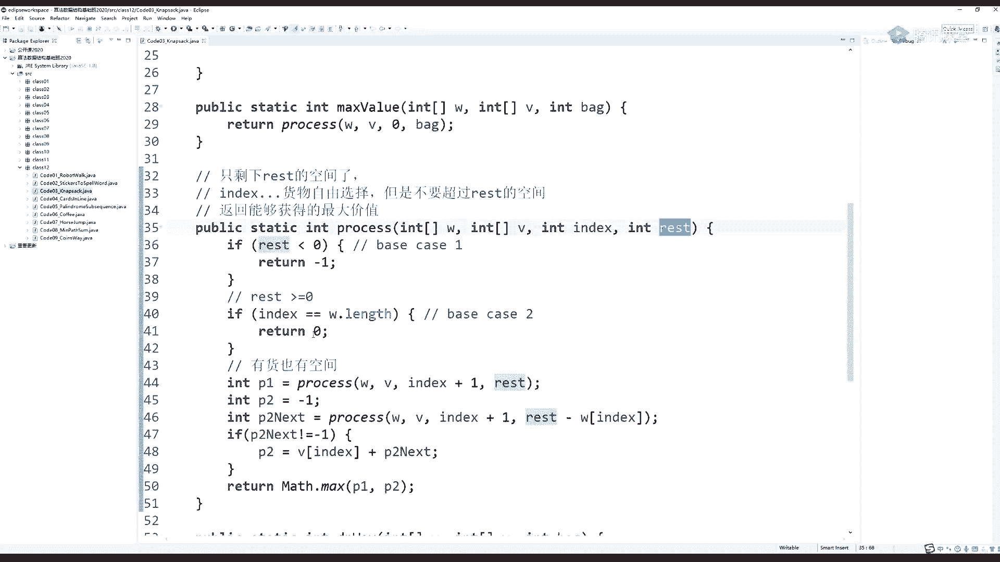
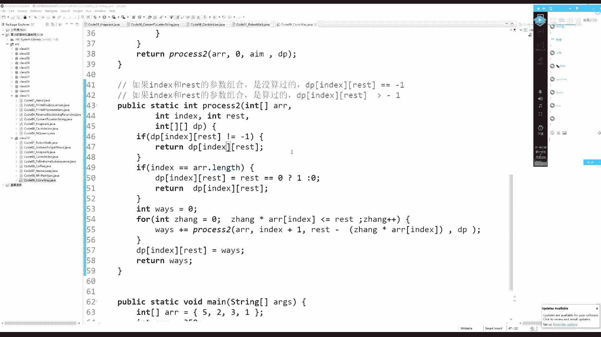
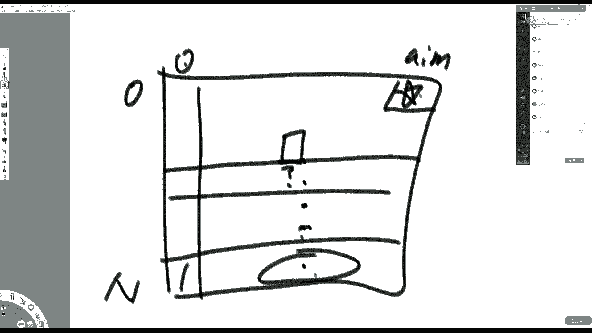
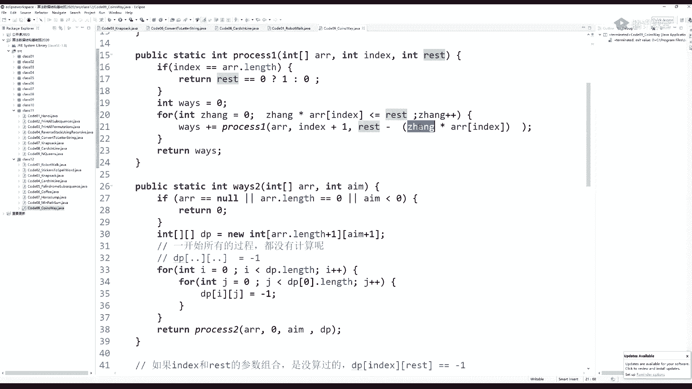
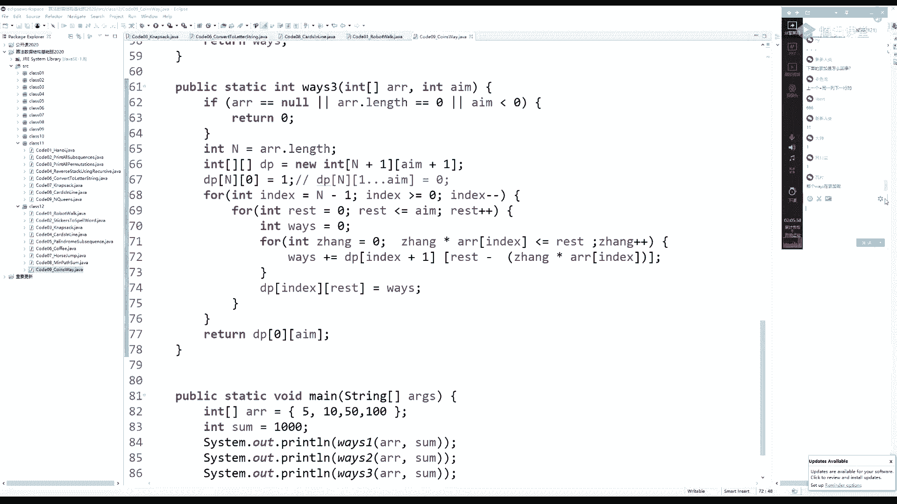
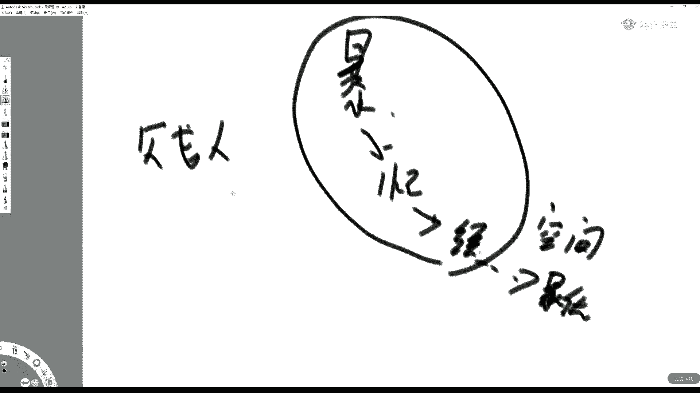

# 系列 2：P72：左神算法-暴力递归到动态规划3 - Java视频学堂 - BV1Hy4y1t7Bo

喂，来了来了来了，大家好啊，我接着昨天讲是吧。

我昨天是不是嗯改了一个动态规划是吧。

这个，嗯就是那个机器人运动问题是吧，那个机器人运动问题，那个表的结构我画了，角就表的结构我画了，但是这个代码没写是吧，我们昨天是昨天是只讲的那个表的结构。

但是它具体代码没写，我就说昨天说的是，如果这个地方是current是吧，这个地方是rest，先把最后第第第零列填好是吧，然后从第零列开始依次往下推推到最后一列，这个代码我我我我就不展示了。

因为昨天按道理来说应该讲一下是吧，但实际上他这个表的结构已经非常的清晰了是吧，你自己去填好就行了，我们讲一个新的题呢，那要看一下有什么弹幕，还有同学应该是问之前的一个全排列的问题，为什么在你死你。

你在你在调用递归之前交换了之后，再调用递归之后再交换，它还能保证是原来的ig换回来是这意思吧，因为你每一次在调递归的时候都会换回来，所以你看上去是你掉了一个子过程，回到你之后你再换。

你为什么可以保证i跟g位置是相互之间还原的，因为你的子过程全还原了，所以轮到你的时候你也还原，能不能够正确还原完毕，这个小龙同学懂了吧，嗯好让我们来继续看这个今天要今天讲的，我们今天讲的内容。

然后我们还有一个任务，就是把昨天讲过的那些场暴力尝试重新改成动态规划，是这意思吧，嗯啊昨天我们讲了一个啥概念啊，就是我们说这个任何一个暴力尝试，只要你发现它有重复计算的过程。

然后呢你就把它的可变参数变成一种结构化的描述，做啥缓存，它其实就是动态规划了是吧，那么你这个这个从在这个啥缓存的基础上，如果你再把这个表的结构划分精细的话，它就是我们正常的动态规划。

我们昨天讲的以以以那个机器人问题出发，只是介绍了这样的一个概念，那是不是每一次都这样呢，是每一次每一个动态规划都可以这么干啊，所以它是一个套路问题好，那么我们来，啊我们再来想想，再来看一个什么题啊。

对背包问题，比如说我们昨天讲的，现在临时开始改背包问题啊，昨天我们讲了背包问题，只讲了暴力尝试是吧，还没有改动态规划，我们来看一下背包问题，你看这个背包问题，你可以改这个方法，对这个暴力递归也可以改。

底下这个暴力递归啊，你改哪个都行，那我们来分析一下底下这个因为底下这个足够经典是吧，你看底下这个暴力递归它就两个可变参数，这个可变参数的范围是啥呀，就是货物的数量，如果是n的话。

这个index它是指的是具体某1号货物，所以它的index它的范围是零到n减一对吧，那我们的rest是什么呢，你的bag有多大，它的剩余空间数量是不可能多于这个背包容量的是吧。

所以我们的那个背包问题呢就可以很轻，就它就可以改成二维表结构的动态规划，因为我们那那我们先关心一个问题，这个问题就是说我们背包问题在我们调用的过程中，它会不会出现大量的重复行为。

注意我们为什么一定要确定这一点，他决定了你有没有必要去改动态规划，如果你发现你你调用的这个递归过程，它这个每一次这这个这两个参数组合都是新的，那你其实就没有必要去改动它规划是吧。

如果你发现你有大量的重复问题，其实你有必要去改动态规划，因为你有重复问题的话，你改成这种动态规划，就意味着以后再遇到重复的计算，你就不是暴力展开了，你直接从缓存里面拿数据了，这是我们昨天讲过的内容是吧。

哦我问一下今天有多少同学是刚来的，昨天的课没听过，刚来的同学打个二，这咋整是吧，唉呀这个，这个那那那我没办法没没没办法重复讲是吧，那你那麻烦这些同学就是把昨天的课看一下，好吧啊好啊。

那么我们来看现在来直接就直接顺着昨天的思路来讲是吧，直接顺着昨天的思路来讲，那我们看这个index和这个rest都是多大，我们不妨举一个例子，举个例子看看有没有重复解什么例子呢，就这这个这个呃。

比如说这个这个货物啊，一个是它的index，一个是它的剩余空间是吧，那我们假设有一些货物啊，第一个货物它重量是二，第二货物重量是一，第三个货物重量是三，下货物重量是五，在下货物呢重量是假设是四吧。

这是重量的货物的数组，同样它肯定有一个价值的数组是吧，价值数组，那价值分别是a b c d e可以吧啊好我们看一下它会不会有重复解，你怎么看会不会有重复解，就是你一开始调用的时候。

肯定是从0号货物开始选择是吧，我们把固定参数省掉。

只写可变参数的表达，那么你一开始肯定是0号货物的情况下，它有它的剩余空间是多少，假设你假设你一开始给我一个总空间，比如说是20，总空间是20的大小，0号货物他剩了多少空间呢，他一开始剩20个空间。

因为你从0号货物开始选，他还没有选择，对不对，那我就看你随着你调用的过程中，这两个参数会不会出现重复解，很明显会，比如说我我我没有，我没有选这个货物，也没有选这个货物，我选了这个货物，我问你。

你剩下的过程是啥，就是你经过某一个决策之后，你会遇到一个子过程，这个子过程是我从3号货物开始选择，我之前选的是不要零，不要一，要了二，所以还剩17的空间，这是不是重复减，怎么重复了，它等不等同于你。

你要了二，要了一没要三的后续过程是不是一样的对吧，你看你如果要之前要了二，要了一，但是没要三，我问你，你接下来的过程是啥，你还是从3号货物开始，剩余空间数量是17，那么也就是说。

我们单独的用这个参数和第一个参数和第二个参数的组合，其实是会有重复解出现的，那就意味着我们动态规划搞起来有必要，因为你可以把很多重复解利用缓存的方式，以后不重复球，听懂同学打一，好啊，那么那么好。

那我们现在你当然可以，你你任何暴力递归过程，你都可以把可变参数做成啥缓存的形式对吧，你任何的时候都可以把这个可变参数做成啥缓存的形式，这个昨天我们也是讲过的，所以我们这里就不多废话了，我们直接看。

如果我们想把它变成经典的动态规划的样子，你应该怎么变呢，那就看我两个可变参数变化范围都整理清楚之后，它不就是一张二维表吗，什么意思呢，就是说我这个index是不是从零到n减一的。

实际上这个index的变化它是有可能到终止位置的，所以我就姑且默认这个index可以是零到n的，好举个例子，比如说就这个数组啊，我们现在改改，开始改动态规划了啊，开始改动态规划了。

假设这个就是我们这个货物数组，这是重量，这边是价值，我们为什么价值上都用这些东西代替呢，因为我们的递归过程里面，价值没有体现在可变参数上，所以我们只注意改动态规划的时候，你暴力递归写好了它。

它这个结构改制的方式只和你已经写出来的动态规划有关，和原始题已经没有关系了，解耦了对吧，昨天我们昨天我们也讲过这个内容是吧，就是说你一旦改出暴力递归啊，以后，你就根本不用管原始的含义了。

你就看着你的暴力递归就能改成动态规划好，那么我们先来想一下这个东西怎么改，首先我的货物呢下标是0~4，如果我们再给他补一个终止位置的话，我们为什么要补这个中指位置。

其实也是因为我们暴力递归中需要这个中指位置，你看我们这个这个递归中index是能够到终止位置的，对不对，所以既然他需要我们就补一个无所谓嘛。

也就多一个位置嘛，所以我们就想如果我们index做列的话，012345对吧，012345，那么这个就是假设就是我的index的变化，它不可能超过0~5的范围，因为它是数组中一个具体的位置。

即便我把中值位置也补上去，它也不会超过对吧好，那么我们这个列是什么呢，当然是我们的剩余空间rest，剩余空间rest，如果我们给给的初始空间bag等于20的话，初始空间bag等于20的话。

那么我们这个剩余空间它它的范围是什么，从0~20，既不可能小于零，也不可能大于20，好那么做出这张二位表之后，毫无疑问我所有的递归过程，这张二维表都一定能装下，这也是我们昨天讲的内容，是这意思吧。

好那么我们把这张表的结构分析清楚之后，我们来想一下你需要怎么填这张表。

首先我们看你主函数啊，你要的是什么位置，零八个位置的值，就是它它它在递归里面，他要的是零八个位置的返回值，那对应在这张表上。

其实你最终要什么位置的值，零bag，也就是说我最终把这张表填好了之后，我是要右上角的值，把这张表的右上角的值给用户返回就可以了，那么这是也就是说这个是我们最终想要求的位置，那我们初始位置有哪些呢。

还是看递归，首先rs小于零的时候，认为是无效解。

那你就可以认为什么整个这张表中如果rest小于零，也就是这个矩阵，整个左侧的海洋都认为是无效的对吧，这张表中整个左侧的区域都认为是一个无效区域。

好继续看，如果index等于终止位置的时候，不管我rise等于什么，请都返回零。

是这意思吧，说明啥，说明你最后一行，当我的index等于五的时候，不管rest等于什么，都等于零，好你看我们只通过b4 ，只通过递归函数，就知道这张表中哪些是初始位置，哪些是我最终要求的位置。

你通过这个结构，你就你就知道我一定是从最后一行推出倒数第二行，倒数第二行推倒数第三行，一直往上推，推到最上一行，最右的位置是我要返回的值，听懂同学打一，好所以我们就改一下这个我们就改一下。

现场改一下这个暴力递归好吧，我们哎其实底下就是啊，你看我是怎么改的啊，其实底下就是dp位啊，就是他说的是什么意思，我看你看啊高度对应的这个dp位啊。

其实就是把上面的这个暴力递归过程转化成动态规划的写法了，如果你可以一眼看出来重复解，你不用像我刚才那样分析对吧，如果你看不出来重复解，你最好还是列一下好吧啊，那个这个dp v怎么求呢，我们来看一下。

首先你看我准备了一张dp表行呢就是我index的表达，那么index我们说我们要补一个n位置，所以它的下标是从哪到index是从哪到哪，零到n那我就准备n加一行，n加一行，准备完了之后。

你不就下标就是零到n都全了吗，对吧，还有我们的rest是什么呀，我们rest是零到bag，rest是零到bag，所以准备多大的表列数。

准备bag加一，你准备bag加一，就相当于你的列零到bag都全了，对不对，但是这里面有一个过程，就是说我们先填一下什么，当我的index，当我的index等于中值位置的时候。

那就相当于dp到d p n行的任何位置其实都是等于零的，但是在java中，本来你初始化的时候它默认就都是零，所以你就不用再单独设置，说我n行所有位置都是零了，它本来初始化的时候就都是零啊。

所以看似你什么看似你没有填最后一行，实际上你填好了，它初始化的时候就帮你填好了，所以你看底下是怎么改的，接下来的过程是行，我从n减一行开始，因为n行我已经填完了。

n行我已经填完了嘛，这一行我已经填完了，对不对，所以接下来从n减2n减一行开始填，n减二行开始填，n减三行开始填，一直填到第零行。

怎么体现的呢，那就是我的这个index的变化，你看是怎么变化的，index从n减一行开始，每一次index减减，index大于等于零的情况下一直往上走，是这意思吧，所以第一个for循环其实就规定好了。

说什么其实就规定好了，说我从下面的行往上面的行依次填，那么第二个for循环是什么呢，第二个方循环是啥，第二个放循环是我的剩余空间从一开始一直填到bag，是这意思吧，我的剩余空间从一开始一直填到bug。

也就是说对于每一行来说，对于每一行来说，我是从右往从左往右填好每一行，下一行再是从左往右填好每一行，再下一行再是从左往右填好每一行对吧。

没错吧，好昨天的没有，昨天我们应该是把原来的递归改过的，所以我们现在就按照现在这个版本，现在这个版本来改动的规划，那你既然rise是小于零的情况下才是无效解，那么我现在改一下rise就从零开始好吧。

让你让你让你理解好，rest从零开始是有必要填的，为什么为什么rest小于-1小于零不需要填呢，我们base case里面已经规定了，因为rx小于零的情况下，这个-1它代表无效解，我们是不需要管的。

是这意思吧，所以这两个for循环如果你能够顺利填完的话，我们现在还不知道怎么填，假设这个蓝色部分还没有，假设这个蓝色部分还没有对吧，就假设它没有，我们只要把这两个放循环填好，最后返回谁啊。

你主你在原始暴力递归中，你需要的是零bag这个状态你最终返回数组的零bag状态就行了吗，接下来怎么填，告诉你递归函数怎么调，动态规划怎么填，什么意思，copy进来，就copy下来。

我rise小于零的时候，我已经处理了这两个，这两个for循环中不会有rise小于零的时候，index等于中值位的时候，我已经处理了这一行呢，在这一行处理了对吧，它默认的情况下帮我n行填好了。

所以你你下面的行为，他是不是就是正常位置怎么去做决策过程的行为是吧。

好你如果不知道怎么改。

你就把他们彻底copy进来就行了，然后你再改，那怎么改呢，你的目标是什么，你的目标是在任何一这，这这个只是原始的，它的暴力过程，我们想办法把它拆成动态规划，怎么拆，你for循环的index位置。

定了rst的位置也定了，其实你就是在这两个for循环里，你想办法把此时的dp index rest位置，它等于什么，你搞定，你想办法把此时的dp index rise是什么搞定。

你周而复始地跑这个矿循环，最后返回零bag不就结束了吗，这个这个底下这个代码只是我现在要提醒你说他原来的决策过程如此，其实你现在就想做这样一个工作，每一个index rest到底等于啥。

如果我能搞定他就搞定了，听懂他在打一，好那我们现在开始改嘛，可能性一是啥，我们把它还原出来，是你看，可能性一他掉了，我们此时递归过程里的这俩参数，你既然已经分析好位置依赖了，我问你。

你是不是可以直接拿了，对不对，你虽然暴力递归中的可能性，一是等于这个暴力递归里面这俩参数的组合，我们可是从底层往上层填的，我问你，你来到任何一个dp index rest的位置的时候。

你有没有dp的index加rx位置的值有，你原来是用暴力递归去掉的，你现在在dt表中直接拿o不ok啊，我超级ok啊，那就直接拿呗，第一行改好了，第二行，先让它等于-1和暴力机构中保持一样，然后这样。

然后p2 奈克斯特等于什么也拿递归做代替它应该是什么，是这个，是这意思吧，好那我问你，我是我，我如果rest减这个东西，它是一个一个小于零的值，它是不是无效啊，所以你在用dp值的时候。

你必须保证这个蓝色部分不越界，对不对，index加一是肯定不会越界的，因为你index是从n减一开始往上推的，那这个位置如果越界的话，是不是代表p2 next的无效啊，所以你怎么写，你这么写。

看一下我们是不是对应的，你原来是p2 next的过程，如果是一个无效解啊，如果是有效解，它不等于-1就是有效，如果你后面的后续过程就这个后续过程它是一个有效解，p2 就等于爱好货物的价值加上p2 的。

那你不就相当于是如果你这个位置没越界，那p2 就等于v的index加上一个有效的后续吗，然后你就干嘛，你就知道你这个位置怎么填了吗，他怎么填呀，p1 p2 取最大值，上面的改法。

上面的这种改法和暴力递归过程的求解，一码事儿，看懂同学打一，所以你体会一下我们刚才说的那句话，昨天说的是怎么说的，所谓的动态规划转移方程，它其实就是你决策过程中的那个决策。

你暴力尝试过程中是怎么组织你的决策的，他就是把它就是动态规划中的状态转移，听到同学打一，如果你作为一个老手，你可以直接写出动态转移的方法，那就说明你已经相当熟悉了，你就去直接写状态转移的解。

如果你是一个新手，你就从暴力递归开始，一步一步非常顺利的改造动态规划对吧好，所以你已经改完了，当然要把原始的去掉，来我们来跑一下是吧，这个有有dp位置，我刚改掉吗是吧，是不是啊，对不对啊。

原始的暴力递归过程算的跟dp我们刚改成那个版本等效吗是吧，溜不溜是吧，你说我我我当我写出暴力递归过程之后，我为什么可以很顺利地改出来，原因就在于我我我暴力递归的决策过程，就是我的动作，就是我的状态转移。

为什么给你推荐暴力递归的写法，因为它特别贴近于你的自然智慧，你直接把它做抽象化的状态转移，你很可能是列列不清楚的理解吧，很可能是列不清楚的，rise可以从右向左吗，可以啊，在这里面我只是想高度还原。

说跟原来暴力递归过程同样的顺序，所以我这么写的，你当然可以自己改是吧，看一下啊，啊这个这个你你就是你临时申请变量跟你提前申请好都行是吧，这只是一些小的实现细节。

你把p一跟你把p一跟p2 彻底夹到外头行不行，彻底夹在这两个方循环外头行不行，可以对此无所谓好我们就很顺利地改出了这个这个呃背包问题好，我们再改一个，我们再改一个，还是昨天那个昨天有一个讲的尝试过程。

但是没有改，就是我们这个字符串转化问题，你现在没有听过那道题的同学不要紧，没有听过那个同学的同学不要紧，我们说了，改法和你原始提议是没关系的，张三写了一个process方法，他的暴力过程已经决定好了。

李四根本不知道原题意，只根据他的暴力过程就可以感受动态规划，原始题已经解耦了，对吧，所以我们现在假设我们就看只能看到这个process过程，我们要怎么改，底下当然已经有写好了的，不用管，我们现场改好吧。

为了让你熟悉，你不用管原始t1 ，我就看这个暴力递归过程，我就能够感受他们的规划，这绝这绝非一两个体，所有的动态规划都可以这么干，好怎么改，首先你分析这个这个过程是非常简单的过程，为什么这么说。

他只有一个可变参数啊，它就是一张一维表啊对吧，他是这只有以可变参数，它就是一张一为表啊，这个这个很明显是非常好改的，你我们昨天分析的时候，虽然分析了一大通，但是在真正改动态规划的时候。

你的暴力尝试一旦出现了出来了，暴力递归啊，动态规划就出来了，好现在直接改怎么改，这为了区分一下，我们就写个dp v2 好吧，这个就是我们的dp位置二，我们要改它，我们只看上面的暴力过程怎么改。

那么我们先看一下主函数要谁，主函数要这个这个零位置的值是吧，i的取值是什么，ai可以取得中值位置，所以dp v z2 我就给他删掉，啥都没写呢，要怎么改呢，你的这个暴力递归过程符合什么样的过滤条件。

拷贝进来，对吧，这个是string啊，那就s，好为了方便起见，我把这个s给它转成呃字符类型数组的形式好吧，然后它的长度是，那么我准备dt表准备多大呢，暴力递归过程中，index取值是零到n的。

所以我就准备一张表，他下标是0~0到n的对吧，所以准备这么大一张表，那么我看暴力递归过程中，我是需要零状态的好，最后返回dp 0，嘿嘿返回dp 0中间啊，我就把这个dp处理好之后就ok了对吧。

dt怎么生成，dp怎么生成了，在n的时候它是等于一的，直接写，没毛病吧，跟原始题是什么，根本不根本没关系，你包容内鬼写出来就直接改嘛，好接下来我们想一下，我们看这个process是怎么依赖它的子状态的。

我们发现process它来到i位置的时候，它依赖的是或者i加一位置的返回值，或者a加二位置的返回值，这个也是i加，意味着返回值或者a加二位置返回值，最后的子过程也是a加e味着返回值妥了。

也就是说我在这张dp表中，任何一个i位置的值，我只依赖它i加一位的值或i加二位置的值，那么如果我要填好整张表的话，你n位置的值已经告诉你了，是一你最重要的是零位置的值是什么，给用户返回，毫无疑问。

这张表从右往左填，听懂同学打一，好那既然知道这个我就改嘛对吧。

我就改嘛，怎么改啊写嘛，你n位置，你n位置已经填好了，接下来i从n减一开始a大于等于零，a减减是这意思吧，a大于等于零，n减减是这意思吧，好那也就是说我们在这个for循环中。

我们的目标就是把dp i位置的值想办法给它生成好，如果我每一步都能够正确生成好整个问题解了，那你每一步的过程和你具体process里面调用一个image的返回值，是不是一码事儿，一码事，对不对，怎么办。

拷贝进来，直接拷贝进来，我就想办法怎么改对吧，原来是暴力递归的过程，我现在把那一行一行改成动态文化的表达，所有return的位置，所有return的位置，它就是我去设置dpi的时刻。

所有return的位置它就是我去设置dpi的时刻，听到他在打一，你在这个你看你方循环a等于n减一的时候，那么你你是单独在之前把dtn的值已经设置好了，所以这一行干嘛不要了，i等于终止位置的时候。

是你已经提前填好了的东西不要了，那么接下来他的如果spring i等于零，就return 0，那不就是相当于spring i等于零的时候，d t i的值等于1=0吗，对吧，你是return 0，直接减。

直接往上加，可以吧，然后当我string i等于一的时候，rest等于dp i加一的值好先让dpi等于他，怎么替换它，它不就已经变成dt表中的东西了吗，非常傻白甜啊，这这有什么难度对吧。

如果i加一位置呢，小于死就烂死，dp，加等于dpi加二的值，是这意思吧，改完了，接下来，二的时候result等于他好，先让dp等于他，然后你后面的过程就是dti加一，接下来这个条件一直放在这儿是吧。

然后你dp加等于，dpi加，行了改完了，来跑一下，也也也有可能会失败对吧，谁能保证你失败了，咱再看吗，原来的member方法是暴力过程，现在直接把dp我们刚才改的dp v2 传进去是吧。

啊这个看懂同学打一是吧，哈哈，有什么问题是吧，傻不傻白甜，简不简单，还什么狗屁动态规划是吧，动态规划就是这么简单，你把你把尝试过程想清楚，它，再把它替换成，再把它替换成结构化的缓存结构。

这玩意就是动态规划有什么难度是吧，好关键就是你的尝试过程，最关键的就是你的尝试过程好吧，那么，还有一个题，昨天讲过的，继续把它改动，大规划，我们给你奠定足够多的概念之后，就是这种足够多的这个信心之后。

我们再进行下面的内容，不然你感总感觉虚虚的，对不对，来昨天那个大家哦，大家看一下，这个f函这个这个这两个函数比较特殊，我告诉你这个f函数它底层递归调用了s函数，这个s函数它底层递归调用f函数。

两个东西互相嵌套，你不用管原始提议，你不用管原始t1 ，就单纯看这两个递归行为，想想怎么改，我们两分钟之后继续啊，我去抽根烟，请看一下啊，不用管原始提议，假设就是张三写了两个递归方法互相嵌套。

你现在作为李四，你怎么改他，快看看啊，动态规划最难熬的就是转移方程，要这么说，动态规划最难熬的就是想尝试过程，你为什么憋不出来状态转移方程，因为你对尝试没感觉，怎么可能别出来，状态转移方程。

状态转移方程是对尝试过程的再一步抽象化的表达，其实一码事，但是如果你没有前面的这个尝试过程的感觉，你怎么去憋出这个状态转移方程来，就是一句特别俗的话，没学会走，你怎么会跑，老师给你讲的时候，为了图省事。

直接告诉你，想清楚状态转移就行了，状态转移是个啥都没讲，就是你尝试的过程，你们尝试过程想清楚，转载转移就出来了，不是说不写状态转移，我们课上怎么可能会教你不写状态转移的方法。

后面的题会涉及到为什么我要写，最后我要写这个状态转移，因为有可能存在进一步优化的空间，但是你什么都没有，你递归感觉建立不起来，你怎么写这个状态转移，你有那个能耐吗，没有那个能耐。

就从一步一步从尝试开始稳扎稳打，你总能写出来，好好看昨天的课，还有就是，老师好像不好确定是否存在重复子问题，能不能一眼看出来，没有的话，能否也能动态规划，如果没有重复子问题，没有必要改动态规划。

我们动态规划就是为了空间换时间，你为什么要改动态规划，是因为有大量的重复解出现，你不想每次都暴力去做，所以替换替换成结构化的缓存数据以后，遇到同样的子问题的时候，直接拿答案，这就是动态规划的实质。

然后小方同学说dt 0位置没太明白，是最后的最后的总结果嘛，对dp是什么，不要把它想得太高端，dp就是暴力递归过程，想办法把所有的返回值放在一张表里，就是dp主问题，主问题要求你拿零状态的时候的答案。

你就返回dp 0，都听明白，同学打一，是否存在重复子问题，能不能一眼看出来，如果你有经验，你可以一眼看出来，如果你没有经验，你就列一下，对不对，啊真的都这么多，这么多年都是为了这都是为了啊。

好多人临时过来上课，给我憋的是吧，你看每一步一步都解耦掉了是吧，想要了解盖洛的，我们好好看，之前的课我们都是非常成体系的，讲完了是吧啊，好那我们讲我们现在看就这两个方法，昨天讲过的一个题。

你不用管原始第一，这是所有的解win一方法，我们假设我们都不知道说的是什么，我们都不知道他说的是什么，怎么改出和问一方法对等的动态规划来，腿改怎么改呢，我们来分析一下，首先win一过程中f需要什么状态。

0n减一状态，如果数组的长度是n的话，主问题里面需要的是f0 n减一状态，他还需要s这个函数的0n减一状态，没错吧，那我看f这个f是啥意思呢，我们会发现当你f调用的时候啊，l跟r是啥。

他底下s的调用的时候，l是加1r的状态，而我们第二个参数呢是s这个递归函数中l r减一的这个状态，那也就是说规模在缩小，对不对，他不可能往外头去，对不对，啥意思，我这是还要到r我依赖的子状态。

甭管你是依赖自己的f还是依赖外头的一个s，你的范围要么是l l加一到r，要么是什么，l，到l减一规模都在缩小对吧，原始的大规模是l到r我需要它内部的l加r这个状态，或者l到r减一这个状态规模在缩小。

对不对，再看s函数是不是s当我我也改成l r，你会发现s函数中它虽然掉的是f这个状态，但是它的规模也是缩小的，而而且也是缩成，要我要拿l加r，要拿l减2-1这个这两个东西好，我们昨天输了。

你发现l跟r每次都缩小范围上的尝试，所以l跟r是什么，是数组的某一个范围对吧，是数组是数组r v中的l到r的一个范围上的一个尝试，是这意思吧，是数组l的r的，你看你为什么可以这么说。

l r数组l位置的值加上一个l啊，l加r的状态或者数组rv的值加上一个l r键，也就是说你l r是干嘛用的，你的l r其实是在数组中要拿直的，那其实l和r就对应的数组中从l到r位置的这么一个范围。

而且你l等于r的时候是啥，就是这个范围上只有一个数的时候，这个l等于r时候代表啥，也是数字上只有一个数的时候，对不对啊，范围上的尝试，l的变化范围是啥，数组中零到n减一吗，范围上是啥。

也是数组中零到n减一吗，所以如果我们把f函数做成表的话，正方形表因为l也是零到n减一范围，而也是零到n减一范围，s也是一样，正方形表如果我们把f认为是一张表，s认为是一张表，就是两张正方形表。

听同学打一，好那我们就写，我们举个例子写怎么写，数组给你给你举个例子，就这个例子，f表，s表，画好格子，注意听，接下来因为你l到r它表示的是数组中的一个有效的范围，所以任何l大于r的时候。

不可能说明这两张正方形表中左下半区没用，听着他打一，任何一个范围上的尝试一定是这样的，任何一个范围上的尝试一定是这样的，然后怎么看看着他的暴力递归啊。

我们怎么说呢，f中如果l l等于r的时候，就return rl的值。

你会不会填l等于r是哪条线，这条线，对不对啊，好l等于r的时候就等于什么呢，就返回r rl位置的值，所以0~0问题的解释什么啊，瑞零位置的值11~1的解是什么，二位一位是值，72~2的解是什么。

93~3是什么，100你不用管原始提议没关系，那么跟原始题没关系，只看暴力递归过程够了。

4l等于r的时候，他不就是return 0吗。

所以s表中，这么个事儿对不对。

主函数要什么，主函数要的是f0 n减一的状态的值，s0 到n减一状态的值，好标上。

所以我的我其实我的问题就是说你怎么把两张表都推完，能拿到两个星星位置的值，这个问题就搞定了，听我同学打一，好我们看一下，那这个东西怎么推呢。

不要看互相嵌套，你位置空间感建立好之后，你就看嘛，来看任何一个f l r的状态。

问好任何一个好，我们假设一个我们不妨设就是这个星星位置，我们看它是依赖什么，假设这个星星位置就是一个普遍位置。

我们看它依赖什么，它依赖的是l加r和l r减一的值，但是是在s表中的，是这意思吧。

那是啥意思，值l加r是谁，这是l l加r是这个位置，l r减一是谁，是这个位置，但他意外的是s表中的也就这俩位置，这个星星他意外的是这俩位置，而这个星星呢我们来看它也是s表中一个普遍位置。

它依赖的是f表中l加r和l r减一的两个值。

说说明啥，说明这个星星它依赖的是f表中叉号啊，不写插好这两个位置的值，就这两个对号啊，他是被这个星星依赖的自己，f表中就是他们他们就说我任何一个f表中的位置等同于在s点点，s表中做出对应点。

然后依赖这个对应点的左边一个位置跟下边一个位置，s表中的任何一个位置都在f表中做一个对应点，都依赖这个对应点的左边的位置跟下面这个位置好，那你怎么推啊，我问你，你能不能推出这个s点的位置可以退出。

为什么，因为它的对应点在这儿，而它左边跟下边的位置都是已经具备的了，都是有的值，你可以通过m表中这个一和这个七把s表的这个位置推出来，那这个位置的值能不能推出来，它依赖的是f表中的对应点。

这左边的值跟下面的位置有七跟九，你就能把这个问号也能推出来，那你能不能推出这个位置的值也可以，这个位置它其实就是对应点f表中左边位置跟下面的位置，你有了九个100，一定能够把这个问号推出来，同样道理。

你能不能把在f表中，你在f表中，你能不能把这个问号推出来，因为对应点是这个对号的位置，它左边跟下面都有，所以这个题是啥意思，就是你用f的这条对角线去推s的第二条，用s的对角线去推f的第二条。

再用f的第二条去推s的，第三条，再用s的第二条去推f的第三条，两个东西交替往上推，推出来了，听我同学打一，这和原始题有关系吗，这跟原始题一点关系都没有，对不对，你说你自己作为作为一个新手。

你怎么可能会想到这种转移方程，你憋到死，你也憋不出来，老老实实写尝试，那这道题尝试是什么，看昨天的视频好吧。

我们现场改，杀掉五影二方法，我们这个我们把问一方法先放在这，直接改无印二方法二位传进去，二方法，你不是不会吗，我给你擦掉，可以吧，我给你擦掉，现场改怎么改呢，来看主函数，主函数前面是什么过滤。

咱也什么过滤，接下来你依赖是f过程，s过程好，两张表，二位的长度记上，f规模是他，s表规模也是他，对吧，然后看哈哈哈哈哈哈，最终返回的是他好，我明白了，返回返回这个，f0 到n减一的状态。

s也是零到n减一的状态，就我是返回他的跟我的跟我上面这个过程保持一致，具体两个公式怎么求呢，我们来讲了，如果l等于r的时候是二rl值，好甜甜甜，你这么一干对角线的所有值就等于一次等于二位i的值。

相当于你把这条对角线填好了，听懂同学打一。

第二个for循环是s对角线全是零，但你在你在java中默认初始就都是零，所以就省掉了对吧，省掉的一个就是任何一个s i i位置都是零，本来它初始化的时候也都是零，好现在开始写，我怎么去填所有的对角线。

i等于从一开始i小于ni加加什么意思。

a等于a等于零时候的这条对角线我已经填完了，i等于一的时候，这条对角线我想依次填好，i等于二的时候，这对角线我想一次填好，最后一直到i等于三的时候，这条对角线，这就是我i的控制。

那你怎么填好呢，我一上来对角线的第一个点是谁行谁行，在零位置是谁列在i位置，对不对。

合不合理，我这个i一上来来到一的时候，我问你，你对角线的第一个位置是不是零一位置，来到二的时候，你对角线的第一个位置是不是零二位置，i3 的时候，你对角线是不是零三位置是吧。

所以每一个i开始的时候，他对角线的第一个位置都是0i位置，接下来干嘛往右下方出六吗，所以怎么写，请你小于n，并且column，请你小于n，都不越界，行跟列都不越界，我你中间干嘛。

你只要能够想办法把每一个dp肉column填好是什么就行了，那肉怎么变，肉加加column怎么变，column也加，加办法把这个结构中每一个位置都填好。

这事出来了，听不懂，同学打一。

小于a吧没错，但是是我利用这种方式，肉一开始等于零，column等于i，每次他俩同步加加，是不是永远肉小于column，自然就保证了对吧，只和我代码的结构有关，它就是一个coding问题吗。

好那我怎么想办法把具体的每一个肉call那么填好呢，递归函数拷过来吗，不对，怎么想办法把每一个rocm填好，dp rocm填好，你这么想l跟r对吧，为了方便我们就是l跟r，那你把肉替换成l可以。

column替换成r可以吧对吧，保持一致，所以这个l老于安，小圆每一步填l，然后l加加二也加加，想办法填好就行了，拷贝过来怎么拷贝的拷贝呗，有什么不知道怎么拷贝都拷贝过来，这个是f啊。

这是这是f这张表的逻辑，还得去填s这张表的逻辑是吧，还得去前s这张表的逻辑都拷贝过来，这张表一个return语句拷贝过来，这张表的return语句也拷贝过来，怎么改，你知不知道太简单了，你就你就改呗。

fl r直接把他弄过去，可是这里面你把调用递归的过程替换成s表，也一样，好了就这么简单，s这张表也一样，拷贝过来，不过你把这里面递归行为替换成f表。

妥了，好了来我们来搞一下，刚才打一，大家没有听过，昨天尝试的同学不要慌，接下来我们会讲新题的啊，我们会讲新题的，那就是全虚全影的，给你讲全的问题好吧，啊我们现在来讲，我们现在来，现在重新讲一些。

我们现在讲了一个什么东西啊，就是说你讲了这么一个东西，你对于一件事情形成一种暴力递归的写法，一个题，你得先去找到，有一个暴力递归的写法，就是你的尝试，然后你要去你要分析说它里面是有重复解的。

没有重复解的，没有必要改动态规划，有重复解的，你直接改动态规划，有就是有必要改成动态规划对吧，你分开这样一个步骤之后，自然你把所有的可变参数，把所有的可变参数，如果不讲求组织的形式，做啥缓存啊。

就是记忆化搜索的方法对吧，昨天也讲了，如果你不讲究，如果你不讲究组织，这个缓存，你是不讲究组织的，你就是遇到一个子问题，他如果之前没算过递归算，如果他已经算过了，你就直接从缓存里面拿，值不讲究组织的话。

就是记忆化搜索的方法，如果你再把这个计划搜索这个缓存结构做精细化组织，这是我们经典动态规划，这是我们的经典动态规划，对吧好，那么现在就有一个问题了，暴力递归的写法，记忆化搜索的解法。

时间复杂度是什么表现，经典动态规划又是什么样的，时间复杂度表现，这个我们不妨拿背包问题来讲，背这包问题是每个货物必要和不要都要递归展开的，下货物又是要和不要都要递归展开的。

再加货物又是要和不要都要递归展开的，如果你有n个货物暴力递归的写法，复杂度多少，每一次两层展开，每一次两层展开二叉树吗，你如果把它变成缓存结构，遇到同样的问题，就不再暴力展开，用缓存法呢。

表的结构是不是就是数组的长度是n，其次bag的大小啊，所以你的复杂都是什么，一个n乘以bug，这张表的大小就是你的复杂度吗，这是经典状态规划方式的时间复杂度，很轻易就证明是他每一个格子没有枚举行为。

只是依赖有限的两个位置过这一个位置对吧，那整张表一共有多少个格子，不就是你动态规划的时间复杂度吗，你这张表有多大呢，你的规模不就是n乘bag这么大吗，他可比他好好。

如果我的背包容量没有达到一个天文数字的话，恐怕这个方法是要比上面方法要好得多的对吧，计划搜索和经典动态规划有什么区别呢，告诉你，如果你的决策过程中无枚举行为是什么，叫无媒举行为，就是你任何一个状态啊。

它只依赖有限的若干个有限的子状态，计划搜索的复杂度和经典动态规划的复杂度没有区别，你们在比试过程中改出计划搜索的方法，可以不用再改经典动态规划了，为了省时间，但是如果你的表中有一个位置。

他有枚举行为的话，要去改这个经典动态规划，原因就是我们要讲的下一道题，因为它有可能当你写出经典动态规划的方案之后，能找到一个优化，把这个状态转移继续进行化简是得枚举行为是有存在这种变得更简洁。

省枚举行为的可能性呢，我们现在还没有提，来来让你认识到这一点，但是我要说的就是，如果你的暴力递归中算在具体状态的时候，你不是for循环在枚举，什么叫不是放循环的枚举。

比如说我们背包问题问题，你暴力递归中，我问你，你有你有for循环枚举吗，没有你就不依赖一个子状态，第二个有限的子状态不对，来看我们机器人问题，机器问题也是我这个任何一个状态，我只依赖这个状态。

这个状态只是指有限若干个子状态，对不对啊，没有没有枚举行为，比如说说我们的这个刚才那个这个字符串转化问题，这个process它就依赖有限几个子问题对吧，它没有枚举情怀，它没有放循环。

刚才我们这个改只改改变刚才那个问题，它也是f函数一类有限的两个s函数，这个函数也依赖优先，又依赖有限的几个这种行为的时候。

你没有必要最后再把这个计划搜索改成进来的规划了，因为我告诉你他俩时间复杂度是一样的区别，这就是经典动态规划，只是把结构化的东西做精细的划分了，从简单推到复杂，而计划搜索的方法不关心。

就是没算过这个过程我就去算，如果算过了，我就在缓存里面拿值，只是没有组织好，但他俩调用使用送子状态，所有的这个连子状态的规模大小全是一样大的，所以等效，今天的课其实已经把这些都已经扯过一遍了。

只是今天我又给你强化了一下，听懂同学打一，搜索比动态规划空间啊，呃你单独算用，你如果把单独把递归栈的东西放进去的话，这个空间是要多一些的啊，但都是一样的，好，再把一道题真正的给你打一遍。

这道题是一道新题啊，它可以给你揭示我们整个动态规划一个比较完整的优化路径啊，再强化一遍。

但是这是一个新题了，什么题，是这么回事，是这样，是这样一件事情，其实说我有一个数组，数组中每个位置的值一个货币的面值，这种货币呢他可能比较特殊，它有一个七块钱的硬币，比如说第一个七块钱的硬币。

一个三块钱的硬币，再下一个100块钱的个硬币，再下一个可能是52，这个硬币啊很怪，再往下，同位置的面值，七一位置的面值，三二位置的面值，100，三，位置面值52，然后我告诉你。

每种面值都可以使用任意一张，七你不要认为它只有一张，它有无穷多的七可以供你选择，三也是100，也是52也是好，为了简便起见，我们认为二位中都是正数且无重复值，都是正数且无重复值。

然后干嘛给你一个钱数叫目标，比如说不等于1000，你能够用的就是这四种电池，那你用这四种面值能有多少种方法把这个1000给搞出来啊，我提议同学打个一，这最小张数不是最小张数，是问你搞定的方法数。

这个52太怪了啊，不妨写50是吧，50好，那么怎么弄呢，心怎么搞一道题的尝试方法，我会给你讲透的，我们现在在熟悉什么，我为什么要把暴力递归过程，要做一整套的优化，理解这个意思吧，下午的课去重点讲。

遇到一道题目，你到底怎么猜这个尝试，现在不妨我就给你一种尝试，你就强去理解好不好吃，接受吧，接受我的说法，同学打个一到底一道题目该怎么去尝试，怎么猜，我们有原则，有有提醒，可以吧。

现在为了让你熟悉整个套路，我们现在都在讲套路，你先接受一种我的施法，那这这种释法是什么，这种视法是这样的，这个f函数这个二位是个固定参数，所以我在这个f函数中就不把它作为参数表里的东西了。

好吧猜i rest，啥意思，就是你可以自由使用阿瑞i及其往后所有的面值，每一种面值都可以使用任意张的情况下，怎么把rest这么多钱导出，就是怎么用尔瑞i到后面所有的面值。

每种面值可以使用任意一张搞定rise这么多钱有多少种方法，不是我递归的定义，返回方法数，如果我这么定义的话，我问你主函数怎么调，当然掉f1000 了啊，1000啥意思。

根据我们的含义是我可以自由使用阿瑞零级七，后面所有的面值怎么搞定，1000有多种方法，这不就是你想要的问题吗，你同学打一，就写。

你写你现场写，为了让你熟悉，啥都没有。

别给我扯淡是吧，什么都没有，我们现场写，整条思维轨迹啊，不是水，因为这个东西确实很重要，来看最终都是正数且无从负值，请你返回组成a m的方法，数啊等于空的时候，耳朵长度等于零的时候，或者m小于零的时候。

你开玩笑吧，你没有钱，你让我找什么钱，你让我找什么钱小于零，你让我找什么，返回零零种方法，注意是方法，对不对，我们定义了啥意思啊，可以自由使用array中index出发及其往后所有的货币面值。

每一种面值都可以使用任意一张，组成rest需要啊，组成rest，多少种方法，零出发钱书就是你要的好，怎么编呢，在某一步，剩余钱数居然是小于零的状态，看两种方法，合理吧，举个例子。

你第一张面值是100万的面值，但是你要搞定的钱就是1000，只能选择不要这100万，因为你如果要这100万干了，你后面要组成的钱，他娘的是个负数，后面肯定无效，没错吧，对吧。

但你如果rise的不小于零呢，你rest，大于等于零的值，它就不会离开，如果你rise大于等于零的值，如果你的货币已经来到了二位的终止位置，返回什么，max已经来到了r瑞的终止位置了，它代表什么。

你已经没有货币选择了，对不对，那你已经没有货币可以选择了，只有你，鱼的钱数也是是零的时候你可以搞定它，找到一种方法，这种方法叫什么也不要，你已经没有货币可以选择了，但你剩余的钱居然不是零。

死活都无法搞定他了，因为你没钱了，还打一，就特别符合自然智慧，不用去纠结状态转移是什么，我做什么抽象话呀，我只要带着脑子，我他娘的找过钱，我就能写，对不对，给你推荐这种方法，对你来说是最亲近的。

而且是最稳的。

好现在想一个普遍位置，我怎么去尝试啊，我们假设是十，这我要找的钱是以前唉我特别推荐大家在写递归的时候别抽象化，咱就具象化，你就就举具体的例子，把具体例子下怎么做决策的，想明白抽象化的你就想明白了。

但别觉得自己啊，我读书人坐而论道，我就跟你扯道的事儿，你你别扯那个蛋是吧，反夫俗子，咱就还原到最原始的东西来搞，扎扎实实的啊，我问你0号货币，你怎么选，就是使用零张十块钱的时候，先调用f1000 。

我问你f1000 ，你怎么去选这种决策，或者说第零种决策是我使用当前货币，当前货币是0号位置的货币，0号位置货币是谁，是十用零张十元，我就决定了我0号位置的货币就使用零章下面子问题是什么。

轮到1号货币及其往后的货币自由选择1000，继续给我去搞定第一重决策啊，一种决策，第一种决策是我就使用一张十元啊，那问题是以往后所有的货币自由选择，怎么搞定990，第二然后选择是我就使用两张十元。

后面呢过程是1号货币机，后面四条选择，你给我搞定980，我一直没举，什么时候枚举到我使用100张，一往后的货币自由选择给我搞定的钱数是零，能够去每局使用101张十元的时候吗，别是因为肯定是无效解。

听懂同学打一，你使用101张的时候，他就抄了，它就越界了，因为负数了，啊，有不懂同学打二，给我赶紧给我发困惑，你哪不懂，我怎么去做这个尝试是吗。

你都没有return，那就认为是当有货币什么位置的货币ara，位置的货币我怎么没举呢，我去没举，数从零章开始，这个变量就叫张枚举张数，这个张数它是不断加加的，但张数应该满足什么条件啊，数乘于此时的货币。

小于等于rest，看中同学，打一，接下来是什么问题呢，假设，方法数位置等于零，要返回这个位置，每一步方法术他就把，问题的每一种情况得到的方法数全垒加，接下来在阿瑞的index加一位置去自由选择。

还剩下多少钱啊，减去你使用的张数乘以当前货币数，已经搞定的钱数，注意，因为我在for循环中，我在for循环中，我举张数的时候，他一定不会超过这个rest，就意味着子问题中rest减后面的值b不小于零。

所以我知道我第一句base case是没用的，我不可能让它自己调用出rise的小于零的样子，我是在调的时候保证的，如果你没有办法在调的时候保证你就加刚才的if，在进入一个递归过程的时候保证。

如果你可以在调的时候保证你就可以省掉某些base case，你回来打一，这是我们最省的样子，超级少七分析暴力递归的过程中，肯定是每一步都和原始提议去，这期的你不利，你不利用原始提议，你怎么组织可能性。

可能性来自于具体的提议，对不对，好我们就有了这个方法了，就有了这个方法，我们想个办法把它改动态规划，问你，你这个动态规划当你写出来的时候，下面的过程啊和原始提议有关系吗，没关系了。

好现在改dp方法index从哪到哪，零到n，从哪到哪，下面的子过程在调用的过程中，食堂b后面的第二个参数一定比主问题的第二个参数只可能小，它不可能大或者相等对吧，如果你张数是零的话，就是相等的。

但是它不可能大，这张表结构化啊，对改记忆化搜索对吧，我们跟严格根据那个顺序一步一步改记忆化搜索优化成动态规划，往下走好吧，做任何步骤，下面with一方法我们改完了，下面我们来进行。

这是process一方法，直接改计划搜索，计划搜索怎么改，改，写一个最糙版本的，没有任何结构组织的记忆化搜索啊，是吧，就是m一啊，或者说v2 ，我们就是进化错误的方法，计划搜索怎么改呢，还把这个抄下来。

这个递归方法也抄下来。

但是它的函数名改个名叫pos 2，啊这也是process 2，那啥意思，分析的有没有重复解，分析刚才那个过程有没有重复解，怎么分析，我们来看一下，货币是十，第二货币是100，下面货币是50等等等等。

你要搞定的钱是1000，没有重复解释，非常显而易见的，为什么我们举个例子，比不说用了五张十块的，你用了一张50的下标零，下标一下标二，我们来看一下，如果在之前的决策中，你用了五张十啊，你用了50张啊。

就是还有就是五张十块的和一张50的100货币没用，你后续过程是什么，你后续过程实际上是从3号位置的货币自由做选择，你之前已经搞定多少钱了，50+1张50，后面过程是九九百九十九九百900。

如果你之前做的决策，零张呃，十十块钱，我用了五张，100块钱，我当时没有选50的，我用了一张，去过程中就是从3万货币开始搞定900块钱，是这意思吧，他何不它它是不是和我当时用零张十元的，用了零张50的。

用了一张100的，子问题是一个，你看你用了零张十块的，零张50的和一张100的，是不是依然是从3号货币自由做选择，搞定的钱数是900，重复行为，就有必要往下进行优化，听说他要打一，我觉得你说的很对。

我们会讲记忆化搜索计划，搜索和动态规划还是有区别的，你听我讲嘛对吧。

你听我讲嘛，这道题就是给你这个例子好。

那就有必要改，那我们就改，来看啊，缓存出来，这个缓存是最糙的缓存，感觉很好啊，记忆化搜索，因为你之前可能学过啊，你学的完全能够整合进我的套路里啊，这个你提的问题我会讲到的就是记忆化搜索。

动态规划是划分力度上的不同对吧，细度上的不同，如果某些问题并不需要那么大的细度，其实计划搜索的方法有可能会更好，没错这道题目和我们想要讲的这道题就是说明这个这个特性。

题目二二贴纸问题就是给你说明什么时候用计划搜索的方式，反而而比用精细动态规划的方式要好，这和我们整个教学体系想讲的东西是一致的啊，还就想说这一块儿好，我们继续，那么这张缓存表，缓存表啥意思，大家想一下。

我是不是这两个参数一旦确定，返回值就确定了，垂直只和这两个参数是什么有关，和尔瑞有关吗无关，为什么，因为二位从来就不会有变化，它是一个固定参数，所以返回值只和index跟rise有关。

比如说参数组合是index等于3=900的时候，你怎么把这个答案记在缓存里，在map中我们就生成一个key，这个ke 193划线900哎，我给他生成一个字符串行不行，这是最糙的缓存形式了，对不对。

和一个参数组合我都这么给转化成这样t的形式，把它的把它的返回值继承整形存到这个map里去，就带着这个缓存我去玩，这个map扔到里面去，map对所有的cos 2过程都可见，简便起见，我们我们也可以这么想。

生成这个key的过程，可能你还要去字符串转化，我想我们可以怎么样做这个map还可以这么做，我们就生成一个二维数组dp p和这个map它功能一样，也是缓存，那么这张缓存表它应该多大就够了。

x是从哪到哪零到n所以准备n加一个空间，是从哪到哪零到a所以准备加一的空间，你原来你可以转化成字符串的形式，你也可以用这样一种结构的东西来做缓存啊里的，所以为了简便起见，我们就稍微优化一步。

变成这样的缓存结构啊，是我阿瑞点lance加一一，这么大就可以把所有返回值就装下了，我缓存就想做这么大好，你就带这个dp玩，表它就是我的第一批表，讲到目前为止，理解没有问题的同学打个一。

的决策不会受到前面的影响吗，不会这为什么。

我想让你去分析重复解，那你你第一个是十，第二个是100，下一个是50，只用五张十块和一张50，你没有去选择货币，就是零位置，一位置二位置，你得到的后面过程是f39 900，这个过程没错吧。

这你前面做了这样的决策，你后面得到一个后效过程，它和你用张十块，一张100和零张50，后面得到的同样的，从3号货币自由做选择，后面钱数是900返回，只是不是一样的，我把你之前做什么决定。

只要是3号货币及其往后搞定900这件事儿，返回值一定是一样的，和你之前具体做的决定无关啊，打个一，啊，同学会问诶，那有些之前的决定会影响后面怎么办，那是什么情况，一定是你f中你选可变参数没选对。

我问你永远用在这个f中，可能第一个参数，第二个参数，第三个参数，第四个参数，我这个参数它永远是不变的，有变的永远是后面几个参数，把后面这些参数去做状态表达，它必然不会影响吗，你所谓为了前面的过程会影响。

你没找对，如果你可变参数的组合找对了，怎么可能会有后效性问题，n皇后，你这个参数组合是什么，n皇后问题是你要改变之前选的皇后的所有状况，那么你你如果你整个棋盘是你的猜参数的话，你上面点了皇后。

其实你的可变参数是整个棋盘，这个棋盘上面点的皇后数量是点点的，皇后的状态是变化的，你的参数组合就不能够把棋盘这个东西忽略掉，棋盘这东西的状况，它就是你的可变参数，所以他们强调的一点是什么。

你把可变参数及找全的情况下，他就是没有后效性的，你所谓有后效的问题，一定是把可变参数没找全，听懂同学打一，问题同学你理解了吗，大帅同学问的是吧，理解这意思吧，啊好啊，下面我们来继续改讲哪儿了啊。

给给讲到这个讲，那么我们一开始认为，如果你没有算过这个过程，它是一个缓存表嘛对吧，所以我们认为一开始，过程都没有计算的，那么就dp中所有的位置，-1它表示为什么都没有计算呢，人设置成-1好。

所以在缓存往下传之前，先在这个缓存表中把把这个算这种状态设置好，先先认为所有的状态都没有算呢，等于-1，然后带着他去玩儿哦，dp啥意思，这个地柜里，index和rest的参数组合，算过的是没算过的啊。

t p index，b等于-1，如果index跟rise这个参参数组合是算过的，看过的，那么index and rest，它的值一定大于-1，我写这个代码一上来没算过，如果index。

它的参数组合不等于-1过程，我之前算过，我直接给你值，十否则就是没算过没算过，我们就真的去这个process 2，后面一定要把这个dp给添上，这个dp是所有子过程都可见的，这个dp是所有过程都可见的好。

接下来怎么改，你用缓存的时候，如果你没有算过这个过程，那么你真的计算出来之后，你不要忘了先加到缓存里，再返回，你有用缓存的时候，那你往什么时候往这个缓存里面加的数据呢，当然是你初次计算时。

return的时刻是这意思吧，所以return语句的时候先让dp index rest，你要return的数据，我把你这个缓存里的东西返回，这就是你加缓存的时刻，道理他也一样，只要你要return。

你把在缓存里先把他的记录加上，返回原始，你本来应该返回的值好，我们记忆化搜索的方法方法，它根本就跟递归方法特别容易改出来，是就是你没算过，你就给我继续递归，但只不过返回之前把它放到缓存里。

你再走直接算过了，直接返回里面的值，它就已经是动态规划了，专业的就有个专门的名词叫自顶向下的动态规划，所谓的自顶向下的动态规划就是我就跟我递归的调用顺序一样，我递归会怎么依赖的。

我才懒得去组织他子问题的组织方式呢，这个问题对我来讲很简单，压根不存在组织什么事儿，就我没算过，我就算我算过了，我就直接拿值听懂，先打一，是啥意思，就是你之前选择的管。

我给你讲讲啥叫后效性好吧，要扯出去嘛，哎呀这个，他们还经常在帖子里面看到了这个东西啊，意思呢，就比如说所谓的有有后效性跟无后效性，实际上是因为他没有把可在那些帖子中。

他认为可变参数和原来的具体的数据的东西是分开的，就是啥意思呢，我给你我我来给你举个例子，假设在一个大的平面里，大的平面里面我要放广告牌儿啊啊放这个这个大的平面有一个面积，广告牌的面积都是210x2的。

假设这是一，这是二，摆放广告牌有多少种不同的摆法，在这个格子里面，这是一道超难的题，我们但有机会的话，再有机会的话，在进阶班里讲，我们先讲它的什么叫后效性，意思啊，这个啊这个他他这个他这个摆法有很多种。

一被撞到有效解跟无效姐啊，这就是啥意思啊，你整个是一个空白空间，我问你百1x2的广告牌有多少种摆法，那么毫无疑问你可以这么白，然后再加这么摆，然后再这么摆对吧，这都是1x2，这也是1x2，这也是1x2。

只是这个1x2是竖着摆的，这个1x2是横着摆好，也可以，中间的一块，你这么摆，然后问你剩下的空间中还有多少种摆法，我的天根据情况是不是非常的多呀，情况是不是非常的多呀，好那我问你。

如果你把广告牌这么竖着摆，两个摞在一块儿，是他的样子，作为你的可变参数啊，它适不适合，就想把两两个广告牌横着摆，把这块占据剩下的样子，摆的方法数是一样的，它一样一样，不都占据了一个4x4的区域吗。

只要你这个东西是占据好了，剩下的空间怎么摆广告牌完是同一件事情，所以就是如果你你认为整个空间不算做你的可变参数的话，有后效性问题，因为你整个状况只要有一点变化，后面的解肯定是不一样的。

但如果就把你的这个整个空间算作可变参数，虽然这个可变参数它不是一个整形，它是一个二维数组结构，但也是可变参数，就是你这个可变参数它是一个数组，它是一个矩阵结构，我整个矩阵作为我的可变参数。

这个矩阵是会变化的，状况是会变化的，我也把它算为可变参数的话，一个无互相性问题了，所以所为了有效有后效性跟无后效性什么意思，就是如果按照如果按照我的想法，你把所有可变参数的集合做a代表状态的组合的话。

任何都是无后效性的，在帖子这里面，所谓举的很多帖子里面看到的所谓的有后效性，实际上是，但他想把复杂的这种会变的结构和别的有效参数分开，然后他说哦，你在这个上面变是有有后效性的，那他们废话对吧。

你不把它算到可变参数里，它可不就有后效性吗，听懂同学打一是吧，你们是唉，我发现有些人是真的杠是吧，我可能你真的之前没明白是吧，这么干一个事儿是不是嗯，小龙同学，你理解没有啊。

你把一个明明会影响返回值的东西给它抽出，你说它不代表可变参数，这不就有后效性嘛，对不对，我们那题是啥，我们是把固定参数不要可变参数都看成组合，那可不就无后效性嘛，对不对，啊啊啊。

这就是这就是我一开始为什么跟你说，没听过动态规划是吧，太好了，我给你讲完之后，你明明白白的懂啥意思吧啊，好吧我们继续好，那么这个东西啥缓存啊，他就是个啥缓存，怎么我这个啥缓存方法，我们改完了。

我们怎么把它改成，对说白了就是这样可变参数选对了就是无后效性的，没错啊，过程改成经典动态规划呢，就跟我们刚才分析一样，我们把这个文，搜索的方法给它组织起来就是经典动态规划，而且我为什么要讲这道题。

我们将改出经典动态规划之后，好空间感，你才能继续做状态转移的进一步优化，如果你这种空间感都没有影响，很难的好，那我们先验一下这几个方法，比如说100，50和一和130块钱，看看两个返回值一不一样。

每一步扎实一点，给我讲，累了是吧，妹子一，啊都对的，所以下面我们要改位置三，然后要组成in，怎么写的，过滤是啥，我们的过滤就也是啥，精细的表，那么精细的表，dp表的结构，记忆化缓存的方，记忆化搜索的话。

已经告诉你多大了对吧，这是多大呢，零到n所以准备n加一的空间，现在给你干嘛建立套路感，不要觉得我在废话是吧，如果你们都很强，我才懒得扯这些呢是吧，唉呀，尤其你就知道你就服了，听完这道题你就服了。

为什么我要一步一步这么扎实，根据暴力递归，我们先设根据暴力递归，我们返回哪个值零em的值行先加上，所以说我们要返回dp 0，对吧，我们把dp生成好，结束了啊，先看哪些base case，等于n的时候。

rest如果等于零，就是一，否则就是零，啥意思，n的时候只有第零列上是一，剩下列都是零，的时候只有零列上它11剩下的dp，一开始一直到in，不好意思，全是零对吧，他告诉我们行，那就搞定了，继续看。

这位置是怎么依赖的，只有第零列上是一。

剩下位置都是零，是01m位置的，解好没问题。

一位置的解，我要的是他。

一个普遍位置，他子棍子问题的时候，我发现他都需要index加一行的值。

任何一个普遍位置真的要求值的话，它都需要底下行的值，行的值无关，所以一定可以通过最后一行套推出倒数第二行，倒数第二行推出倒数第三行，倒数第三行推倒数第四行，最终推到这，我们就知道了，顺序是从下往上。

具体每一行的时候从左往右听懂同学打一。

好继续，所以，他就是等于，啊n的n减一的时候是吧，因为dn行已经填好了，大于等于零，index减减，一行从左往右也行，从右往左也行。

因为每一个位置它都它都是不依赖自己本行的值的对吧，每个位置都不依赖自己本行的值，那你从右往左算有什么关系，你这个位置反正不依赖自己左边的位置，他直接在下面一行的位置对吧，你从右往左算也成。

从左往右算也行都行，但是为了我们还是从左往右吧好吧，从左往右比较比较顺序一点吧。

所以，从零开始rise的从零开始吗，我们来看一下，好像真从零开始对吧，我们递归函数里面没有规定，那就从零开始对吧，这里面可以从零开始，那就从零开始，可以rest小于等于a没问题吧，rest依次加加。

只要我们想办法把每一个dp index rest填好，写了对吧好，那怎么填呢，把递归函数超过来，哦抄过来干啥，来看with 10位置经过累加之后retur了。

位置不就相当于最后把dp index rest的东西改成位置吗，改好了，但是具体的时候你要把process替换成dp表的内容，所以dp表，搞成index加一位置的值累加，同时减去张数，什么什么。

这一坨玩意儿我不关心业务，所以就直接这么写，保证这不越界呢，我保证了，为什么我for循环里面保证这俩相乘小于rest小于等于，怎么好，这么改完之后，我们就改出第一版经典动态规划，但是很遗憾。

每个格子有枚举行为，那他也是动态规划，它和我们记忆化搜索的方法等效，下位子三，错了，直播吃屎是吧，听懂他要打一，结束了吗，告诉你，你没有枚举行为，你都不用改这个你上面的动态规划，它从顶向下的计划。

搜索动态规划，它本质上和你从简单状态推到复杂状态是一样的，是一啊，你这里面有枚举行，为了诶告诉你，请最好还是搞成这种从简单到复杂的样子，为什么，因有些题目是有可能把没举行为省掉的，具体的技巧预处理。

以数组的某些题斜率优化的某些题，四边形不不等式的某些题是不是都没听过呀，没关系，以后会讲这道题，一枚举行为就可以优化，怎么优化的，我给你讲清楚，那我们要具体一个格子的时候，它优化了啥。

来看这当前的货币，它的面值是三，当前的货币它面积是三，我我要找我要找，块钱我在求这个格子啊，真正二维表我都给它省略掉了，假设我现在在求一个具体的某一个格子，这个就在i在某一行，它它它上面的钱的面值是三。

这是面值理解吧，这个钱面值三，我在100，我要找的钱数是100元，100圆，我看具体这个格子是怎么枚举的。

是怎没举呢，还原到一个就是你你就只能举一个具体的例子就行了，这个例子不是什么无所谓理解吧，我这里面只是用当前面值是什么，用100来举例，你自己分析别的问题的时候，你也别抽象话，你就去像话。

你随便给个例子去分析这个这个枚举行为是怎么枚举的，那比现在我看我来到index i位置。

我我找的钱好具体化，我们现在来到我们现在比如说来到地10号货币是吧，这是第10号货币，它是三块钱好，我们看11 百这个位置依赖什么什么。

你就看它子函数怎么调嘛，它依赖下面的值好。

没问题啊，第第11行的值好没问题，他依赖第11行中的哪些值。

取决于你的张数了，如张数是零的话，rest减去零张三元，rise减去零张三元。

这个格子我就依赖这下他自己直接对应的下面这个格子a的值嗯。

拿格子他还会去累加什么张张数为一的时候，他下面这一行rest减去一张，一张三元。

他依赖哪个格子，一张三元减完之后，他依赖下面那个格子100，这是啥97对吧，所以他第1y97 列的这个格子。

b拿格子，他还依赖张三元rs的减去两张三元。

再下一行是这意思吧，它还依赖rise减去两张三元，所以是94这个位置飞哦，我知道了一个格子，它意外的格子是自己具体的面值，决定了它下一行间隔多少，ab往左一直搞，只要没越界都累，加起来就是问号的答案。

听懂一打一，踢到这一步你注意看啊，问号的吧，求解顺序是啥顺序，厂里，从左往右的顺序啊，行里从头往右的顺序，我问你，你几十行的97位置的这个星星啊，是比问号提前算的，是，相信当时自己在算的时候。

他把哪些值累加了呢，非及其左边所有东西都累加了，你此时求问号的时候，你要把ab后面所有东西加再累加一遍吗，你为什么不拿a直接累加星号得到问号，因为被你省掉了，停滚快打一，二，为什么一步一步非常扎实的。

算了吧，老二没懂是吧，好那啊，没懂没懂，我们就单独列一下这个星号依赖什么，我们看一下这个星号依赖什么，这个星号是哪个位置，这个星号是19 17位置一是啥，10号货币了，你给我搞定97块钱好。

依然有一种选择，你用零张三元位置，11号货币及其网下的货币自由选择，帮你搞定97，为什么还是97，因为你用了零张吗，你用了就张三元吗，这个新号是不是依赖这个b你这个而且还依赖什么，你还依赖一张三元啊。

我们现在单独在说19 17这个状态依赖什么对吧，19 17这个月他11000张三元的情况下，后面的货币帮你搞定的钱数是什么，是不是94啊，那你97还依赖什么两张三元诶，你发没发这个星号，在当时求的时候。

他已经把b及其后面所有的东西累加过一遍了，在求问号的时候，你还有必要把b及其c都累加一遍，然后再累加上a吗，没必要了，你为什么不把a直接累加上新号得到问号，那同样你这个97在算的时候。

你有什么必要累加一变呢，你这你为什么不把94这个型号累加上b就得到你呢，同样到了你90的时候，为什么要累加一遍呢，你为什么不把91号跟这个c类加到一起，我得到一个结论，你算任何位置的时候。

都只用你左边的一个位置和你下面的位置累加到一起，搞定，二位同学有没有懂，加和是怎么回事儿，他不就是在分析递归行为中我一哪些位置吗。

这个with 3方法也一样，任何dp index rise，它依赖了后面的哪些格子累加到自己身上去分析，这个也一样，同学跟大学同学有没有懂，还有这个杰森同学。

位置四方法。

方法那怎么改，b index rest，会获得dp index加一它的值，如果，减去我当前面值的货币，它不越界，p index rest，直接获得我自己这一行，它减当前面值或并列的值。

为什么强调这样一套轨迹呢。

只是你是简单的暴力过程，对，计划搜索的方式之后，至少你可以去分析一下他这个表应该有多少，数据有多大，初步建立空间感，经典动态规划的时候，至少你已经从简单到复杂了，没有这样的过程。

可能观察出枚举行为被你替代的这个细节，让你建立空间感，每一步都图像化思想，每一步都可以用例子解决掉，不会晕脑胀，如果你没行为，通过观察或者通过技巧，哪三个观察是一方面，还有技巧。

哪哪几个技巧预处理数组的技巧都啊，斜率优化的技巧和四边形不等式的技巧我们都会讲，但是不是在基础班上，所有这些技少都是为了省掉枚举行为来搞定的，来省掉枚举行为，为什么强调整条优化轨迹。

因为我们最终逼近的那个最优解啊，一步优化得非常坚实，骗人呢，他到自己是一步一步这么优化出来的，比如说这道题。

比如说这道题，他的版本是这个with 4。

它不送你，它是怎么样一步一步优化来的，因为比较麻烦，他怎么给你，你讲这个动态规划呢，他给你憋一个动态规划转移方程，但是它的动态规划反应转移方程是他直接利用这个有限两个位置，再去少。

再去硬找它背后的决策过程给你去解释，结果你看哇怎吃的方法需要枚举大神，直接想到就是这么试，然后你就他的这种水平惊叹调，擦掉了所有的轨迹之后呈现的版本，它在为最终的版本去现找解释，你没有整个优化轨迹。

你自己憋有可能吗，听懂同学，强调一点，任何动态规划都是从最自然智慧的暴力递归出发弄出来的，出来的我们还有很多题啊，下午的继续，包括祥龙同学说的计划搜索有些时候会比，一结构的动动态规划要强。

是有这种情况的，最明显的体现就是我们这个题目。

二七老钱问题已经有所体现了，我给大家举个例子，什么例子，假设我第一个面值就是100，下个面是1000，再加个面值是500，我的一直都很大，它就都是百位数，我是百位数，我让你找的钱数是100万，好。

剩余的钱数是不是不可能在十位和个位数数字上出现不是零的状态，就是你你剩余的钱数，它只能剩余某几百几百的这种对吧，听我同学，因为你所有面值都是百位数吗，电池都是百位数嘛。

所以我们其实我们的rest根本就不会有一的时候，我们不会剩一块钱，不会剩两块钱，也不会剩三块，也不会升99块钱，但我们有可能升100块钱，但是绝对不会升101块钱，知道吧，所以我们啊如果计划搜索的方法。

他不关心你底层状态怎么依赖的，就是你真实出现一个rest，我才给你去准备那么多空间，当然我们的法是啥，我们经典动态规划的方法是啥，我们是把参数做最最细粒度的划分，是这啊，我们把参数做最细粒度的划分。

这就有可能会导致我们划分的状态有很多是实际暴力递归中用的位置，那么此时搜索的方法再吊起来，就有可能比精细化力度的划分的那个动态规划方法要快，情况下你完全不需要，力度的划分只用记忆化搜索的方法就够了。

什么你需要细粒度的划分呢，题比如我们这道题，如果他题目告诉你，他所有的钱数都不是都是百位数字，那你就直接也可以不用细粒度的动态规划的方法了，直接用记忆化搜索的方法对吧，如果原来的数组中无限制。

那你细粒度的方法，我因为它和我们计划做的方法等效，因为我对于数组的状况未知嘛。

二其实又是在说明这件事情，题目二其实就是一个非常没有办法做细粒度划分的一个动态规划，我们将下午的课给你做重点的讲述。

听同学打个一，其实蛮简单的，大家有没有发现你它规划是什么，它不就是你小时候搭积木嘛对吧，你想怎么设这几个城堡，从底层地基开始搭，想个办法把把格子推到最上层，你小时候玩过搭积木，你就知道我在说说什么。

对不对啊，满分十分，来啊，别的地方你听不到这种讲述的啊啊我们下午肯定拖堂嗯好，那我们下午再见好吧。

