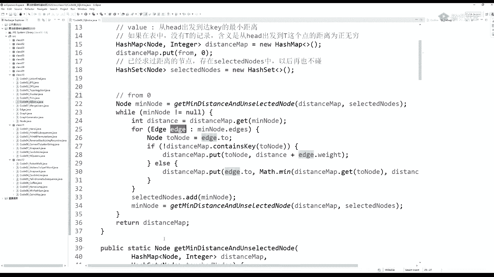
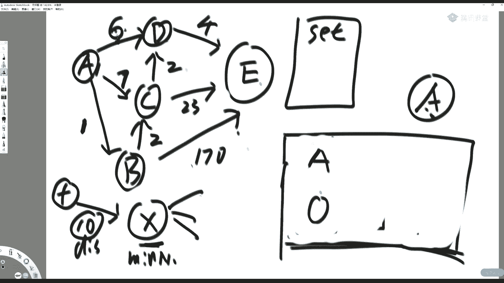
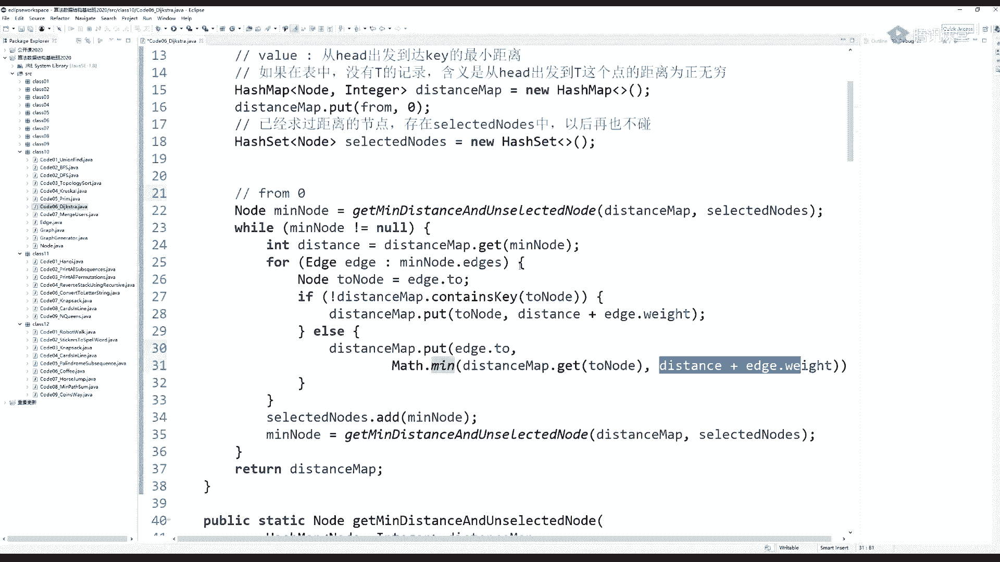
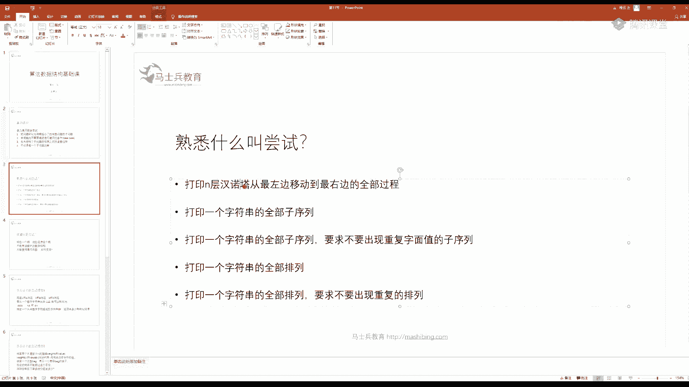
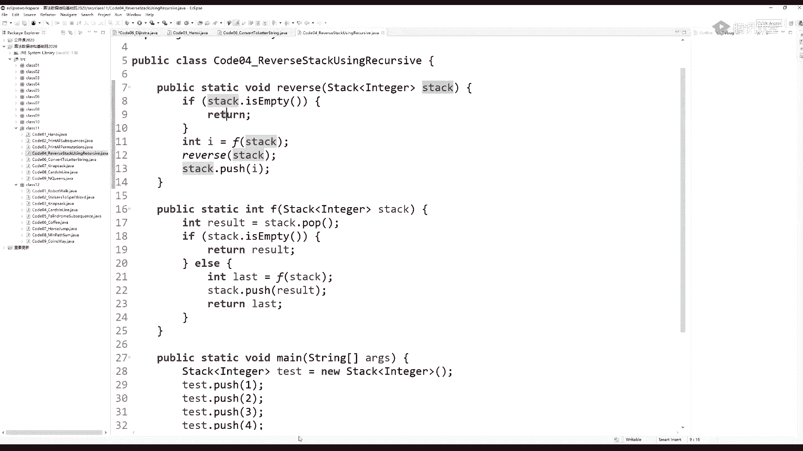

# 白嫖到马士兵教育价值23980的MCA架构师课程一次让你学够！ - P73：左神算法-动态规划 - Java视频学堂 - BV1Hy4y1t7Bo

大大家好啊。嗯。我们这周是结不了了是吧，得下周才能讲完了。我们把这个的士特斯拉讲完之后开始讲递归了，是吧？非以让你看到很多叹为观止的地柜设计是吧？然后但这不是重点，重点我们是要讲。动态规划的是吧。

你看我动态规划给你准备了9个题。这9个题说句实话，那可都不是瞎准备的是吧？就每一个题都说明一个问题哦嗯。唉。讲完地质特斯拉，我们就开始开。

这个递归了。

稍微再等几分钟。还有十几分钟呢，是吧？他，今天。哎，今天今天是母亲节是吧？所以大家可以给自己的。母母上大人是吧，发个短信打个电话。买个小礼物啥的。大家稍等一下啊，我先下点一下呃，先别点下哥。

我先把这关了。喂喂，大家好。嗯。有啊，一直有啊，开完基础班还要讲题呢，训练营一期一期的都要开起来，而且没有间断的，时间上没有休息的。也就是说你们下周我们把基础班讲完，再下周直直接讲题刷题啊。

直接给你讲题，给你做总结。另外再补一下什么线段数啊，AC自动机啊，这些东西可能都要讲了。能听到吧。嗯。嗯，好。嗯。给过PPT代码，你看一下群资料里啊有。打分的话。其实就是现场对你听的感觉进行一个打分。

然后我自己看着是吧，我自己看这些分。就是来感受一下大家课堂的接受水平啊。你可以直接向学习委员或工作人员反馈，说我讲的不好或者是。有什么别的问题啊？这个这个非常欢迎是吧？你说这个我现在讲课讲的。还行。

那都是年轻时候被锤炼出来的，是吧？你自己懂了不没没用啊，你得让。金主爸爸们会是吧，你这自己懂有个啥球用是吧？所以这个我们共同进步嘛，是吧？这不是满足一下子。

就确实看一下大家有哪些东西有没有感受上面有没有什么不好的是吧？我们保持沟通，别突然间一直都不统计。然后你突然间哎，那个货他妈讲的有点也不行，我去骂他是吧？你这别有有反馈机制，对不对？

每节课你都能提意见吗，是吧？嗯。😀啊，哈呵。😊，还有还有些人啊，这我有的时候换一个用户名，各种回答算法问题。有的同学说。哎，左老师，我看他有个逼是吧，他冒充你的讲法，在那讲写帖子。后来我一看不好意思。

那个逼他就是我是吧？嗯，这个。这个也会出现这种尴尬的现象，但是。谢谢大王最热心，你说？😊，嗯。嗯ん。嗯。稍微再等一会儿啊，马上开始了是吧？我觉得这节课能够把。能够把这个迪的特斯拉讲完。然后再把。

递规讲两讲讲3到4题就很不错了啊。然后我们下周就直接进入递规收尾以及动态规划，给你做一个系统性的打底是吧？所以打底就是基础知识的建立。那么我整个动态规划，我计划用。

大两节课啊两节半课给大家说说的清楚一点，就5个小时吧，对吧？这个是。我可能还会给临时加一道题是吧？这都是很便于你理解的那种例题或者是很经典的题啊，让你理解什么叫动态规划，好吧。嗯。

今节课上完能面字节跳动吗？我觉得没问题。我觉得没问题。但是你得保证你都吸收了是吧？这你说你刚上完课老师是吧，我我听完你的课之后，我明天就要面字节跳动是吧？然后你告诉我没问题，我要面不上。

我过来骂死你是吧？别别别是吧，这个你还是要吸收一下是吧？刷le的 code啊各给大家提一点建议啊。这个把录像看开。这个大家刷刷力的扣。就是。你你自己在刷的时候，你至少要保证40分钟独立思考。

然后去写代码的时间。然后是40分钟，毫无毫没有任何头绪。他那个lead code不是有那个讨论板块吗？你找讨论板块投票数最多的回答，那里面大部分是最优解。你就看一下人家怎么写的是吧？

然后你就找到一些启发的点，然后把它学会。当然，不得不承认的是，即便是lea得 cold的投票最多的帖子，也有很多不是最优结。但是我看基本上。七成以上它是最优解啊，七成以上它是左优解。所以你就看就行了。

我的课上也有很多dd code上帖子里面讨论，根本没讨论出最优解的，只是一个优良解。但是我找到更好的解，我会给你讲啊，但是刷一 code大体的一种技巧，就是说你总你总得给自己留出一些。自己想的时间。

不然的话，你其实一直在背思路，这个其实非常不好啊，你至少要一个人折腾个40分钟，半小时到40分钟，自己去写一写啊，没有任何头绪了，你再看答案就会比较好是吧？嗯。

他那个他那个lea code上面的那个讨论板块里。投票数很高的那些回答。其实他的他的算法就是说能够保证你lea the code的测试的t case能过，它未必是最优解，但是已经足够优良了是吧？嗯。

这种还是非常值得学习的。然后你要是你要是面算法工程师啊，你这个你不仅要掌握我现在讲的这种基础算法。你还得去掌握算法工程师所自己所所所需要具备的，比如机忆学习跟数据挖掘的那一块的知识，对吧？

这个它属属于我我我在课上讲的只是基础算法，就是你不管在面什么岗位，只要你是写code的，你都是需要会的这些问题。但是。你比如说你去面图像算法工程师，那你至少要把图像算法专项领域要搞搞清楚吧，是吧？

你比如说你去面机学习数据挖掘，那你至少把概率型算法那些什么模型这那的是吧，你得搞清楚吧嗯。哦哦。进阶课多久能上完？说句实话，这个。现在我目前为止计划的进阶班已经到三期了，我正在做PPT也正在备课。

也就是说每一期的进阶就是我们基础班上完之后，要接下来讲进阶班，进阶班所谓的就是训练营也不分的是吧？如果遇到一些经典的基础知识，也比如说线段术，一些比较高端的数据结构，我会给你现场讲给你练题。

如果要是没有分类的呢，那就是高频题目直接给你刷，就都放到训练营里。基础班讲完之后直接讲开始讲训练营，没有中间没有休息，就是这周上完，下周直接来，就那种是吧？那么你像这个这个训练营能够开多少期。

其实可以非常多期。但是基基本上会把我要讲的技巧集合讲讲完。就是前两期训练营就能讲完，后面几期训练营就是在不断的强化我们学过的基础知识的敏感度。这个练习。我之前也讲过这个问题是吧？你会了基础知识。

你不一定把能把题解出来，原因是什么？原因是因为你对这个东西可能不熟，或者它应用场景没有体验。甚至有些题目你会发现特别天外飞仙是吧？我靠，他怎么就拧到这个结构上去把它解决的。这就属于敏感度的问题啊。

这个东西其实大量是靠练习的，但是通过我教的话，也可以让你建立感觉啊。所以回答你说进阶课多久能上完，可能永远也上不完。但是对于你要熟悉的面试过程中的所有技巧，其实我们三期班就已经觉就已经能够让你。

得到刷题的过程中需要的得到的所有技巧了，这个时间差不多是。再过两个月。再过再过两个月一个月吧。对，再过一个月。那么我们这个训练营的两期也就讲完了，对吧？再过一个月训练营的两期也就讲完了。

技巧级就给你挖空了。啊，以后你再遇到什么陌生算法，对你来讲就属于一种专项算法了。比如说啊这个啊我已经了解了二叉树了，我了解二叉树的地归套路了，我了解KMP了，我了解mynaature了是吧？

我这些我都了解了。就哪怕以后你面对一个陌生算法，比如说AC自动机。那你通过自己读帖子，你是完全可以理解的，理解这意思吧？啊，就是他对于你的学习上不会有任何的障碍了，就达到这种水平。

当然我们课堂是讲AC自动机的啊，我们课堂是讲AC自动机的。😡，我只只是举个例子，以后再遇到小的一些算法的小小模块啊，临时遇到一个很小的算法，其实你可以理解它啊，你说这个算法这个世界实在是太多了。

我要是都跟你讲尽，其实。可能我们讲一年未必能讲进是吧？但是你面试的技巧集合其实是有穷尽的啊，是有穷尽的。比如说我我很多很多很多开这种算法班的老师，他可能就是就只关注那点一亩三分地，其实很就已经够了。

比如说我跟你去扯一些蛋，大家都是都搞全前端框架是吧？某著名的前端框架叫react，有多少同学用过？这里面。这里面有个核心技术，对吧？这里面有核心技术，就是你浏览器在刷新的时候。

它怎么判断你哪个组件刷新了哪个组件没刷新的，它有个时间窗口去刷新你的前端的渲染，对吧？这里面他用到什么算法了？我告诉大家两棵二叉树的编辑距离问题。😡，巨他妈难的一个算法。

而且华人在这个中国人在这个算法领域是非常强的。比如说周那个张氏算法，周莎莎算法，这都是我没有在湖边，你自己去查论文，都属于两二叉树的编辑距离问题，研究的非常牛的人。😡，你需要去搞到这么专专精吗？

你不是这个领域的专家，你根本没有必要搞，难道这些我都给你讲吗？那是不可能的对吧？所以我们就用最功利的想法，面试的技巧集合是有穷尽的，算法本身是无穷尽的是吧？😡，嗯。可能同学你不你不玩这个react。

你都不知道我在说什么，是吧？😡，然后再给大家报个黑幕是吧，这个。也不是黑幕吧，是吧，自己发现了一些小点react当时出来的时候，他号称自己是吧？在一棵树里面编辑代价能够B个ON，实际上并不是。

它是一个B勾N平方的算法，而且很丢人的是facebook搞这个react的框架，它底层的算法包是google的人给他写的4000多行的一个大文件里面用到的所有算法，google人帮它写好了。

facebook人用这个算法包，对吧。哎，你跟我扯什么淡啊，是吧？你都是千年的狐狸，跟我聊什么聊斋是吧？你自你自己写嘛，对吧？你让co狗给你写什么，是不是啊？😊，嗯。嗯，然后。算了，不说了。

有早些年跟re开发社区的人有过撕逼是吧？完了没思过我，他们就选择不理我是吧？嗯。好吧啊，这个这点掐了别播啊，这样得罪人啊。好啊，这个。

啊，我们来讲这个都到了吧。来，我们来讲迪确特斯拉算法是吧，这个啥意思？说白了呢就是。在一张图里。这张图。必须要求边的全值不为负。而且是其实有像图无像图倒无所谓是吧？你可以认为是有像图。

也可以认为是无像图，这都无所谓。你我我举个例子，这样一张图。画的有点猥琐是吧？嗯，做了这么多年老师，但是说句实话，这个板书啊真的我就看完我都想掐死我自己是吧？好，那么假设A到B的全值是一。

A到C的全值是7，A到D的全值是4。B到C的全值是2C到D的啊，咱不说这个4是吧，不说这个4。觉个也可以。然后2到C到D的全值呢呃。这个这个不是别人46啊。然后C到D的全值呢是2，然后B到E的全值。

这条边是170。C到E的全值这条边23D到E的这条边全值是。4。那么这样一张图呢，它就是一个。没有全职没有负数的一张图，对吧？那迪士克斯拉解决的是什么问题呢？

迪士克斯拉想问你的问题是你必须给给我一个出发点，迪斯克斯拉一定要给我一个出发点。比如说对A来说。我的出发点就规定好是A，当然你也可以规定它是C，它是B或者D什么无所谓是吧？

总而言之就是他要求的问题是我这个出发点到所有节点的最短距离是多少？求这个问题。那我们知道这个客观上来讲，它的这个客观上来讲，我们先不设计算法，我们就用肉身来看。那么你。A到A的距离肯定是零嘛？

对吧那么你A到B的最短距离是一嘛，那么A到C的最短距离应该走怎么走呢？从A走到B是一，从B走到C是2，所以A到C的最短距离应该是3，对吧？然后A到D的最短距离，你你你可以从这走到6。

但它没有从从从A跳到B，再从B跳到C，再从C跳到D这样省，因为它这样全值是5，对吧？然后我们看A到E的最短距离是多少，应该按道理来讲是从A跳到B跳到C跳到D再跳到E是最短的。

这样的话它的全值就是5加4就是9嘛。好，我最终想要返回这么一张表。就是我敌着特斯拉想要完成的工作啊，你必须给我指定一个出发点。然后我告诉你在这张图中，这个点到所有节点的最短距离是多少。

如果这个点无法到达某一个节点，那就说它最短距离是正无穷。😡，在我们这个图里面是都能到达的，但是有些图里面可能到达不了，尤其它是有像图的话，真可能到达不了，对不对？😡，那就是说他那个距离是正无穷。好。

理理解迪克斯拉想做什么，同学打个一。😡，好，有的同学这个。祥龙同学其实他这个已经比较高端了是吧？在说的这个这个问题，的克特斯拉跟商旅问题有什么区别哈。在在这里面商旅问题我们是会讲的。

而且商旅问题非常的难。商旅问题属于动态规划里面顶级难题的那一类。就是我们日常说的那个TSP问题。那么给大家先博文强制一下TSP问题是说的什么意思？TSP问题指的是。我。我有一个旅行家。

或者说我有一个邮差，我一定要走过所有的城市，最终回到某一个城市。就是我我规定我我从一个城市出发，我最终一定要回到这个城市。但是沿途所有的城市只能经过一次。请问总距离怎么最短。

和我们迪列特斯拉完全是两个问题？😡，呃，大家听明白两个问题，不同的同学打个一。啊，TSP问题指的是我一个我我我从呃就就这。TSB没是这样的啊，就是。😡，我认为我的图一定是全连接。😡。

就比如说我有N个节点，我随便一座城市到剩下的N减一个节点一定有路。😡，这是他一个前提，就是我商旅问题就是我我认为所有这整张图是全连接的情况下，我从一个城市出发。😡，转一圈回到原城市。

但是沿途的节点只能经过一遍问你最短距离是多少，这是TSP问题要解决的问题。😡，啊，除了出发点，最后要回来之外，中间的剩下的所有点都只能经过一次，怎么样距离最短？😡，嗯。啊，那TSP问题指起点需要指定吗？

大家想一想起点需要指定吗？TSP问题是你转业圈最后回到这个点。😡，它不就是一个环嘛，对不对？你不管指定城市是哪儿，这个总距离肯定是不变的。所以TSP问题是不指定出发点的，因为没必要，因为它本来就是个环。

😡，听明白他们来打一。啊，这个这个问题啊，我们留在这个动态呃，不留应该留应该绝对是留在这个训练营讲的啊，绝对是有留在训练营讲的。而且说句不客气的，我现场手撕TSP不会出错是吧？

这是在是在某次上课的时候是吧？这个电脑死机了是吧？突然间换一台新电脑给大家讲TSP我操，没有代码，自己现场手撕，还写了个对数器过了是吧？现在想想我操，真是。哎，要是我现在讲课。

我绝对不这么干TSP问题太容易出错了，是吧？现场首次能过的也都是运气是吧？运气。😊，这个装了个逼是吧？好，我们来讲回这个迪J特斯拉算啊嗯。那么我们我们呃说一下这个这个算法。

其实这个算法在流程理解方面也是很简单的啊，也是很简单的。我们来现在来展示一下它怎么做啊。你要注意我为什么规定没有全值为负数的边，这个它是一个设定啊，因为它这个全值为负数的边出现啊。

它就意味着你有可能有全值为负数的环啊，啥意思？你比如说我正常来讲一个一个东西它走向B是吧，B走向CC走向回来了A。我这是三，我这是2，我这是一的话，你说你A到达每个节点是不是有唯一的最短距离啊？

对吧我A到B的最短距离是3，我A到C的最短距离是5嘛，只能从A跳到B再跳到C嘛。😡，对吧。如果你说你有一个负数的环，那就那就那这个问题就没有答案了。我这是负7，我越赚越小越赚越小，我是不是富无穷了？😡。

对吧你就先转个100万圈，然后你再到达B100万圈不够，你再转个1000万圈是吧？😡，这是这事这事儿就没头了，理解吧？所以我们迪丽特斯拉用的一个潜台词，就是你不能有全值为负数的边。

这是一个这是用迪瑞特斯拉的一个常见的设定啊。当然也有的同学说，这个哎我可以要求有全值为负数的边，只要我没有出现全值为负数的环不就行了吗？对吧？你比如说这个A到B它是-一，但是B到C呢，它是2。

然后A到C呢，它是5，对吧？我没有出现全值为负数的环，是不是也可以求最单元最短路径问题可以，但不是dele特斯拉。😡，叠特斯拉就要这个算法能够执行的前提条件就是没有负数的边。虽然说没有负数的环。

我是可以得到一正确的答案的，但不适用叠勒特斯拉做啊。😡，好，这么多设定是吧？加了好多的定语，那都是为了让我们的思维更加的严密一些。有一张表，一开始先有一张表。这张表完全是对A负责的。

一开始这个张表里面只有一个记录，那就是A到A的节点距离是0。没毛病吧啊，一开始这张表里只会有一个记录，A到A的距离是0。那么A到B的距离就认为是正无穷，A到C的距离就认为是正无穷。

A到D的距离就认为正无穷。A到E的距离就认为是正无穷。因为我现在还没有开始走嘛，我就是先认为你们都不可到达。😡，可以吧？好的，也就是说你一开始先在这张表里面增加一条记录，叫A到A的距离是0。

剩下A到所有的点的距离都是正无穷。接下来。在这张表中选一个最小的记录出来。就是他。好，我就选了A0出来。A0代表什么意思呢？代表我从原节点出发到此时的A距离是0。那我就要看从这个A。

当前的这个A还能跳向哪些节点？我就会发现我从当前这个A啊。我可以承受一个一的距离去跳向B，也可以承受一个七的距离是跳向C，也可以承受一个6的距离去跳向D。是这意思吧？我A到A的距离是0。

所以我如果通过当前这个A往外跳的话，我就可以更新原本的原节点到美到BCD的距离了。我原来是正无穷，现在我通过A的跳转，我也找到了一个0加一的距离。那就是一。我再通过当前A的跳转。就是0加7的距离。

那就是7。我再通过这个A跳转，那是0加6的距离，那就是6。因为这个桥联点的出现，导致我。原来到原来原点出发到BCD的距离是都是正无穷，现在他们变成了176。好的，结束了。关于这个记录就使用完了。好。

你要注意，当你使用完了一个记录的时候，他在表中永远别碰它了。他在表中永远别碰他了，他被锁死了，这个玩意儿永远放在表里，但你别动它了。😡，然后你再剩下的。😡，记录中再选一个最小的出来。B1。

那B一是什么意思呢？从原点出发到达B的距离是一。然后我再以B作为桥连点往外跳，它能跳出哪些呢？它有一个走向二的距离是到C的，有一个走向170的距离是到E的。我就看我这个桥点点的出现。

会不会更新表中的某些记录。因为我从A跳到B这个调梁点，它是一的距离，而我从B再往外跳到C的话，是二的距离。所以我从A到C的距离就有一个三的距离了，一加2对吧？这个一加2嘛。

它是不是比原来我一我我从之前的调梁点跳到C7的距离要好啊，所以就更新。😡，如果它没有变得更小，就不更新。那我就可以把七这个距离就变成3了。这个三是怎么给我的？是通过B这个桥连点往外跳跳出来的。😡，好了。

我们再看B这个桥联点跳到E呢，它有个170的距离。那么我从A到E原来是正无穷，现在就能多少？A到B的距离是一，再从这个桥梁点往外跳，就会得到171，对吧？好，更新它，因为它正无穷。然后B的工作就完成了。

擦掉。你使用了哪一条记录，你就在表中把它锁住，以后再也别碰它了。再也别碰他了，既下来你再再在剩下的东西里面拿出最小的记录来C3。C3什么意思呢？就是你通过原点出发跳到这个C的桥梁点，最小距离是3。

我再看看从这个C以它桥梁往外能跳多少。两条路，一个是我通过二的距离跳到D，一个是通过23的距离跳到E。那我来看一下有没有更新最短距距离。我原来通过别的桥梁点跳的是A到D的距离是6。

现在我通过C来跳转的话，A到C的距离是3，它跳的距离又是2，所以3加2等于5能够更新这个6，我就更新。我们再看原来我到A到E的距离是171，我不知道是之前哪个桥梁点跳的，我也不关心是之前的哪个。

我现在就关心现在的，现在呢是A这个桥梁点往往外跳，E是23的距离，而我A到C的距离是3，所以更新成26。😡，使用完了使用完之后，同样道理。你把使用过的记录画个框，把它锁住，永远别再用它了。

最后通过D往外跳A到D的最短距离，现在是5，而D往外跳只有一个四的距离能够跳到一。所以A通过这个桥梁点往外连到E的话，是得到九的距离，是不是比原来的26要好？是的，所以它变成9。使用完之后。

把它的距离锁死。最后你把E9拿出来，它没有办法往外跳好，那把它锁死锁死之后的记录就是迪J特斯拉要求的每个点到所有点的最短距离。😡，这就是算法，听懂先打一。这就是所谓的迪士特斯拉，它它在实现方面真的。

我们先看一种。跟贪心有什么，这就是贪心哼。😊，这就是贪性。中间过程也要做记录吧，如果有相同的呢，如果有相同的选谁都无所谓。你如果有相同的，你可以不更新。如果有相同的，你可以不你可你你你可以不更新。啊。

啊，注意啊，你整个图是没有负数的边的，所以这么跳它一定是对的。呃，直接深度呃呃，这个翔同学，我要是问问题很好。你深度优先便利，如果你能够还原深度优先便利是可以还原出所有的之路的。😡。

你用一个暴力的深度线变历是一定能够求出答案的，但是它不会比迪迪特斯拉好啊。😡，对吧。什么问题都可以用深度优先解啊，你深度优先走过所有之路，那必然是可以啊，对吧？但是它它就是它是一种相当暴力的解法了。

而我迪士特斯拉可是根据每一个拿最优的桥点点往外跳，看能不能推出下一步的最优来搞的呀。😡，是吧。😡，哦啊。啊，那么。这个这个这个算法呢，我们怎么实现啊？先给大家展示一个特别容易理解的实现。

然后我们看能不能改进这个这个改进可太值得说了，是吧？

现在先看一下迪克特斯拉一啊这个。你看我返回的东西是啥呀？哎，我我必须指定出发点，我给他改个名是吧？别head了，容易跟那个二叉树的点的名字重有歧义，这叫from，好吧。出发点就叫from。

我必须指定一个出发点。😡，你告诉我他到所有点的距离是多少？😡，那么。我当时就返回一张表。这个点。这里面是啥意思？他一律这张表啊是对from来说的对吧？一律这张表一定是对from来说的。

就是你能找到的每一个点到from的距离是度，最短距离是多少？如果某一个点在这个map里面没有记录，那就说明距离为正无穷。可以吧啊，如果某一个点在这个表里面没有记录，那就说明from到它距离为正无穷。

可以吧？啊，好，那么这张表我们要生成，我们现在就开始看这个叠列特斯拉算法了。首先有一个distance map，这就是我们刚开始那张表。😡。

刚开始我们是哪张表呢？😡，这张表啊就是里面只有一条记录A0的那张表。对吧这就是我们的distance map，这里面是哪张表呢？只有一一条记录A0。那为什么剩下的没有记录呢？没有记录。

你就认为它距离是正无穷嘛。😡，是这意思吧？啊，这张表一开始只有1个A0，这张表没有的点，就认为距离是正无穷，还没找到嘛。好，所以。😡。

这个dc map就是我们现在要玩的这张表是吧？我们依次要把它生成好。😡，他一开始from。到 from的距离为0，这肯定是显而易见的。

是吧注意看这个东西是啥？它是一个哈希表。哎，你们还记不还记不记得我们刚才说的时候，哎，我们当我们用了一条记录之后，我们把这个记录给锁住，对吧？再用下一个记录之后，我们再把这个记录给锁住。

我们是不是有这样的操作呀？那么怎么实现锁这件东西呢，我们就可以设置一个set嘛，如果里面有A这个节点，它就说明你这张表里面A的记录就被锁了，你永远不要再更改它，也永远不要再使用它。

所以我们利用的是这个set的机制，set里面有某个点，就认为它的记录在distance map里面被锁了，对吧？如果这个set中没有这个点，那就说明在它它的记录在distance map中没被锁。

所以怎么实现锁这件事情，就是我们这个用一个哈西用一个哈西表，我们看这个名字也很直白，叫已经选择过的点。😡。

或者你可以认为已经选择过的记录，这个点呢就会放到这个选择过的这个列表里去，是吧？这个set里去，那一开始肯定是我什么记录都没有被选是吧？哪怕from零我也没用到它呢，所以它这里面一开始就是空嘛。

啥也没放。然后注意。这个方法你不要看着很唬人，我靠，这个方法这么长，大家看一下啥意思。😡，得到最小距离。但是呢要是没选择过的点中的最小距离。第四次map。和这个参数啥意思？

就是你便利distance map。😡，但是你如果是选择过点的记录，你不要便利，你把没有被锁的记录中把最小的。😡，最小距离的这个节点给我拿出来。你看我们这个方法怎么实现的？😡，你看啊看着很唬人。

实际上巨简单。😡，这张ds map对吧？我有哪些点已经它使用过它的记录了，我就会放在这个touch的 nose这个这个这个这个东东西东西里，它其实就是我们slect node是吧？名字不一样而已。😡。

然后接下来我们干嘛了？我们便利这张dsance map表。一定要确保哎，它是之前没有是之前没有被选过的点，并且它的距离要最小。我们把这个点抓出来返回。所以我们看我们有这个方法之后。

也就是说哎disistance map中哪些点没有锁过，你就把这个最小距离得到的点给我，我就使用它。那你一开始就会把什么弄出来，必然是from。对吧你一开始得到这个minote的是谁。

那一定是from自己啊，因为它只有一条记录，就是from0，是这意思吧？是这意思吧？好，让后我们来看。有了这个min node了，干嘛？有了min node，我当然就能把整个记录取出来。

在distance在distance map中把这个min node它对应的记录取出来，就是distance。那么此时这个min node和d，就是我们所谓的刚才在例子中举那个桥连点。

对吧比如某个桥点点X原节点到你的距离，假设是个1，你再通过你往外跳，那么这个X就是此时的min node。那这个十呢就是我找到此时的distance啊，我从原接点from点，我我不知道是怎么连到X的。

但是我知道最小距离是1啊，然后再从X从过桥连点往外跳，是这意思吧？😡。

好，那么这个minn呀。minode怎么往外跳呢？大家看一眼min node它上面拥有的所有的边，我要去枚举，没毛病吧。比如说你为什么一开始的第一条记录是A，会往下找到D，找到C，找到D呢。

原因是因为你上面连着三条边一这条边七这条边，六这条边没问题吧。好，那么我就去枚举当时当前min node出来的所有的边，它们跳往下一条的节点呢？就是to node。

那我就要看一下了。而如果在distance map中，它就没有关于to node的记录。那说明啥意思？说明之前出发点到这个凸 no的，它是正无穷。对吧他还没有发现过距离。那此时你有什么好说的呢？

你就见上它的距离嘛，因为你是找到的第一条路啊，对吧？那怎么建这个距离呢？从from点到min node的距离，最小距离，加上此时你你现在以minode做桥连点往外跳的这个长度。😡。

相当于就是我第一次发现这个to node的时候。我就在第四次 map中啊，把这个to node的记录给它加上。那否则是什么意思呢？否则就是之前你有过记录，那我怎么办，我就看看能不能更新你的记录。

看怎么更新的。我在第 map中之前之前跳出过你啊，你之前有一个距离啊，对吧？现在呢老的距离就是原本to no的那个上面的距离。那你现在的距离是什么呢？

现在的距离是distance加上我这个作为当前这个桥联点往外跳的这个长度，取最小值来更新distance map。😡，呃如果老距离更小，实际上你的效果就是你没有改，只有说新距离变得更小了。

我的to node的距离才会改。😡。

那我把min note上面所有的桥连点都跳过一遍，是不是该更新就更新，该新建就新建了，对吧？然后干嘛？min note这条记录是不是被我使用过了呀？

我要当然要在已经选择的点中把minode加上以后再在distance map里面找记录的话，你自动给我pass掉它的记录。相当于画个框，被我们给锁住了。😡。

那下一步的minode的是啥？再在dsens map中找到没有选择的节点里，没有选择的节点里最小距离的点拿出来周而复始。最终dsance map一定能够更新成全对的样子返回。听懂他打一。嗯。Yeah。

这是为什么不只选择un selectlect node，确实只选择select node呀。你这个就这个就相当于你的黑名单。😡，理解吧？你给我第四次map，我再给你一个黑名单。

请你把黑名单里面的东西自动过滤掉。黑名单里没有包括的内容给我选出一个最小的距离返回。😡，听懂啥意思了吗？听懂同学打个一。😡，我要看一下这个方法，它就是黑名单的意思嘛？来看。

一开始minno的为空找到的最小距离为系统无穷大哦，这个这个整数最大值。我在便历记录的时候，我在便历这张哈希表的记录的时候。必须啊必须是没有碰过的点，你看。没有。没有碰过的点。

对吧并且如果此时发现你当前的distance比我之前找到最小值还要小。好，那就更新你你你现在就是我整个记录中的minode，我遍利这么一个放循环之后，是不是该了这两个变量就更新好了呀，对吧？

然后把minode返回嘛，这玩意儿是干啥用的，这玩意儿不是说在它里面选，是它是黑名单，不要选它里面的东西，理解吧？😡，我觉得写的蛮直白的，是不是？😡，唉。哎呀，为什么要求最小啊？

这这不是迪着特斯拉的算法吗是吧？啊，为什么要求最小？这不第一特斯拉的算法吗？迪一特斯拉就是你先在最小记录中桥点点跳一遍之后，看能不能更新出来更小的，然后再再选一个最小的理由之后，再能不能更新个更小的。

这迪斯特拉算法如此，对吧？好啊，那我们看啊这多余的闲拔中西也不说了是吧？迪于特斯拉就是这么一个算法。那么我们看一下这个。那你像这个题，它。

我觉得有些同学可能会需要一些简单简单的证明是吧？你为什么这这样一个策略能得到系统最小呢？啊，能得到所有最小呢，那你就证明一下嘛，我们就。

用还是用一种比较直白的理解方式来证明他。你比如说你A吧。你要当我说A到D，它的距离是100的时候。如果客观上存在一条更短的路径，能够使A到达D。而且是比这个100距离要小的。我们的着特斯拉是什么算法呀？

是A先往外连的最短距离，你给我。😡，再由他去跳桥连点。对吧这个100一开始A到D的这个100这个距离会留着。但是如果你真的存在一条更短路径的话，我们的算法是我A它的它到它的桥梁点的最短。

先去结算这条记录，再由它往外跳的桥梁点选一个最小跟整体选一个最小，对吧？😡，你你如果真的存在一条客观上到第的最短路径的话，我们迪克特斯拉这个算法一定能够逼近到这个地。😡，我已经贪心证明。

严格证明可能就变成了回字有几种写法那种在数学语言上极度精确那种证法了。我相信大家不会愿意听的。但是你可以理解说，如果我真的存在一条更短路径的话，我这个算法是可以帮助我找到它的。

你不就是每一次选最小桥连点往外跳嘛？不就这么回事吗？你又没有全职为负的边，这个算法没问题啊，听懂条员打一。😡，对吧。好嗯。哦，我感觉到很多同学问问那个那个疑惑，是因为这个证明问题是吧嗯。😡，嗯。好啊。

那么我们现在看一下这个。他他为什么需要改进？😡，原因是。你每一回是不是要便利好多距离选出一个最小啊？对吧我们来举个例子。比如说你A，我们现在换一张别的图啊，A到B的距离。9A到C的距离。7A到D的距离。

3A到E的距离14。一开始这张表中啊。只有一个到A到A的距离是0。然后你把这个桥梁点拿出来之后，A0这条记录，你拿出来之后，你就去跳吧，你跳出个啥到B的距离，9到C的距离7到D的距离3到E的距离14。

然后为什么这个这个这个需要优化呢？因为我每一次选最小值，我是便利这张哈希表的。😡，不够快，对不对？😡，但是大家想象一下，如果用堆呢。用堆啥意思？搞一个堆。来。这个堆是个小跟堆，就拿距离做小跟堆。

是吧就拿距离做小跟堆，这个小跟堆。这个小跟堆啊一开始只有A0这条记录。然后把这条记录弹出来了，对不对？😡，A0这条记录弹出来了，然后我去做桥联点。😡，A到B的距离是9。

那就写一个A到B的距离是9A到C的距离是7。哎，小跟推会自动帮我组织C放到这条记录放在上头，对吧？A到D的距离是3，所以小跟推会自动帮我组织到D的距离是3A到E的距离是14。

所以小跟推会自动帮我组织E到14，你感觉很爽，对不对？我靠，这样好爽啊，我下一回选最小距离，直接从小跟堆里拿了。😡，但是这个小跟堆它比较特殊，它为什么特殊？😡，比如说你以C去做桥联点的时候。

它到E的距离有一个E的距离。你说你会。😡，啊，不好意思啊，这个先弹出的是D的距离啊，对吧？你举举个例子，假设你到D的距离，它到E呢有一条E的边。😡。

你会看你会发现你会你你有一个需求是要改小跟堆里面已经进去的距离。😡，为什么呢？D三出来了，对不对？😡，D三出来了，对不对？而你D呀往下跳，它有一个到E的距离是一。😡。

其实你是需要在小跟堆里面把E14改成E4。因为三加这个一是4，哎，你是临时要改E的距离，还得指望小跟堆把它调对，对不对啊？😡，你要上到这儿的。😡，这意味着系统给你提供的堆做不到。

只能因为你已经上堆的东西参与排序的玩意儿，你是要改它的，然后你还指望都调成小温堆，系统提供的实现不了。😡，听了他要打一。理解吧，系统提供的实现不了。😡，但是如果你想象一下。😡。

你如果实现了一个可以改动的小跟堆，就是你你临时把某个记录的值变小了之后，你还能让他自己手动自己写一个小跟堆，把它调对，你是不是就不用便利了，那就真的是不用便利了。

那就会比原来便利哈希表的方式选出最小距离要好的多，这就是我们DJ特斯拉要改的地方。😡。

看版本2。我会给大家讲的非常的细，因为我这个代码写的非常的。容易理解，上面都不用看，大家只用看主方法，就这么短。啊，我们先介绍一些东西。主方法就这么短啊，你你你现在可以按照黑盒来理解。

现在我要改的这个堆啥意思呢？这样的啊。😡，我现在说啊，大家看一眼这个这个堆里面放的是啥啊，这个堆。它里面放的。就是按按照组组织一些小跟堆放呃，组织一些记录放进去啊，组织一些记录放进去。

然后你现在对你来说啊，你不用想这个堆它内部是怎么实现的，先不用想这件事情，你现在就想一件事，就是你要需要什么功能，你需要这个小跟堆给你什么样的功能。😡。

他给你的功能是。举个例子。假设你有一个小分堆。😡，首先你得有个功能，是新建一条记录，对吧？比如说我从from这个点出发。😡，当我通过某一个点跳出来说，我到X距离目前是假设1。

我这个小跟堆需要能够接收这样的记录，而且是通过后面这个值来组织的小跟堆得有这样一个接收的，就是I的操作，对不对？😡，得有个I的操作，对不对？😡，能方便我把这个X10放进来。如果还有其他记录的话。

那么这个十将根据其他记录去PK，这个X10会来到堆上的某一个位置，没错吧。😡，所以需要一个爱的方法，这个小分队你还需要一个什么方法，还需要一个up day的方法。😡，为什么呢？

因为你比如说就像我们刚才那个例子，假设啊我原来到Z的，我我从from点到Z的距离是100，我中间某一个桥连点。😡，from到这个桥梁点的距离是7，但是这通过这个问号跳到Z的距离呢，只有3。😡。

所以我现在要有一个update的一个操作，就是我把到Z的距离更新成10，原来是100，对吧？所以我还需要一个update的方法。😡，而这的方法就是你你自己把Z的这个100啊改成10，然后呢。

你找到这个Z的这个位置，在堆上的什么东西，位置上，在在东在在这在这个堆的哪个位置上。😡，它的值变小了，它在堆的那个位置上往上做hiop insert调调整。所以那个小关众还需要一个upd的方法。😡。

没错吧。那你这个小关东还需要什么方法呢？😡，还需要一个方法叫。就是。exor方法啥意思？为什么我还需要一个exel忽略方法？😡，因为根据我们的说法。😡，一个节点的记录一旦被弹出。😡。

相当于这个记录我们以后永远都不要动了，对不对？😡，我给大家举个例子，大家就明白了，我从A出发。😡，我一开始有一条记录，A到A的距离是0。😡，A通过B的桥联点，它是三的距离。B通过再跳到乙一的距离。

跳到C的桥梁点，结果C又跳回来是五的距离。大家想象一下，我一开始已经使用了A0这条记录，小跟堆里它应该是没有再也没有A这条记录的了。但是你有没有可能从C当时跳的时候，它又有一个五的记录，又能跳回A。

我们小跟堆要能够识别说当我想把3加1加5，当我想把生成一条记录，3加14再加59，我想把A9这条记录重新扔到小跟堆上去，应该失败。为什么？因为你原来弹出的记录。A0，你已经是关于A的记录。

你已经再也不需要去操心了。如果有朝一日转回到某个一个，你已经不再操不想再操心的节点上，甭管这个距离是什么？甭管你小跟堆上有没有，你都应该exor。😡，就这么三个功能。听懂他打一。

对吧只要你的堆能够实现爱的方法，upate的方法或ex个闹方法。😡，你这事儿就就干就干完了嘛，对吧？除此之外，你什么都不需要，就需要这三个。好的，大家看。😡。

这就是我的堆。我堆的我堆的记录是什么呢？😡，当我某一条记录要加进去的时候。😡，一开始加入headd到head的距离是0。大家看这个方法牛不牛逼是吧？😡，这个记录如果真的是需要新加的，你就给我去ad去。

这个记录如果它已经存在了，我需要更新它的记录的话，你就给我update去。这个记录如果是不更新的话，我就认为你现在调这个方法，我就当你是个P给你放了一个no方法。

直接一个大名字ad or updateate or一个no。😡，听台打一。所以我们看这个代码，你其实非常好理解的，怎么样呢？你一开始的原结点到自己的距离，到到自己的距离，在小跟堆上是零的距离，对不对？

好，你就把这条记录加进去。😡，然后注意看。每一次在小跟堆里面弹出一个记录，哎，这个记录是啥？很简单，这个记录就是当前节点是什么？😡，原节点到它的最小距离是多少？给你封装成。

我管它叫node record这么一个东西。所以你看这个方法它很短，说的是什么意思？就是我从小跟堆里面，我弹出一个。😡，当前小跟堆里最小的记录。😡，弹出了最小的记录，而且它一定不是之前已经弄过的记录。

😡，弹出了，然后以它做桥连点，我看看能不能更新to的记录。如果这个to的记录压根之前就没有，你就给我艾去。如果这个to的记录之前有，并且它现在这个距离是更短的，你就给我upd去。

如果这个to是之前我搞过的记录，它只是之前弹出的话，你就给我ignor去。😡，每一次都是ar add or update or ignore。😡，然后我再把这条现在目前出来这条记录是不是已经是答案了。

对吧？当前这个点到原起点到它最短距离是不是已经是答案了，放到redo里面去，最后把redot返回。😡，所以我就扔给了一个特别傻瓜的一个结构，你给我艾或update号或igor，我主函数根本就不操心。😡。

这个主流程看明白同学打一。接下来我们再想一下这个小跟堆该怎么实现不就完了吗，对不对？😡，对吧。是吧好，那么这个小跟堆怎么实现呢？😡，看一下。小跟堆里面。它有一个node类型的数组，这玩意儿啥？😡。

堆结构。这个东西是啥？😡，如果一个节点。他再堆上。😡，那么他的记录这个位置就是在堆上的一个index。他就有下标。😡，比如说这个一个node，它在7位置，那就认为它在堆的实际结构中在7位置上。😡。

如果一个node，它后面是-一的话，就认为这个node曾经进来过，但现在不再堆上。那你说这样的node是不是就是你需要一个node呀？😡，听台打一。对吧。这个方法我给你讲过吧。

我们在第讲堆的那个章节的时候，给你拆析过类似的结构。当时就给你讲了一个怎么手写改堆的。现在我们继续重复再来重温一下手写改堆这件事情，就这个目的。😡。

所以这张表就是说任何某一个节点value上是指它在堆中的位置。😡，如果他曾经他有记录，但他记录是-一，就表示他曾经进过堆，但现在不在，那只有一个可能性，就是他进来之后就弹出了嘛，对不对呀？😡。

所以用这张表就来维持我们刚才说的那套东西，还有就是。原节点。啊。原节点出发到该节点的目前为止的最小距离distance map。啊，原节点触发到该点的最短距离，我们管它叫dsin次 map。

然后堆上现在收了多少个点，就是size，就这么四个东西在那玩儿，看怎么玩的。初始化的时候。你给我一个size，我就给你建这么大的堆。😡，对吧你给我个size，我就给你建这么大一个堆。

应该说准备这么多的空间。但现在目前为止，这个空间上没有任何堆的范围，因为你的堆的size是0，是这意思吧？那你一开始什么记录都没进来，你当然不会你当然这个在堆上的距离表呃。

在堆上的位置表就是空的dsance map表也是空的。对吧我们先看一些小方法，比如说怎么判断这个堆空了。你接收的节点数量是零就是空的对吗？😡，容易吧，我们再看这个。哎，怎么知怎么知道一个节点进来过。😡。

怎么知道一个节点之前进来过，就跟我们说的。😡，如果这个节点在堆中的位置是有记录的，表示你进来过堆，不管你这个记录是-一也好，还是一个正常的下标，从零开始的也好，只要你有进有有过这个。😡，堆位置的记录。

你就曾经进来过我这个结构。所以就这么判断吧，你是否包含这个之前有个记录，甭管它是负一还是什么，只要你有记录，你就进来过。😡，哎，怎么判断一个节点是否在堆上呢？😡，首先他必须进来过。

并且他在堆上的位置不等于-1，就说明你再堆上这两个小方法，看同学打一没能打2。😡，好，那么接下来我们就要看这个。最关键的两个方法了，一个就是ad or update or一个no，对吧？

还有一个就是我们的pop方法，在小分堆里面拿出一条记录返回，拿出最小的记录返回。好，都是怎么做的，先看。😊，我现在是关于node，它的距离，现在目前为止发现的距离是distance。😡。

对吧这个n这个dist不是说我现在最选最短距离，不是它是说n现在有一条新的距离是distance。你要跟你如果它没有这条记录的话，你给我新加。如果它有老记录的话，你要比对之后选择最小值作为它的距离。😡。

如果是他你不需要操心的东西的话，你就当他方是个P给它放掉，对吧？我们看这个node，如果它压根儿就在堆上。😡，他已经是再堆上的了。😡，怎么办？😡，那就把它在diistance map中关于它的记录。

它的老记录和此时出现这个新记录的最小值作为它的最新记录嘛。没错吧。😡，然后我们怎么调整呢？你有可能距离是变小了哟，所以请你在堆中从你现在的位置开始往上做infert黑fi的调整。

infert往上你有可能变得更小。所以你要跟你的副节点PK看你能不能往上移动。😡，再堆上手的调整。如果他压根儿就没有从从来就没有进入过这个堆呢。😡，那你就把当前的那就是要新记录，对不对？新记录干嘛？

在堆的最后的位置把节点挂上。😡，那么这个节点它现在在堆的什么位置啊？在size位置上。😡，它的距离是一条新记录，也就不无从PK起，你就把它挂上就完了。😡，那就是说从堆的最后一个位置把它添加上的，该干嘛？

依然是insert黑fi的调整嘛。😡，这两个义服如果都没中，你说啥情况，就是他既不在堆上，他又进来过。😡，什么也没干，直接返回，因为你本来也应该一个or。这细节看清楚，同学打个一。嗯。

但是你如果从来就没有看过我关于堆的那节课，那你真的是听不懂啊，好好去把堆那节课看了。我的这些东西我之前都给你讲过，只是又我们又重温了一遍。😡，好。这就是我们的ad2 update二gon。

那我们怎么泡泡呢？😡，你是小跟堆，你说你应该怎么泡泡，必然是堆零位置的节点是。当前这个距离中最小的节点的记录，对吧？这个节点我们是知道的零位置的节点。它的距离是什么呢？

当然是在dis distance map中把它关于它的记录给拿出来，封装好。作为我的node record，最后给用户返回用户得到的是一组record对吧？这个record就是node是什么？

当前最小距离是什么，是吧？但是在返回之前，我们是不是还得调整啊？有关于堆的操作怎么调呢？你都要弹出堆顶了，是不是拿最后一个位置的东西去顶零位置的东西。是不是要把你看你这样swipe之后。

原来零的东西就来到了size减一，原来size减一的东西就来到了零位置。😡，你现在即将要弹出了，你是不是应该把原本的零位置的东西现在在size减一上把它标记为它现在马上要出堆了，改成负一。😡。

dens map中你要删掉关于他的记录，因为他即将要p泡出去了。但这个我这个这个负一我要留着表示你曾经爱过是吧？曾经进来过，但此时你不再堆上了而已。😡，然后我们要把size减一位置的东西给释放。

因为原本零位置的东西被换到了3的点击上，现在我要不要它了。😡，那你那你原来size简易的东西，现在来到了零位置，你是不是要从零位置开始往下做hyf的调整啊，这么一套东西都弄完之后给用户返回。😡。

你只要理解什么是堆排序，你就理解什么听懂同学打一。😡，每次调整堆不也是复杂度吗？是的，但代价是什么？我原来便利哈希表，我是要通过N条记录，现在我都是在堆上玩，原来是BGON，现在是logN。😡。

这就是为什么要改成手写堆的形式，它就是快，而且快多了。😡，小龙同学听懂啥意思吧？我原来可是在哈西表，我不我不组织，我就散着瘫在那儿，你给我找，你给我便利，我每次都承担一个便利，我每次都承担一个便利。😡。

现在是什么？现在是我在堆上调完之后给你拿堆顶，那代价能一样吗？😡，对不对？理解吗？小龙同学。哎呀，这咱。logN一般情况下也没多少吧。对呀，没多少啊，但是logN可但是BON可可可能很多，对吧？😡。

我假设我记录就是二的32次方，你每次便利吧，是吧？我log n水平，我每次做32次，我能出来，那你B goN得弄到什么时候去，是不是？😡，好。那么接下来就只剩两个。

就你像这个hpinert黑fi这个代码你见没见过，它根据什么来往上移动啊？这个位置它的距离表如果更小了，它就往上出溜。这代码熟不熟啊？😡。

这个距离这它它这个当前index位置跟它负节点的index这个距离如果变得更小，它就往上移动。这代码不就是黑不隐，就是堆的隐色的调整代码吗？黑白饭你熟不熟啊？

小跟堆找到左右两个孩子中最小的那个跟我去PK。如果如果PK没PK过，没PK过，那我就往下沉。这个代码也就是当时堆排序的时候，黑byf的代码熟不熟啊？😡，嗯，不要忘了。交换的时候。

在堆上两个东西要交换位置，你既得既得在堆上交换，也得在堆的位置表里交换堆的位置表跟堆一定是同步调整的，不然的话你找记录就找找乱掉了。😡，我们一律把黑op音就是堆堆的位置表的更新和堆交换的更新封装在一起。

要变，你俩一起变。😡，整个打完收工。看看同学打一。啊，这里面乘除怎么不写成位移，可以写是吧？可以写啊。可以写的啊。好啊。那这个就是我们地质特斯拉的改进是吧嗯。就以后我们又熟悉了一把以后你会发现。

如果你使用堆的时候，已经上堆的东西，要临时改它字段，你就自己手动撸啊，我们已经建了两回了。要会写啊，自己要练练练透啊，因为这种这种技巧真的。它最巅峰的题是一道网易的面试题。啊。

你们有有就在训练营里面好好讲一下那个题，我操那个题要是搞懂了。你就是堆着爸爸是吧嗯。好啊，那个真的那道题是我见过以来考堆考的最他妈变态的一道题。他用了5种堆，5个不同结构的堆。

而且有一些堆要你自己手写啊，太牛逼了是吧？这个我我要是出这种题，我他妈恨不得抽死我自己是吧？但人家网易就考是吧？好，我们接下来呢就要开始搞这个暴力递归的问题了啊，我们休息2分钟，然后继续啊。嗯。啊。

随问了问了啥。😔，嗯，大家把之前的视频看看好，好吧。你把我之前视频看了，我刚才理解刚才我们讲那些真的是一点压力都没有这个已经看过视频同学发表一下感受，觉得一点压力都没有。同学打个一。之之前看过课的。

真的去练过的，就把我代码都摸过一遍的。不不赞同打2是吧？😡，就你只要看过视频，真的一点压力都没有。我当时课上讲的非常的细，理解吧？就真的是巨细无比。就手撕堆这件事情。

我们之前的课用了一个多小时讲过一遍了，其实好吧。😡，啊，那你说你说已经到了基础班了，你你还跳课过来看是吧？那那真的没法讲啊，那这课永远在扯之前的那我们讲到啥时候去啊，是不是？😡，啊。Okay。暴力帝归。

其实它就是尝试啊，大家不用想什么分制啊，或者是什么回溯这些词都是啥意思？你就是一个问题，你把大问题搞成小问题，小问题给你返回一些信息，他妈就是回溯是吧？😡，大问题拆成同样规模的小问题。

小问题给你返回的信息，这就要回溯。😡，对吧你把一个大规模东西拆成小问题，本身它就要分支是吧？这这个东西你不用继承的名词，你就是把一个大问题拆成小规同样问题，同样同类问题的子问题。😡，然后呢。

你这个问题小到什么样的规模就不需要继续了，它就是终止条件base case。😡，你得到了每一个子问题的结果，那就回溯完毕，你怎么做决策，就是回溯完了之后做决策，加工出大问题的信息，往上返回，这就是递归。

这就是尝试，对吧？😡，暴力什么体现在哪儿？😡，不记录每一个子问题的解，它就是暴力。你记录每一个子问题的解，它就是动态规划。😡，我们在动态规划的章节会给你进进行进一步的阐述。

现在我们就解决怎么暴力尝试的问题。好，我们来一道题。😡，给你列了这么多，我们依次来搞。首先我们要搞一个问题，就是汉诺塔问题是吧？扯递归这个东西是绕不过去的。

什么叫汉洛塔问题啊？😡，就是说呃一个叫焚天塔问题。假设我有三个杆儿。😡，这是左杆儿。这中杆儿。这个呢就是右杆。注意这个只是。这个只是焚天，就是或者说汉诺塔问题的。主视图。

就是它主视图看起来它是这么左分左中右的。😡，还有哪问题的俯视图。😡，其实等边三角形的组织。😡，啊，那么它怎么移动呢？假设我是一个三层汉断塔问题，他说的意思就是一开始在最左侧有三个杆儿。😡。

我的移动要求永远你要么一个杆上没东西，你可以直接放到把一个把一层的盘子放到这个上面去。😡，要么一定要小压大。不能大压小啥叫啥叫大压小？比如这是一层圆盘，这是二层圆盘，这是三层圆盘，一层圆盘最窄。

二层圆盘其次，三层圆盘最宽。如果我决定把一层圆盘挪到中间去。😡，如果我这么决定，那么下一步你还可以把一层圆盘往右边挪，当然你也可以把二层圆盘，你还能不能挪到中间了，不行了，为什么？

因为二层圆盘从这里面摘出来，往这里面倒的话，它就变成大压小了。😡，他从这里面他他他从这个这个底座，这是底座，好吧，底座是不能够出来的。你二层圆盘从这拿出来之后，然放进里面去，它就大压小了。

这种操作是禁止的。😡，那么在这样一种规则下，我们为什么要强调它这个等边三角形呢？因为。😡，因为我这个三层的杆三层的盘，二层的盘和一层的盘，我如果把一层的盘先移动，我可以直接一步到位到右边。

我也可以来到中间。也就是说你从你这个圆盘从左边，你可以移动到中，你也可以移动到右，它它距离上并不是说我最小的圆盘一定要通过中间才到右边。这是我为什么要强调它是个等边三角形的原因。😡，你个最小的圆盘。

你怎么动都行。你从这个左边摘出来之后，你可以给它放到中里，也可以给它放到右里，这都是一步的事情都可以做。😡，问题就是怎么样用最精简的步数把圆盘从左侧全挪到右侧去打印这个过程。😡，好。

三层焊洞塔问题怎么样移动是最经简的，给大家展示一下。三层焊盗塔问题怎么移动的最经典的呢？第一步第一步，一层圆盘来右边。😡，第二步，二层圆盘来中间。第三步，一层圆盘落在上头。下一步，三层圆盘挪到右侧。

然后一层圆盘挪到左边。二层软圆盘落上来。一层圆盘落上去结束，这是最经典的步骤。那么当我的汉洛塔问题，这个N层圆盘变得很多的话，你怎么打印所有的最优轨迹？😡，理解这个问题，同学打个一。好。

你们课上老师给你们讲的方法，可能一下就给你们讲蒙了。我这里面用最具启发性的东西来给你讲。😡，我们现在想一下，如果你是1到N这么多圆盘，现在统一停留在左边，你咋都移到右边去。第一大步。

一到N减一的圆盘先都从左边都给我挪到中间去。就是一到N的圆盘都在左边，对吧？我先把这上面1到N减一的圆盘都挪到中间去。我为的目的是什么呢？我为了给N层圆盘腾录，你这样移动过去之后。

N层圆盘就可以跳到右边来了。😡，所以第二小步就是N层圆盘自己孤零零的从左移动到右边去。那么第三大步是什么？你1到N减那个圆盘，是不是它是不是在中间啊？1到N减一层圆盘现在是不是在中间呀？

所以第三大步就你想个办法把一到N减一层圆盘从中间再给我都挪到右上来，结束了吗？这是一个大步，这是一小步，再接一大步，整个问题搞定，听懂同学打一。😡，好，于是。为啥要把N减一挪回去？

因为我们的问题是你要把一到N的圆盘彻底从左侧全移到右侧。你完成第二步，还剩着这一坨没动呢，你是不是得想办法给再子移到右边来？😡，汉诺塔问题的问题是什么呀？是1到N全过去，不是指N过去，对不对？😡。

理解这个问题，同学了吧，这个同学理解了吧。😡，为啥你要移回去？因为我们汉洛塔问题就是1到N一开始都在左，请你变成都在右的样子，要打要打印多少步？😡，或者说要要把整个过程都打印出来。😡。

这个感悟同学理没理解？不是该移N减2吗啊。

为什么N减2是G啊，你来来咱咱咱看一下，好吧，来，咱看一下。我就知道你们肯定懵是吧？或者同学肯定懵，所以我给你写的，你看看我这这多良心，就我跟你说汉诺塔一就没有老师这么讲，但是他最好理解。

然后我们把这个问题讲透之后，你再看看汉诺塔二问题有多短哎，就这么短。😡。

就是没了。那你不你不懂是吧？没没关系，来，咱现在搞。😡，来，我们现在这样。请把1到N层圆盘。从最左。给我移动到说从咱不说最左从左移动到右就行了，是吧？从左移动到右去。😡，这就是我的递归的含义。

这个N它不代表单独的N不代表D只是DN层的圆盘，它代表你一定要把1到N层圆盘全给我从左一到右去。😡，怎么打印？😡，base case是什么？N等于一的时候，N为什么等于一呢？N等于一什么问题呢？

就是你只剩一层圆盘，而且是最高那层圆盘了。你说你怎么从左移到右去，直接一倍。😡，对吧木一 from left to right打印这一句结束了。base case。😡，三大步怎么体现。

我们再写个递归过程，我们再写个函数，这个函数指的是这个函数指的是。😡，我给你我给你传一个参数N，你把一到N的圆盘从left移到中间去，这个过程统一用这个方法来代替。所以这个大步就会拆成这些小部。

第一大步。😡，一到N减一的圆盘，先从最左挪到中间。然后单独的第N层圆盘从最左挪到右边，再把N减一层圆盘从中间移到右侧来，整个过程完毕。这个方法你可以把这两个函数就当成黑盒。😡，懂的同学打一。好。

那我问你。那我问你。这个函数怎么写？这还啥意思呀？请把1到N层圆盘。😡，从左边移到中间去。它是什么过程呢？如果你只有一层圆盘，你就直接移嘛，从左移到中间嘛。😡，如果你不是不止一层。

你说你怎么把一到N层圆盘从最左移到中间呀？你要先把一到N减一层圆盘从最左挪到最右。😡，然后把单独的第N层圆盘从最左挪到中间，再把N减一层圆盘从最右挪到中间上去，还是腾路这件事儿，对不对？😡。

看到他还打一。梅懂达2。哈。😊，你知道多良心吗？你在看这个怎么把N层圆盘从最右挪到中间啊，先是1到1到N减一层圆盘给N层圆盘腾录，怎么腾录，先把一到N减一层圆盘从最右挪到左去，然后单独移动第N层圆盘。

再把N减一层圆盘从最左挪到中间来。下面一个过程是怎么把N层圆盘从中间移到右边去，是腾录。😡，腾璐。腾璐。这6个递归相互嵌套，但主函数是这个你总有打印出来的时候，听懂同学打一。😡，嗯。

对吧这这个讲法应该来说你你你。😡，你是你是可以理解的对吧？你你不就你不就这么几个过程吗？😡，对不对？😡，好。这是我要讲的方法吗？不是，这只是启发你的方法。😡，这只是启发你的方法。😡，那我们来想一下。

他不就是藤路这件事儿吗？😡，我忘掉左中右。我忘掉左中右。😡，我假设我就我现在在from上，你甭管这个from是左是中还是右，忘掉它。😡，我要去往的是兔，你甭管这个兔是左是中还是右，忘掉它。😡。

另外一个叫otherer，你不用管这个otherer是左是中还是右，忘掉它只有from to和 other，你要把1到N层圆盘怎么从from挪到to上去。😡，第一步一到N减一的圆盘。

从f先给我挪到other上去。第二步，单独的N层圆盘从from直接滚到to上去。第三步一到N减一的圆盘，从other给我挪到to上来。

根本不用区分左中右一个from跟to跟other三个参数代表所有过程了。😡，听台打一。对吧。好。这个代码就是底下的。来。😊，别跟我扯什么左中右，我不认这个，我只知道N层圆盘要从from到to上去。😡。

另外一个叫阿er。😡，N等于一的时候，就是一层的时候，一层的时候你直接移move一从from到other。😡，剩下甭管什么左中右。😡，它统一的过程就是N减一的圆盘，从from到otherer上去。

to就变成了子过程的那个otherer。对吧我我这个主过程的to就变成了子过程那个阿er。😡，我一到按键一的圆盘，现在的目标是从from挪到otherer上去，to就变成了那个otherer第一大步。

😡，然后我就给N腾出路来了，N腾出路来了，你怎么从from到to上去直接去嘛？😡，最后一步，我是把一到N减一的圆盘从other再挪到to上去，from变成了other搞定了，就这么短主函数怎么调？

N层问题，from叫left to叫right，另外一个叫meddo。😡，听供他打一。呃，我我还我要我要问一下，这个不会的同学现在赶紧打2，我再给你来一遍。不会，同学现在赶紧打2，我再给你来一遍。😡。

还是有挺多不会的。好，我现在重新给你来一遍，好吧？呃，这个应该的啊，绝对是应该的啊。这样来咱咱咱咱咱这么弄啊，咱这么弄。

我们从那个从哪开始讲起呢？嗯。我们这样来想啊嗯。就直接给他给大家来一个最最最。呃，最后一个版本的讲述啊，但是让你懂好吧，让你懂。诶。你要知道所有的过程。😡，其实是有很多过程的。就是。

我我现在讨论是整体打印行为。好吧，我现在讨论是整体的打印行为。什么叫整体？就是当我说一到N的时候啊。😡，哎，等一下，当我说一到N的时候，我要从最左挪到最右边去，它指的是它的整体得过去。

那你说它的整体得过去。😡，你就单独想一下最后一层圆盘该咋整。最后一层圆盘它出不来，对不对？😡，它是不是出不来啊，它为什么出不来啊？它上面压着一到N减1嘛。😡，没错吧，所以就面临的一个问题。

就是我要想让最底下这个圆盘想挪到右边去的话，我得先把上面这些东西统一的给倒想个办法倒腾到中间。😡，上面这些东西统一的想个办法给我倒腾到中间，只剩第N层圆盘停在左边，那我的第一大步就完成了。😡，然后呢。

我的这个最底层的圆盘就可以倒腾到右侧上去了。😡，等了右侧上去之后，我再想办法把1到N减一的圆盘现在是不是都在中间啊，想办法在咱们再把它们都倒腾到右边来，是不是整个过程就完成了。😡。

就是你最后一层你是没有办法的，你最后一层想要出来，必须把上面东西都倒腾走，它才能出来。😡，这个打二的同学理解没有问题，同学打个一。😡，就你倒腾嘛，对吧？好，现在是说的什么意思呢？

现在它其实这个倒腾的过程，或者说主过程其实是6个。😡，一到N减1到N的圆盘，怎么从最左挪到最右这个过程？一到N的圆盘怎么从最左挪到中间这个过程，为什么都有这些玩意儿呢？原因在于你这个你想往下拆分问题。

你会发现你会遇到这个问题。干为什么你看你最初的问题是一到N的圆盘。😡，怎么从整体从最左挪到右边来，这个问题，对不对？但是。😡，你有一个子问题呀，我们刚才说了。

你得先想办法把1到N减一的圆盘从最左你给我挪到中间去这个子问题。😡，所以你会发现。😡，当我一旦往下拆分下去，我就会遇到一个整体从左挪到中的问题。原本是整体从左挪到右，规模稍微缩小一点。

它就有一个整体从左挪到中，而整体从左挪到中再往下拆分。😡，最终一定是6个大过程，一到I的圆盘，既有从左到右，又有从左到中，又有从中到左，又从中到右，又有从右到左，肯定是都有的。如果这个N很大，毫无疑问。

这6个过程都会发生。听懂同学打一，尤其是打二的同学。😡，啊，咱咱已经懂的同学别别别别别弹幕，就问答二同学，对吧？因为关键就是给这些同学服务的是吧？啊，我我很心安理得是吧？我很心甘情愿啊。

这个因为你们是爹是吧啊。😡，倒腾期间能大压小吗？不行，倒腾的期间依然不能大压小，永远只能小压大。😡，好，那么既然有这6个过程，我就可以做适当的抽象化了。😡，我现在忘掉什么左中右这件事儿。

假设我的问题我定一个函数，这个函数叫。😡，一共有这么多的圆盘，1到N都要考虑第一个参数N，第二个参数叫它们整体要从from挪到to上去。对吧他们整体要从from挪到to上去，另外一个杆儿甭管是什么。

它叫other。😡，那么我其实6个函数就可以变成这一个函数的描述，无非就是你传入的from to other参数不一样，你不就代表着从左到右还是从右到左，还是从中到左，还是从左到中嘛。😡，对不对？😡。

加几个参数概括六个过程了，参数不同而已就能代表六个过程。😡，好，那么我就看只看这个问题就够了。这个问题指的是你一到N的圆盘一定要从from都给我挪到to上去。另外一个叫otherer，这个杆。

另外一个叫otherer。😡，那不就是这三步吗？如果我整个过程中这样一个定义的话，那第一步那就是你说你你现在整体是1到N的圆盘，从from到to上去，是不是你还得让1到N的圆盘给第N层腾录。

让这个N层圆盘可以去往to啊。😡，那你第一大步是什么？一到N减一的圆盘得倒腾出来到other上去，然后N层圆盘才能动去 to，对不对？😡，一到N的圆盘，你先得想办法从from。

你给我倒腾套other上去。那现在to是不是就成了另子过程了另外一个第一大步，你进行完这一步之后，你倒腾好了。第二小步就单独你打印N层圆盘，你直接去嘛，因为所有路都给你开开开了，对吧？

所有路都给你开开了，你直接从第N层圆盘，从from挪到to上去，这是一步打印，就这这只是一句打印，对吧？第三步。😡，你要都你主问题是一到N都去to的。而你现在你经过你第一步的倒腾。

现在一到N减一的圆盘现在还在R上去，你是不是得想办法把一到N减一的圆盘再统一挪到to上去，跟N汇合呀？😡，他怎么他啥过程？第一步，他已经他们都已经在other上了。

你给我想办法挪到to上去from就成了第三部的otherer嘛。😡，就这么个过程。打二的同学听这回听懂同学打一。啊。还是没懂是吧？嗯。上一层地归总是被下一层子地归影响，这是为啥这个。嗯。

我我没懂这个同学这这大帅同学具体问的是哪个点啊。我们现在。

要不给你实际来一把吧，好吧，举个例子好吧，没懂朋学，我再举个例子啊。嗯。三层焊路塔问题原始问题是123怎么从左挪到右边去？啊。只能小压大，不能大压小。对吧。好，那么我就开始了。第一大步。

我不管你用啥办法。你给我把一和2。从最左给我挪到中间去。第二小步。第三层直接从左区右边。第三大步。我不管你有什么办法，请你把1到2。从中间你给我挪到右边去。是这么个问题吧啊，好。

那我们就现在来拆分这个问题。这是我的递归是吧？我地画框的就是递归，没画框的就是打印行为。那他怎么展开呢？它怎么展开呢？😡，你怎么把12从左边给我挪到中间呢？你给我展开吧。😡，我不管第一大步。😡。

我不管你用什么办法，我我这个二。😡，我就要去中间。😡，你要给我腾路。😡，所以在这个子问题里面再拆，我不管你有什么我不管你有什么办法，你给我把一。😡，从最左挪到右边去。这是为什么？因为我的二要去中间。😡。

所以在这个子分题的拆分里二，它就从左边去了中间。那么一已经到右边了，你要挪回来，对不对？所以我不管你有什么办法，你给我把一给我从右边给我挪到中间。😡，就算结束。😡，好。这个问题已经不用再拆分了。

你一的已经是一层圆盘了，你该打印，你直接从一到左就完了。所以他后续没了，直接就是他自己。😡，第二个行为是二，从左挪到中间，最后一个行为也是一，从右过挪到中间。😡，对吧拆分完毕。😡。

第三个大过程不是一样吗？😡，第三个大过程是我这个二，我现在要从中间挪到右边去，我不管你有什么办法，你给我腾路。你怎么腾路。第一大步这个一呀，我你要从中间先挪到左边去？因为咱俩一二现在都在中间。

你的一先给我挪到左边去，为什么挪到左边去呢？因为你要让我的二解放出来，能够从从中去往右吗？😡，对不对？😡，我们整体要从中间挪到右边去。第二大步完成之后，一是不是在左边？

所以最后一步是一从左边你给我挪到右边去。好。打印行为是什么？这是第一句打印，这是第二句打印，这是第三句打印，这是第四句打印，这是第五句打印，这是第六句打印，这是第七句打印整体过程就是第一句打印。

第二句打印，第三句打印所有打印串下来，这个过程就完成了。😡，展示一下，123一开始都在左边。然后要去往中间，然后要去往右边。第一步一给我从左挪到右。第二步，二步，从左挪到中。第三步，一过从右挪到中。哎。

终于能做这一步了。第三步从左移到右。好，腾路了，从左移到右。接下来第五步，一从中移到左。下一步2从中挪到右。再下一步，一从左挪到右。😡，不就完事儿了吗？😡，听懂同学打一。没有办法用递规去想事情。

说明练的不够，那你就彻底的把一个具体的例子还原到最底层，好吧。😡，嗯，这个。

然我们再看一眼这个方法。所以不管你你一到N的圆盘，从from挪到to上去，另外一个叫other，不管你from是什么，to是什么，other是什么。如果你只有一层了，请你直接过去。如果你不止一层。

先给先把1到N减一的圆盘挪到other上去，为什么？因为你要给DN层腾录。然后你再把N减一的圆盘从otherer挪回to整个过程结束，这道理就跟把大象放进冰箱分几步，第一步打开门，第二步进去。

第三步关上。好，现在有没有感感觉了？有没有感觉了？觉得理解没有问题，同学打个一啊。啊。对吧。有非递归解法吗？有。有非递归解法。我们来试图写一下。看了看那个祥龙同学问了半天了啊。嗯，直接左是吧哎。

先打个中文。嗯。嗯。我想想非地归计划怎么写啊。那你不让系统给你压战，你自己压战呗。😡，我想怎么写啊？最最暴力的方法呃，最呃不不对不不不说暴力吧，就是。最好改的改法啊。任何递规行为都可以改成非递归。

尝试的写一下啊。然后。先把无效参数洗一下。如果N等于一如果N小于一。什么也不打印。哦。嗯。record里面封装一个现在最底的圆盘是什么数字？这只是肯定有更优雅的改法啊，但是你突然现在突然间问我。

而且你发了那么久，我不能不理你，所以就改一下，好吧。看能不能改出来啊。任何递归都可以改成非递归，无非就是系统帮你压榨，你不让他压，你自己压，对吧？😡，那我们先来想一下这个我一开始的主过程是啥呀？

想一想啊，这个。把record放进去。这个不用写了，是。那必然的主目标stistic应该怎么压呀？你有软口的吗？我想想啊这个。怎么写啊？这个new record。他肯定是最底层圆盘。

是N层圆盘from呢，那肯定就是。left对吧？to是什么呀？right。other是啥？就是。没懂。对吧。这个站我就压进去了，然后。想想怎么弄啊？啊，用一个树枝不好弄。嗯。那只能那就再加吧，是吧？

他分为他有没有做完一，对吧？第一步有没有做完，一开始默认是没做完的。所以一进来先把这个N层圆盘第一步没做完这件事儿告诉他。是这意思吧？然后我开始跑这个这个站。如果这个站不等一空。

就继续先把当前的record弹出来。呃，如果我发现他第一步没完成。不过我发现第一步没完成。否则那就是。他第一步完成了。是这意思吧。如果我发现他第一步没完成怎么办？我现在不能结算此时的record的。

因为你还没有为这个当前结算这个record的，把这个record的正确执行做好准备。因为你第一步没完成，所以你给我站重新给我压回去。😡，把单天给我压回去。下一步其实我也就知道了我想想啊啊。😡。

我应该先这么判断，就是。如果当前current他的。base已经是一了，你根本不用纠结它第一步、第二步、第三步的问题，它现在就是第一层圆盘在做事情，你就直接做就完了，对不对？所以应该这么写。😡。

打印一下。move啊，我把这个这个current的是相应的值都给我弄出来。好吧，第一个布尔类型叫finish一。current点fin1。然后呢，它的base是啥？呃。

这这这这这这这这可以姑且先调用一下啊，那那我或者说呃 move什么，我想想啊。就是move一 from啥current自己的from。吐什么。cover他自己的库对吧？没错吧，你你为什么可以这么写。

你的你都已经你这个record，此时你要加你要处理的这条请求是就是一层圆盘的情况了。我根本不用区分你第一过程完成没有这个东西我是可以直接做完的，所以就这么写。😡，对吧我这些东西估去省掉了。

但如果你不止一层圆盘。如果你不止一层圆盘，那我就要纠结你第一步完成没完成了，把这套进来。😡，如果你第如果你不止一层圆盘，我就要纠结你。😡，我想想啊，那怎么汇报，怎么往上汇报呢？我想想啊。嗯。

想想啊贝ase等于一的时候，你做完了。😡，恐怕还要加东西，就是。蛮难做的，这个非地硅板啊。嗯。后来再解释他为啥这个。为什么要有这一句呢？因为我们来举个例子，想干啥啊，就是。拿1二来举例。

那就两层圆盘的问题怎么挪？我就想买我就想这么干啊，先在这个站里面啊。😡，它主问题是一个。我一定要把两层圆盘。从左边。移到右边去这个过程。对吧当是他第一步没完成。我怎么知道他第一步没完成呢？

因为我一开始给他的是foss。😡，我一开始给他是fse，所以他第一回把这个信息拿出来的时候，他知道啊这个过程从左到右，这是一个两层圆盘，从左到右这样一个过程。但是第一步没完成。

所以我把这个记录重新压回去。😡，但是我会知道我的第一步是什么。😡，我第一步是什么呢？😡，我的第一步是先把第一层圆盘从左给我挪到中，为二层圆为这个过程腾腾路，对吧？这样一来呢。

我就把他的这个子问题给压回到站里去。😡，把这子问题给压合到这个过程里去。😡，然后开始继续谈这个战。在弹这个栈的时候呢，就把这个过程弹出来了。F1这个过程从左边要挪到中间去。

我发现这是一这个过程我是可以直接做的，它也弹出来了，它已经弹出来了。当然我做完一步之后，就一定意味着某一个过程的第一步完成了谁。😡，现在站的站顶第一步完成了。😡，我做完这一句之后。

他已经弹出了的情况下的站顶，我把他第一步改成处。😡，你就你也不你也不重新扔回来了，占顶的东西也继续也被改了。第一步你完成了。😡，我的我已经打印了。😡，对吧从从第一步从从已经已经来到中间了。

那么当我来把再把这个记录弹出来的时候，就面对是T2。😡，左右这个行为好，我没我我发现我第一步完成了，我可以干啥了？我可以单独把二从左挪到右边去了，做一个打印。😡，然后我的第二步是不是要继续。

我第二步是什么？我是知道的，我第二步是什么呢？你把一层圆盘从最从从中间挪到右边去，这个过程作为一个大过程的话，继续扔到站里去，你给我继续执行。就这么一个过程。

但是所以我们有一个这样一个设计在一层圆盘的时候，你弄完之后，它已经弹出了的情况下，把站的步骤一就当前弹出完了之后，底下接下来的站顶的finn一搞成处，就可以传递下去了啊，时间有限。

所以我课下一定会改出来发给大家行不行？听懂同学打一。😡。

啊。是吧可以吧。啊。好，那么想想用这个时间干嘛呢？再讲点什么，我我记一下啊，记一下，我记己拿个本记一下，要要完成这个东东西是吧？

唉。就是如果你不想让系统给你做这个站啊，你就自己去压，它是肯定是可以做到的啊。

哪怕实现的稍微麻烦一点，多增加一些信息的方式，你把站里面的所有东西该怎么压，你怎么记，其实是可以做到的，是吧嗯。

你比如说呃哪怕再不记就是什么呢？你看你这个不就是四个参数嘛，是吧？你把这所有的参数都给我压进去，你看我这个也是这么设计的，但你怎么去标记第个步骤一完成了，该第二步了，你可能还要加变量。

你在递归里面你是可以知道的。因为它每一个状态都会记嘛。这一步跑完之后该跑这一步了，你自己去做非迭代的时候，你不一定知道第一步跑完了，所以你就你就你就得用状态来控制它。

所以我们要加什么finish一啊等等之类的东西，理解这意思吧？其实本质上还是去模拟递归站，它怎么压，我去怎么做啊，这也不是什么考验技术，它就是一个细心的问题啊。😡，好，那么说一个结论啊，汉诺塔问题。

如果是N层圆盘的汉豆塔问题，它移动移动的次数一定是二的N次方减一步。啊，N层汉道塔它移动的部数最优部数一定是二的N次方减一步。嗯，是这样一个结论啊。怎么推也好推嘛，就是。😡，你1个TN层汉诺塔问题。

你是不是先让TN减一层圆盘一个对等的问题，先搞完之后，再加个一，然后再把N减一层圆盘的规模再挪回来，对吧？这个表达式你一算啊，它就是最后化简成你TN怎么求，那就是二的N次方减一步啊，通过这个公式。

你可以去求它是它应该是拆完之后是个等比数列啊，两倍的N，后面加一，你用列项的方式把等号左边也变成。把等号左边跟等号右边都变成等比的方式，你就整个这个公式你就算出来了是吧？

高中数学的内容所以就不再多扯了啊。😡，好，我们接下来再来一道吧。哦。想我我们我们想把打印所有子序列呀，不要出现重复字面值啊，排列呀，这玩意儿留到下周来。大家先看这个题。仰望一个好的。

尝试或者说一个好的递归函数。大家来先想一下这个问题，我们把这个题讲完之后下课，好吧。啊。呃，小龙同学问的这个问题，其实就是呃递归方法跟非递归方法时间复杂度是一样的吗？那肯定是一样的。

因为你一共有二的N次方减一步，你要想都打印，那你时间复杂度B是2的N次方减1。如果你就想求一个结论，那你只用把二的N次方减一，一共有多少步，返回有多少步数的话，那就很简单了，一个公式就搞定了。

但如果你就是想打印所有的过程。😡，那你解本身就有二N次方减一步，你要要都打印，你这个时间复杂度，你说能省吗？当然不行。😡，听懂同学打一。对吧你的步数就那么多，你要都打印，你想怎么样，对吧？

那你肯定省不掉嘛。😡，你解空间就是那么大，对不对？😡，啊，来大家看一下这个题啊，看一下这个题。写法不一样，但我嗯那那好，写法不一样，递归过程，递归过程的时候，每一个过程是不是来过来三遍，先到你一遍。

去你左过程转一遍，回到你再去你右过程转一遍，回到你递归过程对于每个点碰三遍，你你自己用递，你自己用站来压，是不是每个点也碰三遍，一开始进去的时候，弹出发现你步骤一没完成，你再把你自己压回去。

等你步骤一完成之后，你再把你自己弹出来。搞完之后，你再也不用再压回站里去了，还是一个过程碰有限几次嘛，😡，对不对？小龙同学有没有懂？😡，怎么估计呀，对吧？

你递归碰一个过程几遍和你要把一个东西放到站里面几遍，就用这个东西来估计嘛，对不对？😡，啊。啊。哎。啊可能是我现在老了是吧？其实我脾气蛮好的是吧？其实让我最伤心的就是很多同学听完这节课之后，觉得一头雾水。

然后这个是我最伤心的。因为我竭尽所能的在讲了，是吧？是。嗯。给你一个站请逆序这个站不能申请额外的数据结构，只能使用递归函数。该如何实现逆序一个战？啥意思？给你一个赞。😡，123。请你用某一个迷之方法。

给我把原始这个站变成321。不要申请额外的数据结构哟。😡，你别申请有限几个，别申请一个大的数据结构，往里互相导不行。😡，这个迷之过程你可以使用递归函数，但你不能显示的扭出一个新的数据结构来。

请问怎么实现？懂这个题议，同学打个一。嗯。好。这个过程当年我看他的时候，真的。觉得是人类迷惑行为是吧？而且把我镇住了是吧？我我没有想到这个这个脑回路得扭到什么程度才能够写出这样的代码，是吧？说句实话。

我当年看到这个的时候，当时害怕极了是吧？我觉得自己这辈子都不可能写出这样的代码啊。😊，但是随着年代逐渐的这个自己的逐渐的成长，我发现自己的抠的能力与日俱增是吧？我没有突也变强了是吧？

我发现这样的代码其实很有意思啊？啊，这个我们来讲一下是吧？我们先不用去想怎么逆序它。我们现在想实现一个一个功能，哪个功能呢？就是。你能不能实现一个函数GF。你把这个站传进去。😡，你把这个站传进去。

效果是什么呢？就这个站啊。😡，他能够把最后他最占底的元素给它去掉并返回。哎，你能不能实现这样一个函数，不要用额外的数据结构。😡，也就是说你你把这个站原封不动的传到这个F里去之后，它经过某一个过程之后啊。

它让你这个站变成12直接盖下来。😡，但是你返回是返回三的。😡，能不能实现这样一个函数？哎，其实是可以的。😡，怎么实现呢？我们现在来逐行讲这个code啊，来画这个体系图是吧？😊，看这个F函数。啊。

这个F函数的功能就是请你把这个栈啊，最后一个数你想办法拿出来，也不要留空隙，让上面的数盖下去，然后把最后一个位置的数给我返回了。好，那么这个函数是怎么跑的？我们现场讲。😡，来。😊，有一个站。

123F函数开始执行了。这个F函数怎么执行呢？这样来一行一行看。😡，从战中拿出一个。😡，用一个我的临时变量给它记住。好，那这一句是啥？我的R就是我的变量，我记住的是谁是一。哎，你弹出来了，对不对？

所以你这个站现在是不是空了，没错吧。😡，能我们继续？啊，你现在站空了吗？我来看一眼，弹出一之后，你站是不是没空啊，没空怎么办呢？就执行al。😡，哎，执行I的时候发现我需要一个临时变量。

它等于我调的一个子过程。好的，如果我们把这个过程叫F1的话。

我需要一个临时变量，我我我等着你F2给我值啊，所以不由分说F2就被开开了。

F2就会进入到一开始的过程中，继续去搞这个站。现在F2相当于进来了，对吧？F2相当于进来了，F2说是什么呢？站里面弹出一个元素，用一用一个我的变量给记住，好的，所以F2有一个变量，它现在记住了。2。

你的站要弹出才被我抓住，所以战中就没了啊，这个站中二就没了，对吧？😡。

然后F2我就问了，继续看。那现在此时这个站是空的吗？不是，所以走LF2又需要自己的一个临时变量，让F3给它一个值，它才能继续。

所以干嘛呢？😡，我也需要一个临时变量，我需要F3给我一个返回值，所以不由分说F3开开了。F3开开了，F3开开的时候，又重复进到这个递归里来，在站中弹出一个值，被result抓住，弹出什么么呢？弹出三。

所以F3啊就会把三给抓住，站就没东西了。😡。

那F3会怎么样执行呢？你现在F3过程里站它就是空的了，所以我直接返回我的result妥拉。😡。

我啥我抓到这个三之后，我什么也没干，我就给F2返回了。😡，所以F2终于它结束了，他抓到这个临时变量是谁？他抓到这个临时变量是3。😡。

所以我们来到了F2的哪一步。

F2的这一步。😡，对吧F2的这一步在这儿呢对吧？F2的这一步接下来该怎么执行呢？我把我当初抓到的result，我给它压回去。😡。

我抓到是谁？我抓到是2，我给他压回去。😡。

然后干嘛呢？我把F3给我的东西，我继续返回。F3给我的是啥？F3给我的是3，所以我也往上返回3。😡。

于是我们就到了F一过程的哪个位置，就到了F1过程的这一句，我抓到三了，我会怎么做呢？我会把我自己体内记的这个result压回去，我记得是谁？我记得是一，我压回去，那我返回谁呢？

我返回的是我下集给我返回了那个last，我返回上去，所以往上返回结束，返回三，正好是F函数的功能，听懂同学打一。😡。

啊。好，那你这一句。😡。

你你这一步你想完了之后，你就可以把它理解为一个黑盒了。😡，对吧这个F函数对你来讲，它就是一个黑盒了。它的功能很简单，S去掉最后一个数。😡，去掉底。在S中去掉底并返回。上面东西盖下来对吧？这就是你的黑盒。

😡，主函数就可以为我们改出来了。主函数依然是个递归。😡，来终于可以搞我们的逆序函数了。😡，123。

123。好，我们现在看主函数rereverse。我们还是。用体系的方式展示一开始这个reverse要处理这个站，我们管它叫R一过程。

R一过程说的是什么呢？😡，如果占为空，直接return。你是不是空，你不是对吧？你不是空，所以你继续。😡，I位置掉一个F给我的值，有意思了，这局在干什么？😡。

我的I，我可是掉了一个F函数的F函数的功能是在S中去掉底并返回。所以我这个I当我抓我会抓住谁，我会抓住三，并且整个站会因为F函数的调整变成12的样子。😡。

没毛病吧。😡。

然后我就自己去调用了reverse2。好的。😡，你给我调reverse2去，我不要你返回值，但我要你执行。好，开了reverse2。😡，reverse2上来又是什么呢？占不为空，对吧？

它也会调用一个F函数去掉底并返回，所以它会抓出一个2，而且站会因为它调的那个F函数变成只剩一。😡，然后他让你去调用reverse3去。然后reverse3就开开。😡，reverse3也会调用一个F函数。

我的I会把。😡，一抓到去调用reverse4去。一抓到之后战就为空了。你调用reverse4的时候会发生什么？reverse4一进来就会发现哎，我reverse4一现在站是空的。😡。

直接返回吧。😡，对吧reverse4过程一进来发现战是空的，直接返回吧。所以实际上reverse被调用之后啥也没干，直接返回了，它会来到啊reverse3的什么位置。😡。

这一句。我之前收集到的I给我压回到站里去，我收集到的是什么值？一。😡，好，我终于可以结束了。来到R2的这个过程，最后他也是把自己收集到数压回去。😡，返回吧。他也是把自己收拾到数压回去。😡。

返回吧，逆序了。😡，听我同学打一。这实际上是给你揭示啥呀？其实就是给你揭示这个这个这个递归站是可以帮助你保存一些信息的啊，就这个事儿是吧？然后在这个。这个肉与零的碰撞中反复摩擦是吧？啊。

当然开了个车是吧，不好意思啊，不好意思。好，我们今天这节课试图做一些总结，什么总结呢？递归函数。递归函数真的就是你想怎么试，你就能怎么写。😡，你想怎么试你就能怎么写。

但是他的问题就是你必须保证你的子问题跟你所描述的事儿是一个事儿。😡，理解这意思吧，你必须保证你的子问题和你描述的过程是一个过程，就是同拆成同样规模的子，同它拆成同样含义的子问题。一个大问题。

怎么想办法怎么把它拆分成。😡，小呃同样含义，但数据量变小的一个问题。然后把这个问题解决，但是具体尝试的过程中，真的就是你想怎么试，你就能怎么写。😡，但是尝试是有优劣的。比如说我们汉诺塔问题。

我可以就用6个递归过程去尝试，我也可以做抽象化，给它变成一个问题。是这意思吧。😡，那么尝试到底有什么样的，你们在面试过程中不可能或者说很小概率让你出现用暴力解解的方法。😡。

所以尝试这件事情其实是有优劣的，但怎么评价这个好坏？😡，动态规划章节会给你据重点讲怎么设计一个尝试。能够优化出最优的版本，我可不是在糊弄你，大家看一眼最后一节课的PPT。

设计暴力递规的重要原则及四种常见的尝试模型。在这一句的时候，我要深入的讲你们面试中遇到的尝试问题，它可就不能就是胡视了，他一定会遵循重要原则，而且你在面试场上，一旦你发现你需要写暴力尝试。

要么你是用对数器，你写的多暴力都无所谓。要么你就是一定要指望他改出动态规划的。这个时候在你暴力递归的时候，你的尝试是有重要原则需要去注意的。我们将在动态规划的章节进行进一步的讲述。

今天留的剩下的这些暴力尝试，我们将在下周继续讲，好吧。😡，好啊。啊，大家打个分，满分10分啊。那么我接下来就会把这个刚才的这个啊啊我们提的这个。飞凡那些数列问题的非递柜版本改出来。

然后把这个代码的推到gihaub上，大家在上面拉大码拉拉一下代码就行了，是吧？啊，在上面拉一下代码就行了，好吧。行，那么谢谢大家，希望大家下周。继续来是吧？我们下周就可以把我们基础班的课结了，是吧？

最值钱的其实就动态规划那块那一块啊，还有就是二叉树低归套路，剩下的东西虽然也重要，但是。我觉得那不是我的私货是吧？我给你搞的私货真的是非常牛的，是吧？好好。啊，有多少同学听懵了，实在是不好意思是吧？

那挺麻烦嗯听懵的同学。把这个视频好好看好是吧？好嗯，下周见，拜拜。

