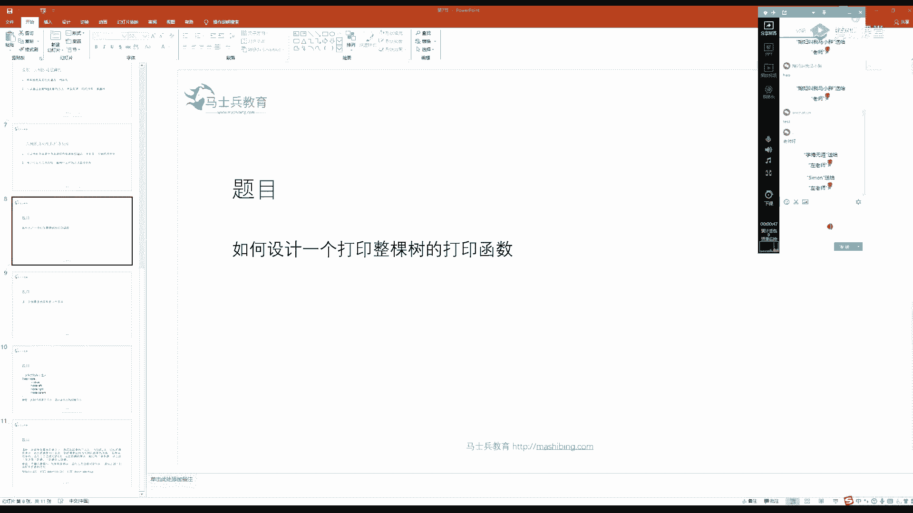
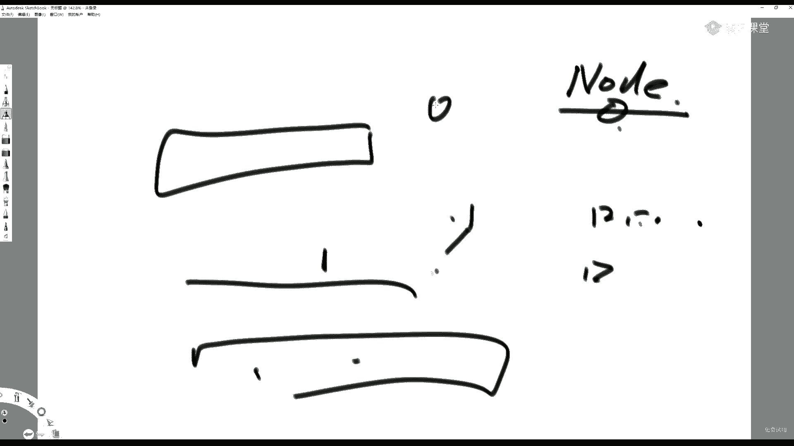
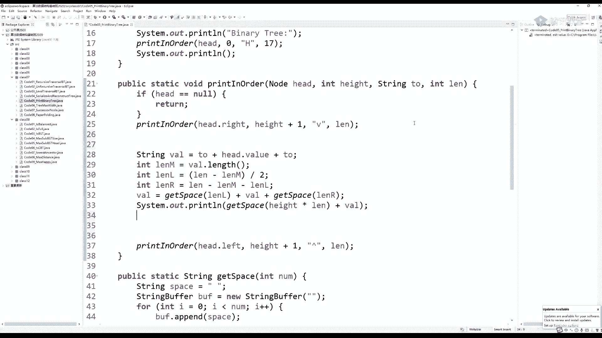
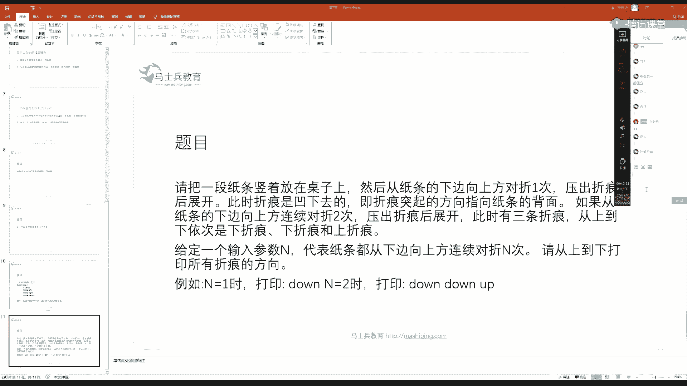
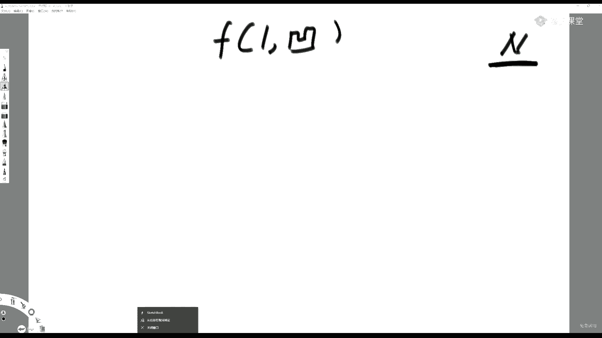
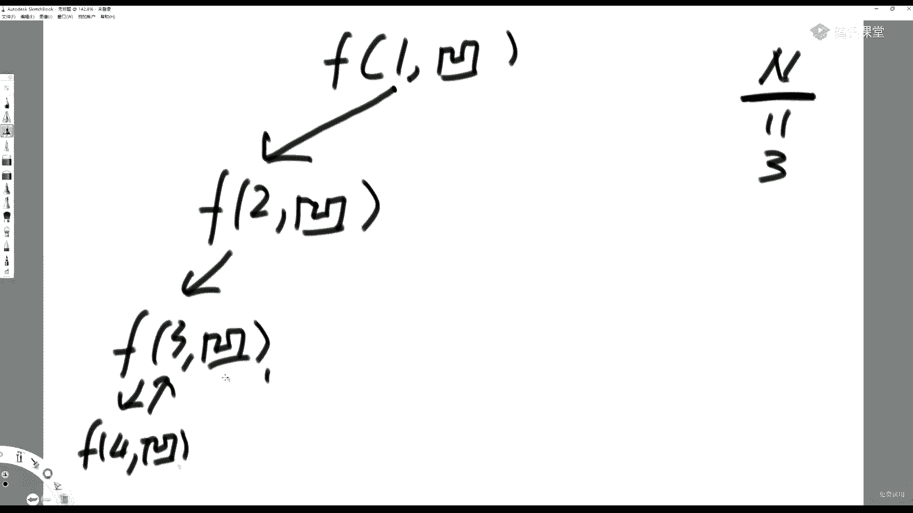
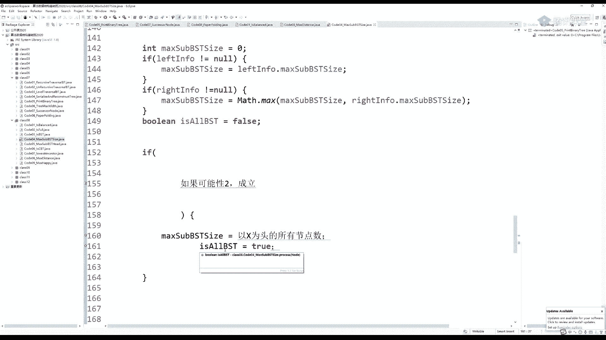
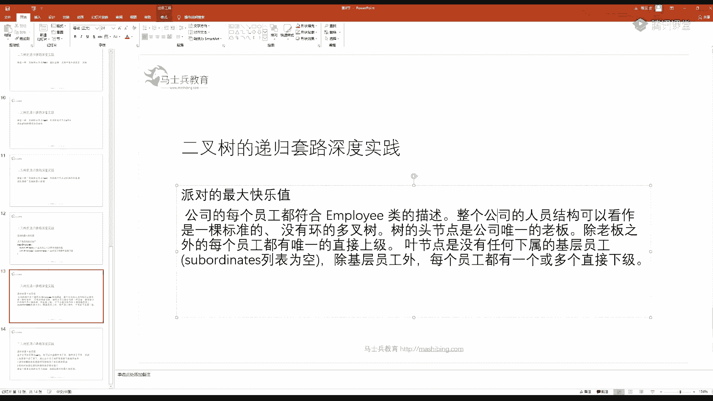
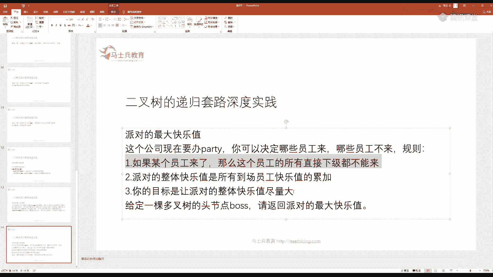

# 系列 2：P74：左神算法-二叉树的递归套路 - Java视频学堂 - BV1Hy4y1t7Bo

呃，大家好啊。大家好，我们下午接着下午就讲，就是二叉树问题。稍微再等两分钟。如何设计一个打印整棵二叉树的打印函数？

稍微等会儿。

稍微稍微再等两分钟。想想看怎么样设计一个打印整棵树的打印函数是吧？这当然你也可以做的非常的好，就是从上往下打印整棵树。那样的话你的函数就会牵扯到比较复杂的事情。因为你这个。

你会你要知道你整棵树可以是任意形硬任意形状的对吧？所以你。想办法把他们对齐啥的，这个还是。需要设计一下啊，但然这道题本身也是一个仁者见仁，智者见智的一道题。只是想让你大家看一下。

我日常处理一棵树打印的一些。啊，经常出现的一些题啊。关键就是让你熟悉一下便利术的这个逻辑啊。其实你知道的就是。你可以用一种什么样的方式来打印一棵树呢？这个这个咱们开放性的来聊一聊是吧？

你你你可以把整棵树搞成一棵满二叉树，然后再打印它。

啥意思呢？就是说。你比如说我我我有一棵树，明明不是马二叉树。对吧你就但是你可以把它补成版的吗？对吧下面如果他不满的那你就认为这边还有吗？无非就是你把点先站住，然后把该填的位置填上，其实你也能打印出来。

是这意思吧。嗯，这种设计方案也可以啊。就是说他这道题本身是比较开放的一道第一道题啊。就是你你总可以把一个残缺不全的数彻底给他补成完全满的。对吧那你就想办法把这些位置先给占住。那你具体在一个格子上。

如果有值的话，你填进去不就完了吗？这是一种设计思路。

啊，但是我们的题我们的这个实现不是这样的。他本身怎怎么想怎么打印一棵树，还真的方法蛮多的。嗯。那么还没开始啊，就是在等嘛，这不刚刚开始。两点嘛是吧？好，正好我们来讲一下这个题。

这个题我们整体想想设计什么样的一种思路来打印它呢？呃。

想想想这么干啊，比如说。这棵树啊。就是想。这边是打印的这个屏幕是吧？那么你比如说你我想用这样的方式，就是这个三。啊，这是一。这是2。但是我这个别急是吧，我这地方再来一个4。这个一。这个号就是。

它其实是这个样子的。我我我自己打印的图像是你把打印的东西，假设假设你看啊这个这是你的屏幕显示，这前面都是空格。然后一行这个三输出了是吧？然后这前面又一一大堆的空格。然后这个四输出了是吧？

然后这个一呢因为是第一层的节点，所以它前面没空格，或者你也可以补出比较少的空格，那随以你就变是吧？接下来这个二呢，你前面补出一大堆空格。然后我要打印了，对吧？那么你你打印这个这个东西你怎么看呢？

就是你你显示出来这个东西，你心里面把它转个顺时针转个90度，其实它就转过来了，对吧？你看你你你这是你这个图像是吧？你顺时针转完90度啥样啊，1234想象一下对吧？想象一下。想象一下是吧。

把它把它顺身转90度，其实就是我们原来这棵树了。那我是用这样的方式来打印的。啊，你要是看的不明显呢。那我们有办法让它变成明显的啊，这个倒不要急是吧？但是这种方这种设设计思路，它其实比较好实现。

那我们来想一下，我们先不管它怎怎么实现了。你看你每一行输出的顺序是个啥顺序啊？你先打印3，然后打印4，然后打印一，然后打印2。这个这个从我们递归上来讲，它应该是一个什么样的便利呢？先右再投在左的便利。

先右对于每棵子树来说，先又在投。在左的便利。听老他要打一。好嗯，那么我们为了实现这种打印是吧？当然我我说了这道题本身仁者见仁的对吧？你可以给他完全不转的方式打印。那样的话你。设计的时间比较长。

那函数可能会比较复杂啊，那我们就不说了，我就只看一下这种打印，你想怎么打。

你像我最终给你做出来的版本，你看啊，我给你搞出来搞了一大堆是吧，这些数各种连接是吧？你还得保证你还得保证它的它的值不同的时候，你得对齐，对吧？你还得保证能区分出来。所以我们看一下这些这几棵树是吧？

你看我们第一棵树好多好多植，它长度其实是不一样的那我们显示的树的样子，你看给你加了这种样子。它就很好看了，怎么看怎么好看呢？你这个6。他是哪？他的副极点在谁？完，准备给他加个箭头，你看到了吗？

给加了个箭头。那它应该是什么样的一个结构，这个数是啥样子的？其实你是非常好想象的。如果不加这个这线箭头的话，你可能很难想象。加了箭头之后你就没有那么容没没有那么难想象了。这个HH啥意思？

就是这个一是头节点。😊。

对吧这一是头节点之后，你怎么画了？你就这这不写个一不就完了吗？头节点是吧？😡，然后。下面的这个三，它的复指针是指向左侧偏下的这就是这个下箭头的含义。对吧说左侧这一列偏下的那就挂在一上了嘛。

那这个负这么多2，那是它的负节点是这个箭头是往上的那就左侧偏上的那就是挂在这底下了嘛，对吧？你会发现这个很容易看的，其实。我是负一大堆二是吧，负一大堆2啊。

然后。你往下这个六跟这个五很明显是挂在这个三上的吗，是这意思吧？然后那你就写嘛，你看这个函数它有个啥好处呢？他把你东西都对齐了是吧？我之所以说你想搞出别的方式打印不容易，就因为你得想办法把它值对齐。

哪怕。

那么你你如果要是正着打印的话，你其实光对齐这个问题你要想的很复杂的啊，这个那这个五呢就是往上它为什么箭头往上啊，它是附接点左侧偏上嘛，然挂在这个伞底下的嘛，所以它就是。

就就就就就这个在在在这儿嘛，对不对？是多少一对5是吧？一对5嘛啊，然后你底下接着继续是吧？

你看你这个负的系统最小值挂在哪的，我的附节点是我左侧偏上的，那就它底下嘛，那你就连上嘛不就完了，是吧？

怎么连啊，就这样连吧。对吧这是负的系统最小值嗯。

然后呢。这个七它要是挂在这底下的对吧？我的负极点是我左侧偏下的嗯，那你就知道是这棵数吗。

对吧。付777啊。

对777。哦，那这棵树怎么看呀？还是一样，顺时针转90度不就完了吗？你可以想象吧，是吧？哦，那这个东西怎么实现？那就像我说的。

你这样这样理解下来，那你底下每一棵树这样你都可以很顺利的打印出来。你怎么加这个箭头，其实就决定了你附节点怎么调用的。啊，我们来看一下这个函数，并不难理解怎么做的。看。首先我要告诉用户。

我现在要打印一棵二叉树了，是吧？来个回车。接下来呢就是我我打印的过程，它就是一个这个函数啊，我把这个过函数打完之后，不要忘了最后提醒哎，再换个行。所以他关键的理解不就是这个函数吗？对吧这个函数是干啥的？

现在来到的节点是谁传进去？这个H所在哪一层的高度传进去，假设我默认以零开始，或者你默认以一开始无所谓。对吧头节点在零层或者头节点在一层无所谓。那么他是一个什么身份呢？这什么叫身份呢？就是它是头节点。

也就是说我们往下传的时候。😡。

如果没有往下传的话。那么。他一的一的身份，他是知道的，他要掉了他右右边的孩子，他就给他传一个下箭头。就是说对于这个他往下走的时候，这个三对于这个三来说，我的身份就是下箭头。😡，到这儿的时候呢。

我的身份还是下箭头。到这儿的时候呢，我的身份就是这一个上箭头，这个箭头是谁给他的，复函数调用给给他的对吧？你比如说我一开始这个头节点，它的分身份就是一个H，我就得到了。那这就这玩意儿就是我的身份。

他表示你要指向哪儿。那你看一下我我。😡，我如果中间这些过程我都不看蓝色部分我都跳过，你看我怎么调用的。最后一个参数，你先别管，我会给我会给你解释的啊，最后一个参数你先别管，我会给你解释的。

复函数掉了一个头阶点在第零层，它的身份是H。接下来我先调右数，最后调左数，中间部分全跳过，对吧？我先调右数，然后调左数。那么我的右数跟我的左数，它肯定是高度加一的。我右数得到的身份就是下箭头。

我左数得到的身份就是上箭头。听到他要打一。就是其实你是可以得到一个身份的，是吧？其实你可以得到一个身份的。你你你发现你是在吊你的右孩右孩子的过程。😡，你你想让他怎么找到他的父，这不就是我们刚才说的嘛。

对吧？😡，理解这意思吧啊，那么这个lasts是干啥用的呢？😡。

其实是为了处理你自己当前节点值怎么打印的？好，我们这这中间这一坨大码，你别看很多，实际上并不难，为什么？他的逻辑就是假设我有一个节点啊，我现在来到了一个节点，这个节点现在目前为止是no。

我怎我怎么打印我自己的纸？我要打印的时候，我前面要留多少空格是由我的层数决定的。哎，合不合理？我们怎么做到头节点上面，前面没有空格，一旦跳了一旦往下跳了一层，它在打印的时候就留出很多足量的空格。😡。

然后再往下跳一层，就下框打印的时候，就再就是你你你一个数，它一行只输出一个数。那你怎么知道你要输出多远呢？肯定是和高度相关的。😡，一个节点你扎的越深，你在深你在输出的时候，其实你前面留的空格数量越多。

这个前面留空格的数量其实是和你的高度相关的。正相关。你可以认为，如果我在第零层，我前面就预留零个空格。我在第一层，我前面就预留10个空格，我在第二层我前面就预留20个空格。

我在第三层我前面就预留30个空格。😡，你不就基本上大致对齐了吗？好，那么第四个参数是干啥的呢？第四个参数就是说我自己的值可能很大，对吧？比如说我这个值我是个十进制的数，我是一个十进制的数，我是222。

那么我这个我这个我我自己的值占的长度就是3个。😡。

那你想一想，如果整棵树它的值它的本身直的长度相差特别悬殊的话，你只预留出空格，是不是还是可能会乱掉啊？所以传一个l是啥意思？就是我不管我长度是多大，我都搞出一个这么长度的东西，字符串打印出来。啥意思？

比如说我我我不管你这个十进制数有多大，我就给你准备17的长度，那你怎么得呢？你就你就一个值，你怎么准备准备17的呢？好，我左边。😡，8个空格，右边8个空格，我们整体这算我值的部分。

然后我前面还有多少空格跟我高度相关给它补齐。就是我我不管我自己的值是多少，我统一我就认为我只占17个空间。那你如果你是323百这这么多呢，那你就是。😡，17减4是13对吧？17减4是13，对吧？

你左边预留6个空格，右边留留7个空格。总而言之，你不管是什么值，你都预留一个总长度，就是17长度。😡，理解这意思吧？就是我自己的值占多少位，我自己的值占多少位，我给预留好前面补多少个空格。我们刚才说了。

跟你的高度相关，这样一来我不就能保证对齐了吗？😡，听到他在打一。啊，所以我们这个东西是啥？你这它没有那么复杂啊，你看你右边是便利了，它他到下一层去是吧？我给他一个身份，他往下指左数，他往下层是吧？

我给他一个身份，他往上指主函数一直传这个时期，就拿17做。你会发现最后一个参数是永远不变的。

我不管调用什么子过程。我我就永远让一个值占17长度，因为我是十进制的数，我实际长度绝对够用了。所以你看接下来干啥的。我先把我的值处理好。左边加一个我的身份，他该是上箭头就是上箭头，该是下箭头就是下箭头。

该是H就是H。就是这个部分。嗯，等一下。就我加个身份，你看这是我前面的身份，这是我后面的身份，中间是塞我的值对吧？这是我前面的身份，这是我后面的身份，中间是塞我的值，对吧？这些身份都是我附节点给我的。

😡，好，接下来往下。😊，那么我这个value它就它就有一个正儿八经中间占位的这么一个长度。我就算一下，我左侧我如果总长度是17的话，我拿17减去我占位的长度，除二就是我左侧贴多少空格。

剩下的东西就是我右侧贴多少空格。所以我自己的value就是我左侧空格数，加我自己本身的值，再加我右侧空格数，这个是绝对是每个值都严格一样大的。我在打印的时候怎么办？我前面根据高度补出这么多空格数。

再把我的值塞上。搞定了。听到同学打一。啊。啊，现在在讲这个怎么直观打印一棵二叉树啊。哦，会了是吧？行啊，那这个这个这个其实你自己回去玩一玩是吧，你也可以改出比我更好的是吧？无所谓啊。

也是作为一种递规的练习，它本身并不是想干啥是吧？啊，就是给你熟悉一下一种二叉树，我怎么去设计。

好，我们接下来讲题目。嗯，这里已经讲过了，早上的是吧？系。一个二叉树的结构定义如下，哎，这个二叉树的结构定义有意思，它多了一个往上指的父亲指针。注意啊。

一那个在我们这个其实很多树的结构呢都会加上一条往往上指的指针。比如说我们经典的这个嗯红黑树设计，它就是往上加了一条往往上指的指针，每一个节点有3条指针，左指左孩子右孩子跟指向我父亲节点的指针。

那么你要注意。我一般在刷题的时候，不是我一般是一般在刷题的时候，如果你遇到一道二叉树的题。你默认他只有左右两个孩子是没有往上指的指针的，理解这意思吧？这是我们预设的刷题环境，除非特别声明。

在这里面我就特别声明了，它有一个指向负的指针。那么我假设我只给你二叉树中的某个节点，我不给你投。但实际上，因为每个节点有指向父亲的指针，你是可以找到头部的这是肯定可以的。你就往上指呗。

头节点的父亲指针指向谁，你可以规定它指向空，对吧？头节点整棵树的头节点的父亲指针，你可以规定它指向空。所以说我给你二叉树的某一个节点，其实你是可以便离到整棵树的。好，但是我只给你这个节点。

数中的某一个节点，请你返回该节点的后继节点。我们解释一下这个后继节点是啥意思。

后继节点。它指的是一棵二叉树中，在中序遍利的序列中，一个节点的下一个节点是谁？就是后继节点。举个例子。比如这棵树中续遍利的结果。4251637。

所以我就说四的后继节点是22的后继节点是55的后继节点是1一的后继节点是66的后继节点是33的后继节点是77没有后继节点，它后继节点是空。这就是后继节点的定义。好，那么我随意给你个节点X。

请你返回它的后继这个东西最简单的做法就是你让X不停的搞到头部，对吧？你你我不管你X在哪，我都给你找到头部，整棵树的头。然后我就给你实现一个中序便历的序列。然后我再便历这个中序变历的序列，找到X的下一个。

那是肯定可以做的。😡，有关于后期阶点定义以及一种普遍的解法，已经会了的同学打个一。嗯。好，那么这道题就是我我我因为我每一个节点都有往上指的指针是吧？我是可以找到整个的头部的。

所以我就可以从头节点开始去玩一个中序便利，把这个序列收集上来，然后找到X中的下一个X在这个序列中的下一个，这个是暴力解，肯定是可以做到的。但是。是不是麻烦呢？你中序便利，我们说不管你是先序变历。

中序便利还是后序败便利，本质上都是递归序的便利，而递归序的时间复杂度是多少啊？每一个节点只到达3次。所以如果节点数是N的话，我甭管你是什么中序先序后序还是什么递归序，一律复杂度，B个ON。哎。

这个点听懂朋学打一。对吧。这个点听懂同学打一，因为我不管你是先续中续后续，你只要是递归序，递归序也是一个节点到达三次，有什么关系是吧？都是B勾N的。😡，但我问你真的需要吗？来，我们来看一下。

你比如说四节点到它二节点，四节点的后继是二，在这棵树上实际的距离是多少？四节点到二的实际距离才是一。而二的后继节点是5，2节点到5的距离是多少？其实它也是一。我有指向负的指针，按道理来说。

我都可以直接到达的。😡，五的后继节点是谁？是一？那么5到1的距离是多少？往上走一位，再往上走一位，后继节点才是2。一的后续节点是哪？一的后续节点是6，所以一走往下走，再往这儿走，它其实能走到6。

它截它的它的这个代价也是26的后续节点是3，距离是一三的后续节点是7，距离也是一，哎，有意思。我就萌生了一个想法，如果你给我实际的一个X节点，我能不能用一种策略，我直接去找他的后继。

有可能比整个便利完成再处理代价更低哦。😡，假设我一个节点到它后继的实际距离是K的话，我希望我的算法做到B个OK，而别每次都是B个ON。懂我想干什么同学打个一。好啊，那这样一来。

我们就要对一个节点的后继节点怎么找这件事情去调研一下了。没错吧，你原来可以不用管一个节点的后继，跟自己是什么样的结构关系。因为对您来说就是很傻的一件事儿。从头节点所有便利完了之后，他爱什么结构关系。

什么结构关系，我才不关心呢。😡，但是是不是不够好呢？是因为复杂度高，它实际距离物如果是K的话，你要想用在BOK的时间内找到这个解，那就需要调研一个节点跟自己后继有哪些结构关系了。好。

我们先说一种最简单的。假设X节点它有。右树。我问你他的后继是谁？必然是它右树上最左的节点。为什么？中序便历的顺序是先左再投，然后右的，你就把X假设为头。那么如果真的打印的话。

谁是最X接下来要打印的东西呢？如果是中序便利打印的话，谁是X接下来要打印的东西呢？毫无疑问是它右数上再去拆分左投右。拆分的结果就是右数上的最左节点，一定是X的后继。听懂他学打一。这是X有右数的时候。

这个结构关系是很显而易见的那我那我X的下一个节点一定是右数上最左的节点。😡，这种是最简单的。那下面我们来想一个问题，如果我X没有有数呢。啊，中区便例好多呀，是吧？那我们就都都列一下。应该是对的是吧？好。

我们看一下，如果没有后继的节点，没有右数，它的节点后继是谁？你看比如说这个I就没有这个H，它就没有后继，没没没没有右数。那后节也是D。附节点。这个I也没有幼数。他的后继节点是B。这个J也没有右数。

它后一节点是E。我们在这练。这K也没有。右数它会几点是A。这个关系直接告诉大家。如果一个节点。他没有右数的话。😡，你就往上找。😡，如果我跟我的我是我副节点的右孩子。😡，你就继续往上找。

如果他还是他父节点的右孩子，你就继续往上找，一直找到某一步。这个节点是他父亲节点的左孩子了。这个父就是当初X的后继。我们来套一下，然后再解释为什么，你比如说我这个H没有后继啊，我这个H没有右数。

我就往上找，我是我父亲节点的左孩子了，就停，那个父就是我的后继，所以你看有他第一回往上就发现是自己父亲的左孩子，所以D就是我的后继。😡，你再看这个哎，我说我父亲节点的右孩子不行，一定要找到左孩子为止。

所以再往上D是B的左孩子。所以这个父。😡，就是我当初挨的后继。这个G也一样，我没有右数，我往上找，我是我父亲节点的左孩子，所以E就是我的后继。这个K我往上找一步，E是我的父，但是我是我父亲节点的右孩子。

我就继续往上E是B的右孩子不行，一定要左孩子为为止，所以继续往上。😡，B是A的左孩子了。停，那么当初K节点的后继它就是A。这个这个这个这个这个标准听明白同学打个一，我会给你解释道理。😡。

就是你不停往上不停往上一直到某一组父子关系，这个子是父亲节点的左孩子了。停。😡，你找到那个负，就是当初那个节点的后机。就这个意思很很很容易理解吧。那他是为啥呢？😡，我们想。你的目的是想找X的后继。

那我那你看这样，那你看这个这句话对不对？😡，如果某一个节点，它左数上的最右节点是X。则这个问号就是X的后继。再来一遍。如果某一个节点，它整棵左树上最后打印的节点，也就是最右节点是X的话。

那么这个问号就是X的后继。听懂他在打一。没懂好，什么叫中续便利啊？中序便利是先左在头在右的便利。我现在说的是这回事儿，我说某一个头它是一个问号，然后我明确的告诉你，它左数上最后打印的节点是X。😡。

然后就该打印这个问号了。😡，以中续方式便利的方式打印的。那么这个问号毫无疑问，它就是X的后继，这难理解吗？😡，我不假设X为头，我假设X的后继是头。😡，那么这个X的后继是头的话。

这个这个问号应该跟X具备什么样的关系呢？要求的关系是这个X一定要是它左数上最后打印的节点。听懂他打一。嗯。对吧你想想什么叫中序便利啊？如果你有你中序便利都是先左在头在右的。我假设某一个节点X。😡，我。

假设某个节点问号X是它左数上最后打印的节点。那我找到的这个问号就是X的后继嘛。😡，理解吗？好，那看我们刚才在干啥，我们不就是在干这种事儿吗？如果X他跟他父亲是右孩子的关系。我跟我父亲是右孩子的关系。

那此时我并不是这个节点左书上的最右。😡，所以我就继续往上，如果这个节点跟他也是右孩子，他是他父亲右孩子的关系，那对于这个节点来说，他的左数上的最右节点也不是X。😡，你一直往上找找到某一步。

这玩意儿开始是我是我父亲的左孩子了。😡，你看你打眼看一眼，因为X底下是没有右数的。😡，那这个X是不是这个节点左数上的最右节点啊，你中续便利是不是打完X就一定会答这个问号啊，你不就找到了吗？😡。

听审他学打一。嗯。梅懂打2啊。好啊。啊，那就是这个意思是吧嗯。对，如果X有右数，就直接右数上的最左节点了。如果X没有右数，你就往上这么找，但是你不要忘了。整棵树的最右节点。他是没有后继的。

那整棵树最右节点找的时候会是什么状况啊？我他我找他的伙计。哎，我往上我是我父亲的右孩子，我再往上我是我父亲的右孩子，我再往上。哎，我再往上我父亲节点就是空了。如果你一直都没有找到一个节点。

是这个父亲节点的左孩子的情况，那他一定是整棵树上最右的节点，你返回空就行了。你只话。整棵树最右的节点，它就是没后继的。

好，我们看一下这个代码。这代码特别好理解啊，你是真的好理解。你比如说我就给你一个节点，我告诉你这个节点不是整棵树的头，它就是这个树上任何一个节点。有可能你看这个节点是由左有右由指向负的指针的对吧？

那么这个节点你看如果他等于空的话，你让我找什么后继呢？你压根就没给我节点，我就给你返回啊，你自己玩吧，是吧？如果我node的右孩子不等于空，说明啥？我有右数。既然我有右数。

我就找到我右数上的最左节点这个方法在这儿不断的往左往左往左往左左到不能再左了，返回。好，有关于这个第一个逻辑分支，看懂同学打一。好，那么接下来就像我们刚刚说的，如果一个X它无右数。嗯，还是放这儿吧是吧？

还是放这儿吧。如果如果它右数是空就进入al，如果它无右数怎么办？先把node的parent找出来。注意看，先把node的parent找出来。接下来我再找什么样的情况，我这个w怎么能继续？

就是我一直发现当前的节点和自己的父亲是幼孩子的关系，我就继续。看父亲节点如果不等于空，并且父亲节节点的左孩子不是no的。就是说我有父亲节点，并且我不是他的左孩子，那你一定是他的右孩子。

你也可以等效的改成这个。😡，都是对的。所以我这么写最直白是吧？如果我附近节点不等于空，并且我是我附近节点的右孩子。😡，我来到父亲的位置，我父亲在往上。这一次就是往上登两个，一次往上登两个，看到吧？

我note上到parent的位置，parent，你再往上移动一个。😡，在这个well里面周而复始。只要我发现当前的子是，他父亲的右孩子就往上，只要发现是右孩子就往上，一直到什么时候停。😡。

我是我父亲的左孩子了，停返回父亲是对的，或者我父亲节点变成空了，直接从well里面出来，返回空节点也是对的那什么时候会返回空呢？给你的n是整棵树最右节点的时候。看到同学打一。嗯。第二7行会空指针异常吗？

不会，为什么？因为我限制住了parent不等于空。如果我限制住了parent不等于空，那么node来到parent的位置，它怎么可能parent没有呢？这就是为什么我要加一个parent不等于空的原因。

你不说27行会不会控制任异常吗？不会，因为n它 node来到的是parent的位置，而你为什么能进到这个外里面来？是因为你pit不等于空。😡，不会控制人异常。嗯。啊，这就是边界考虑啊。好啊。

那就是这个题是吧？那同样道理我跟你说前驱节点啥意思啊？

什么叫前驱啊？后继所对应的就是前驱。对吧所以你后继会讲了会会搞了前驱怎么做呀？哎，如果一个数有左孩子有有左数的话，它左数上最右的节点就是它前驱，否则怎么怎么样，那对等的就不再多说了吧。你你会找后继。

你反一下，你就会找前驱啊，后继节点跟前驱节点都指的是在中序遍历中，一个节点的前一个或下一个的概念，好吧。

这就是我们的后继节点。好，我们再看底下这个题。我开一下摄像头，大家。这个看一眼题目，这道题是要求大家互动的，准备两个纸条和一支笔。这道题非常好玩。这道题在国外流行了一年多，从微软开始流行。

facebook谷歌全考过准备两个纸条，干净的，没有折痕的纸条，纸条就行，然后准备两支笔是吧？我我也准备一下。嗯。Yeah。哦，开一下摄像头啊。好啊，大家准备好了吧啊。😊，这个。纸条是吧。

那我们来展示一下这个怎么折啊，这个怎么折，你别说好了是吧？我开个摄像头，你说你好了，哇，这个吓死我了是吧哼？😡，啊，开个摄像头，哎，我好了是吧？😊，哎。太逗了。嗯。来啊这个。我们我们正面对这张纸条是吧。

这么面对这张纸条。然后你从下方往上方这样对折是吧？从下方往上方注意你纸条千万不要翻面，也不要上下颠倒，握住了它。什么面对着你，永远什么面对着你。😡，也不要让他翻面，也不要让他上下就捏住。

不然的话你会折乱的哟。😡，从下方往上方对折之后。打开。你会发现你有个折痕，这个折痕呢，如果你这么看的话，它是凹下去的。对吧我们管它这个折痕叫凹折痕。啊，它这个折痕是凹下去的，没错吧。好。

然后我们恢复成折的样子，恢复一下。就是刚才你折了一下，不是这个样子嘛，对吧？你再从下方往上方对折一下。然后给他打开。这个时候你会发现你有三条折痕。😡，上面两条是凹折痕。最后一条它是一个凸起来的。好。

我们就管这样的折痕叫凸折痕。😡，这个问题就是说。😡，我让你对折N赐。让你打印所有折痕的方向，从上往下打印。所以如果我给你输入二的话，就是对折两次，你就应该打印出来凹凹凸。那么如果给你任意一个N值。

你给我全部把折痕从上往下方全打印了。该怎么实现？听懂提议，同学打个一，以及跟我折的一样的同学打个一。嗯。哦，没关系啊，刚看不到画面无所谓。我现在让你做一件事儿，再拿出一个纸条，没折过的。再拿出一个纸条。

没折过的，现在能看到了吧，现在能看到了吧。啊。好，你拿出一个你拿出的干净的纸条，我们现在来做这样的事情，从下方往上方对折一次。干净的。打开。是不是有一条凹折痕，它是你第一次折的时候出来的对吧？好。

你在这个折痕上画一条线。并且在这个上方用小字写EO。来做这件事儿。折完之后就应该写完之后就应该是这个样子是吧？你这个折痕上画一条线，然后写个一凹啊，非常清楚是吧？好，然后。我们把它恢复成折一次的样子。

进行第二次对折。折完之后打开。现在出现了一个规律，叫你划线的折痕，上下两方出现新折痕。上方出现凹折痕，下方出现凸折痕。好。两条新的折痕上面这一条你画条线写个二凹底下这一条折痕，你画条线写个二凸。

写完之后就这样是吧？对吧那为什么糊了？好，那么。你把它还原成折两次的样子。千万别翻面儿，也别上下颠倒。进行第三次折。你再打开。你会发现在你上一次折出来那个二折痕的上下两方，上方都是凹折痕。

下方都是凸折痕。理解这个规律，同学打个一。在你第二次折的折痕的上下两方出现两条新折痕，上方出现的都是凹折痕，下方出现都是凸折痕。所以我们有理由相信，如果我们的每一次折新的折痕都会跟我上层的折痕。

上下两方出现，而且上方都是凹折痕，下方都是凸折痕。没错吧。没错吧。好，那这玩意是啥？能看到屏幕吗？能看到屏幕，同学打个一。我现在摄像头关了。

，我们来想一下。这是纸条。这是纸条的上方。这纸条的下方。你第一次折的时候，在这个地方折出一个折痕来。是一凹。当你第二次折的时候，在一凹折痕的上方出现一条凹折痕。

在这个纸条的在这个折痕的下方出现一条凸折痕。然后你第三次折的时候，在每一条小二啊每一条二折痕的上方都出现凹折痕。每一条的下方都出现凸折痕。所以你想从上。到下打印所有折痕的方向，就是这棵树的中续便利。

听到台打一。啊，那你就会想了，我靠，难道我要建出一棵树吗？你不用建出一棵树。很多同学会想，哎呀，我最终能算出啊，我不我不搞你这个数是吧？我不我不根据我不根据你这个数的分析方式来分析。我就自己想。

我发现每一条规律就是如果有N，你让我对折N次，一定会产生二的N次方减一条折痕。然后你就根据这个N做出来一个好大的一个数组，长度是2的N次方减1，我看怎么把这个数组填满。然后我再依次打印这个数组。😡。

它不是不行，但它会巨大的浪费空间。你要准备一个长度为2的N次方减一的数组，把它填满。那么当你有了这种模型之后。我们来看一下，你真的需要建出整棵树吗？其实你并不需要，为什么这么说？来。

我们来看一下这个code。

这个打印函数有多么简单？

就这么短。那他怎么理解呢？

如果我折三次的话，就把这个三传进去。所以它是我的主函数，打印所有折痕这个主函数。直接进了一个递规。那么关键就是怎么理解这个递归。好，我们说开始看这个递归有三个参数。

这个递归第一个参数指的是我当前来到的过程。你可以认为你当前来到的过程就对应着一个点。就你你当天来到这个过程就对应着一个点。我没有真实的node，我们怎么样的表示node的递归的调用来表示的？😡。

当我来到这个过程的时候，就认为我来到了一个点。那么你当前来到的这个点是第几层的点，它就是I这个值的含义。所以我主函数要传一，因为一上来头节点出发，它必然是在第一层的。第二个参数是一个固定参数。

它是不会发生变化的。它指的是我最多有多少层。固定参数它以后再调用的子过程，第二个参数都不会发生变化，它就代表我一共有多少层的意思。第三个参数就代表我此时的点。是不是凹折痕的点？如果是凹折痕的点。

它就是处。如果是突折痕的点，它就是fse。所以主这个含义定了主函数应该怎么调用。我当然从第一层的点出发，一共有N层头节点是凹折痕的点，为什么？

因为必须是这样的。你这棵树有什么规律？你左子树的头部全是凹折痕，右子树的头部全是凸折痕的这么一棵树，这就是这棵树的规律。

所以我我的头节点一定是传触的。然后大家看。那这个函数怎么理解呢？假设我们有三层，我们看这个函数是怎么调用的。全擦了。也就是说这个函数这个N我就单独抽出来了，因为它是永远不变的。

我就不把它作为状态代表的参数了。我第一个过程我就会掉了F1O嘛，为啥？因为我掉了个处，对不对？主函数调的是F一O嘛，我就说我把这个中间这个参数给省掉了，因为它每次都是固定不变的，所以我就不看它了。

主函数是不是掉了一。

凹啊，我给的是处，当然是凹的意思，对吧？所以主函数掉了一凹哦，没问题。然后你看它怎么掉的。😡。

I大于N了吗？没大于N为多少，因为N是3，我规定好N是3，它是个固定值。3，我就打印三层，假设对吧？我假设我就打印三层，你也可以去假设四层，你也可以假设五层，那你这棵树就画的很大无所谓。😡。

先假设它是N等于3好吧。

然后看。I没有大于3。我先调用的是下一层中。

凹折痕的点。所以好你直行不下去了，我需要你调子过程F2O。

因因为什么我传的是处。然后2凹就进到这个函数里来了。2它这是二层的，它有没有超过N，它还是没有超过N，所以它还会去掉什么？调三凹。

那么三凹执行进来之后，它还是没有超过N，因为它现在是三，它没有超过3，对吧？它又去掉什么，它会掉了四凹。

但是四凹调用的时候，他其实什么都不会做。为什么？因为四凹一进来就reen了。😡，四凹一进来就return了，所以它会回到上游的三凹上。

当我再次回到三凹上的时候，就等于说三凹的过程执行到了。

把这一句执行完了，再执行这个。那我就打印了我的折痕凹。

他就打印了一个折痕哦。

接下来他又去调了第二行，我调用4。土兀。

但是四图什么都不会做，因为此时的四是超过三的，所以四图一旦遇到他什么也不会做，直接return我的过程彻底结束了。我返回到2O的时候。😡，我就会打印哦。然后2奥又会去掉三图。三突会调它返回来。

第二次返回，它打印突再去调右边什么也没做，返回，彻底往上返回，然后再往上第二次回到一的时候打印这个哦。其实你就是拿地规模拟了你脑海中的树，但这棵树其实从来没有被建出来过，但是你拿地规过程模拟了它。

听懂同学打一。为什么你不需要建出整棵树，你也可以完成所有节点的打印。因为这棵树是有明确规则的，左数节点都是凹，右竖节点都是凸，头节点默认也是凸的这么一棵树。既然这种明确规则的数。

我当然不用建出所有的节点才能够打印。有什么问题，完全没有问题。但是这个空间复杂度是多少？递归站的代价，递归站一共才开N层，你这个递归函数最多压N层，所以我是额外空间复杂度就是一个B勾ON的事儿。

它是不是比你做出一个数组都填好，再打印达到B勾2N减一的空间复杂度要优秀啊。

就这么简单的代码。好，我们想说什么呢？我想说的是，为什么我们要开实战班？为什么我给你练完了基础，你要好好去写，因为这就牵扯到了一个问题。一个基本的数据结构，或者说一个基本的算法原型。

你用它是需要敏感度的。那么在我们的课上会先打基础，然后进入实战班里面练每一个小东西，每一个底层的底层算法数据结构的敏感度。你敏感度熟了之后，自然你就想到了这个方法了。但是在这之前你就是可能会面对。

虽然你学过该道题不会还是不会的境地。听懂同学打一。嗯。这个代码本身就是中序啊。哦。好，我们现在来讲一个，那还有一个小时嘛，赶紧开始下一节课啊，下一节课非常的重要。二叉树的递归套路啊，这个东西很值钱是吧？

啊，它它可以说是我们整节课，我们的课上小技巧多如牛毛，但大主线就两个，一个是二叉树的递归套路。还有一个就是我们暴力递归，改动态规划的套路。任何动态规划题目都可以解。啊。

那么我们来看这个什么叫二叉树的递归套路。一开始你可能一头雾水是吧？它实际上就是在树上做动态规划。那什么是动态规划呢？动态规划就是用空间换时间的方式，你现在先不用管动态规划的定义，因为树形DP问题。

你可以不去理解什么叫动态规划也是可以理解，能够做的。好吧，我们把这个动态规划的严格定义放在我们最后一节的时候再去做。但此时不会影响你听这节课的。可以解决面试中绝大多数二叉树，尤其是树形DP的问题。

这个绝大多数大到什么份上，95%以上。为什么没有百分之百？因为谁知道哪些面试官犯神经是吧？这个不好确定。但是二叉树的题目由二叉树递规套路解的，可以占到95%以上。

那本质其实是利用这个二叉树便历二叉树就递归序便历二叉树的便利性。因为每一个节点都可以回到自己三次。好，我们先来看一下这个套路啊，这个套路你一开始会看的一头雾水，我们直接把它跳过来看具体题目。

我们每看一个新题目的时候，都利用这个套路告诉你怎么做。用例子加深概念。比如说第一个题。给定一棵二叉树的头节点，返回这棵树是不是平衡二叉树。我知道大家很多人做过这道题。

但是请你忍着听二叉树的递归套路的解法，为什么？因为这个套路你掌握了之后，比它难得多的题目也变得不难了。关键是在于学习套路本身，不在于你会不会这个题。

好，我们看那这个题你想怎么解？什么叫二叉树的递归套路？先讲一下。

二叉数的递归套路指的是我就假设以X节点为头的数。我就假设以X接点为头的数。我看看要想得到我此时的答案。我需要哪些信息？再来说的具体一点就是说。我我我我有一个。潜台词。我的潜台词是什么？我的潜台词是。

我每我任何节点X为头的数，我可以向我的子数左子数要信息。左子树是可以给我信息的。打。柚子树也是可以给我信息的。这个信息是什么，你别管，反正能给我，你爱要什么信息，我就可以给你有这样一个假设。

左子树的信息是可以得到的，右子树的信息也是可以得到的这样一个潜台词。😡，好，接下来你会你怎么想这个问题呢？就是你你先看一下你求的东西是啥。我们这道题比如说是平衡性。😡。

对吧我们这道题具体的它的他的求的问题是平衡性的问题。好，你有了这个潜台词的基础上，你去干一件什么事儿，就是你利用左数跟右数能够给你的信息，你怎么把以X为头的这个问题求解出来？对于这道题来说。

就是假设物以X为头，怎么样它整棵树就是平衡树了呢？😡，我必须满足如下的条件。第一啊，什么叫平衡树？就是在一棵二叉树中，每一个子树左树的高度差呃，左树的高度和右树的高度差不超过一。在一棵二叉树中。

每一棵子树，左树的高度和右树的高度差不超过一，这叫平衡性。那我现在假设以X为头的树，它要想做到平衡性，要满足哪些条件？第一点，我的左树得是平衡的。我的右数第二点，我的右数得是平衡的。第三点。

我的左数的高度和我右数的高度差不要超过一。我们再来一遍。因为平衡性指的是在一棵树中，每一个节每一棵子树左树高度跟右树高度都不要超过一。如果你X左树已经不平衡了，你X是不可能平衡的。

即便你X左树的高度跟右树的高度没有超过一，但因为你左树本身已经不平了，那你就不是平衡树。😡，所以我想怎么让怎么想让X整棵树它有平衡性呢？左数得整体是平衡的，右数得整体是平衡的。

并且我此时左树高度跟我右树高度差不超过一。😡，听懂他要打一。好，这样一来我们在干嘛？就是列出了以X为头。答案的可能性。在什么情况下去列这个可能性的？是在我默认我可以向我左数跟右数要信息的情况下。

我去列这个可能性的。好。

这就是我们递归套路说的。哎，不是这个。假设以X节点的头，假设可以向X左数跟右数要任何信息。在上一步的假设下，讨论以X为头的数得到答案的可能性。好哦，讨论完了。那然后呢第三步列出所有可能性后。

再确定到底需要向左数跟右数要什么样的信息。那我现在看D就是第三步了。那我这个问题，我到底需要向我左数跟右数要什么样的信息呢？😡。

我左述是否平衡，是不是我需要要的信息？对吧你平否。还有我左书的高度，是不是我要要的信息，你高你的高是多少？😡，就这么俩信息，我对我右数要什么信息呢？我的右数一样，右数平否。😡，以及右树高度是多少？所以。

我对我左数的要求和对我右数的要求是一样的。这样我们就列出了你到底需要向你的左书跟右书要什么样的信息。理解到这一步，同学打个一。好，那么接下来我们就用实际写代码的方式。然后去列到底怎么做。

现在的情况是这样的。

现在情况是。我这个信息。结构题我就定义好了。因为我对我左术和我右术要求是一样的。所以我这个info类型是啥？就是。信息返回的结构体。这就是我的音，对于每一棵子树来说，我都要俩信息，你是否是平衡的。

它是个布偶类型的值，没毛病吧。😡，第二点信息就是你的高度是多少，它是一个整形值，没毛病吧。好的，然后呢然后写代码。假设以X为头的数。假设以X为头的数。我也要返回info。

为什么你对因为我们要写接下来要做的是递归函数，你对你左数有要求，你对你右数有要求。😡，你是可以在调用X的时候，先得到你左数上的两个信息，再得到你右数上的两个信息。但问题是他们都是用递归去调用的。

所以你必须规定好X自己要返回的信息，这两个信息你都要返回你才能够说我可以默认我左数给我这样的信息，右数给我这样的信息。换句话讲，因为你对你左数跟右数有这个要求，所以你也得符合这个要求。

因为你们是递归函数。😡，也就是说，原本我是求平衡性的问题，现在我必须要在这个代码里面解决X为头的数，怎么返回这两个答案的问题。只要我解决了这个问题。整个过程递归就结束了。啊，听懂同学打一。那我怎么做呢？

来看。当我X为空的时候，我返回什么样的信息呢？空数是不是平衡的呢？是。空书的高度是多少呢？0。base case这么给完全没有问题。然后我假设我左数可以给我这样的信息。我右数也可以给我这样的信息。

你要注意他给你的信息可是两个值，左数上是否平衡，左数上高度是多少，右数上是否平衡，右数上高度是多少，俩信息都拽到我手里。接下来是我也得加工出我的两个信息返回。那整个函数不就连起来了吗？好，怎么做？😡。

我的高度是最好求的。😡，我左树的高度和我右树的高度最大的那个再加我当前头节点的这一个高度，就是我整棵树的高度。😡，这个信息对不对？对，而且被你左右两个信息加工出来了。那我怎么样叫具备平衡性呢？

我先默认我的平衡整棵树的平衡性是处。如果我左数不平。我改成false，或者我右数不平，我改成false，或者我左右两竖的高度差超过了一，我改成false。😡，如果我没有改fs。

那我就知道我所有标准都验证通过了，我得到处。😡，加工完毕。主函数怎么调？主函数把整个had传进去，最终只要它exsbal的值。但是你为什么要准备高度？因为你的平衡需要它来决策，所以你塞俩信息。

但是主函数只要你是否平和不平。听到同学打一。这就是二叉树的递归套路，他说起来很直白，告诉你威力无穷。😡，我们这个二叉树的递归套路，它既告诉你你应该怎么想问题。😡，你应该怎么想问题怎么想。

就是我假设我左右两竖可以给我这样的信息。😡，可以给我我想要的所有信息，我只要以X为以X为头的数，整棵树的答案在在我前提假设可以要信息的情况下，把所有的可能性整理好。我再通过我整理好的可能性去反推。😡。

我左右两数应该给我什么样的信息，我都拿到手之后，我自然可以整合出我应该返回的信息。它和我的左右两个数要求是一样的。这是大思路。为什么要判断三个条件呀？你看。😡，你或者可以这么写。

我先默认我的平衡性是fs。如果我左边的数是平衡的。并且我右并且我右边的树。是平衡的。并且它俩高度差没有超过一，我给它改成处也对，等效。听懂同学打一，刚才问问那个问题的同学，你是不是想问这个？

对吧我可以我可以让它默认为false，它成立，我就给它改成t，我也可以先默认它为 true，它有一点违规，我就给他改成false，有什么区别？😡，刚才问那个问题，同学不就是这个意思吗？就是这个守核同学。

你现在理解了吗？😡，为什么要判断三个条件呀？不是只判断左数右竖高度差就可以啊，不是啊，不是什么意思？

平衡性它指的是它不光你对你X自己这个节点有要求，它是X为头的所有呃以以X为头的整棵树吧。什么叫平衡性？是至上面的每一棵子树都满足平衡性，这叫X的整棵树都有平衡性。😡，我们举个例子。这个节点是X。

它左数它左数高度是3，它右数高度是3，它自己不违规，但它是平衡数吗？不是为什么这个节点它违规了，这个节点它左数高度是零，它右树高度是2，它不没有平衡性，懂啥意思吧？什么叫平衡性，就对每一棵子树都平衡。

这叫整棵树具有平衡性？😡，听没听懂。

啊。听懂了吧？所以我所以我不能呃所所所以我为什么要纠结左右左我左术是否整体平衡，我右数是否整整体平衡，然后我自己达不达标，理解这意思了吧啊。😡，嗯，这个代码就是肯定是对的，是吧？好，这个这个都是毛毛雨。

这个并没有什么炫酷的，因为这道题本身特别不炫酷。那我们来一个男的。啊，不是说来个男的女的啊，来一个难度高的是吧？

哪个难度高的呢？看最后一个啊，我们来X看一眼，假设以X为头的数，假设X的左数跟右数可以要任何信息。在上一步的假设中，讨论以X为头的数得到答案的可能性。在确定可能性之后。

确定到底需要左数右数提供什么样的信息，把左右两棵树的信息求全集。这个我们还没有遇到，因为左右两棵树的要求是一样的，所以你不需要求全集。但是我们会遇到的时候啊，这些题给你为什么准备这么多题。

就是未人把这个套路彻底打通的。每一个点我们都会讲。现在。然后你看啊，如果你列出了信息，如果你列出了信息S之后，递归函数都要求返回这个S，每一棵子树都这么要求写代码的时候。

考虑如何把左数信息跟右树信息整合出整棵树的信息。这就是整个二叉树的递归套路，换一道难的点的题。这个。给另一棵二叉树头节点head。任何两个节点之间都存在距离。😡，返回整棵树的。最大距离啥意思？😡。

有一棵树。我说任何两个节点之间都存在距离，这个节点到这个节点存在啥距离？就是你从它怎么样用最精简的方式走到它怎么怎么样呢？通过第一个节点，通过两个节点，通过三个节点就到它了。这是最精简的方式。

什么叫最精简，就是你走向它的过程中，任何节点都只能经过一次。😡，在这样一条路径上，一共有几个节点，就叫做两个节点的距离。所以这个A点到这个B点的距离就是3。那么任意两个节点都有距离。

比如说我从这个节点怎么走到这个节点是往上走，再走这儿再走这儿1234。所以我说如果它是C，它是D的话，那么C走向D的话，它一共的距离就是4。😡，这棵树任何两个节点之间都会存在距离。我问的是。😡。

整棵树的最大距离是多少？听懂提同学打个一。嗯。你如果要是不不不你如果要是最暴力的方法，你这个问题你怎么解？我靠，你把所有节点都拽出来，任何两个节点之间一共有多少对儿？😡，任何两个节点之间一共有多少对？

N方对，那你这样求你就没头了。新息人类同学说，最大距离就是从最左到最右，对吗？轻松给你画出反力来。😡，最大距离是从最左到最右吗？不是是从这个点到这个点。大。听有他要打一。这距离你感觉好烦啊，对吧？

我怎么求这个呀？想想我们的递归套路。😡，假设我们可以向我们的左数要信息，什么信息都行，可以向我的右数要信息，什么信息都行。我现在干嘛？以X为头的数最大距离应该是什么可能性？常见的分类。

注意递归套路最难的部分就是列可能性，但是它是有套路的。常见的套路分类时，这个最大距离是跟X有关还是无关？第一点，如果我整棵树的最大距离跟X是无关的。什么叫跟X无关？就是你最大距离连通过它都不通过X。😡。

这个最大距离压根儿跟X就不不经过X。😡，那你的最大距离是什么？左树上的最大距离或者右树上的最大距离。我们来举个例子。你X整棵树的最大距离是从这个点到这个点走过这样一个叉。

这个最大距离压根儿跟X一点毛关系都没有，它就是我左数上的最大距离。听懂他来打一。听懂了吧？所以该X跟跟X无关，都跟它无关了，必然不会是跨过它嘛，所以要么是我左数上的最大距离。😡。

要么是我右树上的最大距离。这这是第一种可能性答案。那你选哪一个左数上的最大距离跟右数上最大距离中最大的那个。右数最大距离同理对吧？好，第二种可能性大分类，这个最大距离跟X是有关的。什么叫跟X有关。

就是最大距离通过X呗。那是哪种情况？X左数上离它最远的点，一路走来走，走到X走到哪去，走到X右数上离它最远的点。只有这一种可能性。听懂同学打一。好，那什么叫X左数上离自己最远的点呢？左数的高度呗。😡。

左X离自己最远的减点走过一个左数的高度，加上X自己这个节点走到哪儿去，走到X右数上离自己最远的减点，那也就是右数的高度。所有可能性都列全了，不可能有例外。常见分类就是你这个答案跟X有关，还是跟X无关。

这只是常见分类而已。可能性的分类可能有很多种，无所谓，都在套路中。理解吗？好，我们现在写这个代码。那你对你左树的要求是什么呢？要求你给我返回整棵树的最大距离，以及你的高度。😡。

那你对你幼树的要求是什么呢？返回你整棵树的最大距离，以及你的高度就俩信息。

直接写扣的。上面都是验证方法，写给你写了个暴力的啊，上面给你写了个暴力的。这是。这个是我们要讲的，就俩信息，整棵树的最大距离。以及整棵树的高度。好，开始假设以X节点为头。假设以X节点为头。

如果我要是等你空的时候。😡，我最大距离是多少？0。你都没有节点，哪来的距离啊？那你的高度是多少？0啊。发回这个完全没有问题。接下来我先默认我左数可以给我两个信息。我在默认我右数可以给我两个信息。

我利用这两这一共4个信息，我也得想办法加工我上面的最大距离和我自己的高度，整个低归才能连起来。我的高度是最好加工的。我左树上的高度和我右树上的高度的最大值，再加我自己这一层就是我的高度。这是最好加工的。

最大距离是？最大距离。我左树上的最大距离和我右树上的最大距离，以及我左树的高度，加我右树的高度，再加我自己这个点三者中求max就是我这棵树上的最大距离。打完说工听我同学打一。😡，有体会了吗？有体会了吗？

哎，他说就说我靠，你这个好玄学呀，一点也不玄学，他在干嘛？😡。

他是这样的一件事。就是说这样的啊，我X。😡，我左数给了我一个信息，占了个空间，我左数整体给了我信息，占了个空间。我右数给了我个信息，占了个空间。我把这个信息跟这个信息通过某一种结合的方式搞出来。

我自己的信息往上返回。那原本我左述的信息跟我右数的信息，我就可以彻底的不要了。这不是动态规划，是什么？😡，就是如果你觉得你的子数可以给你这样的信息，你加工出你的信息之后，也许你有父亲。

你就把你的这个信息再往上扔。那你原本子的信息就可以被你扔掉了，因为不再重要了。😡。

听有团学打一，本质上就这么回事儿。

本质上就这么回事儿。😡，这就是动态规划。😡，就是为什么这是动态规划，我我我不想我不想自己去执行啊，就是我每一次我左数好烦呀，我就觉得他能够给我。😡，对吧他给了我信息。

右手给了我左处给了我加工出我自己的信息往上返。他其实在这用利利用地规这种强大的返回自己的机制，他可以做到。😡。

119行为什么要加一？我的高度是什么？我左数的高度和我右竖的高度是不是没有算X的情况下？😡，你左竖有个高度，你右竖有个高度，那是那是他自己这棵树的高度。你因为你自己X是负节点，所以要加个一。😡，啊。

你不懂，我就给你彻底过一个例子啊，听懂同学打个一啊，119行明明明明白了吧？😡，好，你不懂是吧？不懂，我就给你举个例子，啥例子啊，就这样的啊。😡。

我发现这个跟你们说熟悉地归这件事一点用都没有，还是得自己给你拆地归，没问题啊，给你拆。就这个例子。我把编号ABCDE。我想要来A的信息，不好意思，你先去给我要FB的信息吧。我想要来FB的信息，不好意思。

你去要FD的，先要来D的信息吧。FD我去你去要空接点的信息吧，得到了什么呢？最大距离是零，高度是0，你去要你右输的信息吧，得到了最大距离是零空高度是0。好，所以我的高度是什么？

我左输的高度跟我右输的高度都是0，我只有我自己，所以我的高度是一。😡，我的最大距离是什么呢？😡，左数的最大距离是0，右数的最大距离是0。但是我左数离我最远的距离是0，右数离我最远的距离是0。

我自己到自己的距离是一返回了一。😡，这样一来，FB就得到了FD这个过程给它的返回值11。然后FB再去右边要他的信息得到00，他再把这个四个信息整合再往上给，看到了吗？本质上不就是拆了拆了。

用用了拆再往上给吗？😡，这跟这跑个递归是一样的，理解吗？听懂同学打一。😡，啊，如果不懂的同学，就把这道题你画出个复杂点的数，你给我一层一层把地归给我脑图画出来，好吧，你就懂了。对吧你你画一半你就懂了。

你现在还不懂，就说明你对地规太不熟了。好。😡。

就没了啊，主函数怎么掉呢？主函数怎么掉呢？哎，整个节点的信息你给我去收吧，我只要你最大距离的信息，说完之后就这么掉。我们再来一道题，你看你能不能体会。如果你没懂，不要紧啊，今天下午不干别的。

就给你熟悉套路。😡。

虽然每道题都是不一样的，但所有题都可以用套路解。😡，来再来一个男的啊，来个来个这个嗯。嗯。来个需要求全集的啊，来。给定一棵二叉树投地得害的。返回这棵二叉树，最大二叉搜索子树的头节点。什么叫搜索二叉数？

我们现在讲一下，对吧？搜索二叉树就是说整个数上没有重复值。😡，然后左树的值都比我小，右树的值都比我大，每棵子树都如此，这叫搜索二叉树。

比如这棵树，它整棵树就是一个搜索二叉树，为什么？😡，你以五作为头，左数是不是都比你小，右数是不是都比你大，所以五达标。你以三为头，是不是左数都比你小，右数都比你大，所以以三为头达标，你以七为头。

是不是左数都比你小，右数都比你大。好，以七为头达标。后面以二为头以四为头，以六为头，以八为头就不用说了，只有一个树当然达标，这样我才能说整棵树是搜索二叉树。😡，搜索树定义就是这个就每一棵子树都满足。

才叫整体式搜索杀树。好，现在我的问题是这样的。我整棵树理。😡，它未必完全都是搜索而他数。比如说这个。它整棵树其实不是的，你很明显能看到零的左数都比它大了，对吧？呃，零零零的左数都不比它小是吧？

但是肯定不是。😡，但是我问你满足搜索二叉树结构的最大子数是谁？😡，你会说啊，我知道了，是三，然后底下连个连个2，然后这边连个5，然后不要这个6不对。😡，当我们说子数的时候。

是下面的所有东西都要的这叫子数。😡，你如果以三为头，整棵子树应该是这个。它不是搜索二叉树，因为五的右左孩子比他大，所以以三为头的整棵树，它不是搜索二叉树。😡，哪个是你最大的搜索二叉子数呢？

47这个玩意儿。也就是说，原本整棵树可能不是搜索二叉树，但如果它有某一棵子树，它整体是的话，这棵子树的整体是的话，它就算达标。我问你满足搜索二叉树的最大子树，请你返回那个头部节点。听懂提同学打个一。

不是求节点数量，就要它那个头部那个节点是什么？返回求节点数量是另外一个题。如果有多个同时一样呢，那你返回哪个都行好，无所谓，我们就求最大二叉搜索数最多有多少个节点。好吧，似乎大家都更加关心这个问题。好。

那我们就做这个问题可以吗？我们就看一棵搜索一棵21一棵二叉树里最大二叉搜索子树有多少个节点，这个问题可以无所谓。😡，来啊裂可能性。我可以向我的左数跟我的右数要信息，以X为头的数。

它整体最大的二叉搜索子数怎么分可能性？第一种大分类X无关，X有关。什么叫跟X？这个答案跟X无关呢？就是你最终找的这棵最大上搜索树，它不以X为头呗。😡，答案是什么？你左数上满足条件的最大二叉搜索数的。😡。

大小或者你右树上满足最大二叉搜索树的子数大小。听台打一。我把这个问题往下扔嘛，对不对？😡，大小定义就是节点个数。😡，对吧。大小的大小的定义就是节点个数。好。那什么叫跟X有关呢？😡。

就是我要以X为头整体的大小。那我们来想一下。你要想跟X有关，要想做到X为头的数，整体都是搜索战术。其实你这个条件二，它成立是有是有条件的，什么条件？你左述得整体是搜索二叉树。

你右数得整体是搜索二叉数的情况下，你左数上最大值要小于你X的值，你右数上的最小值要大于你X的值，这些条件都成立。才叫跟X有关的答案存在，有一点破坏，实际上你是不存在可能性二的，你只存在可能性一。

听懂同学打一。好，那么我们看我们列一下我们到底需要什么信息。左树上。需要什么？它上面最大二叉搜索子数。我们管它叫最。大。😡，子。收。Size。需要第一个信息。第二个信息，左述整体是不是搜索二叉树？

没错吧。这是一个布尔类型的纸，叫e。Oh。BST。对吧还要什么左数上的最大值。看。这是对我左数的要求。而我对我右数的要求是什么？😡，你右数上也要求最大只sosize。😡，最大的搜索二叉子数的大小。

以及你也得告诉我你整体是不是搜索二叉树。😡，以及你的最大值。啊，你一进的最小值。😡，这里面你要注意哦。它里面还隐含了一个信息，你们可能没有注意。如果我左数整体它就是搜索二叉树。

那么我最大搜索二叉子树的大小就变成了我整棵子树的大小。😡，听懂同学打一。这个max是啥？max是左数上的最大值，命是右数上的最小值。好。那我你看我这种就属于左数的要求，跟我右数的要求。😡，不是一样的。

干嘛求全集，为什么？因为我们是递归函数，我根本不想对我左数的要求和我右数的要求做区分。我就想一劳永逸的解决写一份代码套所有东西，所以我对我左数的要求和我右数的要求，我就给它憋成一样的。

所以我不管你是什么，只要你是子数，你给我返回四个信息。第一个信息最大二叉搜索子数的size。第二个信息，你只你自己整体是否是搜索二叉树。第三个信息，你整棵数的最大值，最后一个信息，你整棵数的最小值。

我就给你搞成这样的，求全集，这就是我的info。

我们直接开始写。一写就明白了。怎么写？在这儿呢。In否。对于任何子数。对于任何子数都返回4个信息，你整体是不是BST直接改成名is ofBST你整体是不是整体全是BST，对吧？Eal BSP。

然后最大的。子数满足搜索二叉树条件的。最大指数s。节点个数。整棵树的最小值。整棵树的最大值。好。这就是我的信息。啊，有点乱是吧？我们一行一行写啊，我在我我就我为了防止你看乱了，我们现在写。

这样一行一行写的方写一行一行写的方式，可能会让你加深印象，对吧？反正有时间去掉，重新开始写。

这都不要了。

我的音符是啥，我都考不过来。😡，咱从这儿就开始好吧。不管是什么子数，这四个信息你给我憋吧，我以X为图。😡，哎，这里面还要讲一下啊，大来看。首先想空的时候，如果X等于空。哎，你看一下你你好不好。

就设置这四个信息。是否整体是BST考设置？空数的最大二叉搜索子数大小0好设置，但空数应该给什么最小值，给什么最大值呢？好像不是很好设置。好。它不像之前做的题那么好设置了，那你就返回空。😡。

可以接受你返回空。但是如果你是这样的话，你在用这个信息的时候，你就得自己去判空了，理解这个意思吧？好，那我们就选择自己判空。😡，接下来怎么做？我就默认我的左数可以给我四个信息。

然后我就默认我的右数可以给你可以给我四个信息。接下来对我的目标不就是我也加工出我的四个信息返回吗？😡，这不就套路嘛，对吧？我怎么加工出我的四个信息返回呢？这个加工的完成，这个加工如果完成了。

整个代码就连起来了。😡，好，我先给他我先给他写上return new info这四个信息，你给我塞进去。虽然说现在我还没填值，我会有填的时候的对吧？是这意思吧？

exel BST它的size它最小值它最大值就这些东西。好，现在呢是没设置值的状态，所以它我就我反正我最后要返回的，我就给它放到最后去。😡，怎么加工就是问题了。

最好加工的就是整棵树最小值跟整棵的最大值嘛，最好加工的是整棵树的最小值跟整棵数的最大值，对吧？怎么加工啊？我那我就先加工这两个。😡，首先我的最小值先让我自己等于X的值，X是不是在我整棵树上的？是的。

所以我最小值先让它等于X的值，最大值也让它等于X的值。因为我X的值就在整棵树上，X的值当然要参与决策整全局的最大，全局的最小跟全局的最大，我先给它写上。接下来大家看。😡，如果。

我左边的信息不是空的那就说明我左数不空，因为只有在空数的情况下才返回空信息。除此之外，没有返回空信息的时候。所以如果我左数不空。我当然就能用他的信息，那怎么做这么干？如果我左数不空，我的最小值。

我就可以决策一下。我之前收集到的最小就是X的值和我左数信息中收集到的最小值，咱PK一下，谁小谁是现在我目前发现的整棵树的最小值。同样道理，最大值，我也这么来。啊，左数。可以吧。对吧我左数不为空。

那么它的最小值就可以参与决策全局最小值。如果左数不为空，那么它的最大值可以参与决策全局最大值右数你也这么干。😡，好，我干这么干完之后，我命跟max我可以再也不用管了，它加工完了，我只用去加工这两个。

最后返回就行了。有关于命跟max的加工结束了，听懂同学打一。😡，没懂打2。这个意思就是说什么，你如果发现空值的时候好设置信息，你就设置。如果不好设置信息，你就给他空，无非就是你在用这个信息的时候。

你人为判空不就完了吗？是这意思吧？你怎么写都行，然无所谓是吧？好，下面的问题就是哎。😡，那么怎么加工出这两个呢？好。注意看。

X无关时候的答案是不是总存在？对吧我们说X2跟X有关的时候，你得既满足左数是整体凑造二叉数，右数是整体凑造二叉数。然后你X的最还得大还得大于人家左数上的最大值，还得小于人右上的最小值。😡。

情况二是有条件成立，但情况一是不是永远成立，我跟X我都跟X无关了，对吧？我左说上的答案跟我右说上答案我总能用吧，那我就先用一下怎么用。😡。

我先默认我整棵树的最大二叉搜索数大小是0。如果我左数不为空。左边的信息不为空，先把我左边的信息拿过来，变成我的。然后。不过右说不为空。我就决策一下。啥意思？左数不为空，那么左数的答案先成为我的答案。

如果右数不为空，那么右数的答案就跟我之前发现的答案求一个最大值，变成了一个我更好的答案。😡。

相当于是我们已经把可能性一。考虑完了。听懂同学打一。

然后干下来不就考虑可能性2吗？考虑可能性2之前，我先默认我整体是不是ex造BST呢，我先默认它不是。😡，然后我看看什么样的情况下会成立可能性2，对不对？那什么样的情况下会成立可能性2呢？

如果啊这个这里面说白了就是一句话就是。😡，如果。可能性。二、成立。那我底下要干嘛？我把这个玩意儿。😡，它等于。以X为头的整棵树，所有的节点数给我设置上是吧？😡，然后我的椅子奥BST为处给我设置上。😡。

不就是这个玩意儿吗？你都你都你都可能性二成立了，你X做头整棵树都是搜索二大树了。😡。

那你不是最大吗？对吧？所以这种情况下就是我我以X为头的所有节点数就成了我的答案。我已造BSP就是处。如果可能性二不成立，那就维持上边的总对返回就行了。既然就是想的怎么把这个实现了，整个就结束了。

听懂同学打一。😡，好，那怎么做来。可能性二成立啥条件呢？可能要TR条件成立的第一个条件是你左述的整体是搜索二叉数怎么写？这么弄，如果我们把。第一个条件是左数。整体需要是搜索参数。好。

我们把这个条件整体认为是小括号的一个东西。那如果小括号怎么填？😡，想一下，如果我左数是空的，它满不满足，当然满足我左数是空，它必然是搜索二叉树。所以life。info如果等于空，就代表我左数是空的。

这种情况下，我就认为你一定成立。否则你信息就是不空的，我就拿你的信息用。听懂同学打一小括号里面就是左树整体需要是搜索楂树的条件。好，你懂了，下面在第一个条件成立的情况下，并且对不对？😡，并且该并什么了。

右数整体是搜索二叉数的条件，那不就同理。左数整体需要是搜索二叉数，右竖整体需要是搜索二杀数，这都是处，对吧？如果是空的话，就是处，它空的话也是处，不会破坏它，否则就用信息。好，还有啥条件？😡。

还有一个条件是。左数。最大值。小于X。怎么判断？假设这个条件叫括号。如果我左述的in符是空的话。是不是可以认为左数的最大值小于我。是的那就是处。😡，但我如果不空的话，返回什么？😡，正常拿信息判断。

没错吧。😡，并且。右数上的最大值大右数上的最小值大于X，那不是同理。如果你右数为空的时候，你不会破坏。这个你不会破坏的对吧？你唯空还有什么好说的，你的你就没有最小值，拿什么跟我比，对吧？

我就认为你最的最小值大于我可以吧？😡，你没空的时候，我右树上就不会完全不会破坏这个搜索二大叔的性质啊，给它处。😡，如果他有信息的话，你拿右数上的最小值。问它是否大于XY6。这一套打下来。

不就是衣服里面应该有东西吗？听懂同学打一。嗯。好。都听懂了吧。那么在四个条件都成立的情况下啊，有的同学不懂了，我们讲一下。因我们为什么要这么写？我们为什么要这么写？因为我们的信息是有可能得到空的。😡。

所以我们一定要关注空这个问题。那现实情况就是说我X，你说如果它左数为空。什么情况？就是你你你这个左输不管返回什么，都不会影响你X跟它连起来，连起来之后也是搜索二叉数，是吧？😡，你X左数都空了。

它是不是它上面返回的信息？😡，这它它也不会返回什么正常信息，对吧？X左数为空，它不会破坏X为头，整体的搜索性，因为它是空，它怎么都不会破坏。同理，如果右数也是空的话。

X它右数上怎么都不会破坏X整体能不能跟左数连起来，整体是搜索二叉数不会破坏，正是因为这样我们写出了这样的代码。😡。

因为你是有可能左数为空，右数为空的。你在返你在数为空的时候返回了空信息，所以你在用每一个信息的时候都要判空，否则的话你可能会出错。正是因为如此，我左数整体是不是搜索二叉数怎么判断。如果它是空。

反正它怎么都不会影响它的搜索性，我就默认它为处。😡，如果它不为空，那我就要实打实用它是否是椅子奥BST的信息了。如果他右数为空，那他怎么都不会影响我连起来。但如果它真的不是空，它有数。

那我就去真的要实打实的用它是否整体的做到上周信息了。😡，如果左数为空，那么它的最大值小于我这件事怎么都不会破坏，所以我就返回处。但如果它不为空的话，那我就要实打实的去看它最大值是否小于我了。😡。

理解了吗？刚才打二同学。应该还需要判断左右儿子头节点吧，这跟头节点没关系啊，我们列可能性的时候说谁头节点了吗？没说只说返回最大size。你看我们列可能性的时候，没有说什么头节点呀。😡。

哦，擦了已经。

哦。嗯，那我们就继续讲是吧？

好。那你如果这所有条件都成立，你怎么得到以X为头的所有节点数啊哎。

你的你的左数已经整体是搜索二叉树了，所以你左孩子一共有多少个节点？你左树整体已经是搜索二叉树了，所以你左树上最大搜索二叉子树的size。是不是就是你左述的塞子呀？你左数已经整体式了。

虽然你求这个答案不代表你左数整体的size，但是你已经告诉我，你左数整体都是BST了，它就变成了你左数的大小，对不对啊？😡，加上你右数的大小呗。再加你X这一个节点呗。所有东西加工完毕。返回。

听懂同学打一。搜索二叉树是什么，自己调研一下吧，好吧嗯。刚才讲过了是吧？这哦对，这里面还得加上判空是吧？你有可能是空的呀。哼说的对，所以应该这么写。我左数一共有多少个节点？如果我左数的info等于空。

那它就是零个点，否则的话。说的对啊。否则的话，我就用他的信息。啊，说的对。加上如果我右数是空的话，那我的右数的节点数就是零个点。否则我就用他的信息。再加一。没错。只要用信息就得判空，为什么？

因为你当时空信息的时候，你没有个塞具体的值，你也怕干扰，对吧？直接给它塞空。那你用的时候就得判空。😡，啊，听台打一啊，这个新代码。是吧。嗯。啊，这东西威力无穷的。😡，威力无穷的。😡，好。

我们还有一些题目，我们再讲一个。我们再讲一个。再给你让你再让你体会一下，然后我们再重新看一遍这个二叉树地归套路，好玩儿，这玩意儿你在网上找不到，这都不知道是多少回总结的。我我我总结的啊，假设以X为头。

假设可以向X左数跟右数要任何信息。

在上一步的假设下，讨论以X为头的数得到答案的可能性，常见分类式和X无关的答案，和X有关的答案。这一步是最重要的，它决定了你解题要怎么去列可能性。当我的第二步确定了所有可能性之后，我再反过来看。

在所有可能性中到底需要向我左手跟右数要什么样的信息。然后把我左数跟我的右数的信息求全集，为什么对递归来对于递归函数来说，我并不想区分左左是左数还是右数。所以我给你求全集，我所有信息都要。

任何一棵子树都要求返回这样的信息。那么我的递归函数就可以开始写了。在你函数里面，你就可以写空的时候，你想设置成什么值。如果你发现这个信息好设置，你就给它设置上，保证你不会被干扰。

上游你拿到这个信空信息的时候不会被干扰。如果你不想设置信息，那就给它空，那你在上游用信息的时候，你就需要判空。😡，写代码关键是怎么把左右两数的信息整合出你自己也规定好的这个信息体。返回。这就是整个套路。

我们再讲一个题。派对的最大快乐值问题。还有一些题没讲啊，那留在下节课好吧。我还有哪些啊，把这个题先讲了。这题你看它是啥，这是一棵多叉树，谁告诉你必须二叉树才能玩这个多叉树一样。😡，一样的。

每一个员工有自己的快乐值，以及自己的下属员工。这些员工都是自己的直接下级。如果我的下级还有下级的话，不在我的列表中保存。举个例子啥意思？😡。

这个这个A节点，它有三个下级BCD。好，那么在A的这个后续列表中就会只存BCD那B可能也有下级EF。KC只有一个下机S，那么在B的列表中就会存EFK。C的列表中就会存S，理解吧？😡。

就是每一个每一个员工他可能有若干个下级，我只存我的直接下级是什么？😡。

就是这个表。就这个表哪一嗯这些这门员工有哪些直接下机，就这个表。😡，我自己有一个值，就是我的happy值，就是我这个圆我我我这个人可以带来多少快乐值，就这个结构。😡，那么我规定好整棵树。

整棵多叉树不会有从下往上指的情况。就是你别给我搞什么1蛾子，B的下级是个K，结果K的有是A以A做直接下级，没有没有这种情况。

他就是在一个公司里面非常森严的那种等级结构。最基层的员工他可能就没有直接下级了。那么他列表里面那个节点个数就是零个。如果他是基层员工，他不再有直接下级了，他就他他就他就他就是夜节点。

那么那么整棵树你就可以写成一棵多叉树结构。整棵树就可以写成一个多叉树结构。

啊，每个员工都符合in类的描述，就是整个公司结构可以看作是一棵标准的没有还的多叉数。数的头节点是公司唯一的老板。除老板之外，每个员工都有唯一的直接上级。啊。对，这个也是就是我不可能存在有两个上级对应我。

就是我我我这个点我属于他，我不可能出现说我你我也是你的直接下级，没这种情况非常森严。每个部门的人，我也就是说每个人都只有唯一的一个老板。😡，啊，每一个人都只有唯一的一个老板，就就是一个标准的多叉树结构。

好。😡。

业结点是没有任何下属的基层员工，对吧？也就是说他的下级直接下级列表为空。除了基层员工之外，每个员工都有一个或多个直接下级。嗯。好，那么要干嘛呢？现在公司要办party。你可以给某些员工发请柬。

也可以不发请柬。你发请柬的员工会来，你不发请柬的员工一定不会来。但是你发请柬是有原则的。他必须遵循一个第一个原则。如果你给某个员工发了请柬。那么这个员工的所有直接下级都不会来。你发请柬的。

也就是说你发请柬的时候，你必须遵循第一条原则发请柬。😡，这可能这个公司对于老板比较恨，对吧？好，那么你不满足条件一的情况下，其实你是也你也可以有非常多的选择权。去发这个请柬的，对不对？

你即便你只是说一个员工来了之后，他所有的直接下级都不来，对吧？都不能来，但是你还是可以有很多决定权，你还是可以决定哪些员工来，哪些员工不来，即便不满不违反原原则一也存在很多选择。😡，好，那么我问你。

你怎么发请柬能够让到场员工的快乐值最大？

我们来举个例子。你怎么发清柬？😡，我让这个17的来，让这个500的来。最大。我如果给17的员工发了请柬。三跟五你就不能发请柬了，这是规则。😡，然后给这500发清柬。你可以有其他选择。

比如说你你你就给三发请柬，给五发请柬也不满，也不违反规则，对不对？😡，但是他得到快乐值就没刚才那种选择大。😊，就是你一棵树，它只用你发情前只有维持一个规则，就是必须满足一个规则。

就是只要老只要他的直接上级来了，他的直接下级是肯定不会来的。😡，你不破坏这个原则，你就可以随便发请柬。但是你在这么多选择中还是有得到不同快乐值的选择的。问你怎么得到最大的快乐值。

返回这个最大快乐值是多少？听懂提议同学打个一。😡，有的同学说没发的能不能来，没发请柬的不来，一定不来。啊。那个陈欣同学是哪里没有没没懂是吧？好，我们来先来分析一下啥呀。假设以X为头的整棵树。

我可以向我每一棵紫树要信息。答案是什么？根据X来跟不来分类呗。我不管你底下树是什么样子。😡，你发请柬的所有方案都可以分成两类。你给X发了请柬。的情况下，剩下的最优和你给X不发请柬的情况下，剩下的最优。

你的所有方案中就只会有两种分类，就这种分类肯定是合理的。我不管你发的是什么，你到底让X来没来。😡，所以它必然这种可能性。这两种分类是罗列所有可能性的。好，我们来看。如果你决定让X来。

我们不妨设它有三个后代。如果你决定让X来了。😡，你是不是能够获得X自己的快乐值？废话X自己的快乐之一，他已经决定来了嘛，你决定给他你决定给他发请柬了，对吧？好，那一定能获得X自己的happy。😊。

接下来。ABC都不能来，所以你需要你的子数给你返回什么样的信息？A不来情况下，它整棵树的最大快乐值。B不来情况下，它整棵树的最大快乐值。C不来情况下，它整棵树的最大快乐值，这就是可能性2。听懂他学打一。

全是家。对吧你X自己的快乐是获获得了。在A不来情况下，A整棵树的最大快乐值B不来情况下，它的整棵树最大快乐值C不来情况下，整棵树最大快乐值整棵树的最大快乐值。😊，A的子数的整棵数，B的子数的整棵数。

C的子数的整棵数，对吧？好，我们再看第一种可能性。你如果X决定不来呢。或者说你X决定不给他发请柬，来不来，这件事就是你发请柬决定的，理解吧？当我说他不来的时候，就是说你不给他发请柬的意思。😡，理解吗？

好。那我X如果要是不发请键呢。X不来了，所以你获得它的快乐值是多少？0。零加钱。X，你决定不发请柬。A要来还是不来呢？A既可以来，他也可以不来，你不给X发经典，就一定意味着给A发吗？谁告诉你的？😡。

所以当你决定不给X发行检ABC什么状态？😡，我爱发不发。哎，关于这个点听懂同学打一。所以接下来应该加什么？😡，它应该加的是A，在来的情况下，它整棵树的最大快乐值或者A在不来情况下。

它整棵树的最大快乐值求max。加上B在来的情况下，它整个数最大快乐值和B在不来情况下，整个数最大快乐值求max。😊，再加上C在来的情况下，整个说的快乐值。C在不来的情况下。

整个说最多快乐值求max三个max相加，最后跟零加是答案。听懂同学打一。😊，嗯。

好，那就写呗，是吧？Max， happyapp。员工有自己的快乐值，有自己的直接下级，我给他改个名叫nax词了，因为比较直观是吧？搞那么大个单词，那个单词是直接下级的意思。

那没有max没有没有nex直观。好的。然后你看我怎么做。在这儿呢。和音yes， no哼。yes指的是头节点在来的情况下，整棵树的最大快乐值。no指的是头节点在不来情况下，整棵树的最大快乐值。

哎。啊，还没列好，要需要什么信息呢？对吧？所以任何子数你要返回俩信息，这个子数的头节点在来的时候，最大快乐值是多少？整棵树的。这个头节点在不来的时候，它整棵树的最快是多少？整棵树的这就是我的信息结构。

没错吧，所以我也得想办法加工出我的两个信息来。

所以开始写代码。对于任何子数，你都要返回在你投来的情况下，整个数的最大快乐和X和你投不来的情况下，整个数的最大快乐。😊，per太2。注意。X的直接下级为空的时候是我的baase case，啥意思？

基层员工。我不再把空作为我的base case了，我不想去扯空这件事儿，我就拿我的基层员工做base case。😡，就终止条件。如果你你如果你这个人没有直接下级了，你来的情况下快乐值多少。

你自己的happy你不来情况下，整棵树的快乐值多少，因为你整棵树只有你一个人儿。😡，因为你没有再也没有底下的下级了，所以你返回零合理吧。啊，你你就是最基层的员工了。你来的话。

yes的值就获得你的happy你不来的情况下，那你的no就是零，对吧？这就是我的base case。😡，接下来大家看。yes是什么？X决定来了，所以yes可以直接获得X的happy。no是什么？

X决定不来，所以no先获得一个0。然后我对我每一个基层员工，我都调递归函数，要来他的信息。如果我X已经决定来了，我累加的就是我每一颗子树在它头节点不来情况下的最大快乐值。

我只能获得他们不来的时候的状态都累加上每一颗子树都只能获得no的信息，累加到我自己的ys上。但如果我不来呢，我就每一颗子树的yes跟no都做max累加到我的no上返回。😡，看到同学打一。

大理解这个套路的用处了吧啊，告诉你常见的分类，就是你就讨论哎这个答案跟X有关的时候，还是讨论这跟答这个答案跟X无关的时候。我大量的那我只能说这个比例就是8成以上面试题你是可以这么搞定的。

但不是每一次用套路的时候都是这么分类的。关为所以这就是我为什么没有写套路的时候，我为什么没有把这种可能性，后面加上就讨论跟X有关跟无关的时候，它只是一种经验。

大量的题是可以用在这种可能性的划分下搞出来的那会不会有其他的可能性划分，就是我不以X参与答案跟不参与来分类，会有，但是并不多。😡。

只是一种常见的经验而已，但这个套路本身是不变的，你怎么列可能性决定了你怎么写代码。这个套路既有你想法方面的提醒。又用高度结构化的coding，让你即便是一个新手，也能把代码写出来。这就是这个套路。

它背后的总结是吧？好，我们剩剩下的东西我们留在下节课，好吧。啊。这个。我觉得挺6的对吧？他家觉得六的同学打个6吧，鼓励鼓励我是吧？这玩意儿你你见不到啊，高手去炫动态规划。

高手去炫去炫这个树形DP他不会跟你说这么多，也没有什么套路可以借鉴。高手就直接给你该什么返回，怎么返回返回啥，那是你给我看去吧，是吧？反正我代码写的一团乱，我他不给你做什么info结构，让你看呢？😡。

是吧所以这是这就是我给你总结的，而且非常好用。经过了时间的检验啊。嗯，你听什么，你不听这种私货嘛，对不对？啊，好，我们以后的直播课啊，不是直播课，我们以后的训练营会大量的牵扯到二叉数的递归套路。

解决的问题太多了。太多了啊。好啊，那么我们还有一些这个题我也知道没讲完，所以我们留在下周好吧嗯。好，那么拜拜拜拜。😔，打个分啊，满分10分啊，拜拜。嗯。没事，跟不上同学把这个代码看一下。

把这个我讲的东西。看一下是吧。嗯，哎，有有的同学问那么。嗯，不来的时候怎么获得呀？这。

我给你举个例子吧，好吧。哎呀，你说这个点它是3。它下面这个点是100，这个点是200。你怎么算三步来的时候怎么获得，那就是no。翻 the no。你三已经决定不来了，所以下面是什么呢？什么过程呢？

它就累加上1个100这棵子树在100来的时候和100不来的时候的max，那就是100和0的max。你说你选谁，那你肯定选100啊。😡，加上啥？200这棵子树在它来跟不来时候的max。

那那就你就得到了3no了，那不就是100加200吗？这不就是no的时候怎么获得值的嘛，对吧？嗯。😡，嗯，理解了吗？房东员。啊。复杂度是B勾N吗？是的，为什么？递归方法，一个节点最多经过3次。

我所有信息整合的过程。啊，你要说之前我们讲的递归套路呢。之前我们讲的递归套路就二叉树问题，肯定是B勾N的。这个是多叉数问题，我们来想一下啊。嗯。多差数问题的复杂度应该也是B勾N的。怎么估计呢？

我们来看一下这个首先。

啊，我们来看一下它到底发生什么。比如说。把这个过程写一下是吧？一。23。4。5。67。来到一的时候。去收集了二的信息，二信息的收集需要依赖五的信息返回了，他去需要六的信息返回了。但他返回的时候。

五的信息之前也跟他累加上了，所以他给一一得到了二的信息之后，再去调三的信息，三去调七的信息返回了，直接加工出返回了。当他来到这一集的时候，其实已经把二之前的这个东西该累加累加上了。然后他再调四的信息。

就还是B勾N啊。你每个节点就过一遍呀，对吧？要完信息，我以后再也不掉你了，那不是B勾N是什么呢？节点数量是N，它是复杂度就是B勾N啊。😡，啊。那个问复杂度同学理解了吗？听懂同学打个一。

为啥有的递归复杂度是N平方？哎，你别管，我在讲我在讲那个贪心的时候，我会告诉你为什么有的是N方，那个是一个全排列的呃递归啊，那是一个全排列的递归。好啊。然后。如果来了限制人数，那就是一个别的题了啊。

这个题我没有准备，所以我也不不不卡大家时间。大家可以想一想，如果限制了人数咋办是吧？我备课并没有准备这个。好，拜拜嗯。😡。

