# 白嫖到马士兵教育价值23980的MCA架构师课程一次让你学够！ - P75：左神算法-二叉树的基本算法 - Java视频学堂 - BV1Hy4y1t7Bo

喂喂大家好，今天都上班是吗，哇人好少啊，呵呵。

人很少要好好讲啊，因为，好你今天今天的内容还是比较重要的，我们这个二叉树如果大家不懂的话，嗯我们可以把这个一共两节课，关于二叉树是吧，拆成三节或者是更长啊，都无所谓，嗯好谢谢大家，嗯我回头。

其实我自己自己在录，自己在录，这一段路呢，但是他现在还是用的腾讯自带的啊，看看工作人员没有管我要视频啊。

我课的视频都在录啊，先把他录上。

啊大家好啊，这个我们来看一下今天的内容，就讲到第五节是不对，第六节诶，第六节讲完了吧。

啊讲完了，第七集，哦那个第七节呢就开始进入到我们这个二叉树的内容里，是，这个内容其实不容易啊，尤其是跟大家说第八节啊，完全是我一个特别好的一个总结，好的一个私货，虽然你在网上可以看到很多关于树形dp。

也就是怎么在树上做动态规划的这种方法，或者说找到很多相应的题目，但是对于新手来说呢，还是不够友好啊，那么我我干了我干了一件啥事呢，就整个第八节我就教你怎么用树形dp的套路来解决二叉树的问题。

这个套路本身既有思想上的提醒，又可以帮你很快的写出代码，应该算是一个嗯很长一段时间以来对于树形dp的一个总结，而且它非常好用，我自己刷题的时候也经常用啊，那么多年经过了检验是吧。

他会比你单纯的去理解树形，dp，抠手抠半天代码可能也看不懂要好很多呢，所以我们一点点来，但二叉树的题目本身内容还是挺大的，你就把这个二叉树讲明白，然后什么各种便利来一遍，其实时间都挺长的。

所以如果要是讲不完，我们就留到下节课去讲，因为准备了12节课，内容也没准备，12节课完了就讲完了是吧，可能会拖到14节或15节，反正总而言之就是讲清楚为主，对大家踊跃发言一下啊。

因为啊你们互动的话还是学的比较比较好的好，我们下面我们来看一下什么叫二叉树啊，所以说白了这个二叉树你要是单纯单纯从这个结构上定义的话，它是一个蛮简单的一个结构是吧，你比如说一个note。

它里面有属于自己的一个值类型，还有一个你跟那个单链表不一样的是，它是有两条指针的是吧，一条指向左边，他名字叫left是吧，一条指向右边。

那也就是说直观理解的话，你就可以认为是某一个节点上面有自己的v值，但是它有两条指针，所有那所有这个东西串成的形状是不是都是二叉树呢，不是你不能胡串啊，比如说唉我这个一指向左边，指向右边是吧。

然后这个二他突然间指回来了是吧，这不行啊，这种我认为它不是二叉树理解吧，就是说从一个概念上来讲啊，你这个你这个东西能够串成啥样的东西，多了去了是吧，这个node能够穿成啥样的东西，那简直多了去了是吧。

但是我们必须做一些限定，那么什么叫二叉树呢，嗯你就可以直观理解为一个节点值往下指是吧，这个这个节点它再往下指，如果它底层没有节点了，就是空是吧，如果还有节点，就继续往下指这么一个玩意儿所形成的树形结构。

它就是二叉树，它是不能够形成环，不能够形成环的是吧，你这个每个节点，每个底下的节点也不要通过自己的指针往上指，那么这样一种结构呢就是一棵二叉树的结构啊。

这就是我们关于这个二叉树no的类型，它的这个说法，那我们来看一个概念，就是所谓的二叉树，先序中序，后续的便利，这个我先解释一下你们课堂上是怎么说的，然后我再以我的角度给你讲一遍，你看哪个更清晰是吧。

可能有的同学没有学过啥书啊，不要紧，没有学过二叉树啊，不要紧，那么我的想法肯定是比你老师讲法要好太多了啊，先说一下这个我们在这个学术上，或者说在这个平时我们看到概念上的一些定义，就是很很广泛的一种定义。

二叉树的先序中序后序遍历是什么意思，他指的是啊，你会可能可能你就简单的理解为先驱就是中左右是吧，中区就是左中右，后续就是左右中说的啥玩意儿是吧，你也不知道啥东西，它很好的一个定义就是在二叉树上。

对于任何子数是任何子数处理的顺序都是先头节点在左子树，再右子数的啊，首先我们定义什么叫子数。

这个可能就有个同学又不知道是吧，这个子数啊不是像大家想的那样，哎你看我这个点是吧，这是a点底下有个b点，这个c点这边来个d，这边来个e，那我问你值，你把这个c然后这个d拿出来，就这个小东西。

他是不是子数，不是我们说子数的时候，一定要是从某一个头节点出发，下面的东西全都要这叫子数理解吧，你说你从c节点出发，你有把所有东西都拿到吗，没有你为什么要省掉一个e呢，所以这个东西它不算它的子数。

你要是拿指数，你就拿整个的，我们说这是一棵子树，是单独这个b节点也是一棵子树，所有的整棵树是以a为头的子数，这都对，但是你不要从一个头节点出发，你选择拿某些不拿某些不行，说子数就是全须全影，全部都要的。

从一个投递点出发，后面所有都要的叫子数理解吗，那我们说所谓的先序中序，后序遍历是个啥意思，你比如说有一棵树是吧，我们当我们说先序遍历的时候，就是对于所有子数来说。

对于所有子数来说都是先投节点在左左数在右数的的便利，那你说这个应该是个什么顺序，12453，六七他应该是这个顺序，你不用管这个顺序是怎么得到的，我会告诉你怎么得到，我会告诉你怎么得到。

但是我们知道这个顺序它正就是先序遍历的，原因是因为你看以一为投的子数来说，是不是先出现了头结点，然后接下来打印了它的左子数245对吧，然后打赢他右子数367是那对于二这颗子数来说，是不是也是这样。

你先打印它的头节点，然后打印它左子树，然后打印他右子数，对于三这棵子树是不是也是这样，先三再六再七，剩下的四单独这颗子数五单，这个子数六单独这个子数七单，他这个子数肯定满足要求，因为他们就一个节点。

那么我们说符合这种顺序的这个序列，它就符合，那这个序列就是整棵树的先序遍历的序列啊，先序遍历的序列它是唯一的，你不可能再加工出一个别的序列，也满足这个，因为对于每一颗子数都得成立好。

那么中序遍历的序列是啥呢，就是对于每一颗子树来说，都是先左在头，节点在右节点的，那这个顺序应该是啥，516，三七这就是中序遍历，看对不对呢，你看对于一这颗子数来说，是不是我先打印了我左子树的值。

然后打印了我自己，然后打印了我柚子树的值，是的，对于二这颗子数来说是不是是的，对于三这颗子数来说，是不是也是的，好那么这个序列它就是中序遍历的序列，然后再看后续后续是啥呢，就是先左再右带头的打印。

那他血液应该是什么呢，就是4526731，对不对呢，在验证吗，我以一位投的子数，先打印的左子树吗，是的，再打一个柚子树吗，没错再打一个我的头，对于二这颗子数来说是不是也是先四再五再二。

对于三这颗子数来说，是不是也是先先左先左再右再中，那4567肯定是的，因为单独一个节点好，那么这就是我所谓的先序中序，后序遍历，你不用管他怎么得到这个序列，我们先把概念搞清楚，理解没有任何问题。

同学打个一，有一点问题就打个二或者发弹幕，好啊，没事啊，昨天已经大家已经说了，今天要上班，我完全可以理解是吧，好的，你现在已经知道定义了，那么怎么实现，我们先讲一下啊。

你这可能1万个人在自己班上学的时候都是这么学的。

但是他欠解释，你知道吗，来我们来看一下这个东西怎么实现，其实实现一下理解还是蛮简单的，你看这个，先去便利的方式打印，谦虚，打印所有节点，很容易理解是吧，你看这个代码一看你就知道了。

我靠对于每一颗假设had的就是此时的子书，我的方式是先打印头节点，然后你这个过程你给我去左数执行吧，执行完了之后，你就再去右数执行吧，先去便利，他肯定是对的，因为它对于每一颗子树来说，他都这么干。

你接下来进行底下执行的左子树，它也会这么干，底下执行的右子树它也这么干，你稍微具有一点点递归思维，你就能理解他，递归我们之前已经讲过很多了，连带你想象的图的方式，带你就是从系统上怎么支持递归的。

我都讲了是吧，那么中序遍历就不言而喻了，啥呢，对于每一颗子数来说，先去我的左数执行，回到它之后再打印它的值，然后去右数执行，那么后续遍历的方式就是先去我左数执行，去我右数执行都回来之后，答应我的节点。

你们在课上可能就是这么学的啊，这三个代码理解没有问题，同学打个一，好那我给你讲一下我的理解啊，这个我给你讲一下我的理解啊，这个我的理解听完之后你会更加的明白啊，因为如果你对递归不熟悉的话，无所谓。

我让你熟悉，你不觉得这三个代码很奇怪吗，你不觉得这三个代码很奇怪吗，为什么奇怪，它结构除了打印行为之外，这不都一样的嘛，你看这个函数，这是f函数，这个f函数它不是先序，也不是中序，也不是后续。

它就是这么一个函数，这个函数呢子子节点传进来是亥为空的时候，返回没有打印行为，去我左树转一圈，去往右数转一圈儿，我为什么说这三个方法奇怪，因为当你把打印行为放在这儿的时候，他就是先去打印。

你把打印行为放在这儿的时候，他就是中序打印，你把打印行为放在这儿的时候，他就是后续打印，明白同学打个一，所以，先序中序，后序根本就不是这个递归便利的本质，递归便利的本质是递归虚，我们来讲讲什么叫递归虚。

这个很重要，这个比你想象的重要多了，因为我们往后讲的树形dp的在树上做动态规划，其实全基于这样一个认知，只是你们老师省事，没给你们讲。

这棵树当我用f函数，去调用把头节点传进来的时候，那么我我先不画个图，我先说你这个f函数，当我处理head的时候，其实这个head他一定会回到这个函数三次的，这么理解你刚进来的时候来到这个head的三次。

怎么理解，你刚进来的时候，我问你这是不是你在害的中，你看你head的已经传进来了，在这个函函函数f里，在这个蓝色区域，我们姑且认为它是时间点一的时候，其实是在你你可以处理这个head的，没错吧。

然后去了左数转了一圈之后返回了来到这个点，虽然什么也没干，但你得一定回来，你才能够知道下一行的调用，你是一定会回来之后才知道下一行有这个调用的，所以虽然你什么都没干，但你一定会回来。

当我走完了这个过程之后，我是一定会返回之后，我是一定会来到三这个点的，虽然我什么都没干，但是我发现我结束了，我才正式退出。

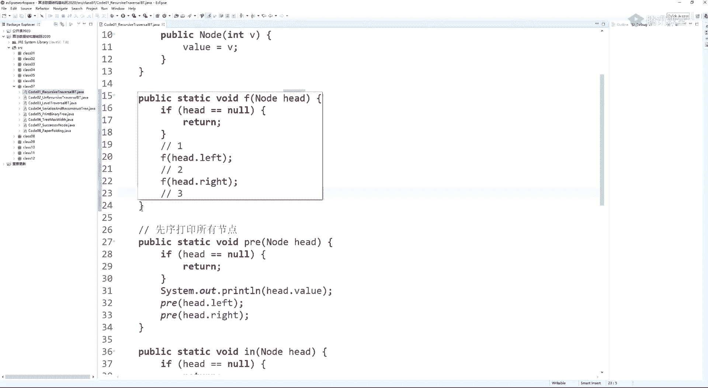

这就是递归序，对于图来说就是这样的，我们先来到一节点，来到它之后，函数告诉我们，你去你左数执行，我们就来到了二节点，来到二节点之后，函数又告诉你，请你去左述执行，我们就来到了四节点，来到四节点之后。

函数告诉你，你去你左数执行遇到空返回了四，函数告诉你请你去右数执行，遇到空又返回了四，三次返回啊，三次到达这回可是真的结束了，返回到二函数告诉你，请你往右数执行，你来到我左边遇到空返回了，回到五。

函数告诉你去右边执行，遇到空返回了又回到五，这回是真结束了，往上返回，第三次回到二，第三次回到二的时候是真结束了，往上返回，第二次回到一，然后函数告诉你，你往右执行来到三三，往左直行来到六六。

左数返回了，第二次回到六，函数告诉你往右执行又返回了，第三次回到六，这回是真结束了，往上返回回到三三，函数告诉你往右执行来到七七，左边返回右边返回两次，又到达七，这回是真结束了。

往上返回来到三已经是三次返回三了，真结束了，往上返回来到一递归虚，每一个节点都会到达三次，听懂同学打一一，好，听懂了吧，那什么叫先序遍历呢，就是你每一次第一次到达一个节点的时候就打印，他就是谦虚。

我们用三角来表示，哎我第一次到达了一，我要打印，这是我第一次到达二，我要打印，这是我第一次到达四，我要打印，这不是我第一次到达四，我不管，这不是我第一次到达四，我不管，这不是我第一次到达二，我不管。

这是我第一次到达五打印，这不是第一次，不是第一次，不是第一次，不是第一次，是第一次打印，是第一次，不是第一次，不是第一次，不是第一次，是第一次打印，六忘忘写了，你第一次到达一个节点的时候就打印。

他就是谦虚，你第二次到达的时候再打印，它就是中虚，你等到第三次到达时再打印，它是后续，先序中序，后续只是地工序加工的，结果，听不出来，打一，啊你们老师没有跟你这么讲吧，那我为什么要这么讲呢。

这说明任何一个节点都有机会去他左树转一圈，回到他收集一些信息，任何节点都可以向他右数转一圈，回到他收集一些信息，还能第三次回到他，把左右两个信息做整合，这是在树上做动态规划的基础，你现在不懂不要紧。

我们第八节专门讲它了，但是前提是你得理解什么叫递归序，理解吧啊为什么为什么为什么递归很强，为什么一个方法可以改出三种序列，只是打印行为不同，因为递归它很强，递归可以让一个东西来到三次，正是因为他这么强。

所以他随便加攻，先序中序后序，听懂同学打一，嗯，理解吧好啊。

我觉得这个东西已经讲的很细了，但是很少有人会这么听话，很少也很少有老师会这么讲好。

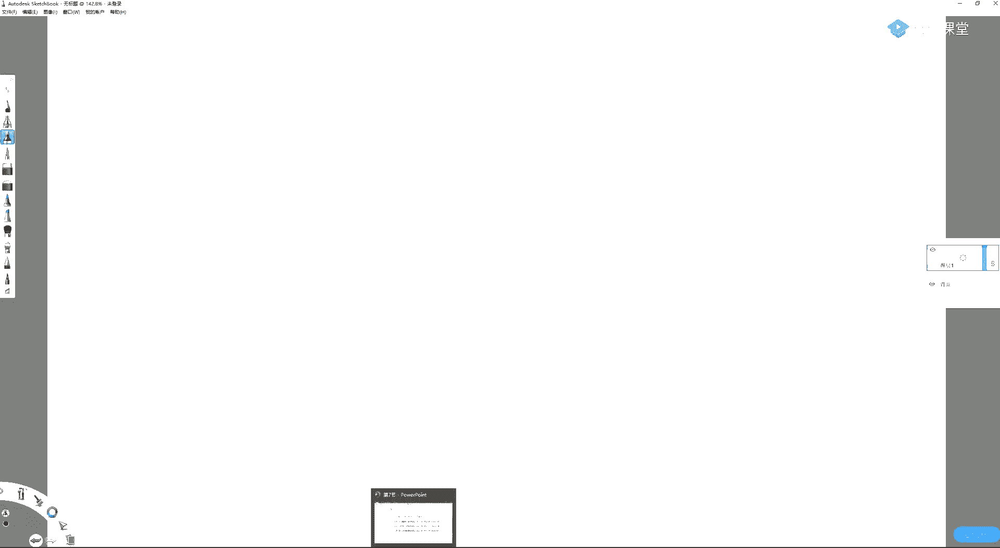

那么我们这个就属于我们这个已经完全理解了是吧好，那我们看，嗯实现先去中序后序遍历，你需要理解递归虚，然后先序中序后序都可以在递归序的基础上加工出来，第一次打印就是先序，等到第二次再打印，就是中序。

第三四它就是后续好，那么我们先来讲一个内容，就是怎么样用非递归的方式实现二叉树的先序中序后序遍历，任何递归函数都可以改成非递归啊，首先这一点你要明确，这不就是压战吗对吧。

那么你可以通过自己设计压榨来实现二叉树的先序中序后序遍历，这个在面试上也是经常考的啊，我为什么，下面我们就来讲一下非递归的方式怎么实现三种便利，不好意思，我先吐一下，我有点难受啊，稍等了两分钟。

不好意思啊，这个慢性咽炎是吧，早上起来喝水，喝多了容易吐，所以不要抽烟是吧，千万不要抽烟，别碰这个玩意儿不是啥好东西吗，这玩意儿什么抽象，没什么快感，不抽挺难受一个东西，所以搞得有严严，千万别抽烟啊。

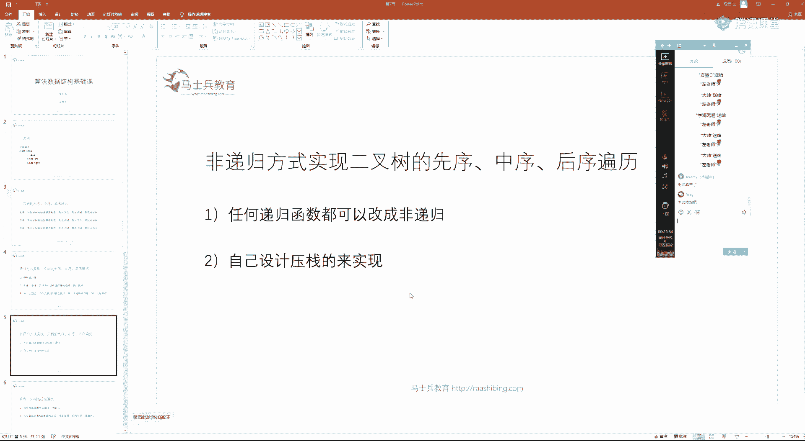

千万别抽烟啊，作为过来人给你提醒啊，然后你看这是我们的地，我们先说这个先序便利怎么样，怎么样用自己压榨实现，你注意我实现这个方法，你会发现它不是递归的，他就是一个迭代，你看他有自己要用自己吗，没有是吧。

那这东西怎么实现呢。

说起来挺玄乎，其实一点也不玄乎，给大家画个例子就懂了啊，那么对于这个非递归遍历二叉树的代码，我个人建议啊，你记住流程理解他，然后强记住就完了，因为他太基础了，理解吧，没有什么好解释的，就跟公理一样是吧。

但是我还是要解释一下，你怎么实现这棵树的非递归方式，实现先序遍历，怎么打印，做好一个战，那么方式就是你一开始先把头结点放到这里去，第一步啊，以后你就可以依次按照统一逻辑来执行了什么呢。

我们在弹出一个节点的时候就打印，所以先把一弹出，弹出就打印，让我们把规则记好，什么规则，第一条弹出就打印，所以弹出来之后就打一一，接下来注意如果有右孩子先压右孩子，如果没有就不押了。

然后是如果有左孩子再压左孩子先右再左，所以第二步，有有孩子就压入右，第三步，如有左，就压入左，就这么简单，没了，那好我们来执行一下这个一它有没有用，有三进去，这个一有没有左，有二进去可以了。

你永远以后永远别碰你了，不要了，然后我们继续重复这个过程，二节点弹出弹出就打印，如果有右孩子先压右，那就是五，如果有左孩子再压左，那就是四，可以了，不要了，然后继续重复弹出四弹出就打印，他既没有右眼。

没有左，就什么也不干，再弹出节点五弹出就打印，他既没有右，也没有左，就什么也不干，再弹出节点三弹出就打印，先压右再压左，所以先压七再压六，好结束了对吧，然后再弹六的时候打印什么也不干。

谈七的时候打印什么也没干，因为六七都没有左孩子和右孩子，这不是先去便利吗，看代码。

前面不用说是吧，哎这个先来个提示，我现在要打，先去便利了啊，先来个提示是吧，然后站准备好，第一步没什么说的，把头结点放进去，然后以后就可以跟着执行了，怎么了，站如果不为空。

你就重复我刚才那个行为，就这个行为这三点。

弹出一个节点啊，弹出就打印，右孩子不为空，先压右，左孩子不为空，再压左，结束。

这个道理是很简单的，然后我先压右再压左的时候，那就先压了右再压了左，然后我先处理的就是左了，因为战士先进后出的，那我处理左的时候，我又让他先压右再压左，但这可是我左树上的，先压右再压左。

哎你这样一发现正好是每次都先处理头节点，然后左子树右子树为什么要先下右再压左，因为站他会逆序啊，所以我先压右再压左，就意味着先弹先处理左再处理右，所以整个逻辑是对的，听懂他再打一连代码再解释都懂。

同学打个一，好的有了它之后，我们就可以处理后续了，很妙是吧，非常的妙，怎么妙呢，这个我们来讲一下怎么妙啊，你现在已经有啥了，先投对于每一棵子树来说，先投再左再右的便利，没错吧。

好那么我问你我我我如果是我现在想每一颗子数都是先投节点在右，减子在右还在右数在左数这个顺序请问怎么加工得到，很简单啊对吧，你你一开始是所有指数都是先投再左再右的，现在你对所有指数都想先投再右再左。

那你先压左再压右，你不就实现了吗，听懂同学打一，对吧，你先压左压右，你不就实现了吗，好那讲这个，那你那你现在可，那你就说如有左，压入左，如有右压入右，你就实现了对吧，你就实现了好。

那我们来看一下这种打印它的顺序，先把头结点放进去一，然后我们跟重复刚才那个顺序，一弹出的时候就打印，然后先压左再按右对吧，我改了，先压，原来是先压右，先再压左，先先压左再压右，所以二进去三进去。

然后就是翻出来弹出就打印，先压左压右，所以先压六再压七对吧，然后七弹出的时候什么也没干啊，就打印了之后就什么也不用干了，六弹出的时候也是弹出之后打印就什么也不干了，等到二弹出的时候，二弹出就打印。

先压左再压右，所以先压四再压五，对吧，然后我五四弹出的时候都什么也不干，所以五四好，那么这个就是我的头先右再先投再右再左的顺序哈，你逆着看它是不是后续，你头右左的逆序不就是左右头吗，这玩意不是后续吗。

你从你从右往左看他是不是后续，听懂打一，好如果是这样的话，那么在我打印的时候，我把它单独放到一个站里去，我不打印，就是我每个东西弹出的时候啊，我不是他的打印时机，我就把它放到一个另外的站里去收集他。

我收集完了之后，我在整个过程处理完之后，我再把那个我额外准备好的站，就是专门每一次打印的时候，把一个点压住的那个站，再从头弹出来，我不就实现后续打印了吗。

所以大家看代码，后续便利，准备两个站，这个s2 完全是辅助用的，s一就是我们那个站是头节点进入到s一里去，啥顺序，每一个节点弹出了，不打印，用一个s2 收集它，先压左再压右，周而复始。

等到所有过程都结束之后，我再单独处理s2 ，每一个东西打印出来，我就实现了原本的这个序列。

逆序打印，它就是后续啊，听懂打一。

对啊这样的额外空间需要增加一个容器，那么下面这个方法就是只用一个站的，我们后面再讲，因为他其实比较好玩，他也比较骚是吧，你可以认为他和我们昨天讲那个基数排序差不多少啊，这也是我自己写的是吧。

怎么样用一个站来搞定，但但是如果你觉得哎呀这个你不想秀这个技，那你每一次就老老实实这么写也行，但是对于我来讲，我要给你们讲一下，因为我们课上要承担两个任务，第一个就是让你懂算法。

第二个就是让你提高coding对吧，所以我会给你讲这个方法，我们把中序遍历讲完之后，再讲第二种后续便利的方法，好吧好，我们看中序遍历。

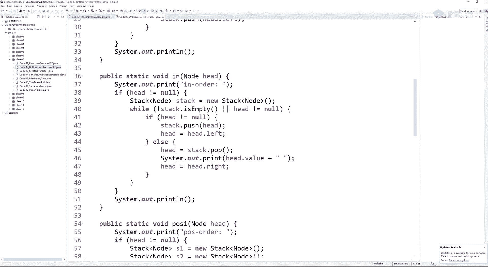

中序遍历呢，也是准备一个站，我们先来看一下它的流程，然后解释一下他是为什么啊。

他的流程是啥，大家看一下代码，直接看代码吧，你看的可能会比较晕，他一上来啊，他准备了一个站，接下来你看这个while就写的很烦是吧，如果占不等于空或者头节点不等于空，这两个条件，然后你再看看发生了啥。

如果头节点不等于空压入头节点，头节点往左窜，然后又进到这个while里面来，如果头节点不等于空压入头节点，头节点往左窜，然后又到这个while里面来，如果它头点不等于空占压入头节点，头节点往左窜。

所以在干啥，这个函数这个while一进来，如果他面对的是一颗子树的节点的话。

那么它它会不由分说直接把整棵树的左边界先给我压到站里去，就这个意思，头节点如果来到啊，它不为空压入到战争里面去，头节点往左窜，如果头一点不为空，不由分说直接压到站里去，然后头有点往左窜，如果不为空。

不由分说要到这里去，头节点往左窜，窜到空了，才有第二个逻辑分支。

所以你可以理解这个代码就是我只要一进来，我就把整棵树的左边界全压到这里去，其实就这个过程。

当我压不动了，但我压不了了，什么意思，头几天已经来到空的位置的时候了，他才会走第二条逻辑好，所以我们说这个第一条逻辑是什么，就是整条左边界依次进站，就第一条逻辑是整条，左边界，依次，入站。

这就是我第一条逻辑啊，第二条逻辑就是当我穿不动了，当我已经左边界已经处理完的时候。

发生了啥对吧，els就一定是我穿不动了，我没有左边界，再让你穿了，干嘛呢，弹出节点就打印好。

我们看弹出节点就打印，所以四弹出就打印。

然后，来到右数的位置。

哎这看上去那我那我害得来到四右数的位置，不还是空吗，没错，所以下面又穿不动了，再弹出一个节点，二弹出就打印，头节点来到这个弹出节点右数的位置，它就会来到五，如果以五下面还有一整条左边界，就重复了。

条件一，但是在这个在这种情况下呢，五只有他一个节点，所以五自己就是它左边界唯一的点，所以我们也会进入条件，一直是没有压入那么多而已，所以就只把五放进去了，接下来high的又来到五的左孩子的位置。

他又窜不动了，所以第二条逻辑是啥，就第二条逻辑就是当我第一条逻辑无法再命中了，一无法再继续了，我就弹出节点并打印，然后来到弹出节点的右数上继续执行条件一，来到右数上继续执行条件一好。

我们把整个只要把整个过程先串一遍好吧，把整个过程先串一遍，所以你看我当时弹出四就打印了是吧，弹出二就打印了，那么二呢就来到他右数上继续执行条件一，整条左边接入站，所以五就进到站里去了对吧。

然后had它又窜不动了，所以干嘛呢弹出五就打印，然后还会来到五的右数上，它又窜不动了对吧，接下来干嘛呢，就弹出二节点就打印哦，哦哦哦刚才二已经弹出了是吧，刚才二重新来一遍吧是吧，刚才有点有一点模糊是吧。

所以就重新来一遍，第一句，一进去二进去四进去，然后四节点来到空，弄不动了，开始执行条件二，如果一无法继续执行了，弹出就打印，所以弹出四就打印，然后来到四个右数上继续执行条件一，那么四的右数是个空啊。

所以条件一其实判断了，但没执行动对吧，于是就又执行二，因为他执行不下去了，他又数没节点嘛，就又执行二，执行的时候啥弹出就打印，所以二弹出就打印，然后去他这个二的右数上继续执行条件一。

所以五就该进去了对吧，所以五就进去了，然后五进去之后，它就只有一个节点，它再往左窜，他没有左边界了，所以又是空干嘛呢，就执行条件二，弹出就打一，然后去五的右数上去执行条件一，但五的右数是空。

所以没执行条件一，他不执行了吗，其他执行了，只是他没有节点，那就又执行不动了，干嘛呢，韩初就打印，所以这个时候一弹出就打印，然后去他又树上继续执行条件一，所以三六进去，然后他就又执行不动了。

就执行条件二弹出就打印，弹出六就打印，然后去右六的右数上继续执行条件一啊没有，所以你下面弹出三打印去看右数上再次执行条件一好，那就三弹出之后七进去，然后又弹不动了，最后等七弹出来，其弹出的时候就打印。

七的右数也啥也没有，结束，这个流程我们再看一眼这个过程。

如果你能够执行条件一，你就一直执行，head不等于空，就是你现在能够还继续往左窜，你就把整条左边界压到这里去，当我这个条件一执行不动了，我就会进入条件二弹出节点并打印，然后去来到他右树上。

继续重复条件一，有关于这个流程，听明白同学打个一，然后我们来解释一下啊，这个东西是啥。

为什么呢，其实你可以这么理解，我们来举个例子。

我们话多一点节点，这棵树吧，我用一个什么视角来看这棵树，注意整棵树是可以被左边界分解掉的，啥意思，这是整棵树的左边界嗯，这是他这棵子树的左边界，这是这棵子树的左边界，这这颗子树的左边界。

这是这颗子树的左边界，这是这颗子树的左边界，这是这颗子树的左边界，是这棵子树左边界，整棵树是可以完全只被左边界分解掉的，那么当我把左边界依次压战的时候，我是先压头节点，然后左边界后续所有压进去的。

这可是在站里，所以你可以认为，如果我只以左边界的视角来看整棵树的话，对于任何一条左边界，它弹出的顺序都是先左在头，没错吧，对于任何一条一条左边接的弹出顺序都是先左在头的，那我们同时要注意到。

我这个节点把我整条左边界要依次进站，我在返回的时候，可是这个东西返回了，打个对勾，你返回了打个对勾，然后去我右树上继续这么执行，那么对于你看，对于这个节点来说，他一定是把自己左数处理完了之后。

还会轮到这个头节点的，然后轮到他之后，他再让他右数继续投，左要继续左投，所以整个顺序也就是说我把整我把整棵左树全用他自己的左头分解，我把我整棵幼树全用他自己的左头分解，而我们整体执行的顺序是。

只有当你左边界弄完了，你才会去你的右数上继续左投的分解，所以大顺序就是先左再投再右听我同学打一，当然你如果不懂的话，不要紧是吧，你就我已经说了是吧，这个东西没有那么好理解，他没有谦虚跟后续好理解。

所以你就自己可以记一下吧，以后你就这么写吧，你写熟了你就知道它有啥用啊啊简单给你解释一下，它实际上也没什么好说的，其实啊就这么记就行了是吧。

嗯中序遍历呢就是讲完了是吧，cd归版本，那我们先来看一下这个这个玩意儿啊，我好久没有讲他了，我之前的课都是给大家，这是我写的，我写这个方法写的有几年了，但是好多课呢都没有没有怎么讲过他啊。

所以这个班讲的也是隔好久才讲的啊，我来看一下这个方法，它其实是用用一个站来实现后续便利啊，他说的是啥，那我们都准备好这些引用，你会发现这个引用它其实是只有两个很实质的，第一个引用就是h自身。

这个是我是我是其实我在不断的复用它的对吧，你看这个h有设置值的时候，所以我们先准备好两个值，一个是h还有一个值就是c是我准备好了两个引用啊，然后我就准备了一个站，也就是说我们看流程的时候。

只要关注三个东西的变化，第一个h的变化，第二个c的变化。

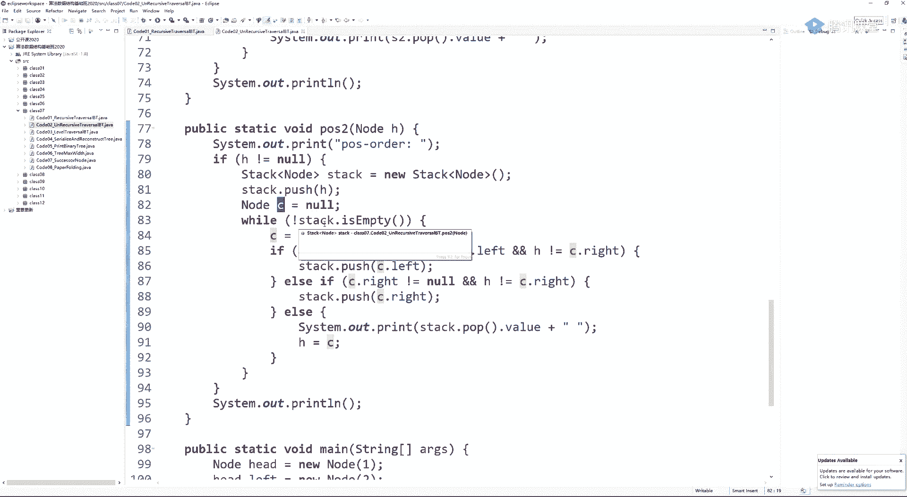

第三个就是站的变化好，我们先画好一棵树，又在搞后续是吧，只是后续炫技版是吧啊，看这些方法真的是非常妙的啊，他绝对能给你带来一些思想上的一些冲击，或者说coding上的挑战，给我们讲一讲吧，站准备好对吧。

那么还有两个变量没事，我用啊，我直接在这树上画是吧，h箭头指到了哪，c箭头指到了哪儿。

可以吧，那我们先开始一开始站中把h压到站里去了，c一开始等于空，也就是说c这个箭头没用到，但h是指向开头的对吧，一上来就指向开头嘛，所以h是指向一开始是指向开头的。

h一开始只想开头的战争呢，先把一阶也放进去，那么我们接下来h跟c指哪儿就行了是吧，c一开c现在没有指c，现在指向的是空，开始怎么实现了。

后续呢来看，如果不等于空就继续好，现在的确是不等于空的，pk让c指一下c去指指一下那占的pick是谁占的。

pick是一顶部，注意是pk没有弹出对吧，它只是让我指顶部节点c c指向1c指向一两个东西都指它，那我现在就可以正式c就可以登场了是吧。

然后看一下，左孩子不等于空，并且，h不等于c的左孩子，并且h不等于c的右孩子，看都成立还是不成立，咱们来看一下，你这我们先把流程转一转，逐渐你就知道c跟h跟c它到底是门道是啥了。

我是想用这个目的来说明懂啥意思吧，就是你发现规律。

你怎么发现，就给你先讲这个h跟c到底是干啥用的，一开始讲可能会比较困惑是吧。

所以我们先过例子嘛，那我们来看一下，那你成立吗。

c的左孩子是不等于空吗，现在是的不等于空，因为现在c指向的是头节点。

它左孩子是不等于空，然后再看，h是不是不等于c的左s是的，因为a是等于c，h是不是不等于c的右孩子是的，因为h现在等于c，所以这个成立成立怎么办，战中压入c的左孩子。

战中可没有弹出这个一，但是把他左孩子压进去了。

c的左孩子是二，所以压进去了，除此之外发生了什么变化吗，并没有，如果我中了逻辑分之一，其实我既没有去设置h，也没有去设置c c只是在第一条被设置了，接下来逻辑分之一跑完之后就重新执行while了。

所以我们继续看，所以c其实非骑士啥其实没有设置是吧，在他之后没有设置啊啊然后继续继续继续。

那就是在pk对吧，站中c再来到他pk的位置，所以c往下移动，它就会来到二位置，往下移动它就会来到二位置，其实还是没有弹出pk。

那么现在看第一条逻辑分支成立吗，c的组孩子是不是不等于空，是的，c是不等于a c h是不等于c的组子，废话h现在是c的负，当然不等于，是不是不等于c的右孩子已经说了，告诉你他是负了，当然不等于。

所以第一条逻辑分支又重了干嘛，c的左孩子进去。

a4 进去。

然后就没了，然后再去跳进这个while里面，来继续执行好的地域执行c又来到他pick的位置。

c在这，此时逻辑分之一就不成立了。

c的左孩子等于空了一道分支，跳过，对吧，第二个c的右孩子不等于空，并且h不等于c的右孩子吗，没成立，还是为孔，所以跳到第三个逻辑分支好大in，当前栈顶元素的值h来到c的位置。

所以发生了啥，弹出打印。

函数打印，然后h来到c的位置。

a是直接跳到c的位置。

这个while，那继续这个while，一上来c就会来到站pk的位置。

c会来到二，下面这个过程你就逐渐感觉到有门道了哦，c过来到二。

左孩子的确是不等于空的cv啊，h不等于c的左孩子吗。

不是的，h是c的左孩子。

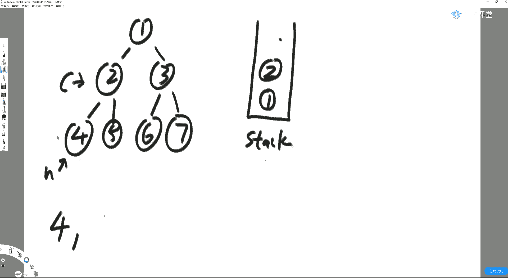

所以第一条分支没中，右孩子不等于空，并且h不等于c的右孩子吗。

这条中了谁的业务，孩子的确不等于空。

而且h也确实不是c的右孩子，所以干嘛。

加入他的右牌子，那么接下来继续就是c继续来到战争pk的位置，一条逻辑分支没中，因为c的左孩子跟左孩子等于空。

第二条逻辑分支也没中，因为c的右孩子也等于空，c的左孩子为空，c的右孩子也等于空，所以前两条都没中，那就一定会中a死，打印当前站点元素的值。

都打印了。

然后h来到打印这个节点的位置。

这是蹦在这儿了。

然后继续重复弹出了五，已经弹出了，刚才重复啥呢，c回到pk的位置，哪个逻辑分支中了。

c的左孩子不等于空吗，是的c h不等于c的左孩子吗，是的h不等于c的右孩子吗。

没中h等于c的有孩子。

所以第一条逻辑分支没中逻辑分支，c的右孩子不等于空吗，a是不等于c的右孩子吗，等于也没中中了，第三个打印。

啥意思，他是这样搞的，当前来到的节点是c虽然他没弹出，如果我上回打印的节点h节点它正好是我左孩子，因为我想做出后续来，如果h永远跟踪的是上次打印的节点，没错h它会永远跟踪上次打印的节点。

在这儿呢是它会永远跟踪上次打印的节点，这个c一开始是pick，然后你打印的时候，它弹出节点本身它其实就是pk理解吧，然后h来到c就等同于是在跟踪刚才弹出的节点。

那么如果一个节点上回打印的是我的左孩子，说明啥，我该开始搞我的右数，弄完之后再打赢，我，如果上回打印的是我的右孩子，说明我左孩子和右孩子都打印完了，打印我之后往上反a就卡住了，当前打印c的位置。

具体解释的细节一点，具体解释的细节一点，它就是说，我想记录整个就说我来到一个节点的时候，不过我发现我左树没有处理过，我怎么知道我左数没有处理过，如果我左数都处理完了，他上次打印的节点是谁。

后续如果我左数处理完了，他上次打印的节点就应该是我的左孩子，可以知道a是会来到左孩子的位置的，这就代表我左数处理过了，同时什么叫我左数处理过了，还有一个条件就有可能是我已经把左数处理完，右数也处理完了。

这也叫我左数处理过了，那么如果是这种情况，那么你h就会来到他右孩子的位置，因为是后续，后续是先左再右再中，真的如果我发现h上次打印的节点是我的右孩子，我也代表我左数处理完了，什么叫我当前节点。

我怎么知道我又数处理完了呢，h来到他右孩子的位置，上次打印的节点是他右孩子的位置，就代表我右数处理完了，这种情况下，我就知道该打印我了。

大家看一眼这三个逻辑分支，你就知道了，我孩子不等于空，并且h不是c组函数的，这就是代表上次打印的h不是c的左孩子，并上次打印的节点也不是c的右孩子，那你这个c是啥听到的，这个c的左右两个数都没处理呢。

你给我去搞左数，去先搞左数，如果我左数弄完了，我已经确定我左数是处理过的了，我看看如果c的右孩子不等于空，并且上次打印的节点不是c的，幼孩子会代表我又数没处理处理右数据，如果前两个分支都没中。

说明左右两数都处理完了，搞你自己返回设置h跟c就是在卡逻辑，利用临近状态的关系标记当前节点，左右两处处理完了没，我同学打一，我没跟上思路，没关系啊，没关系没关系啊，你现在现在我们重新来过一遍例子。

有这么多同学答案，我肯定是要重新讲的，你就认为第一个逻辑分支就是当我左数没处理的情况下，我去处理左数，二个逻辑分支就理解为当我又数没处理的情况下，我去处理右数，有一个分支就代表我左右两竖都处理完了。

我该返回了，按照这个思路再过一遍例子，你看你有没有什么体会。

在哪。

一开始在头节点的位置把战中放入了。

hc指向的是空，其实这里面有一个处理什么，如果你从来就没有打印过任何节点，只要保证h来到一个不会，你该不会干扰你代码的位置可以了，听懂他还打一，如果你没有打印过任何一个节点。

你只要保证h处在一个不会干扰你的位置就可以了，用他来打一一，只有当我们打印完了之后，h才被正式赋予了它实际的含义，听懂这个意思吗，听懂他在打一，没懂打二，当我们第一次只有当我们第一次打印的时候。

h才被赋予了正常的含义，那么在这之前，啊你我们想要做到先左在右在头的便利，其实这个代码你也可以直接写成什么，我就先让我左边界进站行，然后你打印一个节点之后去接我们这个逻辑也是对的。

或者你让h处在一个不会干扰你的地步，你总走逻辑分之一。

永远是先处理我的左数。

懂啥意思吗，我一上来整棵树我是没有打印任何节点的，但我知道我需要搞后续的，其实你也可以认为我一开始不由分说。

先把我的左边界进站，如果你想写成一份代码，你就要保证是处在一个合适的位置，让你左边，让你第一个逻辑分支走到充分的条件，就是把整个左边界走完，对不对。

好，那么我们注意我a是为什么一开始不动，就是这个目的，我们看一下，先把一放到头顶，先把一放到这里去。

然后来看战中的pk节点。

一就来到了一，h处在的位置是不是不会干扰他走逻辑分之一，是的，我保证我处在一个很好的位置，我就可以去走逻辑分之一，别干扰我去先把整个左边界放到这里去，h一开始其实是无意义的。

你只要保证它不干扰逻辑分之一就行了，所以总走逻辑分之一就是我总是先处理我的左孩子对吧的位置，左孩子不等于空h因为是我设置的，不会干扰你的东西，所以当然不会干扰你，他不是你的左孩子，他也不是你的右孩子。

那你其实前几步就是很顺利的把它组孩子加进来，听没听懂啊。

这就加一发现h不是他左孩子，也不是他有孩子，他也有左孩子，二进来就会来到pk位置，二，是不是你的左孩子，是不是你的右孩子，你的左孩子又有四进来，1~4。

c来到四的时候，就是c现在等于pk了，c的左孩子不等于空吗，等于空，c的右孩子等于空，所以前两个逻辑分支都没中，这说明啥，这说明你左右两竖都处理完了，只不过它是空而已，别弄你了。

所以打印，出打印，是被正式赋予了一个含义，上次打印的节点是会来到四的位置，可是上次打印的节点了哟，好再来到pk的位置，c来到二，这种情况下，我问你，我左数处理完了吗，处理完了我怎么知道他处理完了呢。

因为h上次打印的节点是我的左孩子，就是说对我左数来说，它已经完成了先左在右在头部的打印了，所以他上次打印的节点是我的左孩子，我就可以忽略掉左数去搞右数了，他怎么知道我的右数处理完没处理完呢。

因为上次打印的节点不是我的右孩子。

我可以去找第二个分支，我诱孩子是不为空，且h不是我有孩子的，刚才打一，所以我们继续我就走了。

我的右第二个分支啊，我终于可以让皮克节点死十的c结点的右孩子去走了，你想一下，你现在是来到的位置，如果五下面有一坨节点，它整条左边界会不会非常顺利地进到站里去，因为这个h如果来到这个节点。

你现在来到五了，整条左边界在进的过程中，h是不会干扰到的，如果左左如果五左边继续有一大坨节点的话，在这里面他没有，我说如果他有的话，a是处在的位置，是不会干扰你继续去走，关于五这棵子树的逻辑。

分之一的听了打一，好那在这里面没有没有，我们就不废话是吧，没有我们就不废话，那干嘛呢，五开始进去了，五进去了之后就会来到pk的位置，五位置他既没有左孩子，也没有右孩子，说明说明我这关于五这个节点。

我处理完他左数了，处理完他又输了，只不过它是空而已，打印五，打印五，然后c再卡住pk节点的位置，c又来到这了，in 5了，h就会来到上次打印节点的位置。

我们只要打印就会来到pk的这个p这个c的位置是不是pk，你是不是刚弹出啊。

所以h就是来到刚打印的位置，再看我现在这个c卡到二上了，我左数处理了吗，处理了我怎么知道的，我那右数头节点都打印了，那必然是左数弄完之后，右数也弄完了，才出现这种状态的，所以根本就不用去管左数。

这就是为什么我们判断左数有没有处理。

要关心h是不是他右孩子的原因，右孩子代表连我右数都处理完了，你左数当然处理完了。

再看我，我又数都处理完了，所以我不用处理我左数了，我上次打印节点是我又输了头，我也不用处理了，我彻底他就完事了，你打印往上就得了，整个代码它就串起来了，听我同学打一，七打二的同学现在懂没懂。

就是在用设置这个h上次打印阶段的位置来标记此时的头，暗中的头节点，它的子过程有没有完毕，就这件事儿，啥意思啊，这是一种非常极客的写法啊，当时我写出来。

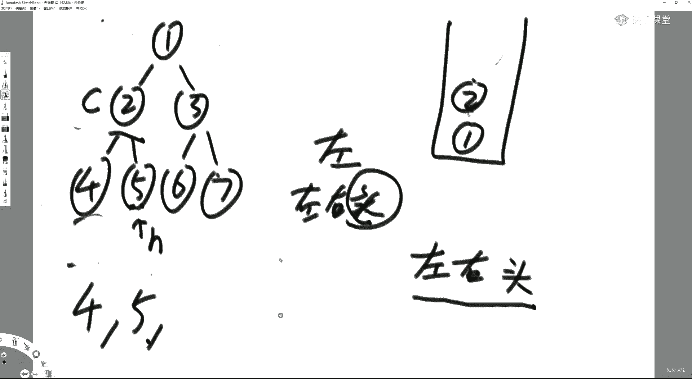

其实，因为我其实知道你用一个战士能够搞定所有的是吧，但是虽然他可能比较扭曲是吧，这个代码本身就是这么回事是吧，把逻辑分之一当做左数有没有处理的逻辑来看，也是右数有没有处理逻辑来看，当然这个h的解释。

打印之前你别干扰我去压左边界，打印完了之后，你要确保可以用你来标记我左右两个数有没有都弄完，基于这样一种设计去写代码啊，好可以吧，嗯那么这就是我们这个递归方法和非递归方法去实现数的便利。

尤其这种方法还蛮骚的，是我们现在看继续啊。

层遍历是吧，休息两分钟吧，休息两分钟，因为从距离我上次吐到现在也已经50多分钟了吧，休息两分钟，这个没关系，讲得慢，我们就拖一下，反正就课的时长，我一定要是一定会不够的，肯定会给大家讲完，好吧，还不够。

我们就讲了15节，16节啥的，两分钟继续啊，我把这个代码给大家看了，大家再看两眼好不好。

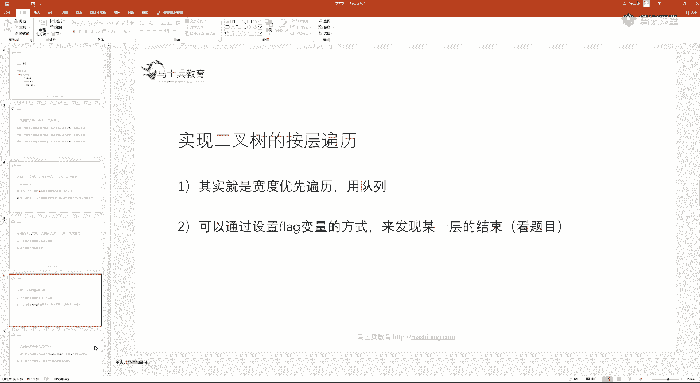

继续，我我我我下周肯定会把源代码搞到b的github上，太忙了，我总是找不到他是吧，他要么就是发发发验证码的时间早就已经过期了，搞一个我自己的gp，然后把代码传上去，你们直接down。

然后等到他们想起来之后，我再去用域名了吧，好吧嗯，就是就是企业版的那个b的账号好吧，其实公共资源是吧，关键是怎么解释，来看一下这个。

下面继续实现二叉树按层遍历，其实呢就是二叉树的宽度有限便利就是举个例子啊。

就比如说，顺序是1234567，这样来按层遍历是前面又有一个八，这边有个九，然后其他店都没了，然后九后面有呢八后面这有个十，这有个11 九后，这有个12，有孩子没有这样一颗奇奇怪怪的书。

那你下面就要先打印八九再打印，在打印八九对吧，然后再打10 11 12，按层一层一层的输出。

所谓的二叉树的按层遍历，它是用队列的啊，嗯用用队列的，我们在图的时候还会再讲一下图的便利啊，图图在图便利的时候，它就要加结构了，再加一个set，为什么，到时候再说是不需要二叉树，是不需要的。

一个队列就够了，可以通过用设置flag变量的方式来来发现某一层是否结束了，我们先看第一个啊。

先看第一个怎么实现宽度优先遍历，用队列的方式很简单，这就是这个这个数的便利，准备一个队列对吧。

准备一个队列啊，我们来画一下啊。

是吧。

然后就是同点进到队列里去啊。

一就进去了嘛对吧，一直接怼到这儿了是吧，他是一个队列排队嘛。

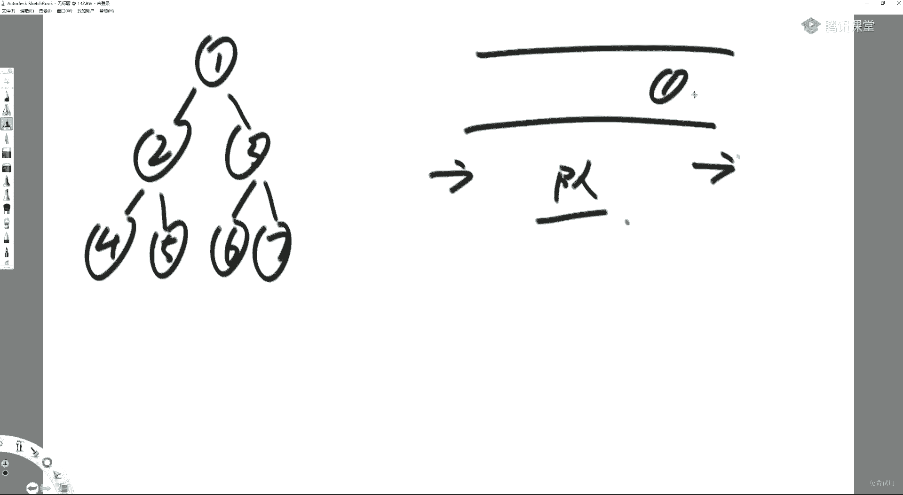

一进去之后干嘛呢，你你你你开始整个队列的判断，如果队列不等于空，就继续，现在对，这的确是不等于空的是吧，它方式巨简单谈，从队列里面拿出一个拿出就打印，先加左再加右，结束了。

真实是这个过程也是非常顺的，一弹出就打印，先加左再加右，所以2314进去，然后再弹出二打印4514进去，三弹出就打印，弹出就打印，671次进去，永远在玩队列，每一个节点先左再右，每个节点先走。

那你那你队列的顺序它就是按藏计时，按g是在队列中按层一层一层加的，也是在队列中输出的，就这么简单，听懂他在打一，下面我们玩一个比较骚的啥呢。

诶这个啊，这个题就是我现在有一个问题，就是请你统计二叉树的最大的宽度。

哪一层节点数量最多，我就认为它宽度最大，这一层节点数量是最多的，层的节点数量有几个，我就认为它宽度多大，你要告诉我。

他并不一定是最后一层，比如说我最后一层如果只有一个八，只有一个九的话，最后一层的宽度其实只有二，是这一层是最宽的，要求什么，这就要求我们不仅能够按层一次打印，我们还得发现某一层开始或结束能打一。

所以我们来看这道题，你你这种发现每一层的开始跟结束这件事情你得做好，他就会比单纯刚才按层它整体的东西还是按层便利，但此时你要加机制对吧，在这个在这个宽度优先遍历的过程中，你要加一个机制。

就是发现一个层开始了或者一个层结束了，我们可以说我们如果可以发现每一层的结束就够了，因为你这一层结束就势必这意味意味着下一层的开始吗，或者我我们可以用一种机制实现我们发现每一层的开始，这也行行。

你发现每一层的开始或结束可以限定在我，只要能够发现新层开始就够了啊，或者你我只要能够发现某一层结束，这也够了，因因为每一层的结束一定意味着下一层的开始对吧，这是一，所以其实只有建立一个发现机制。

其实也能够实现好，我们来看一下。

不不卖关子了，求最大宽度的代码，那我们先看第一种方法，就是用map的方式，我们去发现层数开始或结束，我们选择用map的方式，但是不用map的方式，不用mac的方式，就是我还是要用队列。

但是我用有限几个变量，我就可以发现每一层的开始或结束了，那么用跑的方式呢就会更直白一点，啥意思，大家看准备一个队列。

哦我们我们拿例子来过是吧，别别别，你搞乱了是吧，123下面是4567，下面来个八二个九吧，这棵树还是这么一个队列，此时我们要加机制。

加什么机制呢，我们看用用map的方式是一个经典面试题了，而且经常考啊，求数的最大宽度，那么有一个队列把这个头节点加进去。

这不用说啊，好加进去，一加进去是吧。

底下有一个level map，map是啥意思呢，它这个它这个map它是一个node，是key整数，啥意思，就是，从，这个信息它就是value，level map的含义。

你这个node它在哪一层都存在level mac里，那么你进队列的时候，我当然知道害的在第一层我就加入head的，他在第一层，那么底下这个变量是啥呢，就是，说你现在在统计当前层的啊。

你现在统计的层数是哪一，就用这个变量对吧，当前，正在统计，一层的宽度，就是当前层的意思，那么你当前统计就是你当前正在统计哪一层的宽度，那么这个宽度是多少呢，就他这个当前层。

就是上面这个current level层，宽度目前是多少，为什么是零一，我们约定好一个节点，它出来的时候再把它加到宽度上去，就是为什么我害得进去的时候，我不让他是一，我一律规定好，当一个节点出来的时候。

我再把它当前层的节点数加加，max就是你更新的所有层的宽度中的最大值，我拿max给它抓住，返回这个max，理解这个意思吗，这几个变量都明白，同学打个一，我们进去的时候，我们不统计出来的时候。

再把它的数量加加到当前当前层的宽度上，懂得对吧，这就是为什么我害得进去的时候，我不算它，它出来的时候我再算，大家看一下，那就下面就是对列，再要弹出了好队列弹出了一个节点好。

我们把它标记好，把这啊这这我们有一张map是吧，这这这这这是我们的level map，标记好一这个节点它在第一层是这个意思吧，我们建立好了这个记录了吗，同时我们有几个变量写中文啊，当前层是多少。

前层是多少一层，那么当前层当前层节点数是多少，因为这个还没有出来节点呢对吧，所以是零个，那么全分局的层数，就每次统计的时候，当前层的也就是全局max现在是零啊，你这总有总有更新它的时候，你不用你。

你放心是吧，好我们现在就开始了。

是便利了是吧，第一个节点的时候，current啊。

哦便利了，我就把一一给拿到了。

出了嘛对吧，他从这里面弹出了，弹输的时候，我因为我当时在加入这个节点的时候，我知道他在第几层，所以我当然可以把level map这个当前节点在哪一层给取出来，当前节点的层数是个临时变量好。

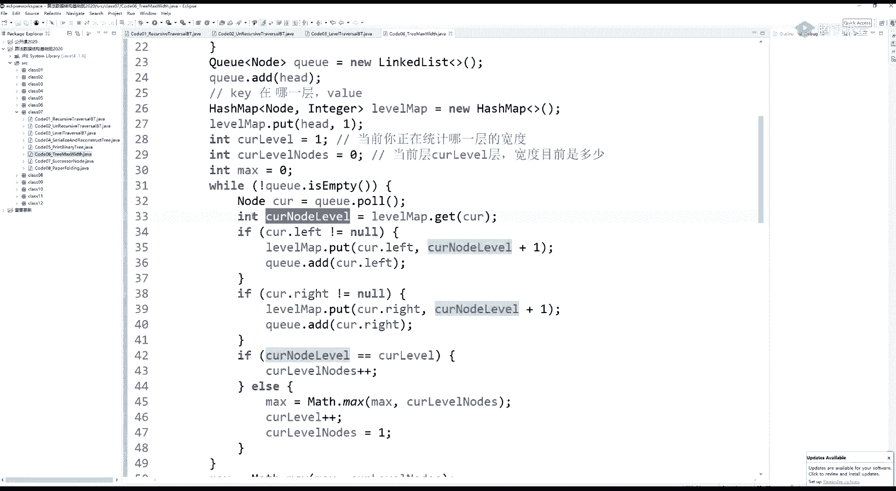

那我就取出来了，我有level map，我就知道他在第一层。

就知道他在第一层，他如果左孩子不等于空列中加入左孩子，同时标记一下左孩子的层数，我为为什么知道他是加一，废话，你当前在这个层，你左孩子他能不是加一吗。

以我们可以很顺利地把一的组s2 放到队列里去，并且直到二它在第二层。

右孩子也不等于空，把右孩子放到队列里面去，当然也可以建立他的记录，又孩子在第二层，所以这每一个节点它在哪一层的记录是什么时候加的，都在入站入队列的时候加。

我当然也可以知道三节点，它也在第二层，然后。

开始更新我层数的统计了，上面你可以认为是宽度优先便利，只是我把level信息也也要建立好吧，这很好理解，如果我当前节点所在的层数和目前统计层的层数一样，那你这一层没过期呢。

那你当然要把当前层的节点数加加，这完全没毛病是吧。

你看我当前确实统计的是第一层的东西，你这个一节点弹出的时候，它也是第一层的东西，那我当当然要算到目前统计上来好，我在当前层的节点数我就发现了一个了。

啊好我发现了一个的状态下，前层没有结束呢，所以我就不更新max了，统计完没有中else它就会重新执行这个while好，那么在重新执行这个while的时候。

你当前层是一，当前节点数是一max，没更新好，继续遍历，当我二节点出来的时候，禁他的时候，我就已经记录好它的层数了，我当然可以得到它的层数，他在二层上二层上啊，二节点也进去了，三节点也进去了啊。

这个一的时候二也进去了，三也进去了。

然后现在要弹出二，弹出二的时候的时候，它的层数就可以得到左孩子和右孩子，如果有的话。

进队列，并且建好level ma非常顺的，我既有左孩子，也有右孩子，所以四五进去，我在第二层，我的孩子都在第三层，就没有任何问题，所以四节点在第三层，五节点也在第三层。

注意看，我现在的节点在哪层，二层上，我中没中，第一个逻辑分支我没中没中，说明什么，上一层该结算了哟，上曾要结束了哟，所以干嘛把一层的抓到的节点数，你们现在可以结算了，怎么结算，拿去跟全局max比较。

我就抓到了目前为止的最大宽度十统计的层数，也就是说上从当前层的一我姐我统计完毕了。

我现在来倒是第二层的节点，我统计完毕了，所以最大宽度被我现在俘获了，当前层数把它给给max，我现在来到第二层了，ok当前层我就要变到二，是新层弹出的第一个节点，所以当前层节点数设置为一，你已经弹出了。

千层，当前层的节点数直接设置为一，因为此时弹出的current就是新层的节点。

二的工作就做完了，三出来的时候他也可以得到它在二层怎么得到level map拿到会把他的六，它的七加到队列里去，也会建建立六的节点数在三，七的节点数也在三，因为他自己在二层。

那么此时我二层跟当前层是不是一层，是的，所以说明我这一层还没过七，节点数变成二，还没有结算，所以不更新max，我在四层出现的时候，他他可以通过live vip知道他在三层，就知道我上一层统计是过期的。

我把我当上一层的统计去更新这个max，它就变成了最大宽度为二了，同时我新的层开始了，你是第一个，所以设置为一，利用这种机制，我每一次都可以发现哪一层是否结束了，新层是否开始了。

我从开始的时候，这个就是else逻辑，我就把上一层的最大宽度更新，这个max横加加，心疼的节点数设置为一，如果我当前层没有过期，我就只把当前层的节点数加加就行了，但是。

即每一层的最大宽度是否要更新麦克斯的机制，当你有最心疼的时候，你才能去把上一层的结果让他去更新max，那就一对着你最后一层其实并没有触发更新max的机制，所以你不要忘了，当while遍历完成之后。

你要单独再更新一遍max，因为你的最后层也没有新的层去结算它了，听懂同学打一，我们用map的方式，说白了就是很简单的一件事儿，什么呢，每一个节点在进队列的时候，现在进队列的时候把它的层记好。

我是可以知道它在哪一层呢，因为我知道它父节点的层，我就知道它子节点的肯定是加一层的东西，那么这节点弹出的时候，我就势必能够拿到它的层数，如那我当前统计的是一层的，那我这一层的节点数加加就行了啊。

它我当前的节点层和我当目前统计的层不是一层，说明新的层开始了啊，新的层开始了，你就把上面一层统计的结果让他去更新max，因为我要记最大宽度，同时是新的层数另起了一层节点数，从一开始继续统计。

但是这种机制一定是新曾到来去结算老层，每一个新层到来去结算它上一层的老层，那么就一定意味着最后一层是没有被抓过，那么你不别忘了，最后时刻你要单独抓一下最后层的记录，刚才说很懵的同学有没有懂，应该是啊。

小陈陈同学，你懂了吗，懂了是吧，嗯，好所以这就是我们用map的机制，还要给你看，不用map的机制，我不想用map，我就用一个队列，怎么实现也容易。

我们再来过，这个不用map了。

我们怎么知道一层结束了，就这件事儿对吧，用一个队列，用有限几个变量了，我们先来把这个变量都列一下。

叫current end啥意思，它表示的是，潜藏，前层最后一个节点是谁啊，层的最后一个节点就是最右节点是谁，或者这么理解是吧，当前层最右的节点是谁，什么意思呢，就是所有下一层的话，下一层最右节点是谁啊。

我们的全局max不不就是在这个过程中，我要更新最大宽度，这个节点，老朋友了，前层的节点数，唉少一个少，就是你到底现在在统计哪一层，对，其实并不关心我到了哪一层，我只要能够把每一层，见他结束的时候都找到。

其实我并不关心哪一层出现这个最大的宽度，你只要让我每一层都能够发现，结束的时刻更新一下麦，每一个图都能发生，结束的时刻更新一下max就行了，其实严格来讲，我并不关心我到了哪一层，听我同学打停。

我没有道理非得关心哪一层吧对吧，我我要的是最大宽度，你管我在哪一层发现呢，只要你能让我每一层都发现结束就行了，好那么所以我们看你你你你这个头节点进队列了，那你对于你头节点所在的层是不是最右的。

的确是，这不是显而易见的吗，你这一层是不是一是最右节点，是的，所以我们这电量怎么设置，一上来当前层就current n，它最右的节点确实是一，那么你说我下一层最右的节点是啥呢，我他娘的知道是啥。

我根本就不知道对不对，空，知道吗对吧，下一层我还没有遇到任何节点。

我当然不知道，所以怎么办，就设置为空，那么当前层为什么是零，还是那句话，弹出的时候统计统计。

所以我就那那么我我们当前层单层的嗯，note的数量，然后有个max一开始是零对吧，就这些变量，这是当前，这是当前层的最右节点，这是下一层的最右节点，当前横的note数是零。

好开始玩了，我怎么样能够标记一个一个层的结束，马上就来了是吧。

弹出一个节点没问题，弹出一个节点，我一开始把头低点加进去了是吧，一开始把头点加进去了，然后弹出一个节，弹出了一。

头节点加进去了，然后弹出了当前节点，好边不等于空加入左，右边不等于空加入右诶，你看，调整咱就不用说了，经典的宽度线便利，next的n总是在往右动，所以啥意思，当前层我永远在随时更新它下一层的最右节点。

我当前层出来一个节点，我的下一层的最右节点就会更新，但如果有我下一层就相当于移动到它左边，右边，如果有我就继续再往右移动，所以这个逻辑是啥。

就当我一弹出的时候，首先他们二三进去了，下一层的最右节点是先被更新成了二，三，进去的时候又被更新成了三。

然后呢，你当前节点弹出了前层加加没问题。

当前层的节点数加加变成一个。

那你是否当前节点就是当前层最右的节点呢，如果是唉，你结算吧，如果当前节点是当前层最右的节点，你结算吧。

你把你当前层的节点给max去更新。

即将开始的就是下一层下一层节点，你现在发现了没有，你还没发现没有弹出，你只是这一层的最右节点哦，下一层的一个节点都没有弹出哟。

所以零。

我马上要下一层了，下一层的最右它马上就要变成当前层了，设置我下一层的最右节点机制就转起来了对吧。

我下一层的最右节点是三，所以我即将要开始新的一层，所以我当前层的最右节点也变成三，再弹出就是心疼的节点了，于是周而复始，怎么周而复始，展示一下就懂了，出的时候二弹出的时候，左孩子进去。

再下一层的最右节点更新成四，又孩子进去，他在在下一层的最右节点更新成五，就是说我在当前层的时候，我要为我下一层最右节点做准备，一在我这一层结束的时候，我下一层的节点可以直接变成当前层的节点。

就是用这种机制完成的，每一层发现它结束的时刻，听了一，当你三弹出的时候啊，你三弹出的时候也一样，三弹出的时候，左孩子要进去，右孩子你要进去，同时下一层的节点从五会先变成六，然后从六再变成七。

每一个弹出节点，左孩子右孩子都更新这个下一层的最右，这一层打完之后，那我最右，那我下一层的最右一定会来到七的位置，我每一次都这么干，那不就对了嘛是吧。

就就就就就这么一个事儿是吧，你会发现这个为什么不用加，最后一不是新层出现才去结算老层的，我是每一层老层结束直接结算的，所以到里面完全做好统计，根本不需要加刚才的最后一行。

他就是对的，听我同学打，那么这就是我们这个暗层打印以及求了一个最大宽度。

问题就是你要建立一种发现曾结束的机制，这个东西这个东西其实经常考啊，你不是不会扣ding吗，我不是让你会吗，对吧好，继续聊一个，序列化反序列化，咱这个事就结束了哈，我们留在下午继续讲吧哈。

后面东西还是有一些的好吧，打印一颗二叉树的打印函数，这个事也不是一句两句能说的是吧，这也是一个常考题，二叉树的序列化和反序列化，大树的序列化呢是啥意思，就是你怎么把一颗内存里的树变成一个序列化的结果。

这话就是没有不挂的服务，你这棵树好好的画成那个样子，他是在内存里面串好的，你某一个时刻要停机，你那内存里面的东西做成文件的形式保留下来，你在开机的时候，你恢复成与你原来树的结构才有可能对吧。

但是你又不可能把整个内存做一个切片吧，做个shot吧，那代价也太高了吧，就要求而且内存里面好多杂乱的东西，没用的东西是吧，你如果把整个内存全部down不下来，那所以就要求你自己维持的结构。

你自己把这个你自己建好的数序列化好，最好是类似于字符串的形式或者数组的形式，总而言之是顺序线性的形式放到一个文件里下，你可以通过这个或者是数组或者是一个字符串的东西，给它还原回整棵树，而且结构也要一样。

这就是数二叉树的序列化和反序列化，听懂同学打一，非常考的内容，而且真的他他的变化太骚了是吧，它可以解决好多问题，很多很多年都不会注意，我们在讲k mp的时候，还会见到他在树上居然是可以玩kmp的啊。

你放心，我给你讲的是吧，我们看数的序列化，怎么序列化呢，你选择按先序或者中序或者后续或者层遍历的方式来学列化，全随你的便，比如说我们先讲按先序方式序列化是吧。

那这棵树它是这个样子的，这，这两棵完全不同的树结构不一样，所以知道单纯的你用先序遍历，后序遍历要记一个这样的先序中序，后序遍历结果的话，根本不可能可以先续后续中学便利的结果全是111。

但是对应的结构都是不同的，所以就意味着你用先序中序，后续的方式只是记录一个顺序的话，没有办法做到彻底还原数结构，所以，那就是我们把空节点加上，我们先介绍先方式序列化是啥过程，数组假设。

我们知道先会来到这个节点对吧，干嘛呢，在数组中进入一个值是先投在左在右的便利，所以下午会来到这个一节点，在数组中记录它，不要忽略空节点，你就会来到空数组下面就跟一个空，然后会来这个节点先去吗，再记一。

然后不要忽略空，所以一的左孩子我要便利，右孩子我要便利，不要加，不要忽略，忘了这个空也不要忽略，就是你彻底把这棵树啊，用空姐点补全建立的结果就是先序方式序列化，到底这棵树也可以这样干啊，这个节点。

然后一接下来不要忽略它的空节点，到这个节点，这个节点不越，不要忽略这两个空，在这个空，彻底的拿空，把这个书补全，这个空就意味着你占了一个位置，你标记它，可它结束了，对吧好。

这就是这棵树序列先叙方式序列化的结果，这棵树先序方式序列化结果。

听懂的打一。

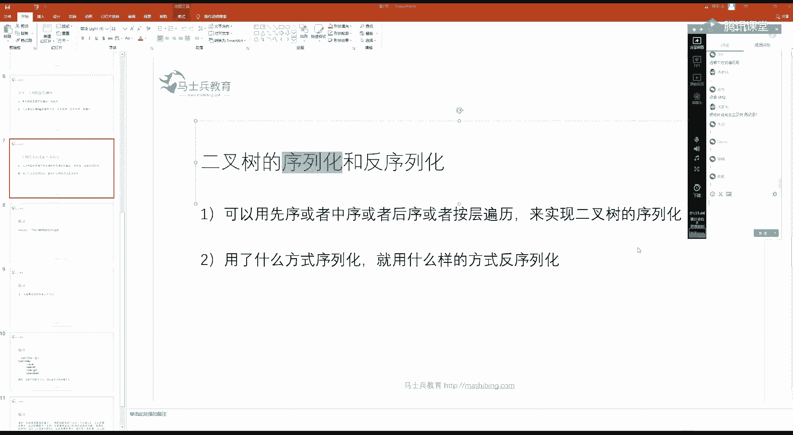

说它能够反序列化回去吗，当然可以了啊，你这棵树是先向左拐再向右的对吧，不是先向右拐再向左的，我们看能不能还原回去，你用什么样的方式序列化，你就用什么样的方式反序列化，面对这个数组。

当时是按照先祖先头在左在右的顺序来搞的，所以我面对这个数组，我先用掉的值是来建头节点，所以我把这个一给用掉了，把一建起来，然后唉我要去见左输了哟，怎么建呢，利用剩下的值，你书也是先投再左再右的。

所以你用你下一个值建出它的头来，然后你再去见你的左数，一在左数也是先投再左再右的，所以你弹出这个空我就知道啊，然后你知道你不用再往后续了，这就是空的目的锁了，为啥，因为我已经是空间点了。

我就可以往上返回到一，再去见他的右数继续消费，再去见左数，继续消费，继续消费，二建又数，继续消费，这棵树就建出来了，同样你这个序列怎么去见它的二叉树一样的，我一消费整个数组，我是先投在左在右的方式。

我就先建立一这个头节点，然后我指望你去见左数消费掉了，直接怼有空，说明我左数建立过程完毕，我可以去见我的右数了，他消费完了哟，然后把一建出来，再去见他的左数消费，消费去见他的左数消费，空。

见他的右数消费，空见他的右数消费空，你看两棵树可以建立建立出来，而且结构不一样，它序列化结果一定是不同的，序列化跟结构完全一一对应，嗯。

代码也是非常容易的啊，离开先叙方式序列化，从头几点出发，请你把所有序列化结果你给我放到队列里去，可以吧，你把没有这个结果，你给我放到队列里去，可以吧，好那么这就是我的队列，那一开始是空的。

你在先连续方式序列化的时候，请你把所有的序列化结果依次放到这个队列里去，这就是我底下定义的这个先序方式是序列化的代码，好，那你看为空的时候，我当然加入空。

就是我先把我头节点的值给它变成字符串的形式放到在队列里去，然后左数也这么干，右数也这么干，序列化好了，你能你能懂，先去代码，你就能懂他啥意思，你不就是一一次先加头节点，把它值序列化了，去左数上该怎么干。

再去右上这么干嘛对吧，那么在利用一个先序序列的队列的时候，我想build出整棵树怎么做，那就是先序的方式，利用这个队列建出整棵树，并连好头几点返回啊，把你当前的值拿出来，如果你当前值是空的话。

那就要那就意味着我要建出空数返回头节点，当然是空，当时是先序列化的头，然后左然后右，我也要跟着他这么来，先把这个string类型的值转成我这个no的值，把这个node建出来，也就是我的头节点。

消费了一个油，它可弹出了呀对吧，然后我用同样的方式把这个对去见我的左数，把这个队列去见我的右数，最终肯定连好了，返回看还打，非常简单是吧，你你你你你中序后续就不用说了对吧，中序后续他就不用说了。

无非你要是中序方式序列化，你就调一下，在这个代码中调一下顺序嘛，你就先去搞它左数，然后把它的值序列化插在插在这中间是吧，插在这儿，那你就完成方式序列化了，如果你选择中序方式序列化。

那你在build的时候，你就先去建立它所述，把这一句它在这两句中间先去见他左，然后见它中间节点，最后去见他右数，这都同理的，这就是为什么我跟你讲递归序啊，递归序它什么都能弄是吧，递归序什么都能弄。

哪怕是便利的问题，还是什么打印的问题，还是什么序列化的问题，还是具体的处理的问题，全都是一样的对吧，不要忽略空嘛，不就这个意思嘛是吧，好我们讲讲特殊的，就是按层序列化。

层序列化，按程序列化的，跟他们代码不太一样，因为这个按层遍历它并不是递归实现的是吧，序列化，整体上就是宽度优先便利。

按层序列化的方式好，我们先说按层序列化方式，我们先想达成什么样的结果。

就是咱不看代码，你到底想达成什么结果，想达成这样的结果，中序列化的方式，123不要忽略掉空，啊不要忽略了空，不要忽略了空四，这也有空的，六也是这，结果是456之后，那结果就是还不忽略空。

你怎么暗藏的方式给我序列化好这个，啊你说的对，七八下面继续有四个空啊，没错啊对啊体，所以后面还是跟着四个空啊，开发方式啊，好啊，七八不能忽略，没错啊，不好意思，七八分不能忽略，没错啊，你说的对啊。

我怎么实现这个玩意儿呢。

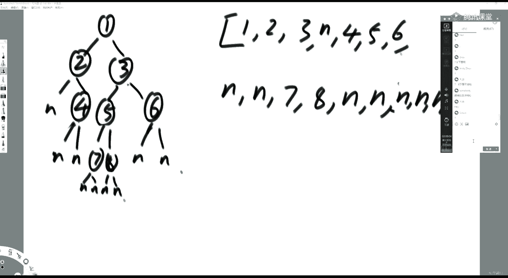

你知道我要达成什么效果，我就写个简单的，因为太多的话，举个例子太烦了是吧，我怎么去序列化啊。

准备一个队列，录一个节点的时候，把它序列化的结果加进去，我们序列化的时机放在加入队列的时候，对吧，刚才我们什么求层啊，这种都是弹出节点的时候再怎么怎么怎么样化了。

我们把我们把序列化的时机放在加入队列的时候，所以你看一上来我就把头结点的值序列化的一个字符串，加到这个队列里去了，这上面就是一个队列嘛，哎如果他要是一开始投递点是空的，就直接把空调到这个队里去是吧。

头节点加到队列里去，准备好呃，呃头节点加到我的序列化结果啊，我们把分开来，answer就是序列化结果，虽然它也是一个队列，那么单独说加到结果里去，把头点的值加到我要便利的队列里去。

所以我们再准备两个一个两个结构，一个叫队列一就进去对了，另外一个叫序列化，结果就是我的answer好，你准备一个数组吧，你先把一放进去了，没问题吧，好我们现在开始。

做的时候就不用再序列化了，因为你加的时候序列化的好，你看弹出的时候，左孩子不等于空，序列化也加队列啊，孩子等于空，就只序列化，不加队列，左孩子如果不等于空，就继续列化，为空就只序列化不加队列。

那么好，我们就就就这个逻辑呗，你一弹出了冲啊，不为空，所以既加队列又序列化怎么干，幼孩子为空吗，不为空，所以既加队列又序列化，好继续，这出的时候也这么干，二弹出的时候，左孩子为空吗为空。

所以只序列化不加队列，飞空吗，不为空，所以既加队列又序列化，活动是要序列化的，无非就是你空了就不对，就不再加队列了，就这个意思，三出来的时候也一样，翻出来的时候，左孩子为不为空，即加队列又序列化。

右孩子为空，所以不加队列，只序列化，四五的时候就后面就是跟着四个空嘛，听懂他打一，二叉树完全二叉树哪是这个样子是吧，完全二叉树是从左往右依次变满，那个事儿，我们我们只是用空把它补齐，它不是完全二叉树。

理解吧，补齐之后他也不是你，我说我我说的是美层都得是满的，或者依次变满的结构叫完全二叉树，我们变一棵普通的树，拿它把它空补齐，它该不是二完全二叉树，还是不是理解这意思吧。

嗯好怎么反序列化呢，那同样道理，你怎么你怎么反序列化对吧，方式，就是我们看这方法，这个方法很简单啊，就这个这个虽然这是个还是个小函数，你给我一个string，我怎么借出节点来，如果是空的话。

我给你一个空节点，如果它不是空的话，我就真的建出一个节点给你，怎么理解这个，因为我当时加了空，所以我左孩子和右孩子，我是死活一定要建出来的，这个没有问题对吧，你不管你是空也好，你不空也好。

我左右两个孩子，当时我不管你加没加队列，我都给你建出来了，无非他就是拿空座占位符了吗，弹出的时候我见我怎么见整棵树，左右两个孩子是一定要建的，左孩子不等于空队列，加左右还是不等于空队列加右。

继续周而复始，给我建下一层去听，啊对吧，就是你当时序列化的，那时候你是死活都要序列化的，但是你只有不空的节点才去加的队列，那么当你反序列化的，就是你死活一定要建节点的，哪怕它是个空节点，你也要建。

但是不空的时候才加队列，不一个道理嘛是吧，这个啊就是我们这个二叉树的序列化和反序列化内容啊。

剩下还有一些题呢，我们留在下午讲啊，因为嗯打印一棵二叉树啊，包括这个或者三道题是吧，都不是很容易啊，下午讲完之后开始开这个数一批的新课好吗好啊，满分十分，然后我们休息，下午两点继续好吧。

