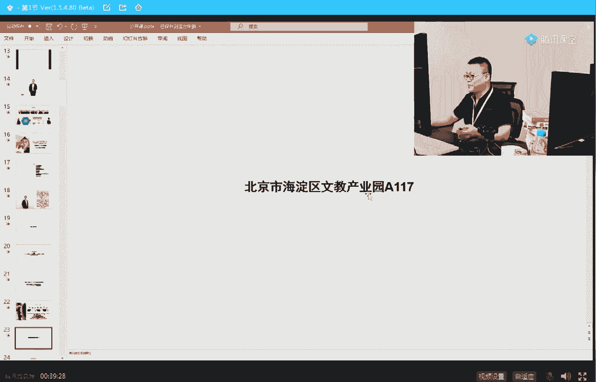
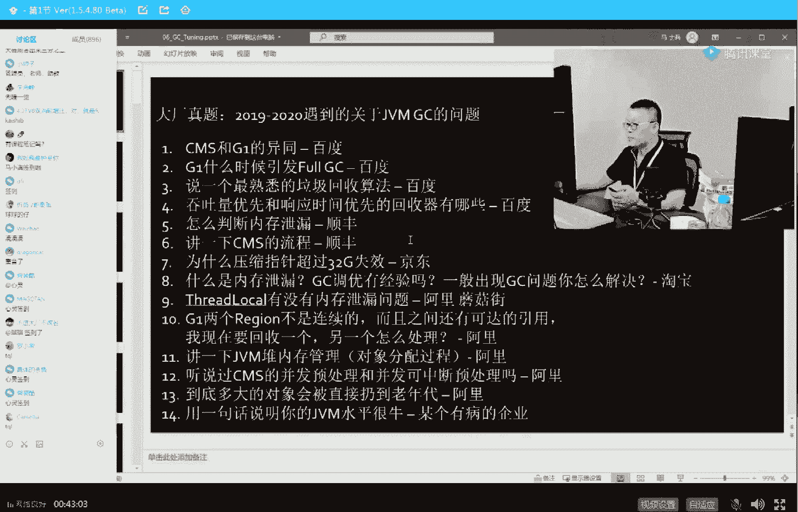

# 系列 2：P9：马士兵老师JVM调优：9.为什么一个百万级TPS系统会频繁GC？ - Java视频学堂 - BV1Hy4y1t7Bo

近期会加强我们自己的一个服务，就是关于大厂这块，我们会推出啊，慢慢的会退出保进大厂的服务，好吧呵呵。

这后面再说啊，课程内容是一样的，只不过增加特殊的服务而已啊，好嘞，你竟然比不过一只猫的年薪，因为这只猫叫tok，所以你比不过他很正常，好了不废话了，我今天来来讲一个非常重要的问题。

这个问题呢叫gc pc这件事呢，我我觉得因为每个同学听公开课的这些同学呢，他们的你们的技术水平呢他不太一样，你懂吧，呃就是有的人呢可能是小白层底。

嘿嘿有的人呢可能已经是大牛了，呃我再给大家讲这些课的时候呢，重点照顾的还是有基础稍差一些的，但是呢我也一定让这些个牛人能够得到你们想得到的东西，总而言之呢，大家不要屁股，你的脑袋，只要你水平高啊。

就就想催着老师给老师带节奏，带不动不用尝试了，好吧好了，这是19年到20年咱们遇到的关于gmtc的问题，一般来说只要你在简历里头写了，说我用过了解过jvm调优，了解过mysql调优。

了解过sql语句的优化，我告诉你你这个简历多值好几千块钱，大家呢也可以大概的看一下啊，在现在这些这些这些大厂来说，他问到这vm的时候，一般都会问哪些问题，给大家十几秒的时间吧，你先大概的过一遍。

我呢我会从最基本的讲给大家听好吧，从最基本的，然后呢我现在我们现在在推行一个什么样的学习方法呢，就是我希望大家伙能够轻轻松松的来学习一些知识，而不是说非得聚精会神呢，非得说一点儿事儿都不能走啊。

111点眼珠都不能转，你才学到很多知识，我觉得学东西呢也完全也可以做到非常轻松的来，我们的目标是针针针对针对啊这个方向来做出自己的努力，大家也可以听听看啊，今天晚上呢大家都放松放松了，听你不用太紧张。

我一定要让你有很大的收获，好吧，很好，一个都不会是吧，干货呢干货肯定没有啊，这里全是水货，哈哈我不做笔记了，不用不用做了，没关系，踏踏实实慢慢听啊，你就躺着听都可以，好呃为什么我要这么讲呢。

其实我我们在做了很多很多的这种教育之后呢，可以讲课之后啊，就慢慢的感觉到学习方式呢实际上是非常非常的重要，同样的学习方式，有的人呢可能需要六个月九个月才能把这些知识学完，但是如果你换一种学习方式的话。

有可能就需要两个月三个月呃，我个人创的记录大概是这样的，有一个小伙就会html css，我大概在十天送他就业，java后端，这是我个人创造记录，所以想速成的，有的是方法也重音了是吧。

好了不废话了，我们开始今天的内容，好吧呃不要吹牛逼了好吧，王雷吹牛逼一定要吹的，人生都不能吹牛逼，你的人生还有乐趣吗，不要给自己设限，因为你做这件事你肯定做不到，方老师，这不是个税，全靠忽悠。

你说的太tm的对了，全靠忽悠，一会儿我告诉你怎么玩好吧，王雷不着急，你想玩，我可以告诉你怎么玩儿，惰性，哈哈哈哈，你好好听我说啊，呃面对面试官的时候，就是你慢慢的好好的吹好自己的牛逼，你的面试就过了。

来看这里，今天呢我给大家来大家讲gc的知识，有很多人呢他可能是一个零小白，所以我们慢慢慢慢讲，呃，我大概呢从到底什么是个垃圾，怎么找着它，垃圾的回收算法，以及呢在jvm领域。

就是java这个领域呢到底有多少种垃圾回收器，我们明天的时间我给大家讲具体的调优，这里面呢最难的题呢是关于算法的，就是每种垃圾回收器具体的算法是什么，另外呢像go语言。

它的这种垃圾回收和java有什么不同，非常好玩，它和java是完全不一样，那个像rust语言诶，他为什么连个jc都没有，而且还不用自己管内存，我都会讲给大家听，慢慢来，我先把这个牛逼的头像给它拖出去。

大家看这里什么叫垃圾，这件事情比较简单，当有一个对象有引用指向它的时候，这里有个引用指向这个对象，这个对象就不是垃圾，说明有人用用到它，那好如果这个应用没有了，这个东西就是个垃圾，我们需要回收它。

这里面如果从c和c加加开始讲，就比较麻烦一些，但我觉得大多数人做java的人，应该都知道这种东西是一个垃圾，所以这块我就不展开了，c加加是手工的对吧，而java java是自动化的。

java就相当于什么呢，原来你在一个房间里面扔小线团玩啊，一个线团一线团连着一个线团，这些都是有用的对象，玩着玩着有些线头就断掉了，它会变成没用的，c和c加加，它的回收方式就是我要手工把它给戳起来。

扔到垃圾桶去，但是java的方式是专门有一个垃圾回收器，这个垃圾回收器呢可能是你就理解为有一个人啊，你跟你的男朋友跟你的女朋友，你们三个人在这里扔来扔去，扔小倩团玩。

然后你的爸爸爸妈妈进来帮你把垃圾收走好，你的爸爸妈妈就是那个垃圾回收器，你只管玩儿，只管造，只管申请空间，你不用管回收，好这个就叫做垃圾回收器，叫jc，叫garbage collector。

当然还有一种gb gc的全称呢，还有一种叫gdb collecting，教了呃，垃圾回收那个动作啊，这个无所谓，好大家看这里，咱们说你知道什么是一个垃圾之后。

就是没有任何引用指向它的这种这种对象叫一个垃圾，现在呢我们来看怎么定位这个垃圾，就是你要你要想回收这个垃圾，对不对，那是垃圾，你怎么怎么怎么怎么定位它呢，你怎么知道这就是个垃圾呢，最简单的方式。

我相信大家伙拿屁股都能想得到，就是一个对象，如果有一个引用指向他，你就给他脑袋上记个数就完了，脑门上写了个三，这哥们有仨女朋友，好，脑门上写一三，有一个给他跟他分了，剩二又有一个跟他分了。

又有一个跟他分了，最后剩零的时候，这哥们儿变成一个渣男，变成垃圾，终于终于认识到了他渣男的本质，而这个时候呢大家就可以回收它了，这是第一种找到一种垃圾的方式，但是这种方式有毛病，你知道为什么吗。

这种方式的问题，它不能够解决下面这种循环引用的问题，你比如说，a的女朋友是bb的，男朋友是cc的，女朋友是a好吧好，一堆垃圾，一堆渣男渣女，没有其他的任何正正直的人指向他们一堆垃圾。

但是从他们每一个人个体单独单独拿出来看，每一个人都有一个引用，所以呢你按照前面的定义，你就不能定义它它是垃圾，所以这种垃圾就回收不了，因此在这vm领域采用的垃圾定位的方式并不是这种，并不是这种。

这叫引用计数，脑门上记一个数字，刚进来，话说老师的口音好奇怪，what老师的口音，那那那奇怪了，老师这口音哪里奇怪了啊，啊沧桑了是吧，来开玩笑啊，来看这里对，what are you弄啥来嗯。

还是那句话，我希望大家放松了听放松了，挺放松了，学学知识呢是一个很有乐趣的过程啊，我不希望大家会觉得灰头土脸的，这就没意思了，那么jvm里面是怎么定位这个垃圾的呢，注意它定位的不是说正好是那个垃圾。

它定位的是那些不是垃圾的线线团，就是我刚才说了，不是你们仨吗，你男朋友你你男朋友，你女朋友在屋里头扔线团对吧，扔着扔着跟从你们手里这根线往下捋，你手里线牵了个线头，这个线头可能牵着另外一个线头。

这个线头可能牵着另外一个线头好，只要能顺着这根线捋下来的这些，你们三个人，无论谁从他手里头往下捋，捋下来的这些这些全都不是垃圾，只要找到这些不是垃圾的，那剩下就简单了，再循环一遍。

看看所有的剩剩余的全是垃圾，清掉搞定，所以这种能调整root searching就是从根上开始找，凡是能找到的都不是垃圾，凡是找不着的呢，ok全是垃圾，这叫gc的root。

就root searching，当然我们讲呃，大厂呢他有可能会问你到底哪些是root，我个人永远建议大家学东西叫做先学脉络，后学细节，你今天听到这句话，以前不是这么学的，你按照老师的学，你放心。

你的学习效率十倍百倍的提升，叫先学脉络，后旋细节查漏补缺，找细节，先把脉络给掌握住，你去庐山，你不能够说先到庐山某一棵树底下研究某个蚂蚁窝，这样的话你脑子里建立不了整个庐山的概念，有一些碎片化的学习。

为什么它效率偏低，原因就是它建立不了整个知识体系的结构，我建议大家永远是坐着直升飞机，先把整个的脉络了解清楚再去了解哦，原来到底什么是gc root呢，甚至你放一边，别着急，等你明天的面试的时候。

今天看一遍，背过搞定，啊能够理解这一点，觉得有认可的，给老师扣个一，我们继续，所以今天我不太想跟你解释到底哪些是rts啊，哪些是歌歌对象，因为这里面牵涉到很多概念。

比如jm deck native methods stg以及run time constant pool，以及static references method area和class，嗯。

这些都是来源于java，最经典的书就是jav群里记，最经典的书是那本书，不知道大家了不了解，既然刚才有同学推荐书，说老师你推荐本书吗，推荐你一本java虚拟机，最经典的一本书叫java虚拟机规范。

就这本啊给大家打开来看看，如果你真想研究，朝这方向去研究，这书老师都是读过的啊，放心，我给你找一下啊，嗯嗯，算了你这样你去下载就行了，在oracle的网站上自己下这本书的全称叫jell verge。

machine，specification，ok java虚拟机规范应该最新的是第14个版本，所以你想了解最新的jav虚拟机，除了这些书非他莫属，别的都是抄来抄去好大家看这里嗯，刚才我们讲了两个问题。

就是第一个呢到底什么是什么样的东西，是个垃圾，没有引用指向它，ok这是个垃圾，第二个是什么，第二个是怎么定位一个垃圾，两种方式，第一种呢叫reference count，这种方式呢有毛病。

他解决不了循环引用的问题，第二种方式叫什么，第二种方式叫rt thirty，根可达算法，从根上开始找找着谁都不是垃圾，找不着的，全是垃圾，jvm使用的第二种，但是当回收这个垃圾的时候。

注意一共有三种算法，这三种算法呢比较简单，也很容易理解，你背过就完了，从上个世纪50年代发明垃圾回收器开始到现在，就这三种，没有其他565 60年代70年了吧，快70年了。

快70年来没有别的新的算法的发明，就这三种，这三种第一种呢叫mark sweep，记英文，希望你记英文，第二种呢叫copy，第三种呢叫mark compact，mark sweep叫标记清除，超级简单。

一说就明白好，这哥们儿是垃圾怎么办，把他们找出来，把他们清掉，就这么简单，青橙绿颜色的，大家都都可以用了，标记清楚有它的问题，因为你标多了，轻多了就变成一个洞，一个洞的，我把这也标了，把这也标了。

把这也标了吧，这也清了，旁边都是有用的，就变成碎片化，这个是碎片化标记清除的毛病，碎片化，但它算法非常简单好，这是第一种呃，这里面的每一个更详细的一些算法，我就不想先不详细给你讲，还是那句话啊。

先学脉络，第二种叫拷贝，拷贝算法的理解也超级简单，就是我不管你内存多大，咔咔叽一下分成两半，分成两半，只用其中一半，那用完我我想进行垃圾回收的时候，怎么做呢。

我只要把其中一半有用的那些对象copy到另外一半去，然后对上面这块整体性的进行清除，就相当于你们家一个大的房间，你跟你男朋友女朋友只能在这这边儿玩儿，当我进行垃圾回收的时候，我怎么做呢。

你们所有的人趁着线团跑这边来，剩下那些在原地的这些线头，我二话不说，把整个的全清除掉，这个叫拷贝算法，是不是很容易理解，没有那么难，拷贝算法，他的毛病一目了然，那大腿想想也应该知道浪费空间。

还有第三种叫什么，第三种叫不浪费空间，而且也没有碎片，就是那还不简单，当我们找到这些有有有有有垃圾的时候，诶，我我顺带着给它做个整理，你整理过硬盘的那种碎片吧，把那些有用的呢全往前堆堆到一起去。

把那些个没用到的空间全放到后面去，就是一边做标记，一边做整理，当然这种呢就是效率比较低，这种叫mark compact，所以就这三种叫mark sweep，copy和mark compact。

好各位听我说，我觉得这三种算法呢到现在为止我讲速度比较快，应该是都能跟上的对吧，来能跟上同学老师扣个一，跟不上的，给老师扣7563，开根号再开根号，good不错啊，大家伙都不错，好下面我来讲，嘿嘿嘿。

下面我来讲讲什么呢，就是讲到底这些个算法是怎么进行运用的，那么jvm的到底是怎么管理它自己的内存的，呃为什么要有分带模型，没有分类的模型，就我说啊，所有的垃圾回收器就是爸爸妈妈帮你做垃圾回收的这些人啊。

你的保姆你在里边随便让他来帮你做回收，这些人是怎么样子运用这些算法的，听我说，他们会对这些算法进行各种各样的灵活运用以及综合性运用，呃所以每个人和每个人呢他用的算法都不一样，他的工作效率也不一样。

他各方面关注度也不一样，每种不同的垃圾回收器都是有它不同的算法，大家记住，以前有面试官会问说你们你你了解jvm的这个内内存的管理模型吗，仔细听我说，jvm内存管理模型，如果你想回答完善了。

一定反问面试官，各位小伙伴们记住了题，不会答的时候就反问他。