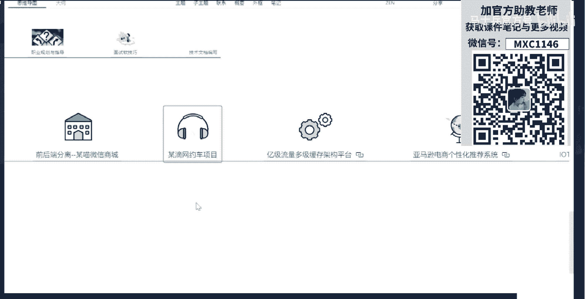
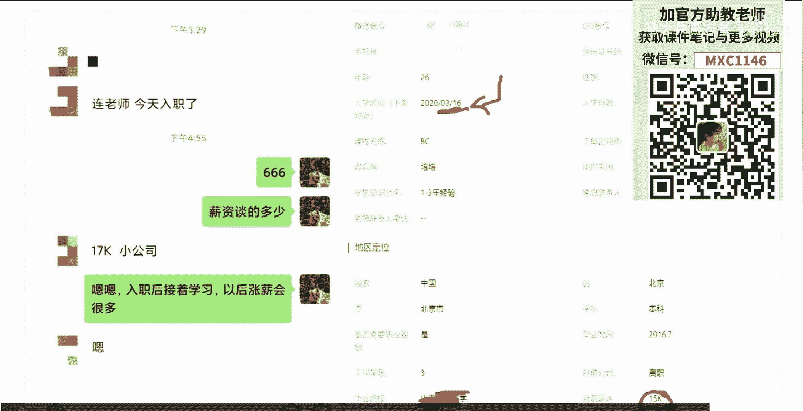

# 系列 1：P19：马士兵深入浅出java虚拟机⑨手动实战 - 马士兵官方号 - BV1mu411r78p

就问这种特别触及问题的，我只能认为你的基础确实特别差，我就稍微照顾照顾你，首先黑白灰是一个逻辑裸机上的概念，并不是他那个你打开电脑，它里边真的有黑色对象，比如说它有一个标志位。

这个标志位写的零一就代表黑色，这个标志位写的一零就代表灰色，写的零零就代表白色，到这里能get到吧，怎么把黑色，把黑色变成白色，你就把零一改成一零不就完了吗，气死我，好啊，朋友也不能回答。

因为所有人都是从小白过来的啊，刚才那个小白你也不用怕老师怼了，越被老师怼的人成长越快，所以怼两下又怎么了，不就丢点人吗，谁也不认识他，对不对，那个人叫什么，你们还能看，你们还能找得出来吗。

你就找不出来人名了，都所以他丢人就丢了，也就丢到了这个小小的直播间，这有什么不能承受的，别问了，再问一遍，老师生气了，受不了了，要炸了，黑色的不会再扫描，因为黑色已经扫描过了，不是所有黑色的标记成灰色。

只有新的黑色的诞生了，指向了新的对象，有新的对象指向的时候，这个时候说明它产生了新的引用，这个黑色的就得变成灰色的了，灰色的在下一轮的时候要重新扫描，黑色的已经被扫描过了，ok看这里，这怎么完成的。

它叫做right barrier，叫写屏障，咱们先把它略过吧，那个真的有点稍难了啊，我们先把主干讲清楚，注意看incremental，实际上它有一个非常隐蔽的问题，incremental update。

由于这个方案特别简单，但实际上这个方案呢会有特别隐蔽的问题，看你能不能听听得懂，认真听啊，在并发标记的时候依然会产生漏标，what它把它变成灰色的了，居然还会产生漏标，原因是什么呢。

变成黑色的下轮就不再不再扫描了，变成灰色的下轮会继续扫描啊，我看这里为什么会产生呢，a里面，如果这时候a有两个成员变量，我分别用一和二来指代它，这个时候呢一这个成员变量指向了d。

大家都知道a要变成灰色好，a要变成规则，这个比较简单，但这个时候啊，你假如有另外一个线程，这个线程是什么呢，哎有人来就会说线程垃圾回收线程在这轮是并发的，会有好多个垃圾回收线程。

那么这个垃圾回收线程干了一件什么事呢，他正在标记这个，a呢这标题这个a标记到哪，标到什么程度呢，已经把这个一给标完了，注意它已经标完了的情况，已经标完了，然后正标那个属性二呢这个属性二指向某一个对象。

正在标这个在这个过程之中，在这个过程之中，注意一已经标完了，接下来标完了之后，又指向了这个白对象，被一个线程给标，把这个一标完了，标完了之后又指向了一个白对象。

就是另外一个另外一个线程把属性一又执行了白色对象，这个线程已经把a的属性一给标完了，哎但是呢另外一个线程又把这个一给指向了一个白色对象，然后呢另外一个线程把a标成灰色，那就会出现成标成灰色，为什么。

因为它指向白色对象了嘛，所以把它变成灰色，然后这个县城原来标这个现状，他继续，因为他标完一了，他马上又标完二了，把二标完了之后，唉又把它变成黑色了，因为他这个县城认为一个对象已经标完了，我把一也标完了。

我我把二也标完了，这个线程肯定会认为这哥们儿已经是变成黑的了，对不对，他实际上不知道，在他把一标完的这个过程之中，另外的这个一指向了一个白的，然后呢它已经变灰了。

结果呢他二话不说又把它给变成变回是纯黑色了，一个二什么成员变量，好这段没听懂就算了，好不好，有点绕，对于有经验的小伙能听懂，对于没经验小伙呢都走不走，没关系啊，呃这种问题也没人问，听懂了吗。

没有面试官问，放心啊，没有人面试官问这个面试官问他主要问什么问题，就说incremental update，为什么cm里面用，为什么g一里面不用这种解决方案了，原因就在于这儿。

因为它依然会产生漏标的问题，而在cms，cm呢他自己也知道它会产生楼标的问题，所以在cm s的最后的remark阶段，在这个阶段应该得从头把那个什么的都扫描一遍，当然由于它进行了一些个清理了。

所以这个扫描的过程呢没那么复杂啊，比原来那个简单很多好，所以他的s t w时间就没有那么长，但是如果你的内存越来越大的时候，这个阶段它依然时间会慢慢的变得非常长。

所以cms incremental update这个解决方案已经被close了，这个解决方案不再存在价值了，cms也在1。9之后被踢出去了，cm这个东西已经过时了，我这么直接讲，大家能理，解了吧，那好。

啊下面我们来看g一的解决方案，还讲了太难了，就讲到这儿吧，要不然好不好，讲完级我们就不讲，不讲那个cdc了啊，cdc有十十个阶段，那个太难了，要讲完，咱今天晚上就别睡觉了啊，好看这里啊。

积累解决方案是什么，积极的解决方案叫做i s a t b，所以请大家记住几个名词，你跟面试官聊天，名词越多，面试官越蒙，三色标记，incremental update s t b。

snapshot at the beginning，snapshot，快照at the beginning，刚开始的时候来个快照，这个呢呃这个这个这个解决方案相对就简也也比较简单，他是怎么干的呢。

他干脆就没有给a和d，就没没没在这种a指向d的这个引用上啊，这个指针上没在这上面考虑问题，他考，虑的是哪个呢，他考虑的是b指向地消失的这部分，这个指针b指向d消失了。

就是说有可能你指向d的这个东西再也不会被扫描掉了，我只要保证这个地被扫描到就可以，所以呢它采用了一种解决简单的解决方案，这种简单的解决方案是什么呢，是这个，其实指的是做个快照，当b和d消失的时候。

把这个指针注意是把这个指针给保存一下，保存到哪里去，能保存到一个站里面去，我不管你这个d有没有被别人指向，没有关系，我只需要在下次扫描的时候，我能扫描到你这个d就行了，我看你这个d有没有被别人。

有没有被别人指向，你不就行了吗，好了，这个时候呢就把这个指针放到里面去，下一轮扫描的时候呢，就要看这个里面有没有被放进去的指针呀，那么如果有的话，把它拿出来，把这个对象拿出来之后重新扫描一下。

看看这个对象有没有人指向他，如果没有人指向他，他就是垃圾了，如果有人指向他好，他就还不是垃圾，ok这个叫snapshot at the beginning，当然这里面更深的一些个理论呢就非常多了。

为什么这一会采用这种方案，因为这一点有概念叫remember set，remember that，配合这种方式配合起来特别方便，由于而且你原来有个快照，你有这个快照的时候。

你可以用那个快照里面最根儿上那些个那那些个，那那那些个只扫描对头上那几个就可以了，所以它这个效率特别高，remember set是另外一个概念，我要给你讲remember set，还得给你讲，card。

还得给你讲card table没法讲啊，这这到这吧好吧，不讲没，这真没完了，怎么被引用，扫描到自己就被引用了，这就是remember that干的事儿，ok但是我告诉你，在不久的将来。

所有关系这些个问题全都没了，不用了，所以有的时候我讲那些呢也没什么意思，但是不管怎么样，他还能撑几年好不好，所以听不懂也就听不懂了，过去也就过去了，只要你能坚持过这几年去，因为什么呢。

因为在z d c里面，它采用了更加牛叉的解决方案，这种牛叉的解决方案叫做color pointers，叫颜色指针，这个颜色指针说到这儿，我就简单给大家入个小门，颜色指针是什么概念。

其实大家知道一个java指针，64位，在16四六十四个比特里头，他把这个指针里边的内容做了一个划分，划分怎么划分的呢，真正的只有42位的指针是指向java对象的，有18位是没有用的。

42+18已经60好，其中的四位拿出来做一个状态，区分状态区分什么意思，就是当我引用到这个指针的时候，我要检查这思维的状态，看看这四位是在哪种状态之下，我要做相应的操作。

哎你比如说你是在正在移动的过程之中，你垃圾回收器要移动，你移动的过程之中，我现在也用到你了，我去检查你这个指针，发现你在移动的过程之中，ok那我就稍微等一下，等你移动完了之后，我再用你。

我再用你里边的内容，唉，如果说我现在引用的这个指针，他现在状的没，有多没有动，没有关系，我我就直接拿过来用，好了，这个叫做颜色指针，当然这里面涉及的概念那就更多了。

它会涉及到操作系统的关于内存映射的概念，再说啊咱们再说嗯，嗯有一个非常简单的面试题，叫做为什么z dc管理4t的内存不是4g是四个t，为什么呀，为什么他是四个t，看到二的42次方等于四个t o。

怎么叫移动中，怎么叫移动中，你想象这个指针它指向一个java对象，这个对象还记得我们的region吗，回收它的时候怎么回收啊，这个对象要被挪到另外一个region里拷贝算法吗。

我们记忘了g一分成一个一个的region，cdc也是分成一个一个的region对象存在region里面，回收的时候，按照这个region来回收，怎么会说啊。

把这个活着的对象拷贝到另外一个region里面去，整个region清掉就可以了，拷贝的过程要不要移动对象啊，那这个指针本来指向这里的，现在要把它指向这里了，你这个指针里面要不要动啊，做这个标志位。

那我的程序要用到这个指针啊，我就去读一下这个标志位，哥们儿，你现在在什么状态呀，正在移动中，哎呀正在移动中，那我得小心点儿，等你移动完了之后再用，好来该到同学老师扣一有那么难吗，你自己看就会很难。

老师讲给你听，就没那么难，cdc会指人家说吗，不会他都64位全用上了，你让他怎么压缩大哥4t怎么理解二的42次方啊，他用42位来代表一个真正的对象的地址，二的42次方不就是四个t吗。

老师可以推荐讲的好的g一和cdc算法的文章吗，你自己去找我跟你讲，我找遍了，没有讲，特别好的老师，这讲的还不够好，中国内的讲cdc的，凡是上面的文章你自己去翻啊，基本上没有，现在还没有讲的。

好了今天到这了，不多说了，现在已经9。40介绍我们的课程好吧，嗯今天给大家讲的内容呢是老师讲完第一版的课程中的一小部分，那么这个是哪部分呢，就是这部分，就这m调优案例是两款指导啊，这部分呃，当然了。

我是调了其中的一部分了，本来我是从最根本的概念开始讲，一直讲到最后才是jz和调优呃，我只不过呢把其中的一些个细节全给大家先略过来，教了大家的梗概性的东西呃，主要是给大家讲了调优实战的这部分啊。

就是为什么会频繁，dc到底怎么样进行设定，那么云玩dc怎么办啊等等啊，交了一些时间性的东西，上线之前怎么规划，像这一类的还没有给大家讲过，这是整个课程中的一小部分了，诶哪去了。

当然这里面呢我们课程内容比较多，先给大家简单介绍介绍这个课程，这个课程呢主要是现在呢被我们搞成了一个超级牛叉的一个巨无霸，就是我们课课程现在成长为不知不觉之中成长为巨无霸了。

这为什么我呃少给大家谈一下这个历程，就是我们现在提供什么课程呢，提供现在就是a是java后端工程师，这个是什么呢，是零基础的课程，就是反正基础稍差的，你从a开始学好吧，跟着我赵云山老师。

跟着林老师从a开始学，记住参加工作的有ss sm基础的a是什么，a a就是那个那个，那个线下的时候那个花1万多块钱，15000 6000是吧，给你教教你的东西，就是我们的a课程嗯。

然后呢有sr那么基础的，我们现在推荐的是另外一个格叫做b加c，b加c是什么，b是互联网架构师，c是单数据加构式，就是你刚才看到的这个课程，就这节课这节课呢我们就当从零到年薪百万。

一步一步对标阿里p7 的互联网大数据的声量教师，这些课呢也是我们独创的呃，这个课程呢其实前前后后经历了很多很多的发展，我简单跟大家交代一下，就这个发展呢还是比较比较那啥的，就是比比比较比较各色的呃。

我们的以前是一直做线下培训的，大家也知道啊，呃作为转到线上来之后呢，就一批老师成立了线上的那个公司啊，公司那叫马士兵教育，就是以我名字为命名好，呃，其实除了我之外呢是有一大堆的公司啊。

sorry一大堆一，大堆的我们的呃老师把这个这些老师呢我就不一一的给大家做介绍了，都是在线下很有经验的老师，除了现象很有经验的老师之外呢，其实啊一会儿我可以请这位大哥给大家见个面啊，这是我们特别牛叉的。

也是我的清华的小师弟，是周老师，他是讲那个大数据这方面的，呃，除了我们自己的这种在线下讲了很多年的这种老师之外呢，还有一些呢是在这种企业一线的老师，这个也是很宝贵的，呃。

为什么我们能请到b a t j学校的老师，就是就是你你随便找个培训机构，你说那个b a，t j的老师啊，全都聚齐了，不好意思，你随便找没有，只有这儿有别提高的老师在这全剧情了呃，腾讯的罗老师。

他是原来腾讯新闻的ai的主管，阿里的那个黄老师呃，是原阿里的常老师，是现在在阿里工作的，那么讲我们数据大数据项目的数据中台项目呢，是原来的阿里的中台死结，是一个p 10水平的。

百度的赵老师来跟我们聊推荐系统的这个京东的齐老师呢，我们讲docker cbatis，以及呢现在这个秒杀项目秒杀相比也是在京东落落地的，可是很不幸的是呢，齐老师现在就被隔离了啊，不然的话。

应该已经已经开讲了嗯，就是我在外面呢请了一大堆的老师，因为学生还是比较多的，在各种一线大厂都有，所以找到他们呢并不难，嗯，有一些也不是我学生啦，就是推荐过来的等等啊，就这样呢。

我们就成立了这么一个一大堆的老师，大概有十几位啊，这些老师的水平，清华两位老师，一位伟大的博士后，右边这哥们呢是长去的cpu，他马上要开始了，下周就开始了呃，网游后端的项目的第二版就开始了。

第一版还是广受欢迎的，这主要讲net的这个呃，海宁老师那个原来呢他是想去那边做游戏的，有好几款那个月流水过千万的游戏就是出自于他的手，刚起元帅，我不知道大家听说过没有，还有一个叫什么什么三国志来着。

我忘了啊，哎这位小姐姐呢也是特别牛的，这位小姐姐是留学北美的博士，他主要教他们什么呢，叫他们英语课，后面我和他一块儿教英语，教点英语课，主要因为好多人的英语实在太烂了，有点看不过去了，稍微教一点好呃。

然后呢我们这些人呢大概在2019年的中间，6月份等到腾讯课堂，到腾讯课堂之后呢，大概半年吧，到去年年底的时候，我们已经是在腾讯课堂的课程到了第一名了，我们已经做到第一了，也就用了半年半年左右。

当时是当腾讯课堂的时候是这样的，腾讯课堂呢有很多的已经有很多的人在讲课了，这个他们讲的课呢多数都是什么什么样子的，都是一个一个的知识点，就是类，似于什么呢，类似于张图里面的一个一个的知识点啊。

但我的知识点还是能点进去的，你自己看就行了，对这个对这个有兴趣的，呃一个一个知识点，后来说我们干脆，那那我们也就先找超凡，因为线上到底怎么讲啊，现在也当时也没摸清楚行，那就找超凡，那我们讲知识点。

后来我们就提供了一个第一版的课程，这个课程呢是一个八个月左右的一个知识点的课，然后呢多数人呢都是说每周三次课啊，每次两小时一共讲八个月啊，多数的机构都是这样子，我们当时也，都是这样子。

但是讲着讲着我就发现，因为我个人比较喜欢讲课，周老师比较喜欢讲课，讲着讲着我就发现我课的时间不够用了，我想讲的特别深，比方说我真的想给你讲到cdc的特别详细的算法，我给你讲到这些，你不给我时间。

我是肯定讲不到的，后来说算了，我们扩课程，我们第一次扩展直接就把八个月干到半年到一一，1年半到2年的，我是说按照每周三次课来讲，扩展完这个之后呢，有小伙伴当然很满意了，因为他们当初交钱是按这个来交的。

交完之后呢，我们就免费给扩成这个样子了，他们当然很爽了，但是有的小伙伴呢还是不满意，小伙伴说老师我没有项目经验，想跳槽，从传统行业跳互联网还是跳不了咋办，杨老师，后来老师说，那行吧。

我给你找那个一线的做项目的人来带你做项目好，扩了八个项目，又是免费，就给大家扣了这八个项目，这八个项目呢我觉得我就不一一的给你打开了那个，都是呃就是实际当中运行了的啊，上了线的那样的项目。

你写在简历里头绝对不会丢人，不是那种demo的项目的东西，多人在线即时对战的游戏服务器，吃鸡的后台，大体的架构就是这样的，告诉你和将于这两个呢是只针对于水平稍差一些的，那么商城大家都有。

我们就加一个像网约车项目，完车项目呢是阿里的常老师，他现在已经开始讲第三版了。

好这个项目呢也是我们一个挺好玩的项目，这项目什么项目呢。

这项目什么项目，这个项目是原来啊那个常老师进阿里的时候，对他帮助非常大的一个项目，长沙原来呢也是一个不是特别有名的一个二线互联网的，他在30多岁才进到进到了阿里，进阿里的时候呢，这个项目帮了很大的忙。

然后呢他现在把这个项目分享出来，那么这个项目主要讲什么呢，这个项目其实主要讲分布式微服务的，就是分布式微服务到底怎么落地，他学一个spring cloud，今，天今天学点儿注册，明天学点儿监控。

后天学点儿限流好，总是不会联系，到时候我实际当中到底怎么落地的呀，好这样一个项目让你来进行落地的这样一个项目，好项目的结构图给一给大家看了所有代码，二三十个人写完的代码全都给到你，你不用每个代码都敲完。

读懂就ok了，呃另外讲东西的时候讲到什么程度呢，源码原理，源码原理源码就是基本上所有的点我们都会讲到源码，凡是不嫌我们课程深的，不嫌我们课程宽的，找我们来学，除此之外呢，我们又还有一个项目。

就是这个对于，咱们结构师来说啊，java这边的结构师还有项目就是一级流量，这个项目一流量的项目解决什么问题呢，有什么很大一项目，其实目的呢就是解决你架构师这方向的理论和实践的问题。

就这个项目学校的目标是什么，京东阿里淘宝，天猫12306拼多多，他们这些架构到底怎么玩的一个项目，全让你理解，就是很很很有价值的一个项目，很多那个外面的有一些搞教学的这一个项目就卖你好多好多钱啊。

cp定理到资源的隔离怎么玩，副业服务的限流怎么玩，系统到底怎么样进行扩容和，拆分各种各样的降级方式，分布式事务怎么去落落地，各种各样的网关该怎么设计，客户端的缓存，浏览器的缓存，enginx缓存。

lue rusty rex访问，怎么样去进行register缓存，就多级的缓存该怎么样进行来实践，好高可用，怎么样进行落地，使用什么方式给你编出来好部署到阿里云上，怎么进行部署，好了，这是这个项目。

当然由于我们这是双料架构师，为什么要双料，现在玩儿架构师的，你说一点大数据的知识不懂，太开玩笑了，就没什么竞争力了，还有大数据相关的三个项目推荐系统，这就不说了，但就是说这部分的呃难度在于什么地方呢。

流式计算flink中台项目是阿里p 10的那个中台四节来带大家落地的，做一个中台的落地项目啊，这个秒杀系统呢咱们暂时先等等啊，等等等一下那个什么的呃，齐老师呢，这个这个出来了，从闭关闭关之后出来了。

所以最后就变成什么了呢，最后我们这个整个的课程就变成了一个巨无霸，这个人怎么叫巨无霸了呢，嗯，从八个月开始到18~24个月，再加了八九个项目，就是整个课程就变成了大概是1500个学时左右。

我们从来以前没有算过啊，突然一算，我靠居然居然到1500个学时了，你们知道大多数的人，如果是八个月，每每每周三次，每次两小时，你自己算一下，他们的学识是200个，200个不到192吧。

我们现在学时是多少，1500个，所以这就诞生了一个特别巨大的问题，我到底该怎么教你，我不真的不能让你从1500个学时从零，你一直学完1500个学时才能让你干，点事儿，这个我肯定是不能让你这么来学的。

总结了一下，我们叫它pp教学法，pp教学法的概念叫做project driven，项目驱动，就是我用一一个项目来驱动着，这里面到底有多少，用到了多少个支点啊，有些知识点你掌握住了，那就暂时先放一边。

有些知识点没掌握住后，优先去学这些知识点，一边学项目，一边学知识点，一边学项，目一边学知识点好，大多数的人在3~6个月左右的时候，ok每月至少涨5000好吗，我说的是至少至少涨5000唉。

本来我是说我们原来那个去年培训的学生啊，就是多数人每个人真的涨5000块钱，最少的，我们所有的案例都可以做背调的娘的，今天有一个学生就告诉我啊，我刚开始跟大家说了，说老师我工作了，我说涨了多少钱啊。

涨了2000，破了我们的金身，结果后来我查了一下，今天入职了，现在才多少，17k唉，原来原原原来挣多少，原来挣15k，原来挣15k那个我说他涨了2000，太过分了啊，直接把我们牌子给砸了，后来查了一下。

也是3月16号入的血。

