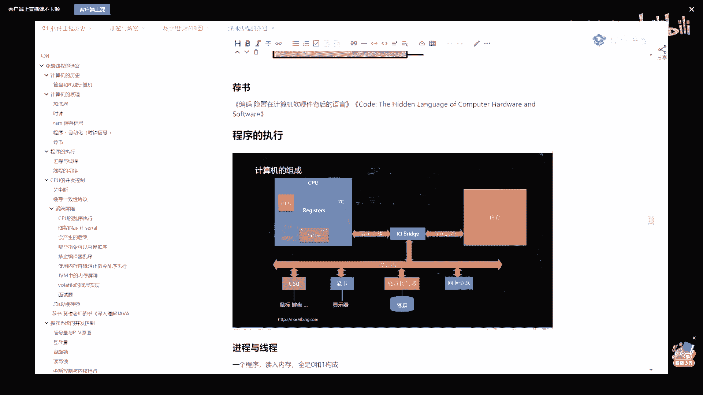
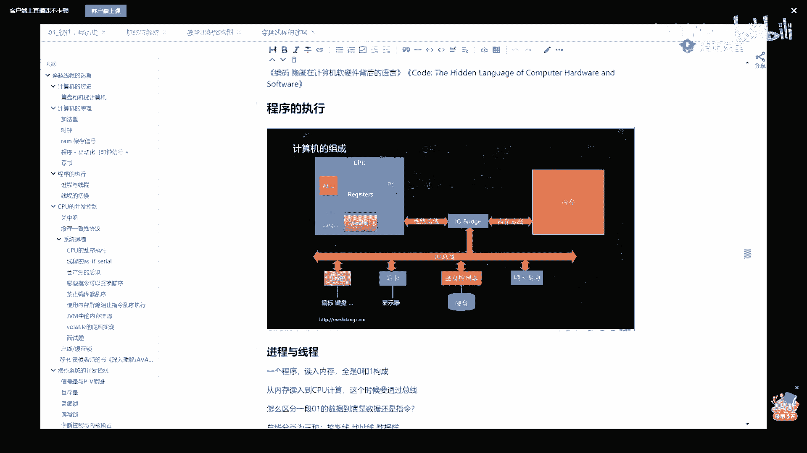
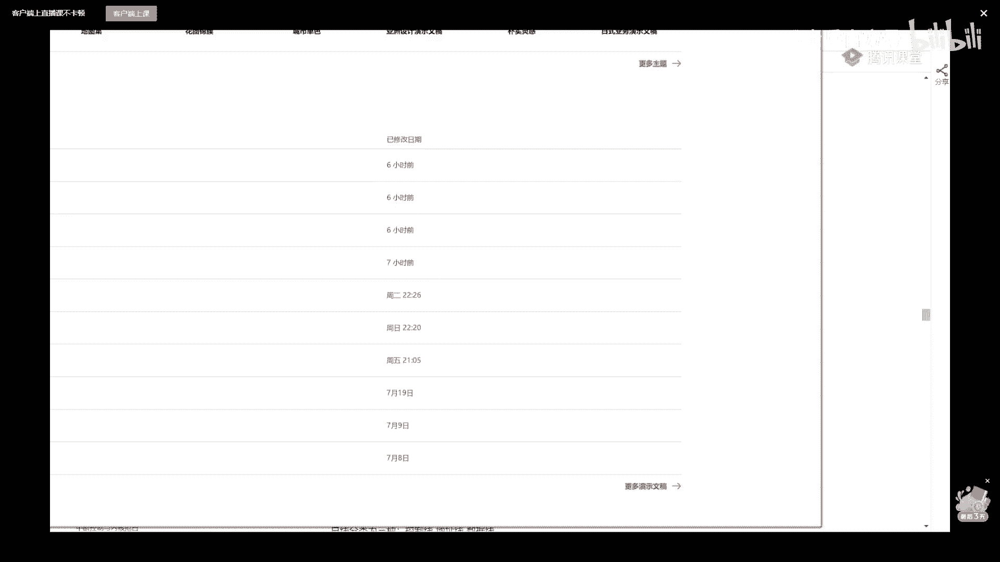
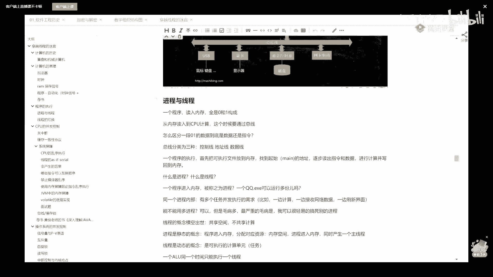

# 系列 1：P23：多线程与高并发：3.什么是进程？什么是线程？ - 马士兵官方号 - BV1mu411r78p

这是一个小小的计算机的组成，我我我呢把这个过程做一个小小的简单的总结，你认真听老师讲的太感兴趣了是吧，怎么提高cpu的利用率，这个是压榨cpu的话，县城这部分的知识是你必须得要掌握的。

嗓子已经难受五天了，大家忍一忍，看这里，我们所谓的程序最终所写的任何东西，最终一定是由01010101编译完的，这种这样来构成好这个程序，平时他静静地躺在我们的硬盘上，就在我们的硬盘上呆着。

比如说它叫做qq。e x e，当我们想让这个程序运行的时候，咔嚓一双击它就会跑到哪儿去呢，跑到我们内存里，刚才我讲过说内存里的程序啊，好只要一个程序跑到内存里，这个概念就叫做进程。

好当一个进程放到内存之后呢，实际上这进程里面是什么东西呢，在内存里面是什么样子的构成呢，无非就是有两种东西构成，第一种东西呢叫做指令，指令是什么，就说我要做加法运算还是减法运算，乘法运算，除法运算。

ok第二种东西呢叫做数据好，你就记住这一点，就成程序由什么构成呢，指令加数据搞定了，就这么简单，那有同学说老师那cpu怎么做计算的，cpu是这么来做计算的，cpu找到我们的内函数所在的位置，诶。

然后呢去看第一条指令，他发现第一条指令是相加的，指令很好，他把这，个指令读过来放到cpu里啊，发现一看，ok这条指令叫什么呀，叫加法good，然后他就去加法，后面应该按照格式的要求，应该有两个数。

第一个数把它读过来，第二个数把它读过来，做一次运算，写回去搞定，然后有下一条指令，这个是大体的过程。

不知道我说清楚没有，这个图有点小，我把图稍微放大一点给大家看，稍等啊，打开ppt。

推荐的一些书，这个再说啊，好看这里啊，我们再重复一遍刚才的这个过程，这个过程挺重要的，你好好听，认真听，我跟你说，很多的面试题，包括腾讯的，百度的，华为的，问的都是这部分内容，这是我们的qq。

e x e，然后呢我们双击它，它就跑到了我们内存里面，换个颜色，在我内存里面放进去的时候，无非是指令add加数据两个数构成，然后这个东西呢就被我们称之为一个叫进程，好一会儿我再给你讲现成的概念好吧。

那么这个进程啊需要执行的时候，刚才我说过了，cpu首先去读指令，把指令读过来，同学们，你们想过没有，把指令读过来的时候，我cpu总要存储一下这条指令的指令也是由0101构成的呀对吧。

只不过cpu把这种0101看成是一条指令而已，指令在cpu内部总有也是需要有一个存储，的地方，那它在哪儿呢，好在cpu内部用来做临时存储的东西，我们把它称之为叫寄存器，寄存中间数据或者指令的地方。

对不对好了，那个寄存器呢，其中有一个著名的寄存器，就是它叫pc，全称叫program counter，叫程序计数器，记住这一点，这个玩意儿存储指令的，指令放这儿。

我得知道我当前执行的是哪种指令运算单元呀，只负责运算，你给我我就加给我，我就加我，其他的什么都不管，我执行的是哪种指令呢，放这儿，但是相加这种指令，它是需要有别的数据的，它又需要有两个数据。

这两个数据在哪儿呢，这两个数据在这里，所以当我们发现这是一条i的指令的时候，他会把后面的两个数据一块读过来，还是那句话，我读过来的时候是需要也是需要存起来的，临时存储放哪儿呢，放在数据即存器里面。

数据寄存的就是数量比较多，这个呢我就不一不，再展开了，这属于汇编的内容了，总而言之是放到两个不同的计算器里，然后au从这一读哦，这是加法运算，直接计算这两个数的和写好了之后放到这个寄存器。

然后再把这个寄存器的内容，如果需要的话，写回到内存里的某个位置，比如说c等于a加b那么c的位置在这，a的位置在这儿，b的位置在这儿，a和b读过来，放到这个计算器，这个计算器写到的结果存到这个计算器。

再写回到c的位置上去，大概就是这样子的一个过程，program counter太抽象了，我我我讲的还很抽象吗，想象一下是吧，打，开你想象的空间o，对由于不同的人呢，他是有不同的基础啊，好我们继续。

同学们讲到这儿你就会发现cpu超级简单，他只干一件事，拿指令，拿数据做计算，写回去没有别的，所以cpu的内容就这么简单啊，就是这么的简单，没有更更复杂的内容，呃我讲到这儿之后呢。

我们下面来看看腾讯特别爱考的一道题，叫做什么叫做进程，什么叫做现场，终于我们开始接触现场，讲到这儿了，我还是想讲讲，讲一点小小的简单的这个这个这个计算机的历史啊，看这里都是近程联手，是这样的啊，因为啊。

最早的那个计算机呢它非常的简陋，电路也简陋，那个，该路呢也非常的简陋，他是一次啊，这只能计算一个程序，最早的它是都是用来做科学计算的啊，器械什么计算呀，什么导弹那个轨迹的计算呀。

就做这个我们写程序的时候呢，也就只能内存里面不能给的能落上去，这个不知道大家能不能听懂，就是最最开始的时候，我的计算机只能计算一个程序，把内存里头就就就都能运行这一个强行表。

像这种操作系统呢其实也有很多，其实最早开始连操作系统概念都没有，好吧，我就直接这么跟你说，就是他只能执行一个程序，cpu把这个程序呢你不，中间不能停，计算完就完了好了，这样的程序呢叫做一个进程。

到后来随着就普及，人们的需求也在不断地变得复杂，后来发现呢，如果说我们的计算只能计算各进程的话，好多需求我们满足不了，我给你举个最简单的例子啊，比方说我想一边做计算，一边做演，一边做展示，展示的话呢。

你这个程序还是要需要写到显示器的显存里面啊，显卡里面把数据写在显卡里面呃，那计计算的话呢，你计算你的你你的这个运算单元是需要运行起来的，这时候呢是需要两个并行的，你明白吗，就说一边做，这里做做做展示哎。

一边呢来做一个计算，或者说我说得更加的那个那个直白一点，你就更容易理解一点，我需要开两个qq是吧，我不能只有一个，ok那这时候怎么办呢，这个时候是可以的，当然这里面有一个比较复杂的过程，是内存映射。

我先略过它，你相信我，你跟老师走一遍这个计算机的基础知识，你会发现你所看到的任何的语言，任何语言你在看上去的时候都是对你来说都是透明的，就都特别简单了，那个我们说计算机的需求越来越复杂的时候。

我需要跑两个程序的时候怎么办呢，好了就诞生了这样的一个一个一个东西，就是很简单，我内存越来越变越大，我我内存是八兆，我一个程序只只占一刀，没关系啊，我可以装两个程序进去，我把两个程序也装进去。

qq两个q q，现在的计算机肯定都可以啊，就是你的你的机器肯定也可以跑两个，qq肯定没有，那就被被我们称之为叫两个进程，这时候就有了一个什么概念呢，就有了一个并发的概念，什么叫并发概念呢，就这两个进程。

但你看起来那是同时在运行的，我不是说我这个qq跑的时候，我另外一个qq没反应，他不是这样的，那么在cp的角度，同学们，你们想想看一颗cpu啊，我们说一颗cpu最早开始就只有一颗cpu嘛。

一颗cpu在同一个时间点，同一时间点一颗cpu在同一个时间是不是只能运行其中的一个qq啊，我再说一遍，一颗cpu在同一个时间点是不是只能用运行一个qq一个瞬间，对不对啊。

他是怎么能让我们看到两个cpu在这里，不是两个qq在这里都都在运行的，是什么情况呢，你拿大腿想想也应该知道是吧，他一定是说运行一会儿这个qq再运一会儿，那个qq只不过他速度特别快，你感受不到而已。

让这个运行一会儿，那个运行一会儿，是不是这样子，好，这个东西呢一般我们称之为叫切换，那个咱们小咱们小姐姐给我来点水啊，帮我帮我倒点水，谢谢，帮我接点水过来啊，或者来来来一个那个那个那个那个矿泉水。

嗓子不行了，嗯好它一定有一个切换的概念，这是cpu速度特别快的时候好了，这个最开始的时候呢实际上没有线程概念，只有进程概念，这东西呢一般我们就称之为叫进程切换，切换过程比较复杂，我在这不展开，唉。

这就有了切换的概念了，我稍微展开一点点啊，算了先不先不展开了，展开就比较复杂了，哈哈先不展开，这个我们有了这个进程，有了切换的概念之后呢，随着我们进程越来越复杂，就原来的进程就是做一个简单的计算。

后来的进程啊又有显示，又有计算，又有从网络上的输入输出，从文件读写挖太多了，突然间人们发现在一个比较复杂的进程内部，进城内部也有并行工作的需求，好q，我可以一边在这里打字输入。

另外一边不耽误我从网络上接收数据，还不耽误我做计算，我该下一步给谁说话了等等，你会发现呢，我们内部的工作任务也是同时并发在运行的，这个时候，如果你的进程的计算的过程只有一条线下来执行完这个执行。

下一个执行完这个执行下一个下一个下一个中单是不能没有分叉的话，你是不可能有两条线同时运行的好了，人们到这时候呢，终于发发明了什么呢，在一个进程内部，一个主的工作流程开始之后的main方法开始之后啊。

也许也也可以，产生分叉的，我也可以在这里产生一个新的分叉，让他去接收数据，在这里产生一个新的分叉，让他来去管理显示输入和输出，好这个东西呢就被我们称之为现场，所以你发现没有有一个，稍等我喝口水啊。

大家稍等片刻，我借一点年轻所，嗯所以啊你发现没有，这里呢就有了县城的概念了，所以县城是什么东西呢，县城啊其实是一个程序，注意是一个程序内部的不同的分支，注意这个分支不是说if else啊。

你一走这个它就不可能走另外一个分支，线程是什么，线程是同时的都可以走的，两个分支同时在运行，呃我讲到这儿了，我相信一大堆人就开始提各种各样的疑问，有疑问是谁的都还好。

说明你现在开始真真正正的关于你自己思考学习，我讲课我是喜欢启发大家伙儿进行一个自己的思考，同学们你们看看啊，到讲到现在为止，你看各种问题就都来了，你看看赵成挺说那个平时做的磁盘为啥说是内存对吧。

还有原来如此说，外界的网络输入呃，远都要经过内存，我解答一下这两个问题，听我说，你们问的这些问题呢会驱动着你们做进一步的学习，只有在这个时候，你们自己的知识才是慢慢的输入到自己的脑子里了。

呃保持你的也不要对自己压力太大，很多书讲的太枯燥，你要听我讲，他就没有那么难，你看啊，平时的磁盘磁盘是什么，磁盘是断了电，你的程序在上面都可以有内存，内存是什么，内存是断电就没了，听懂了吧。

这是最简单的，就是你你的平时的qq。e x e啊，是存在硬盘上，开机之后才会放到内存里去，ok那个你看啊，还有这个说外界的网络输入语言都要经过内存了，是的，为什么要经过呢。

输入源是就是外界的这种网络输入是是先交给谁的呀，你你们你你们有一个东西叫网卡，对不对，网卡这网卡上是不是有根线输入，是不通过这根线来的，不管它是有限的还是无线的，所以它首先这数据是到哪儿了。

是不是到网卡呀，网卡这个数据如果想被cpu用到的话，有两种方式啊，但是那个比较复杂，有的是可以直接访问到，但是大多数呢是要经过操作系统满了之后，把它复制到内存里面，这个布局啊，不知道是我大致说清楚没有。

保持你们的好奇心，记住计算机再复杂，包括我在内，没有一个人是天生娘胎里出来就懂，这玩意儿都是从零开始的，只不过我们学的时候比较枯燥，真的比较枯燥，我现在想起来那些个不燥，不想去去学，好好听我讲。

我们我们说很多讲法呢它是不对的，它是先讲原理再讲应用，实际上是反的，应该先讲应用再讲原理好了，当你理解了这件事之后呢，看这里啊，当你理解了这件事儿之后呢，理解了这个这个嗯现成的概念之后呢。

我们下面再来谈这个切换的概念，好好听，我刚才讲了，其实腾讯最最爱考的两个东西已经出来了，一个叫进城，一个叫县城，好呃，那么我们来思考一下什么叫进程，什么叫现场，我们进行一个思考，什么叫程序呢，qq。

e x e编译好的，可以运行的这个叫一个程序，那什么叫进程啊，一个程序放到内存里，就叫一个进程，放一个，这也是一个qq，在还可以再放一个qq，所以一个程序可以对应多个进程，而且这个进程放到内存之后。

你会发现呢它的空间已经设好了，他的数据已经处理好了，也许他要打开某些文件已经帮你打开好了好，所以进程这个玩意儿呢放到内存，好多资源就给它做分配了，但是它开始运行了吗，没有什么时候开始运行cpu。

找到它的主线程，就是我们main函数开始的地方，这个叫逐渐成，所以一个进程最开始就只有一个县城，它叫主线程，只有找到他cpu进去，拿到它的代码开始运行，这个时候才真正的动起来了。

所以有个说法叫进程是一个静态概念，县城才是一个动态概念，o进程是分配资源的基本单位，线程是cpu调度的基本单位，ok所以cpu呢是只能执行一个线程，讲到最后我相信大家应该理解了。

就是我们所谓的一个cpu在同一个时间点上只能执行一个线程，好这个概念能听懂的，给老师扣一，它是一个非常核心的概念，任何语言啊，java的内存，什么高原的内存本质都是一样的，进程不是动态概念。

线程才是动态概念啊，好了，我讲到这里之后呢，做一个小小的简单的动画的演示，这个动画窗格要缩小一点。