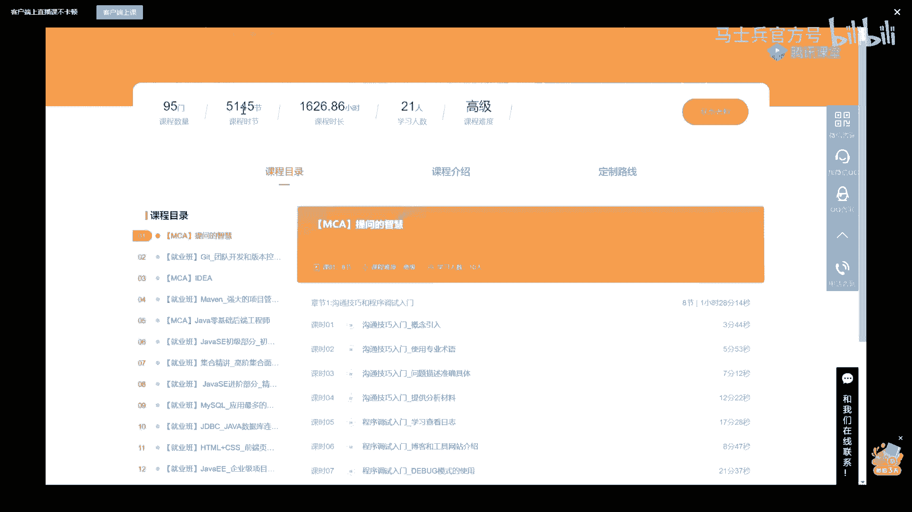
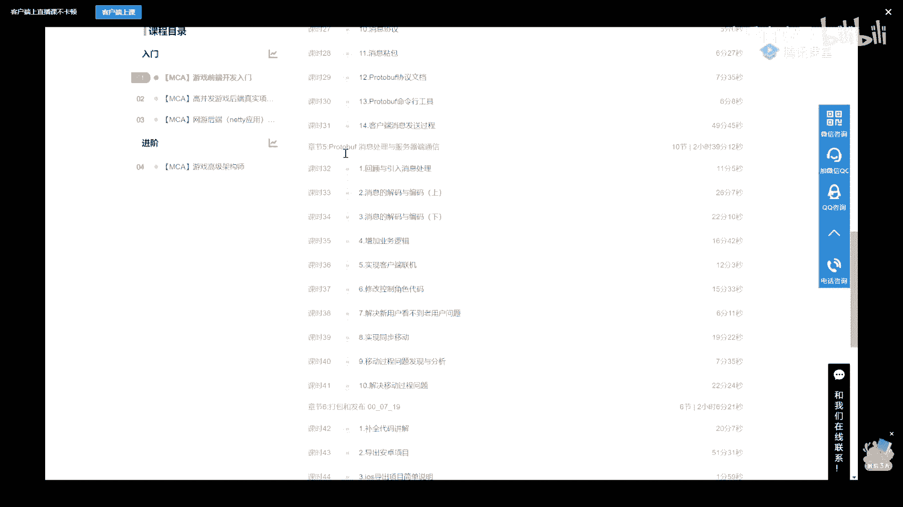
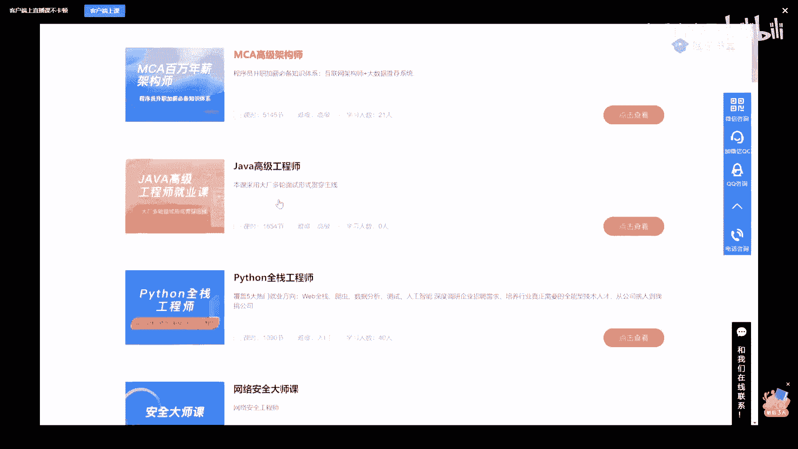
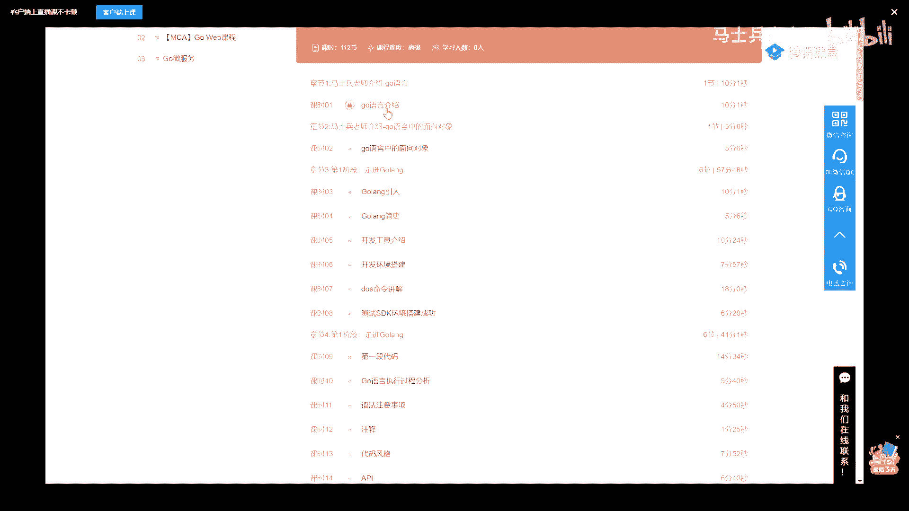

# 系列 1：P24：多线程与高并发：4.线程切换 - 马士兵官方号 - BV1mu411r78p

嗯下面我们来聊聊，什么叫线程切换这个概念，线程切换呢是什么概念，我刚才说了一颗cpu啊，他同一个时间点只能执行一个线程，实际上严格来讲，一颗cpu在同一个时间点上，只能执行一条指令。

这个指令属于某个线程，这个意思你们想一下呃，作为我们多线程的程序，可以多线程并发运行的时候能运行，假如说我们现在正在执行的是县城一，它的名字叫t1 ，要执行提一线，我们cpu是从t一里面读数据。

读指令开始运行，那假如说我们cp，我们t一执行到某条指令指令的指令二了，然后下，面呢t一的时间片到了，就说我我我我我我做a cpu呢，我每个星星都都要运行一次的对吧，都要运行一段时间，好到你这时间了。

你还没有执行完，到这儿了，下面我要执行t2 ，我怎么办，同学们，你们想想看怎么办呀，有的同学说简单啊，老师我就把t2 指令读过来，数据读过来，我就做t2 呗，但是你想过没有，如果第二执行时间片结束了。

又想执行t一了，t一执行到哪了呢，你还能想得起来吗，cpu没那么智能，他只是说你给我指令，我就执行，给我指令，我就执行我上次执行到哪了，我是不是得，记录下来啊，所以中间的切换过成什么样子的呢。

有一个过程叫做把纸啊，t一的现场，t一所需要保存的东西执行到哪条指令了，指令二执行到哪些是正在执行的时候，包括了哪些数据寄存器的内容，全部保存好，叫保存现场到你了，你是第五部，俩数据拿走。

你先自己抱着去好下面这个t2 ，再把t2 给放进来，那什么时候我们再想听的时候怎么办，恢复现场，把里面的数据再恢复回来，当然前提是把t2 又保存好，再把提议恢复回来，再继续执行t一好了。

我说到这儿能听明白这个过程，给老师扣一，这个东西呢被称为线程切换，有一个经典的小小的面试题问大家一下，我们说如果我们做一个复杂的计算程，需要，一个小时它可以线性被拆分开。

我们两个线程呢就有可能只需要半个小时，两个人干嘛，那是不是现成的数量越多，我们的执行效率就越高呢，很经典的面试题吧，是不是现成的数量越多，我们的执行效率就越高，当然不是，为什么，因为中间有切换的过程。

这个切换是需要时间的，是需要消耗资源的，当我们的建成数量越来越多的时候，我们很可能把大量的时间都放在消耗线程，切换上了，因为只要活着的现场，必须得保证每个县城都有时间执行，不然程序不死了吗。

1万个县城这1万秒里，头大量的时间都花在切换上了，你有没有时间去做计算了，所以它的效率不一定不一定是最高的啊，呃当然还有一个经典的东西说，如果，我们做一个任务的时候，有多怎么怎么来确定。

我给这个任务启动多少个线程呢，能听懂我说的意思吗，我再说一遍，比如说我们现在有一个程序对外服务，他后来后台有一个线程池好，这个时候我要有起多少个线程，对外的服务的效率才是最高的呢，其实这个问题吧。

cpu加一或乘二错还有吗，而n加一错还有吗，cpu密集密集，对c哥撑死你们，这这这是拍脑袋，想当然啊，这个问题我留一下啊，这个今天有时间再讲好吧，好，这里头得看你所谓，你首先得定义什么叫效率最高啊。

我简单简单说一下什么叫效率最高，效率最高什么意思，什么叫效率最高啊，效率的意思就是我压榨cpu，把cpu全都利用上，不让它闲着，这个我的执行效率一定是最高的，能听懂吗，我cpu让他闲着了。

就说明我浪费了我的计算效率，对不对，所以呢我cpu不让他闲着，这个效率才是最高的，那怎么样才让cpu不让他闲着呢，这时候你要看你一个工作任务，或者说一个线程，他的整个工作时间里头。

有多少条指令是要给cpu做运算的，有多少条指令不，用cpu做运算，我只需要去输入和输出的，听懂了吧，得需要做这个比例，我假如说啊我一个现成的任务，我有50%的时间是需要给cpu做计算。

我剩下50%的指令，只不需要cpu做计算，我只需要等网络上的输入输出，我想到这能不能理解，就是一个人在干活，一半时间在锄地，这个时候就是需要他动动动手的，另外一半时间在干嘛呢。

等着别人把那个土啊什么的给他运过来，听懂了吗，能理解这个问题了，给老师扣个一来，我刚才讲了，讲完了这个嗯，明白对不对，那同学们你们想一下，你们把cp理解成那个图，我有51%的时间用一个除。

好我说我想让一个处充分利用，利用到百分百多少个线程，两个，对不对，那如果我这个任务单元里头，有25%的时间是要用到这个图的，多少个县城，我让一个cpu让他跑满多少个县城四个。

那如果说我再我再出一个稍微更难一点的，我们现在有四个cpu，1234，好我让这四个cpu全部都跑满，但是我的任务呢只有25%的时间，用cpu来多少个线程，16个对，good没错，所以当你们老大。

或者说面试官在问你这个问题的时候，按照我的思路来说，听懂了吧，腾讯特别爱问，我就直接告诉你啊，基本上面腾讯的都被问到过，好嗯，我讲到现在为止呢，其实如果你要还往外拓展，我今天不想拓展，再往外拓展。

我怕有一些基础的同学会暂时性的受不了，记住学东西是有分层次的，可以先学浅层次，掌握浅层次之后再继续掌握深层次啊，一步一步来，我们的大多数的课本，和你平时所学的学习习惯是不管深浅，挨着牌的血。

这是效率特别低的，按我的来，你事半功倍，听我说，我们可以开展一些小小的基本的概念，比如说站在cpu的角度，我要给每一个线程需，要分配时间的，那我想问你一句，这个时间分配我按什么算法来呢。

能不能理解这个是操作作系统的核心，叫，线程调度器的调度算法，同学们，你们想想，你们如果是你的话，你会怎么做，动到把脑筋给我动起来，我现在问你的是，如果你是那颗cpu，现在有五个县城，12345。

你会怎么给他们分配时间呢，让你设计一个算法，咱们就讨论着玩儿好不好，有基础没基础的我们都可以，我用最简单的概念，就基本上把现代现代的操作系统，就给你讲清楚了啊，好你看啊，你看有好多好多人的想法，你看啊。

这个是嗯先来先做，就是排队，对不对，不合理，为什么不合理，可以做啊，就说大家你想到的任何算法，你说我先执行完第一个再置换另外一个，可以的，没有问题，任何算法都可以，但是我们现在的现在的操作系统。

这个算法是经历了多次迭代，好多好多年的迭代，所以你如果一次性的能想到，现在cpu所所所所能采用的算法，那你太牛逼了，你不用听我讲课，你给我讲课就行了，其实呢最开始的时候，不就是说我先执行完一个。

再执行完另外一个吗，但这个不合理，为什么呀，因为有的是加急的那种，你能不能听懂，有的是那个任务比较急，也就是它应该有一个权重在里面，他有的任务比较急，什么任务比较急，就跟那个医院似的，您平时是一个病人。

看完一个病人，但是有的急诊快死了，你再不处理我的电路有短路了，大哥你是不是应该处理优先处理那个呀，是不是那边发出来一个关机的程序，关机指令，结果呢，您前面做了计算关机，不好意思，关不了。

你等着等把计算做完了再关机，这玩意受得了吗，这边要取消导弹了，导弹要爆炸了，取消掉啊，不要再爆炸啊，先炸完再取消，那不可能，所以这个事儿不合理，所以这时候你就会发现哦，应该是有一个权重，权重高的。

应该往前放，对不对，good嗯，这是对的，还有另外一种呢，最容易想到的轮着来嘛，给你十个毫秒，给他十个毫秒，给他十个毫秒，给他十个毫秒，合理吗，也不太合理，为什么呢，给他十个毫秒没问题。

他正在要求你做计算，你赶紧做计算，但是你给下一个指令10ms的时候，你突然间发现这个指令在干嘛呢，在等着网络的输入，你这10ms就啥也不干，就搁这等着就行了，那你不是浪费吗，所以这个呢也不太合理。

平均分配啊，有些特殊情况，有些特殊的芯片，特殊的操作系统也是这么设计的，也可以，没问题啊，那么也不合理，那么到底什么样子的应应应应应，应该是应该怎么做呢，现代的操作系统呢。

这种的算法叫c completely，这说明脑袋脑袋都记忆力都不行了，不是l r u啊，那么这个算法呢叫cfs，考试系统特别特别爱考的叫completely，完全公平策略。

completely fair strategy，完全公平，这是linux最新版内核使用的算法，这个算法长什么样呢，第一优先级高的多分配时间片儿，但是呢有的那种那有的那种指令啊。

呃如果你你了解过那个wait方法，应该了解过v的方法是干嘛的，是说这个县城暂停，等着别人唤醒，是不是啊，同学们，你们想一下，如果有一个线程啊，它喂它了半天，然后把它唤醒了，他马上着急就想执行。

那这时候怎么办呢，现在的呢这个算法呢叫做结合了权重，权重越高的分配的时间片越长，有限执行，的可能性越越大，这是第一个，第二一个呢等待时间越长的，听懂了吗，我再说一遍，等待时间越长的越优先执行。

这个是有道理的，那个我人呢等待了时间，他你你给他个时间片，发现他等着呢，好放过他，给他一段时间，想让他执行了调度他哎，他还在wei状态，等待的越长，他醒过来的时候越优先给他执行，现在的现在的这个算法。

大概是这个这个样子啊，这个大体的过程，不知道大家听听听懂了没有，它不是完全按照权重，也不是完全按照时间，它是权重和时间的一个综合的权衡，ok，好了嗯，这个我在这就不展开。

因为这个是我后面讲那个什么内容的时候，才讲到的啊，你感兴趣的，你跟着老师的这个操作系统的课，你跟着走就成啊，它叫做cfs啊，当然还有实时进程和普通进程一说嗯，实施进程那就f先先到先先到先走啊。

或者是轮询啊，一般的普通的进程cfs，所以它内部的进程调度还比较复杂好吧，先不说这个呃，我们说呢还有一个特别好玩的概念，我不知道大家听说过没有，就是这个我是展开的技术不，技术不太好的同学呢，你听完这段。

你暂时先忘记它就行了啊，一步一步来，这个给基础稍微好一点的同学讲，这东西呢叫先成，也叫携程，来这个概念，面试中有被问到过的，给老师扣一，有被问到过的，有没有，go语言，对没错，是的。

应该会有人被被问到过啊，是的是的是，那么这个概念是什么概念呢，我简单解释给你听，这个概念呢我在讲go语言课程里面，就是我们课程里呢，mc课呢是包括了一个go语言的课程，再看一下。

这是dba的内容。

游戏的内容，啊稍等。

嗯包括了一个嗯go on课的一个简单的内容。

呃在这门课里面呢，我在这个购员面向对象里面，给大家介绍了go浪的最核心的两个概念，垃圾回收和那个呃。

和那个那个携程这个概念，这个携程这个概念呢是这样子的，你认真听我再说一遍，基础差的这部分呢你先略过好吧，我们说原来呢一台计算机是一个硬件，这是一个硬件，现在后来呢有了java之后。

我们诞生了一个虚拟机的概念，虚拟机概念什么概念，虚拟机概念，就是说我们在这个硬件的基础之上，虚拟了很多台不同计算机，你可以把它看成模拟出来的，很多不同的计算机，它有自己的cpu，有自己的cpu。

有自己的内存占，有自己的内存占，你可以看成是多台机器，但是呢它同时跑在好多台不同的物理机上，这是jvm的虚拟机，这是go on的虚拟机，好了，同学们，你们想想，如果你把它看成一台完整计算机的话。

他是不是可以有自己的线程啊，可以不可以，听懂了吗，docker算虚拟机吗，算我再说一遍，我们的物理机，我们的windows机器管着自己的操作系统，管着自己的现场，这是我们物理机的那个那个那个现场。

那么在每一台虚拟机里面，是不是也可以有自己的线程啊，ok这个一般我们称之为叫用户线程，或者叫线程或者叫携程，就说我们自己的程序，在自己的这个机器内部来模拟多线程的，那个线程，叫做西城或者携程。

这里面的所调度也好，同步也好，都是由谁来完成呢，由我们虚拟机自己来完成，但是你要记住，这个虚拟机最终的实现要靠谁来实，现要靠我们的物理机上的那个线程来实现，是它最终呢一定有一个映射过程。

这个映射指的是什么呢，就是在我虚拟机内部的线程，和我们物理机内部的线程，它是怎么样转化过来，由他来完成的呢，县城里的县城是的，这个一般我们称之为那叫做映射的概念，听我说我简单做一点拓展jvm的内容。

这里是一比一，比如说jvm里面如果有一个线程，物理机上就一定有一个线程，但是go浪不一样，go on里面如果有一个县城，有1万个县城，这里面很可能只有两个县城，go浪里面有80个携程。

这里面很可能只有一个线程，在它内部用软件模拟了它们的同步，它们的调度好，这是很粗的一个概念，想细究的话呢，没有俩小时是不行的，先放过它大体理解，所以这里面有一比一的概念，也有m b n的概念。

一般的情况下，m远远大于n，好这个过程简单听不代能大致能听懂吗，携程呢有好多叫法，有的叫kroutine，比方说go语言里面有的叫fiber，在jvm里面，专门可以有一种东西来做jvm的，携程。

给咱们的另外的类库好吧，java有第三方支持先写成的库吗，当然有，我在我的vip里也专门讲了，这部分，有咱们阿里的老师讲了，在阿里内部他们是怎么运用，加了就是jvm的这个这个这个线线程库，来提高效率的。

在这里先不展开，但是我我相信我讲到现在，别人再问你这些个概念的时候，你就没那巩固了，什么叫程序，什么叫进程，什么叫县城，什么叫现场好，这四个概念能说清楚的，给老师扣一，注意先生有他自己的问题啊。

并不是说用线程一定就好，不是的，不一定的，好吧好了，我有讲到现在呢，我把大体的硬件上的这些个脉络，给大家讲清楚了，呃当然那个如果你还想进一步了解，其实还可以了解，去去了解什么呢，去了解现在的鸿蒙系统。

鸿蒙里面又是很好玩的概念，它叫做微内核，哈哈这就不展开了，一般的我们现在的那个机器呢叫做红内核，但是呢鸿蒙呢叫做微内核啊，呃我在这儿不展开，下面呢我们开始聊什么呢，聊线程切换之后呢，更深入的一个概念。

你看这里，看这里，我们拿海胆这张图来说，嗓子真的沙哑是吧，嗯是有一点点会喝口水，那个，不过没关系啊，嗓子沙哑，那只是声音会变，但是知识结构不会变，我只不过讲的稍微慢一点而已啊，大家体谅。

那个心灵老师再来跟小小伙伴们聊一聊，我我需要排空一下膀胱，上课的ppt会分享吗。