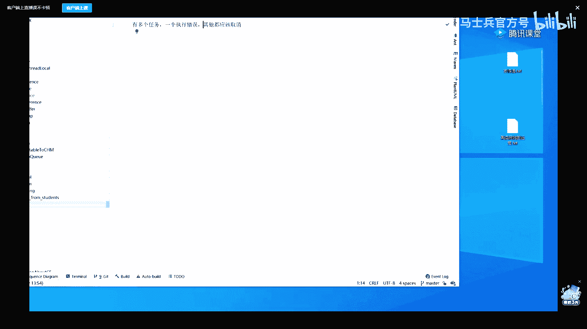
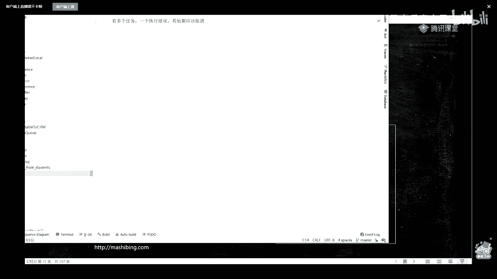
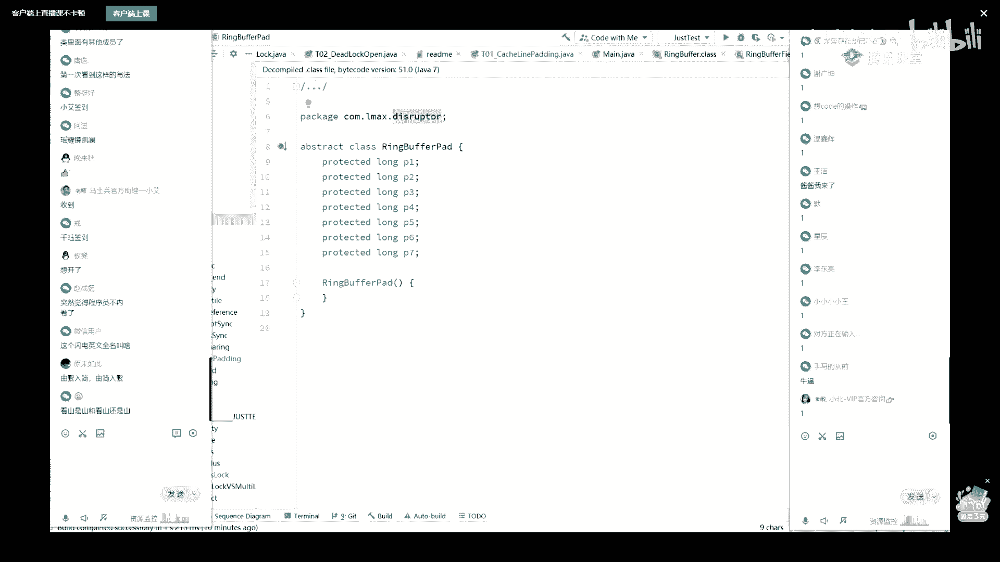
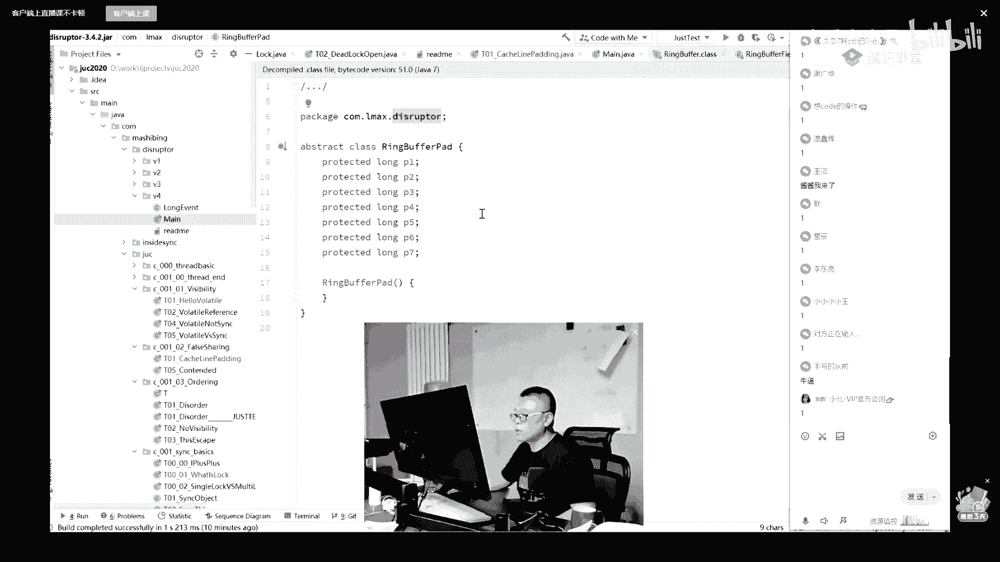

# 系列 1：P25：多线程与高并发：5.CPU的并发控制 - 马士兵官方号 - BV1mu411r78p

呃下面我们讲什么概念呢，我们来聊cpu的速度和内存的速度，他们之间不匹配所产生的一系列好玩的东西，好吧，大家稍等啊，你先聊一聊一小会儿啊，小伙伴们聊一小会儿，咦哈喽哈喽呃，讲到哪儿了，是来我接着讲啊。

然后大家有没有想要这个笔记的，这个笔记是今天上完课，然后明天上完课，上课的ppt会分享吗，啊p p t可以有的，今天听完直播，明天听完直播，两天听完直播，一定要明天听完直播课，马老师的笔记资料。

还有整个视频大家都可以拿到，拿到呢是去找一下自己的那个咨询老师，不捡笔记资料，还有那个马老师之前讲过的呃，多线程的j vm的，大家都可以拿到，这些都是还有什么想要的都可以找他们，今天到几点。

今天差不多得到十点半吧，这个看马老师先请呃，除了马老老师讲完的这个课程，然后大家有任何的呃职业上的问题，或者是工作中的一些困惑，提升方面的呃，掌心方面的任何问题呢，呃马老师讲完课之后呢都可以问。

就相当于约今天直播间让马老师给你做一个私人的职业规划，球球跟我走吧，可以啊，球球完全可以带回家啊，呃球球是单身，直播间里所有的都是单身，求救可以带回去，阿静也可以啊，多线程下载文件啊，下载文件也可以啊。

带回去，我不可以带吗，可以都可以，所有的人都可以，马老师马老师这个比较难带啊，啊来马老师来了，诶你为什么每次都把这个框给拽出去呢，这颜值这么高，那就为什么没有信心呢，ok那我们继续，那个。

这个这个有时候没办法啊，这个不喝水吧，嗓子疼，喝了水吧就不停去厕所，就是这个这个凡事都有两面性，有一利必有一弊，呃，福兮祸所倚是吧，祸兮福所依啊，呃这个是事物的最根本的一些个规律，就是。

一件事情不太好的时候，其实往往会孕孕育着很好的机会，待会如果想深刻认识这个规律的话啊，深刻认识这个喝水尿尿这个规律，我建议大家呢去读一本书，建议大家读一本书，第一卷，哈哈哈，矛盾论，劳动著名的两轮。

一个叫矛盾论，一个叫实践论，有空的时候可以简单了解了解啊，这个呢是辩证主义哲学的嗯，好不展开了，以子之矛，陷子之盾何如呃，你说的很对啊，挺挺好玩的，当年秦国在造自己的矛和自己的盾的时候，他们是分成两拨。

那么造谣的人给他们下的命令是，如果你的矛刺不穿盾砍头，给造盾的人给他们的，命令是如果你的盾被矛刺穿了，砍头，所以最后呢最后发现秦秦国人最后造出来的毛也特别牛，可以刺穿其他国家的盾，盾也特别牛。

任何其他国家的矛都刺不穿，这就是管理，那你你你们你们上班的时候有没有这样的管理呃，字节跳动采用的是赛马机制，同一个类型的项目好多不同的项目组在跑，谁跑出来算谁的，腾讯也采用的是类似的机制。

最后士兵造反了，哈哈哈好吧，好了不开玩笑了啊，来我们继续嗯，在这里面呢有一个非常非常特殊的东西，这东西叫什么呢，叫做缓存，这是cpu，cpu的速度非常快，如果这里是刘翔，那么这里就是乌龟，龟字怎么写好。

这里就是乌龟，cpu的速度呢大概是内存速度的100倍，其实我讲到这里，敏感的同学应该会有疑问的啊，我再说一遍，我说的这个问题啊，就是说cpu的速度是内存速度的100倍，我讲到这里应该会有人有问题。

cpu呢确实是可以用速度来说的，它有主频，内存，内存哪有速度啊，内存是用来做存储的，它跟速度有关，完全关系吗，听我说这里的速度呢，严格意义上来讲叫做从运算单元去自己cpu内部存储器里面取一个数据。

如果需要的时间是一的话，那么从运算单元访问到我们内存取一个数据，它的速度是100，时间是100啊，不知道说清楚没有，所以速度是这个概念啊，那个那这个时候就会产生一个问题，同学们你们想一下。

如果下面呢我有两条指令，这第一条指令呢是去内存里面取个数据，第二条指令是什么呢，对自己的某个寄存器做一个加加操作，两条指令，那么这个时候呢你就会发现我要取这个数据的时候，我执行第二条数据。

第一执行第二条指令的时候，得把第一条指令执行完了，浪费花花，花一个花，浪费100个100个等待的时间才能执行下一条指令，哎呀这个速度实在是太慢了，我们能不能够提升这个存取数据的速度呢。

存取数据的速度能不能说明从上海呃，从北京往上海访问一个数据，比方说八个小时，能不能让他把这个数据离离我离我近一点，中间加一个中间层，放到中间，这个中间是哪呢，北京到上海的中间啊。

别到上海的中间应该是哪儿啊，诶北京到上海中间儿是哪儿啊，这个不查地图了，我们假设是嗯德州好，我们假设是德州，我们把这个数据往德州放一份，同学们，你们想想，我从cpu里去，我从北京取这个数据。

是不是就速度就快了，这里是八小时的话，这里四个小时就够了，但是所有小说我还嫌慢，我怎么办，告诉我还嫌慢怎么办，再往把这个数据往天津放一放，听懂了吗，唉就是我中间呢多放一些离我近的好，这种东西呢叫做缓存。

这缓存，那现在我已经来了呃，我中间建多少级缓存合适呢，多少分合适，这东西不好说，如果我中间间隔是就是说中间层数少的话，这个效率就会变高，但是呢我去取的时候效率就会变低，但是如果我中间层数比较多啊。

我有十层，那我取数据的速度会变快，但是与此同时带来的是什么呀，从这里头复制一份数据的时候，要复制十份，所以这个效率就会变低，所以凡事有一利必有一弊，对不对，福兮祸所倚，祸兮福所倚，听懂了吗。

所以为啥不直接放在天津，那你不中间就离这边近点，离这边就远嘛，这边复制就慢，这边这边复制就快了，就是凡事有毅力，一定必有一弊，所以请大家去读什么矛盾论，我建议大家读书，我我一般把我的mca课叫做成才课。

注意我不叫它架构时刻，我不叫他说成员，你高级成员这个不是我培养的目标，我把它叫做成才课，能听懂吗，成才这件事儿不是你搞定技术就能成才，你的思维方式，思维逻辑都要产生变化，你的格局都要起来好吧。

然后呢你才能称称之为这个时代的人才，21世纪什么最贵，想拿高薪，麻烦你让自己成为人才老师，我首先学生年薪过百万的已经比比皆是了，丁点儿不吹牛逼，教他的时候不是说只简简单单的教技术啊，但是先交技术啊。

先交技术，技术好了之后再慢慢来看这里嗯，所以你会看到层数多有层数多的利弊，层数少要层数少的利弊，那么到底我们用多少呢，在进行了多方向的权衡以及数据的统计之后，听我说，现在的cpu。

我们讲锁的时候用的是那个厕所的例子，在这就不展开啊，现在的cpu，看这里是由几层缓存构成的吗，中间有三层，我再说一遍，为什么三层为什么不多不少，不是四层，不是五层，可以四层吗，可以可以五层吗。

可以可以一层吗，可以可以没有吧可以，但是还是那句话，在权衡利弊的情况下，三层比较合适，所以现在用的是三层，那么这三层缓存呢很简单，被称之为l one l two和l free，嗯后面是一个大约的速度。

在这就不展开了，好三层缓存分别位于什么位置，物理上，我在这儿做一个简单的小小小的图讲给大家听，这边呢是一整颗cpu，就是你从平时如果去电子市场买一颗cpu，买到的那个完整的那一颗是一颗cpu。

但是呢现在的cpu它内部可以有好多个核构成和什么概念，相当于每一个核可以运行一个线程，所以你可以把它认为是好几颗cpu，原来的四颗cpu现在只不过是封装到了两颗里面。

ok在每一个盒里面有自己的l one l two多个核，也就是说在一颗cpu里面共享自己的l three多颗cpu去共享整个内存，好这个结构很简单的一个结构，嗯讲的我们今天要讲的也不是说硬件的内容。

我们还是要讲软件，我们就以这个图为例子啊，这个图能跟上的，给老师扣个一，对他有些硬件呢也在不断产生变化，demon说，现在a amd的zen 3把l3 合并了，可以的，没有问题，就是说你记住记住这一点。

计算机的发展的日新月异，芯片ai的芯片的结构就和现在的又不一样，显显存的这个这个这个显显卡的这个计算啊，它呃就是显示芯片的计算又和这个又不一样，我讲我讲的呢是一种普通话的普普遍性的。

很多时候呢你了解一个普遍性之后，其他的叫万变不离其宗，先把最根本的东西了解了，这个一般我们称之为叫第一性原理，做任何事情请你去，首先人追求第一性原理，感兴趣自己去搜索，在这儿再推荐大家一本书。

这本书呢叫价值，听说过你给老师扣个一，这不是价值，国内最大的投资机构的老板叫张磊，他投资了投资了京东，投资了腾讯，基本上全国国内比较牛逼的互联网，它投资了一半以上，五五千亿人民币的一个基金吧。

应该是还是5000亿美元，我忘了，非常非常的牛逼，他写一本书叫价值在里面搜索推崇的最核心的一个点叫第一性原理，我还是那句话，希望大家给大家伙儿啊，短短的一堂给大家伙打开更多的视野，好吧对，高龄集团没错。

而且，这哥们儿是哪儿的呀，驻马店同学们，你们平时听到驻马店的时候是什么样一个想法，10亿人民9亿骗教练就在驻马店是吧，哈哈哈哈哈，这是很早很早以前的了，好听我说今天如果大家伙儿对老师学生学课程比较认可。

后面如果想报名河南的同学，优惠500，对河南灾区的一个小小的慰慰问吧，好吧，中原一带的人民呢其实历来遭受的苦难比较多，所谓的说这里的人不好，那里的人不好，其实就是一个字闹的穷，待会慢慢变得富有之后。

仓廪实而知礼节，其实慢慢的人的素质也都会变高，好看这里，同学们，你们想一下，当我们有了三层缓存的概念之后，我们琢磨一件事儿，呃我刚才说了，说当我们的au需要内存里的某一个数据。

比如说这个数据x然后呢我们需要把它放到寄存器里，因为中间有缓存，那么这个寄存器会去怎么怎么去读这个x呀，他会首先去找找我们的一级缓存，如果没有的话，找我们二级缓存，如果还没有的话，往三级缓存找。

如果还没有，在内存里面把这个x拿出来，放到哪里去呢，换个颜色，放到这里放这里放这里复制一份，那么当我们下次再来想用这个x的时候，ok就可以直接从这里找到了，能听懂这个过程吧，很简单，但是你想过没有。

当我们又需要y的时候，我是不是又得再找一遍，再找一遍，再找一遍，再把这个y给放进来啊，同学们，你们发现没有，这个反而比我直接从这里读的效率变低了，因为每一次我都要重新放一遍，太累了，多了一些复制的过程。

对不对呀，为啥每次都要复制，因为你复制好了之后，下次再找就不用找那么远了，天津也有，就不要去上海找了，对不对，那我怎么样才能提高这个效率呢，很简单，老师你能不能够把x和y一次性的读进来嘛，对不对。

说对了没错啊，说的很对啊，就是说虽然说我们当前的指令可能只需要一个x，但是我可以把x所在的一整块数据一次性的放到这里，放到这里，放到这里，如果你不能理解，你就想象一下。

我们有一个程序对一个数组做一个循环，我们去我们到第一个数据的时候，我们一下把整个数组的数据全放进来了，那我们做循环的时候，小伙伴们，你们想想我们是不是每次只要访问这儿这儿就可以了。

那这个速度是不是就快多了好了，这个我们称之为叫程序的局部性原理啊，还有时间上的局部性原理，这个先不，管它你大致能理解这个意思就行了，懂了吧嗯好，那现在问题来了，我这个这一块到底是多大呢，矛盾论。

特别大有好处没有，当然有好处啊，我我命中命中的数据，所谓命中就是第一级缓存，就找我就找到这数据了，命中的数据数据的成命中的可能性就高多了，对不对，我就直接从这儿找着了，我效率肯定高。

但是与此同时带来的是我每次复制效率是不是就变低了，好如果特别小呢，我每次复制速度非常快，但是我命中率是不是就低了，所以，综合下来的又是一个权衡利弊的结果，目前的这个大小是多大呢。

这一块数据记住了64个字节，在此时此刻，在2021年的7月29号，工业界对于这块数据所采用的是64个字节，记住了，好吧好，这一块数据有一个特殊的称呼，这块数据呢就叫做缓存行，叫catch来。

那开出来记住它的大小多少，64个字节好，那现在问题就来了，有一个特别好玩的问题就出现了，我们假如说现在有两个县城，第一个县城呢在左边这里运行，第二个线程在这边这颗cpu里运小。

然后第一个线程我们用到的数据是x，第二个线程我们用到的数据是，ok听我说，当我们左边用x的时候，它会xy，我们假设啊位于同一个缓存行，也就是同一块里面，刚才我说过。

我们用x的时候会把整块数据放到我们的缓存里面，好从内存里读过来，放到l3 ，l3 ，放到l2 ，l2 放到l1 ，然后呢我们就可以用计算单元来做计算了，我们另外一颗cpu用的是谁呢，用的是y好。

他也会把同样一行读过来，读过来再开始做预算，这时候就会产生一个问题，这个问题是就是同一行数据，这行数据会在这颗cpu里面有一份，会在这颗cpu里面有一份，我讲到这儿能不能跟得上，能听明白的给老师扣一。

对就这里有一份，这里有一份，那么现在的问题是，当我改了这一整行数据的时候，我把x改了，我需不需要通知另外一颗cpu呢，要不要当我改了这边这行数据y的时候，我要不要通知他呢，听我说这个是需要的。

因为你不能说我这边改了数据，另外一边不知道，我还拿旧的数据去做计算，这肯定是不合适的好了，那怎么样才能通知呢，这个东西呢我们称之为缓存一致性协议，这个协议比较复杂，它是硬件级别的协议呃。

从现在英特尔cpu的协议所采用的协议呢叫做m e，其他的cpu所采用的协议呢有不同的名称，有的叫msi，有的叫什么呢，see synapse，有的叫什么呢，有的叫firefly，他叫什么，我没所谓。

反正就是不同的cpu采用的协议是不一样的，总而言之，在它的内部有一种机制来负责什么，负责两个位于不同cpu的缓存行之间的数据一致性，这个内容其实嗯比较复杂，我在这不想展开，什么时候才会触发这种机制呢。

有同学说volatile错了，有同学说总线嗅探又不对，你们都学歪了，其实是拿英特尔cpu来讲呢，只要你l2 这边写过了，它就会自动触发两边的一致性，其他的cpu呢机制可能会不太一样。

这个你要查不同的cpu的手册去好吧，关于这块内容，他对于底层的知识了解得非常的透彻，昨天晚上应该是他上的课吧，不知道大家有没有听过讲的是compleable future的源码哦，那个，啊听了是吧啊。

有同学听过了，说讲的挺好的，对是的，在这个基础之上，你会知道有这么一种机制存在就行了，那么就直接给干懵了是吧，哈哈，听黄老师课需要先打一点基础再听好吧，因为黄老师讲课会讲到比我更深的深度上，ok啊。

昨天听周老师是吧，嗯还有前天啊，忘了没关系啊，后面咱们老师都会讲课，好好听，我说，对黄老师讲的是黄老师呢，他是20，今年25岁，最早是在阿里，后来是在美团，他在20不到25岁的时候呃，年薪已经过百万。

那是属于大神级别的，所以，所以这个这个这个你听他课肯定是得好好的打一点，打一点基础啊，一会儿你们需要的话，我可以给你们看看黄老师的简历啊，嗯看这里啊，我我我还是那句话，就是说你你跟着学。

跟点牛逼的人学好吧，就是为什么把黄老师拉过来讲课，因为我觉得牛逼，还是那句话啊，就是他带你，你不要看年龄，他有些地方比我都牛，比我都牛啊，我服我也想跟着学，好了不说了，我还要看技术嗯。

缓存行这件事呢今天讲了很多基本的概念，待会儿听着也挺好玩的，也比较简单，那缓存行这件事能不能够说我们写一个程序能证明它的存在呢，其实是可以的哇，今天嗓子实在太难受了，也就是说九点半左右。

但是今天已经讲到十点了，我把这部分讲完，剩下的我明天再接着给大家讲好吗。

看这里啊嗯我呢。

啊这是一个那个阿里的阿里的问题，我在这儿呢把这个缓存行这件事讲给大家听啊，看这里，讲完这个程序，我们今天干火结束，然后呢我会打一点广告，但这个广告呢也就11点结束了，今天我们就讲到11点好不好。

大家看这里啊，cc说买了mc a课可不可以两个人同时观看，你只要同一个账号也没人管你，你就是不可能有两个账号啊，马老师的app上线了吧，你你你那个你什么手机啊，vivo oppo华为的。

苹果的都已经上线了，你要其他牌子的手机的话呢，从腾讯应用宝下载，好看这里啊，同学们呃，我们看一个小程序，这个小程序呢我就我们就先读，然后一会儿再探究它的原理，在这个小程序里面呢，我有一个计数器。

这个计数器呢是10亿啊，它是一个循环的计数就11次循环好，我有一个类，这个类叫t在它里面只有一个成员变量叫x什么类型的呢，是long类型呃，先问大家第一个问题，一个long类型的大小是多少。

大小多少占多少个字节，八个对吧，唉一个long类型的是八个字节，那么，一个t对象里面有一个x，然后呢我有一个数组是t类型的数组，这里面有两个t对象，而为零是一个t对象，2v一是一个t对象。

你可以想象一下啊，在内存里面的这是一个t对象，里边有个x，这是我们的a0 x0 ，这是一个t对象，呃，又里面有个x啊，这是x1 ，就是这么一个东西，好，我现在干一件事儿，干什么事儿呢，我起了两个县城。

这是第一个，在这第一个线程里面，我不停的修改2v0 的x看到了吧，2v0 点x等于i，然后我在另外一个县城里面不停的修改，而a一的x，好最后呢我做了一个计算。

就是说整个程序结束之后会花多长时间来完成这么多次的循环，跑一下看看啊，呃来这个这个小程序能跟上的老师可以，简单啊，来我们跑一下走，你，ok请大家接着数据的数据是大概800个毫秒，再跑一下。

看看800ms左右吧，嗯嗯然后呢还是同一个程序，还是同一个程序，你仔细看，在t里面呢，我增加一些没有用的数据，我在x前面增加七个long类型的数据，在x的后面增加七个alone类型的数据。

我其他程序啥都没有变，没有任何变化，我再跑一遍走，你，这个是240，再跑一下240，再跑一下，240，再跑一下243，哈哈再看一遍，我把这两行注释掉，再跑，788好不好玩，好，给大家十秒钟想想为什么。

为什么呢，其实你想想我刚才讲的缓存行的概念，你应该就能理解了，你想想作为只有一个x存在的情况下，同学们，你们好好想，我这个第一个是x0 吗，由于它两个位于同一个数组，第二个是x一好。

这两份数据的位于同一行的概率，那是相当的高，然后呢我们两个县城，第一个县城跑到这颗cpu里好，这行数据在这，第二线程跑在这个cpu里，这行数据在这儿，但是呢第一个线程只改x0 的部分。

第二线程只改x一的部分，刚才我说过，由于有缓存一致性协议的存在，我们对这里的任何修改它，要通过某种机制来统治到另外一方，我对这里的任何修改也要通知某种机制化交给另外一方，那我想问你这种机制要不要耗时间。

要不要一定要好了，换另外一种情形，我前面有七个long类型，后面有七个long类型，那么这个时候会发生一种什么情况呢，这个我看我有没有画图啊，有画图，我手工给你画一下，我在这里画了一个小图。

因为以前老有同学想不明白这件事，其实这件事挺简单的啊，同学们，你们仔细琢磨，我们说在一个long类型的x它是八个字节的情况下，在他前面放了七个，后面放了七个。

也就是说这个x无论和其他数据怎么样进行排列组合，它都不可能和另外一个x或者另外任何其他数据位于同一行，能不能听懂，为什么恰好是七个呀，因为我们一行数据是多少，64个字节不就一共是八个long类型吗。

假设我们的x前面七个加x8 个，后面七个加x8 个，对不对，既然这个x是为在这行里，另外这个x是在另外一行里，那我一颗cpu改这个我还用通知别人吗，我们效率是不是就变，是不是就变高了。

good一定变高了，来这块能听懂的，给老师扣一，那有同学说老师这跟语言有关系吗，跟语言你说有关系吗，半毛钱关系没有，你是c语言，你是c加加语言，你是java，你是go。

随便你就是我建议大家就是我们mc课里大量充斥着这一类的内容，它跟语言没有关系，它叫做架构师课，知道吧，我觉得这样的内容才是值得你好好掌握的，至于语言的语法我不知道了，查查类库不会用了，查查没有关系的。

很容易搞定好，那现在我们我们继续说，我讲到这儿呢，有同学可能会问说老师真的有人这么写程序，是的，有一个特别牛逼的框架，听说过的同学能跟老师，不是能跟面试官聊起聊，聊起来的时候呢，你能很有很大的加分项。

这个框架呢它的名字叫disrupt，disruptor，翻译过来叫闪电，嗯形容它的速度非常快，闪电是原来得过杜克奖的一个开源框架，这个框架呢那个他追求的唯一的东西叫做效率，它是一个什么东西呢。

单机最快的mq消息队列，消息队列呢多数同学应该听说过，一个容器里面装着各种各样的消息，有生产者不断的往里扔，有消费者不断的往外拿好了，这就是一个消息队列，一般的消息队列啊，要么用数组。

要么用链表链表好呃，像这种东西呢，一般数组的话两个指针头指针指尾指针链表也一样，头指针尾指针好，为了追求效率，disruptor用的东西叫环形队列环，环形队列，环形队列有一个好处。

只需要一个指针就可以了，不断地挪，挪到脑袋上之后，又继续往下挪，不断地转圈转圈转圈儿，当然它是一个首尾相连的数组环形队列，我讲到这儿呢，有同学可能会有点懵，说老师我一个环要是全装满了的时候。

我在往里头扔数据怎么办，cs方式等待消费，没听懂就算了好吧，就这里面是另外多线程的另外的概念，如果说呃今天来不及，我明天给大家讲这个概念，它是提高效率的，另外一种方式叫cs方式，等待消费。

消费完了再往里装，无了是吧，有好多同学说老师您讲完课之后，我突然间发现好东西串起来了，那就对了，因为我讲的是什么第一性原理是吧，我讲的是什么矛盾论，刚才浪费了空间，节省了时间，浪费了时间，节省了空间。

有利有一利必有一弊，有一弊也存在一例，听我说，我们说这个环形队列它的全称叫什么呢，叫做作ring buffer，ring环形buffer缓冲区，环形缓冲区，这是它的一个类，我们点进去看一看它的源码。

点进去，当你看这个rain buffer的时候，你会发现它有一个cursor value，就是指针，指针指的位置，你会发现有特别好玩儿的七个数据扔在这儿，龙龙龙龙龙奇怪奇不奇怪，我说我不跟你讲。

你一定不明白这七个数据干嘛的，你信吗，到现在我觉得大多数同学应该都明白干嘛使的，填充用的，有同学说老师那不对呀，你在这里面只填了七个，后面有七个，假设它是后面那七个，他前面应该还有七个呀，对不对。

别着急，rain buffer，它的父类叫做rain buffer fields，点进去，rebuffer fields的fly叫rebuffer padding，点进去，在他的父类里还有几个。

看懂了吗，来能get到这点，同学老师可以，是的，为了追求效率，程序员极客们无所不用其极，确实有的人会这么写，会追求这样的效力啊，要笑死，为什么要笑死啊，你跟面试官把这个事儿聊出来，50万年薪就等待你了。

知道吧，孙子和爷爷有七个，哈哈，第一次看到这样的写法，对，很好玩的，我后面给你讲的型号，你会你会看到会更加的奇怪，就以前有同学有同学说，老师听完你讲课，我都不知道该怎么写程序了，没事儿。

知识这东西是先学后再学薄，也有好多时候就跟人生的道理是一样的，有好多人说啊，我看开了，有些人是觉得自己看开了，他没有经历过什么事，看了几本书觉得自己看开了，有些人是什么样的呢。

经历了很多事情的最终的顿悟，这是两种不同的境界，慢慢来好吧，先把人声做厚了，然后很多事情呢你就看得通透了，先把书读厚了，先把知识学好了，然后你就看得通透了好吧，由繁入简，由简入繁，再由繁入简啊。

这个闪电英文名全名叫啥，disruptor，就是闪电的英文名嘛，你搜一下。

好了，我这个嗓子确实今天非常的不太好，因为因为我今天其实还可以给大家讲一些更多的内容，但是呢我今天速度稍慢。

请大家见谅，我明天继续好不好呃。