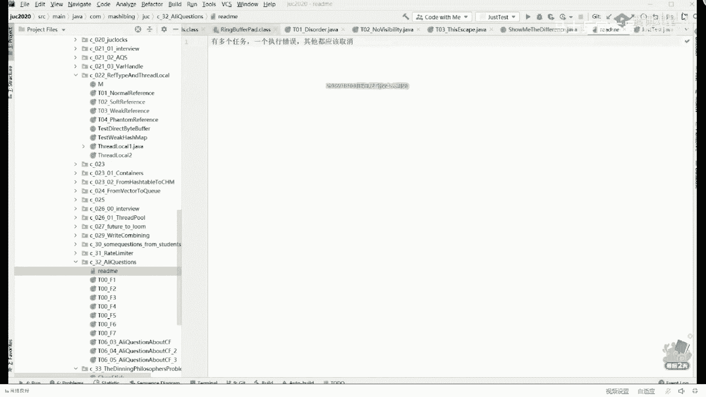
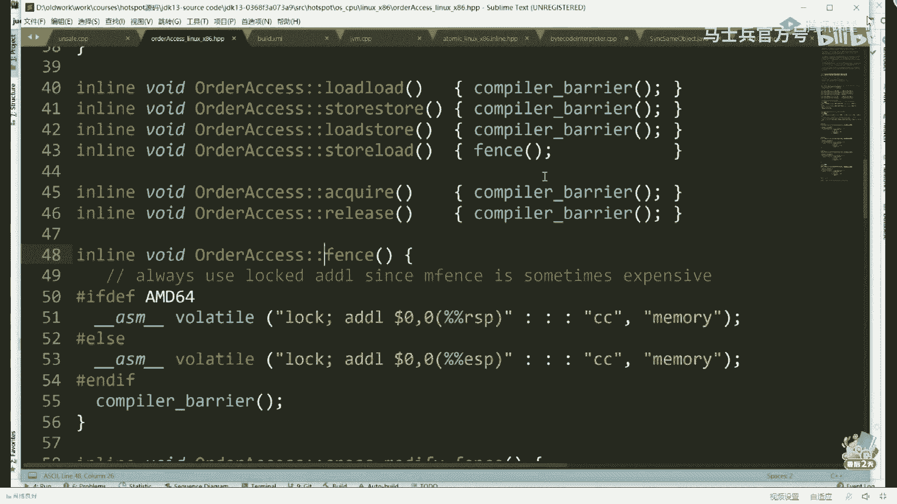
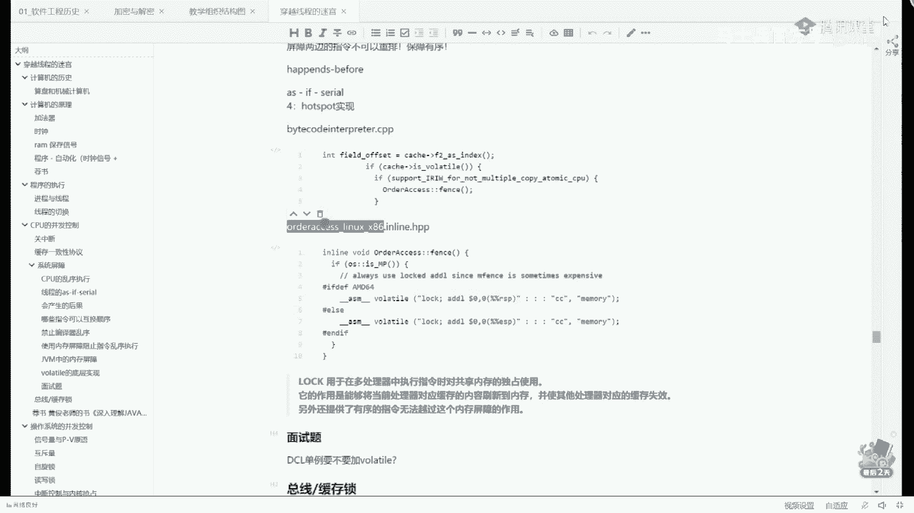
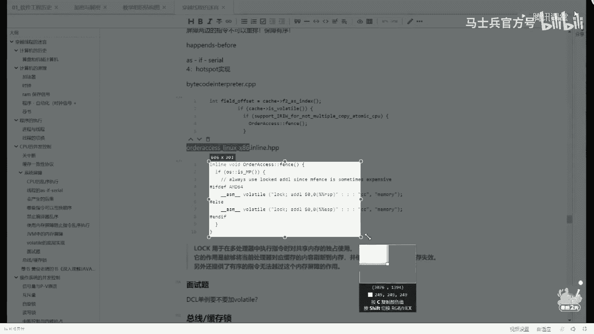
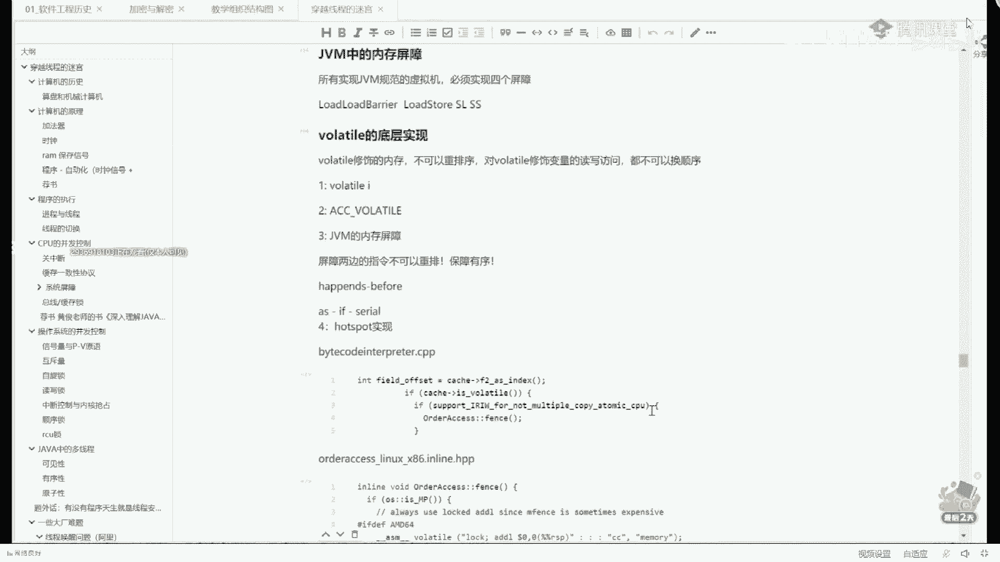

# 系列 1：P31：多线程与高并发：11.线程的“结束” - 马士兵官方号 - BV1mu411r78p

随便在哪换一下啊，不要看这字儿啊，这字没意义，哪些语句是不可以换顺序的，上网去搜这个名词，happens before，happens before，呃我估计不少同学应该是听说过这个名词的。

happen before在什么之间发生，就是它规定了有八种情况是不允许换顺序的，这两种情况呢你也不用记，你也不用背，它都是非常浅显的一些情况，比如说线程先要弄完了之后才能启动啊等等，就这一类的啊。

呃那个对象呢必须先溜出来才能调，才能才能回收啊等等等等这一类的，好吧，呃听我说这八种呢你也不用背，因为这是jvm虚拟机的规范规定的啊，你只有做虚拟机的人才需要去关心它，就是总而言之，你要了解的一点是。

在我们系统的最底层，我们内科cpu的硬件级别对他的一些个操作是体系，是影响到我们的高级语言的，好吧呃当然我讲到这儿呢，有同学一定会问第二个问题，说老师呢我刚才呃我认知到了啊，这个指令有可能会顺序。

并且呢它会造成不可见的一种情况，不可预测的一种情况，那你告诉我我怎么才能解决这种情况呢，就像我刚才写的这个b cl这块也是一样的，同学们想，既然他有可能读到中间的中间的值，我能不能不让他读到，可以吗。

可以做到吗，好听我说，同学们，你，们我现在先讲啊，注意就是这块的内容呢是牵扯到好几个层次的，就是从最底层的层次到虚拟机层面的层次，到源码层面的层次，到编译器层面的层次。

其实每一层都有解决自己不可换顺序的这种解决方案，我现在讲给你，先给你讲的是最根上理解的东西，你先把语言什么全给忘一边去，什么volatile，什么c语言，什么java语言先给我放一边，不用不用想这事儿。

我们现在讲的就是汇编，同学们站在一个一颗一颗cpu的角度看，你给我两条指令，我是可以换顺序的，那我现在想问你的是，我如果不想，让这两条指令换顺序，我该怎么做，这两个人排着队，我就不想让这个人插队。

我该怎么做，该怎么做，简单，我在中间竖一堵墙就行了，能听懂吗，我在中间把门给他关上，墙上只有一个门，门一关，我先让这哥们进来，他执行完了，我才放第二个人好，这堵墙指令和指令直间的这一个东西。

一般我们把它叫做屏障呃，叫屏障，英文的名字呢叫barry啊，或者叫fence，fence是里面的意思，听我说所有的cpu or cpu啊，所有的cpu啊，有一个算一个都有自己的屏障指令。

屏障是一种特殊的指令，指令一指令二中间有一个指令，虽然它比较特殊，说屏障比较特殊，但它也不是说多长和一类，它只是一种一条特殊的指令而已，你想让另另外两个人不让他换顺序啊，你在中间放个指令，no放个牌子。

就这意思啊，另外一条特殊的指令，当cpu看到这条指令的时候，他不会把上下这两条指令换顺序，这块能听懂吗，同学们来这块能听懂的，给老师扣个一，就是你先把语言，这事儿忘掉好吧，网上有很多很多很多文章。

它是把这为m级别跟硬件级别混在一起讲，所以你会听不明白啊，这事很正常，你听老师讲不就行，迷糊着就明白哈，嗯，所以如果说你想让你的这两条指令不可以换顺序的话，就非常的简单。

就是在中间放一条特殊的屏障指令就可以了，用英特尔的cpu来举例子了，英特尔cpu有好几条屏障指令，l fans，m fans，白色fans这些都是它的屏障指令，就是大家伙看到这场他指这些指令的时候。

不可以换顺序，或者里头有有有有有单词啊，我那拿这个l来举例子，l什么意思呢，l的全称叫load，load是个啥，load是读读操作，也就是说如果当你看到一个l fans的时候，上面一条读操作。

下面一条读操作，这两个操作不可以换顺序，但如果上面是一个写操作，下面是一个写操作，这俩你随便换，实际上屏障的指令它非常的特殊，它还会细化到诶到底哪两种不同的指令不可以换，其他的都可以换，哈哈9。40了。

好多同学想等着听现城池呢，要不我就把顺序和屏障这事先讲到这儿听可以吗，八种内存屏障没有天道酬勤，不要在这里搁那儿传递错误信息，没有八种内存屏障啊，线程池不急啊，这一点应该可以忽悠面试官，是的嗯，宋豪说。

m1 si协议错了，如果你要讲凭证，把m e s i带出来，除非面试官不懂，不然的话大嘴巴子抽你，哪儿凉快，哪儿呆着去屏障跟msi没有半毛钱关系，一毛钱关系，一个子儿的关系都没有，不要讲一半。

嗯听我说线程池呢我以前也讲过好多种，那个如果今天大家伙没挺爽的，讲完只讲一半，这样吧，我今天多晚呢，我会把我会把线程池的一道问题讲给大家听，我挑一道问题想办法满足12的同学们啊，老师是单线程的。

执行不了多线程，这样啊也是最近最新的最最近近刚刚遇到的这个特别经典的，就是那个来自于阿里的一个问题呃，这个问题这个问题比较好玩，我先先不讲这个啊，我们讲阿里的一道问题，讲讲这个讲这个问题吧。

就是阿里最近提问的一个问题啊，呃管理的问题是这样的，他说呢呃我要求你去做一件事，就是这件事我举个例子，比如说呢我们要求你去做一个火锅，就是我们呃去完成很多人吃火锅这样一个任务，那么要想吃到这个火锅呢。

得有好多好多的任务并行去执行，有的人呢去买菜，有的人呢要去买肉，有的人呢要去买锅，然后呢同学们你们的想象，回来之后呢，这个火锅才能吃上，能理解吧，就是一个任务会分成不同的可以并行的阶段。

分成不同的并行的阶段之后呢，现在阿里的要求是你写一个程序去模拟这个在你模拟的过程之中，假如有任何一个任务失败了，其他任务全部取消，注意要用最快的速度完成，最快的速度取消呃，这块能能能听懂这个题吗。

观察者模式不，这是著名的，你好好想，这叫做分布式事务，哈哈哈哈哈，因为你要回滚的，你这个买肉买了一半回滚，把钱给我拿回来，没底料的对，这叫做分布式事物，如果有一个取消掉的，其他的都得赶紧给我取消掉。

这个大家能听懂吗，有同学说老师这跟线城市有什么关系，县城池里面有个著名的线程池的应用，future你们听说过这个好呃，留给留给大家一个小小的那个思考题，现好吧，嗯今天我这个嗓子不行，所以我讲的速度稍慢。

不然的话我是能给大家讲完的，那个这个太难了吧，废话你讲解阿里他能有容易的，毛微尘，一不执行，对没错，如果你不不了解的，可以去听听看，老师以前讲过，老师讲过这个题，专门讲过一堂课。

呃我今天我我待会儿会给大家简单过一遍好不好，那个如果说听不听不全没挺爽的，没有关系啊，要我以前讲那堂课去，可以吧，呃我我把我把屏障这件事给大家讲完啊，屏障呢还有很多很深入的内容。

我至少给大家把一个完整性给大家过一遍，可以不可以来可以的话，给老师扣个1k，啊这实在不好意思啊，不然我肯定是在给大家讲完，就是第一次，昨天嗓子也很疼，讲的速度就比较慢，那个嗯。

那个那个后来今天嗓子也不疼啊，所以速度稍慢过，没关系啊，以前以前讲过，你可以拿去听一听，呃，我给大家讲完这个屏障，还有点费劲呢，不急嗯，嗯关于屏障这件事呢，还有一个特别经典的问题是很多同学问到他。

他是答不出来的问题，这个呢你要认真思考，呃，我们翻过头来呢，还来看这个程序啊，就这个程序，那个程序里面呢呃以前有同学呢有一个特别特别经典的问题，他的问题是这么问的，他说老师啊，你不要蒙我。

我是学过synchronized的，我是知道的，上锁这件事儿，它是可以保障可见性的，什么意思呢，就是我肯定我只有我执行完整个这个这段操作，这个操作是不是做一个原子吧，我们称之为叫原子性。

执行完这个整个整体的操作之后，那它内存里面这个new的对象一定要找肯定10000%的new完整啊，它里面一定是个八，你怎么可能说他扭了一半啊，我上锁被我锁定的代码，你能看见中间的状态，你不是扯淡吗。

能听懂吗，同学们，我再说一下这个问题，你好好思考，他说老师你不要蒙我，我是学过single dized，synchronized，是一个线程执行完整段代码之后，另外一个线程对这个线上一段代码的执行结果。

它一定是可见的，你不可能读到中间状态，你读到中间状态，那我上锁还有什么用吗，就没有任何用处了，可是您给我这讲半天，你是说另外一个县城读到了其他县城的中间状态，这怎么可能，就能听懂这个问题吧。

有同学说副本胡说八道，这哪有副本，这个副本有办法相关系吗，听我说这里头是一个核心的问题，同学们，你们想想看，确实有第一个线程用了一半，这里的值是零，第二个线程来的时候会进入到这段代码吗。

不会第二线程执行的时候是不是，首先是看这句话呀，if instance等空，那我想问你的是这句话，是被锁定的代码吗，不是能听懂吧，它不是被锁定的代码，那现在问题就是就变成了上锁的代码和不上锁的代码。

互相之间能不能读到中间状态，答案是yes，ok好了，我给你解决这个最后的疑问啊，好我们说这个屏障的问题，继续说这个凭证的问题，这是哪八条嗯，可以互换的顺序的，不可不可以互换顺序的呃，gm的需求啊。

这个不说了嗯，我们说这个屏障的问题，这个屏障是怎么解决的呢，我们讲在java里面是怎么解决的，在java里面解决这个屏障呢是有一个关键字，这个关键字叫做罗了，tell嗯，多数同学应该是听说过的。

我再说一遍，多数同学应该是听说过的，但是我有也有也有也有没有听说过的啊，下面要讲的内容呢是比较复杂，比较繁琐的，比较复杂比较繁琐，能跟上就跟跟不上啊，就当到某一个地方旅游了一番好吧。

多少有点收获就ok了，好好听认真听，就是在java里面，这哥们儿是怎么不许它的指令进行重新排序的呢，它非常的简单，java是这么做的，java是在你要修饰的这个单位前面加一个关键字。

这个关键字叫voluti，好有同学说了，volatile这么一个关键字居然就能解决冲排序的问题，这事很奇怪啊，同学你是琢磨作为一个对象，这是那个t对象，你是对某一个对象加了个修饰符。

你你的你的这个对象说红的绿的，你加了个修饰符，你告诉我说对这个对象的操作不可以重排序，你不扯淡吗，原因是什么呢，原因是站在jvm虚拟机的角度，一个变量，他都会加一些特殊的操作好，那这个操作是什么呢。

嗯看这里嗯，稍等啊，我把ppt给他调出来，好注意看，这个操作是a volatile修饰的，任何的变量在写这个变量的时候会加屏，正在读这个变量的时候也会加屏障，那有同学说了，那老师加什么屏障啊。

好jvm里面规定了任何实现的java虚拟机都必须实现以下四个屏障，我再说一遍啊，java里面的任何的虚拟机都必须实现以下四个屏障，有同学说了，我靠这怎么能记得住啊，不用记。

到目前为止也仅仅有一个小伙伴被问到过这种问题，以后从来没遇见过，所以我讲清楚你我一讲你一听就ok了，就不用记和背了，当然那个小伙伴呢他也是比较牛逼的，他当，时是灭了七面，最后杀进了阿里阿里国际。

阿里express那个呃，只有他是变了七次，一般的阿里面是3~4次啊，超过四次的很少嗯，他当时为了七次问到的问题，问问问到这种细致程度了，就是说任何的java虚拟机，如果你想实现它的话。

需要实现这四种屏障，这四种屏障呢我用一分钟就能给你讲完，而且你忘不了这四种形状叫load load store，store，load store和store load，这个东西呢，记住它是一条指令。

当我们看到这条load load指令的时候，指的就是说如果前面有一个load指令，后面有一个load指令，就是读操作嘛，对于volatile修，饰这块内存的任何的读操作。

这两个读操作中间有一个load load指令，这俩不可以换顺序，能不能听懂，稍微消化一下，那其他的还用我讲吗，你只要把我刚才讲的这段消化掉了，其他这三条凭证，你自己想拿大腿都能给我想出来，没问题吧。

其实不难，看上去难，其实不难，就是如果上面是一条斜指令，下面是一条斜指令，我不想让这哥俩换顺序怎么办，告诉我怎么办，加这条指令，store store是不是好，上面是一条lt，下面是一条s呢。

不想让他换怎么办，load store行，就这么简单，所以呢从volta的角度讲呢，就是说volatile修饰的任何的对象，如果你在对这个对象进行写操作的时候，这是一个写操作，是一个store操作。

在它前面加一个store store va，也就是说前面的store和后面的store不可以换顺序，再到后面加一个store load barrier。

也就是说前面的store和store load不可以换顺序，就是我写完你才能读其他的，原来的全写完了我才能写，毒也是一样，后面加两个加两个凭证啊，因为一元一验算的话，你自己去，验算，好好讲到这儿。

我相信jvm层面怎么解决屏障问题，为什么讲清楚了，来可以继续的同学给老师扣个一，我怎么验证呢，你验证不了，因为因为这vm不是这么实现的，所以你验证不了，哈哈哈，有同学说老师我又懵了，同学们。

你们好好琢磨，我说过好几次，我说这个屏障类问题呢，它会牵扯到好几个层次的问题，这在语言里面加了个volta，jvm里面加了屏障，但是你记住啊，所有的虚拟机也好，或者什么也好。

最终是不是得体现到我们的cpu的执行啊，是不是得体现到我们cpu层面，对不对，你就是中间加了什么乱七八糟的东西，你最终也一定是cpu的某条汇编指令，二进制一定是这样的，那现在问题就来了，记住这玩意儿啊。

你可以认为它是不存在的，为什么，因为这是一个jvm的，我再说一遍jvm的规范，什么叫规范一个标准，这个标准怎么去实现它，我是不是可以不实现它，我用其他的操作规定，全部把它给给他，给他搞定了，也可以吧。

也可以的，也没问题，我再说一遍，这是jvm的规范，但是符合这vm规范，只要保证窝了条，写了东西，我不给你换顺序，是不是就可以，我没有必要说一定是要用屏障来实现，能听懂吗，来这块能跟上的，给老师勾引。

还是没听懂是吧，就是我现在有一个规范，我规定我的女朋友必须是女的好吧，我规定必须是女的好，就说无论注意这是条规范，那谁帮我实现一个女朋友，只要他能实现成女的就可以，至于说是女的人还是女的动物还是什么。

还是转了性的，我不管，只要你能实现，这就是规范，怎么实现，最终只要是女的就行，好jm的规范是说volatile写的东西，你不能给我换指令顺序，听懂了吗，只要你最终是怎么实现，你爱怎么实现，怎么实现。

你只要保证一点，就说volatile修饰的东西你不，能给我换顺序，读和写，不能换顺序就可以来这块能听，能能可以可以了吗，可以继续了吗，来q区给老师扣个，一来，可以了是吧，过好当你理解了这件事之后呢。

那我们就来看看大家知道我们平时用的这个m是谁的，谁的视线是不是oracle自己的视线，博士口从四收购过来的是吧，它的名字叫什么，告诉我hot slot好了，这是oracle自带的那个事情。

平时我们用的就是它，那有同学说还有其他的吗，有没有其他的这vm实现，有没有这一脚，有没听说过ibm的，淘宝vm有没有听说过阿里的，呃，c four，有没有听说过号称特别牛逼的啊，叫in啊。

那个叫zc放点公司啊，他那个名字叫z吧，我忘了啊，嗯对j rocket，open jdk一堆，具体怎么实现的呀，不好意思，您得看它的具体的实现去，那我们就下面就来看一看啊，最后一个难点带大家攻下来。

我下面就来看一看hot sport到底怎么实现，关于hot pot怎么实现的，这件事又会牵扯到底层的东西，但是我尝试讲给你听，内存屏障是针对第一个线程，内存屏障是针对所有线程啊。

只要你修饰了对他的任何操作，就不是不可以换顺序好听我说呃，大家应该都知道这个我得打开我的c加加的代码，大家应该都知道hosp拿什么语言实现的呀，告诉我hob拿什么语言实现。

四加俩语言，ok嗯，这里呢如果你想读懂hot spot的代码，我们黄老师呢每个月都有一个训练营专门讲hosp代码，嗯，因为我们讲问题喜欢跟你讲到最根上最顶级的最细节的那个问题，ha本身代码是c加加实现。

但是没有关系啊，我带你读，实际上也不难呃，大家都知道java语言本身是解释执行的，那么这个解释器呢被称之为叫by code interpreter，这是c加加代码hosport的实现，就这就这个代码。

你要愿意的话呢，自己下载hospital代码，拿去读，bad code，interpreter，bad code，二进制码，interpreter解释器，这就是用来解释java语言的。

在其中有一段是这个，他说if catch is volatile，如果你修饰的这个东西是volatile的，那么它调用的是哪段代码的，是这段代码是order access的fs方法呃。

讲到现在这儿还能跟上吗，虽然说你们没学过c加加，但是能不能跟上，可以吗，ok ok good，然后听大概的啊，大概就可以好，那这个fans代码又是怎么实现的呢，好，这段fs代码是怎么实现的呢。

我在这儿就不在大家一一的讲了，你会看到load load store，store，load store和store load。

然后调用的分析方法等等等等等等，呃我在这儿呢就不一一的讲了啊，我直接呢在笔记里头呢，一会带你跳跳来跳去看c加加呀，一会儿同学们就懵了，我在笔记里呢实际上给你指出来了，就是当你你去读hob实现的时候。

第一去读这段by coding interpreter的c加加里面的这段。

我刚才给你解释过了，第二去读这一段最终的时间是在这儿啊。

我们把这个代码稍微放大一下，最终这是最终的一个时间，好这个呢是最终的一个实现，仔细看这个最终的实现是什么呢，你会发现呢它有一个小小的判断啊，这第一个判断叫做is m p。

它会首先做一个is m p的判断呃，呃你的操作系统是不是mp的，那个mp又是什么意思呀，p呢叫做multi，person多人运动啊，sorry，我主要看你们还有没有在认真听讲，mmp的意思是什么。

叫moji，proscissors，叫您老人家是不是多个cpu，多核cpu，听懂了吗，哎如果你是多核cpu，是amd 64的，是什么样子，是其他的情况是什么样子，呃我们简单看一下，如果你是多核cpu。

最终的时间是在这儿，它是一条这样的一条指令，这条指令第一个指令叫lock，第二个指令叫ad，可以这么来理解，是一条加法操作，只不过在做加法操作的时候上了一把锁，听懂了吗，哦这是一个最终的实现。

有同学说老师我讲了，你讲来讲去，实现一个屏障，就这么简单吗，是的就这么简单，这就是最终的实现，当然我讲到这儿，我估计喜欢刨根问底儿，就就那个最根儿上的同学又该问了，你们该问什么了，你们该问嗯。

就是基础差的同学会问rsp是啥，esp是啥，好先解释基础差的同学的问题，r s p e s p是cpu里面某一个寄存器的名字，可听懂了，你还记得那个cpu有是不是有寄存器，那这个i的操作有什么呀。

就是对这个寄存器他的那个值加了个零，把根拔出来，能不能跟上，跟得上，跟不上了，哈哈哈，那没跟上呀，直接干蒙了好了，我不干了行吗，就就到这就到这儿啊，勉强ok马马虎虎嗯，嗯再往后跟呢会跟到什么程度。

我直接告诉你啊，再往后跟会跟到说为什么lock指令居然可以作为屏障，用lock指令又是什么，好吧，那么logo指令是什么呢，推荐一本书是我们黄建华老师写的，叫深入理解java并发原理。

只不过呢他还没有完全出版，正在出版中，这里面详细的解释了对于cpu的并发控制，一共有关中断缓存一致性协议系统屏障啊，sorry关中断缓存一致性协议屏障，还有一个呢就是著名的总线索和缓存锁。

我们所说的lock指令指的是cpu级别的锁总线或者所缓存好，就讲到这儿，我稍稍微再帮你梳理一下，我讲到这儿，你你你基础差的，你肯定会稍微的晕晕那么一点点，但是也不会说有那么晕啊，我再帮你梳理一遍。

你会发现呢，其实它的线路很清晰，首先第一点，在今天的课程里，我教了大家什么叫做乱序执行，记得吧，所有的cpu都有乱序，你是跟你什么语言没有半毛钱关系，你汇编语言也有乱序。

乱序会产生各种各样不可能就是你可能预预估不了的一个情况，那就是控制不了情况怎么办，你就需要控制这个乱序，怎么才能控制这个乱序，我们先忘记底层，怎么才能控制这个乱序呢，控制这个乱序的方法。

如果是在java层面还记得吗，java层面是怎么做的，java层面是你只要加一个volt就可以控制乱序，为什么加volatile可以控制乱序，是因为jvm规定所有的java虚拟机必须实现四种屏障。

wallet修饰的任何东西，把这些屏障都给我加满了，这是jvm的虚拟机的规定，但实际当中是这么实现的吗，实际当中的虚拟机的实现就通过一条指令解决了上面所有问题，这条指令就是著名的lock指令。

对于其他的这种汇编指令，你可以不了解，我推荐你呢就了解这一个就可以了，这个指令叫lock lock是什么东东啊，这是一个cpu，这是一个cpu，他们两个去访问内存里面的任何一个情况，任何一个东西的时候。

这个传数据的东西叫总线，lock的意思就是锁住这条总线，lock的意思，其中的一个意思啊叫做锁住这条总线，我cpu操作它的时候，不好意思锁住这条总线来，你告诉我谁能给我读到中间值，你能吗。

你能不能任何其他的县城都不可能，其他的cpu是这边只有放开了其他cpu才能去做其他的操作，他做wallet t的操作的时候，要锁住这条指令，洛克如果深究，还有其他作用，但是我今天不是讲汇编，不展开了。

