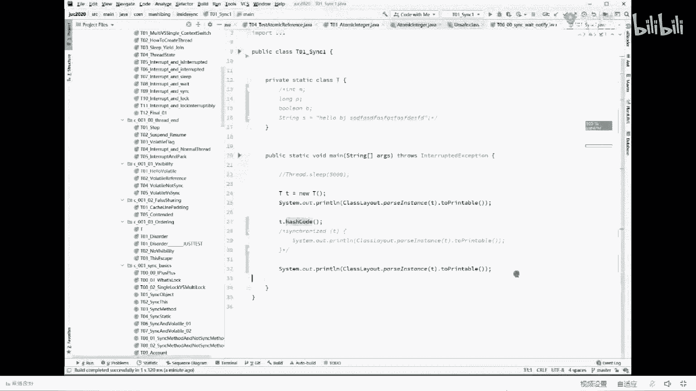
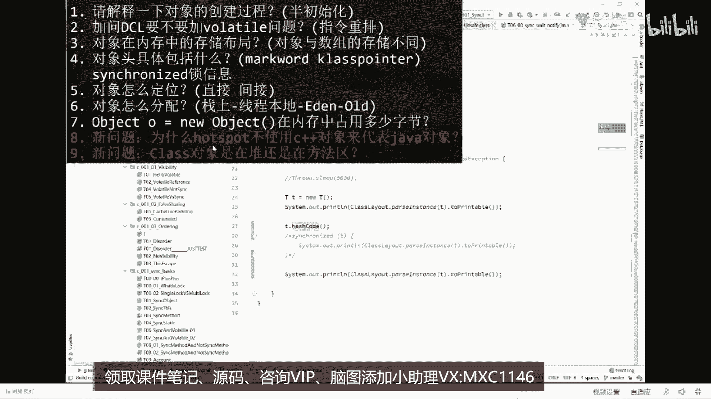
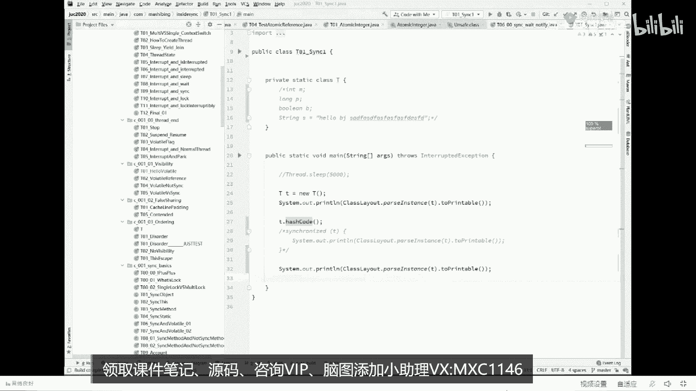
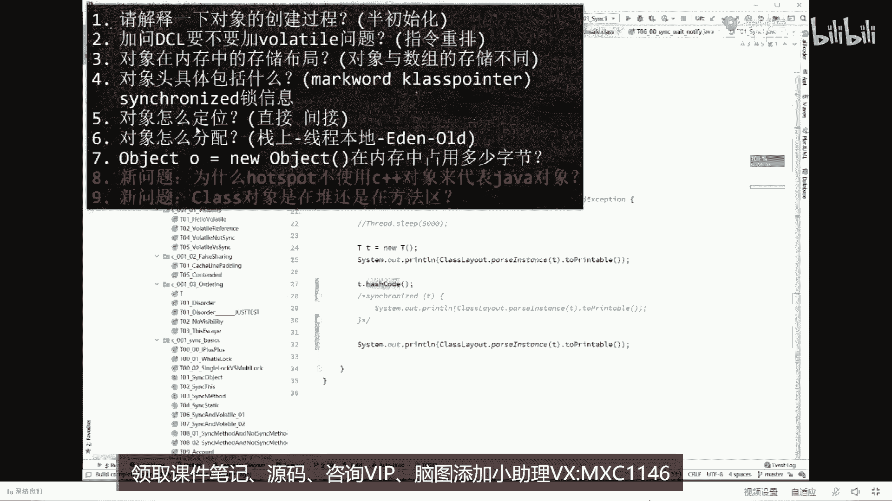
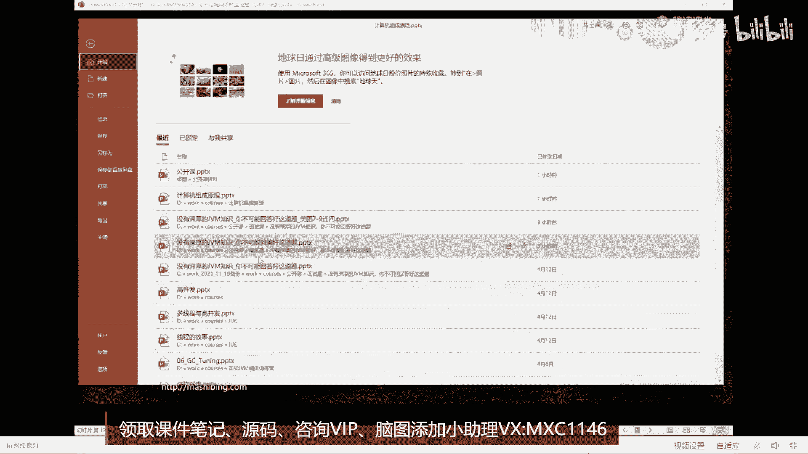

# 系列 1：P37：美团面试JVM七连问：2.对象怎么定位？ - 马士兵官方号 - BV1mu411r78p

把刚才的这个问题大体上给大家介绍完了。

就是对象头里面主要包括什么呀，主要就包括mark word，class pointer这两部分，mark word是八字节，class pointer 4个字节呃，那mc里面主要包括什么呀。

mc里面主要包括所信息还是code以及什么呀，g c的信息好了，这会儿还能跟上那个老师扣个一神，牛湾java中也是三次标记，是java最开始的三次标记，其他的go on是后来学的。

好嘞，那我们继续。

现在呢我们回答了两个问题，第七题和第三题和第四题啊，一共回答了三个问题，好下面我们来聊对象怎么定位的问题。

嗯，这定位问题呢相对比较简单一些，我先讲简单的再讲复杂的。

好不好，好，我们来看这个对象怎么定位这个问题，对象定位问题指的是什么，但定位问题呢，相对复杂一些，就这玩意儿呢其实是设计jvm的人才会考虑这些问题，这个问题问的并不多。

不过呢我建议大家还是要大致了解一下对象怎么定位，我们简单说两种方式，第一种呢叫直接定位，第二种叫间接定位，什么叫定位，定位指的是什么，定位指的是这个意思，认真听我写了这么一个一句话。

string s等于new string，大家都知道我们六个string才对，堆里面啊，new一个对象出来，这个没有问题，那string s是通过这个s怎么找到对应的对象，这个就叫对象的定位。

就是通过这个引用是怎么找到它的，这个叫，做对象的定位，仔细听，认真听，设计jvm的人，其实上有两种方式来对一个对象来进行定位，哪两种呢，第一种叫直接定位，第二种叫间接定位。

当然它有一些专业名词叫直接指针或者句柄，不管它，总而言之一个是直接，一个是间接，我们jvm hosport默认使用的就是这种直接定位，通过它呃，某个算法也好，或者直接内存地址也好，当然这里不是直接内存。

就从某某个算法攻击会找到直接定位，这个对象已经知道这个对象的大小，已经知道这个对象的起始地址，那么这个对象就很就很容易就被定位了，吗内存里面一大堆的零和一，我知道得从这儿开始，然后多长就结束了。

那这个对象我是不是一下就找到了，就这个定位的意思好，当然我刚我刚才分析过了，说这个对象里面呢除了包括他自己的成员变量之外，还包括了什么呢，类型的指针。

类型指针是通过这个指针可以找到你到底是属于哪个class，所以堆里面有一个对象，通过一个指针可以找到方法区里面的peter class，大概就是这个意思，这是我们呃hosport默认的一种方式。

除了这种方式之外呢，其实还有另外一种，另外一种呢叫句柄方式，也叫，间接的方式，间接的方式指的是什么呢，是通过诶这个指针啊，直接指到了这么一个结构体，这个结构体呢通过这里是两个指针啊。

这个指针才会找到对应的这个对象，有另外一个单独的指针指向的是这个地点，class好这两种方式，我通过这个图详细演示就演示到位了是吧，好了那个呃我我这块呢我就先不做细节上的解释，我看看大家伙能不能接受啊。

就这块大家能跟上吧，这两种方式应该都明白什么意思了，对不对，来能够明确的可以继续的给老师扣个一，oswald，不明不明白，明白直接提问哪不明白是吧，元旦搂人啊，不明白直接提问哪不明白。

如果大家伙呢是java的小白，这么跟你说，薪水拿在1万~2万之间，现在还不是没有没有什么没有什么基础的，甚至说还没有就业的这些呃，今天这课你听着会稍微费劲点，听到哪儿就算哪儿好不好，好听我说。

当然你给他讲明白对象怎么定位之后，他一定会问你，诶，为什么没有采用这样的方式呢，为什么不采用间接的方式呢，间接的方式有什么好处，有什么坏处，直接的方式有什么好处，有什么坏处，这个大家能想通吗。

直接的方式有什么好处吗，快一下就定位了，攻击一下就找到了，对不对，好那间接的方式有什么，有什么好处啊，间接的方式你发现没好处，你发现没有，你要找两次才能定位到这个对象，他不是速度很慢吗，他有什么好处呢。

以前有同学告诉我说，老师间接的方式省空间，你看这个这个对象变小了，因为它里面没有这个类型的指针，同学们是这样吗，思考一下，当场不会只问你是什么，他一定会问你为什么，我还有同学呢回答到了问题的关键。

能回答出这个问题来的人，说明是平时经过思考的，而且是平时注意积累了，积累了很多知识的啊，这个真不错，以前我讲这个课的时候，基本上一个同学都答不出来，现在呢你看啊，先生你好。

说对象在内存中移动的位置不用重新定位，对说的非常的对，就是如果是这种方式，那么如果这个对象在内存中移动的位置挪到这个地方来了，同学们，你想一下你个t里面的所包含的这个地址要不要跟着变啊。

你从503挪到了806楼层都挪了，你说这里的，地址变不变，务必跟着变，肯定得变，但是这种方式就不用这个对象挪过去了，没关系，这个t不用变，t不用变，所带来的好处是什么，垃圾回收效率就会比较高。

有同学说老师这事儿不对呀，有了这个垃圾回收，这玩意儿为什么会挪动地址呀，好这块就会涉及到jvm垃圾回收的它的一个过程，作为这边m来说，最普通的叫做分带模型，现在用的最新的叫分区模型。

不管是分带模型还是分区模型，内存呢一定会从一个对象，会从内存中的一个位置挪到另外一个位置，它一旦挪动，你的这个指针必，须跟着变好了，大概就是这个意思，在这儿呢我就不多说了，因为不是。

因为有很多很多同学呢可能连这班子篮球回收到底什么样不知道呃，尤其是我给大家讲这个什么叫分带模型啊，什么东西又叫分区模型，我讲这些东西的时候，如果没有一定的基础，应该是听不太懂，所以呢我就在这不展开了。

呃这个题呢无所谓的事，因为这个题问的也非常的少，把它翻过，所以到现在为止呢，我大概讲了这么几道题，我们现在下面来看第六个，第六个问题叫做对象怎么分配，认真听，现在这些题都相对，简单。

所以我过的速度非常快，句柄指向的地址不是也得变吗，你说的很对，但是呢它内部will啊，我解答为唯一解答will的一个问题就是句柄指向的地址不是也得变，是得变，但是它内部对于对象的整个维护。

这个对象要不要回收啊，到什么我就回收到什么程度了，他是把那个指针来用那个t那个指针来维护的，那个指针只要不变的话，它计算的效率就高很多很多，好了嗯，如果你你你如果想深入了解。

可以了解一下那个三色标记算法，你会发现呢在三个标记算法里面还有挪动的时候，整个是需要维护它的什么呢，维护它的内存的地址必须得维护出来，如果他来回来去老变那个维护你你的那个hash code表哈。

希表就必须老跟着，别在这不展开了，我们谈这个啊叫对象怎么分配这个过程，我希望大家伙把它背过，有很多比较复杂的过程呢，我一般喜欢做动画，这是为什么我喜欢用ppt的原因，很多人喜欢画图也好。

或者他喜欢用文字也好，无论怎么样也不，可能用动画描述的，像我用动画描述的更加精确，不信你就仔细看好看，这里，对象怎么分配，哎呦我的天呐，发现我我我最后再回答一个问题啊，我最后再回答一个问题。

这个问题之后，我们开始讲对象怎么分配，因为我每次讲到这儿呢，因为同学们呃对于这个问题的疑问会比较多一些，稍微多讲两句，就看这里，神牛蛙问了个问题，他说垃圾回收不是在蹲上，t不是在站上吗，屁我就想问你。

我写了这么一句话，叫string s等于new string，我想问你这个s一定是在战争，一定是在站上吗，哪位同学告诉我，s等于new string，这个s一定在占吗。

你这个s不能是一个对象里面的成员变量啊，大哥你拿大腿给我想想，神经蛙这么简单的问题，跟这有疑问是不是好了，不废话了啊，来看这里看对象怎么分配啊，这个过程也比较复杂，对象怎么分配，有同学可能会说了。

大哥那个对象分配，那还不简单，直接new个对象往堆上一扔嘛，很简单嘛，对不对，我看刚才有同学说声音忽高忽低，有多少同学有这个问题，有这个问题的给老师扣一，声音不高，估计就是腾讯课堂。

这个就是腾讯课堂做的这玩意儿吧，有的时候真是无语啊，我已经把降噪给关了，自动增益，给它关掉回音消除，给它关掉降噪，开成弱喂，hello，好点吗，好点了吗，更不行了呃，如果是更不行了。

你就把你那边的声音啊，那个稍微开大点，但是呢声音有点小，你可以把你那边的功放开大点好吗，他就是忽高忽低会比较难受，声音小，你可以把你的功放开大啊，来来看这里，我们来看这个对象怎么分配的问题。

这个问题呢基本上也是一一系列的jvm的一个总结性的，你才能够了解的理解的了，大家伙儿认真听，这里头的分配指的是jdk默认的垃圾回收器，呃，这这vm一共有十种垃圾回收器，这十种呢分别是serial。

serial old，parallel，parallel old c m s，然后呢parallel scavenge啊，这个g one cdc chdow和eullm一共有十种，在jdk的1。8。

这是大家伙经常使用的一个版本，线上的大多数用的都是这个版本jdk的1。8，它默认使用的垃圾回收器叫做p s加p o parallel coverage，加polo，好细节，我们不展开。

这个垃圾回收器会把对象分成啊，会把内存分成两部分，一般我们称之为叫分区模型，这个分区模型呢分成两部分，这两部分分别叫做第一部分叫年轻代，第二部分叫老年代。

那么整个对象呢会在年轻代和老年代之间的来回复制好了，同学们，我刚才讲的这一小段来能跟上的，给老师扣个一，这块需要我展开一下吗，需要我展开的，给老师扣个六吧，如果需要我展开的，就是我刚才讲的这小段。

听不明白的，我讲到这儿，我突然想起来，估计会有好多小伙伴这块跟不上。

我看这里，我告诉大家这张图，好看这张图，这张图啊，就是呃我们默使用的默认的篮球回周期叫做分带的这种垃圾回收器，它使用的一种内存模型，这种内存模型呢会把我们的整个内存分成两部分，这两部分长什么样的。

就说诶这里是新生代新生代的意思呀，很简单，就是我们刚刚弄出来的对象，刚刚new的新生儿嘛，唉放到我们的新生代里，然后呢，我们的老年代老年代在哪呢，老年代是经历了好多次的垃圾回收都干不掉的人。

比方说这个对象扔进来了，但他一直有用垃圾回收跑一次，诶，没有把你回收掉，这个时候呢，就很简单，就把你的年龄加一，垃圾回收又来了一次，又没把你回收掉，加二当你到达了一定的年龄之后，进入到老年代好了。

这里是年轻代，这里是老年代，来这个概念，大家听明白了吗，还能跟上的，给老师扣个一，就是年轻代，就是装那个新对象的，老年代呢就是装那个老对象的，当然年轻代和老年代呢采用的算法是不一样的。

垃圾回收这东西呢有好多种算法，一般来说有三种，从上个世纪五六十年代开始，到现在为止就这三种，这三种呢第一个呢叫标记清除，就是你这里是个垃圾哎，把你标出来，把你干掉，把这块空间给你空出来就行好。

第二种呢叫复制，复制是什么意思呀，我们先说这个标记清楚啊，不清楚也比较简单，你拿大腿想想，我把你，标出来把你清掉啊，时间一长，把你标出来，把你清掉，时间一长，我们的内存会产生什么呢，会产生碎片化碎片。

这这里有一个洞空出来了，这里有个洞空出来，碎片化的产生的原因，产生了之后会有什么后果呢，就是当你弄一个大对象，你发现装不进去了，为什么，因为那些个碎片化的东西加起来能够被我装进去，但是呢那碎片没连着。

所以呢如果我们在标记的时候清除完了之后，再加一个整理的过程，整理的过程指的是什么呀，指的是a，把这些个中间的这些空的东西都给它挪到一起去，把中间有用的就像全挪到前面来，在标记完了之后再做个整理。

这是第二种算法，这个算法呢叫标记整理或者叫标记压缩，特别简单，跟操作系统一样对，说的很对啊，这两种算法大家伙听明白了，对不对啊，不难好，这其中呢还有一种算法，这种算法是什么，叫复制，复制是什么意思。

复制的意思是这样的，认真听，这是我的内存啊，甭管你多大，我给你一分为二，分成两个，特别好玩，我这个里面的这个对象呀，凡是活着的我都给他拎出来，甭管他在，哪然后统一的复制到另外一边来，同时排列好啊。

这个这个速度很快的，拿过来之后，h盘的复制复制过来之后，一下把整个内存全部清掉，诶，你会发现这玩意儿的效率特别高，贼高啊，这是效率最高的一种垃圾回收的方式，但是毛病也很大，你拿大腿想想都知道是吧。

你你你你你你会一看浪费空间，甭管多大，内存只能用一半啊，是不是，好了，所以大多数的垃圾回收器都是怎么做呢，它会综合运用，咱们将刚才讲的这三种方式，那么p s p o是怎么做的呢，我给大家简单解释一下。

你认真听看这里他这么来做的，当我们刚刚调出来的第一个对象的时候，好这个对象呢会扔到我们年轻代里面，在年轻代里面会分成三块区域，第一块区域叫伊甸园，人类诞生的地方叫伊甸区，当然所有年轻的对象啊。

这是诞生的地方就扔在这儿了，一般来说这种年轻的对象呢特别容易被回收呃，这个大多数程序的一个统计呢，你你比方说你一次性产生100个对象，经过一次垃圾回收，很有可能会回收掉95个，知道吧，只有五个是活着的。

如果这事你理解不了，你就想一个for循环里面你不停的new对象，这个for出了这for循环，没有人认识他啊，他就会成为垃圾了，就很简单一件事，同学们你就想了，如果说100个对象会被回收掉95个。

那采用什么样的算法效率最高呢，当然是复制，你想想一定是复制啊，对不对，那个呃复制算法为，什么效率高呀，因为它只有五个活着的，你只用把这五个诶给复制到另外一块区域里头去，是不是就可以了。

所以年轻代里面采用的算法叫做复制算法，但是这个复制如果说你把年轻带一分为二，浪费空间，浪费的太多了，尤其是你想想我要复制过来的这块空间只有五个对象，我用得着那么大一块空间吗，用不着。

所以这个时候它的算法是怎么做的，是这么来做的，这里产生一个对象，然后如果经过垃圾，会说他还活着，他会被复制到另外一块区域里，这块区域叫做survivor，叫幸存者s0 s1 s。

1s2 from to说的都是这块区域，不管它叫什么名词无所谓，总而言之，复制到一块相对小的区域里，为什么他小就可以，因为它活着对象很少好，这块还能跟上的，给老师扣个一，我我会我认为比较简单。

对你来说未必未必简单啊，就是它在中间的设计为什么这么来设计，就在于这儿，你会发现呢，它80%的区域年轻年轻在里面，80%的区域都叫伊甸园区，10%是死，外边去。

另外的10%是另外一个survivk要这么来做的，ok那有同学会说了，那为什么需要两个斯莱克啊，很简单，因为他除了经历这次复制之外，还要经历下一次复制，什么意思，看这里，这是我们这个对象。

比如说我们整个对象啊，扭了五个对象出来，然后一次回收干掉了四个，只剩了一个活着的，这一个活着的会被我们复制到一个sler里面，接下来把整个伊甸园区全部干掉，它又可以重新使用了，特别爽。

连连续的你可以分配好多对象，一次性的，后来又来了五个对象，然后呢又被干掉了四个，只剩一个活着的，同学们，你们想一下，我下次再回收的时候，我是不是连这个对象在一块回收，如果这个对象被回，收了他们会被干掉。

如果这个对象不会被回收，注意你还能往自己的这个号里面来复制吗，你没法复制，你得去哪儿复制呢，你得把这两个活的对象都复制到第二个s vivo，接下来把这个和这个一块干掉，下一次再开始的时候呢。

把这个活着的又复制回来，然后呢把这个和这个一块干掉，你会发现这两块区域同时使用的只有一块，浪费的空间有多少，只有10%而已，不像原来一分为二，浪费50%来，这块能听明白的，给老师扣个一对。

默认比例811，但实际上jvm调优，我们讲jvm调优，是什么东西，jvm调优就是可以调整这些比例关系，你要说年轻代默认比例对，跟老年代一比二，但是如果说你那个呃你本身你的算法产生的年轻的东西比较多。

老年的东西比较少，这个很简单，你就改成二比一都没关系。