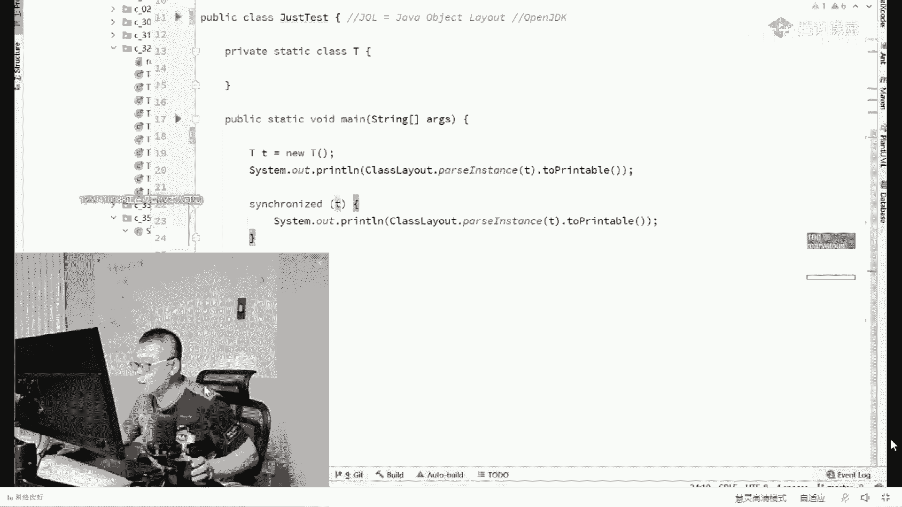
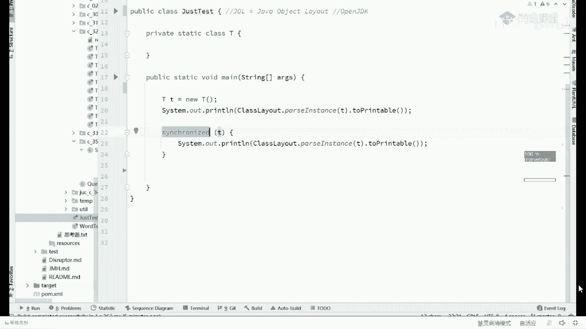
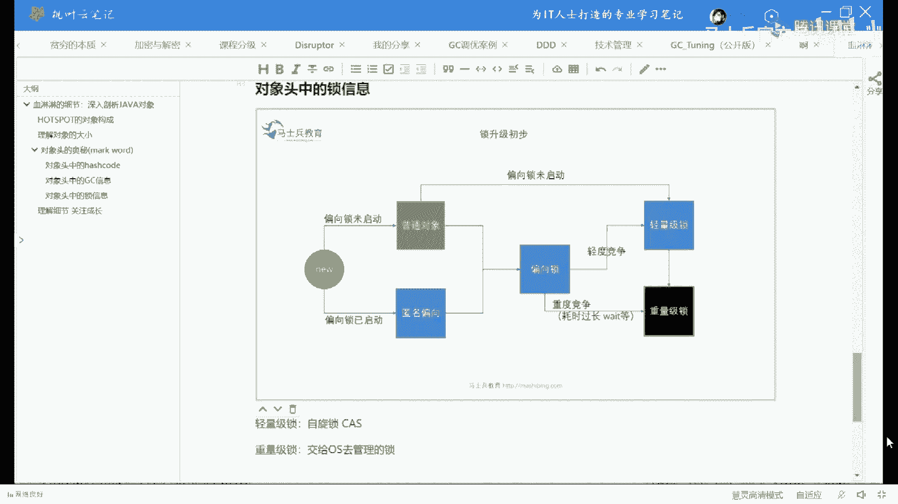
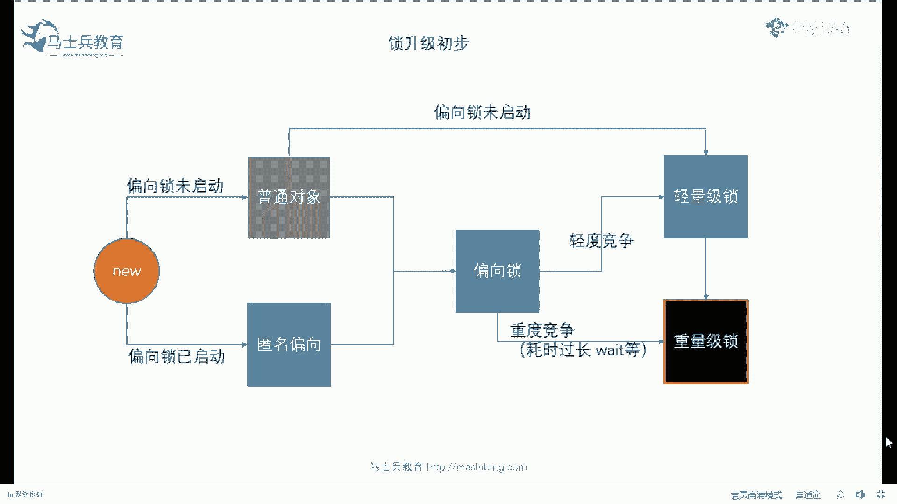
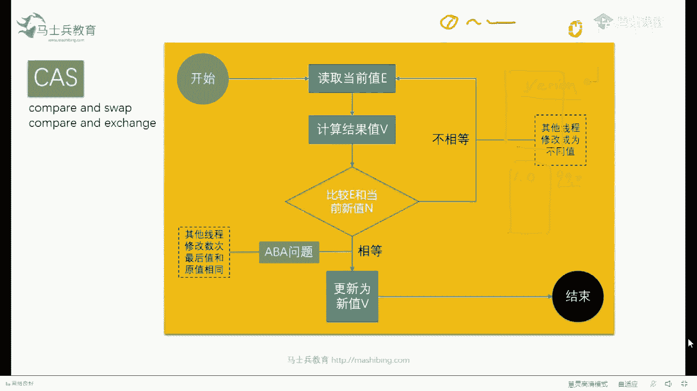
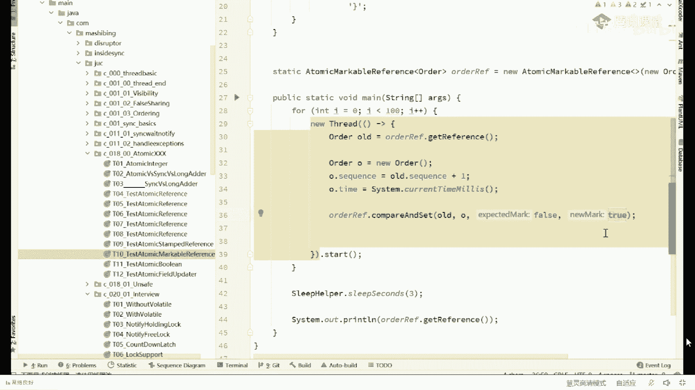
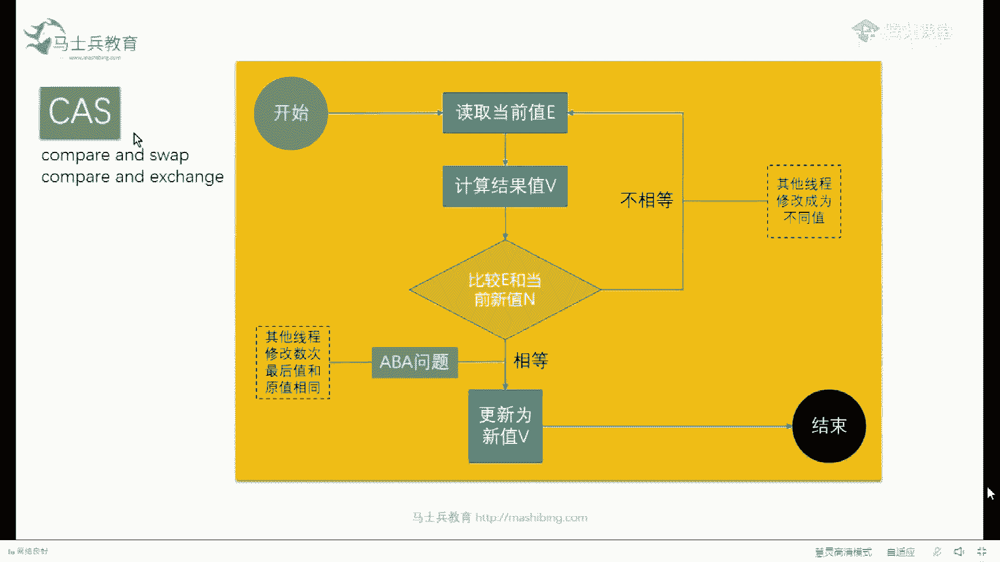

# 系列 1：P45：50w年薪面试题：4：线程的锁信息记录在对象脑袋上你晓得吗？ - 马士兵官方号 - BV1mu411r78p

进这个里面已经被别人锁定了，他就进不来，机制就是这么设计的，所以我们就完美地解决了马桶拉屎问题，好了，这块能get到的老师扣一，你看asshole啊，这这不是asshole啊，叫a总啊，sorry。

不是asshole，如果锁一个方法锁信息存在哪，大哥有没有同学告诉他一下，如果锁一个方法锁信息存在哪，还有class对象，this，如果非静态方法。

当前对象synchrona相当于synchronized v，synchronized the v，能听懂吗，那如果是静态方法没有this呢，synchronized当前的class对象，t。

class，搞定，好了好，我们继续，我发现今天来的小伙伴们基础是有点稍弱啊，大家看这里，下面我们聊哎呀，我都你们这基础弱的，我都我都不敢跟你们聊下一个问题了嗯，啥意思没明白是吧，嗯大概听一听嗯。

好我们来聊一个哪一点的问题啊，就是我刚才跟你聊这些问题，实际上是没有30万的大哥，我再说一遍啊，嗯，罗伊是96年的大哥是吧，嗯下面我们来聊一个真正值30万的问题。

好看这里啊，另外一个信息我刚才说过这个信息是什么信息，这个信息你不容易观察到啊，因为一个对象在它被回收的时候，你怎么去看到他脑袋呢，他都被回收了，你访问都访问不到了，但是我明确的告诉你。

它就是存在他的脑袋上的呃，当然这个东西呢会牵扯到好几个层面的东西啊，就是第一个呢它会牵扯到垃圾回收器，垃圾回收器的东西会牵扯到到底什么是垃圾，我的天哪算了，我一会儿讲这个问题吧，好不好。

我我我我我先讲一个容易点的问题，我先我们先把这个问题放过，因为主主要是今天来的小伙伴的这个基础稍微的有那么一点点弱啊，一会专门给你讲，我们先把呃关于锁的这个信息讲给大家听。

大家听我说我不知道大家听说过没有一个synchronized，关于锁，它未必全是互斥锁，它中间有一个锁升级的过程，一般来讲呢我们平时上的锁，我们把它称之为叫互斥锁，什么为什，么叫为什么把它叫互斥锁呀。

互斥锁的意思是什么意思呢，其实互斥锁的意思是说我锁定了之后，其他人再也锁不上，这叫互斥锁，除了护士所之外，还有共享锁，我锁了之后，别人还可以锁啊，就是咱确实咱俩一块儿可以上厕所，这是有可能的好吧。

就看你锁的这个东西是一把什么样的锁，锁的类型是有好多种的啊，普通的呢我们是把它当成互斥锁，但实际上呢呃这个synchront的内部呢，它有一个非常强烈的所升级的过程，这升级过程比较复杂，我先给大家上图。

你先有一个，大体的印象呃，这么跟大家说，一般来讲一个对象刚刚尿出来，刚上锁的时候会倾向于上偏向锁，上完偏向锁之后呢，才会升级成为轻量级锁，好有同学说了，老师啊，这个轻量级锁重量你所又是什么意思，好好听。

我说好听，我说仔细听，因为你了解重量，你所这件事你需要了解操作系统大哥啊，就是大家都知道我们的class文件是要放到jvm虚拟机里去运行的，那jvm虚拟机是跑在谁上面的一个职业vm虚拟机是跑谁上面。

跑在操作系统上面的，操作系统和操作系统大哥都是谁，那什么microsoft这个windows啦，呃麦克拉linux啦，unix啦这些好，我们说，现在呢jvm面临了一个管理所的问题，这里有一把锁。

有一堆县城呢都是都要去抢这把锁，jvm面临着对所得进行管理的问题，好jvm有两种选择，我再说一遍，由于jvm在操作系统看来就是一个普普通通的小程序，在jvm的内部才是我们java写的程序。

我们java写的程序又有好多线程，多线程去抢一把锁，这是我们要聊的这个问题的背景，再说一遍，jvm里面我们写了好几个线程去抢一把锁，然后jvm这个时候有两种选择，第一种选择是我自己管理这些线程。

管理这个县城对于锁的征用过程，谁抢到该轮，到谁了，谁去休息好了，这个东西呢被我们称之为是啊，jvm内部的管理，就jvm我可以选择自己管，jvm还可以偷懒，偷懒是给谁呀，偷懒是我交给操作系统去管。

jvm说我这里起了个线程，麻烦你操作系统起一个线程，这里起个线程，你你起一个线程，我这六把锁好，你帮我去管，你管好了之后说该哪个县城了，你反馈给我就可以了，好当你理解了这件事之后，就是交给。

操作系统去管理，不行好了，这是我们最终一个synchronized的上锁的过程之中，最终的一个选择就是所有的其他所都不管事儿的时候，那当然有同学可能会说了，老师那交给操作系统之前。

我是可以自己做一些努力吗，恭喜你，这个问题呢基本上大厂都有可能会问到呃，这东西呢我给大家看一个小小的面筋吧，这是我们的阿里的，原来阿里的一个漆面的面筋啊，基本上都会问到啊，关于锁的，锁的分类啊。

讲到这儿是吧，乐观锁，悲观锁，自旋锁，读写锁，排他所共享所分段所各自特点，以及他们在java中具体的实现方式，呃这个呢是阿里的七面，这小伙呢是练了七次面试，然后进了阿里，当然他进的是阿里国际。

叫阿里阿里express呃，薪水当然也贼高了，因为他讲清楚了嘛，呃除了这个之外呢，你比如说像百度美团，顺丰，京东这这这这些个面试基本都有关于srt的内容，就是synchronized的。

以及它的什么entry log的底层原理，锁的四种状态以及升级过程，就是现在我想给你听的内容啊，cmx和g one的内容都是都是在这个脑袋上的，所以你弄通脑袋之后呢，你发现你会发现很多问题你全通了嗯。

好其他我就不给你一一看了，就是总而言之，言而总之你会突然间发现呢，大厂问的问题越来越细，非常的细致好听，我说在synchronize就是这vm交出管理权之前，它实际上经过了一系列的挣扎。

这一系列的挣扎呢是从偏向所到轻量级所一系列的生长过程，但是什么叫平行线索，什么叫轻量级锁，我先给你解释什么叫轻量级锁，清掉你所在内部，在sychon内部的实现呢，就是我们俗称的自旋锁。

也就是俗称的cs叫compared swap，但有同学可能会说了，你所自旋这个这个这个这个自旋锁呀，来这块需要我解释了，老师扣个一cs，好好好，我稍微我稍微解释一下啊。

嗯关于cs这件事呢，或者叫呢compare and exchange，舌头一回事啊，就是比较并交换，它指的是同学们，你们想一下啊，当我们干一件事儿的时候，我们干一件事儿，不管你是大便也好。

嗯还是给个数加一也好，那个我们干一件事儿的时候呢，为了保证一次只有一个人在里面做，做事儿之后呢，最后的结果保证是一也是没有问题的，这个时候我们需要用到锁，对不对，我们往往用的锁就是进门我就上锁。

进门我就上锁，你听明白了吧，但是还有一种玩法叫做我不上锁，这种呢被称之为，自旋这是怎么玩的，听我说上锁的呢，大家很容易理解啊，就是上面拿钥匙，就是咔嚓给它锁上就完了。

但是像这种compared swap就是这么玩的，比如说我给大家举个例子，这里有个数，这里有一个数字零，如果我们好多个线程对它进行加加的操作，我这个线程也对它加加，这个线程也对它加加，大家都知道。

这时候如果你不上锁的话，它会出各种各样的问题，什么样的问题呢，我这个县城把零读到自己这儿来给他加加，变成一一给他写回去，但是还没有来得及写回去的时候，另外一个线程把这个零读，过来变成一，然后写回去。

这时候它会变成一，然后这边呢有已经加完了，往回写的过程，写回去还是一，就等于我加了两次，最后的结果只得到了一次，来这块没有问题，同学给老师扣个一，啊超卖对，其实类似的问题嘛，就是你不上锁的话。

你最后得到的这个东西它一定是有问题的，好吧，那那这个时候除了一种方式，有一种方式是当我改的时候，我就上一把锁，我把零读过来，改成一一写回去，我写完了之后再把这把锁打开，其他人再进来，这是一种方式。

这样的话可以保证每一次只有我一个线程在这里活动，但是还有另外一种方式，另外一种方式是什么样的方式，这种方式你仔细看，依然是这个零，现在呢我的第一个线程来了，我把这个零读过来，读到这里，然后呢我把它改成。

一好同学们注意看，就在这儿这个一往回写的时候，一往回写的时候，我比较比较一下，并且瞅一眼说哥们儿，你是不是依然为零，你是不是依然还是我想要的那个零，那么大家你想一下，如果你依然为零。

那说明在我把你零拿过来改成1万，我写的这个过程之中，没有人改过你，能不能听懂来这个能get到的，给老师可以啊，我再说一遍，就是我把这零读过来，然后改成一一往回写的过程当中，我比较一下。

我看看你是不是依然还是我期待的那个零，哎如果你是说明没有人改动过，你，太好了，我就直接把你改成一搞定，所以这个叫比较诶，比较一下，如果我们用维码来表示的话，就非常简单，就是if哥们儿。

你这个值是不是依然还为零啊，如果是的话，把你改成一，如果不是，当然如果不是呢，如果不是呢，比方说我这零拿过来改成一的过程，另外的一一堆线程早就把你改成，八了，当我往回写的时候，我发现你变成八了。

我怎么办，特别简单，我把这八重新读过来，把你改成九，用九往回写的过程之中，看看你哥们儿，你是不是依然为八，来这块能get到的老师扣个一，这时候你发现我们不用上锁了，我们只要用一个循环就可以了。

我们只要用一个循环说，when哥们，你一你只要是跟原来那个老的那个值是一样的，你只要是我想要的老的那个值，我就把你改成新纸就可以了，搞定了，你如果说不是那个老的值，那我就重新来读出来，然后改成新值。

再看你那个还是不是原来那个老那个值啊，好了，这就是一种新的玩法，这种玩法呢叫自旋锁，那么它就类似于什么呢，类似于有人在上厕所，然后呢旁边旁边人呢，他不他不会关门，那么新来的县城拎着裤子跟他转。

圈玩得转一圈看看，哥们儿你还在里边吗，林转一圈看看哎，哥们儿你还在里边吗，什么时候说哥们儿你出来了，ok我进去好，ok这东西呢叫自旋锁，就是拎着裤子转圈的过程。

当然这里面呢其实有著名的那个关于自选所的面试题啊，呃关于资源所面试题比较多，也比较深入，这个有著名的关于自旋锁的面试题，那么第一个问题呢是著名的baba问题，好，大家还在吗，还在雷老师可以了，对啊。

被别的线程改了，我就一直轮，总总会轮到我，对不对，嗯，那第一个问题就注明了a b a问题，a aba问题是什么问题啊，a aba问题也很简单，比如说我这里是个八，我把它读过来改成九的过程之中。

实际上呢有一个线程早就把这个八给改成12，另外一个线程又把这个12给改回乘八了，能听懂吗，所以这个八此八非彼八，它中间有一个从八到12又回到八的过程，当然在我眼里看来，他依然是那个八。

来如果你还是不能理解a b a问题，我给你举个形象点的例子，这是你的女朋友，然后呢你出差了，回来之后你看到的依然是你这个女朋友，这个能理解了吗，他依然是那个a，但他有没有经过b的过程。

好这就是aba问题啊，当然在这个里面有两种解决方案，有两种解决方案好，第一种解决方案是什么，第一种解决方案是我不在乎，我不在乎，ok你是零，你反正只要是个零就行，至于说你这个零中间改被别人改过多少次呢。

跟我没关系，第二种是我在乎我在乎怎么办，如果你在乎你的解决方案是在他的脑门上加一个version version，ok加一个版本，就是你出去的时候给他扣一戳，上面写一点，如果当你回来。

你发现他脑门上变成了99点，恭喜你，人在江湖飘，谁能不挨刀是吧嗯。

好了，这就是version，那有同学说了，老师真的有这种编程方式吗，yes，这里有，atomic stamp reference，这里的stamp就是在他的脑门上扣了一个sequence啊。

当然你还可以加一个time，加上时间也可以啊，随你btomic standard reference，那么每一次的更改这个sequence都会加一好吧，这里呢就是带版本号的更新o好，你理解了这件事之后。

其实还有一个比较好玩的，就这个版本号这件事就在脑门上扣扣扣版本号这件事，其实呢还有两种版本号，第一种版本号是数字12345678啊，记录着有多少次好，那么第二种版本号是true和false。

比如说你走的时候，它是一个false，经中间经历过任何事情，只要改成true就ok了，那么经，历了多少次，不管好这种的呢，被我们称之为叫markable reference。

叫markable reference，atomic markable reference，sorry这个源码没有改过来啊，我回头改改，我回头再把它改过来，这东西呢就特别简单，就是那个看这里。

你只要把它标成true和false就ok了。

好吧，好了，a aba问题能听懂的，给老师扣个一，对对对，不要太在乎啊，人生要想过得去啊。

