# 系列 1：P53：70w年薪面试题：5：做好规划，从入行到P10思维，走向财务自由的道路到底有没有？ - 马士兵官方号 - BV1mu411r78p

我看刚才有同学说说老师那个他为什么叫，但是但是你看啊，他技术技术非常的牛逼，对不对，为什么给的是最后是p7 plus，而不是p8 呢，原因是什么呢，那p7 和p8 的最主要的区别是什么，这个大家想听吗。

因为大多数人可能到不了这个级别啊，这大家想不想听，想听刘老师扣个一，我们不想听，我就不讲了，就是说当你我我我现在把我们的课程p5 p6 ，p7 呢是归结为是一门课啊。

这门课呢我们把它称之为叫mc叫马士兵，slified architect好，那么在这个基础之上呢，实际上我下一步想规划的是p8 p9 p 10 summo，这个被称之为下一个系列呃。

人的成长呢总是一步一步来的，没有任何人上来天生进来之后就是p8 p9 p 10，但是呢你是可以通过一步一步的训练，慢慢找到这一步的，在网络上呢有很多关于p8 的课，号称p8 的课。

当你在p8 这里看到任何关于基础的内容的时候，实际上这事儿是不对的，你就记住这一点就成了同学们听我说，在阿里的内部，从技术角度讲，pg等于p8 ，这个事儿是to我再说一遍，站在技术的角度。

technique p7 是等于p8 的，好吧，这个事儿是true记住那p8 和p7 的区别到底在哪呢，我们是从普通的区别来说，p8 能管二三十个人，而pg的话呢管四五个人好。

这第一步的区别我就已经出来了，这叫管理，那么第二个的区别是什么呢，第二个的区别是我说的都是那个比较能量化的啊，第二个的区别是关于设计方面的，关于业务分析和理解方面的，这两个的区别给它区分开来呃。

那么设计我给你举个最简单例子，现在最热的设计理念或者叫设计方法，这东西是什么呢，它叫做dvd啊，就是我们呃p8 里面的这门课，七六体系七体系，p8 里面的这门课啊，就是关于dd d的这门课。

这门课呢是我我我给自己挖了一坑，我打算下一次呢把这门课好好的讲给大家听，但是你严格来讲呢，明年可能就是p7 了啊，所以呢在我p5 p6 p7 的这个课程体系里面，我把p8 的内容算是赠送给大家的。

今天啊，today，那么第二个呢是关于技术管理层面，就是说你走向p8 的时候，一定有一个角色的转换，是怎么从一个技术人转向一个技术管理者啊，滴滴地址关于业务的也是关于设计的啊，设计方法论的。

那么技术管理呢是真正的开始帮你做一些实物的，嗯在这个呢是我们真正的阿里p班啊，徐克徐老师，来带大家来讲这个p8 的课程，原来呢有很多那种线上的关于p8 的内容呢。

都跑到都都实际上都是p p7 里面拎出一点来，往上写那个事都是不对的啊，老师这里讲的叫做真的真真正正的琵琶的那种啊。

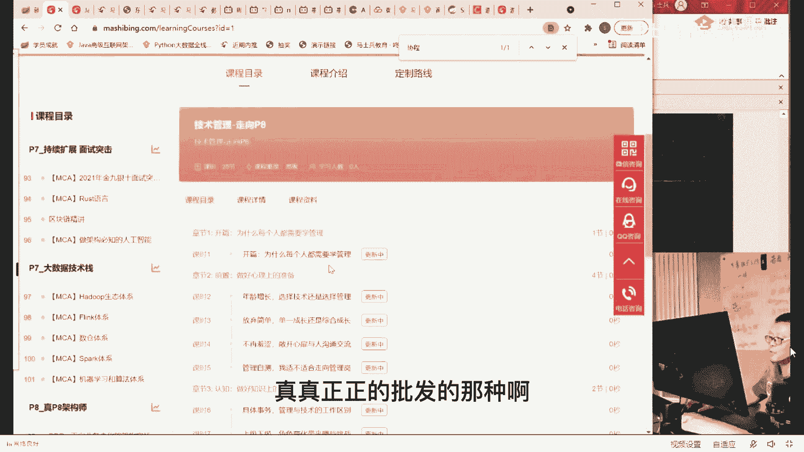

认真听就是了，呃我我我讲到这儿呢稍微的做一点小小的广告，嗯我可能刚刚呢其实也大体的给大家演示了我们现在的课程，我们现在课程呢基本上会分成两两个大的体系，第一个呢是p5 p6 p7 的知己啊，嗯。

先从体系上来说，简单的说一下，我讲广告很快啊，用着急，一会儿，如果大家有问题的话，咱们再慢慢的。

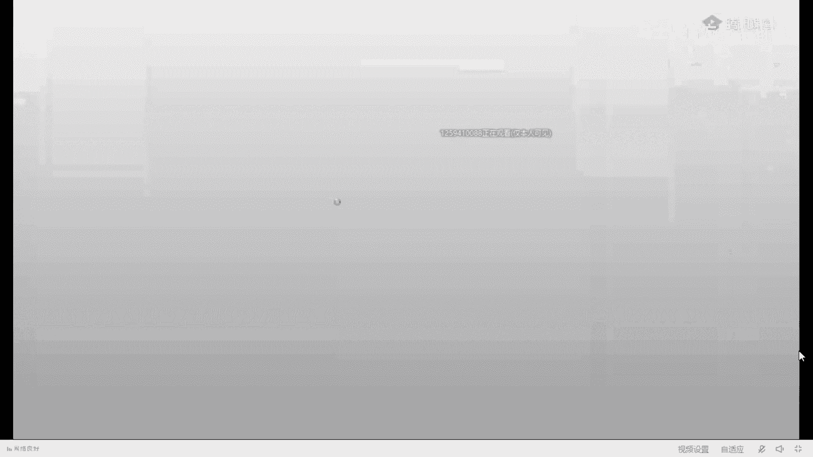

跟大伙聊啊，关于p7 的，关于p8 的，关于p什么的，那一般来说呢嗯在我们整个的这个技术职级体系里面。

好技术职级体系里面有关于p5 的内容，这个设备是称之为我们的零基础的高薪的就业就业课。

这个课程内容上的话呢，如果大家想想了解的话呢，点点过来，这个高级驾驶师就是高高级工程师的就业，就这块呃，这块内容呢基本上你就挨盘学，你不用老师任何帮你做一些特殊化的处理，就是零基础这块你就爱拍学就行了。

好吧呃，这个你学完差不多就是p5 的内容，当然当然大家伙注意啊，同学们你们记住这一点呃，如果你p5 不学这门课，不学算法和数据结构，这门课你就给我记住，了你那个叫特别水的p5 。

你实际上能到大厂去做屁股的可能性是比较低的，所以这门课是比较重要的啊，当然这里面有一些那个关于前端的一些小学的课程，但是它它不多，所以ipad的从头干到尾，你就是p5 的水平，这是完全没问题的。

好在这个基础之上才是p6 和p7 的内容。

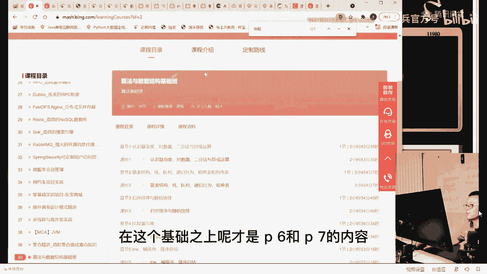

那p6 和p7 的内容就会更多一些，p6 呢我们把它叫掌心和p7 呢叫做架构，可这里面关系是涉及到的东西就会比较多了。

我刚才给大，家展示的这个这个这个链接都可以啊，p6 内容的话就会更多一些啊，高并发的各种方案啊，高可用的各种方案那么高呃，呃扩展的各种方案啊，像通信和调用的各种方案，还有呢缓存四大中间件嘛，缓存中间件。

消息中间件，搜索中间件和存储中间件好，那么关于分布式的各种东西啊，就是分布式锁了分布式事务了，分布式的配置了，注册里发现了网关路由了，服务调用负载均衡断路器这些东西，这是关于分布式和微服务的啊。

分布式的链路追踪呃，数据分析算法能力的一个深入，当我们能够到这种程度的时候，一般来说我们就到p6 了，那到p7 是什么样子的呢，p6 和p7 的区别在哪里呢，p7 会稍微加上项目相关的知识。

关于项目相关的，关于架构相关的啊，关于源码和原理相关的好吧，关于算法敏感设计相关的，关于架构设计层面的百万设计，百万设计师，为什么呢，因为一般到p7 左右就120万年薪了。

所以这个课呢我把他认为是0~120万年薪全覆盖的一门课，0~120万年薪全覆盖的一门课，当然这课，内容我个人认为是有所偏多的，那么我同学们应该在网上见到过啊，每周三次课。

每次两小时的这种普普通通的日常的这种这种这种层面的课程呃，老师的课呢跟那个层面的课呢是不太一样的，老师这课比较特殊，老师这里的课是直播和录播的综合题，首先第一点呢第一录播课时量是比较大的。

这个课时量呢大概要3000个小时左右，呃说这个同学们可能倒吸一口凉气，我就直接告诉你啊，很多很多的那个机构呢可能加起来不到400个小时，老师这节课是3000个小时左右，这是录播课。

然后呢每年要更新1000个小时左右的录播课，这是很恐怖的一个数据量，呃，像下一步要更新的呢有三三个大的课啊，第一个是dvd的，第二个是关于管理的啊，第三个是什么东西呢。

第三个是关于spring cloud全系列，这个spring cloud全系列呢大概有几十个字模块，就是，把spring cloud那个网站上你能看到的那些东西全给你讲一遍，这是我下一步要更新了啊。

这个工作量也比较大，但是呢我觉得这个东西是有必要的，当你把spring cloud透视理解理解一遍之后，你会突然间发现好多架构你自然而然就全理解了，那么在这个的基础之上嗯，好，会有同学呢他会有一些那种。

非常呃畏难的感觉，说这个那我怎么能学得完，首先第一点，我不是让你学完的啊，老师这个课呢不是让你学完的。

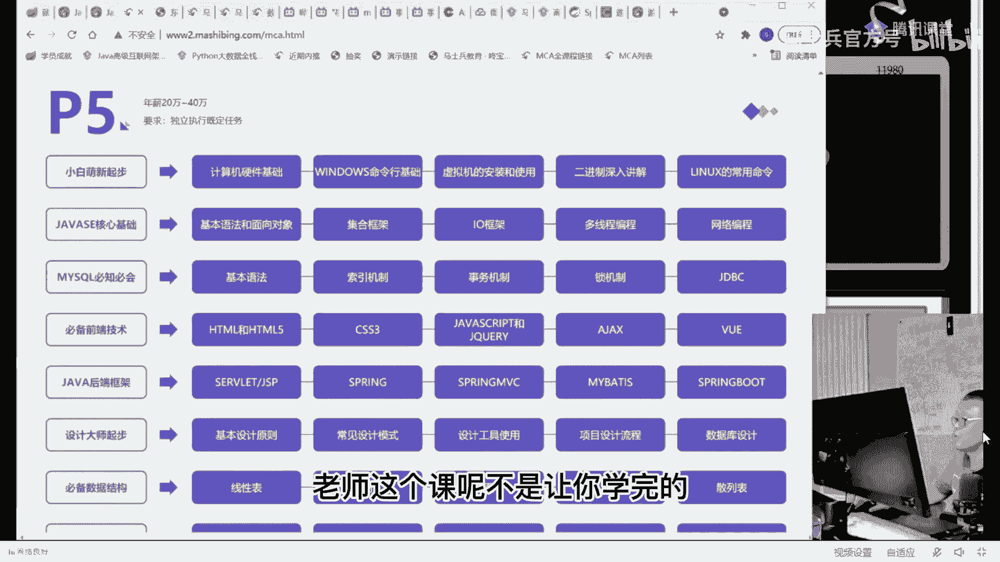

老师这课有一个比较大的特点。

那什么叫定制式，我们找一个体系课啊，c的架构师，就是我们可以进行一系列的定制路线呃，这是周老师的一条定制路线啊，我打开来看一眼就行了，就是这条定制路线呢是给某一个特定的学生唉，帮你定制好。

你应该先选哪一个再选哪一个，当然他帮你定制好路线之后呢，你就挨着盘子打开来学就可以了，好吧啊，这条路线是一条完整非常完整的路线，就是你要是说来了之后呢，就想花个1年左右时间把整个体系全部都补一遍。

good i拍学就搞定，嗯当然你也可以，当然呃你也可以这个呃采用呃个人非常特殊化的，就是你自己这个人，你和其他人呢有点特殊的情况，我不太一样啊，老师我就想两个两三个月，我就想把薪水涨上来。

那我这时候怎么办呢，好我帮你换其他路线就可以了，换上其他的路线，不同的路线走下来好吧，就是每个人可以有自己非常独一无二的不同的路线，帮你分好阶段，第二阶段应该是什么，有学员的各种的参考的笔记。

你可以进行下载，有算法相关的各种知识，你可以进行系列化的，那么当然你任何一个你你你你你你，像这种突击班的东西，你直接打开来就可以了啊，choose choose，宝典的设计模式啊等等等等。

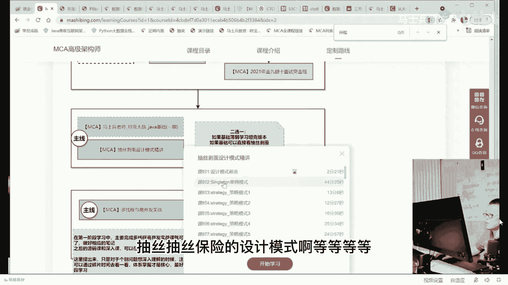

单位直接打开来就可以学了。

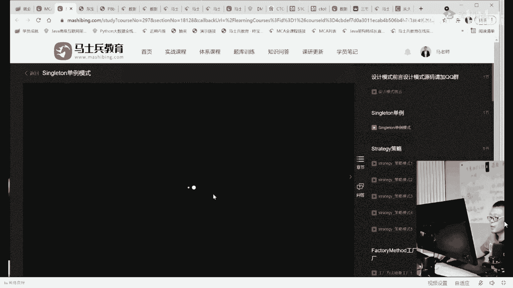

呃这个呢是我们正在呃，这这是我们原来讲的一个录录录播的课程，single lion，我就在这里不讲了，然后呢除了录播的课程之外，帮你定制好特定的路线之外啊，这时候它的效率就会就会特别特别高了，对不对。

帮你定好特定的路线之外，那么，你还可以做一件事情，是给我们现在正在直播的内容，现在正在直播的内容呢，请大家访问这个网站就可以了，东宝第二码是0。com好，这个是用一个互联网三高的课程。

把所有的知识点的内容全部串起来，也就是项目的落地课，ok讲到这儿，就跟大家伙。

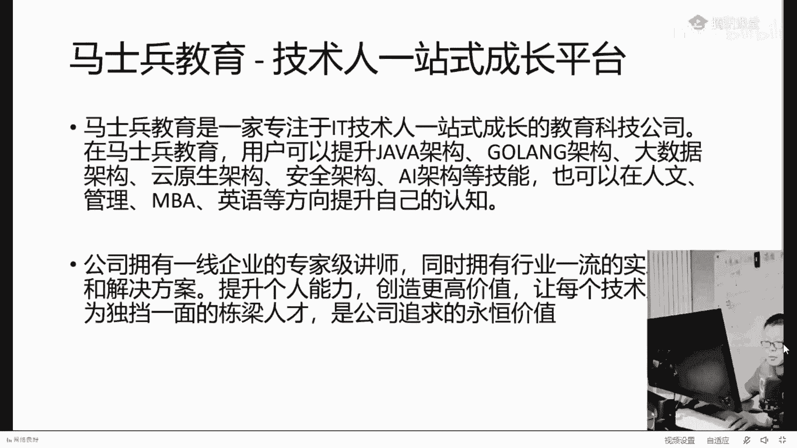

把这个图打开好，这个呢就是项目的落地课，目前正在直播的互联网三高项目的架构班，除了项目落地课之外呢，除了正在直播的项目架构版之外，我们还有非常牛逼的一个内容，叫做在线bug经验处理课，这课很少有人有。

主要是我们当时跟那个呃原来在京东，现在新浪的孙老师啊，他跟他聊天的时候，他就说呃，他说可以跟学生分享一些我们在大厂里头遇见的各种bug，到底怎么处理的，这方面的一个课程，哎我觉得还挺好的。

所以呢就给同学们讲了这样一门课，听完的感受还是很不错的啊，然后网约车的项目，电商聚合的项目，一级流量，多级缓存的项目好，这是我们的项目架构的落地。

可，如果大家伙对项目落地非常感兴趣，大家伙可以访问这个网站，同时呢在左边小海马这个地方下载它的白皮书，这个你去下载就可以了，好吧，这是我们项目的一个白皮书的诶，下载啊，呃内容比较多，有100多页。

你好好的把这个东西读完，你会有以下几项收获，第一一个正规的大厂的项目应该怎么做，相关的文档应该怎么写，你会了解，第二你把直播听完，直播听完之后，你会知道互联网的三高高性能高，可用高扩展。

像这样的一个东西到底怎么样才能完成，第三你会理解一个真正比较牛，逼的弹性的扩缩容的在云环境里面怎么样去部署。

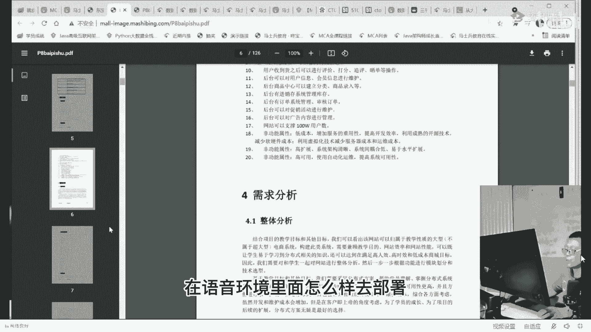

我直接告诉大家，为了让大家能够访问得到，能够学得到在云环境怎么部署，我们直接在是把这个东西部署在真正的云环境里面的，大概到现在为止，我们部署了六台服务器，有它的前台环境，有它的后台环境。

有它的普罗米修斯的监控环境，这方面你都能学得到。

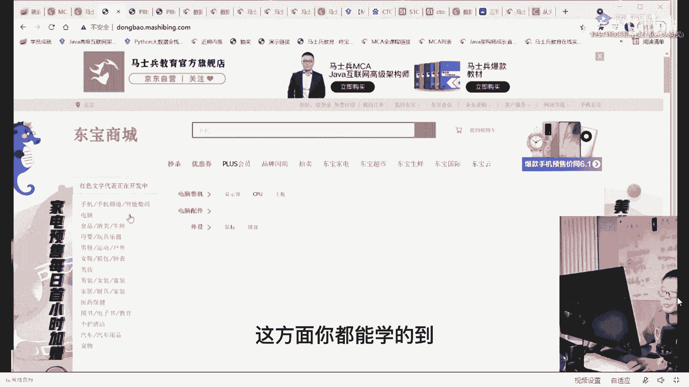

还可以吧，其实为了准备好更好的课呢，在老师这里叫做不计成本，不计成本，好亲们，牛逼两个字打在公屏上，谢谢大家，目前这么干的基本只有只有只有我们一个啊，你去找就是了，我看弹性云应该怎么理解是吧。

7669弹性云应该怎么理解，听我说，首先你要理解什么是云网络上的一大堆的服务器，你可以不知道它有多少台你的机器呢，是可以就是你的机器的各种模块，你的业务的各种模块是可以部署在这些机上。

无缝的部署在这些机上，那么当你有一些服务已经不足以支撑访问量的时候啊，比如说你平时这个服务有几个负载呢，有四个四个负载，四个一样的负载共同对外提供服务好，那这个时候呢你四个负载不够使了，双11来了。

好这个时候我们说有一种是一件式的说我后台点一下再起40个服务，共同对外提供服务，它是不是能接的流量就更大了，这是弹性的，这就叫弹性云，来这块能get到的，给老师扣一。

当然还有一种呢叫自动化的可自适应的弹性云，一般我们都把它称之为叫ai云，这什么意思呢，就是它会自动的根据你来的流量的大小来帮你起多少个服务，或者砍掉多少个服务来帮你做这件事儿，根据历史的流量。

根据现有的压力，它会自动的来帮你做这，件事啊，自动化的弹性扩缩运，这个可以说是现在这种做运维的啊，s e工程师，set reliable engineer，这是运维里面最新的一个概念了。

做运维的工程师所必备的一项技能，弹性的副作用集群和语音是同等同的吗，可以认为可以认为是等同的，这个无非是一个通俗的话的叫法，另外一个呢是一个专业化的叫法而已啊，好了，这是咱们的项目的落地课。

那么关于项目这块啊，那个如果大家伙能理解的话呢，就是一个一个是定制化的这个路线啊。

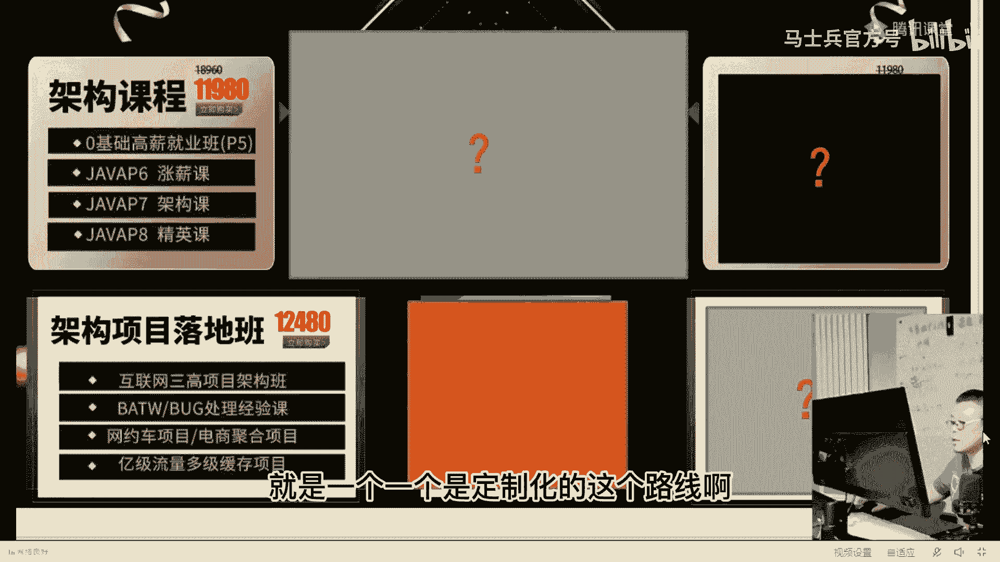

定制化路线，特定化的项目，就是这块的话呢，呃我给你举个最简单例子啊，第一个是关于项目方面的，比如说你的网约车项目。

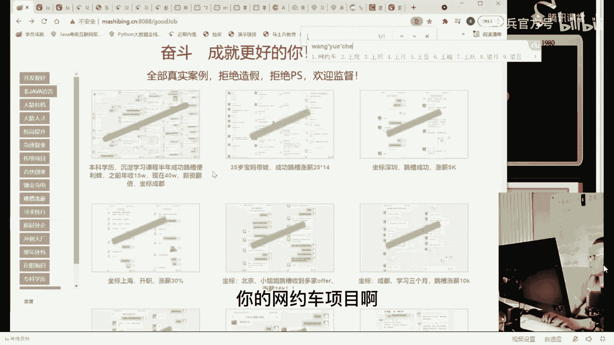

这是一个挺挺给力的一个项目，呃，这是原来曾经就靠网约车去去就业的几个几个小小的案例啊，他就学了几个技术点啊，这这是我们帮他定制的一条路线，这边的并发编成了release spring cloud。

网约车一级流量好，薪资基本就翻倍了，他第一份钱都是七七千三是吧，第二个是15x10，我也就是22万多了，225000，第一份是8万 8万多，现在是22万多，可以吧，当时让你报名是不是要谢谢我呀。

感谢小九嗯，掌心人找老师了，好吧，传统项目通过验车找到工作啊，遇到企业还加价留人了嗯，这个呢是也是非常特殊的一个学生，这个学生是一个大专，全是一带专生，这小伙呢是刚毕业，刚刚毕业应届生。

就靠网约车项目拿到了21k的offer，作为刚毕业的学生，你最欠缺的四个字儿项目经验，你可能会点算法，那你可能基础还不错，但是呢你欠缺的就是这个项目经验，那么这块拿下的话呢，你的起薪会高得多得多。

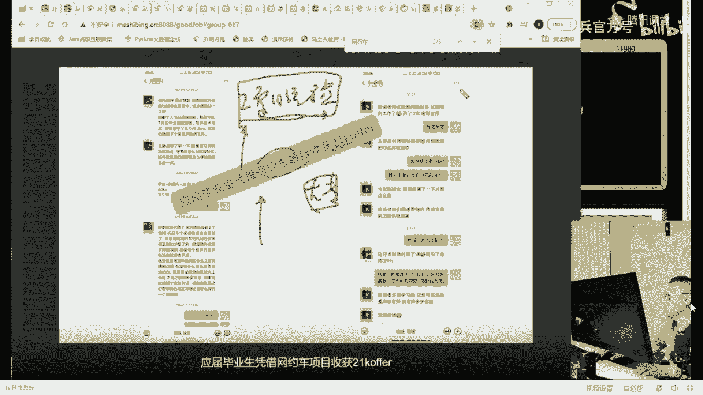

好嗯当然有同学说了，老师那定制化有什么好处，定制化的好处在于很简单，让你节省时间，比如说我给你举个那个时间比较短的一些个例子啊，这1年你才能涨个薪水或者跳个槽，或者进到大厂，这个就有点太慢了。

半年调到成功便利峰，这些年收入10万，现在是40万，可以吧，成都的嗯，我就在boss上简历挂了半天，300家公司联系我，吓得赶紧把简历关了，我就挑了这些电视，哈哈哈，感谢课程学到了很多，这有点离谱了吧。

为什么，会离谱，不是你们可能不知道老师们关于简历修改的这种技能和水平啊，一会儿你看到这个简历的，你就理解了哈，呃成都40万年薪啊，当然学历还可以，本科本科的一个学历，他是学了半年。

学了半年时间是实际上算是比较长的，我告诉你，如果说定位非常的准确。

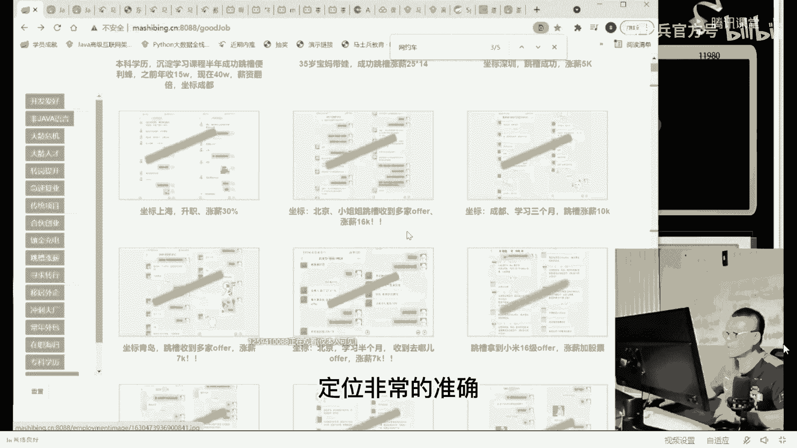

基本上应该是这样的，这个才对，成都学三个月跳槽涨薪干涨，涨了1万块钱，嗯这个是在北京学了半个月，大家听我说啊，就是学半个月的都是不太正常的，学半个月的呢基本上是这个这个课的给大家，带来的。

所有学半个月能长新的，都是这个课程带来的，这个课呢叫做面试突击，金九银十讲了一波突击班，再加上我们特色的就业指导课，也就是我们帮忙改简历的课，好吧。

这个只有这个这个课才能帮你在一个月以内来帮你涨起薪水来，这就是不同的人呢，我们采用不同的路线。

他的操作带来的好处啊，我个人永远推荐的是你扎扎实实学，但是有的人就比较着急，我已经离职了，老师我还想回来，我还想找点薪水，能不能做到可以，老师这可以，如果你不理解这件事。

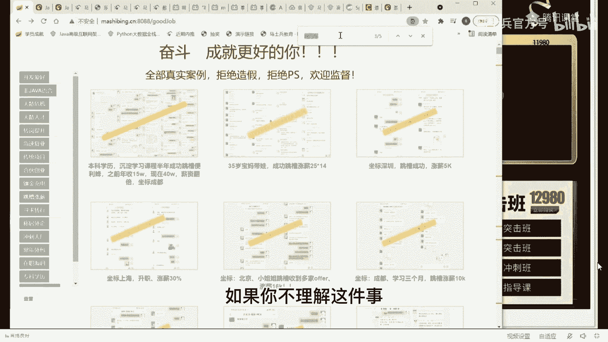

儿我给你举个最简单的简历的例子，这小伙没学，报了名之后改了一份简历，每个月就涨了3000块钱，我可以毫不夸张地说，在座的诸位，你把简历扔给老师，老师帮你改完，每个月多两三千，一定能涨得上去，百分百。

想看点牛逼的简历吗，抽个奖励，安卓要p7 什么水平啊，知识简历规划好，从十就直接到14了啊，呃改简历薪水涨了150%啊，修改简历和面试，第一家就成功25k的offer。

你看他自己说的就知道了。

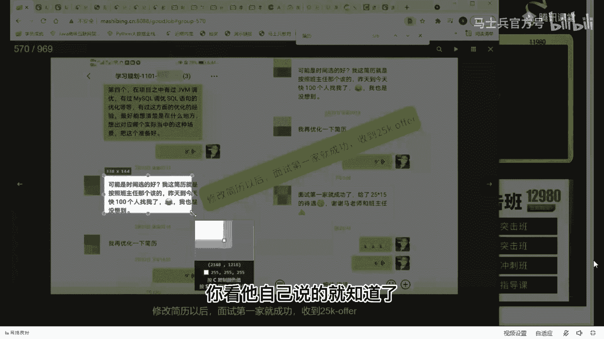

这老师不跟你们吹牛逼，昨天到今天100个人找我，我也是没想到对，不找你，不给你改过。

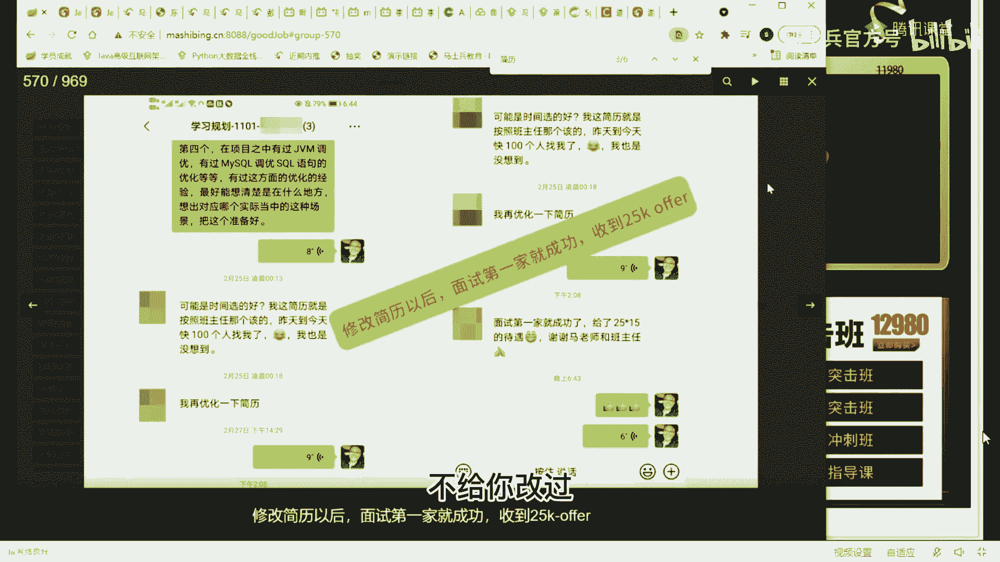

你永远想不到你的潜力是多大。

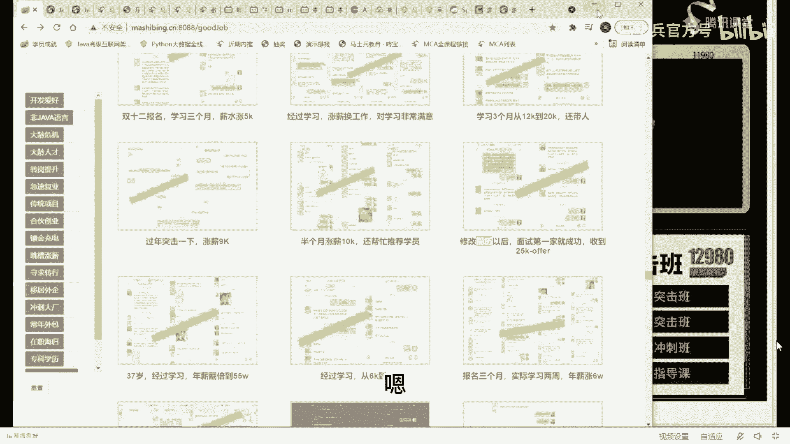

简历我就不刺激你们了行吗，我我我只给大家举一个最简单的例子。

你们认真听一下，我讲简历呢大概讲了六个小时左右的简历。

我记得啊，听我说呃，关于简历这块呢，我给你们讲一个最普通最简单的道理。

看看你能不能听得进去，想问大家一句话啊，我现在假设你的真实水平是100，有同学问你们想一下，你在简历上敢写多少，那么有的人敢写150，有的人敢写80，好好想一想啊，假如说有的人敢写150。

卧槽你太牛逼了，你本人真实水平你就100，你这种打凤姐的人，你敢去打泰森，你疯了，你好灭了，时间成了一家，当然记住别人找你面试的时候，一定是按你简历的水平，你简历写得越牛逼，他一定是说认可你。

只要能面试成功，第二人求稳，80面了十家哇，过了七家，我靠太牛太牛叉了，自己信心也足，有人面，我一定能通过，因为我写的少嘛，我以我90kg的水平去打那个40kg的级别的比赛哇，那那太爽了，对不对。

我就我就问大家一句话，谁赚了，好好琢磨，原来这哥们儿正常水平都拿2万块钱，结果这哥们儿靠150蒙进了一家拿了3万，结果这哥们儿呢拿了15000，你们好好给我想想，同样水平薪资就差了这么多。

它的区别唯一在于第一简历进行了修改，第二有的人呢进行了艰苦而卓绝的面试，有的人进行了轻松而愉快的面试，就是你拼还是不拼的问题，我告诉你啊，今天听课的，今天听课的有女有女同学吗，有女同学，老师扣个一。

我认识一下，有没有，千山灵应选清楚，ok good呃，女同学可能不太多，听我说，我接触到的所有的女同学水平是100的，永远只敢写80，甚至只敢写60，同学们，你们你们女同学们好好思索一下。

就是有好多时候为什么有一些东西，有一些项目组里面女同学总是起不来，因为男生呢基本上有80%的把握，60%的把握，他就敢往前拼，而你只有百分之百把握的时候，才敢去把握那80%的内容，记住记住。

当你一件事情你能往前拼的时候，第一往前拼，第二个你考虑它的后果就可以了，同学们，你们，想一下啊，所以100的真实水平，然后拿到了150的新对应的薪资，然后到企业里头的第一件事儿。

很可能最严重的后果是什么，你告诉我一下最严重的后果是什么，是不是这个这是最严重的后果吧，没有比这个更严重了吧，会不会把你抓抓到派出所去，会不会让你坐牢，会不会打折你的腿，不会吧，好那我问你。

你有多大的概率是用去被开掉呢，有多大的概率好，我们假设假设你进去之后一点努力都不努力，你就被别人带着走好，你这时候被开头的概率很可能有60%以上哇，60%以上，你在试用期就被干掉，那又能怎么样呢。

还有40%你能留下呢，但是我现在想问你，当你认认真真准准备了这150对应的这个简历的话，然后我，们课程里都有你面进去了之后，你能不能在晚上偷偷摸摸使劲儿地猛学，能不能够说当你遇到了任何问题之后。

直接在咱们这里提问，咱们的老师，我们这的老师呢下一步的这个意愿是半小时以内必有反馈，24，基本24小时以内帮你解决，你能不能够说能在这个面试试用期间，有80%以上的概率能待得住小伙伴吗。

结果你就不知不觉的你就记住了，你不知不觉的你就一路从100跨越到150，走的是捷径而已，就说你潜力是很大的，我再给你说一个最严重的后果，比如说你第一家公司干了两周，你水不水，至少得干两周你才知道吧。

被这家公司干掉了，好这时候有两种态度去对待这件事儿，第一种态度是叫做一蹶不振，一蹶不振，娘的我再也不敢出来了，我他妈丢了大人了，好第二种态度呢，来，东山再起，其实你下一次能不能成。

取决于你使用哪种态度对待这件事，那你既然你第一个能进到150的水平，能不能再来一件150的水平，你能不能在里面待够一个月，你第一次待了两周，你第二次能不能待够一个月好，如果一个月又被干掉了。

我再来能不能再第三次再来一个，那这次能不能带够三个月呀，假如你都待过三个月，还能被人干掉，大哥我就想想不通了，说明你根本一点都没努力哈，如果你选择一蹶不振也很简单，躺平吗，回到你的上下铺的上铺。

仰头对着满是疤痕的天，花板一只蟑螂缓慢的爬过你在心里背上的想，我的天呐，两周就被人干掉了，我的领导不知道背后该怎么说，我说尾号是9707的那哥们儿，小张儿水平这么烂，还敢过来骗我，好，别多说了。

三天以后，在你走人三天以后，当别人问他被你开掉，那哥们叫啥，他可能已经忘了姓啥来着，就是你在那里丢了个大人，丢了三天时间，然后你记了一辈子，一辈子，再也一蹶不振，当你在80岁的时候，身上插着尿管。

然后开始慢慢回想当初有一个拼搏的机会，我没有把握，后不后悔，好，当你理解了这件事之后呢，我觉得你就不应该再采用80的态度来对待这件事儿了。

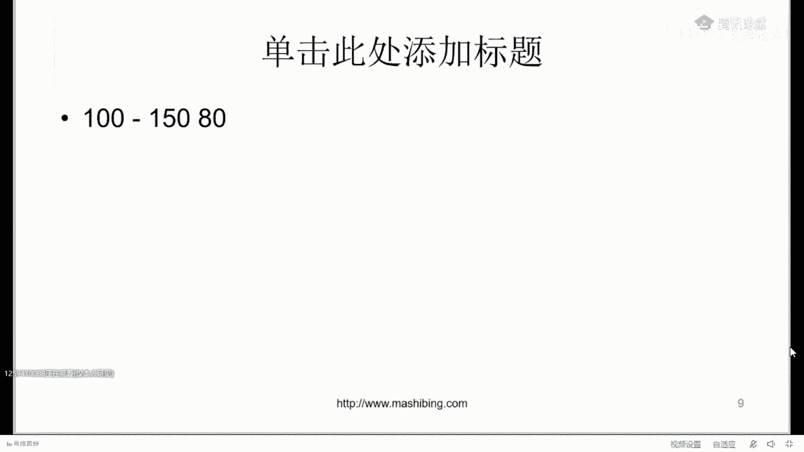