# 系列 1：P6：职业迷茫：给想进大厂的小伙伴指一条路 - 马士兵官方号 - BV1mu411r78p

嗯这机体系它怎么设计，为什么是这么什么这什么这么设计成这样的，我就不多说了，我主要聊大家比较关心的呃，就是什么样的人会是p级，然后呢他主要是那个那个那个那个主要的能力是在是在哪个层面上，好吧。

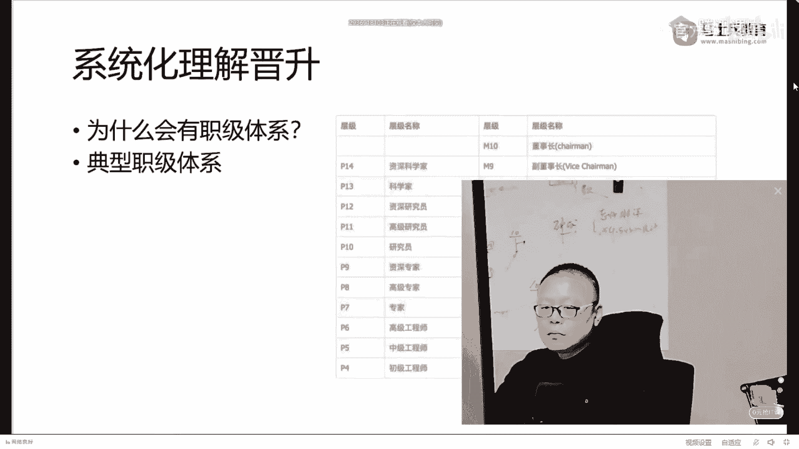

那么关于这个的话呢，嗯你可以完完全可以到我们的网站上啊，就是嗯找到我们m c a的这个课。

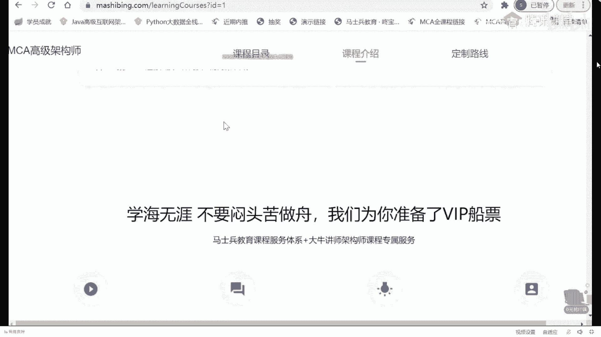

他的课程介绍里面嗯。

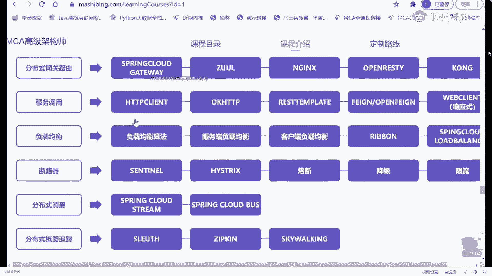

我们在这里呢做了一个自己的非常粗浅的一个总结，但是大家伙可以作为参考呃，首先我跟大家说一句啊，这个p5 是一个什么职级，p5 是一个入门，级别的大厂入门级别的直径，但是后来p4 这个直接就不招了。

现在基本上就是p5 ，p5 是什么样的人会是p5 呢，按理说应该是0~3年，他们认为你是p5 好吧，也就是说你社招3年以上的，那直接就是p6 了，但是到在目前的情况下来说呢。

大多数的情况下作为p5 是你刚刚毕业的应届生，应届生往往是定级p5 呃，不管你是本科生还是研究生啊，我这里头没有提专科，因为专科屁股这个职职级你进不去好吧，刚刚毕业的应届生，然后呢大，概在你工作。

你比方说你最开始的时候没有进到大厂里面，你进到了一家中小厂工作3年左右，哎你社招通过社招进大厂了，这个时候往往是p6 ，然后你在你项目组里头慢慢成长为带那么四五个人，这个时候你往往是p7 。

当你负责完整的整个的项目组的时候，我告诉你，你这个时候呃，大概你手底下是几十个人的这样的一个一个一个规模的时候，大概就是p8 了，当你手底下有不同的技术团队，你这个时候就是p9 。

那个如果从呃薪资的角度来说，p5 的薪资的话呢，大概是20万~40万左右，那么如果是从。

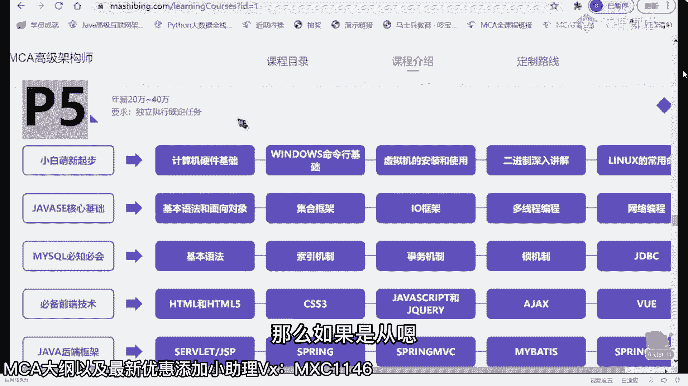

p6 的薪资来说呢，大概是40万~60万左右啊，呃如果是p7 的话呢，大概是50万~70万，但是这时候是有股票的呃，就是大部分p7 是有股票的，只有少部分没有，因为阿里有一种文档，p7 也比较好玩啊。

他专门写文档的，他那个薪资就低很多，50万~70万，大概再加上800~1200股啊，你这个股票比较值钱的时候呢，这个差不多p7 的薪水能拿到120万左右顶薪，哎，我讲到这儿。

有没有同学想想看看那个p7 的简历的，有没有，有没有有的话给老师扣个一来，3年以上还可以练p5 吗，3年以上你就要奔p6 去了，你为什么还要练p5 啊，干嘛这么看不起自己。

我我我给大家看一个非常牛逼的简历啊，这个是顶薪的，120万年薪的简历，我找一下。

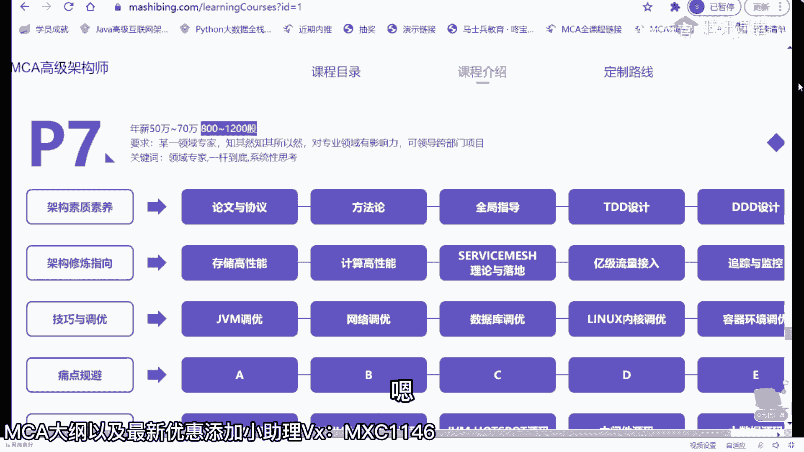

这个呃这哥们儿当时是29岁，拿到的是阿里的p7 plus，它不叫p7 ，这个叫p7 plus，我一会给你解释什么叫p7 plus，p7 plus那个呃100就是80万的正常薪资，外加40万每年的股票。

就类似于大概的估算的值啊，120万年薪呃，你们也可以呢读一读，看看看这个简历呢，呃自己能不能罩得住这个简历呢，如果你仔细读的话，其实你会看得出来那个这里面最重要的最值钱的点到底在哪儿。

5年java开发经验，其中3年以上全是大型系统架构设计经验，3年以上团队管理经验，这是最值钱的，当然目前政府的什么注册用户多少，日活多少，日访问量多少，这种的比较吹牛逼的啊。

这实际当中的数据很可能到不了这么多，嗯，对开源源码有过深度阅读好，从这儿呢你大概可以看出来p7 到底是一个什么样的水平，架构设计，源码阅读，这就是为什么我在课程里面会给大家这么设计的原因，明白吧。

就是老师的课程设计不是说随随便便给你设计的啊，为什么要读读源码，读原理，为什么要做架构的设计。

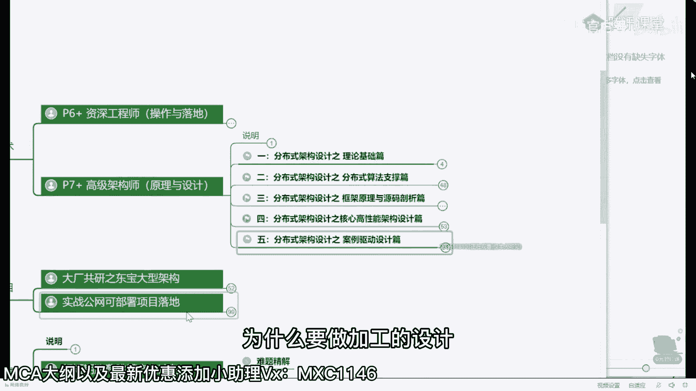

其实就在于这儿，就是希望你们能达到这样的水平，当然不是说每个人的薪资都能达到120万不是那么容易的呃，取法乎上得乎中，取法乎中得乎下，你的目标定的高一点，哪怕没有到，你跟其他人相比，你都是赚的。

你的目标本身就定得非常低，我今天就吃掉一个饺子，你就算达到了，你也就吃了一个，我今天要吃100个饺子，然后就算没吃完，我吃了50个，那我比你这一个也要牛逼的多得多好，这是他的一些个技术站。

这些技术站咱们课程体系里全有呃，可以，这么说，我的很多的课程的设计，是根据咱们同学们遇到的各种各样的问题来设计的，那个这这这这全是一堆一堆精通了啊，这个你放心啊，呃其实看上去很难。

但是呢不是想象中的那么的难，无非就是你需要掌握架构的一个技术选型是吧，当然最新的还有pose啊，然后呢搜索上的一些技术选型啊，这种那种呃这个这个持久化的一些技术选型，缓存的一些技术选型等等，就这么多。

加上一些底层的知识呃，他这个呢还没有写算法，写太多啊，其实还需要有有一点算法的知识就ok了，这背后究，竟付出了多少嗯，不要不要羡慕别人。

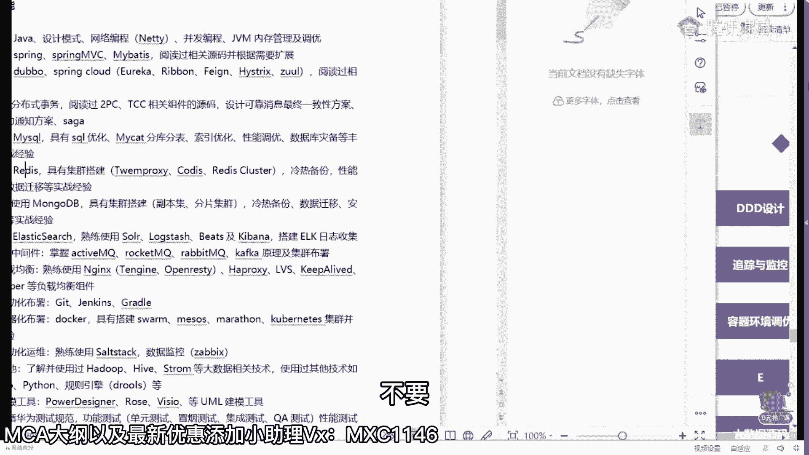

我有的时候会说，可以拿别人来举例子，但是呢每个人的路啊，每个人的人生路它都是不一样的，你不可能完完全全的复制另外一个人的人生，跟自己比就ok你比自己更强了，今天我比昨天强一点点，明天比今天强一点点。

时间稍微一积累都不用长，几个月的时间，你就会发现你已经脱颖而出了，其实就这么简单，那个，你你你你你们想知道那个那个那个他现在的一个状况吗。

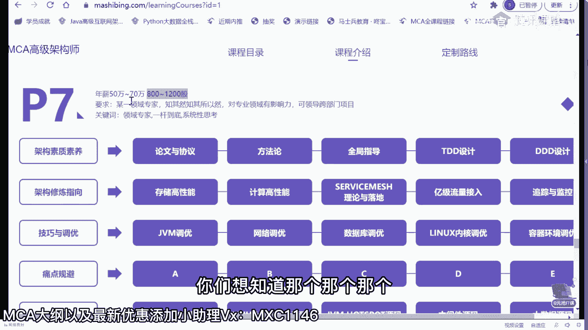

这个这哥们儿是是咱们史上最牛逼的一个学生啊，史上最牛逼的学生，你找一下他现在的一个状况啊，呃这里是大概有1000多位我的学生，然后做的一些个小小的总结和聊天的这个过程，嗯，我找一下啊，嗯就是他，对。

呃这个呢是他那个最近然后拿了5000万的股票套现之后，然后从公司离开，做了一个小小的总结，就是p7 的一些一些一些内容啊，p7 说到底是硬通货，是个分水岭呃，这里面需要你掌握什么，需要你掌握什么。

需要你掌握什么呃，大家可以到这个网站上去访问访问看看，这里面都是很多同学非常真实的聊天啊，你们看看就会知道了，那个嗯当然还是那句话啊，就是这种的比较极端。

我也绝对不会说奢望说我们每个人都能达到这样一个水平，我在他这个年龄的时候也达不到这样的一，个水平好吧，所以大家呢也不要说太羡慕，这个也也没有意义，但是呢最起码这份简历会给你指出方向来。

我们可以朝这个方向去吧，我们今天啃下来其中的一小点儿是不是就进步了一点点，我说今天我们甭啃别的，我今天啃了一个分布式事务，这东西不难的，咱们一堂课里头呢，差不多你花个三天，顶多花个三天左右的业余时间。

就能把这搞就能就能够把这个搞定了，你知道吗，我们是不是搞定一条好，我今天不干别的，我就聊一个自动化部署，我今天不干别的，我就把docker给搞定了，你想想看这个三天，这个五天。

然后那个七天加起来的话能有多长时间，最重要的是你根本没有必要每一个都全部精通，面试的时候，我说过了十加成两家就可以了，不用面面俱到，这大家能听进去吗，天神下凡对什么学历啊，学历相对比较好，985。

浙江大学，浙江大学是985吧，嗯肯定是啊，当然我说到这儿，很多同学就开始给自己找借口了，老老哥，我是大专，所以我不如他很正常，因此我又可以安心的躺平了，我说我再给你说一遍，我说他这个案例不是要你跟他比。

而是要你建立起来跟自己比的感觉，你今天要比昨天强一点，以他的这个技术为目标，我能听进去吗，就是你天天跟比尔盖茨比，那你这辈子永远完蛋，你天天跟埃隆马斯克比啊，你这辈子就别活了，所有人都别活了，对不对。

跟自己比，我今天比昨天强一点，明天比今天强一点不就成了吗，能忽悠大钱的背景肯定背景必须放光，这就是背景背景决定论嘛，来我想问你那个马云背景怎么样，马云985的对不对，马云是杭州师范的大专生吧。

如果没记错的话，对不对，英语老师对啊，所以不要找借口，我跟你说，你所有的这些这么说的，其实都是在暗示自己，我没有他的硬件，所以我有自己的不成功的借口，其实就是这个给自己一点心理安慰嘛，我是种田的。

对嗯嗯好了，但是这个就比较夸张了啊，我们讲想想起来了，拿这个举个案例呃，这是一个p7 的薪资，那p8 的薪资的话呢，多数人应该是到不了的，呃到目前为止，我直接培训的学生里头还没有还还目前啊。

我跟大家说呃，确实我还没有能把一个人直接呃学完咱们课给，干到p8 的，i'm sorry，我这个还确实还没有干到，因为p8 呢真的就很难培养了，他的这个薪资呢大概是200万，也就是按照官方的说法。

应该是120万~200万啊，这是这样的一个薪资，那么这里面呢就有很多很多的非技术的因素了，技术层面我完全可以让你到这个水平，但是非技术层面我也在尝试呃，目前呢也有一点点好好一点的那好消息了啊。

就是这这这这种层面等于我我也在给大家做尝试，就是课程体系里面为什么给大家要增加团队的管理课，产品的管理层，其实呢就是想，让大家在你以后的职业生涯里头走到高端的时候，也能够还有空间嗯，到现在为止。

我是我们现在有一个学生啊，我在我的微信里已经把他给置顶了，我只有一个学生，他已经灭了七面了，明白吗，他现在练p8 ，他灭了七次了，已经灭完这七次之后呢，还有第八轮的交叉面。

就是为什么说那个那个那个那个那个那个哥们儿说那个我可能灭了，灭了七次了，还没这个皮八，定级太难了，确实非常的难，然后呢还有最后一轮的交叉面，因为什么，因为它要求的定级太高了，所以就一一轮面一轮面。

一轮面一轮面，然后很多人都认为你确实到这个程度之后才会给你这个知己，当然这个直接到来的时候就意味着200万年薪了o呃据我知道的，从京东呃跳到高德的，就是那个有一本书叫一级流量，我不知道你们了解过没有。

那本书，它的作者就是从京东跳到高德啊，我当时微信联系了，说给咱们来讲讲课，然后呢高德实在太忙了，高德可能是阿里里面所有最忙的bo，然后那个没没有时间讲课啊，不然的话呢把他请过来讲讲课呃，从京东跳到高德。

大概是据我了解，应该是这个数400万，嗯所以小伙伴们，你首先要敢于想，就是你要知道呢，这个世界上呢是有好多好多潜力的，你首先你你的潜力呢也不要想那么高，我现在拿12万好，我明年的目标能不能拿到18万。

听懂了吧，这就是一步一个脚印的扎扎实实的，今天比昨天强的非常科学的一个一个目标的顶级，ok怎么说呢，机会有的是啊，在这里呢大概是1000多份，1000多位的同学好，同学说，老师你做假放心。

老师这里的全部的案例要有一份是假的，十倍学费赔付给你，你随便找，你想找任何一个人说他的那个那个找他，联系方式，只要他同意，我都可以给你联系上啊，嗯怎么说呢，这里面的案例呢就是不同的人。

不同的案例都多的是有顶级的，我刚才介绍的都是顶级的案例，当然也有呢刚刚入门级别的，还有就是路是一步一步走的啊，比方说入门级别的像什么样子的呢。

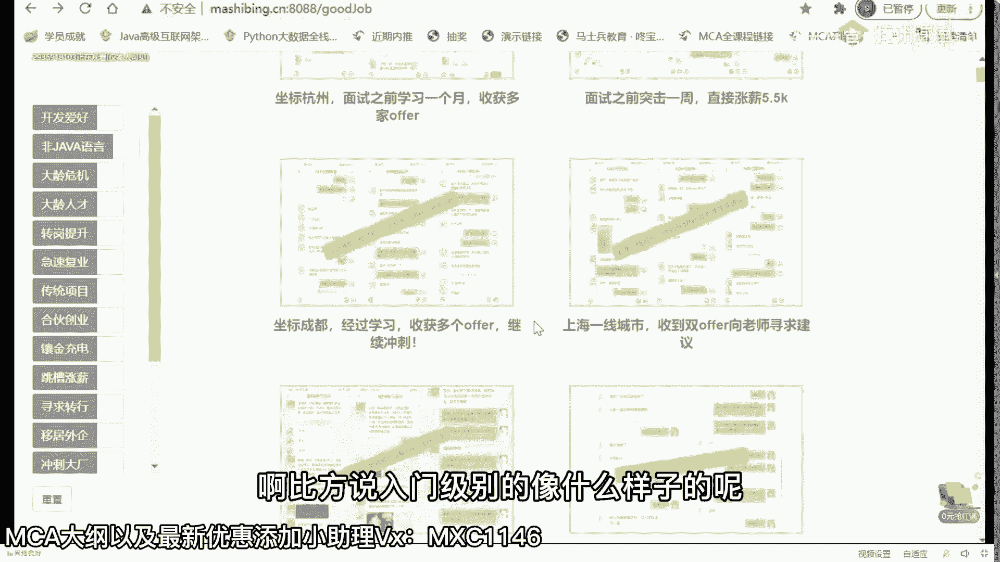

嗯这种呢最开始呢原来是拿8000块钱，然后学学四个月给拿到1万 14000还可以吧，1年就7万多呀。

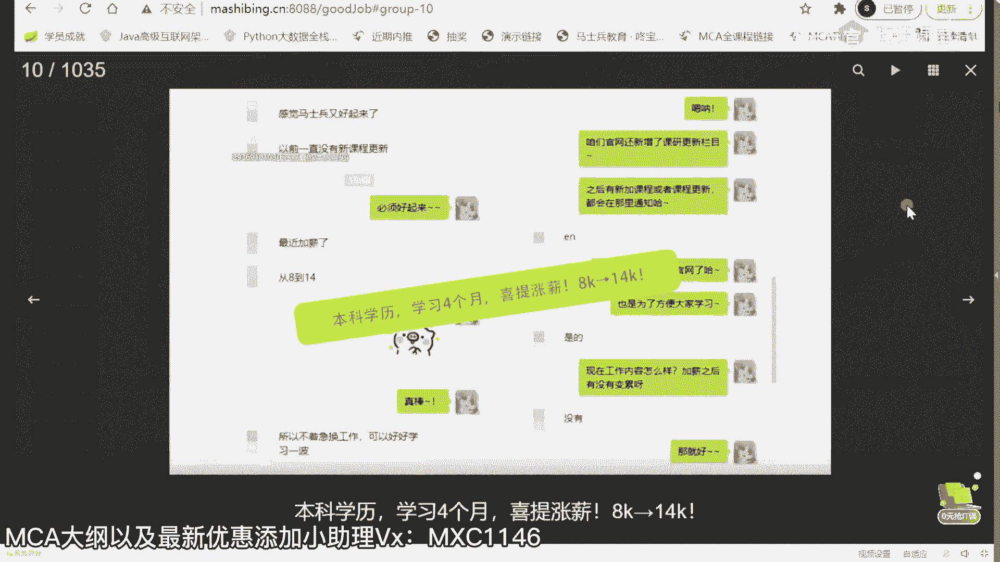

当然扯得远了，我们翻过头来再来看看啊，就是什么样的人可以到p5 ，什么样的人呢可以到呃p6 ，什么样的人可以到p7 ，他到底是都需要哪些哪些东西呃，我刚才呢给大家讲了一个概念，这个概念呢叫什么呢。

叫p7 plus，你们这个你们知道这个plus是什么意思吗，有没有知道这个plus是什么意思，呃我想问大家一个小小的问题，那个这里有一堆p6 ，1233个p6 ，我要在这三个p6 里面挑一个人做晋升。

升值为p7 ，来你告诉我谁会升上来，谁会升上来，who，当然有同学说就开玩笑了，开始是吧，长得漂亮的跟平跟那个考考评官有一腿的，跟考评官关系好的，首先第一点呃，高级别的晋升并不是只有一个考评官。

也不是只有你熟悉的那个呃，第一点长得漂亮更漂亮，长得漂亮确实有点优势啊，但是呢他肯定不能不是决定性的因素，好好听我说，如果我要在三个p6 里面挑一个p7 出来。

那么我一定会找那个优先已经开始做p7 事情的人，能听懂吗，我再说一遍，如果我要在一堆p6 里找一个p7 出来，我一定会找那个已经开始在做p7 事情的人，好了，这个就是p6 plus。

同理那个就是p7 plus，就是我为什么说在你们平时工作的时候，要多承担一些，多做一些，不要老搁那斤斤计较，我给我这点钱，我就干这点活，我多干点我就亏了，我我是真的遇见过这个这样的人。

这样的人最终的结果就是滚蛋，没有别的，所以让自己就是简单说提前一步好吧，来听进去的，给老师扣个一，嗯，讲点，今天感觉讲的比较碎，因为主要我没有给大家解释为什么自己体系啊，典型的这体系是什么样。

嗯以及呢他的一些个各种的说法啊，我简单跟大家说一说，这就是大概是一个什么样的，什么样的，什么样的一个一个一个，一个水平吧，就是p5 呢他大概做了一些哪些事情啊，p5 大概是这样的，它叫做。

直直级的入门就是新兵啊，给你一个模块，在别人的指导之下，我告诉你啊，这个这个东西要完成这个业务唉，然后告诉你用什么技术好了，然后呃作为p6 来说呢，就是p5 来说就是某一个模块的分支，就一个小程序啊。

那么p7 的话呢实际上就是项目整个项目级别，你可以带领团队来完成整个项目，好吧，呃基，本上大多数人呢是集中在这三个职级啊，我目前只有一个学生在冲p吧，他冲不冲得下来，冲下来我会告诉大家，冲不下来的话。

我也不会在这吹牛逼啊，作为p5 来说呢，一般来说我刚才说过了，就是应届生，所以呢你社招生呢也就别跟那玩什么这种这种这种玩玩屁股了，好大家听我说啊，呃在这呢我给大家讲一个比较大家比较关心的问题啊，就是。

如何在毕业的时候直进大厂来，有有有有多少同学毕业的时候想直进大厂的，有没有有的话，扣个一来冲屁吧，那个年龄多大了呃，冲屁吧，那哥们儿38岁，我我我找一下，找一下我微信，因为他的我已经置顶了啊，这样看啊。

你看还有这个，我不不说人名了啊，听说妈也很喜欢logo，要是一把100万以下，我就直接挂电话，这也是咱们一学生啊，他说我现在学越学越觉得一级量一级流量的项目有点意思，还在落地啊，呃。

我找一下刚才那个冲琵琶那个啊，这个是这样的，对他说那个嗯谢孟老师报了咱们课程，每次面试都心里特别有底啊，争取早日突破年薪百万，当然这个都算是相对高端的一点了，我们还是那句话，就是大家伙现在薪资比较低的。

没有关系，呃，你呢可以一点点的慢慢慢慢慢的慢慢慢慢往上涨，20万涨到40万，40万再涨到80万嘛，一点点来嘛，呃我找一下那哥们儿到底在哪里，嗯，我电脑上可能是没有缓存啊，嗯只能在手机上。

手机是没法演示的，呃他的年龄我记得应该是38岁，差不多是这样的一个年龄，呃，我算了算，我们聊回来啊，呃我们来聊这个在毕业的时候只进大厂来说到这儿，今今天今天开放开放一点儿，大家伙加微信吧，好不好。

我突然间想想到这个问题，因为我的第一个微信呢其实已经满了，然后又开发了第二个微信，我第二个微信呢是这个号，m sb 20191是吧，确认一下，你要是愿意的话，也可以加一下老师微信。

就是你报不报名报报可真的都没什么关系，我平时也比较喜欢跟学生交流，你要是愿意啊跟老师交流交流你的职业上的一些想法的，觉得愿意听听老师的意见建议的，没关系的，留个留个言啊，但是你不要跟我直连聊天就行了。

呃我一般呢就是有空的时候才会回好吧，另外呢不要寒暄，你不要说老师在吗，不要问我这种话可以在也可以不在，有啥事就直说留言就ok好吧，你要愿意的话，也可以加上老师微信m sb 201911嗯好。

我说毕业的时，候直进大厂，什么样的人能进啊，听我说呃，我说到这儿呢，可能有些大专生呢会不太开心呃，这么跟你说，大专想直进大厂呃，基本不太可能，那个一类我首先是定义什么叫大厂啊，这个大厂的话呢。

我自己的定义叫做一类互联网大厂，大概就是这些百度阿里京东，腾讯字节拼多多，美团滴滴快手，华为蚂蚁，网易，新浪微软，谷歌甲骨文尔考拉，就是下批小米az，当然如果你还觉得还还可以认为是大厂的话呢。

你也可以往里添加，比如说他投资占比超过10%的，这个基本上长的都是不错的，ok，还还还有补充的吗，vivo，i i don't think so vivivo，我觉得不算互联网一线大厂。

但vivo给的薪资据我所知还可以，请稍后再试，what，这并发量上来了，应该是，什么什么时候你想起来在家吧，好不好，嗯，没关系诶，难道是并发量上来了吗，哦有24个有24个新好友的申请啊，等我慢慢通过。

通过之后再慢慢再再再再再慢慢加吧，不急那个一般来说呃，大专和三本算一算一个层次，而这个层次呢不好意思，进，进不了，就是毕业直进这件事情，不能说百分之百的不行，但是99。99%的不行。

但是我会告诉你后面你该怎么进好吧，不着急好，只要你是二本，你就有机会了，历史一本90%以上的概率，老师送你进去，211985，基本上百分百接近百分百，99%的概率，老师能，送你进去呃，同学们听我说啊。

当然我是需要时间的，你不能说你明天面试了，今天找到老师，明天我就送送进去，这个这个不太可能，但是像211985的这种的，你只要大三找到老师，差不多就能送你进去了，呃给大家抽几个案例就成了。

给看几个字节的啊，我一会儿告诉大家是怎么怎么最容易进去，好不好，呃，这个是字节，大2l大三，这是最开心的，oppo只能算在我看来只能算二线的长，呃，听我说，如果你学历高，比方说你是一本，你。

是985211呃。

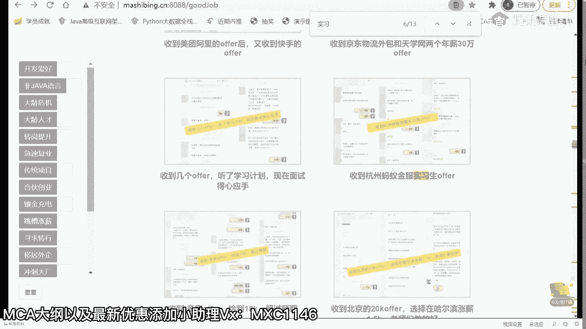

当你找到老师，基本上就板上钉钉的就送你进去了，而且呢在这儿我也跟大家说一句呃。

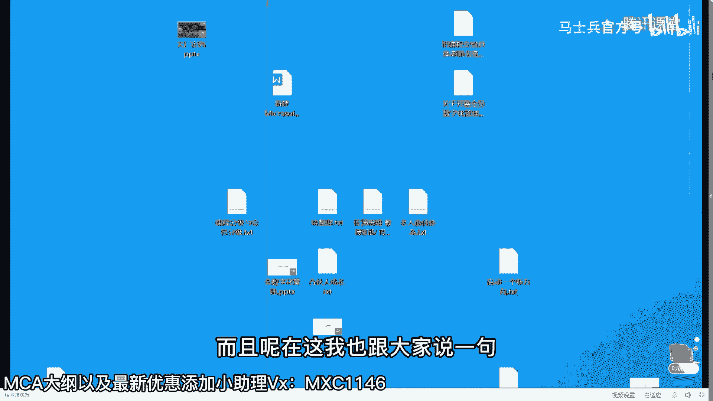

我们目前也已经打通了和华为的这个内推内推的渠道，但是华为要求比较高，它只要985哈哈，华为现在比较格调比较高啊，嗯那个那个我我告诉大家啊，大家听我说呃，毕业的时候直进大厂，实际上不能叫毕业的时候。

这是最合理的，也是最简单最安全的方式，听懂了吗，当然准备这件事情的时候，我希望你是从大二开始是最合适的啊，大三开始呢稍微有点晚，但也还来得及，大四就有点晚了，老师就没有那么大把握了。

好有多少人目前是在大二大三的，你扣个一，有有，大一大二嘛，大一大一大二更好了啊，对21985研究生也是可以的，完全没问题啊，大四了就是得得得得得得看运气了好不好，但你也要努力啊。

你不能说大四了我就放弃了，也不要这样，没关系啊，像这种刚毕业的，我也会告诉你后面该怎么办，年龄大的咱们往后放放，我告诉你该怎么办，呃他们听我说，是你最容易进去的，第，一个叫做你的专业课。

你认真听就是了啊，第一个叫做你的专业课，专业课有哪些呢，有同学说那个那个那个数数字电路，模拟电路啊，高数no不是用不着，我讲这个的时候，非计算机专业的同学们，你也认真听，你只要把这几门课补上。

你就跟计算机专业没有太大区别好第一门最重要的课叫做什么东西，叫做计算机组成原理啊，简称g组呃，我在讲课的时候是把机组和操作系统混在一起讲，为什么呢，严格来讲呢，如果说你只是做java后端，做软件的开发。

这里面硬件的很多东西你可以忽略掉了，我讲课的时候会给大家讲一些硬件的东西，但主要是跟软件有关系的啊，但是你像那个门电路怎么设计，门电路怎么组合，像这种的就没有必要啊，呃讲到这儿，那个推荐一本书吧。

有有有有没有有没有非计算机专业的呀，有没有我来推荐你推荐一本书吧，我看我那书在在手边上吗，有飞机的就专业的吗，非技能专业的，扣扣扣个一有吗，就是飞机算机专业，你补计计算机组成原理，你补哪本书啊。

有好多书籍肯定懂的，原理讲的太深了，你补起来也费，劲我就教大家啊，你是你，大家稍等我一下，我拿拿一下那本书，好找了，我这说扔的太乱了，不太好找，直接说吧，嗯这本书叫做编码，搜一下给大家搜一下。

ok这本书啊，你可以截图，就是编码隐匿在计算机软硬件背后的语言呃，呃所有非计算机的这种这种小伙伴们看这本书去做那个硬件的入门，听懂了吧，ok，呃说呢讲的比较有意思，也比较简单啊。

呃你像我在讲那个多线程的时候，我基本上就是就是给大家呃过过了一下这个硬件的知识，因为原来讲过一个多线程的内容，大概它里边是讲的这些东西嗯。

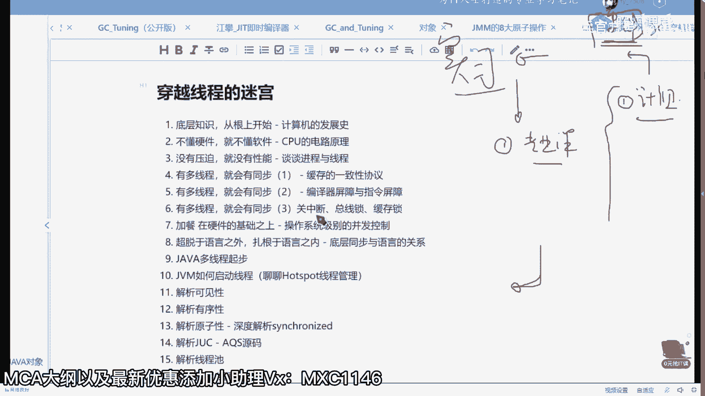

大概它里边讲的是什么东西呢，就是这个硬件的基础知识啊。

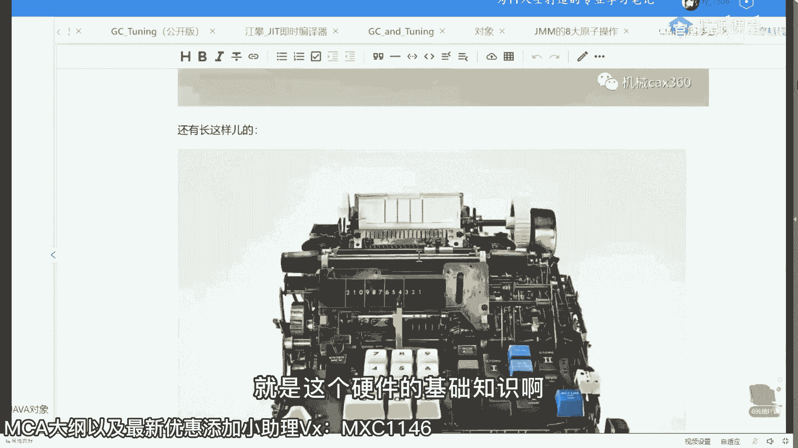

嗯cpu的原理就是从门电路啊，就是这些门电路到底是怎么怎么组成计算机的，这个软件是怎么驱动硬件的啊，为什么计算机一个非常硬的东西，我们居然能够用写程序的非常虚虚的东西去控制它啊。

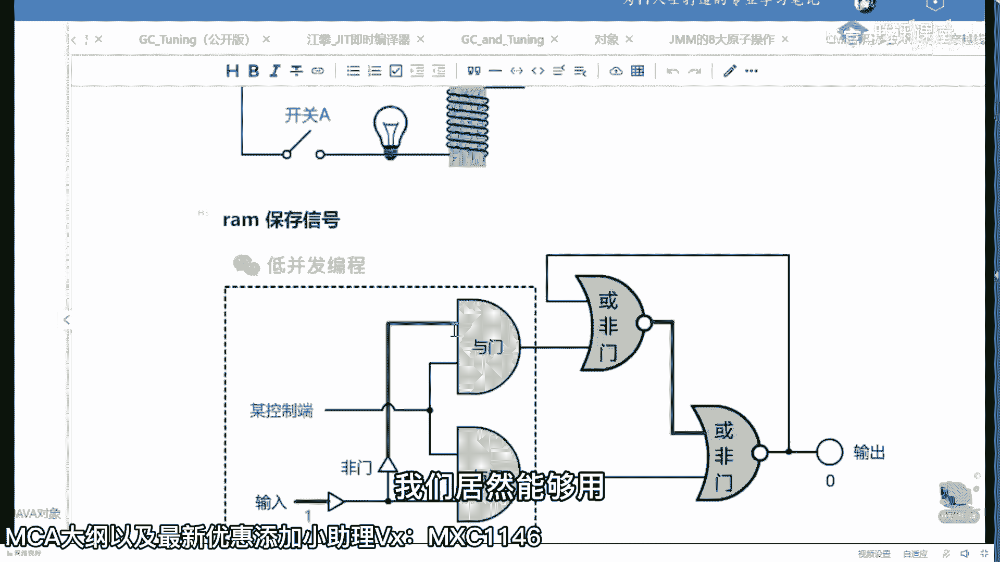

这这件事情很神奇的啊。

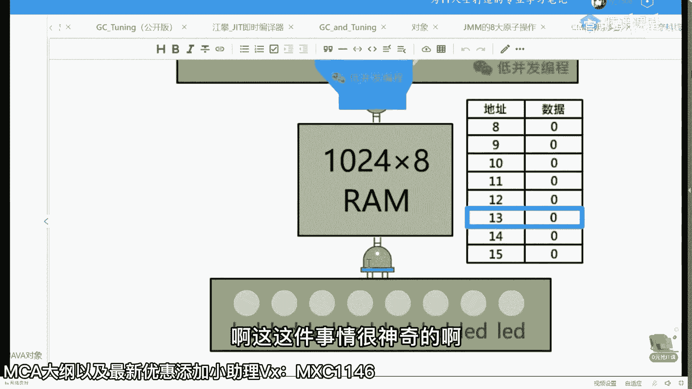

呃但是呢你只要把这把这书大概6万。

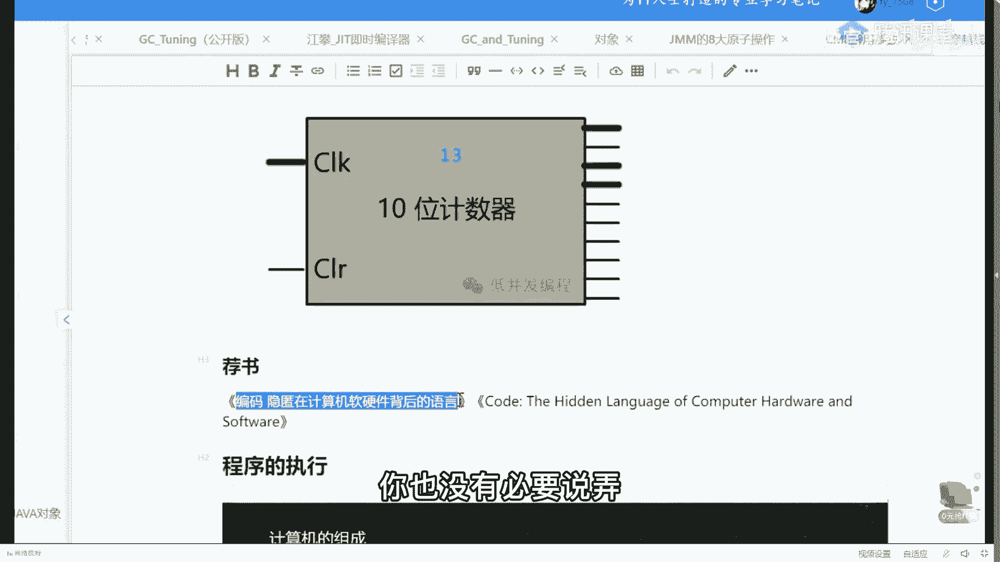