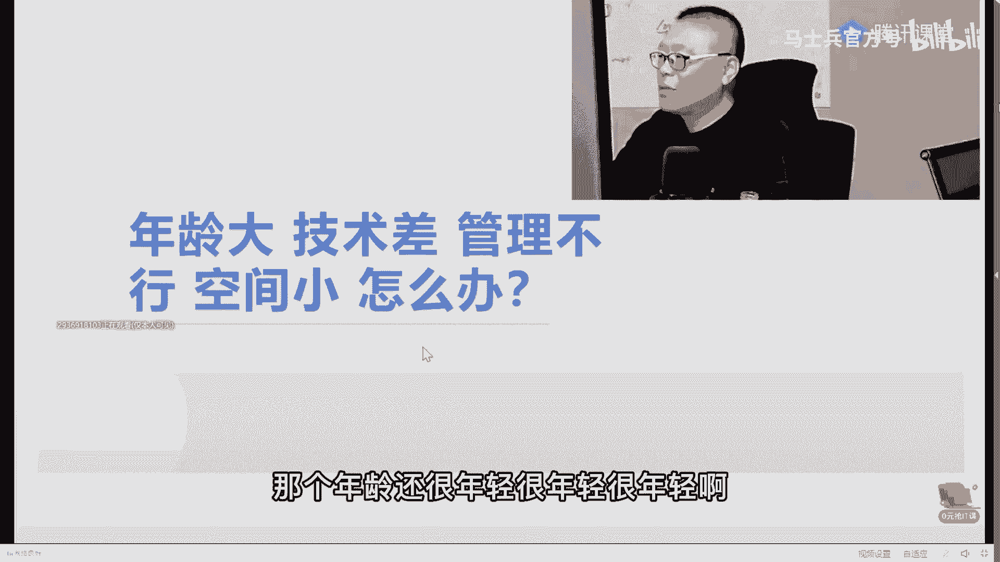

# 系列 1：P9：职业迷茫：年龄大、技术差、管理不行怎么办？ - 马士兵官方号 - BV1mu411r78p

权威解读啊，因为我们刚刚跟华为达成了协议。合作协议啊，给他内推。来。

老有同学说我现在年龄大了。今天聊一个大的话题，就聊最后一个吧，就是你年龄大的。我跟你说，年龄还大，技术还差，管理也不行。空间已经被挤的非常的小了，我该怎么办？哎。

同学们有没有这其中有一个或者多个问题的老师扣个一，好吧。😊，嗯。So。嗯。年龄到有多大？你们。来来来，各位各位认为自己年龄大的敲出来，我看你们有多大年龄，3033、34、22、22，你搁那扯淡呢。

46嗯29。😊，2825。4934、43。OK好好好，呃，同学们那个36岁以下的啊，你就别跟我这聊，年龄大了，好不好？那个年龄还很年轻很年轻很年轻啊。😊。

呃，我们长远别别的我就不跟你说什么褚实践啊，不跟你说什么呃邓我们邓小平也也79岁才主政中国，对吧？然后就不跟你说，任正非40多岁才创立华为，还差点破产，对不对？那个那个那个马云CS才30多岁。

就是你正当年是正当年的时候，麻烦你不要放弃啊。有好多人说我35了，我以后怎么办，感觉就要死了似的，以后就得去开滴滴开饭馆了。大哥远远不是这么回事。😊。

呃。呃，课程底下面有两位老师啊，我推荐你们去听一听，听听一听，跟跟他们跟他们交流交流。😊。

呃，首先第一个是讲这个课，就是大型团队管理的琵琶课。他本身就是P8。然后呢，那个现在是3十八九岁了，应该快接接近40。好吧，现在依然是在那个团队里头担任很核心的角色，然后年薪依然是那牛牛逼的很啊。

这就不不跟你说了。然后这哥们是已经40多岁了。OKP9P9的老师已经40多了啊。😊。

呃，目前呢在那个也是一家大厂，我就不说他的那个那个那个背景了啊，就是离开阿里之前P9，然后到新的大厂之后，担任更加牛逼的角色，还是这句话。就是我最最开始就跟大家说过一句。

年龄大这件事情一定如果你现在有危机，一定是你原来规划的不够，学习的不够，提升的不够，这点大家能认可吗？如果你学习够了，提升够了，你现在具备了你这个年龄的人应该具备的水平，你怎么会没有空间。

他一定是有空间才对。当然有同学说，老师，我已经这样了，我下面该怎么办？首先调思想。你还要一定告诉自己，我还有的是空间。哪怕就是这对你来说，这个鸡汤它也是一种正面激励。嗯，我再加一个年龄又大，基础还差。

管理也不行，空间还小，还是女生有没有？感觉没有年轻人的活力了。还是女生。对。

看你个小案例看你个小案例啊。我找找找几个女生的案例。女生进入美团。拼多多。京东。这是35岁的40万年薪也干到了70万。还可以吧。

其实35岁呢很年轻很年轻的啊啊，这个这个超级印象深刻啊这个。😊，这个是38岁的这个这位这位这位姑娘，我们是印象超级深刻，因为是给她费了太大的劲儿了啊，才把她给带出来。但是她带出来，她现在很牛逼的。

她不仅跳了第一次槽，现在又跳第二次槽，然后还嘲笑当时他们项目组的人特别弱，你明白吗？😊，呃。这是他当时的肺腑之言，我当时那个还还还挺感动的，非常感动啊，说说这句话，就是老师的成就感就在于这。

特别想择公开课的时候，多影响一些人职业生涯中尽快走出迷茫。但是人家会以为我是托儿啊，暂时只能忍着。😊。

如果你觉得你的比他还差，那我就也就没什么太大脾气了啊那个。怎么说。这个是39岁的大龄的成员。呃，我首先给大家一点啊，给大家做一个就是大龄的小伙伴们，给大家做一个做一个呃这个这个这个小小的建议。

你们一定要听进去啊。嗯，大龄大龄的女程序员。嗯，记得应该有一个。这是大龄成员34到50的。嗯，因有1个40多岁的啊，大龄的大专生，大龄的跨行成序员。疫情的嗯。有1个40多的，点忘了是四十几来着。43。

这3万。还有一个40。四十几岁的来着。

啊，这个这个。呃，这个姐姐是44岁。女成员，然后收到外企的offer。

那个。这这是他他搞定工作之后呢，也是肺腑之言啊，我希望给大家敲响一个警钟。你可以不跟老师学没有关系，但是麻烦你保持进步好不好？这次找工作时间提醒提了醒，不会再温水煮青蛙了。

呃，他的这个。怎么说呢？

他最后啊实际上还长了星了，我不知道大家看看出来没有？鼓励一下那些大龄成员，我43岁女生薪水跟大厂不能比，生活工作更拿了外企的研发，薪水差不多，选了这个OK。

我问他就是那个薪资达到了预期没有是吧，我说达到预期了。怎么说呢？你相信我一点，就是当你开始正视自己心态放正。然后呢，放积极了之后，开始改变自己之后，你一定会有收获，这个收获可能会大可能会小。

可能你自己没有长，甚至没有长心，但是呢你是不是心态上已经放好了，人是一个很好的心态的，人这一一辈子就这么几十年的，你保持一个很好的心态，也是一很好的一种收获的。但是你只要心态好了，好多事情就会变好。

你不信你试试看。那个。嗯。作为大连的小伙伴，我给大家一个建议。😊，我我不希望大家伙。呃，年龄很大的同学，三十八九岁。找到我说老师，你能不能给我找条路线，让我进大厂。大哥，这是这这是这是非常难的。

老师目前规划了好多好多人进到大厂。这个确实是。啊，我们我我们就从这里面搜大厂的名字，你就你就能找得到啊。就比如说你就搜。阿里。嗯。这俩是55353个呃，阿阿里的就是我们公布出来的啊，搜字杰这个叫12个。

然后搜那个那个呃呃美团。这是36个啊，搜。京东啊43个就是说其实呃进到大厂这件事情，在一个合适的年龄，合适的背景的情况下，老师帮你稍做规划，稍做指点你就进了。但是呢有的人是强人所难。

他非得说我学历又不怎么样，然后技术积累还不行，现在年龄还大，三十八九岁四十多了。老师，你能不能帮我送进大厂？如果你送进大厂，哎，我就报我就报名学习。你别跟我这扯这淡，你爱报不报？你行就行不行就不行。

你不行，你报了也不行。你行的话呢，老师判断你行，他他就。概率就高的很，就一定能行。呃，同学们听我说那个理智一点啊，如果你提出这样的要求来，说明你没活明白，三十八九岁了还没活明白，你这是人生的失败。

这时候你应该对自己的最理智的说法是一个什么样子的，认真听，应该是建立在题心上。提高收入上。这是最简单的提升你生活质量的办法，就是提收入。当然还有一种呢就是你追求你下一步的呃更好的职业的规划。

比如说我想进外企，我想进到甲方企业，我想进到那个非IT类的这一类的企业里头去，然后考虑我后面养老的事情了，这个也很也很务实，也很科学。也也相对靠谱一些是吧？提收入这件事情，老师有的是办法啊，你年龄多大。

老师也能够找出办法来，能让你把收入提上来，这是比较简单的，不难。可以这么说。报名马士兵教育的还没有说薪资涨不了的。就是多少的事儿，少的也是5000以上啊，低于500的就太少了。时间维度3到6个月左右。

还可以吧。打个牛逼出来好吗？😡，没有一个啊没有一个到不了说说完完不成这个任务的。嗯。那个。怎么说呢？就是你你把你的当你把定位定位在题心上的时候，呃，老师办法和手段就多了去了，好吧。哪怕就是让你搞点副业。

你也能把心字提上来啊。当然前提是你要保持正向的进步的积极的心态，这样才可以。嗯，做出改变。有一些那个年龄比较大的小伙伴啊。每个人的情况跟每个人的情况不一样，所以年龄比较大的时候。

我就没有办法找到那种普世性的东西了。就是没有办法说，我给你一个像那个呃那个那个计计算机系的这种这种学生啊，这个呃本科的这种二本的、三本、二本的、一本的这种的进大厂的路。

我们是没有办法找到找到这么一条普适性的路的这只能是每个人的问题，每个人分析。啊。对，当然这这个就比较麻烦了，麻烦一点，好吧。进大厂不也是为了钱吗？我觉得你这个人生的格调，麻烦你稍微往上提一提。

不然你这辈子会活得很痛苦。钱是赚不完的，也是赚不够的。有多少钱你永远也是够不了的。如果只是钉在钱上，那我觉得这就是你将来痛苦的根源。呃，让你这一生活的充实一些。格调高一些，你会发现钱是自然而然就来了。

好不好？把你的目标稍微定的高一点点啊，信大厂的目标是什么呢？实际上是为了你更好的一个职业规划职业的学历。啊，就是职业的职业的一个经历。你的你从大厂出来之后，有好多中小厂抢着要。给好多钱也也要明白吗？呃。

给大家看一个内推的111个1个1个小案例。内推呢我一般都不怎么给大家展示，主要什么呢？呃内推这件事情并不能够让大家伙儿说我降低学习难度。注意这是两回事儿。呃，这是自自杰找我们做内推啊。

最近找我们做内推的其实已经非常多，就全国的一线大厂，呃，我们都有都有渠道内推。这个不是说那种吹牛逼的啊，就老师这儿不跟你们。

吹这种不靠谱的牛逼。这是我们大概3月份那会疫情还没有这么严重的时候。

我们跟那个呃微软AMD和京东联合举办了大学生的编程大赛。然后呢，这个呢是我们在给京东做培训。呃，这是呃编程大赛的现场。然后。在3月份的时候，我们和小米和百度还有京东吧，京东当时没有没有没有来人。

因为他们疫情不允许出来。当时就在我们的现场啊，我们自己公司的内部现场做的招聘会。呃，有的人呢应该是参加过啊。就是内推的渠道呢，老师这有一大堆一大堆一大堆的。就是你想进哪个大厂，只要你水平够。

我判断你水平够。这个内推的渠道非常的通畅，但是前提是你的水平要高，能听懂吗？所以内推呢我一般不太。使着劲儿的说我们有内推，我们有内推之类的，我不一般不我一般不会说这个。那个怎么说呢？

他不会降低你的学习难度，你也不要指望着说你学习的程度不够，老师能把你推进去，这不可能的。一定是建立在你硬技能过硬的基础之上啊，我刚才说的是什么呢？我刚才说的是当你有了大厂的背景之后。

像这一类的非IT类的大厂，那给的年薪是相当可观。罗湖地产年薪150万以上。team leader的年薪120万。你说他是IT类的吗？他也不是他工作会很累吗？也不会很累。但是你你要是有大厂的背景。

我是美团出来的，我是阿里出来的。我是和他这个比较相关的。比方说ERP拥有出来的OK这特定相关了，就属于。OK我是平安出来。好，你就有机会能够到这种企业里头拿很好的年薪了。

这是年龄大一些的人的另外一条比较不错的路线。不知道大家听进去没有，作为咱们年龄大的小伙伴啊。我就在直接上直接上班。嗯，那咱们离得很近啊。我在进门桥。你如果是在防洪中心这边。

那我们直线距离就两两三百米哈哈嗯。老师，联想可以算镀金吗？我个人认为不算啊，联想。I I don't think联想是一个镀金。我在学院路这边那离得很近啊，可以过来呃坐坐。聊个天喝个茶。

子杰最近离职了不少。呃，我们陈老师跟字杰的人大概住一个楼，住的比较多。嗯。TME算吗？TME是谁啊？银行算吗？嗯，银行的用的技术其实真的一般般，所以不能算。科技公司参观吗？可以啊，我们搞线下活动啊。

因为近期的也在规划线下活动，只要疫情过去。呃，我们会找一些咱们大厂里头的高P啊，P8P9P7这些人来跟大家做见面会啊，你就会知道呢深入的了解就是他们的职业发展到底什么样子的。

并不是所有人的学历都特别好啊，呃，我给大家讲那个架构设计的老师，曹老师吧，他就是二本的学生。呃，黄老师二十四五岁，今年是25岁了。黄老师25岁。呃，离开美团的时候，85万年薪。牛没有逼？

这就是技术牛的人啊，他的一个他的一个。可以达到的宽度，好吧。甜M蜜啊腾讯音乐酷狗K歌。哦。这不就腾讯吗？腾讯当然是大厂了啊。25岁对，25岁。想看看他的简历吗？他当时到阿里的时候是24岁嗯。

大概是60万年薪，那会呢嗯。嗯，打开来看看好吧。😊，呃，我我我隐蔽了一些他的那个隐私啊。当然他这个是属于纯硬核，非常硬核。OK非常硬水。超级硬啊。这个全是基本全是精通。嗯。怎么说呢？他在大学四年。

没谈恋没谈恋爱。没有出去玩，不打游戏。就学习了。听懂了吧？所以他付出努力了，当然就会有收获啊。他二十四五岁的时候，比我二十四五岁的时候，那就那那牛牛逼多了OK。哎，怎么说呢？就一分耕耘，一分收获。呃。

老师能向你提供的，就是让你少走弯路。讲到这儿呢，其实我们的课呢，其实我介绍也差不多了。我就不专门做什么特殊的广告了。

呃，简单说，你想提新的，你想进大厂的老师早就帮你想的方方面面都已经非常透彻了，你也逃不出那1000多人的案例里头去的，你也没那么特殊。想多涨点薪水的。今晚你就扎实来来找老师就完了，好吧。呃。

几句话介绍晚上的活动。然后有一些需要跟老师交流的，咱们就瞎聊瞎聊会天，好不好？简单几句话接说完。

