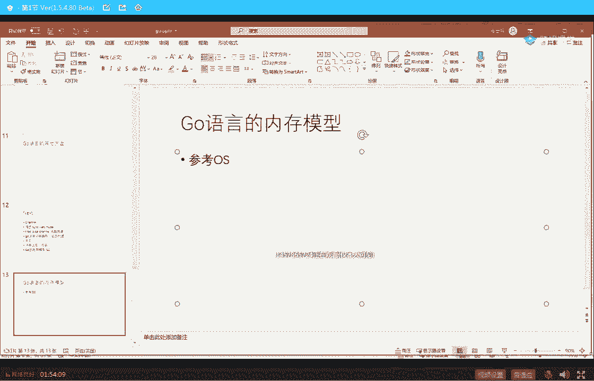
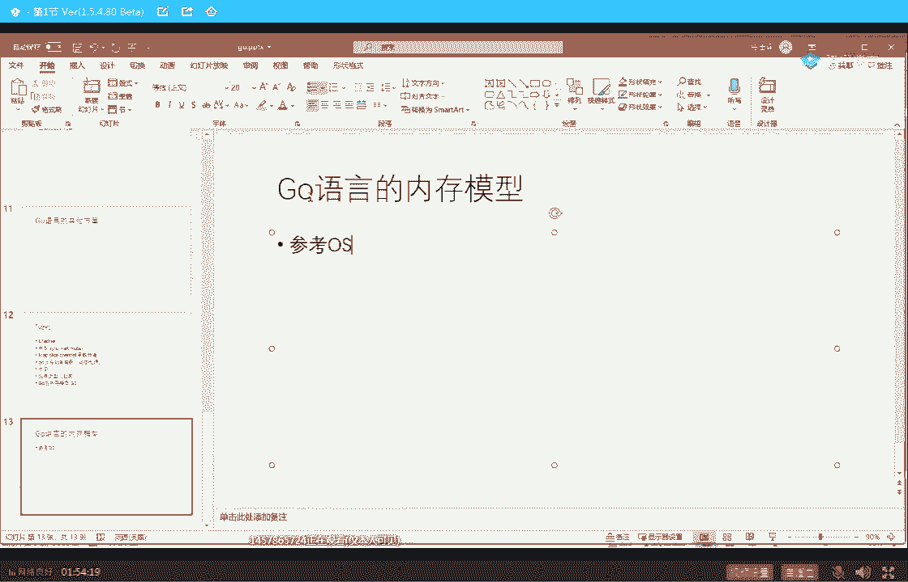
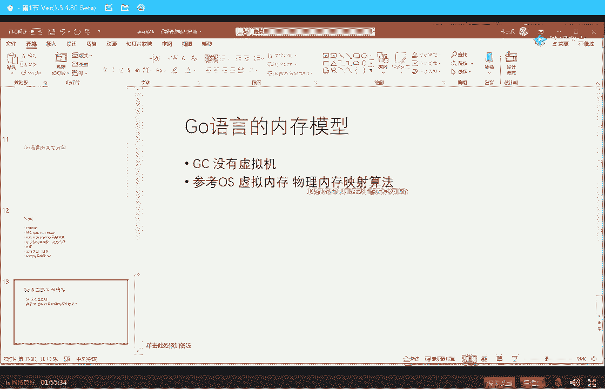
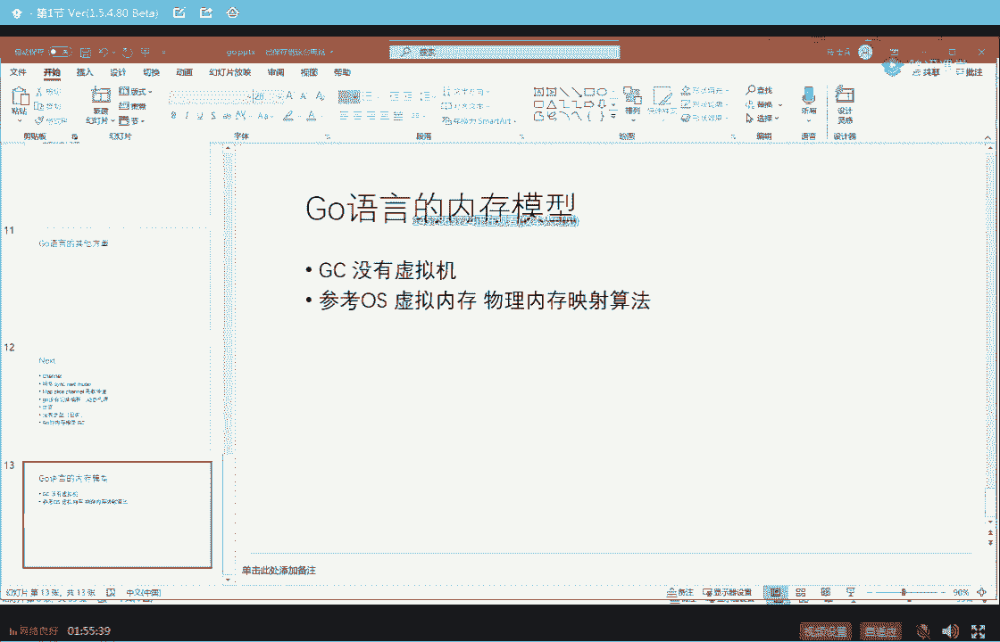
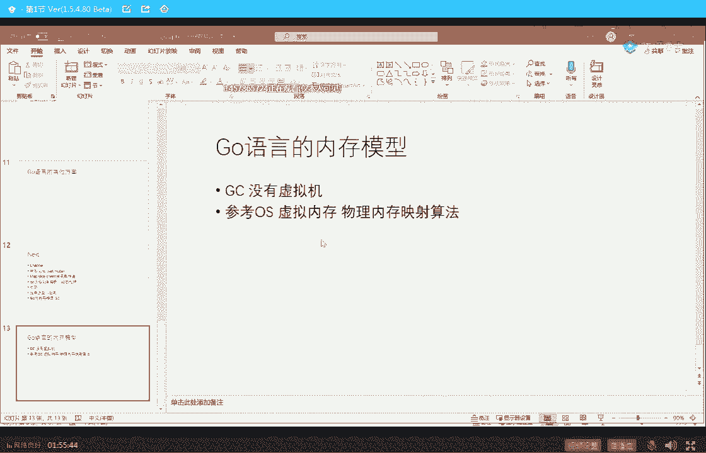
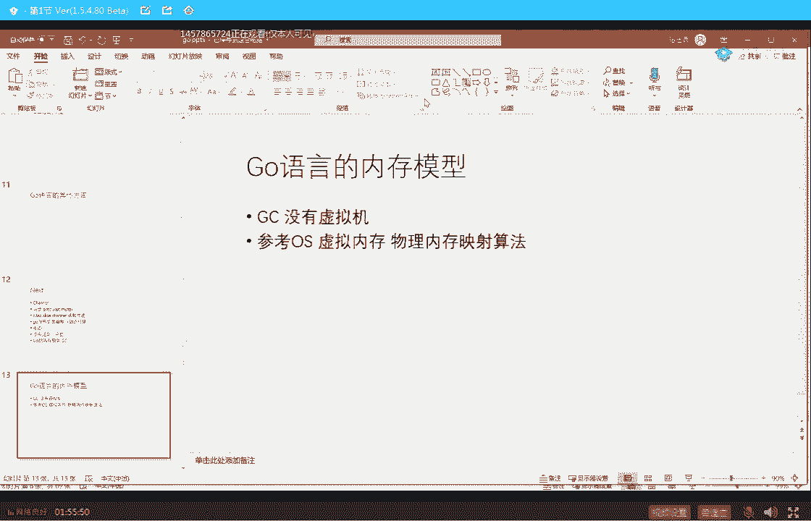
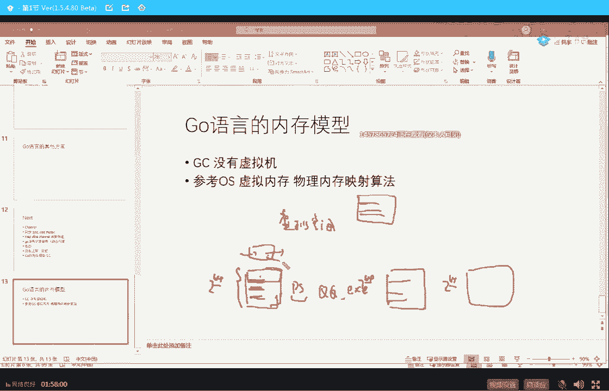

# 系列 2：P11：马士兵老师JVM调优：11.用top命令观察系统运行情况 - Java视频学堂 - BV1Hy4y1t7Bo

sgo的dc特征，一个单线程的通过图，很容易理解，你们哥仨在这里工作工作工作工作空间满了，触发垃圾回收怎么办，垃圾回收器一进来停止狗亭，我来干活，然后干一段时间，清除一些空间。

来alan你们仨继续停止过来干活，还有你们仨继续好，这块就叫s t w，我讲到这儿的时候呢，一定有同学有这样的感触，java语言呢有很多时候会有一种卡顿的感觉，那种卡顿的感觉来源于什么地方。

垃圾回收器在干活，我们的业务线程没有反馈，业务线程停了，你点个按钮，业务线程没工作，它停了，你说这按钮能给你反馈吗，不可能，所以这时候叫卡顿，这是我们这vm调优的时候极力避免的一个现象。

而这几个概念不知道我说清楚没有，ok还有个同学有疑问的，可以继续了吗，好看这里你们关于这些实实战中的问题，一会儿再问啊，我先讲完，回答你的问题，打乱咱们正常的听课节奏哦，你先留着啊，放心所有问题随便来。

答不出来，老师的错啊，我一般都推荐说你们调试调试一个jvm，在线调优的时候怎么调啊，先尝试老师教的方法，百度实在不行，你们互相探讨排除法，再不行，找爷找马爷啊，过来找我，最后最终解决方案，啊看这里啊。

叫做is still the world cing collector，which is这个这个非常简单，大家记住啊，从呃垃圾回收器的整个的发展历程来说，嗯。

从最开始的jdk一点零到现在的这个是14整个的发展历程，各位听我说，它是一个内存逐渐变大的过程，内存逐渐变大，啥意思呢，就是你们家的房间呢越来越大，越来越大，好原来的那种算法已经应付不了了。

才会考虑去发明新算法，我们最简单的算法呢就叫单线程处理，就一个人进来全清理掉你们家房间三个平米，三个平方，仨人很快满了，没关系，一个人进来七里宽带就扫，就就清扫完了，这种情况下给客户的感觉。

他不会有非常强烈的那种st大的现象，因为最多很快清扫一下，你就清扫完了，完全没问题的，但是你想象一下，你们家的空间越来越大，100个平方，100个平方，一个人进来清理了多长时间，有可能好几分钟。

那这时候怎么办，当然cao呢就是of the world max swift或者more compact or uc c g c re，他工作在老年代的单线程的垃圾回收，这个都很很容易理解了。

就是我回到刚才的问题，你们家这个房间越来越大，那你想提高效率，你不能跟我说那个t大多时间太长了，怎么办，你拿大腿想想也应该知道，多叫几个人呗对吗，同学们多叫几个人进来不就完了吗，爸爸妈妈。

爷爷奶奶姥姥爷一块进来跟你说，100个平方很快也就说完了，好看这里，所以在单线程回收效率不够的时候，用下面这种工作在年轻代的叫parallel scavenge，读一下，非常简单。

stop the world copy collector，which uses multiple threat to the threads，来读一看图就就就看明白了，你们哥儿仨啊。

你们不能说你们哥儿仨，你几13在这儿扔来扔去，扔线团满了，垃圾回收器进来，仨人进来帮你回收，可以吧，多线程多个人嘛，非常很容易就能理解了，我们继续parallel又是什么呢，就是多个线程工作的老年代吗。

ok这叫parallel old，所以讲到现在为止呢，其实这几种都非常简单，serial serioko，就parallecovage partout，无非就是单线程，多线程，单个人处理，多个人处理。

提升了效率而已，但是我想问大家一句，我想问大家一句，当你们家的空间越来越大的时候，是不是能够随着线程数而线性的进行效率提升，什么意思呢，就是我堆人嘛，我一个人回收不过来，俩人俩人回收不来，四个人。

四个人不行，八个人八个人不行，我16个人实在不行，我拉一个军队过来，这样行不行，可以吗，不行，为什么不行啊，为什么不行，其实牵扯到另外一个概念啊，既然说到这，我稍微稍微稍微的给大家那个拓展一点好吗。

我看我的ppt有没有打开，等下我的ppt啊，稍等片哥找一下，我的ppt，就另外一个概念啊，因为很多人呢第一个呢他是非科班，第二个呢就算有些科班能是这个基础太弱，我稍微稍微拓展一点点，并不并不多。

我不会给大家讲汇编，不会给大家讲量子计算机啊，我这里就给大家讲这个，也不会给大家讲超线程，我给大家讲什么，讲计算机的最根本的组成，为什么好多个线程，我说多线程工作一般比单线程效率高。

为什么线程到一定数量的时候，它的效率不会随着提高，原因是什么，大家看这里什么叫一个线程，什么叫一个线程啊，一个县城一个进程，听我说一个进程标准，答案是操作系统用来分配资源的基本单位，这块你要能听懂就听。

听不懂就算了啊，一个县城叫操作系统进行调度，执行的基本单位就是线程啊，是执行的基本单位，一颗cpu通常情况下，如果你没有做那种呃呃超线程的，这这这这这种结构的话，那么一颗cpu通常情况下只执行一个线程。

在同一个时间点上，那我们多线程，比方说我们有八个cpu，我们有2000个线程，我就想问你这八个cpu怎么去执行这两行，怎么去执行这两行线程很简单，就是执行你一会儿执行他一会儿你来一会儿。

他来一会儿来回来去的进行切换，这个具体的切换过程涉及到寄存器的数据的存储，数据的备份以及恢复，涉及到program counter，涉及到这种程序计数器的。

就是说你的那个那个那个执行到哪个位置上的这种的技术备份和恢复，这种的呢，我们称之为专业名词，叫context switch，全称叫connewitch，叫叫做叫做上下文切换，大家听我说。

当线程数量合适的时候，这个context switch它所占的呃呃呃呃，资源的并不是特别多，然后多线程就发挥了它的威力，它的一定比单个的线程要快很多，但是如果你随地线程数量越来越多。

那么cpu会把它的很大的资源都耗在什么呢，什么上面呢，就是线程切换上2000个线程，我得保证每个人都有机会执行，那我就能执行你一小点时间，我就得把另外一个线程给切进来。

所以更大的时间会消耗在这个context switch上面，上下文切换，所以并不是说呢你们家人多，人越多啊，你的效率就越高，不是这么回事儿，而是到一定程度的时候，我告诉你，你的效率就已经提升不了。

甚至开始下降了，所以这个时候就开始呼唤新的算法，同学们，你们想一下，当他家的房间越来越大，你100 100个平米几个人没问题，他变一层楼了，变成一个天安门广场，那么大个儿的时候，我就想问你。

你多少个县城进来都没戏，因为全把资源耗在线程切换上了，所以这个时候呢就开始要求啊呼唤新的这种，垃圾回收的这种方式，这种垃圾回收器的算法要求新的算法出现，大概在这里和1。4的时候。

诞生了一个承前启后的划时代的算法，这个算法叫cms，好在我解释cm之前，我先给大家解释什么叫pcm，我一会儿解释，这是我们的考点重点，所有复杂的地方在于这个地方，有了cms，你才能去理解g one。

才能理解这cdc才能理解谁能懂啊，所以说呢他虽然说有各种各样的毛病和bug，但是我告诉你这个东西算法你要搞不明白，jvm面试你就过不去，好我们先了解什么叫penn，大家看这里啊，每种垃圾回收器啊。

它都是配对出现的，我说常见的配对是这样的，你看到了吗，来一拍一拍，一拍一拍，很常见的配对就这三种，但是呢并不代表着说我serial不能和你c m s配。

我parallel coverage不能和你serio的配置是可以的，完全没问题，cm呢是一个划时代的，一会儿我告诉你他为什么划时代，但是呢原来原来存在的这些想跟他配对不好配，为了和他配对。

发明了一个新的pu，pu的全称就是parallel new，依然是多线程的工作，在年轻代的，但是呢他专门和c m s做配合的好看，这里所谓的朋友他跟那个parallel old的描述是一样的。

这个我都是从那个jvm虚拟机里面具体规范里面给大家摘出来的，它叫做is of the world cing collector，which uses mbodies the threat。

它的描述跟parallel old跟parallel scavenge一模一样，但是他下面说的区别，他说it defers from parallecoin，他说跟parallecoin的区别在哪里呢。

它是in that it has enhancements that makes it usable with the same as，专门做了一些增强配合cms使用，所以好好听我说。

这东西约等于我们不能说直接等于这个哥们儿约等于他，但是做了一些和cms专门配合的一些改进，为了伺候他，看不懂，所以我听听到什么程度算什么程度莫急，其实我讲的算是很很那个那个已经算是很浅显易懂了吧。

好大家能能跟上吗，下面我们就来聊c m s了，能够让老师扣一来嗯，好继续按我们来聊cms和原来的它的一个很重大的区别在哪里呢，好我们还是从线程角度直接来理解cm啊，它的全称我们先看它的全称叫什么，好吧。

它全称叫concurrent mark week，实际上这里头有两个概念，一个叫并行叫paralle，一个叫并发叫concurrent，这两个概念如果想透彻理解的话，那我也懒得跟你解释。

有一本书叫呃呃呃计算机组成原理啊，第700多页的时候专门讲这个概念算了，先先不管他听我讲就行了啊，concurrent，concurrent mark wik叫cms。

我们看一眼它的区别主要在哪里就知道了，它的区别主要在于什么地方呢，就是你发现没有看这个阶段，我们不管这个阶段是什么，我们先不管这个阶段是什么，就是在cms回收垃圾回收的整个阶段里头。

有一个阶段是什么样的呢，你会发现垃圾回收线程工作线程同时在干事儿，我们以前说过的可真没有，就是所有的你必须都得给我s t w了，我我垃圾回收线程干事的时候，其他的那些个工作线的都给我站一边去。

站墙根儿去，但是在cms里面也就是concurrent，这叫并发，并发的意思是说垃圾回收线程跟我们的工作线程同时在运行，同学们，你们想一下，如果是这样的话，有什么好处呢。

好处就在于你拿大腿想也应该知道我点个按钮，它会有反馈了，为什么，因为我工作线程在运行啊，原来怎么样啊，原来是我垃圾回收线程运行，我工作线程就运行不了，所以它按钮一定没反馈，好这个就是cms的核心。

那我下面细细的讲每一个阶段到底是几个意思好吧，并发经理的单线程少画了一个多线程，sorry啊，欢乐马，你的眼神够好的嗯，来看这里，作为，从现场的角度来讲呢，c m s呢会分成六个阶段。

但是它主要的一般跟面试官谈呢，谈这四个够了，再多说，再多学了呢，你的效率就变低了，亏了你的时间上的效率就变亏了，我觉得一个老师还有一个牛逼的点，就是我告诉你，你的最重要的效率应该花在什么地方。

有好多人呢他不知道，他会把他宝贵的时间花在那些个面试官根本不关心的地方上，那你就太浪费了，看这里这四个阶段够了，这四阶段分别叫什么呢，叫初始标记，并发标记，重新标记和并发清理。

我先给你大概讲每个阶段的意思，想透彻理解这里面的算法，我们一会儿尝试讲讲看，先不着急好，大家看这里，初始标记的意思是什么呢，就是我们这个算法你们还有印象吗，c m s是工作的老年代的。

它的全称叫mark sweep，就是从根儿上找，比如searching嘛，从根上开始捋，能捋到的这些个带着从一个县一个县开始捋，捋，能捋到这些线团，这些线团都不是垃圾，这个过程非常的复杂。

尤其是随着程序越来越大，运行时间越来越长，捋一遍这个过程非常耗时，最耗时的地方就在于这儿，以前呢都是捋这个过程的时候给我停了，其他人都给我停了，但时间太长了怎么办。

现在是这个铝这个东西的这个过程的时候是跟扔线团的人同时进行的，那这事就好玩了，你发现没有，好玩在哪里呢，我的最开始的时候可以做一个很很小的一个初始标记，初始标题就是根上那些对象。

我先给你找出来这仨人手里拎着的最直接拎着的那些个线团儿，先给你拎出来哈，这些是根儿上就行，跟上对象一般不多，所以这里确实是s t w，但是这个s t w注意是可以接受的，他大概就是个几百个毫秒而已。

这是能接受的，那有同学讲到这儿就会就会问说老师计算机运动运行速度那么快，你前面讲的那些个不管是单线程的，多线程的这种sw，难道比几百个毫秒长很多吗，我告诉你生产环境之中，老师遇到过两天以上的，两天以上。

什么概念就停在这儿，程序跟死了一模一样诶，但是呢你会后台查，你会发现这个这个这个现场这个技能还活着，你说你杀了他，万一中间有数据不一致怎么办，两天以上呃，咱们学我我学员遇见过最长的半个小时以上。

我就想问你双11正在抢单呢，正在秒杀呢，你的垃圾回收线程开始工作s t w时间也不用长十分钟，你们公司能忍吗，忍不了，不可能的，所以在后面的很多很多的垃圾回收器的算法设计里头。

它的核心思想降低s t w时间，降低卡顿时间，嗯，我讲到这儿的时候呢，刚才啊有同学问，我不知道这这这这这个同学还在不在，他会问我，他说那为什么g one的效率反而比cm s稍微低一些。

好好听我说g one本身的设计，它的运行效率就是比cm稍微低一些，但是它的设计思想是他的停顿时间比cm s又提升了一个数量级，g m s200 个毫秒左右比较长，这哥们多少十个毫秒，cdc多少一个毫秒。

好，总而言之，言而总之，整个垃圾回收器回收的过程就是内存越来越大，响应时间越来越及时，卡顿时间越来越短，它是沿着这么一条路线在演进，啊所以他第一个标记过程叫初始标记，就是他找到最根上。

他就不开始往下找了，剩下继续找的过程，它是一个并发标记，你爸爸妈妈进来在屋里头，你们仨在床上，是不是在那个屋里玩，玩着玩着产生各种各样的小垃圾，你爸爸妈妈顺手就给你清了，明白吗。

还一边在标记一边顺手就给你清了，ok very good，这种当然好，然后同学们，我们来考虑，现在来考虑面试官可能会问你的问题了，仔细听我就想问你一个垃圾回收的这个过程，我们的工作线程在同时进行。

你拿脑袋自己先想想看会不会产生混乱，会产生混乱吗，一定会你好好想想吧，争夺倒不会争夺你，比如说啊你这个线团呢，本来这个这个这个这个线团已经找到这哥们儿，它不是垃圾了，注意已经有人把它标记成它不是垃圾了。

对不对，那在你运行的过程之中，因为你的工作线程也在运行啊，很可能下一个时间段把它给剪掉，这哥们儿又变成垃圾了对吧，同学们，刚刚那个你爸妈认为它不是垃圾，但是呢过一段时间你玩着玩着它可能变成垃圾了。

这种情况会是什么样子，这种情况呀其实无所谓，为什么，大不了下一次再进行标记的时候，再再重新执行一遍的时候，这哥们儿一定会被我揪出来，等下次回首没错，所以这个的产生叫做浮动垃圾，这就是著名的浮动垃圾。

就这次没回收完，没有关系啊，正在回收的过程中所产生的标记的过程中产生的就是浮动垃圾，叫floating garbage，这没有关系，影响并不是想象中那么大，但是我告诉你，这里面比较恶心的是另外一种。

本来啊我已经标记完了，准备清除了，注意五个里头我标记了俩有用，三个没用，我正要准备清除的时候，有一根线把它连上了，能理解吗，这种的叫什么错标漏标好吧，错标本来它不是垃圾，你把当成垃圾了，你想想看。

你直接把这哥们给清了，完蛋一定出问题，所以它会产生错标，好一堆的算法就是为了高效率的解决坐标问题，我们先不讲这些算法的细节，先说一定会有这个问题，不知道大家意识到了没有，来这块还能跟上的，给老师扣个一。

那，没错，好所以就会还有一个阶段叫重新标记，重新标记是什么呢，and understand，就这些地儿呢给错标了，所以这个阶段叫重新标记，由于坐标的这种也不会太多，所以这哥们儿确实是st t w的。

但是也是依然是可以接受的啊，并发清理的过程依然会产生浮动垃圾，不过没关系，下次循环再进行处理，我想大体这个过程大家是不是能跟上啊，已经丢到了引用，怎么重新再引用呢，本来一个放在有缓存里。

你准备把它清掉了，后来缓存又命中了，可以吧，没问题吧，有那么这个有那么难想象的到吗，有缓存，没有人没有引用，指向它了，没有命中它了，可以清了，但是呢哎下一秒的时间又有又又又查询的时候，这个缓存又命中了。

方法有很多种啊，详情运动对，还是那句话，莫吉先听，大概你指望从你零基础听我一堂的这个课，你说所有细节全听明白，那不是你是神仙，就是我是神仙，不太可能墨迹，就相当于你第一天练拳击，就直接把泰森给打死了。

那是不可能的，总是要经过艰苦的训练啊，但是我想我我建议我，我呢是争取给你们讲的那个稍微的通通俗一点，让你们能多多记住就完了，我看这里，我们再来通过小小的动画来回顾一下这个过程啊，来看这个过程，来看这里。

总而言之，言而总之，第一个过程叫做initial mark，叫初始标记，初始标记的就是找到根对象，然后第二个过程叫做并发的进行标记，标记来标记去，标记来标记去。

但是标记的过程呢有可能这哥们原来已经是个垃圾，后来又变成不是垃圾了，好这种情况下会产生错标，怎么办呢，把剩下的全部清除掉，就大概是这么一个过程，呃，其实其实是不是也很简单不难吧，到现在为止还能跟上的。

来给老师扣个一好，在我们讲比较恶心的难难难，难于接受的算法之前，我想呢给大家拓展一些知识呃，这个知识呢也是第一次啊，还真是第一次讲给大家听，以前呢没有没有没有没有讲过，主要以前呢我们在升级的。

就课程升级的过程之中呢，没有升级到go语言和那个rust语言，所以这块呢是第一次讲，试着讲讲讲讲给大家听，这是特别好玩的一个东西，就这里头呢就会牵扯到各种各样的这种现这种，这种计算机的基本的理论。

就是有时候你基本就能通了，就全通了，大家都知道啊，呃我觉得go语言应该很多人都会都会了解这个语言是吧。

叫go浪对吧，它的一个模型是什么，最核心的是要支持高并发，但是呢我以前跟大家讲过，这非常的简单，其实沟炎的高并发就是相当于java里面的线程池。

就这么简单啊，一句话给你搞定就行了，但是呢go语言里面的它的内存模型是什么样的，第一个你首先需要你理解的是，购员也有垃圾回收，注意它是有垃圾回收的，第二个go语言没有虚拟机，很多同学这块老犯糊涂。

注意他没有虚拟机，它的垃圾回收就是起一个真真正正的操作系统的线程，内核线程来帮你干这事儿好，那么它的垃圾回收的算法，它的内存的管理到底什么样呢，我尝试讲一下这块，你没基础，你是确实是很难听懂。

但是他跟java的设计完全不一样，超级好玩儿，好他这个算法呢实际上是参考了操作系统的，虚拟内存和物理内存的映射，映射算法呃，由于啊我说一下。

由于我要我要v i p的给大家讲的话，那我就直接讲了，为啥呢。

因为大多数人应该会听我们的那个呃基础理论的课，听完了这块的话呢。

再讲起来就比较方便，但是作为咱们公开课的小伙伴来讲呢。

你未必有这个基础，我大概的尝试着用最简单的语言解释给你听，大家听我说，作为咱们现在的操作系统管理进程的时候，管理一个进程他到底什么样的呢，比方说我起了一个qq。e x e这样一个进程，双击它启动起来。

注意这个进程本身是工作在一个虚拟空间，虚拟空间这里面的它的程序里面所用到的数据，程序里面所用到的指令都是放在一个很大很大的，二的64次方64位嘛，这么大的一个空间里头，这里面的地址你随便用。

但是有它的规则，我们先不管这里面地址，你随便上，它是一个虚拟的空间，你如果再起一个qq。e x e，它又是一个虚拟的空间，这俩空间地址完全有可能重合的，如果你再起一个那个别的purple的ppt。

它又是一个虚拟的空间，注意是虚拟的，我再说一遍，虚拟虚拟好吧，呃这块能理解吗，就大概的理解能跟热闹给老师扣一来，但是你就想想看啊，注意虚拟空间嘛，就是你这个地址就随便用嘛。

这个这个空间整个大楼就全归你了，但是是虚的好，大家知道我们的物理内存远远没有这么大，物理内存的实际当中的这个这个这个这个这个这个它它的大小啊，远远装不下，说按照你虚拟空间全部都给你装进来，那不可能。

那怎么办啊，我们的真实内存物理内存这时候怎么办呢，它会把这个虚拟空间分成一页一页的，就是一个小单元，一个小单元，一个小单元的好，我需要用到这块儿这个虚拟空间或者这个进程的哪一块儿。

我就把它放到我的物理内存里。

