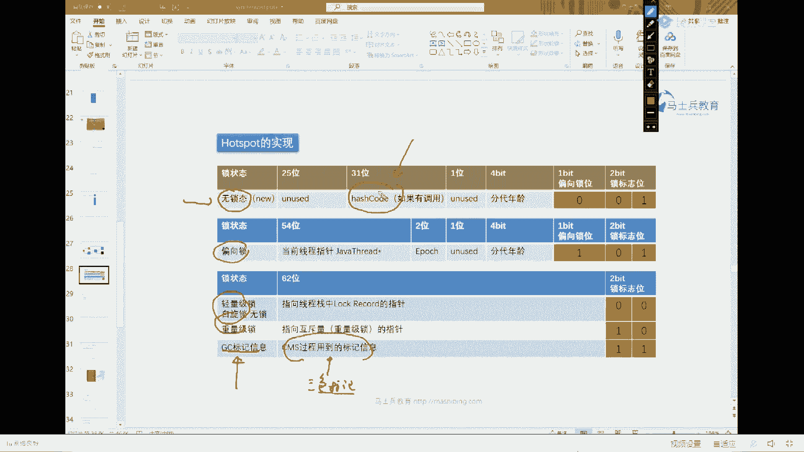

# 系列 2：P19：马士兵老师面试题：4.对象头具体包括什么？ - Java视频学堂 - BV1Hy4y1t7Bo

pointer，这个比较简单，所以人家问你说。

对象头者具体包括什么，你要说出来两部分，第一部分叫迈克尔，第二部分叫class pointer，class pointer，指向某个类的指针，你的对象是属于哪个类，就指向哪个类的指针。

重点是在这mark word，这个呢是面试的重灾区，mark word本身。

如果你要想要是透彻讲的就没完了，我大概给你看一眼mark word就行了。

好吧，在mark word内部呢，它是怎么构成的，mark word内部是这样来构成的，它大概包括三种信息，跟我说，大概包括三种信息，第一种信息是关于锁的信息，你会看到它属于哪种锁的状态。

是无锁还是偏向锁还是自旋锁还是重量级锁，第二部分叫dc的信息，dc信息是这个对象是不是正在被回收，回收的过程，由于要用到三色标记算法，所以这个对象是处于那种颜色过程之中。

在这里记录着你的对象是属于哪个哪个颜色，白色黑色还是灰色呢，在这儿记录，那好，第三部分还包括这个叫还是code。

听我说这个东西呢就比较细致了，我慢慢的给你来一个粗略的演示啊，升级过程呢我就今天在这就不多说了。

升级过程讲两小时，应该是讲讲讲讲差不多两小时，在差不多我呢嗯在这儿主要给你稍微简单演示一下呢，他的这个mark word里面呢主要记录了一些什么样的信息好看。

这里t小t等于6t我们主要看它的mark word部分，在最开始我们就出来这个对象的时候，你会发现这个对象mark word呢很简单呃，只有一个字节是001是吧，后面的所有的字节全是零。

这就是一个很普通很普通的对象，刚刚弄出来的状态啊，刚才我说过里边还包括什么内容来着，实际上是包括这个内容叫还是只要你调用过一次，它的还是code，ok这个hash code的信息记录在那。

记录在他的mark word里面，记录在他的脑袋上，我们调一下，然后重新的，重新的我们再输出他一下来做对比，你就看出来了，好接着看，好我们做对比，我们主要看mark word部分。

这是最开始new出来的状态，好下面是我们调完了还是code的状态，我讲到这儿，你是不是能看懂了，还是go的信息记录在哪，是记录在这里，来这块能get到的，给老师扣个一。

所以第一mark word里面记录了什么，还是co记住在这儿有什么好处啊，还是code计算一次之后，下次再用这个还是cold是不变的，所以从脑袋上直接拿就可以了，我就不用再计算第二次哦。

除了这个信息之外，我们再做对比，做这样一个对比，synchronized的题，大家记得吗，这synchronize t是什么意思啊，哎拿t当成一把锁，把这对象成一把锁来使用，叫锁定这个t对象。

我把它锁完了之后再来看里面信息，当然我解锁锁，把锁解开了之后再来看里面信息，我们做个对比好吧，一共做了三个状态的输出，第一个是我们刚刚进来的状态，第二个是上了锁的状态，第三个是所释放的状态，往下看。

好做个对比，这是刚刚尿出来的状态，长这样，这个是上完锁的状态，你发现了一个很重要的问题吧，上完锁之后，你发现ok别的地儿都没看出区别，但是mark word和原来不一样，所以锁的信息记录在这里。

当我们知道这个锁定机之后，我们再往再来往下看诶，锁释放了之后呢，你会发现又回到了原来的状态，所以mark word记录了锁的信息，还能get到这一点呢，给老师扣个一，当然我没有办法向你演示呃。

gc回收的信息啊，gc回收信息是他内部使用的一个三色标记算法，这算法呢也经常被被人问到呃，我在vip课里头专门给大家讲了这个三色标记算法。

在这个这个这个今天内容太多，我就在这就不展开了。

当你理解了这件事之后，所以我们再来看这个问题，你是不是就会就会答了哎，对象头者，包括什么呢，对应斗者包括的是两部分，一部分叫mark word，第二部分叫class pointer。

class pointer，指向new出来这个对象的那个具体的类，mark word里面装了三部分内容，第一部分内容叫锁信息，第二部分叫还是cod，第三部分叫gc的信息，ok所以第一题第三题。

第四题搞定，第一题还没有搞定啊，主要是第三题，第四题和第七个题，三四期我们搞定了。

我能不挨牌讲，我主要讲难易难易。

这个资料，这个这个这个按难易程度来讲比较容易的，我放在最前面讲，前面这节课呢虽然听上去有同学没听过，可能觉得稍微新鲜点，但是你只要听过一遍之后，你会知道这些都是死东西，大不了我还没过，那好。

