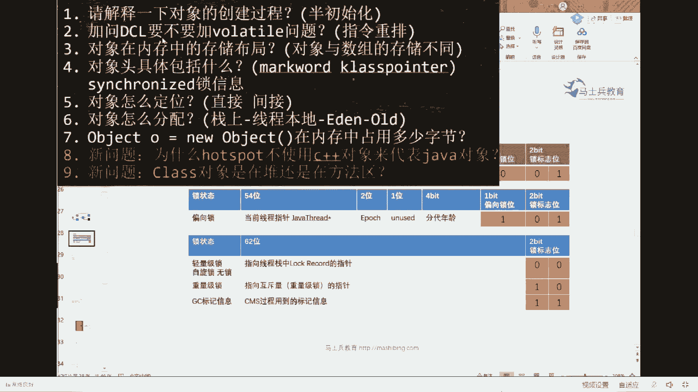
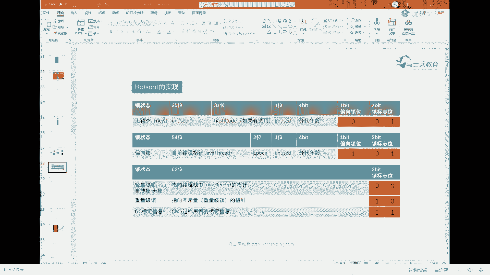
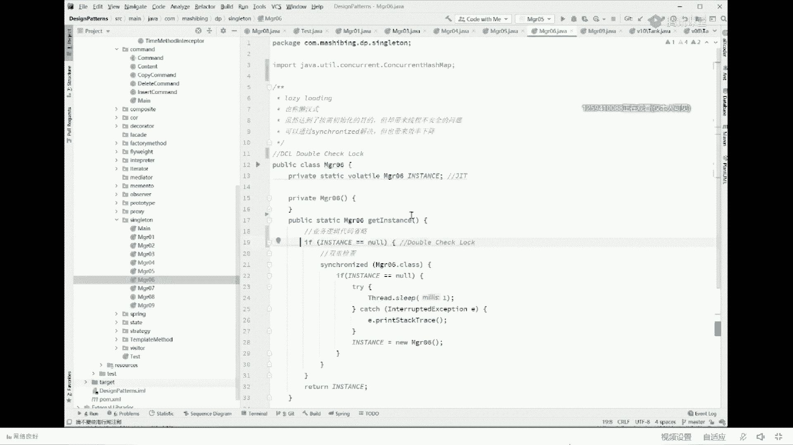
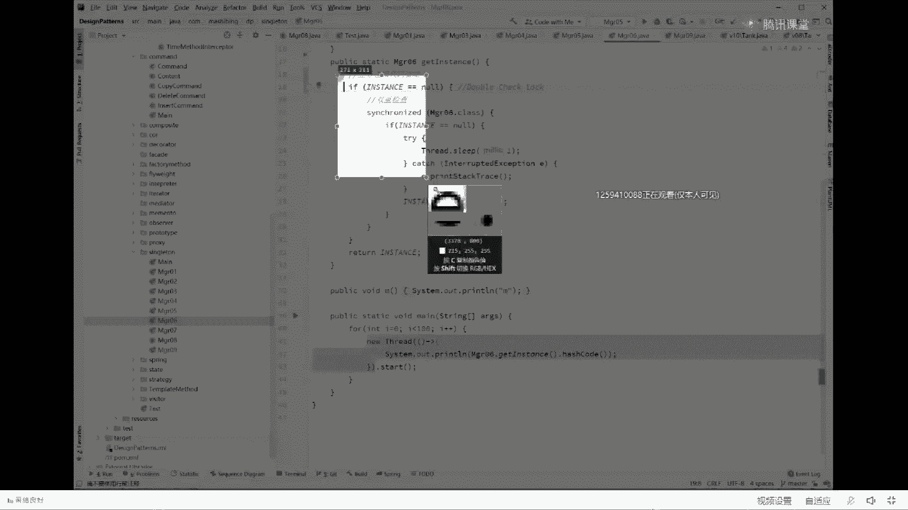
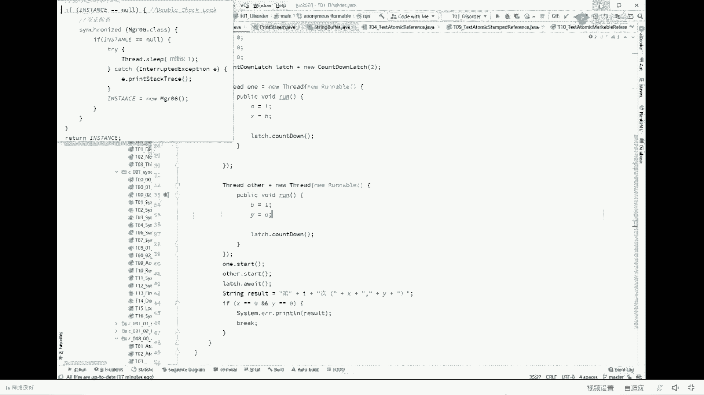

# 系列 2：P23：马士兵老师面试题：8 (1) - Java视频学堂 - BV1Hy4y1t7Bo

按初始化，首先new对象的时候三步构成，第一步new复默认值，第二步构造方法复出是指第三步建立关联，能真正的new一个对象出来，第二个我们来聊聊cpu会乱序执行的问题，只有在这两个问题你了解的前提之下。

我们才能够聊清楚dc l要不要加vt问题。

这部分问题主要是要指令重排序。

听我说，我都后悔给你讲这道题，每次讲这道题得分卖费半天劲，为什么呢，因为很多人eco不懂，还有一部分人volatile不懂，好我们今天聊dc l，先聊dc l，聊dcl是什么东东呢，dc的全称叫。

double check lock，他怎么来的，我一会讲给你听，叫双重检查锁，叫double check lock，这是一种在开源软件里头经常使用的编程的小手段，编程的手段，为了让你理解这一点。

我们用什么东西来举例呢，那这个，认为讲的设计模式的问题，那其中一个比较简单的设计模式就叫单利好，单例是什么意思，保证某一个类的他的对象只能有一个，不可以再new第二个，所以最简单的实现方式是我二话不说。

我先new一个出来，我把构造方法给设成private，不允许别人扭，谁要用我这个自己弄出来对象的时候，调过这个get instance方法，ok这个就可以保证单例，如果你是一个wifly，必须保证单例。

如果你是一个girlfriend或者boyfriend，无所谓，你有多少个随你只是道德问题，不牵扯到不牵扯到规则和犯罪的问题，总而言之，在某些特定情况下，我们需要单例类的存在。

ok单例的最简单实现就是这么写来可以继续的给老师扣个一，就是说你调的i get instant方法，你调多少次，由于它返回的全是这个对象，所以他就是单利比较简单，但是这种单位的写法会有人挑毛病。

为什么又会有人挑毛病，说他会说我还没有用到我的wife呢，你二话不说，先给我new一个，后面我想换怎么办，能不能等我用到get instance的时候，你再把它给我弄出来，不要上来，二话不说，先扭。

我还没用着呢，你先new占了空间了，占了资源了，所以等我用到再牛，这时候怎么写，换一种写法，就是我们上来先定义，但是我们不new，什么时候new啊，等我调用get instance方法的时候。

判断你是不懂空，如果这个对象还没有被救出来，我再把你弄出来，如果弄出来了，我直接用就可以了，ok这个就是单利的懒汉式的写法，上来先不定是吧，嗯那当然这种想法有巨大的问题，什么问题，我相信你应该也知道。

当多线程来访问的时候，第一个线程判断等空暂停，第二线程判断等空继续执行new一个对象，第一个县城继续执行，又new了一个对象，所以这种情况下，多线程访问不能保证数据的一致性，来这会儿能听明白的。

给老师扣个一，为了为了向大家嗯，让大家能够更快的了解这个问题，所以我中间加了个sleep，本身没有不需要sleep，高并发的情况下，他一定会产生这种问题，所以我100个线程。

我内容来看它的hash code一致不一致，如果一样的话，那就说明是同一个对象，如果不是不一样的话，说明就不同的对象好，我弄出来之后你会发现呢，你看啊664144的，32的等等一大堆。

所以这里头是保证不了多线程访问的数据制性，当你保保障不了这件事之后，那大腿想想加synchronized，关键字很简单，single的意思就是当我要执行整个方法的时候，只允许一个线程执行一个线程。

执行完另外一个线程才可以执行，这线程执行完了另外一个线程才可以听懂了吗，我这线程执行完了，你不保证这里都存在了，你放心，另外一个线程开始的时候发现等于空存在了，不等空了，已经放心，一定直接拿来用。

所以这个是可以的，这是没问题的，不演示了，我讲的速度相对快，扣一有问题直接提，相对简单，我们加加速嘛，但是这个东西我们通过精益求精，追求完美的状态来说，这个东西呢还不够。

为什么我整个方法的代码很可能是放在业务逻辑里头会非常的多，前面一堆业务逻辑，我从某个地方读一个数据出来，我需要上锁吗，需要让多个线程只能有一个线程执行这段代码吗，不需要，我只需要让单个线程啊。

多个线程序就是序列化执行这段代码就可以了，也就是说给这段代码，简单说给这段代码上锁就可以了，前面代码没必要上锁，那我这时候怎么办呢，我呢就把锁的力度放得细一些，我不在整个方法上上锁，我在哪儿放上锁呢。

我把放过那段业务代码啊，放过那个时态，接下来呢我们只是在我们的需要上锁的地方来上锁，所以if instance等空，然后再上锁，你等空我再上锁吗，上完锁扭出来，如果不等空就能用啊，告诉我在这种情况下。

我们能不能解决数据一致性的问题，可以吗，合理你会发现啊不对，还是不同的对象，664510971461大堆是吧，为什么特简单，我问一下，第一个线程来了，判断等空没问题，暂停，第二线程来了，判断a依然为空。

没问题，第二线程执行执行上锁一个对象，释放所范围好，第二个线程执行完了，下面我们来看第一个线程好，第一个线程申请上锁可以吗，可以为什么，第二个线程已经把锁给释放了呀，我当然上锁成功，既然上锁成功。

我就又new了一个对象，所以解决不了多线程一句话的问题，当你理解了这件事之后，你会发现这个写法是不行的，那怎么办呢，办法是这样来做。

仔细看办法这样来做，我把这段代码呢给复制下来。

这种代码叫dcl的写法，这个在很多很多的开源软件里头有大量的运用，我希望你记住它，作为一个专业的程序员来说，有一些优秀的代码的写法，应该记住这种写法是这样的，首先判断等空，然后我上锁。

我上锁之后再判断一遍，你是不是依然为空，如果你依然为空，说明我在上锁的过程中没有被其他人，已经把这个对象给弄出来了，已经我们再来回顾整个过程啊，第一个线程来了，判断等空暂停，第二线程来了。

判断等空继续执行六出对象来好，第一个线程继续运行上锁，但是由于第二个线程已经执行完了，所以呢第一个线程里面这个instance它已经不为空了，所以在这种情况下呢，我再判断一遍，你是不是依然为空。

如果已经不为空了，我就不new你直接拿来用了，这样就能保障整个的数据的一致性，这样呢我们整个技能保障了锁的力度比较小，又能保障我整个数据的一致性，这就叫做double check lock。

为什么叫double check lock，你看这里检查一次，这里检查一次，两次检查中间加了一把锁，o检查一次检查一次，中间加了一把锁，所以叫double jack log，来给我记住的老师扣个一。

这叫著名的写法叫double check lock，关于double check log，最常见的会被问到的问题是这句话是说这句话我能不能去掉它，当然可以，你放心，你去掉他之后，我上来二话不说，先上锁。

上锁之后再判断，放心，一定可以，完全没问题的，但是这句话一般来说要存在，为什么，因为你琢磨一下，如果有1万个线程，我们按照现在的写法，只要有一个线程定出来，其他9999个线程上来只执行完这一句话。

判断已经不为空了，我就不用再上锁去竞争了，但是如果去掉这句话，如果去掉这句话，这1万个县城所有人上来二话不说，先抢一把锁才可以才能执行，效率是不是太低了太低了，理解了这件事情之后呢。

诶你就会发现这个写法还是很经典的啊，请你记住它，但是人家问的问题是啥呢，人家美团就认为你就应该知道，我说dc l你就应该知道是个啥东西，都不用我解释才对好，我已经给你解释半天了，但人家的问题还没完。

人家的问题是excel这种写法到底有没有问题，怎么解决这个问题，放心一定有问题。

不然他就不会问了，仔细看仔细看，这个写法是有问题的，听我说，这个写法的问题是在这里，我我把代码放在这儿，方便对照看这段代码，假如说啊我们现在来了第一个线程，一个线程上来判断instance等空。

一个线程没错，instance确实为空，所以一个线程上锁判断依然等空，开始new对象了，仔细听认真听，当我们一个线程开始new对象之后，还记得吗，new一个对象由三部构成。

第一步有对象的时候扭出来一半儿，然后给它设成一个默认的零，第二步调研过的方法，给它设成八，第三步建立关联，假如我们刚刚溜了一半，刚刚的仅仅用了一半，正在这个时候发生了指令重排序，刚才我不是说过了吗。

cpu内部执行是可以，指令是可以重排重排序的，对不对，语句都可以重排，你内部的指令绝对可以重排，放心吧，所以发生了指令的重排序，指令重排序会产生什么后果，仔细看是这两句话发生了指令重排。

这两句话指令重排的是什么东西，是先建立了关联，能听懂吗，s多不就建立关联吗，正好执行到这里的时候，还没有执行到构造方法的时候，第二个县城来了，第二个线程来，是不是，首先判断哥们儿，你是不是依然等空啊。

对不对，首先判断这个对不对，他会首先，他会首先执行这句话，对不对，哥们儿，你是不是依然等空，但是你注意啊，我执行到第一个线程，执行到这里了，已经执行到这儿了，t还等空吗，我问你t是不为空，当然不为空。

人家已经指向一个对象了，他为什么能空，只不过这个对象是一个初始化了一半的对象，只是初始化了一半，刚刚生成了左半边儿，还没有完全构成一个整个的对象，ok既然你不为空，我第二个对线程来说。

我是不是就直接拿来用了，你不为空，我还不能来用，我还什么中间上锁什么这些全部用执行了，第二个线程就用到了一个初始化了一半的对象，这个里面记录着我双11订单一百万单啊，不好意思，另外一个线程一读为零。

故太好了，帅当然一般不可能出现啊，大家能意识到这个代码的问题了吗，再看一遍，由于这个代码的写法，第一个线程来判断等空上锁new对象，new到了一半发生指令重排序，重排序只执行了建立关联的指令之后。

第二个线程来打断判断t已经不等空了，使用，ok美团一般为什么后天啊，后天咱们现场的招聘会呢是由美团的老师过来，可以现场跟他交流，呃我讲课呢运用了大量的动画，只是为了加强你的印象，我这个东西有语言说。

你肯定是搞不清楚的，我是用动画给你演示，是不是就理解了，所以必须要加volt，volatile是什么东西呢，volatile两大作用，第一个保障可见性，第二个禁止重排序，纯白去给你禁了。

