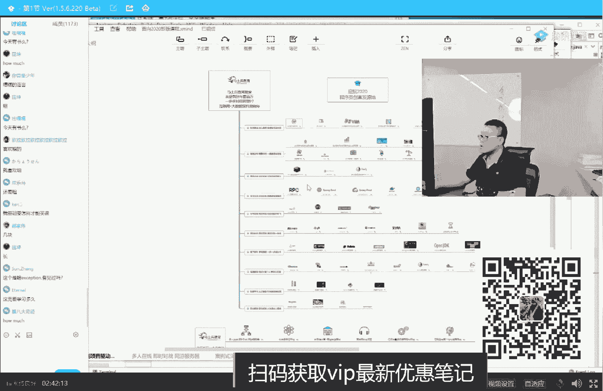
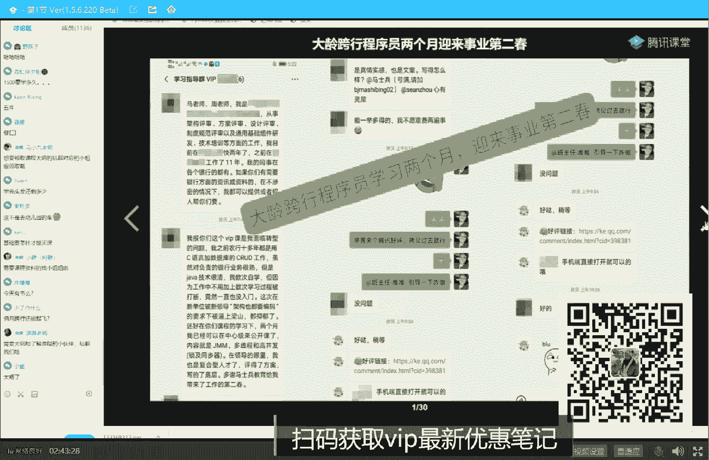
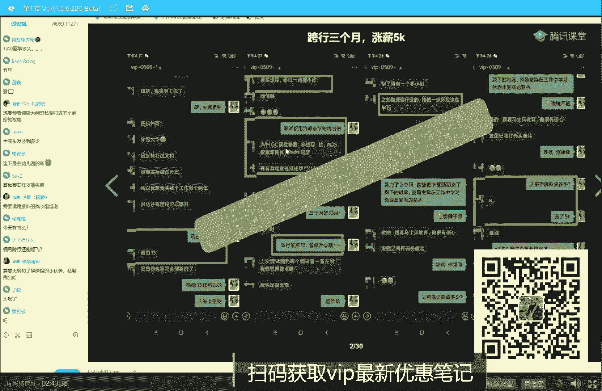
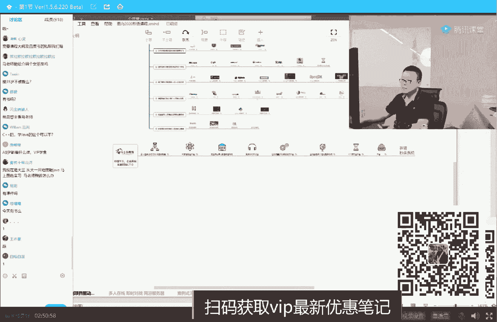
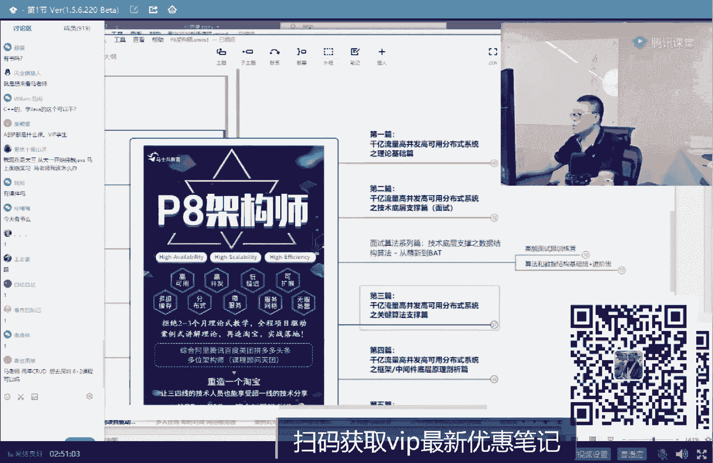
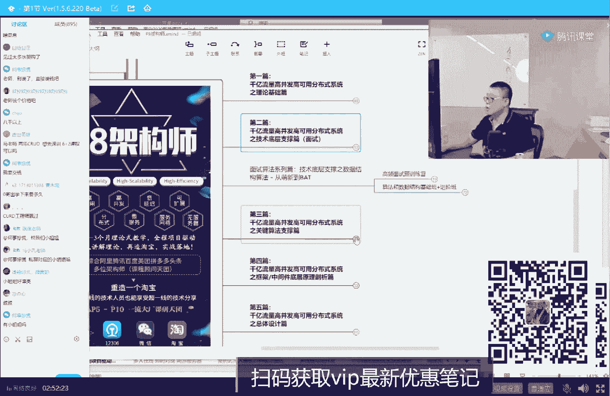
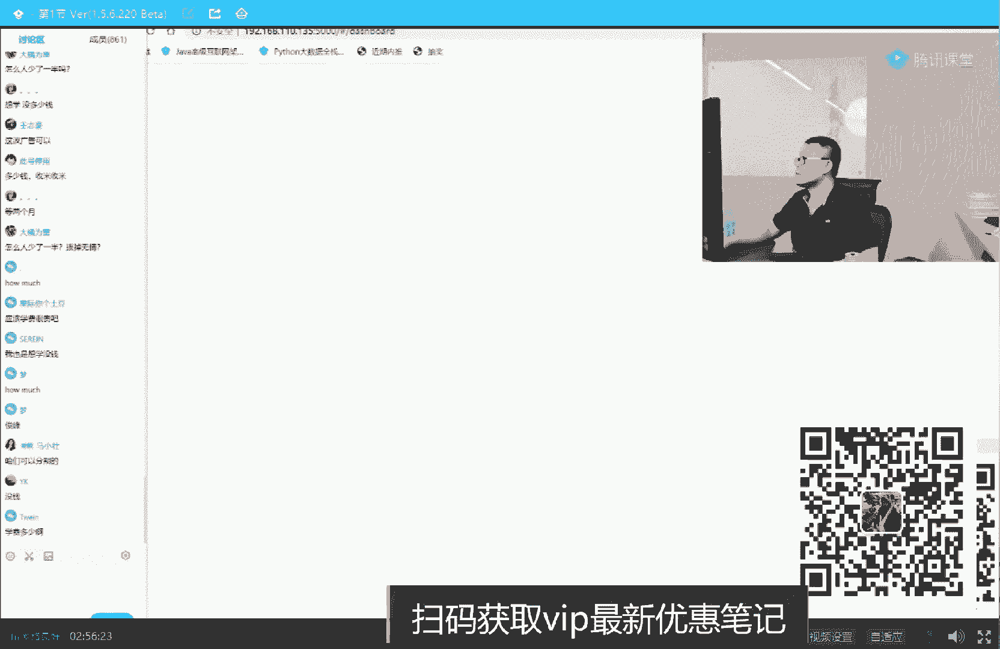
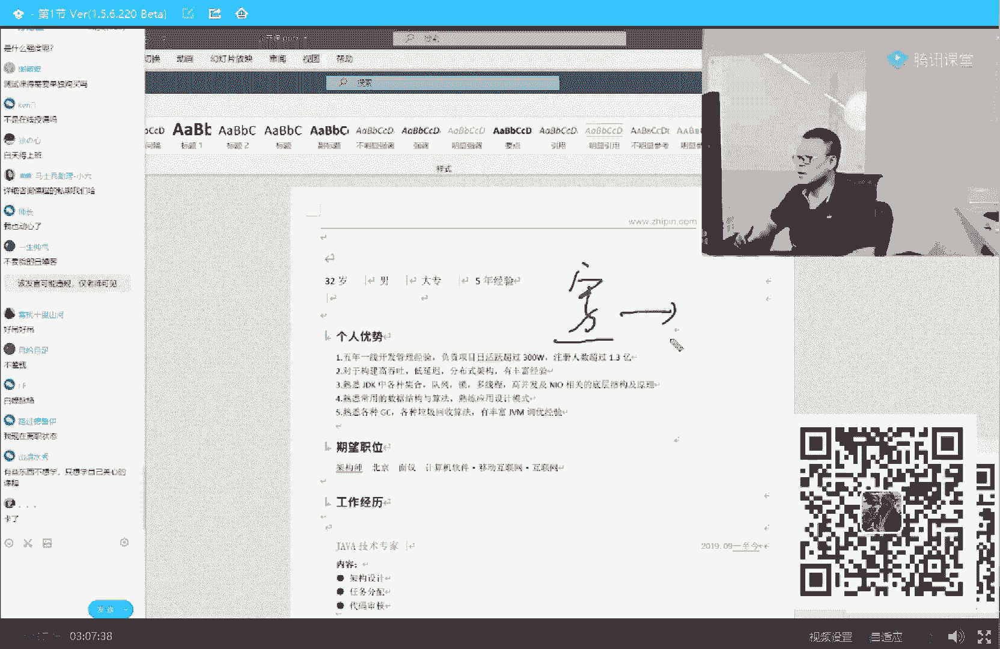

# 系列 2：P28：马士兵老师多线程：5.自旋锁何时升级重量级锁 - Java视频学堂 - BV1Hy4y1t7Bo

好了，这大概一个升级过程，有同学说老师这个东西能看出来吗，大哥绝对可以，当然如果让你从代码上看出来，得需要给你补充一个知识，这个这个类库呢叫j o l，请大家记住它很好用。

那个叫jl叫做java object，layout，知道吧，对象布局好，认真听我讲，这也是一道面试题，今天讲的面试题的概念就是特别密集啊，看这里，作为刚刚new出来的一个对象，它由四部分构成。

第一部分叫mark word，第二部分叫class pointer，第三部分叫instance data，第四部分叫pein，感觉讲的挺慢的，正式可以这么慢吧，正式课比这快多了。

因为正式课我都会先给你打好基础，直接给你讲了，公开课嘛，照顾还是那句话啊，照顾水平稍差的同学，大家每个人呢都是站在自己的屁股上来考虑问题的，考虑问题的，从来都只考虑自己的，对不对。

其实呢呃希望大家伙能够有一个站在对方角度，考虑问题的这么一种思维，当你建立了这种思维之后，你的人际关系就会慢慢变好，你的人脉关系也会慢慢变好，你将来的发展，现在没有那种说单兵单兵作战就全部就能完成了。

没有好吧，看这里，一般来说当你有出一个对象来的时候，它由四部分构成，还有同学说老师这四部分我能看到吗，完全可以，这四部分呢你可以用goool这个类库来看到，我给大家演示一下，大家看这里啊。

我new了一个object出来，object o等于new object system out blog，打印打印什么呢，我使用了一个类叫class layout，pause instance。

解析一个对象的布局，把它转成可以打印的类型，然后把它打印出来，就这么简单，我们来看看一个对象，就像这个new object刚刚new出来的时候，new完了之后，它到底是一个什么样的效果。

里边这个内容到底是个什么东东，这块呢稍微有点基础知识啊，我们一点点看，注意看，这是刚刚尿出来的这个对象的大小，16个字节，看到了吗，也就是说你new了一个空对象，里面没有任何任何成员变量的时候。

16个字节，这是美团那一道面试题，他说当你new一个object的时候，占多少个字节，16个，这什么鬼，这个慢慢听嘛，别着急，这是二进制，就是你new一个对象，new出来是不是扭到内存里了，对不对。

内存里分配了一块空间，装了你这个对象好，你这个对象内部是怎么布局的，就显示出来了，压缩后可以12个，你不要跟这扯淡，你给我压一个，让我看看，好了同学们，我们可以继续了吗，消消气儿，没气儿，我就喜欢怼人。

怼人有一种乐趣，大家看这里啊，前面的八个字节，这四个这四个加起来好，这部分呢叫mark word，听我说这个词儿你给我记住就行了，mark word，有同学说老师我记不住莫及，作为老师这么体贴的男人。

你猜怎么着，当然我给你的这个理念呢就全都有啊，mark word，ok放心啊，里面全有market，里面word里面装的什么，里边全写了，所以你记不住也没关系，好吧好，大家看这里，总而言之。

前面八个字节是mark word，后面四个字节是什么呢，这四个字节就是这部分，这四个字节呢是class pointer，就是new出来的这个对象啊，是属于哪个类的，你可以认为它是一个指针，它指向谁呢。

指向object，第二class，你又出一个object吗，它属于哪个类的呀，object class class，page，好，后面部分如果你有成员变量，里面装的就是成员变量。

如果没有成员变量给你对齐，对齐是什么意思呀，对齐的意思，如果你不能被八整除，给你变成被八整除，比如说咱们前面三个加起来是多少个字节，12个字节能被八整除吗，不能再加四个，变成被八整除。

也是后面四个是补出来的，关于对齐这个概念需要我解释吗，需要我解释的，给老师扣二，凡是q2 的计算机的底层的知识应该是一点都不了解的，没有关系啊，听我说形象来理解，就是你可以想象一下装一个货物的时候。

袜子电脑一堆，我们装的时候如果是散装，它实际上效率并不高，我们要往船上运的时候，往往是采用集装箱的方式，即便是你这堆货物不满意，集装箱没关系，也会还能给你一个一整个的箱子往上撞，所以这个叫对齐。

为了提高效率的，当然讲到这儿，以前有同学跟我抬杠说，老师你不是跟这扯淡，你你你你本来是二个字节，你干嘛非得往后补四个字节，你去掉四个字节不行吗，他也是八个字节呀，也能被八字节整除啊，多好大哥。

您这个思路我我我我我我算是非常的佩服，不是您您您您老买张床是吧啊，结果往往上一躺发现你诶腿出来了，人别人说都是把这个床加长，您老人家的思路是把腿给砍折了，牛逼，天才啊，开个玩笑啊，哈哈哈好。

这是对齐的概念啊，好我们这我们今天讲的并不是这个，我们主要是讲这个就是mark word这块，还有同学会说老师你注意看看，这里跑一下，重新跑一下啊，所谓的所升级在哪里进行观察呢，注意看。

当我们刚刚new出这个对象来的时候，这里面，这里面呢是它的那个mark word的内容，在这里，感觉，感觉上是没有初始化的过程啊，稍微等一下啊，我把这个清理一下，跑一下，好大家看这里。

这是我们刚刚new出来的一个崭新的对象，这是那个崭新对象，mark word的内容，看到了吧，就这部分内容，那，下面我们来观察一下，如果给这个对象上把锁，注意看啊。

这个对象上把锁的意思就是synchronized的o吗，不就是给这个对象上锁吗，那我上完锁之后，里边会产生一些什么样的变化呢，我们来比较一下，跑一下，为什么每次都让我清理一遍呢，奇怪，版本的问题吗。

哦我知道了，我看这里啊，重新跑一遍，今天最后一个知识点了啊，大家坚持住坚持住好看，这里这就是刚刚new出一个对象来的时候，内存里面的情况，这是给这个对象上完锁之后的内存的情况，同学们。

你们猜猜看这部分内容是个啥，版本号，所信息，所以所谓给一个对象上锁，你发现了没有，就是修改一个对象的mark word，就是把自己的id号贴到这个mark word上好了，就是这个概念。

还有同学说老师我能观察到这个所升级的概念吗，完全可以，但是你这个时候得认真地观察，这里面的每一位代表的是什么意思，这个的话呢，今天实在是内容太多了，今天应该是搞不定了好吧，关于所能内容还非常非常的多。

代播广告是吗，明天继续，明天继续啊，来一波广告打广告吧，老师为什么你们这么喜欢听广告，来游戏有想听广告的没，老师扣一，好吧，为什么喜欢听广告，好吧，介绍一下我们课程吧。

今天讲的课程呢是那个呃这里面的一部分啊，首先大概就是我们课程，我们课程是m个知识点，m个知识点，单个项目构成，上面这里的每一个都是一个知识点，下面这里的每一个都是一个项目，项目驱动式的知识点。

学习这样的一个方式，我今天讲的内容是多线程高并发的，其中的一部分就是关于锁的，这就是synchronize这部这部分通过方法非通方法所升级的，这个过程大概是给大家讲的这部分呃，这是去年的一版。

我今年的讲新版新版的内容呢是从底层开始讲，就是还是有同学因为因为因为有同学理解所的时候，理解不够透彻的原因是因为它底层的知识不足，他不是说那个理解能力不行啊，呃不知道今天讲的怎么样。

今天是也第一次使用量的方式，从底层开始慢慢给大家抠，呃，这块大家觉得还可以吗，有收获的同学给老师扣个一吧，好不好，ok ok呃不一定满足每个人的口味，但是我觉得呢大多数同学应该是有些收获的。

嗯关于所升机的详细过程呢，我们vip课里的专门有讲啊，呃今天我就不带大家一分析了，那个还是挺复杂的，呃我呢也都给大家记录在了我们的笔记里，这个笔记的话呢，明天我稍微做修改啊，我里边有些东西呢。

我以为做更新了吗，会有些修改，修改完之后呢，是可以发到大家的，ok，这块呢是，整个这个课程中的知识点的一小部分了，这课呢比较复杂啊，内容也比较庞大，我先简单给大家介绍一下我们的课。

我们课呢大概是有1500个课时左右呃，有同学说老师我不理解你是什么概念，这么跟你说，大多数的你在同学的同学可能看到的课，200个到300个课时是这样一个体量，我们这个课是这样一个体量，好吧。

这有一个对比，大概是他们的七位吧，价格上的话呢远远到不了他们的七倍啊，一倍多啊，111倍一点点，总而言我有同学可能会觉得奇怪，说老师你们为什么讲这么多课时，因为很简单，我要讲给你讲的细和深。

又细又深又长，只有长才可以好吧，给你讲细了，讲深了，只有把课时变长才可以，就是基本上是不惜成本吧，来给大家讲这件事，讲完之后呢，比如说有同学说老师学完你们这课到底有什么效果吗。

其实详细内容我先不给你解释啊。

我们看效果，我最喜欢看效果嗯，因为每天我基本上都能收到我们学员学完我们课程之后的，一个很好的效果，每天最希望收到的就是这样的消息，这个是我们大龄的跨行的一个成员，学了两个月，迎来世界第二春，老师周老师。

我是什么什么我就不说了啊，同事叫过评审方案评审设计评审快2年了，工作11年银行的都有，都是使用c语言加数据库的，c r u d java很渣，数次自学都被打断，然后新来的领导说架构也要编码，完蛋了。

编编不了怎么办，快抑郁了，课程的学习两个月，已经可以在中心级来讲公开课了，内容就是gmm同线程高并发锁和同步器，在领导眼里，我就是复合型人才，给大家带来了第二春是吧，我就要求大家能不能帮我做一个好评。

他给做了一个啊。

多谢他这个呢是跨行三个月涨薪5k呃，看完课程面试一点都不虚，g m g c调参数。

多线程锁a q s数据库调优redis，杀进美团涨了13万，现在美团给的最高的薪资40x15。5，62的年薪比我现在的35x14 49多了13万，他还不是特别满意，还想再试一下什么蚂蚁阿里。

我个人的对他的建议，先把美团的offer接下来，接下来之后再慢慢的来进一步的找更好的更好的地儿是吧，学了一个半月，拿到了七个offer，涨薪5k6 哥，我知道你会拿我打广告，我再给你点细节。

学习时间不到三个月，也就一个半月多，另外不止两个offer，全算上的话，应该是七个offer，大家体会到我们课程的牛逼之处了吗，这课程有好的时候呢，我给你解释半天，里边讲什么讲什么，讲什么，真心不重要。

我们课程的最重要的特点就是你呢带着脑子来就行，老师让你学啥，你学啥，老师让你干啥，你干啥好，剩下的所有的一切交给我们，考研失败后学习，疫情期间搞定三个月，两个半月京东美团的offer涨了78k。

算法学习，京东离职入职腾讯大厂里头，京东给的薪水是最低的，腾讯给的比京东高很多，原来19 三变成31年啊，1年雅信博斯的offer不知道怎么选，连易容复为重offer不知道怎么选，反正算上都快40万了。

大厂谈薪水啊，开始谈薪水了，一个多月涨薪6k离职，一个月入之后涨薪4k23 岁三个月入职滴滴，涨了11k这哥们儿就23岁，原来就是就就14k直接干到dd 25仨月没好好学。

仨月涨薪8k我都没好好学是吧好呃，也有很高的了嗯，这是入职阿里p7 的股票，也有了民营专科，干了两个月，两周拿了五个offer，半个月年薪涨5万，一个月入职滴滴。

入职平安，薪水翻了一倍，30岁干到腾讯60万年薪，好了呃，如果大家需要想了解这个每一个的细节来敲这个，自己去看这里的所有的聊天记录，所有的人没有一个不支持被调的。

所以有的时候呢我也懒得跟大家解释课程到底里边讲些什么呀，升什么级啊，这个比较比较麻烦一些，我就直接给你看效果就行了，我再稍微给大家聊一聊这个课程的内容，好我刚才说了啊，课程的时长比较长，内容比较多。

m个知识点加n个项目，关于项目关于知识点都非常多，好那现在问题是1500个学时，人家200个到300个都得学好长时间，1500个学时，我怎么学才能学得完，来有这样的疑问的同学给老师扣个一说。

我到底怎么样学习才能学习这些内容特别多的东西，认真听我讲，这是我们的核心，我们核心是这样的，那个对每个学员进行一对一定制，什么叫定制，好好听我讲，我就根据你个人的一个诉求，根据你个人的一个水平。

根据你个人的一个基础的掌握程度好，我来帮你设计学习路线，我给你举个最简单例子，比如说如果你是应届生，或者说你是大学生吧，你想进大厂实习，对不对，研一的有有好些，研一报我们科的，大二报我们科的。

他就特别想去大厂实习，很简单，7+1+1帮你搞定，我就帮你设计好这个路线，你沿着路线走就行了，你只要带着人来，我告诉你学啥，你学啥，剩下的全交给老师，你说简历怎么写，面试怎么面，所有的剩下的全交给老师。

我要求你学啥，你学啥就行了，你说社招生社招想进大厂怎么玩，6+2搞定，你说我想进头条这一类的，对算法特别看重的左老师的算法课搞定，你说我没有跳槽的压力，我也不想涨薪，我就想全系全方位提升p8 课程。

带着你所有的知识点一代多搞定，你说大哥，我零基础什么都听不懂，刚才这节课课我全都没听懂，从a课程到p课程一条路线帮你搞定，我觉得我们最牛逼的一点是在这儿学习的任何学生，第一没有一个人后悔。

第二没有任何一个人说不长心的，说我不涨薪水或者搞不定工作，放心这儿没有没有任何一个没有啊，呃这也是可以向大家推荐我们课程的原因好吧，是真的吗，马老师真的，老师对你我所说的话，任何一句话都负责放心啊。

这是我们课程的整个内容，当然如果要详细给你解释内容的话，应该比较多，大家伙啊，就可以像这些个课程的这种呃详细的内容里边打开来，每一个都都都都是什么意思，什么都呃什么意思，每一个项目的白皮书。

项目最终的落地板都有最重要的是什么呢，其实最重要的呢还有一点叫做升级，很多同学可能不理解升级什么概念，就是我们基本上年年升级，所以你最简单的例子，像网约车从传统那个去写c语言的这种。

c这个c r u d转向互联网的这样一个项目，我们已经升级到第三版了，好天天有升级，年底升级，那么有同学可能就会说了，说我升级能升成什么样呢，我想给你看看今年的升级，你们还能还能跟得上广告吗。

今天有书吗，今天已经抽完了，明天有，明天有，其实老师的广告全是干货，你往这看就知道了。

今年我们升级了是p8 架构师。

这个就是报完课，这个课也是可以给到你的，这一课叫做p8 架构师，注意这里升级的是架构师，我不知道有多少同学了解过市面上的架构师，但是我直接就告诉你啊，市面上所有的架构师的课程，我们这里全报名了。

我们就想看看，别人是怎么玩了，取长补短，结果发现很令我们失望的一点是，大多数的都是ppt架构师，而且收费还特别贵，两三个月的课，然后那个，收1万~3万吧，1万多到3万。

我们设计的架构师课程跟他们最重要的区别在于落地，ok，找找叔叔也好，在于落地好，这个落地呢大概是什么意思呢，你像很多的架构师架构的一些理论知识，架构理论知识非常多啊，在这里全有呃，比如说那个cp定理。

贝斯定理一直到密等到高可用高高扩展该怎么做呃，到什么那个底层的技术到那个算法到呃。

泰克索斯z a b这种分布式算法到推荐系统的这种机器学习算法，这种理论呢非常多，包括这种分布式应用该怎么设计，单体到微服务架构该怎么设计，微服务到多级缓存该怎么玩。

多级缓存到超大型的这种呃系统的架构的设计，到service service man是该怎么玩，到我们的这种接入层是吧，网络接入层该怎么玩，dn相关的cd a相关的资源静态化，相关的负载均衡，相关的等等。

到index到分布式微服务，比方说那个每一层该怎么说，网网关层怎么设计架构，这个这个这个业务层怎么设计，然后那个治理层怎么设计，数据层怎么设计到那个分布式微服务的具体实现，spring cloud。

nice，spring cloud，阿里巴巴啊等等等等，就是这些理论上的东西，你放心，这里全有，除了这些理论之外，还有一些比较崭新的理论，比如service mesh怎么落地。

比如说大数据数据方面的处理该怎么处理，比如说我们人工智能就推荐系统这块我们该怎么来构建画像，来怎么给大家做推荐系统，开发这边的c i c d该怎么进行保障测试，这方面该怎么样进行分布式的测试。

自动化的测试，性能方面的测试，而运维这方面要怎么进行服务性的保障，好整体性的理论，放心，这里全有，但是最重要的最重要的一点并不是理论，最重要的一点在这儿，你知道吗，最重要的一点是我们通过一个项目。

这个项目叫再造淘宝，我们做这个在淘宝并不是一个简单的商城项目，而是完完全全的支持千万级并发的超高大数据量的人工智能，进行推推荐系统的这样一个落地的项目，而进行这个落地的时候，我告诉你其实是挺难的。

挺不容易的，我会给你从那个最基本的服务开始搭起，怎么搭呢，打分布式id的生成中心，分布式锁中心，分布式配置中心，分布式事务集群，分布式缓存，缓存服务集群，网关集群，注册中心，监控中心，mq集群。

es集群，调度中心，tended服务集群，mc的服务器群，然后在这个基础之上再进行业务逻辑的搭建，有同学说老师是用虚拟机吗，不是老师，这用的是全是给你买下来的，大概花了60万左右。

我们搭这个环境是一个真实在线的几十台服务器构成，几百个节点构成的这样的一个服务器集群，我讲到这儿呢，有同学可能就会说了，说那个老师我不知道你们有，你们有没有有没有体会过，就说一个理论的话。

如果你落不了地，那很没意思，这第一点，第二点呢，采用完全的虚拟机的这种环境，你好多个集群之间互相是怎么是怎么怎么服务的，你是根本体会不到的，这也是为什么呢。

我们真是愿意花很多的这种这种这种代价来帮大家搭这个真实环境的，原因呃，当然我讲到这儿了，应该有同学会说，老师我们能在这里大真实环境吗，我们大概买阿里云的服务，大概买了60万。

我相信没有任何一个人愿意花钱去做这件事，后来老有同学说，我们能不能干能不能干，我们就投入了一些钱来帮大家做了这么一件事儿，这件事呢得采用这种限流限流的服务了，这是最最接近最近刚做完成的。

看大家能不能接受。

我们搭建了自己的云试验平台，目前我在内网访问，当然，后面会允许大家从外网直接访问。

这是我们的大字体搭建的一个私有云的平台，如果你想在这里做实验的话，比如说你有点云资源池云主机，你就可以创建我们的云主机，现在我们自己内部的云主机运维的产品，divs的产品模板机。

debus运维开发的运维的产品，研发中心的测试机，这是我们内部的私有云平台，可以对外提供服务了，这个大概花了几10万，直接告诉你啊，你如果想做实验的话，那就在这里创建云主机就可以，我就不给你创建了。

你如果想体验一下到底什么叫私有云的东西，其实呢通过大屏的监控，你大概就能观察到整个云的运行运行情况，我不知道大家能不能体会到，就是为了做好一门课，其实这边花的心思超超级大啊，大家觉得不知道你能体会到吗。

能体会到的，能体会到老师扣个一吧，好不好，还是那句话，我觉得贵点便宜点都不太重要，最重要的是呢，你呢把你脑袋带过来，你想干嘛，想涨薪，想跳槽，想进大厂，跟我说，帮你设计好路线，按着走就成。

伴着走就会得到你想要的效果，当然你要说那种不切实际的，我会告诉你这个想法不切实际，只要是你差不多的老师都能给你找出路线来，也这是我们存在的最大的目的啊，呃课程呢其实本来想明天再跟大家聊这个课程价格呀。

打广告啊之类的，但是今天同学说想听听，我们那就打开打开看，今天呢是嗯我们一个大额的优惠，这个优惠呢是放心啊，今天应该比明天便宜，我们是一天比一天贵的，这个课去年的时候6000多块钱呃。

今天呢大概是12000多块钱，实名，今晚上十十个，抢完为止，7000的优惠券，优惠券放完就没了，六期免息，我会开始讲多线程了，报完正好跟上第五期的源码课程已经开始了，报完正好跟上go语言rust。

腾讯要求我们玻璃听懂了吗，拿走，腾讯说，你们就这么点钱给了n多的课，人家别人是20块钱，30块钱，111学时，我们是五块一学时，知道吗，我们课时量是别人的七倍，价格大概都他们的两倍不到，腾讯说。

你们赶紧把你们课给我剥离出来，剥离着麦，所以大家抓紧最后的机会，想听go rust，就这一类的存着分析的这种课来，明天就没啊，报名获得内部书籍三本三本，晚上十个数完为止，还是那句话，我觉得课程贵一点。

便宜点，1万多块钱吧，那个效果为主，就是你生病了，这个药管事知道吗，你要说仨月我让你涨，不把这钱赚回来，先退你，嗯那个周老师周老师在吗，周老师陪我跟学生聊聊天，我得那个太空一下膀胱，你岁数大了是吧。

膀胱有点顶不住了啊，学生党，学生党有免息还可以分期，这个都可以啊，大概分完一个月也就一两千块钱吧，但是你记住这一点，这个数额花的这个企业投资出来给你的是一个什么效果呢，一个崭新的升级空间。

所以大家千万别犹豫，刚刚毕业的呢，刚毕业的，我建议你看你想干嘛，想跳槽，涨薪的，来仨月让你涨上去，如果说那个你想进大厂的，我帮你规划，大概得进大厂，时间时长上稍微长一些，需要学的东西比较多一些啊。

没学历，只想在现在公司有可能吗，你们公司有空间就完全没问题，你们公司没空间，啥也别说，跳槽那个赵老师没在，明哥明明哥陪大家聊会儿啊，老师这膀胱有点顶不住了，嗯，岁数有点大，大家欢迎明哥嗨，大家好。

马老师的彭公顶不住了，我得顶一下，我顶一下马老师的风格，哈哈哈哈哈哈哈喽哈喽哈喽，大家好，我是咱们马士兵教育马老师下边的一位主讲老师叫张一鸣，在咱们这个课程里呢，我也会给大伙讲好多东西。

应该有很多同学之前听过我上课吧是吧，哎对这个张一鸣和我那还不一样，恰恰是一个口一个鸟，我这个呢是一个日一个月一日1月对吧，它是一口一个说话，这个味儿就不太对呢，感觉好像在开车，其实并没有。

然后我们嗯哪天呢在腾讯课堂呢也都会给大伙上课，也是轮着老师来的，咱们这次马老师训练营嗯，这次是两天的对吧，今天呢只是头一天，也就是第一天，明天还会再有啊，明天还有嗯，对于这个。

你看我刚才有个同学说34学java还来得及吗，其实我比你应该大两岁，讲道理说应该你是86年的，对不对，我是八四，我是八四的，我今年36，日本那年34学java，如果你是零基础的话，其实有一点困难。

岁数比较大了嘛，可能也有家庭，有这个嗯负担了时间上和精力上的，可能不像咱们年轻人那样，没有家，没有这个呃这些这些牵绊的东西对吧，但是如果你要是想做这件事的话，什么时候都来得及。

褚时健搞储城的时候就已经七八十了，另外就是迈巴赫那位老爷子，也是80多岁的时候才开始搞这个迈巴赫那个品牌才开，才刚刚开始做起来的是吧，嗯所以这个真正想要做一件事，什么时候都不晚，主要是看你究竟想不想。

如果你想的话，比如说在上学的时候，咱们同桌的你对吧，我记得我上我上小学就那样暗恋同桌的小姑娘，不敢说，但是呢心里老是心心念念的去想这件事，一旦要是有一个可以可以的这种方法提供给我的话，那种暗恋的感觉。

待会儿知道吧，有点想要为他付出一切，只要你可以对吧，那如果你要是对于这个学习来说，对于你的事业来说也有这种想法的话，只要是可以对吧，那给我提供一个方法能够成功的，那我愿意付出我的一切的努力。

嗯可以啊对吧，我们现在就有这套方法，如果你愿意的话，我们赶紧来嘛对吧，成为我们的vip当中的一员，帮你一起去追求你的梦想，追求你的同桌，追求追求你的那个你是吧啊，嗯对于贵和不贵这件事来讲啊。

每件东西呢每件事大家有事他也都是有价值的，那你吃药有便宜的，200块钱一盒的药，还有2万块钱一盒的药对吧，治治病呢要看疗效，便宜不便宜的，贵不贵的，这是另一回事，马老师已经回来了是吧，王老师回来了。

我待会儿再翻译马老师吧，刚刚聊了会儿，又走了好多人，呵呵好尴尬，能不能允许我吃个瓜啊，哈哈哈哈尴尬啊，哈哈哈哈，老师比较关注大专有戏，不看这个就行了啊，那个，这是个大专生的简历，他是32岁大专。

这个简历大概是原来的时候是35000的月薪啊，sorry不是原来的时候是25000的月薪，他新找的工作呢是35x15呃，35000月薪发15个月，9000股股票，60万~70万年薪，大专没问题啊。

放心大专有的是一个大包，有结果也可以替换一下课吗，目前不行，这个大包很大，这个大包的课，如果你在线下学是10万先上6万多，今天12000多，你如果想选一门任何一个课，可以选，没问题啊。

但是你选出来的课呢未必有这个价格，未必有这个价格，知道吗，所有课还是不分课分，这里是java的，所有课怕坚持不下来，如果你连两个月三个月都坚持不下来，你想让我说啥，大哥而且你不用坚持，你知道吗。

还是那个就是你啊，人过来，我今儿告诉你一个星期把这个给我学完，另外一个星期把这个给我学完好，四五个星期之后去面试，涨5000块钱行不行，就这么简单，就这么简单啊，太没钱了，我不我还白嫖，不要脸嗯。

那个随你啊，那个其实钱这件事赚出来的呃，我说的难听和直白一点，就是人之所以穷，他想变富，哎我还在吗，哈喽还在。

