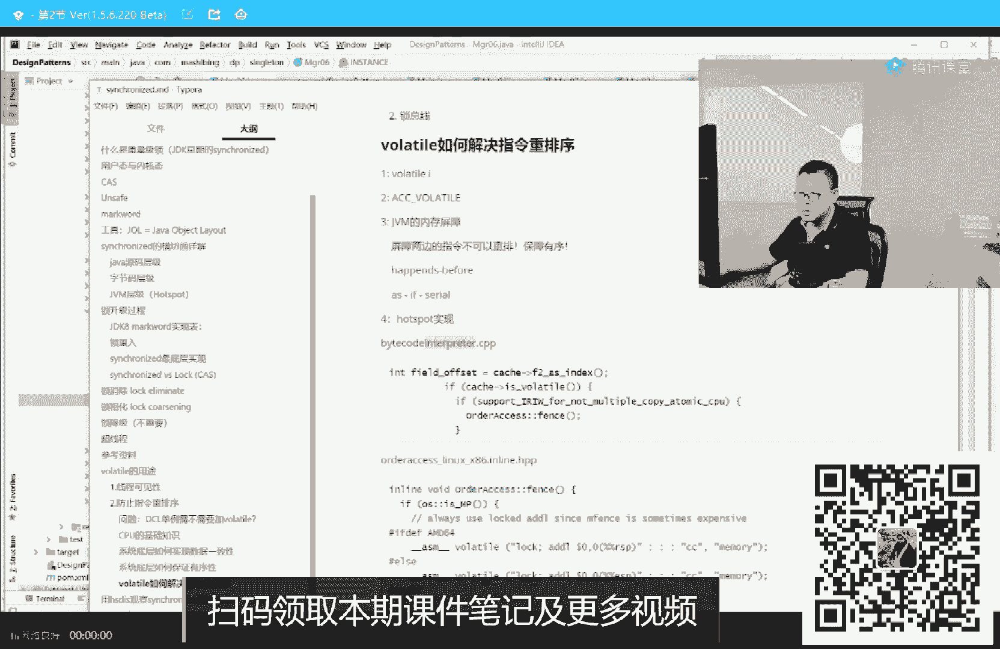
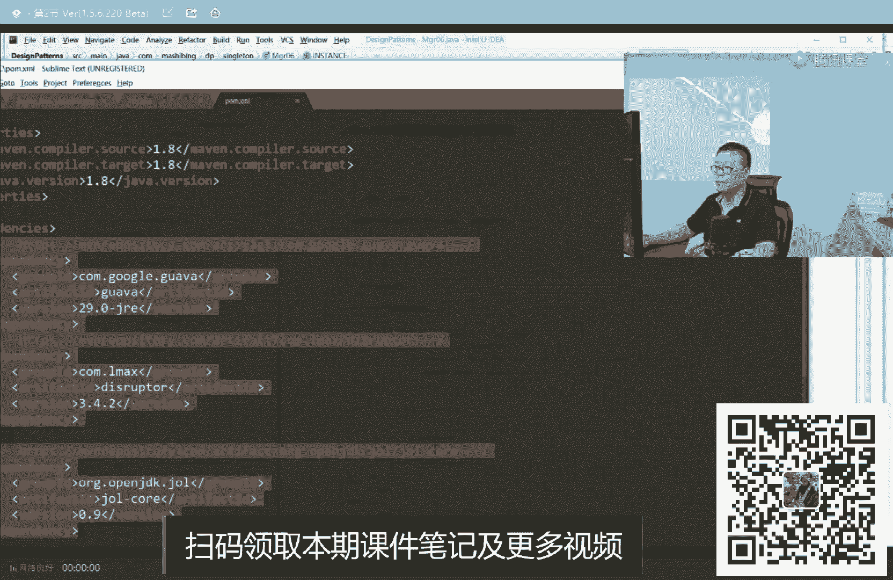
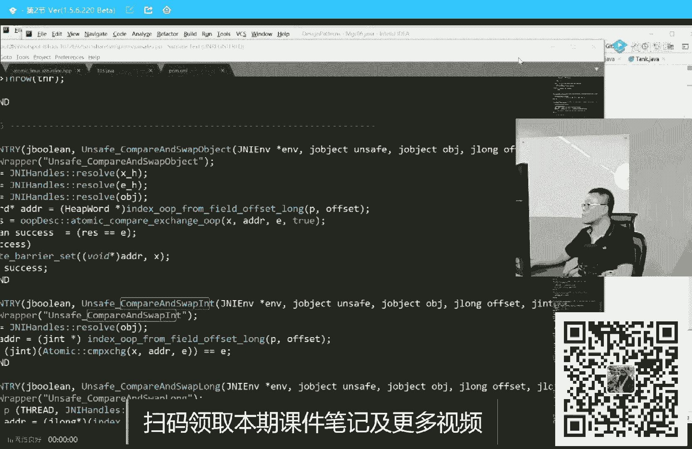

# 系列 2：P32：马士兵老师多线程：9.如何证明CPU的乱序执行？ - Java视频学堂 - BV1Hy4y1t7Bo

不不可能。即便是像阿里、淘宝、美团，像他们这样的一个并发量出现的可能性都极小。但是没办法，人家面试会问。好啦。嗯，讲到现在为止，我觉得这道题我就讲清楚了啊。呃，标题值50万。如果你面过了，这这道题。

你你要是拿出这道题来，面试官，你披露啪了，你给他说清楚了。基本面试官不太会问你底层的问题了就嗯。嗯。好。好，大家看这里。好，我们继续。那现在问题又来了。那这个volet起了什么作用呢？

为什么加了它就能解决呢？😊，认真听我讲。呃，vololatile起了这么一个作用，用volattile修饰的任何内存空间。在他上面执行的这些指令。不可以乱续。我再说一遍，叫做禁止乱序。

用voluntile修饰的这块内存空间，就是扭出来这个对象，这个对象扭出来的在它上面执行的一些指令。比如说要读要写好，不可以乱序执行。既然不可以乱续，就绝对会防止住其他的县城拿到这种半初始化对象了。

你必须得初始化完了之后才建立关联。ok。现在的问题又来了，他是怎么阻止乱序执行的呢？这就是下面我们要讲的问题，叫内存屏障。今天内容已经挺多了，大家还能跟上吗？能跟上的给老师扣1。嗯。

内存屏障呢我们就聊比较简单的概念吧，其实。我直接在这缓啊。嗯。好的，看这里。呃，我们下面来聊，就是加了呃volat之后，它是怎么阻止。那这个指指令的乱序执行的，怎么阻止的呢？其实阻止一个指令的乱序执行。

也相当于这有一条指令。呃，这有一条指令，两条指令，我不允许他换顺序，那我怎么办呀？中间给他加一个障碍物就行了。两条指令之间加一条内存屏障。这是你最平常的概念，我去。Yeah。嗯，稍等片刻啊，我这个。

椅子出了点问题哟。嗯。没事没事，是我的椅子出了点问题啊。😊，呃，我这椅子差点把我给。顺他过去。嗯，椅子没锁住啊，没事儿没事儿。Okay。嗯。嗯。老师吓人，老师又不是嗯。老师又不是大姑娘生娃娃，吓什么人？

嗯呵。好，看这里啊呃我们来聊这个内存屏障这件事儿。呃，也就是说在两条指令之间呀，我们加一个内存屏障就可以了。大家好好听啊，这个内存屏障呢有各种各样的屏障。😊，我下面跟大家聊呢，在。JVM这个级别的屏整。

是什么意思？JVM级别的屏障呢，注意JVM是个什么东东啊？JVM是一个规范规范规规规规规规范。它并不是一个具体的实现，所以他要求的这个内存屏障。好好听我讲。

这东西并不是具体的操作系统级别或者是硬件级别的实现。我再说一遍。由于JVM只是一个规范，这个规范要求volattile修饰的东西得给我实现内存屏障。但是硬件级别或者我的hospport级别。

或者我操系统级别，它到底是怎么实现的。实际上跟JVM的规定并没有直接的关系。这块大家听懂了吗？懒能跟热闹给老师扣1。我们先说JVM级别的实现，网上有很多关于讲内存屏章的内容。

很多很多他讲不清楚的一个主要的原因就是因为他们混着讲。他们会把。在JVM级别的内存屏障。和硬件级别内存屏障完全混在一起讲，这俩不是一个概念。JVM级别会内存凭证只是一个规范的要求而已。GVM级别的屏障。

大家看这里。呃，JVM级别的屏障呢大概有呃4种。这四种呢我花30秒给你讲清楚。虽然你看到过，但是你不一定能理解得了。呃，这四种我花三种给你讲清楚。

这四种屏障分别是low load store store，low store和store load。听我说load是读store是写。load load的屏障是对一块内存，上面是一个读，下面是一个读。

好，中间这个屏障叫load load上面这条指令跟下面条条指令不能换顺序。load loadstore store上面是store，下面是store，不可以换顺序。好了，我觉得我讲到这儿。

剩下的应该不用我说了，来能get到的老师扣1。很简单是吧。😊，关于嗯JVM级别，对于volatile修饰的变量，它到底要加什么样的屏障呢？他是这么来加的，这块大家不需要记住。

面试也基本上不会面到这种深度，还没遇到过。好。看这里。凡是volatile修饰的内存。当你要对这块内存进行修改的时候。在JVM级别要求前面加一个store store，后面加一个store load。

啥意思呢？你这里要要注意啊，你这里头是要对它进行写了，就是store嘛。那前面的sstore必须先执行完。就是你先写完了。得到最终的结果了，我再往里写。后面等我写完了，你再开始读。保证一致性。

如果是波罗道读的话呢，上面的全读完了，我读完了，你其他人才能读。我读完了，你其他人才能写。就保证了。线程之间的可见性，你自己分析一下就行。当然我听我说这个东西是还是那句话。

是JVM层面要求规范要求的一种实现。实际是怎么实现的呢？实际不是这么实现的。Okay。哦。这块还能跟上的，给老师扣一，我们继续。嗯。😊，P。嗯。😊，来。好的，看这里。呃，我讲到这里呢讲了乱序。

讲了volttail禁止乱序。呃，我相信应该有同学呢开始问这样一些问题，到底什么样的东西允许乱续？为什么刚才先建立关联再初始化对象，他俩就可以乱续，那什么样的指令不允许乱续？

这块儿大家有这个有这个问题的，给老师扣个一来。嗯。听我说啊，这就是著名的happens。before原则。我估计如果你们稍微读一点技术文章，都应该接触过这个词，这个词呢叫happens before。

happens before的意思呢就是什么什么要求在什么什么发生之前。你比如说你这个县城的销毁，一定要是在呃县城的创建之后，你不能说现城还没创建的，你先把它给销毁了，这肯定不行。

有依赖关系的肯定不允许。大家听我说，在JVM层级规定了8种happens before原则。除了这8种之外的，随便重排序。这八种里面并不包括先建立关联才能初始化。好，这八种呢不需要你背过，别这样背。

没意思。这八种也没人问，都是非常简单的一些个概念。总而言之，言而总之。在语言规定之外的任何的其他语句可以重排。这就是happens before原则。当然我讲到这儿呢，我就顺带着给大家讲另外一个概念吧。

因为我怕你们有些同学读到。一个呃一些一些一些文章的时候啊，这个听不懂听不懂，看不懂。大家读文章有没有看到过这个词，这个词叫as if。Cereal。来看到我这词的老师扣个一，我认识一下。嗯。😊。

应该是看到过啊，这个词呢叫as if zero呃，翻译成中文的话呢，叫看上去是序列化执行的。这句话的意思呢，其实本身指的就是CPU的乱序执行。CPU呢你给他两条指令，很有可能第二条指令跑到前面去。

但是能不能跑到前面去，最终的结果一定是这样子的，不影响最终的结果值。就跟前面说的，你X等于一Y等于A这两句话，谁先执行，不影响最终的结果值。是在单线程里头一颗CPU的时候，所以单线程里头。

这两条指令不管它前后执行的顺序，看上去as if像是一个顺序执行的，就是这个概念。所以as if的概念指的是单线程里头执行最终的结果。不影响不影响改变，不论你怎么进行程序，单现程执行结果不行改。

不不进行改变，这个叫做as if serial。okK同学们，我们可以继续的老师扣个一，下面我们就来聊volattile最底层最底层到底它是怎么才能实现的这个屏障呢？好，我们稍微。看这里啊。

我们稍微回顾一下。呃，我到现在为止呢给大家讲了很多的内容了啊，我给大家讲了什么是CPU的缓存。呃，缓存和内存之间到CPO他们怎么是一个级别关系，讲了缓存行，讲了缓存一致性的协议，呃。

讲了缓存之间怎么保持一致。我讲了CPU之间的乱序执行的一个概念，向大家进行了证明。给大家讲了DCL为什么不能够允许它乱续。给大家讲了vololaile在JVM层面是如何阻止断续的？

给大家讲了内存评论的概念。但是。1个JVM的就是hot spot的实现，对于volatile，它并不是使用了那些特别精巧的内存屏障。刚才我看有同学问我说，老师硬件级别内存屏障到底怎么实现？听我说很简单。

他们有自己的对应的指令。如果是英特尔的CPU，它本身就支持好几条指令，这条指令叫S fence，叫做。写屏障store fans嘛，这条指令叫elfin叫load fence叫读屏障。

这条指令叫Ffin。就总而言之，在汇编上，它直接就支持内存屏障这件事。比如说当你前面写了一个store指令，中间你加了一个S，后面又写了一条store指令，那么这两条就不就不可以换，就是你写汇编的时候。

得自己写，这是非常精巧的效率很高的一个实现。但是听我说hopot并不是用这些指令来实现。hosbo是怎么实现的呢？大家看这里。嗯。拖个懒，我懒得给大家跟那个ho那个那个那个CI加的源码了。好，呃。

如果你真正的想了解hoport到底怎么实现的。好听我讲。hoseport实现，由于你加了任何volattile的一个东西，它都要编译成为字节码，叫backcode。而java的字解码是解释执行的。

所以你想了解的话，去这个文件里面去看这个文件呢叫baide code interpret。字解码的解释器点CP文件。嗯。

由于大家伙并不具备，多数人并不具备自己去编译。

hos能力。所以有的时候我就我我只能是直接直接拿给你看啊，这没招。基础太弱，我也只能是慢慢带喽。

这没打开。我就懒得我不给你打开了，呃，看我们的笔记就行了。笔记里呢我也给你解释的很清楚。呃，当你找到这个CI加文件的时候，找到这句话。if catch is volatile，如果这个。

是vollaile修饰的。vol修饰的时候，它实际将调用了另外一个类叫or access， order access顺序访问里面的fence方法。而这个f方法呢，faceence函数。

篱笆吗具体是怎么实现的呢？具体的实现是这样来实现的。看这里。它仍然是一条lock指令。后面跟的被锁定的那个语句叫ad L，叫ad。ad呢就是添加增加的意思，给某个寄存器，哪个寄存器呢RSP加了个0。

lock atL来实现的。呃，我讲的这块大家还能跟得上吗？😊，能跟上给老师扣个一来。嗯。是。就是总而言之，言而总之，我们跟这儿跟了半天，跟来跟去跟来跟去。实际上最终的一个实现就是这条指令来实现。

这条指令叫lock at L。昨天啊我们讲了 synchronized。它的最终的一个实现是什么？你们还记得吗？其实sernet的最终的实现呢也是一条lock指令。

那条lock指令叫lock compareare and exchange。当然，这是CAS的实现。是吧。然后今天我们讲了vollavol的时间是什么？依然是一条lock指令。

这条lock指令叫lock at L。好，听我说lock就是锁总线，就是我这个CPU在执行的时候，我把这个总线锁定，其他CPU完全谁都不能访问。后来叫锁总线。那为什么这条指令能实现？为什么这条指令？

这一条指令就能够实现voltile的两大作用，现程可见性禁止重排序。好，听我说，请大家记住我昨天和今天讲的两条指令，第一条叫look compareare and exchange。

第二条叫lock at L。呃，基本上面试官怼到这种深度的时候，除了我昨天没有讲完的内容和今天讲不到的内容之外，你基本上就可以掉下来揍他了。好。我们来分析一下。adL lock是个什么东东？

其实这个这条指令里面adL没用。好，听我说这条指令起作用的就只有这条lock指令。log指令呢它是在多处理器执行的时候，对共共享内存进行独占使用。多处理器，好多个CPU去访问这个内存，我去把总线锁住。

其他人不能访问，那我就归我独占用了。它的作用是能够当前处理器对应缓存内容刷新到内存。我这里面有一些改变，我会刷新到内存里面。是不是就保证了可见性了？并且其他对应缓对应的缓存失效。这个缓存告诉你。

你失效了，你得重新去读，我不就保证可见性了吗？所以一条lock指令就已经。执行了可见性了。另外还提供了有序的指令，无法越过这个内存屏障作用。这条lock指令只要往这一放，前面不论多少指令。

后面不论多少指令，谁都不能互相穿越。所以一条lock能搞定。那有同学有可能就会说。大哥。我你刚才在那儿牛逼吹了半天，说英特尔CPU支持什么S sense。啊。

el fence说JVM层级支持什么load loadload store，怎么到最后就一条lock令搞定了呢？为什么呢？很简单。因为好斯把偷懒。如果hobo做的比较精细化的话。

那么它应该是根据不同的CPU调用不同的汇编指令。但是housebo偷了个懒，这条指令完全可以解决所有的问题。行了，我就不用针对每颗CPU来进行优化了。锁了总信，其他CPU怎么读？张海波。有人进了厕所。

其他人怎么办？告诉我。等着呗，等人出来呀，等着解锁呗。😡，所以得有哩边嘛嗯。好啦。那有同学说老师后面的艾L有啥作用？艾L啊是没有任何作用的一条语句。但是由于英特尔的CPU规定，嗯。

是其实多是CPU都这么规定，一条lock指令后面必须跟一条语句，指的是在执行这条语句的时候锁总线。那这个语句呢又不能没有。然后又不能够说呃这个执行点任何任任何有些有些有效的东西，有用的东西。

所以他就用一条空语句。这个空语句指的是往一个寄存器里面往里边的值加了个零，等于没做没做任何操作。所以东西就是占作占位置用的。当然有人学汇编啊，汇编的控制令是哪个语句，你们知道吗？对。

lock后面必须给你条语句。对，NOP。No operation。不做任何操作。2丁韦点为什么lock不能跟这个呢？没什么为什么。😊，王八的屁股规定。lock后面不能跟LP说不定。

为什么锁总线就不能穿越了？因为。虽然条条大路通罗马，但是我的CPU访问内存只有这一条路。我把这条路给占住，除了我之外，谁也不能走。你告诉我其他CPU怎么穿越。为什么这么简单的问题非要老师来解释呢？好。

呃，这个实验的话呢比较复杂，今天不想大家做了。另外呢，昨天讲的那个所升级的过程也非常复杂。今天不想带大家做了，讲累了，已经快十点了。呃，今天就聊到这里吧，好不好？日常推课环节。对。

得介绍介绍我们课程了嗯。哦。我们先介绍先回顾一下我们今天讲的内容啊。嗯，我今天呢给大家讲了，你们稍回过一下啊，闭上眼睛想就行了。嗯，我今天给大家讲了什么叫做缓存。缓存是什么？

介于CPU和内存之间的一系列的缓存。第二个呢？什么叫缓存行。读数据的时候，一块块来读一块就叫一行一行的大小是64个字节。什么叫缓存一致性协议。

CPU为了保持互相缓存行之间的这种数据的一致性所采用的一种协议。什么叫做一些个编程技巧，就是你可以强烈的让你的小程序，呃，让你的让让让你的数据不位于统一行，就能够增强多线程情况下的效率。

什么叫做乱序执行？前后两个没有关系的语句或者没有关系的指令。它有可能不是按照前后顺序来执行的。现在家证明了这一点，讲清楚了DCL为什么不能乱续，讲清楚了volatile到底是怎么阻止乱续的。

vololaatile在java层面，JVM层级规定了一些东西，各种各样的规定，但是没用，因为最终的实现就是lock and L来实现的。好了，这是今天我们讲的内容来有收获的同学来这扣个一。嗯。😊，嗯。

嗯。😊，描有一些东西啊，就是这些个。实验啊实验因为相当复杂。呃，就不大家做了，而且里边充满了各种各样的汇编语句，你不一定能看得懂，主要得打基础啊。嗯。作为我来说呢，这个整个的今天给大家讲的东西呢。

也是我们课程中的一小部分。这课程呢我们是分了两个2块，一个叫P7，一个叫P8啊，但是无所谓，你大概理解就什么意思就行。我们这个课程呢是。总体上是这么一个系列，有M个知识点，加上N个项目，就是有知识点。

有项目，项目驱动知识点的学习项目很重要。非常的重要啊，比知识点要重要的多。我今天讲的只是知识点的内容。知识点内容呢。是在咱们的JVM课程里。啊，今天给大家讲的是JVM的一部分内容。

给大家讲了多线程的一部分内容啊。呃，这里面的每一个知识点，你呢打开来呢都是一堆的内容，我就不给你一一打开了。如果大家需要的话，找小姐姐要一下我们的课程大纲就可以了。呃，课程呢有一个很重要的特点。

就是它的时长非常的长。我们现在是差不多要到2000个小时了。有同学说这是个什么概念？呃，是这么一个概念。那个。我们。如果是你在别的地儿呃学过一个课的话啊，像那种半年左右，每周上三次课。

每次2小时那样的课。他们的课重量差不多是200到300个小时。我们大概是它的7到10倍，是这么一个课程的体量。这个没招啊，有同学可能一直问我说老师，你这个课为什么设计的时时间上这么长？呃。

原因是我想给大家讲的深入一些。同学们听我讲，嗯，就是我相信啊很多课你应该都没都没见过。就比如说像这种open openen dedicatedhopot的原码分析。就是linux内核的原码分析。呃。

咋说呢？我觉得给你讲透一点，然后你面试的时候就一定是手到擒来的事情。就像今天我给你讲的volatile，你昨天给你讲的 synchronized，其实你只要听完都已经深入到这种Hospbo原码级别了。

你怼面试官随便怼啊，当然你别真怼他。呃，就是我想给你讲的更么深入，所以必须时间要长。时间不够长，没戏，听懂了吗？嗯，有同学说老师，那你这个课内容又多，时间又长。那我怎么学，我学得过来吗？

来有这个疑问的给老师扣个一。如果别人那学半年，你这机会得学两年。听我说这课呢一个特点是。简单解释一下。一对一的一个定制化学习。注意咱们课是定制化的，是面向效果驱动的。

并不是说非得要求你所有的细节全部掌握完，你也别这样学无止境。因为我们每年还在不断的更新课程。你想学完这件事是不存在的。但是呢呃对于你来说，你只要达到效果是不就可以了。所以我们是效果驱动。

什么叫效果驱动呢？我给你举个例子。就这课呢是这样来学给你举几个例子啊，就是这种一对一的定制化的学习。刚才说了啊，课程。食堂。教程。深度。可是。怎么才能达到更好的学习效果呢？学效我就在于。一对一。

定制了学习。给你举个最简单例子，你比如说。大学生。米小金大厂。有大运种小金大成的吗？我相信有啊。我们会给你规划一条路线，学我们课程里面的7加1加1就搞定了。你只要按着来就搞定，啥都不用你想。

把你的自己的这种基础告诉我，就是你自己的基础情况，你自己的诉求、短期诉求、长期诉求。你自己的领悟能力，你自己的简历拿给我。我会告诉你，根据你的诉求来帮你设计条路线出来。比如说大学生想进大厂。

7加1加1在我们课程里帮你搞定。比如说你社招生想进大厂。你社招生的话，和和那个大学生还是不一样的。那这时候怎么办？小金大厂6加2帮你搞定。你说我想进头条字节。字杰腾讯、拼多多比较牛逼的企业怎么办？算吧。

帮你搞定。我们算法课是左成云左老师在别的地儿讲课，差不多六七千块钱的那个课。全程的帮你搞定。比如说我如果是零基础的，说我特别弱。小白，我想走到一个更高的薪水的岗位上去。从A课程到P课程。

一系列课帮你搞定。比如说你说我想全面提升怎么办？说我时间很充裕，我也没有说什么短期内非得就想跳槽涨薪。没关系，P8课程带着你帮你搞定。有人说我非常的特殊，我不仅我想学整个开发，我还想学测试。

想学这个运维等等。OK我们所有的帮你定制出来一些课程，帮你搞定。好了，这就是我们课程的一个特点。大有同学可能会说老师效课程效果怎么样？呃，在我给你详细解释课程之前啊，其实还是拿效果说话，好吧。Yeah。

还是拿效果说话就行了啊。哦，又又更新了一些内容啊，挺不错的。嗯，每天呢我们基本上都会收到学员的一些个反正向正向反馈啊。当然有些同学员比较内向，懒得跟我们说，他取得的成就其实真没必要啊。因为这里面呢。

基本上学员的隐私信息都隐去了，但是聊天记录都是全部都非常的真实，支持你做任何的被调，这是这是最最新的，这是学比昨天昨天看到的更新，这是干了两个半月，长沙涨薪5O。

呃，虽然他原来的薪水不是特别高啊，这个最近拿到offer涨了5K，月薪13K。当然这东西呢。他原来的薪水不太高，所以让他涨起来太简单了，呃体现不了我们课程的水平。

