# 系列 2：P37：SPRING源码：05Spring的循环依赖问题？ - Java视频学堂 - BV1Hy4y1t7Bo

我们下面来开始讲解今天的一个课程，在今天的课程刚刚我也说过了，大家在进行讲解课程的时候，需要先看一个东西什么呢，昨天上课的时候呢，给大家画了这样一张图，我说了很多同学，很多同学在看源码的时候看不太懂。

或者说理解的不是特特别透彻，原因就在于什么，你们看源码就是从第一行代码一直往下看，一直往下看，看到了某个环节不懂了，然后呢跳过去，然后呢下一遍，等第二天再看的时候再从头看，你一遍一遍从头看。

一点意义都没有，还是那句话，你先开始的是最基本的使用，等你把使用掌握好了之后，下一步就开始与对应的一个脉络，当然这个脉络一定是干嘛，你在干嘛，当你对原版有一定熟悉之后，才能看到整体这样一个脉络。

但我这提前给你们分享出来了，因为分享出来了，所以一会儿我们在讲源码课程的时候，就按照这样的一个方式来进行下面的讲解，来回顾下这张图吧，这图里面画点啥呀。

其实这张图里面主要的就是给大家抽象出来一些对应的接口吧，是不是拥有六个接口，这儿展示出来的，昨天我们也看了一部分的一个源码，对不对，也看了一部分，但是你看完整，今天我会带着你们把下面的东西都看完都看完。

但是你需要了解几个最基本的环节，一起来回顾一下什么呢，第一件事我要想引入我们对应并对象，你可以写配置文件，可以写我们的annotation，就是我们的注解，也可以引入一些配置类，但是不管怎么样。

我最终是需要把这些病的配置信息，是不是读取到我们当前ioc容器里面来，当你在进行读取的时候，也不是说我随随便便就读了，而是说中间有一层抽象，这个抽象叫什么。

叫being definition rigor，有这样一个对象，这对象人都见过吧，昨天我也带你们看过当前这样一个泪了好吧，由他之后，我能把这里面配置这些信息都读成我们的b信息，有了这些信息之后。

比如说有什么属性对吧，有什么属性，这些属性值我应该怎么来进行一个呃读取，或者放了一个对象，当我有了这些信息之后，下一步在干嘛，是不是该进行实例化了，进行实例化，但是注意了。

在spring进行实例化的时候，实例化的时候上面会有一个工厂吧，是不是对象工厂是通过工厂的方式，然后呢来实例化我们当前这个类的，但是在实例化之前，实际化之前我会添加一些额外的功能，比如说你读完信息了。

我要做一些修改，或者我要添加一些额外的配置或者统一的配置，这个时候你可以有一些东西，什么叫并factory post processor，是不是这样一个类的，或者这样一个接口，有了这个接口之后。

意味着我可以在里面完善部分的功能，然后往里面加入一些对应的信息啊，加完成之后，工厂方法拿到了，拿到工厂之后开始创建我们对应的一个实体类，在创建实体类的过程之中，我又可以引入另外的一些对象，叫什么呢。

叫be post processor，大家看到这两个名字比较相近，一个叫been postprocessor，一个叫been factory postprocessor，两个是不一样的。

一个是在并实例化的过程中进行引用的，另外一个是在工厂的时候经营用的两个不一样，一定要把它分清楚了，分清楚了，然后当我把这些实例化对象都实例化完成之后，ok我可以把这些类拿过来之后，直接使用了。

保持整体这样一个环节，一会儿我们在利用源码的时候，也是整体上大致这样一个思路好吧，然后在整个环节里面大家需要注意的，还有一件事什么来着，我说了，如果想在容器的不同阶段做不同的事情，那么怎么处理。

是不是有东西叫观察者模式啊，是不是观察者模式，这是嵌套在整个ioc容器这个各个环节里面的各个环节里面的，然后这完了之后，还有什么对象叫明不让他，它是我们整体的环境，然后呢我再读取一些配置文件对吧。

或者说生成一些或者一些系统变量的时候，可以通过当前对象来进行引用，你只需要把这些关键的接口搞明白了，这东西没大家想的那么难啊，没大家想的那么难，来，这个图能看懂，同学老师扣波一能看懂吗。

那你来如果看不懂，如果看不懂，可能需要把我昨天的课再好好听一下，但是大致这个思路应该是有的，应该是有的，因为有了这个思路之后，你再去跟我们对应源码的时候，你听起来是比较舒服的，如果你一点都没看过。

或者free一点都没接触过，那不好意思，这东西可能听不懂，听不懂不懂，我意思吧好吧，那这东西咱们不再浪费时间，下一步我们来打开源码。

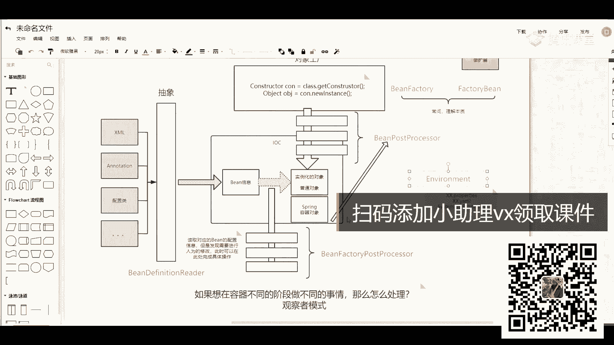

直接来进行跟踪，看一下源码里面它到底是怎样的一个处理过程和处理环节，这东西啊比较简单，我在这儿打了一个debug好，打了一个debug，一个断点，然后有断点之后，我可以进行随便一个读取，但看代码不一样。

这无所谓啊，这无所谓好吧，我们右击，然后呢直接开始第八个驴肉进去之后一定会停到这块吧，是不一定会听到这块，当你停过来之后，第一步先点f7 ，能听到我们的方法里面这一个添加代码块，我说了。

这是歪不到这个8。1的时候有个小bug，一个小bug，这块你不管它啊，你不管它，然后往下走，进来之后再点f7 交往里面去，这会将我们当前对象的一个过高方法传了一系列的参数。

其实这些参数最根本的点就在于我要传入对应一个配置文件，明白吗，叫什么obligation contest，这长发文件，然后呢再点击进到我们这里面，第一个叫super pad干嘛来着。

是不是它当前这个类里面它有一个非常非常复杂的一个类图，对不对，这类图你看起来可能会稍微那么难受一点，因为它的竞争关系非常非常复杂，但是你先瞅一眼，你先瞅一眼，就算理解不了，看不懂没关系。

我看到了我的天哪，太多了，有非常非常多一些的继承关系啊，切成一边好吧，我们最终在调用的时候，刚开始是最后一层，然后一层一层往上挨个进行一个迭代，所以你在调用这个super的时候，就一层迭代。

在这里面会遇到一个什么叫property resource，resource的一个解析配置类，是不是解析配置类那一类也无所谓啊，一会儿用的时候我们再说，所以这样代码你如果不想看的话，可以不看没关系。

但是我希望你能理解一点什么呢，在spring里面好吧，有一个父子容器的一个概念，刚开始你在创建的时候会先在子容器里面找，找不到的话，会去副容器里面找，那映射到我们代码里面的话，就是什么意思。

先在子类里面找，子类找不到的话，我再去我们的父类里面找，所以一会儿我们看具体的实现类的时候，实现类的时候就会有这样的一些问题，就是你要去复制里面进行一个查找，明白我意思吗，啊这块儿大家等一下呃。

老师关一下微信提示音啊，稍等一下，就是我电脑里面登录的这个东西啊，我把你下了好吧，现在接着聊，这是第一行叫super，然后呢下面看第二行叫set confer location吧，第二步啥意思。

第二不用说了吧，叫set嘛，肯定是设置我们的配置文件好吧，这样在进行传入的时候，它应该传的是一个数组吧，这船是一个数组，但我们这儿因为只有一个配置文件，所以可以直接进行一个读取，读完之后再说了。

开始进行整体的一个解析吧，来往下走一下吧，走走走到这块儿取回来之后，就是我们当前这个配置文件叫obligation contest的插画文件，你看看见了，看不了了，等下放上去。

这有一个string是有一个string的一个数组，它的名字就叫avation，插播文件还看不了，看了不看，这有吗，看这是application contest传播文件啊，就这样一个文件，别的东西没啥。

然后调完了之后，下面在循环里面，我要循环当前数组了，这里面有一个方法叫什么啊，叫resolve pass了，这里面我也说过了，其实它并没有特别难啊，拿走趁你们看不要看走，你直接跳过去了。

那重新启动下就直接跳过去了，唉真麻烦，研究点进他进不来是吧，进不来，我们这点啊，这里边有什么东西，有get in冠是吧，是不是过去我们当前这样一个环境，这个环境我昨天已经强调过了，这干嘛来的。

这个环境其实非常简单，它会判断一下你到底是否创建了一个环境对象，如果没有的话，我帮你用一个新的，而new的c类都叫什么叫stander的，还记得一类吗，来看一下standard的a n d a r d。

然后呢ve e n vi 2是不是这样的对象好吧，那就有了对象对象之后，这是绝绝子类，它继承了我们上面一系列的一个父类，进行一系列的负累，这你不管它好，你可以点到当前方法里面来，它是能够直接进去的。

好直接进去了，这些之后先获取我们当前这样一个对象，他说了吧，第一个叫create environ，在create environment的时候是表示说我要创建一个对象，点进去。

他说你有一个三个等于五二的，这个看起来啊，这个过程都比较简单，但是我这要强调的是什么，强调是什么东西，在创建当前对象的时候，你如果直接一看到这个类就不管了，这是不对的，这是不对的，你应该做什么事。

做什么事，点一下当前方法，你发现了当前这个类里面它并没有一个保护法，他如果没有的话，你要看谁，别忘了看负累了吧，父类里面它是有一个对应的构造方法的，在构造方法里面它调了一个叫customer什么的。

property resource的一个方法，这个方法父类里面依然没有对应的一个实现，所以最终还是要跳转到子类里面来进行相关的一个处理，所以职业里边是不是这样一个方法了，加是什么呀，大家看一下。

第一个叫system properties，第二个叫system environment，也就是说我把我当前环境里的信息都给录取过来，方便我在后续整个ioc容器里面进行整体的一个使用，进行一个使用。

就这块东西，所以这块东西你看不懂，不管它，你就知道我创建了一个环境对象之后，我如果需要获取一些反应配置信息的时候，我可以直接拿了，这点能不能看懂，来到目前为止能听懂，同学老师扣过一能听懂吗。

那么你也没问题好吧，这是最基本的一个步骤，然后接下来我们往下走，走完之后，第二步叫resolve required place holder，这干嘛来着，我也说过了，我们在写spring配置文件的时候。

经常会写这样一些东西，比如说dollar大括号，大括号，到了大括号大括号这东西特别是在连接我们数据库的时候，比如说u22 等于什么东西，you are name等于什么东西。

password等于什么东西，是不是经常要进行一些替替换了，而这里面完成的功能就是把这些对应的变量值替换成，我们实际在配置文件里面写的，这些值是在这个方法里面完成的，把这些方法里面完成的。

ok所以下来之后你可以自己来看一下这东西，我们说了那个宋浩翔，如果你不想听课，可以走人好吧，没必要在这儿攻击别人，好吧，大家好听啊，大好听好，环境配置现在都有些信息啊，来看一下吧，这很简单吧。

z让我们this那找到我们的environment有吗，还没有是吧，因为我们从这看吧，直接从这看右击，然后计算这里边有一些properties，我多大一点，往下走，往下走，看到东西了吗。

比如说java wrong time name等于什么东西，然后呢some bot library pass等于什么东西，然后呢java vm的什么东西是不是有一堆这样的信息，是不是都有好。

除此之外还有什么第二个里面也会加载一些相关的一些信息，这都会帮我们给加载过来啊，这这块东西啊，这东西啊，昨天我已经演示过了，所以我们演示过了，所以这块没啥，这块没啥好吧，今天离得麦近了。

我离远点儿卖的问题吗，没东西吃了，昨天一模一样好吧，所以这块你搞完之后不管它了，我就知道什么，我这儿只是为了解析一下我们对应的一个配置文件，把配置文件都能够读取过来，读取过来，这是第二步到第二步之后。

第三步有个reflex，这个reflex啊非常简单，默认值就是true的，所以总能够进到这个reflect方法里面，你们之前很多同学看源码的时候，都得到一个最基本的说法。

说在three里面这个reflash方法是非常非常重要。

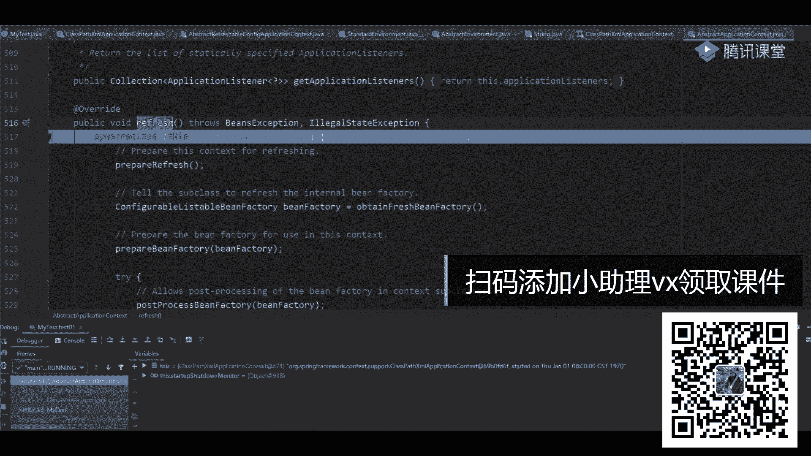

这些步骤这些步骤这些步骤提供了非常非常多的逻辑。

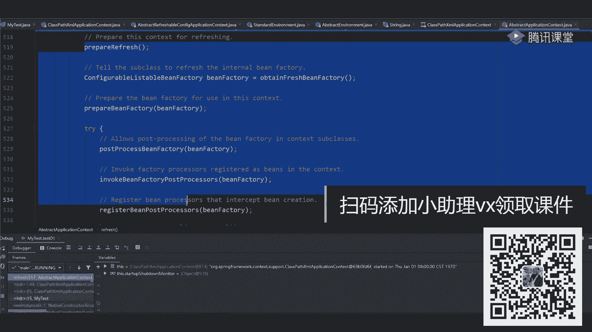

我说了，你如果直接上去看这些方法，看一会就懵了好吧，千万别蒙，千万别蒙，怎么看，按我刚刚打开的这张图里面的东西来留来留意是吧。

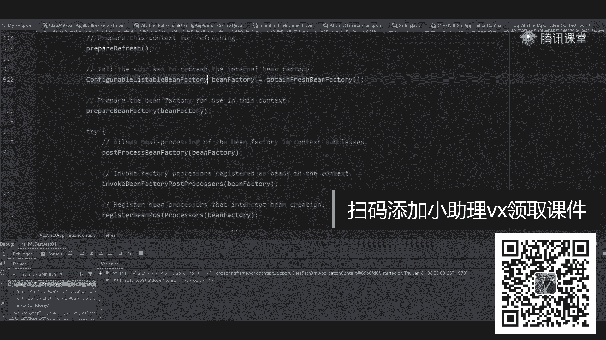

第一件事先干嘛来聊，说的是不是要读取我们当前这些配置信息，刚刚我是不是已经读取到了相关的一些配置了，是不是都遇到了，当然具体的那个插画文件的解析过程啊，我们在没没带你们看，你下去之后。

你们自己可以点一下，那个非常复杂，非常麻烦，我们先不看它了啊，当我完成这个操作之后，意味着我已经把一些病的信息给读过来了，读完之后你告诉我按照我们这个图里面画的第二步该该该干嘛了，正常情况下。

我能想到的应该是要进行实例化了，但是你注意了，在实例化之前要做什么来着，是不是先要创建出来一个对象，工厂是先有一个工厂类，当我有了工厂类之后，在工厂类处理之前，我说了可以提供很好的扩展性。

可以添加很多人为的一些补充的功能以及逻辑吧，就这些叫b factory post processor，所以这时候你再来验证的时候，验证时候能看到什么信息啊，来往这看。

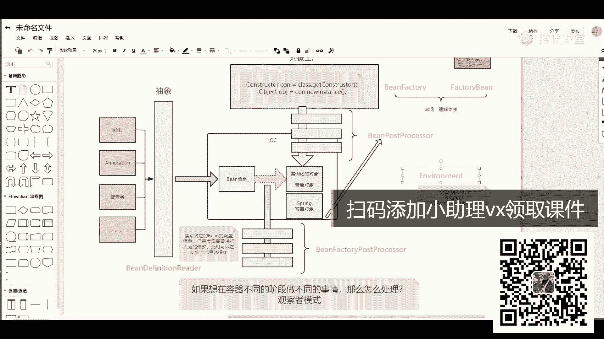

打开我们刚刚那个哦源码第一步叫paper reflesh，这就是做一些最基本的准备工作，一会儿我们来看一下，第二步叫obtain reflesh，being factory，它返回的是什么。

是不是一个psy，所以这一步里面就是为了创建或者说获取到一个病的一个工厂，变成工厂，有了工厂之后，还有呢往当前工厂里面设置一堆的组件，或者设置一堆类，这个prepare设置的一个意义是，当你做完它之后。

下一步知道什么叫post processor being bor，这个名字有点熟悉啊，什么叫post processor being bor，我刚刚说过了吧，在不管实例化病之前也好。

还是你的工厂类之前也好，它都会有一些post processor的一些类，这些类是用来提供一些增强功能的，增强功能的，懂我意思吧，所以这样我们点击这里发现是空的，上面都实现这么多时间。

意味着就为此类扩展了相当一边，再往下看，叫ebok并factory post processor是干嘛的。

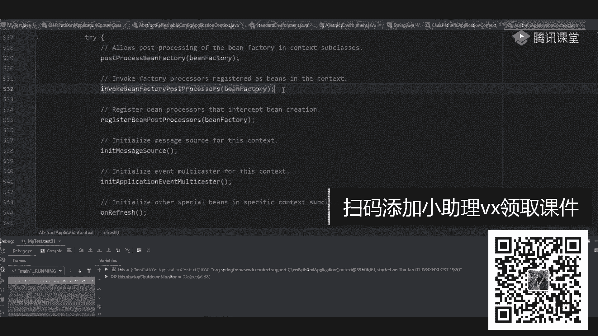

回到这张图上，你看一眼这是不是东西叫being factory post processor，我说了，实例化好工厂，这个累了，有了当前类之后，下一步是不是该执行这块的逻辑，当你有了这块的逻辑之后。

下一步在干嘛。

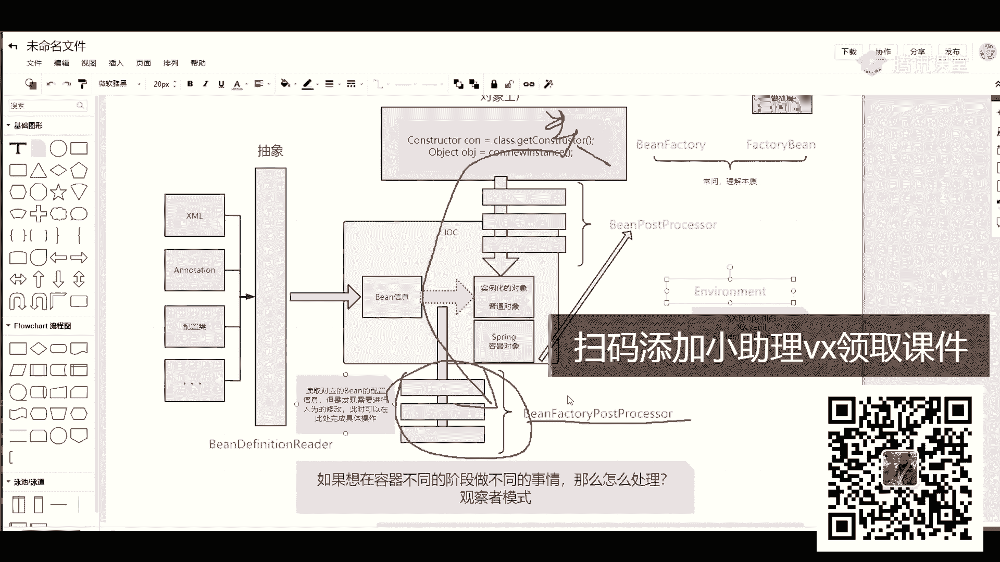

是不是该执行这些b post processor了，所以你看原版的时候，你能够进行一个发现什么呢，这是being factory post poser。

下一步就是叫register being post processor，两个类一样吗，两个名字不一样吧。

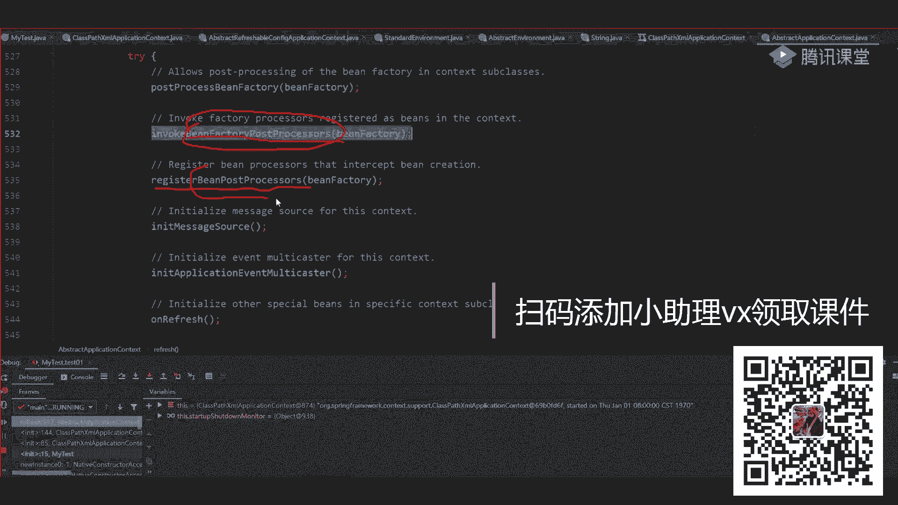

是不是上面比下面多了一个factory，那你通过这张图上，你是不是看到了，这是优先执行的，这是不是第二次执行的，是不是这样一个步骤，明白我意思吗，啊这大家注意了啊，所以我这画这样一个图。

你按照这个图的逻辑去进行一个呃思考和专题一个整理，当我把这些东西也执行完了，下一步该干嘛了，是不是该进行对象实例化的，但是你需要注意了啊。

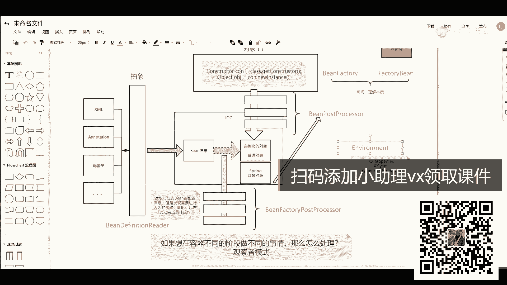

在实例化对象之前，实例化对象之前做什么事，这儿有个东西叫in need message house，是干嘛来的，是干嘛来的，这很简单啊，这东西啊就是为了进行一些国际化的配置，比如说i18 。

它里面的信息就可以到这里面去了，进行一些初始化好吧，再往下看，还有个叫bmit application music caster是干嘛的，是不是叫啥多波器吧，或者叫广播器，对不对。

就是我们之前有事件的时候，它是需要进行广播的，这也进行了一些处处化的工作，当这儿也处处还原人生之后也有讲on reflesh，这个on reflash点进去看下，有空了吧，是不是也是留给子类进行实现的。

我们可以进行一些额外扩展，这再完了之后，大家看到reflesh listener刚刚有录波器了，我要把我们对应的一些监听器给注册进去啊，给注册进去这块的一个功能，再往下看到这一步。

刚刚从图上我们已经判断到了碰到什么东西。

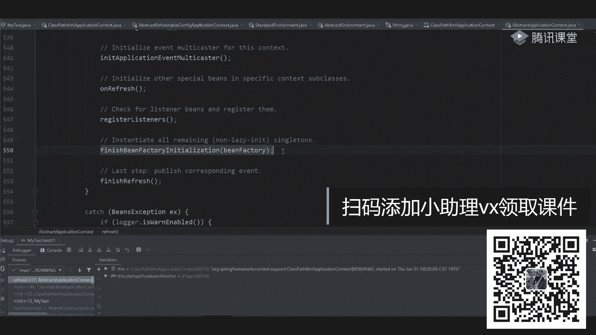

每次在进行之前执行完这个步骤之后。

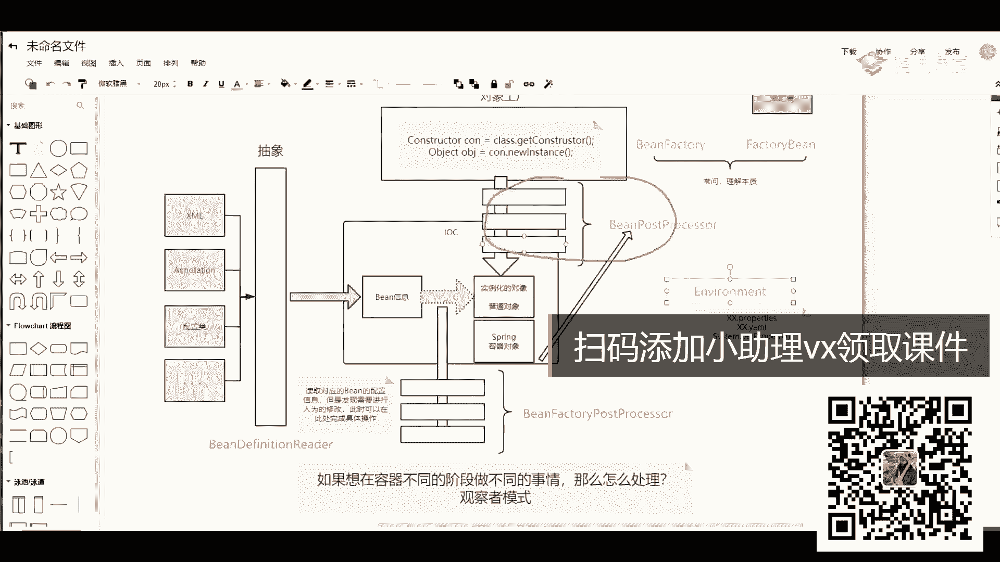

按道理说我要进行实例化，但是它有很多额外的小组件是帮你完成这个功能啊，所以这会有这样一个过程，这过程不重要好吧，再来看最后一个什么呢，叫finish bin factory in relation。

干嘛呢，这儿就是用来实例化，记住啊，实例化某些单利的，注意叫非懒加载的单例对象，所以这会涉及到具体的实例化过程，当你实质化完成之后，它一个finish reflash是分析日fh，就是说我已经创建好了。

完成刷新之前我要做哪些事情，最后面会有一些清楚的工作。

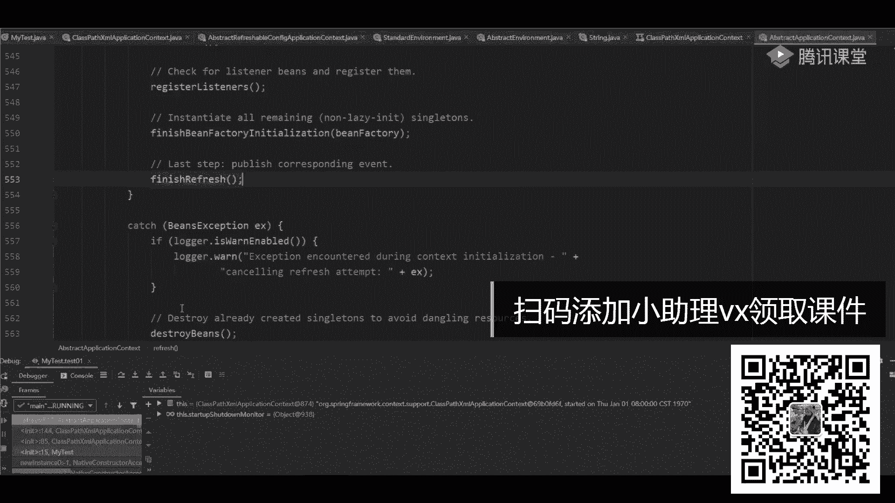

刚刚刚刚我把这些东西聊完之后，你想一下是不是我这画这张图。

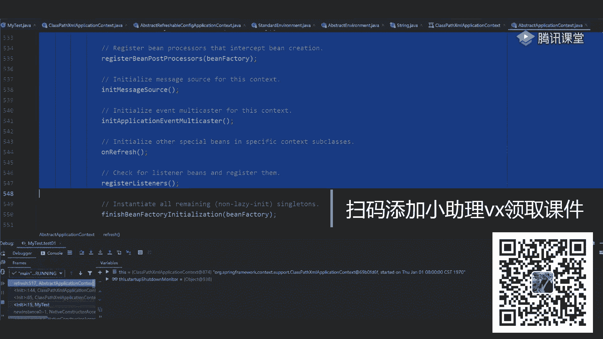

当然这张图比较简单，它不是一个完整的图，但是关键的脉络你能不能听明白，来能听明白，同学扣个一能听懂吗，没问题吧，有了这个脉络之后，下面我们开始深入细节，看一下细节里面我应该怎么学习。

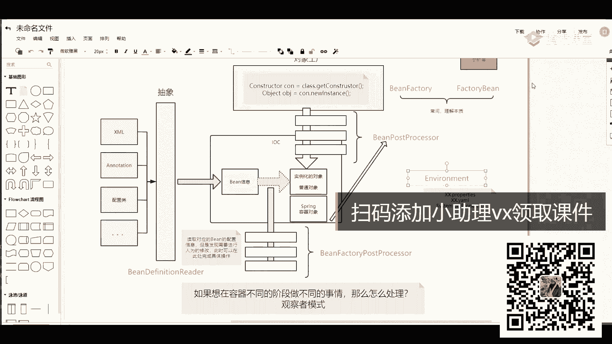

或者说我应该怎么看，很简单好吧，一层一层一步一步挨个来，第一步先点进去叫prepare reflash，这边做的事情很简单，第一步是获取一下我们当前的一个时间。

第二步设置一下我们这个close和active它们的一个标志，因为你现在刚开始运行，所以close肯定是boss的，而一定是处的，这做完之后，这有个log的一个判断。

不管它再来看叫delete property source吧，慢走是干嘛的，它也非常简单，连续有东西吗，说for subclass，是不是让我们进行一些扩展了，这扩展完成之后，不管别东西了，再往下看。

叫get environment，又看到它了吧，这个逻辑你们还记得吗，什么逻辑，我要获取当前环境的一个接口，如果有那个对象叫standard的invent，如果有的话，我拿过来直接用，如果没有的话。

我创建一个新的，那我现在有没有有吧，是不是已经有了，有的话我直接拿过来之后就可以了，点进去你可以看一下，点进去啊，很麻烦，刚才你没点就没点进去啊，不管它了啊，你可以看一下这块，大家这是一个get到1万。

问他先看看对象是否为空，如果等于空创建一个新的，如果不等于空，是不是接返回这个东西，我们之前已经看过这个逻辑了，这不再看了，再看好吧。

然后第二步有什么方法叫one day required property source，这只是对我们的属性做了一个最基本的一个验证啊，最最基本的一个验证，这块其实也没啥。

你可以看一下它对应的此类接口的一个实现啊，实现有这样一堆的一个实现，这块看不看影响不大啊，看完影响不大，只是一个验证，验证通过能怎么样，对不对，所以不管它这样做完之后先不管它。

我想看下面这块这东西很重要，这几行代码很重要，虽然看起来没什么用，但是很重要，为什么说重要，是说了叫stop pre reflesh，application listener这个注释啊。

千万不要忽略他写这书是不是白写的，这干嘛呢，叫存储什么reflash，之前的一些类似的话，是要存储一些监听器，这个时候这个值肯定是等于空的，因为我刚开始来进行一个判断嘛，所以这时候可以等于空的走下来啊。

到这儿这是不是等于空等于空，我要创建一个set集合，set的一个集合啊，这是第一步，这样做完之后，做完之后，第二个叫this在early addiction。

疑问等于你有一个link的high set up，是不是又创建了当前一个集合对象，当然现在集合对象里面只是我创建了一个空的集合，没做任何引用，在刚刚那个reflash方法的外面。

是不是有个东西叫什么叫register listener，是不是这样的方法对吧，这东西一会儿用的时候会配合使用，你知道这只是创建了一个空的集合就够了，别的东西先不管好，先不管，你先留个印象。

一会儿用到的时候，我们再说好吧，再往下走，这步是不是就要完成了，所以我说了这步你其实不看也无所谓，他好像没有做什么核心的功能，就记住我创建一个空的集合，这能听懂的同学给老师扣个一，这第一步能听懂吗。

设置了一些时间，对不对，这是第一步设置时间，第二步设置了一些标志位，第三步我创建一些空的一些集合对象，仅此而已吧，所以之前之前我在讲我们的a p课程的时候。

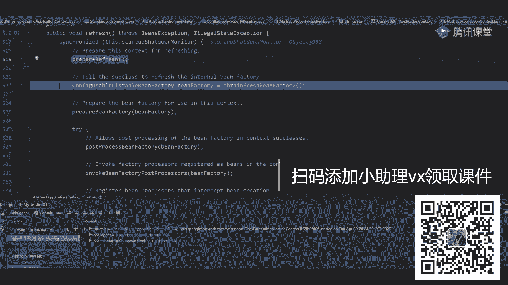

我还画过这样一个图，这图看起来就比较复杂了，好吧，你再看一下，这是我们整个ioc容器，它在进行初始化的时候，我要做的一些事情啊，这个东西叫set configuration，然后读取读取相关的一些信息。

idation，看这个叫prepare reflash吧，是不是这个方法这方面做什么事，第一说完成一些基础准备工作，比如设置时间设置，启动关闭标志，检查环境变量，并提供组织扩展好。

用来将属性注入到context中，并设置监事件，监听器集合，是不是就住了这么几块啊，去做这件事情。

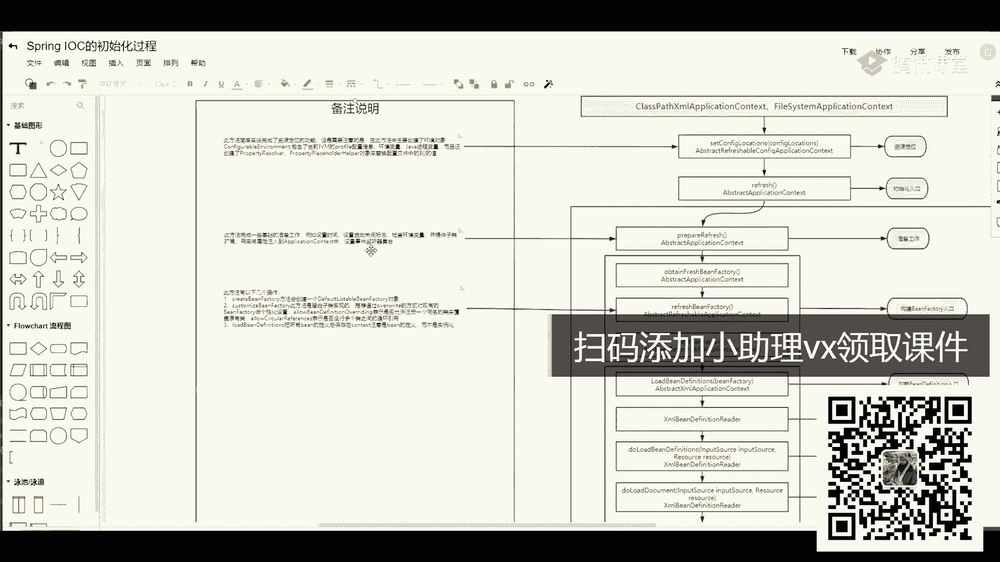

所以都是一行代码，一行代码的东西好形成一边好先生一边这做完之后，第二这个方法很重要，把这话很重要，这方干嘛的，叫obtain fresh，然后呢being fbruary这个名字如果看不懂的话。

你应该知道它返回的是一个bean factory对象吧，我之前也说过了，你在看的时候要先看到我们这个ban factory的一个接口吧，这结构里面是不是提供了非常非常多的一些东西，上面有一堆的注释吧。

有一堆的注释啊，有一堆的注释呃，烟是什么意思啊，少两行是因为你的版本不一样，版本不一样，我用的是5。2。3，5。2。3，5。2。3好吧，这里面有一个注释下去，有时间的同学，我希望你能把这些注释都好好过。

六呃溜一遍，这注释提供了非常重要重要的作用，比如说他告诉你，他说这东西是一个root接口跟接口吧，是用来干嘛，用来访问一个spring的容器，所以它就是我们规定好的最基本的一个容器。

然后告诉你说它有两个对应的子接口引导，visible be federate，it configurable being fate，有两个对应的一个子接口，然后呢在此接口里面有一系列的子类实现。

那就告诉你说这里面有single吧，是不是我们的单位的一个对象，还有什么，是不是还有我们的property，然后还有一个quest session，是有一堆的一些作用域。

好再来看下面也是一堆的一些解释哦，还是建议你们下去之后有时间就看，没时间就算了，没时间就算了，还有一个同学之前经常问一个问题，他说老师我面试的时候经常被问一个点。

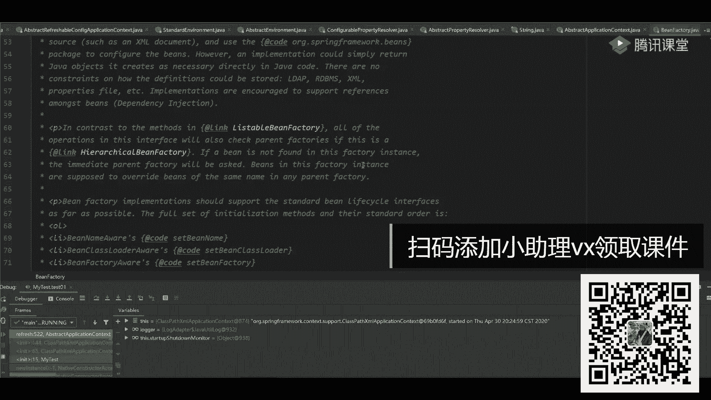