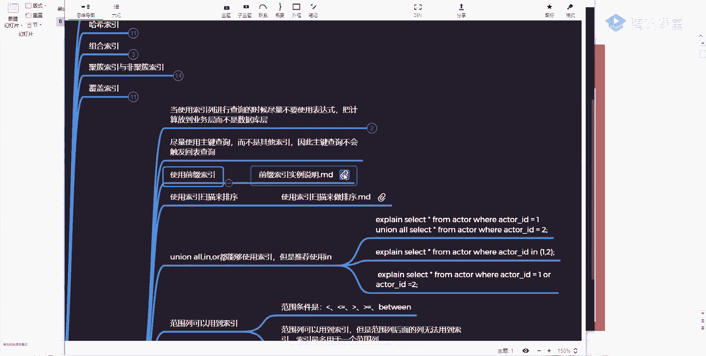

# 系列 2：P47：MYSQL调优：0.7 索引的优化 - Java视频学堂 - BV1Hy4y1t7Bo

这样名词我希望你能够认识到什么东西？这名词一个叫自然组建。一个叫代理组建。这两东西有没有同学听过自然逐建和代理逐件，有人听过吗？没有。所以啊面试的时候可能会碰到这样的名词，这啥意思啊？大家说一下。

所谓的代理主件表示的意思非常非常简单。代理组件就表示啥跟我当前的业务系统无关的那个列做了一个主件，而如果是业务主件啊，不如果是如果是一个自然主件，表示说跟你当前的业务系统是挂钩的。比如说我们建一张表。

比如说一张person表，一般我们的电表上都会有1个ID，对不对？你告诉我为什么要加1个ID啊。为什么建ID？其实我们在建表的时候，默认情况下，我就会建1个ID谁能告诉我凭什么建ID啊，为什么？

我为什么需要这样东西？一个责都是没有ID的。是不是这意思啊？好吧，所以这块注意了，引企ID是为了建一个主件，对不对？是不是要了建一个主件唯一标识，我我拿另外一个你做为一标，唯一标识不行吗？

如果是唯一标识的话，我设成英语扣不好吗？为什么生成主件？我这给一扣行不行？为面啥有主片？所以就是为了保证跟我们业务的一个无关性，保证跟业务的一个无关性。所以这块在建主建的时候，我们推荐大家使用的是什么？

是代理组建，就是尽量不要跟我们其他的一些业务性东西挂钩。所以你们建的时候都有1个IDIDID都有1个ID。明白我意思了吗？建议建议大家使用代理逐件。来这个点听来同学要会扣1。好了，就这一点啊就这一点。

就比如说啊我现在要存一个表，那个表叫身份证表，身份证表里面你要想取唯一件的话，你是不是可以起一个东西叫ID card，身份证号肯定是唯一对吧？它是不是可以作为主件。

同时我是不是可以再建1个ID的列ID是不是也是也可以成为一个主键。那你觉得我用ID好还是用ID card的好，用哪个好？哪个好CID块是不是也可以作为组件啊？建议大家用ID建议大家用ID。

建用ID就该几样的意义。好，希望大家做这样这件事。OK就这块啊。好了，来再往下看下一个下一个叫前缀索引。这道西啊，昨天给大家演示案例，但因为那个数据表我没准备好，所以这东西没演示成功。

我们今天来看一下这东西看这个东西，其实东西也非常非常简单。在我们刚刚那个撒拉那个数据库里面受。

tables这里面有一张表的CD，是不是相当于这个表，我把这个做好。希望四 you加忙。删掉好吧，删掉删掉，删掉完了之后，删掉完了之后，我们这儿可以来做一下这件事情，把这个表创建一下。

然后呢往里边导一下数据哎。

唔色。

做道这件事情啊，走所以这块是不是明显是成功，是不明显是成功。然后这块呢我们再重复执行5次下面的scle语句。

12345看到了吗？当你建5次的时候，这个数据值是不是在翻倍啊，是在翻倍。我们尽量把我们的数据值做到稍微多一点。这样的话你能看出来我们对应的一个特点，看对应一个特点。当你把这句话也建完之后。

下一步说我可以更新一下城市的一个名称啊，随机打乱一下成个城市的一个名称，不要让它太一样好吧，我这这句话这个过程会比较慢过程会比较慢过程比较慢，这有个by这语言你们可能没见过没关系。

你就知道它是一个乱续的一个数据就行了。现多少行了，mat的19200行来查一下吧行 fromC。

demo，然后呢写一个limit。20不查宣过啊，差20个看到了吧？这里面的一些数据啊，这里面的一个数据数据里面看到了有些语句非常长，有些语句非常短吧，这时候很长，这时候很短啊，这这这块一个信息。

这块一个信息。但你把这个数据造好之后，如果现在我要给这东西建索引了，你告诉我，我怎么建这个表其实比较简单，好吧？DSC。是谢ども。这边比较简单，就1个CT列。我假如说我要给他建索引，我怎么建？

我是不是可以把完整的字符说当成一个缩引，但这个时候很明显，它是不是就长了，是不是比较长了。所以我昨也说过了，我们可以取其中的一部分来作为缩引。而取这一部分的时候，其实你很难去做一个判断，我应该取三个。

取4个，取5个还是取6个，我应该怎么取？对吧所以这里面有一个索引的选择性问题。什么叫索引选择性啊？你看这样一个搜go语，你应该能能够意识到这句干嘛的s count星。

然后ICPNC from city demog by city by什么东西。这就告诉你说，我可以统计一下说有多少个名称相同的城市能能做删选吗？能把伦敦63个，然后这个地方53个，这个地方52个。

50个，是不是这样一个值是不是这样的值。当你有了这样的一个值之后，你会发现了我现在如果按全字符串线索引很明显比较麻烦，我能不能换另外一种方式，换什么方式，我能不能只取其中的一部分来参与我们整个的预算。

可以吧？所以这时候来看这个语句。

这样一句差不多差差不多，好吧，还是count，然后这写了一个什么叫left c3left left啥意思？取左边前三个嘛，取前三个，这个时候你算出来一个量级，数据值也是这几个，你发现了，我天哪。

这是不是差距有点大，这个最多是63个，这个做到多少了？484了，这很明显，这个重复度太高了，那是不是失去了我们之前统计的一个意义。那这时候可以怎么办？你可以再做一个合理的测试，你把三改成4。走。

发现值少了吗？少了吧，是不是少了，你再乘一个改一下，改成5。看一下又少了吧，对吧？你再换换成6。是不是少了再换7。当你依次往上增长的时候，你会发现当你截取到某一个长度，某一个长度的时候。

你会发现这个的值这个的值现在是7063、66、5050几。然后跟第一次我们在查询的时候，这个数量级是不是已经差不多了？

这块是不是也差不多了，这多少条，63这53、52这块呢是不是72、66、63，这块差异不大了吧。

哎，这块能听懂同学给会扣个一。还没到，现在还。不大了吧，占不大之后，我觉得这可能不是最优的。如果再把这个长度再调高一点，改成8个，是不是就更匹配了吧？来调8，你调完八之后。

你发现了八和7这两个东西看起来效果是不是差不太多呀？看会。87一样吧，我再改一下9。看效果是不是也是一样的是不是也是一样的。那这个时候你发现什么东西？其实七就是我们最合适的一个值。

我可以把字符串的前7个长度，前7个长度是作为我们当前缩引。那这前7个肯定比我刚开始最上面这个数据要少很多吧，这多少了，是不是取7个就行了，是不是这块东西？

对吧这块跟我们实际的效果其实差别不太大的那这个时叫什么？叫做索引的选择性。也就是说也就是说我可以选择其中一部分来参与我们整体的一个数据计算数据计算明白我意思吧？好吧，这儿大家要注意了。

就是说你可以缩短我们整个索引的一个长度这块的一个东西，这块的东西啊，所以这儿有一个索引选择性，你可以用它来进行这样的一个数据值的一个选择，就这意思。这是一种方式，可一种方式，好吧。

还有一种什么方式可以通过这样方式来计算。

走。是不是也计算出来一个比率，你发现了这个比率一直在往上走的时候，当你讲到7的时候，后面是不是也是这个值，所以7是不是也可以做这样一个判断？明白我意思吧，明白我意思吧，这所以七就是一个最合适的值。

刚刚我同学一直在刷，这个没什么意义吧，数据以后还会变。

你觉得这个东西有意义吗？

刚才有五个同学一直说，这东西没啥意义，数据还会变。你数据值再怎么去进行一个变化，再怎么去进行一个变化，跟你现在建存以有关系吗？没关系吧，我是不是可以怎么样？我再做一次统计。比如说我一张00插出据。

我每次当到一个时间节点的时候，我是不是可以再重建我们当前的一个缩引。是不是这意思？但是总体上看起来的话看起来的话，你在公司里面，你告诉我，你在公司里面，你的查询和你的插入，哪个操作比较多？

你合作会比较多。查询吧。是不是查询多是不是查询多，你插入并不是特别多吧，而且你很少会出现说我在某一个范围内或者说持续不断的一直在海量增加数据，这不会吧。是不是这意思啊？啊，所以这块大家注意到。

它是有意义的它是有意义的它是有意义的。这样的话会减少我们整体的一个IO量IO量。这个时候你的索引一定是情况，一定是你的呃索引速度一定是比较快的一定是比较快的。明白我意思吧？如果你觉得东西不适用。

你可以不用，这没关系。但是你要知道my circlecle里面提供了这样一种方式，你可以用来进行使用，明白我意思了吗？

来这个点听的同学都少扣1。几千万的数据咋用？几千万的数据，你就用大数据好吧，用H base存，用have存或者用raase存OK。Yeah。有几个人的公司里面，你的myscle里面存的是几千万。

还是单机的，有人这么干吗？那时候要聊聊我们对应那个集群了，这个就分开情况多了。好吧，你不要老想那种极端情况。我们现在做这东西的时候，更多适用是那种普遍情况，懂我意思吧？如果是几千万的话。

一定是要做那种那个那那个那个叫什么做那种集群式的和分布式的，一定不能再用单机了。你也不用看单单机了，你单机的话，你崩溃了。有上亿单机，你查询慢吗？你的业务系统有没有问题吗？你上亿的数据量。

你你没没有问题。系。所以们我老师你让my circlel里面最多可以存多少数据，跟大家说myl里面最多可以存64P的数据。有多少人真的用64P的数据存储啊？64P。会长同学吗？不会的不会的，好吧。

不会的。OK嗯。好了，是这块东西啊，是这块东西我不再浪费时间了。来下一点说了利使用缩秒呃，使用索引扫描来排序。这话什么意思啊？大家都知道，排序在我们数据库里面是一个比较麻烦的一点排序。

排序比较浪费时间吧。我问一下排序为什么比较浪费时间？啊，排训为什么比较浪费时间？人时表。系。文件好CPU好了，你们要说了，你们说了非常多的一个情况吧，只说出非常多一个情况，对吧？但不管什么原因。

我得到一个结论说它一定是比较慢的那这时候你再结合我们当前索引这样的一个数据结构，你想一下索引在使用数据结构的时候，它有什么好处，你想一下有什么好处，冷水说了，有东西叫s buffer。同时你别忘了。

我们在用索引存储数据的时候，索引本身是有序的，所以你可以干嘛，是不是利用索引来进行一个排序。你如果看执行计划看的比较多的话，你经常能看到这样一个描述叫unic。fiil short。

有没有人见过这个东西？这个U那个标授什么意思啊？啊，啥意思？他表示是说我要使用我们当前的一个文件来进行排序了。如果不出现它任域的使用什么使用索引来进行一个排序。所以你在进行合理选择的时候要做一件事儿。

尽量去保证你当前的一个查询怎么样，是是不要出现UC feel来我来看。

这依然啊也一样，看一下我们刚才这张表啊。

S index。From。认同。看这个表里面看这个表里面一个组件，这是一个这是呃一个索引吧，这是一个缩引吧，这是一个索引吧，这是一个缩引啊，不对。这是一个缩引这是一个缩引吗？这是一个这是一个这是一个。

是不是意味着我现在里面有5个缩引，我现在写这样一个scle语句。还有一句啊，一句比较好玩，slat rental IDta ID from rental，然后呢where date。

然后呢in IDcus my ID这三个列，我是不是刚刚好能够匹配上我们现在存在的这个组合索引。能比配上吗？不管你按照最多比原则按什么，能不能比配上这三例，威尔和奥特曼。可以了，那这个时候来看对应效果。

比说东西呢？我来看。这儿有出现我说的那个东西叫usic feel shorter吗？有出现吗？没有吧，如果没有，那意味着什么？现在是不是可以使用我们当前的一个索引进行排序了，那我这可以改一下，怎么改。

我把这东西删掉。看这叫ren ID data和这个cus ID是不是少了中间一个列子值。那这个时候还符合我们那个组合索引的最左匹配原则吗？不符合了吧，不符合来往这儿看效果。看后面那出来这个东西。

是不是叫using？那意味着下面这种方式是不是用到了我们的文件排序，而上面这种方式是不是没有用，很明显，他用的是索引来进行排序的。而下面这个地方他没有用索引来进行排序。那你告诉我。

我们在实际做查询的时候，到底哪个比较好？

因文说老师，你这个东西都很少啊。0秒啊，都是0秒啊，这是不对的。好吧，这是不对的这是你当前执行计划的时间。如果你想看的话，可以怎么看？一晚上六。走。这是查出一个数据啊，我这边没数据是吧嗯。不者。

那有数据啊。啊，这个时间时间值不对啊，这边有个时间值，收取出取不上我们对应一个数据，收取上我们对应一个数据。好吧呃，来再再换一下换一下，换另外一个，这样写一个。啊，TOY小写太低。啊，不是这个列吗？

看列是啥，那这个列面是啥来着，看不到。往上翻往上翻往上翻这东西啊，英模特ID没写错啊走。够嘅。这时间看不出来啊这时间看不出来看不出来啊，都是0秒，因为没举到我们对应的数据。好吧，这俩色度区别是啥？

区别非常非常简单。你看这个执行计划。讲半天没讲。あ哎。不告。这样今天计划一样吗？上面看起来都是差不多的都是差不多的都差不多的。但是你看下面多了一个什么叫标er，他表示说利用文件来进行排序。

而没有他表示利用什么利用索引来进行排序，这他们两个之间的一个区别。啊，他们俩之间的一个区别。罗老师，你把时间去了，可以。我先去了。时间去了之后，那这个外间是不是没有了。这个时候再往下看。他什么意思？

是不是叫E shorter？我再换一下，换什么加一下刚刚那个存在那个列啊，这个列。好啊。他会有重新排序吗？也不会吧，别忘了组合索引是必须要遵循最多匹配原则的。我现在再加一个东西。像什么21NTL下号线。

对的。哎，写错了吗？大家来看当我在执行这样的一个东西的时候，执行这样东西的时候，为什么这儿也会使用我们当前那个文件排序？为什么？这是为啥？那老师，你这三个不是应该是一个组合索引吗？是不是都可以。

遵循最多匹配原则了呀。那为什么这个地方还是我们的Uing filterer？按说会走优化去没优化。查的不是。微交站怎叫查的不是是啥意思？来往上看，我们改一下。Yeah。这改成三的星。有关系吗？

需要一个V尔条件。接下。会啊。INT。这样下线对的等于。2005-05-2。125。这可以吧？来再看。没有看一下果。看什么效果好，你注意看效果。OK。往上看老师，我这有一个人头da。

这儿要有一个data，这有一个东西，这个反而要走了。这为什么？这为啥？所以你在使用组合索引的时候，你要注意了，你要注意了。我这儿也说了，我这也说了，看这儿说下面的查询是不会利用我们当前这样的一个索引的。

不会利用我们的索引啊，他说了，第一个看这块，我加了一个范围，后面就不会走了，后面就不会走了，后面不会走了。我们看下这个一句吧。

不这。走是不是应思这叉点，这是一个什么范围吧，是不符合我们对应的一个最多品配原则，是不是这意思？这表啥意思啊？啥意思？这是不是符合我们对应的最多比用原则了。你这如果再加一个东西。

加一个叫date呃RENTAL下划线data逗少高。看这块它是不是也会使用我们的文件排序，也不会走我们对的一个索引，是不是这意思啊，所以这块大家一定要注意了，大家一定要注意的。如果你这加这单一号。

或者说如果你的过染条件里面没有带任何的一个查询。你单是order by。注意啊，如果你单单是我们对应的一个order by里面包含了我们对应的一个组合索引。这个时候我会不会有会不会走索引也不会吧。

这也不会走。这也不会走啊，这大家一定要注意了，关键是你的索引的一个选择，所以一个选择。啊，这才可以这才可以啊吧，是这款东西啊。那再往来看还有失效情况，什么失效情况。

往那看看这东行。系。怎不能复制了那C。

来看这个语句，这个就更好玩，st还是几个列不变。然后这还是再加上我们data，然后这有个alder back这样东西，它会不会使用我们当前的索引排序？我把地址改一下，好吧，把地址改一下啊。

这可能等于他会不会走。不会。还有不同意见吗？不会来看效果。他是不会，这为什么不会啊？来换一下。我把这东西。哦AS。诶，写错了。咩啊。好。他是不是走了，这意味着啥？你在进行排序的时候，要不然全部是升序。

要不然全部是降序，你不能一个升序，一个降序，这是不可以的。因为昨天我给你们演示了他数据的一个组织形式吧，组合所引的，是不是先匹配第一列，再匹配第二列再匹配后面的列，你不能说我让他升序，让他降序。

他再降序，这不行。啊，他没有这么智能没有这么智能。明白我意思吧？啊，杠G表什么意思？杠G就表示说我们正常显示的时候，正常显示的时候，它用的是什么表格的形式。你刚你加了一个杠大G之后。

它就把它转成转成一个行的一个形式了就他们就这这种形式，这有区别，别的没啥啊，就一个展示性展展示方式东西，展示方式东西。

啊，所以这块你再去看的时候，你一定要看一下，我们推荐你在使用索引，推荐使用这个索引扫描来进行排序。但是能不能走，还要看你具体的实际情况到底是啥，到底是想，明白我意思吧？好吧，来这个点听白的同学来扣个一。

没听懂啊。其他数据库是否是适用是否是适用这东西你要根据情况来判断，加数据库我不敢多说我只敢对我们对应的一个mycyclcle做一个呃呃就是准确的一个判断。其他数据库我不敢多说，所以下去之后。

你要自己去其他数据库里面试或者做一个判断。明白意思吧。好了，再来来看它有什么个uniallinall都能够使用所引，但推现使用ing是啥意思？这儿开始聊out的事儿，这几头都别做词作引嘛？这不用都说了。

对不对？好吧，来看这个语句，刚刚我们演示一种情况，那个out走不做左引。

听到我问题啊，刚刚我们演证这种情况，他这个奥到底是否走合以？懂吗？那个ABC的时候。那个ABC那个ABC的时候，组合作用的时候不走吧。啊。😮，PL。你较。ABC2YA。A12B等于2。他这个东西吧。

他懂吗？不走吧，是不是这意思啊，有内部的时候不走，没内部的时候走，对吧？OKOK来往下看看下面这个语句，看下面这个语句，他走的一个情况。

我们来给他看一下啊。第一个。嗯，看这一句，这用了什么un尼奥吧，我说了，un尼奥也会去走我们对应的一个索引，对应索引，这不都是我们的逐渐索引这个缩引吧。还有刚刚同学们试的还是个啥来着？

YID要写一个in括号。一逗号2。是不是也会走我们对应所研，是不是也会走。再往下看还有什么东西？XID然后呢等于12X下线ID。等于2。做会业了吗？知不懂？走了吧，他这块。是不是走了是不是走了对吧？

所以你说了，你要根据你的具体情况来做一个实际的一个判断，三种情况都会走我们对应的一个索引。那这个时候我们做什么样的一个选择？刚刚不是说不走吗？我刚刚在上面这个情况是说不走，上面情况是不走。

所以你不要笼统的说哦，走不走索引，你要根据你具体的scle语句，以及你创建索引的方式来做具体判断说我到底是否会执行我们的一个索引。明白我意思吧？不要一棒子打死不要一棒子打死。这个表格不给你看过了吗？你。

是不是有这么多例，然后so indexex。From either。是不是一个主件，一个内目列啊，刚才是不是给你给你们看过了，是不是你看过了，这是走动人，是不是走的时候，我们对应的一个主件。

所以如果你是一个单列索引的话，哦就会走。对非说的非说的。啊，所以这块你要详细去看一下，要详细看下具体的情况，不要一棒子打死，明白吗？所以笼统来说的话，都是不对的。DICABCABC有啥呀？

你这不就是一个表吗？这有啥？这有啥这没啥啊。这有啥问题吗？对，ABC是组合索引。ABC组合索引组合索引这边是什么？是唯一的一个主件。所以如果你是单列索引的话，它哦是会走的，是会走的。

如果你不是单列式组合的话，它是不会走的，明白意思吧？而组合索引里面又分了你的表里面是全部列都是组合索引，还是一部分。如果是一部分的话，是不会走的。如果全部的话是会走的。而走的是什么，是全部列这个索引。

而不是其中一部分其中一部分。刚刚那句话是听明白了吗？我来写一下啊，我来写一下好吧，你再自己记一下，自己记一下，好吧，如果。是单列，所以啊会哦会使用。所以好吧如果。是组合，所以啊不会。哦啊，这要分情况。

第一种情况，啥东西，全部的列。都是组合。所以。啊，那么会使用什么全部列所。对应。啊，所以。第二种情况，如果。部分。列是组合索引啊，那么不会走索引。看白这意思了吗？这边这个情况啊。

把这些东西能对应起来就行了啊，能对应起来就可以了。好吧，哎这块听完同学给老师扣个一。能听懂吗？好，没问题啊，没问题，我们再接着往下聊往下聊，好吧。

啊，大家看说范围列可以用到我们索引，就不用说了吧，之前已经演示过了，好吧，不要觉得范围列就不可以用我们对应一个索引啊吧，但这时候就注意了，在组合索引进行使用的时候，组合使用索引进行使用的时候。

它后面的列是不能够走的，是不能够使用索引的。如果你中间你如果你中间添加了注意啊，如果你中间添加了范围条件查询。如果你是一个组合索引，后面的列是不会再做索引的。所以这一块你也要注意它。比方说上来之后。

所有的范围也都会有索引，这也不对。所以说法在说的时候，一定要好好去看它，一定要好好看它。明白意思吧？好啦。为啥？组合作业刚才不是说了吗？你写了1个ABC如果你写了一个A等于一，B大于2，C等于3。

C会用吗？C不会用吧，这是不是就组合作业的一个一个一个一个判断一个判断。之前我是不是讲过了？对吧正常情况下，如果你只有一个列的话，这是可以的这是可以的。好吧，A等于问号B等于问号C等于问号这可以吧？对。

这是可以的。你财业方案以后放到最后，这是可以的，但是必须要遵循那个从左到右的一个顺序到右的一个顺序。O。好，来再往下看下一点叫强制类型转换会触发全表扫描是啥意思啊？这儿也非常简单，来看一下案例。

我这应该有一个表吧受。

てばす。你有点吗？没见是吧？没见啊没见来，我们来看一下，我们来说一下这个这个这个这个这个情况什么意思呢？你们在做类型匹配的时候，一定要把全部的类型给完整的匹配上。这有接表语句吗？啊有啊。

来，我把这语气运行一下。

对。走，这表非常简单，好吧，show index from叫user，这里面是有一个索引链叫phone，对不对？我在做一个查询的时候，slide先 from。嗯。😊，啥啥东西？有什么了？

from user where然后呢for等于。要写一个。随便写随便写这个值好吧，随便写个值无所谓啊。

