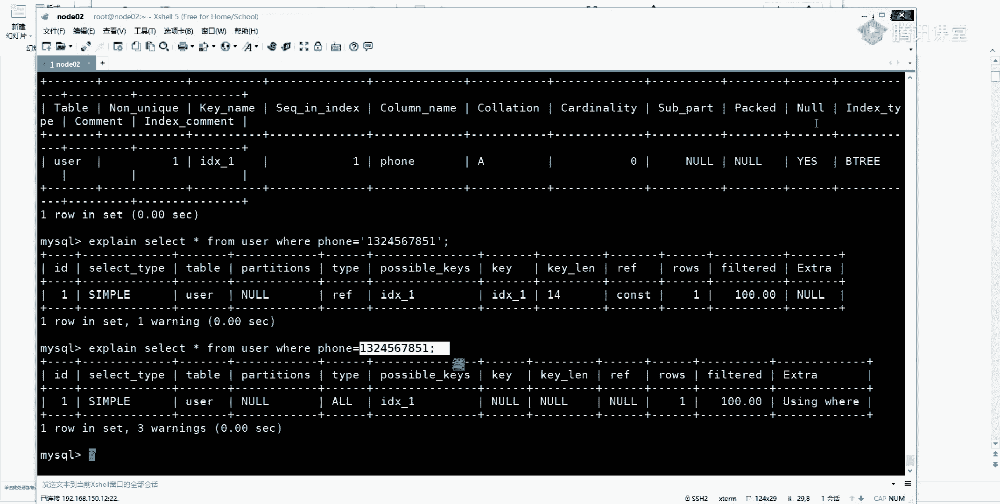
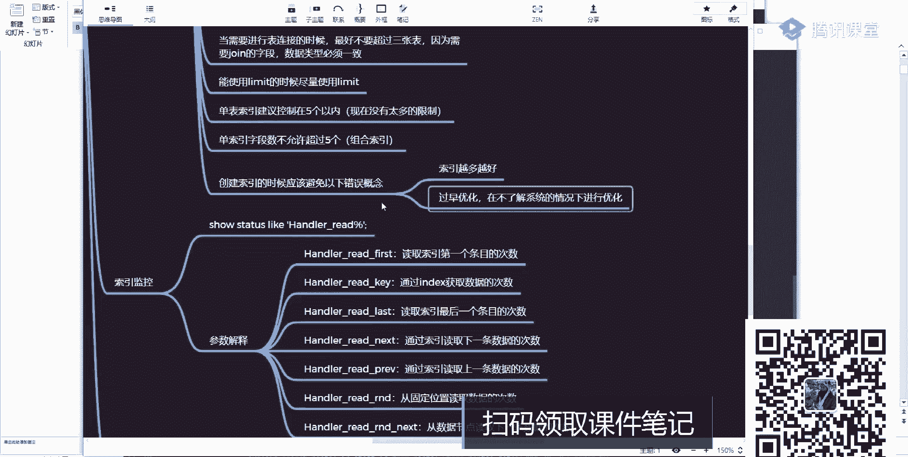
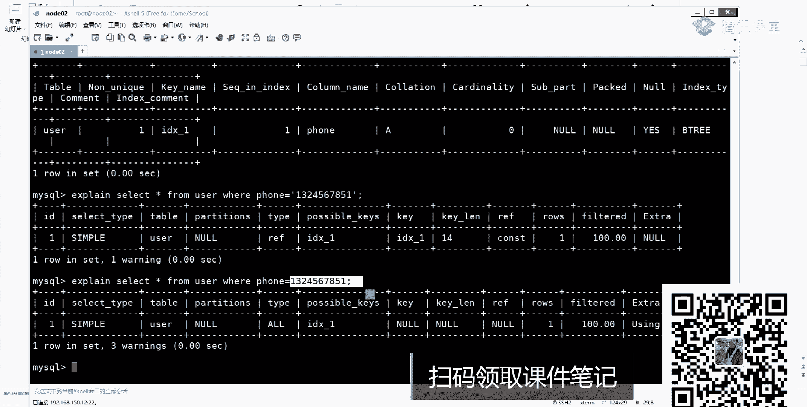
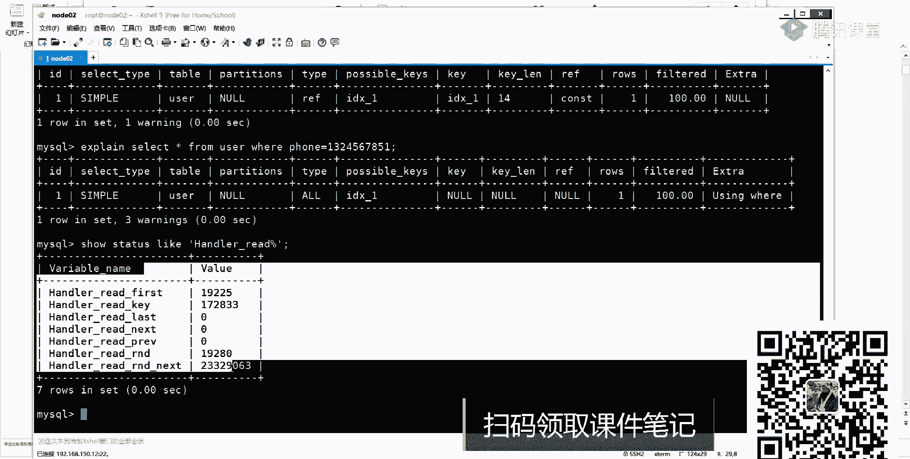
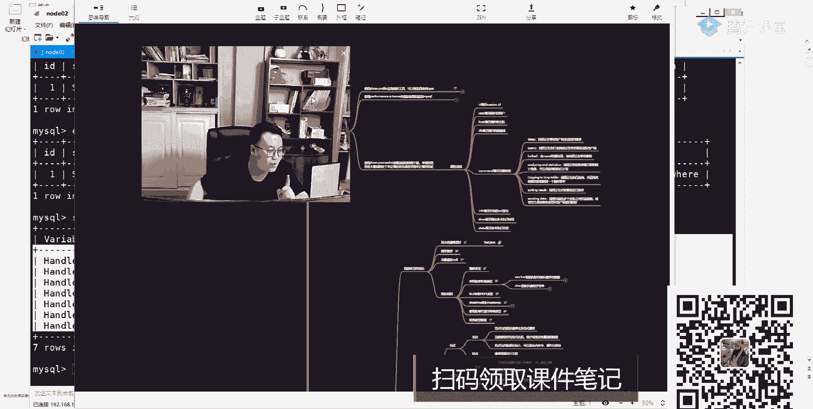
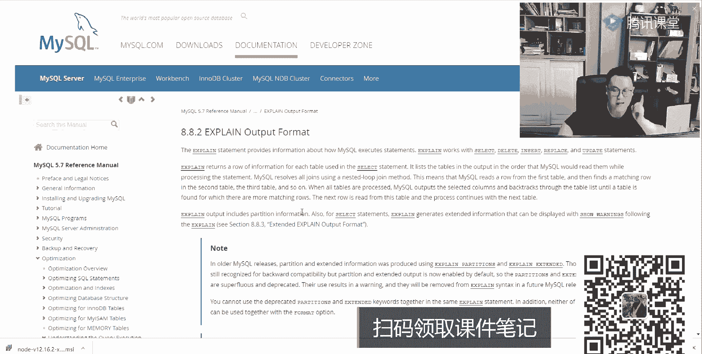
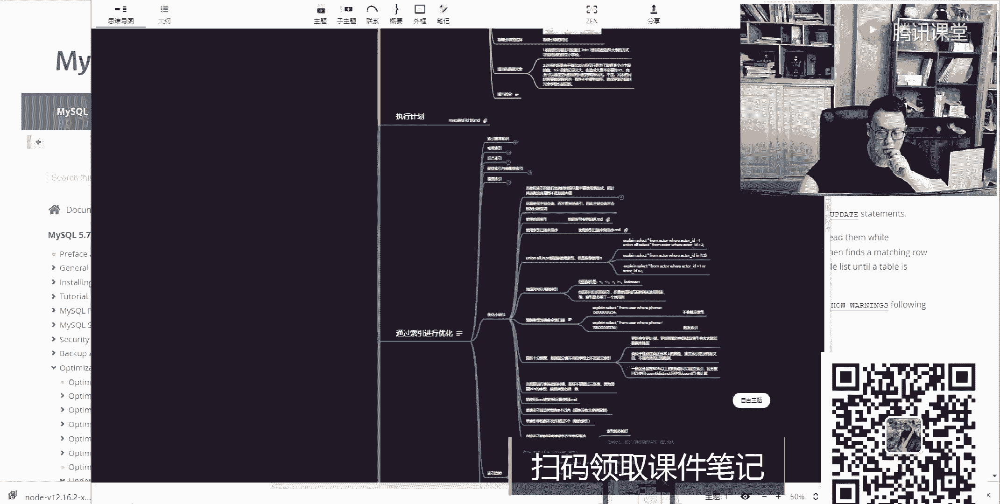
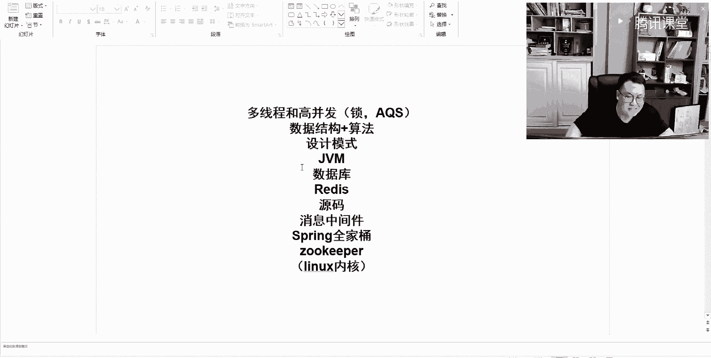

# 系列 2：P48：MYSQL调优：0.8 集中答疑，解决同学们学习中的问题 - Java视频学堂 - BV1Hy4y1t7Bo

列之之后来运行，他会做索引吗？别忘了我们这个袜叉是我们这个放的什么类型？是挖叉类型，这时候会不会做索引？汇总啊。对他会有缩引。但是如果你换一种写法。我把代言号给干掉。把单引号干掉，把单引号干掉之后。

他会报错吗？不会吧，是不会使用。好，来，我来看。看见你吗？但你把代码开变掉之后，他不会报错，但是他还会走索引吗？不会了吧，为什么？因为里面涉及到叫影视类型转换。啊，所以再加一个引视类型转换的时候。

也会导致我们当前索引失效当线缩引失效啊，这大家一定要格外注意的一些点啊，应该格外注意这些点，听白意思吧？今天昨天还有一个同学来问我来着，说我现在要做两个表的关联，在关联的时候，他发现一件事。

他发现一件事儿好吧，他什么事呢？因为它的类型不一致，导致索引没走了。我说这很明显，当你在发生类型转换的时候，一定不会走的，这相当于我要加一个什么是不是类型转换函数，是不是类转换函数，使用这种函数的时候。

是不是会造成我们的索引失效，这块就这个意思。只不过这个操作不是我们肉眼能看出来的或者不是我们看出来的。所以这个时候我们失效掉了。啊，所以你在写的时候要避免这种情况，他虽然不会报错。

但是有可能会导致所以失效，就这意思就这意思。

好吧，预算函数利转换都不行。对对，OK。好了，就是这样的一个类型的值。好吧，再来看还什么呢？说更新是分是频繁，数据区分度不高字断场不易串现缩引，这什么意思？这什么意思？意思非常简单，这儿记住了。

我现在表里面有一个列叫ss或者真的属这叫性别。我需要在性别上见索引吗？不需要吧。对，一定不要不要见索引，好吧。所以这里面说了，区温度不高的字段不会见索引。刘文老师。

我怎么知道我这个列到底是否区温度高不高啊？听得到吗好？这块给大家一个数据的参考值。有没有同学听过一个东西叫DV能听过吗？有没有听过DV？什么叫定位啊？DV的全称其实非常非常简单啊，叫什么呢？

Disting的。咩。第一次定单有啥意思？表示是唯一值吧，是不是唯一值是不是唯一值。就是说我可以计算一下当前这个列里面的唯一值，然后呢去除以我当前表里面所有的总行数，听白了吗？总行数。

这个值如果大于80%，可以见索引，如果小于80%啊，我们就不建议建索引嘛。当然这只是一个参考数值，参考数值没有什么实际意义，没有什么实际意义。但是你要知道了，在数据库层面经常会计算一个东西叫什么呢？

叫基数，有人听过吗？有没有同学听过这两名词叫基数。好，莫涵说了，对，就这东西。基数这个基数代表什么意思啊？什么叫基数啊？什么叫基数？基数它更多是在数据库里面起的一个预估值或者说估算值，这个值很重要。

这里面会演示出来另外的一个名词。另外一个东西它里面有一个非常非常著名的算法，你们应该听说过什么算法叫hyperlogloger，有人听过吗？这东西。有没有见过这个算法？见过同学给老师扣一，没见过同学。

给老师扣2。好了，同学说了readds对，非常非常对。raice里面也用到这个东西了。你要这么东西了。所以你会发现当我在计算类似相目这样东西的时候，它使用的方法都是一样的。

包括大数据里面的像听ing一这样的技术，它也用这个d听value了。听明白了吧？这东西很重要，它那个基数统计啊，注意了基数统计算完的值并不是一个准确值，而只是一个预估值。而这个预估值。

我表示的是某一个具体的数量级，什么样数量级1101010万不一样吧，是不是很明显不一样。对吧所以我更多表示一个数量级，而不是一个准确值，不是一个准确值。啊，这样东西啊，下在周自己看。

为什么说有些同学学东西比较快，有的人学东西比较慢，原因就在于原因就在于什么？你看到这样技术之后，你可以联想到另外的一个点或者另外一个技术里面是否运用了相同的东西。

如果应用了意味着两个底底层里面实现机制是一样的。啊，所以关于DV和cap板，下一周自己看，我这不讲了。但是这个点你要知道，建索引的时候，并不是说我所有列里面都建了，就一定是好，这不对这不对是吧？

合理去做选择，合理去做选择，这其实更加重要一点。来这个点听白同学给老师扣1。好了，再往下看，他说了。诶诶。往上看他说了，当需要进行表链接的时候，最好不要超过3张表。好吧。

因为需要重要的资产数一些必须一致。这句话什么意思啊？这是那个阿里规约里面，阿里规约里面是不是说了一句话，说你要执行表关联，最好你的状元字段不要超过3个。如果超过3个了之后。

可能会造成你的数据量查询会比较慢。对于大公司而言，确实是这样的，或者说你的表非常非常大的话，确实这样啊。但是我说一点，在使用状元的时候，有没有可能会走缩引。听吗有问题啊。

使用重要的时候会不会走会不会走缩引？会会吧，可能吧啊，但是这儿要强调一件事，就是说的，你在使用join做索引的时候，你必须要保证你的数据类型是一致的。如果你的数据类型不一致，它会造成索引失效。

所以知想那老师会不一致吗？会会昨天有个同学还问我这个问题，我可以给你找一下那个那个那个那个那个那个学生问那个问题。好吧，他就这么说的啊，不能展示啊，打马赛克不打不能展示啊。就是这样会有这种情况啊。

所以你要知道这个东西，你要知这个东西OK。不是杨理对，是这样的。好吧，来再往下看，还有个模型呢说能使用limit的时候，尽量使用limit，这边我说了吧，limit啥意思啊？我举个例子啊。

my circle里面你在进行分页的时候，经常用limit那limit它的作用是用来分页吗？啊，我一我一说来找，你们都说分页，那的作业是分页吗？不是好吧，limit的最严谨的一个解释叫什么？叫限制输出。

好吧。分页只是其中的一个用途，仅此而已。比如说我就让你帮我显示前实条记录，这跟分页有毛线关系啊。没关系没关系吧，所以叫限制输出好吧，那你在使用limit的时候，需要注意一件事儿，注意些什么事儿。

你limit5和limit1半。多5两个语句执行效率是一样的。需要了吗？不一样了，而且像limit，如果你要limit比较大的一个数量级的时候，大的一个数量级的时候，千万不要用limit这样的一个东西。

我刚说了啊，能使用的时候尽量使用，但不是一定使用，明白吗？一键使用就有问题了。您的什就有问题了。好吧，因为是啥？你需要先。顺序过滤到前面的1万条记录，然后呢才能取出后面的5条才能取出后面的5条。

如果你不用那东西的话，你是取不出来的，你就取不出来的。所以这会成为一个问题。就是前一万条记录或者你第一个值会越来越大，第一个值越大，查询效率肯定是越低的，查询效率就越低了。明白了吗？啊，这要注意了。

好吧，就这个点状元那条数据类型一致是指的二字段类型一致吗？对，就是你的连接条件，连接条件类型必须一致，那条一数据必须一致。大数据量分页怎么办？

可以通过子查询或者说un尼奥这样的方式来解决子查询和un尼奥。有人用这样方式吗？大数据量分页的时候，有没有人用过un尼奥或者子查询，也用过吧，没有。不是没准备这个案例啊没准备这个案例啊。

下之你可以你可以试试这个网上一搜一堆铁的，一堆铁的，有这样的方式，尤尼奥和子查询都能解决这样的问题，查询效率都是好过直接lim敏的直接lim敏的。你看就是子长，你不是干他吗？不是。

不一定不一定不能说不是啊不一定不一定好吧。日期类型建筑的规则一样，一样，这没这没关系的这没关系的这没关系的，好吧。啊，子查询不是查询两次了吗？是查询两次，但是你要判断你过滤的数据量是多少。

你过滤的数据量是多少，跟数据量是相关的。明白了吧？这我们准备案例啊，这个后面这有时间，我们准备一下案例给大家验验一下就知道了。我这没没有数据了，主要没数据，好吧。来再往下看下一个东西，什么呢？

说单表索引建议控制在5个以内，这个没有说了吧，这是高性能mycyclcle里面说的一句话，说单表索引控制在5个以内。但这块我要说一件事，我要说一件事儿。现在。没有太多的限制。这句话听明白了吗？

这句话什么意思？这是之前那个就是那个什么保险思后里面说这样一句话，说，单表索引建立控制在5个以内5个以内好吧。但是我说一下，其实你超过5个也无所谓，也无所谓，也无所谓。这块是没有什么限制的。

因为现在磁盘也好，内存也好，跟原来都不是一个级别了，都不是一个级别了，所以这块也不会造成太大的一个影响。但是还是建议越少越好，因为你注意一件事，你的索引越多所引越多，你所需要占用的磁盘文件就越大，越大。

意味着你的IO量可能就会越大。所以它依然会有影响，依然会有影响，依然会有影响是吧？但是呃不像原来老版本的时候影响那么大，仅此而已。好，这也拿出去了。再来看还有呢叫单索引字段数不允许超过5个。

这块呢说的就是啥？这就是我们的组合索引吧。啊，组合索引吧组合索引这块也要注意一件事，就是不要让太多的列都参与到组合索引里面，因为都参与到组合索引里面去之后会有啥问题。你想一下，你在建那个K的时候。

是不是用的是左合缩性值。那这个左合索性长度是不是会变大？K值变大之后，是不是会影响我们整体的一个效率了？对吧啊，而且后面的更新维护都会变得比较麻烦，都会变得比较麻烦。所以这种写啊稍微注意下行了。

一定记住越小越好你小越好。OK然后呢，最后一个说创建作业的时候，应该避免以下错误观念。第一个错误观念。第一个错误观键是索引越多越好。索引是越多越好吗？不是吧。所以越多，意味着你存储。

所引的数据文件就越多。所以数据文件越多，意味着你的IO量就越大。IO量越大，有可能会影响我们整体的一个查询性能。查询系能好，所以这一定要注意了。OK再来看说过早优化和在不了解实际系统的情况下进行优化。

是啥意思？之前有同学问我索引的问题，他上来啪扔给我一个搜口说老师，你告诉我这个缩口我应该怎么加索引之后能取得最好的优化效果。如果是你你怎么办？听到我问题啊，原来有学生扔过来一个搜狗语句，就问我老师。

我怎么加作业。我当时我都崩溃了，我说这事儿不对，我说你要先给我介绍下你的业务，我介绍下你当前的一个数据结构是什么样子，你要做什么样的一个查询。我对你的业务了解了之后，我才能够去创建我们队的一个索引。

是不是这意思？你上来之后就个就不对啊，所以你在建索引之前，千万不要上来之后，就说老师我要建索引，这不对。今天还有同学问我一个问题，他说老师这个东西s。星 from tablewhere然后呢，A等于一。

然后呢，B等于2C等于3order by。办ID。高老师，这东西我应该怎么建索以啊，什么样的方式更好？我说我是这么回答的，我说你在这种情况下建索引的时候，可以选择创建组合索引，也可以使用主变索引。

这东西要根据你的实际情况去做一个具体判断。我没法给你敲死，说你必须要用什么样的一个方式去公司里面看你具体的一个业务啊，来进行合理的一个判断。明白我意思吧？啊，这点很重要。所以说了。

如果你不了解你的系统上来之后就要做所有的优化，简直就是耍流氓，这不合适这不合适。明白我意思吧，好吧。好了，这是这儿存在的一些点。然后呢，除了这一点之外。

你还可以看一下你当前的系统里面所以使用情况是怎么样子的。比如说这样一个命令，我们可以运行一下。

是不是这样一些数值啊，是不是这样一个数值啊？这些数值表示的具体意思就是说你大概用了哪些什么样的一个索引。比如说读取索引第一个条目的次数，通过index获取数据的次数，读取索引最后一个条目的次数。

是不是有些参考值。这些参考值下去之后可以自己来看看，可以自己来看看啊，来做这个合理判断。但是一般这个值与我们开发人员而言是没有关系的，是没有关系的啊，我们所需要做的事儿其实非常非常简单，非常非简单。

就是合理的去创建索引的一个方式，和去创建，争取能够达到最优的一个效率。但有些情况下，有些情况下，单纯依靠加索引是解决不了根本问题的，明白了吗？

听明白我这句话好吧，有时候你单纯的就想固执的应应用索引之后来加快我们的查询是不太现实的，是不太现实的。你要根据实际情况来判断，能加索引当然好，如果不能加，你也别硬性去加，好吧，我就非要加，何必呢？

明白意思了吗？好吧，这大家定要注意了大家定要注意了。好吧，来，这是我们关于索引优化所有相关的一个知识点，知识知识点这块听懂并且感觉对自己有收获的同学给老师扣个一。嗯。嗯。拜e拜。你说话吧，应该。

听懂没记住，我说过了，这块东西一会儿下课之后我会发，我会发，你们去找自己对应的一个咨询小姐姐去要这东西就行了啊，要东西就行了。刚刚我看到有同学问了一个问题，说老师s星呃。

不是count星count一和count某一个列。哪种效率比较高啊？对。这三种情况哪容效率比较高？我告诉你，你去做实际测试三种情况一样。三种情况是一样的。

你在网上可能会看到一种帖子说count整数值速度是比较快的。你做测试去，你实际做测试，你会发现一模一样。好，都一样，没有任何区别，听明白了吗？没有任何区别，不信你就去试欢迎打点。

这个之前我上课的时候是演示过的，是演示过的，你自己去试好不好？你自己去试。OK。😊，试完知道试完之后，你就知道大概有什么样的一个区别了，大概有什么样区别了。好啊。好了，这是我们这块关于索引这块的一个点。

多一多嘛。你们觉得这样东西多吗？count大表特别慢，有特别优化吗。如果你只需要做count优化的话，你可以看一下我们对应的那个嗯你可以用my里面有一个计数器，它的自动统计总体的一个行的个数，行的个数。

好吧，这个东西跟大家说一下，这只是这块知识点的其中一小个模块，这是通过索引进行优化。除此之外，上面有什么有性能监控，有数据类型方类的一个优化，我可以把那个放小一点。哎，太小了。太小了是吧？

然后每一个点其实里面都包含了非常非常多的一些东西。可以给你们展开，你们看一下，好吧，查询优化。看东西了吗？也就是说你现在在进行使用的时候，在进行使用的时候，你需要把这些点都掌握到吗？其实说实话。

我说句良心话，我觉得这些东西啊，其实在公司里面没必要都掌握。因为你们在公司里面压根也用不到这样的一些技术。或者写搜cle的时候，其实根本不往这方面进行考虑。除非我出现问题了，我才会去考虑这件事情。

如果不出问题，我一定不会考虑这些东西的。一定会考虑个东西的。啊，但是但是你在面试的时候，你要了解他。啊，因为你不面试，因为你在面试的时候，你也不知道面试官会提出什么样的一个问题会提出什么样一个问题。

所以最好能把这些东西好好看一下，能多掌握一点是一点啊，这东西总没有坏处，总没有坏处。而且这块会加上你整个技术实现的一个底层方面的一个效果。底层方面的一个效果，这点其实更加重要。听白我意思吧？

所以这里面有很多很多你需要相关关联的一些点，下一周好好看。有同学说老师高性能那本高性能M那本书写的比较虚。我跟大家说，你沉下心来好好去看那本书。那本书我看完之后，我的收获非常大的，而且我看了不止一遍。

我看了不止一遍。我现在说的上就那本书，我现说就这本这本书，其实我可以给你们等一下啊，我给你们看一下，像这本书。行，我可以给你们看一下啊，我这就有这本书。这着说高兴能来搜搞。不是吹了。好吧。

我觉得你们真应该把这本书好好去看一下，很重要很重要。啊，因为这本书里面会聊到很多你之前没有接触过的一些细节点。当然刚开始听的时候可能会比较难受一点。但是没关系。

你坚持下来去听去看去看你看下去之后总会有对应的一些收获的。然后看这本书的时候告诉大家，你还需要做这另外一件事。

把那本书跟我们对应的一个me官网两个东西结合起来去做一个查看接着做一查看就好比我昨天在你说文档的候，说文档的时候，你要聊什么东西，比如说我们看用户点对不对？你说我要看索引从索引所以结果在哪呢？

你要对官网比较熟的话，比如这点开这有一个index里面就有一句话告诉你说my里面我到底是用的是什么样一个索引，这块都有对应的一个解释，看这most my index吧。

柚吧有些东西用的是吧memory table用的是什么叫哈西 indexdex柚什么呢？叫 index说这块都有这样的一个表示。

听白我意思吗？这个事都有。啊，再者老师，我想看一下这个执行计划到底是什么样子的，很简单，往下找。说一下，这里面一定会有对应的一个执行计划。看到query execution。嗯，拿是吧。啊，不对。

写错了。看这儿。看这块了吗？刚刚我给你看执行计划的时候，这些东西ID什么什么什么什么东西，每个列车都解释，下面都有具体的案例，你能进行查看的，这块都有，这块都有，明白我意思吗？

所以把那本书和官网结合起来，一起去做一个查看，这才是最好的一个学习方式，单看书不太好，最后两个东西都看一下。现在mycycl8。0市场环境更多嘛？我们公司现在做项目里面都是用8。0，因为8。

0据说是最快的mycyclcle的一个版本，最快的mycycl一个版本。啊，用起来的时候确实也比较舒服，而在里面做了比较大的一个改动。对就比如说现在你还能看到那些点FR文件，如果是8。0，告诉你。

你连那个点FRM这个文件都看不到都看不到。听白了吗？啊，所以不同版本之间8。0和5。几区别还是比较大，区别还是比较大的。所以你要看的话还是一样，通过官网去做一个查看，都有具体的一个解释，明白意思吧。

告诉大家如何来进行一个学习，如何来进行一个学习，这其实更加重要一点。啊，高性能卖测狗第三版是出卖家看的。啊，老师发量不错，我天哪，我了下看看，你看这个到哪了，还发量不错。你是怎么判断的？😊，啊。

你怎么判断的？只是盖一下而已好吧，只是盖一下而已。OK。所以啊呃房子这事就就就就头发这事就别聊了，好吧，聊完之后伤感情，聊完之后伤伤感情。OK没秃理就散多了。我以后肯定是朝地中海方向发展。

聊这不是我家啊，我在公司上班，好吧，这是公司，这是公司，这不是家。不是我家好吧，这是公司。OK我天哪，我家要这么这么奢华，我这这么这么大，我我是太开心了，老师来抽我的公司招人不。哎，我们公司正在招人。

我次前面了几个程序员。好啊。😊，下周可以可以看一下，10点还在公司，凌晨3点之前没回过家，没回过家，好吧，公司能抽烟过能能。好了，听完今天这两节课啊，我相信大家应该是有所收获的那下面我们来问一个问题。

这只是my circlecle其中的一个模块。今天下课之后，你们去找对应的咨询老师，我会把索引这块东西给大家发下去。但其他模块我就不发了。好这块我会给大家发下去，我给大家发下去。

下来之后把这里面的点好好去看一下，好好思考一下，我讲了两天讲两天，但是但是你注意了，你下去之后可能需要更长的一个时间，更长的时间去把这块知识做一个很好的学习，好好的学习。

明白意思吧？啊，我在一直路学老师喝茶，可以啊，随时欢迎大家来公司，公司就在北三环，随时欢迎大家过来啊，随时欢迎大家过来。这儿我再说一点，就是这些点同学在问老师面试的时候会问这么多吗？

或者说我有必要学这么多吗？我感觉好累啊，学这么多东西。对不对？这时候你可以思考一件事儿，同学们思考一件事儿，什么事儿？现在不管是大厂也好，还是中厂也好，还是小厂也好啊，你在面试的时候。

他经常问的点是哪些点？好。经常问他点哪些点，我们这儿其实可以做一个具体的一个讨论。我们应该讨论一下，就是为什么要学这些东西，有必要吗？何必呢把自己逼成这样。

不光光是聊数据库，好吧，你放眼整个程序员这个行业或者这个圈子。你现在面试的时候会问什么东西？都提到了。OK多见长高秉发。这会不会考一定会考的，这百分之百不会考。对高敏发各种锁内部实现机制是吧？

AQS会问吗？那写一下。锁。AQS。嗯，AQS。一定会问嘛，对吧？来第二点还有什么东西？数据结构。OK还有什么东西？还有啥。对。设计模式。OK然后呢。GVM吧，还有呢my circlecle吧哦。

我们换一个数据库吧。对不对？还有什么东险？Readies。还有呢算了。算法跟数据结构其实经常是放在一起的吧。上把家。算吧。还有什么东西？源码。OK还有吗？消息中间线。还有没有？そ了谁头。Yeah。

然后呢。ZK如黑。没有。现在基本上在面试的时候，常考的点式就这么多links内核这东西给大家说一下。内核这东西怎么说呢？现在呃你到面到非常非常高的一个级别之候，才会有这些东西。

如果你面子是一些初级中级这样的一个开发工程师的话，这块一般不会问到一般不会问到。明白我意思吧？好吧，OK这里面我涉到什么IOIO里面会有IO里面会有好吧。

这时候你会发现了我这么多东西我要怎么去做一个学习。我学这个东西的时候，我应该怎么会问了他他也不会跟他会不会没关系。你去面试的时候，这一点几乎都是必考的，都是必考的啊。

王阿汪说开始广告时间就是要开始广告时间，明确告诉大家，就这块东西，如果是你自己的话，你会怎么来学这套东西。早点学习，或者说你应该怎么去学。啊，我之前问过几个学生，之前几个学生给我发过一些他们聊天记录。

看那，他说了，梁老师打扰一下，这一堆这学生发给我的困惑。他说他已经报名了，报名之后呢，是91年的宝妈，他现在没工作，我现在应该怎么学习。他说最喜欢梁老师的授课方式，所以请刘老师指点一下。

我打电话再说一下怎么学。后面的学生加班一直加班非常疲劳，特别想学习，却抽出时间，有没有好的建议，我给老大打电话了，打了78分钟。打了78分钟，同学们一个半小时，我跟我媳妇都没打这长时间。面子吗？

来再来看。大好你好，看看主任投入想看工作有没有合适，想和语沟通看有什么方便。啊，这个时候也往下看，这也是一个困惑。之前有什么样的一个方式，我应该怎么做学习？这有一句话其实非常非常核心。

我觉得这句话说的太好了，叫java知识太多了，怎么样去进行知识的一个管理。啊，七八分钟是妹子男的好吧，纯盐味儿纯盐味纯银味啊，其实我给大家说一下，就是大家现在其实遇到的问题。

普遍问题都差不太多都差不太多。我会给大家看一个点，看这东西啊，你能看到屏幕吗？这是之前给学生打电话，我之前做的一个录音，一共有233个电话，而且这只是其中一部分。因为那个苹果手机没法录音。

我专门买了个安卓手机来录音。就是我们之前给很多学生都打过电话，都打过电话。打完电话之后，慢慢会发现大家其实遇到了一个瓶颈。我遇到了一个情况，大致都差不太多。他差太多。我可以可以给大家看一下。

我给我给多少打打打个电话，好吧。你往下看看这块了吗？跟进人属于联盟局。然后面呢客户翻译。你都想象不到，我给多少学生打过电话。打完电话之后，慢慢的就是总结出来说。

OK现在大部分学生他遇到的是什么样的一个困惑呢？其实面试的点逃脱不了这样的一个环节。啊，这样的一个环节情况就是学只是理论没有实践跟实践半毛钱关系都没有。之前办完就问题都没有你进他进进公司的时候。

比如说你现在要进一家互联网公司，不进一家金融公司，一定是需要你有你一定要具备金融背景吗？或者之前一定要进过金融行业吗？不对的，就大家现在学知点的时候。

更能是这一块占一块占一块这一块占一块占一块占一块占一块。你每一块都学了，每一块学都不好啊吧，你现在需要是什么？需要是整体做一个。规整规整完成之后，里面有N多个对应的一个模块，跟多我们一块。

你应该怎么去做一个学习啊，怎么块对应对应一个学习。这其实更加重要。还有就是各个知识点，他们之间的一个关联性，他们之间的个关联性关联性其实也更加重要也更加重要啊，那是老师我光写理论问题，光写理论没有实践。

这有这有什么意义呢？大家说一下，理论如果不会，你现在光会应用更没用。现在在面试的时候，刚已经说过了，他不是说问一个点，O我会了，了了，这事不聊了，是这样的吗？不是我会沿着你某一条路一直往下问问问问问问。

问到你答不上来，O这事吧。是不是这样意思，所以这些点啊都比较比较重要都比较比较重要。你应该怎么去学？刚刚我这儿给大家列的这些模块哪去了？列这些核心点，其实就是我们现在要做一件事情啊，那不是深真正深的。

都是结合实践的。

