# 系列 2：P52：redis合集：4、redis实现推荐系统抽奖商品详情页playlist - Java视频学堂 - BV1Hy4y1t7Bo

一得一相同位置上，对不对？然后结果会就是result，然后谁参与2020年的0101的一天和2020年的0102的一天，把两个两个K里边的value的一全收纳成一个reult里。

然后你再通过be count统计一下我们result这个K里边，从0到负一字节里边一共有多少个一，就是多少个活用户。

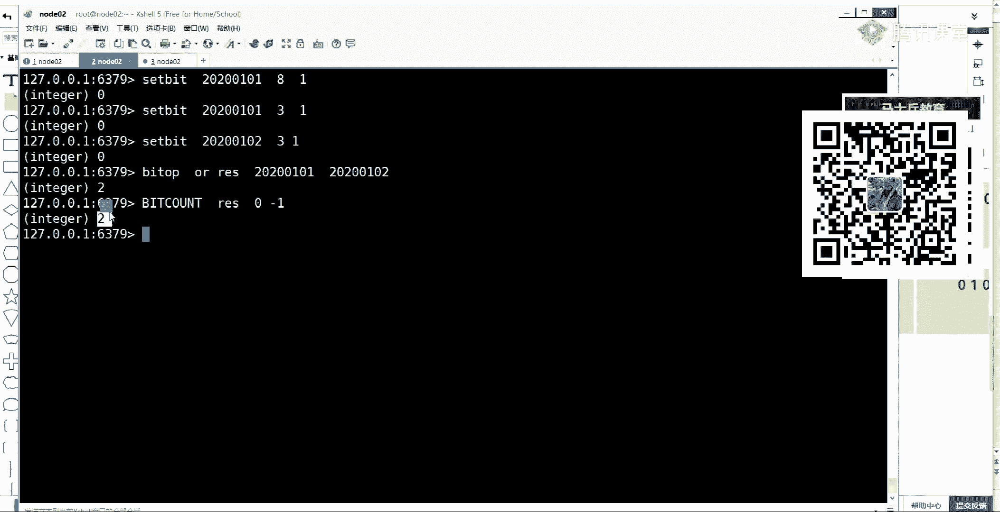

对吧这是一个统计。比如说这个上次讲课的时候就人说了，你这根本就不符合什么，我这个这个这个这个需求，我只是给了你思路了，条条件反射。其实这里面这个场景它可以是外b的，也可以是离线的分析。一件分析场景。

因为比如你公司老板就说了，今儿年底了，咱就算算这个活用户数或者怎么做一个统计。你要么用java写一个程序，要么你学一个大数据的have学一个数仓，要么就是把离线的日志数据读取一遍。

用你的java语言IO读取读一遍，把用户数据结构化之后存到数据库里或存到readit要么写circle，要么用它的2be map去分析。或者其实还有一个场景。

这个场景你们大多数尤其年龄比较大的人都知道这件事情。负一是他的所引反向的。这个场景是工作年头比较多的人都知道的，就是在我们的OA系统啊，或者是等等系统，只要他有部门有权限的时候。

或者你学过lininux。它的RWX有权限的时候，其实我们可以建张表用N个字段。代表这个人在不同的部门，不同的模块当中有什么什么权限，或者是把这么大量的一个最终在磁盘占这么多存储空间的东西换成一个。

int类型四个字节，4832，你有32个模块，那这个人在哪个模块上面有权限，在那个固定位置打一就可以了。

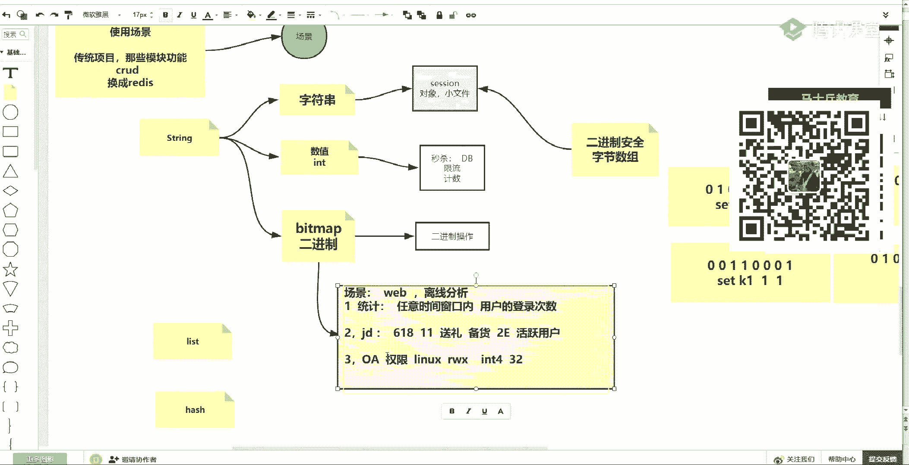

对不对？你比如说在我们lin那的操作当中，你会看到这样的一个效果。比如说。CDTMP目录。我的makeDR一个全圈叉叉一目啊，CD圈圈叉叉。然后在这个目录下，我touch。一个文件啊，圈圈叉叉点TIT。

那么这个文件注意这个文件它的权限是RWXRW是空RR，那权限是什么意思？如果我想让这个文件啊谁都能读，谁都能写，应该怎么写，甚至mod这个命令就修改你的圈圈叉叉点什么呀？是不是777就可以了。

那这个777这个7是什么意思？3个20制位1244加2等于66加1等于7读写执行。如果都有权限的话，是不是三个一正好是7。第二组里边这是用户的组的和他人的，其实三个不同的维度。每个维度权限全开的话。

就代表3个20制位都是一，那就是777。这回来看是不是每个位置都给它开启功能了。这个很直观吧，这个是不是很直观了？😡，对不对？如果说我就想让用户自己可以读写，其他人都不不可以怎么办？😡。

是不是春之mo的让自己是7，别的人是不是都是00，然后圈圈叉叉。是不是把别人的权限关掉了，那一是不是都给都给减掉了，这是十进制表示方式，底层是不是就二进制3个2进制位。如这只是三个啊。

如果你公司有50个模块，一个用户有50有50个模块当中的不同的模块开启的权限。你是不是只需要在不同的位置打上一就可以了？比如说天之帽子。这个是724宣传章这啥意思？7就是全开二的话。

是不是中间W4是不是R读读，你是不是可以很灵活控制这这个这个事情，这是十进制，最终是要转成二进制的。在这边是不是就是相应的s beat？如果是7的话，是不是就要给一个K1？

假设啊假设那个那个最后三位应该是7655上打了一个一，然后六上打了一个一。然后。这个西上。打了一个一，那么这个字节代表的什么意思？就是前面前面是5个0，后边3个1。

你如果想看这哥们儿在五这个偏移上面有没有权限，是不是一get beat。K1这哥们儿的555假设代表的是能不能去KTV回歌一能去玩的吧。假设四假设四是这个这个这个这个睡觉，4get0啊，你不能睡觉。

对的。

是不是这意思？哎，好收好收收收，这是他P map在这。然后这个场景就是前三个，还有一个场景在这不做展开。我只是告诉你，一般你听到的布容过滤器。Yeah。所有半布的车人。什么叫做布容过滤器啊？

布容过滤器是不是用的也是这种20日的操作。但是这时候布容过滤器，你在你怎么去用的？各位用过布容过滤器的，怎么去用的？你是在reice里用的布容过滤器，还是在你的客户端代码中用的布能布容过滤器？Yeah。

用过布能过滤器的刷一下，你是用的regs的布能过滤器，还是用的你代码当中的？布能过滤器。在代码中对不对？我告诉你reency是模块化。re利士自己就有布容过滤器。你不需要写一行代码。

你只需要调用就可以了。同学们，它底层用的就是。这个这这个beat map这个这个这个这个这个事情好收。这是光一个string，我跟你讲的，它能做字符串，但是你要二D安全，它是字节数度。

它可以存对象实session，什么东西就可以存。它是数值可以有秒杀限流，然后统数值统计。它支持二D操作，可以有相应的一些场景统计离线分析。不管怎么样，都可以让reice插到光一个str插到不同的环节。

不同的场景去使用string听名同学拉1286。好吧，就光一个str，现在你你感受一下，你感你你真的切身的感受一下。现当于如果把你放出去面试对了，聊到readit环节了。

你低头想想你公司的项目是不是有一部分东西就可以readies实现替代，或者就就这个这个了解的话，你项目的感觉。还有你对技术离解的感觉就不一样了，逼格都不一样了。是吧哎有点懵的话。

代表基础这块可能用的不多。下面呢就到咱们这个视频是可以支持回放的，好好学好好看就可以了。限流怎么搞不隆，这个这个就不不先不扩展讲了，这个东西扩展讲光了一个就可以讲一节课。我们先把整体性的给你穿完了之后。

我让你找到知识的一个脉络体系。剩下的事情你只要这个能托底能hold住了。剩下扩展的时间慢慢去扩展式不就可以了。下面讲一个list。好，脑子flash一下，把大脑也 flashlash一下。

开始这个讲listlist是一个什么东西。list首先我要跟你说list是列表的意思。在我们已知的呃质体当中，链表的话，比如说单向列表双向链表，有环无环，对不对？那么在read当中链表是双向什么意思？

一个元素既存了自己的数据data，又存了一个向下的指针，还有一个是向上的一个指针，就回列的指针，它有它要往往往前指的指针，所以一个元素可以往下走，这个元素还可以往上走。

而且它是建段是KK里边除了就这个K啊，除了K叫查K里有指针能找到这个value，在一个K当中既有这个链链表的开始那个元素的，又有这个列表最后结束那个元素的这两个指针。

所以在使用reies的链表这种Y类型的时候，你给它很多元素，你访的头和仿向的尾都是O一复杂度，一下就过去了。两端都可以快速的访问到这步能听懂回来说2波一。

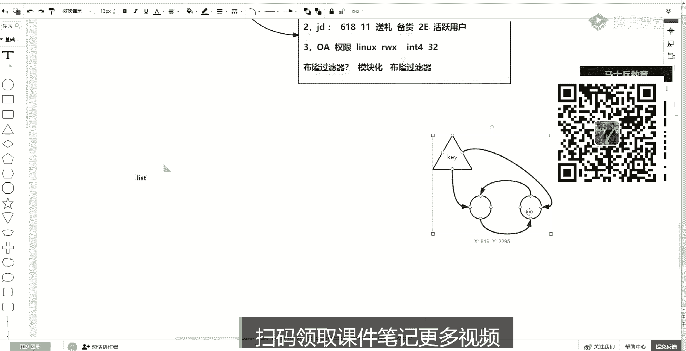

Yeah。好吗？为什么要讲它？因为链表其实有很多。可以聊的事情list。啊，list似这个we类型里边有很多的指令，有很多L开头的，或者是L开头的。在reis有这么一个命名规则。

你的w类型的首字母一般是它这些指令的首字母。在例的时候有一些特殊，一些不是L开头的那其实这些个L和L有一部分代表的是方向的意思。我给你演示一下，注意听。

如果是L pushush复ush是箱列表里推送的数据，比如说K一里边，我要推送ABCDEF一共推送这么346个元素到我的K1里。那么回车就能推送进去。这里面flash忘忘了清步了，清一下L push。

K1ABCDEF推动那么多数据。那么数据推出去之后，请问这个链表不是翻车啊，不是翻车。刚才我忘了清库了，链表里边ABCDEF的百列形式什么形式的？

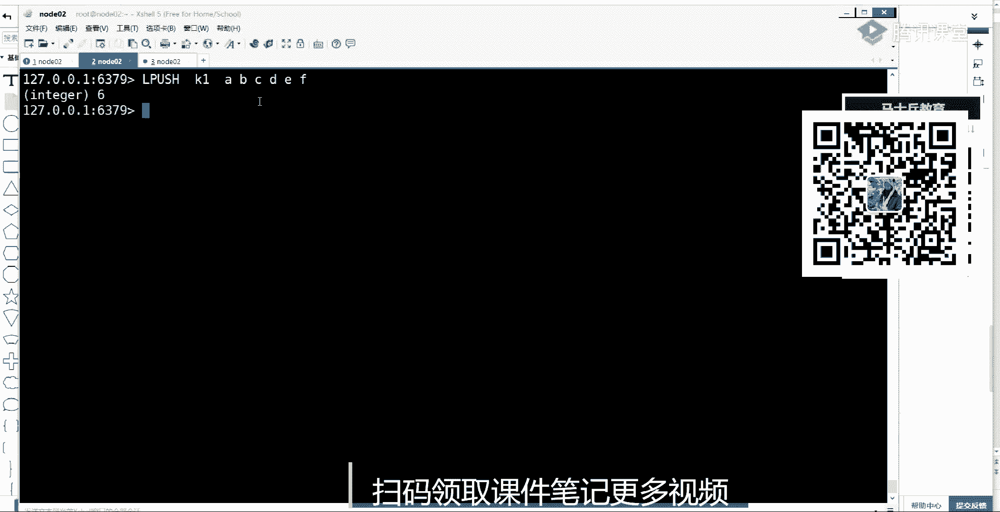

Yeah。

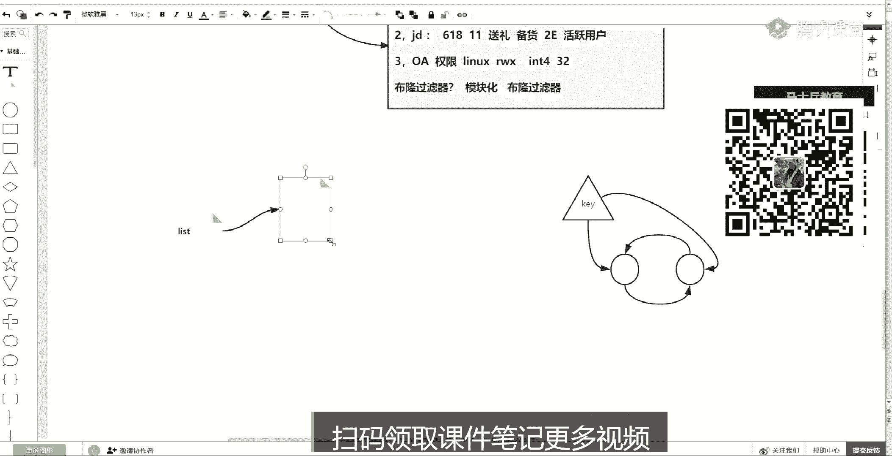

注意听它其实链表是有顺序的，但是这个顺序不叫排序的一个顺序，是你放入的顺序，从左边先放入A再放入B，那就是在A的左边放到一个B。所以它放进之后，你可以用L range可以看K1从0到-1。

就从左边到最右边完所有元素展开，就是FEDCBA。他有放入顺序，首先例子有一个放入顺序。

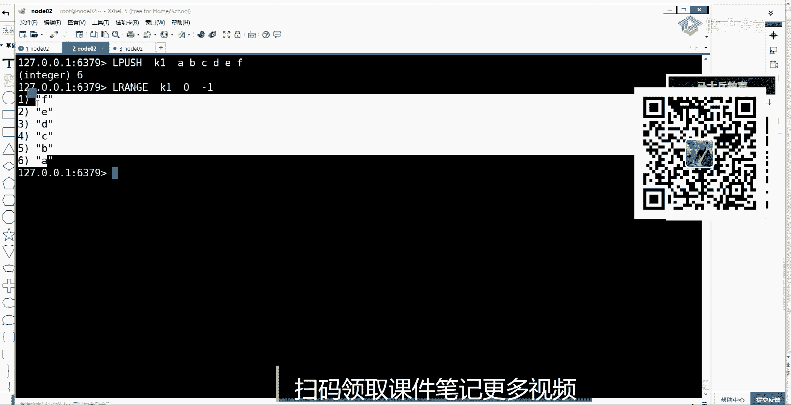

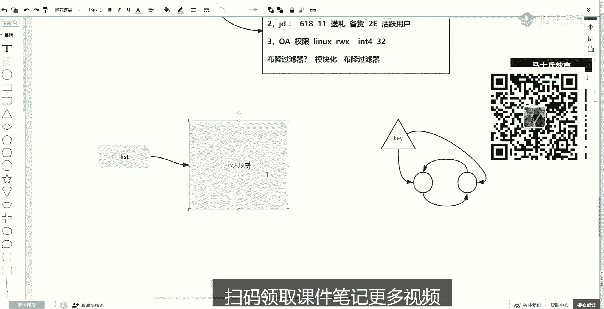

好吧，你能从左边往里放箱子也可以从右边R对我的K一放入XYZ。那这时候放进去之后，它是从右先把X放进去，然后再把Y放进去，再把Z放进去，那么XYZ是顺序的。

比如说我们可以通过L rangeK1从0到-1是不是就是前面这些元素是从左边插进来的。XYZ是先从右边先把X扔去，再把Y再把Z扔扔进去，它左右是有方向的。好吧，那么结合这个方向能往里插，还能弹。

比如L泡弹出我的K一弹出一个元素，F出来了。RK一就把右边一个元素，Z就弹出来了，两个方向都可以弹。那它为什么给出这四个两个方向的命令，其实你总结一下就明白了。

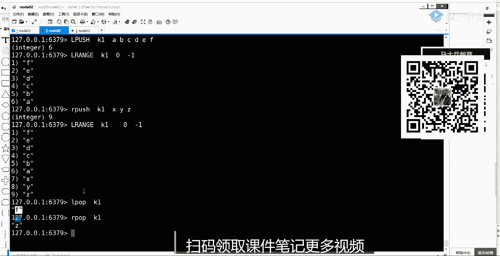

如果是同向。同向的命令，它这个list可以完成另外一个数据结构。这个数据结构叫啥？相同的方向都是左边放，都是左边出。

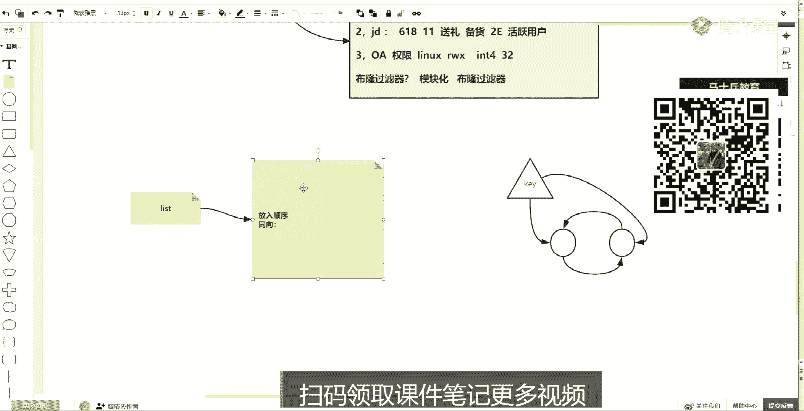

注意同一个方向。我给你演示一遍L pushush左边我们脸完K2里边放了ABC。那么最后其实L range最最后进去的是C。最后进去了C1，但是L泡我的K2却把C先弹出来了，这叫站同向为站。

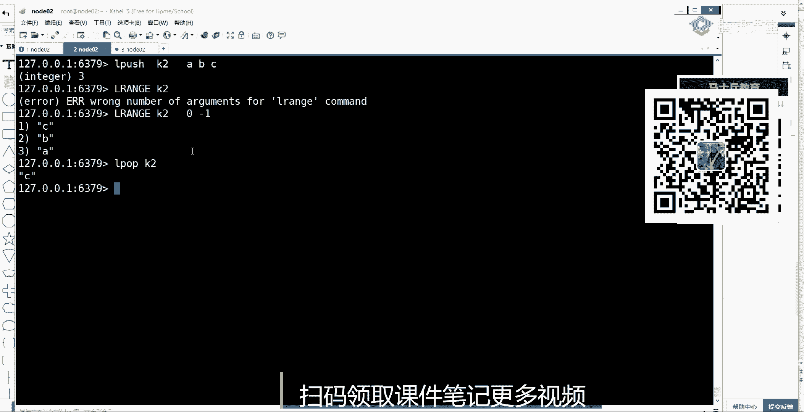

就是他还可以模拟一个站，然后意向的话。就是方向相反了。是为什么呀？队立？左边左边进去，右边出来，左边进去跟一个管道一样，这就队列了。Q对不对？啊，除了它可以模拟这些东西，还有一个L index。

然后K2K1，然后给出一个下标3。

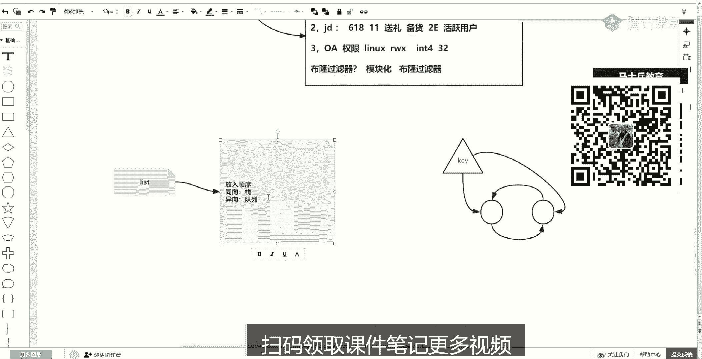

给出一个下标，可以取出一个值，给出一个下标，可以给出平你返回一个值。这个东西它又可以模拟数组。

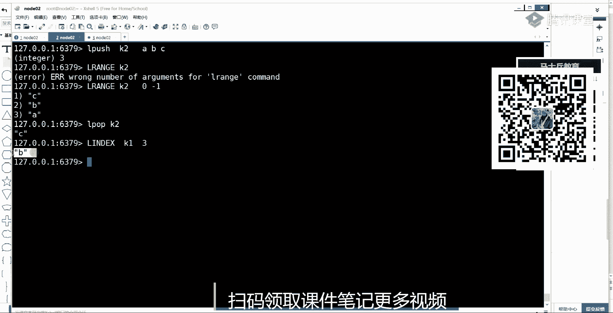

是不是还可以模拟数组哎，而瑞。那么现在站队列数组它都可以完成了。再来看还有一个功能，还有一个功能。

是先看L range，我K1从0到-1有EDC，然后一直到XY这么多元素。注意它有一个Ltrain。trim我们的K1trim是清除的意思，删除的意思，删除什么东西，注意看从0到-1。

它删除的是你给出索引范围之外的数据。当我回车之后，请问还有数据吗？从0到-1，这里边还有东西嘛，要render这个区间里这个0到负一区间里边还有吗？有注意听它删除的是你给出的范围之外的。

就是从零到-1之外的东西，它之外也没东西了，就没删它的正确使用一定是怎么样？L trim从0到就到3。0到3就是0123，就留下的是AXY这么删，你再用L rangeK1从0到-1。就是这这他留下的。

把它删删除删除这个0到0到3之外呢，就是00123，这是他留下的这些东西被删掉了，他删掉之外，你给出这个这个这个它之外的东西啊，刚才刚才这样说反了，不管怎么样，它能删除你给出区间之外的东西。

那么它的应用场景是啥场景啊？山场去。比如说你有一篇博客下面堆了好多的评论，好多评论，好多评论。但是人们看评论的那个。特征是我打开页面的时候，咱们一般就给它显示第一页，后边几页就不要了。

他点了下一页之后才能看到，对不对啊，或者一些预加载的这种这种数据，我就可以放在缓存里边。用户有固定的点阅读更多的时候才会把东西再刷出来，其实可以把数据截断到两个地方，热数据在reise里边。

多余的数据给它清定期的给它清除掉，保证你reice内存流出来，截取的意思啊，就这个意思。

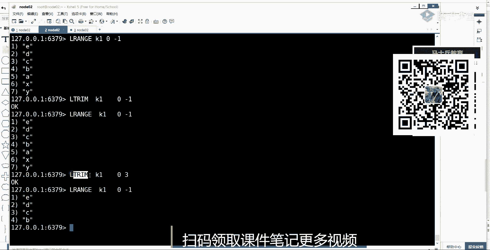

这个点这个点一定要记住了。Our train。好吧，那讲到每每讲到这儿啊，每每讲到这儿的时候，其实list似的这东西就这么这么去用。但是在这儿其实有扩展的，它的这些个东西的场景可以解决什么东西？

尤其在场景上可以解决解决哪些问题？场景它的场景是什么？可以解决哪些问题？那些困了的难受的就去睡觉，保证你的一个体力，明天在上班嗯。这个别把节奏带跑了，你这老卡困了困了，我也困了。

对吧别人别别人别人困不困。对你们一唯一独给大家喊课呢，他真的不上课了，对不是？它的场景是什么场景？大家能想一想。别一提reis秒杀抢购排行榜，把你的视野放大一点。因为你现在时时刻今天听我的课就在想着。

假设你的面试官就坐在你的面前，假设你的面试官就坐在你的面前。那我刚才问你场景是什么的时候，你就把我想的就是面试官在问你。可以做什么？我告诉你一句话叫做。其实讲sring的时候带出这句话叫做这个数据共享。

或者是把状态迁出。因为你想这个东西嗯如果不给你归，我为什么给你总结这个分类啊，为什么给你总结这个分类MQ那都是弱的那那那些个大大家都会说，我给你一些。更高级的说法。你曾经用java。

java会有一些collection。你学炸样的时候会有一些集合的操作。这个ja的集合操作是在DVM里边的。😡，现在随随便便的话，订发一多，或者是你的服务器性能低。然后呢。

这个模块没有拆分一个项目东西比较多，然后它能承受的高端连接的数量比较少，进的比较慢。然后这时候随随便便呢，现在就得就得有一个所谓的分分布式。然后这个负载均衡。然后抗并发等等的一个一个概念。

也就是你的同一个业务，它就不是一台服务器了。它可能把当起三台服务器来做一个负载均衡。那起散来之后等于有3个GBM。那么你其中一个GVM里边如果准备了一个数据集的话，准备了一个数组也好，准了一个也好。

也好，准一个也好。那么是这个GVM玩绝能玩明白的。但是另外两个GVM没有或者换言之上面说那个session，为什么session要共享出来，你登录了一台你登录另外一台那台里边没有session。

那你就还要重新登录，一定要共享出来多个并行的东西一定能读到同一个ession才能确定个这个权限，但是session还是相对比较简单的一个自符串而已。但是其实有的时候你需要共享的数据。

它是符合某种某种集合数数据结构的。那么我就可以把它迁出去，把站啊队列啊这种使用的曾经在1个GBM里东西迁迁到一个共共共的地方。听出来刷边音。那这样的好处是什么好处？就是微服务当中常这句话叫无状态。

因为你现在只有两台服务器做负载均衡并化大了，你再加一台变成三台了。但是第三台的启动的时候，你得思考一个问题。第三台8G启动，然后他是不是要先找前两台去获取数据同步，对不？

因为家这两台里边可能GM里边有一些堆列有些数组，有些东西有些数据，你不知道因为这些数据同步过了，你才能接着用。但是如果你同步的话，那这时候其实人家那边还在变化着，人家是阻塞住了，给你同步还是怎么着的。

这是一个问分布出问题，就是分布式很疼。但是如果曾经那些台，他们不自己你有自己的de collection，而是把数据全都写到一个公共的一个reis里去。第三台启动之后，他只要能连上reis。

他就有这些数据了。实时的变化也能看到。听回来刷波6。起码可以支持这个这个这些特征，对不对？而且我一再强调的是，你之前做传统项目的，我现在讲这些东西，你要低头看自己项目了。哎。

我在项目当中action就这个conter里边这个就是使用这个strring的时候都是单例的。单为什么单例单例里边其实你对象只有方法是没有属性的。单利是不是不能有属性？有如属性的话。

是不是一并发处理几个请求的时候，那个属这个属性是不是就就就就就乱了。一旦有一个数据，大家都想访问的时候，是不是得加锁啊？对。能听懂我想说什么意思吧？哎，单立的东西是没有属性的，只有方法。😡。

但是这时候如果有你在1个GVM里边，如果你你肯定有的时候是哎在几个县程，几个用户的连接读到的时候，他们处理的时候可能会有一些数据是共享的，得加锁，你把它迁出来，迁到read里。

readis还是个什么东西啊，它是单线程。你比如说你在经营当中，你可能会用到一个东西叫做conar hasab。Okay可以。卡克的哈 map可以起到一个什么优化呢？卡克的哈希可以起到一个什么什么优化。

如果俩县程，如果俩县程他们访问的就是尤其哈希 mapap和这个这个卡有卡如果两个线程访问一个一个哈 map，他们在获读写自己数据的时候，是刚好是不同的链上。哈希 mapap是不是组加加列表。

这个是仿的他那个那个那个T的时候，是在一链上，他仿的是三链上。这时候其实他们两个线程之间是没有锁的。是不是没有锁？😡，听明来上边一。因为它链锁这个这个锁锁在链上嘛。那这时候其实你你去想一想。😡。

如果把con哈西麦吧，一会儿我讲到这个reies的哈西的时候，或者是反正就是reies是单线程的。如果把这个数据结构迁到rey，re是单线程的。你即便两个县城想想操作什么事情，到那边也是串钱化的。

连锁都不需要了。好吧，听明白的刷一波666。😡，Yeah。来，我给你们推荐一门课程。你老提醒我，咱们这个这门课程就是马成平教育的课程。从小白一直到架构师，对不对？

证明这明技术技术上面还是有一些有些东西要补，对吧？不慌不慌啊，明天我告诉你结果，今天咱们先讲知识。好了，这是关于list史啊讲么多就可以了。小白的架构师绝对可以支撑你啊。例子讲那么多，回去总结思考一下。

然后下边讲一个啥，再讲一个讲一个哈希。Yeah。为什么例子要做数据共享？list可以做这些事情，我只是说就着它，我再给你扩展一下reis，可以做一些数据共享，把你的服务当中的状态迁出来。

就是有状态的数据迁出来。就是不在你的GBM里去存了啊，GBM可以用集合，也可以用对reis去使用这个集活，对不对？🤧。好了，那个我正好我明天会我明天也会讲这件事情。

明天明天的课程内容当中就会牵扯到微服务的划分AKF牵扯到从一台redis变成多台rease。然后你的数据的倾斜，还有分制的过程。那么下面讲一个哈西哈希是一个什么概念？

你就把它想成是java当中的那个哈希 mapap。我们来说一下啊。

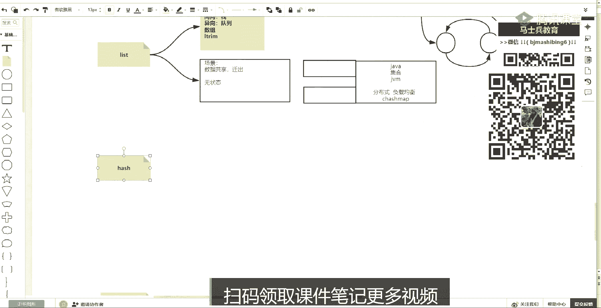

比如说我先清一下库。嗯，这个help来学习一下哈西。哈西里面它的指量你看都是H开头的，因为你这个Y类型是哈希类型的，都是H开头。那H开头的时候怎么去做？再对先讲查之间，我先说啊，如果没有哈希。

你怎么去做哈希会有什么好的地方。你用sring就可以完成这种尖段的存储。比如set一个肖恩，然后呢name，然后是周志磊存了一个我的名字。是周志磊，然后我还有我还有别的属性呢。

再s一个肖恩age是1个18岁。那这时候其实这里面case星里边就存了关于我的两条间立段的记录，两个不同维度的valueel都都能取出来。这个能听懂吧。嗯，但是这时候其实如果你要真正想取回我所有元素。

怎么去取啊？你在客户端一定时间是case，然后肖恩星，因为肯定还有其他的维度，你要先得到一个K的列表，然后再M get。然后取回肖恩的。name然后在肖恩的age。你再给他取回来，不管怎么样。

你扣户端进定了两个环节很麻烦，这是第一点。第二1点。那么让他简单一点怎么去做？其实有H set，就是在s前面加一个H，这这是哈西的那那个那个那个维度了，它它的它Y是建这对了。前面前面我们讲的这个字符串。

它的Y就是一个单独的一个元素，但是后边这个哈西就是两个元素了，是建这对的，你可以这样去设置肖恩，然后它的nameJJL，然后再H set在肖恩，它的H是18这个写法上成本上你感觉是一样的。

但是case新的时候，肖恩就变得很干净了。只有一个，那这种写法有点太恶心了。那这时候你可以怎么做Hget or取回肖恩所有的连skimer。在value就field value都取回来。

你封装一个金字字符串，前端就可以展示了，或者是前端里边已经有固定的这个smmer了，只需要这个数据，那就是H values肖恩，那只会把数据取回来它的名字和和我这个这个大小jason直接发回去。

或者前端说我先预加载一下这个用户的这个skimer表格这个清单我不需要value值，还有H case。肖恩，你把这个取道之后，返回一个jason，那前端就可以画一个表单出来了。不是个嘛是个嘛是个嘛。

好 field。这个能听懂吗？原来刷波一就变得就变得异常简单了。😡，对吧，而且不只是这些操作，他还有什么操作？H increase increase by就是做加减加减操作。因为在这里面我肖恩。

的age是一个数值类型，我让他加1岁，那么就变成19了。你可以Hge肖恩的age单独取就是19岁。看来效果了吧。那这时候想一想，你只需要将肖恩不只是nameage加上一堆。比如他的好友好友的数量。

然后他的粉丝的数量，他购买的商品的数量。然后他这个活跃的天数，这种数值的都可以做。然后还有这个数值还能做增减。所以这时候其实哈西首先他是限立段的。

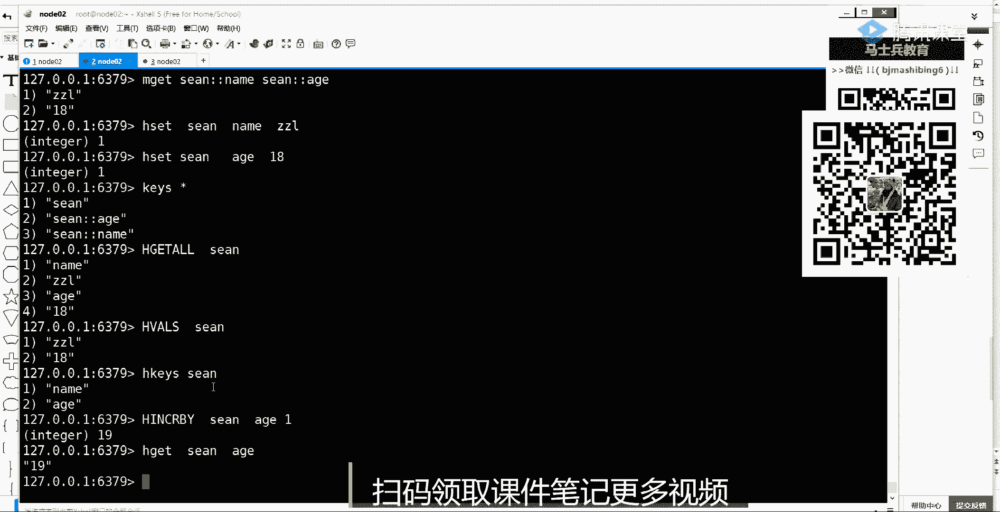

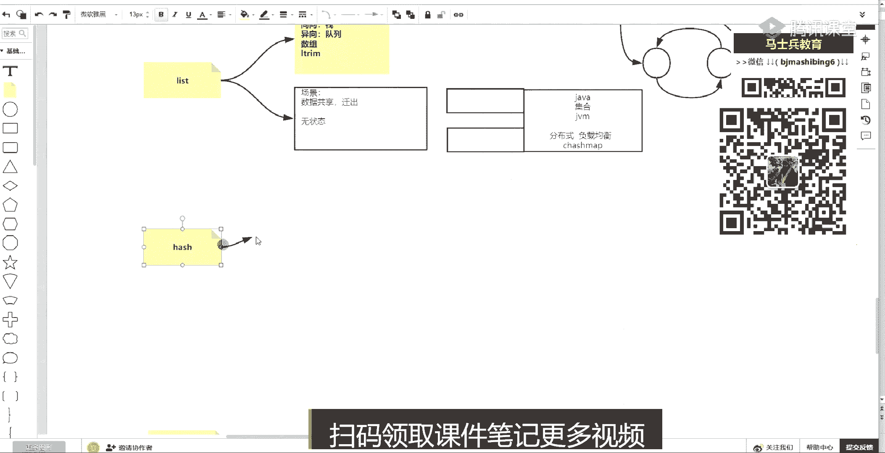

就类似于我们的哈西曼。你曾经可能是在你的GBM里边用了一个哈西 map，现在是不是可以用reis的哈西把你的GBM里边这个哈西ma是不是给以迁出去了？

那么另外一台是不是看到你写的一个hy map，他也知道那个用户有查了，也能取到的来，就数据开始共享了。那么一般它的用场景是什么？它的长景是啥？他的应用场景什么场景？跳什么场景？想想，比如说比如缓存啊。

我我承认缓存rener本身就做缓存的。他说的具体点，你公司项目中哪些东西可以拿过来用？原子的它的所有指能是原子的对象存组啊，可以这样理解，就是非非非句体化的这种对这个对象的存组。那么除了对象呢？比如说。

商品详情页。商品详那页里边有什么东西啊？用户啪点了一个商品了，这个商品当中是不是得有商品的详细介绍，然后有他的这个商品的这个ID，然后他的购买数，然后他的喜好数，它的评论数还有一些数值，这数值还得变化。

对不对？产地规格所有东西都画画在一起了。能理解我想白达什么意思吧？就商品详页，这是不是可以可以搞定了。还有什么？他其实这个这一类的这个商品详页这一类的东西叫什么？叫做聚合。场久。什么叫做聚合场景？

本来一个关于一个人一个商品或者一个行为，它有很多维度数据，维度数据可能来自于不同的模块和库表。比如说关于一个人他的基本信息来自于用户这端，然后这个人的配偶信息，工作信息可能来自于其他的模块。

然后这时候如果前端想调取这个人的全量聚合信息的时候，一个请求过来可定要访问不同的模块，不同的库表对不对？能没有说能理解我在说什么意思。那这时候其实是不是我们可以。用reds做缓存。

把这个人的所有聚合数据在不同地方上聚合回来放到缓存里边。然后用户在请求的时候就不会透穿到很多库里去了。听来刷波一啊。现在讲的是winow这个使用场景啊，像人们的可能性啊，然后为这个这个这个高频发情况下。

这个性能问题。那个时候你下节课要讲下节课讲。因为这个牵扯到主动复制集群啊，持久化呀，然后牵扯到这个业务划分AKF之类的。啊数据前置嗯，好，那是这是它的一个大大一个一个使用场景啊，它有两个优势。

一它会让你的数据更规整一些，不用。

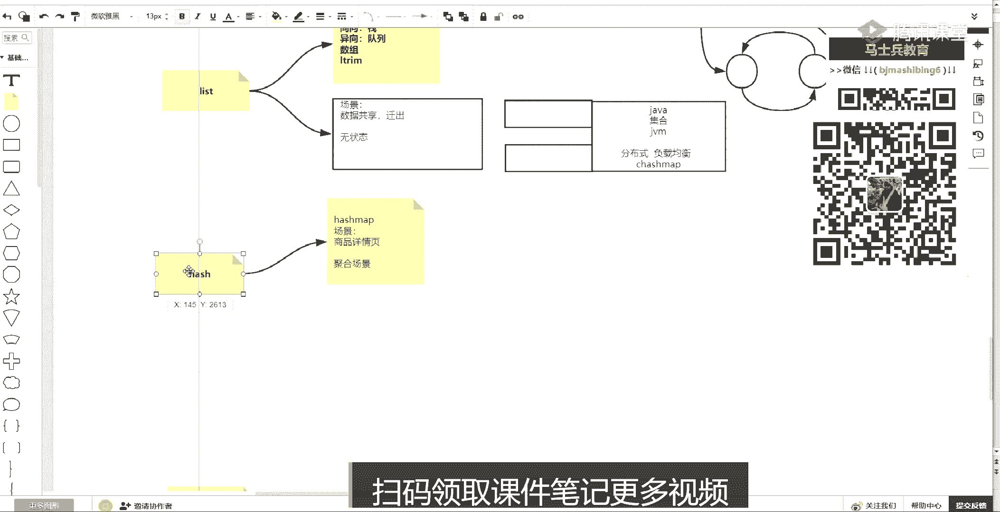

有很多的K，因为K越多，让你的整个reis的维护成本很高，它虽然单线程，但是它是一个死循环。每循环里边或多或少会有一些事事物要做的。这个事物，比如说判断哪些K是不是该该该过期了呀，然后等等的。

如果这个K特别多的话，那就会出现问题。它的便利成本很很高。但是这样一收敛的话，那整个肖恩的一套属性，就归属在一个过期的时间这个这个判定之内。

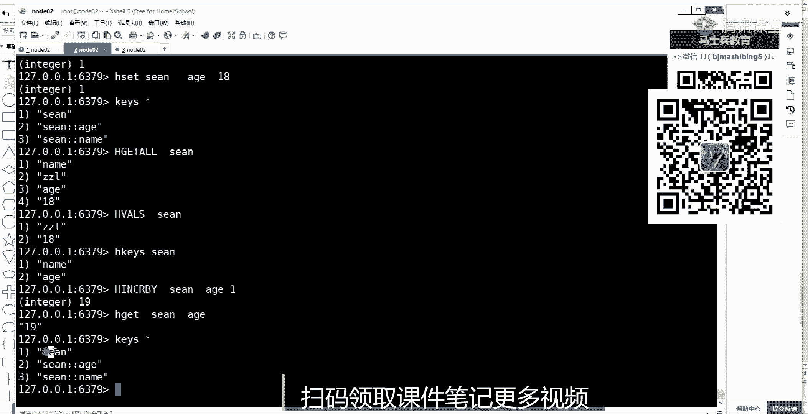

Okay。这个我在这再吐槽一下，你看你是过来听课呢，你还是关注一些没用的东西。就是有一些人在这一节课里边啊，有人上厕所了呀，我听着好晕啊，我想睡觉啊，我困了，你是你会了，你不想让别人学呢，还是说。

你是别的地方来的人，你上这节课不想往下讲了。对吧你关注的点却不一样，这个这个这个这个这个就。🤧就不对了，对吧？好了，接下来聊啊，再聊了一个set含剧这么多啊，这个这个直播场景。再来一个是set。

 set是什么意思？set现在表面来说一下set是什么意思。激活嗯。那集合是什么意思？集合哪些特征啊？记住了，集合有一一定什么呀？集合是去虫的。就是集合里边是没有重复数据，对不对？嗯，集合是去重的。

除了去虫，还有什么能力啊？集合是无序的。啊，集合是无序的，无序且去重的这为什么要可以强调它？因为在前面讲了一个list，list是有序的。但是他这个序不是给你排序，它是放入顺序。

是放入的这个这个这个顺序。然后后边还会讲一个Zet或者sty set，这个也是一个集合。这个集合它会给你维护排序。他会排序。而我们的set是集合是无序的，而且这个无序更强调一点。

它每你可能有一次看之前看的是可能是这个这个几个元素这么摆。一会儿数量多了之后，他的这些元素的前后顺序又颠倒了。他可能会颠倒，为什么？其实这有一个基本的一个常识，有一个常识，什么常识在比如在JDK当中啊。

在JDK当中。hy set其实靠什么东西实现的？hiad其实靠什么实践的？底层就是哈希。卖只不过他的歪了。we now对不对？啊，维ow只是存了K，K，只要有重复的，就反正就最后就key就是一个。

但是这时候只要谈到哈西麦吧，元素变多的时候，就一个支点，没试官肯定会问。棉数变多了，这就是就哎，没错，瑞哈西。就开始扩他的哈西这个列表的这个这个这个这个这个这个数量了。准意哈气的时候。

其实会让你元素本来是出现在一链里的，结果出现在二联这个这个这个这个三链里去了。吕哈希会打乱他们的顺序，对不对？啊，这是一个最基本的一个常识啊。

所以这里面的无序就是去虫无序且无序在整个生命周期里边对无序还变来变去的会变化。变化是因为你触犯了吕哈希啊，扩容的时候会造造成这件事情。🤧那么在讲集合之前，首先你要明白集合里边一般我们存的东西比较多。

然后它的成本比较高。就结合的操作一般成本比较高，一般都不推荐使用。当然这个是你在网上搜到的，说一般不推荐使用集合啊，集合这东西rease设计这东西有问题啊，一怎么着一怎么着就一怎么着一怎么着，对不对？

但是这时候其实你要真正理解了这个现在的项目架构的话，这个东西其实不同的实力，不同的节点，不同的rease进程，给他分配不同的工作就可以了。也就是哈希 mapap也是无序的嘛。

所以这这两个端点是来这个set上，哈希 mapap其来自于哈希 mapap的底层那个re哈希扩容这件事情。

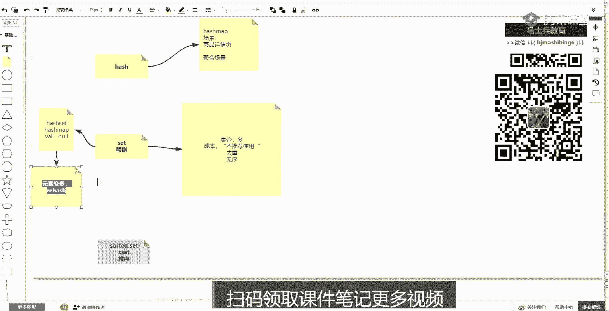

Yeah。马上下课讲到几点，马上下课，我再讲一个点我下课，好吧，很快了，我马上讲完了，你注意听。😊，首先。Help。Set。😡，set里边他给出的指令的首字母都是S了。啊，来一个都是都是S了。

那代表s这些指令。这指令里边比有S at添加给出key，然后给memmeme和memem添进之后就变成一个集合。这个过程肯定是去重的，还有different啊做差级的，然后还有这个然后我来了。

就是做这个这个有。差级，然后交集，还有一个是病级案，还有一个什么操作的人？还有一个S round member啊，这个随机弹出。我给大家举个例子啊，S艾给出一个我先清步啊lash。

全清掉它SI的追加到K1里边，追加什么东西，就是圈圈叉叉叉叉圈圈，然后圈叉圈叉叉圈叉圈叉圈圈叉圈叉叉圈，然后圈圈叉叉。Yeah。当我给一个集合里边放入这么多元素。

这个元素里边有我特意的制造了一个重复元素，而且我在往里放的时候给出了一个他们放入的一个顺序，加击我就填进去了。填进之后，然后呃我如果取回所有呢，就是Smeers。

给出K一就给你返回它里边真正存了多少元素。回去之后，你就发现我上面给了一个2个、3个、4个、5个、6个7个元素，但里面却存了6个，且圈圈叉叉这个东西就剩一个了，也是代表它真正的去重了。

且我放的顺序是圈圈叉叉圈圈圈，却不是那个顺序。因为它里边是一个哈式的过程，而且你可以去看。O be get in coding。我们的K1哎。EncodingK一就是一个哈西table。

set其实这个K一是不就就就是一个就是一个一个一个s，对不对？因为你tap K一，它的we类型是set，但是它底层存储的是么I排机表去存储的。

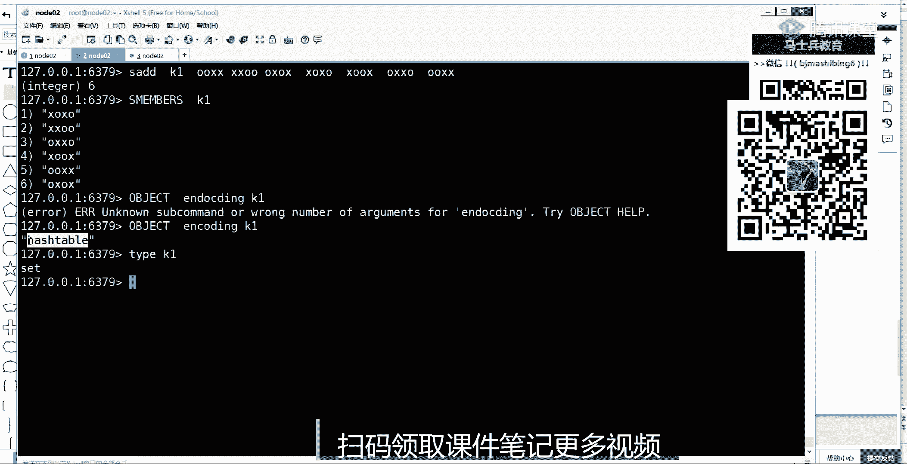

这个是不是跟我所说的所有支点就挂上勾了，听不同学来2分6。对。当这个能听懂之后，再来往下捋。用集合我们都做什么事情啊，用集合我们都做什么事情。

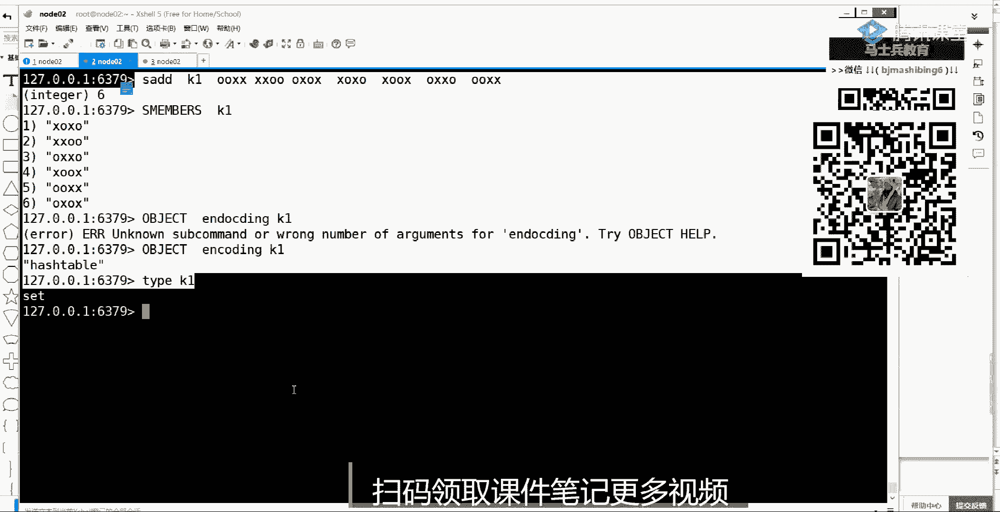

比如说在随机事件上啊，随机事件抽奖上这这种这种场景当中，比如说Srun。的ran random就redom member随机的一些个元素给我拿出来。给出K一。

然后后边注意给要给出一个 count的一个值，你要拿出几个拿出几个里边，注意有这么几几种情况。刚才是6个元素啊，你可以-三或正3或者是负8或者是正8两大类，要么是负数，要么是正数，这个数可大可小。

就是能给出的数值有这么几种情况，我一个给你演示。如果给出一个正三的话，注意，无论是正这个正数是大小，它都是取回一个呃这个集合。只要给你返回的，依然是一个集合的话，是一个这个驱重的一个集合。所以你怎么取。

它里边都不有重复值，这是正数，正3。如果你给出一个负3负数是什么意思？你给出一数值。如果负的话，代表它返回里边有可能会有重复的。比如你取着取着。你取着取着啊，这这这这是不是重复了，这俩是不是重复了？😡。

正数是绝对不会给你返回，有重复的，负数就有可能给你返回，有重复的，小于的时候都可以好理解。但是一旦这个数变大了，集合就6个元素。如果给一个正数8，因为它的语义是返回一个去虫的集合，它就返回了8个。

它最多给你返回6个，因为这是去虫的，它不能拿别的给你往上补。然后这时候如果你给返回一个-8，负数是可以有重复的。所以这时候呢就绝对能给你返回8个。然后这里面因为是有一些重复。哎，就是他给这个取值特征。

现在听懂同学来说波一，那么他的应用场景是什么场景啊？他的应用场景什么场景？随机事件抽奖，对不对？就是微博上咱们抽奖。啊，你比如把所有人名人把这个人名扔到这个集合里去了。你你有55件商品。

那你一个人只能中一件商品，你就用正数。抽抽5个就回来可以了。但是这时候如果抽奖的时候，一个人还能多中几个啊，也不要求很公平了。反正这个抽出10个人就可以，你就可以用负数。为什么会随机？

我不懂它这个指令就要在集合里边产生随机元素个数吗？😡，这没有为什么他就想做这件事情，他就想满足我们随机这件事情。😡，对不对？那这时候其实还有一种抽奖的抽奖的这个场景，什么场景啊？

是年会年会的时候是我们把每个人的号扔到一个箱子里。抽三等奖的时候，先抽一个，最后把这个号从箱子里拿出来，然后揭示完之后扔掉，下次这样这人就不中了，就不能中了，对不对？

那这时候其实还有一个指能叫S pop。对着我们的K一一次弹一个弹完弹完弹完弹完弹完没了，再推就没有了。因为上面这一人已经挨个中完了。好吧，这个这个随机事件这能能听出来。

邵波一这是一个随机事件可以用的场景，就是抽奖啊或者随机事件，或者你是想让用户玩游戏的时候，还有随机的这个组合的宠物，你都可以这么去做。你身问这个每个背包的颜色什么样，或者什么一个有有哪些装备。

你这个随机事件都可以用这个东西来做，对不对？

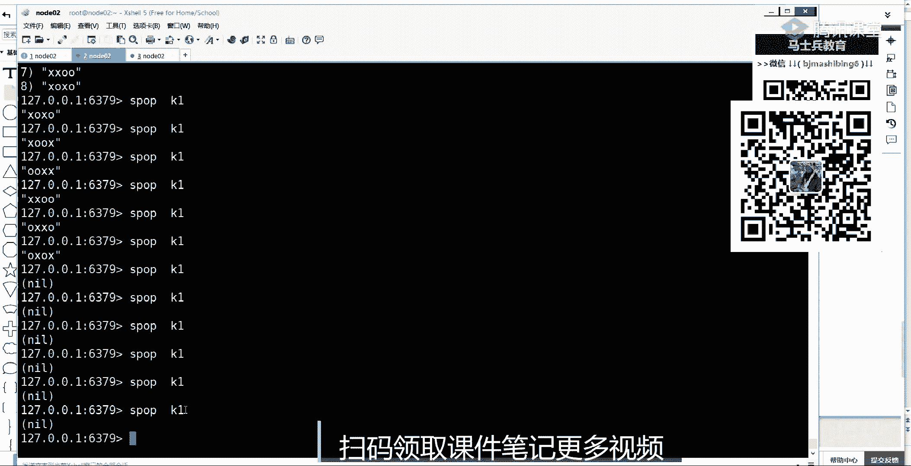

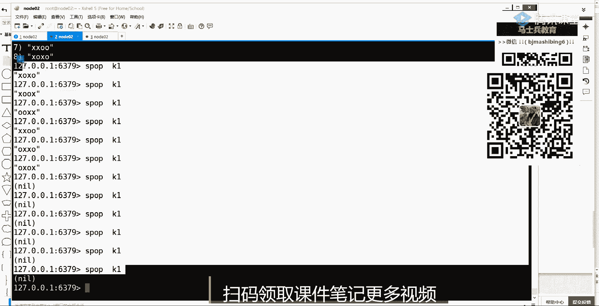

随事件是一个，还有一个就是它是集合嘛，集合操作才是它的亮点之一。但是有好多人集合操作性能很低。但是如果你单独用了一个reies，就为了接收这种集合操作请求的话，就是来弥补这个这个这个这个他性能慢。

阻挡别的指令这个执行这个这个延时的问题。首先您看是一个什么概念。我再创建一下这个数据集案。不老少。全清工了，然后我的S艾。然后对着我的K1添进去ABCDE添这么多元素，然后S。

艾对我的K2进去CDEFG。有俩集合这俩集合里边，他们其实如果发生交并差级的时候，结果是不一样的。先说并级Sun对着我的K1K2，如果说并级是什么意思？病级返回的集合，就是它返回的集合依然是一个驱重的。

这里面就会出现ABCDEFG的结果。防地是集合嘛，也是一个也是一个驱重的啊，这是病级，有病级，是不是还有交集，就是S。inter，然后对着我的K1K2交集是什么意思？就是CDE是他们的交集。

就反复CD这些都好理解。还有一个就是差级分为左差右叉、前插后差上差下差，一个差级肯定有一个方向的概念。差级是不是有方向的概念？那方的概念注意，抱歉，它的差级只有S different。只有这么一个指令。

那指令的时候怎么决定方向呢？你给出P的顺序就决定了方向。就是参照谁做谁的差。好吧，这个集合的操作也能看出来上边一。这里面好多人说了，集合现在这些元素，当集合数量庞大的时候，这种交集交本差距操作会慢。

所以一定要记住了，在你公司里边不可能只用一个reies，你公司可以用一个reds。

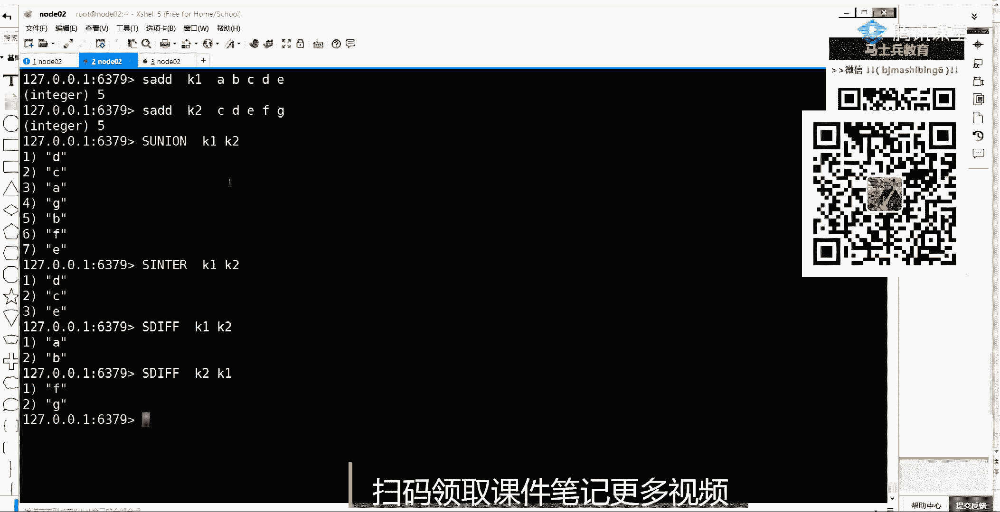

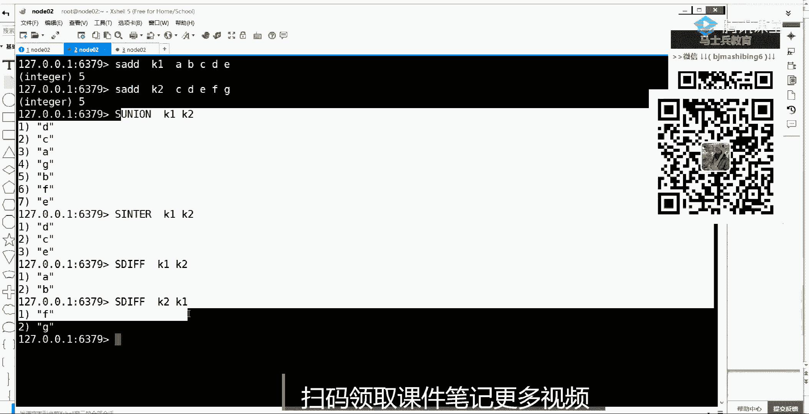

然后这里面就是一些简单的精简数据的建设对了。就是list呀或者是stream等等的。然后你再有一个redis。是专门放某某几个集合的，就某几个集合，平时有这种这种集合操作的，放这个readice里。

另外还有一些集合，你就放在另外一个readice里。这样的话，其实你业务，你的服务在有不同的需求的时候，它是连着不同的服务器的不同的进程。那这时候这种前面装轻量级数据的就会反回很快，不会受。

因为它是串行的。如果你把这三个reis合成一个redies的话，那这时候如果这个服务调了一个集合操作，然后另另外一个线程想想取一个值，那取值的在等那个集合操作完之后才能处理它就会就会被阻塞住。

所以要多实例reice再部署这个能听懂学刷波6。好吧，那么最终它场景是啥？场景是啥？场景很重要。每个我都会给你说的场景，场景是什么？不要认为它没有意义啊，不要认为说这个东西慢，就不要用它。

我反而推荐要让你好好去用它。第一个是随机事件。第21个就是他的集合操作，集合操作其实可以完完成推荐系统。比如说相同的好友。相同的游戏。明明白什么意思吗？你比如像像像如果想做这个共同好友，用谁？

共同的好友谁？两个人的好友的集合做一个交集。对吧共同的好友，那么推荐好友。用什么呀？是不是用叉级。左叉右叉你给谁推荐，就是调整好的顺序就可以了。😡，是不是差就可以了。嗯，然后你们这个。

像病级病级可以做啥，自个思考一下。但是我告诉你了，他可以做推荐。这个推荐的时候有好友，有游戏，有商品，啥事都可以这么玩。所以还是低头看看你的项目有没有代码或在数据库当中做过这样的事情，调成redice。

速度一样很快。就两个人的好好列表，两个人的爱好，两个人的游戏，两个人的这个这个购房。两个人的这个购买的理财产品。啥东西都是集合，一个人都会有这么一个集合。集合上面如果有交并差题。

就一定会有一些共同或或推荐的事情。当然这种这种推荐系统是比较low的啊，比较low的，比较比较快速精简的，立刻上手的。但真正的推荐系统其实一个庞大的一个多维度多系数这么一个过程。对吧嗯。

所有呃所有的好友数据都存在read，不是不是不是不是你只需要把这个好友的这个ID存进去，是不是就可以了？啊，你这是最简单的一个一个一个集合操作嘛。行吧，五大Y的类型讲了两个多小时了，10点多了。

从徐春林，我们简单简单回顾一下，这里边关注一下关注场景。从str类型看似是一个所谓的字符串，却不那么简单。它里边是数值计算。虽然是字符串操作，但是它二D的安全，你可以存对象，存任何东西。

小的东西都可以往里扔。那这时候其实它可以解决IO的问题。因为一曾经存在rease这这种二支对象的数据。以前是存需要一个磁盘服务器，需要Nd等等，需要这种发CFS。对不对？当数据量不是特别大的时候。

你影响速度快的时候，解决的要就是屏蔽到IO这个层级的时候，那这时候我们是可以用reis，就光字符串，都可以解决这么多场景，这场景才是最值钱的。然后关键还有一个be mapap这种20制的位的操作其实。

呃，作为一个一个程序员，无论是C还是java，其实对二定制的使用是一个独立的一个学科。你去上网搜二定制的操作，可有很多的场景，那个场景都可以照搬到reis上，或者是你比如我给你举个例子啊。

你们如果你没学reis。你要让自己面试的逼格高一些。你比有时候都会搜一些二定制的一个操作提升性能的一个这个这个这个这个场景，在你Java的代码当中凸显出你很牛逼。但是这时候你如果再加上reis。

我都不是让我都不只是会了二令制了，我还用了reis里的二令制这种行为，还有了复读状态性的迁出等等的。那这时候其实你和面试官聊天一个reis就可以聊很久，而且聊的很开阔，很自由。能理解什么意思吧？

然后再往下聊到list的时候，list的时候，它不只是一个链表，它里边有一个放入顺序这么一个概念。所以完成队列啊，完成站完成这个数组，然后完成数据裁剪，我留住它一个顺序。

然后呢这个时候其实可以把你GVM当中常用的集合那个对象，就不要在本地GM出来了。直也签到里去，那签到re的好处是什么意思？未来你的进程，无论启动重启增加技能的数量，他们的数据的一直是持久存在的。

那这时候其实未来你还要关注一个问题，那re怎么能再存活的久一些re挂的数据是不是也没有了。但是你不要纠结，因为你曾经放在DVGVM里的GVM挂掉的数据依然也没有了，只不过放到re里边。

他可能还持久化一点，他起码给别人提供了一个共享，所以这这都是你和面试官要聊的事情，无论他提出任何质疑。那个质疑的点，代表他要问你的是另外一个基础点。至于你ready to会丢数据。

那他一定是想听听你懂不懂持久化或者集群间复制。所以只要进入面试环节，抛出一个问题，后续就要引入一个知识点。这个知识点会引出一个新的问题，那个问题一定就会引入另外一个知识点。

所以你只需要准备你的技术体系很庞大就可以了。对吧然后等到哈希的时候，这里面其实说可以没有哈希，我完全坚持对就可以了。但是坚立座会有影响，性能会变低。但是我如果把它具把相同的相同的数据。

不同维度的聚合在一起，算到一个K的名义下，就类似于哈希 mapap。这样的话取起来比较简单。关键是reice作为这种架构当中性能提升的环节的技术的话，它会让我们在使用的时候速度变得适应起来。

因为它可以让很多库表的连接，不再每请求里边都去触发。不是在所有用户的所有请求都去直接触发到数据库。因为聚合数据只要先聚合出来，就可以通过缓存的reice，把请求阻挡在你的接入层这个这个表面上了。

因为起码你前面一个index回过头来，只要看到URI直接调reis数据返回了。连你的这个tom head这种容器级都都都不用进。😡，对吧这是才是架构的一个思维。

因为你不是站在了一个的一个进程里边去思考事情了。那么讲到size的时候，它是一个集合，注意一定是去除无序的啊，然后这里面它有随机事件产生啊，然后有我们的这种所谓的推荐。

但是这时候一定要记住set操作成本比较高。因为你集合里元素比较多，性能一定低。一般使用set都不要和前面这些value的放到同一个re实例里，一定要分开放。这样的话你的业务在请求不同的时候。

那么慢速的就是慢速的快速的就是快速的把请求类型分开，把数据类型分开，放到不同实例里。当你你这么去想的时候，其实已经渐渐的有AKF服务划分的思维出现了。这时候其实已经再不是说咱们只聊一个reice的话题。

因为聊到这之后，如果把明天的歌再听一下的话。你就可以让对方闭嘴，因为要聊出很多的分布式啊，微服务啊，AKF划分啊、一致性啊，CP啊pas。这个面试你就能跟他从早晨一直聊到中午吃饭，请你吃个饭之后。

下午接着聊别的。C赛的讲，但是今天就不讲了，因为时间也差不多了，10点半了。如果这个讲完了就就就太久了。呃，这个是我到我明天讲，明天还能给你看个原码。因为计站里边会有一个东西叫做skiip list。

然后我们看看他的这个链表的源码是C源的源码是什么东西，怎么实现的这个层数的这个这个这个这个这个造层的这个这个过程，它的排序是怎么排？它原理是是什么原理？因为这个是面试的重灾区，就是如果你出去面试。

面试官拿什么东西去卡你，他一定会用。有序集合。就是必问的一个必考的一个考点。你可以去问你身边的任何小伙伴，只要你去的公司有reice面试，这个东西是一定会必问的。啊。好吧，这是今天讲的东西。还是那句话。

如果你是后来的，一直没有加过咱们这边的任何的小姐姐，然后待会儿这个图的资料等等的，都是要进群去领的。你加了别的别的小姐姐无所谓了。如果你没加的话，就加一下咱们小雪，比勾码是个6，然后我把图一会发给他们。

他们再给你们去发一下。回放是有的，然后我下课之后过一段时间吧，几个小时，然后这个视频就生成了。视频生成之后，然后是。这个应该现在还能看1024的高清的这个版本。好吧，今天讲到这儿了，怎么样有收获吗？好。

能帮到你们就就可以了啊，谢谢我也说一声，谢谢。那今天讲多下课了，拜拜，同学们。

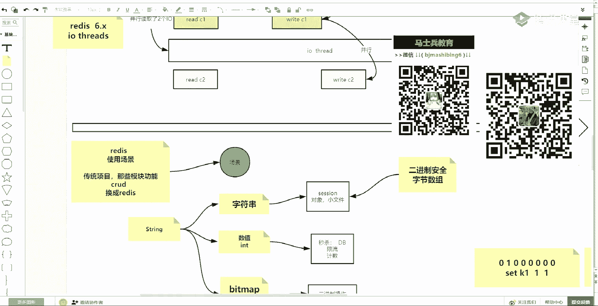

