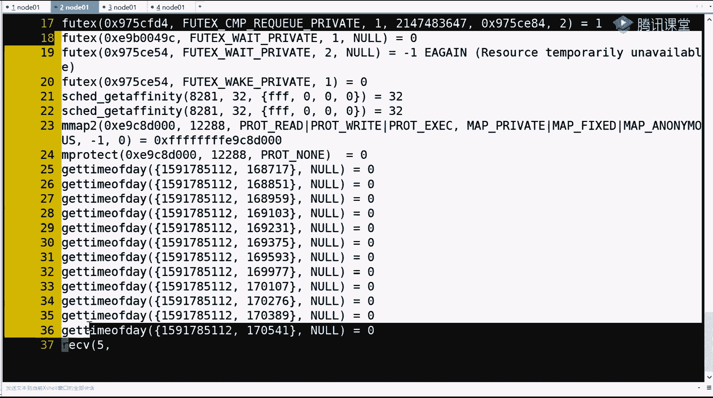

# 系列 2：P57：0.2 JDK中的NIO是什么 - Java视频学堂 - BV1Hy4y1t7Bo

你看整个这个这个过程叫做用户才能看它的切换也非常损耗，记住它就是当程序就最终一句话，当程序使用了内核的系统调用的时候，就会牵扯到一个中断，就是牵扯到程序会调cpu的一个指令集里边的一个指令。

这个指令就会发生，cpu把你这个程序的所有寄存器的值写回内存保护现场，并根据你这个指令后边这个中中的限量号，以前面那个参数来调内核里边相应的东西加载到cpu的计算器里。

这样的话肯定会一个一个用餐那个i一个切换的过程，这个也记住，现在记住两个了，一个程序多切换cpu会浪费它，不能只有你程序的指令，他要忙来忙去，然后一个就是调中断的时候啊。

调这个这个这个信用调用的时候会有一个切换，本来我如果在里面代码一直线下执行的话，其实挺快的，但这却玩命的一个切换内存的那个保护来保护去的过程，对不对啊，这样呢会有一个损耗，那么除了有中断。

这个软中断系统调用，除了时钟段，还有一个东西就是io中断，什么叫i o中断，比如现在我的鼠标在这晃晃晃，我的鼠标在我手上挪动，这个指针为什么在屏幕上移动，能理解我想表达什么意思吧。

就是还有一个i o中断，那么你的鼠标晃动的时候，其实鼠标会向我们的计算机发送一些信号，就是发送类似于这个xy坐标，就是向左移动多少向向右移动的话，那这个发送来的数据，但是你要明白，我cpu只有一颗。

我这个cpu正在执行这个程序呢，那这时候你鼠标发的发送来的东西的话，那我接受不接受你这个这个信息我怎么接收的，其实也走的是中断，那是鼠标会有中断，键盘会中断，硬盘网卡都会产生相应的中断。

这个中段就会打断cpu，你别追他了，先快速接收一下我这个数，然后呢那边如果用这个指针的这个这个绘制的话，有一些回调的里边哪需要刷新，刷新这个鼠标的这个坐标或者网卡的数据要导到哪去，这个回调就会掉下去。

就中断一一般会对应一个回调，但是中段一般都会牵扯到一个切割切换的过程，以上所有剧组的一个通俗讲解的知识，听个响就可以了，好吧，能接受我同学来说，背一，我为什么讲他注意我讲课前戏的确很重，铺垫很重。

到后边儿啊，希望给你达到的一种一种是醍醐灌顶的那种感觉，你说后边哇塞豁然开朗好，那么以上收我们开始讲，网络通信，网络通信io的演变过程。

第一个，那么在点网络通讯io的时候，我们先来演示一个大家应该知道的，应该知道的一些基础知识，比如说bl或者是我们用java java能够写出来的代码，在这里面。

比如我准备一个test socket这么一个java程序，我直接啊我先介绍一下吧，我在这个屏幕是一个什么屏幕啊，因为有有些我们用过，我现在这个黑乎乎的命令行，只在那边敲命令。

这是我们我用了一个插上这么一个连接工具，连到了一个linux操作系统。

啊这是一个连到一个linux操作系统，我的java代码不是跑在windows上，我是跑到了linux上，因为为为什么，因为现在其实你像nike也好等等很多的技术，我们的服务微服也要分布式也好。

他们是倾向于走linux这个服务器的妥协的比较多，像nike这个里边直接因为另另外内核的特征，它就直接屏蔽了a i所协到这个多路复用器e破了，对不对，那么在linux环境当中。

我们先看一下这个jav代码回车，这个代码按理说在座的你们都应该能够读懂这套代码，这个代码还是相对比较版，比比较老的一个版本。

代码为什么你看上面倒的包都是java io java net socket加上net socket，在这里你可以看出还没有延伸到java的ni，注意听是java的nl那个那个层级。

那么这个代码是什么意思。

我要写一个服务端的程序，就类似于写一个top k也好。

写一个什么，你你你能听懂我们服务端的程序，这个服务端的程序啊，怎么去写的，注意上来new啊，我们先new对象用谁，new一个server socket。

这是server端的服务端的一个server socket，然后我绑定了一个端口号，8090，看过预习资料的都应该知道，在tcp通信的时候，服务端是要起一个监听端口的。

那我这起的就是8090得到了一个所server的一个对象的一个抽象，那我用完了事之后，我就系统打印打印了一句话，第一步new socket 8090成功了，打印完之后，注意看下边进入了一个死循环啊。

这是一个死循环，在死循环做一件什么事情，你要server的目的是什么，注意听你要启动一个server的目的是什么，目的是别人要去和你建立连接，和你通信，对不对，所以在死循环里边我会调server。

accept，接收吸收水，得到的是一个socket，前面server是new server socket，但是别人跟你建立连接之后，那个对象那个socket就得到了一个客户端。

client得到可爱的之后让我打印哎，客户端谁谁谁把他的多个号打一下，他已经他就已经建立连接了，已经进来了，进来之后关键看下面这句话，new 100000的起一个线程，我在这儿为什么要起一个线程。

首先在这直接告诉你，结果第一个excel会阻塞，因为别人不连，你就没有返回值，会一直在那阻塞着，它会阻塞，但是如果他从阻塞变成返回，得到client之后，你要做一件什么事，情，肯定想去读取它的数据。

但是注意听读取通过网络读取用户发来的数据的时候，比如说这里面的ss就是我们常见的那个plan，那么传进来之后啊，这个这个这个s就就是客户端那个这个对象的话，那我肯定要读读取它的输入流，得到输入流之后。

然后并打印用户发了什么东西，那用户可能不发东西，所以读取的话也有可能变成什么呀，阻塞状态，能听同学来刷波音，就是其实这里面有两个阻塞，这个代码我不想消耗太多时间，大部分应该都都能懂。

下面接收用户端连接它是阻塞的，然后接收完了之后，代码线性往下走，我得抛出一个线程去，为什么，如果不抛出线程，下边这行代码，如果在当前线程一执行它，它就阻塞了，这哥们儿10年不发数据，你在这组了10年。

但是别人如果再过连接的话，代码回不到上面这个循环的开始，就不能接收别人对吧，所以我要把客户端读取的事抛到另外一个县里面去，好吧，刚刚有人说加群加不进来的啊。

我先简单放一个二维码，就是刚才刚进来的小伙伴，现在人数比较多，如果一会儿想赢取我这节课的资料等等，你就去扫一下这个二维码就可以了，我停个这个十秒钟，20秒钟，大家赶紧扫一下这个二维码。

或者你手机直接啪这个截屏，然后用微信扫一扫，然后从本地照片导入就可以，以后一会儿我课后的资料都是在群里面去设计下发给你们，如果你之前加过的话，就不用再加了，抽奖二维码，还有还有还有你看在这儿看到了吧。

一会我给你展示，咱们先学习，坚持不住的小伙伴都退了，退了之后，剩下的人我们再来抽的话，中奖率会高一点，new线程是什么作用啊，new线程是什么作用，就是如果你不new一个线程等于接收的方法。

调用和读取的这种调用都在同一个县城里，两个都是阻塞第二部的读取会把这个线程一直堵，一直堵塞死，那前面那个代码接收就执行不到。

啊这个改了一会儿，一会儿再扫不到，我再待会我再抽烟，给你给你给你给你发，为了不断片，我再介绍一遍，就是你看这个代码在一个主线程里边。

它代码向下线性执行，这个循环也是我先线性执行完了之后才能回到这个循环的开始上面。

accept接收，如果返回了得到客户端，如果不用线程，你可以在当前这个主线程里边先在这往下走，直接跳过，就没有线程啊，直接去可以通过这个客户端读取读东西，但是读的时候人家不发，你在这一直阻塞死。

这时候服务端再来一个人进行代码，执行不到就不能接收，对吧啊，ok那么其实我演示一下代码，你就知道怎回事了，我们通过演示，其实有时候a p i光看的话没有没有这个代表性，那么演示的时候呢。

我给大家教大家一个方法，听我专业课都知道，就是很多东西啊，我喜欢用一个东西叫streets去追踪一下，先记我下面要干什么事情，介绍一个小指令，对你们未来学习各种io模型，io框架极其有帮助。

和任何的网络通信都有帮助，这个指令叫做这个直叫这个street是谁的指令，不是java的，它是我们linux操作系统中它的一个一个指令，这个指令可以起到一个什么效果。

一会儿后边我会把我的java程序跑起来，跑起来之后他会追踪我java程序有多少个线程，每一个县城对我的内核产生了哪些系统调用，有哪些损耗，都会给你淋漓尽致的给你记录下来。

这也是我们学习程序到底在计算机是如何运行的，非常有用的一个一个指令，但是在运行之前，我们先来看一眼，这是一个java，如果想让它执行，我得先编辑一下，编译的时候注意看啊，我用谁去编译。

在我usr java有一个，g two sg一点四这个版本我用的1。4，这个版本下面有一个b，唉呀呀呀呀呀呀呀呀呀，吓死我了，差点生鲜了，并不落下，有一个java c的程序。

然后接我们的test socket java回车，没有报错，就直接编译出了一个csolar declass，我为什么要用1。4的给你编译，我后边会用1。8的再给你编译一下，这两者编译完的结果。

它在i o上是有一个变化的，好吧，你先记住这个这个点，那么下面我们来执行，用stress追踪追踪的时候，后面参数怎么写啊，ff两个f的话就是fog fog追踪他的这个未来那个程序的所有的线程。

然后杠o是out输出输出什么呢，以alt这三个字母开头的每一个线程点他自个线程id的独立日志文件，那么这是前边streets命令的两个参数，那后边第三个参数是什么，第三个参数就是你要执行的那个目标程序。

目标程序是我usr并线的java，不是usr，这to sk扎了g two i s k，然后b下了一个java程序，这是一个二进制可执行的一个java程序，就是g a m它启动什么。

启动我们test的socket，这一行只能有两部分，一个stress，一个后边jva的启动程序，这个能看同学来刷波一炸了，走了，哎，我用另外一个窗口啊，我有两个窗口都连着同一台服务器。

这边我是在这个目录下要去启动一个什么东西，这边我们先去看见这个目录来test socket，这个目录下应有的文件都是一些java java java点卡，什么点class。

就刚才这些文件先记住这个文件的这个这个这个目录的样子，当我这个指令一一想起起了之后，压制一回车，是不是炸药程序跑起来了，是不是也按照我那个刚才代码提示。

第一步new soo socket 8090启动了，但是你看下边在第二步是不是没有打印，证明在这部里边可能有一个阻塞发生了，而且同时啊对这种思路走，同时看另外一个标签页里边，刚才看只有这些文件。

只有这些文件，但是你刷新之后，你会发现咦多了一些文件，这些文件是什么，是不是就是out的开头以一个数值结尾，数一数有几个，12345678，有八个县城有八个形，这个八记住了，因为有了一个可能连接之后。

它会new出一个线程来，就变成九了，那这个时候你就代表着一个java程序刚启动的时候，它就是一个多线程的了，你不用线程，它自身就是多线程的，因为有些线程是要负责gc回收啊。

有一些是需要外界的这个这个soc连过来之后，是要建立这个完了这个这个这个这个这个这个监控等等的，那这里面我先告诉你主线程是谁，主线程是第一个alt 8211，这个县城这个能听懂。

原来说v一就是java本身就是多线程的，你又线程是你又造了一批线程，对不对，有了这个认知之后，我们就来思考程序到底是怎么执行的，什么叫做阻塞就能看出来了，用v打开out 811这个文件。

这就是我们java程序在运行时和内核的所有交互的整个过程，交互的整个过程，我们先来文件就行，第一行，第二行，这是记录的所有的每一行，每一行，这每一行是什么，前面都是一个系统调用的名字，内核的一个性调用。

后边是相应的传递的参数，然后等到后边一般都是返回值，我们先看这个文件的最后一行，对啊，我们先看整个文件的最后一行就是2555行，你会发现诶这掉了一个accept，然后括号一个数字三逗号后边他没有写东西。

然后根据前边这诶这带之后程序没有往下走，注意这个就叫阻塞，就是一个函数被调用了，或者一个性格温被调用了，但是他还没有给你来得及返回，这个方法在这死住了，这个叫做阻塞，能听出来稍微一这except是谁。

其实就是我们在server上面点的那个except，在等待着客户端的连接对吧，这个非常好理解，可能有人说这是什么东西，这是什么语言啊，注意听啊，这个跟语言关系不大。

这里面出现的每一行是你java写程序交给了jvm，jvm最终解是执行我们的代码之后，最终这边是一个虚拟的，它最终要调到我们操作系统物理的内核身上的一些系统调用，这些都是内核提供的系统调用，好吧，那好了。

那么就基于最后一行，我们来开始往前倒，网络通信到底是一个怎样在内核交互的过程中完成的，首先在excel里边有一个括号，然后它里边传了一个三，首先先弄明白这个三是谁啊，先弄这个三是谁，这三往上倒。

其实达到这个2543行就达到这一行，看到这有一个调用了sp的，然后括号传了一些参数，然后注意它的返回值是什么，返回了一个三，先跟着我的速度啊，我帮你把这个捋完了，最终和我们扎个代码关联起来。

得到了一个数字三，这个三有一个学术名词叫做文件描述符，file descriptor，然后这个三得到之后，注意看下边我们先通过单词的语音自己去理解啊，你看上面salt得到一个三，这个三倍哪去用了。

到2545行的时候，弹的绑定，把三绑定到了8090这个端口上，然后绑定完之后，下边listen开始监听三间接，其实在监听8090这个端口有没有这个操作，有没有数据包过来，他的目标东口号刚好是8090。

那就分配给我就可以了，这就是socket bb和listen监听，有了之后，那其实说白了三是谁，三就是server socket，听我同学来刷波666，对吧，然后下边accept 3的时候。

其实就是在some这个social socket上，我要接收一个客户端，只不过现在是服务钢企，还没有客户端连进来，对不对，那整体答案先先先看到这儿，我再让你看到一些东西，再让你看到一些东西啊，咱们一步。

因为程序正好在那阻塞了，那么这个从阻塞到不堵塞的过程中怎么演变的，我正好把所有的细节让你进来看一下，gps，先记住一个东西，tesocket就是我前面跑的一个程序，这个这个java这跑起来之后。

他的这个呃这个进程的id号是8211，然后先看一个命令叫做nike st，看我预习资料pcb的时候都都知道这么一个命令，然后杠n a t p走在这里面，你会看到有一行啊，这行就是8211。

是java程序，它的状态就是listen，然后这个我也解释过，这叫做一个socket，它是ip port，ip port一个四元组，对不对，那么在这个四元组里边是local本，如果来了就听啊。

如果这台计算机收了一个数据包，本机的任何地址在数据包里出现了都可以写，多号是8090的，那么就可以交给这个程序，就是这个listen状态的，就是他的目标啊，目标可以是任何地址，任何端口号。

但是只要你的数据包的目标ip地址是我本机的，且端口号是8090，你来自于任何地区，任何段位号都可以，那我就会把这个数据包交给821，交给java java交过去之后。

其实就会走这个except建立连接了，这就是从tcp到我socket连接这个过程当中，你要想明白的一件事情就是listen，就是搜单，为什么一个listen有一个监听。

好吧这段能听懂的来说说一你看现在关于821的，你只你只看到了这么一个条目，因为还没有任何的建立连接，对不对，哎那么说我们继续走啊，继续走，这个文件刚才是vi帮你打开的啊，我们把它关掉。

接着另外一个小命令叫做tell杠f out。8211，那么tell这个指令可以起到一个什么效果，杠f是这个阻塞，一直显示alt。821bp回车，它默认会把这个文件的末尾的时候给你打印一下。

你会看到看到listen了，然后看到accept accept在这里阻塞了，都不动了，对不对，然后未来这个文件只要多一些什么东西写进去了，他就给你帮你打印出来等等。

等于实时监控这个这个这个文件里面的东西，那我要做一件什么事情，我让你看到当一个客户端连进来之后，我的java这个阻塞有阻塞造成变成非阻塞，它是怎么一个过程产生的，和我们客户端连接是不是有别人的关系。

对吧，这个课这样的讲解方式，是不是不是你根本就没有听说过，直接追到程序是如何运行的，在这左侧边看a a a a asap，三三十九是什么，server socket，就是那个listen。

例子里边到底有没有人来呢，这边我用一个小程序来模拟一下nc，就是net connection或者net cat去这个你就想成是一个网络通信的一个客户端，它能帮你完成tcp的三次握手，和别人去连起来。

然后连谁连local house，连本机，任何本机本，只要你给出本机的一端是这个地d就可以了，动口号是什么，动画是你前面服务的8090，后面给出动口号，用空格8090，注意听，那么这时候走三次握手。

就会连我们的服务，连服务之后三次我都走完之后，那么最终就会把解析完的数据包，然后给出一个连接的事件，就会走到那个三往下就会走，那这时候我回车看，加t回车，你看两边都有叹号了，两边都叹号了。

现在看我前面诶，star一个客户端端口号，记住了59033，说的是我net connection或者nc这个程序，他申请了一个作为客户端，申请了一个随机动号，连到了我这个服务端的8090，是不是呢。

待会给你演示，关键看刚才追踪的日志，在追踪日的时候，刚才是不是在这个三，是不是在这就阻塞住了，但是无论你等多久，等1年等10年，只要别人一连进来，这个方法就会有返回值，是不是等号后面返回了一个五。

这个五也是一个数字的一个文件描述符，三如果能代表server的话，这个五其实代表谁，就代表了我们新连接的这个客户端，就是accept由阻塞变成哎有返回值，六个过程就是由别人建立连接产生的。

比如说accept会阻塞，现在能听懂，原来刷波666，对吧，而且你在这个返回的时候，你也知道啊，给你传递的从系统获得的就是你看对方的断口号的时候，59033对不对，那么得到他之后啊，注意得到它之后。

这是第一步得到它，我们来看一眼看一个什么东西，先看一下网络状态，刚才你看到821这个那就是一个java，然后这个listen对不对，然后再往再再来执行一下那个这个杠ntp走。

你没看到有一个8211java avon，然后8090后，但是再往下看，这是不是还有一个8211java，然后往前走，这个状态是连接状态，注意看这个socket 4元组是不是本地的。

12700是一个ip地址，目标正口号是这个8090，然后来自于谁来自于本地ip地址，且端号是nc那个这就是nc那个进程59033，因为你看到59033是本地端口号的时候，对应的就是我们那个nc程序。

这就是ip port ip port的一个四元组，就搁这jav，这是不是多了一个81，是不是多了一个连接状态，这个这块能看懂的同学来说，六，对吧，程序由开始只有一个三，然后得了一个客户端。

59043多少号，然后做了一个五，重点来了重点来了，回忆一下，在我java程序里边，我在主线程里边accept，因为能听懂什么意思，我在主线程里面接收客户端，当得到客端之后，回忆有代码。

下一步要做一件什么事，我是不是得启动一个线程，在这个线程里去读这个五，对不对，五就是如果扣分的话，我是要先启动一个线程的，那么它是如何新启动一个线程的，往下走往下走，重点就来了，他是如何启动一个线程的。

你看在主线里边又accept，等于他一个学生又回来了，往上走，找到一个系统能用的克隆，啊它因为东西比较多啊，一共得了三行克隆这个内核的系统调用就会开辟一个新的线程，这个新的线程是82818281。

记住了，为什么是8211，一会儿给你讲，给你解释，首先你要先明白了，在java的现成的概念，注意听啊，这个很重要，在java里现成的概念，什么是现成，这是不是面试官常问常问的一个问题。

java当中什么是线程，java的线程是什么东西，现在如何回答，注意听java的线程其实就是通过调用内核的系统调用，然后其实得到了一个在操作系统里边的一个什么呀，轻量级的一个进程，轻量级的一个进程。

因为它有一个线程id，或者进来那个8281，但是你刚才说的不是，这显示是8211，不是8281吗，其实切换机线程，切换机线程他们会有自己的id，但是它们同属于一个最开始的那个进程的那个id。

就是一个线程组，会以他为表示好吧，那先跟我的思路走就可以了，那不管怎么样。

是不是克隆可以得到一个新的限制，那么在当前主方法里没有找到独舞吗。

是不是没有找到主五，跟着我的思路走啊，ctrl c结束，它还记着这个目录，开始让你数过java，它启动的时候，它有多少个线程，是不是123456788个，对不对，那现在看是不是多了一个2。8281。

我们的stress也给追踪到了，这个命令，不，厉害不厉害，对不对，你想想知道，如果这是主线程，主线程里边它就是在while循环，就是在accept，每得到一个客户端就抛出一个线程。

现在我刚刚有一个客户端就抛出了一个，我是不是再连一个一会儿抛出去一个写在这个县城里边，是不是要发生一个读写阻塞的一件事情，所以我们来看vi out。8281，能跟上我思路的同学来说不一。

来看看这个文件进来之后。

其实你直接跑自行了，这个这个这个县城掉的东西不多。

它就到37行，30行，你发现只要后边没有等号返回，这个方法等于就被阻塞了，他掉了一个内核的receive，然后从谁去receive接收，重点来了，是在另外一个性能里边去读五，这个五哪来的。

是不是在主线程里边，主机能里面创建那个五这个50帧这个客户端，所以在主线程里边accept，在新的线程里去读自己那个客户端的文件名符，到这一步能听出来稍微666，那把这个理论我们再去给他扩展一下。

记住现在是九个，最后是8281。

如果我再开一个客户端，是不是还会有新开另外一个线程在克隆出一个来，就是你要想明白啊，整个机整个你的java程序你是怎么运行起来的，稍等有点卡等等，这个这个界面弹过来，在nc连local host。

然后是8090，刚才是连了一个客户端，所以初春春多了一个县城，这边注意看压机，又一个客户端是59034进来了，然后你再来数这个目录，刚才是8281，那多一个客户端就会多一个线程，8304这个线性记录了。

现在是每多一个连接就多一个线程，每多一个连接就多一个线程，如果有1万个连接，就会有1万个线程，听懂了吧，哎那这个时候其实8304刚才把包里边要读58304，不要读谁打开out点，8304到最后一行。

receive 66是什么，就是另外的一个新的客户端连接，以上都能听懂，同学来刷波六，那有人说了，你一直在我们看这个out，其实你表面说的这个逻辑能跟上，其实大家都能跟上，也能听懂，但是就是什么呀。

你再能听懂，但是我不知道那些方法它是个啥东西，为什么管他叫系统调用，excel到底是啥，为什么socket band listen，然后还得accept，这个不懂对不对，这个不懂哎，似懂非懂。

那么你得学，我说你得学明白了，那么怎么去学明白了，无师自通，你根本不需要我在你的linux当中，我刚才说了，那个文件里边所有的开头的一个指令，它都叫做系统调用，比如i'm mad啊。

比如这个执行啊等等的，或者read读取它都叫做系统调用，那这些怎么去学，回忆先告诉你你的性能跟队友menu帮助程序后边接二二类的帮助程序，二类帮同学看什么，看就是系统调用，把你在这个文件里看到的。

前面这个你想学的这个信标的名字写在这个后边，比如刚才我们看到socket回车是吧。

打开了二类的系统调用socket，还有一个解释文档。

这时候你会发现我去系统能用，长得好像我们java的语法格式，其实这是类c的啊，这是c的，java是类似这种语法格式啊，有返回值，然后int类型有函数名，然后有括号有参数，然后分号结尾，那么别的先不看。

刚才是不是返回是返了一个三返回这个五返回个六，对不对，那返回的是什么，你直接往后倒倒，它的返回值，是往后倒啊，达到了一个return value，这个章节没告诉你了，如果执行成功。

一个file descriptor，一个文件描述符，就是我们一个数值的35678这样的一个数值给你返回。

记住就可以了。