# 系列 2：P59：0.4 netty的reactor模型原理 - Java视频学堂 - BV1Hy4y1t7Bo

因为这里如果要发生数秒的话，到下边我还得把客户端如果没有连进来，但是这个方法不会阻塞，我就打一个none，没有扣端键连接，换句话什么意思，跟着思路走，这是个死循环，曾经如果这阻塞的话，循环一秒阻塞。

这好像会打结吗，如果没有人连接，会还是不会，是不是不会是不是不会打印，但是如果设置了非阻塞，那么是不是即便没有连接，是不是你会频繁的看到下面看不到，但是你会看到这行每一秒那一次，每一秒那一次。

其实在真正开发的时候，这个这段分支是不要的，这个数疫苗也不要了，就上去直接接收，然后呢就是如果这个客户端接收到了，就开始添加list，然后剩下就开始便利list，然后回来之后继续接收。

这是一个快速的服务端响应的一个过程，好吧，我现在都解开了，那么来开始做，怎么去做，用javc，但是用它之前我给你对比一下，如果我用usr javg处s k一点四的包，下面的in下载java c尝试编译。

test是这个socket n o，socket n l o。java注意看回车报错，没错啊，这是会报错的，所以你要用什么，要用这个更高的版本，应该是在七之后啊，1。7之后，因为我现在是11。8的。

用java c接socket n l o这样执行就不报错了，看出版本的变化了吧，哎看出版本变化变化了吧，哎ok走，有了class之后，然后我要做一件什么事情，还是用stress这个万金油这东西非常好用。

怎么写，后面怎么写上ff o out前缀追踪啥追踪，用java，这是1。8的版本的执行，我们socket n i o这个类以上在网上看同学来刷波一，啊你回去可以尝试啊。

你即便把所有代码还原成最基本的代码，就是只有一个ni o的包的导用的话，它就一定会报错，好我把它抛起来，加进，是不是每一秒钟会打一个大，也就是说它并没有阻塞住，这就是先给你展示了nl的特征。

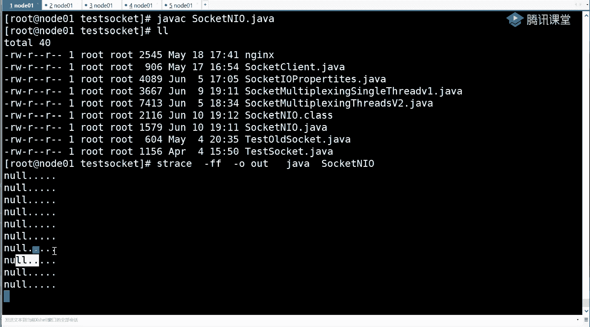

对吧，是不是已经没有诅咒了，因为它在每一次循环的时候，这行都被打印了，这个位置没有被阻塞，因为现在也没有人去连进来。

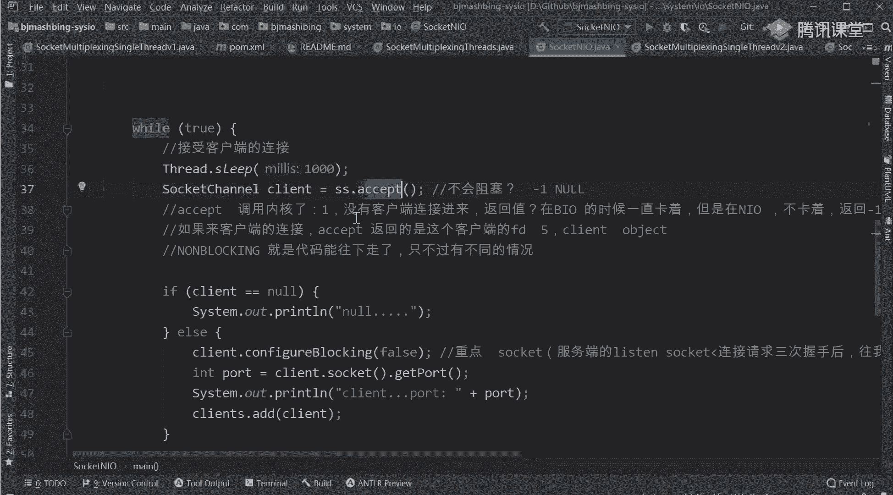

对不对，唉那么除了这件事情，我要让你看到一个更直观的一件事，因为1。8了，注意第一个，这不是中了，第二个是主方法，8506，8506是主方法，我们来看一下v i78506 ，这个文件跟着我的思路啊。

就是前面我的服务已经跑起来了，我现在追踪这个服务它是怎么样去操作的，然后找到socket是不是任何的s o c k e t是不是任何的，只要使用网络编程，它毕竟毕竟会掉一个socket。

调完之后看他返回了一个三三，就是那个server有了socket之后，然后还会有一个，不是这个三啊，我们来找，先先去搜索90909090吧，找到最近那个绑定是绑定四，绑定四，这个四在哪往上倒。

对面已经记住这个通道就可以了，这是不是2821行一，只要是三部曲socket得到一个四。

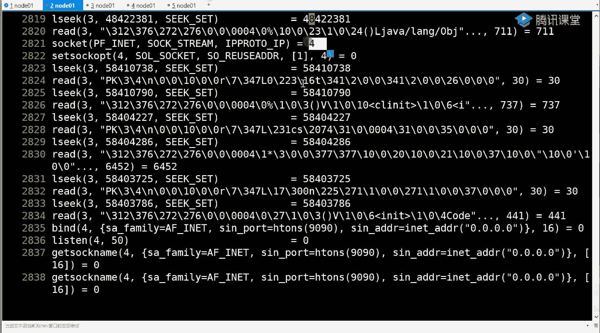

得到四之后，然后肯定是绑定四，绑定四之后肯定是监听四，这都没问题，对不对啊。

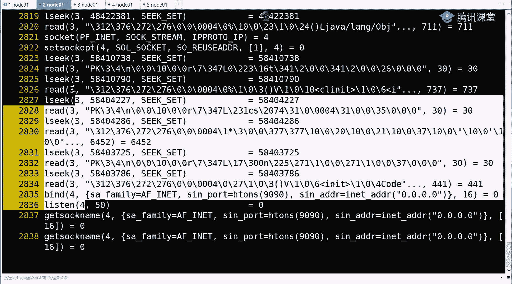

那么四是不是就是server了，那么是不是在四上我要accept 4去接收口端能听出来，稍微一就是sl的三部曲socket绑定listen，然后后边一定会玩命的accept接收这个四。

那么现在去找来看到2856行的时候，accept 4是不是接受了，但是这时候你会发现它返回是什么，是不是-1，曾经accept接受的是谁，是不是要么五要么六，要么七对对，对不为。

-1其实就是那就是没有返回吗，它报了一个错误，那这时候其实是不是没有这个方法，你没有佐助，是不是剩下就是rp 1，那然后这时候这个文件你还可以怎么去看，是不是可以用l杠f08506 。

走你看这个文件是一直在动，这个追踪是不是直在动，是不是他一直就是给你返回，-1没人来，没人来，没人来，没人来，但是我不会堵得住，我代码一定让你往下走，一定让你往下走，这就是n i o非阻塞，好吧。

先跟着我的思路走，那么些东西，我不可能一口气把这个什么都给你讲明白了，你先跟着我，别丢你学，明明一个第二个就好通了，好不好，对不对，我脾气有点爆啊，你发你们总是对学习方法，这就是你们自学学习方法。

总是下雪下雨下雪，一会看这，一会看这一个东西，到最后都没有都没学明白，对不对，那这时候注意看前面这一直闹一直闹一直闹一直闹，后边呢一直阻塞不住，组合不住，然后呢再来看我们尝试一个口罩，是我连接怎么办。

nc local house 9090，我连它变压器连的时候，其实你可以想象到这个accept的返回值是不是-1了，它就应该返回某一个具体的值了，对不对，是不是这道理，我快速的把它加机，建立连接。

这边ctrl c给它结束。

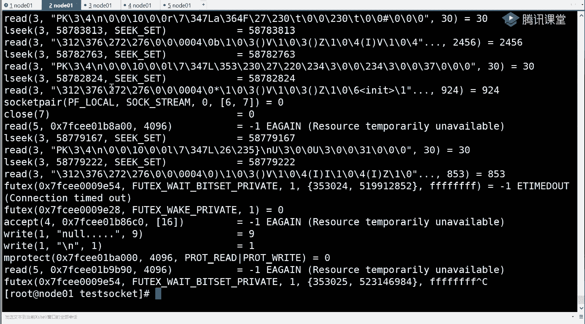

往上倒，他一定会有一个accept，就不是-1了，刚才有续航，他就一秒崩了。

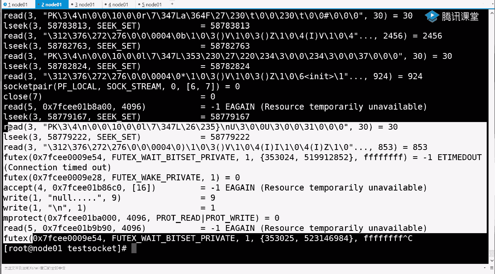

一下往上走，往上倒，倒倒倒倒，得到一个accept，在这好了，这个accept是谁，是不是acaccept，accept之后，他还是反复一，是不是返回一个五了，又返回了一个自动连接，对不对啊。

然后它的逗号是多少，逗号是56180，这边因为太多了，给他给他炸出去了，看到了网上能找到，刚才那个你看是不是有一个客户端。

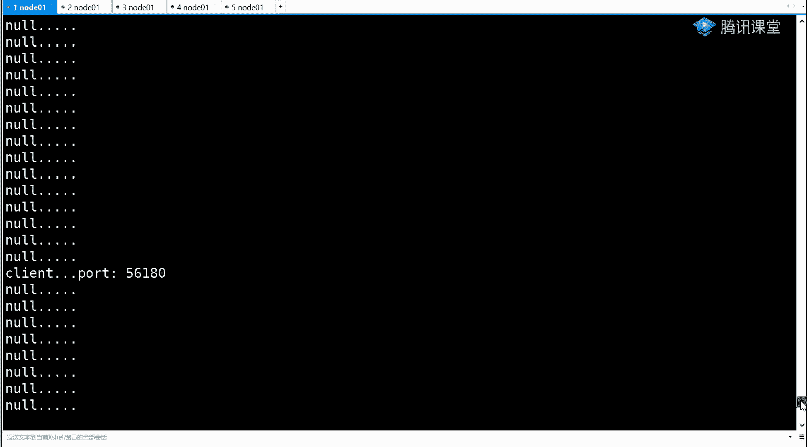

逗号56180点进来了，对不对，能连一个，注意这是不是一个线程能连一个。

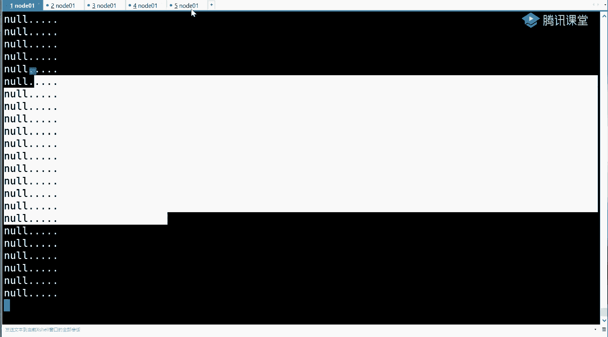

是不是就能连第二个，再来nc local host 9090走，这边是不是有连接客户端，也就是一个线程，我可以连很多的客户端，比刚才那个多线程的版本，是不是接触了很多资源，也能完成这些事儿，对不对。

这是nl好理解吧，ok这块不做太多的介绍了，因为啥出去，你这辈子基本上不可能自主去选这个ni o，我觉得很多事情很复杂，而且他性格也不是也不是最好的，往后走。

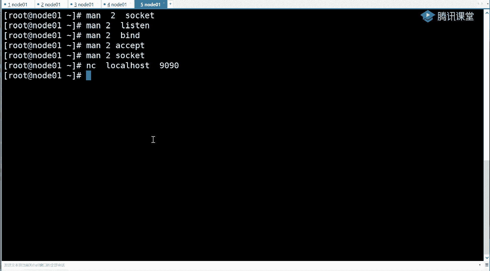

我们先去找他，就是现在你基本能明白什么是n l o了，其实n o就是一个东西-1什么叫非因分化不足，不不阻塞这么简单，是这道理吧，明天讲多路复用，今儿都给你讲，多路复用好不好，就看能讲多少是多少。

没必要等到明天啊，这是n o对不对啊，n l o我们来总结一下n l o，注意听nl它的优势，一个两分钱花的值不值，就光到这后面不讲了，就我就讲这么多，就就讲到这儿我就不讲了，你那两块钱值不值。

因为其实说实在的无师自通，我可以真的不用跟你讲了，因为我该给你的学习方法都已经传授给你，剩下真的就拿prise，拿着mu to，对不对，然后一会自己跟踪自己学什么东西都能学明。

那么请回顾io的优势是什么，优势，在群里抢了一个七分的红包，还赚了五分钱，没没没就没天理，真的是不会阻塞，不会不会阻塞，不是优势，如果你就三五个客户端，其实用b i o还是蛮舒服的，还真就是这样。

如果你客户端连接很少，用b o就足可以了，明白吧，用这种i o的优势，这个优势其实规避了，多线程的问题，无论是资源问题还是调度还是性能开销的问题，相对比前面好一点点对吧，那就是在并发量很大的时候。

很大的时候，这时候其实我在这儿抛出一个回去自己看，网上自己搜c 10 k问题，这是目前来说，如果搞编程，搞网络，搞分布式，搞微服务的话，这块肯定能把它禁用一下，这个怎么给他禁用。

自己网上搜一下什么c 10 k，就是当你的服务器有1万个客户端连接的时候，就会产生问题，那么比如说开始说弊端，找到我学习的方法和规律了吧，就是我上面说这个一定要学明白，前面如果nl这块学明白了。

你就好记了，关键是从学会之后，你还能自主推导它的弊端是啥，这才叫学明白了，你才能知道下一个记录是啥，怎么演变过来的，那么b端是啥，请告诉我它的弊端是什么，一个阻塞都阻塞，不一定啊。

其实刚才我用的是一个线程，你那个link的list可不可以切成四段，分到四个线的位置，是不是也可以，是不是可以有一个线程直接就是accept接收，然后有四个线程，每个四个线程获得了1/4的那个客户端。

那个那个例子一段这个也可以吗，你可以用多线程来处理嘛，但是线程绝对不会开到每一个连接一个线程b端是啥放大，假设教你一个方法，就是假设就跟你在听那个左左老师讲课的时候，也其实也有这种概念。

就是你放大你的数据集对不对，然后一来验证你的这个算法到底在变化的数据集，就是在小端大端的时候，数据数量大小的时候，它的一个真正的一个大度假设，如果真的有1万和连接。

就是你循环循环循环循环循环接收了1万个连接之后，自家都都是成人机，然后大家一会给你发东西，我给你发东西，那这时候它的弊端是啥，注意清看见的一句话，用人话，用同话翻译，比如说在每循环一次，每循环一次。

他循环一次做了哪两件事情啊，第一步是不是accept接收，对不对，第二步是不是有一个线的，一个循环是便利所有客户端要调一个它的系统调用，receive系统调用是不是会产生软中断，是不是会有太大。

就是否定了那个恢复现场，那假设1万个连接里边儿只有一个人发展数据，就放大这个这个特征码，然后来看它的弊端在哪，b端就是假设有1万个链接，只有一个发来数据，那么每循环一次，其实。

你必须向内核发送1万次receive系统调用，那么这里有9999次是无意义的浪费，消耗时间和资源，听同学来刷波，666，注意这个循环叫做用户空间的循环便利，复杂度在系统调用。

频繁的用户它连接的切换不跟ok，找到问题，找到b端了，怎么解决它思考你要学会自主学习，我都给你都给你带到这个程度上，我们带你起飞了，那请告诉我这个问题怎么解决，它真正的问题是不是就是如果1万的话。

就是在你的用户空间和条之间，是不是往复跑来跑去，往复跑到在一次循环里边，比如说注册事件event毁掉，no no no no no，不不不，不要上来直接说这个还是没学明白，我都跟你这么说了。

他往后跑往后跑，每一次循环里边有一个o n有一个1万的一个复杂度，但是这里边其实只有一个人发来数据，对不对，你就让他之前跑来跑去，跑得很累，因为什么，因为你循环的时候。

这个for循环的时候每循环一次只能问一个客户端状态，有一半的时候你是要循环1万次，如果能将这个循环的复杂度降低，整个程序的复杂度和性能是不是会提升，为什么，从ni o的下一个知识点要引出谁。

要引出的是多路复用，是多路复用，多路复用里面又分为select pp和基于事件的回调的e和一个过渡的过程，你要学制学拳，别丢东西，技术是一遍眼睛过来的，那这时候其实你就期望了。

如果我这receive的时候不传一个客户端，我传了一一万，那内核我就掉一次内核，但是他告诉我说这里边有仨q端，你可以读了，然后你再具体的去读那三个客户端是不是加起来问了一次，他加了三次毒才四次。

也不会是1万次，能听懂这个简单描述的同学来稍微一是这么个理儿，道理，普通话是不是一个道理，那这时候其实就是谁发生变化才能支撑这个东西，我再说一遍啊，就是在一个while循环里边，除了接收客户端。

你手里呢还有1万个客户端，那么目前这种a的方式在for循环里，基于每一个客户端要调一次receive，尝试着读取，有1万个客户端，就会有1万次调用，那你想好累啊，我能不能我有一个调用。

把1万个客户端传给内核，就是切换一次内核，给我一个返回之说，里边有仨推毒，你再去在用空间调三次receive真正去读，而且这三次一定会有返回值，那加起来一共才有四次调用，而不是1万次调用。

其实根本就是你在三次真正receive读之前掉了某一个方法，传的是1万个客户端，给那盒只切换了一次，这个系统调用，他就告诉你有三个可以读，你就发生了三次receive，加起来一共四次。

这个能听我们来刷个一，是不是是不是这么一个道理，对吧，那这时候其实你掉了一个系统调用，里边不放一条路，而放了很多条路，是不是很多条路复用了这一个系统调用，所以它是不是应该叫做多路复用器，牛逼炸了。

我现在特别想说一句话，这是什么什么什么话吗，来吧报名跟我学，我带你飞，哈哈哈哈哈，看东西看东西，我给你演示啊，我给你给你给你给你找啊，那其实你要说明白是什么东西支撑的，还得是内核向前发展一步。

就内核得多一些东西，多一些啥东西，多一些多落复用器的概念，但是多路复制器啊，版本还很多，有我先给你写了多路复器，有select your po，有一套有这么三种形式多路复用器，但是他们都叫做多服务器。

这仨东西到底是什么意思，一个来说啊，显然pl基本上是一类eo，是另外一类多路复用器。

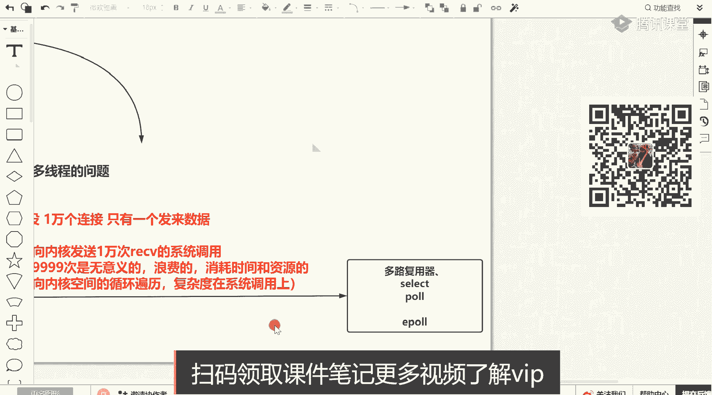

那时候怎么去提供的，注意看就是都告诉你这个信标用了就是manual select，你找到select，这是内核提供的，内核不提供这个东西，这辈子程序忙死你都达到这个效果，你必须得自主轮询。

select的时候你看就是int select，然后注意看成单词什么的哎前面传了一个int，一个数值多少个文件标，我就知道这电路里边都有都有啥情况，然后是哪些，有两个有三个集合，一个是read可读。

可写一成，你要把那些文件描述符作为参数传给内科，然后也可以加一个是否是现实之内的一个返回，这是属于多服务器，看到正正正经的一个官方描述，这东西是是是是是一个什么东西，select。

它是允许一个程序to监控多个文件描述符，这就是所谓的多路复用器，waiting until one or more，一个或者多个of the fety degrees。

多个文件描述符达到可读可这个可用的状态，然后回到现在这句话的翻译句话能不能听懂吧，就允许你一个程序监控多个文件标符，要多复行器，关键看上边会有一个看这同步的io多路复用器，就是select。

这就叫做同步io多路复用器，注意这出现一个词叫做同步的，其他的是不是阻塞的，取决于你怎么去设置。

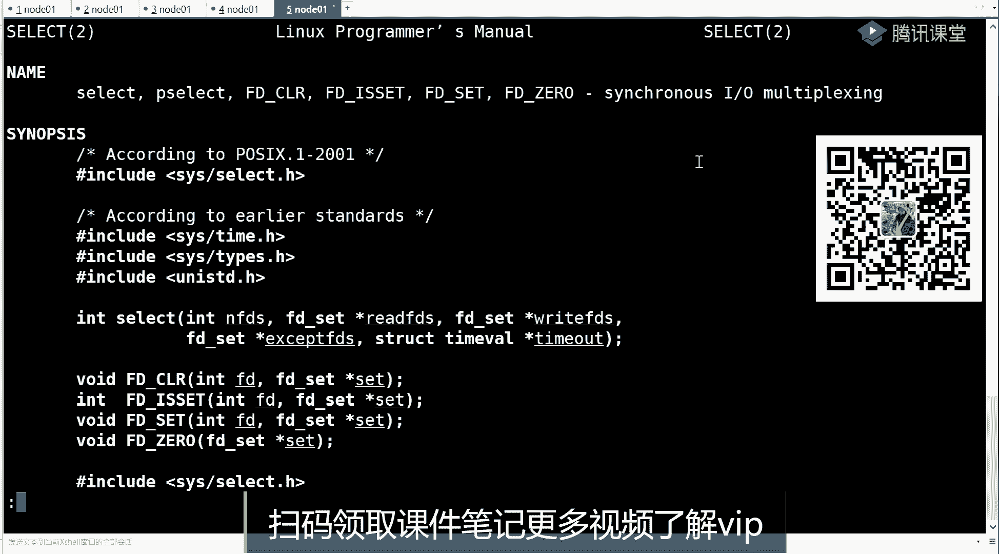

怎么设置，snake是多路复用器，它并不是你的socket，并不是你的i o你有什么意思吧，异步的吧，你你你你一会儿我给你解释什么同步异步啊，就是很多词汇，你们都学受网上很多的帖子或者不同人的讲课。

给你带歪了，带错了，有些面试官的确面试官其实也没有懂到这么多东西啊，不管怎么样，我先给你画个图，你就了解了，画一个图，你了解别慌啊，跟着我学，我把东西给你讲明白了，还是那句话，讲明白了你就会了。

会了之后你就不怕了，关键是你得找一个地儿的话，他真学明白了，关键是我们这儿好多人这么去学，其实别人都为我们的vip都学明白了，那么未来你的面试官可能就是我们vip，如果你不学明白的话。

面试你都过不了对吧，其实间接的就是我们在因为我们的存在，把整个行业的面试的门槛整体拉高了，那这样的话其实我们的学员是是有极大的这个生存空间的，对不对，来注意看。

只要是所有端肯定socket find的listen还是绑定这三件事情，注意看，如果你有1万个文件面符怎么怎么做的啊，他是怎么做的，以前在一个县城里边，我肯定是循环，他把一个文件描述符问一遍。

那现在注意看他要怎么去做，其实还是一个外部循环的，不to不处理做一件什么事情，这时候注意它掉了一个select，写在里边，然后放上你的所有的文件描述符。

这个文件描述里边包含我们的那个listen和口袋连接的，假设这个文件名数量已经达到1万了，但是这个复杂度是o就是基本上冲出来说是o一的，o一的复杂度，什么叫o一复杂度，就是你while循环里边叫他一次。

他就给你反，他就给你反了，那个激活结果告诉你谁可读可写了，但是下边注意听了，假设啊，假设你有一半，1万个连接，这里边就是传了1万个对象，1万个30多倍，是不是传进去了，掉到那会儿。

这是发生的性器内核性调用了，在这1万个里边有三个不读，三，一个可读，一个可以读了，那这时候其实下面你要做一件什么事情，是不是receive直接读那个可读的fd，那个文件名复制不就可以了。

这是不是也是复杂度为o1 ，对不对，如果有三个的话，是不是这个下面你要写一个循环便利这三个字去读，如果如果1000个的话，这块一个学校要读1000，但是不管怎么样。

就是一个通俗上来说一个常数的o一加上一个om就是具体的可读的，它整体的话也会小于1万，小于等于1万，除非你1万都来数值，到这一步能听出来稍微一这就是所谓的多路复用器和它的一个效果，不。

它和前面ni前面那个nl是这个差在哪了，差在哪了，它俩具体的差别在哪，以前注意听啊，以前是这1万个fd，我在上面程序里边是要receive，其中一个再receive一个，再reserve一个。

1万就要掉1万次，现在我调一次就可以了，然后具体读的时候再读它，少个excel就可以，如果这里面有一个excel，你还可以s c e p t还可以接收，对不对，接收你那个f d，那么在这儿注意今儿没找。

能大概听明白了之后，我有一个非常非常重要的事情要跟你说一下，有一个重要的事情你先给你说一下，说完之后再给你解释后面的问题，因为现在刚才我已经发现有人已经误入歧途了，有一个什么事。

你说你回顾我从前边b注意看，这是bl模型当中，如果想从注意先跟着我的思路走啊，如果想从io读取数据是谁调用的读取方法呀，是不是程序，无论当前线程还是异步线程，它得有一个程序自己去receive读。

这是b l o替我们来刷波，一程序自己去读的选择数据，你得自己调那个读的具体的一个方法，那么到n i o的时候，想读数据的时候，如果你前面是不是设置四个字，读的时候是不是自己去读的。

是不是也是自己去读的，ok这是n i o到多路风气了，唉多路风气在这注意，听多了风气，他只是给了你状态，这是第一点，你是通过多路复用器之后就把数据读到内存了吗，不是回答面试官常问问是否可以通过多。

是否是通过了多路复用器就可以达到快速的读取io数据，先回答走，不是他只是告诉你哪些文件描述符可读可写，你只得到了状态，然后注意听和前面一样，那真正想从i o读数据程序要自己去调receive。

能理解什么意思吧，ok那么总结完就是一句话，如果程序，自己读取io，那么这个io模型无论d o l还是多路复用器，它们统一叫做同步模型，同步io模型，能接受的来刷一波666，把你所有的问题。

小朋友之前是不是有很多问号，今天是不是都解开了，只不过在同步里边有阻塞，有非阻塞，那剩下的就是一个异步，异步的话，只有windows是真正的异步i o c t i o完成端口。

那这时候其实是程序不需要调receive，因为程序只是注册了未来io上读写这个事件，当到达之后，继状态发生了，且数据从内核就是windows内核应该是内核有现成。

而不是程序里开机线程是那个内核给你抛出一个线程序，把你注册的方法执行了，把数据给你拷贝到程序的内存空间，然后换言之程序不需要自己去调读写l的方法，那这时候才叫做真正的ae不答案e不仅此而已，仅此而已。

还有五分钟，赶紧讲一炮，蔡司，你这是一个我怀疑你在威胁我，好吧，注意你的态度，我这么半天了，我连我连口水水都没有喝，好吧，那这里面注意听啊，在这延伸一下，刚才说了，多路复用器里有select。

它是这么去玩的，这个select其实这个方法还可以把它变成谁，还可以变成p，另外还有一个pop，pop里边其实传的还是bs，明白吧，po和select它们是一类的。

只不过select大家都知道有一个1024的限制，1024 五那边出现的这个和你you limit unlimit，限制那个用户黑大v标符不是一个概念，就是在源代码而不能限制的，但是后就没有这个限制。

它完全遵从于你操作系统的，有limit限制的一个程序，可以打开它的面，复制随系统的配置就走了，懂了吧，这是一类，这是一类啊，但是他们都叫做多路复用器，多路复用器上面没有说啊，多路复用器就是只能给你撞上。

多路复用器只能给你撞上，读不读还得是你自己去做的事情，所以他们同步模型那一步是干啥啊，一会儿再聊，从多路复用器里边的两大阵营死了，套到e破的过的过程当中，其实又要回到我一直跟你们说的方式了。

找cp它的优势在找他的b端，sli他们是多路复用器了，那么他们的优势是啥，又是啥，就是结合了把前面那个那个劣势怎么解决的，就是它的优势回答我，它的优势是什么，没错。

这个其实曾经你前面nl的时候是等于用户态挨个循环便利，然后到多路风气起来，炮的话其实是用户还掉了一次，把所有的文件运符传给内核，内核去便利，优势其实也震惊客户的劣势。

优势就是通过一次系统调用八嗯fd文件标符，扣端连接传递给客户，传递给内核内核进行便利，进行便利标识，每一个文件标符它是可读可写了这么一个状态，最终给你返回，你去把可读写的去处理就可以了。

那有人说不是又发生了便利吗，但是这个便利你就明白了，一个是发生在内核内部的变绿，一个是发生在陷入一个，我调你一次，给一个结果，我再调一次，这种用空间到那个态的这么一个便利的过程。

你说哪个便利更省时间更快呢，是不是，其实说白了就是这种便利减少了，这么一句话就解释了，这是他的优势，这是显示套的优势，124指什么，1024就是你可以建立多少个客端连接。

select上限只能接收1000 0245，一个select，它并不是说受你的操作系统有limit这样的一个限制，然后你可以编译c代文件，编辑它的c的源代码，然后把这个值改成20484096。

但是这事太麻烦了，现在重新给重新重新编编内核，然后炮的话就没这个限制了，这个版本有1。4的，有2048，别纠结别纠结啊，我还可以给你一个3096或6535的，琳琳最多是10635，通过大哥。

通过你们现在所有人聊天，你们对知识底层掌握的根本不扎实，我完全现在有理由劝你们赶紧报个名，真的我的io克里边把所有东西所有的讲讲解，你们现在所有的问题讲得特别特别的细。

每一个我都给你告诉我是代码极限制的，然后是进程用户极限制的还是内核级权利限制，哪个我都会给你讲的很清楚好吧，ok那么这是它的优势啊，这是优势，那么优势有了，那么来思考它有没有弊端，找到弊端。

你才能推导出一炮一个，请请大家随我一起掌握学习方法，根据现在的描述，它有没有弊端，弊端是哪些，它的弊端我可以告诉你两个，他的b端有两个b端是啥，弊端是啥，弊端来一炮，我跟你说多了，服务器只能正常。

他们都是我在给你写的，明白点啊，slack，我非得给你写出来一炮，我说了，他们都是多路复印件，多路飞都是同步的，他们都是同步的，记住了，被死了，他们都是同步的，要想e破它是异步，因为它是异步。

绝对绝对还是同步，因为什么讲到易破的时候，你只能得到文字描述的状态，最终还是自己去读写b端啥，这是你思考啊，哎你想如果第一次循环的时候，也不是第一次，就在一次循环的时候，假如现在f4 已经1万了。

诗中理惠o一复杂度调到内核，把1万个连接从用户态是不是传给了内核，后边处理完之后吧唧外循环一回来，你是不是还得掉sla，是不是还得把那vs再重复拷贝一次，就是一直重复一直重复的把那位传说的脸红。

而且就是因为你每次重新传递这句话的反反面儿，那个意思就是内核不存，你上次给我之后，我就没有存住它，所以会造成你每次重新给我f d s，我那盒重新遍历他们的状态，这是第一个弊端，重复传递。

重复三df文件标符，这个问题b端能听出来稍微一，那么用用大腿想想他的解决方案上，用大腿想的解决方案是啥，不用说了，拷贝这解决方案是如果循环循环循环了10万次，只有在第一次的时候，我把这个vs给你传递过。

后来也没有新增的客户，这个客户端的假设就是1万个了，后续的外部循环，只要我那会开辟空间，全都拿fs，后续是不是不需要重复传递了，所以敌方就是内核开辟空间，这个解决方案能听懂的来说说一，这就是一炮的炮。

里边后边给你讲了，还有一个ecrader创建一个空间，空间里面是一个红黑树，陆陆续续的把新来的所有的客户端扔到红黑树里去，那未来就不需要重复的，就用户态去调什么东西，去咨询这个文件描述了，好吧。

这是第一个问题，第二个问题就是其实由前面他自身那个携带这个造型的，就是每次都要每次select或者泡的时候都要重复，都要重新，电力全量的i d就是你只要掉了一次select，因为你新新扔进来的。

你没有空间，然后呢这select我要内核主动的线性变了一次，告诉你哪些有状态也没有状态，它没有完全基于什么呀，就是某一个f d如果数据来了，那这时候你未来问的时候，我直接告诉你，他可读了。

不是立刻告诉你，而是我先去店里到他那才能告诉你，所以这是第二个问题，那第二个问题怎么去解决，这个就是需要祭祖的深度知识了，机组的深度知识，中断call back回调函数以及增强回调函数的一个处理过程。

我可以简单给你看一眼，但是这节课讲的就来不及了，在这其实有这么一个概念，就是强行插入一个计算机组成的一个概念，就跟我画的图差不多，但是这里边你要知道网卡也会有中断，中断成之后之前是把数据放到bg里。

后续的话你还要把放到80这件事情做完之后，还得多做一件事情，把这f d在它的内存空间的红位数标识一下，那么来调的时候直接返回了，仅此而已，好吧，解决方案给你拖出来了，不，你没看啊，简单看一眼。

不要小看io这件事情，io我还只是给你们讲网络i o从b i o ni到多路复用器的前半段cp，以及找到他们的弊端，然后到最后我们必然要推导出e，因为e才是现在用的多的，相对来说用一个多的多路复用器。

但是它也依然属于同步模型，好吧那么这个事现在讲的话来不及了，因为这个1p我给你讲的话，又开始一大堆，我们挪到明天去，今天这点东西就完完全全够你们复习的了，当一炮这个事真正学明白了。

这个东西真的学了nt太容易理解了对吧，nt就太容易理解了，如果这些东西没学明白的，你理解理解nt的话还有点复杂，只能表面懂一片虚体，再聊底层，他为什么那么去做性能，它性能到底在哪。

你说出来内容官直接把你烫死，能发吗，笔记能发啊，笔记能发，带的小姐姐可以在如果开了新的这个群，那个微信群的话，可以发一下那个咱们那个微信群的二维码好吧，然后我放下咱们抽奖到外面开始出书了。

你看一个学习的过程，给你们顾虑到那么多人，扫这个二维码，330分，多线程与高并发来骚起，我真的真的同学们好吧，我是上课前喝了一瓶水，我这边水完全没有打开，我真的一口水没喝，嗯，刚才那个微信群那边吗。

还能进吗，还能扫进来吗，满了是吧，这帮人在干嘛啊，我跟朋友吃完饭之后再放一个是三二吗，这个，听到我刚才非常凶了吧，到时你直接报我来拿一次，再放一个那个那个微信的那个是哪个哪个呀，我看看，这个就行了。

来扫这个二维码，我把这个两个码，这两个码有点冲突啊，放到这儿，咱们小九啊，小姐小姐咋不看，想看小姐姐的，不是随便给你们看的，你来公司看，咱们公司地址是海淀，但是现在这两天这个vip知道咱们两天装修呢。

在这装修过来吃啊，过段时间，而且现在你进门肯定还得各种各种那个查看你的绿码啊，那个乱八糟的，很麻烦，你过段时间疫情这事完全解开了之后，你再过来玩，因为咱们装修的话就给装修点什么台球，跑步机。

读书室之类的啊，北京的小伙伴们可以过来聊天的，嗯嗯让家吗，这个二维码让家吗，频繁了呀，怎么这么多人呢，我再换个谁啊，我再换个二维码，这方面再加一下，好吧，其实你们来的时候加过微信了，就不用重复加了。

你们之前来的时候是不是有人接待过你们，加过你们几个微信，就不需要重复再加了，不用冲在家，我一会都会给你们，就是你们在那个群里面就已经可以给你们去发送了，我讲的做的这么好，还不是我的贵姓，我姓周，周志磊。

就我没有用，你就记住了，马士兵教育就可以了，兵教育马老师，好吧，那今天我们就讲这么多，一会我整理资料，会通过咱们的微信群发给咱们的小伙伴们，好吧，那今天就到这儿，怎么样，明天都来看，都来听课。

明天讲重头戏，eula nike，露个脸，大家说再见，今天到这拜拜，报名多少钱，问一下咱们群的小姐姐，最近刘老大有活动有优惠有优惠哟。

