# 系列 2：P62：0.7 netty如何解决粘包拆包 - Java视频学堂 - BV1Hy4y1t7Bo

wait，那其实weight里面那些事件，红的菜都凉了，能听懂我这个小意思的同学来刷波一，所以要做一件什么事情，所以要做一件什么事情，如果我这个程序你发现比如在这个wait wait得到一个事件。

我不是accept，我是要去读取谁的数据，但是我读了好久，读了好久，读了好久，读了好久，一直在读，一直在读，然后读完出来东西一直处理，一直处一处才才能轮到下一次轮选择一个位置。

那这时候其实你这个程序既负责了io的读取，又负责读取后的计算，那这时候其实我们可以把什么呀，这个程序尽量的做什么呀，只是把该读的东西读出来之后，或者把这个读取的事扔抛给另外一个现场。

不要阻塞当前的接收事件，建立连接这个事儿，那这时候其实你能听懂这个，你再来思考一件事情，我给你佐证，你曾经学nt的时候，或者你有信心想去学it的地方，放弃的时候，你是不是都看过第二个图形。

什么这个reaction，这两张图是不是都看过啊，有的说什么这个连接和建立我们可以打到一个县城里边去，然后有时候我们接收的和连接的可以是两个数字线程，tom cat，是不是也有这样的一种说法，对吧。

就像刚才有同学说老师你给我讲这个i o这个selector，那net底层是不是这么去写的，其实现在找有没有找到感觉，有没有找到感觉，对不对，就这个意思好吧，ok那一炮这块我代码也帮你追完了。

从原理原理啊到画这个模型。

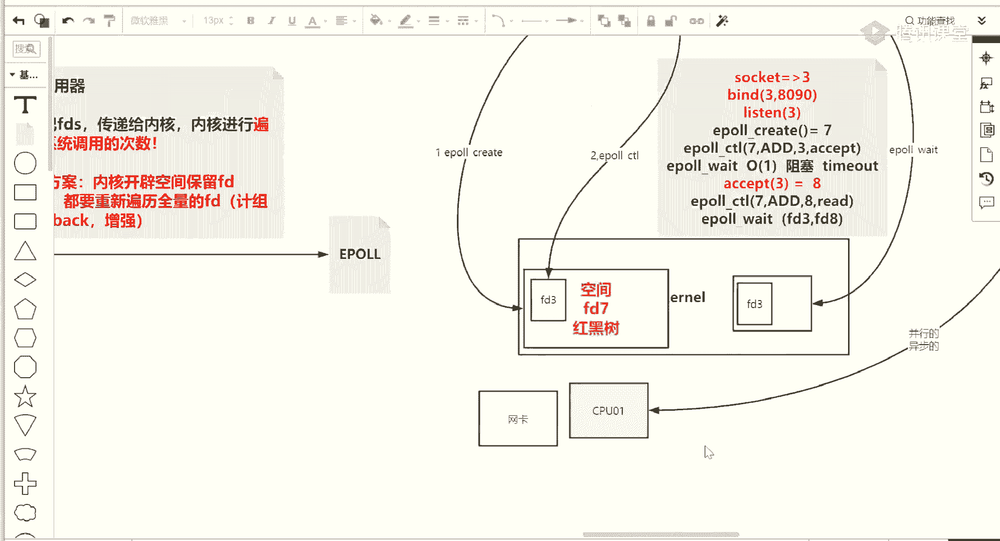

然后呢到带你追这个a p i啊，他为什么这么去写。

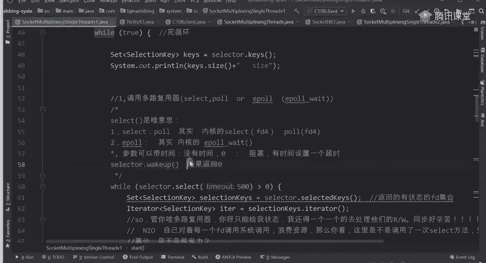

和底层的怎么去对应上呢，一到最后咱们验证这块都听不出来，说略略，学了好久的nt还是没学会，就是因为你对底层io这块不太不太不太懂，不太懂。

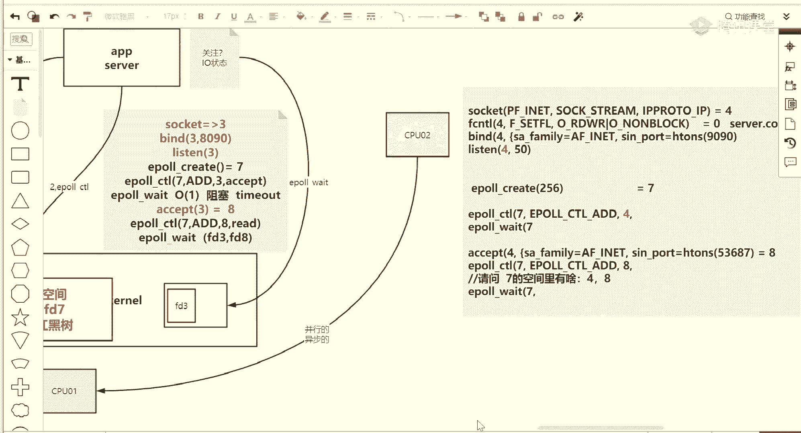

好这块能了解之后，那我说的nt了，咱们上演nt看一眼好吧，io这块没啥了，其实io还有很多的知识，你可以看看在vip里边有单线程的，其实还有一个多线程，多线程这块看造化吧。

因为这个东西如果是咱们这种训练英文公开课这样的一种想法的话，他其实来不及讲那么细腻嗯但是呢我给你尽量的去展示一下，展示完之后我们再过nike的话，你可能会有一些感觉，老师ctrl是谁监听。

谁没看挪那挪的那一块是内核去做的。

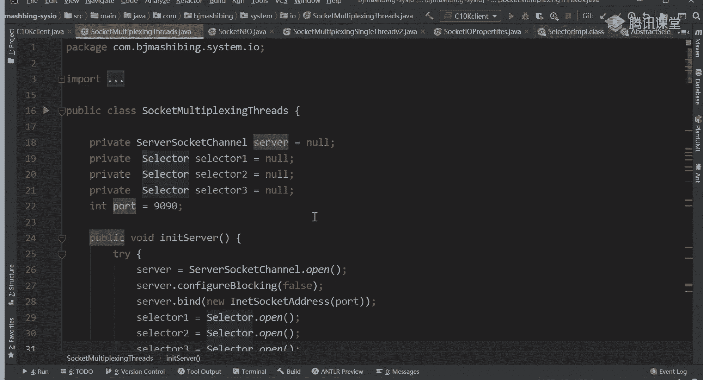

就听啊，你要真正理解这张图，分钟我说这车呢这是内核挪动这块，挪动那块是内核这个那那核怎么去做的，你要相对的就是我前面说的，要对自组的制有点了解，你如果入学到咱们咱们咱们的课程的话。

其实在我讲i o讲那些东西之前，你看在我讲这个相应的i o之前，讲到io多路复用器dnt这个过程当中，前面会有pc，然后会有这些东西，而且还会有马老师的相应的计算机组成的一些知识。

而这些知识第几节课你把它看完，看到这个多隆重器的，那才能真正的理解我在说什么事情，如果你还不是计算机相关专业的话，那块听的确有点复杂，但是咱们一层一层的来，一层一层来，那如果没有祭祖。

那没必要先去补剧组，那你就先听我这节课，就先听到我这个这个这个层级，起码你知道哦，我缺一个知识，缺什么去祭祖，我对底层还不太了解，我起码现在还上，我都懂了，我现在就一个小问号，这个消防证他怎么过去。

到这感觉了吧，就他怎么过去，你还不知道，那我也告诉你不，那不是可以把我的课前面那个课看完就能懂，但是但是你要看这个课的话，肯定是要报名去学习咱们的课程啊，那是另外一回事，但是我可以告诉你。

有地儿能把这东西讲得特别的明明白，那为了保证你们能多学点东西，在这个这么一次短暂的一个两分钟的训练，在训练营里边，那这个事先放一放，我把后边给你穿起来，刚才我们是讲了多路复用器。

是用一个线程使用一个selector，那这时候我在为了给你讲了个一炮，这个讲的nt就是nt这个reactor这个模型，其实我要告诉你一件事情，而且给你让你亲眼看到一件事情。

就是selector selector，他是可以有多个的，目前来说刚才我们的代码这个api当中。

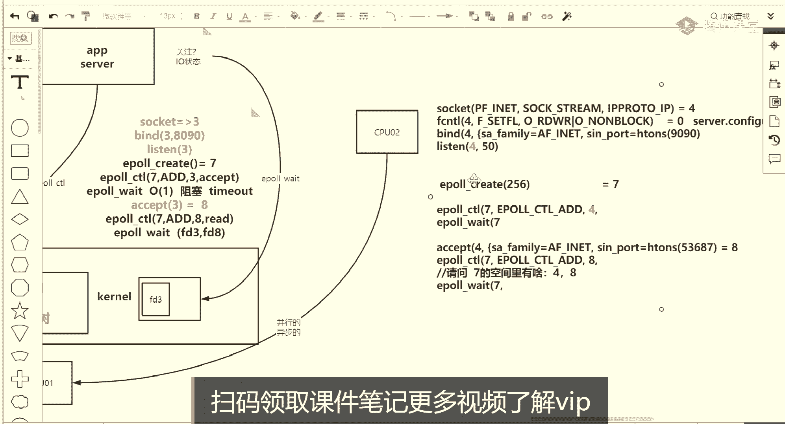

第一版代码当中是单线程切单c ecture，其实我还有一个多次electr，可以吧，那这有一个问题啊，这有一个问题，我为了讲这个版本，其实我要问一个问题，那么如果像刚才的代码，我只有一个select。

那这个select负责了哪些事情，能不能理解我的想表达的意思吧，中国想上这节课，你多学一点，所以你尽量跟着我的节奏走，有一小问号啊，可以先放一放，如果真想解开的小问号，一会儿咱们可以聊聊买课这个事。

这个课程可以肯定可以保证他先跟着我们节奏走，来告诉我这个当前这个这个这个这个模型当中，这个代码当中，这个塞拉斯做了哪些事情，没错，既要等着建立别人的连接，要别人读写的事情多大都由他一个来处理的。

一个来处理，那这时候如果连接数很多的话啊，有1000个1万个10万个有很多连接进来了，注意听啊。

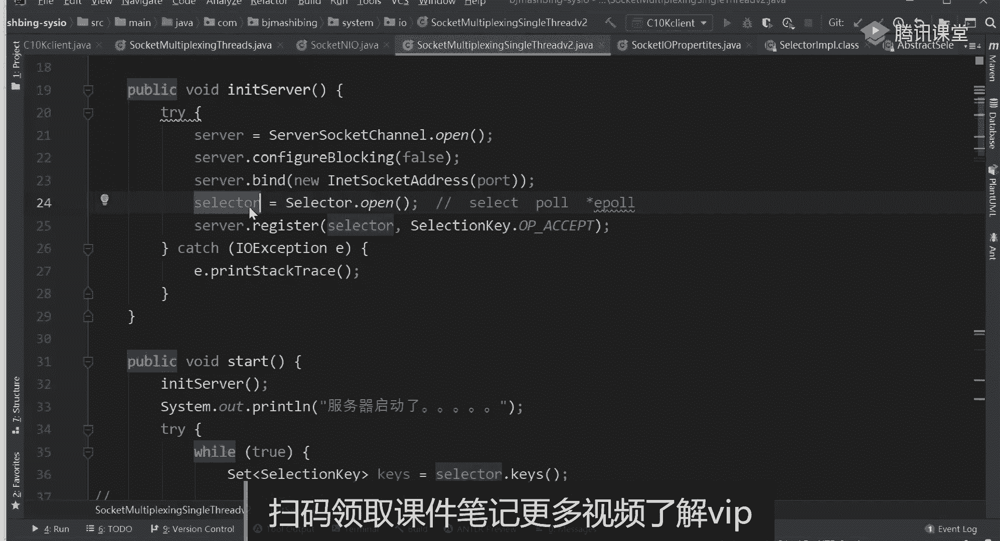

注意注意听，刚才我我那个讲那块是挂上钩的，如果你这个一个位置给你返回了好好多好多事你要处理，所以在下一个位置之间是不是会加大了很多很多复杂的工艺处理，所以你为了一个位置之间的距离越来越远。

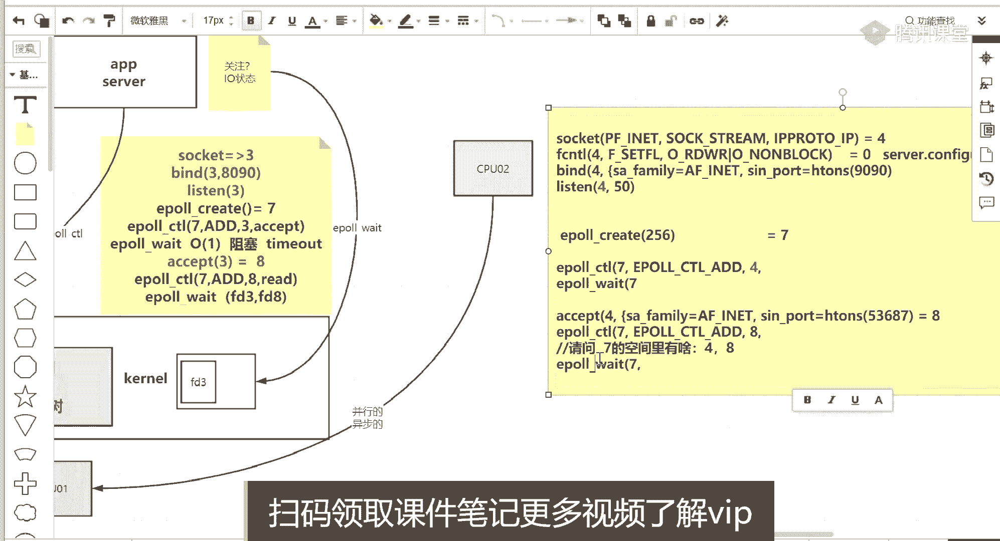

越来越远，时间越来越长越来越长，那这时候其实你可以怎么去想这件事情，假设有1万个连接，我可不可以就是这个计算机系当中啊，我一个成语里边可不有两个c或者三个或者四个或者十个。

这个selector就负责这一批在一个cpu上，一个线程里，另外一个selector在另外一个线程，在另外一个视频上负责另外一批，人家没有符，然后专门我可以找一个县城拿一个flag，就负责建立监监听。

建立连接的一件事情，这个这个过渡想想要真的去想啊，是不是应该是可以的，对不对，不光是可以，我给你看看代码，你比如说啊注意看，比如说我这段情节我准备了三个select。

那我未来不仅要准备三个fletter，我要把三个ft放在放在三个县城里边，能理解什么意思吧，这个代码不是不是nt，就是我从用java代码去写的，用三个select，然后三个材料全都打开啊。

在堆里面变成对象，就全部打开过中间直这个支起来，然后呢我准备一个server，这个server的监听960跟刚才一样，只不过刚才那单单线程单词来着，现在多线程多次来着，有了三个之后，然后注意看。

我把server注册上去了，我把sr注在其中的一个就踩踩了一身上去了，能不能理解吧，就通通过注注到cl一生去，注册完之后，然后注意看我主方来做一件什么事情，我准备了三个线程，我写了三个线程的代码。

就是下面的类里面这三线程我先梳理一下干嘛，我把三个线程跑起来，第一个县城里边，我把这个这个slider一放进去，第二个县城里边把sa放进去，第三个我把三放进去，而且他们还有一个概念不一样。

就是第一个县城里边除了有一个cs 1，还有一个数字二，这数字二是什么意思，也就是说你这县城工作的时候，你在select上刚才注册谁，是不是注册了一个server监听路人。

那你这个这个县城里边的select是不是可以得到建立连接的销售量，那建立连接是不是只有accept可以得到客户端，那得到客户端，得到的客户端应该注册到哪个selector呢，向他注册一个。

他向他注册一个，再让他注册一个，再向他注册一个，到这一步能大体能听懂什么逻辑的，来刷波一，那这样的话如果我是多核操作系统，这三个线程就可以跑在三个cpu核心上，那么一颗cpu就是疯狂的去建立连接。

和别人把建立的连接都轮询的丢给另外两个sdc的身上去对吧，然后让他跑起来，那这时候其实你关注的时候，我ios ride里面的逻辑，那么n l sy里边逻辑就是看它有两个构造，一个构造是带n的。

一个构造是不带n，然后这里面我用的最简陋最简陋最简陋的方式，但是最简陋的代码应该最容易理解，首先select为了接收的，然后这准备了一个thetic，一个select，原来是一个零。

后来传唱的时候我给它分成2/2分之二，然后这里面有一个i d i d为零，这个这个信不管下边还有一个准备了一个东西，叫做blocking q阻塞队列啊，一个q组队列组队列是放什么东西的。

因为你有一个接收线程，未来向两个线程去分发，进来了个客户端，那你那另外的线程忙不忙呢，我线中间通信或者线程间数据传递，我用一个block通q就一个q，而且他会看它是一个数组数组。

也就是我主线程里边给下标为零的，那就是给0号线程的那个斯莱特下标为一的另外一个线程啊，这是一个对立，然后下面一个py这个integer的一个id id叉，这是作为一个两个这个工作的两个selector。

他们自己那个线性增长，这个id用于为什么上面这个带两参的构造方法里边，我把select传进来了，把二乘进来了，然后q的大小这时候就等于二了，就等于二，有了它之后，然后注意看for循环。

然后这里面i然后i等于零，a小于就是小于201，然后这里面开始购到初始化这个new blueq一个对象，到这个这个数组里，这个boss就启动了，就启动好了，这个主的一个线程，第一个线程。

另外两个工作线程，他们只穿slash，但是从slash的时候注意看，他们会掉自己的这个这个叉叉的话是一个静态的，他们有这个形式增长，所以一个人就会增程从零，这个111个人会增程是模磨取取模取二。

一个人就磨成了零，一个人就磨成了一，因为这个魔术值是2c的数量，那就是两个工作线程的i d，一个人是零，一个人是一到这个不构造，能看懂同学来说一说为什么这个赌这个线程的线程，那个写了一个线程的一个类啊。

其实有时候往下看，主放运行运行的时候，其实这个运行起的话，三个线程都会跑啊，注意听三个线程都会跑，那三个线程的话，其实只有第一个县城里边的csselect里边有东西，因为只有第一个现成的。

第一个是这个第一个cm里面注册了一个例子，所以他在这selly的时候，然后看我做了一个十秒睡10ms，这么一个一个一个睡眠阻塞，然后这一个死循环就是一圈圈转一圈转一圈转只。

但是只有第一个县城那个主的那个塞拉斯身上有可能大于大于大于零，能理解吧，因为这是个复用代码，三个形式都会用，这里面如果答案零的话，第一个自然的生存就会得到一个exce accept。

之后就接收一个客户端，关键是看接收客户端啊，当接收客户端的时候走accept tember，接受一个这个论证，肯定是得到一个新的脱单，得到新的投资之后看我主要看下面这件事情是随机分配，随机分配。

看玩哪个对哪个哪个队列去分，就是向另外的哪两个slider去往那个点去放放了一个后端，这就是当前如果第一个只有第一个现成的select可以得到一个exceo事件，写自己的接收的行为的里边。

需要把这个接收的客户端丢丢丢丢里边，好让另外一个线程能知道有这个客户端的存在，到这一步能听出来说的一，还有一大部分是能跟上的，就是这个这个跟不上的，这个就先先小忍一下，先小忍一下，那么给丢到这里之后。

那这时候其实再来看上面这个while循环，为什么是一个组这么一个一个一个一个死循环，选择设了一个10ms，刚才说了，第一个主线程里边他注注册了一个listen。

那另外两个县城里边是不是selly的时候永永远得不到大于零，对不对，但是这就会有会永远堵塞，但是我是一个10ms，那就另外两个人都有可能把这行代码跳过，就这个while循环得给他跳过，不执行里面的东西。

而从而执行到下面这个死循环里边，也是这个死循环里边有两件事情，做一件事便利来的事件，另外还有一个关于任务的处理的运动环节，到这一步能听出来说明一，这个代码写的极其简陋，简陋代码其实相对容易看一看一些。

所以在这部代码里边循环里边，如果另外两个线程还没有任何的这个客户端住在死人身上，所以他们会跳过来的代码到下面的时候，他们会根据自己的这个q来取出所谓的所谓的客户端。

并把那个客户端注册自己的select身上，换个太老了吧，听明白没听明白，是不是就是开始分发这个任务，对不对，对吧，当这个能听懂这代码有兴趣的你可以自己写，然后下面跑我们来看nt。

来看nt那代码我带你走一遍，有对一个原始代码的一个印象之后，然后再那个那个没跟上，无所谓，重点重点在这儿，重点在这，nike，你们尝试都去学过，你们曾经都死记硬背啊。

第一步我得写第一行代码叫new nl event to look bro，然后呢后边要跟数值或不跟，请问这个数值要写几个，请问这个数值要写几，写一写五行不行啊，再往下走啊。

然后我是不是还可以在你有一个是不是得这个返回值，其实就是这个类型，你要而且还特别的根据你网上查的东西，可以管它叫boss，对不对，对不对，你还得给他起名一个boss。

然后是不是你还得再用一个nl group，然后呢后面写，请问这个要写几个，写几个，对不对，唉不管怎么样，你你你你有通过通过不同的学习，你这个事你也没弄明白，应该写，不管怎么样。

访问者你管他叫walker的，然后这个听完之后，然后注意下面是不是你要跟a a i的规范，你说new一个server boot strip，然后得到一个boot。

然后注意下面到了不点group里边是不是要把boss和worker放进去，是把boss和worker放进去，然后这时候其实你要把两个都放进去，那这时候请问我放一个行不行，我放一，他不给，是不是也可以。

那放一个的话，那请问第二个会用到吗，是不是第二个就用到了啊，那这里面到底什么是grp，他这到底做一件什么事情，注意听我给你讲明白了，第一如果在现在这个东西就是把下面的行给他助教，不用它。

如果你只用了一个i o mtt group，然后在这里边传了一个一，注意听啊，如果传了一个一，且将这个group这个线程组这个group放到了boot它的grave两个参数位的话。

那代表着未来会在一个县城里既接收又读取，就是咱们开始写的这个single thread版。

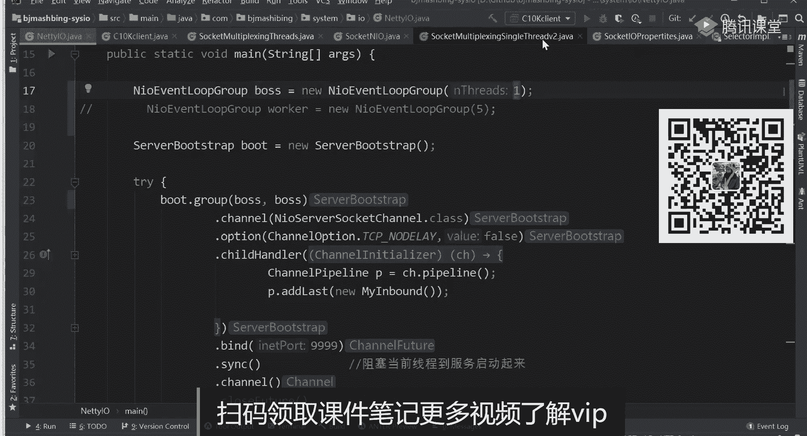

只有一个slider在上面，既要做读写和接收。

他只有一个select到这样它就是一个逻辑关系，能关联起的同学来说一，然后如果注意听，如果我把它写成一个大于一的，比如写成三，那在三的模型下是一个什么概念，如果这为三，并把这个boss付给了两个参数位。

这个是什么意思，他这种模型下是什么意思，也就代表着未来会就是我的这个这个并不是我这个多线程版啊，是我多线程版的另外一版，我现在这个多线程版当中是分工的，谁就对谁来依旧负责接收。

剩下两个是不是就是工作就是读取对，那像刚才我这个代码，如果这写成三的话，然后把这个boss放在两个位置，其实实现的是由三个线程，其中一个线程接收和读写，另外两个是读写，就和咱稍微一，对吧哎那在变化。

就像这一种这种就是在一个你一个i o一个gal作为承担的时候，这种场景两种情况要么为一，要么大于一的情况给你解释完了，那么这时候再把它扩展一下，看一下，这时候变成两个了，那这时候我一个穿boss。

一个传walk，from work，那在这种文件下，其实就是我的多线程版本，就是分工版，分工版分版，前面boss注意听，注意看前面那个boss，你这写几没有意义，如果未来你只监听一个端口号的话。

未来这个代码未来你绑定的时候只帮一个端口号的话，那么这时候你写体没有意义，在这个所谓的group里边，它只会有一个线程，你写三写300都没有意义，他只会有一个线程拿来。

而且他只做access接收第二个参数为这个worker，这个线程里边你写多少，那么就有多少个县城未来会跑起来，他们只做读写，而且是由这个gal里面的一个县城轮流的，或者按规律给它分发的这些work。

分发这个所有的连接，病毒来刷波666，对吧，那那这样的话我们来做一个啊，做一个小小的一个演示，是不是这个概念是概念，比如说我在boss里，我写了博客里边三，那到底是未来是不是有三个线程的。

然后这边我写一个，这写一二吧，上面写二写小点的，上面一个二，下面一个，那也就代表着这个程序现在boss里有两个线程，worker，两个线程有什么定义的，那么这个这个代码跑起来之后。

到底一共有多少个县城boss写大于一的没有意义吗，你在下面看你绑定多少，你要监听多少个号，能明白吗，就监听端口号，这个事儿是要压到上面这个select去的，好，有人说了，你已经说了，是三啊。

他就这么跑起来，跑他之前啊。

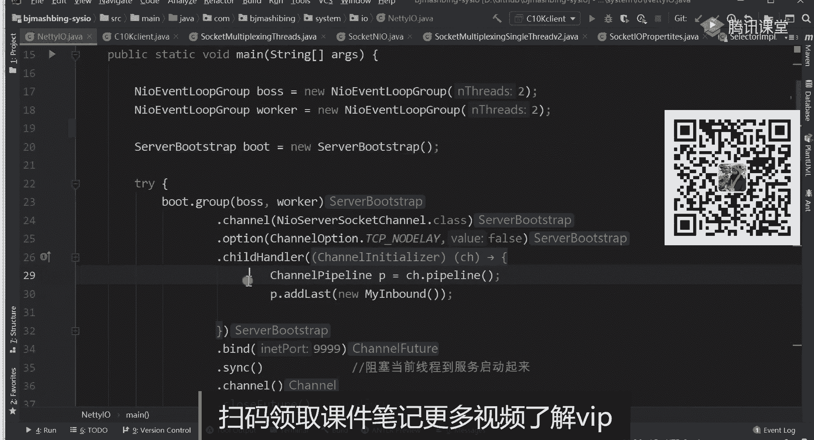

我们做一件事情，找到你的，c盘，然后找到你的jdk，就直接的方式，最傻瓜的方式，然后呢它有一个b，然后它有可视化的一个工具，哎呦我这个鼠标的慢好了，现在他看到了一些我们这台本机跑的gbm这个这个进程。

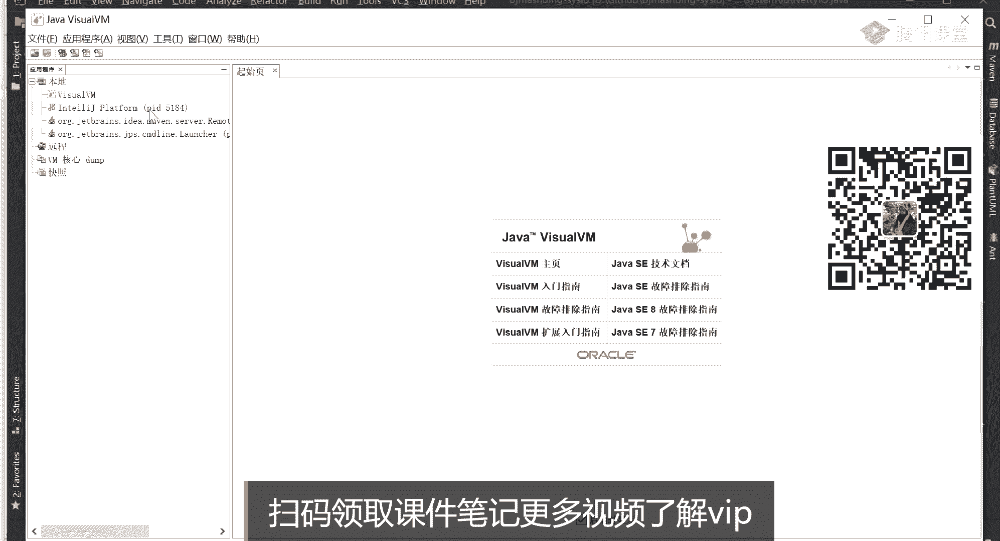

然后把尝试把代码跑起来。

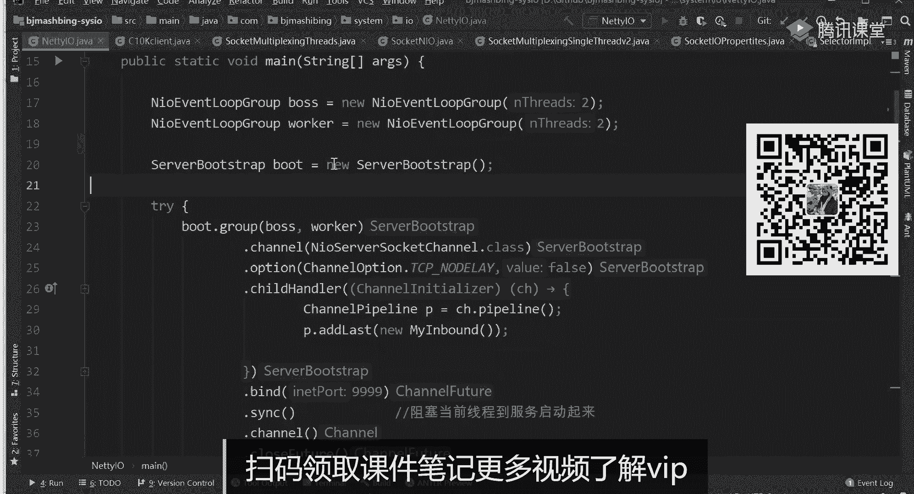

先听的是9090，对不对，把它跑起来哎，跑起来之后是不是多了一个，比如马士兵cni o nt l o双击它，然后看线程，这里面线程我们来看一眼，跑起来了没有，找nike这个。

看他刚运行起来是不是多了一个n o do，比如我二杠一的圆啊，有这么一个线程啊，那还有没有啊，然后这时候我们开始建立连接，手抓啊，现在有一个了，然后再来一个连接。

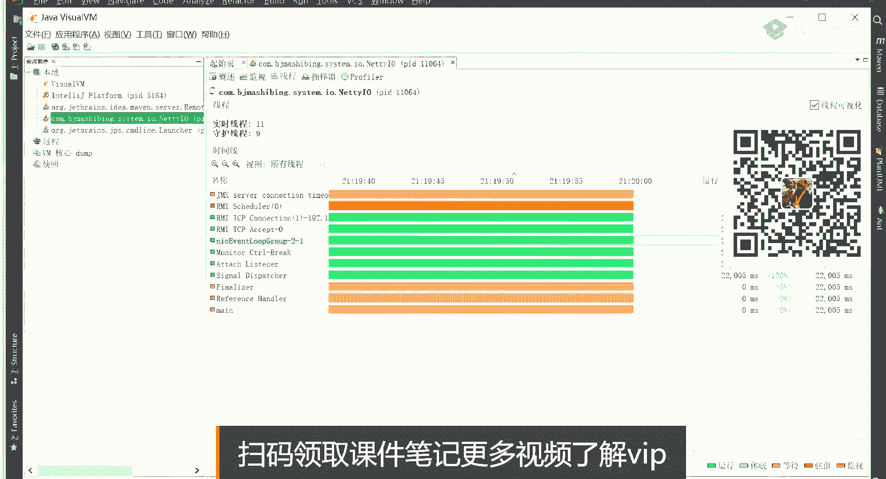

nc连的是我192。168。150。1t i7 的，然后90999有四个九。

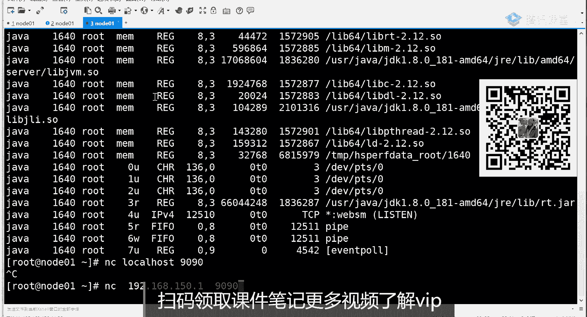

因为那个考了四个九进来之后，然后除了他是不是多了一个nl，因为tgp 3杠一上面组二里边只有一个线程，组三里现在多了一个县城，能看懂吧，哎其实这个过程是主二零那个boss给walker里边开了一个。

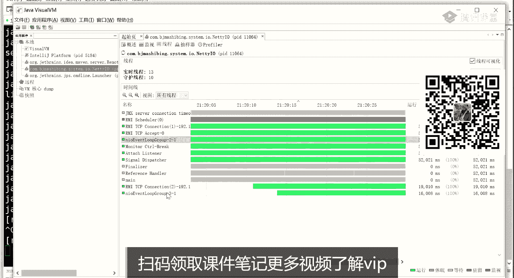

而且你也发现一个特征，就是随机连接它的一个线程会创建，然后再来一个连接，n c然后标准2。168。150。1。

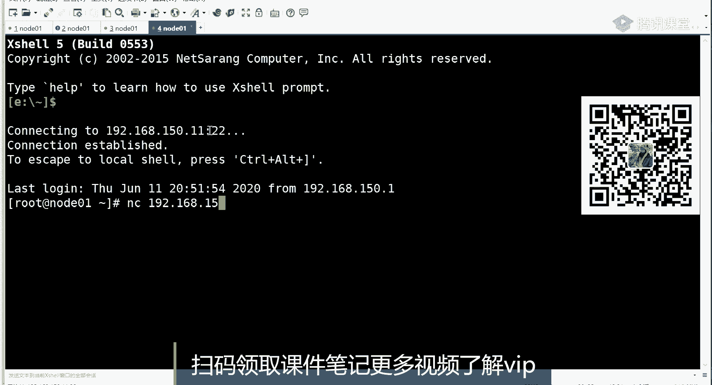

然后99994个九，在三里面又分配了一个，这就是二我在boss那个worker里边是不是定义两个线程。

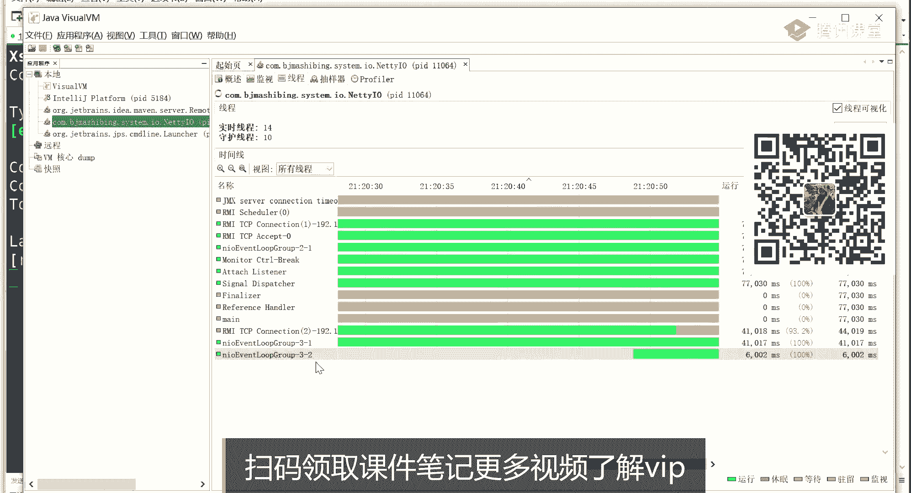

如果再来一个的话，现在就不会多了，哎没错，再来一个这个互动感是不是有了，你想你就是蛇头油，是不是有很多问号的没你如果未来这么玩多好。

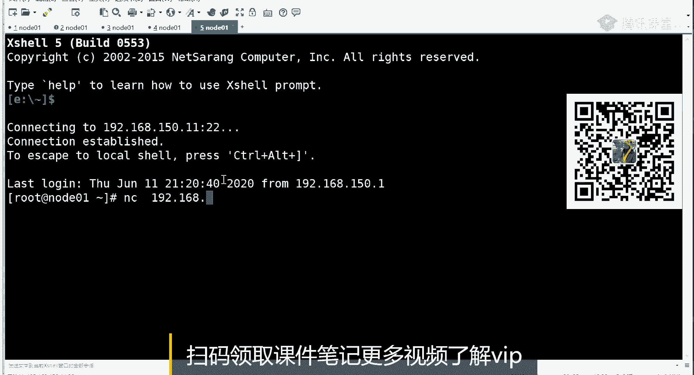

还多吗，现收税不多了，所以也没有使用boss那边的县城去站出来，其实就是扔在了这两个县城里，对吧，能看懂的同学能干到这个这个本质和精髓。

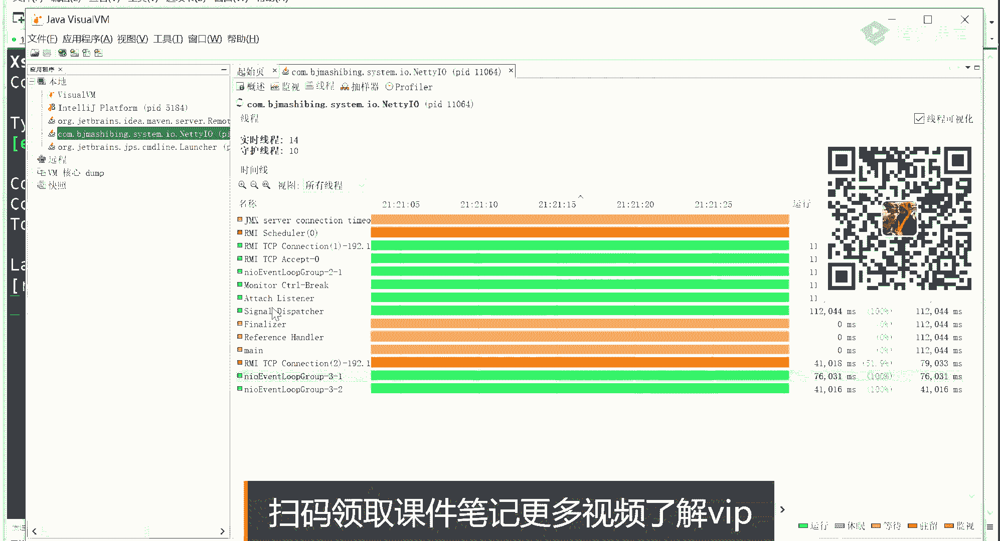

同学起码这个nt入门这块你是明明白白的入门的，不，但是你要get到这个点啊，这个点这个点是是我讲课好吗。

不是是你找到了一个学习方法，就是从最开始很头疼的把所有事情捋清楚了，你知道了这个东西就是这么一个原理。

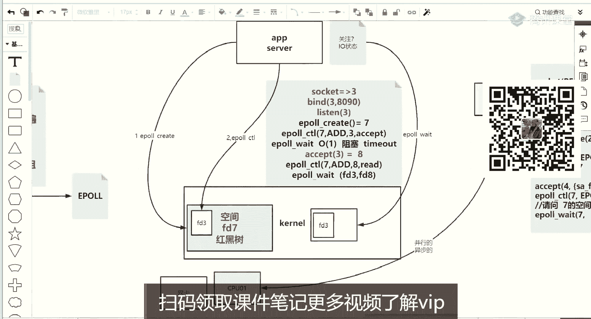

那么越往后摸，越往后摸，这事你都知道怎么回事，他不是要给你教明白，对吧都给你们看一眼啊，多给你们看一眼，就是因为刚才在这个一破位的，这其实以前我也给大家演示这么一个事，情，追踪一个事情。

后半音乐给他结束，加上一个资源。

再来给你演示一个想听吗，哦我这有一个nbx，像用e poo啊，像使用多路数学器e po的地方都有哪些呢，像n ex里是不是用了一炮了，我再给你讲，release是不是也用了，等一下让我来。

我找一台release，release，我这台是，没有跑，这边的话，他endx没有跑起来，有没有好啊，这这不对这不对啊，我是说这个第一台，第一台是没有release，那在第二排就有。

上面写的我们先来看endx，看mix，那么现在请问endx有没有用e poo，那他e po是怎么去用，怎么去用的，那现在我想知道我你想知道这件事情可以怎么去做了，有没有用，它怎么用的。

你是不是可以去到sb目录当中去追踪它，启动了一个进行的所有的追踪的过程，是不是可以用rts到ff杠all out，然后运行本机的index走回车，当前目录好诶，他跑起来了，他他跑起来之后。

你只需要去茶叶，这里面有三个i d18101811 和1812，js杠f grape endx，这里面呢注意看1811是master，1812是walker n这个词。

懂的同学应该知道你的worker可以用多个method，只能有一个能理解我什么意思吧，啊那第一个其实是一个过渡的一个线程启动的一个建筑，那我们来看一下哦，点1810，看到最后还有一个退出啊。

看到最后他一个退出，那这里面我们来搜寻一下，不用说直接在上面可以看到它上面是有一行代码，就在第一个进程里边，他已经做了一件事情，绑定6号文件描述符到八零端口，就是n这个词是真听八零的。

你看到了一个文件名是六被被监听，然后绑定到八零，就是你观察的第一件事情，所有server前面一定有这件事情，然后再看2。1811，打开181的时候，注意181是一个master。

那么你一定要明白inx master做些什么事情，你看这行代码。

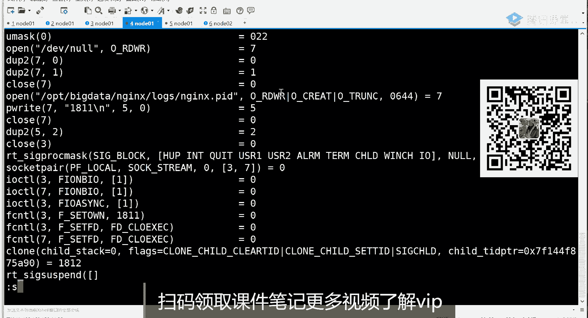

这个视频里面的代码只有22行多吗，这里面有所谓的e破create吗，没有master只是负责接收我们的相应的信号，然后来维护热更新热部署，然后重启我们worker监控。

监控这个worker的这个健康状态对吧，这是nbx它的进程的分工分类的一个特征，那真正干活呢其实是我们的worker，那就打开vi out，点18121812里面会发现这这里面的代码可能多一点。

到23行不关的问题，我们来看看这里面做一件事情，e pc d到八里面添加了一个七和e pc添加六，这个八里面添加了六，刚才六是谁，六是不是刚才在第一个技能里边开辟了一个监听，这个八是谁。

是不是e破水位得到一个八，这个有没有用e炮啊，用了在这看到了，且他是不是在用io的阻塞，对吧，先把这个特征记录，现在能看懂这些东西的同学来刷波666，我带你看另外一个东西，release我给他填一下。

听到了cs到s d和我同一个id，有380不用管，我跑了一次机九还是用stress去追踪到ff杠o2 ，追踪谁追踪我们的嗯，我直接把它跑起来o p t。

然后bgrid 5里边的定下的realis conserver，把这个程序跑起来，且加载配置文件a g c，然后会有一个redis通路线，一个6379的一个配置文件，后边这个就是redis启动的过程。

不用管，最终我是能够追踪到这些个记录的，我把这个前面文件，因为在当前目录啊，我前面加一个realready is out这么一个文件名，然后走跑起来了，能get到这个点吧，哎release跑起来了。

看是不是跑起来了，没错，跑起来之后，这里面会有一系列的redout的现成的记录，对不对，后面这几个不用管啊，主要看前面的主线程，worker线程，它是单线程，单worker result，1335。

好了你们告诉我第一件事情做什么，来互动，我想教你的学习方法，现在你要做的第一件事情是什么，等会多少6379啊，大哥你要先定1~6379才对啊，他在绑定到6379去找到那个位置。

是不是你因为你要知道这种类似的那个文件，找到那个文件密码符，它是不是放到了io create里面，对不对，那六是什么意思吧，哎先找绑定里边是不是保他诶，他绑定6379，他在谁身上吗，是在六六。

是不是listen，对不对，然后这时候六，然后listen这个都不用管，你看六字哪来的，是不是从上面来的，那在网上看多看一眼就看到了，他是不是也epod到了一个五，五是一炮，六是listen，那往下走。

对六是不是做了非堵塞，然后再往下走，然后下面多了一poc t l在五里边是不是添加了六。

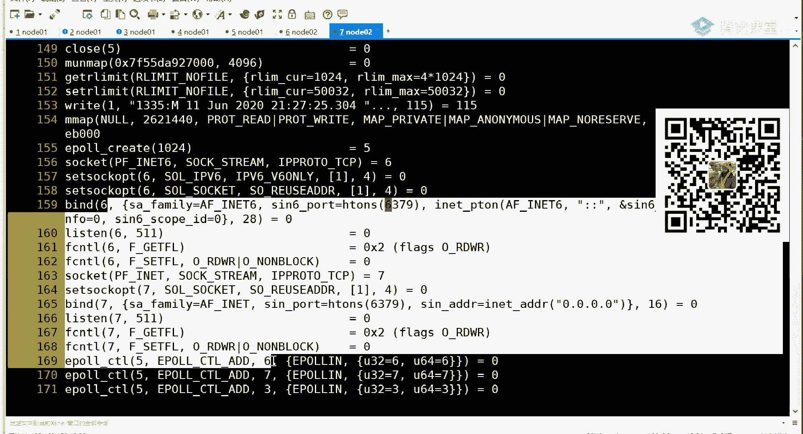

对吧，听完六之后，但是但是重点来了，看这个文件怎么1万多行了，关闭它，现在记住它是10370811031130，又变又变大了，而且你用tar杠f reits out。1335，你看到了一个什么现象。

没错，这就是设置的time out，这个就是设置了开帽子，因为他要一直循环一个，为什么，因为它是redis是单线程，它是一个单线程，他在一个县城里边，他不可能在这一个紫色的，有人发了消息，他还工作。

那这时候像l l r u fu的内存淘汰啊，它的持久化呀，它的一系列的事情就来不及做了。

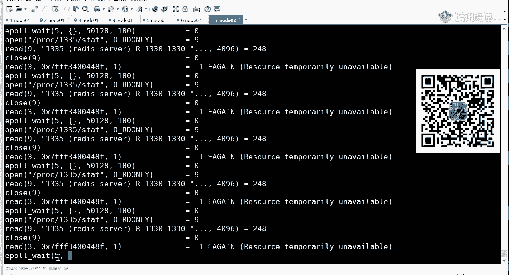