# 系列 2：P68：左神算法-Morris遍历及其相关扩展 - Java视频学堂 - BV1Hy4y1t7Bo

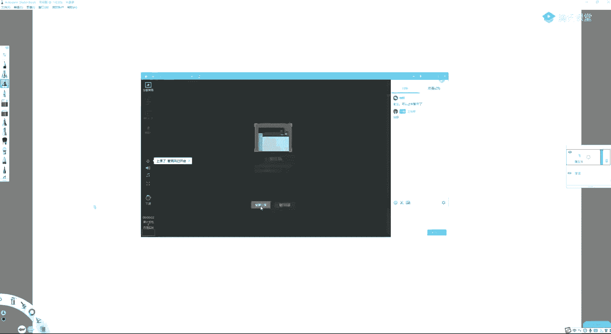

哎我就看了，今天最近看了一下啊，这个买大车的讲法唉，蛮有意思的，你知道，第一个帖子，然后你看他讲的方式和他提供的代码，最后来了，有个同学来了一句，是吧，哈哈哈哈好吧，这个，行啊，这可能是我某一个。

未曾谋面的朋友吧，能听到不说话了呀，明天明天讲现代数和ak自动机了，下午班，下午是莫斯便利，诶有有有，有有多少同学这个最近参加一些笔试，面试比较频繁的啊，我还有几分钟是吗，估计要到2。05开始讲。

可以聊聊对吧。

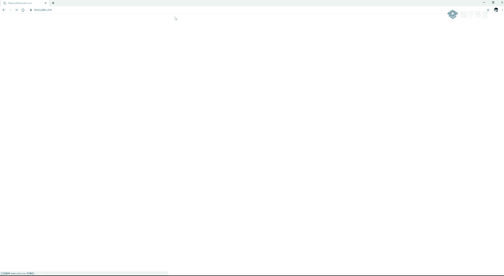

你怎么刷。

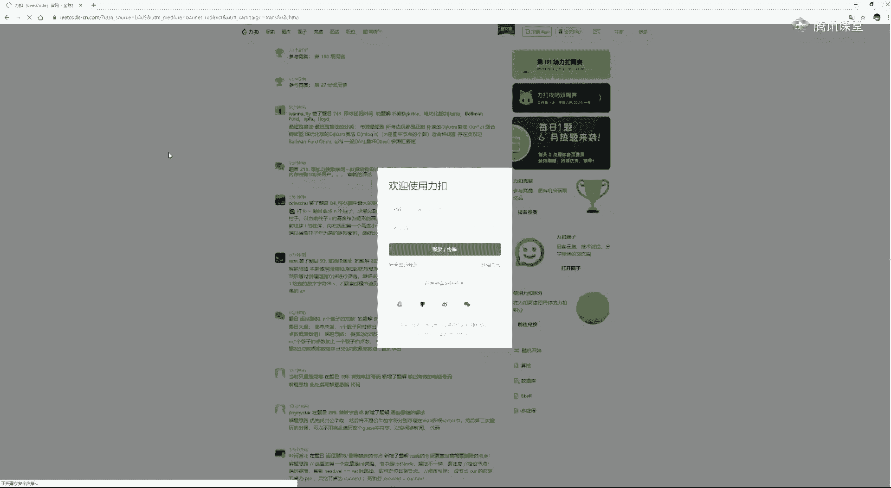

这是cn，咱去的不是cn啊，你们怎么刷啊，这个是这不有这些吗，top 100，like the questions，这个还有这个top interview questions，说句实话。

这个top 100块的比较有意思，但是这个是最高频最功利的，你这样的，你这种这种这种列表，你点进去，你比如说你你就是最功利的方式，你点进去他这个最最高频的这些题，你都一个一个刷就行了。

他肯定对你来说是最对你来说，对你来说面试压力最大最大的啊，然后还有就是你你知道他你们点进去啊，如果你们有精力有限，你在100在100这个top question里面，这不有一个点赞跟一个点踩吗。

看到了吧，你点你选这种点赞多的题，刷这种题，就说明是他那个他这个这道题你搞会之后有一些有一些技巧或用法，以后切别的题可以借鉴到啊，他就就很多人会点点赞，虽然你你感觉这个赞只是用户说刷爽了就点个赞。

没刷爽就点个踩，但实际上它达成的效果就是这个意思啊，也很奇妙是吧，这个我这些都是我的经验啊，我观察要发现哪些提示，它可能会比较提炼出技巧的题，就这种有有些题目他真的很烦的是吧。

它每道题它那个优化技巧是属于那道题的，你刷完之后就没什么帮助吗，有有些题他点点点赞很多，就意味着就是他能学到一些东西，你比如这种题，我公开给我讲过这双指针问题来解决的，那双指针统一的技巧，他能借鉴的。

那这个点点赞的就非常多啊，高频题里面也有点赞很少的，我记得这没错，这个题吧应该是点赞蛮少的啊，点点点赞蛮少的，你看这个虽然他很高频，但是点赞那么少，点踩这么多，为啥呢，因为这道题本身它的业绩。

他自己的业务优化太多了，用户刷完之后觉得我搞了半天弄了个啥是吧，这这什么玩意儿是吧，我刷完题之后有有有有啥球用吗，感觉没啥，就是这道题那就点大家都点踩听懂，他打个一，啊。

啊这个有的同学问我就是奇数都放在奇数，偶数都放在偶数，这个题我都已经不讲了，只要你问的话，我就可以给你讲一下，正好我们还有几分钟要开始了，就是有同学问我说一个数组中，一个数组中都不用。

都不用限制2n个元素，就是就是就是一个数组，请你把基数放在奇数为奇数的下标上，偶数放在偶数的下标上，你总能达成一个就是你如果基数过多的话，你也能做到基数放在奇数的下标上对吧，你如果偶数过多的话。

你就可以做到一个效果，就偶数放在偶数的下标上对吧，如果你奇偶一样多，那你就可以做到基数放在奇数下标上，偶数放到偶数下标上对吧，所以这个题可以不不一定它非得是2n个元素，我们现在解决这道题吧，因为。

因为这个这个这个现在还有些时间好吧，大家听懂这个提议，同学打个一就是倒数第一，这个不是这个名，这个同学名字叫倒数第一啊，我们就管它叫第一同学是吧，第一同学问了个问题是吧，你不让我想现场解吗。

那我就解完之后，正好这个题我一开始是讲的，后来我觉得他太简单，然后就给他删掉了，你们的班上现在我都没安排这个题啊，但是他这个题是一个很简单的道一个问题，你是考到了吗，这个其实是个coding技巧啊。

他是怎么做呢，这样啊，我有一个数组吗，这个数组你要么做到奇数放在奇数下标，要么做到偶数放到偶数下标，所有奇数都要这么做，所有偶数都要这么做，如果你奇偶一样多，那就可以奇数放奇数下标，偶数方偶数下标。

或者你基数有点，比如说你基础有两个，我说有一个你也可以做到，对吧，哦不行，偶数有两个奇数，有一个也可以做到，你比如说你有两个偶数是四二，另外一个奇数是九，那你其实可以做到零位置上放二，一位上放九。

二位上放四这种是吧，反正呢他就是嗯就是也就是说你尽量让所有的基数放在基数上，如果做不到，你基数不够，那就算了，你尽量让所有偶数放在偶数上，如果你实在是个数不够，那就算了，就这么一种一个题。

理解啥意思吧啊那怎么做呢，你有个数组，我有一个，我就看最后一个数n减一未知数，我就看他我设置两个指针，一个指针在指指它只去指偶数的下标的指针，比如这个指针我管它叫aa指针，还有一个指针。

它一开始是b它就就指奇数位的指针，比如说我给你举个例子，76294237651，这个速度我怎么做到的，调整是啥样的呢，一开始看n减一位置的数，a指针指向零，b针指向一哎，这个数是奇数对吧。

你把它跟b位置上的数字交换，那么你就一就来到了这个位置，六就来到这儿了，然后你的b已经指到一了，你跳到下一个奇数位置上，三位置就是bb一下，它会跳隔一个格子，跳a也是隔一个格子跳，b永远是隔一个格子跳。

a也是隔一个格子跳，他俩不会跳到一个位置上，a跳的都是02468这种位置，b跳都是13579这种位置，那你这个位置就搞定了吗，我再看这个六，它是一个偶数对吧，我给他发货到偶数位置上，你的七就来这儿了。

然后我的a就往下跳，跳一个格子，大家懂啥意思了吧，你永远看最后一个位置的数发货，你发货到哪儿，那个数拿过来，然后指针相应的跳一个格子，a或b有一个越界了停，你做到了，听众同学打一，对吧。

你这种为什么说它简单，我都我都不想讲了，因为啥呢，他就是一个口径技巧对吧，就是后面最后一个数你就发货吗，你扔到哪个货，那个货位置的数就来到这儿是吧，你就这两个指针，它有一个月界了，说明有一组做到了。

那就停了呗，是吧嗯，好啊，我不知道他是不是离得扣的原题了，因为我刷的题太多了，我其实你跟你们讲到lead cos上或者是居多，我自己刷什么平台都刷了，所以我也我也不去区分他到底哪儿的题，他重要吗。

他也不重要，对不对，可能有吧是吧，可能有吧，你可以看一下奇数的奇数位，偶数在偶数位，就拿这个东西搜，也许他会提给你跳出某一个ledcoat的提吧。

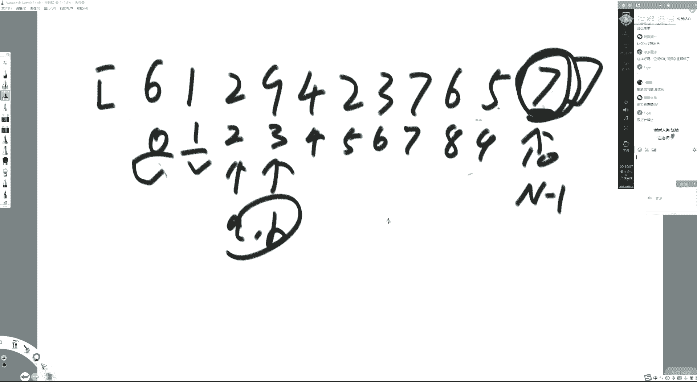

好吧，那再等两分钟，就这种这种小题，好多东西都不讲了。

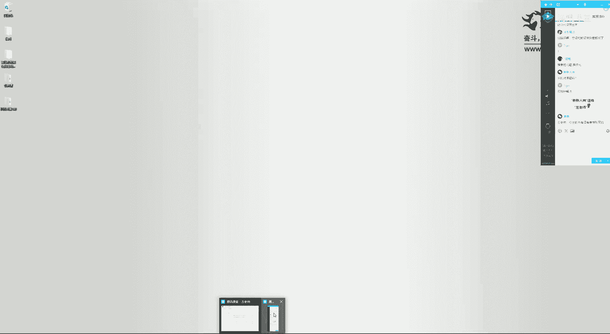

因为，我总觉得有点水，对不起观众啊，所以我也陆续的很多，我原来好多压箱子踢我都不讲了，因为没必要啊，既然我们这个班会一直开，有可能所有之前没讲的题可能会复活是吧啊，a cm体哪能刷top cod。

top coder上是是那个a c m的人拿着来做打比赛的，拿着做比赛平台的啊，当然你你自己是图中图片式的话，你不用刷了，top coder，因为上面的题都不知道哪，你不知道他突然间就拿到哪去了是吧。

他不够功利，嗯嗯面试的同学刷绿的code，如果就是想学好算法，对这个都有瘾，跟我一样是吧，你就去刷top code好吧，然后，我出的书有没有推荐购买的，嗯这个我自己吹，我自己不太好吧是吧，你爱买就买。

不买就来听课是吧，就一样了啊，书上只是一个总结啊，真正本体现在你不就正在听吗是吧嗯，啊，啊不是脑子笨，是你还不熟啊，没有脑子笨的，你能跟他说句实话，就现在课堂上，甭管是在参加正在参加直播的，还是看录播。

看到这里的，你要知道你你脑子不笨，你一定能够把这个事情攻克，为什么攻克真正攻克不了的人，基础班都看不完就退课了，听我同学打一，啊，就练就行了，你这不会他有雷德cod，还要我教吗，你比如说这个某一个题吧。

你不会对吧，讨论区里面最多投票的方案看懂八九不离十，理解啥意思吧，当然你这个lead code里面讨论区最大的投票你未必看得懂，但是代码你得有点抠，你自己把它翻译过来啊。

还有一点就是投票最高的题未必是最优解，这个还是挺多，有不是最优解的，我跟你讲，我肯定讲最优解吗，就是筛选的过程你可能做不到了，但我跟你讲，如果你想现在就是刷题，那你就这么干嘛对吧。

你一个题起码要想个想个三四十分钟啊，你实在想不出来了，你就就就这么干净，就是题目描述实在想不出来了，边讨论区最高投票，你就你能懂得理解吧，听懂啥意思吧，超过一小时就不要再不要再重复，再再再再再憋他了啊。

就保证自己一小时一小时这么弄啊，如果你小时解不出来，完全没思路，那这道题本身你也应该去学的是吧，给你不要一道题扣一天，我这是我当年的干法啊，真的没用啊，这个非常费时间的，就一道题最多给自己一小时时间。

但要保证这一小时心无旁骛对吧，如果如果你觉得你自己有印，如果你觉得你自己有思路了，那可以超过一小时来用来扣顶，但是一小时都没思路的话，你就赶紧看看答案是吧，嗯，好啊，这时间也差不多了好吧。

我们现在讲摩尔斯便利啊，好这个p p t大家都有吧，没有也没关系啊，这个，我们来先把莫瑞斯便利是四个哎呦，不是公开课，哎呀算了，不不不不不开ppt是吧，不开ppt显得很心虚一样啊。

这个已经熟到不用开是吧，好我们现在讲一下啊，这个我们知道在我们之前讲的基础班里，我们介绍过两种二叉树的遍历，都可以实现先序中序和后续便利是吧，那么我们说当时讲的时候是不管你用的是递归的方法去搞啊。

二叉树的三种遍历，还是你用非递归的方法去搞二叉树的三种遍历，其实你都是需要额外空间的，如果是递归方法的话，你其实需要调用递归栈来帮你去做压榨，是那个空间复杂度，时间复杂度当然就是节点个数b o n。

但是空间复杂度其实它也是要占用的，就是占用你整棵树的高度对吧，这一棵树我想便利完全把它遍历完，我是通过一层一层的压榨的方式到底层去的，这个东西搞完了之后，回到上层的站调用这个函数再往下走对吧。

那你的这个占空间，你不断的使用，不断的释放对吧，这个使用了，然后又释放掉，然后用来搞这边就是递归战里面，他开的空间其实是跟高度相关的地沟h这是递归方法，非递归方法也一样，非递归方法就是你自己去压战。

你也要最最最差的时候，你要要压整个一个高度的，所以不管是递归非递归，我们之前讲的方法都是时间复杂度b勾温，额外空间复杂度b勾h这么一个指标都听明白，同学打个一就是我们前置的内容，如果不会的话。

嗯这节课你也能听懂，但是会麻烦一点，基础班都讲过了，啊好，那么，我们morris遍历是做什么的呢，morris遍历是我遍历完一科二叉树，可以实现中序先驱跟后续便利。

我能够时间复杂度b g o n空间复杂度优化成b o1 ，这就是摩尔斯便利，摩尔斯电力可以实现树的先序中序和后续便利，而且它的空间能够从高度这么多变成差有限，几个变量就能做到，为什么它重要。

因为数有很多题目都是跟便利有关的，你掌握好一个非常优良的便利，就意味着你有可能关于数遍历的某一个问题，morris遍历的流程，它就是最优解，听懂同学打一，对吧，因为我们输的很多题目都是跟便利有关系的。

我们掌握了一个优秀的便利，其实就意味着很多题目它是以morris遍历本身作为最优解的，因为它空间很好，时间复杂度又没有什么变化，但是这里面这个地位大家要记清楚，不要在笔试的时候得瑟，笔试我们讲过了。

在基础班的时候也给你提过了，笔试的时候什么以什么为准，以最快ac accept通过这道题为准，面试的时候，你可以跟面试官好好聊一聊，理解这意思吧啊对，怎么简单怎么写，怎么尽快过，怎么写。

在保证时间复杂度更正好，卡中让它过的情况下不用再优化了，这就是笔试特别功利的玩法，因为没有人会看你的笔试写的扣的，他就看那个分，但是在面试的时候，你想一下，如果面试官出了一个很简单的题。

比如说判断一棵树是不是搜索二叉树，判断一棵树是不是搜索二叉树，1万个人都会给你告诉你递归的方法或者是非递归的方法，给你那么做，你来个猫便利，你跟面试官讲清楚了，你觉得会要谁，听我同学打一。

对吧好啊哎大帅同学啊，看样子你是下午功课的km p中的mais和猫变重不变，猫2s便利中的猫是死是同一个人，这是我早年的算法和数据结构的偶像是吧，大家觉得他很厉害的，请把厉害打在公屏上，哈哈哈哈。

这个k mp中的morris跟我们今天要讲的morris遍历的morris是一个人啊，好啊，那么我们先来看一下啊，先把流程给你列好，大家准备好截屏键是吧，我边讲，你看我这个流程。

我我是不会掉入任何ppt的，因为对我来说太熟了，这个流程是当前节点，叫current，一开始，current就来到整棵树的头，好第一种情况，如果current无所述，current直接向右移动。

那怎么向右移动呢，就是current，它等于current dirt，这就向右移动了吗，就car t变量是不是跑到右边去了呀，对吧，这是我们第一个分支，第二分支，如果current有所述。

找到他左数最右的节点，我们把它记为most right，如果他有左数，就找到他左左上最右的节点，啥意思，你这是current，它有左数对吧，这是current，它有左数。

它左数假设就是一个节点或者是这个样子的，那你说他这个他左数上最后的节点是谁呢，就是他对吧，卡尔的左数最后进点就是他，但如果他这边还有节点呢，那左数最右节点就是它，如果它右边还有节点呢。

那左数最后节点就是他，总而言之就是看人的左数最右的节点，你给我找到怎么找，就是从左孩子开始点right。right。right点，right下去点right到最后一个最右的啊，这就是这个意思好。

如果car的有左数，就找到它左数上的最右节点，most right，接下来就要分情况了，第一种情况，如果most right，他的右孩子，他的右指针，是指向空的，这个时候你让most right。

右指针让它指向当前节点，然后current向左移动，现在你听了一头雾水，不要紧，把流程记一下，或者准备截屏，我们会给你例子，把这个流程彻底过明白，那么第二点就是如果这是如果啊他的右指针指向空的啊。

就把他的右指针指向当前的节点，然后让当前节点向左移动，也就是说我们会人为地改，我也就是说我们会人为地改他左指身，它它左树上最右节点，右指针的走向，懂啥意思吧，我们会人为地改的。

那么那么假设most的right，他的右指针，它是指向当前节点的哎为什么会有这种情况呢，你如果不改整棵树的话，你找到它右左树上最右节点这个most right，那肯定它的右指针指向空的。

但因为有了第一个操作，我们会我们有可能会把某些节点的右指针改成指向某个值例对吧，所以它会出现第二种情况，第二种情况是因为我们第一步操作的时候所产生的这么一个效果对吧。

所以有可能这个当前貌似right的右指针是指向当前节点的，如果它是指向当前节点的，怎么做呢，让most right它的右指针指回空，然后current向右移动。

那你说除了第一种情况跟第二种情况还会有别的情况吗，我告诉你不会了，也就是说不存在更多的情况，我们也其实在整个过的流程中，你也能够体会到这一点好，什么时候停，current来到零的时候，停current。

current来到空的时候停，整个流程停，大家先把这张图截了，放在你视频，我给你讲课的旁边，我们我们现在开始设计例子，给你过一遍，这个东西说什么，截完的同学打个一，好啊，好行。

那么现在我们就来设计例子了，这个屏幕这个东西我就给擦掉了，这么一个数，大家现在忘掉谦虚，中序后序遍历，我们只纠结一个东西，就是current依次会以什么样的顺序到达各个节点。

这个序我们管它叫morris序，就是你现在没有所谓的中序先序后续的概念没有，只有cn的节点依次到达某个节点的顺序，那么我们知道一开始我们规定好carry的是指向当头节点的。

所以mors去的第一个就是一好，你现在听你现在旁边那个规则里面，我们写了，如果当前节点是没有左数的，怎么怎么样好，第一个条件，第一个大条件没中对吧，我们看第二个条件，那就那就中了。

中了我们就找到这个current左数上的最右节点是谁，五，看二楼的左数是二维投的这棵树，它最后节点是五，那他五的右指针是指向谁的呢，他一开始什么都没动，他他当然是指向空的。

所以中了大大二条件里面的小一对吧，我们是怎么说的，我们把这个节点它的右指针人为改成它指向当前节点，然后我们说current向左移动对吧，所以现在它会从一跳到二，到二的时候会怎么样呢，还是判断它有左数吗。

他有左数，所以条件大一没中，他中的是第二个，既然有左数，就找到他左树上的最右节点，那就是这个思自己吗，那他左树上最右节点找到了，他的右指针是指向谁的呢，他又指针是指向空的，所以根据我们的说法。

我们就中了大条件二里面的小一，就把他的右指针指向当前节点，然后看着它我们怎么说的，往左移动对吧，刚现在是二，它会来到四，给我来个四，来到四的时候中了什么条件，因为这个四他是没有左数的。

所以它会直接向右移动，你看到了这个四，它的右指针已经设置成了二了，所以卡尔往右移动会往上蹿回二，讲到目前为止，理解没有问题，同学打个一，诶这个磊同学有什么问题就发弹幕，好吧好，那我们就看我们回到二之后。

继续判断当前节点有没有左数，有，所以中了没有中条件一，中条件二，有左数的时候，找到他最后的节点是谁，注意我们一定要想一种机制，不要让这个四穿回二，就是客观上来讲，它左树上最右的节点，我们要找到他。

那你怎么加这个判断啊，你比如说我我我当前节点是current，如果我告诉你他有左数哎，你你得写一个while，你这个while里面得是一些移动y要出来的时候，你要找到真实的数中我左树上的最右节点。

所以你你不能够只是让这个让这个most他傻穿对吧，你这个你这个most他呀他不能够单纯的我永远是most。right往下蹿，为什么不能这样一直这样做呢，因为你这个四会穿回二的对吧，我们得想个办法。

要让这个四就是找它每个每个左数上最右节点的时候，还要保证它不要往上走，这个过程假设我们做到了啊，里面会有写，但是我们现在就认为，假设我们真的能找到他左数上客观的那个最右的节点，那么他就能找到四。

找到四之后，你就会发现他中了哪个条件，就是我们先假设我们能找到是吧，虽然我的右指针改完之后，它这个过程肯定不是单纯的往右窜，但是他我我我是可以通过一些技巧找到的，这个你不用担心，肯定会跟你讲。

现在我找到这个四，他是中了哪个条件，他大条件里面的小二，我们会发现这个四的右孩子就是他的右指针是指向当前节点的，我们是怎么说的，我们让它的右指针指回空，然后current往右移动，没错吧。

所以这个current就从二来到了五，a5 它没有左数，直接往右移动，来到一，要这样指上去了对啊，网易又来到一那ka来到了一了，ka来到一，他有没有左数呢，有找到它，客观上左数的最右节点五，对吧。

那这个五节点它的右指针指向谁的呢，它指向当前节点的，根据我们的说法，我们怎么干的，我们把它恢复成让它指向空，然后卡尔向右移动，来到三，对吧，又是这个三是有左数的，他左数的最后节点是谁，是六六的。

右指针是指向空的，所以让他指挥三，然后看着它向左移动来到六六是没有左数的，所以往右移动来到三三是有左数的，找到最右节点六，这个六它，最右的节点是吧，它就是它三左数上最后的节点就是六。

这个指针词是指向三的，我们把它恢复成空，然后向右移动来到七，七是没有左数的卡尔会来到空的位置停，整个这个序列我们就把刚才的那个东西给过了一遍，理解没有问题，同学打个一，我看有同学有什么问题。

那谁的最优节点不是七啊，三左数上的最右节点是六自己啊，你看七是他又数上的节点啊，三左数上的最右节点就是六自己啊，没有七啊，设置五的右节点是一之后为什么四变成u了，四没有变成u啊，来我们再来一遍好吧。

看着有点乱是吧，这个树本身画的比较猥琐是吧，来再来个大脸好不好，重新来一遍，这个流程是啥意思，我给你解释，但是先让先让你对我们刚才刚才那个写的那套文字有所感觉，然后我们再继续讲啊。

那套文字你拿到旁边好吧，这是我们的猫儿续，一上来current在一，没错吧，cart来到一，他左数上的最右节点是谁，他左数这是他左数，二为投的数，它左数最后节点是谁，是不是五是五对吧，怎么说的。

他这个右指针指向空的呀，所以指向当前节点之后，改人为改走向之后，看着它向左移动，来到二，他有没有左数呢，有它左数上的最右节点是谁啊，他左数上只有一个节点，你说是谁，当然是他自己吗。

就是他二左数上的最后节点就是四，对不对，就是他左孩子嘛，他右指针指向空的，所以指向二人为改动，它的指针就中了我们大二条件里面的小一嘛，然后我们看它往左移动就到四，四的左孩子是空啊。

四的左还是我们刚才改的是人为改的右指针啊，所以四的左还是空啊，就是没有左数，对不对，那他直接就中了我们那个流程中第一个大条件current直接往右移动诶，我之前改过他幼稚的走走向。

所以这个时候看着他如果往右移动，它会回到二的，你每一次一个节点进来，你都过那一套的，都是那一套逻辑，懂啥意思吧，所以二现在进来有没有左数，有他左数上，客观上它最右节点是谁，是四，你会说唉我要往右推你。

你假设你可以有一种机制判断出它在是在往上蹿，理解啥意思吧，假设你可以有一种机制判判断出他在往上蹿，往上蹿了，你就停，那那我左上最右节点就是四，我左上最右节点就是四，它的指针是指向当前节点的。

所以根据我们的说法，中了大条件里面的小二把它人为改成他又重新指挥空，然后看着它往右移动，来到五，那么五是没有左数的，所以他直接往右移动就回到一了，一又是有左数的，它最右节点是谁，是五。

假设我们能够知道它是五，不用再五，再继续往上蹿，假设我们能知道对吧，所以这个五他就指针它的右指针指向当前节点的，根据我们的说法，请你把它改成指向空，然后看着它向右移动，就是你一步一步的。

我们都是根据我们刚才定的原则来的，现在还有没有问题，有问题，同学打个一，啊不这个没有问题，听懂同学打个一，有问题，同学打个二，尤其是刚才磊同学，我我我我我你现在有没有理解，刚才打二同学我都记着呢。

你们要懂，然后我们再继续好吧，好给你换一个奇奇怪怪的数也一样的，比如说这个奇奇怪怪的数，这棵树，他怎么便利呢，current来到current，来到一，找到它左树上最右的节点，它左数二不断往右走。

五就是他左数的最优解点，听懂同学打一，就是你不断往右往右往右往右的，不能往右了停，客观上它就是最优节点，它不是七七，不是在左数的最优节点是这个五理解吧，所以干嘛把五的右指针指向一看，二上向左移动。

来到二，二是没有左数的，所以直接往右移动，来到五，五的有左数，左数最右节点是七，所以指向它成这个鬼样子了，看到了吗，然后往左移动来到六六，没有左数，往右移动来到七七，没有左数，往右移动来到五五。

有左数找到它，客观上的最右节点是指向自己的，好改成它指向空，然后往右移动回到一对吧，然后往右移动回到一一，有左数找到它，最后节点就是个五指向自己的，改成它指向空之后往右移动来到八把。

没有左树一窜窜到空上去了，整个东西停了，看到了吗，什么样的书都可以编辑完，听懂他在打一奇奇怪怪的也一样，有没有看出一点门道呢，比如说我们刚才那棵树，猫二次训练啥先来到一往左移动，来到二，再往左移动。

来到四四，又通过右指针回去回到二，二，又来到五五，通过右指针回去回到一对吧，一一改完你补的指针之后会来到三三，往右左移动来到六六，通过右指针回去回到三，然后再回到七，这就是我们刚才做的二次序。

你不用去纠结是啥，它就是猫旭，你看到这个序有什么意思，你会发现有一个规律，任何一个节点只要有左孩子，只要他有左数都能来到两次，一有组孩子b来到两次，二有组孩子肯定来两次了，三有左孩子肯定来两次。

对于没有左孩子的点只会来一次，这就是某次序，包括奇奇怪怪的数也一样，刚才怎么说的，先来到一节点，人为改动指针之后走向二二，没有左数，直接来到五五，有左数啊，就是刚才这样画的是吧，还是这样画的，五有左数。

七，改完之后就走向六六，没有左数转向七七，通过右指针回到五，回到五的时候会把它的指针改回来，然后往右移动，来到一，来到一的时候会来找到它，右指数，把它找到它，左数上最右节点把它改回来啊，来到八。

然后就结束了，哪些书有左数呢，一有左数，所以b来到两次，二没有左数，所以只会来到一次五，有左数必来两次，剩下节点都没有左数就都会到一次，所以mors便利它的顺序是我先来到一个节点一次，他左书都弄完之后。

我会回来的，然后再去我的右边便利，由左数的节点必回到两次，没有左数的节点必来到一次，听我同学打一，我为什么要改动，我为什么要人为的改动它左数最右节点的右指针走向。

因为我想用这件事情知道你是第一次来到你自己，还是第二次来到你自己，啥意思，你说我一上来孤零零的一个一节点，你说唉我我们写那个大流程是不是只有current及其他结构关系的讨论。

我们是没有除此之外不记任何状态的，对不对，只有一个孤零零的current空降空降到我这个刚才你给你们那套逻辑里，只讨论它的结构关系，除此之外我们什么信息都没有，没错吧，那他怎么知道能是卡住的。

是第几次来到自己呢，就利用我就看我发现我左树上最右孩子右指针指向空，我知道是第一次来到我，那我第一次来到我，我就把他改了，然后我来到二，我没有左数，我就只到一次，也就不用区分是第一次还是第二次。

然后来到五，我来到五，怎么知道我是第第几次来到五呢，因为我有左数，右指针就指向空，所以我知道我是第一次来到我，人为改个走向，然后我就来到六六，没有左数，他只有一次来到他，也就不用纠结他有几次来到他了。

来到七也是这样，他没有左数，就只有一次回到五的时候，你怎么知道是第二次来到五呢，我发现我右数左树上最右孩子的幼稚人指向我的，说明啥，说明我在第一次时候改过它，现在我再改一遍，他说明我是第二次回到我。

对不对，改完之后我就往右蹿了，我往右窜来到一，是不是这样的，也是这样的，我我怎么知道我往右窜回一周，是第二次来到一呢，因为我发现我左树上最右孩子的右指针指向我的，只可能是我第一次改过它。

现在轮到我把它恢复回去，所以恢复回去之后往右走一个节点，如果一旦他往右走，再也不会回来了一个节点，如果他往右走，要么就是往右孩子方向走，要么就是往上走，他再也不会回来了，听懂的同学打一。

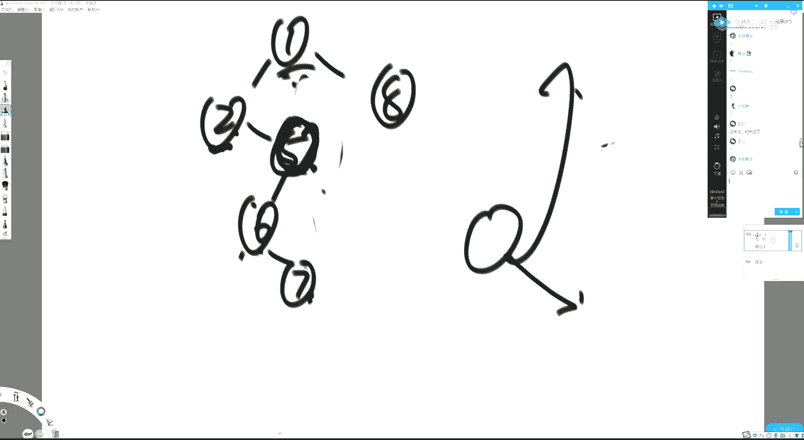

好这个东西你要想深刻理解，哎我操，等会儿我重新开一下。

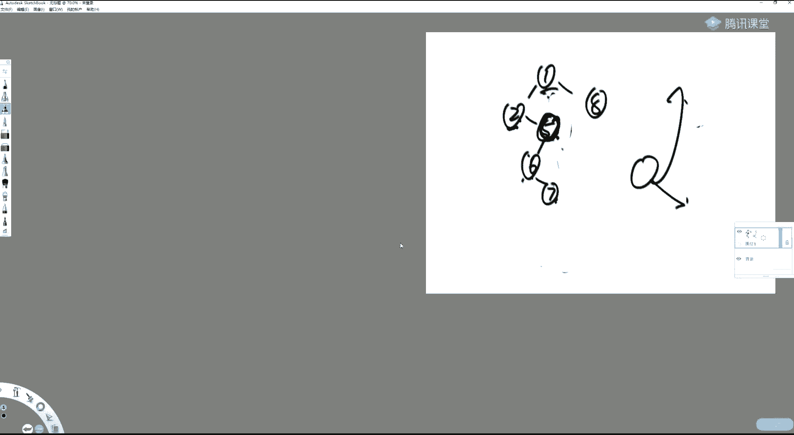

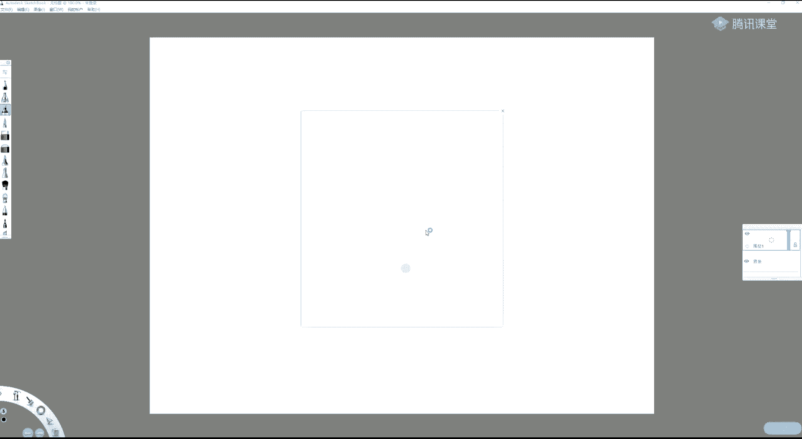

这个我为什么不提前驱节点，我就怕有些同有些同学他没上过基础课，你给他扯前驱节点，他也不会理解吧，你知道他是找前驱就行了，你哪怕没有没有上过基础班同学，你也能听懂的，你看我们。

所以你知道为了让所有人都懂自己下了多少功夫吗，是我我就给你来个找前驱节点，你知道说啥嘛对吧，这是我们都见过的猫，就是一个二叉树的遍历，如果你把打印行为放在这儿，就是先序遍历对吧。

如果你把打印行为放在这儿，就是中序遍历，如果你把打印行为放在这，就是后续便利，那你说这个递归人家凭啥这么牛逼呢，因为递归站里面给你记录了，这是你第一次来到你，我自己流程控制，我知道你跑函数跑的状态。

所以我告诉你，你是第一次，你跑完这一句之后，你来到这儿，虽然你什么也没干，但程序能告诉你是第二次回到你对吧，然后你就要去你右数遍历，然后你会来到这儿，发现结束你的整个过程才能结束，程序会告诉你。

这是第三次来到你，mars遍历就是在向递归函数致敬，但是他无论如何做不到三次检查自己，他可以做到前两次听到同学打一，懂吗好，那么我们来看一下这个morris遍历的代码。

现在还没有先序中序后序的概念理解吧，只有morris序把这个就擦掉了，来看我们的猫去，你不用看这些代码，我给你重新来一个，就叫猫is，这底下都是在用mos去实现先去中序，后续啊。

这个这个这个这个逻辑它就叫moa，什么打印行为都没有，都去掉，什么打印行为都去掉，刚才说的那整套流程就是这个扣的改几个变量名，不然你可能看不懂，看着他一改成current这个卡。

二就是我们的most right，所以我们看啊这个代码是怎么跑的，你看这里面是没有任何打印行为的，你只要能够根据我们刚才那个逻辑把它过下来，这个代码写的就那么回事儿就行了，他怎么跳。

如果你每一步都打印的话，它就是猫is序对吧，一开始我们都说了，根据我们的流程，current是来到头节点的，没错吧，most right现在还没用准备好一个变量而已。

貌似变量貌似right现在还没用准备好一个变量而已，在这个while中，你看这个while中，我们其他什么都不管，这个while，你看看在这个while里面。

你看啊这个分支会让left就是current往左移动，如果这个就没中，他一定会来到这一句往右移动，所以你不用管这个逻辑，咱现在一个形成的一个印象，就是在while里面，current要么往左。

要么往右动，它不可能在原地，那么我一旦current到空了，我就停，没空就继续主逻辑，就像我们刚才讲的一样嘛，你carry了，先来到头节点，然后每一步要么往左，要么往右动，一按空你就停，如果没空。

你就继续转，所以这个代码整个的结构啊，咱不说这一坨东西是啥，就形成一个印象，就是卡的不断，往往左或往右跳，一旦没空就出来听，打一，好那它到底是怎么动的呢，来看，我的第一步过程就是判断它有没有左数。

对不对，那你看我第一个判断就是请你告诉我有没有左数，怎么判断的，你看他让他先把自己的左孩子给貌似right，如果most right不为空，就是有左数，所以这一大坨都是有左数的代码，我们跳过。

如果卡尔特没有左数，整个这一大坨逻辑会跳过卡尔特往右移动，这是不是我们刚才说的流程，一听打一条件一没错吧，我一上来把卡特的左数给貌似right，如果它为空，就直接跳到最后一行，看着它往右移动。

又重复进这个外号了，是这意思吧，好那么他那么也就是说这个代码它很明显写的是他没有左数，设它是对，它是对的，假设它有左数呢，那就要跑中间这套代码了，这就是有左数的代码，那有左数是啥意思，有左数就意味着。

首先我左孩子它不等于空，对不对，我左孩子不等于空，就说明有左数一项，在有左数的情况下，在由在有左数的情况下，我一上来我是干嘛的，先找到他左数上的最右节点，而且应该这么说，找到，真实的最右节点对吧。

你不能因为你人为改动，它又只能走向，让你无从蹿下去了，是这意思吧，那我怎么找到我卡的左数上真实的最右呢，我们来想一下，如果你这个如果你这个节点你是压根儿是第一次来到你自己。

那么毫无疑问你左树上的最右节点，它的右指针会指向空对吧，如果你是第二次来到你自己，如第二次carry，他是第二次来到这个节点，毫无疑问他左数最后的节点是指向他的，所以你怎么找到这个真实的左数的最右节点。

它不断往右的过程中，右指针为空停，或者右指针指向当前节点停，第一个条件就如果你完全没有动过这棵树啊，从这个节点出发，往右往右往右往右到空就可以停了，但如果你动过这棵树。

你你人为地改过它左树上最右节点的指针的走向，那就你用判断，如果它的右指针指向我了就停，你你还是可以抓到非常非常好的抓到他左树上真实的最右节点，就是这个代码，你看的right的右指针不等于空。

也不等于current的时候，我才往右不断的走，他什么时候会从这个while里面出来，两个条件，有一个违反他就会出来，如果我most right等于空了，我从这里面出来合不合理合理啊。

如果你从这里你是空的出来，说明你是第一次来到当前的current，如果我呢我最右结点的右孩子是等于current的时候，我出来合不合理也合理，那只是说明你是第二次来到current，你再找他的最优。

如果这两个条件都没有违反，那你就继续往右窜好了，所以这个while就是找到卡尔的左数上真实最右的代码，看的同学打一，懂了是吧，那么你从这个while里面出来的时候，我就可以宣告，外耳中。

出来就意味着most right，一定是左数上的最右节点，他一定是，那我们说了，那你此时most right的右指针，你说有哪两种可能性呢，就两种嘛对吧，第一种可能性就是它是指向空的，第一次来到我自己。

如果中的else，虽然他写的是else else，其实你直观理解这个else应该是most right，它的指向不等于空，但是但是这个其实你也没有必要去这么理解，他不是不等于空这么简单。

它是一定等于current，懂啥意思吧，这个else它不仅仅是说我不等于空的问题，它是一定会等于current的，他是一定会等于current的，就这么两个条件来我们看，如果它是只向空的。

根据我们的说法，你人为改动它右指针的走向，让它指向当前节点，然后current往左移动，continue continue的可不是这个well，这continue的是这最大的这个while合不合理。

这不就是我右孩子最右的节点啊，右右左树上最右节点的右指针，如果指向空，改成我之后，我往左回大歪了，没错吧，如果我发现我右孩子的幼指针是指向我的，我们怎么说的，你把它恢复成指向空。

他会从这个else里面出来，他也会从这个if里面出来，它往右移动，你也可以这么写，看着他往右移动，然后去continue，你也可以这么写，但是为了省代码，我们把它去掉，因为他一步一步往外跳。

他也能碰到这行代码，让他往右，整个代码梳理完毕，我们怎么讲的流程，这个代码怎么写的，听众同学打一，好啊，这就是我们整个猫编辑的代码，那我们不妨把它打印一下，不用打印了是吧，何必呢，你知道他对就行了是吧。

这就是我们的morris去，有点复杂度，你不关心吗，你关心关心的点在于哪，老师你这是空间很少，就两个变量对吧，就两个变量，然后走完了，你利用的是底层空弦的指针来标记的是第一次回到我，这是第二次回答。

我实质就是这么回事儿对吧，我大量利用这棵树的本身自己的空闲指针来帮我做的这个空间嘛，也就是我没有单独的使用额外的空间了，我都是用他自己提供的，那你那些指针你浪费也就浪费了，对不对，还不如给我来用呢。

是不是，所以就是我利用底本底层的这个空闲指针来让我回到上级去，一回到从下往上的目的好，但是你这里面太对吧，我们每一个节点我都要去趟一下我左树上的右边界，每一个节点我都要去趟一下我左树上的右边界。

你一共有n个节点，你如果每一次都去便利，你左手上的右边界，他还是b o n吗，下面我们就来证明他还是b格温，怎么正最直观的方式给你画一棵树，看看辩论在哪些节点来估算它的规模吗，这是整棵树对吧。

后面这个花圈的，我就算画什么，来我们看一下，首先你current跳动的代价是多少，一共能跳到几个点，反正是n规模对吧，你这个一会到两次，那也就两次而已，有些节点只到一次，二本身来到节点的次数是n次啊。

b o n次，这个理解吧，卡尔的本身它来到节点的个数是b勾n次，所以下面我只要估计一件事就够了，我我现在不纠结你每一个单独一个节点，你要过几个节点，我就看看所有过程里。

所有节点去遍历所有节点的左数的右边界代价是多少，同学打一，那我们不去纠结单独一个节点的时候走了多少步，然后乘以n那个东西我们算不准，我们也不知道这个数是啥样对吧，我们也不知道我们现在算的一个东西是啥。

把所有节点遍历它们左数右边界的代价都算上，我们看要过几个节点干这件事好，那怎么算来看，我说你我问你，你第一次来到一跟第二次来到一，你过哪个节点二五十一，对不对，是你过了几次呢，你过了两次为是不是两次。

你第一次到一的时候，你要把这个11的右指针，把把这个11找到，把右指针改成指向它，第二次到这个一的时候，你要找到这个11，把他右指针改回来两次吧，你编辑到这个二的时候，你变了哪些节点。

通过它左数的右边界，19也是两次，病人到三的时候，你贪过哪些键的右边界，63也是两次，你到四的时候，你通过哪几点右边界就八自己五的时候就十几，六的时候就12，自己七的时候就14自己。

你没发现所有的右边界最多过两遍吗，所有通过右边界的总代价是多少，这一共有几个节点呀，不就b勾n规模的嘛，所以每一个节点把任何一个节点所有汤这个行为便利，这个左数右边界的行为全算上就是整个数的规模。

节点数量乘二也就了不得了啊，所以即便一个节点有趟过他左数右边界这件事，总代价也不会突破b格温打一，新新人类同学哪哪个地方没太懂，一个节点左数右边，这这件事情我已经都给你列出来了是吧，好再讲一下。

我们再讲一下啊，嗯，这咋讲，来到一的时候，第一次二五十一，你注意我来到这个二五十一，我要遍历，就是从二到11就两次，这两次是谁带给我的，是这个带给我的，我问你，你有没有单独探二的时候。

有没有单独二五的时候有没有单独二五十一的时候没有，如果你说你一个你一个右边界单独编列二，下回可能单独变成二五，下回可能单独变成二五十一，那还有可能出现一个等差数列，这个东西就很难算了，但没有啊。

来到一节点的时候，我要便利就是一整条，而且只有来到一节点的时候，这三个节点在我变绿右边界的时候会碰到我一节点不就是二五十一，三个点，过了两次吗，你发现你每一个节点，比如二也有左数。

这个四九永远是因为二遍历到的时候走的，走过的四九就没有拆分的时候，每一个节点自己左树的右边界你都画一下，你会发现都是不重的，你发现了吗，每一个节点的左数的右边界都不会跟其他节点的左数右边界重在一起。

都连共同的部分都没有，那你整个所有节点左数的右边界都是独立的，你一共几个节点呢，还没有算137 15来对吧，我就算这个画差的，他最大规模不也就是b o n吗，而我任何一个节点如果要过这个边界。

最多过两次，哎所以所有节点通过它左数右边界的代价不会突破它，听懂了吗，对吧，就是没有就是没有任何一个左树，没有任何一棵子树的左树右边界是跟另外一棵树重的对吧。

换句话说你整棵树其实是可以被所有的右边界分解掉的对吧，都是不重的，那不就那代价很低嘛啊，我们来想一下，我们现在已经搞清楚莫is序了，开始做一件事情，那怎么加工出鲜血来呢。

同学在听过基础班的已经知道了是吧，第一次来到一个节点的时候就打印他，你就是谦虚，你第二次来到一个节点的时候打印它，你就是中旭，那如果对于没有一次，只有一次到达节点，你就认为就打印。

因为他第一次跟第二次是合并的，举个例子，啥意思，还是这棵树，它moris序是什么，12251363，这是他more is序，我第一次来到一个节点，我就打印它，它就是先序遍历，这是我第一次来到一。

我打印第一次来到二，我打印，这是我第一次来到四，我打印他也只能到达自己一次，对于这种节点，你说我们是可以去判断的，怎么判断他没有左数不就知道了吗，一个节点如果没有左数，你死混就直接打印它就行了。

你根本就不用去问，那第一次还是第二，第二次对吧，这个二我们能知道他他会在第二次回到自己的时候，我们是能知道的，不打印，第一四次来到五打印，第二次来到一不打印，第一次来到三打印，第一次来到六打印。

第二次回到三不打印，第一次来到七打印，这是啥，这个顺序它就是先去便利啊，打一，哦，那中序呢一个道理，就能回到自己两次的节点，我们就让他第二次手打印，对能来到自己一次的节点，直接打印。

怎么这个一我们能不能知道他回到自己两次，能知道为啥，因为他有左数，也有左数，而且第一次我能知道不打印这个四没有左数，他只能回到自己一次，直接打二，是第二次回到自己的时候，我们能知道打印五只有一次一。

第二次回到自己，所以打印三他能回到自己两次，所以不打印六只有一次三，第二次回来的时候打印七打，因为只有一次，这个顺序45425137不是中序吗，啊，这个时候我们要想一下了。

你还记得我在基础班里给你费了将近十分钟，给你讲递归怎么实现二叉树遍历，当时有忍不了了，说这他妈克胎他妈水了，你现在再想想你那课有没有意义啊，好好听，我跟你讲，我跟你讲的没有废话。

这么多年来我才懒得说废话呢是吧好，我们先看代码，然后再搞后续后续有点复杂的，morris in，还是改变量名，它是current，most right，啊啊啊，不好意思，他是most right。

是看着他，中序遍那时候咋说的，一个节点一个节点，如果，没有左数，直接打印该怎么移动，怎么移动，它往哪移动呢，如果一个节点它没如果如果当前看着节点没有左数，它会往右移动对吧，打印完之后往右移动。

如果开着节点，它有左数，说第一次来到自己的时候是改完指针之后往左移动，第二这次轮到自己的时候是改完指针改成空之后，就他右孩子，他左树上最右节点的右孩子改成空之后往右移动的，这个时候我也打印。

总结为只要一个节点要往右移动了，你就打印就自然规避了，能回到自己一次节点的时候不打印嘛对吧，他规避了这个时候打印的时机嘛，所以我们二次病例怎么改的，我什么都不用管，只要一个节点要往右移动了，我就打印。

他是说不打印，能回到自己两次的节点会continue不打印，刚才打一，便利对吧，如果你压根儿如果你压根儿就没有左树，整个这一大坨衣服跳过，你会打印当前节点并往右，你说合不合理，将合理，对不对。

如果你有左数，完了之后，中的是第一次来到你的时候，你continue是不是没有碰到这行，打印逻辑也合理，对不对，只有是你第二次来到自己的时候，你改了指针之后往外跳，再往外跳，你在一往右移动之前打印才对。

所以就加这么一行打印它就是中序遍历，打一没能打二，你打过同学就算了，好吧嗯，我们再看先序遍历怎么改，他改动了一点点，一开始是没有这个的啊，是没有这个else的，把这个去掉的，没有这行打印的。

除此之外就是源代码，好我们来看一下，哎呀不想改，就这样吧啊好吧，如果就是most right，如果我没有左数，我这个衣服会跳过没有左输的节点，我第一次跟第二次是不分家的，我应该遇到他就打印。

所以你怎么写，蓝色代码既然是有左数的时候。

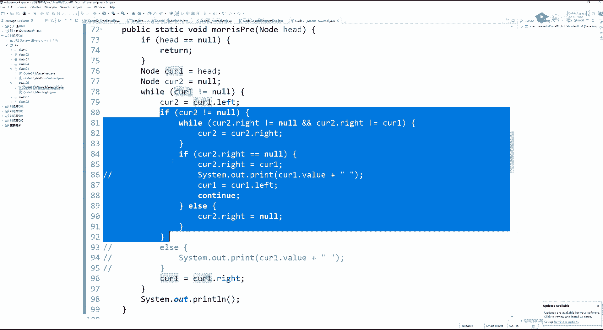

你就给它加一个，没有左数的时候就打印完了吗，对不对，看如果有左数，你就给我跑蓝色代码的东西啊，之后你不会再进到这个里面来，只会卡着它往右移动，是这意思吧，如果没有左数五就会中这个else，然后往右移动。

所以在加了个else没毛病，这个else就只是为了给能够只能够到达自己一次的节点，它会跑这行扣的在哪，对于能回到自己两次的节点，这是第一次回到自己的时候，我再把这个打印行为加在这一行。

不就代表的是能回到自己两次的节点，第一次到的时候打印不能够到达自己两次的节点，死活就直接打印就行了，看同学打一，这就是先去便利，本来搞后续了是吧，下面就剩后续了，这是啥呀，好难弄。

对后续感觉怎么都弄不出来啊，我告诉你这么弄，把毛意思序搞清楚，去注意打印时机，放在能回到自己两次，第二次回到自己的时候，就这么三个打印时机，但是不是打他自己打，他左树的右边界逆序打印啥意思。

我第二次回到二的时候，左数的右边界是四，逆序也是四，我第二次回到一的时候，左数的右边界是二五，请你逆序打印，当我第二次回到三的时候，我左数右边界是六，请你逆序打印，这个过程完成之后。

单独打印一下整棵树的右边界，逆序137，打印逆序731，后续便利，听到他在打一，得得得自己再弄一下，我再给你写一个奇怪怪的书吧，有有有没有同学打二打二的，没听懂的同学就打二嘛，大方一点是吧，再来一下啊。

今天我们说你是不是可以便利遇到每一个节点，你也知道这个节点是来一次还是来两次，还是只有122次是合并的对吧，你是第一次来到你，还是第二次来到你，还是你只会来到自己一次，我们都知道。

势必能够找到现在这个底下这个序列中画三角的这三个时刻，这个这个没有问题吧，这三个时刻我们能找到的同学能懂的，打个一，人家能找到这样的时刻，对不对，在找到这样的时刻的时候，我们打印什么。

不是打印它这个节点自身，打印它左竖的右边界，而且是逆序的形式，你当我们来到二的时候，我们就找到它左数的右边界是四，就逆序打印它只有自己，当第二次来到一的时候，我们就逆序打印它左侧的右边界就是五二。

来到三的时候就打印它左树的右边界就只有六自己，但是这样的一种方式呢，我们会错过整棵树的右边界啊，最后731要自己单独弄一下，为什么想到的证明还记得吗啊，你咋想到的呢，你说我咋想到的，我刚跟你说过。

整棵左树啊，只用一只用子书的右边界就可以把整棵树分解掉，我刚我跟你讲过这个事儿，你来到他的时候就逆序打印你的右边界，来到他的时候就逆序打印你的右边界，你每个都这么干，不就是后续吗，刚讲过证明的时候。

棵树可以被子树的右边界分解掉啊，就到一个节点的时候，我逆序打印它，左右边界就依次出来了嘛，但是最后一个整棵树的右边界是没人搞的，所以我要单独搞一下才打一，大家可能还没有注意一个问题。

老师你说的流程我懂了，但是，怎么逆序打印我左树的右边界，你现在给我一颗子树，有东西我不知道是啥，你现在给我一颗子树，这玩意是a，它底下是b，它底下是c，它底下是d，然后他就没了，假设让我逆序打印。

我得想个办法，按照dcba的顺序打印，怎么弄，我放到站里去吗，你千万不能放到站里去，为什么我我们就要求莫尔斯便利，额外空间复杂度比个o一能用战，你怎么逆序打印你某一棵树的右边界呢，继续想一下。

对反转链表我们两分钟之后继续，我觉得最疯狂的就是最后一步翻转，代表了，啥叫你举个例子，这是current诶，你现在已经两次了啊，已经来到你两次了，你左侧的右边界，这是a他左边可能有东西，我不管他。

他右边指向的是个b节点，b节点，它左边可能有东西，我不管它那右边指向的是c这个节点，c这个阶右边可能有东西，我不管，但它这个节点肯定是指向d节点，d节点它就只回current了，是这种情况吧对吧。

我第第二次来到ka的时候，必然是这种样子，当然你也可以假设更多的边界节点，我这里就假设四个好吧，把他调过来，d的右指针它肯定是指向空的，他左边可能还有是啥，我不管干嘛，你用你假设a的左孩子，b的左孩子。

c的左链条，d的左链条，这些左链条你都不管他是不是一个单链表啊，电表的话，你让a的右指针指向一个空，让b的右指针指向a，让c的右指针指向b，让d的右指针指向c，这个你会不会调，不就单链表的反转吗。

完之后你就可以从d走到c，从c走到b，从c走到从b走到a，从a走到空了，你就打印了，听完之后你得把你再把数调回来搞定，听懂他说打一，复杂度会不会因此增加，当然不会，你原来是左树的右边界，过两次。

现在变成了过四次，都不都是常数次嘛，所以时间复杂度继续闭个听我同学打一，过两次，过四次，只要是有限几次不都是b格温吗，对不对，所以后续代码怎么写的没那么难。

后续整个行为其实跟morris遍历没有什么区别，改个名，它叫current，它叫哎呀，操，整个代码其实没有什么区别。

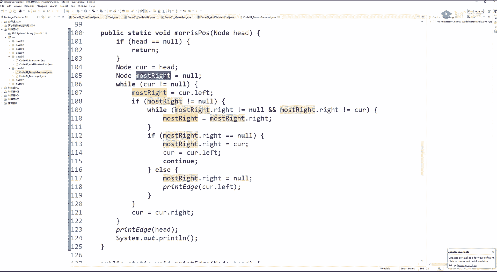

就在这儿，还是这个well，只只是把这个操作行为放在哪一行了。

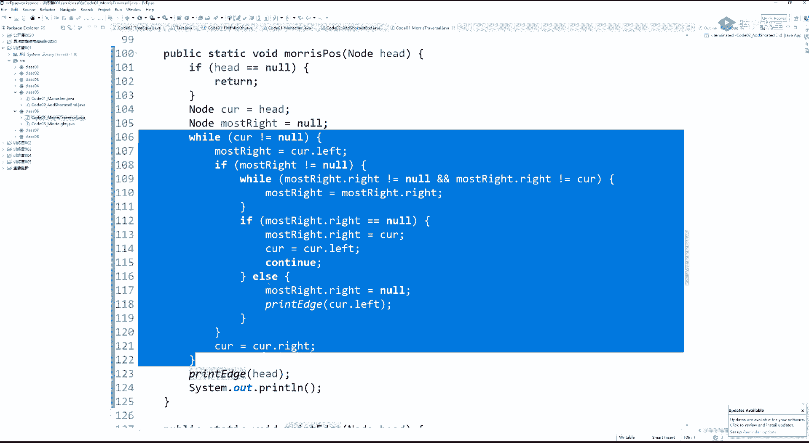

这一行能够回到自己两次，且真的第二次回到自己的时候，你逆序打印我整左数的右边界，你就把它当做是一个黑盒，打印某棵树的右边界，逆序的形式逆序打印某棵树的右边界，你左数传进去，他就打印了。

打印完之后你再给它调回来，这都是黑盒，你跟while就加这么一句，但你不要忘了在while结束的时候，整一棵树的右边界，你再来这么一下，就是后续接下来不就是怎么实现怎么逆序打印一棵树的右边界吗，21下。

每一步打印在reverse回来没了，要打一，你说这有什么难的呢，对吧，不是线段数，这叫线索二叉树，理解吧，什么叫线索二叉树，就是利用这种类似于摩尔便利的形式，我下去一节点，利用我的空闲指针能串上去。

这叫线索二叉树，这不是线段数，完全两个概念，好啥用有啥用，我现在让你判断，你告诉我这棵树是不是搜索二叉树，我问你，你怎么做，但是你要写一个递归，你去判断你或者用那个二叉树的递归套路。

你去判断24便利还需要吗，我给你随便改来，就这个，改一把我就叫我判断is就是布尔类型的一个返回值，is bs对吧，binary search tree是吧，你整棵树是不是搜索二叉树。

搜索大树不懂同学去看基础班吧是吧，这个讲没法讲是吧，这都不懂没法讲，你问一下吧，大家都知道啥叫搜索二叉树吧，知道同学点一，哎任何一个节点左数的值都比它小，右数值都比他大对吧。

常来讲判断搜索二叉树就是你中序遍历一下，如果你发现你的值一直在递增，是搜索二叉树，是这意思吧，啊听懂他在打一便利一下，如果你发现你中序遍历的序列中直一直在递增，你就搜索二叉树，实现这个就行了。

那我怎么实现来看啊，树为空，我就认为它是搜索二叉树，接下来这样弄啊，返回的过程中校验他没有违规的，我也认为他是搜索二叉树判断出违规来，注意看，设计一个之前的值，等于系统最小，这个这个也不太保险。

空白表示吧，之前的值认为是空好没有，可以吧，那我就认为它是个空好，中序遍，原来是中序变的代码，在这个地方是打印时机啊，你把打印时机变成比对时机不就完了吗，如果，它不等于空。

而且你发现pre的值大于等于当前节点的值的，啊你上一个便利的值如果是空，你不用判断你另一个值，如果变量的值不是空，这个只有大于等于你，你肯定不是搜索二叉树，因为我们说在中序遍历中，你一定要递增才行好。

如果这个没有违规，你把普瑞设成当前的value，就完了嘛对吧，这你就判断了整个搜索二叉树，而且额外空间复杂度b o一的面试场上你就吹去吧，听我同学打一，讲一下这种题目都很常考啊，吹这个别人没吹。

多提身价啊对吧，当然你也别说唉老师这题我会莫尔斯便利来搞啊，咱说唉咱时间不够了，你赶紧写下个题，老师不贼好是吧，你别是吧，那呵呵呵，你不要这样来好吧，嗯他他已经明显感觉到不想听了，那算了是吧。

你做下个题，如果他很有兴趣，你吹完之后，那身价杠杠的是吧，嗯意思吧，嗯好好，我们再做一个题，你讲完之后，我们讲一下什么题可以用编译，什么题，只能用二叉树的递归套路，啥样的呢，说起来很简单，一棵树。

一棵二叉树，知道上面的最小高度，最小高度只有我到了夜节点，我才有一个高度啊，在所有夜节点中，哪一个是距离头部最短的，把那个距离返回，特殊最小高度就是三啊，这个我知道这一个节点最高高度不是一吗，不好意思。

他不是叶节点，你不能以他收尾，夜节点才是产生高度的时候，以这这个是夜节点，所以它高度是三，这个是夜节点，它高度是五，这个是夜间点，它高度也是五，这个夜间点高度更大，返回按克数的最小高度，听懂这个题。

打个一啊嗯，那这个你就可以去搞最大高度的，同理的好吧，二叉树的递归套路怎么做，很简单，写一下，做题，来看这二叉树的递归套路，它只返回一个值啊，先说这个啥意思，以节点为头的时候，我的最小高度是。

如果我左树不为空，我求我左数的最小高度再加个一，右数不为空，我求我右数的最小高度，再加个一，两个比对两个两个两个相比谁更小，谁就是我的最小高度，如果我压根就没有左数，不好意思。

那我只能拿我右数的最小高度再加个一，没有右数，能拿我左数的最小高度再加个一，如果左右两数都没有，我的最小高度，就是一听懂的同学打一，这个题就就你看如果我左数也为空，我右数也为空。

我就一潜台词是这个x一定不为空，放心x一定不能让你为空，一定不会让你为空的，如果左我数为空，就数也为空，返回一，如果左数不等于空去求一个我左数的最小高度，如果右不等于空去求一个我右数的最小高度。

怎么加工出来，左数最小高度跟右手最小高度叫最小的那个，再加一好，毫无疑问有空间，额外空间很高对吧，高度就是你的额外空间是对的，但是太简单啊是吧，所以怎么根据摩尔便利来改写。

我们想通过morris遍历来改写它的难度是什么呢，难度就是我们整个过程中只能用有限几个变量，是意思吧，我们在整个过程中用有限的变量，有限几个，我的第一个问题是你current来到任何一个位置的时候。

你能不能知道他所在的高度，来到任何一个节点的时候，你如何知道他所在的高度是多少啊，问题第二个问题是，如果我能够知道current，此时他确实是叶节点，记录一下它的高度。

我用一个全局最小值mean来抓一下他，我我说这个这个如果它是业界点，我就把它的高度跟全局最小值比一下，如果它更低，就刷新这个全局最小值，如能够做到这两个机制就能改出来，听懂同学打一。

啊啊今天我要知道我当我来到任何一个current的时候，我能不能知道它的高度是什么，这第一个问题，第二就我能不能用一种机制知道current是否真实的，它是夜节点，如果都能知道这两件事儿。

那么我就在它叶节点的时候把它的高度去更新一个变量，那个变量就叫mean，他它更小了，我就更新它，它没有变更小，我就不更新它，整个过程跑完之后，我就得到了这个最小高度了对吧，我们先看第一个机制。

你能不能做到可以，可以是我现在的current高度，一开始是head对吧，他一定在第一层对吧，他一定在第一层，没错啊，所以坎儿呢一开始如果有一个高度的话，看着大等于had的时候。

这个这个这个这个它所在的它或者说它的层数，我在的这个level数，它是一开始有个默认值为一的，这个是肯定对的好，我们看你curren他无所述，下一步的current是往右移的。

往右移之前把这个level加加，一定去第二层，那我们如果我们发现卡尔的五左数看的我往右一式去更新，看着它它的高度也可以更新，对我当我下一回遇到的他往右移的那个看着他的时候，他的level它就是二。

它不可能是别的，所以我们可以由前一个current，它所在的结构如尤其如果他中的是第一种结构关系的话，可以直接由level加加就得到下一步看着它的高度，听我同学打一，啊，你们看第二种情况。

如果current啊有所述，他们的有所述，我们能区分出他到底是第一次来到自己还是第二次来到自己，他是第一次来到自己，我问你，他是怎么来的，为什么会第一次来到自己，这不是从底下这个层蹿上来的。

我现在讨论的是car呢，如果有左数，我永远是用下一步怎么做对吧，如果他有左数，说明他来到他自己一次，接下来这个current他是肯定会往左走，对不对，往左走，那level加加有没有正确，正不正确。

想怎么说呢，啊就这样啊，讲有点飘了啊，这样的啊，就是你，就这么一件事儿啊，就是你出初始的时候，你出的时候current它是它是一嘛对吧，我们看我们是不是永远能够推出便利到的下一个节点，它的高度是什么啊。

就想就想说这个问题，我们能不能又便利出下一个阶段，它的高度是什么，就是如果嗯如果你发现你自己无所树，你下一步的高度你是知道的，如果你发现你有左数，但是你是第一次来到你自己。

那你那你毫无疑问你是从你父节点或者往左走或者往右走到你的，确定的是第二种小情况，就如果你发现你curren他左既有左数，又是第二次到达你，你，那么便利的上一个节点是谁呢，右书上的是你左树上的最右节点。

高度是什么，这个节点减去它左树上最右节点的高度，就更新出你的了，直接举例子吧，太麻烦，来，我一开始就是呃画箭头的，就来到了点，他唯一对吧，往左走啊，我我我干了一件啥事，一指向了a，往左走。

我知道我即将往左走，我知道，往左走了，我来到b这个点，它高度是二，能更新出来，更新出来，你可以利用这样来判断一个变异的节点，它的左孩子如等于，此时你辨认到的卡润，它高度就是上面的高度加加得到。

听说同学打一我上一个便利到节点啊，我上一个变量就是pray，是我pray，其实就是a我上一个变量节点，如果我发现我是他的左孩子，我高度就是上面的高度加加理解吧，好我们继续你你做了什么。

你把d的右指针指向了它，你就来到了d，是这个逻辑，你发现上一个变量的节点是b，我是他的左孩子，我可以把我的高度顺利更新成三，接下来你这个d没有左数了，你是通过右数回到的b。

不能知道这个b是第二次回到自己的，你能知道一问上一个便利到的节点是谁，是d都已经到三了，我怎么办，我数一下我左树上最右节点有几个点减掉，我就从三能更新到二，都不回去，接下来我必往右移动，来到一。

你是不能这样判断的，你是不能p。right，如果与你当前节点，你不能用这个来判断为啥跟我们刚才，那你看你刚才你来到b的时候，你这么判断就瞎了，对不对，我这个b确实上一个阶段的幼孩子，他就是我呀。

那是窜上来的理解吧，所以你怎么办，你就看e如果有左数右节点，它指不指向你，如你这个右左孩子最右的节点是指向你的，你就去减高度，否你就加高度，我上一个节点是二，我现在一定是三，得到高度是三。

然后e就穿回a了，a他不这个条件它不成立，它没法加加二，拿什么判断，不能用，它用完了，因为我上一个辩论节点是e，我确实是他的幼孩子，难道我的高度改成四吗，不行怎么判断，我就看看，就我左树上最右节点。

这个右指针是不是指向我的，如果我知道它是指向我的，我就知道他是我上一个节点是通过蹿上来的方式到我的，我怎么得到我的高度，我数一下我左数右边界有几个节点，我给它减掉3-2，回到一听不懂同学打一。

哪一步我怎么判断，我就看看他是不是从上上一回蹿到我这上面来的，如果他是我左树上，如果我发现我左树上最右节点的右指针是指向我的，我就一定要跟把上一个上一个高度减掉一个值。

如果我发发现我左树上最右节点指针不是指向我的，哪怕或者说我压根就没有左数，我就知道我的高度加加一定对听再打一就麻烦在我们这个结构关系，它变了，我们人为改动了它的指针，所以他麻烦能够得到这个高度。

但是还是是可以实现的，懂这意思吧，是啊，那我们现在就搞搞定了，第一个机制就是我们在每一步的时候，我们每一步的时候是可以知道自己所在哪一层的啊，一直，能不能知道current它到底真实情况下是不是夜节点。

为什么真的到你到一个叶节点的时候判断不出来的，你为什么判断不出来，因为他的右指针一定是改过的，来的时候把五的已经改过了，二来的时候四已经改过了，等你真的到四的时候，你不知道他是不是真实的业绩，点一。

current到哪个点到不了这个东西是不是夜节点，那我们怎么把所有叶节点拿到呢，叶节点都会在能回到自己两次的节点的时候，重新发现一遍，啥意思啊，我让五指向他，二，四指向他，来到四的时候，我什么也不管。

来到四的时候，我什么也不管，错过了没错，从四回到二的时候，我能够知道这个二，我底层上来的，我给他恢复完了之后，我看看我左树的右孩子是不是业界点，也就是说你是来到二的时候去抓四的高度更新全局命的。

到一的时候把恢复过来之后去抓，看看五是不是叶节点，去抓五的高度去更新命的美节点都在你两次那个节点的时候，就是他上级某个节点的时候再重新发现一遍啊，一，不要忘了整棵树的右。

整棵树最右的节点是没有人去发现的，所以你在整个流程跑完之后，你要单独自己去找他啊，跳我再给你换一个，换一个比较奇怪的树，让你感受一下，一指完，指来到三三，这么指来到十十，这么指来了10，一回到十。

回到十的时候啊，过来检查它是不是叶节点，并且把它高度重新算一遍，更，就往右走，来到12，回到三的时候恢复过来，重新找到这个12，看它是不是叶节点，如果是把它的高度重新算出来，这里面是不用不用更新。

因为它跟11在同一层上对吧，然后三往上跑，来到一，来到一的时候，把这个阶回复回来，看看它是不是夜节点，它不是，那就不参与，四直接走，来到五九，这么指，八这么指同再回到六恢复过来的时候。

重新计算这个八的高度更新密啊，九九回到五，回到五的时候，7。9的高度更新灭，整个过程来到七，来到七，再往右结束了，整个过程没有七的参与，所以整个过程完成之后，单独看看整棵树的右节点是不是叶节点。

如果是更新密，这里你特殊的就是这个三，我再把它恢复过来之后，它不是业界点，要不参与更新，听打一，代码说起来很花里胡哨，其实没有那么难，还是感冒一次便利，哦，首先你看level怎么更新。

打一次的节点level直接加加，啊，这个我看一下啊，有对数器吧啊对有对数器，所以这个代码肯定是对的，哦嘶，一次节点level加加，如果是第一次到达自己level也加加，如果是达到自己。

那么毫无疑问上一次变调了节点，应该是减掉，我接下来就是，我们现在这个counter level还没更新，我能够到达了自己两次，我们是一定会把它这个most right右指针改空的，在改蓝空之前。

我看如果他左孩子也是空，表示我重新发现了那个节点，事业节点，我把先把先把它抓出来，在最小值更新完了之后再更新成我自己正确，再更新出我自己正确的level，就是，如果你如果你没有左数。

你就直接下一步来我加加就行了，如果你一次到达一个节点，你下面也会往左穿，你也会往下走，所以你level加就行了，如果到达了自己两次，如果我到达了自己两次，说明我一定是从底层那个节点窜上来的啊。

把捕获它层数去更新最小高度，这个时机和自己更新出正确level的时机放在了一起，没错吧，啊我如果发现我们我我左树上最右节点的左孩子是空在这里面，我要把它右孩子也调空的，说明他一定是业界点。

所以这个时候我就去记录，的那个当时没有发现，现在被我重新发现的那个叶节点的高度记录成全局最小值来，然后我成功地更新出我自己的高度，周而复始，整个代码跑完之后，整棵树最右的节点是没有人管的。

所以你要单独跑到整棵树最右的节点，如果它是叶节点，不要忘了它跟总的最小值，再更新一下，看看同学打，一啊，过粒子同学打个二，需要过粒子同学打个二没关系，那我就过一下啊，我就过一下啊啊最后这点不用管吧。

我问啊，最后我找到整棵树的右节点，如果这你可以看不断往右穿，不断往右穿，不断往右窜，看到了吗，发现从一开始不断往右窜，不断往右窜，往右窜的过程中，往右窜的过程中找到最优的节点。

如果这个最右节点它碰巧它又是夜节点，再去参与更新一下，最后这点不用管吧，最后这看懂同学打个一哦，不用是吧，那就是整，那就这个过程呗，好那就尽量给你搞一点多的例子好吧，弄多一点例子。

咱也别完全是完全二叉树是吧，或者是马二叉树，这没进，为了跟数值区分开来，我们把a b c d来表示这个数好吧，质数里面有的只有左数，有的只有右数，有的左右两竖都有，有的是夜节点，没问题吧。

好我们看这个代码会怎么跑，几个变量，首先当前节点所在的层数，你那么根据我们的代码，它是零，没问题吧，零全局最小值我一开始让它等于一个巨大的值，500吧，唉500就够了，只要在更新的时候。

我就要去想办法去更新这个最小值是吧，这它是我全局的一个值，这是一个整形，没错吧，好嗯嗯，到了current跟most right，我们都知道怎么怎么弄来看啊，这个函数一进来，他中的是哪个分支呢。

有左数的，所以它是直接进到这个while里面来了解这，你来了之后，他会去找自己左树的右边界，会找到这个e，这是我的，这是我，我用r表示来表示right，好吧，我用当前节点表示c啊。

当然他那是c找到的最左数，最右节点是r错了，你看我找到的过程中，其实我去统计了左树的高度，这不是高度，是我左，是我左数右边界的几个节点，他左他右边是不是不等于空，是的，加加变成二，一开始加加变成二。

来到e e在while里面就不用再继续跑了，e在这里面就没有继续跑了对吧，所以来到这个e的时候，我这个我这个变量就变成什么呢，left就左树上右边界的这样一个点的个数，左树上后边界的点的个数啊。

改个名吧，免得你歧义好吧，我们叫右边界，好吧右边记size可以吧啊那么左左数上右边界点的个数变成了二，还有没有要求呢，其实没必要，为什么，因为我e的右指针是指向空的，我e的右指针是指向空的。

所以但我明显地知道我下一个节点是往下走的对吧，我明显的知道我下一个节点是往下走的，所以我当前层加加，加加其实是更新才只是更新出了我自己的高度，这个一是什么，这是我的高度啊，就是这个卡尔呢所在的高度。

这才能更新出来，好下一层的它是我自己这一层的好吧，然后我们都知道貌似右指针指向当前的current，这都没有变化，然后current往左移动好，那就改嘛，然后car t往左移动，他就来到了b。

待定的一个东西了，那我们来看你，你依然是有左数的，你依然是有左数的，你有左数的情况下，补一下你有几个点到d就停了，r就是所以r r直接的右边界就是空指向空。

所以这个这个well其实这个well其实没有进去没有进去，没有里面加加也没有往右移动就直接出来了，它还是右边界数量是一个节点，一个节点是吧，右边顺序是这节点求得有用也没有用啊，也没有用。

因为我右指针是指向空的，我可以更新出我自己的level来了，就是加加啊，就是加加，所以加加变成啥，我现在两个二层上对吧，我现在二层上，然后我们根据我们的说法，他他的这个右右右指针是指向我的，我往左移动。

就是这样，那就这样就继续嘛，他往左移动，它就会来到d这个位置，来到d这个位置就变成啥了，来到d这个位置，它就是左树为空的了。

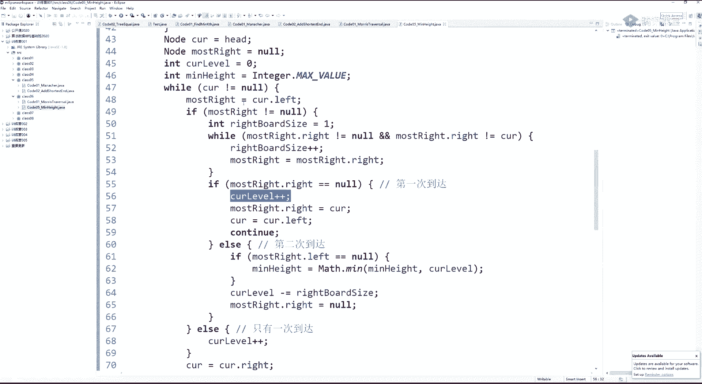

这一大坨衣服跳过，但他会中这个else，直接更新了我的高度加加。

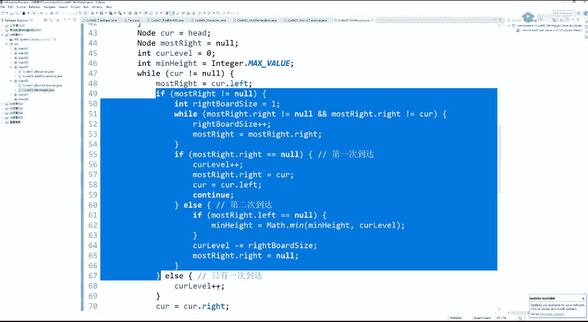

那合理啊，我这个d d确实我在第三层啊。

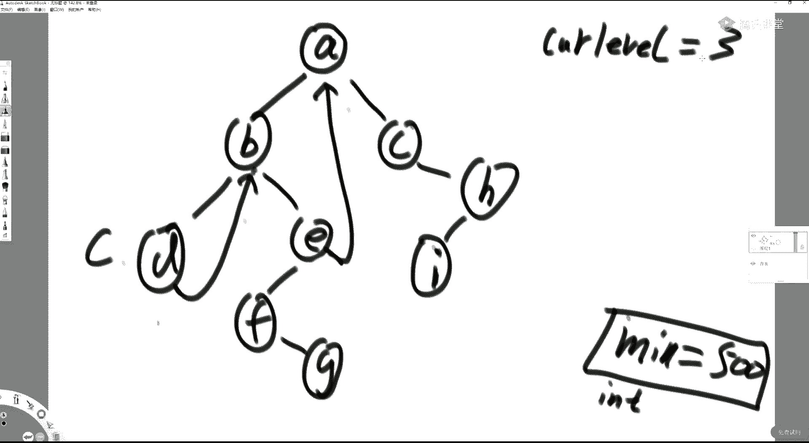

我这个d我这个d我确实在第三层啊。

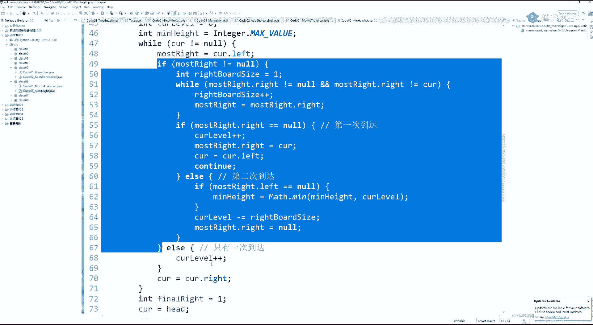

所以我加加完了之后就往右移动了，往右移动他就回到了b，到了b你可别忘了这个三是在是哪个节点的层数，你上一个边界的节点是你上一个变化的节点，我现在回到b了，好那么可能大家最关心的就来了。

毙了之后我有左数啊，我有左数，我左数就是d，我这个右边左输右边界先有一个节点，它依然是进不到这个while里面去，就停了，为什么，因为这个b这个b它的右指针是指向我的，他进不去。

你看因为这个我的我我我我整个左数最右节点的右指针它是指向我的，所以这个well它进不去，他就跳出来看了，那么一来的话，我其实我我此时我左数一右边界有几个点，一个是不是啊。

这就是我右边界的这个数量就一个就跳出来了，跳出来我看你看我是第几次到达我的第二次，因为，我我左数右边界的最后最右节点的右指针不是空对吧，我就走到这个else里面来了，他确实就像我，他没有指向空。

所以我知道我是第二次到达我自己来看，我在第二次到达我自己的时候，我先看看我书上最右极的左孩子是不是空，树上最右键的左孩子是空，说明什么，说明在我把他右指针恢复完成之后，他是个夜，它是个叶节点。

这时候干嘛，g我发现了这个夜，我看看他跟全局收集到的高度去pk一下，能更新更新能更新，我是500，你找到这个d它是夜节点，而且它高度是三，在这呢，所以就更新，这变成三，变成三之后，数出它的节点。

右边界节点数是一个了，你怎么更清楚你的呢，人家才是三，你又数出这有一个点，你减掉这个一，你不就是你的吗，所以就看到这一句，我当前的怎么怎么决定，当前怎么决定。

就是我现在的值减去我左数右边界点的个数就更新，我就层数了，然后不要忘了把他的右指针给恢复成空，这是肯定的，周而复始，没懂同学继续打二，我再给你过好吧，这里面每一句代码都是必要的，因为你找到的那个时机。

它未必是叶节点，比如说这个比如说当某这个时机我们来到a的时候，我们会发现它左数最右节点的右指针指向我，但是他的左孩子是不是空的，虽然我要把它右指针恢复成空的状态，但是它不能够参与我的更新。

因为他他不是e理解吧，那你看这棵树的最后一个最后时候是干啥，是单独找到整棵树的右节点h但是它事业也不要去更新这个密，如果他没有这个i那你就把它的高度求一下。

去更新这个面理解的意思吧啊所以这里面的人后招很多，就是你发现了你左树上最那个时机的时候，你还得判断你左树上最右节点，在你恢复完它右指针之后，它到底是不是e主要是这个点叫难嘛，是吧啊。

也就是说啊这种这种难题呢，实际上你在平时的练其中不太容易遇到，但是如果你面试中遇到了，他就很难给你涨身价好吧，这也是啊也是很不错的一个一个便利嘛，它确实省空间，它不需要什么额外空间。

它就有限几个变量是吧，好我们来讲一下它的总结，总结是什么呢，什么时候可以，什么时候你知道这个题的最优解是猫便利，什么时候可能不是，当你的算法求解过程，你接点x的时候，你去你左数给你信息。

需要你右数给你信息，你要做整合，如果你的解题方法定成这个流程，你就变成这个流程，你没有办法用莫尔斯便利一明显，你既需要你左数给你个答案，又需要又输给你个答案，一定不是bo一的。

你的空间一定不是b o e的，我左述这个答案，我得缓着我去右数收答案之后，收上来我才能用，都用二叉树的递归套路，但是如果你的求解流程，你发现我并不需要另有一，比如说我并不需要右侧数的答案。

我这个答案是递推的，我左数收完了答案之后，我用完它，我再也不需要了啊，就莫瑞斯便利改，比如说我们刚才那个搜索查数问题，如果你的流程我就想定成，我把我所述的最大值和我右数的最小值拿出来。

看看我他自己是不是做到二数，他是不是受到二数，我自己看看能不能连起来，你如果流程从定程，我就是需要很强的左右两侧收信息，这个流程你就用不了摩尔斯便利，但如果我们换一种思路说。

x只要在中序遍历的一个序列中，我保证它一直递增，你看这就属于我用完我所述的信息了，我并不需要往下，我并不需要继续了，我必须要留着它了，或者我只我用单独的一个变量，可以把这种递推关系给成给那个继承下去。

你就可以用吗，四便利，听我同学打一你，你定你把流程定成什么样有关，能定成什么样，有关有些题目是你必须收集完全信息才能解的，这种题目你就用不了莫斯便利，有些不是你通过你往下分析。

你发现你这个你这个信息是可以往下推的，并不需要我所有信息都留着，那你就那你就可以用莫尔斯便利很很空的一句话，但是啊就是说当你想出比较容易理解的解之后，你动一个心眼，你就拿莫瑞斯便利的流程去套这道题。

你看看你的信息能不能传递，如果你能像莫尔斯便利这样传递，你就能改，如果你觉得传递不了，它就改不了，听懂他打，而且在网上帖子里面，他很难有这些全部的证明啊，各方面的啊，有问题啊，这些了啊。

莫瑞斯病例有别的题目再给你讲，他其实其实讲一个也就够了是吧，这也差不多了啊是吧，因为它实际让你理解完这个便利之后，他真的是不难的，加工信息这件事吗，你把几个过程在代码里面都给你分的那么好是吧。

你看哪个阶段干什么事了就完了，是不是啊，会不会长相会不会很大，是有点大，但是你要知道大家说一个啊，我们调一个函数，它它它其实是比较常数项比较大的啊，函数要运行它的环境，在系统里面准备好它。

它常数是比较大的，比我no no等于note点，right，要要卖，你感觉有那么大常数，你怎么知道你调递归的常数不大啊，常数很大的啊，听我同学打一，嗯因为你你准备递归函数，那个递归函数跑的时候。

每个函数要组织起来，要只要给它准备运行环境，它它其实是很大的，所以你这样看起来我我就每一次接连点right。left真的是不大的，好吧，你找右数的最左有啊，那肯定有啊。

你这我们刚才讲了前其实类似于前驱节点，你可以用后期节点来搞也一样是吧，嗯我你要是聊算法，这个常数级别真的真的可以是可以聊很久啊，还有嗯，为什么呢，就是，嗯哦对啊，关于常数这个事得说一下。

就是你的数据它明显给你范围了，比如二位，我给你这里面的这个数都不会超过15个零，对于你对于这个题，你可能需要一张哈希表，注意啊，范围的话，你一定要拿数组结构来替代哈，希表啥。

你每个值你想知道它出现跟没出现，你一共就这么大，你这是一个help数组，哈希表零下标就代表零这个值出现在哪，一下标就代表一这个值出现在哪，你就把它认为是哈希表，你数据范围的值。

请你用这个数组结构来做哈希表，你别傻乎乎写一个哈希map，为什么哈希map里面我们在训练营第二节课会给你讲哈希map的实现，他的它的那个常数项是很大的，哈希map拿到任何一个值要做离散化。

掉一个离散化函数，这个函数它常数项是很高的，它绝对没有，因为他要不数组自己去贴哈希表要快听，我同学打一，一，这也是这也是比赛的同学经常用到的技巧，他你你会看到他很少去用哈哈希set这样的纯粹的结构。

它都是拿自己的数组去t的，你说你这个数组，你这里面它就是一个字符串，那你就用哈希表吧，那没办法，你不知道这个字符串它能它它怎么我们要用数组来代替，对不对啊，这个时候你就用哈希表，放心用是吧。

有些我说这个是什么意思，一般来讲刷题的时候不会因为你常数项过大就让你不过，代码不会因你常数项过大就让你卡住，它往往就是你时间复杂度没达标，它会设计良好的测试，用力的大小。

让你时间复杂度不达标的时候才不过你时间复杂度是要达标，哪怕你常数项大一点，它也会让你过，但是总有一些一些公司他在准备这个数据量的时候，他没准备好，这就要求你平时写的时候，你看你发现它是一个整数。

而且它的数据范围不是很大，你就直接用你我们数组结构做出来的来替代哈希表的功能，因为常数项呢这个问题在哈希表里真的是挺大的，虽然你可以认为增删改查都是b o1 ，但它常数项其实挺大的，理解吧啊，运气唉呀。

这同学你看哈训练你不觉得少了一节课代码吗，第四节课代码啊不对，第四节课代码是讲资源限制的面试题，第一节课的代码诶，怎么不对了，不再多占用大家时间了，我跟大家说，我训练营的。

下下一期就把哈希函数及其哈希函数相关的结构都给你讲了，哈希表布隆过滤器一致性，哈希底层算法原理都会讲，就是下一个训练营就是下啊，唉悟空同学是我老同学吗，好，啊我带过一个徒弟啊，这他是用了四个月进头条的。

他之前没摸过算法啊，名字叫悟空啊啊，满分十分啊，明天见，明天讲，明天讲这个，以及相应的题目，还有ac自动机，好吧嗯，同学是个二本啊，对四个月四个月的时间，但是二本啊，所以这个拿自己脑子说事啊。

真的你脑子绝对够用，好吧真的嗯，原来我原来带过一个国外的培训班，把一个卡车司机八个月给他送进facebook，这司机怎么样哈，哈哈所以你你不用不用怀疑自己给你讲的东西，给你讲东西，你好，课下好好看。

把所有扣的都练过，提高非常的快啊，提高非常的快，如果你懒得去敲过课上讲的代码，那就咱就不谈了，好吧嗯，那就啊好啊，行，那明天见好吧，嗯满意的跟我们工作人员聊，在qq上跟我说，我会改进好吗。

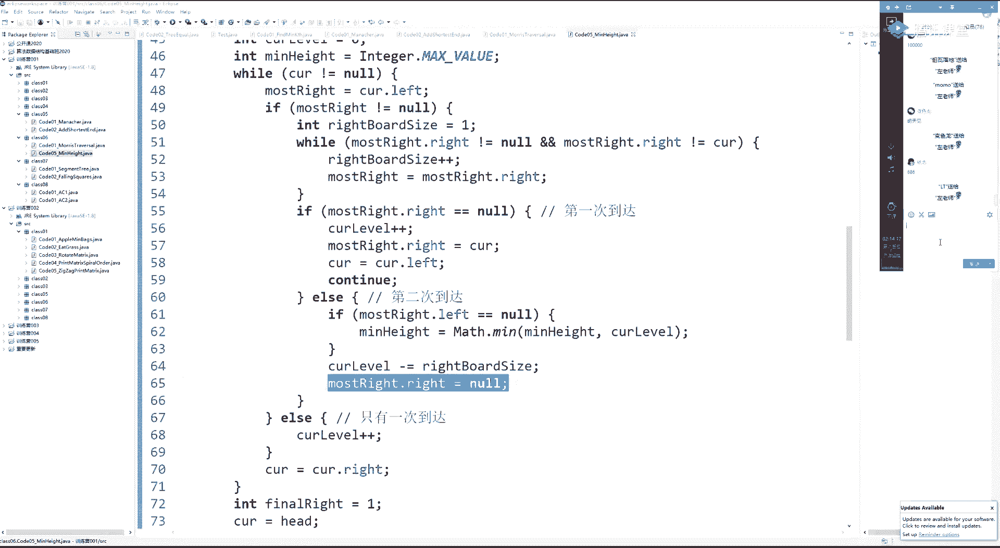