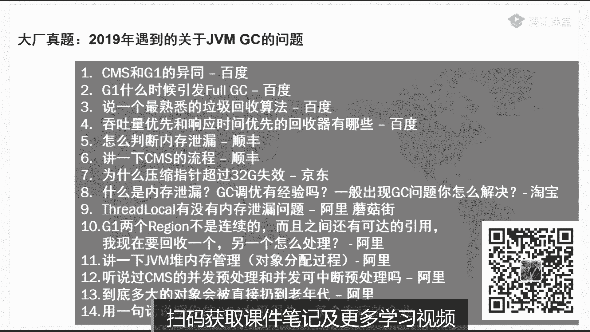

# 系列 2：P7：马士兵老师JVM调优：7.压力测试方法论 - Java视频学堂 - BV1Hy4y1t7Bo

要回滚没错，回滚到回滚到上呃，上一个运行环境去啊，替换等等，但是所有人要是有人要是说说我自己写个代码，马上把原来那个代码给他替换掉的，凡是这样的，全是中小公司小p项目，唉我告诉你。

大公司的这个事儿是不允许干的，你已经上线了，你还能随便的把服务器停掉，然后在部署上好多好多的部门协调好的这些个程序上去，你在开玩笑呢，你知道大型公司一次性的部署要花多长时间。

预备要预备一星期往上部署要花一两天，所以阿里我提供了这个功能，这个功能叫做ref，唉，又死了，不会吧，还没死，这个功能叫什么，叫redefine，redefine refine什么意思啊。

refine的意思相当简单，就是你直接在内存里头把那个源码给改过来，然后编译好就放回内存，不惊动线下的代码，演示一下好不好，内存里直接改代码对，当然这个是应急性的操作。

不是说所有的正规的操作都是这么干的，这是应急性的，应急我明天马上就要双11了，今天发现了一个代码，有一行写错了，本来应该是个二，要写成三的，给我给写错了，我的我的折扣要打0。99折，哎，里边写了一个0。

01折，完蛋了，我要是现在下线不行不行，不方便，那我现在我我怎么办啊，应急用的记住了吗，所以不要太过于去苛求它，这是应急用的，我给你演示一下啊，大家看这个小程序，我这里有一个小程序叫t t。java。

这小程序特别简单，我觉得我就不用我解释了，有一个m方法打印一个二出来，就这么简单没了，然后我还有一个小程序叫t。java，自己看，我在这个t。java里头一个main方法。

这个made in方法里头不断循环循环的时候在干嘛呢，cd dinner read，我读一个字符进来的时候，我就new一个tt调用一下他m方法，小程序太简单了，就想起来这个t，回头但是我回下车。

他就输出一个二，我回家之后再输出一个二，回下车后再输出一个二，好，这小程序到现在能理解吧，来get到同学给老师扣一小程序，很简单，就是我们扔了一个二上去，现在呢我现在上了线之后，我发现这个二写错了。

我要重新编译，再往上传，我的整个项目组是不允许你这么重新发布的，不可以，那怎么办，我想在线的直接就把它改成，把这个二改成一，可以不可以呢，可以怎么干，这么干，看这里，a i t d点加了。

首先你把这t点加了，这个二先改成一，全程一分分退出，叫ca tt完成号，编译好了，大家注意啊，这个时候是什么情况呢，你们要理解，现在有一个程序已经上线了，这个程序叫tt，这个tt里面输出的是一个二。

后来我发现这个二有问题，我现在在线下，我改了一份新的代码，这个叫tt。class，在这个t t class里面，我把它改成一了，现在我直接要把它替换掉，在不停整个服务器的情况下，直接把它给替换掉。

听清楚这个流程了吧，来听清楚同学给老师扣一，这里面其实呢如果稍微往深里讲一些的话，大家知道任何一个类呢在jvm里面都是被class loader给漏进去的，class loader如果你听过老师课。

老师是讲过class loader，怎么样自己重新定义自己的class loader，它里面有一个方法叫什么呢，叫define，这个define的方法呢，其实你自己去读一下。

就是把一个一段字节数组给它翻译成一个类，给它定义成一个类，一个对象啊，一个类，所以我们现在要干这么一件事，就调用在os里面调这个命令，启动一我在os里面调这个命令，调什么命令呢，叫re define。

重新定义，重新定义水，重新定义每个class，root。tt的class，我把这个新的class扔到内存里替换掉，原来那老的回车好看，这里redefine success已经成了。

我回到原来这个界面去敲回车，看见了吗，这程序我可没停，直接变一了，好这是阿特的干的事儿，还是挺牛的，这是临时的补bug用的，那以前有同学抬杠说。

老师这个里边你你你要是错了十处十个文件的100个文件全错了吗，大哥您100个文件全错了，那你还不重新发布啊，你还在线还真在线改啊，那有同学说老师我改完这个代码之后，那老的版本还是还是有问题的，那怎么办。

你下一个版本如果把它修修复bug呀，大集群怎么办，大集群你就不能同时替换呀，写一个脚本直接就同时替换了，没有问题的啊，不要认为大金军干不了啊，炸包咋整，这跟炸包有跟妈性关系吗，你直接替换掉一个类啊。

类似于热不属热部署，你是要把那个项目停掉，再部署上去，再启动那个项目的，这个是直接类级别的热部署，可以这么来理解，当然这里面呢它有一些个限制，就是有什么限制呢，你不能够修改属性，你说这个类里面有个属性。

这属性原来叫m，你给他给他删了，还这不行，你给他加一个，这也不行，现在这个这个版本不行，据说阿斯下个版本要把这事儿给加上，你给你添加了属性，可以没关系，凡是涉及到的我都给他改完，你把这属性删了。

其他代码牵扯到的我都给你改的机会，据说要这么干，但是我还没见着，还有一个不能干，你不能改方法名，你说原来这这方法叫m，你非得改成叫美眉不行不可以，为什么，因为有别的类也用到了这方法了。

人家直接调的就是m，不过据说下个版本也可以，唉这事儿得等他下一个版本行行不行了好吧，这个类正在被调用，会出现什么现象，原来从二变成一了呀，你跟正跟那打折，刷了个0。9000。01折，你正真的美呢。

一下单的时候倍儿变成0。99了，这酸爽，ok，关于阿瑟斯，我就就讲到这里了，好不好，我们就聊到这里，呃更详细的一些其他的功能的话，大家自己去翻吧，我觉得一个工具的话，那我教给你最主要的就可以了。

而且工具这个东西没什么可教的，自学都能搞得定的东西，对不对，我主要教教你他的思想在哪里啊，他能干一些什么样的事情，那么到现在为止，我觉得你的简历上应该是可以写这件事了，不知道你们敢不敢是哪件事呢。

就是。

诶跑哪去了，这件事不知道大家敢不敢写，给大家演示了，反正就是我在项目之中有过调优的实际经验，定位jvm的这种o m的溢出，这种经验，这是调优实战经验，可以写了吗，敢敢不敢写，好同学们，听我说。

作为一份简历来说，有的人水平是100，他敢写80啊，太牛了，任何人去面试的，你放心，因为他水平100，问你80，他就写80，大多数人问他就是80的问题，顶多问你90 100的问题好，这个时候我靠。

太牛了，他居然肯定能肯定能拿下这份岗位，这份岗位月薪25000，但是很不幸的是，这哥们儿本来值3万，知道吧，结果他拿了2万吧，他自己还很美好，有一哥们儿比较横，水平就2万的水平，60写80 十个减十个。

十次面试挂了八次，这个呢是十次面试成了八次诶，这个是十次面试挂了八次好，最后成了两次，这两次拿到25000来，同学们告诉我一下，你说谁亏了，唉醍醐灌顶对吧，你为什么有的人报名了两天。

他就涨了2000块钱，为什么有的人经过我们批完面，批完他的简历啊，他就直接涨2000块钱，你现在是不是有那么点感觉了。

好我看刚才有同学说了，说老师不是有十个案例吗，对是有事干，你自己去体会好不好，就别让我在这儿从头到尾的讲给你听了，嗯啊例会总一堆啊，我给你讲个比较好玩的吧。

面试官不给面试官不给面试官看，我跟你讲比较好玩儿了，好不好，来看这里，讲一个比较好玩的诶，这好玩的是什么呢。

这是实际当中确实发生过的，而且这家公司叫小米，这家公司有一批成员，2c加加的，然后由于他们的项目转了java，所以他们呢从c过来写java，他们写完java之后产生了频繁的gc，产生了内存的溢出。

听懂了吗，那为什么，原因是什么，好你们仔细仔细思考一下，他干了这么一件事儿，他重写了类的finalize，final finalize方法，大家知道那里面有一个方法叫finalize，finalize。

有印象吗，大家知道java程序员都知道那个类那个方法是不建议你重写它的，对不对，唉结果呢ci成员就把它重写了，第一个我问你第一个问题，第一个问题，why，为什么c加加乘以r会重写finalize。

为什么y，原因是什么对，因为c加加是乘以，他们写惯了手动释放内存，手动释放内存，你要delete掉，要在你的类里面写析构函数，就是那个函数啊，小小小波浪线加一个名字。

而他们认为java里面应该有一个函数，也是虚构函数，看到了finalize，欣喜若狂，我靠终于有西构函数了，光机给它写进去，既然是虚构，我肯定要释放资源，在里面释放各种各样的文件，打开的内容啊。

什么各种各样的锁呀，各种各样的数据库的连接呀，好全全放到这里头去，接下来你们自己想想它本来这个finalize呢一个垃圾回收器，回收这个垃圾的时候，他要执行这方法的，这方法执行的时候本来不费什么时间。

结果它里边放了一大堆费时间的东西，本来的一个对象我要回收的时候一个毫秒，结果他放了这么一堆东西之后呢，十秒钟才能回收一对象，但有点夸张，一秒钟，然后你内存肯定会越来越多，你分配对象速度又比较快。

内存很快就占满了，这是它产生溢出的原因，好不知道大家听清楚没有，这是实践当中有人犯过这种错误的，当然你如果还不知道，你如果还不知道面试官怎么说，你就写一最土的，你说我我有一个同事。

你千万别说你自己他写了一个类似的，然后他就不断的往里装装内容，他不释放，哎这个可以吧，当然谁写这么土的代码啊，哈哈哈哈，当然我就不说了啊，十个案例你自己挑，自己去挑，都是相对土一些的案例啊。

还有十个案例是给vip准备的，我就不说了，o，那么到现在为止呢，没人问你们不called rereview吗，called the review，另外一个同事，他比较睡得昏昏沉沉的啊，眼眼迷迷瞪瞪的。

code review，没有review过，有什么关系吗，好，呃其实到现在为止呢，实战部分内容呢就大体的非常粗的一个流程，我就我就给大家讲完了，呃我们简单的稍微的回顾一下啊，这份文档的内容比较多。

我只挑了其中的比较粗的流程来讲给大家听的，但是至少我觉得你到现在为止应该是有这样的一个收获，第一你弄明白了，原来垃圾会说其实有很多种，第二你调优的时候一定是针对某种垃圾回收器回收调优的。

第三oom的问题，你至少应该知道用什么样的工具去定位它，面试官问到你的时候，你用什么样的说法去说服面试官，好有这方面收获的同学给老师扣一，这个文档会发吗，会的没有问题啊，那我下面讲一点比较难的。

就不讲女的了好吧，我讲一点比较难的，这个比较难的问题呢，呃目前面试官问的还不多，但是今天有面试官在场，所以他们可能就会问了，那这个比较难的问题是什么呢，这个比较难的问题是我昨天讲ccm的时候。

有同学已经特别感兴趣了，问了我好几遍了，追问了好几遍，说老师这个c m c m s里面不说cms里面，不是说我的工作线程和我的垃圾回收线程是同时进行的，对不对啊。

三色标记我的工作线程和垃圾回收线程是同时进行的，那么我垃圾回收线程在回收这个对象的时候，很可能被工作线程又又把这个对象变成不是垃圾了，那这种情况怎么进行处理，目前也只有美团问到过这个问题。

其他的大厂还没有问到过，包括阿里也没有问到过，好如果说到这一点的话，你能够说的偷偷车车详详细细的，那么肯定会呃得高分啊，非常高的分啊，当然对不起啊，应该是也问到过，因为他这个问题呢问的不是特别直接。

就是关于这类的问题，我给你看一眼啊，就刚才这些问题其实是包括了它了。

呃其实这一类的问题，这类的问题呢都是比较难的，讲一个最熟悉的垃圾回收算法，那么你如果你讲三色标记，我去这就牛了啊，你要讲一个对熟悉的，讲一个什么拷贝，那个太简单了。

还有一个其实还有一个我记得有一个问题是问的什么呢，就是呃你能不能把cms和g一的这个垃圾回收算法，你你给我，你给我说一下，忘了是哪个公司问的了，就是凡是问到这类问题的都是超难的。

还有一个就是这一类比较葛的问题，某个有病的企业，某个有病的面试官都说用一句话证明你这个水平很牛，我就教他嘛，我说十种垃圾回收器所有算法都明白，我靠太牛了，十种垃圾回收器所有算法全明白。

好吧算你狠好，估计除了老师之外，没有人敢这么说，哈哈哈哈哈好，下面我们讲可以加高分的这样的一个算法，好大家看这里，嗯就是强软弱虚指针打开错了。

哎呀为了给大家讲清楚，这个专门给大家画了一个动画，动画画起来很难演示，三分钟就演示完了，好首先请大家记住这个名字，这个算法的名称叫做三色标记，好看这里三色标记，三色标记是什么概念，这是我们首先定义啊。

这个三色标记呢就是当垃圾回收器去标记那些个对象的时候，他得把那个对象给标出来，哪个是垃圾，哪个不是垃圾啊，这个垃圾这个飞垃圾，这个垃圾这个飞垃圾好，他得干这件事，得识别出来，那么它到底怎么实现的呢。

在尤其是这种并发级别实现，如果是那种不是并发的，说你所有的工作线程你都给我停了啊，一边给我待着去，那就随便标了对吧，每个对象还怕他找就行了，找出来的全都不是垃圾，没找着的全都是垃圾，这就是最简单的。

但是实际当中现在的这个需求是什么，现在需求是你一边干活儿，我一边标识，那肯定会有标错的情况，这是肯定的，我们再来我们看它实际当中是怎么实现的，这种情况呢叫做三色标记，三色标记是什么概念。

首先第一点先认清楚这个概念，他会把对象在逻辑上分成三种颜色，三种颜色其实对象不是真正的那个颜色，对象全是零一了，他有一个标记位，比如说零一代表就是黑的啊，一零代表就是灰的，零零代表就是白的等等。

就是干这个使的，那三色标记是什么，一个什么概念，逻辑概念，它分成三种类型的对象，哪哪三种，黑色的，灰色的，白色的，黑白灰三种，黑白灰三种的概念是什么，就是我在找到这个对象了，我找这个对象。

但是呢我还没有识别它，它到底是不是垃圾，我还没有识别它，我们说还没有对这个对象做标记好，这种对象称之为白色对象，好我又找到了一个对象，这个对象呢我已经识别了这个对象了，它不是垃圾，确认它已经不是垃圾了。

而且呢我确认它不是垃圾之后呢，我得顺着这个对象的成员变量去顺着往下找，但是我还没有进行这一步，我还没有找它的成员变量，到底它是不是垃圾，成员变量指向这些对象到底是不是垃圾，我还没有找到这步，好。

这个叫灰色的，如果我找到一个对象，这个对象我已经确认它不是垃圾，并且它的成员变量我也找完了，这两个变量我也就标出来了，这两个变量找出来了，标完了是灰色的还是白色的，全都标完了好，这种的叫做黑色。

黑色对象叫黑白灰，黑的叫什么，自己标完了，儿子也标完了，这个叫做黑色，灰的叫什么，灰的叫自己，标完了指向的对象还没有标，这个叫灰色好，没有标到的对象叫白色，黑白灰来理解，同学给老师扣一，好这叫三色标记。

那么假如说我们在整个的整个我们程序，我们jy m的线程，也就是我们垃圾回收线程，在回收的过程是做标记的过程之中，我已经标成了a啊，确实是黑色的了，b是灰色的，他的b的孩子还没有标好，在这种情况之下。

突然之间我们整个应用程序，因为应用程序也是在不断地运行的，它用运行的过程之中呢，他把b指向d的这个引用给消失了，就转成一个人变成没了，假如发生这样一种情况，b指向d的引用消失，同学们，你们想一下。

注意啊，这个d还没有被标注呢，没有被标注了，同学们，你们这样想一下会不会产生问题，这种情况会不会产生问题，仔细想想，因为这里头相对难一些，全是算法，全是抽象的问题，会产生问题吗，其实是不会的。

哎为什么呢，为什么不会呢，因为这个东西呢叫做floating garbage，咱们的这个垃圾回收啊，它是一轮一轮的，还记得那个可中断垃圾回收吗，没处理吗，哎他是一轮一轮的一轮一轮进行。

我这一轮儿标到这儿之后，然后没有把你这个b给你找出来，因为刚才你还连着呢，但是呢下一轮来了之后，我就找不着你这个d了，你这个d就变成垃圾了，我就把你给清了，所以没有关系，这是一个浮动垃圾。

浮动垃圾的意思就是诶这轮没把它给干掉，下一轮再把它给干掉，让你多活一小会儿，所以这个没事，这种情况下是没有任何关系的，好刚才这小段听明白的，给老师扣一，就是说他可以他早晚被清掉。

只是早一会晚一会儿的问题，有一种问题是什么问题呢，看这种这种就比较麻烦了，这种情况是这样的，你仔细看，假如在垃圾回收的过程之中，标了a和b，a是黑，b是灰，还没有标到d在这个过程之中。

另外我们的工作线程干了一件事，他把b指向d的引用给弄没了，与此同时a有一个引用指向d了，再看一遍，这两个是都是必要的条件啊，b指向的d的也就没了，与此同时a指向d了，看到了吗，这时候会产生什么现象。

来仔细看一眼，同学们，你们想一下a的颜色是什么颜色，a的颜色是黑色，黑色代表什么，黑色代表已经标记完了，那下一轮垃圾回收器在进行的时候，下一轮来的时候，它还会标记这个a下面的成员变量吗，还会标记吗。

不会了，结果这哥们就被回收了，知道吧，因为那垃圾回收器已经认为没有任何引用指向性了，因为我不再会去找a下面的成员变量了，与此同时，所有指向你的其他的那些引用也都没了，再看一眼，这就是问题所在。

只有在这种情况下，它会产生问题，它就会产生漏标，漏标就会产生内存泄漏，b指向d的也就没了，同时增同时a指向d的引用增加了一个，b b没关系啊，b是灰色的，如果那就b没关系啊，b它是不是灰色的吗，灰色的。

我下一次来的时候还是要去找他的孩子们的，对不对，他的孩子没有必要呢，结果他现在孩子这个孩子已经没了，他可能有别的孩子，如果有的话，那就直接去找，如果没有的话，就把它变成黑色了，这哥们儿就成黑了。

黑的就可以直接回就可就是弄完了已经结束了，好了，好这个过程大家听明白了，对不对，注意还没完啊，因为这个这个里边算法特别深，我得一步一步确认，你们都明白了，就是说灰的纸箱白的也就没了，黑的增加了一个。

由于黑的已经不再被扫描他的孩子，所以这个地不会被扫描到了，再出问题了，ok我们继续可以继续同学给老师扣一，为何a添加了指向d，那a里面有个成员变量a点小a等于d，这不很正常吗。

你写这么一个代码不就完了吗，正好执行到这段代码了，这种问题还卡嗯，不对啊，喝口水，为什么指向d，因为业务逻辑变了，业务逻辑在运行，你自己写代码的时候，会不会写你自己写代码的时候，会不会写这种代码，a。

b等于new什么，或者等于某list里面get什么，会不会写，好看这里，我们现在要解决这个问题，要解决这个问题怎么办，解决这个问题有两种方案，认真听这两种方案，还有第一种方案。

第一种方案就是c m s的解决方案，semi方案就是叫他的名字叫什么呢，叫做incremental update，昨天我说三色标记是一种中性词，三色标记会产生问题，cms。

对于三次标题解决问题的方案叫做incremental update，好什么意思，看他是怎么解决的，他是这么来干的，b指向d的，没了，a指向d的诞生了，好这个时候干了一件什么事呢，他就把a标成灰色。

就干这么一件事儿，很简单，那么下一轮我们的垃圾回收器再来下一轮的时候，它会扫灰色的，因为灰色的还没他的孩子们还没扫完呢，所以他肯定会把灰色的都扫一遍，就这么简单搞定了，非常直观好。

这就是cms对于三色标记算法的一个改进方案啊，一个公正方案叫做incremental update，搞定了，那他是怎么让黑色变成灰色，我的妈呀，你想气死我是吗。

