# 系列 3：P104：【Redis】redis中value类型--sorted_set - 马士兵_马小雨 - BV1zh411H79h

最最常用的最常用这个最基本的类型，RA当中是5个。最常用的基本的是5个类型，我们讲了4个了，一个str，然后list哈西，还有set，还有一个还有一个讲完这个类型了。

咱们可以讲后边持有化和集群相关的这个这个知识了。另外一个类型就是有序金。

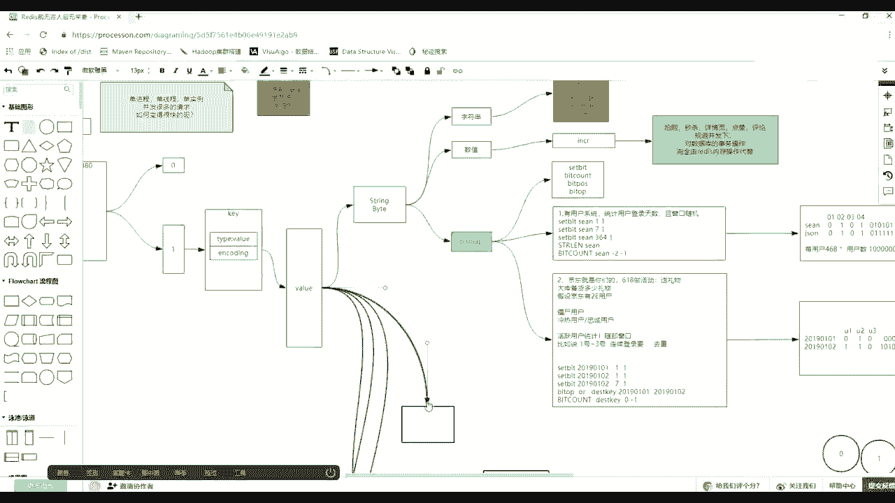

sing的 size。

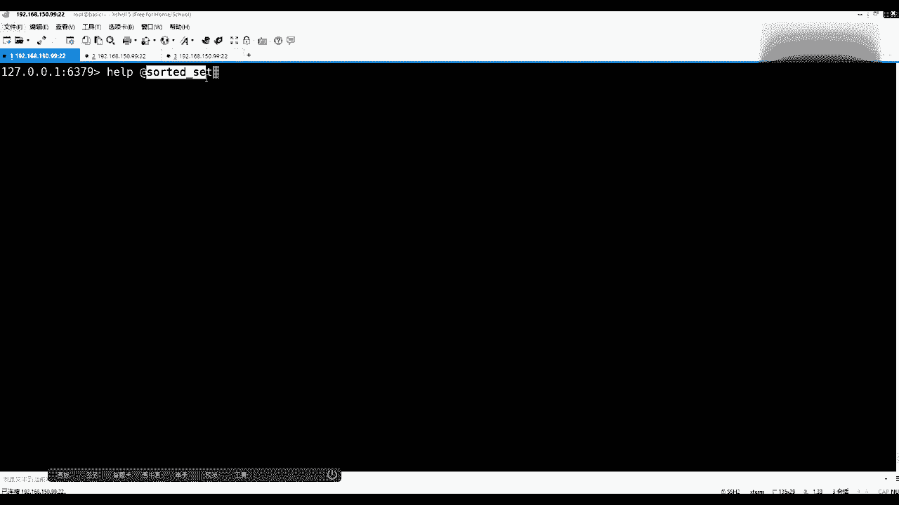

不用我老大。然后一个是有戏机，那么这个集合这个农存数据的单元素的哎，无非有list啊，它是可以重复的，然后放入有顺序。然后有s。s是放无数放无这个顺序没有乱放的，然后呢，它还不给你排序，而且是去虫的。

它是去虫的了。这俩都有的时候，为啥又多一个sy side？因为我们更需要的什么呀？数数据被去重了，且它得有多一个排序的事儿。注意这个序都叫序list有序，叫做放入的插入的这个顺序。

这个s side是对元素排序的那个顺序啊，排序那个那那个顺序。Oh。这个用的其实也是相相对比较多的一个外y类型。然后要讲它之前要讲它之前，我们先。会这个引入一些概念，就是先铺垫一下。

你才能对它非常的理解。因为它这个说价格是最难讲的一个东西，最容易让人懵的。首先你明白。它首先是s是集合，明白没吧？集合的话就会有很多的元素。比如说这里面有苹果。然后呢，有香蕉。还会有。鸭梨。就有三个吧。

这三个如果放到一个排序里，你想让他按什么序排序啊？想那按什么序排序啊？想让他按什么序排序。或者想让他们怎么排序。这点很重要，你把这个之点写完白之后，这个色下我给你讲的是好讲了。啊。

那么有人听过大数序或者听我课的时候都知道啊，一说排序就有两个序字典序和数值序，对不对？把这个层次再往上抬高一点，再抬高一点。不是说的底层这个排序这个事儿，你想拿它的哪些属性去排序？跟着我的思路走啊。

Z side和so side是一样的，是一个东西，类型是sy side，但是使用的是Z开头的了，到时候给你解释。跟着我的思路走，你想让他们按说排序，其实是强调的排序的依据。

这个排序的依据可以按照他的名称排，对不对？是不是可以就按照平平箱压，按照名称去排，对不对？这是第一种，就是直接按名称排。这是我啊。第一个是名称，也就是字典序去排。除了可以按这个名称去排，还可以按这个排。

含糖量。可不可以？你是不是就想让他们排个序，然后按照含能量，含能量含糖量是重要的吗？未来你是想看到含能量含量含能数值吗？你也看到是他们的顺序，对不对？含能量是一个隐藏的一个一个一个东西，对不对？😡。

你要ge到这点，虽然在排序的时候，含能量很重要，但是未来你这辈子可能在前端看不到他们的含能量，你只是看到他们的排序了。这一点要能理解了，这个所以下一个你就你就非常容易理解了。😡，🤧那么除了含金量。

还有什么呀？😡，个头大小。价格。然后这个粉丝数就是这个根据全国媒体调查，醒苹果的1万人相蕉的10万人压力个俩人。根据这个这个那个数据是不是也给他们排序，然后前端展示时候。

你可能就是想让他们按照顺序排出来，然后底层的一个维度的东西不想展示。所以一定要明白，就是这些东西是不是有可能重要，有可能不重要。在未来使用的时候，只要你拿着它们能让他们排成序是不就可以了。关系。啊。

吃货热度啊，吃过热度吃货热度。收货。Good的。好吧，很开心吧啊。😊，一定要ge到这一点啊一定要盖这，就是排序规则。提是这个意思。所以这时候如果这个东西你能听懂了，你能听懂了，能盖到这点了。

我再给你讲原理啊，salty set在使用的时候有这么几个维度。第一，它是个set，你就必须得有元素，且这个set它是salty的，所以它就需要有一个维度，叫个sscalecall分值。

第一个他就对需要有一个维度，叫做分值维度。如果你不给出分值，谁都不知道他们应该按照什么去排序。如果不给出分值，因为能够给出的分值的东西太多了。计算机他是个傻子，他怎么知道你是要按热这个吃货热度。

还是按含能量去排呢？所以我们在使用造价的时候，既要给出元素，一要给出分值。能盖到这点之后，再来看。如果先说一种场景，如果分值都为一的时候。你没有给出含能量，什么都没给，你就给出权为一的时候。

这个时候它是按照什么呀？名称那个字减序排的。😡，所以我需求。🤧好吧，4个那么除了。现在除了有分值维度啊，一共有很多个维度，除了元素，有分值。因为它已经是有序的了。那么在有序消集的当中，其实还有一个概念。

就是这个序是正序倒序呢？是按大到小呢，还是按小到大的顺序，对不对？还有一个顺序的概念，其实顺序概念里边就是它的ra排名，排名的话，无非就是其实再说白就是索引。所以其实每个元素它还有自己的正负向所引。

这个东西也正向作用为0，然后负向的话就是负极了，负X。哪一套房子要。然后这个正向左以，然后就是负X减1。然后呢，它正向缩引。正向缩引就是2，然后负向缩引也就是-1。这我直接直接下面写吧，-2。

开照负担了，你要学。所以当把这个图画清的时候，你可以得出几个概念。第一个元素。未来我们在使用超级赛的时候，有一些命令是关注的元素，你可以给出参数的元素，我可以给你排名，给你分值。或者是参数是。

scall分值分数分值。你给出分值区间，我给你取出哪些元素，或者是你给出run排名，或者下调索引。就是所以。你比如索引，我根据索引给出一些元素，而且能带着元素，同时还带着分值。

普通话这个描述的过程能听懂了？朋友们来再去讲这个命令。

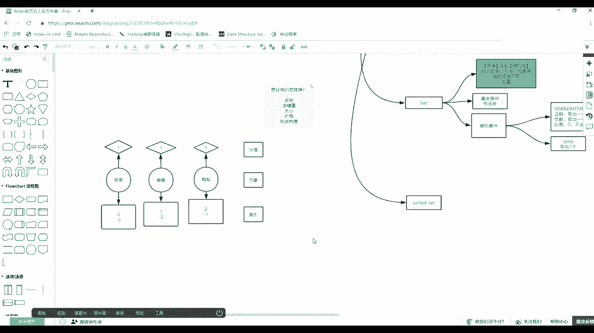

没说。这个没当中。一系列的命令都是以Z开头的。那么这时候注意，刚说ras命容命名规则就是取你类型的首字母。像sy赛呢，它也是S开头啊，但是赛当中已经把S占用了。这时候它很巧妙。

26个字母取最后一个拼上这些命令，就这么简单，就这么low。最后一分钟。这个同能理解的同学来双个一。Z side呢就其实就是就是就是对它因为S没法用了，被那个s用了，那有有有有SM的，对不对？

他他就他就得用这了。😊，那么相应的，比如这里面有Z add，就是像那个语形添元素，当然注意看看语法，要给出P。

后边给什么sco members member score member下的时候是只有mem没有sca分值的。但在这这个有序集合当中，有有有序的一个数据当中，你是必须要给出scall分值的。

但是你说了我不想给出分值，它们分值都是一样的。我就想就想让那些元素按照名称排一下，okK全给一。去个一就可以了。就刚刚讲的一个特殊情况。然后呢还可以统一的数量。

然后呢可以Z count给出一个keyme max，然后看s members in个什么s side，然后with scale，也就是说后边其实你给出最小值和最大值的分值数。

然后按照这个分值区间给你统计有多少个member元素，那个数量。还有incre byincrement by就是可以增加一个key的，什么呀？

这个分值就是那个那个那个它的分值给他这按这元素给他加加分值加几。然后还有相应的。range的the range给出一个key，给出star stop，注意上边给出的会出现me max。

这是要给出的是分值t。然后这作为参数，下边如果the range的话，给出的star stop的时候，给的出它的索引或者排名。

所以这时候其实它好讲也不好讲，不好讲，就是因为它比别的东西都多了一个维度多了一个维度。然后下面这个更准确的比如说ze range by score，你可以给出这个分值，因为上面拿的是这个排名索引。

你还可以按照这个分值去取，然后ze one key member。

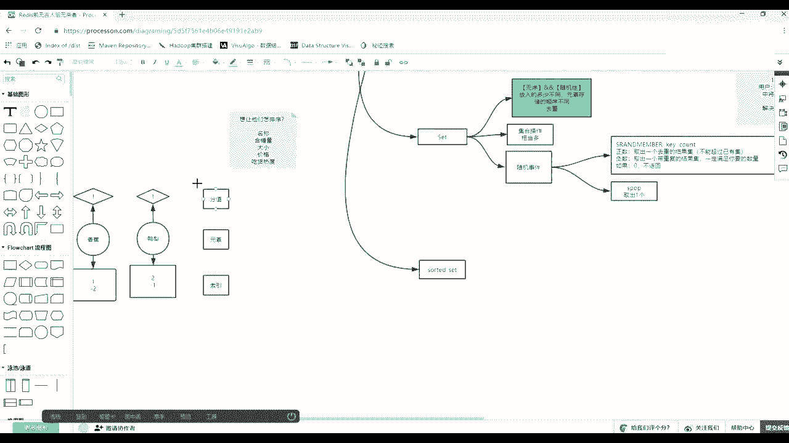

等能很多玩reremove。然后除了上边这种名称之外，你会发现这样的名称到下边时候会出现一些前缀。你像Z曾经的Z range又带了1个LEV就是反向的意思。

然后run这个the range by score啊等等啊，它又前面带了一个反向。那么这个其实说的什么意思？说的是有的时候我可能是按照正序去去取前三名。正序前三名什么意思？就是小到大这么的一个曲度。

从从小从最小往大哪方取出前三。但是有的时候你是希望什么呀？取倒序的前三名。前三名，你给出索引就是012，这前三个这个这个范围。但是这个数据集是正着取的，还是倒着取有两个方向。

所以它是靠这个命令当中是原命令还是带着R1列反应命令？会这种情况，好吧，你先把这个东西压到身底，压到身底，我们来演示一下。比如说我们增加元素flash。哦。Z and。给出U个KK1。

然后呢给出相应的smesmesme。比如说呃8apple。然后7banana。本单的是这么写吗？然后大气跑。给一个低点的，给一个2，然后三是orange。好吧。得回得回仨就够了，你再多一个。

我都不会写单词了。回车。啊，回收我现在手里得到了一个数据集。其实有序的。那么默认这个树于，这个apple啊，banana orangerange的那存要存的话，其实先说话简单说。

它就存了一个列表的一个方式了，而且它肯定是有序度呗。那么标准的是默认的是从左小右大的物理摆放方式。

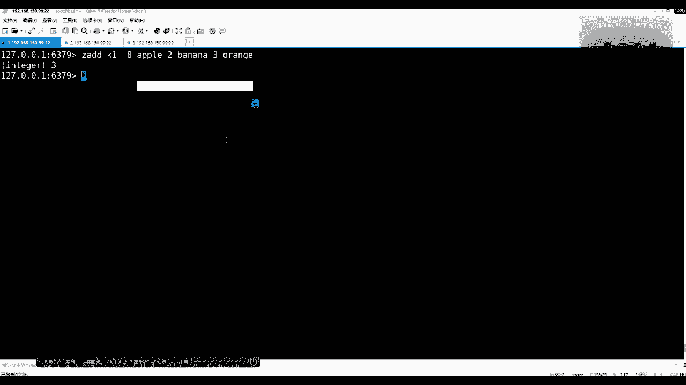

这是一句话听懂啊。是上第一个就是物理内存是左小右大。物理内存左小。又大。又大一个顺序，按照你的scocall分值，在内存当中把这些元素拉链式的给你排好了。然后可以怎么看这些元素呢？

你可以通过Z range。

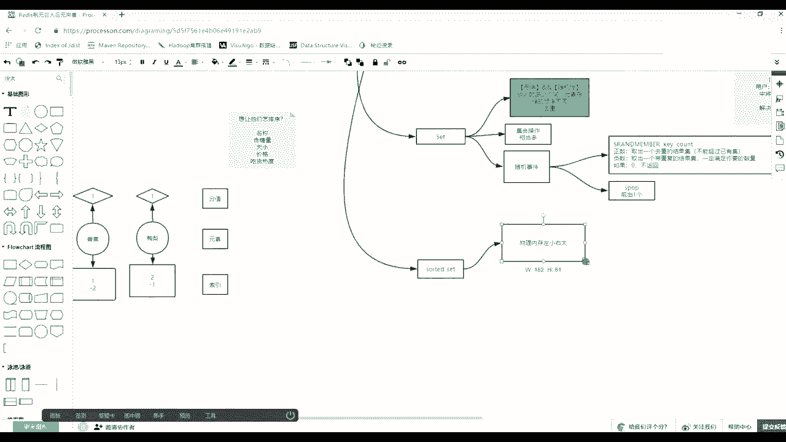

然后给出K1star，然后比如从0到-1来来显示，是不是人呢就排到了第一个，然后第二个是orange3，然后8的话，apple成到最后一个了，还可以带一个选项位置。scorse分值。

就banana是238。跟我说的描述一样，一层一层的把这枝铺上去啊。跟着节奏走，机器的这个大号不容易乱。ok当你知他了，还有一系列命令。刚开始取出相应的所有。如果你想取出的是。嗯。所以。

Rangnge by。spe啊，按照分值去取。刚才是取出了，按照这什么按照索引，按照索引去取的这个元素。那么如果想按照分值去取，那么这么写也可以了，也是给出一个P，比如说给P1。

然后注意win maxax提示的时候就给出分值，分值的话有二有三有8。比如说我想取最小是3，然后最大是8，然后这个范围，那么取出来就是orange和app。好吧，这个理解吧。

然后这时候其实如果说我想取按价格由低到高取出前两名的水果，应该怎么写？价格由低到高取出前两名的水果就可以就就就可以了。那么应该取出别 orangerange呗，那么应该怎么去写？

有时候知识和语义并不是同时出现的，你只要能分控的去就可以了。怎么写啊？朋学们。Oh。难吗？由低到高去取，就取出本来的orange，上周取出所有了。我现让你取出前面脸牙怎么写啊？

Z rangeK1从0到1，这是俩。这不曲分了吗？有时候不要因为老师给你讲了一个东西，感觉一看就好复杂了，你就不会做技术选型，不会不会不会答题了。😡，能看到吧。哎。

但是如果我想按着由高到低取出前两名的水果，要取出apple，然后再取出orange对？那么这时候怎么去写？根据刚才我们这个陈述。旁面有一个特征，什么特征？是不是还有1个REV轮？是不是这样取的话。

取的叫apple和orange。哎，有人说我可以通过Z orangerange后边跟什么呀？-1-0这个-1-2对对。-2-1-2-1。来一样吗？俩一样嘛，你用正向命令从小到大的。

然后取负2取-一取这啥呀？跟我这个这个哪个应该对呀，是不是这个是对的，就是apple它是最大的应该排在第一个orange次大的排在这儿，你这么取还是有小单，有小单，你根本没有改变这个方案顺序。

千万千万要注意这一点。

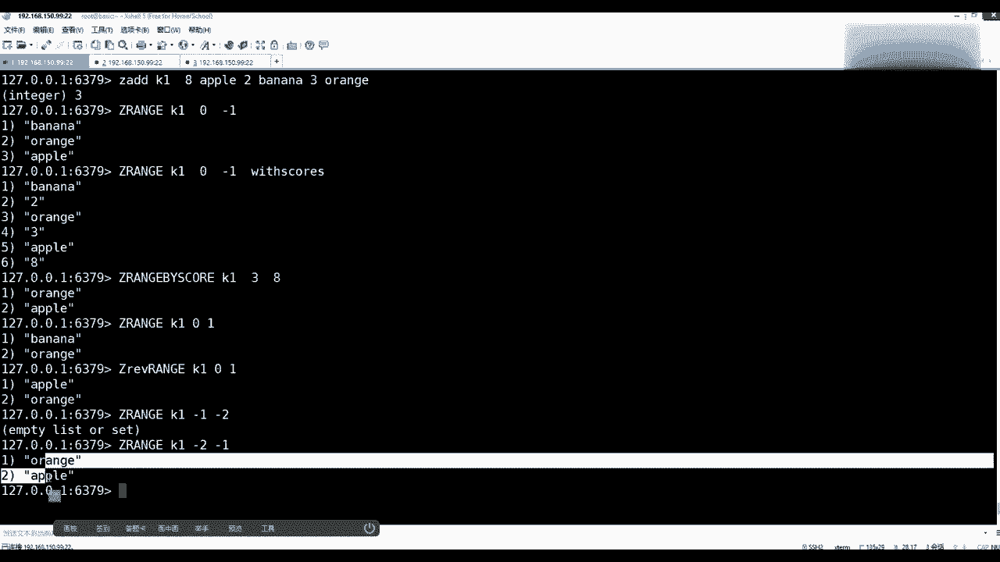

好吧，那么在这儿演因为演示到这儿，你要知道一点，我为什么说物理内存左小右大且这个东西不随命令而发生变化。就是无论你是正向并流，比如说Z orange或者是ZREV range。它不会随着你使用什么命令。

比如你要使用资源的时候，它物理内层作用作用大。你使用这个反向命令的时候，它给你翻个分转左左大右小。reour是就就这个意思。这句话能不能get到这个点？😡，那么这时候有人就会问了。

那么如果内存不不翻个方向，它怎怎么做到的，它是不是会有一个什么呀？逆向缩引逆向缩引是不是可以从大的往这边去取，无非就是REV的时候，会把你那个。

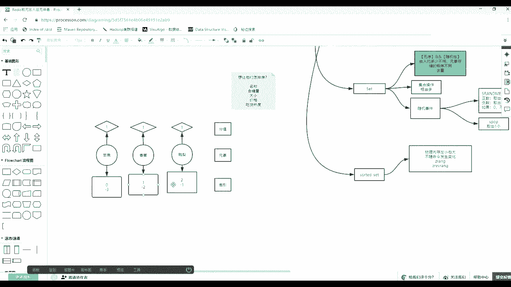

把你那个这个这个这个这个这个你给出这个这个区间，它翻译一遍。当是取值值的时候，一定是按照这个大小，这这个方案这么这个顺序给你取的。

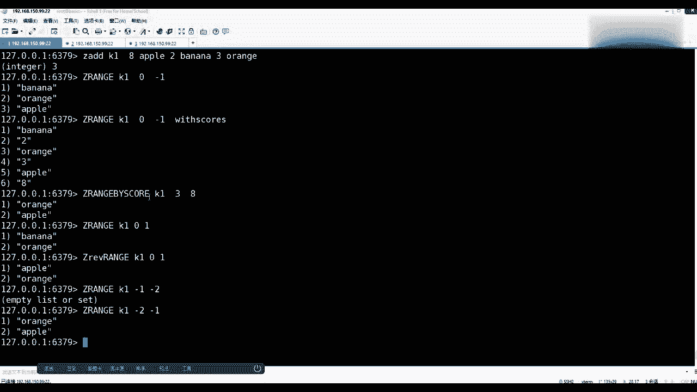

先举出负一，再举出负二，再举-3，然后达成前这个由大到小的一个前三名。这点一定要注意啊。因为有的时候面试官会刻意在这块难为你啊，或或者或者给你带坑里边去，你脑脑子里只要知着就可以了。

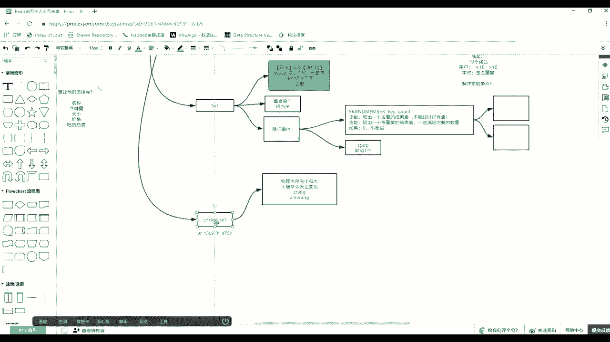

H。那么还可以通过这。rangech，然后这呃。还有一个是Z score。这carK1，然后比如说我们的apple。你还可以通过元素取出它的什么呀？分值还可以通过ZZ rank。排名吗直接run。

最ra的K1，然后apple。然后取出它的排名，一定要记住它有三个东西。元素这是元素，然后呢一个是分值，一个是排名啊，一个是排名。好吧，然后它也支持数值计算。如果它不支持数值计算的话。

这个这个这套这套Y的类型是很难被使用的。比如说像现在然后Zrange，然后我们的K1先从零取到非球一缩有元素，然后with score。Scars。啊 CEO。取出所有东西，然后这时候注意啊。

我想做一件啥事儿，我想将banana增加2。5，增加2。5怎么做？很容易想到，就是Z嘛增加就是increment，然后bu abroad。没有法的，直接直接可以加啊。加谁加我的K1。然后增加多少。

比如增加1个2。5，然后memer是我的banana。回车，然后这时候再用Z run。K1，然后0到-1拿到的再加上这个位置SCO。car。这时候你会发现它的顺序是是发生了变化，orange因为是3。

本来的净值变成4。5了，它俩是完都发生了一个变化，对不对？这位看懂吧？就是说它叫sty了，它会实时根据你给定的分值维护元素的顺序，而它支持这种增增深改啥，就这个增减一个数值的这种操作。

你给出复值就会减啊，你给出复值就会减掉这个值这点很重要，为什么举一个场景，举一个场景。比如说歌曲排行榜？啊，歌曲排行榜歌曲排行榜如果第一天上线，所有的歌曲的分值，排行榜是按什么去排名的。

所请大家来来来来刷一下歌曲排行榜按什么去排名，热度热度的话一个数换成数据是什么呀？下载或者是点击或者播放，对不对？不管怎么样，也会取出其中的一个值，对不对？那么请问它是倒序的还是正序的？

排行榜前十名说的什么呀？是不是倒叙播放量点点播量下载到最高的，对不对？但是这时候这些歌曲从第一天诞争的时候，你准备了一堆一堆歌曲，他们的死高分别看是多少？死高分针是不是都是零或者都是一，对不对？啊。

可以说都是0。哎，某一个人对某一个元素播放了一次，是不是加一。可不可以入我们的Z in incr版。就比如对来的这个歌就个增加一个一可不可以。然后这时候不同的人对不同的元素增啊增增啊增增啊增。

这里边所有的元素是不是他们的顺序在调调换来调纹句，调换来调换去。突然你一刷新，我要看看榜单的时候，他们到最快对实时的速度告诉你。前十的是哪哪些，而且是倒叙。倒叙的话一定是REV这种反向的命令。

就是我们可以用reice根本就不需要用数据库，因为数据库那种对数据的增删这个增加增加这种操作和减减减减震操作会触发事物，尤尤其在并发下，太麻烦了。你用reis，因为单进程单线程。

所有人对不同各类的增或者对同一个级增，他们排队进到的一个一个进程一个限程给。所以安全性的把这些所有数据的变化。而查询的时候，因为剩下自动会也能排序，所以可以快速取位这些数据。

就这么一个简单的一个应用的过程。而且你可以要这个最最次排名榜和最最优排名榜，无非就是正向命令和反向命令。好吧。能把这个点ge特清楚之后。他我们先来说一下，再补一个质。

补补完一个质点就可以讲它这个底层原理了。它是怎么他你要因为你要思考一个问题，它这一直排序，一直排序的成本是多少？或者你对这个集合放了很多数据的时候，它的查询速度或排序速度应该差到合适的位置。

这个成本是是度大用的是什么底层的数据结构类型来完成的这个这个排序这件事情，对不对？

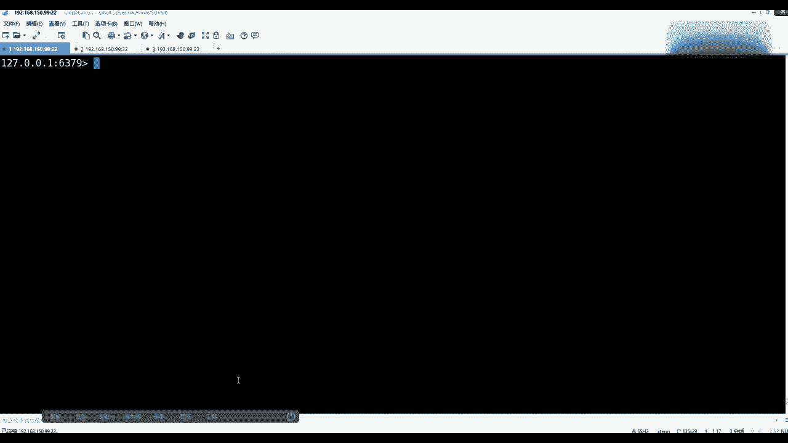

但是先讲一个别的。它既然是个集合，除了这个特征之外，它还有一个最基本的一个特征，也就是它也具备。集合操作。啊，病急或者交急。但是这时候注意你刚才学s的时候，其实交并差机都已经学过了。

size的交并差还比较好好理解，因为它是单元素。但是你在学三s的你就发现这哥们东西太多了，因为两个集合里边可能都出现压力。然后这边的分值可能是一那边分值可能是8。如果做交集的时候，应该把压力取出来。

那取出来的时候是留这个一的差留这个8的，这个分值应该怎么去处理，是加上呢，还是取大取小还是求一个平均。😊。

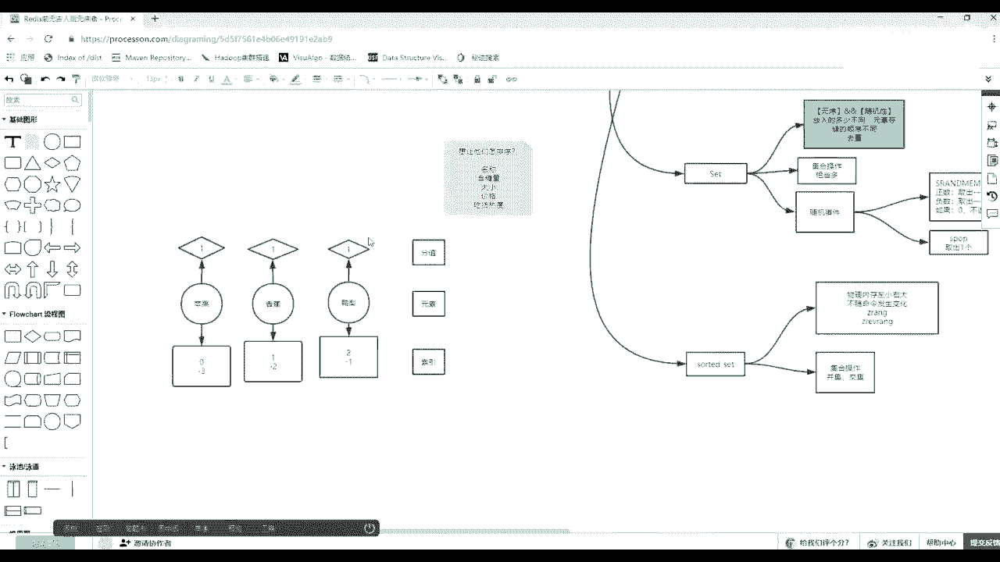

那么就我在表述啥？😡，朋友们，所以这时候其实两个集格都做交对这个事情，它有一些差异的Z比如说做一个。病例。然后通过它可以因为带这个story可以存到一个目标K里边。然后注意看后边这个所有的命令参数啊。

第一个number case。要给出你参与这个妹，这个这次计算，要有几个可以去参与有几个可以参与，然后权重。权重是一个负数，然后呢又可又给几个。然后这个权重是和你的K按顺序买的。

你比如让第一个K的权重是一，第二个K的0。5，第三个是是一，那么你就要挨个的，你那个你后面写一0。51，你要写的第一个一就对对应第一个K，它们有一个顺序的对应关系。然后这步完事之后，这是一套完事之后。

后面还有一个相应的一个聚合参数s mean max。所以这时候其实当这种有序集合带分值那种这种元素，他们这个就命差的时候，其实更关注的是那些两个集合都有的元素，它们分值怎么处理，可以把分值加起来。

可以取最小值，可以取最大值。好吧，这个位能看懂吧，然后能模拟一版。🤧比如说准备一个Z艾。准备一个K先清下裤。所哎1个K1，然后呢往里贴元素的时候，肯定是scall分值。这scall原始元素。比如说。

80是tom考的分数，六0是肖恩，我考的分数，然后70是这个baby考的分数，就这三人考这么一个分数回车，然后再Z艾。1个K2，然后呢top考了一个。6060吧，胖妞考了1个60。然后肖恩考了1个80。

肖恩考了1个100吧。第二次考试考的高一点，然后后边还有1个40分。比如说一鸣一名老师好吧。He hey。😊，没看到啊，现在是不是两个数据集了。😊，是不是两个集合，对不对啊。

两个集合我是不是可以发生这交集和并级，对不对？😊，然后先放到，你要先给出一个51K，比如说UNK，然后呢后边number case配音量，比是给出这个这个这个这个几个KK的数量，有俩K。啊。

第1个K是K1，第二K是K2。然后呢权重的话啊权重的话可以给可以不给，我们先不给权重走一个默认的。默认的话就是这个两个人的权重都是一，对不对？然后聚合聚合呢我们先不给啊，也先不给。

然后回车得到了一个目标K，然后可以Zrange我们的。这个K，然后给出从0到-1，且看它的权重。不是那个那个那个分值回车。那么。物理内存因优是从左到右的，一个是正向面的嘛，就是从小到大排序的。

第一个是一名，因为一名是一个两个都不存在的，所以它的值是直接存进去了40分。然后babybaby70分，baby也是这边不存在，是独立存在的，就是70。

然后非就是tom跟肖恩tom的话注意它是有一个60分加1个80分。这个你也可以看出它默认行为什么行为，应该重要选项的，是一个什么呀？是一个s的过程，所以会有8060加起来变成140。

然后肖恩的话是60加100是160。能理解吧？如果把上面这个命令再补全的话。比如说加上这个权重，权重的话，比如说第一个人是不这个这个单词录写权重。因为你给出了两个K，所以等它读出两个之后结束。

后边再读出来的那一个数值代表着他们那个权重。比如说这个K1的权重为一，然后K2权重为0。5。然后呢，默认后不险应该是求和，然后呢放到一个新的。碰们一个新的，比如说一个一。上写吧。WEIJATPS。啊。

这就要要写这个N词啊，加这个权重，这只是告诉你要取几个K。然后取完之后还是Z range，然后我们的U这个unic。一、然后从0到-1，然后带着位置。scors回车。那么这时候大家看这个权重是什么意思？

如果这个一对那个K1K1里边的权重，这些分值，它的数是保持原原有不变，所以baby就是70分。然后这个0。5对应的是K2，K2的都要除以2都要除以2，所以40就会变成20，所以一名就变成20了。

然后在计算的时候也一样，比如说t开始80和60，第一个权重是80，第二个因为0。5，所以就是3030加80应该是110。然后我这边就变成了50加60110。这能看懂吗？同学们。一直接20，这能看懂吧。

然后这时候还可以，比如说。😊，不要全重。因为全都带权都算的太麻烦了。然后后边还有还有一个什么呃个rety，然后我们他默认识一个s求和的过程，我还可以求max最大值。回车。😊，车有点出错了。AGGRE。

A。BJ别题。啊后给覆盖了，那就直接写吧。Z range，然后我们的uniK1，然后从0到-1回车，能看到了，然后带上死道分值的。那么这里面是取的一名40，baby70tm取他那个，因为t姆有两个分值。

他们是1个80160，这是其实取最最最大的80分了。然后肖恩的话取的最大是100分。这是因为你带了一个max取值的最大值。好吧，OK这应该都都可以理解，这是做了什么呀？病级，对不对？除了病级。

还有一个所谓的一个交集。交集的话，其实就是取出他们中间交深交的部分，然后不不存在就直接踢掉了。😊，直接踢掉了。

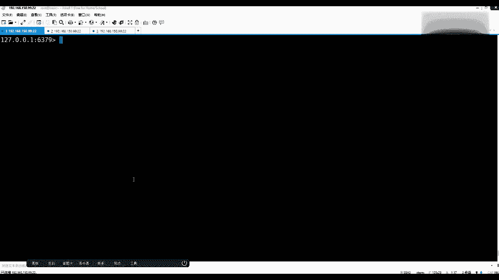

就是它也有一个集合操作。这个操作的命令当时要注意一个点就是。啊，权重。和聚合。这。就是我就是求和求大求小。Okay。O当这个还能轻松中。当这个能理解之后。😊。

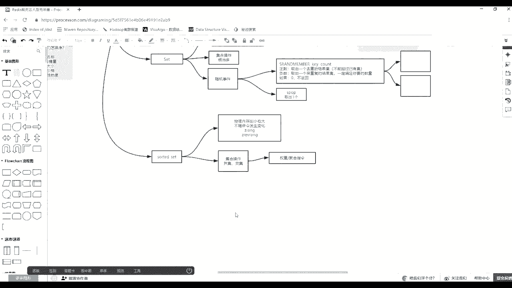