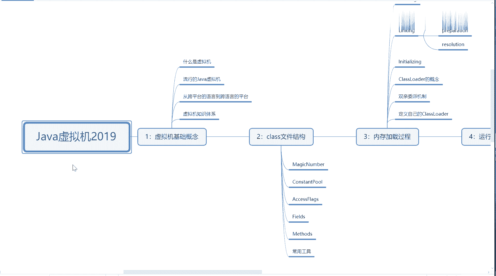
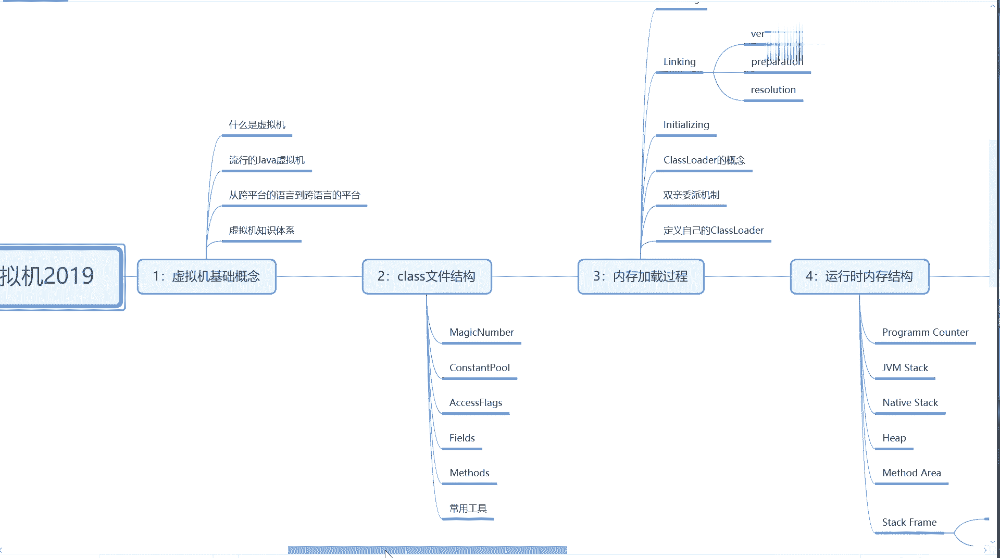
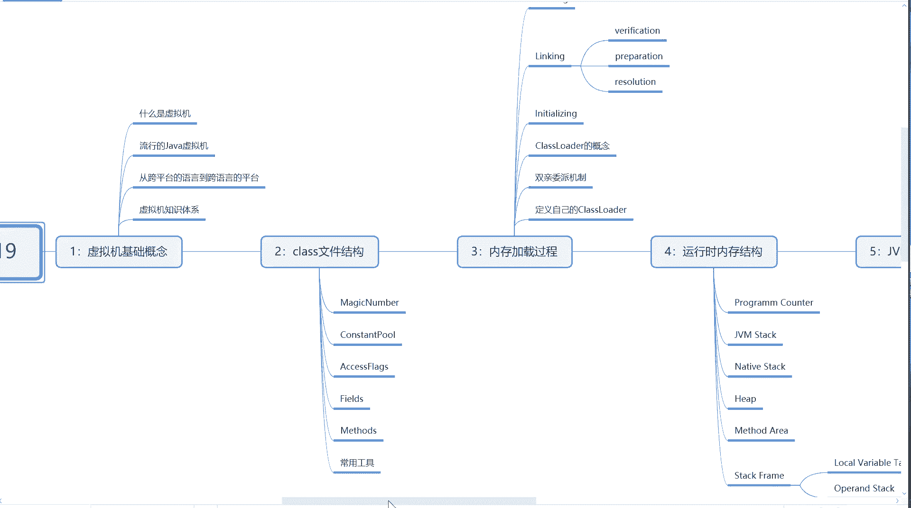
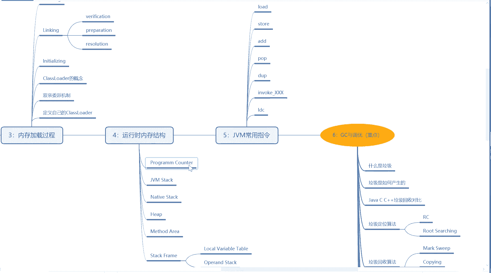
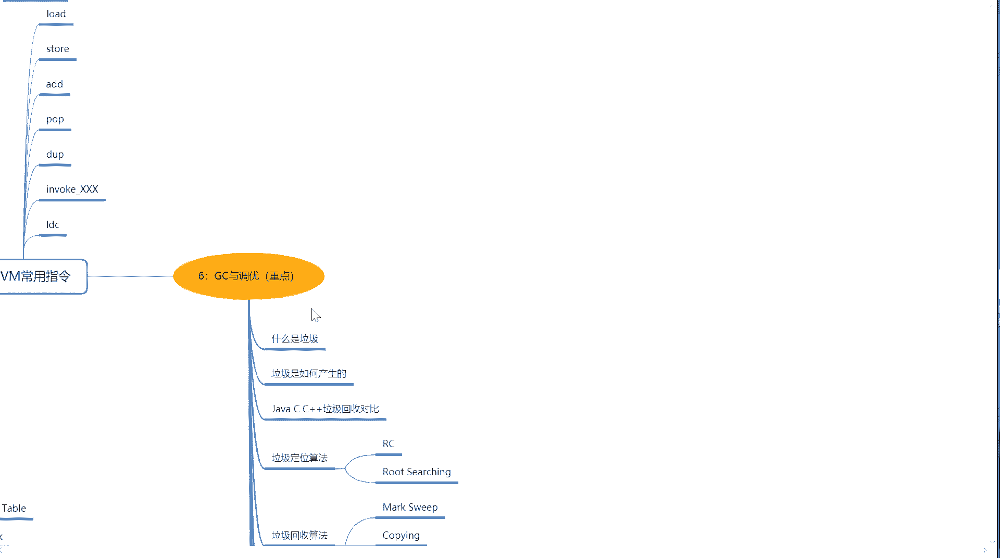
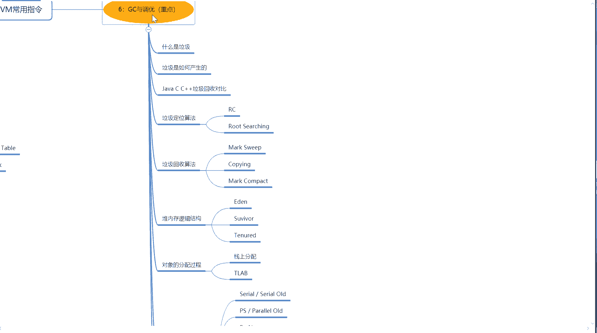
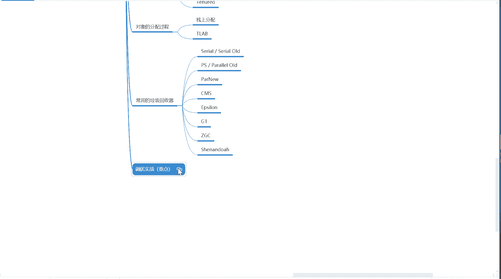
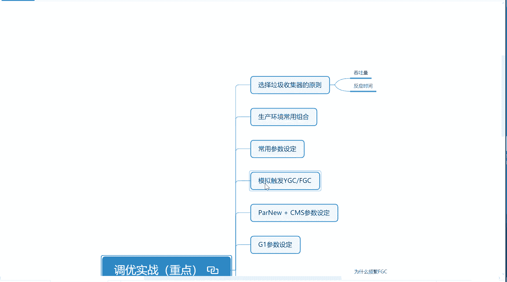
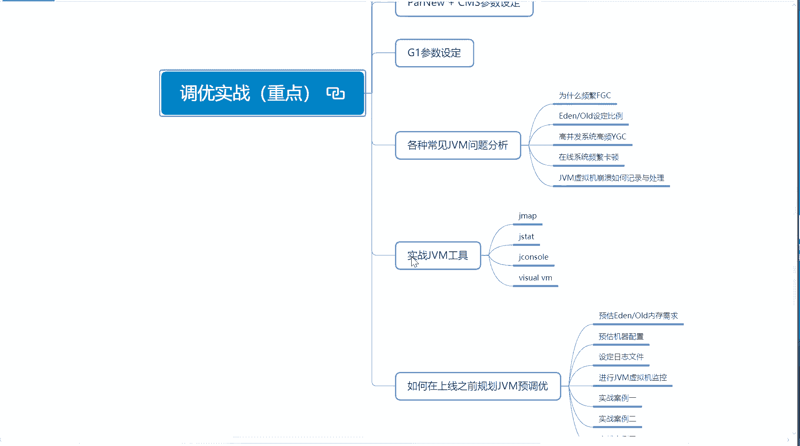
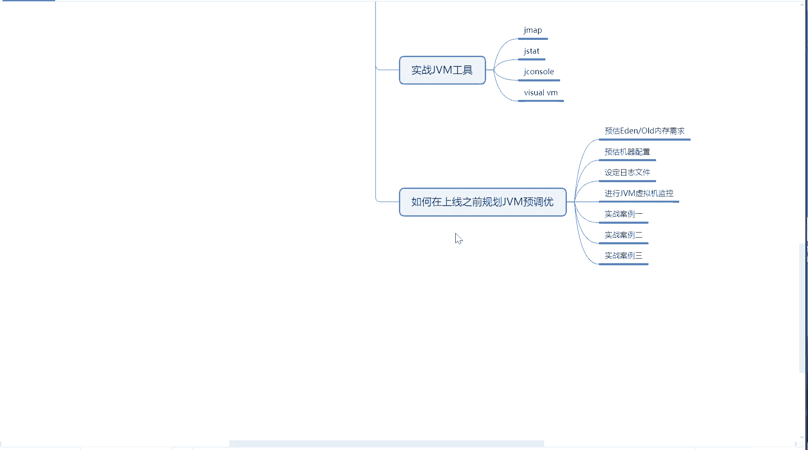

# 系列 3：P106：【JVM】课程规划 - 马士兵_马小雨 - BV1zh411H79h

好。我们开始上今天的课啊。OK今天呢是我们JVM的第一节课。首先我来给大家介绍一下呢，整体的课程我们里边包括什么内容，大概呢要上多长时间？OK看这里。

这是规划中的2019年咱们要上的java虚拟机中的内容，内容以后还会更新，只是说现在的。

基本上呢有这么几个大类。第一个呢虚拟机的基础的概念，还有class文件结构。我们今天啊。

尝试就要把第一和第二全都讲完。

第31个呢是内存的加载过程，运行时的内存结构。

第4个，然后第五个呢，JVM的采用的指令。重点是GC和调优GC和调U里面呢会有一大堆的内容，有一些。

预习的东西我已经发下去了。嗯，咱们班主任呢也也应该发给你了，就是我10月16号讲过一节公开课，就是针对于GC和要调优的预习的内容。

调热时战是重点中的重点，这里面的内容呢。

也会有好多啊垃圾收理器怎么选择参数，怎么设置，各种JVM的问题怎么分析？实战GVM的工具啊，还有呢上线之前怎么去进行预规预预预调优预规划。

嗯。由于JYM支识体系呢。是原来都是零0星星的啊来讲。从今天开始呢，我们是把它进行一个系统化的讲解。呃，这个也是一个预估的时间，预估应该也是6次课。不过从以前的咱们的经验来看的话，可能6次课没准讲不完。

讲不完我们就多讲，我们以讲完为基础。不是说以固定的时间啊为为为为导向啊，这点呃不知道大家能不能理解。呃，现在线线下面授的时候，这个时间就是固定的，两天你必两天必须讲完，你不讲完，你就嗯只能看内容。

但是我觉得线上有这么一点好处，就是我们到讲不完的时候，没事，我们可以加课。多建成高炳凡本来预计也是6次课左右，结果实例当中讲了9次G的知识体系，我希望讲6次讲完。如果讲不完，我就加课。如果讲不完。

还有一种就是有一些非常简单的，我需要大家提前做预习。做预习的时候，每堂课之前我会通知大家的啊，不用担心。好，今天呢我们讲两个内容啊，第一个呢是入门，第二个呢是class的文件结构。

