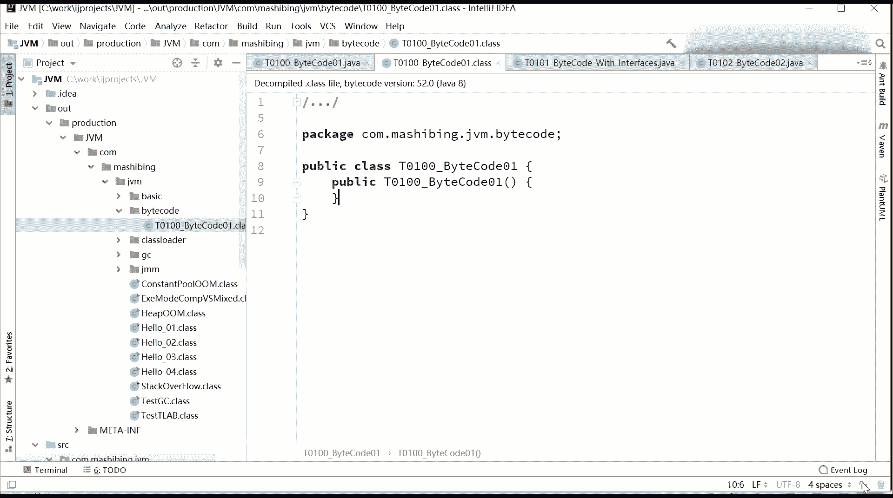
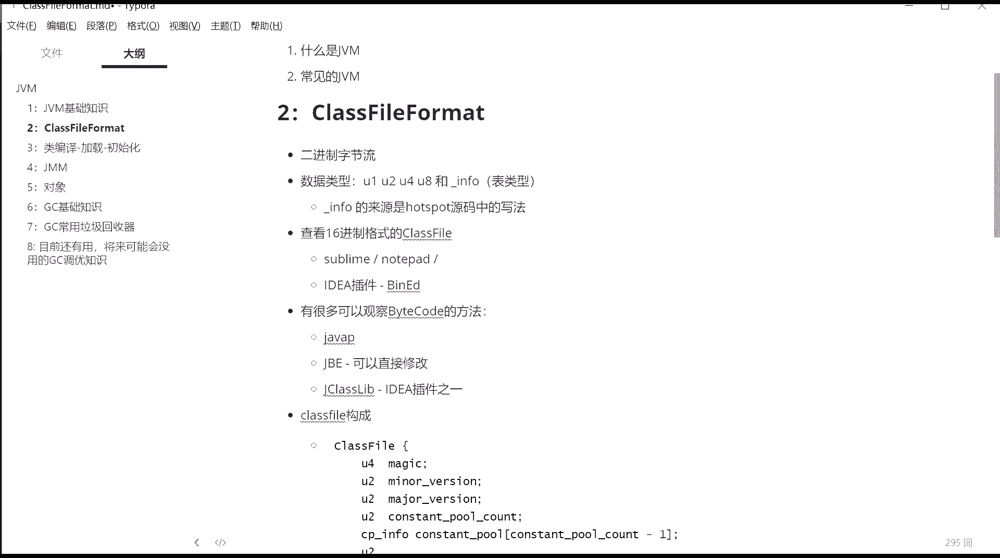
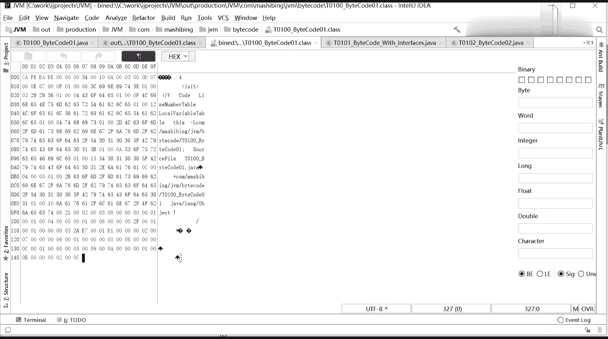

# 系列 3：P109：【JVM】Class文件格式 - 马士兵_马小雨 - BV1zh411H79h

好，同学们，我们继续啊，我们来讲第二章内容。来点那个classified format。嗯，刚刚才你看到了这这个整个的呃招勋集来说呢，应该是以class文件为核心。这class文件到底是个什么东西啊？

今天我们来分析这东西。我先跟大家要聊的是什么？就是其实我们完全是可以不用分析这东西的。好吧，我说一下啊呃目前在。公司面试的时候基本也不太会面到这方面内容设计。还还没我还没有听说过嗯。

咱们自己同学去面试的时候，说问你这个class文件里面包括哪些东西是吧？这常量池里头有哪些常用的这种常量池结构等等。目前还没有人问到啊呃。因此呢。所以大家学这个东西呢，你当成一个兴趣来学，听懂了吧？

我本人是比较有兴趣的啊，不知道你们的兴趣会什么样子。很多人学东西呢总是有一个。有一个什么公益性特别强，就觉得我学完这东西之后，到底他值多少钱，我就得立马涨多少薪水。你别这样子。

你说读原码读完了之后能让你涨多少薪水，不一定的。不过呢你天天润色这些比较优美的，比较深入的东西的时候，你的思路会变得越来越清晰，变得越来越深入。读那个比较漂亮文章的时候。

你以后写的文章会耳濡目染的变得越来越漂亮。这东西呢是对你自己的兴趣和内力的一个提升过程。得当成兴趣来学好不好？Class cloud format。呃，你学了尤其你学这东西之后呢。

有很多那种你原来不明白的事情呢，你会变得非常的透彻和明白。所以我觉得真的有必要呢跟大家来介绍这方面的东西啊。好，废话不多说，我们来开始。你先说这个克拉文件到底是个什么东东啊，看这里。呃。

这class文件不就是你编译完成之后的一个class吗？你看这个。世计当中的例子啊。这个英泰丽这不会也出问题吧，what啊没有。太过分了。嗯。呃。

我呢你你你们下去啊一定要写这种特别简单简单的小程序来进行测试。大家需要注意的是呢。怎么讲，这虚拟机呢，其实写的程序呢反而变得越来越简单了。呃，原因是什么呢？这个程序比较简单的时候呢。

你更容易观察它的classclass间的结构。大家看这个小程序啊，这个小程序是最简单的小程序。你见过这么简单的小程序吗？啊，平时练习的时候有这么简单的小程序可练哇，那爽死了是吧嗯。好的。

小程序我已经写完了，你不要里为里边里边还有什么东西没有了。public class T0100这东西是我用来排序的，你不用去看白扣01。我们来看看二进二进制字解码的第一个小版本是什么样子哈。运行一波嗯。

没有面方法啊，不用运行。好，今天我们要讲的是什么呢？说这东西编译完了之后，它编译完成之后呢，会是一个class文件。我相信这不用我说。这就是。这个class文件。

当然你如果在inla里面双击着class拉文件，它会自动帮你进行反编译。你看这个反编译版本和我们编译的版本就已经有区别了。看到了吗？就是我们原来的原原原文件的版本是啥样子，就是这样子的。

反编译出来是一个什么样的东西啊，它会自动的帮你加了个构造方法，发现没有？就是原来咱们在讲。嗯。java的这种这种面向对象的时候，就跟大家说过一个原则，就是一个class里面，如果你没有写过造方法。

默认会给你添加一个。好，这为什么默认就会给你添加一个？默认的无餐构造哎，给你加进来了。与此同时，还有一个。注释啊注释不管它，这是它source code的decode出呃呃呃反编译出来的，这个不管它啊。

decomp。那后。我们现在要整的是什么？就是这个class拉文件打开。是之后它里边是一个什么样的内容？其实任何文件打开里边全是010101。我这么说，大家应该没有任何意见是吧？就任何的文件啊。

不管你是PND也好，GPG也好，太TXT也好，AVI也好，打开之后呢，其实内部全是010101。好，这个class文件。如果我们用1个16进制的编辑器来打开。当你看里边的内容的时候，哎。

你会发现呢是这么一个东西。

那么这个工具呢叫slime。Sublime。

不知道大家有没有听说过啊。我我呢。在给大家做笔记里头，把这个工具的名字呢。来利水来了啊。好，这个工具的名字是什么呢？它叫做sline啊，文本编辑器。

你可以用nad也可以。可以用他们的打开来之后，看他们的16进制。好，当你当我把刚才那个文件，也就是T0100backcle01点class那个文件用sublam打开的时候，你会看到的哎。

就是这样的一个视图了。开啡baby0000003400100A00。好，这就是我们那个class文件啊，今天我们最主要的任务就是把这东西读懂。啊，没事，你每天早上要背诵，别人合尚起来会念经。哎。

你每天早上起来你就念这个是吧？DS cafebaby啊，ze，0，0，0，0，0，three， four。😊。

嗯。classs文件是什么呢？它是一个二进制的字节流。在这个class文件里面呢，它只有这么几种类型，U1U2U4U8和infer。其实这个类型也是我们逻辑上分的。二进制子节流没有什么类型。

只有一种就是不是零，就是一。16进制的这种class file有好几种查看方式啊。第一种呢就是我刚才给你大家解释的，你可以用sublime no pad来查看。还有一个呢，你可以下载一个idea的插件。

这个插件呢叫 binaryary啊。indexban editor，这叫hax editorban editor我查一下这插件呢，我已经下载下来了。File settings。

insstoreled啊叫BNN editor，叫banary hextmo editor。hxtcimo的意思呢是16进制。banary呢就二进制，二进制十6进制的一个editor一个编辑器。呃。

这个16进制的这种这种插件呢有很多啊，我是找了这么一个，你也可以用其他的，对就不一定非得用老师这个，好吧。那么当你安装了这个插件之后呢，会有。菜单上呢会多这么一项，哪项呢？

就是fill菜单下面有一个叫open earth binary，就把打开当成二进制的文件来打开。点击之后，它会让你选你到底打开哪个文件，我们打开T0000bycode01点class这个文件打开。

等你打开这个文件之后，好。这个视图就变成了酱子啊，0S咖啡baby0000343434。呃，这中间这块呢是它的一个翻译尝试，把它翻译成字符字符文件。这个有的是能够翻译成字符的啊，有的是翻译不了的。

所以呢有部分你能看到部分字符，其他翻译不了的就看到的都是问号啊。那这个。公寓有一个好处呢，目前我们看到的是hax是16进制，我们可以选啊haxM你可以选成什么呢？二进制。咱们看二进制的时候。

这才是真真正正本质上的东西。011000100等等等等啊。其实我们整个克拉斯文件就是这么就是就是这么一东西啊。那好，当然你也可以看八进制啊，octo八进制嗯，也可以看什么呢？十进制deimmal。嗯。

一般的大家都看这个ht，就是16进制。好，刚才这里讲的这一小段，有没有同学有疑问的，有没有？

讲了个工具。就讲到今天我我们要认识这东西啊，没问题吧。