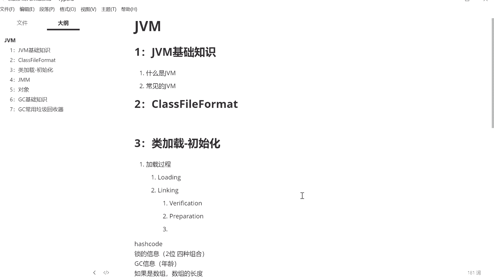
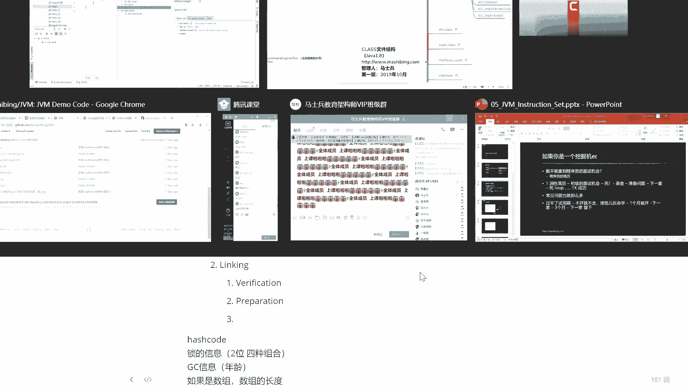
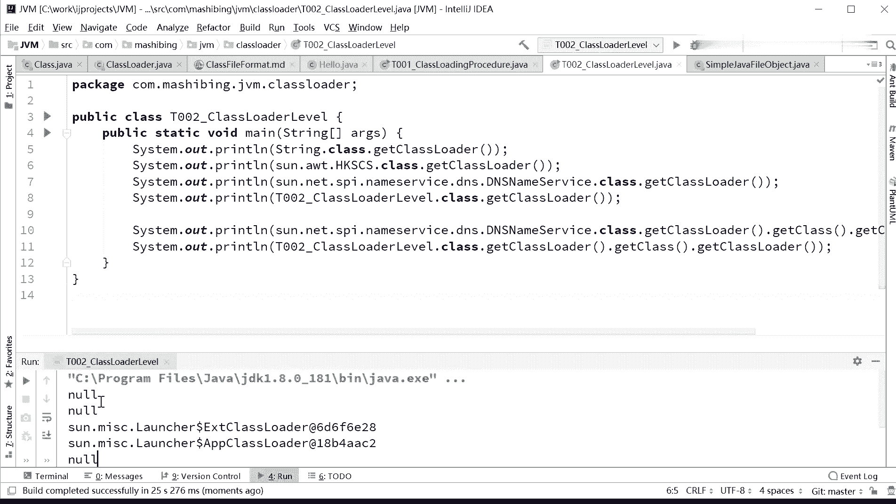
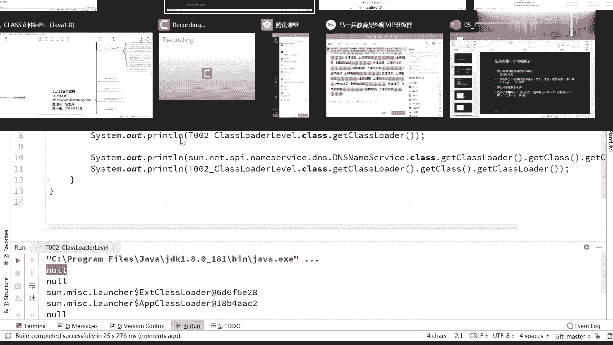
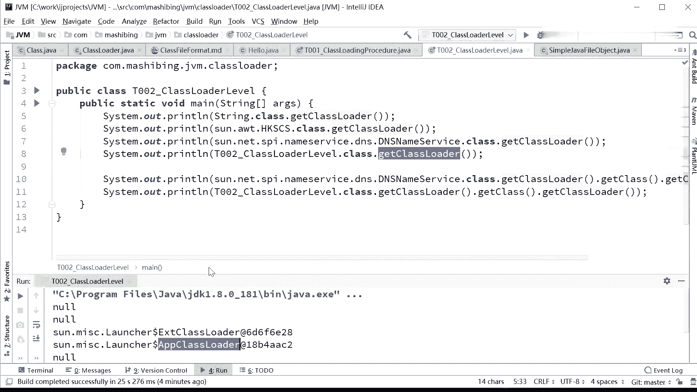
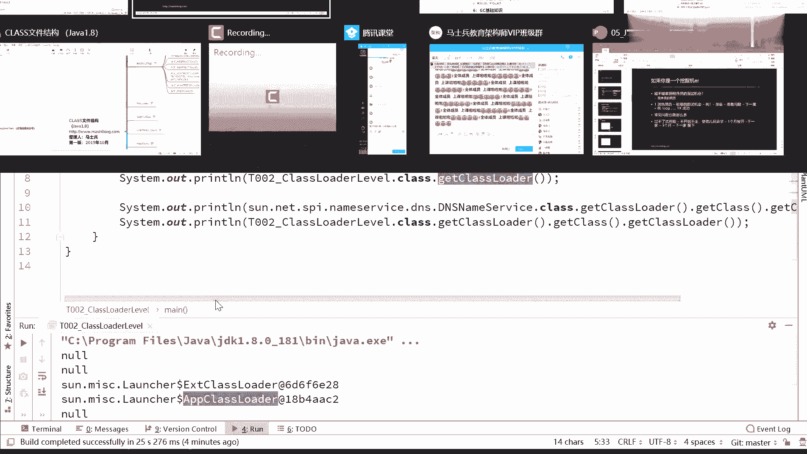

# 系列 3：P115：【JVM】类加载器 - 马士兵_马小雨 - BV1zh411H79h

那么今天呢我们讲新的内容，新内容呢是class的 loading linking lighting。那么这部分内容讲的是什么呢？就是一个class文件呢，是怎么从硬盘上到内存里头。并且呢开始准备执行了。

OK看这里。这个有一个class文店，它默默的呢躺在了硬盘上。需要到一个什经过一个什么样的过程，才能进入到内存里，并且准备好呢。认真看有这么几个步骤，有三大步，第一大步叫loading。

第二大步叫linking。第三大步呢叫initializing。三大步。在这三大步里面，第二步又分成三小步，第一小步呢叫verification，第二个呢叫preparation。

第三个叫resolution。嗯。笔记。新建一个笔记啊。我上次记得笔记好像不小心没存，啊，就特别讨厌。博上的笔记呢也也也没有什么太多的内容了。上记的笔记没有存，I'm sorry，太过分了啊。嗯。你给。

好，现在今天我们来讲这个那编译加载初始化啊。编译这个问题他说加载和初始化啊。呃。嗯。加载呢。因为呢加载过程呢是分成。这么几步，第一二呢叫loading。好，第二步叫linking。

linking呢又分成三小步，第一步呢叫verification。呃，第二步叫 preparation。

那么第三步呢叫。呃，第三步叫叫叫叫叫叫啥来着？

对不起啊，第二步应该叫做。第三个叫热字啊解析。好，那么第三大步呢。initializing。我们今天把这个过程呢呃尝试给大家讲清楚，这过程内容还是比较多的。今天讲完的话，我们下节课接着讲。

首先我们来看这个loading的过程，先给大家解释一下每一个步呢大概是什么意思啊，loading是什么意思呢？loading就是把一个class文件漏到内存。

它本来是在class文件上的一个一个的二进制，一个一个字节，把它装到内存里去。装内存里去。呃，装完之后呢。linking的过程，这三小步分别代表什么？verification是校验。

校验的意思是你你给我装进来的这个。这个class符不符合我class文件的标准？假如你装进来的前面四个字节，它不是这个cafeba。在这步的时候基本上就被锯拒掉了。O。这小步叫preparation。

这步很重要，这步是可以说是面试题有可能会被问到的。就这步呢是它是把class文件的静态变量附默认值接这一点。交负默认制。不是付初值。

比如说你静态文件里面有一个写的int I staticint I等于8。注意在这一步的时候，这个班并不是直接在这里把艾值复成8。我后面给大家举例子，而是先复成0付默认值。

接下来就行resolution resolution的意思是。这个class文件里面的常量池里面用到的那些。符号引用要给它转换成为直接的那个内存地址吧，可以直接这么认为。

就是直接你能够访问到的那部分的内容。做一步呢叫做initializing。 initialitializing的意思是静态变量的负值，这个时候才复为初始值。才调用静态代码块啊。先大致记这么一个流程。

后面我们一步一步来细细的分析。好，我们首先来看这个类加载器的内容啊。首先第一点需要告诉大家的是JVM呢。它本身有一个类加载器的层次，这个类加载器就是一个普通的class。这边M有一个类加载器的层次。

分别呢来加载不同的class。是我说这M里面所有的class都是被类加载器。给加载到内存的。那么这个类加载器简单说我们可以。把它叫做class load。好，看这里。嗯。嗯。

找到我们class load的部分。什么。😔，这class library干掉啊。嗯ん。第一个呢是我们整体的一个小例子，我们先。呃，不看整体的小例子啊，我们先看第二个小例子。

那么这个小例子呢来告诉大家呢，什么叫做class load。呃，我觉得多多少少咱们同学们稍微有一点点基础，应该都会用的。用过class load。不管你是故意用的，还是说超编代码用起来的。呃。

每一个class就是在我们的呃java虚拟机里面到内存里面的任何一个class都是被一个class loader load到内存的。那么这这个class loader呢。其实就是。顶级呢有一个副类啊。

这个副类呢就叫class loader，它是一个abstract class抽象类。所以呃。就相当于这个类是被谁领到内存里面去的啊，被谁领进去的呢？它一定是class loader这个类的子类。O。

所以这是他的顶顶级负累。当然。如果你想知道你这个class是被哪个class loader漏到内存的，其实很简单。就这么来写就OK了。比如说str这个类啊。

我想知道它是被哪个class loader捞到内存的，你就这么写stream点class拿到str class那个对象，然后调用它的get class load。其实说到这里呢。

关于class类的对象这件事啊。呃，我我我先从大面上跟大家讲这个class类的对象到底是一个什么样的东西。呃，一个class文件，这是那个sp的class文件。这个平时躺在硬盘上啊。

里边什么cafeba，就上节课里面我我们讲的那些内容，这个内容被漏到内存之后，内存里面到底发生了什么呢？内存里面呢实际上它创建了2块内容。别真听一个class被捞到内存之后，内存里面实际上有2块内容。

第一块内容是把这块的二进制的东西肯定是扔到了内存里。好，他占了一块儿。第2块内容指的是什么？与此同时，生成了class类的。class类的一个对象。好，这个class类对象指向了这块内容。啊。

不知道我说清楚没有，看大家能不能理解这个这这个小图。我再说一遍，当任何一个class漏到内存之后，实际上它生成了2块内容。第一块内容呢是这个二进制的这块东西确实被漏到内存，放到了内存的一块区域。

可以原封不动的扔进去。第二个呢，它生成了一个class类的对象。通过以后其他的那些我们自己写的对象。去访问这个对象，通过这个对象去访问。class类的文件。所以生成一个class类的对象。

这个class类对象是指向了这块内容。好，后这么讲，同学能能理解吗？class对象也是在堆中吗？class的对象。是在。嗯。class对象这个对象有可能是在met space，这我得查一下啊。

就这个部分。应该是在mettter space里面啊，mate space。嗯ん。当然一般也不会有人聊的这么细了啊，不是站不是站，注意这是克拉斯雷的对象，他不会不会是在站里面啊，t catch。

matetter space里面好吧，如果有人这么问的话，你回答mate space一定不会有问题。class对象也是new出来的吗？呃。它是不是new出来的。

它是hospot里面CI加代码load的过load的过程之中给弄出来的，它未必是调用了我们new那个命令，好吧。投资的mettter不是8之后才有的吗？对啊，咱们讲的是8呀。嗯。

内存分区这块咱们不是还没讲到吗？既然有同学问到，我就提前跟大家说一声内存分区的。呃，像存常量存classus的各种各样的信息的时候，实际上呢它这块内容啊逻辑上叫message area。

逻辑上叫这个叫mesger叫方法区。但1。8之前这个方法区的实现落地落地在什么地方呢？它叫做permanent generation。永久带呃，1。8之后呢叫met space。

所以这2块呢说的都是方法区，只不过呢一点。发之前叫perman generation。然后。一点半之后呢，就 meta space。这几个概念这么来区分的啊。

混制小龙class对象可以认为大class的实力吗？不是。你哦你也可以这么认为，但它是一个单例，好吧，就那一个就代表着那个class的唯一唯一的一部分啊就行了。嗯，今你们来分析一下。不知道大家。嗯。

以前的英国用过反射的同学应该会知道，呃，我们可以通过这个class这个对象呢去拿它的什么呃get declared methods，它到底拥有哪些个方法去拿它里面的方法，甚至呢我还可以通方法呢进行调用。

当然你分析一下，就执行这个的过程之中执行反射的过程之中，它一定是那些个方法的信息是存在了这个对象里。然后真正让这个方法执行的时候，它一定得去找什么呀？找那个class类文件里面的那些二进制码。

把它翻译成为java指令，一步一步来运行。所以。这个class类呢，平时我们说我们我们没讲到这么细的时候，就跟大家说哦，我我我们有一个class类的对象，代表着str。但讲到这里的时候。

我们知道class类的这个二进制的时候，你就应该知道实际上内存里面是有这么一个对象。但是真正访代表的是哪块内容呢？这这面块内容，只不过我们不能直接去访问这个二进制的东西。这样的话我们得自己解析。

所以我们通过一个class类的对象，通过他他帮我们解析好来去再去访问。啊，这个过程不知道我说清楚没有啊。好，我们不说，来看这个啊，继续看呃。因为class呢，它的class loader是谁？

可以通过这样的方式啊，str点 class。当然这个写法也可以写成什么呀？str点啊，get class就是你一个str对象的get class get class方法。

然后再拿它的get class load。他的class order是谁呢？我们来看看。run一下。关掉一部分程序啊。今天估计要拖堂了。

嗯。

OK我们看第一行啊，第一行显示的是空值。好，这里面呢就要跟大家讲这个类加载器的一个层次问题。呃，作为类加载类加载器来讲，它是这么一个加载过程。这个加载过程呢是分成不同的层次来加载。

不同的类加载器负责加载不同的class。最顶层的叫不tract。其实解需点就是最最开始的那个类加载器叫不str。它负责加载什么内容呢？负责加载。GDK里面最核心的那些个炸文件里面内容。

比如说run time点炸，咱们平时所说的这个sp screenring点 class呀，object点 class呀，都是位于这个炸文件里面，还有chse点 jar等等核心类。

这是由CI加实现的一个类加载器。所以什么时候你说我调用该 class loader，拿到这个类加载器的最后的结果是一个空值的时候，代表的你已经到了最顶层的这个类加载器。

好在下面是一个叫extension，叫EXT类的加载器扩展类。它负责加载什么呢？加载那些扩展包里面的那些个文件。各种各样的文件，这些扩展包在哪儿呢？你打开你的JDK的安装目录，你会找到有一个包。

一个目录叫EXT下面的那些炸文件，由它来加载。还有一个是我们自己平时类用到的类加载器，你么看是谁呢？叫做application APP类加载器。它是用来加载class pass指定的内容。

我们自己的class文件都是位于class pass里面，这个写java的人应该都知道它是由谁来加载，由他来加载。好，还有我们可以自定义的加载器。今天我给你讲到。自定义类加载器。你你加载你自定义的。

你你想加载哪的，你就加载哪的，就看你怎么写。认识了这个类加载器层次之后，我们再来看这个小程序。St class是由谁来加载的呢？OK是有我们的，我刚才说过。最顶级的是吧，它是空指。

说明是我们的butstr。第二个呢是你不用你别管这类是啥名字啊，实际上是那个那个呃我们核心内库里面某一个包里面的一个类，我随便写了一个。当你拿它的get class load的时候，它依然是空置。

为什么是空值呢？因为。它也是被我们的不str类加在器加载的。下面这个类啊这个3点net SPI name service这个类呢这个类是位于你自己去查它是位于什么呢？它是位于EXT那个目录下面。

里面的某一个炸文件里面，当你调用它的时候，get class load的时候，你就会发现它的class load是谁呢？来，看下面叫做EXT class loader。

Launcher下面的EXT class loader。所以它的那加载器就变成它了。那么你看啊，我们现在自己的这个类P002class load level点儿class，这是我们自己写的对吧？

它是由谁加载的？ge class load是由。APP class loader。所以回过头来再看这个图，我不知道大家能不能看明白了，就是有一些核心的内库。是被我们的btract就控制来加载的。

凡是位于EXT。这目录下面的里面的炸文件，这些个类被谁加载呢？被EXTclass load来加载。我们自己定义的这些自己程序里写的这些是被application class load来加载。

当然我们还现在还没有牵扯到自定义class load，讲到的时候再说。好，讲到这里，关于这张图，有没有同学有疑问的，有疑问你提没有问题，你的给老师扣个一，我你继续。对。Yeah。O。好。我们继续啊。

一会我们再来讲这个加载过程啊，加载过程叫双亲尾派。

很多同学是听过这个词的，应该。在这里呢有一个小问题啊，有不少的那个文章也好和嗯。不少的文章呃。还有呢就不少的这种这种书啊，我不知道为什么，每次讲到这个类加载器继成这个关系的时候呢。

总总会把这个图给抛出来。总要把这个图给抛出来，这个图呢很容易让人产生一个误解，你知道吗？我们说呀类加载器的这个层次是这样的，注意。内加载器的层次呢，我说。这个类加载器它的负类加载器。

往上叫APPAPP的附加载器叫extension ，extension的附加载器叫 strap。可是我们谈到这个负这个词儿的时候，是不是很容易和继承混了呀？

所以有不少小同学就会认为他的父亲是不是就是说在类的层次上，他是不是从application plus loader继承，他是不是继承于extenion class load，他是不是继承于不是所以。

千万千万别混了。有不少同学是一个混淆的一个关系。啊，这里并不是一个继承关系，好吧。所以尤其是有些那个呃文章和和和书啊。二话不说，讲完那部分之后呢，马上把这个图抛出来。其实这个图没有没有什么用的啊。

这个图讲的是什么？就是说这个class load在语法上是随时从谁继承的这跟刚才那个图没有半分钱，没有半毛钱关系。所以当你看这个图，然后脑子里记着这负这个词儿，又和上面图一混淆。

你就不容易认清楚class load了。我再说一遍，这个图你完全可以忘掉，不要去看它。这个呢只是在语法上，在语法上的一个关系。就是我们写publicap class load。

它的副类是extends从谁继承？从UIL class loader继成。UIL class load从seecure class load继成。

seecre class load从class load继承，也就是这么回事。是以分子在语法上的一个关系。但是真正的我们用它来去漏的呃class文件的时候。是说我如果找不着。

这个类是不是我我我我我有没有把它加载过，我我委托给谁去找啊，委托给我的附加载器，注意附加载器不是继承关系。

