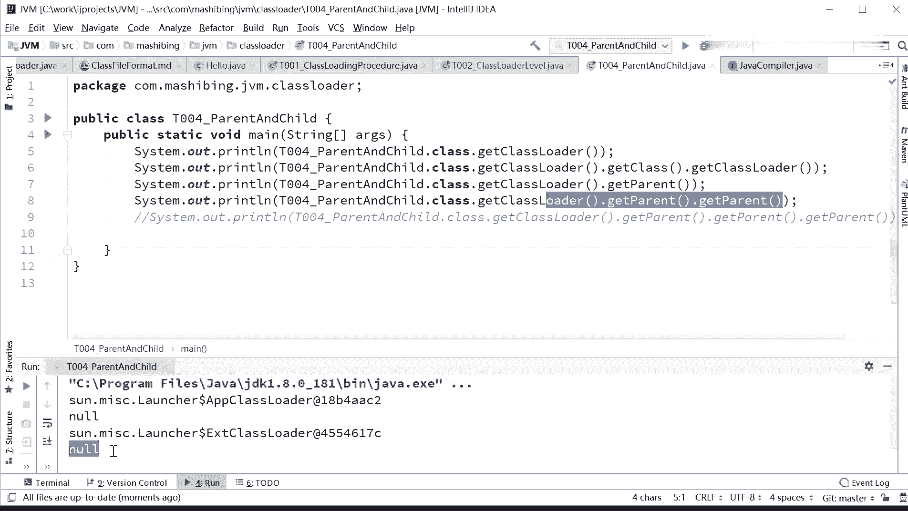

# 系列 3：P117：【JVM】父加载器 - 马士兵_马小雨 - BV1zh411H79h

好，双击纬派双击纬派呢附加载器注意千万注意这个附加载器不是类加载器的加载器，千万别这么认为类加载器的加载器。你就是APP的，它也是。putstr的它它它也是空值。那么EEEXT的它也是空值。

但是APP和EXT之间还存在一个父子关系。所以附加载器不要和其他那种语法上的东西混一起。负加载器并不是类加载器类加载器，也不是类加载器的负类加载器。我要把这个跟大家写清楚，就特别容易混淆的地儿啊。嗯。

He以。😊，い。附加载器不是累的。类加载器的加载器啊。😊，也不是。累加载气的。负类加载器，这是无法问题啊。副加载器如果从源码上来理解。源码理解附加载器，很简单。

这个class的对象里边有一成员变量叫parent。这parent什么类型的？class loader类型。我们所说的附制加载器指的是这个parent对象。这个判他经指定为谁，他就是谁。我认可指定。

甚至可以指定我自己定义的那个可以的，没问题啊。呃。我们来看这个小丽的程序。

啊，大家看这里啊。

刚才我讲了这些概念之后呢，我们来看这段代码，看大家能不能看得懂。然后呢，你理解一下到底什么意思。看这里。T004，然后拍完点che点class给class loader好。

告诉我一下这个class loader是谁。在APP没错。那接下来呢他get到class load之后，再geclassge class loader是谁？

控制没错。好，下面这个get parent ，get parent啊，同学们就class logo里面有一方法叫get parent。注意，这是它的附加载器，它附加载器是谁啊？啊，EXT。

ge parent的ge parent。

又是谁呢？

啊，那get parent的get parent再get parent。

我把它住掉了，因为你想想看一个空指针在盖pyon的报啥错。控制人错嘛嗯。所以你看这个结果。空制空值。He。

嗯。😊，运行的有问题啊，运行的刚才那条程序。

重新跑。他的父亲是APP嗯，不是不是他父亲，他的累加载器APP雷加载器的。类加载器的加载器控制类加载器的附加载器。EXTclass loaderEXT的class load的附加载器。

控制。