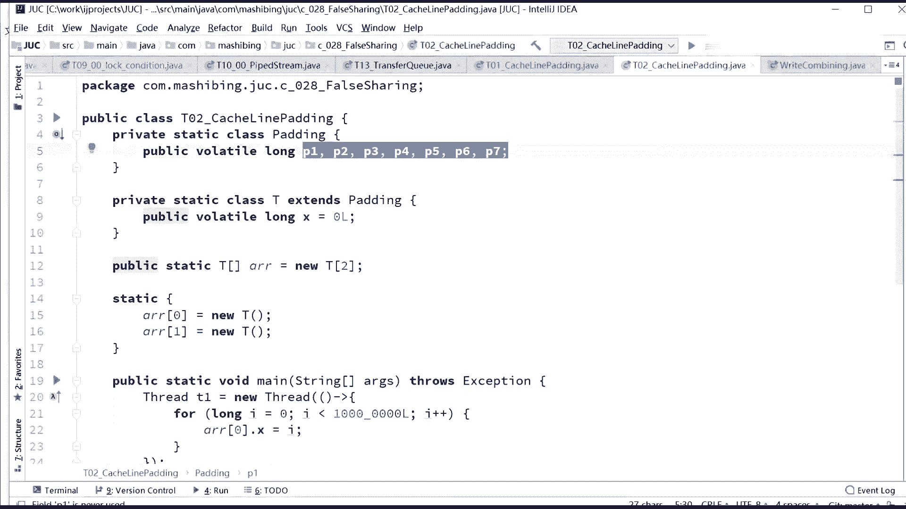
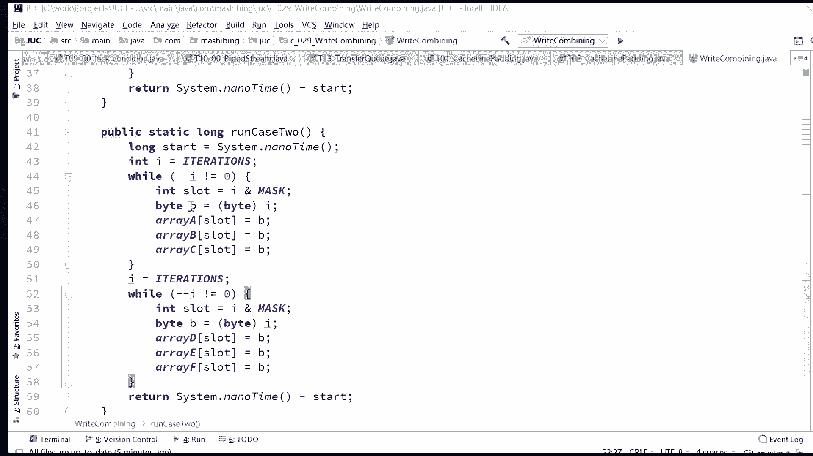

# 系列 3：P130：【JVM】乱序问题 - 马士兵_马小雨 - BV1zh411H79h

O。这是呃硬件的数据一致性。那么讲到这儿呢，我们就聊完了。下面我们来看这个乱序问题。执行执行顺序的问题。好，听我说执行顺序这件事儿啊，就特别恶心了。执行顺序这件事呢，很多资料呢讲的也不全。

也也也也也细节也特别多。好多呢把各种的概念混在一起。这么来讲，所以很多文章你可能看了半天，看不太明白。啊，没有关系，我今天尝试着讲给大家听，尝试给大家讲明白，好吧。当然我要讲不明白的话呢。

大家就怼我就行了，好吧。好，我们继续继续看啊。😊，好，现在的CPU为了提高效率。他呢还会有各种各样的一些个优化。那么这个优化呢就叫做CPU的乱续执行。这个乱序执行怎么理解呢？就是说。当我们CPU啊。

由于它速度非常快，我们从内存里面读进来一些指令的时候。当执行这个指令的时候，另外的指令可以同时运行。这句话是什么意思？好。看这里。嗯，乱续之行这件事呢，我们这么来理解。认真看。

比如说我们CPU啊执行了我我我一次性从内存里面啊，这是我们内存。然后这是我们的CPU。CPU呢从内存里面读了5条指令，读进来了。读进来之后，他这条指令呢，比方说他进行啊算第一条指令的时候，1234。

算第一条指令的时候，第一条指令要干嘛呢？第一条指令要去内存里面的某个位置读一个数据。这个事很正常是吧？这条指令需要读一个数据。好，我们刚才说过这个CPU比内存快多少啊？100倍起步好吧。至少是100倍。

也就是说，如果我在执行第一条指令的时候。需要等着这个数读回来，我才能进行下一条指令的运行。好，在这种情况下，我这个CPU啊。就得等100倍的时间在这等着。好，我讲到这儿，有没有同学有疑问的？

所以现在的CPU就干一件事儿，就说这个指令去读数据的这段期间。我就会分析下面的指令。如果下面的指令跟我们上面这个指令没有直接的依赖关系。行。我下面的指令先运行。就是等着你回来的这段期间。

我就可以直接运行下面指令。等什么时候哥们儿，你把这数读回来了，我再接着运行。好，关于这一点，不知道我讲清楚没有，就是CPU为了提高效率。他会打乱。原来的这种执行顺序。会在。一条。指令。执行过程中。

比如说。去内存。读数据。大概要这个呢要慢100倍。这个时候去同时执行。另一条指令。前提是。两条指令。没有依赖关系。那什么叫没有依赖关系啊？我这是很容易理解啊。你说第一条指令叫intA等于8。

第二条指令叫A加A加加，你说它肯定有关系吗？100%有关系，你得有了这个值才行。第第一条指令啊这个这个举的不是很明，比不是很明晰，要intA等于8intB等于A。那么想想看这两条指令有没有依赖关系啊？

有啊，你这个A的值必须得先有了，我B的值才能有啊。所以这种情况下，他就不会乱续。但是没有依赖关系的情况下，他就会乱续执行。那举个形象点的例子啊，也是咱们网上我查了很多资料啊，他有有一个举得还挺形象的。

就是如果CPU在干这么几就几个指令，洗水壶、烧开水、洗茶壶、洗茶杯、拿茶叶泡茶。那但是其实呢他真正执行的时候是可以按乱序执行的。什么意思呢？就是我洗水壶烧开水的过程，我就可以洗茶壶洗茶杯吗？

就像多线程一样。对，没错，其实类似于内部的多线程。所以这个时候好，他就是一个乱序执行。呃，有一些文章我认为写的不错的，我就在这里给大家呢总结下来了。假如你。自己学习的过程之中，也可以去参考这方面的文章。

我读了很多篇，我认为对大家来说有帮助的，我就给给大家列在这里啊。好了。呃，这个乱序执行呢呃读的这个乱序执行呢很容易理解啊，听我说。这个读过程的乱乱序这行很容易理解。就是我我我我去内存那边读个数据。

因为它比较慢，所以我同时执行其他的指令。但是有很多情况下，还有别的指令，你知道吧？就就特别好玩的啊。呃。其实这个写指令也有也有可能是乱续的，什么意思呢？就是CPU啊。

在L一这个缓存和CPU中间还有一个缓存叫WC bufferfferWC。嗯。WC版粉注意不是厕所啊。注意这不是厕所的概念。

WC叫rightite combiningright combiningright写。那么combining合并叫合并写。合并写这么一个概念，合并写是什么意思呢？合并写的意思就是说。写操作。也可以。

进行合并。合并写的意思就是说，当我们CPU。这么一个情况啊，这个比较复杂啊，尝试解释一下，你理解就可以。这是我们的CPU。他需要给某一个数做计算，然后把这个结果写回到我们的主存里，写回我们主存的时候。

大家知道呃，他有1个L2，然后有1个L1。好，当我们写回到主存的时候呢，CPU呢计算了这个结果之后，他首先会把结果写到。L一里面。但是假如L一里面没有这个值，就是说它缓存没有命中，这时候怎么办呢？

它会写到L2里面。但是他写完写到L2的这个过程中，由于L2的速度非常慢，所以在写的过程之中。假如这个数。后续的一些指令也改变了这个指，他就会把这些指令合并到一起。扔到一个合并缓存里。

做做一个最终的计算结果，扔到我们的L2里。所以这个叫合并写，就是把好多步合并成一步原因的产生，还是由于哥们儿，你这太慢了，我这算好几步，你这我还没没没没访问到你。所以这是一个合并写的机制。

关于合并写这件事儿，看看有没有同学有疑问的，就是读我也可以乱序写，我也可以进行合并。

好，那写合并是一个什么概念呢？我们来看一个小程序。

嗯，这个java也能模拟出来吗？可以，这个java也可以模拟出来。大家看这里啊，这个就有点抽象了。当然目前面试还没有人问到过这么深入的内容。呃。尝试讲一下。尝试讲一下啊，也是第一次讲，讲的不好。

大家多提意见啊，合并写。给大家一个参考文章，然后告诉大家是在C0JUC里面啊，JUC下面的029。Right。Combining。

combine合并rightite combining合并写合并写什么意思呢？关于这个合并写呢有一个细节，就我刚才说了嗯。这个CPU呢会把。会把其中的一些个指令呢写到一个合并写，就合并写缓存里面。

就WC bufferffer。但这个缓存啊它它它的这个缓存可以说它比L一还要高啊，就是还比L一还要高级。我们说L1L2，然后整个大家伙一块共享的L3，还有呢储存。好。

但是这个buffer啊实际上它比L一速度还要快。比那个L2速度还要快。所以这个buffer非常贵。这个buffer一般就只有4个位置。一般就只有4个位置。所以如果只有4个位置的话，大家你考虑一下。嗯。

假如说我们同时写东西的时候，我们只要说不小于这四个位置。sorry，就是比这四个位置要小，我只写一个或者只写两个，只写三个。我同时可以把这几个位置全写好，全写好之后一次性的更到L2里。好，这是一种方式。

那么还有一种方式啊，假如说我要写一次性的写多少个呢？呃写写六七个七八个。那么这时候我要分两次才能够把这个合并的内容写到L2里。好，我再重复一遍啊，这里头有点绕。这里有点绕啊，我再重复一遍。

就是说由于合并写的这个buffer，它的它的位置非常少，它非常的宝贵，只有4个位置。现在CPU就只有4个位置。那么当我们往里头更新一些内容的时候，假如说我一次性的写不超过4个，我只写三个，或只写两个。

只写一个。好，这个时候这个合并写的内容它满了啪叽就会扔到我们的L2里。好，这是速度比较快。所以第二种方式呢，就是说如果我们写的比较多的话，它会分成两下啊。第一下呢写满一次，写写过去。

第二下再写满一次再写过去。所以这就产生了一个比较好玩的问题啊，这么一个问题。就是说假如。我们在程序里头要是经过我要同时修改，比方说6个位置。我是把它分成三个一组块。还是说我6个位置同时写会更快。

就产生了这么一个疑问。三个一组分成三个一组，这三个一组呢就保证这三个同时修改的时候，我这一个一个buffer满了之后，啪机马上写下去。但是如果我要是6个合并到一起的话。

他就要内部进行一些个并发性的东西进行控制。就说我这三个满了才能写，然后必须等着另外三个等等。不知道我大概的意思讲清楚没有？我们就来做这个实验。我们来看这小实验怎么做的，这小实验特别好玩。

这是我原封不动的拿了一个老外的程序拿过来的。老外这方面我觉得他做的真的挺到位的，特别好玩。啊，你注意看啊，这个干了一件什么事呢？其实呢他就做了两个循环。第一个循环是这么干的。

这个循环啊是同时改了6个位置。而瑞ABCDEF同时改了6个位置。这个循环我要循环。第二个循环干了一件什么事呢？第二个循环干了这么一件事儿。第二个在第二个循环里边是。第一个循它分成了两个循环啊。

第一个循环呢改其中的三个位置。第二个循环呢，改另外三个位置。那么你们分析一下，如果说这几个位置都一样的情况下，哪个效率会更高？一个位置就一个字节。这自戏就一个字节。你看啊这两种写法。

我再我我们再来看一遍。对，是4个位置。但是他有可能啊这个I的值有可能占一个位置。有可能占一个位置。所以这个事呢做的实验呢也你看啊这个B的值，这个值有可能占个位置，知道吧？这个值有可能占一个位置。

所以呢它这里实验用的是三个位置啊，就特别好玩。就在于这里。你看第一个呢，它是用。一下更改6个。第二个呢，居然是分开三个，再分开三个。这两个效率按照正常的一个想法，一定是第一个效率更高吗？是吧，同学们。

来，我们来看一眼第一个效率呢，第一个叫run case one，第二个呢叫run case two。第二个还分开了，还重新有一个负值。怎么想也都是第一个效率更高。但是正是由于这个合并写的技术。

White。我喜欢的次数太多了吗？啊，你看第一个循环。第二个循环看到了吗？你你从这个位数上就能看出来。当然他是连连着循环了三次啊，来看平均的结果。第一个循问。

single loop就是只有一个循环的情况下。第二个是分开的循环，split split loop效率差一倍。好，就不演示完了。为什么效率会差一倍？因为这种写法充分利用了合并写技术。😀Ha ha。😊。

😀Okay。😊，这有点太葛了是吧？😊，分三个不会差3倍。分三个不会差三倍啊，节节攀升。你分三个的话，你因为合并写技术只有4个字节。大哥，你要分三个的话，你里边每次写两个。

那那他还等得等着另外两个的值过来，我才能够一次性的刷过去。说这是不对的啊。超过4个字节不能合并。哎，这个A问题提的很好啊，A这个问题提到关键点上了。没错没错啊，我刚才没讲透的，应该就这点。

就是说你看啊咱们上面是6个，上面是6个会发生什么情况呀？一次性循环是6个嘛，这6个里头会有4个填满这四个字节的缓存，然后填满了之后，剩下的还有两个嘛，对吧？这两个就得等着等到下一次循环的时候。

有另外两个填过来，或者有别的那个CPU往里头填两个啊，对不起啊，是别别别的计算值往里头填两个。所以这个就不如一次4个一次4个一次4个，一次4个销率更高。嗯，这么来。合并写就快了。对。

正是由于CPU呢有一个特别高速的缓存，它只有4个字节。所以如果我们能让四个字节，每次都填4个，每次都填4个，每次都填4个。那相比第一种就是一次循环填6个，6个会分成4个一个，4个一组。

两个就得等着另外下一次循环的两个会比这种方法效率更高一些。因为像下面这种方式，他每一次循环都要等下一次循环填满。而是我们分开两组的情况下，就是一次性的咔机就填满，直接走直接走，就跟铲铲的铲铲铲土似的。

你每次都是一铲子满全满了，直接往上一扔搞定。但这铲子不满，你就在那等着嘛，等下一铲子装满了之后，你才能往上走，效率就要比一次性的全满严丝合缝的效率要低。三个没有填满，因为这还有个B呢，这还有一个呢B。

