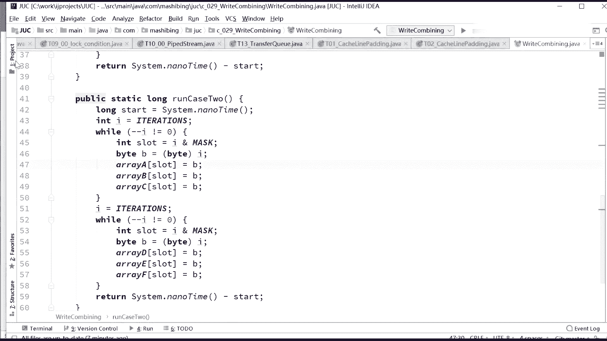
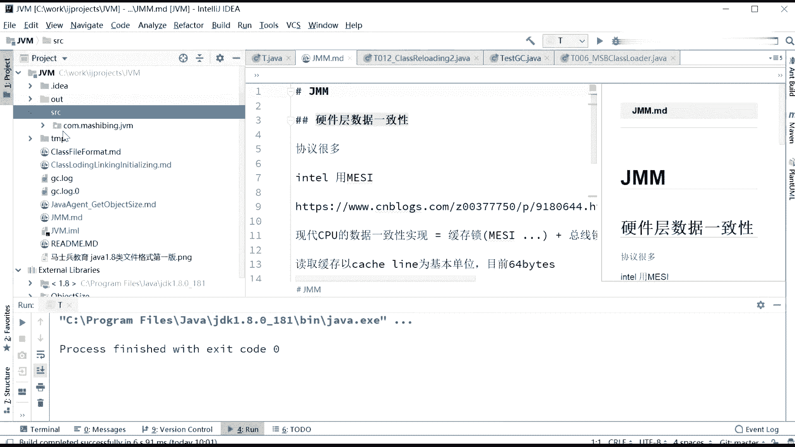
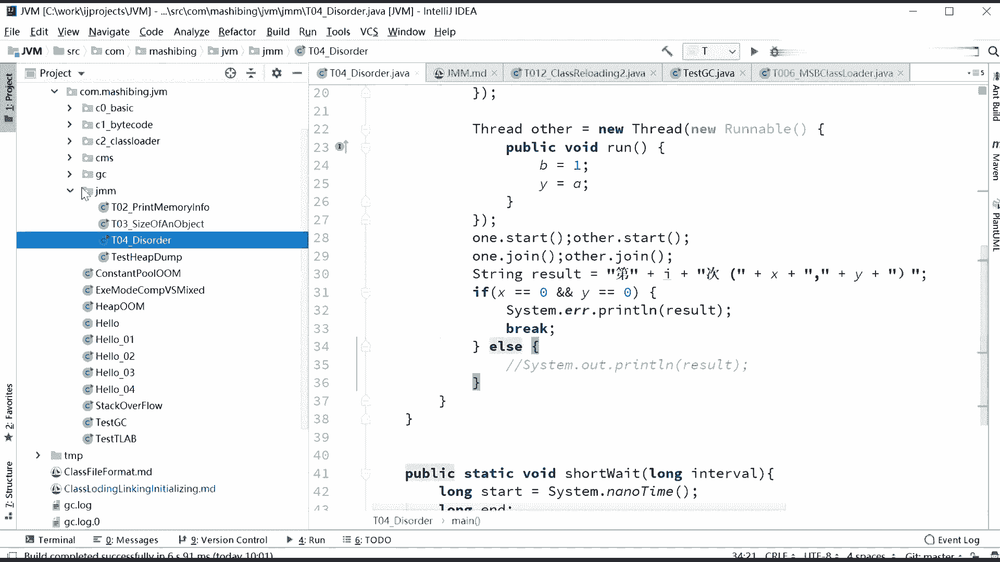
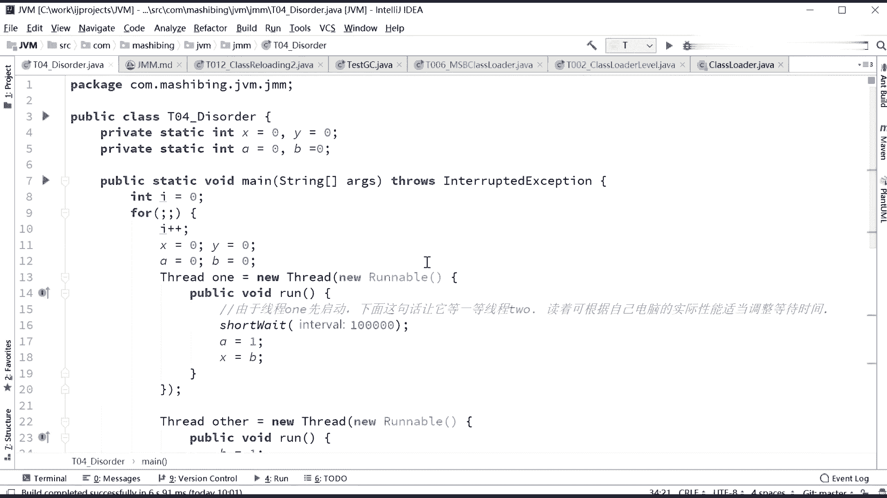
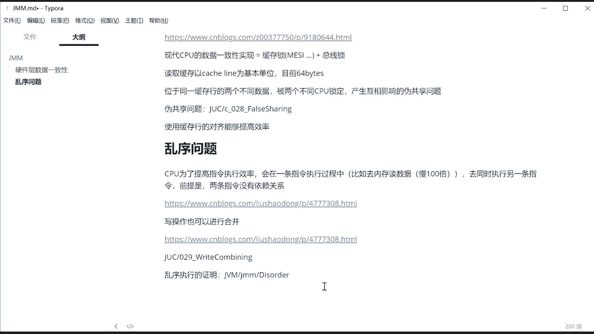
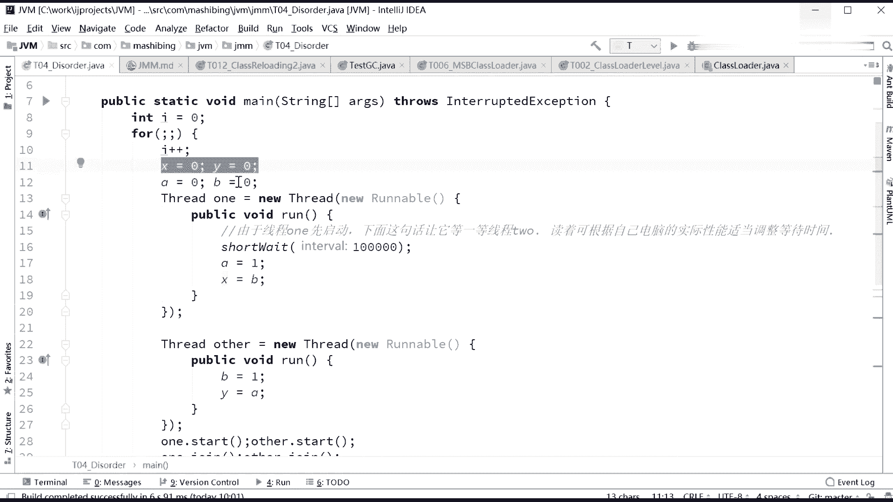
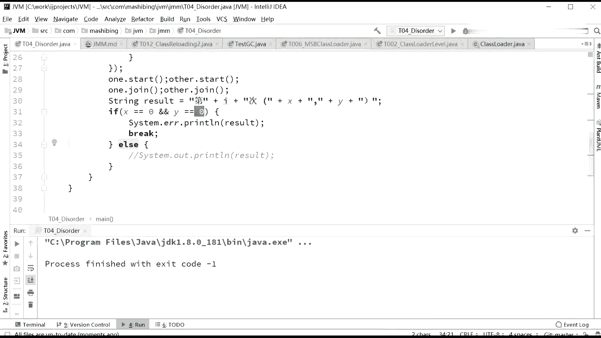
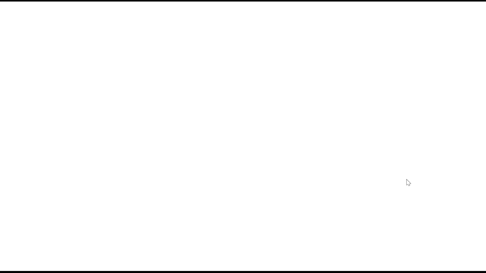
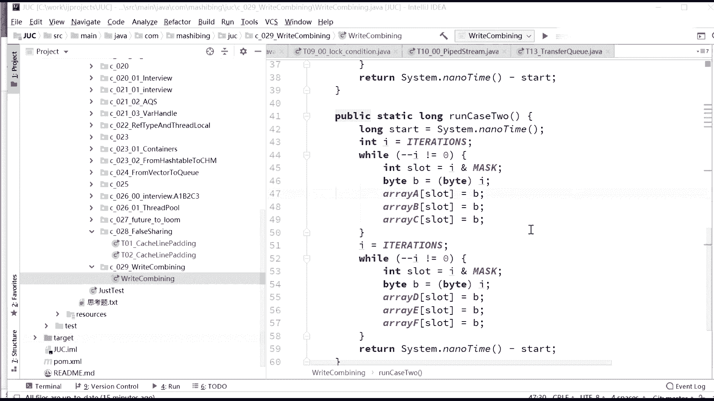

# 系列 3：P131：【JVM】乱序证明 - 马士兵_马小雨 - BV1zh411H79h

之外，你其他的都解释不了，为什么会产生这种情况啊。好。我们继续啊我们继续，我们这事儿还没完。我告诉你，还有一个特别恶心的实验还没完。我们来看这个实验。就是说我说这个东西是乱序执行的。你怎么才能证明呢？

好，认真听。我说这个论这个东西啊是乱序执行的。两个指令。互相之间它的顺序有可能是不一样的，有可能下面后写的这个指令先执行。那好。你怎么才能证明这一点呢？还有一个比较恶心的实验。

这个这个实验呢叫做disorder啊，GMM下面的disorder点是阿va。好，看这里。看这个小程序，这个小程序是美团的人写的啊。

不知道在座的有没有美美团的。这个呢我记得了GMM。这个下面啊。

Disorder。啊，这个dor的话就更讨厌了。

呃，桃子以前是美团的是吧嗯。好，这是合并写技术。我们说乱序执行的证明，怎么才能证明这一点？JVM下面的JMM下面的diorder这个程序。

嗯。😊，美团骑士。😊，😀，大家比较逗啊。😊，啊，不要闹啊，来看这里啊，大家看这里啊。呃，现在呢我们有两条也有dior有两条指令啊，你看这里呃int X等于0Y等于0，然后A等于0B等于0。呃。

然后用一个for循环死循环啊死循环。就是一直不停的加，然后看这里啊下面执行了4条指令，这4条指令叫做S等于Y等于0A等于B等0，这就除复属日值啊，不不不管了。呃，大家看这个啊，第一个县程。

第一个县程干了一件这么事，干了一件这样一件事，A等1X等B。

你仔细读第二线程干了一件什么呢？B等于Y等A。那么一般的情况下，我们要打印最后的X值Y值A呃A值B值要打印这个值的话啊，打印X值Y值的话，我们来分析一下。嗯，X等B，然后这里呢写的是B等1。那么Y等A。

这里写的是A等于1。好，假如。对。假如嗯。先让二先执行啊，先让这个来执行。首先执行B等一。你看啊，由于第一个呃县程呢等待了一段时间，呃，所以呢第二个线程先执行。那么由第二个线程先执行的时候呢。

它会先执行B等于一。然后呢。后面会执行的这个这个内容呢，应该是Y等于A。Y等于A，但这时候A有可能等于0是吧？A也有可能第一个线程执行完了，A有可能也有可能等于一。所以这个Y的值呢有可能是0啊。

也有可能是一。嗯。然后X就会变成几呢？呃，只要你设置成为B等于一之后。那么X等于B，那么X的值呢。我们给大家解释一下这个问题啊。好，我这么说吧，这么说啊，认真看呃，X等于B，那么B呢有可能是等于一的。

X等于B，有可能B是等于零的是吧？所以X呃这个这个X值呢有可能是0和1Y值呢也有可能是0和1。那么现在呢就会发生这样一种情况。呃，假如呢。假如这两个值啊，就这你们我们来分析一下这两句话。

就是A等于一和X等于B这两句话，他们之间呢有没有依赖关系？A等于一和X等于B有没有依赖关系啊？同学们，你们分析一下。A等于一。X等于B。是没有依赖关系的。假如说这两句话是顺序执行的。

这两句话呢也是顺序执行的。那么现在呢应该是只有什么情况呢？我们来分析一下啊。那么A等于一。也就是Y等于A。A等于一X等BB等于1Y等于A这这几句话呢，这两句话顺序执行，这两句话顺序执行。

互相之间不会换顺序的话。那么应该就只有这么几种组合，XY就只有这么几种合，0110和11。是不会产生00这种组合的啊。是吧，同学们，我们来仔细问一下啊。嗯。呃，为什么会不会产生啊？

因为你比如说你X等于B已经已经执行了这句话的话，那表示A等于一肯定执行了。对吧，同学们。那么如果I等于Y等于A，这就这句话执行完了，表示B等于一肯定执行了。所以呢在这种情况下是不会产生00种组合。

只有可能会产生011011这种组合就是X和Y的值。好，我讲到这里呃，不知道大家呃能不能理解这个问题啊。啊，我再说一遍啊我再说一遍，我们现在有一个假设的情况，就是假设什么呢？

假设A等于一X等B这两句话一定是顺序执行，不会乱序。B等于一Y等于A这两句话也会顺序执行，不会乱序。那么最后X和Y的结果呢。如果这句话执行了，表示B等于一一定执行了。如果这句话执行了。

表示A等于一一定执行了。那么所以X和Y最后的结果一定是01。1011的组合。绝对不可能是00的组合。因为A等于一和B等于一，其中有一句必定先执行了。我这么说，大家能理解吧。对，只要没发生重排。

没发生重排。就会有这种情况。所以只要我们能证明，其中有一次要是出现了00这种情况，就说明一定发生了重排。好。这个程序我告诉你啊，我运行了多长时间呢？N长N长N长时间才发生了00的情况。

但是确实证明是发生了的。呃，我估计我在这跑，咱们回家吃饭去，好吧。你可能半天你也等不来玲0那个情况。我给大家看中间我执行过的一次的结果就行了，好吧。

好，一共执行了是2728842次之后，终于出现了一次00的情。啊。这是我中间执行过的一次的结果，给大家截图截出来。所以这个程序你们拿回去自己跑，你们可你们在你机器上没准跑着跑着跑个跑跑很很短就能看见。

但是很长的话，你就吃饭得吃完饭回来之后。等着有问题就行了啊，吃完饭回来之后。看结果就OK了哈。好，所以说乱乱续这件事呢是呃被美团的工程师呢是证明过的啊，确实乱续执行。但是乱序这件事是会产生问题的。同学。

咱们说。我我我我我我我们说java里面这个volattilevolat。

他是要保证不能乱续执行的，对不对？在有些值的情况下，我必须得保证我不能先往里写，得先读才行。有些情况下呢，我必须先读，不能先写才。

