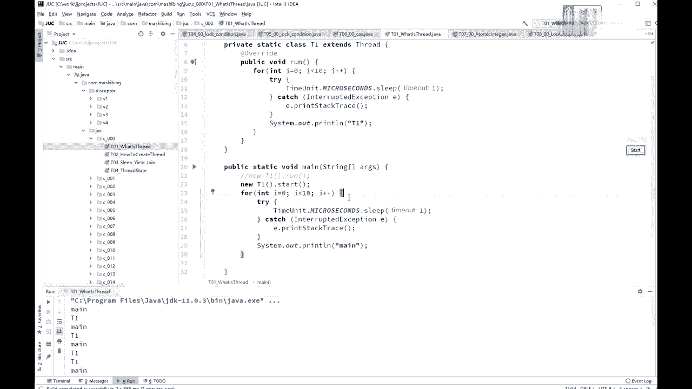
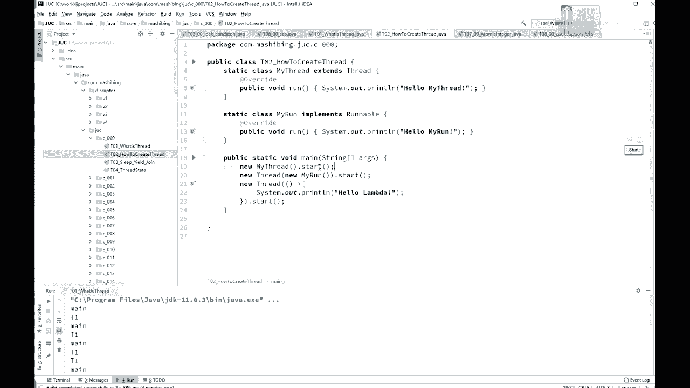
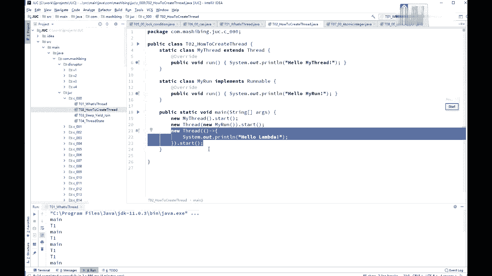
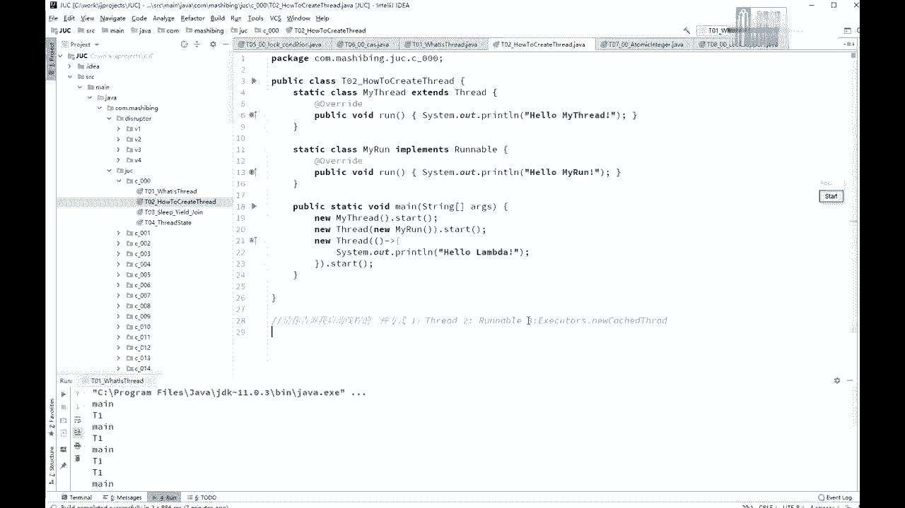

# 系列 3：P14：【多线程与高并发】线程的启动方式 - 马士兵_马小雨 - BV1zh411H79h

很多时候呢我们呃作为真正使用这些概念的人啊，不需要把概念说用特别文绉绉的方式表述表述出来，因为编程呢是一个工程学科，你能理解，能用通俗的语言表示出来就很不错就可以了啊。

这是县城的一个基本的概念，我们来看这个线程的怎么样来创建一个线程，怎么样来运行一个线程，创建一个线程的两种方式啊，这个我在原来老的课程里头也讲过，在这儿呢也是带大家复习创建线程的两种方式。

第一种呢是从thread类继承，class my thread extends，thread，thread类继承，第二种呢是你spa继承之后重写run方法好，第二种呢是你定义一个类去实现rable接口。

依然重写run方法，但是如果你用第二种想让这个线程运行起来的时候，必须new thread，然后呢把我的实现random接口的这个类的对象传进来，然后再调用start，如果你是从three类继承的。

那么你直接调用start就可以，需要注意的是，一定是调用start。

而不是调用run，那还有第三种，其实第三种呢也是第二种的一种变形，jdk 8之后呢有一个lab的表达式。

第三种就是使用lambda表达式的方式，new thread括号箭头，然后呃里边怎么写是吧，system out print line，hello，lambda，给大家20秒钟时间看着小程序能不能看懂。

有没有什么地方有疑问的，因为我默认呢你是了解过县城这个概念的哈，好那么在这呢我突然想起当面试题了，我突然想起来了呃，有的我记得有一个同学出去面试的时候被问到过，说呃请你告诉我启动线程的三种方式。

而且你告诉我几种技能的三种方式呃，需要大家注意的是呢，这三种方式并不是这三种，而是说第一种是从thre继承，第二种实现rable接口好，第三种是什么呢，第三种呢是通过线程池来启动啊。

a a a a a execute a，通过这个new catch，thread，you catch the thread啊，然后拿到一个线程池之后，然后再去通过线程池来启动一个线程。

这是他想要的第三种，但其实在这个线程池里头起线程的时候也是用的这两种之一，呃因此呢他说用三种方式来启动，有点儿有点儿吹毛求疵的意思，所以你知道理解这个意思就行了，如果有人问你这方面的东西。

你说你说第一个thread，第二个rable，这肯定没问题好，那第三个呢你要说la表达式，如果他不满意不满意，你就告诉他啊。

