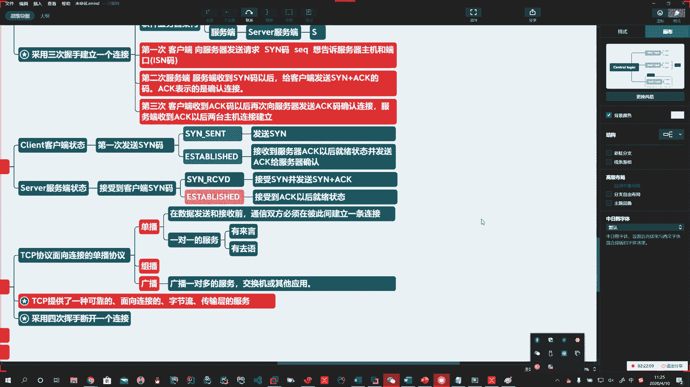
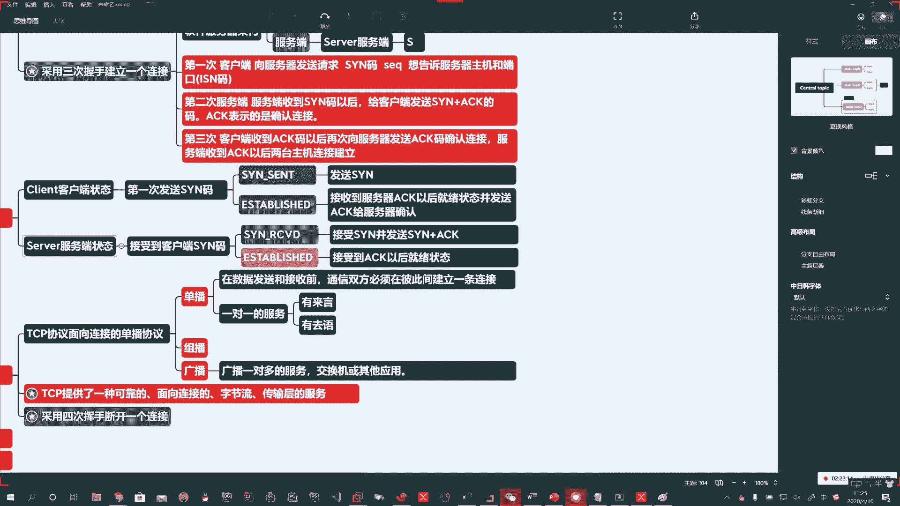
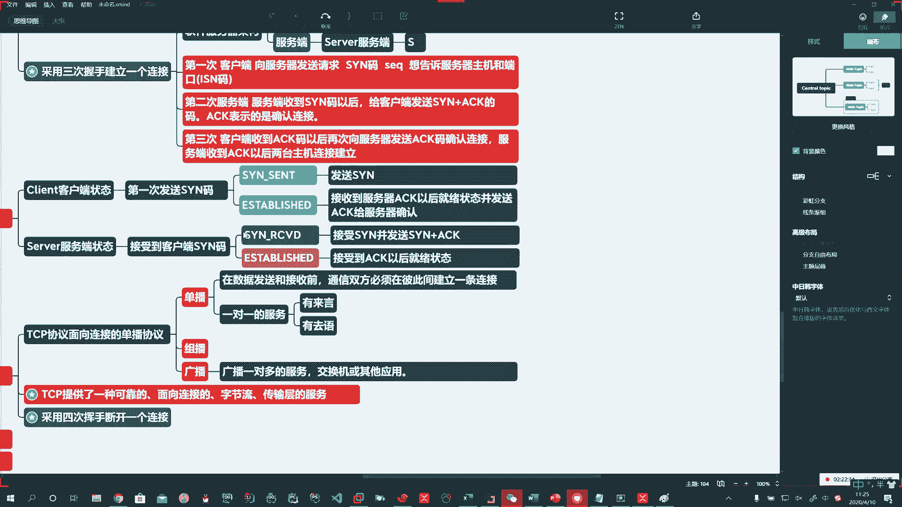
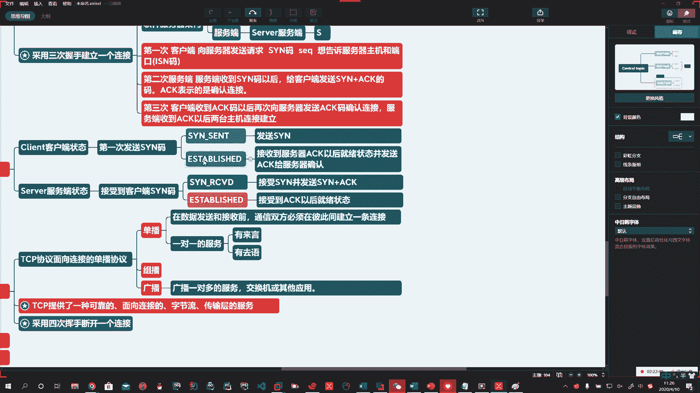
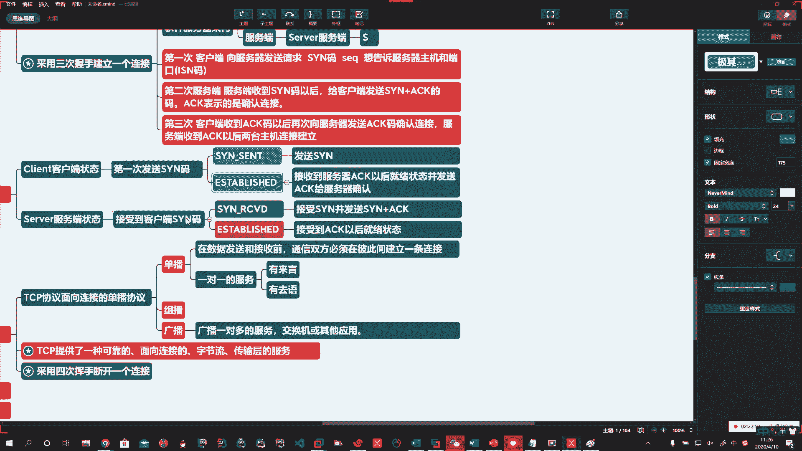
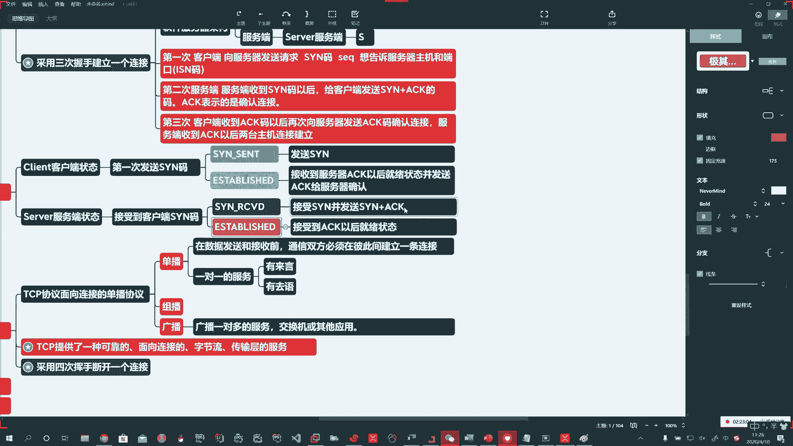

# 系列 3：P154：【Linux】TCP连接状态转换2 - 马士兵_马小雨 - BV1zh411H79h

🤧录啊，今天怎么回事？

客户端的状态和服务器端的状态啊，4个在这儿大家记住。

那么第一次呢在客户端发送SY码的时候，它就处于SYNcent这样的一个状态啊，发送SYN。然后发送SYN码以后，服务器端收到了SYN码，它就处于SYN receiveive的状态啊。

后边给你备注了，哎，然后他接收到了，他就向客户端发送SYN加ACK。那么客户端收到了以后啊，就处于asbel就是就绪这个状态。

啊，然后他在这个阶段再发送1个ACK给服务器端，服务器端收到了以后也处于就绪状态啊。

然后就可以开心的玩耍了，可以传信息了。