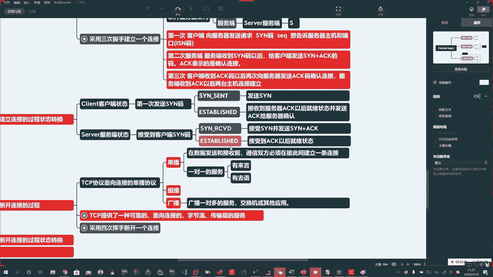
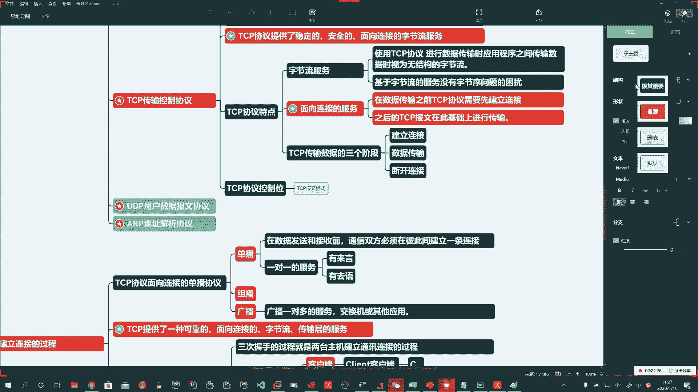
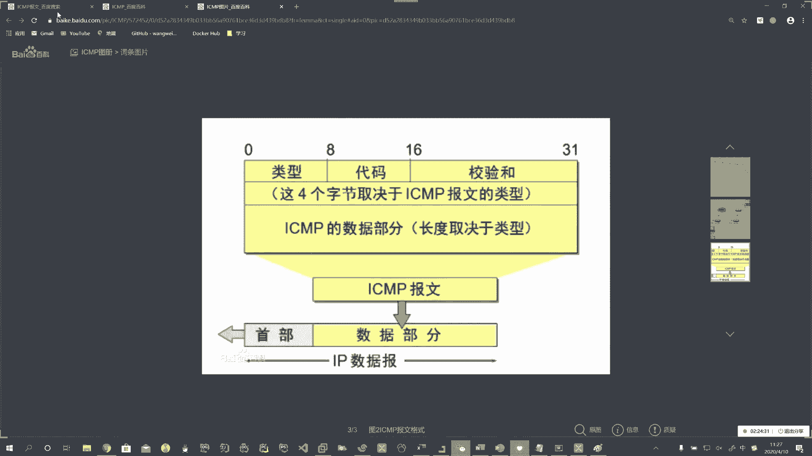
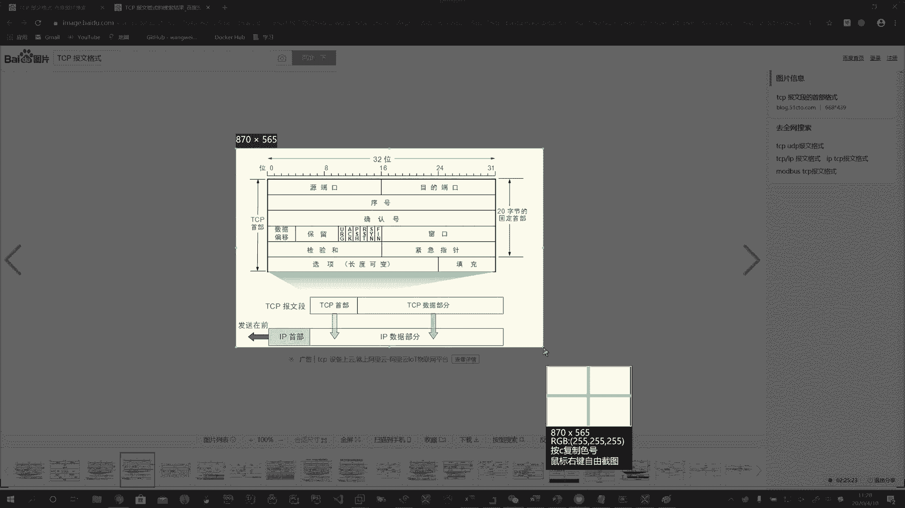
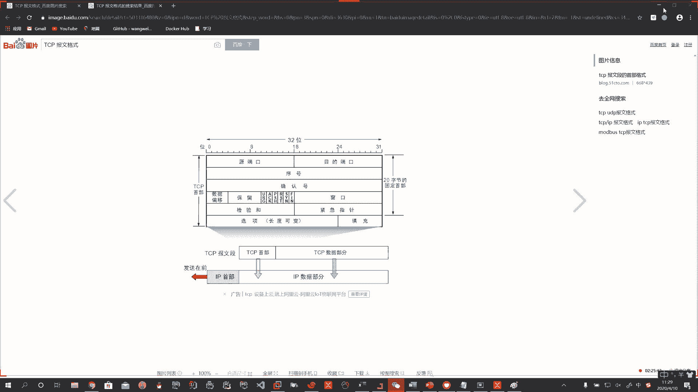
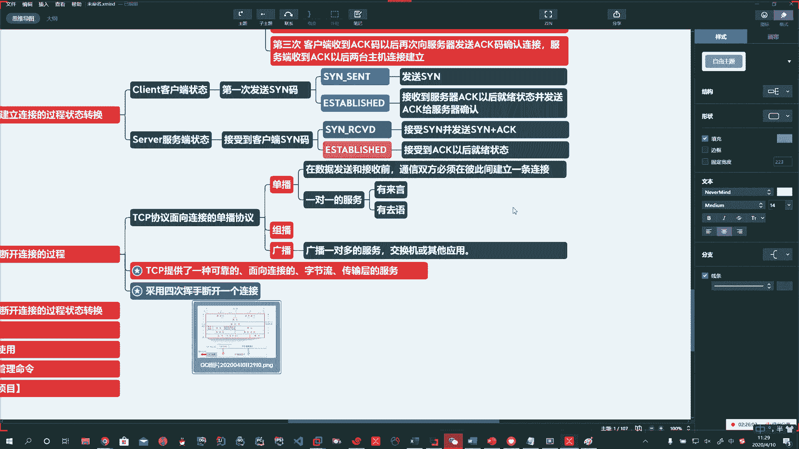
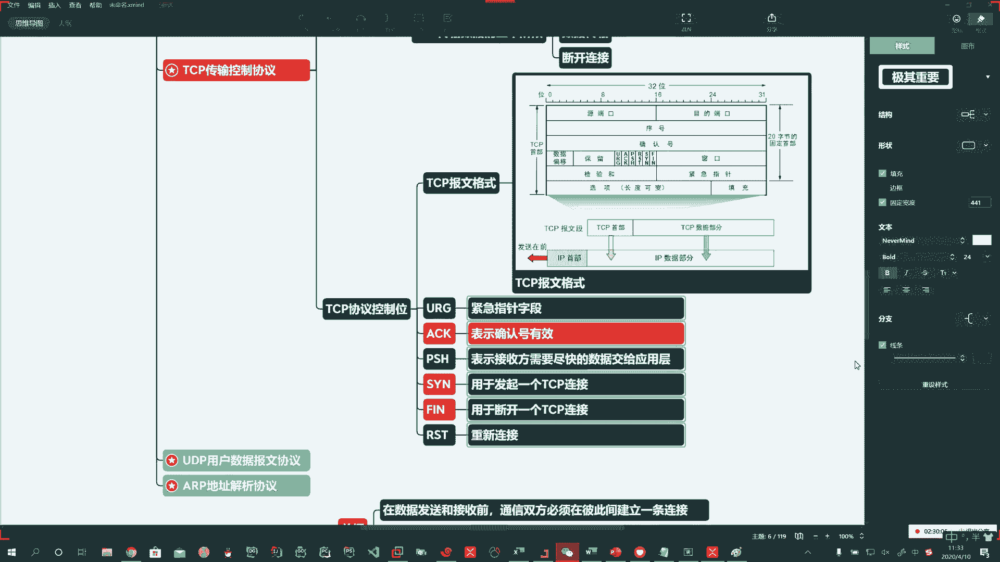
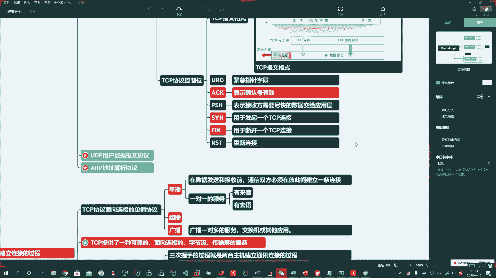
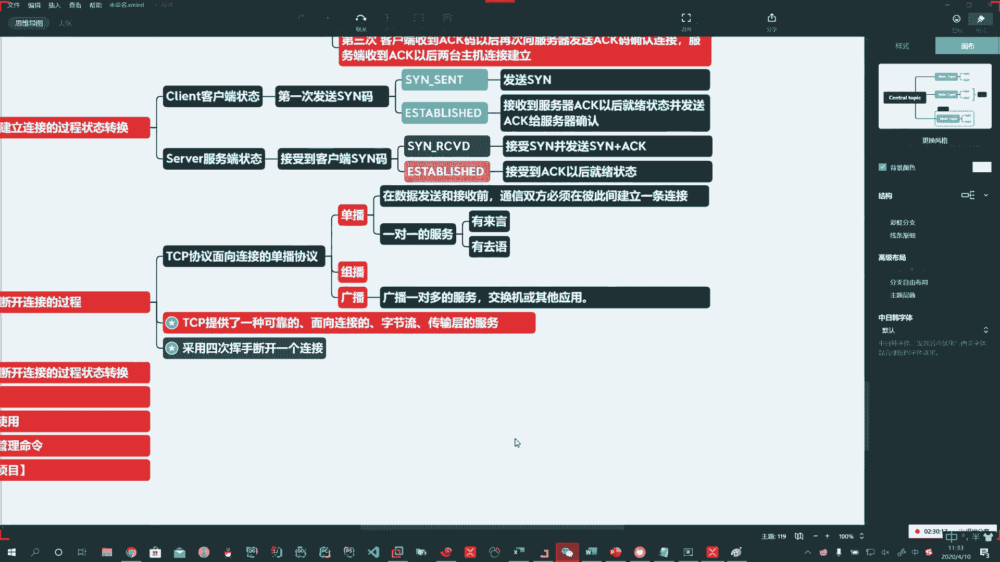

# 系列 3：P155：【Linux】TCP报文格式和重要字段 - 马士兵_马小雨 - BV1zh411H79h

啊，这个重要。好，那么有SYN了，有ACK了，那么我们就得在这个协议中啊再给大家说的说的，那么就是。

TCP。啊。我们叫传输控制协议，我简称协议。啊，这里头叫控制位。控制位。好，那么控制位是什么？控制位是它豹文格式。豹文格式里的内容。

。

🤧嗯嗯。Oh。Oh。呃。哎，没有图吗？Okay。By。

Okay。好啊，我给你找一图。嗯。好啊，豹文格式啊，也就给你放上来啊。

Okay。报文呢这个不做重点掌握，但是豹文格式里头有一些字段，就像刚才咱说的SYN啊ACK啊，它都是啥意思啊，会在这里头可能会对你。

。

理解这个报文格式啊，就是这个关键的字字段啊有帮助。

。Okay。🤧好。这里头就会有确认号，你看这里头有ACK什么什么的啊，就是在这个报文格式里头有。那么常见的这个控制位，这个报文格式有哪些呢啊？啊，有URG啊URG咱们解释一下。URG呢就是紧急指针字段。

啊。了解。啊，ACK字段掌握。ACK字段是什么意思呀？表示确认号有效。啊，ACK的表示确认号有效。Okay。对。🤧掌握该字段啊。PSH。Okay。SYN。啊，FIN。RST是吧？🤧嗯嗯。

SYN码记住FIN码记住。其他均了解。啊。标红的是重点啊。🤧SY。刚才已经白活了半天了啊。用于。发起1个TCP链接。啊，FIN。用于断开。啊，断开。一个TCP。链接。Oh。好。

这些字段记这仨PSH说一嘴，PSH表示接收方需要尽快的将这个数据交给应用层。啊。But。不做重点掌握啊，仅了解。RST啊RST。重新链接。🤧嗯嗯嗯。Oh。

好，该了解的啊，该掌握的给你说了，这三个即可啊，状态也说了。那现在呢我们看看断开连接的过程。

