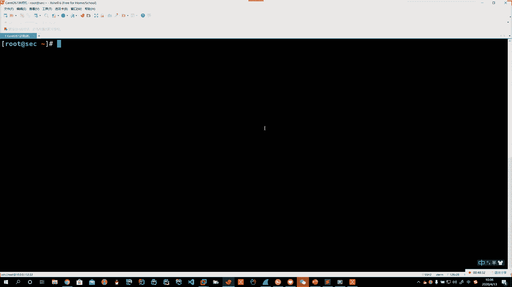
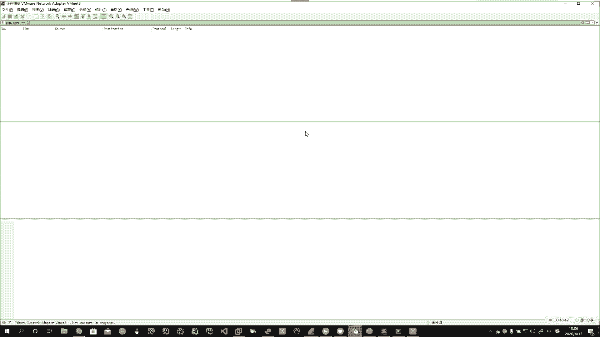
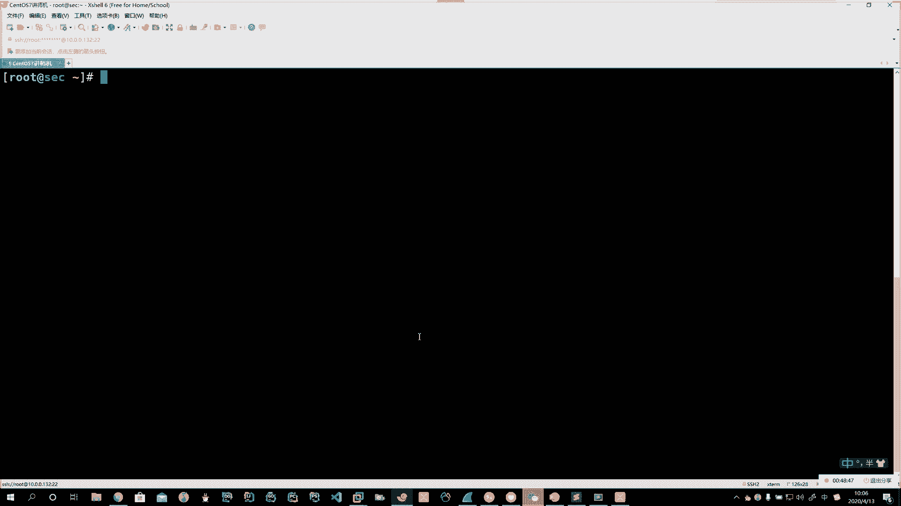
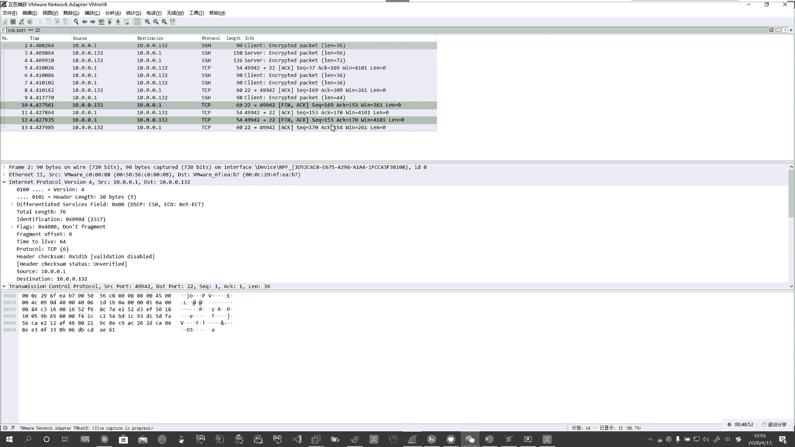
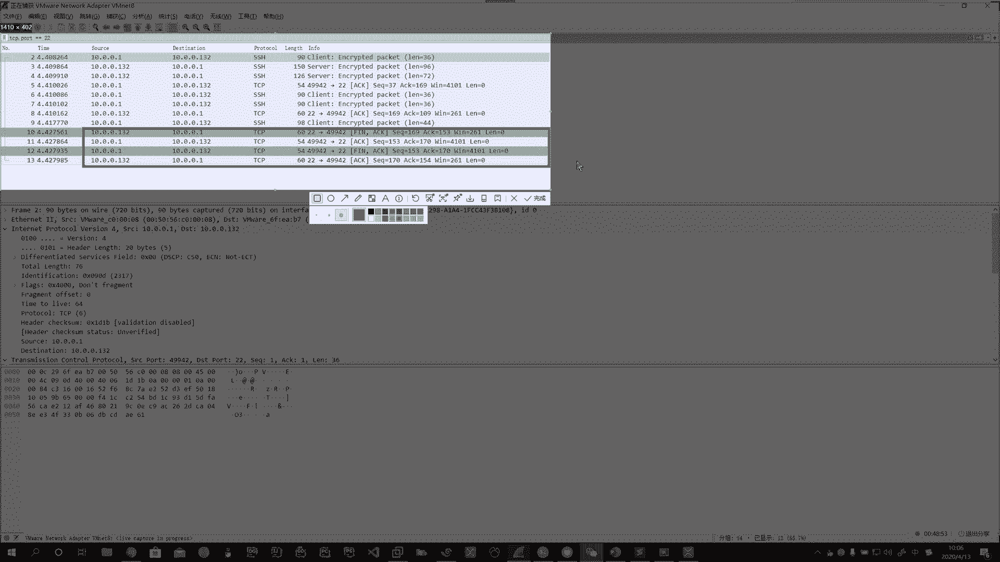
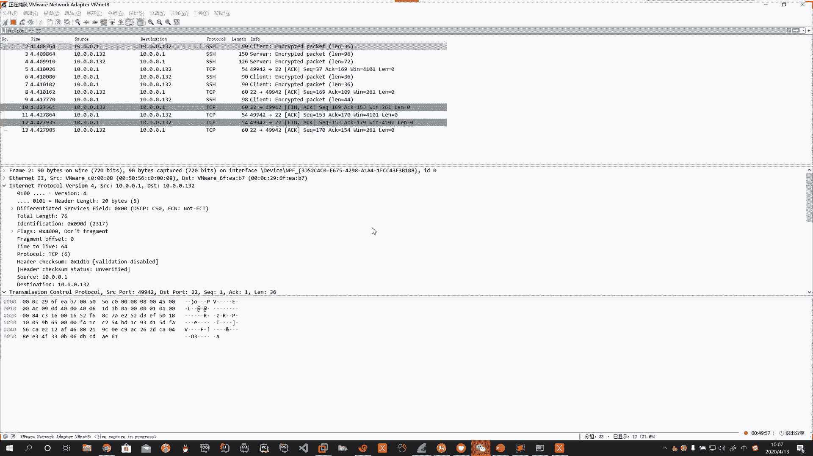
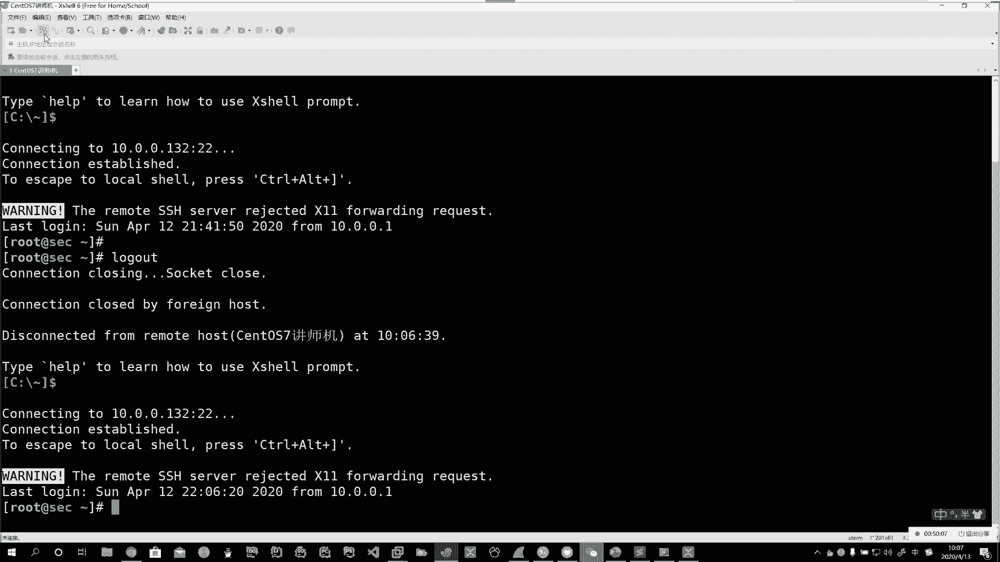
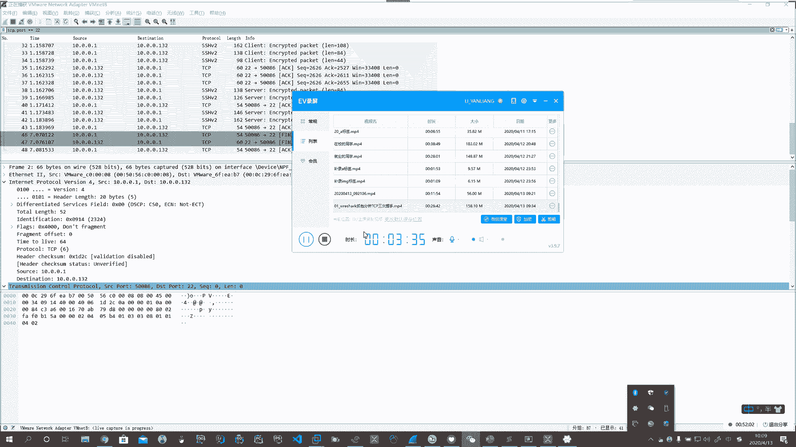

# 系列 3：P160：【Linux】4四挥手抓包分析 - 马士兵_马小雨 - BV1zh411H79h

。Yeah。没录上是吧啊，视频我补一下啊。

嗯。は。好，怎么抓啊，断开链接，那么到你的叉 shell里的ctrorl D。

断开连接。win shaer这边就抓到了。

Oh。어。那么这部分。就是。就是我们收到的啊断开链接的这么样的一个过程。Oh。Okay。

好，这里头要注意啊。🤧。🤧嗯嗯。Oh。Okay。Oh。

Yeah。Yeah。Yeah。好，你还可以干嘛呢？你还可以直接点这叉子它断开。

啊，叉子他也断开。🤧。好，这个是我们刚才说的啊，你如何去抓这个数据分班啊。🤧好，看看大家有没有问题能不能抓到这个包啊。🤧Yeah。Oh。Okay。Yeah。Okay。Okay。🤧。Yeah。Oh。

Yeah。啊，感谢啊，快挂了。Okay。Oh。

