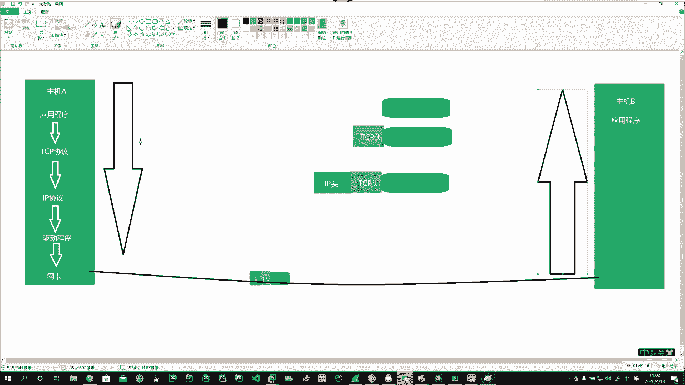
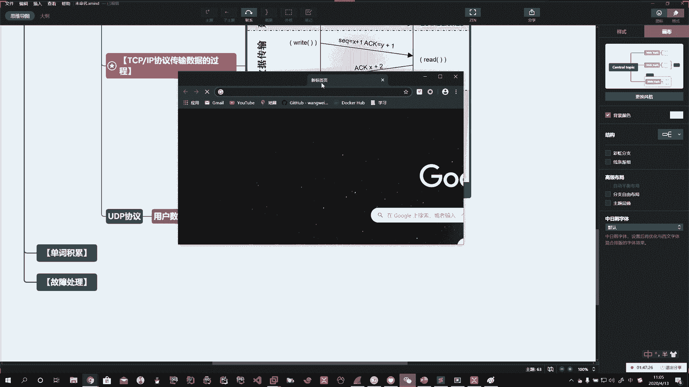
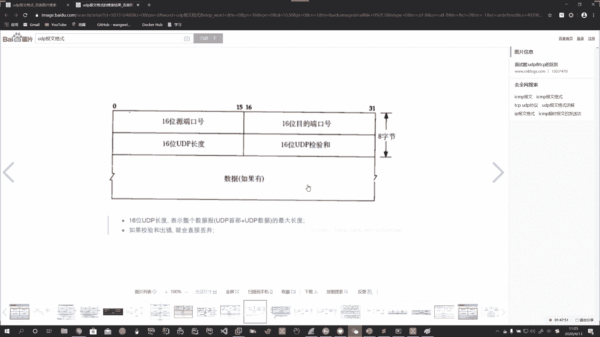
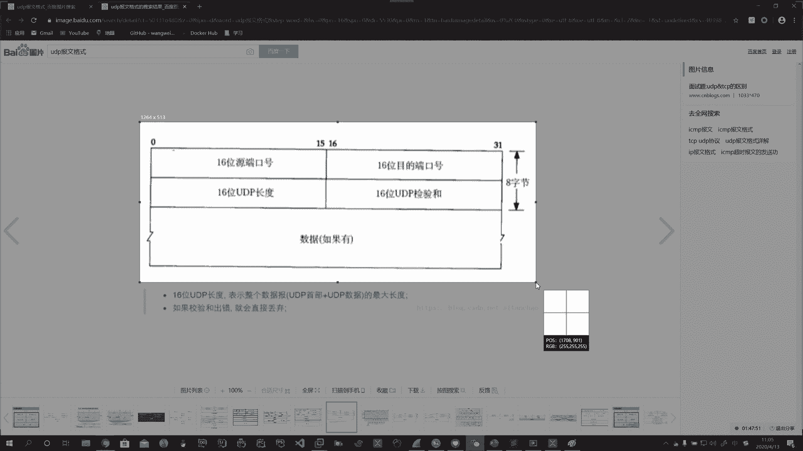
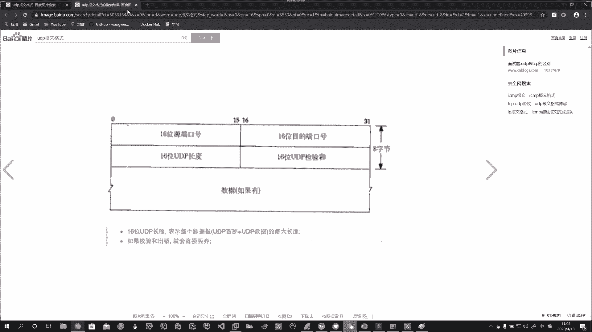
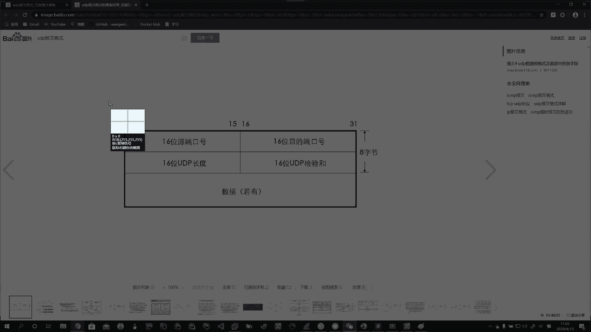
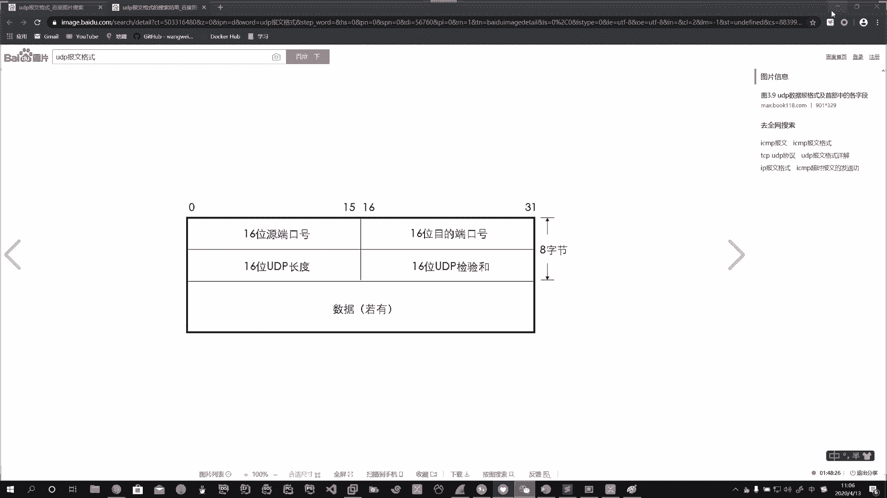
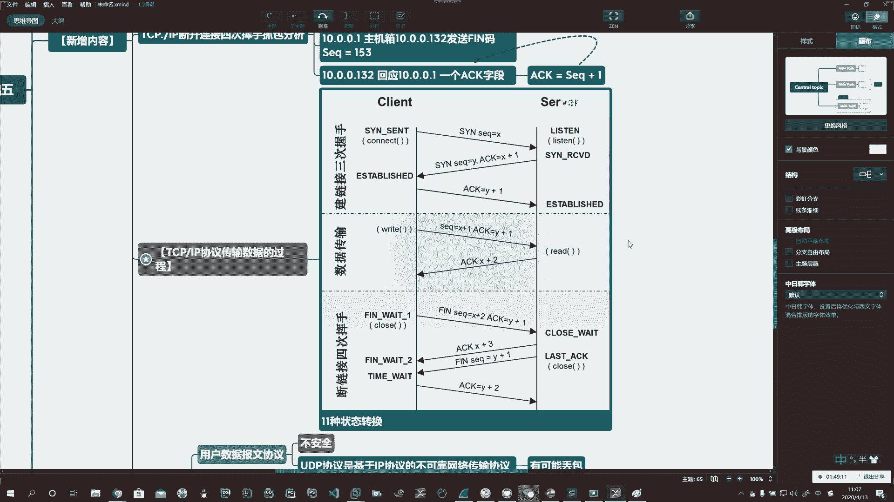

# 系列 3：P164：【Linux】UDP协议介绍 - 马士兵_马小雨 - BV1zh411H79h

这么发的。啊，A是这么发的。那拿到B以后，这主机拿到你这个信息以后，他再一层一层的把这个包反过程，一层一层再解出来。啊，这两个其实是一样的啊，这个过程咱们简单的说一下。

好啊，那么TCP协议咱就说到这儿啊，那么剩下的协议呢，UDP协议。UDP协议呢在我们平时使用的过程中也有。啊，也有。那么TCP协议我们说是安全的协议。啊，那么UDP协议呢，我们通常在用户传输数据的时候。

传文件的时候可以开很多。所以呢它是用户数据报文协议。啊，用户数据的报文协议。需要你记的就是仨字儿。不安全。Yeah。啊，面试的时候面试官就等你说这仨字儿。不安全。啊。就行了。那么如果我们写全了以后。

它就是什么呢？就是UDP协议是基于谁的呢？哎，基于IP协议的。啊，基于IP协议的。不可靠。不可靠。网络。传输协议。为啥不可靠？有可能丢包。啊，有可能丢包了。

但是它的特点就是哎我可以建立多个啊建立多个链接。啊，建立多个链接。通常在我们一般的有时候比如说你用局域网传文件，比如飞Q啊、飞歌啊，对吧？哎，传输文件的时候可以这样啊，这样呢能够加快你传输的速度。Oh。

所以我们也简单的啊。给你弄张图。看一下它的封包格式，但不做重点掌握。

就记住不安全仨字儿就行了。Yeah。比较简单啊。

这底下有字儿啊。

。

Okay。

好啊，UDP这个报文。了解即可，不做重点掌握。

。TheYeah。好。啊。Oh。Oh。好啊，那UDP型。

