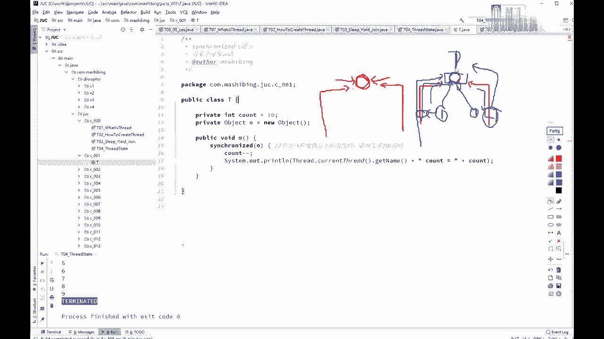
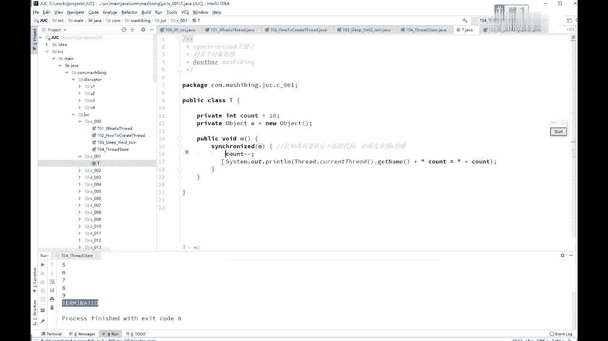
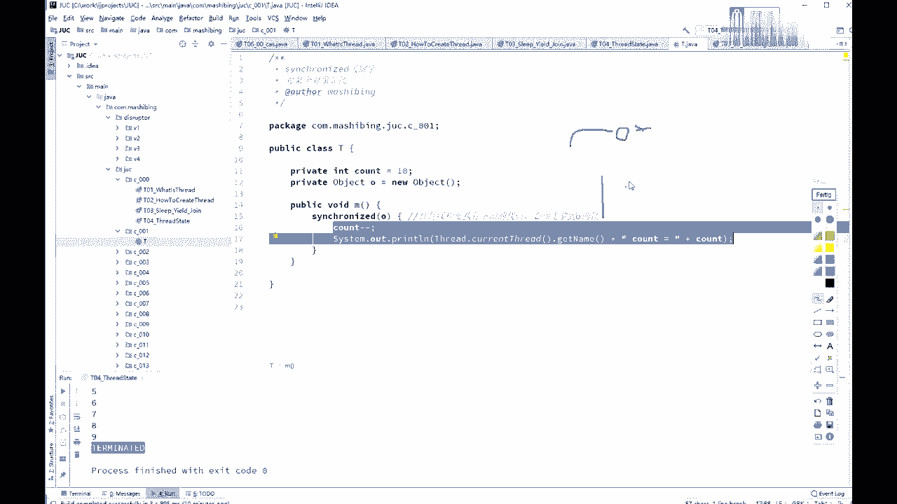
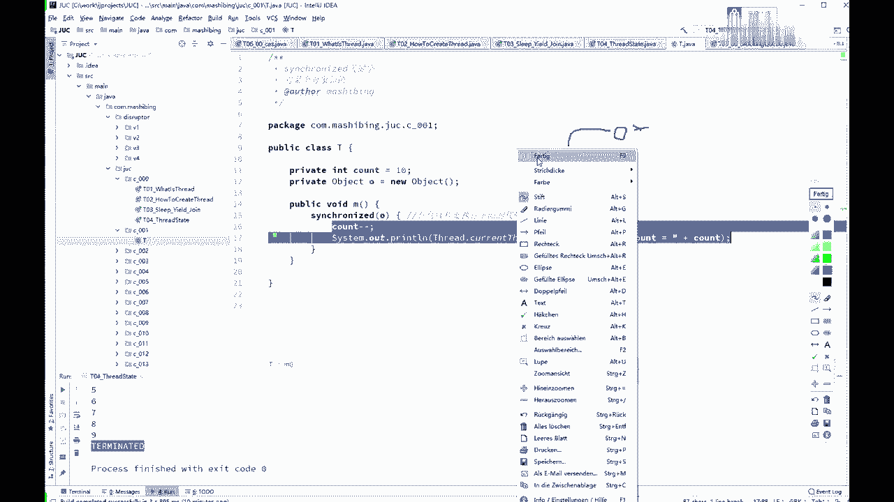
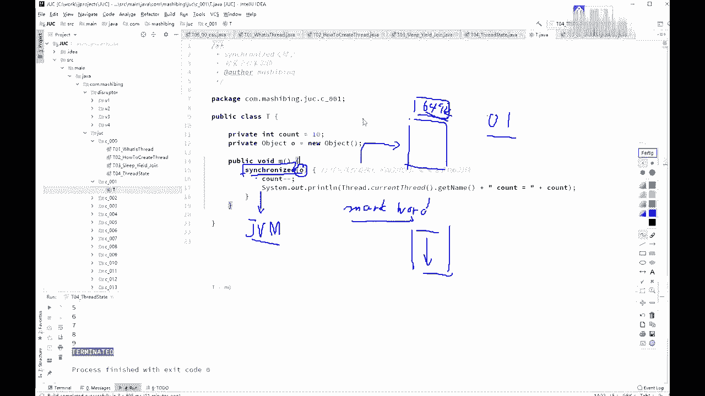
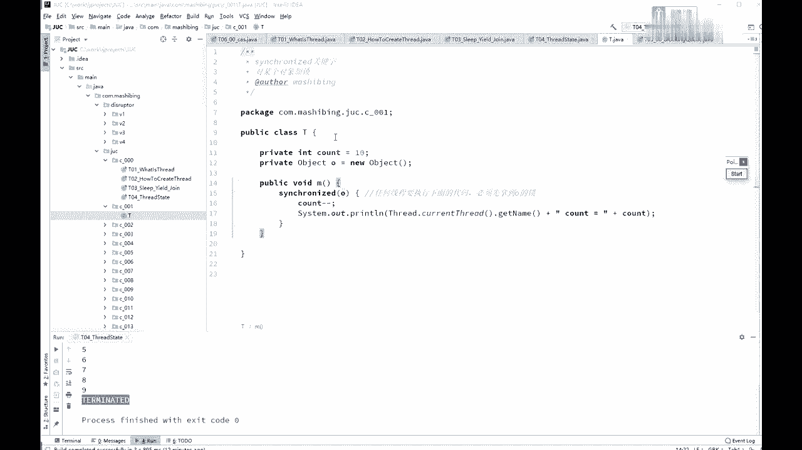

# 系列 3：P17：【多线程与高并发】锁的概念 - 马士兵_马小雨 - BV1zh411H79h

下面呢我们来开始讲这个siri关键字，新的两个新出的关键字呢，估计不少同学也是那个耳熟能详了，不过呢作为复习还是要复习一下，好吧好，第一个呢是多个县城去访问同一个资源的时候，需要对这个资源上锁好。

为什么要上锁这个概念，有没有同学不能理解的啊，为什么要上锁，必须得上锁，这是一马桶，很多县城过来去访问，必须得等一个线程执行完了，另外一个县城才能执行啊，不然的话呢不然的话你自己去想象是吧，嗯o。

就是访问某一段代码或者某一个临界资源临界区的时候啊，这个时候呢是需要有一把锁的概念在这儿的，这个锁的概念呢，我估计有的同学可能又会跑个问题，没关系啊，咱们使劲儿问啊。

我看看我哪哪有问题没给大家准备到位了，什么意思呢，为什么要上锁呢，其实关于为什么要上锁这个概念估计多少同学也是知道的啊，就举一个最简单的例子呢，我们用一个对一个数字来做递增啊，这个数字最开始是零。

两个程序对它一块来做递增，这个递增的就是把这个零的往上加一了，第一个线程如果两个线程共同访问的时候，第一个线程一读它是零，然后把它加一在在这自己这个县城里面的内部内存里面算算算算啊，零比加个一变成几啊。

变成一，然后这个一还没有写回去的时候，另外一个线程来了一堆还是零，读到自己的内存里面加了个一，变成一了，好第一个线程把这一写回去了，第二个线程又把这一切回去了，本来正常加了两次。

结果呢你最后的结果只得到了一个一，所以在对这个线程对这个数字进行递增的过程中，必须得上把锁上班所怎么上呢，就是说我这个线程在对这个数字进行访问的时候是独占的，不允许别的线程来访问。

关于别的线程来对它进行计算，我必须得给他加完这个一之后，下面这个线程才能过去，拿到这个一之后继续加。

ok但是在这儿呢有一个特别特别容易让人，有一个误区吧，应该说而且呢很多的很多的文章里头，还有很多老师讲的时候啊，他就一带而过，我在这儿呢，我把这个think的，synchronized啊，给大家画个图。

这个sim到底think的是什么，呃我拿我刚才说的这个概念，就这儿有一个数字一，然后呢两个线程去访问它，那么有有的老师呢就会聊说那个这个呀就是这是第一个线程啊，呃这是第二个线程。

有老师就会聊说这个呢就是把把把这个进行锁定，把它进行锁定，听我说啊，把它进行锁定，这件事是不对的，是我们是有一把锁在这儿呢，是有一把锁的，挖一下看能不能画出来诶，a这也太不像锁了，这个壶好吧。

我不管了好，我们其实是有一把锁的，听我说，但是这把就是说我我我任何的现场去访问这个对象的时候，或者说去访问这个数字的时候，是必须得看这把锁是不是属于我，是不是有我战友，如果有我占有，我才去对它进行操作。

如果不由我占有，不再进行操作，而这把锁在内部底层上是怎么实现的呢，有的老师会说啊，直接就把这个数字进行锁定，千万别这么弹，实际上在本质上它并不是对这个数字进行锁定的，他对谁进行锁定的呢。

你可以任意指定对谁进行锁定，你想锁谁就锁谁，看这里，我的第一个小程序是这么写的，count等十，然后让count减减好，如果说你想上了把锁之后才允许对count减减进行访问。

比如说我得上把锁才允许执行下面这段代码，那这个时候是怎么做呢，你可以new一个object，object o等于new一个object，然后写synchronized的o。

这意思就是说对这个count进行访问的时候，我得去看o这把锁，所以这里锁锁的是谁，锁的是，但是我们平时也说锁定了一段代码，锁定一段代码的意思是说当我拿到这把锁之后才能执行这段代码。

所以要说的比较细致，比较到位的话，应该是这里有一把锁，这个锁是谁呢，是o o这个对象，但是拿到手表锁之后能干嘛呢。

能执行这段代码。

如果说讲的更加底层一点，我原来讲过一堂公开课，这堂公开课呢叫hash code与mark word，好在那些公开课里面我讲过这个syronized的底层是怎么实现的呢。

其实sironized的呢在底层的实现没有任何要求，就是java虚拟机规范里头没有规范说synchronized你必须得给我怎么实现，不是他没有任何要求，反正最后的结果不论你怎么实现呢。

你只要说必须得加入列表锁之后才能执行下面这个代码就ok了，那么hob实现呢，hob是在一个对象的头上面，这是我们new在堆里面的一个对象，这个对象的头上面，这个对象头呢是64位。

这个头上面呢有拿出两位来来记录着这个对象是不是被锁定了，是这个它是这么来实现的啊，这个呢叫mark word，感兴趣同学去找一下，看他怎么实现的，它是有两位啊，两位来实现。

这两位的组合呢分别是不同的锁的类型，好这是他的具体的底层实现，但是呢是需要拿到这把锁之后才去看a下面这段代码我能不能运行，所以锁定是锁定的某个对象，不管是哪个对象，你锁定它就行了，那么新时代这把锁呢。

呃而且它会有一个所升级的概念。

